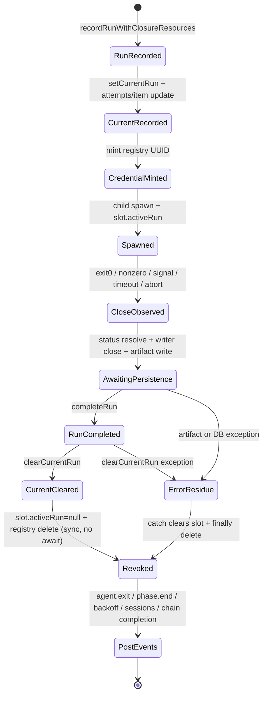
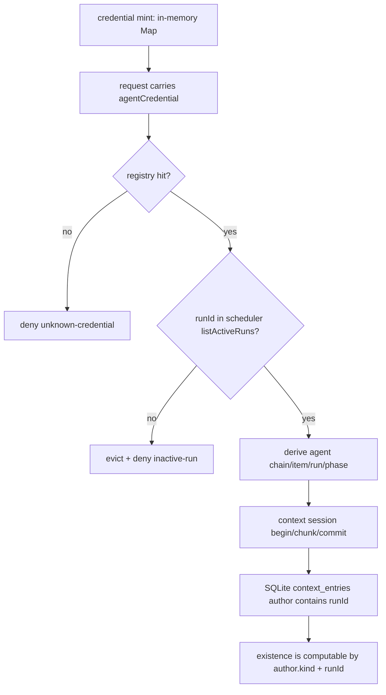

# RFC #545 R7 D-07：tool outcome、run finalize、credential revoke 与 trigger/validator lifecycle

基线：`main@699842eba2eefc242d19f8fa9232bc1d9d5c3bdd`（2026-07-31 复核）。本报告只提供 K2/K3 的事实输入；不裁决归属、不提出方案、不把不存在的 evaluator 当资产。

## A. 主 agent 摘要

### A1. 一页结论

1. **真实执行体只统一了两类：普通 non-trigger phase 与 item-trigger phase。** 两者均由 `spawnSchedulerRun → attachRunCloseHandler` 产生 durable `runs`、`active_runs`、内存 slot、run credential，且共用自然退出、非零退出、timeout/kill、显式 terminate 和 preparation-abort 的 close handler。item-trigger 的关键分叉不是收尾代码，而是 attempt 记账：只有 `phase === firstPhase && fresh` 才在 spawn 时 `attempts + 1`；item-trigger 本身不加 attempt，却能在非零退出时增加 backoff failureCount。attempt exhaustion 因此按 item attempt 预算而非“每次 item-trigger run”计数。
2. **chain-complete trigger 是另一套生命周期。** `runPresetChainCompleteTriggerPhases` 直接 `runAgent`，没有 scheduler run row、`active_runs`、credential、统一 close handler、attempt/backoff/exhausted；exit nonzero 或缺 `FINALIZER SUMMARY` 直接 throw，`keep-active`/`complete` 来自 stdout parser。当前 validator 只存在于 task-tree join binding/evaluation 数据；没有 validator runner lifecycle。故真实统一集合是 `{普通,item-trigger}`，不是 `{普通,item-trigger,chain-trigger,validator}`。
3. **当前没有 tool declaration、tool outcome evaluator、verdict 或 outcome event。** “同 author/run 是否存在 context entry”可由已提交 row 的 `author.kind/runId` 算出，但没有专用 existence API/index/evaluator。因而当前不能观察“required 已判成功/失败后 outcome 被改变”的产品行为；能确定的是未来判定所依赖的事实窗口目前不闭合。
4. **child close 后，退出码、当前 item status 与 `endedAt` 已在内存中确定，但 credential 仍有效，直到收尾经过多个 await。** close handler 依次 await status vocabulary、关闭 output writers、写 completion artifacts；之后才同步执行 `completeRun`、`clearCurrentRun`、`slot.activeRun=null`、revoke。admission 同时检查 registry 与 `listActiveRuns`，所以这些 await 中同一 credential 仍可提交 context；已提交 entry 立即进入 SQLite existence 事实。也就是说，“进程已退出且既定 exit/status 已捕获”之后仍存在迟到写窗口。当前代码没有 outcome 判定，不能把这个事实误述为已有 finalize verdict 被翻转。
5. **#530 已消除了另一个较窄竞态：** 在成功走到 durable complete 后，`slot.activeRun=null` 与 revoke 现在连续同步执行，中间没有 await；所以 event-loop 可见性下不存在“activeRun 已空但 credential registry 尚留”的请求窗口。它没有消除 child close 至 durable complete 之前的 await 窗口，也没有把 `completeRun` 与 `clearCurrentRun` 合成数据库事务。
6. **crash/restart 组合是确定的。** credential registry 纯内存，任何 daemon restart 都使旧 credential 失活。若 crash 在 `completeRun` 前：run 仍 `endedAt=null`，通常仍有 `active_runs`；startup 先清 active row，再把所有 orphan run 完成为 `exit=-1,status=orphaned`，item status/phase/attempts/session 保留。若 crash 在 `completeRun` 后、`clearCurrentRun` 前：run 已完成但 active row 残留；startup 只清 active row，orphan reconciliation 不再改 run。若 crash 在 clear 后、revoke 前：持久层已一致，而进程死亡自然清空 registry；且正常单进程路径这两步间无 await。attempt 在 spawn 时已写，恢复不回滚，因此中断的 first/fresh run 消耗一次 attempt，item-trigger run不消耗；context rows独立持久，不随 orphan 化撤销。
7. **异常收尾也不原子。** `completeRun` 或 `clearCurrentRun` 抛错时 catch 会先把 slot 清空，finally revoke，留下相应 durable residue，并以 `RunnerStatusPersistenceError` 拒绝 close promise；restart 按上条收敛。completion artifact 失败发生在 `completeRun` 前，也归 orphan 路径。preparation failure 的 cleanup另有“写 artifact→completeRun→clearCurrentRun”和 credential cleanup；同样不是跨文件/DB/registry事务。
8. **typed event 资产有边界。** `ObservabilityEvent` 是闭合 ADT，scheduler event mapper与 renderer穷尽现有 variants；目前没有 tool-outcome payload、mapper、renderer。现有 `validation` kind不能证明 outcome 事件已存在。事件持久化又在 revoke 后，agent.exit/phase.end 失败不会恢复 credential或回滚 completed run。
9. **运行证据分两层。** `/tmp/rfc545-d07/targeted-tests.log` 的既有 integration 为 `41 pass / 0 fail / 473 expect`。另以 `/tmp/rfc545-d07/finalize-window.test.ts` 执行真实 daemon/socket/context 与 scheduler close handler，并只用 preset resolver barrier / store Proxy 注入断点，结果 `2 pass / 0 fail / 16 expect`：child 已写 end marker且 close handler阻塞在 `completeRun` 前时，run仍open、current仍在、attempt=1、registry仍持有credential，真实socket begin/chunk/commit成功并写入agent author/run entry；释放后run完成、current清除、credential拒绝。第二场在 `completeRun`已提交而`clearCurrentRun`调用前抛错，实测 completed run + stale current + attempt=1 + context row + credential已revoke；restart发出 `scheduler.recovery`、只清current，run/attempt/item/context不变且旧credential拒绝。正常clear hook排入microtask，microtask观察registry已无credential，执行性确认clear→slot null→revoke之间没有event-loop可插入请求。

### A2. 对可证伪问题的回答

| 真实 lifecycle | “判定后同凭证改变 outcome” | crash/restart 不一致 | 确定事实 |
|---|---|---|---|
| 普通 non-trigger | 当前无 outcome 判定，故该命题在产品中不可实例化；child close 后至 durable complete 前，旧凭证确定仍可写 | 有可枚举中间态，startup 会清 active/orphanize，attempt/context 不回滚 | 与 item-trigger共用全部收尾 |
| item-trigger | 同上 | 同上，但自身不递增 attempts；非零可递增 backoff | lifecycle统一、attempt语义分叉 |
| chain-complete trigger | 无 credential/context author/run admission，也无 scheduler finalize，因此不能执行同一问题 | 无 scheduler run/currentRun/attempt 可恢复；失败由 throw/keep-active控制 | 完全分叉 |
| validator | 无真实执行体 | 无状态机可测 | 只有 join定义/assessment数据 |

## B. 详细附录

### B1. 真实状态路径

#### 普通与 item-trigger

- selection 会先匹配 pending item-trigger；否则沿 non-trigger phase推进；最终回 first phase。
- 两者进入同一 `spawnSchedulerRun`。run、closure、active row与 item spawn update在 credential mint 之前落库。
- `startsAttempt` 仅为 first non-trigger phase且 fresh session。resume、review/后续 non-trigger、item-trigger均不加 attempts。
- exit 0不会由 scheduler推导业务成功；scheduler读取 agent已写的 item status。非零且 status非terminal时写指数 backoff。达到 max attempts是在后续 tick spawn前写 preset-declared exhausted。
- timeout、startup-idle kill、recycle kill、daemon shutdown/explicit terminate都让 child产生 close，进入相同 handler；signal导致 `code=null`时折为 exitCode 1。preparation-abort进入 handler的专门分支，只关 writers并revoke，之后 preparation cleanup负责 durable failure收尾。

#### chain-complete trigger

- scheduler在 items全terminal、无active/finalizing/dependency且无待跑item-trigger后调用 trigger。
- `runPresetChainCompleteTriggerPhases` 为所有 chain-complete phases复用一个 `finalizerRunId`作路径/binding文本，但不写 `runs`/`active_runs`，也不注入 daemon run credential。
- 每 phase直接 await `runAgent`；exit非零throw；exit0再从runner output解析 `FINALIZER SUMMARY`，无summary也throw；keep-active立即返回，全部complete才返回complete。
- 这套 output parser是 chain completion decision，不是 context tool outcome evaluator。

#### validator

- `task_join_bindings.join_kind='validator'` 和 `task_join_evaluation_bindings`持久化 validator candidate/evaluation；源码没有把该 candidate spawn成runner的路径。不能把数据模型命名视作执行生命周期。

### B2. credential、currentRun与context existence

- registry不持久化，也不从 `active_runs`重建。restart后所有旧凭证均unknown。
- admission的“active”权威是内存 slot，不是DB `active_runs`。close handler在 revoke前保持 slot active；因此 child已close但 handler await时依旧admitted。
- context commit先从内存删除session，再同步append row，后await audit。entry与run/currentRun无外键式生命周期耦合；run orphan化、清current或revoke均不删除entry。
- existence的正确可计算粒度是 chain内 persisted entry 的 agent author runId；body不参与。当前只有全chain list可供内部枚举，无 outcome API/index/verdict。

### B3. await窗口、异常与崩溃矩阵

| 断点 | run row | active_runs | slot/registry（同进程异常） | restart结果 | context后果 |
|---|---|---|---|---|---|
| recordRun后、setCurrent前 | open | 无 | 无credential | orphan reconciliation完成为-1/orphaned | 无该run凭证写入 |
| setCurrent/item update后、mint前 | open | 有 | 无credential | clear active + orphanize；attempt已可能+1 | 无该run凭证写入 |
| mint后、spawn/prepare失败 | open | 有 | cleanup revoke；随后尝试complete+clear | cleanup中断则startup同上 | 已拿到凭证的child只在真实spawn后可能写 |
| child close后、status resolve await | open | 有 | slot active + credential active | crash则clear+orphanize | **迟到commit可被admit并持久化** |
| writer close/artifact await | open | 有 | 同上 | 同上 | **同上** |
| `completeRun`刚成功 | completed | 有 | 尚active/credential；随后同步clear/null/revoke | crash则只clear active | 已提交entry保留 |
| `clearCurrentRun`刚成功 | completed | 无 | 随后同步null/revoke | crash使registry自然消失 | 已提交entry保留 |
| revoke后agent.exit/phase.end await | completed | 无 | inactive/无credential | 无run恢复动作 | 新请求拒绝；entry保留 |
| post-run item/backoff/session/chain逻辑异常 | completed | 无 | 已revoke | 不回滚completed run | entry保留，业务post-state可能未写全 |

`completeRun`与`clearCurrentRun`各自走SQLite write transaction，但不是同一transaction；文件artifact、内存slot、registry与event也不可能被这两个单独transaction涵盖。startup顺序先遍历active rows并清理，再遍历所有 `endedAt=null` runs orphanize，因而上表残留可确定收敛；但它不回滚 attempt、不恢复原exit、不重求任何context outcome。

### B4. exit/abort路径与attempt/terminal

| child结果 | run exit | item/status | backoff/attempt | terminal |
|---|---:|---|---|---|
| exit 0 | 0 | 采用close时已存item status | 清backoff；attempt只在first/fresh spawn时已计 | status若已terminal则保留；scheduler不从exit0造terminal |
| exit nonzero | code | 同上 | 非terminal写/递增backoff；spawn时计数规则不变 | 后续tick达attempt上限才写exhausted |
| signal/timeout/kill | null→1 | 同上 | 与非零相同；rate-limit特例回滚本次first/fresh attempt且不用普通backoff | 同上 |
| preparation abort | 实际code/null→1仅返回close结果 | cleanup把item恢复spawn前status/phase并记录spawn error/backoff | spawn时item update可能已发生；cleanup显式恢复status但attempt字段未在恢复update中覆盖，因此已加的attempt保留 | 不直接terminal |
| daemon crash | 无close handler完成保证 | business item字段保留 | 已写attempt保留；startup不加backoff | run被orphanize，但item不被写terminal |

item-trigger 非零会增加 schedulerBackoff，但因它不是first phase不会增加 attempts；如果 item已有接近上限的attempt计数，下一tick exhaustion以该既有计数判断。此差异说明“复用失败通道”与“每种执行体有相同attempt消费”不是同一事实。

### B5. typed event生产与消费者

- scheduler `SchedulerEvent` 经 daemon `schedulerEventToObservabilityEvent` 映射为闭合 `ObservabilityEvent`；`renderObservabilityEvent`按kind再按type穷尽渲染。
- 当前相关生产包括 agent.spawn/exit、phase.start/end、queue.terminal、scheduler.recovery、status persistence failure、context admission等；logs query、CLI JSON/文本、hooks声明消费这套event type。
- 没有 `tool.outcome`/`context.outcome` variant、payload boundary、scheduler mapper、renderer或hook point。`validation` kind已有若干其他精确variants，但不是自由字符串插槽，也不等于outcome consumer。
- close正常路径在 durable complete/clear/revoke之后才await agent.exit与phase.end事件；event sink失败不会让凭证复活或回滚run。runner status persistence failure另走同步fallback记录，但同样不是outcome verdict。

### B6. 历史与放大因素

- commit `7e15b40` / PR #533（issue #530）把 `slot.activeRun=null` 与 revoke放到同一个无await片段；此前revocation只靠finally，会出现active slot已空而credential暂留。当前基线已修复此窄竞态。
- 后续闭包生命周期改动（当前HEAD `699842e`）在close起点增加异步status解析，并让真实tree/closure identity进入run/current state；这扩大了child close至durable complete的await面，但没有新增outcome evaluator。
- context commit本身为“entry先落库、audit后await”，所以迟到写一旦commit，即使audit/request最终失败，existence事实仍可能已经成立。该事实来自D-02共享边界，本报告只登记其对finalize窗口的放大。

### B7. 根因集合（事实分类，不是补法裁决）

1. **执行体分叉：** chain-complete trigger仍在loop层直跑；validator仅为join数据；统一scheduler lifecycle只覆盖普通/item-trigger。
2. **状态所有权分散：** durable run、durable active row、item attempt/status、context row、artifact、event与内存slot/credential分别提交。
3. **关闭顺序暴露窗口：** close后先做多个await，active slot与credential直到durable completion后才同步撤销。
4. **outcome供给缺失：** existence可算但无声明、query/evaluator/verdict/event，故当前不存在可复用的“判定点”。
5. **attempt定义按item/first-fresh而非run：** item-trigger共享failure backoff却不共享attempt增量。
6. **恢复只修process层：** startup有意保留business item字段与context rows，只清active并orphanize open runs；无法恢复真实exit或重演未来outcome判定。

### B8. 消费者与确定后果

- scheduler selection消费 `activeRun`、attempt/backoff、item status；持久/内存不一致会影响是否重spawn与何时exhaust。
- daemon admission消费 registry + active slot；DB active row本身不能授权。restart让旧credential立即无效，即便DB active残留。
- status/chain completion消费terminal/finalizing状态；post-complete event失败不回滚这些事实。
- context future existence evaluator若只看persisted author/run，会看到所有在revoke前成功commit的迟到entry，也会看到orphan run留下的entry；当前没有产品规则决定这些entry应如何影响verdict。
- logs/hooks/GUI型消费者只能消费已声明typed events；没有outcome variant就没有可声称的outcome可观测性。

### B9. 测试资产、同错与盲区

**资产：**

- `tests/integration/daemon/admission.integration.ts`：真实daemon/scheduler runner凭证，覆盖run结束后旧credential拒绝；也覆盖自然close/kill相关admission。
- `tests/integration/daemon/startup-recovery.integration.ts`：覆盖stale current清理、open orphan run置 `-1/orphaned`、item status/phase/attempt/session保留与进程组终止。
- `tests/integration/scheduler/backoff-attempts.integration.ts`：覆盖非零退避、默认/自定义attempt exhaustion、restart后backoff与rate-limit计数语义。
- timeout/recycle tests证明各kill路径最终进入close；observability tests证明closed ADT mapper/renderer。

**同错/盲区：**

- run后credential拒绝测试只在 activeRuns 已空后发请求，未探测child close后 artifact/DB await窗口。
- 没有对 `completeRun`、`clearCurrentRun`逐点故障注入并同时断言run/current/slot/credential/context；startup tests seed持久态，未证明close handler异常现场组合。
- 没有 context author/run existence outcome正反测试，因为evaluator不存在；compile空tools测试不能替代。
- item-trigger测试能证明被spawn，但没有把“trigger非零→backoff增长、attempt不增长→exhaust判断”的整条差异单独锁定。
- chain-complete tests主要验证runner选择与summary parser；没有credential/run row是实现事实，却没有统一contract test防止被误认为scheduler run。
- validator无runner，故不存在其正/负lifecycle测试；这不是测试遗漏能证明的资产。

### B10. 隔离实验与结果

实验目录仅 `/tmp/rfc545-d07/`：

1. `targeted-tests.log`：执行
   `bun test ./tests/integration/daemon/admission.integration.ts ./tests/integration/daemon/startup-recovery.integration.ts ./tests/integration/scheduler/backoff-attempts.integration.ts`
   ，结果 `41 pass / 0 fail / 473 expect / 23.13s`。
2. `finalize-window.test.ts`：可直接复现：
   `bun test /tmp/rfc545-d07/finalize-window.test.ts`
   ，结果见 `finalize-window.log`：`2 pass / 0 fail / 16 expect / 1.323s`。实验一在child end后以preset resolver barrier冻结close handler的首个status await，真实socket append成功；释放后验证revoke与拒绝。实验二由store Proxy在真实`completeRun`之后、调用真实`clearCurrentRun`之前抛错，随后停止并重启同loopDataRoot。
3. `finalize-window-results.json`：机器可读的前后状态。close窗口为 `endedAt=null,currentRun=run...,attempts=1,registry=true`，entry author绑定同run；释放后 `currentRun=null,revoked=true,denied=true`。clear前故障为 `endedAt!=null,exitCode=0,status=queued,currentRun=run...,attempts=1,contextBodies=[survives-clear-fault],registry=false`；restart后run/attempt/status/context逐项相同、current为null、旧credential拒绝，event含`scheduler.recovery`。
4. **clear→revoke等价可执行验证：** 正常close的store Proxy在真实clear完成后排入`queueMicrotask`检查daemon registry。源码在clear返回后同步执行slot null与revoke，直到后续collect excerpt才首次await；结果 `microtaskRegistryState=false`。这证明同一event loop没有可注入请求窗口；无法在不修改产品代码的情况下在两条同步语句之间注入socket请求，microtask是对应JS调度边界的最强等价验证。
5. `source-evidence.txt`：保存关键源码编号切片。初次Bun filter与两次脚本调试失败不作为证据；最终日志与results均来自完整成功重跑。

全部fixture位于测试自身隔离root和`/tmp/rfc545-d07/`，未触碰生产DB、未改产品/测试/配置。实验没有虚构required evaluator；只验证其未来可能依赖的真实context存在事实和lifecycle窗口。

### B11. 修补边界事实（不提出机制）

- 若某主张要求覆盖普通/item-trigger，现有共用close handler是事实边界；若要求覆盖chain-trigger/validator，则当前没有同一执行边界可复用。
- 若某主张要求“判定与吊销同点”，当前事实只保证 durable complete后 `activeRun=null + revoke` 的event-loop同步邻接，不保证DB transaction、context事实快照或跨restart verdict。
- 若某主张要求required失败复用attempt/exhausted，必须同时面对item-trigger不递增attempt与chain-trigger无attempt的现状；本报告不裁决应改变哪一层。
- 若某主张只要求observability，typed event框架可扩展是资产；outcome variant/producer/consumer当前均不存在。

### B12. 证据索引

| 事实 | 源码/测试 |
|---|---|
| spawn、attempt、run/current、mint | `src/scheduler.ts:1565-1728` |
| close等待、complete/clear/revoke、post逻辑 | `src/scheduler.ts:1920-2200` |
| backoff | `src/scheduler.ts:2918-2948` |
| DB事务分离 | `src/sqlite-state.ts:1926-1972` |
| registry+active slot admission | `src/daemon.ts:3945-3984` |
| credential纯内存issuer | `src/daemon.ts:4385-4395` |
| startup clear/orphanize | `src/daemon.ts:2350-2430` |
| context commit顺序 | `src/daemon.ts:1880-1920` |
| chain-complete直跑 | `src/loop.ts:5426-5505` |
| validator仅join数据 | `src/task-runtime.ts:30-52`; `src/sqlite-state.ts:2421-2452` |
| typed event mapper/renderer | `src/daemon.ts:827-1125`; `src/observability.ts:1023-1204` |
| #530历史 | commit `7e15b40`（同内容最终合入历史含 `01bfc0c`） |
| runtime验证 | `/tmp/rfc545-d07/targeted-tests.log`; `/tmp/rfc545-d07/finalize-window.test.ts`; `finalize-window.log`; `finalize-window-results.json` |

## 完整交付

- 已回答每种真实run lifecycle的统一/分叉、迟到写窗口、attempt/currentRun/credential/outcome组合与确定恢复后果。
- 已覆盖普通、item-trigger、chain-trigger、validator；exit0/非0/timeout/abort/异常；complete/clear/revoke崩溃点；typed event消费者；测试资产与盲区。
- 未裁决K2/K3，未提出issue/方案，未修改产品、测试、配置或WORKFLOW，未创建worktree。
