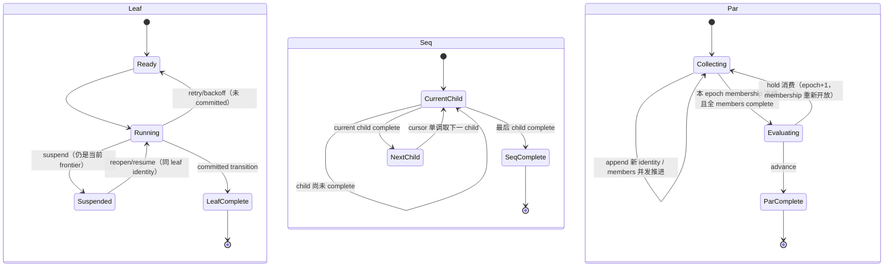

> 【定性：草稿】操作员 2026-07-31 定性：本文件是聚合草稿，非 RFC；原自称「唯一规范正文」的地位声明无效。以下为被覆盖前最后状态的忠实重建（原文 + 当日 13 处澄清修订）。

# RFC #546：单向序并任务模型

> **状态：R8，稳定语义已归并；七个真实行为问题仍待裁决（B-D2-1、B-D3-1/2、B-D4-1、B-D6-1/2、B-M2-1）。** 本文是唯一规范正文。调查记录只能提供证据，不能新增需求。

## 1. 范围与模型

本 RFC 把 chain 与 preset phase 统一为递归 `leaf | seq | par(join)` 任务代数。任务树是运行时控制代数，不是展示结构；机制属于引擎，策略值属于声明。DSL 装载、context 工具本体、script 判定器、树展示、外挂执行通道与既有 v2 audit 修复均不在本 RFC 范围内。

## 2. 全局公理与不变量

以下条款跨能力块生效，任何能力块的交付标准不得与之冲突。

### G1 · 统一序/并任务代数，两层实例化

```
task ::= leaf(执行单元)              -- 任务 = 同一 (item, phase) 的 attempt 链
       | seq(task, task, …)          -- 依序推进
       | par(task, …, join)          -- 并行 + 汇合判定；打开期间可追加子任务
join ::= drain | validator(item 调用声明)     -- 封闭 ADT；v3 关闭终态另含 script（跨树，见 [§6.1](#61-跨树引用能力语句)）
```

- 递归定义，嵌套深度不设限；「最多两层」只是 bundled preset 用法，不是代数约束。（SYNTH:L58–59）
- **preset = 任务函数定义，item = 一次调用**：chain 树的叶子是 item，item 展开为 preset 的 phase 任务树，phase 树的叶子才是任务。chain 层与 phase 层是同一代数的两层实例，引擎只实现一套调度语义。（SYNTH:L60）
- join 是封闭 ADT：union 只含语义、持久化、观测投影与全部穷尽消费点同时落地的 variant；`best-of-n` 是未来方向；select/race 不设一等组合子。（SYNTH:L58, SYNTH:L122）
- **chain 关闭 join 挂点**：grammar 注释中的「关闭终态」即 chain 边界自身携带的、chain metadata 声明的顶层 join 实例（chain-complete 判定）。它挂在 chain 边界（G8 保留的命名/凭证/隔离边界）上而非任何 seq 节点——顶层容器全 terminal 时评估，`hold ≡ keep-active`，epoch 语义与 par join 同构；seq 状态域不因此携带 joinState。精确 ADT 与声明位归 I 块唯一拥有。（SYNTH:L189, SYNTH:L861）
- 操作员 verbatim（2026-07-02）：「安全的任务设计有点像 PL 的设计……v3 加入了可并行任务。这部分需要完整的独立思考到底应该是什么样，而不只是并行这么简单」「iter 实际上是三个不同的阶段，其中两个阶段并行做两个不同的事情」。（SYNTH:L24–26）

### G1a · 单调完成代数（用户权威，2026-07-31）

- leaf 只有 `Open(attempt) → Complete(committed transition)`；Complete 是吸收态。
- seq cursor 只在当前 direct child subtree complete 后 `i → i+1`，永不减少；后继不得提前启动。
- par 仅在冻结 membership 的全部 direct children complete 后进入 evaluation；hold 留在当前 frontier，advance 只完成一次。
- parent 只消费 direct-child subtree complete。terminal ancestor + 未完成 descendant 是边界必须拒绝的非法 shape。
- suspend/reopen/resume/retry 只在 current frontier 作用于同一未完成 identity；append 只向开放 frontier 增加新 identity。不存在 cursor 回退、旧 leaf 重跑或 terminal container 重开。

### G2 · 独立 worktree 公理与闭包持久对象

- 操作员 verbatim：「我认为无论并发不并发，永远都是独立worktree」。（SYNTH:L38）
- 粒度 = 任务闭包 = 同一 (item, phase) 的 attempt 链；每任务一个独立 worktree；同 item 先后 phase 不共享、并行分支不共享；同任务 resume 共享同一 worktree（闭包内动作）。（SYNTH:L39，操作员重裁 2026-07-10，权威记录 `v3/task-closure-decision.md`）
- 闭包是**持久对象**，三态 `active | suspended | consumed`；suspend 只改当前 frontier 调度态且零 GC；reopen/resume 仅让同一未完成 leaf identity 原地继续且不改 cursor/ancestor/container；完成后不可 reopen；不再被当前或合法前向 frontier 引用才 consumed。（SYNTH:L41, SYNTH:L126–137，权威记录 `v3/closure-lifecycle-decision.md`）
- 细则归能力块 B。

### G3 · 引擎递出面定理

> 引擎递给任务的每个面，必须穷尽归入三类之一：**任务私有面、声明通道、repo 级共享 Git 协调面**。前两类承载业务状态；第三类只承载 Git 对象存储、远端视图分发、引擎 pin 与 linked-worktree 管理，不得成为未声明的业务状态通道。（SYNTH:L168）

- 完备性只对引擎递出的面量化（引擎代码有限、静态、可证），不对 agent 行为量化（LLM 不 FP）。（SYNTH:L166）
- **声明通道闭集**：git origin、GitHub 面、准入门 CLI、context CLI（跨树）、`shared.md`（chain 级自由 prompt 注入面，引擎与 preset 对内容零行为定义）、presetDir（只读）。（SYNTH:L170）
- **共享 Git 协调面闭集**：objects/packs、`refs/remotes/*`、闭包分支与引擎 pin refs、repo config/hooks、linked-worktree metadata。（SYNTH:L170）
- git 操作按闭包边界分类：**结构性**（worktree 创建、分支创建命名、起点解析、pin、终态采样、回收）归引擎程序化；**内容性**（commit、解决冲突、push、PR）归 agent。（SYNTH:L172）
- 凭据口径：agent 在闭包分支上合法 push 使用 ambient git 凭据本身不是 escape；escape 是拿凭据越出声明通道（写他人分支、动引擎外 refs）。（SYNTH:L172）
- 引擎主动递出的未分类可写面、合法契约操作互扰、被共享 config/hooks 被动影响——blame 均在系统；只有引擎先穷尽递出面，agent 越界才可归为 escape。（SYNTH:L170）

### G4 · 机制归引擎、参数归声明

join 策略的取值选择、状态字面量、前向 correction/append 配额、取消终态字面量、并发上限数值均不在引擎源码，归 preset/chain 元数据声明；机制 ADT 定义（variant tag 本身）属引擎。引擎层禁止任何 preset 字面量。（SYNTH:L237, SYNTH:L147, SYNTH:L812；CLAUDE.md 红线延续 #396 契约）

### G5 · 全仓代码红线

全链路 ADT，禁 `any`/匿名形状；`unknown` 仅限 catch 与边界 parse 入口；禁真 `as`（`as const` 除外）；外部输入经边界 parse（arktype）为精确类型后流转；domain union 穷尽 switch、无 default 兜底。（SYNTH:L220, SYNTH:L358；操作员裁决 2026-06-12）

### G6 · 完成权威 = committed transition

当前任务的业务完成事实不是 runner exit、不是 stdout、不是裸 terminal status，而是**合法的 committed transition**：路径合法、`exit.*` 对象完整且类型正确、可提前决定的其余 required binding 已满足，并在一次原子提交中持久化 transition、完成当前 leaf、构造后继 invocation。该协议扩展既有「查询出边 → CLI 写入即完成」（#451/#452 已落地），不建立第二套完成面。（SYNTH:L74–81, SYNTH:L400–407）

- 路径来源两类：`exit.*`（agent 提交的类型化状态对象，CLI 查出边时返回 schema）；`item.* / chain.* / runtime.* / typed literal`（引擎按既有 binding、`required | default` 与 projection 解析，agent 无权自报）。（SYNTH:L78–79）

### G7 · 判定权与准入

join 不只声明怎样汇合，还声明**谁拥有推进判定权**。引擎只确定性收集并冻结 child outcome vector，不得从 terminal/status 字面量自行推导业务成功。推进判定权 = join binding 唯一确定的主体 ∪ **operator 显式 override**（同一准入门、同一 epoch 语义、独立审计词条）。判定主体只能经统一 `advance | hold` 准入门产生控制效果；纠正工作只能以新 identity append 到当前开放 frontier；普通 child、GUI、observer、scheduler 其他路径无权代判。判定主体在 epoch 创建时采样冻结，同 epoch 不换。（SYNTH:L105，权威记录 `v3/join-evolution-decision.md` 裁决 5）

- join 是 future function，不入 control-plane 字段类；**定义态 join**（preset/chain metadata 声明）实例生命周期内不可变；**物化态 join** 允许 append-only 绑定版本演化，epoch 创建时采样生效；授权方向敏感（加严可授 agent、放宽 operator-only）。（SYNTH:L101）

### G8 · 旧概念退役清单

| 现状概念 | v3 归宿 |
|---|---|
| chain | 顶层 task（通常 seq）；命名/凭证/隔离边界保留 |
| item | leaf = preset 调用；可原地物化为 par 成员 |
| phase 数组顺序推进 | preset 内 seq；「iter 三阶段两并行」= seq 内嵌 par |
| trigger phase（afterPhase/whenStatus） | 状态条件化动态 spawn |
| chain-complete trigger | 顶层 join 实例；声明位迁 chain metadata |
| dependsOn | 原样保留，跨结构约束边 |
| slot = (chainId, repoCwd) 串行 | 退役 |
| per-slot worktree 与分支名 | 退役，改 per-闭包 worktree + 引擎 per-闭包分支（PR headRef 即闭包分支） |
| preset 指示 agent 自建分支（git switch -c） | 退役（设计错误） |
| chain 完成时清理 worktree | 退役，改闭包生命周期转移副作用 + daemon 启动对账 |

（SYNTH:L181–194）

### G9 · 范围外（本树不做）

DSL 具体语法与装载期校验（RFC-2）；context 共享工具本体（RFC-3）；script 判定器执行机制与 hook 点清单（RFC-4）；任务树展示面（RFC-5）；GitHub 外挂 / hapi 执行通道（RFC-6）；#534 audit 修复树的 v2 缺陷。（SYNTH:L246–254）

## 3. 任务代数的合法状态与 12 条不变量

### B1. 术语与层级

设任务树：

\[
T ::= Leaf(id) \mid Seq(id,[T_0,\ldots,T_{n-1}]) \mid Par(id,M,J)
\]

- **同级 leaf**：同一个直接 parent 下、类型均为 leaf 的 children；只有 `par` siblings 能同时 ready，`seq` siblings 由 cursor 严格串行。
- **嵌套层级**：child 可以是任意 subtree；父层观察的是 child subtree 的整体 `complete`，不是内部任一 leaf 的 terminal。
- **seq child**：`Seq` 的直接 child，可能是 leaf、seq 或 par。所谓“下一个”只指 `cursor i → i+1` 的下一个直接 child，不是任意 DFS leaf。
- **par sibling**：`Par` 当前 membership set 中的直接 children；彼此无顺序，全部可在依赖和限流允许时并发，但 `Par` 不能在任一 sibling 未完成时完成。
- **join/evaluation**：只在 `Par` 的全部成员完成后出现的汇合 frontier。它决定当前 par 是否完成；它不是回到成员或祖先的时间旅行入口。
- **“下一个级别”精确化**：对 leaf，是其 parent 取得 child-complete；对 seq，是 cursor 的下一直接 child；对 par，是 join evaluation；对已获 join advance 的 container，是父层继续。每一步都要求当前结构整体完成。

### B2. 状态域

#### Leaf

控制态：

\[
LeafState ::= Open(AttemptState) \mid Complete(CommittedTransition)
\]

其中 `AttemptState ::= Ready | Running | Suspended | Backoff`。`Complete` 是吸收态；runner exit、stdout、裸 status 均不构成完成，只有合法 committed transition 构成**业务完成与后继构造**的权威。引擎按声明字面量写入的失败终态（`[statuses].exhausted` 先例、H 块取消终态）同样落入吸收终态：它们不构造后继 invocation（后继节点只经 committed transition 诞生，失败即天然短路，不产生未启动的悬挂后继）；其吸收事实照常被 parent 作为 direct-child 完成消费（seq 越过、par 计入全员 terminal），处置作为非 success outcome 归外层 join（失败不上溯，见 C/H 块），不构成第二完成面。

#### Seq

`SeqState = (children, cursor)`，其中 `cursor ∈ [0,n]`：

- `cursor=i<n`：只有 `children[i]` 是该 seq 的当前 child；`j<i` 必须 complete；`j>i` 必须未启动。
- `cursor=n`：所有 children complete，seq complete。
- 唯一 cursor 转移：当且仅当 `children[i]` complete 时，`i → i+1`。不存在 `i → i-1`。

#### Par

`ParState = (members, membershipState, joinState)`：

- `members` 是 identity 唯一、append-only 的有限集合；开放期间 children 独立推进。
- `membershipState ::= Open | Frozen`。只有 `Open` 且 par 尚未完成时可 append 新 child identity。**冻结是 epoch 作用域的快照，不是容器终身属性**：每次 evaluation 创建时冻结当时的 membership；该 epoch 被 hold 消费后 membership 回到 `Open`，append 重新合法并进入下一 epoch 的完成条件。（权威记录 `v3/join-evolution-decision.md`「hold 后重问」行：hold 消费 → epoch+1 → 新 epoch 创建时重新冻结并重新采样绑定）
- `joinState ::= Collecting | Evaluating(epoch) | Complete(decision)`。
- `Collecting → Evaluating` 当且仅当 membership 已冻结且每个 member complete。
- `drain` 在全员 complete 后直接 `Complete(advance)`；validator/script 只能 `hold` 或 `advance`（par complete）。**hold 是被消费的 decision**：该 epoch 关闭、par 回到 `Collecting`，下次评估以 epoch+1 重新创建并重新采样 join 绑定；「留在当前 evaluation frontier」指结构位置不前进，不指 epoch 不递增，也不指 membership 永久冻结。旧的 backward `reopen(target)` 不属于该单调状态机。

### B3. 推进规则

1. **Leaf-Complete**：`Open(a) → Complete(t)` 当且仅当 `t` 是当前 leaf 的合法、原子 committed transition。
2. **Seq-Step**：`cursor=i ∧ complete(child[i]) → cursor=i+1`。
3. **Seq-Complete**：`cursor=n ↔ ∀j.complete(child[j])`。
4. **Par-Ready**：对 `membershipState=Open` 的 par，所有未完成 members 递归贡献 ready leaves；siblings 可并发。
5. **Par-Freeze**：开始 join evaluation 前冻结本 epoch 的 membership；冻结后该 epoch 不接纳新 member。
6. **Par-Evaluate**：`Frozen ∧ ∀m.complete(m) → Evaluating(epoch)`。
7. **Par-Advance**：join 对该 epoch 产生 `advance` 后，par 进入 `Complete`。
8. **Parent-Step**：仅当当前 direct child subtree complete，parent 才能取得其完成事实并继续。



图中没有任何 complete→open、cursor 回退、terminal ancestor 重开边；缺边是代数约束，不是尚待选择的策略。`Evaluating → Collecting` 是 hold 消费后的前向 epoch 递增——不重开任何已完成节点、不回退任何 cursor，不属回退边。

### B4. 跨层不变量（12 条）

| ID | 不变量 |
|---|---|
| I1 | leaf `Complete` 是吸收态；同 runtime leaf identity 不再变回 `Open`。 |
| I2 | seq cursor 单调不减。 |
| I3 | `cursor=i` 时，所有 `j<i` complete，所有 `j>i` 未启动。 |
| I4 | seq complete 当且仅当 cursor 到尾且全部 direct children complete。 |
| I5 | par complete 蕴含其冻结 membership 中所有 direct children complete。 |
| I6 | par evaluation 只能在冻结 membership 全员 complete 后创建。 |
| I7 | terminal ancestor 蕴含其结构所覆盖的所有 descendant 都满足该 ancestor 的完成前提。 |
| I8 | parent 只消费 direct-child complete；不得用 descendant 的局部 terminal 替代 subtree complete。 |
| I9 | ready leaf 集完全由递归树语义决定；资源键、flat queue、observer 不得产生额外 ready leaf。 |
| I10 | suspend/reopen/resume/retry 只作用于当前 frontier 上同一未完成 leaf identity，不改变任何 ancestor cursor/completion。 |
| I11 | append 只增加当前开放 frontier 内的新 identity；不改变旧 child 的完成事实，不重写已冻结 membership。 |
| I12 | join `hold` 不前进也不后退；`advance` 只前进一次；不存在以 join decision 回退先前结构的合法效果。 |

这些约束使“非法状态不可表示”：持久化写入、迁移、DTO/parser、mutation producer 必须共同维护它们；不能先写出矛盾行再由 scheduler 猜测如何修复。

### B5. 合法 / 非法 shape 矩阵（12 个非法 shape）

| # | Shape / 动作 | 判定 | 原因 |
|---:|---|---|---|
| 1 | seq `cursor=i`，`j<i` 全 complete，`j>i` 未启动 | 合法 | I3 |
| 2 | seq current child 为嵌套 par，par 尚有 member 未完成 | 合法但 seq 不推进 | I4/I8 |
| 3 | par 开放，两个未完成 siblings 同时 running | 合法 | 结构化并发 |
| 4 | par 全员完成、membership frozen、join evaluating | 合法 | I5/I6 |
| 5 | 当前未完成 leaf suspended 后以同 identity resume | 合法 | I10 |
| 6 | 当前未完成 leaf attempt 失败后同 identity retry | 合法 | I10 |
| 7 | 当前开放 par append 新 child identity | 合法 | I11 |
| X1 | seq cursor 已越过未完成 child | **非法** | 违反 I3 |
| X2 | seq cursor 已越过后来又变回 open 的 terminal child | **非法** | 违反 I1/I3 |
| X3 | seq 后继 child 已启动而 current child 未完成 | **非法** | 违反 I3 |
| X4 | seq complete 但存在任一未完成 descendant | **非法** | 违反 I4/I7 |
| X5 | par complete 但存在任一未完成 member | **非法** | 违反 I5 |
| X6 | par 已完成后把旧 member 恢复为 active | **非法** | 违反 I1/I5/I7 |
| X7 | terminal ancestor 下存在 active/suspended 未完成 descendant | **非法** | 违反 I7 |
| X8 | membership 未冻结或成员未全完成就创建 join evaluation | **非法** | 违反 I6 |
| X9 | join epoch 已 advance 后追加 member 到该 epoch | **非法** | 违反 I6/I11/I12 |
| X10 | append 复用已完成 leaf identity 作为“纠正” | **非法** | 违反 I1/I11 |
| X11 | suspend/reopen 改写 seq cursor 或 ancestor completion | **非法** | 违反 I10 |
| X12 | validator decision 把 cursor 指向 earlier sibling / 重开 terminal subtree | **非法** | 违反 I1/I2/I12 |

### B6. 为什么非法 shape 必须在生产边界拒绝

以 X1 为例，若 `seq.cursor=B` 而 A 未完成，则递归 ready-set 同时得出互斥答案：由 cursor 得出 B ready，由顺序公理得出 B 不可 ready。X5/X7 同理：ancestor terminal 让父层可继续，而未完成 descendant 又要求父层等待。此时 scheduler 无法在不发明第二事实源的前提下求值；observer 也无法报告一个同时满足结构和局部状态的快照。

所以这些 shape 不是“运行时可能出现、出现后选择级联恢复或拒绝”的状态：

- **生产者**不得提交会破坏 I1–I12 的 mutation；
- **shape / DB constraint / typed constructor**只能构造满足 I1–I12 的状态；
- **迁移**遇到 flat 数据无法证明与 cursor/container completion 一致时必须拒绝或停下显式修复，不能合成矛盾树；
- **调度器**只消费合法树，不承担矛盾修复；
- **读面**不得把 flat 与 tree 拼成一个自相矛盾的“兼容快照”。

这正是 [证据索引](EVIDENCE.md) 的 ADT/committed-transition要求与 [证据索引](EVIDENCE.md) 的树唯一调度来源所要求的边界，而不是新增防御机制。

### B7. suspend/reopen、retry、append 的合法位置

| 动作 | 合法位置 | identity | 控制效果 | 禁止效果 |
|---|---|---|---|---|
| suspend | 当前 frontier 的未完成 leaf；无活 run | 不变 | 执行资源态 active→suspended | 不完成 leaf、不推进/回退 cursor |
| reopen/resume | 同一当前 frontier 的 suspended leaf | 不变 | suspended→active，继续原现场 | 不作用于 terminal leaf，不重开 ancestor |
| retry | 当前 frontier 的未完成 leaf attempt 链内 | 不变 | 新 attempt，仍求同一个 committed completion | 不把 complete leaf 改回 open |
| append | 当前仍开放的 par/frontier，join 尚未冻结/advance（冻结按 epoch 作用域：hold 消费后重新开放，见 B2） | **新 identity** | 新 child 纳入同一尚未完成结构的完成条件 | 不插入已越过 seq 前缀，不改旧 terminal identity |
| correction | 只能表现为当前开放 frontier 内 append 的新 identity | 新 identity | 前向增加待完成工作 | 不以 `reopen(target=earlier)` 回头 |

因此，闭包生命周期文档中的 `suspended→active : reopen` 只有在 leaf 尚未 committed completion、仍是当前 frontier 时成立；它是资源恢复，不是任务树回退。`queue.unblock` / dependsOn 若面对仍未完成且仍在 frontier 的 leaf，可以解除 gate；若面对 terminal/已越过 identity，则请求本身违反代数，必须拒绝，不能创造 X1/X2/X6/X7。

## 4. 能力 A–N

### A · committed transition 完成协议

#### 语义定义

- preset 对每条可选后继路径声明：目标 step/preset invocation、可选 prompt 模板、模板每个输入的类型与来源。来源两类：`exit.*`（agent 结束任务时必须提交的类型化状态对象；CLI 查询合法出边时同时返回所选路径的 exit schema）；`item.* / chain.* / runtime.* / typed literal`（引擎沿既有 binding、`required | default` 与 projection 解析，agent 无权自报）。（SYNTH:L76–79）
- 缺字段、错类型、非法路径或不可满足的已知 required binding 均不得完成当前 leaf，也不得创建后继。（SYNTH:L403）
- 树调度只消费 committed transition：前驱裸 terminal 或 runner exit 不足以使 seq 后继 ready；一次提交必须原子留下 transition record、完成当前 leaf、构造目标 invocation；调度器不得从 status、stdout 或进程退出推断缺失的路径和输入。（SYNTH:L405）
- 后继运行时，所选路径模板以该 transition state 与既有外部 bindings 渲染为 prompt；线性数组退化为 seq 时也走同一协议，不得保留「不带 transition state 的数组推进」旁路。（SYNTH:L81, SYNTH:L900)

#### 交付标准

1. 出边可计算 / 提交即完成 / 不完整不得推进 / 后继 prompt 数据流 / context 边界 —— 总交付标准 T1–T5（[证据索引](EVIDENCE.md)）。
2. `seq(A,B)` 负例族：缺 required `exit.*` 字段、字段类型错误、非法路径、缺已知 required 外部 binding —— 每种均非零退出、无 transition 持久化、A 不完成、B 不存在/不可调度。（SYNTH:L407, SYNTH:L2232, SYNTH:L4347）
3. 合法提交：恰有一条 transition record、A 完成、B 成为唯一后继并按权威 bindings 构造 invocation；replay 不产生第二条 transition 或第二个 B。（SYNTH:L4348）
4. 非完成信号零效力：runner exit、stdout 文本、裸 terminal/status 写入不推进游标。（SYNTH:L405, SYNTH:L4348）
5. agent 在 exit object 中伪造外部 binding 不得覆盖引擎解析值。（SYNTH:L902）

### B · 闭包资源生命周期与 Git supply

#### 语义定义

**闭包三态状态机**（权威记录 `v3/closure-lifecycle-decision.md`；SYNTH:L126–145）：

- 闭包 = 同一 (item, phase) attempt 链的执行环境：worktree + 引擎创建的工作分支 + session + per-task scratch。
- 转移：create（首次打开：fetch base → 建 worktree → 建闭包分支/par 下从 pin 派生）；run-exit→run-spawn（attempt 链内，含中断 resume）；suspend（调度推进离开**仍未完成**的 leaf 时触发；只改调度状态。挂起只对未完成 identity 成立——G1a/§3 B7；已完成 leaf 的闭包不进入 suspended，其归宿由消费谓词 C00 决定）；reopen/resume（仅 current frontier 同一未完成 leaf 原地恢复）；consume（当前及合法前向 frontier 均不再引用）。
- **挂起只改调度状态**：worktree、分支、index、未提交文件、session、scratch 原地保留；禁 stash / suspend-commit / 删除 / 重建。单次 run 中断不触发挂起。
- **重开零搬运**：无 cwd/文件系统/index/分支/session 的还原步骤。
- **消费证明先于 GC**：item terminal、预算耗尽、取消均不是消费证明；谓词不成立时环境必须保留。`consumed` 不可逆。
- **单活性不变式**：每闭包同一时刻至多一个活 run（执法键 = 闭包）；v2 靠 slot 串行与 current_runs PK=chain_id 偶然保证，两者退役后由 shape + 调度显式重立。
- **hook 挂点**：闭包转移边（create/run-spawn/run-exit/suspend/reopen/consume）进 observer 事件词表；gate 决策点闭集不扩，**转移边不可 gate**（要阻止挂起，在 run post-exit gate 上 hold）。
- **一个类型四张视图**：执行语义 / GC 表（仅 consumed 可回收）/ hook 挂点表 / 暴露谓词表，共同事实源。
- resume 醒在原 worktree；「每个 agent 运行无状态」精确化为**对外无状态**——闭包私有内存正是 resume 与重开唤醒的对象。（SYNTH:L219）

**供给条款五条**（引擎自身 git 行为契约；SYNTH:L154–160）：

| # | 条款 |
|---|---|
| 1 | **起点公理**：worktree 底座 = 创建时刻 `chain.baseBranch`（默认 main，per-chain 可配）最新快照；创建前 fetch base（per-repo 串行化/去重，网络失败显式化，pin 成员免 fetch）；current-frontier resume 的起点 = 闭包分支尖端（底座无关——不重新解析 base，也不是文件系统还原动作，worktree 本就原地停在该尖端，见「重开零搬运」）；声明面历史回退永久出局；无 origin 的 target 走 doctor 警告不装载拒绝 |
| 2 | **闭包分支程序化**：引擎创建 per-闭包工作分支随闭包递出，贯穿至完全消费（PR headRef 即闭包分支）；agent 契约 = 在其上 commit、解决冲突、push、开 PR；preset 指示 agent 自建分支退役；push 到 origin 的 ref 属声明通道，未发布自建 ref 是 escape 类 |
| 3 | **seq 流转**：worktree 间无依赖，只有并发等待——前驱需被构建于其上的工作已合入 base；引擎不执法，合并真相是 GitHub 面事实，经声明通道由 preset 判定器按 `advance\|hold` 消费；correction 以前向新 identity append；引擎零产物传递机制；引擎级 mergedness gate 出局 |
| 4 | **par 同 commit 派生**：par 展开/物化时引擎 pin base 尖端 commit 并持久化；成员首次打开从 pin 派生（凝固点：追加复用同 pin）；嵌套 par 内层重新 pin |
| 5 | **回收与消费采样**：GC = 生命周期转移副作用 + 启动状态对账；引擎只回收自己命名空间；证据谓词对象 = 闭包分支；suspend 只发状态事件，consume 时发 `{无工作, 已发布, 未发布即弃, 无法求值}` + origin 新鲜度戳——只暴露不参与推进 |

mergedness 可计算性检验结论：squash merge 杀可达性、自建分支致恒假阳性——「合没合」ground truth 归声明通道判定器；引擎可靠计算的只有「自有面上有无工作、发布没发布」。（SYNTH:L162）

**已钉死的三项决策**（marker 层收敛后进入正文；SYNTH:L498–500, SYNTH:L2282–2284）：

- **消费谓词（C00）**：闭包可消费 iff 无活 run，且不再被 current frontier 或尚未物化的前向 append/next-epoch identity 引用。已完成 leaf、已越过 seq 前缀、已完成 container 不形成 future edge；不存在指向旧 terminal identity 的 backward reachability。
- **runtime mutation**：append 只在当前开放 frontier 创建新 identity；冻结 membership、已 advance epoch、已完成 container 与 seq 前缀不可变。会形成 cursor 越过未完成 child、terminal ancestor 下未完成 descendant、completed par 含未完成 member的写在 producer/constructor/migration 边界原子拒绝。

#### 交付标准

1. **per-闭包隔离**：任意两任务（含同 item 先后 phase、同 repo 并发分支）worktree 路径与分支互不相同，且均在引擎命名空间。
2. **起点公理**：origin 侧推进 base 后创建 → 底座 = post-fetch 尖端；fetch per-repo 串行/去重；网络失败 → typed 可审计事件、无 fallback；no-origin → verified 本地 base + `no-origin/unavailable` 新鲜度；任何路径无 HEAD 兜底。
3. **闭包分支程序化**：分支在 runner spawn 前已存在、per-闭包唯一、即 run/PR headRef、贯穿闭包生命周期不变。
4. **挂起/重开连续性**：挂起前后与重开后，路径、分支尖端、HEAD、index、tracked/untracked/ignored 文件、scratch、session byte-identical；重开只改调度态、resume 用同 cwd/session。
5. **消费谓词与 GC**：terminal/预算耗尽/取消/drain 现值/磁盘资源缺失均不消费；不动点谓词保护每个仍可达闭包；consume 与竞争写序列化；成立后只回收自有资源、清 closure sessions、发四值证据之一 + origin 新鲜度；cleanup 失败/重启后证据恰好一次。
6. **par pin 派生**：成员首次打开底座 = 持久化 pin、成员路径无独立 fetch；嵌套 par 独立 pin。
7. **启动状态对账**：人为构造磁盘/分支/DB 三方不一致（多目录、少分支、孤儿、幽灵记录、config/hooks 漂移）后重启 → 逐项核查、每处不一致发 identity-bearing 审计事件、修复限引擎 namespace、active/suspended 永不静默删除。
8. **主线程不阻塞**：Git 操作被故意阻塞期间 daemon socket 应答无 Git 时长级停顿。
9. **中断 resume**：第二 attempt 的 agentCwd/分支/session 与前次完全一致；中断不触发挂起或 consume/GC。
10. **共享 Git 协调面**：两 active + 一 suspended 闭包并发合法 fetch/commit/push 后，`origin/*` 可前移且有新鲜度记录，各闭包保存的 base SHA/pin 与私有现场不变；引擎 repo-wide 操作串行且只改自身 namespace；active/suspended 存在时零显式 gc。
11. **收敛断言**：per-slot 路径/分支/扫尸符号生产零命中；起点解析 `origin→local→HEAD` fallback 链删除；worktree 管理路径 `Bun.spawnSync` 零命中；生产生命周期只碰引擎 namespace 且无新 agent 结构性 Git 指示。
12. 类型完整（全局红线 G5）。

（#560 C01–C16 / P01–P06 与 #699 同名表逐字重复，已归并；SYNTH:L369–382, SYNTH:L512–525, SYNTH:L531–561）

### C · 树调度

#### 语义定义

- 调度决策唯一来源是任务树结构：seq 按游标依序推进；par 打开期间全部未终结成员可并发 spawn；嵌套任意深度按代数推进。**性质**：对任何 well-formed 树，每个 tick 的可 spawn 集 = 树语义允许的就绪 leaf 集，与资源键无关。（SYNTH:L417）
- **spawn 一个 leaf = 查闭包状态表的决策动作**（五分支）：无闭包记录 → create 转移；suspended → reopen 转移；active 且无活 run → resume；active 且有活 run → 违反单活性，本 tick 不 spawn（拒绝 + 可审计事件）；consumed → 该 leaf 不再可 spawn。调度侧只做决策与派发，闭包转移机制本体归 B 块。（SYNTH:L418–424）
- **drain 的结构性放行**：par 全部成员 terminal 即容器 terminal、外层 seq 推进——drain 是代数的退化 join，无判定通道即可放行。（SYNTH:L425）
- **slot 串行语义退役**：资源键 (chainId, repoCwd) 与「谁能并行」解耦；退役理由 = 共享单份 worktree 的存在理由消失。（SYNTH:L146, SYNTH:L426）
- **单活性执法（执法键 = 闭包）**：每次 spawn 决策前查闭包活 run，命中即拒绝 + 审计事件；current-frontier 挂起态走 resume 不走 create。（SYNTH:L427）
- **par 展开 pin 写入时序**：识别 par 进入展开时先 pin base 尖端 commit 落库，再 spawn 成员入口任务集（pin 先落库、成员 create 后读同一 pin）；嵌套内层 par 展开时独立重新 pin；运行中追加不重 pin（归 F 块消费）。（SYNTH:L428）
- 并发上限 = 纯限流参数：全局 + per-par，值取自元数据声明；未声明全局上限 = 不限。（SYNTH:L429）
- dependsOn 与树正交：par 成员携带跨结构 dependsOn 照常 gate、全依赖 success 后仅对尚未 advanced 的 current leaf 解除 gate；写入期查环行为不变；静态声明部分增加装载期查环（跨树接缝）。（SYNTH:L116, SYNTH:L430）
- 子任务失败不自动向上传播：非 success 终态成员不使容器/祖先失败，处置归 join 评估；失败 leaf 的退避/attempts 语义在树下不回归。（SYNTH:L431)
- v2 线性链（退化 seq 树）调度行为零回归。（SYNTH:L432)
- **公开入口实例化**：通过公开 daemon/CLI 创建入口实例化 runtime tree 并执行；禁止直写 SQLite/`createTaskTree` 作为验收路径；run 记录不得 lazy 物化 runtime 树节点（`ensureRuntimeClosure` 类路径退役）。（SYNTH:L411, SYNTH:L4244)

#### 交付标准

1. **par 真并发**：同 chain 同 repoCwd 的 par 内 ≥2 item，runs 的 started_at/ended_at 区间重叠；repo/slot 身份不决定就绪也不串行化。
2. **嵌套推进**：`seq(leaf, par(leaf, par(leaf, leaf), join=drain), leaf)` 真跑到全树 terminal；每 tick spawn 集 = 递归就绪 leaf 集；内外 drain 各自在全部直接成员 terminal 后才放行。
3. **公开入口实例化**：public `chain create` + `item add` 在任何 runner 启动前实例化持久化 runtime tree，status 面暴露 definition/runtime identity 与初始就绪 leaf；setup 零直写。
4. **spawn 按闭包状态决策**：五分支场景分别触发 create/reopen/resume/拒绝+审计/不再 spawn；调度决策不直接写闭包状态。
5. **单活性执法**：同闭包第二活 run 被拒 + 审计事件；挂起态走 current-frontier resume 分支。
6. **par 展开 pin 写入**：展开前 pin 落库；成员闭包底座 = 该 pin；嵌套内层独立重 pin。
7. **限流**：per-par 上限 2 的 3 成员 par 任意时刻活 run ≤2 且全部完成；全局上限 1 时全 daemon 活 run ≤1；未声明 = 不限，引擎无默认 cap，值只来自声明。
8. **dependsOn 正交**：约束边与并行结构独立生效（先 gate 后恢复）；环在写入期被拒。
9. **失败不上溯**：一成员 exhausted、其余照常完成；容器与祖先不因此失败。
10. **退役收敛**：slot 决策符号、flat phase-plan 选择器符号、lazy 树物化符号在 src/tests/scripts 生产路径零命中。
11. **线性零回归**：既有线性声明退化为 seq 后，phase 顺序、状态准入、retry/session、attempts/退避、chain 完成、观测与清理与迁移前一致；无第二套 flat 调度模型。
12. 类型完整（G5）。

（#698 验收表历经十余版 marker 收敛，本表以最终版（SYNTH:L5899–5920）为准归并早期版本）

### D · 判定通道（decision core 与 validator join）

#### 语义定义

- join=validator 的 par 容器：全部成员 terminal 时引擎 spawn 验证者 leaf（item+preset 调用声明取自容器 join 字段），容器保持不推进直到判定到达；join=drain 容器维持结构性放行，validator 机制的引入不给它加判定等待或失败特殊分支。（SYNTH:L602）
- 判定经 CLI 写回 default-deny 准入门：判定词表由 preset 声明；无授权主体/词表外值被拒 + 审计事件；引擎零新增 stdout 解析。（SYNTH:L603）
- **三词派发**：`advance` → 外层 seq 单向推进一次；`hold` → 留在当前 evaluation frontier。不存在 backward decision variant；correction 是当前开放 frontier 的新 identity append。（SYNTH:L604）
- hold 承接 keep-active 先例：chain-complete trigger 定性为顶层 join 实例，其 keep-active 正是 hold；不存在 rollback/backward 第三词。本块的退避重问与 I 块顶层 join 的布局指纹幂等，是 RFC-4 供给的同一「幂等指纹/防抖」能力的两个面（见 [§6.1](#61-跨树引用能力语句)），不是两套重问语义。（SYNTH:L95）
- join ADT 穷尽处置：落地时封闭 union 仅 `drain | validator`、无占位 variant，全部消费点穷尽 switch 无 default 兜底；`script` variant 由跨树能力按准入纪律随后一次落齐（见 [§6.1](#61-跨树引用能力语句)）。（SYNTH:L605）
- 失败归 join：par 成员非 success 终态不自动传播——drain 照常放行；validator 判定输入可见失败成员及其终态。（SYNTH:L606）
- **合并真相 preset 判定器自查**（供给条款 3 对应）：GitHub 面事实由验证者 leaf 自身经声明通道读取，引擎不代查不注入；写回的三词判定即消费结论。（SYNTH:L607）
- **operator override**：对当前 epoch 经同一准入门显式写 decision，生效与消费语义同主体判定、独立审计词条；join 绑定不变、下一 epoch 主体照旧。承接「一次性放行/否决」运维需求，使「为放行一次而改 join」消解。（SYNTH:L608, SYNTH:L105）
- epoch 采样冻结：evaluation 进行中追加新绑定后同 epoch 崩溃重问仍按旧绑定；下一 epoch 才用新绑定。崩溃重放安全（mutation 不重复、decision 不丢不重复消费）机制跨树（见 [§6.1](#61-跨树引用能力语句)）。（SYNTH:L604, SYNTH:L623）

#### 交付标准

1. drain 语义零破坏（含 exhausted 成员的 drain par 照常结构性放行、无判定等待）。
2. validator spawn 与 advance：全成员 terminal 自动 spawn 验证者；advance 后外层推进。
3. hold：容器不推进不退回、事件可见退避重问、下次改判 advance 生效。
4. 准入门：词表外判定值、无凭证主体均被拒；每次尝试留审计事件。
5. earlier-target/backward decision 在边界 typed 拒绝。
6. 失败成员对 validator 可见（判定输入/可查询面呈现）。
7. mutation 崩溃重放：validator CLI mutation 后、decision 前退出 → 重 spawn、重复 mutation 被幂等吸收、items 无重复、epoch 不递增。
8. decision 崩溃恢复：decision 持久化后、消费提交前 kill daemon → 重启直接消费、不重 spawn、容器效果仅一次。
9. operator override：operator 凭证写 advance 经准入门生效 + 独立审计词条、容器推进、绑定与下一 epoch 主体不变；agent 凭证被拒。
10. epoch 采样冻结（与 G 块验收互证）。
11. 零 mergedness 注入：引擎侧无向 validator prompt/判定 payload 注入 GitHub 面字段的路径。
12. 零 stdout 判定：新增判定路径无 stdout 解析。
13. join ADT 穷尽：临时加 variant 使全部处置点编译报错。

（SYNTH:L612–626）

### E · current-frontier 连续性与前向纠正

#### 语义定义

- leaf Complete 是吸收态；同 runtime identity 不得回到 open/entry。
- suspend/reopen/resume/retry 只作用于 current frontier 的同一未完成 leaf identity，复用原 worktree/branch/session；不改 seq cursor 或 ancestor/container completion。
- `queue.unblock` 与 dependsOn 只解除尚未 advanced 的 current-frontier gate。目标已完成或结构已越过时 typed 拒绝，item/tree/closure/dependency history 全不变。
- correction 只以新 identity append 到当前仍开放且未冻结的 frontier。「冻结」指 evaluation 在途窗口（epoch 已创建未决）；hold 被消费后 membership 重新开放、append 恢复合法（§3 B2）。不存在 earlier-target reopen、cursor 回退、terminal subtree 重开、级联再验证或 backward budget。
- producer、store constructor、migration 与 mutation boundary 必须拒绝 本 RFC §3 的 X1–X12；scheduler 只消费合法树。

#### 交付标准

1. current leaf suspend→resume 保持 closure identity/resources，tree position 不变。
2. 未完成 current leaf 的 gate 可解除；已越过 identity 请求 typed 拒绝且领域状态不变。
3. correction append 取得新 identity且只进入开放 frontier；完成/冻结结构拒绝 append。
4. parent 只消费 direct-child complete；seq/par/join 完成条件逐层成立。
5. 非法 shape 在写入、迁移和 parse 边界拒绝并记录 typed finding。

### F · 动态物化 par

#### 语义定义

- **语义能力无条件**：任何未终结节点可随时被追加平行兄弟；已 terminal 节点追加被拒。（SYNTH:L109, SYNTH:L711）
- **表示稀疏**：不预建包裹容器；首次追加把运行中 leaf 原地物化为 par。物化请求可显式指定 join（值域 = enclosing 实例 pinned 定义内的候选引用，与 G 块演化通道共用同一值域；经 join ADT 边界 parse，悬空候选/自由构造调用声明被拒 + 审计事件）；未指定默认 `join=drain`——缺省取代数退化情形（无判定通道的结构性放行），与「未声明并发上限 = 不限」同款机制中性缺省，不属 G4 归声明的策略取值字面量。追加进已存在容器的请求不接受 join 参数。（SYNTH:L110, SYNTH:L712）
- 物化不打扰在场者：原 leaf 活 run 不中断、不重建、不重 spawn；纯运行态结构变化。（SYNTH:L713）
- 物化时容器获得稳定 id，同容器后续追加复用；该 id 即跨树 context 通道的 `group` scope 键（存储位 = par 节点 runtime_node_id，L 块 shape 已钉）。（SYNTH:L714, SYNTH:L1271）
- **粒度**：调度、状态准入保持 item 粒度；par 节点是控制流节点，不是可调度单元、不拥有 item 状态。（SYNTH:L111, SYNTH:L715）
- **授权**：追加 = 现有 `createItems` right 增加目标作用域维度，不发明新授权面；agent 仅在被授权作用域内、operator 无条件；目标结构关系是真实行为问题 B-D4-1（见 §9）；授权词表与匹配算法是 R9 工程地基 C-D4-1/2（见 §10）。（SYNTH:L112, SYNTH:L716）
- **凝固点语义**（供给条款 4 的物化侧）：追加不重 pin（新成员底座从容器已持久化 pin 派生，不等于追加时刻 base 尖端）；物化即诞生点则同步写 pin（pin 先落库 → 容器结构含诞生 join 落库 → 新成员闭包 create；原成员不改动不重派生）；嵌套内层物化独立重新 pin。（SYNTH:L717–720）
- 追加成员 = 新任务 = 新闭包，走 C 块 spawn 决策的 create 路径；本块只负责结构落库与 pin 语义。（SYNTH:L721）

#### 交付标准

1. 原地物化：对运行中 leaf 追加（无 join 参数）→ 物化 par（默认 drain）、新 item 同容器调度、原 run 不中断不重建；par 容器不作为可调度单元、不可写 item 状态。
2. 诞生时 join：携带 validator 候选引用成功（成员全 terminal 后按 D 块 spawn 验证者）；悬空 candidateId 与自由构造调用声明被拒 + 审计事件；对已存在容器带 join 参数被拒。
3. 容器 id 稳定：再追加一次，两次快照同一 id、成员 3 个。
4. 物化时 pin 写入：容器 pin = 物化时刻 base 尖端；新成员底座 = 该 pin。
5. 追加不重 pin：追加前后容器 pin 不变；新成员底座 = 容器 pin ≠ 追加时刻 base 尖端。
6. 嵌套内层独立 pin。
7. terminal 拒绝 + 审计事件。
8. 授权作用域执法：无 grant 凭证、越作用域凭证均被拒（default-deny）+ 审计事件；operator 无条件成功。
9. 类型完整（G5）。

（SYNTH:L725–735）

### G · join binding 演化

#### 语义定义

- **演化通道**：物化容器未终结期间，operator 经 socket 追加 join 绑定版本；值经 join ADT + 候选引用边界 parse（candidateId 在 enclosing 实例 pinned 定义的候选表中解析；悬空引用/词表外值/自由构造调用声明被拒）；追加与审计事件（作者、授权类别、v(n)→v(n+1)、生效起始 epoch）同事务落地。（SYNTH:L761）
- **生效语义**：对在途 evaluation epoch 零影响（按创建时采样的绑定跑完，含同 epoch 崩溃重问）；下一 epoch 创建时采样最新版本；版本序列读面在采样点可用且 append-only 无中间态。（SYNTH:L762）
- **定义态拒绝**：join 来自 preset/chain metadata 声明的容器，任何绑定追加被拒 + 审计事件，错误点名定义态不可变；救济 = operator per-epoch override（D 块）或 cancel + 修正定义重建。（SYNTH:L763, SYNTH:L101）
- **授权方向敏感**：operator 恒可（双向）；agent 默认拒绝；preset rights 显式授权的 phase 仅可加严（drain→validator）；放宽（validator→drain）对 agent 恒拒；复用既有权利矩阵形态、不新增授权面。（SYNTH:L764）
- **place 属性不变**：追加前后容器 id、par pin、forward-append 计数与 group scope 键不变；binding 变化不清零前向配额计数、不换 budget ref。（SYNTH:L765, SYNTH:L1275）
- 已 terminal 容器追加被拒。（SYNTH:L766）
- join 不入 control-plane 字段类（`repoCwd`/`runner`/`priority` 类四字段集不扩）。（SYNTH:L101, SYNTH:L779）

#### 交付标准

1. 演化生效于下一 epoch：在途 evaluation 中追加 validator 候选 → 本轮按旧绑定完成、下轮采样新绑定 spawn 验证者；审计事件含版本与生效 epoch。
2. 同 epoch 主体冻结：evaluating 中追加后 kill daemon 重启 → 重问仍按 epoch 记录采样的旧绑定。
3. 定义态拒绝 + 审计事件、错误点名。
4. 授权方向：无 rights agent 拒；有 rights agent 加严成功、放宽拒；operator 双向成功；每次尝试留审计事件。
5. 值域：悬空 candidateId、自由构造 JSON 被边界 parse 拒且错误点名；合法引用解析进 pinned 定义。
6. place 属性不变（id/pin/forward-append 计数/group 键逐项比对）。
7. terminal 拒绝 + 审计事件。
8. control-plane 字段集仍为四字段；join 演化走独立命令分类。
9. 类型完整（G5）。

（SYNTH:L770–780）

### H · 子树取消

#### 语义定义

- **取消向下传播**：cancel 任一节点使其整个子树终结——全部下属活 run 被终止（SIGTERM→SIGKILL，复用现有看门狗信号路径与事件形态）；全部未启动 item 落取消终态；容器节点落取消终结。（SYNTH:L120, SYNTH:L805–808）
- **取消 ≠ 消费**：子树内已 create 的闭包停止执行但环境原地保留；取消不证明 consumed、不触发 GC（闭包只在消费谓词随后成立时回收）；从未 create 的 item 只落取消终态。（SYNTH:L801, SYNTH:L809）
- **兄弟零影响**：子树外节点（兄弟、祖先其他分支）零影响——兄弟闭包不动、兄弟活 run 不中断、兄弟未启动 item 不落取消终态。（SYNTH:L810）
- **取消不上溯**：被取消子树对外层呈现为失败终态，归外层 join 消化（drain 照常放行、validator 可见），不自动传播失败。（SYNTH:L811）
- **终态字面量不驻留引擎**：跟随 `[statuses].exhausted` 先例——引擎写入、字面量来自声明；声明作用域是真实行为问题 B-D2-1（见 §9）；具体键名是 R9 工程地基 C-D2-1（见 §10）。（SYNTH:L812）
- **幂等**：对已 terminal 子树 cancel 为 no-op（成功返回、无副作用）；取消状态不重复写、已杀 run 不重发信号。（SYNTH:L813）
- **授权**：cancel 是 mutation，进编译期穷尽分类；主体分级包含两个真实行为问题：agent 有无权 B-D3-1，以及若有权时 self 的结构边界 B-D3-2（见 §9）；命令 schema 是 R9 工程地基 C-D3-1（见 §10）。（SYNTH:L814）
- 审计：每次 cancel 留审计事件（请求 + 每个被终止 run 的终止事件 + 每个被取消 run 的状态事件）。（SYNTH:L815）

#### 交付标准

1. 向下传播：cancel 含 1 活 run + 1 未启动 item 的子树 → 进程组消失（SIGTERM→SIGKILL 事件可见）、未启动 item 落取消终态。
2. 不触发 GC（活跃闭包）：run 停止、终态已写；worktree/分支/sessionIds 仍在、无消费证据。
3. 不触发 GC（挂起闭包）：环境可恢复保留；仅消费谓词成立后由 B 块回收。
4. 未 create 闭包的 item：落取消终态、零 consume/GC 调用。
5. 兄弟零影响：并行兄弟 run 照常推进到 terminal；兄弟挂起闭包环境与状态不变。
6. 失败归 join：drain 全员 terminal 后照常放行；validator 判定输入可见被取消成员。
7. 幂等：重复 cancel no-op、无新副作用。
8. 授权执法（决策项裁定后）：未授权主体被拒 + 审计事件。
9. 终态字面量收敛（决策项裁定后）：引擎源码零命中，字面量仅存声明与测试 fixture。
10. 类型完整（G5）。

（SYNTH:L819–830）

### I · chain 层任务树声明位与顶层 join

#### 语义定义

- chain metadata 可声明 chain 层任务树：未声明 = 退化 `seq(items by position)`（现状语义、零迁移成本）；可声明嵌套 seq/par 与各容器 join。本块导出并唯一拥有该声明的精确 ADT、arktype boundary 与静态校验（树 well-formedness、join 完备性、单调 cursor/完成不变量与 append destination 合法性）；写入方只消费此 boundary，不得再造第二套 parser；引擎侧运行期防线自有。（SYNTH:L856）
- 落点依据：`DEFAULT_PRESET_NAME` 退役后「无 item 在手的 chain 级判定」落 chain metadata——chain 已退出 preset 事实源，preset 无处兜底；item 恢复词表仍取自 per-item preset。（SYNTH:L212）
- **`chain.baseBranch` 声明位**：integration base（默认 main，per-chain 可配——「系统迁就现场，不是现场迁就系统」），与顶层 join 同属 chain metadata 声明位家族。本块承接**声明位**（边界 parse + 静态校验），**消费方是 B 块**（起点解析：fetch base、底座 = 创建时刻该分支最新快照）——声明与消费分离。（SYNTH:L857–859）
- **chain-complete 判定 = 顶层 join 实例**：顶层容器全 terminal 时按声明评估——drain 即完成；validator 则 spawn 终审 leaf，判定经 CLI 写回（advance ≡ 完成；hold ≡ keep-active 且幂等指纹语义保持——同一队列布局不重复问）。（SYNTH:L189, SYNTH:L861）
- **stdout 控制信号退役**：`FINALIZER SUMMARY` 解析（`parseFinalizerSummaryDecisionFromText`）删除、保留字符串文档更新——落地后引擎零 stdout 控制信号（全部控制信号经 CLI + 准入门）。（SYNTH:L862）
- bundled preset 迁移：`umbrella_finalizer` 从 preset trigger phase 迁为 chain 层顶层 validator 声明（chain create 时写入 metadata），`gh-issue-pr-iteration` 全保真零回归；preset 侧 `trigger = { on = "chain-complete" }` 声明位退役（afterPhase/whenStatus trigger 归 J 块）。（SYNTH:L863–864）

#### 交付标准

1. chain 层嵌套树声明真跑：`chain create --config-json` 声明含嵌套 par 的 chain 层树、灌 items → 按代数推进到全树 terminal。
2. baseBranch 声明位：携带非默认值经边界 parse 落 chain metadata；未声明 = 默认 main；消费由 B 块承接。
3. 顶层 validator ≡ chain-complete：advance → chain 完成；hold → 保持 active、指纹幂等（同一队列布局不重复 spawn 终审）。
4. 判定经 CLI 非 stdout：终审 agent 打印旧 `FINALIZER SUMMARY` 但不调 CLI → 零效果。
5. 未声明 = 退化 seq：行为与现状一致。
6. stdout 与旧声明位清零：`FINALIZER SUMMARY` 在 src/ 零命中、文档条目移除、preset 文案同步；`on = "chain-complete"` 引擎解析与 bundled 声明均不存。
7. 类型完整（G5）。

（SYNTH:L868–876）

### J · phase tree 展开与递出面作用域化

#### 语义定义

- **item 展开**：item 被调度时按其 preset 编译产物中的 phase 任务树展开（消费跨树编译产物），树的 leaf 才是 agent run；phase 层树与 chain 层树走同一套单向遍历、advance/hold 与 forward-append 语义。**性质**：引擎调度代码无 phase 层专属的第二套推进机制。（SYNTH:L908, SYNTH:L912）
- 线性 preset 零回归：无树声明的 `[[phases]]` 数组编译为退化 seq，调度行为与现状一致（含退避、attempts、状态准入）。（SYNTH:L913）
- phase 层 par 真并发：`seq(s1, par(s2a, s2b), s3)` 真跑时 s2a/s2b 区间重叠、join 后 s3 开始。（SYNTH:L914）
- **trigger 迁移**：`afterPhase`/`whenStatus` 语义映射为状态条件化动态 spawn——条件满足时向树内动态追加对应 phase 节点；`blocked → blocked_responder` 先例行为保持；行为层仍有两个真实问题：trigger 节点相对现有 children 的插入顺序 B-D6-1，以及条件重复满足产生几个 invocation 的 cardinality B-D6-2（见 §9）；检测 hook 与 dedupe identity 是 R9 工程地基 C-D6-1/2（见 §10）。（SYNTH:L915）
- `nextNonTriggerPhaseForItem` 数组推进路径退役（被树遍历吸收）。（SYNTH:L916）
- **缺口③作用域化**（递出面定理修订）：`evidenceDir`/`currentIssueFile`（item 级面）与 `SHARED_CONTEXT_FILE`（chain 级面）寿命长于任务——纯 seq 下已是「生命周期 ⊆ 任务」反例（同 item 先后 phase 两任务共享同一 evidenceDir）。处置：`evidenceDir`/`currentIssueFile` 作用域收紧至任务（(item, phase) 私有）；`SHARED_CONTEXT_FILE` binding 随跨树 context 能力落地一并退役（缺口②）——退役的是 agent 可写的 binding KEY；`shared.md` 文件本体作为 chain 级自由 prompt 注入面保留于 G3 声明通道闭集，两者不是同一对象（#545 裁决 1「并存，不替代」）。该用户可见边界已经固定；identity 与路径落点是 R9 工程地基 C-D5-1/2（见 §10），不阻塞 R8。（SYNTH:L178, SYNTH:L917–921）
- 本块也承载 committed transition 的后继 prompt 真实消费（路径专属模板、`exit.*` 来自前驱 transition、其余沿既有 binding 解析；退化 seq 也走同一协议）——协议本体见 A 块。（SYNTH:L894–902）

#### 交付标准

1. phase 层 par 真并发：s2a/s2b 区间重叠；s3 在 par join 后才 spawn。
2. 线性退化等价：单 phase 与线性多 phase fixture 的推进顺序、退避、attempts、状态准入与迁移前一致。
3. trigger 迁移语义保持：触发 blocked → blocked_responder 节点被动态追加并 spawn，行为与现状 trigger 等价。
4. 重复触发（决策项裁定后）：同 item 两次进入 whenStatus 条件行为与登记裁决一致、无未定义状态。
5. 单套调度语义：`nextNonTriggerPhaseForItem` 退役（符号删除或仅存迁移代码）。
6. 缺口③作用域化：单 item 两 phase 的两任务闭包所见 evidenceDir/currentIssueFile 互不共享；同任务未完成 retry/current-frontier resume 同一路径可见。
7. 后继 prompt 消费（与 A 块 T4 归并）：B 的落盘 prompt/bindings 与各权威来源逐项相等。
8. 类型完整（G5）。

（SYNTH:L925–933）

### K · bundled preset Git 契约迁移

#### 语义定义

- 两个 bundled preset（`gh-issue-pr-iteration`、`real-e2e-minimal`）中 agent 自建**工作**分支的指示清零；agent 契约全部表述为「在引擎递出的闭包分支上 commit/解决冲突/push/开 PR」。（SYNTH:L959）
- 未完成 retry/current-frontier resume prompt 按原闭包连续性改写：消费「环境原地保留、从未被动过」保证，不再指示按残留侦查重建认知。（SYNTH:L960）
- 制度性结构 Git 操作逐处裁决 v3 兼容形态，结论已固定：spike 用闭包分支；e2e 用自己的闭包 worktree；基线测量用 base SHA archive 到闭包私有 scratch；远端 merge 可删远端闭包分支、本地回收只归引擎；submit retry 在同一闭包分支/PR 上继续。（SYNTH:L961）
- `item.branch` 的 agent 写回义务退役；`ISSUE_BRANCH` 直接绑定引擎暴露的 engine-owned closure branch runtime fact；preset 不再把分支名列入 agent `writableFields`。（SYNTH:L962）
- preset 内依赖稳定输入的 Git 比较只使用保存的 base SHA/par pin；依赖当前远端状态的判断显式消费带新鲜度的 `origin/*`；repo config/hooks、他闭包 refs/pin、repo-wide GC/prune/worktree 管理零制度性指示。（SYNTH:L963）

#### 交付标准

1. 自建工作分支指示为零：`switch -c` 在 presets/ 工作分支创建零命中、无临时 ref 例外。
2. current-frontier retry：leaf 尚未 complete 时的 changes_requested → 同 worktree、同分支、同 PR 继续；若已 complete，则创建 frontier 后新 task identity；prompt 无考古指示残留。
3. 结构性 Git 操作退役：worktree add/remove/prune/repair 与 switch -c 零制度性指示；spike/e2e/verify 采用固定形态；branch 由 engine runtime fact 提供且不可 agent 写回。
4. 共享 Git 协调协议合规：稳定比较只读保存 SHA/pin；当前远端判断有新鲜度；无 config/hooks、他闭包 refs/pin、破坏性管理指示。

（SYNTH:L966–972）

### L · 持久化 shape 与 status 快照 —— **已落地**

（实现 PR #675 合并于 main `9ac3b87`；shape 契约仍是后续所有能力块的消费面，故语义保留于此。）

#### 语义定义（shape 契约要点）

- **规范化关系、不以 JSON blob 存树**（SYNTH:L1265–1277）：`execution_definitions(kind, content_identity, …)`（封闭 tag `preset | chain`；运行态引用一律 tagged `ExecutionDefinitionRef`，禁裸 definitionHash）；`task_trees`（每 chain 一棵，v13 线性链迁为退化顶层 seq）；`task_nodes(runtime_node_id PK, kind = leaf|seq|par, definition_* 三列)`；per-kind 表避免 optional-field soup——`task_leaf_nodes(closure_id UNIQUE)`、`task_seq_nodes(next_child_node_id 游标)`、`task_par_nodes(pin_commit, forward_append_count, forward_append_budget_ref, origin, container_state)`。
- **group/container id 的唯一存储位就是 par 的 `runtime_node_id`**；不生成第二个 group id。**par pin 的存储位是 `task_par_nodes.pin_commit`**：展开/物化时写一次，成员创建与追加都读它；闭包另存实际 `base_commit` 和可空 `source_par_node_id` 以证明同 pin 派生；join 演化不得重 pin。（SYNTH:L1271–1272）
- `task_join_bindings(par_node_id, version, …)` append-only：版本、join 值（候选引用形态）、作者、授权类别、生效起始 epoch；定义态恒长 1。`task_join_evaluation_bindings(par_node_id, epoch, binding_version, evaluation_state = evaluating|decided|consumed)`：epoch 创建时采样写入，同 epoch 崩溃重问只读本行不重采样。（SYNTH:L1273–1274）
- **闭包状态表** `task_closures`：每 (item, phase) 恰一行；`lifecycle CHECK ('active','suspended','consumed')`（禁 boolean 组合）；worktree_path、branch_name、base_commit、source_par_node_id；active|suspended 时资源必须在、consumed 后才允许缺席；行保留历史路径/分支名，回收不擦 identity；磁盘现状永不反向推断 lifecycle。`closure_sessions(closure_id, runner_kind, session_id)` 完全吸收 v2 `item.sessionIds`（无双写）；suspended 保留 session、consumed 同事务清除——落实「session 生命周期 ⊆ worktree 生命周期 ⊆ 闭包可达生命周期」。（SYNTH:L1375–1385）
- **单活性物理重立**：chain-PK 的 `current_runs` 退役 → `active_runs(closure_id PRIMARY KEY, run_id UNIQUE)`；同 chain 跨闭包多活可表示；同闭包第二条 insert typed 拒绝（非静默覆盖）且可审计；只有 lifecycle=active 可插 active row。（SYNTH:L1276, SYNTH:L1387）
- **identity 链**：定义节点完整语义身份 = `(definitionRef.kind, contentIdentity, definitionNodeId)`；node id 单独不构成定义相同证据；compile/SQLite/status/events 沿同一 identity 链，结构路径只用于展示、不作主键、不被 mutation API 接受；同一 definition node 可多次实例化（runtime id 必须不同）；动态物化继承 enclosing 实例的 tagged ref，绝不从当前磁盘 preset re-pin。（SYNTH:L1363–1373）
- **status 快照**：`taskTree: TaskTreeSnapshot | null` 精确 discriminated union（TaskNodeSnapshot = leaf|seq|par；leaf 携带 ClosureSnapshot 三态与分支；par 携带 groupId/pinCommit/state/forward-append/join+evaluation；顶层 activeRuns 列表），不允许匿名 object 承载。（SYNTH:L1282–1361）
- 历史迁移规则（marker 捞金）：v13/v14 行不含定义 packet 不是错误；仅在显式 legacy migration 中把 item 已持久化的 preset 声明经 canonical loader 一次性解析出 phase 序并同事务写入规范化表；此后改/删源 preset 不得改变已迁移树；缺失/不可读声明显式失败。（SYNTH:L1813, SYNTH:L1928）

### M · 引擎递出授权面 —— **已落地**

（实现 PR #678 合并于 main `9844e99`。）

#### 语义定义

- 修复递出面定理的最重系统侧反例（缺口①）：`runnerAdditionalDirs = [presetDir, loopDataRoot, agentCwd]` 把整个 loop-data root（含他 chain 目录、全部 evidence、中央 SQLite）授权给每个任务，旁路引擎自己的准入门。（SYNTH:L176, SYNTH:L1201–1206）
- 授权集合不含 loopDataRoot 整根；每个路径逐项可追溯到声明的递出面：agentCwd（任务私有）、presetDir（只读共享）、任务实际需要的 loop-data 子路径逐项授权，不整根兜底；三 runner 同型处理；声明通道能力零回归（写 evidence、读 fragment、CLI 写状态）。（SYNTH:L1210–1212）
- git 面凭据登记事实：ambient git 凭据不在 run-scoped credential 覆盖内；本块不为其立机制。（SYNTH:L1196–1197）
- 实现终态（关闭时事实）：每个 runner-visible 面来自一个 exhaustive typed surface model；loop-data 通道按**活跃 phase 实际声明的 runtime binding 切片**（无 chain-wide 无条件授权、无全局读 fallback）；三 runner fresh/resume 与 scheduler/chain-complete 路径消费同一 effective authorization object；外层 sandbox profile 是执法源；metadata 供给的授权控制（含等价/短拼写）显式失败。（SYNTH:L3918–3924, SYNTH:L4050）

### N · 收尾守护

#### 语义定义

- 全部结构性能力落地后的收尾对齐：仓内文档对调度模型的描述与树模型实态一致——无 slot、无 phase 数组推进、无 stdout 判定、无 per-slot worktree 的现行时态描述（历史文档标注定位除外）；不承载实现补洞。（SYNTH:L991–997）
- 机制/参数分离全局验证（总交付标准第 10 条的执行者）：引擎源码无 join 策略业务绑定、无 preset 业务状态字面量、无 backward/reopen 预算业务值；机制 ADT 定义属引擎、实例绑定与数值归声明。（SYNTH:L998）
- 旧概念退场登记：G8 映射表逐行核对为「已落地」，结果 comment 登记回 RFC（关闭复核输入）。（SYNTH:L999）
- 新增可计数契约面有测试守护：计数从代码派生，不手写。（SYNTH:L1000）

#### 交付标准

1. 旧概念现行时态清零：slot/数组推进/FINALIZER SUMMARY 词汇在 CLAUDE.md、docs/、templates/、presets/ 零命中（或仅存明确标注的历史快照）。
2. 状态字面量：引擎源码零业务状态字面量命中（测试 fixture 除外）。
3. join 实例绑定与预算值全部来自声明。
4. 映射表逐行登记 comment 存在。
5. 计数守护测试存在、手写计数不存在。
6. 全仓 typecheck + test 通过。

（SYNTH:L1004–1011）

## 5. RFC 关闭的真实交付标准

### 5.1 总交付标准（RFC 关闭终态条件）

RFC 体裁：钉终态条件；命令面由实现落地时具体化为可逐字重跑的命令。综合复核 owner 见第 6 节。每条标注归属能力块（细则在 [证据索引](EVIDENCE.md) 对应块内）。

| # | 终态条件 | Expect（压缩） | 能力块 |
|---|---|---|---|
| 1 | seq/par 任意深度可声明可调度 | 嵌套结构按代数语义推进到全树 terminal | C（调度半边）+ I（声明半边） |
| 2 | par 真并发 | 同 chain 同 repoCwd 的 par 成员 run 执行区间重叠 | C |
| 3 | 运行中追加平行任务 | 原地物化 par、新 item 同容器调度、无需重建 | F |
| 4 | 物化容器 join 演化 + 定义态零漂移 | 追加即审计事件；在途 epoch 旧绑定跑完、下一 epoch 采样新绑定；定义态改写被拒；agent 放宽被拒；非候选引用被拒 | G |
| 5 | current-frontier resume | suspended 未完成 leaf 以同 identity 原地继续；tree position 不变 | E |
| 6 | 前向 correction | 新 identity 只 append 到当前开放 frontier；完成/冻结结构拒绝 mutation | E |
| 7 | 独立 worktree + 闭包三态生命周期 | 任务路径互不相同；resume 同 worktree；挂起全保留；完成吸收；消费谓词成立才回收 | B |
| 8 | dependsOn 正交保留 | 约束边与并行结构独立生效，环被拒 | C |
| 9 | 取消向下传播 | 下属 run 全部终止、未启动 item 落取消终态 | H |
| 10 | 机制/参数分离 | join 实例绑定、状态字面量、预算值均不在引擎 | N（全局验证） |
| 11 | 判定器 hold | 容器不推进不退回、退避重问、下次可改判 | D |
| 12 | 每闭包单活 | 拒绝第二个活 run（执法键=闭包）+ 审计事件；挂起态无活 run | B（shape）+ C（执法） |
| 13 | 闭包分支程序化（供给条款 1/2） | 底座 = 创建时刻 base 快照（先 fetch）；分支引擎建；PR headRef 即闭包分支 | B |
| 14 | par 同 commit 派生（供给条款 4） | 成员底座 = 持久化 pin；追加复用同 pin；嵌套内层重 pin | B（派生）+ C（写入时序）+ F（物化路径） |
| 15 | 启动状态对账（供给条款 5） | 磁盘/分支/DB 三方逐项核查，异常暴露为可审计事件、不静默清理 | B |
| 15a | 共享 Git 协调面 | origin/* 可前移带新鲜度；闭包稳定输入与私有现场不变；config/hooks 漂移显式暴露；引擎 repo-wide 操作串行且只改自身 namespace | B |
| 16 | operator 一次性判定 override | 同一准入门生效 + 独立审计词条；join 绑定不变、下一 epoch 主体照旧 | D |

（SYNTH:L226–244；#709 复核表 SYNTH:L1045–1063 与此逐字一致）

### 5.2 类型化转移补充验收（T1–T5）

| # | 终态条件 | Expect（压缩） | 能力块 |
|---|---|---|---|
| T1 | 出边可计算 | 每条路径公开目标、prompt template、agent-owned `exit.*` schema；外部 binding 不暴露为 agent 可填 | A |
| T2 | 提交即完成 | transition 原子持久化；A 完成、B 唯一实例化；runner 不退出不影响 | A |
| T3 | 不完整不得推进 | 缺字段/错类型/非法路径 + exit 0 → 无 transition、后继不创建 | A |
| T4 | 后继 prompt 数据流 | 模板同时引用 exit.*/item.*/chain.*/runtime.*/literal，逐项与权威来源相等；agent 不能覆盖外部值 | A |
| T5 | context 边界 | 只写 context entry 不提交 transition → 不完成、后继不创建 | A（context CLI 为跨树能力，见 [§6.1](#61-跨树引用能力语句)） |

（SYNTH:L1033–1039）

## 6. 跨树与验收边界

### 6.1 跨树引用（能力语句）

正文契约零编号依赖；本表把源中全部跨树编号引用翻译为能力语句。方向：**inbound** = 本树消费对方能力；**outbound** = 本树供给对方能力。原编号仅作出处。

#### inbound（本树消费）

| 能力语句 | 所属 RFC | 本树消费方 | 原编号（出处） |
|---|---|---|---|
| typed `exit.*` 值与外部 binding 的校验系统 | RFC-2（类型系统） | A（transition 对象校验）、C（提交面） | #737（SYNTH:L4176, SYNTH:L5189） |
| 递归 phase-tree / path 声明语法与编译产物（含装载期检查：树 well-formedness、cursor/完成不变量与 append destination 静态校验、静态 dependsOn 查环、编译产物含任务树结构；表达力八项清单已由该 RFC 承接） | RFC-2 | C（消费编译产物）、I（chain 层声明协同）、J（item 展开消费） | #739，承接 #554（SYNTH:L208, SYNTH:L4176） |
| tagged `ExecutionDefinitionRef` 不可变定义引用的生产与 pin（`preset \| chain` 二元 tag） | RFC-2 | C（实例化引用）、F（物化继承 ref）、L（shape 已先行持久化其形态） | #743，承接 #605（SYNTH:L1137, SYNTH:L4177） |
| chain create 写入面（`--config-json` 写入方；只消费 I 块 boundary、不得再造 parser） | RFC-2 | I | #742（SYNTH:L856, SYNTH:L880） |
| production identity integration（跨消费者 identity 对接） | RFC-2 | L（identity 链对端） | #744（SYNTH:L4178） |
| hold 重问的幂等指纹/防抖机制；同一评估代次内 mutation/decision 崩溃重放安全（journal） | RFC-4（hook/gate） | D | #712（SYNTH:L95, SYNTH:L604, SYNTH:L620–621） |
| `script` join variant 按 variant 准入纪律一次性入 union（连同持久化、投影、全部穷尽消费点） | RFC-4 | join ADT 终态（`drain \| validator \| script`） | #714（SYNTH:L58, SYNTH:L605） |
| script gate 执行机制与 hook 挂点清单；与本树共用同一 decision 契约 | RFC-4 | D（契约共用） | #543（SYNTH:L209, SYNTH:L250） |
| context CLI：并行分支间唯一的结构化、受控、可审计上下文通道 | RFC-3（context） | 声明通道闭集（G3）、T5、B（agent 业务上下文只经它流动） | #545（SYNTH:L39, SYNTH:L211） |
| `group` scope 键的解析与消费（键值 = par 容器稳定 id） | RFC-3 | F（供给 id）、L（供给存储位） | #596 旧编号（SYNTH:L211, SYNTH:L1177） |

#### 既有 v2 引擎能力（非跨 RFC，登记为已落地的消费面）

| 能力 | 本树消费方 | 出处 |
|---|---|---|
| default-deny 状态写准入门 | D/E/G 的全部判定与 mutation 写回 | #397（SYNTH:L85） |
| run-scoped credential（CLI 主体识别） | 准入完整性面；git 面凭据显式不在其覆盖内 | #406（SYNTH:L1196） |
| 权利矩阵形态（授权语义复用、不新增授权面） | F（createItems）、G（方向敏感授权） | #409/#410（SYNTH:L101, SYNTH:L764） |
| typed exit 查询 + CLI 写入即完成协议 | A（committed transition 的扩展基座） | #451/#452，PR #491/#500（SYNTH:L81, SYNTH:L401, SYNTH:L4507） |

#### outbound（本树供给）

| 能力语句 | 供给方能力块 | 消费方 RFC | 原编号（出处） |
|---|---|---|---|
| 树运行态持久化形态 + status 快照树结构 shape（设计期先行钉住） | L | RFC-5（快照 boundary 收紧输入）、RFC-3（group 键存储位） | #544/#545 依赖 #558 shape（SYNTH:L210–211） |
| 闭包转移边事件（create/run-spawn/run-exit/suspend/current-frontier-resume/consume）进 observer 事件词表；gate 决策点闭集不因此扩大 | B | RFC-4 | SYNTH:L144, SYNTH:L209 |
| 单向判定契约 `advance \| hold`；correction 以 frontier 后新 identity append | D | RFC-4（script gate 共用） | SYNTH:L95, SYNTH:L209 |
| status 面树结构快照（节点 = leaf/seq/par + join 声明与状态 + forward-append 计数；leaf 携带闭包态与分支）；slot 退役后不再是展示对象 | L | RFC-5 | SYNTH:L210 |
| 被本树 Blocks 的图外下游（能力语句无法从本文件提取，仅登记出处待对方树聚合时对接） | — | 未知 | #715、#724、#731、#733、#744、#748（各 children Blocks 列表：SYNTH:L453, SYNTH:L631, SYNTH:L690, SYNTH:L938 等） |

### 6.2 验收边界引用

这些不是能力依赖，是**验收执行权的归属**；重拆时不得误当实现前置。

| 边界 | 内容 | 出处 |
|---|---|---|
| 跨 issue 整链路 integration | 在冻结合流 SHA 上运行 v3 专用 preset/fixture，连接 compile、task tree、scheduler、gate、context、ingress、status/events 与 GUI 等已进入该 checkpoint 的生产者/消费者；失败回到具体实现 issue 修复 | #684（项目 `CLAUDE.md` 的验收边界 + SYNTH:L507, SYNTH:L2183） |
| bundled preset compatibility real E2E | 在发布候选 SHA 上运行 `bun scripts/real-e2e.ts`（`real-e2e-minimal` 与 `gh-issue-pr-iteration` 两 preset）；证明现有生产 preset 路径仍成立，不证明 v3 新语义 | #685（SYNTH:L259–261） |
| 各实现 issue 的逐字条款 | 「本 issue 不运行 `bun scripts/real-e2e.ts`；该 compatibility 验证只由 #685 在冻结发布候选 SHA 上执行」 | 全部 children 验证边界节 |
| RFC umbrella 关闭条件 | 所有直接 children 达到各自声明的验证深度；跨 child 接缝由整链路 integration 证明；兼容性由 compatibility E2E 证明；RFC 不直接运行测试、不以任一 PR 局部测试关闭 | SYNTH:L256–261 |
| 综合复核 owner | 在同一冻结 SHA 上逐条复核总交付标准 16 条 + T1–T5 并留证据；任一行不成立回到拥有该契约的实现 issue，不在复核 issue 内写产品修复 | #709（SYNTH:L1029, SYNTH:L1043） |

## 7. 已裁决的运行时根授权（D-13）

runner runtime/session 根按可用性授权，登记为 G3 已知共享面。它必须被显式识别、作用域化并可审计；不得据此把未声明共享面升级为业务状态通道。

## 8. 未闭合语义 R8-M2：消费证据中的 `published`

### 8.1 前因与产品问题

引擎为一次 `(item, phase)` 工作建立一个闭包分支。假设本地分支叫 `coder-loop/C`，工作完成时尖端是 commit **X**。agent 的合同是在这个分支上提交、推送，并以它作为 PR 的 head branch（[证据索引](EVIDENCE.md)）。闭包以后确定再也不会恢复时，引擎才把它标成 consumed；就在这个时刻，引擎采一份记录，四个可能结果之一叫“已发布”。这份记录会进入持久化的消费证据和 observer/status/event 读面，但它**不是**允许 consumed、删 worktree、推进 seq、判 PR 已合并或允许 reopen 的条件（[证据索引](EVIDENCE.md); [证据索引](EVIDENCE.md)）。

具体 Git 场景如下：

- 本地闭包分支 `coder-loop/C` 的尖端是 X。
- origin 上仍有同名 branch，但可能停在 X 之前、正好指向 X，或已在 X 之后继续提交。
- GitHub/GitLab 的 PR 可能仍以该 branch 为 head，也可能在合并后删除 head branch；服务端还可能暴露 provider-specific PR ref。
- origin 的 `main`、另一条 branch 或 tag 也可能包含 X；反过来，squash merge 后 `main` 含的是新 commit，不再包含 X。
- 本地 `origin/*` 只是最后一次 fetch 得到的 remote-tracking refs；fetch 旧、失败或未覆盖某个 ref namespace 时，它不等于服务端当前真相（[证据索引](EVIDENCE.md); [证据索引](EVIDENCE.md)）。

稳定 RFC 已经决定“已发布”只回答引擎自有工作是否发布，不回答“是否合并”；但没有完成最后一句白话定义：

1. 它是回答“**闭包自己的远端 branch/PR head 还存在并承载 X 吗**”；还是
2. 它是回答“**X 这份 commit 是否已经出现在 origin 上某个被检查的 branch 历史里**”。

这不是只有两个技术开关。第一种还分“同名 branch 存在即可”“正好指向 X”“历史包含 X”；第二种必须先定义被检查集合，是闭包声明的发布通道、所有 origin branches、provider PR refs，还是连 tags 也算。多 remote 也不能由“origin”自动推广。若同时需要“闭包 branch 是否还在”和“X 是否已流入其他 branch”两项事实，可以分别显示；这不自动决定现有四值中的“已发布”应给哪一项命名。

产品目的已经排除了若干形态：不能把“已发布”解释成“已合并”；不能让它驱动 lifecycle/GC/seq/reopen；不能用旧 remote-tracking ref 冒充新鲜远端观察；也不能把 fetch/解析失败写成“未发布”。仍需裁决的不是一个无上下文标签，而是以下一句产品问题：

> 当消费记录显示“已发布”时，用户应把它理解为“这个闭包自己的远端发布入口仍能认出来”，还是“这个闭包尖端 X 的原始 commit 已在 origin 的某个明确列出的通道中出现”？若是后者，哪些通道列入检查？

该问题尚需操作员给出产品语义；实现事实和 Git 实验都不能替代。

### 8.2 场景矩阵：同一远端状态在不同含义下会说什么

| 远端可观察事实 | “闭包自己的发布入口”这一问 | “X 是否出现在检查集合”这一问 | 用户实际会得到的不同判断 |
|---|---|---|---|
| `origin/coder-loop/C` 正好指向 X | 是；身份和内容都对上 | 是 | 两种解释暂时不可区分 |
| 同名 ref 已前移到 Y，且 Y 历史含 X | 仍可认出该闭包入口；若要求 exact tip 则否 | 是 | “入口仍在”与“正好是原尖端”不是一回事 |
| 同名 ref 落后于 X | 入口存在，但没有承载当前尖端 | 若无其他 ref 含 X，则否 | 仅检查 ref 名存在会把未推完也写成已发布 |
| 同名 ref 被 force-push 到不含 X 的历史 | 入口名仍在，原内容已被移走 | 若无其他 ref 含 X，则否 | “曾发布过”与“采样时仍可从远端 ref 到达”是另一条时间语义；稳定 RFC只规定 consume 时采样，未规定历史曾经性 |
| 同名 ref 删除；`main` 普通 merge 后包含 X | 闭包入口不再可见 | 若 `main` 在集合中，则是 | 合并后自动删 branch 时，两类含义直接分叉 |
| 同名 ref 删除；`main` squash merge，不含 X | 闭包入口不再可见 | 否 | 业务已合并仍可能显示未发布，因此该证据不能叫 merged |
| branch rename，旧名消失，新名含 X | 靠固定名字映射则否；靠持久 channel identity 才可能仍认出 | 若新名在集合中，则是 | 必须说明 identity 是名字还是另有声明映射 |
| PR head branch 含 X，但 provider synthetic PR ref 才能看见 | 是否为闭包入口取决于 provider ref 是否被声明为该入口 | 取决于检查集合是否包含 provider ref namespace | “PR 存在”不能从 heads-only fetch 自动推出 |
| 另一 branch 含 X，同名 ref 从未出现 | 否 | 若该 branch 在集合中，则是 | 可能是 cherry/shared history，也可能有人另推；内容出现不证明闭包身份发布 |
| tag 指向 X，但任何 branch 都不含 X | 否，tag 不是闭包 branch/PR head | 只有显式把 tag 纳入集合才是 | 当前稳定文本只说 branch、PR head、push 到 origin ref，未把 tag 指定为发布通道 |
| origin 当前有含 X 的 ref，但本地尚未 fetch 到 | 服务端事实未知于本次本地观察 | 本地检查可假阴性 | 必须把 observation freshness 和检查 namespace一起显示 |
| 本地残留 `origin/old` 含 X，但服务端已删除 | 不能据残留认定入口存在 | 未 prune 时可假阳性 | current实现先 prune fetch；若 fetch失败应是无法求值，而不是沿用旧真值（T7） |
| fetch、ref resolve 或 contains 命令失败 | 无法回答 | 无法回答 | 稳定四值已有 `unevaluable`；错误不得压成不存在/未发布 |

### 8.3 用途边界

| 问题 | 稳定答案 | 后果 |
|---|---|---|
| 为什么采样 | consumed 后引擎将删除自己的 worktree/branch资源；消费时留下“无工作／已发布／未发布即弃／无法求值”与 origin freshness，说明被回收的自有工作当时在远端可见到什么 | 资源消失不能反推发布结果；durable evidence必须独立存在（[证据索引](EVIDENCE.md)） |
| 谁消费 | observer/status/event/GUI一类读面，以及审计消费事件的读者 | 读者必须看到值的对象、采样时刻/新鲜度与无法求值；普通 observer没有推进判定权（[证据索引](EVIDENCE.md); [证据索引](EVIDENCE.md)） |
| 不驱动什么 | 不驱动 consumed 可达性证明、GC许可、seq推进、join `advance|hold`、当前 frontier 上继续未完成工作的合法性或业务 mergedness | 即使结果是 unpublished 或 unevaluable，只要C00已独立证明不可恢复，消费仍已发生；反过来 published 也不能提前消费 |
| 与 merged 的关系 | merged truth归声明通道的 preset判定器；squash merge会破坏 commit-containment等价 | published 与 merged可各自真/假，不能用颜色或文案合并（[证据索引](EVIDENCE.md)） |
| 与 origin freshness 的关系 | `origin/*` 只是带freshness的当前远端观察；freshness必须说明哪次观察成功 | 一个旧 `fetched` 时间不能证明后续 publication refresh成功（[证据索引](EVIDENCE.md); T7 `:61-64`） |
| 与 cleanup 的关系 | 先由控制流证明可consume，再采证据并持久化，再处理自有资源回收；cleanup失败/重启不能吞掉消费证据 | published不是cleanup成功标志；worktree已删除也不是published证明（[证据索引](EVIDENCE.md)） |

### 8.4 尚需补齐的产品句子

材料不能替操作员补出的只有产品陈述，不是实现算法：

1. “已发布”主要保留**闭包发布入口的身份**，还是主要记录**X进入认可远端通道的内容事实**？
2. 如果是身份事实，需说入口是同名branch、持久化的具体ref映射，还是provider PR head identity；并说存在、exact tip、contains X三者哪一个才足够。
3. 如果是内容事实，需列出认可通道集合：仅origin heads、声明branch集合、provider PR refs、tags、或多个remote中的哪些。稳定文本不足以把集合扩张留给实现猜。

这三个句子必须一起回答，才能让 force-push、rename、head删除、tag、另一branch、多remote和stale fetch得到可预测结果。本文不推荐、排名或代裁。

在该裁决完成前，实现不得自行选择 ref 集合或把当前实现转正为产品语义。无论最终语义为何，`published` 都只属于消费证据与 observer：不决定 lifecycle、GC、seq/par 推进、join 判定、恢复合法性或业务 mergedness；查询失败必须保持 `unevaluable`，不得压成 `unpublished`。


## 9. R8 真实行为问题树（B，共 7 项）

B 类问题会改变用户可见行为、授权边界或证据含义，必须由操作员裁决。每一行只保留一个真实行为分叉；键名、schema、路径和 dedupe 算法等工程落点移至 §10，不向操作员询问。

| ID | 来源能力 | 已固定边界 | 单一真实行为问题 | 裁决后同步验收 |
|---|---|---|---|---|
| B-D2-1 | H 子树取消 | 取消终态字面量不驻留引擎，必须来自声明 | 该取消终态是 **preset 级 statuses**（不同 preset 可不同）还是 **chain 级 metadata**（整条 chain 单值）？ | H.9 增加两个 scope 冲突 fixture，证明只读取裁定作用域 |
| B-D3-1 | H 子树取消 | operator 恒可；所有请求 typed、审计 | agent 是否拥有任何 cancel 权限？ | H.8 覆盖 agent 全拒或授权成功，与裁决一致 |
| B-D3-2 | H 子树取消 | 仅当 B-D3-1=有权时生效；不得影响结构外 sibling/ancestor | agent 的 “self” 最大可指向当前 leaf、当前 leaf 所属 phase subtree，还是其创建的动态 subtree？ | H.8 对边界内成功、边界外拒绝和兄弟零影响逐项验证 |
| B-D4-1 | F 动态物化 | operator 无条件；agent 复用 `createItems` right；不得修改 terminal/frozen 结构 | agent grant 可命中的目标结构关系是仅当前 leaf、当前开放 parent，还是其创建的开放 subtree？ | F.8 对每种结构关系做边界内/外矩阵，禁止仅测字符串 scope |
| B-D6-1 | J trigger 迁移 | 条件满足时创建新 phase node；不得回退 cursor；只能加入合法开放 frontier | trigger node 相对该 frontier 已存在 children 的确定插入顺序是什么？ | J.3 验证现有 child、同时满足的 trigger 与后续 child 的稳定顺序 |
| B-D6-2 | J trigger 迁移 | 每次 invocation 都是新 identity；不能靠旧 flat status 隐式覆盖 | 同一条件在一个 item 生命周期中重复满足时，是 once、每次 false→true 一次，还是每个满足事件一次？ | J.4 按裁定 cardinality 精确计数 invocation 与 identity |
| B-M2-1 | B 消费证据 | publication 只作 evidence/observer；不驱动 lifecycle/GC/推进；四值与 freshness 保留 | “已发布”说明闭包发布入口身份，还是 tip 已进入认可通道；所需入口关系/认可 ref 集合是什么？ | B 消费证据增加 ref 图矩阵、freshness、`unevaluable`，且不与 mergedness 合并 |

## 10. R9 工程地基账（C，共 8 项）

C 类项不改变 §9 已列的行为选择，主 agent 在 R9 基于裁决和真实地基确定，不向操作员提问，也不阻塞 R8。

| ID | 对应行为 | R9 要钉的工程地基 |
|---|---|---|
| C-D2-1 | B-D2-1 | 取消终态声明的精确键名、boundary parse 与 projection |
| C-D3-1 | B-D3-1/2 | cancel command/credential 的 tagged schema 与审计字段 |
| C-D4-1 | B-D4-1 | `createItems` 扩展所用 scope 词表/domain type |
| C-D4-2 | B-D4-1 | grant scope 与 runtime node/container 结构关系的匹配算法及 typed failure |
| C-D5-1 | 已固定 J.6 | task-private surface 的稳定 identity 推导（同 task retry/resume 相同、跨 phase 不同） |
| C-D5-2 | 已固定 J.6 | `evidenceDir/currentIssueFile` 的路径布局、迁移与 cleanup 边界 |
| C-D6-1 | B-D6-1/2 | 条件变化/事件的生产 hook 与事务采样点 |
| C-D6-2 | B-D6-2 | invocation identity/dedupe key 与 crash-replay exactly-once 机制 |

其余曾出现的 Q01–Q40/M1 不是当前未决问题：任务代数、flat/tree 权威、observer 判定权等已由稳定条款决定。
