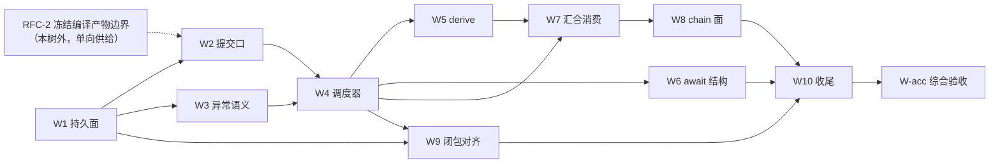

# OVERALL：v3 任务模型三域收敛——工程总体

> 未经操作员验收的总体草稿，不自证任何阶段完成。定位：[RFC.md](RFC.md)（产品语义权威，只读）之下的工程完备层总体，是重拆 issue 的**前置**——拆分只在本总体经操作员验收后进行，并需操作员显式放行。纪律：**无源不结论，但推导即有源**——本文只含三类内容：① 有源事实（RFC / [EVIDENCE.md](EVIDENCE.md) / [SYNTH 冻结快照](SYNTH-546-task-model-seq-par.md)（引用记 `SYNTH:L…`）/ `v3/*-decision.md`）；② 存活资产的逐字搬运与逐行标注；③ 工程结论——从冻结语义推导、从已落地面读取、或归属实现 issue 在约束内自决，每行标出处；**不存在待操作员裁决的工程项**，平面错位的内容移交对应 RFC（§4.4）。本文对 GitHub 零动作。

## 1. 现状底图（复用 EVIDENCE，基点 main `699842e`）

EVIDENCE §2 与当前 HEAD 同基点，直接权威。与本总体直接相关的行：

- **A**：exits 仍是 v2 status/chain action，无 committed-transition 事务（`src/loop.ts:475-478,606-616`、`src/daemon.ts:3320-3433`）。
- **C**：tree shape 存在，生产调度仍走 slot + flat phase（`src/task-runtime.ts:40-58`、`src/scheduler.ts:531-712,872-874`）。
- **D**：join shape 存在，validator/decision core 未生产化；finalizer 仍读 stdout（`src/loop.ts:5494-5535`）。
- **F/G**：initial shape 可写，运行时 materialize/append binding mutation 未实现。
- **I**：`baseBranch` 已消费；chain 层树/顶层 join 声明位未实现。
- **L/M**：#675 shape 与 #678 授权面已落地——表状态权威 + (item,phase) 闭包键（RFC 附录 C 登记三项演进）。
- **PR #749**（`699842e`）：闭包生命周期机制已落地（create/起点公理/fetch/suspend/reopen/consume/启动对账/异步 git），键粒度 (item,phase)。

## 2. 存活资产：逐字搬运与逐行标注

### 2.1 类型化路径完成协议（SYNTH:L397-405，#698/#706 共有节；存活）

RFC `commit` 动词（「一次原子提交持久化返回值、完成 task、构造派发选中的下一应用」）的既有工程基座。逐字：

> 继承 #451 与 #452：agent 查询合法出边并经 CLI 提交选择，提交即业务完成；runner exit 不是业务完成权威。v3 将其从裸 status 扩展为 committed transition。
>
> preset 对每条后继路径声明目标、可选 prompt 模板及全部输入来源。agent 只填写声明为 `exit.*` 的类型化对象；固定或外部值由既有 `item.*` / `chain.*` / `runtime.*` / typed literal binding 按 `required | default` 与 projection 规则填充。缺字段、错类型、非法路径或不可满足的已知 required binding 均不得完成当前 leaf，也不得创建后继。
>
> 本 issue 的树调度只消费 committed transition：前驱裸 terminal 或 runner exit 不足以使 `seq` 后继 ready。一次提交必须原子留下 transition record、完成当前 leaf并构造目标 invocation；调度器不得从 status、stdout 或进程退出推断缺失的路径和输入。

标注：与 RFC §0/§3.3 逐点相容（「返回值的 tag 经声明的派发表选中下一个函数」即此协议的派发半边）；「leaf」读作 task、「seq 后继」读作依赖线后继即为新代数表述。**整节存活**，是提交口的规格底稿。

### 2.2 C00 消费谓词（SYNTH:L496-498，#699 已钉死决策项；存活 + 待重述点）

操作员已裁决的谓词全文（出处 `closure-lifecycle-decision.md` L38-58、L68，经 #699 登记）：

> **消费谓词（C00）：** closure `C` is consumable iff it is `active|suspended`, has no active run, and is absent from the least fixed point of every legal present-or-future resume/reopen edge in the persisted runtime tree. Seeds include its resumable attempt chain, decided-but-unconsumed reopen targeting `C` or an ancestor scope containing it, reachable seq suffixes whose legal target scope includes it, open par containers that can enter another epoch, open runtime-append places that can materialize such a target scope, and materialized par next-epoch candidate bindings that can legally reopen it. A scope seals only when its relevant seq continuations cannot run/recede, relevant par containers are `completed|exhausted` with no next epoch, decided reopens are consumed, and no open append/mutation authority can introduce a target edge. Item terminal, budget exhaustion, cancellation, current `drain`, or missing disk resources alone are never proof. Reachability recheck, `active|suspended -> consumed`, session clearing intent and append/reopen/join-binding writes share one serialization boundary; the winner determines whether the closure is retained or later writes receive a typed conflict. `consumed` is irreversible.
>
> **C00 no-origin rule:** if `origin` exists, fetch and resolve only `origin/<baseBranch>`; fetch/resolve failure is typed and audited with no fallback. If `origin` is absent, do not reject target/chain load: `doctor` emits WARN, create resolves only verified local `refs/heads/<baseBranch>^{commit}`, persists that SHA as the stable base, and records freshness as `no-origin/unavailable`. If the local base branch is absent, creation fails with a typed error. `HEAD` is never a fallback.

标注：no-origin rule、serialization boundary、`consumed` 不可逆、「terminal/预算/取消不是证明」**逐字存活**（与 RFC §四 GC 条款相容）。谓词种子中的 reopen/epoch/binding 类边引用了被 RFC 附录 B 判死的机制——种子集在新代数下如何收窄是 **D-10**，未裁前 #749 的落地实现原样保留（保守方向安全：多保留不回收）。

### 2.3 C01–C16 逐行标注（SYNTH:L529-546，#699 可执行验收）

| ID | 原义 | 新代数下判定 |
|---|---|---|
| C01 | per-closure 隔离（两 phase 两闭包路径/分支互异） | **存活**；「两 phase 两闭包」的键将随 D-1（task 身份）重述 |
| C02 | 起点公理 + fetch 失败 + no-origin | **逐字存活**（RFC §四 Git 供给原样保留） |
| C03 | 引擎建闭包分支、PR headRef 即闭包分支 | **逐字存活** |
| C04 | suspend/reopen 现场逐字节保留 | **需重述**：reopen 转移被 §3.3 判死；「现场保留」义务由 release（await 等待/中断）继承——重述依赖 D-10/D-11 |
| C05 | C00 谓词执法 + 消费证据四值 | **存活**；种子收窄依赖 D-10 |
| C06 | par pin 派生、嵌套独立 pin | **逐字存活**（RFC §3.1 凝固点原文一致） |
| C07 | 启动三方对账 + config/hooks 漂移暴露 | **逐字存活** |
| C08 | Git churn 下 daemon socket 不阻塞 | **逐字存活** |
| C09 | 中断 attempt resume 同 cwd/session、不触发 suspend/GC | **逐字存活**（attempt 链是函数域内部，RFC §0 只在耗尽时上浮 exception） |
| C10 | 共享 Git 协调面并发合同 | **逐字存活** |
| C11 | worktree 路径零 `Bun.spawnSync` | **逐字存活** |
| C12–C16 | typecheck / bun test / engine-integration / diff 卫生 / CI parity 逐字句 | **逐字存活**（形式基准，所有未来 child 沿用） |

### 2.4 P01–P06 逐行标注（SYNTH:L552-559，#699 收敛断言）

| ID | 原义 | 判定 |
|---|---|---|
| P01 | per-slot 路径/分支/扫尸机器生产零命中 | **存活**（slot 退役是 RFC 附录 A 明文） |
| P02 | 起点解析无 `origin → local → HEAD` fallback | **逐字存活** |
| P03 | 零 spawnSync | **逐字存活** |
| P04 | 类型红线 diff 审查句 | **逐字存活**（全仓红线） |
| P05 | 结构性 git 操作仅引擎 namespace、无新 agent 授权 | **逐字存活** |
| P06 | diff 范围隔离句 | **存活**，边界名单随新拆分重写 |

### 2.5 老 #546 关闭验证 17 行逐行标注（SYNTH:L224-242）

| 行 | 原义 | 判定 |
|---|---|---|
| 1 | seq/par 任意深度可声明可调度 | **需重述**：结构树声明出局；对应新语义 = 派发链 + par 派生可达任意深度（RFC §3.1） |
| 2 | par 真并发（区间重叠） | **逐字存活** |
| 3 | 运行中追加平行任务、原地物化 | **逐字存活**（RFC §3.1 动态追加原文一致） |
| 4 | join 演化 + epoch 采样 | **作废**（附录 B-2） |
| 5 | reopen 语义（游标回退、correction 认领） | **作废**（§3.3 无回退）；correction 的前向形态归 D-6 |
| 6 | reopen 预算 | **作废**（随 5） |
| 7 | 独立 worktree + 闭包三态 | **存活**，键与词表随 D-1/D-11 重述 |
| 8 | dependsOn 正交保留 | **存活**；「依赖失败则依赖方永不启动」按 RFC §3.1 原文执行 |
| 9 | 取消向下传播 | **作废**（附录 B-3；运维粒度只有整 chain） |
| 10 | 机制/参数分离 grep | **逐字存活** |
| 11 | 判定器 hold | **需重述**：三词判定通道出局；hold 语义唯一存活形态 = 顶层 finalizer 的 hold-tag（RFC §3.1） |
| 12 | 每闭包单活执法 | **存活**，执法键随 D-1 重述 |
| 13 | 闭包分支程序化 | **逐字存活** |
| 14 | par 同 commit 派生 | **逐字存活** |
| 15/15a | 启动对账 / 共享 Git 协调面 | **逐字存活** |
| 16 | operator 一次性判定 override | **需重述**：三词 override 收窄为 `override-advance` 单动词（§3.3），forward-only |

### 2.6 #709 类型化转移验收 T1–T5（SYNTH:L1031-1037）

T1（出边可计算）/T2（提交即完成）/T3（不完整不得推进）/T4（后继 prompt 数据流）/T5（context 边界）**整表存活**——它们验的正是 2.1 协议，与新代数零冲突。

## 3. 工程结论（原待裁决登记；逐项消解，无待裁决项）

> 原则：操作员裁产品语义（已完成，见 RFC）；工程形态一律**从冻结语义推导、从已落地面读取、或归属实现 issue 在约束内自决**——不存在「待操作员裁决的工程项」。推导不出的先怀疑问题本身：平面错位则移交（§4.4），伪分叉则消解。各项保留原 D 编号；标 ⊘ 的历史候选按各行结论处置（清单见 §6）。

- **D-1 task 身份 → 已决**：task = runtime 树节点，id = 既有 `task_nodes.runtime_node_id`（L 已落地 PK；「同一 definition node 可多次实例化（runtime id 必须不同）」正是 task 多次实例化语义——身份承载早已存在，不发明第二个 id）。生成时点 = 节点落库事务（derive 即节点创建；⊘ 项与此一致，升格为推论）。(item, phase) 为绑定引用列 + 读面投影（附录 C ①）。锁执法键、worktree/分支命名、status 查询以 runtime_node_id 为键。归 W1/W4/W9 实施。
- **D-2 日志与 shape 关系 → 已决**：事件日志为权威源，进**既有 events 面**（#573 已落地的 events 消费契约 + RFC outbound「闭包转移事件进 observer 事件词表」先例）；#675 规范化表保留为同事务维护的投影缓存——§3.5「读面皆投影」的直接落地，不是分叉。字段级形态（⊘ 项）归 W1 实现自决。
- **D-3 派发表编译产物的时序**。**→ 移交 RFC-2 平面（§4.4），本树不裁**。有源锚：RFC §五「RFC-2 向本树供给柯里化编译产物与穷尽性检查、`ExecutionDefinitionRef`」；#739 现行「phase task tree 声明」与三域稿冲突（形态对照见附录 A）。本树约束仅一条：W2 在产物边界冻结前不开工。
- **D-4 derive scope → 已决**：词表声明形态移交 RFC-2（§4.4）；执法半边（结构匹配算法与 typed failure）归 W5 实现自决——约束 = E/F 存活边界（只进未落定结构、default-deny、审计）。这正是老 §10 C 类纪律的辖区：工程落点不向操作员提问。（⊘ 四词词表随移交交割为对方平面候选。）
- **D-5 派生全序与 dedupe → 已决**：全序 = 持久面单写者的事务序（SQLite 既有形态；「派生顺序」本身就是全序，无需发明 tie-break 键）；重放去重 = §2.1 存活协议的提交口幂等先例（「replay 不产生第二条 transition」）推广到 derive；⊘ 幂等键方案作为实现形态归 W1/W5 自决。
- **D-6 unblock 前向重述 → 已决**：答案在存活资产原文里——「unblock 与 dependsOn 只解除尚未 advanced 的 gate；目标已完成或结构已越过时 typed 拒绝」前向照搬：gate 解除场景保留；失败停驻**不提供复活面**（锁模型「没有的动词」的推论；操作员已裁「失败了就是失败了」），救济 = derive 新工作或 override-advance。⊘ 项作废。归 W3/W4。
- **D-7 评估与追加的序 → 已决**：从值域不可变公理直接推出——validator task 是柯里化应用，**实参 = 派生时刻的元组快照**，评估期间的追加不进本次实参；追加使 par 回到未全员落定，advance 消费后继续收集、下轮重新派生 validator（v2 finalizer 布局指纹先例的形态，指纹机制归 RFC-4）。⊘ 项「先冻结后追加入下轮」由候选升格为推论（source = 值不可变 + 指纹先例）。归 W7。
- **D-8 await 带值继续的注入形态**。**→ 移交 RFC-2 平面（§4.4），本树不裁**——值如何进入继续现场是 prompt/binding 渲染问题（函数域内部）。有源锚：§3.1（「下级返回后原函数域带值继续」）；实现约束事实（SYNTH:L217）：主路径 resume 实发重新渲染的完整 phase prompt。（⊘曾发明「声明模板渲染进 resume prompt」。）本树只承载 W6 结构半边。
- **D-9 bundled preset 多轮循环（changes_requested）的映射**。**→ 移交 RFC-2 / preset 平面（§4.4），本树不裁**——闭包内部编排设计，非并发面实现。分叉记录保留供对方平面消费：候选 a（⊘曾当定论）：iteration 长寿命 task + await review，同分支同 PR 跨轮；候选 b：派发循环每轮新 task 新闭包新分支，与「同一 PR 第二轮」现有产品行为冲突。产品可见后果（一个 issue 一个 PR 还是每轮一个 PR）随移交一并交割。
- **D-10 消费谓词种子集 → 已决**：由 §3.3 穷尽动词表机械推导——前向可达边只有三类：① 未完成 task 的 attempt 链（release 后可续）；② await 等待边（等待中的父 task 持有下级、自身闭包在链上）；③ 未落定结构的 derive 可达。动词表穷尽性保证清单穷尽（「无法表达的复活边不需要种子」——非法形状条款的对偶）。C00 其余条款逐字存活；#749 保守实现按此清单收窄。归 W9。
- **D-11 生命周期词表 → 已决**：不改名，沿用 #749 落地词表 active/suspended/consumed（不改变可观察结果的命名归实现；⊘ `released` 改名作废）；suspend 触发点 = `release` 动词的两个场景（await 等待、中断），§3.3 已钉。归 W9。
- **D-12 迁移窗口 → 已决**：按既有 v13/v14 启动时一次性迁移先例执行（daemon 启动迁移是落地惯例）；seq→默认并行方向**只放宽不收紧**——已完成链零行为影响、运行中链只会解除本不存在的依赖约束，无卡死风险，无需兼容窗口机制。归 W1。

跨树非裁决登记：finalizer hold 重问节奏/幂等指纹归 RFC-4（#543）——RFC §3.1 原文明示，不在本树裁。

## 4. 拆分蓝图（候选；验收对象的组成部分，放行前对 GitHub 零动作）

**边界总则（本蓝图与旧树的根本区别）**：#546 树只承载**对象域并发面 + 函数域资源供给**。函数域内部行为与值域的一切——柯里化函数文本、派发表与穷尽性检查、返回 union / exit 校验、prompt/binding 渲染、await 带值继续的注入形态、preset 编排与多轮循环映射——全部属 RFC-2（#547 类型系统）平面，本树**零承载**（移交清单见 §4.4）。依赖单向：RFC-2 产出冻结的编译产物边界 → 本树只消费；任何 W 项在实施中发现依赖 RFC-2 未定内容，停止并移交，不得在本树代裁。旧树的病根正是此边界破产——类型平面内容混入并发树，造成前序任务依赖后序任务的倒置。

### 4.1 W 项清单（全部为新 issue，旧 children 零继承）

| # | 名称 | 一句话交付 | 范围边界 | 依赖 | 承接的 §3 结论 | 沿用的存活验收 |
|---|---|---|---|---|---|---|
| W1 | 持久面 | 五事件（应用/返回/异常/派生/汇合消费）只增日志 + per-task 锁表 + 读面投影 | 只做存储与投影；不改调度行为 | — | D-1、D-2、D-12 | 附录 C 三项演进登记 |
| W2 | 提交口 | 接收经 RFC-2 边界校验的返回值：原子落账 + 完成 task + 按编译产物的派发结果构造下一应用 | 类型校验与派发**计算**归 RFC-2 冻结产物，本项只查表执行；基座 #451/#452 | W1；RFC-2 冻结产物边界 | — | §2.1 协议全文、T1–T5 整表 |
| W3 | 异常语义 | exception 吸收（attempts/exhausted 映射）、fail-stop 依赖线、par 边界 allSettled 收集 | 不含消费者行为（归 W7） | W1 | D-6（unblock 前向面） | C09 |
| W4 | task 调度器 | 锁执法（单活）、依赖线推进、par 真并发、slot 生产路径退役收敛 | 不含 derive/await | W1–W3 | D-1（执法键） | 老 17 行之 2/12、P01–P03 |
| W5 | derive | 运行中追加、原地物化 par、pin 凝固点、授权**执法**半边 | scope 词表的声明形态归 RFC-2；join 诞生定死无演化 | W4 | D-4 执法半边、D-5、D-7 | 老 17 行之 3/14 |
| W6 | await（结构半边） | 派生下级 + release + 下级返回后恢复原函数域调度 | **带值继续的注入形态移交 RFC-2**（§4.4）；本项只做锁与派生结构 | W4 | — | v2 电平触发调查（附录 A trigger 行） |
| W7 | 汇合消费 | drain 平凡消费、validator 派生 task（判定即返回值）、override-advance | 三词判定通道出局；无独立准入面；指纹归 RFC-4 | W4、W5 | D-7 | 老 17 行之 16 重述版 |
| W8 | chain 面 | 默认并行（序=优先级）、item add = 种子值+初始派生、chain-complete finalizer hold-tag、stdout 判定退役 | baseBranch 已落地不重做 | W7 | D-12 | 老 17 行之 11 重述版 |
| W9 | 闭包资源对齐 | #749 已落地机制对齐新词表与前向种子集；闭包键迁移 | 机制不重写，只对齐与收窄 | W1、W4 | D-1、D-10、D-11 | C00 全文、C01–C11、老 17 行之 7/13/15/15a |
| W10 | 收尾守护 | 文档对齐、引擎零业务字面量、计数守护 | 不承载实现补洞 | W1–W9 | — | 老 17 行之 10、N 块 |
| W-acc | 综合验收 | 冻结 SHA 逐条复核存活验收总表（C/P/T + 17 行存活重述版）；整链路 integration 与 compatibility real E2E 边界照旧（#684/#685 归属不变） | 不写产品修复 | 全部 | — | §2 全部标注行 |

### 4.2 依赖图

### 4.3 旧 OPEN children 处置：#698–#709 **全部关闭候选，零继承**

不改写、不拆入。理由：① 旧树边界破产是本轮重推的起点——类型平面内容混入并发树造成依赖倒置，改写会沿袭旧图边与讨论上下文，把破产边界带回新树；② 旧 body 承载已判死语义（reopen / join 演化 / 子树取消 / phase tree / 三词判定通道），逐条剥离的成本高于从零写且必然遗漏；③ 三域收敛后的 W 项与旧 issue 没有一一对应关系，任何「归宿映射」都是伪连续性。关闭动作待放行；关闭 comment 统一指向本总体与 RFC，不逐项考古。

### 4.4 跨 RFC 移交清单（本树零承载；「rfc 互相影响」的显式化）

| 内容 | 去向 | 原登记位 |
|---|---|---|
| 柯里化编译产物、派发表、穷尽性检查、typed exit / binding 校验 | RFC-2（#547 平面） | 原蓝图 W2、原 D-3 |
| await 带值继续的注入形态（值如何进入继续现场） | RFC-2 | 原 D-8 |
| bundled preset 迁移与多轮循环（changes_requested）映射 | RFC-2 / preset 平面 | 原蓝图 W11、原 D-9 |
| derive scope 词表的声明形态（domain type） | RFC-2 | D-4 声明半边 |
| hold 重问指纹 / 防抖、script 判定器 | RFC-4（#543） | 既有跨树登记 |
| context 通道与 `group` 键消费 | RFC-3（#545） | 既有跨树登记 |

移交项的裁决权随内容归属对方平面；本树 D 列表中的 D-3 / D-8 / D-9 保留登记但标注移交，不在本树裁。W2 在 RFC-2 产物边界冻结前不开工——这是把「前一个任务依赖后一个任务」的倒置显式化为跨树时序，而不是在本树内制造环。

## 5. 拆分纪律（本总体验收后才适用）

1. 拆分动作（关旧 issue、开新 issue、发跨树 comment）一律需要操作员显式放行；本总体经操作员验收是放行的前提，不是替代。§3 无待裁决项，不构成前置。
2. 每份未来 child 必须达到 SYNTH 冻结快照所示密度基准（以 #699 spec 为准，SYNTH:L457-580），硬区块：必须先读的关联 issue（契约逐字快照）／目标／范围边界／预期结果（性质表述）／**已钉死的决策项**（引用裁决出处，不许空）／实现事实与边界（path:line）／验收标准／**可执行验收（C 表：逐字命令）**／**收敛断言（P 表）**／验收运行时／测试要求／依赖关系／本 issue 的验证边界（含 CLAUDE.md 逐字条款）。
3. 「已钉死的决策项」只能引用 RFC、§3 工程结论或既有裁决文档；child 内不得出现无源定论——写不出该区块即证明拆分时机未到。

## 6. 收回清单（2026-07-31 越权 issue 草稿中的无源发明；处置以 §3 各行结论为准——部分经推导升格为推论，部分作废，部分随 §4.4 移交交割）

| 曾写成定论的内容 | 归宿 |
|---|---|
| scope 四词词表及匹配规则 | D-4 候选 |
| task id 在 derived 事件生成 | D-1 候选 |
| 事件表/`returned 事件` 等字段级形态 | D-2 候选 |
| derive 幂等键 dedupe | D-5 候选 |
| unblock「派生新消费 task」形态 | D-6 候选 |
| 评估「先冻结后追加入下轮」 | D-7 候选 |
| await 值「声明模板渲染进 resume prompt」 | D-8 候选 |
| iteration+await review 的 retry 映射 | D-9 候选 a |
| 闭包 `released` 态改名 | D-11 候选 |
| N1–N11 十一路切分及其依赖图 | 整体撤回；替代蓝图见 §4（W1–W10 + W-acc，候选；类型平面内容按 §4.4 移交），执行按 §5 纪律 |
