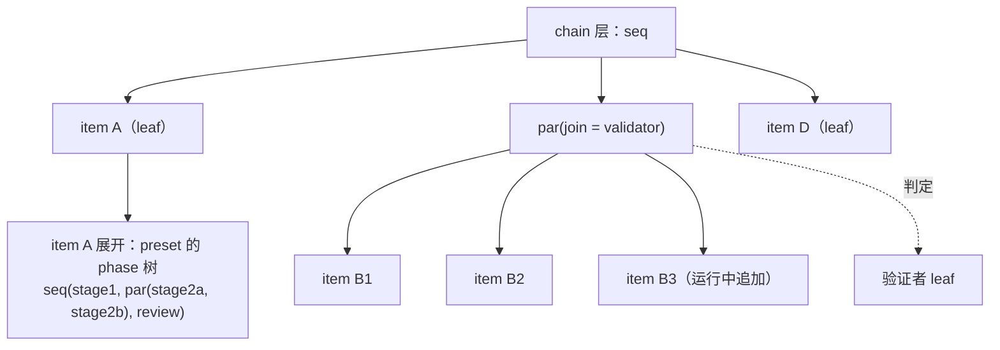
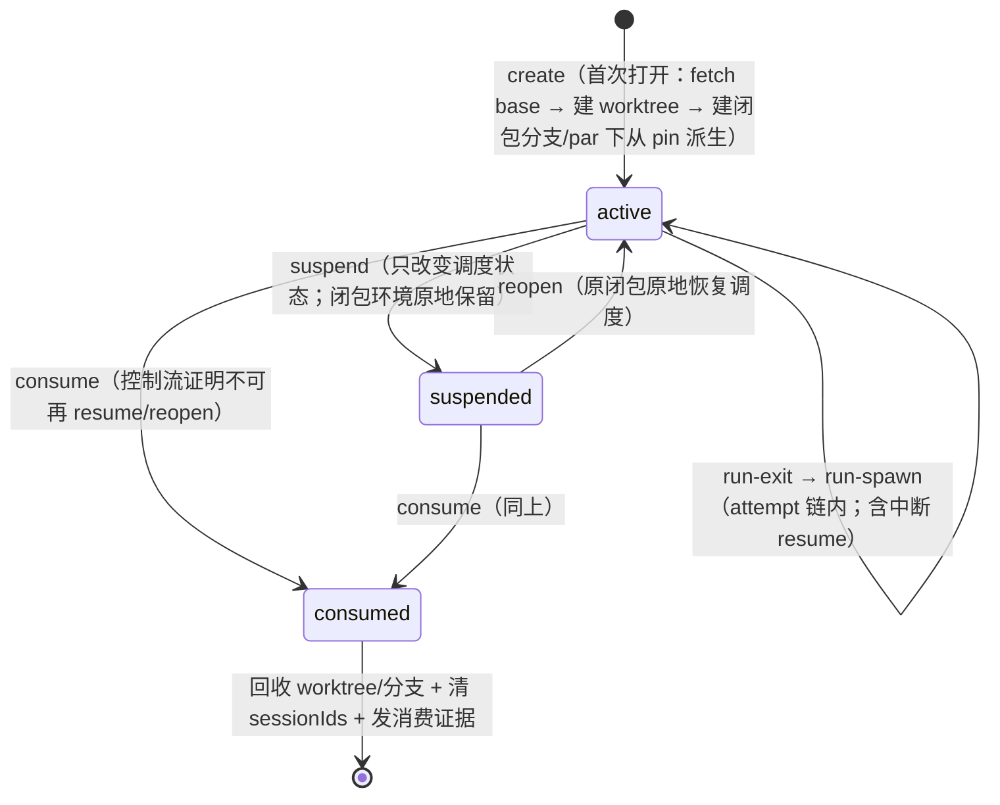

# SYNTH-#546 v3 任务模型：序/并代数、闭包与调度

> 本文档是**本地合成**，未写回 GitHub。依据 RFC #546 与其全部 sub-issue 合并而成。
> 来源：`v3-issue/issues/<N>/`（issue.json + comments.json + timeline.json + subissues.json）+ `v3-issue/design/`。

## 范围与组成

- **源 RFC**：#546 — RFC: v3 任务模型——统一序/并任务代数与并行执行语义
- **子 issue 总数**：25（OPEN 13 / CLOSED·COMPLETED 2 / CLOSED·NOT_PLANNED 10）
- **本合成 issue 编号**：`SYNTH-#546`（仅本地标识）

---

## 一、RFC 设计骨架（#546 原文）

## 摘要

v3 任务模型定为统一的序/并任务树（结构化并发代数）：`task ::= leaf | seq(task…) | par(task…, join)`。chain 层与 phase 层是同一代数的两层实例；join 策略是封闭 ADT（基础阶段由 #739/#700 落 `drain | validator`；本轮 v3 再由 #714 按 variant 准入纪律一次性加入 `script`，v3 关闭终态为 `drain | validator | script`；`best-of-n` 仍是未来方向）；「退回上一步」定义为 reopen（追加纠正 item + seq 游标回退，零状态重置；target 的任务闭包按持久对象重开）；`dependsOn` 保留为跨结构约束边；资源模型公理——每任务（任务闭包 = 同一 (item, phase) 的 attempt 链）一个独立 worktree，闭包是**持久对象**（活跃/挂起/已消费三态，retry/reopen 作用于闭包本身），resume 与业务打回重入都是闭包内动作；引擎自身 git 行为由**供给条款**五条钉住（起点、闭包分支程序化、seq 流转、par pin、回收与消费采样；权威记录 `v3/closure-lifecycle-decision.md`）。本 RFC 替代 #413 的核心模型部分，其三个开放问题全部回答或消解；#413 组成部分 1/2（GitHub App 外挂、item 可选 hapi 端执行）归 RFC-6 线（`v3/rfc-split.md` 已划）。

## 操作员输入（verbatim）

目标源（操作员，2026-07-02，`v3/v3-goals.md` 目标 2 与目标 4）：

> "安全的任务设计有点像 PL 的设计，除了依赖之外还应该有平行函数，所以 v3 加入了可并行任务。这部分需要完整的独立思考到底应该是什么样，而不只是并行这么简单。"

> "iter 实际上是三个不同的阶段，其中两个阶段并行做两个不同的事情。"

#413 核心模型（操作员，2026-06-10，#413 body）：

> "如果把 chains 视作一个链表，链表的任意一个节点可以是一个 item 或者容器，容器可以并发执行所有 item，容器可以在任意时刻添加 item……决定容器能不能到下一步则是由一个验证人员决定，验证人员觉得不行，得退回上一步。然后实际上容器的抽象可以是，默认每一个 item 都被一个容器包裹，所以 item 只要没执行结束都可以随时添加平行任务。"

RFC-1 设计会话裁决（操作员，2026-07-02）：

1. **独立 worktree 公理**：
   > "我认为无论并发不并发，永远都是独立worktree"

   粒度按任务闭包落定（操作员重裁，2026-07-10，边界 2 审查会话，权威记录 `v3/task-closure-decision.md`）：执行单元 = 任务 = 同一 (item, phase) 的 attempt 链；每任务一个独立 worktree——同 item 的先后 phase 不共享、并行分支不共享；同任务的中断/重试续跑（resume）共享同一 worktree，resume 是闭包内动作。工作产物在任务之间只经闭包分支/origin/GitHub 声明通道流动；agent 业务上下文只经 context CLI 流动；repo 级共享 Git 协调面不得承载未声明业务状态。

   闭包升格为**持久对象**（操作员裁决，2026-07-10，边界 1 审查会话，权威记录 `v3/closure-lifecycle-decision.md`）：活跃/挂起/已消费三态——phase 推进离开 = 挂起且只改变调度状态，完整闭包环境原地保留、零 GC；retry 与业务打回重入 = 原闭包恢复活跃；只有控制流证明不可能再合法 resume/reopen 时才进入已消费并允许回收。item terminal、预算耗尽或取消本身不是消费证明。「对谁 retry/reopen」的答案是闭包本身，不是再造一个抽象；worktree 是抽象闭包的可程序化边界，结构性 git 操作（worktree 创建、分支创建命名、起点解析、pin、终态采样、回收）归引擎，内容性 git 操作（commit、解决冲突、push、PR）归 agent。引擎自身 git 行为由供给条款五条钉住（见资源模型公理节）。
2. 任务代数按统一序/并树定案（下节）。
3. 退回语义按「reopen = 追加纠正 + 游标回退，零状态重置」定案；验证者判定经 CLI 写回。
4. 嵌套任意深度、稀疏容器表示、#413 由本 RFC 替代关闭——均裁可。

## 核心模型

### 任务代数

```
task ::= leaf(执行单元)              -- 一个任务：同一 (item, phase) 的 attempt 链（agent run 是其内部步骤）
       | seq(task, task, …)          -- 依序推进
       | par(task, …, join)          -- 并行执行 + 汇合判定；打开期间可追加子任务
join ::= drain                       -- 全部子任务 terminal 即放行
       | validator(item 调用声明)     -- 专用验证者 leaf 判定放行/reopen
```

- join 是封闭 ADT，union 只含语义、持久化、观测投影与全部穷尽消费点同时落地的 variant（#547 约束）；`script`（RFC-4 hook 判定器）由本轮 v3 child #714 按该准入纪律加入 union，并一次落齐持久化、status/events 投影与全部穷尽消费点；`best-of-n`（并行 N 取一）仍是未来方向。
- 递归定义，嵌套深度不设限。「最多两层」不是代数约束，只是 bundled preset 的实际用法。
- **preset = 任务函数定义**（phase 上的任务树），**item = 一次调用**：chain 树的叶子是 item，item 展开为其 preset 声明的 phase 任务树，phase 树的叶子才是任务（其内部为串行 attempt 链，agent run 是 attempt）。业务打回重入（如 changes_requested 后的第二轮迭代）不是新任务——是重开同一任务闭包（同 worktree 路径、同闭包分支、resume session，见资源模型公理）。#413 的「链表+容器」与「iter 三阶段两并行」由同一代数在两层实例化，引擎只实现一套调度语义。



### 路径携带类型化状态与后继 prompt 构造

`seq` / `par` 只给出结构顺序还不构成完整转移。每条可选后继路径由 preset 声明：目标 step/preset invocation、可选 prompt 模板，以及模板每个输入的类型与来源。来源分为两类：

- `exit.*`：当前 agent 在结束任务时必须提交的类型化状态对象；CLI 查询当前合法出边时同时返回所选路径要求的 exit schema。
- `item.*` / `chain.*` / `runtime.*` / typed literal：由引擎沿 preset 既有 binding、`required | default` 与 projection 逻辑解析，agent 无权自报。

当前任务的业务完成事实不是 runner exit，也不是裸 terminal status，而是合法的 committed transition：路径合法、`exit.*` 对象完整且类型正确、可提前决定的其余 required binding 已满足，并在一次原子提交中持久化 transition、完成当前 leaf、构造后继 invocation。后继运行时，所选路径的模板以该 transition state 与既有外部 bindings 渲染为 prompt。runner exit 只表示执行载体结束；未提交合法 transition 不得推进后继。该协议扩展 #451/#452 已落地的“查询出边 → CLI 写入即完成”，不建立第二套完成面。

### join 策略与验证者判定

验证者是普通 leaf（item+preset 调用），判定经 CLI 写回，走 #397 default-deny 准入门形态（判定词表由 preset 声明，无 stdout 解析）：

```
decision ::= advance                       -- 放行，外层 seq 推进
           | hold                          -- 暂不放行，退避后重问（keep-active 语义）
           | reopen(target, correctionItemIds) -- 退回并精确引用已创建的纠正 item
             target      ::= self | 同一 seq 内更早的兄弟节点
             correctionItemIds ::= 同 evaluation scope 下先经 CLI 创建、属于 target 的 item stable id，≥1
```

三词 ADT 与 #543 script gate 共用（统一判定器契约）：`hold` 承接 #543 操作员裁决 2 与 chain-complete keep-active 先例——本 RFC 把 chain-complete trigger 定性为顶层 join 实例，该先例的 `keep-active` 正是 `hold`，`advance | reopen` 二词表达不了它；「rollback 不需要第三词」仅指 rollback = reopen。hold 的重问节奏/幂等指纹机制归 #543（fingerprint 先例）。

- **reopen 零状态重置**：已 terminal 的 item 保持 terminal；纠正 item 追加进 target，target 重开，seq 游标回退到 target。副作用（PR/commit/comment）append-only，新一轮可见。「零状态重置」指不回滚任何已记账状态，不指丢弃执行现场——target 的任务闭包按持久对象从挂起态原地恢复调度（同 worktree、同分支、同 session；环境自挂起起从未被动过，无任何 checkout/还原步骤），现场完整。先例：`gh-issue-pr-iteration` 的 `changes_requested` 重试即此模式——retry 从来是状态转移 + 追加工作，不是回滚。
- **级联再验证**：seq(A,B,C) 中 C 的验证者 reopen A 后，seq 再次途经 B——drain 且无新工作瞬时通过，validator 重新裁决。不需要「跳过未受影响节点」机制。
- **reopen 预算**：容器带 reopen 上限（类比 `maxItemAttempts`），耗尽时引擎写容器级 exhausted 终态。预算值归 preset/chain 元数据，机制归引擎。
- **target 静态可检查**：只能指向 self 或同 seq 更早兄弟——不能指向未跑节点、不能跨出所在 seq 作用域；装载期校验（RFC-2 接缝）。
- **join 判定权演化**（操作员裁决 2026-07-11，权威记录 `v3/join-evolution-decision.md`；#413「判定是 DB 里可随时修改的状态」条款废止）：join 是 future function——未归约汇合 redex 的函数位 + 判定主体绑定，不入 control-plane 字段类（`repoCwd`/`runner`/`priority` 改变 leaf 怎么被执行，join 携带判定权并生成纠正结构）。**定义态 join**（preset/#739 与 chain metadata/#705 声明，#743 保护域内）实例生命周期内不可变，救济 = operator per-epoch decision 或 cancel + 以修正后定义重建；**物化态 join**（#702 诞生，运行态域）允许演化——同容器 append-only **绑定版本追加**（每次演化 = 一等审计事件，含作者/授权类别/生效起始 epoch），**epoch 创建时采样生效**（同 epoch 主体冻结、在途 evaluation 零影响，下一 epoch 用新绑定），值域限 enclosing 实例 pinned 定义内的**编译期候选引用**（`(definitionRef, candidateId)`；`definitionRef` 是 #743 的 tagged `ExecutionDefinitionRef = preset | chain`，运行时可补边界 parse 的绑定值，不可注入调用结构）。授权方向敏感：加严（drain→validator）可经 preset rights 授 agent；放宽（validator→drain）恒 operator-only；授权语义复用 #409/#410 权利矩阵形态，不新增授权面。

### 汇总事实与判定主体

join 不只声明“怎样汇合”，还必须声明**谁拥有推进判定权**。引擎只负责确定性收集并冻结当前 evaluation 所见的 child outcome vector；它不得从 terminal/status 字面量自行推导业务成功。`drain` 的判定主体是引擎内建结构谓词（全成员 terminal）；`validator(item 调用声明)` 的判定主体是该声明实例化出的 validator leaf；script variant 落地后主体是具名 script gate。推进判定权 = join binding 唯一确定的主体 ∪ **operator 显式 override**（同一准入门、同一 epoch 语义、独立审计词条——承接「一次性放行/否决」的运维需求，使「为放行一次而改 join」的需求形态消解；`v3/join-evolution-decision.md` 裁决 5）；判定主体只能通过统一 `advance | hold | reopen` 准入门产生控制效果，普通 child、GUI、observer 与 scheduler 的其他路径都无权代判。判定主体在 epoch 创建时对 join 绑定采样并冻结进 evaluation identity，同 epoch 内不换。#700 必须钉住主体身份、输入快照、evaluation identity 与授权；“收集事实”与“做出业务判定”不得合并成一个隐式 scheduler 分支。

### 动态追加平行任务（#413「默认包裹容器」的替代）

- **语义能力无条件**：任何未终结节点可随时被追加平行兄弟。
- **表示稀疏**：不预建包裹容器；首次追加时把运行中 leaf 原地物化为 par——物化请求可显式指定 join（值域 = pinned 定义内候选引用；追加者在物化时刻最知道这批工作要不要 gate），未指定默认 `join=drain`；诞生后演化按「join 判定权演化」条款（绑定版本追加，归 #703）。物化时容器获得稳定 id（RFC-3 的 `group` scope 键，见接口假设）。
- **粒度**（#413 开放问题「包裹粒度」的消解）：调度、状态准入保持 item 粒度；par 节点是控制流节点，不是可调度单元。
- **授权**：追加 = 现有 `createItems` right 增加目标作用域维度，不发明新授权面。

### dependsOn：保留为跨结构约束边

seq/par 是控制结构；`dependsOn` 是横跨结构的「start-after」数据约束（PL 类比：结构化并发 + await 一个外部 promise），不进代数本体。现状机制原样保留：写入期查环（`src/daemon.ts:4647`）、全部依赖到 success 状态后恢复 entry（`src/scheduler.ts:1710`）；静态声明部分增加装载期查环（RFC-2 接缝）。

### 取消与错误传播

- **取消向下传播**：cancel 任一子树 → 终止其全部下属 run（SIGTERM→SIGKILL，复用现有看门狗路径）+ 未启动 item 落取消终态。
- **错误向上归 join 消化**：子任务失败（exhausted 等非 success 终态）不自动传播；由所在 par 的 join 策略处置——drain 照常放行（终态即完成），validator 看得见失败并可 reopen。
- select/race 不设一等组合子：它是 `par + best-of-n join` 的组合，待 `best-of-n` 按 variant 准入纪律引入时自然获得。

## 资源模型公理：每任务独立 worktree，闭包是持久对象

闭包 = 同一 (item, phase) attempt 链的执行环境：worktree + 引擎创建的工作分支 + session + per-task scratch。三态生命周期（权威记录 `v3/closure-lifecycle-decision.md` §2）：



- **挂起只改变调度状态**：worktree、工作分支、index、未提交文件、session 与 per-task scratch 全部原地保留；不得在 suspend 上 stash、commit、删除或重建闭包环境。挂起和闭包被完全消费是两件事。
- **重开是原闭包原地恢复调度**：从 suspended 切回 active，无 cwd/文件系统/index/分支/session 的搬运或还原步骤。
- **消费证明先于 GC**：`consumed` 是控制流事实，不是 item terminal/预算耗尽/取消的别名。只有控制流能证明该闭包不再处于任何合法 resume/reopen 的可达域时才可 consume；精确可计算谓词由 #699 实施前钉死，证明未成立时闭包环境必须保留。
- **单活性不变式**：每闭包同一时刻至多一个活 run（执法键 = 闭包；挂起态无活 run但环境仍完整保留；par 只存在于闭包之间）；v2 由 slot 串行与 `current_runs` PK=chain_id 偶然保证，二者在 v3 均退役，由 #558/#698 显式重立。
- **GC 只消费 consumed 闭包**：active/suspended 都必须保有 worktree 与闭包分支；consume 后才回收。daemon 启动状态对账：active/suspended→目录与分支都该在；consumed→都不该在；异常暴露不掩盖。
- **hook 挂点**：闭包转移边（create / run-spawn / run-exit / suspend / reopen / consume）作为新事件类型进 observer 事件词表；gate 决策点闭集不扩，**转移边不可 gate**——gate 挡推进决策，suspend/consume 是推进后的闭包状态转移；suspend 零资源副作用，consume 才允许 GC，在副作用上放 gate 即发明第二推进语义；要阻止挂起，在 run post-exit gate 上 hold 即可。
- **一个类型，四张视图**：闭包状态机同时是执行语义、GC 表（仅 consumed 可回收）、hook 挂点表、暴露谓词表（suspend/consume）。四视图共同事实源，持久化归 #558 shape。
- **slot 串行退役**：现行 `(chainId, repoCwd)` slot 内串行（`schedulerSlotKey`，`src/scheduler.ts:791`）的存在理由就是共享单份 worktree（per-slot 分支名，`src/scheduler.ts:813`）；公理落定后「谁能并行」完全由任务结构决定，资源键不再参与语义。
- **并发上限退化为纯限流参数**：全局上限 + per-par 上限，参数归元数据声明（#396 契约），机制归引擎。
- **并行汇合是 git 层动作**：par 各闭包产出各自分支/PR；join 后怎么合并/取舍由 join 策略与下游任务消费决定，引擎不做自动 merge（par pin 只钉入口输入侧确定性，输出侧归 join 与下游）。

### 供给条款（引擎自身 git 行为契约）

递出面定理的对偶：定理证「引擎递出了什么面」（隔离视角），供给条款证「引擎自身 git 行为的承诺是什么」（供给视角）——量化域同样只是引擎代码，设计期可证。终版五条（权威记录 `v3/closure-lifecycle-decision.md` §3）：

| # | 条款 |
|---|---|
| 1 | **起点公理**：worktree 底座 = 创建时刻 `chain.baseBranch`（integration base，默认 main，per-chain 可配——系统迁就现场）最新快照；引擎创建前 fetch base（per-repo 串行化/去重，网络失败显式化，pin 成员免 fetch）；重开时 checkout 闭包分支尖端（底座无关）；声明面历史回退永久出局；无 origin 的 target 走 doctor 警告，不装载拒绝 |
| 2 | **闭包分支程序化**：引擎创建 per-闭包工作分支随闭包递出，贯穿闭包全生命周期至完全消费（PR headRef 即闭包分支）；agent 契约 = 在其上 commit、解决冲突、push、开 PR；preset 指示 agent 自建分支退役；push 到 origin 的 ref 属声明通道，未发布的自建 ref 是 escape 类 |
| 3 | **seq 流转**：worktree 之间无依赖关系，只有并发时等待问题——前驱需被构建于其上的工作已合入 base（不然不流转）；引擎不执法——合并真相是 GitHub 面事实，经声明通道由 preset 判定器（validator/script 自查）按 `advance\|hold\|reopen` 消费；引擎零产物传递机制；引擎级 mergedness gate 出局 |
| 4 | **par 同 commit 派生**：par 展开/物化时引擎 pin base 尖端 commit 并持久化；成员子树共同启动入口任务集的闭包首次打开从 pin 派生（凝固点语义：后续追加复用同 pin）；嵌套 par 内层重新 pin；rationale = 并发代数语义不被调度时序引入副作用 |
| 5 | **回收与消费采样**：GC = 生命周期转移副作用 + 启动状态对账；引擎只回收自己命名空间；证据谓词对象 = 闭包分支，suspend 只发状态事件，consume 时发 `{无工作, 已发布, 未发布即弃, 无法求值}` + origin 新鲜度戳——运行时暴露的首个实例，只暴露不参与推进 |

mergedness 可计算性检验记录（squash merge 杀可达性、v2 自建分支致恒假阳性，「合没合」ground truth 归声明通道判定器；引擎可靠计算的是「自有面上有无工作、发布没发布」）见 `v3/closure-lifecycle-decision.md` §4。

## 引擎递出面定理（系统自证完备）

操作员裁决（2026-07-10，边界 2 审查会话；权威记录与完整审计表见 `v3/task-closure-decision.md`）：设计不保证 agent 百分之百函数式（LLM 不 FP）；完备性证明只对**引擎递出的面**量化（引擎代码有限、静态、可证），不对 agent 行为量化（等同于编译期对不确定值求值）。定理：

> **引擎递给任务的每个面，必须穷尽归入三类之一：任务私有面、声明通道、repo 级共享 Git 协调面。前两类承载业务状态；第三类只承载 Git 对象存储、远端视图分发、引擎 pin 与 linked-worktree 管理，不得成为未声明的业务状态通道。**

三类面的边界不同：任务私有面给出闭包现场隔离；声明通道给出业务状态流合同；共享 Git 协调面只给出协议与 blame，不给出 hostile-agent capability isolation。只有引擎先穷尽递出面、禁止 preset 制度性要求越界操作、并保证自身 repo-wide Git 操作健全后，任务违反共享 Git 协议的操作才可归为 agent escape。引擎主动递出的未分类可写面、合法契约操作之间的互扰、或被共享 config/hooks 被动影响，blame 均在系统。runtime 暴露可延后，谓词即递出面清单本身，事件流房式已有先例（`session_id.invalidated`、#397 准入审计事件）。声明通道闭集：git origin、GitHub 面、#397 准入门 CLI、#545 context CLI、`shared.md` chain 级自由 prompt 注入面、presetDir（只读）；共享 Git 协调面闭集：objects/packs、`refs/remotes/*`、闭包分支与引擎 pin refs、repo config/hooks、linked-worktree metadata。`shared.md` 保留现有创建与 prompt 注入行为；它是显式分类的自由 prompt 注入面，不是结构化 context entry 通道，引擎与 preset 对其内容零行为定义。

定理的对偶面是供给条款（资源模型公理节）：隔离视角证「递出了什么」，供给视角证「引擎自身 git 行为承诺什么」。git 操作按闭包边界分类——**结构性**（worktree 创建、分支创建命名、起点解析、pin、终态采样、回收）归引擎程序化，**内容性**（commit、解决冲突、push、PR）归 agent，程序无法替代（LLM 处理合并冲突）。escape 清单中「用 ambient 凭据」按此收窄为**凭据滥用**——agent 在闭包分支上合法 push 本就使用 ambient git 凭据（git 面凭据不在 #406 run-scoped credential 覆盖内，登记事实）；escape 的是拿凭据越出声明通道（写他人分支、动引擎外 refs），不是使用本身。

当前系统侧缺口登记：

- **缺口①（最重）**：`runnerAdditionalDirs` 把 loopDataRoot 整根授权给每个任务（`src/loop.ts:6457-6459`，含他 chain 目录、全部 evidence、中央 SQLite DB），旁路 #397/#406 准入门——归 #601。
- **边界②**：`sharedContextPath` chain 级共享文件继续绑进每个 phase prompt（`src/scheduler.ts:2218`）——保留现有 `shared.md` 创建与注入行为，并把它显式分类为 chain 级自由 prompt 注入面；#545 context CLI 只垄断结构化、受控、可审计的 context entry 通道，不替代此自由注入面。
- **缺口③（扩围）**：`evidenceDir`/`currentIssueFile`（item 级面）与 `SHARED_CONTEXT_FILE`（chain 级面）寿命都长于任务（`src/scheduler.ts:2205-2221`）——不止 phase 级 par 下共享，纯 seq 下已是「生命周期 ⊆ 任务」反例（同 item 先后 phase 两个任务共享同一 evidenceDir）。按定理口径逐面作用域化，归 #706 落地时处置。
- **共享 Git 协调面（#699/#707 合同）**：worktree 的独立限于 cwd/index/HEAD/WIP/session/scratch；对象库、remote-tracking refs、refs 物理存储、repo config/hooks 与 linked-worktree metadata 仍按 repo 共享。稳定输入只读持久化 base SHA / par pin；`origin/*` 只表达带新鲜度的当前远端观察。fetch/create/consume/worktree 管理由引擎 per-repo 串行化并只改自身 namespace；preset 不得指示任务修改 repo config/hooks、他闭包 refs、pin 或执行破坏性 `gc/repack/prune/worktree remove|prune|repair`。违反者才是 escape；若合法 preset 操作即可破坏他闭包 pin/分支/WIP/resume，则 worktree 载体裁决被证伪。

## 旧概念 → 新代数映射

| 现状概念 | v3 归宿 |
|---|---|
| chain | 顶层 task（通常 seq）；chain 作为命名/凭证/隔离边界保留 |
| item | leaf = preset 调用；可被原地物化为 par 成员 |
| phase 数组顺序推进（`src/scheduler.ts:604-632`） | preset 内 seq；「iter 三阶段两并行」= seq 内嵌 par |
| trigger phase（`afterPhase`/`whenStatus`） | 状态条件化动态 spawn；映射细节归实现 children |
| chain-complete trigger（`src/scheduler.ts:1809`） | 顶层 task 的 join 判定实例（#543 已认定其为 gate 实例）；声明位从 preset trigger 迁至 chain metadata（chain 层树语义的一部分，见接口假设答复 #547） |
| `dependsOn` | 原样保留，跨结构约束边 |
| slot = (chainId, repoCwd) 串行 | 退役 |
| per-slot worktree 与分支名 | 退役，改 per-闭包 worktree 与引擎创建的 per-闭包工作分支（PR headRef 即闭包分支） |
| preset 指示 agent 自建分支（`git switch -c`） | 退役——设计错误，闭包分支由引擎创建随闭包递出（供给条款 2）；bundled preset 改写由 #707 承接 |
| chain 完成时清理 worktree（`cleanupSchedulerChainWorktrees`） | 退役，改闭包生命周期转移副作用（suspend 零 GC、consume 才回收）+ daemon 启动状态对账 |

## 与 #413 的关系

本 RFC 替代 #413 核心模型（superseded）。其三个开放问题的处置：

- **退回语义** → reopen 定义（零状态重置、级联再验证、预算耗尽落 exhausted）。
- **判定状态修改主体与授权对接** → 「判定是可随时修改的 DB 状态」废止；判定权由 join binding 唯一确定 + operator 显式 override，物化态演化经绑定版本追加、授权方向敏感，复用 #409/#410 权利矩阵形态（`v3/join-evolution-decision.md`）。
- **默认包裹粒度** → 稀疏表示消解：能力无条件、容器按需物化、调度保持 item 粒度。

#413 组成部分 1/2（GitHub App 外挂、item 可选 hapi 端执行）与 #418、mouriya-s-lab/hapi-remote-session#1 的重挂归 RFC-6 会话（`v3/rfc-split.md` 已划），本 RFC 不动。#413 在本 issue 发布后 comment 指向替代关系并关闭。

## 接口假设（跨 RFC 接缝）

- **对 RFC-2（#547，已确认）的表达力需求清单**：递归 seq/par 结构的声明语法；join 策略字段（封闭 ADT；#739 基础阶段为 `drain | validator`，#714 在本轮 v3 终态加入 `script`）；validator 的 item 调用声明（preset 引用 + 变量绑定）；reopen target 的静态可检引用形态；per-par 并发上限与 reopen 预算的声明位；装载期检查清单——树 well-formedness、reopen target 合法性（self/更早兄弟）、join 声明完备性、静态 dependsOn 查环；编译产物含任务树结构（供 RFC-5 渲染）；具名 join 候选声明位（运行时进入 join 位的值只能引用 pinned 定义内候选）。八项已由 #547「DSL 演进面」全部承接。
- **答复 #543（RFC-4）**：统一 gate 接口成立——join 的 `validator`（agent-phase 判定器）与 `script` variant（hook 判定器，随 #543 侧执行机制落地、按 variant 准入纪律进 union）共用同一 decision 契约 `advance | hold | reopen(target, correctionItemIds)`（三词 ADT 见「join 策略与验证者判定」节；`hold` 承接 #543 裁决 2 与 keep-active 先例，「rollback」即 reopen 不需要独立词）。判定点合并完成：#543 挂点清单 ∪ 本 RFC 容器推进点（par join；chain-complete 为顶层实例）。闭包生命周期落定后的挂点补充：闭包转移边（create / run-spawn / run-exit / suspend / reopen / consume）作为新事件类型进 **observer 事件词表**；gate 决策点闭集**不因此扩大**——转移边不可 gate（suspend/consume 是推进后的闭包状态转移；suspend 零资源副作用，consume 才允许 GC，副作用上放 gate = 让用户态扣住引擎资源管理、发明第二推进语义）；要阻止挂起，在 run post-exit gate 上 hold，推进被扣则闭包自然不挂起。
- **答复 #544（RFC-5）**：slot 语义退役，不再是展示对象；GUI 的展示对象是任务树（节点 = leaf/seq/par + join 声明与状态 + reopen 计数；leaf 节点携带闭包生命周期态 活跃/挂起/已消费 与闭包分支名——GUI 是闭包状态机同一事实源的展示投影，不另建状态推断），引擎经 status 面暴露树结构快照；「活 run 并行分支」即 par 内多 leaf 各自的 run。**shape 承诺**：树运行态的持久化形态与 status 快照的树结构 shape 由本 RFC 首个实现 child 在设计期钉住（不推迟到编码期），该 shape 是 #544 快照 boundary 收紧与 #545 `group` 键存储的输入——两家依赖它，先行。shape 必须包含任务树节点的稳定 identity 及其与编译产物节点 id 的关联方式：compile/SQLite/status/events 沿同一 identity 链关联，结构路径只用于展示（#547 已钉）。闭包状态表（生命周期态、worktree 路径、闭包分支、sessionIds、par pin commit）随同一 shape 承诺一并钉住——它是四视图（执行/GC/hook/暴露谓词）的持久化事实源。
- **答复 #545（RFC-3）**：`group` scope 键 = par 节点物化时的稳定容器 id（存储位随上条 shape 承诺一并钉住）。context CLI 是并行分支间唯一的结构化、受控、可审计上下文通道；`shared.md` 保留现有创建与 prompt 注入行为，作为 chain 级自由 prompt 注入面，运行时决定内容，引擎与 preset 对内容零行为定义。git 工作产物与 GitHub 面是产物通道，不属 context；供给条款 2 精化产物通道口径：push 到 origin 的闭包分支 ref 属声明通道，agent 未发布的自建 ref 是 escape 类。「不存在文件系统旁路」不作为对 agent 行为的断言成立，改为对引擎的可证断言——引擎递出的每个跨任务面必须显式分类（见「引擎递出面定理」节）；`shared.md` 已作为自由 prompt 注入面入闭集，不是遗漏旁路。
- **答复 #547（RFC-2）反向登记项**：`DEFAULT_PRESET_NAME` 退役后「无 item 在手的 chain 级判定」的落点 = **chain metadata**——chain 层任务树（含顶层 join/chain-complete 判定）声明在 chain 自身元数据，不来自任何 preset（#412 已使 chain 退出 preset 事实源，preset 无处兜底）；声明的边界 parse 与校验归 #547 编译/校验面。item 恢复词表（`entryItemStatusForRecovery`）仍取自 per-item preset，不受影响。

## 实现约束登记（实现 children 承接，本 RFC 不展开）

- git worktree 操作异步化：现同步 git 调用阻塞 daemon 主线程（`createGitWorktreeManager`，`src/scheduler.ts:802`）；per-task worktree churn 下必须消解。
- 回收改闭包生命周期语义：「chain 完成时清理」（`cleanupSchedulerChainWorktrees`）与「daemon 启动扫尸」（`removeStaleSlotBranchWorktree`，`src/scheduler.ts:832`）改为仅在 consumed 后回收，suspend 零 GC；daemon 启动负责状态对账（磁盘目录 + 引擎命名空间分支 vs SQLite 闭包状态表，异常暴露不掩盖）——归 #699。
- 起点解析改起点公理：现行 fallback 链 `origin/<base> → <base> → HEAD`（`chooseWorktreeStartRef`，`src/scheduler.ts:2436-2441`）中 HEAD 兜底与起点公理冲突（底座必须是 base 快照），删除；引擎 fetch 义务（创建前 fetch base，per-repo 串行化/去重，网络失败显式化）新增。fetch 推进共享 `origin/*` 只改变当前远端观察，不得改变闭包持久化 base SHA/par pin/HEAD/index/WIP/分支；suspend 禁止 stash/suspend-commit/目录回收，消费谓词与 consumed 后 GC 归 #699。
- resume 适配：任务闭包粒度下 resume 醒在原 worktree（cwd、session、工作现场与记忆一致），不存在跨 worktree resume，无需 relocation 交代；挂起后的重开只是原闭包原地恢复调度，零重建、零还原；「每个 agent 运行都是无状态的」（CLAUDE.md）精确化为**对外无状态**——闭包私有内存（worktree/session/闭包分支）正是 resume 与重开唤醒的对象。事实核查（2026-07-10）：scheduler 主路径 resume 实发**重新渲染的完整 phase prompt**（`src/scheduler.ts:1029-1035`），固定「继续」仅存在于 chain-complete finalizer 路径（`src/loop.ts:6048`）。
- 全仓代码红线不变：全链路 ADT，禁 `any`/匿名形状，`unknown` 仅限 catch 与边界 parse，禁真 `as`（`as const` 除外）——操作员裁决 2026-06-12，#413 约束节延续。

## 关闭验证

RFC 体裁：钉终态条件，具体命令面由实现 children 落地时具体化为可逐字重跑的命令。

| # | 终态条件 | 验证 | Expect |
|---|---|---|---|
| 1 | seq/par 任意深度可声明可调度 | 声明含嵌套 par 的任务树并真跑 | 嵌套结构按代数语义推进到全树 terminal |
| 2 | par 真并发 | par 内 ≥2 item，daemon 调度下观察 run 时间区间 | 执行区间重叠（真并发，非串行） |
| 3 | 运行中追加平行任务 | 对运行中 leaf 追加兄弟 | 原地物化 par、新 item 被同一容器调度，无需重建 |
| 4 | 物化容器 join 演化 + 定义态零漂移 | 对执行中物化容器追加绑定版本（drain→validator 候选引用；再 validator→drain）；对定义态声明的 join 尝试改写；无授权 agent 尝试放宽 | 追加即审计事件（作者/版本/生效 epoch）；在途 epoch 按旧绑定跑完，下一 epoch 采样新绑定生效；定义态改写被拒并点名；agent 放宽方向被拒；非候选引用值被拒 |
| 5 | reopen 语义 | 验证者先经带 evaluation scope 的 CLI 创建 correction items，再写 `reopen(target, correctionItemIds)` 精确引用 | consumer 校验并原子认领既存 corrections，seq 游标回退、已 terminal item 状态不变、途经节点级联再验证；先前 CLI mutation 不冒充 decision 消费事务的一部分 |
| 6 | reopen 预算 | 预算耗尽再 reopen | 引擎写容器级 exhausted，链不死锁 |
| 7 | 独立 worktree + 闭包三态生命周期 | 任意两个任务的 run（含同 item 先后 phase、同 repo 并发分支）比对路径；触发同任务中断后 resume；触发 phase 推进后对同 item 打回重入 | 不同任务路径互不相同；同任务 resume 醒在同一 worktree；phase 推进后闭包挂起且目录/分支/index/未提交文件/session/scratch 全部保留；打回重入在原闭包原地恢复；只有消费谓词成立后才回收目录/分支并清该 phase `sessionIds` |
| 8 | dependsOn 正交保留 | par 成员携带跨结构 dependsOn | 约束边与并行结构独立生效，环在写入期/装载期被拒 |
| 9 | 取消向下传播 | cancel 一个含活 run 的子树 | 下属 run 全部终止、未启动 item 落取消终态 |
| 10 | 机制/参数分离（#396 契约延续） | grep 引擎源码 | join 策略的取值选择、状态字面量、reopen 预算值均不在引擎，归 preset/元数据声明（join union 的 variant 定义是引擎原生 ADT，不在此列） |
| 11 | 判定器 hold | validator 对未收敛的 par 返回 `hold` | 容器不推进不退回，决策点退避重问（幂等防抖，机制归 #543），下次判定可改判 advance/reopen |
| 12 | 每闭包单活 | 对已有活 run 的闭包再触发调度/唤醒；对挂起态闭包核查 | 引擎拒绝第二个活 run（执法键 = 闭包），拒绝留可审计事件；挂起态闭包无活 run |
| 13 | 闭包分支程序化（供给条款 1/2） | 观察闭包首次打开与 agent 产出的 PR | worktree 底座 = 创建时刻 base 最新快照（引擎先 fetch）；工作分支由引擎创建，agent 未自建分支；PR headRef 即闭包分支 |
| 14 | par 同 commit 派生（供给条款 4） | par 展开含 ≥2 成员并真跑；运行中追加成员；嵌套 par | 成员入口闭包底座 commit 相同且等于持久化的 pin；追加成员复用同 pin；嵌套 par 内层重新 pin |
| 15 | 启动状态对账（供给条款 5） | 人为构造磁盘/分支/DB 三方不一致（多目录、少分支、幽灵记录）后重启 daemon | 对账按闭包状态表逐项核查，异常暴露为可审计事件、不静默清理不掩盖 |
| 15a | 共享 Git 协调面 | 两个 active 闭包 + 一个 suspended 闭包并发执行获准 fetch/commit/push；随后恢复 suspended 闭包并比对 pin/分支/HEAD/index/WIP；另构造 repo config/hooks 漂移 | `origin/*` 可前移且带新鲜度；三闭包保存的稳定输入与私有现场不变；config/hooks 漂移显式暴露；引擎 repo-wide 操作串行且只改自身 namespace |
| 16 | operator 一次性判定 override | operator 对未收敛容器的当前 evaluation epoch 显式写 advance/hold/reopen | 经同一准入门生效 + 独立审计词条；join 绑定不变，下一 epoch 判定主体照旧 |

## 范围外

- DSL 具体语法与装载期校验实现——RFC-2。
- context 共享工具本体——#545（RFC-3）。
- script 判定器执行机制与 hook 点清单——#543（RFC-4）。
- 任务树展示面——#544（RFC-5）。
- GitHub 外挂、hapi 执行通道、#418 与 hapi-remote-session#1 重挂——RFC-6。
- bundled preset v3 化改写（`git switch -c` 退役、implement.md retry 契约改闭包重开形态、e2e standing worktree 兼容形态、spike 分支流、submit.md retry 分支语义）——另立 issue 承接（供给条款 2 的 preset 侧对应物）。
- #534 audit 修复树的 v2 缺陷——并行不悖，不吸进范围。

## 本 issue 的验证边界

- **验证层级**：本 RFC umbrella 不直接运行测试，也不以任一 implementation PR 的局部测试关闭。
- **关闭所需证明**：所有直接 children 达到各自正文声明的验证深度；跨 child 的 v3 新语义接缝由 #684 在冻结合流 SHA 上证明；现有 bundled preset 兼容性由 #685 在发布候选 SHA 上证明。
- **不在本 issue 内执行**：不在 RFC 迭代中重复运行 `scripts/real-e2e.ts`，不把 compatibility E2E 绿解释成 `RFC: v3 任务模型——统一序/并任务代数与并行执行语义` 的新语义已经成立。
- **现有 GitHub real E2E**：本 issue 不运行 `bun scripts/real-e2e.ts`；该 compatibility 验证只由 #685 在冻结发布候选 SHA 上执行。


---

## 二、当前实现 children（OPEN，当前 spec）

### #560 feat(scheduler): 任务闭包资源生命周期——起点、挂起/重开/消费与启动状态对账

- state: **OPEN·REOPENED** | author: `RiriAgent` | created: 2026-07-02
- 关联: referenced `49d84106d5a3`, referenced `73b4007c1d28`, referenced `a476e18668ab`, referenced `ac1471878934`, referenced `b6a443ada9ed`, referenced `d4ca20a105f9`, referenced `cd1e783ca69c`, referenced `2d5bda70019d`

## 必须先读的关联 issue

#546（RFC: v3 任务模型）。继承条款逐字快照：

独立 worktree 公理（操作员 verbatim 2026-07-02；粒度经操作员重裁 2026-07-10，权威记录 `v3/task-closure-decision.md`；闭包升格持久对象经操作员裁决 2026-07-10，权威记录 `v3/closure-lifecycle-decision.md`）：

> "我认为无论并发不并发，永远都是独立worktree"

> "粒度按任务闭包落定……执行单元 = 任务 = 同一 (item, phase) 的 attempt 链；每任务一个独立 worktree——同 item 的先后 phase 不共享、并行分支不共享；同任务的中断/重试续跑（resume）共享同一 worktree，resume 是闭包内动作。工作产物在任务之间只经闭包分支/origin/GitHub 声明通道流动；agent 业务上下文只经 context CLI 流动；repo 级共享 Git 协调面不得承载未声明业务状态。" — #546 body「操作员输入」裁决 1

> "闭包三态 = active / suspended / consumed；suspend 只改变调度状态且零 GC；reopen 原地恢复；只有控制流证明不可再 resume/reopen 才 consumed 并允许回收。" — #546 body「资源模型公理」

> "**起点公理**：worktree 底座 = 创建时刻 `chain.baseBranch` 最新快照；引擎创建前 fetch base（per-repo 串行化/去重，网络失败显式化，pin 成员免 fetch）；重开时 checkout 闭包分支尖端（底座无关）；声明面历史回退永久出局；无 origin 的 target 走 doctor 警告，不装载拒绝" — #546 body 供给条款 1

> "**闭包分支程序化**：引擎创建 per-闭包工作分支随闭包递出，贯穿闭包全生命周期至完全消费（PR headRef 即闭包分支）；agent 契约 = 在其上 commit、解决冲突、push、开 PR；preset 指示 agent 自建分支退役" — #546 body 供给条款 2

> "**回收与消费采样**：GC = 生命周期转移副作用 + 启动状态对账；引擎只回收自己命名空间；证据谓词对象 = 闭包分支，suspend 只发状态事件，consume 时发 `{无工作, 已发布, 未发布即弃, 无法求值}` + origin 新鲜度戳——运行时暴露的首个实例，只暴露不参与推进" — #546 body 供给条款 5

> "**par 同 commit 派生**：par 展开/物化时引擎 pin base 尖端 commit 并持久化；成员子树共同启动入口任务集的闭包首次打开从 pin 派生（凝固点语义：后续追加复用同 pin）；嵌套 par 内层重新 pin" — #546 body 供给条款 4（pin 的持久化位归 #558 shape，本 child 承接「首次打开从 pin 派生」的创建路径）

实现约束登记（#546 body「实现约束登记」，本 child 全部承接）：

> "git worktree 操作异步化：现同步 git 调用阻塞 daemon 主线程（`createGitWorktreeManager`，`src/scheduler.ts:802`）；per-task worktree churn 下必须消解。"
> "suspend 零 GC；active/suspended 均保留完整 worktree，只有 consumed 才回收；daemon 启动对账磁盘目录 + 引擎命名空间分支 vs SQLite 闭包状态表。"
> "起点解析删除 HEAD 兜底并新增 fetch 义务；suspend 禁止 stash、suspend-commit、目录删除或重建。"

## 目标

任务闭包（= 同一 (item, phase) 的 attempt 链）的 worktree 生命周期机制落地：

- **create**：首次打开时创建 worktree 与闭包分支。
- **suspend**：只把调度态从 active 写为 suspended；worktree、分支、index、未提交文件、session、scratch 全部原地保留，禁止任何 GC。
- **reopen**：同一闭包原地恢复 active；零重建、零还原。
- **consume**：只有控制流证明闭包不可能再被合法 resume/reopen 命中时才成立；此后才回收 worktree/分支、清 sessionIds、发消费证据。

外加：钉死可计算的消费谓词；git 操作不阻塞 daemon 主线程；daemon 启动状态对账替代扫尸。

## 使用场景

资源模型公理 + 供给条款 1/2/5 的机制落地。落地后任意两个任务在互不相同的 worktree 中执行；工作产物只经闭包分支/origin/GitHub 声明通道流动，agent 业务上下文只经 context CLI 流动；phase 推进后闭包挂起而非销毁，changes_requested 打回重入与 retry 重开同一闭包（同路径、同分支、session 延续，WIP 不丢）；PR headRef 即引擎建的闭包分支，preset 不再指示 agent 自建分支；slot 退役（#559）以此为前提。对 operator 的可见变化：worktree 目录在 active/suspended 期间始终存在，闭包分支贯穿到完全消费，daemon 重启后对账异常暴露为事件而非静默清理。

## 上下文

- Repo: `mouriya-s-lab/coder-loop`。基线 main，行号实施前自行 grep 核对。
- `createGitWorktreeManager`（`src/scheduler.ts:802`）：per-slot 单份 worktree；分支名 `coder-loop/<chainName>-<sha256(repoCwd)[:12]>`（`src/scheduler.ts:813`）——per-slot 不 per-闭包。
- 起点解析 `chooseWorktreeStartRef`（`src/scheduler.ts:2436-2441`）：fallback 链 `origin/<base> → <base> → HEAD`；引擎现状**零 fetch**（「最新快照」无承载者），HEAD 兜底可使底座偏离 base。
- git 调用走 `Bun.spawnSync`（`src/scheduler.ts:2475`）——同步阻塞 daemon 主线程与 socket 应答（`v3/survey-engine-daemon.md` §2 点名的架构债）。
- 清理路径：`cleanupSchedulerChainWorktrees`（`src/scheduler.ts:850`，调用点 1802，chain 完成时）；`removeStaleSlotBranchWorktree`（`src/scheduler.ts:832`，陈尸分支修复）。
- resume 语义：`item.sessionIds[phase][runner.kind]` 有值走 resume（`resumeDecisionForItem`，`src/scheduler.ts:2129`）。事实核查（2026-07-10）：scheduler 主路径 resume 实发**重新渲染的完整 phase prompt**（`src/scheduler.ts:1029-1035`，`AGENT_CWD`/`RESUMED_*` 绑定随之更新）；固定「继续」（`RESUME_CONTINUE_PROMPT`，`src/loop.ts:994`）仅用于 chain-complete finalizer 路径（`src/loop.ts:6048`），不是本 child 触碰的路径。claude session 按 cwd 键控（`~/.claude/projects/<cwd-slug>/`）——闭包目录始终原地保留，该事实无害。
- worktree 路径 `<loopDataRoot>/chains/<name>/worktrees/`。
- 闭包状态表（生命周期态、worktree 路径、闭包分支、sessionIds、par pin commit）的持久化 shape 归 #558；本 child 消费该 shape。

## 问题

worktree 是 per-slot 共享资源：同一 chain×repo 下所有 item、所有 phase 共享同一目录，状态经文件系统隐式流动，违反独立 worktree 公理；起点解析零 fetch 且带 HEAD 兜底，「底座 = base 最新快照」无机制承载；分支由 preset 指示 agent 自建（`git switch -c`），引擎分支停在 startRef，终态采样谓词无真对象；phase 推进若直接销毁现场，retry/打回重入的 WIP 与 session 全丢（v2 preset 的 retry 契约靠同 worktree 残留现场才成立）；同步 git 调用在 per-闭包 churn 下把主线程阻塞放大为持续抖动；清理只挂在 chain 完成点，闭包级孤儿无人回收。

## 决策项（实施前钉死，落 PR 前在本 issue 登记结论）

1. **消费谓词**：用任务树控制流精确定义何时可证明一个闭包不再处于任何合法 resume/reopen 可达域。item terminal、预算耗尽、取消均不得自动等同 consumed。
2. **消费与动态改写的关系**：运行中追加、reopen target 与 future-function 修改是否仍能重新使旧闭包可达；未钉死前禁止 GC。
3. HEAD 兜底删除后的无 origin target 处置：按供给条款 1 走 doctor 警告 + 本地 base 快照，不装载拒绝。

明确废弃的旧决策：stash vs suspend-commit、挂起目录立即/延迟回收。suspend 零 GC，因此两者都不再存在。

## 预期结果

- 性质：任意两个任务的 worktree 路径互不相同（含同 item 先后 phase、同 repo 并发分支）；每闭包一条引擎创建的工作分支；cwd/index/HEAD/WIP/session/scratch 是闭包私有现场。对象库、remote-tracking refs、refs 物理存储、repo config/hooks 与 linked-worktree metadata 仍是 repo 级共享 Git 协调面，不冒充任务私有状态；业务状态只经 origin/GitHub 声明通道流动。
- **create**：底座 = 创建时刻 base 快照（创建前 fetch，per-repo 串行化/去重，网络失败显式化为事件不静默降级）；par 成员从 pin 派生免 fetch；闭包分支由引擎创建，命名在引擎命名空间内 per-闭包唯一。保存的 base SHA/par pin 是稳定输入；共享 `origin/*` 只是会随合法 fetch 前移的当前远端观察。
- **suspend**：phase 推进离开触发；只写 suspended 状态并发事件，worktree/分支/index/未提交文件/session/scratch 原地不动。单次 run 中断不触发挂起。
- **reopen**：原闭包原地切回 active；不创建、不删除、不 checkout、不 stash、不 commit。
- **consume**：仅在消费谓词成立后触发；回收 worktree/闭包分支、清该 phase `sessionIds`、发消费证据 `{无工作, 已发布, 未发布即弃, 无法求值}` + origin 新鲜度戳。
- **启动状态对账**：枚举磁盘 worktree 目录 + 引擎命名空间分支，对照闭包状态表——active/suspended→目录与分支都该在；consumed→都不该在；每处不一致发可审计事件，修复动作限引擎自己命名空间；同时核对 repo config/hooks 的引擎合同，漂移显式暴露、不静默继承任务留下的修改。
- **共享 Git 协调协议**：引擎的 fetch/create/consume/worktree 管理 per-repo 串行化；active/suspended 存在时不做显式 `git gc`；引擎只改自身 branch/pin/worktree namespace。任务修改 repo config/hooks、他闭包 refs/pin，或执行破坏性 `gc/repack/prune/worktree remove|prune|repair` 不在合法合同内。
- worktree git 操作不阻塞 daemon 主线程：git 操作进行期间 socket 请求照常应答。

## 不应残留

- 本 child 范围内：per-slot 分支命名（`coder-loop/<chainName>-<hash(repoCwd)>`）作为运行分支；**跨任务**共享 worktree 的任何路径；把整个 repo Git state 宣称为任务私有的文案；起点解析的 HEAD 兜底；引擎零 fetch 状态；任何 suspend 上的 stash/commit/worktree 删除或重建；active/suspended 存在时的显式 `git gc`；引擎修改非自身 namespace；repo config/hooks 漂移静默通过；consumed 后残留的 `sessionIds` 或闭包分支；worktree 管理路径上的 `Bun.spawnSync`；「仅 chain 完成时清理」作为唯一回收点；创建/回收路径上的任何自动 merge / 自动 push（汇合归 join 策略与下游消费；引擎对闭包分支只做结构性操作，内容性操作归 agent）。
- 本 issue 范围之外不应改动：不动 slot 调度串行语义本身（归 #559——本 child 落地后 slot 串行仍在，只是失去存在理由）；不动 join/汇合语义；不动闭包状态表 shape 定义（归 #558，本 child 消费）；preset 侧 `git switch -c` 指示的删除归 #604（引擎侧递出分支先行，preset 侧跟进）。

## 约束

- 代码红线（操作员裁决 2026-06-12，全仓统一）：必须全链路 ADT，禁止任何类型退化。不引入 `any`/匿名形状；`unknown` 仅限 catch 与边界 parse 入口；禁止真 `as` 断言（`as const` 除外）；外部输入经边界 parse（arktype）为精确类型后流转。违反红线 = changes requested，无例外。
- 与 #534 audit 树排序默认（v3 总控整合裁定，2026-07-02）：#535（spawn 流水线错误收容，直接同面）/#536/#538 默认先合、本 child 其后 rebase；偏离需在本 issue 说明理由。

## 本 issue 的验证边界

- **验证层级**：真实 daemon + 隔离 loop-data + 确定性 runner 的专用进程级 integration。
- **本 issue 必须证明**：fixture 直接进入本 issue 新增的运行态与转移，观察 SQLite/status/events/进程或资源生命周期的前后值；只跑旧线性 preset而没有进入新状态不算通过。
- **不在本 issue 内执行**：不负责连接全部 v3 子系统，也不运行 bundled preset compatibility real E2E。跨 issue 场景归 #684；真实 GitHub preset 不回归归 #685。
- **现有 GitHub real E2E**：本 issue 不运行 `bun scripts/real-e2e.ts`；该 compatibility 验证只由 #685 在冻结发布候选 SHA 上执行。
## 验收标准

| Dimension | Check | Command | Env | Expect |
|---|---|---|---|---|
| function | per-闭包隔离（#546 行 7） | 真跑一条两 phase 链，从 runs/events 取两 phase（两闭包）的 worktree 路径与分支比对 | local | 路径互不相同；分支互不相同且均为引擎命名空间 |
| function | 起点公理（#546 行 13） | 创建前在 origin 侧推进 base，观察新闭包底座 commit；断网/坏 remote 下创建 | local | 底座 = fetch 后的 origin base 尖端；网络失败显式化为事件，无 HEAD 兜底 |
| function | 闭包分支程序化（#546 行 13） | 检查闭包创建后的分支存在性与 agent run 结束后 PR 的 headRef | local | 分支由引擎建（run 开始前已存在）；PR headRef 即闭包分支 |
| function | 挂起/重开（#546 行 7） | 跑完一个 phase 触发推进（挂起），随后触发打回重入（重开）；比对挂起前后与重开后的路径、分支尖端、脏文件、session | local | 挂起前后目录、分支、index、tracked/untracked/ignored 文件与 session 均原地不变；重开只改变调度态，resume 成功 |
| function | 消费谓词与 GC（#546 行 7） | 先让 item terminal 但保持合法 reopen 可达，再让外层控制流完成使谓词成立；分别检查 worktree/分支/sessionIds | local | terminal 但未 consumed 时环境完整保留；谓词成立进入 consumed 后才回收目录/分支并清 sessionIds，消费证据可见 |
| function | par pin 派生（#546 行 14） | par 展开 ≥2 成员，比对各成员闭包底座 commit 与持久化 pin | local | 底座 commit 全部等于 pin；成员创建路径无独立 fetch |
| function | 启动状态对账（#546 行 15） | 人为构造磁盘/分支/DB 三方不一致（多目录、少分支、幽灵记录）后重启 daemon | local | 逐项核查、异常暴露为可审计事件、修复限引擎命名空间、不静默清理 |
| function | 主线程不阻塞 | 在多 chain 并发 spawn（worktree 操作密集）期间循环调 `coder-loop daemon status <target> --json` 计时 | local | 应答无 git 操作时长级别的停顿 |
| function | 同任务 resume 醒在原 worktree（#546 行 7） | 中断一次 run 触发同任务 resume（第二 attempt），查 resumed run 的 agentCwd 与 session 有效性 | local | agentCwd 等于上次 run 的 worktree 路径；session resume 成功；中断不触发挂起/回收 |
| integration | 共享 Git 协调面 | 建两个 active 闭包与一个 suspended 闭包；并发执行合同内 fetch/commit/push 后恢复 suspended 闭包，比对保存的 base SHA/par pin、分支、HEAD、index、tracked/untracked WIP；另修改 repo config/hooks 后重启对账 | local | `origin/*` 可前移且有新鲜度记录；三闭包稳定输入与私有现场不变；repo-wide 引擎操作串行且仅改自身 namespace；config/hooks 漂移发可审计事件 |
| assumption | 同步阻塞点消除 | `grep -n "spawnSync" src/scheduler.ts` | local | worktree 管理路径零命中 |
| type | 全链路 ADT | `bun run typecheck` | local | 通过 |

## 依赖关系

- Depends on: #558（闭包状态表 shape——本 child 消费其持久化形态；shape 先行）。
- Blocks: #559（树调度）——slot 退役以 per-闭包 worktree 为前提；#604（bundled preset v3 化）——preset 侧 `git switch -c` 退役以引擎递出闭包分支为前提。


### #698 feat(scheduler): 从公开入口实例化并调度 seq/par drain

- state: **OPEN** | author: `RiriAgent` | created: 2026-07-17
- 关联: referenced `eb25dd6900c7`

## 必须先读的关联 issue

继承 [#546](https://github.com/mouriya-s-lab/coder-loop/issues/546) 的任务代数、资源模型、供给条款、机制/参数分离和总关闭验证。

## 现行补充契约：类型化路径完成协议

继承 [#451](https://github.com/mouriya-s-lab/coder-loop/issues/451) 与 [#452](https://github.com/mouriya-s-lab/coder-loop/issues/452)：agent 查询合法出边并经 CLI 提交选择，提交即业务完成；runner exit 不是业务完成权威。v3 将其从裸 status 扩展为 committed transition。

preset 对每条后继路径声明目标、可选 prompt 模板及全部输入来源。agent 只填写声明为 `exit.*` 的类型化对象；固定或外部值由既有 `item.*` / `chain.*` / `runtime.*` / typed literal binding 按 `required | default` 与 projection 规则填充。缺字段、错类型、非法路径或不可满足的已知 required binding 均不得完成当前 leaf，也不得创建后继。

本 issue 的树调度只消费 committed transition：前驱裸 terminal 或 runner exit 不足以使 `seq` 后继 ready。一次提交必须原子留下 transition record、完成当前 leaf并构造目标 invocation；调度器不得从 status、stdout 或进程退出推断缺失的路径和输入。

补充验收：通过公开 CLI 运行 `seq(A,B)`；A 分别尝试缺少 required `exit.*` 字段、字段类型错误、非法路径与完整合法对象。前三者均非零退出，A 不完成且 B 不存在/不可调度；合法提交后恰有一条 transition record，A 完成且 B 成为唯一后继。

## 目标

通过公开 daemon/CLI 创建入口实例化最小 runtime tree 并执行 seq/par drain；禁止直接写 SQLite/createTaskTree 作为验收。

调度决策从「flat position 队列 + slot=(chainId, repoCwd) 串行」切换为任务树遍历：seq 依游标推进、par 打开期间成员真并发、任意深度嵌套、slot 语义退役、单活性执法键从「chain / slot」重立到「闭包」、par 展开时按供给条款 4 写入 pin。

## 预期结果

- 调度决策唯一来源是任务树结构：seq 按游标依序推进；par 打开期间全部未终结成员可并发 spawn；嵌套任意深度按代数语义推进（性质：对任何 well-formed 树，每个 tick 的可 spawn 集 = 树语义允许的就绪 leaf 集，与资源键无关）。
- **spawn 一个 leaf = 查闭包状态表决策动作**（对照 #558 shape）：
  - 无闭包记录 → 触发 #699 的 create 转移；
  - 闭包记录为 suspended → 触发 #699 的 reopen 转移；
  - 闭包记录为 active 且当前无活 run → 触发 #699 的 resume 路径（同 worktree、同 session，attempt 链内继续）；
  - 闭包记录为 active 且已有活 run → 违反单活性，本 tick 不 spawn（下一 tick 由 run-exit 事件驱动）；
  - 闭包记录为 consumed → 该 leaf 不再可 spawn（终态既落）。
  本 child 只做决策与派发，机制本体归 #699；调度侧不重复实现闭包转移。
- drain join 的**结构性放行**随树遍历落地：par 全部成员 terminal 即容器 terminal、外层 seq 推进（drain 是代数的退化 join，无判定通道即可放行）；validator/hold 判定通道归 #700（join 评估）——本 child 落地后未声明 validator 的 par 全链路可跑通。
- **slot 串行语义退役**：`schedulerSlotKey` 不再参与调度决策；同 chain 同 repoCwd 的 par 成员执行区间可重叠。退役 rationale 更新——「共享单份 worktree」的存在理由消失，v3 每闭包一份 worktree，资源键（chainId, repoCwd）与「谁能并行」解耦。
- **单活性执法（新执法键 = 闭包）**：v2 偶然保证的两根柱子（slot 串行、`current_runs` PK=chain_id）随 slot 退役与树调度落地同时消失，本 child 在调度路径按新键显式重立——每次 spawn 决策前查该 leaf 对应闭包是否已有活 run，命中即拒绝第二个 run 并留可审计事件；表征形态（`current_runs` PK 换 closure id 还是别的形态）跟随 #558 shape，本 child 消费；挂起态闭包对应 leaf 决策路径不 spawn（走 reopen 而非新 create）。
- **par 展开时 pin 写入**：调度器识别到某 par 节点进入「展开」状态（即将 spawn 其成员入口任务集）时，先 pin base 尖端 commit——存储位与字段归 #558 shape，本 child 在调度路径承接**写入动作**并保证「pin 先落库、成员闭包 create 后读同一 pin」的时序（避免调度时序引入副作用）；嵌套 par 内层 par 展开时同样重新 pin（内层 par 有自己的 pin，独立于外层）；运行中追加成员时**不**重 pin（凝固点语义，追加复用同 pin——由 #702（动态物化）在追加路径消费）；本 child 只负责首次展开路径的 pin 写入与内层重 pin 语义。
- 并发上限 = 纯限流参数：全局上限与 per-par 上限的值取自元数据声明；未声明全局上限 = 不限（现状语义延续）；引擎不驻留业务上限数值。
- dependsOn 与树正交：par 成员携带跨结构 dependsOn 照常被 gate、全依赖 success 后恢复；写入期查环行为不变。
- 子任务失败不自动向上传播：非 success 终态成员不使容器/祖先失败，容器处置归 join 评估（后续 child）；本 child 保证失败 leaf 的退避/attempts 语义在树下不回归。
- v2 线性链（退化 seq 树）调度行为零回归。

## 验收标准

| Dimension | Check | Command | Env | Expect |
|---|---|---|---|---|
| function | par 真并发（#546 行 2） | 构造 par 内 2 item（同 chain 同 repoCwd）的树，daemon 调度后查 runs 表两 run 的 `started_at`/`ended_at` | local | 执行区间重叠（真并发，非串行） |
| function | 嵌套深度推进（#546 行 1 调度半边） | 构造 `seq(leaf, par(leaf, par(leaf, leaf)))` 树真跑 | local | 嵌套结构按代数语义推进到全树 terminal |
| function | spawn 派发按闭包状态决策 | 分别构造三态触发场景：新 leaf（无闭包记录）、已挂起 leaf 被重新调度（suspended）、活跃闭包中断后 tick（active/无活 run） | local | 三种场景分别触发 #699 的 create / reopen / resume 转移调用；调度决策不直接写闭包状态 |
| function | 单活性执法（执法键 = 闭包） | 对已有活 run 的闭包再次触发 spawn 决策；对同 leaf 挂起态触发调度 | local | 第二个活 run 被拒 + 审计事件；挂起态走 reopen 分支不走 create |
| function | par 展开 pin 写入（供给条款 4） | 首次展开含 ≥2 成员的 par；嵌套 par 内层展开 | local | 展开前 pin base 尖端 commit 落库（存储位随 #558）；成员闭包 create 后底座 commit = 该 pin；内层 par 独立重新 pin |
| function | per-par 上限限流 | par 内 3 成员 + 元数据声明 per-par 上限 2，观察活 run 数 | local | 任意时刻该容器活 run ≤ 2，全部成员最终完成 |
| function | 全局上限限流 | 元数据声明全局上限 1 + 两 chain 各一就绪 item | local | 任意时刻全 daemon 活 run ≤ 1；未声明时行为不限（现状延续） |
| function | dependsOn 正交（#546 行 8） | par 成员携带跨结构 dependsOn 真跑；另写入含环的 dependsOn | local | 约束边与并行结构独立生效（先 gate 后恢复 entry）；环在写入期被拒 |
| function | 失败不上溯 | par 内一成员耗尽 attempts 落 exhausted，其余成员正常 | local | 其余成员照常执行完成；容器与祖先不因此失败 |
| assumption | slot 退役（#546 行 10 切片） | `grep -n "schedulerSlotKey" src/scheduler.ts src/daemon.ts` | local | 无调度决策路径引用（符号删除或仅存于迁移/清理代码） |
| type | 全链路 ADT | `bun run typecheck` | local | 通过 |

## 依赖关系

- Depends on: #558、#601、#699；外部 #737、#739、#743。
- Blocks: #700、#702、#704、#705、#706、#708、#709、#715、#724、#731、#744。


### #699 feat(scheduler): 任务闭包资源生命周期与 Git supply

- state: **OPEN** | author: `RiriAgent` | created: 2026-07-17
- 关联: referenced `19a88bc1f0bd`, referenced `7a23e3aa710a`, referenced `56bcf4b8d75a`, referenced `3b7ac4efd34e`, referenced `45971f5270f1`, referenced `eb929621a748`

## 必须先读的关联 issue

继承 [#546](https://github.com/mouriya-s-lab/coder-loop/issues/546) 的任务代数、资源模型、供给条款、机制/参数分离和总关闭验证。

## 目标

在线性公开生产路径交付 per-(item,phase) closure create/suspend/reopen/consume、worktree/branch/session、起点、对账及本 issue 钉死的可执行验收契约；不要求 par scheduler、reopen decision producer 或 preset 改写。

任务闭包（= 同一 (item, phase) 的 attempt 链）的 worktree 生命周期机制落地：

- **create**：首次打开时创建 worktree 与闭包分支。
- **suspend**：只把调度态从 active 写为 suspended；worktree、分支、index、未提交文件、session、scratch 全部原地保留，禁止任何 GC。
- **reopen**：同一闭包原地恢复 active；零重建、零还原。
- **consume**：只有控制流证明闭包不可能再被合法 resume/reopen 命中时才成立；此后才回收 worktree/分支、清 sessionIds、发消费证据。

外加：钉死可计算的消费谓词；git 操作不阻塞 daemon 主线程；daemon 启动状态对账替代扫尸。

## 范围边界

本 issue 在 v2 引擎上、基于已在 `main` 的 v3 task-closure shape 交付 per-`(item, phase)` 任务闭包资源生命周期；不实现 #698 树调度、#701 reopen 控制流、#702 运行中物化、#703 join binding 写入 API、#707 preset 改写，也不承担 #684 跨 issue 整链路 integration 与 #685 bundled preset compatibility E2E。

## 预期结果

- 性质：任意两个任务的 worktree 路径互不相同（含同 item 先后 phase、同 repo 并发分支）；每闭包一条引擎创建的工作分支；cwd/index/HEAD/WIP/session/scratch 是闭包私有现场。对象库、remote-tracking refs、refs 物理存储、repo config/hooks 与 linked-worktree metadata 仍是 repo 级共享 Git 协调面，不冒充任务私有状态；业务状态只经 origin/GitHub 声明通道流动。
- **create**：底座 = 创建时刻 base 快照（创建前 fetch，per-repo 串行化/去重，网络失败显式化为事件不静默降级）；par 成员从 pin 派生免 fetch；闭包分支由引擎创建，命名在引擎命名空间内 per-闭包唯一。保存的 base SHA/par pin 是稳定输入；共享 `origin/*` 只是会随合法 fetch 前移的当前远端观察。
- **suspend**：phase 推进离开触发；只写 suspended 状态并发事件，worktree/分支/index/未提交文件/session/scratch 原地不动。单次 run 中断不触发挂起。
- **reopen**：原闭包原地切回 active；不创建、不删除、不 checkout、不 stash、不 commit。
- **consume**：仅在消费谓词成立后触发；回收 worktree/闭包分支、清该 phase `sessionIds`、发消费证据 `{无工作, 已发布, 未发布即弃, 无法求值}` + origin 新鲜度戳。
- **启动状态对账**：枚举磁盘 worktree 目录 + 引擎命名空间分支，对照闭包状态表——active/suspended→目录与分支都该在；consumed→都不该在；每处不一致发可审计事件，修复动作限引擎自己命名空间；同时核对 repo config/hooks 的引擎合同，漂移显式暴露、不静默继承任务留下的修改。
- **共享 Git 协调协议**：引擎的 fetch/create/consume/worktree 管理 per-repo 串行化；active/suspended 存在时不做显式 `git gc`；引擎只改自身 branch/pin/worktree namespace。任务修改 repo config/hooks、他闭包 refs/pin，或执行破坏性 `gc/repack/prune/worktree remove|prune|repair` 不在合法合同内。
- worktree git 操作不阻塞 daemon 主线程：git 操作进行期间 socket 请求照常应答。

## 已钉死的决策项

- **消费谓词（C00）：** closure `C` is consumable iff it is `active|suspended`, has no active run, and is absent from the least fixed point of every legal present-or-future resume/reopen edge in the persisted runtime tree. Seeds include its resumable attempt chain, decided-but-unconsumed reopen targeting `C` or an ancestor scope containing it, reachable seq suffixes whose legal target scope includes it, open par containers that can enter another epoch, open runtime-append places that can materialize such a target scope, and materialized par next-epoch candidate bindings that can legally reopen it. A scope seals only when its relevant seq continuations cannot run/recede, relevant par containers are `completed|exhausted` with no next epoch, decided reopens are consumed, and no open append/mutation authority can introduce a target edge. Item terminal, budget exhaustion, cancellation, current `drain`, or missing disk resources alone are never proof. Reachability recheck, `active|suspended -> consumed`, session clearing intent and append/reopen/join-binding writes share one serialization boundary; the winner determines whether the closure is retained or later writes receive a typed conflict. `consumed` is irreversible. Sources: [#546](https://github.com/mouriya-s-lab/coder-loop/issues/546), [`closure-lifecycle-decision.md` lines 38-58](https://github.com/mouriya-s-lab/coder-loop/blob/9ac3b87d336a04a564a40fa3ce9163d361e86b40/v3/closure-lifecycle-decision.md#L38-L58), and current-main [`task-runtime.ts`](https://github.com/mouriya-s-lab/coder-loop/blob/9ac3b87d336a04a564a40fa3ce9163d361e86b40/src/task-runtime.ts#L13-L58).
- **C00 runtime mutation relation:** runtime append adds new work and does not itself reactivate an old closure, but an open append place keeps that closure reachable when it can still materialize a legal reopen issuer whose structural target scope contains it. A decided `reopen(target, corrections)` is consumed atomically under its sampled binding; it activates the original target closure and append-only corrections survive later join evolution. Definition joins are immutable for the instance. Materialized join evolution appends binding versions, cannot alter an in-flight epoch, and affects only a next epoch; therefore every legally installable candidate counts while a next epoch remains possible, and no binding mutation can resurrect a closure after the par control domain seals. Sources: [`join-evolution-decision.md` lines 11-18 and 39-58](https://github.com/mouriya-s-lab/coder-loop/blob/9ac3b87d336a04a564a40fa3ce9163d361e86b40/v3/join-evolution-decision.md#L11-L58) and #546.
- **C00 no-origin rule:** if `origin` exists, fetch and resolve only `origin/<baseBranch>`; fetch/resolve failure is typed and audited with no fallback. If `origin` is absent, do not reject target/chain load: `doctor` emits WARN, create resolves only verified local `refs/heads/<baseBranch>^{commit}`, persists that SHA as the stable base, and records freshness as `no-origin/unavailable`. If the local base branch is absent, creation fails with a typed error. `HEAD` is never a fallback. Source: [`closure-lifecycle-decision.md` line 68](https://github.com/mouriya-s-lab/coder-loop/blob/9ac3b87d336a04a564a40fa3ce9163d361e86b40/v3/closure-lifecycle-decision.md#L68).

## 实现事实与边界

- **Satisfied hard dependency:** #558 is closed and its implementation [PR #675](https://github.com/mouriya-s-lab/coder-loop/pull/675) merged as `9ac3b87d336a04a564a40fa3ce9163d361e86b40`. The merged shape provides `task_closures`, `closure_sessions`, closure-keyed active runs, par pin/binding/evaluation records, and `setClosureLifecycle` / `setClosureResources`; it intentionally does not implement 本 issue scheduler lifecycle.
- **Current-main implementation facts:** [`src/scheduler.ts`](https://github.com/mouriya-s-lab/coder-loop/blob/9ac3b87d336a04a564a40fa3ce9163d361e86b40/src/scheduler.ts#L843-L951) still creates one slot worktree/branch per `chain × repoCwd`, cleans/prunes at chain scope, and [`chooseWorktreeStartRef`](https://github.com/mouriya-s-lab/coder-loop/blob/9ac3b87d336a04a564a40fa3ce9163d361e86b40/src/scheduler.ts#L2702-L2707) still falls through to `HEAD`; the Git helper is synchronous at lines 2743-2753. [`src/daemon.ts`](https://github.com/mouriya-s-lab/coder-loop/blob/9ac3b87d336a04a564a40fa3ce9163d361e86b40/src/daemon.ts#L2296-L2368) reconciles stale runs only, not closure resources/config/hooks. Compatibility provisioning currently assigns each materialized phase closure the same incoming slot resource identity, so changing only the visible scheduler cwd is insufficient.
- **Shape boundary:** current-main has no #701 reopen-decision writer or #702/#703 mutation API. This PR implements the pure reachability algebra, serialized consume/recheck boundary, current scheduler lifecycle calls and fixtures that seed those future-writer states; it must not invent the later producer APIs or add a fourth closure lifecycle state.
- **Deferred verification:** open #684 owns frozen-SHA cross-v3 integration and open #685 owns bundled GitHub real E2E. Their absence does not authorize replacing C01-C10 with the old linear preset or running `real-e2e.ts` here.
- No browser, external service, production credential, deployment, or IaC dependency exists for 本 issue's local deterministic runtime.

## 验收标准

| Dimension | Check | Command | Env | Expect |
|---|---|---|---|---|
| function | per-闭包隔离（#546 行 7） | 真跑一条两 phase 链，从 runs/events 取两 phase（两闭包）的 worktree 路径与分支比对 | local | 路径互不相同；分支互不相同且均为引擎命名空间 |
| function | 起点公理（#546 行 13） | 创建前在 origin 侧推进 base，观察新闭包底座 commit；断网/坏 remote 下创建 | local | 底座 = fetch 后的 origin base 尖端；网络失败显式化为事件，无 HEAD 兜底 |
| function | 闭包分支程序化（#546 行 13） | 检查闭包创建后的分支存在性与 agent run 结束后 PR 的 headRef | local | 分支由引擎建（run 开始前已存在）；PR headRef 即闭包分支 |
| function | 挂起/重开（#546 行 7） | 跑完一个 phase 触发推进（挂起），随后触发打回重入（重开）；比对挂起前后与重开后的路径、分支尖端、脏文件、session | local | 挂起前后目录、分支、index、tracked/untracked/ignored 文件与 session 均原地不变；重开只改变调度态，resume 成功 |
| function | 消费谓词与 GC（#546 行 7） | 先让 item terminal 但保持合法 reopen 可达，再让外层控制流完成使谓词成立；分别检查 worktree/分支/sessionIds | local | terminal 但未 consumed 时环境完整保留；谓词成立进入 consumed 后才回收目录/分支并清 sessionIds，消费证据可见 |
| function | par pin 派生（#546 行 14） | par 展开 ≥2 成员，比对各成员闭包底座 commit 与持久化 pin | local | 底座 commit 全部等于 pin；成员创建路径无独立 fetch |
| function | 启动状态对账（#546 行 15） | 人为构造磁盘/分支/DB 三方不一致（多目录、少分支、幽灵记录）后重启 daemon | local | 逐项核查、异常暴露为可审计事件、修复限引擎命名空间、不静默清理 |
| function | 主线程不阻塞 | 在多 chain 并发 spawn（worktree 操作密集）期间循环调 `coder-loop daemon status <target> --json` 计时 | local | 应答无 git 操作时长级别的停顿 |
| function | 同任务 resume 醒在原 worktree（#546 行 7） | 中断一次 run 触发同任务 resume（第二 attempt），查 resumed run 的 agentCwd 与 session 有效性 | local | agentCwd 等于上次 run 的 worktree 路径；session resume 成功；中断不触发挂起/回收 |
| integration | 共享 Git 协调面 | 建两个 active 闭包与一个 suspended 闭包；并发执行合同内 fetch/commit/push 后恢复 suspended 闭包，比对保存的 base SHA/par pin、分支、HEAD、index、tracked/untracked WIP；另修改 repo config/hooks 后重启对账 | local | `origin/*` 可前移且有新鲜度记录；三闭包稳定输入与私有现场不变；repo-wide 引擎操作串行且仅改自身 namespace；config/hooks 漂移发可审计事件 |
| assumption | 同步阻塞点消除 | `grep -n "spawnSync" src/scheduler.ts` | local | worktree 管理路径零命中 |
| type | 全链路 ADT | `bun run typecheck` | local | 通过 |

## 可执行验收（C01–C16）

All rows are `shell`; this issue has no browser/UI acceptance surface. Unless a row says otherwise, cwd is the issue-branch repository root, env is local macOS with Bun/Git on `PATH`, an isolated driver-owned `loop-data` root, a deterministic runner shim, and no production `~/.coder-loop` mutation.

| ID | Dimension | Kind | Literal command | Cwd / env | Expected exit / output |
|---|---|---|---|---|---|
| C01 | per-closure isolation | shell | `bun scripts/issue-560-integration.ts` | repo root; isolated runtime | Exit 0; a real two-phase chain exposes two different worktree paths and two different engine-namespace closure branches before runner spawn. |
| C02 | fresh base and fetch failure | shell | `bun scripts/issue-560-integration.ts` | repo root; fixture origin advanced before create, plus bad-remote and no-origin cases | Exit 0; origin-backed create starts at the post-fetch base SHA with serialized/deduplicated fetch; fetch failure is an auditable typed event with no fallback; a no-origin target uses only its verified local base branch and records unavailable freshness; no case falls back to `HEAD`. |
| C03 | engine-created closure branch | shell | `bun scripts/issue-560-integration.ts` | repo root; isolated runtime | Exit 0; the branch exists before runner spawn, is the run/PR head ref, is unique per closure, and remains the same through that closure's lifetime. |
| C04 | suspend and reopen continuity | shell | `bun scripts/issue-560-integration.ts` | repo root; deterministic runner creates tracked, untracked, ignored and index state | Exit 0; suspend changes only lifecycle/event state; reopen changes only `suspended -> active`; path, branch tip, HEAD, index, tracked/untracked/ignored WIP, scratch and closure session remain byte-identical and resume uses the same cwd/session. |
| C05 | consumption predicate and GC | shell | `bun scripts/issue-560-integration.ts` | repo root; fixtures exercise active runs, decided reopen, open/closed seq/par scopes, append places and join epochs | Exit 0; the fixed-point predicate registered below protects every still-reachable closure; terminal/budget/cancel alone do not consume; consume is serialized with competing writers, then removes only owned resources, clears closure sessions, and emits one of `{no-work, published, unpublished-discarded, unevaluable}` plus origin freshness. |
| C06 | par pin derivation | shell | `bun scripts/issue-560-integration.ts` | repo root; par fixture with at least two members | Exit 0; every member's first-open base equals the persisted par pin and the member path performs no independent fetch; nested par receives its own pin. |
| C07 | daemon startup reconciliation | shell | `bun scripts/issue-560-integration.ts` | repo root; separately seed missing directory, missing branch, orphan directory/branch, and repo config/hooks drift | Exit 0; startup compares SQLite closures, disk worktrees and engine refs; every mismatch yields an identity-bearing audit event; repair is limited to engine namespace; active/suspended state is never silently deleted; config/hooks drift is surfaced. |
| C08 | daemon responsiveness during Git churn | shell | `bun scripts/issue-560-integration.ts` | repo root; gate Git add/fetch/remove while polling daemon socket | Exit 0; repeated `coder-loop daemon status <target> --json` calls complete while Git is deliberately blocked and show no Git-duration-sized event-loop stall. |
| C09 | interrupted-attempt resume | shell | `bun scripts/issue-560-integration.ts` | repo root; interrupt one real runner attempt | Exit 0; the second attempt has the exact prior `agentCwd`, branch and session, and the interruption performs neither suspend nor consume/GC. |
| C10 | shared Git coordination | shell | `bun scripts/issue-560-integration.ts` | repo root; two active closures plus one suspended closure, concurrent legal fetch/commit/push, then config/hooks drift | Exit 0; remote-tracking refs may advance with freshness recorded while saved base SHA/pin and each closure's HEAD/index/WIP stay unchanged; engine operations are per-repo serialized and touch only its namespace; no explicit `git gc` occurs while active/suspended closures exist. |
| C11 | synchronous worktree path removed | shell | `rg -n "Bun\\.spawnSync" src/scheduler.ts` | repo root | Exit 1 with no matches; scheduler worktree/fetch/create/consume/reconcile Git execution is async and cannot block the daemon event loop. |
| C12 | type integrity | shell | `bun run typecheck` | repo root after `bun install --frozen-lockfile` | Exit 0; the closure lifecycle/resource/event/error path remains exhaustive and precisely typed. |
| C13 | repository suite | shell | `bun test` | repo root after frozen install | Exit 0; no failures. Report Bun's aggregated base/head test counts and enumerate removed/renamed/skipped/weakened tests. |
| C14 | standard process gate | shell | `bun scripts/engine-integration.ts` | repo root; script-owned isolated daemon/runtime | Exit 0; ordinary engine integration still completes and tears down without orphan process, socket, worktree or runtime root. This does not substitute for C01–C10. |
| C15 | diff hygiene | shell | `git diff --check origin/main...HEAD` | repo root | Exit 0. |
| C16 | CI detection and local parity | shell | `git ls-tree -r --name-only HEAD \| rg '(^\|/)(\.github/workflows/.*\.ya?ml\|\.circleci/config\.ya?ml\|\.gitlab-ci\.yml\|Jenkinsfile\|azure-pipelines\.ya?ml\|\.buildkite/\|\.woodpecker/\|woodpecker\.ya?ml\|\.drone\.ya?ml)$'`<br>`act -l --container-architecture linux/arm64` | repo root after frozen install; `act` 0.2.89; OrbStack/Docker arm64 available | First command exits 1 with no matches on both `origin/main` and `HEAD`; second exits 1 with `stat <repo>/.github/workflows: no such file or directory`, proving this repo has no configured CI job to reproduce. C12-C14 must each exit 0, and the VerificationPacket must state exactly: `CI parity: 本仓无 CI；本地 bun install --frozen-lockfile && bun run typecheck && bun test && bun scripts/engine-integration.ts 等价 CI gate，已 PASS。` Remote PR checks are not a substitute. |

本 issue 不运行 `bun scripts/real-e2e.ts`：冻结候选的跨 issue 整链路验证归 #684，bundled GitHub compatibility 归 #685。

## 收敛断言（P01–P06）

| ID | Scope | Pattern / query | Allowed sites | Expected convergence |
|---|---|---|---|---|
| P01 | whole-tree | `rg -n "schedulerSlotWorktreePath|schedulerSlotBranchName|removeStaleSlotBranchWorktree" src` | None in production `src/`; tests may mention removed names only when explicitly asserting absence/migration. | Old per-slot path/branch/stale-repair machinery has zero production matches. The slot may remain only as #698-owned scheduling serialization, never resource identity. |
| P02 | whole-tree | `rg -n "origin/.*baseBranch|chooseWorktreeStartRef|\\bHEAD\\b" src/scheduler.ts` | Explicit current-HEAD observation after a closure worktree is already opened; no create-start fallback. | The create path resolves a fetched remote base SHA, a verified local base SHA for no-origin, or a persisted par pin; the `origin -> local base -> HEAD` fallback is absent. |
| P03 | whole-tree | `rg -n "Bun\\.spawnSync" src/scheduler.ts` | None. | Zero matches, matching C11. |
| P04 | changed | `git diff --unified=0 origin/main...HEAD -- ':(glob)src/**/*.ts' ':(glob)scripts/**/*.ts'` reviewed for `any`, non-`as const` assertions, anonymous cross-boundary object shapes and propagated `unknown` | `unknown` only at catch/external parse boundaries; `as const` only where literal preservation is required. | No type degradation; new lifecycle, Git operation/result, reconciliation mismatch, reachability proof, consumption evidence and error states are named exhaustive ADTs. |
| P05 | whole-tree | `rg -n "git (gc|repack|prune)|worktree (remove|prune|repair)|update-ref" src presets scripts` | Exact engine-owned create/consume/startup-reconcile operations and isolated fixture teardown only; existing preset-side structural Git remains owned by #707 and must not be expanded here. | Production lifecycle touches only registered engine-owned branch/pin/worktree namespace, never explicit GC while active/suspended exists; no new agent instruction grants structural Git operations. |
| P06 | changed | `git diff --name-only origin/main...HEAD` | Scheduler/daemon/store/task-runtime/observability and directly corresponding tests/docs plus `scripts/issue-560-integration.ts`. | No #698 slot-retirement scheduling rewrite, #701 reopen decision production, #702 materialization, #703 binding-write API, #707 preset rewrite, GUI, or unrelated refactor enters the diff. |

## 验收运行时

- Setup: `bun install --frozen-lockfile` in a clean issue-branch checkout.
- Target-mandated issue driver: `bun scripts/issue-560-integration.ts`.
- Start: the driver creates a UUID-isolated fixture repo + origin, a separate no-origin fixture, a UUID-isolated `loop-data` root and deterministic runner shim, then launches the real `src/loop.ts daemon up --loop-data-root <root>` process. It exercises production scheduler/daemon/store/Git paths rather than directly mutating SQLite for the behavior under test; direct seeding is allowed only to construct startup-reconciliation contradictions and future-writer reachability cases not yet produced by #701/#702/#703.
- Readiness: observe the daemon PID alive and its isolated Unix socket accepting `daemon status` before any lifecycle action.
- Behavior: execute C01-C10 in named positive and negative scenarios, including blocked Git concurrency, daemon restart, fixed-point reachability, competing consume/mutation serialization, and resource/freshness/event observations.
- Logs: capture command, source SHA, fixture IDs, every lifecycle/Git/event/status observation and exit status under this issue's run evidence directory; secrets are neither required nor recorded.
- Stop ownership: the driver owns and stops every daemon/runner, removes its isolated runtime root and only its registered fixture worktrees/refs, and independently asserts no PID/socket/worktree/ref/runtime-root orphan remains. Verification reruns `bun scripts/engine-integration.ts` separately.

## 测试要求

`required`

Focused tests plus `scripts/issue-560-integration.ts` are required for the new lifecycle, fixed-point reachability, serialization and failure variants; the preserved candidate already contains them, so a delivery-only retry must not churn source or tests. Existing assertions survive unchanged unless a current-main assertion encodes the explicitly retired per-slot resource behavior; every replacement must preserve the old safety property while asserting per-closure semantics. No test may be removed, renamed, skipped, `.only`-selected, timeout-relaxed, or weakened merely to pass. Report runner-aggregated base/head totals and an explicit integrity list.

## 依赖关系

- Depends on: #558、#601。
- Blocks: #698、#701、#704、#705、#707、#708、#731、#748。


### #700 feat(engine): 共享 decision core 与 validator join

- state: **OPEN** | author: `RiriAgent` | created: 2026-07-17

## 必须先读的关联 issue

继承 [#546](https://github.com/mouriya-s-lab/coder-loop/issues/546) 的任务代数、资源模型、供给条款、机制/参数分离和总关闭验证。

## 目标

交付 drain/validator 的 evaluation、advance/hold admission 与共享 decision journal；reopen 只形成已验证 decision，控制流效果归 C04。

par 容器的 validator 判定通道：汇合时 spawn 验证者 leaf、判定经 CLI 写回准入门；hold 使容器退避重问；失败终态归 join 消化。（drain 的结构性放行已随 #698（树调度）落地——全成员 terminal 即容器 terminal；本 child 建的是「需要判定」的那半边，并保证 validator 机制不破坏 drain 语义。）

## 预期结果

- 性质：join=validator 的 par 容器，全部成员 terminal 时引擎 spawn 验证者 leaf（item+preset 调用声明取自容器 join 字段），容器保持不推进直到判定到达；join=drain 的容器维持 #698（树调度）落地的结构性放行，validator 机制的引入不给它加任何判定等待或失败特殊分支。
- 验证者判定经 CLI 写回：走 default-deny 准入门（判定词表由 preset 声明；无授权主体/词表外值被拒并留审计事件）；引擎零新增 stdout 解析。
- 三词派发：`advance` → 外层 seq 推进；`hold` → 容器不推进不退回、该决策点退避后重新评估（重问时 validator 重新裁决，可改判）、防抖归 #712；同一评估代次内 validator 崩溃重放的 mutation/decision 安全继承 #712（不重复 mutation、不丢或重复消费已持久化 decision）；`reopen(target, correctionItemIds)` → 校验精确 IDs 后转交 reopen 执行（#701）——其落地前引擎对 reopen 判定**显式拒绝**（错误信息点名未支持），不静默吞掉、不留半执行状态。
- join ADT 穷尽处置：本 child 落地时封闭 union 仅含 `drain | validator`、无占位 variant，全部消费点穷尽 switch、无 default 兜底吞掉；本轮 v3 的 #714 随后按 #547 variant 准入纪律把 `script` 连同全部处置点一次加入，`best-of-n` 仍是未来方向。
- 失败归 join：par 成员非 success 终态不自动传播——drain 照常放行；validator 的判定输入可见失败成员。
- **合并真相由 preset 判定器自查（供给条款 3）**：validator prompt / CLI 契约中，合并/发布等 GitHub 面事实的获取由验证者 leaf 自身经声明通道（`gh pr view` 等）读取，引擎不代查、不注入；validator 写回的三词判定即消费结论（`advance` = 合并/发布/满足；`hold` = 未收敛需重问；`reopen` = 需纠正）。
- **operator 一次性判定 override**：operator 对当前 epoch 经同一准入门显式写 decision——生效与消费语义同主体判定、独立审计词条；join 绑定不变、下一 epoch 判定主体照旧。承接「一次性放行/否决」的运维需求（如定义态 validator 坏死解卡），不动程序文本。

## 验收标准

| Dimension | Check | Command | Env | Expect |
|---|---|---|---|---|
| function | drain 语义不被破坏（回归） | par(2 leaf，一成功一耗尽 attempts 落 exhausted)，join=drain，真跑 | local | 全员 terminal 后容器结构性放行、外层 seq 推进；失败不上溯、无判定等待 |
| function | validator spawn 与 advance | par 声明 validator，成员全 terminal 后观察；validator preset 写 advance | local | 引擎自动 spawn 验证者 leaf；advance 后外层 seq 推进 |
| function | hold（#546 行 11） | validator 对未收敛 par 写 `hold`，之后再次评估时改写 `advance` | local | hold 后容器不推进不退回、事件可见退避重问；下次判定 advance 生效 |
| function | 判定准入门 | validator run 写词表外判定值；无凭证主体写判定 | local | 均被拒；每次判定尝试有审计事件 |
| function | reopen 派发边界 | #701 落地前 validator 写 reopen | local | 显式拒绝且错误点名未支持（非静默）；#701 落地后此行由其验收接管 |
| function | validator 可见失败成员 | par 含 exhausted 成员时 validator 的判定输入 | local | 失败成员及其终态对验证者可见（判定输入/可查询面中呈现） |
| function | validator mutation 崩溃重放 | validator leaf 经 CLI item add 后、decision CLI 前立即退出；观察同 epoch 重问 | local | validator 重新 spawn；重复 mutation 由 #712 幂等确认吸收；items 无重复、epoch 未递增 |
| function | validator decision 崩溃恢复 | 合法 CLI decision 写入 #712 journal 后、消费提交前 kill -9 daemon；重启 | local | 直接消费已持久化 decision；不重新 spawn validator；容器效果仅一次 |
| function | operator override（预期结果 7） | operator 凭证对未收敛 par 的当前 epoch 写 advance；agent 凭证模仿同请求 | local | operator 写经准入门生效 + 独立审计词条，容器推进，join 绑定与下一 epoch 主体不变；agent 凭证被拒 |
| function | epoch 采样冻结 | evaluation 进行中经 #703 通道追加新绑定后同 epoch 崩溃重问 | local | 重问仍按 epoch 记录采样的旧绑定；下一 epoch 才用新绑定（与 #703 侧验收互证） |
| assumption | 引擎零 mergedness 注入（供给条款 3） | `grep -rn "mergedAt\|mergeCommit\|mergedness\|merge_state" src/ --include="*.ts"` 后人工核对：validator prompt 组装、判定 payload 组装、join 评估路径 | local | 引擎侧无向 validator prompt / 判定 payload 注入 GitHub 面字段的路径；合并真相在 preset 判定器 prompt/CLI 命令中经 `gh` 自查获得 |
| assumption | 零 stdout 判定 | `grep -rn "FINALIZER SUMMARY\|stdout" src/ --include="*.ts" -l` 后人工核对判定路径 | local | 本 child 新增判定路径无 stdout 解析（chain-complete 既有解析的退役归 #705（chain 层声明位），不在本行） |
| type | join ADT 穷尽 | `bun run typecheck`；临时向 join union 加一个 variant 观察编译错误面 | local | typecheck 通过；新增 variant 使全部处置点编译报错（无 default 吞掉） |

## 依赖关系

- Depends on: #698。
- Blocks: #701、#702、#703、#704、#705、#706、#708、#714、#715、#733。


### #701 feat(engine): reopen、纠正项与 leaf 重激活一致语义

- state: **OPEN** | author: `RiriAgent` | created: 2026-07-17

## 必须先读的关联 issue

继承 [#546](https://github.com/mouriya-s-lab/coder-loop/issues/546) 的任务代数、资源模型、供给条款、机制/参数分离和总关闭验证。

## 目标

交付 correction/reopen 原子执行、预算和祖先级联重评估；同时答复 #698 未决修订：queue.unblock 与 dependsOn 恢复都不得直接翻转已越过 leaf，而统一形成结构化 reopen，级联重开祖先。

`reopen(target, correctionItemIds)` 判定的执行机制：精确引用同 evaluation scope 下先经 CLI 创建的纠正 item，并在消费时校验/认领到 target、target 内已挂起任务闭包重开（闭包生命周期 suspended → active 转移）、seq 游标回退、零状态重置、级联再验证、reopen 预算耗尽落容器级 exhausted。

## 预期结果

- reopen 执行的性质（六步，单事务见原子性条款）：① 校验 decision 引用的 corrections（≥1）均是同 evaluation scope 先经 CLI 创建、尚未被其他 decision 认领且属于 target 的既存纠正 item，并在本次消费中原子认领；每个纠正 item 的闭包已按 create 路径建立（par 内从 pin 派生）；② target 内被打回任务的闭包从 suspended 重开（经 #699 转移：原闭包原地恢复 active）；③ 所在 seq 游标回退到 target；④ reopen 计数递增；⑤ 判定消费完成标记落地；⑥ 审计事件。**已 terminal 的 item 状态不变**（零状态重置——不回滚记账，不丢现场）；副作用 append-only，新一轮可见。
- **闭包连续性**：target 重开前后，worktree 路径、闭包分支、PR headRef、该 phase `sessionIds` 全部不变——第二轮工作落在同一分支同一 PR，不产生平行分支/平行 PR。
- 级联再验证：游标回退后 seq 再次途经中间节点——drain 且无新工作瞬时通过；validator 重新裁决。不实现「跳过未受影响节点」。
- target 运行期校验：仅 self 或同一 seq 内更早兄弟合法；指向未跑节点、跨 seq 作用域的 reopen 被拒 + 审计事件（装载期静态校验归 #547 编译面，运行期校验是引擎自有防线——判定值运行时到达，装载期检查覆盖不了）。
- reopen 预算：容器级上限，值取自 preset/chain 元数据；耗尽后再收到 reopen 时引擎写容器级 exhausted 终态（item terminal 不自动 consume 闭包；GC 仍等待 #699 消费谓词），外层按失败终态归 join 消化，链不死锁。
- **reopen 执行原子性**（操作员裁决 2026-07-10，边界 4 审查）：既存 correction IDs 的校验/认领、target 重开 + seq 游标回退、预算递增，与判定消费完成标记（script kind 下即 #712 评估状态的 `consumed`）在单个状态存储事务内落地——daemon 在执行中途崩溃时恢复后要么整体重执行、要么已整体完成，不存在游标已回退但预算未记（或反之）的中间态。reopen 没有物理重建；事务只落定闭包态与控制流效果，既存 worktree 不参与该事务。
- reopen budget 是显式可选参数；未声明 = 不限。引擎不得驻留默认 reopen 次数或用任意 hard cap 代替声明。声明了预算时，耗尽语义按上文执行；未声明时，停止条件只能来自显式 decision/外层取消，不由引擎猜测。

## 验收标准

| Dimension | Check | Command | Env | Expect |
|---|---|---|---|---|
| function | reopen 完整行为（#546 行 5） | seq(A, B, C)，C 处 validator 先经带 evaluation scope 的 CLI 创建 correction item `fix-1`，再写 `reopen(target=A, correctionItemIds=["fix-1"])`，真跑观察事件序列与 items | local | 纠正 item 追加进 A（新闭包 create）、A 重开、seq 游标回退到 A、已 terminal item 状态全部不变 |
| function | 闭包连续性（#546 行 7 切片） | 上一行中比对 target 被打回任务 reopen 前（挂起时）与 reopen 后的闭包元数据与 GitHub 面 | local | worktree 路径、闭包分支、PR headRef、该 phase sessionIds 全部不变；第二轮 commit 落同一 PR；挂起期 WIP 在重开后可见 |
| function | 级联再验证（#546 行 5） | 首行场景继续跑完 | local | 途经 B 时 drain 无新工作瞬时通过（或 validator 重新裁决），事件序列可证 |
| function | 非法 target 被拒 | validator 分别写 target=未跑节点、target=跨 seq 节点 | local | 均被拒 + 审计事件；容器状态不变 |
| function | 预算耗尽（#546 行 6） | 容器声明 reopen 预算 1，validator 连续两次 reopen | local | 第二次时引擎写容器级 exhausted；闭包环境继续保留，直到 #699 消费谓词成立后才 GC；链不死锁 |
| assumption | 预算值不驻留引擎（#546 行 10 切片） | 用未声明预算与显式预算 1 两个 fixture 真跑，并 grep 默认值定义 | local | 未声明时不限；显式预算 1 时第二次 reopen exhausted；引擎无默认 reopen 次数 |
| function | reopen 执行原子性 | correction 已经由 CLI 创建后，提交引用其精确 ID 的 reopen；配合 daemon kill -9 于消费时机真跑 | local | correction 的校验/认领、重开态转移、游标、预算、消费标记同时在场或同时缺席；先前 CLI 创建记录独立存在且不会重复；恢复后不重复计预算 |
| type | 全链路 ADT | `bun run typecheck` | local | 通过 |

## 范围补充：leaf 事后重激活语义缺口

来自 #546 树对抗审查第二轮（调用面全集扫描，2026-07-02）：**「leaf 事后重激活」类语义缺口**，本 child 落地时必须裁并登记。

现状存在两条把 terminal item 恢复为 continuable（entry status）的通道，都绕过 join/reopen 机制：

1. **`queue.unblock`**（operator 驱动）：`handleQueueUnblock`（`src/daemon.ts:2069-2112`）把 unblockable-terminal item 恢复到 preset entry status，`hard-deny-for-agent`、operator-only。
2. **dependsOn 满足恢复**（engine 驱动）：`src/scheduler.ts:1705-1748`——terminal item 的全部 dependsOn 目标到 success 后自动恢复 entry。

树调度下的未定义交互：被恢复的 leaf 若位于**已放行（advance/drain 通过）的 par 容器**或**seq 游标已越过的位置**，祖先视图如何一致——候选语义（本 child 决策项，不预钉）：(a) 重激活级联重开祖先（对齐本 issue 的 reopen 游标回退语义）；(b) 对已放行容器内成员拒绝恢复（错误点名原因）；(c) 允许 leaf 重跑但容器状态不变——注意 (c) 会造成「容器 terminal 而成员 active」的视图分裂，若选它须写明快照如何呈现。

两条通道必须落同一语义（它们是同一类事件的 operator/engine 两个触发源），裁决写回本 issue 并同步 #700（若裁 (a)，重激活即一个 join 重评估/reopen 触发点）与 #558（若容器状态可被重激活改变，shape 的容器状态机须可表示）。

验收补充行（裁决后具体化）：对已放行容器内成员分别经 `queue unblock` 与 dependsOn 满足触发恢复 → 行为与登记裁决一致、树快照无未定义状态。

## 依赖关系

- Depends on: #699、#700。
- Blocks: #705、#708、#709、#714、#715。


### #702 feat(engine): 运行中动态物化 par

- state: **OPEN** | author: `RiriAgent` | created: 2026-07-17

## 必须先读的关联 issue

继承 [#546](https://github.com/mouriya-s-lab/coder-loop/issues/546) 的任务代数、资源模型、供给条款、机制/参数分离和总关闭验证。

## 目标

交付正式 CLI/admission 下 leaf 原地物化 par、追加 sibling、pin 与诞生 join candidate；validator-at-birth 必须消费已落地 C03。

任何未终结节点可随时被追加平行兄弟：首次追加把运行中 leaf 原地物化为 par（物化请求可显式指定 join，值域 = pinned 定义内候选引用；未指定默认 drain），容器获得稳定 id，授权走 `createItems` right 的作用域维度扩展；追加动作按供给条款 4 的凝固点语义配合 pin（物化即容器诞生点则同步写 pin；追加进已存在容器则复用同 pin，不重新 pin）。

## 预期结果

- 性质：对任何未终结节点的追加请求都产生同容器平行兄弟——目标是裸 leaf 则原地物化为 par；目标已是 par 成员/容器则直接入该容器。已 terminal 节点追加被拒。
- **诞生时 join 参数**（`v3/join-evolution-decision.md` 裁决 4）：物化请求可显式指定 join——值域 = enclosing 实例 pinned 定义内的候选引用（drain 或 validator 候选，与 #703 演化通道共用同一值域），经 join ADT 边界 parse，悬空候选/自由构造的调用声明被拒 + 审计事件；未指定默认 `join=drain`。追加进已存在容器的请求不接受 join 参数（join 归容器诞生点与 #703 演化通道）。
- 物化不打扰在场者：原 leaf 的活 run 不中断、不重建、不重 spawn；物化是纯运行态结构变化。
- 物化时容器获得稳定 id：同容器后续追加复用同一 id；该 id 即 #545 `group` scope 键（存储位遵循 #558（树运行态 shape） 钉住的形态）。
- 调度与状态准入保持 item 粒度：par 节点不进入可调度单元集合、不拥有 item 状态。
- 授权：`createItems` right 增加目标作用域维度——agent 仅能在其被授权作用域内追加（作用域维度的具体词表为本 child 决策项，落地时裁并登记；声明语法与 #547 rights 面协同）；operator 无条件；不新增授权面。
- **凝固点语义（供给条款 4）**：
  - 追加**不重新 pin**——第二次及以后向已存在容器追加成员时，引擎不重写容器 pin；新成员闭包 create 时的底座 commit 从该容器已持久化的 pin 派生。
  - 物化即容器诞生点时**同步写 pin**——把裸 leaf 变成 par 的动作路径中，引擎先 pin base 尖端 commit（存储位随 #558）落库、再落库容器结构（含诞生 join）、再触发新成员闭包 create（新闭包底座 = 该 pin）。原成员（原 leaf 的现存闭包）不改动、不重派生。
  - **嵌套 par 内层重新 pin**：若追加发生在已展开的 par 内某成员，且该追加动作把内层裸 leaf 物化为内层 par，内层 par 独立重新 pin（内层 pin 与外层容器 pin 无关，各自持久化）。
- 追加进来的成员是**新任务** = 新闭包：走 #698 的 spawn 决策「无闭包记录 → 触发 #699 create 转移」路径；本 child 只负责结构落库与 pin 语义，不实现闭包 create 机制本体。

## 验收标准

| Dimension | Check | Command | Env | Expect |
|---|---|---|---|---|
| function | 原地物化（#546 行 3） | 对运行中 leaf 追加平行兄弟（不带 join 参数），观察树快照与原 run | local | 原地物化 par（默认 join=drain）；新 item 被同一容器调度；原 run 不中断不重建；par 容器自身不作为可调度单元被 spawn、不可被写 item 状态（粒度保持 item 级） |
| function | 诞生时 join 指定（预期结果 2） | 物化请求携带 validator 候选引用；另两次分别携带悬空 candidateId 与自由构造调用声明；对已存在容器追加时携带 join 参数 | local | 首次成功：容器诞生即 join=validator(候选)，成员全 terminal 后按 #700 spawn 验证者；悬空引用与自由构造均被拒 + 审计事件；对已存在容器带 join 参数被拒 |
| function | 容器 id 稳定 | 对同一容器再追加一次，比对两次快照的容器 id | local | 同一稳定 id；成员 3 个 |
| function | 物化时 pin 写入（供给条款 4） | 首次物化裸 leaf 为 par 时观察 pin 存储 | local | 容器 pin 落库 = 物化时刻 base 尖端 commit；新成员闭包 create 后底座 commit = 该 pin |
| function | 追加不重新 pin（凝固点语义） | 对已存在 par 容器再追加成员，比对追加前后容器 pin | local | 容器 pin 不变；新成员闭包底座 commit = 容器 pin（不等于追加时刻的 base 尖端） |
| function | 嵌套 par 内层独立 pin | 对已展开 par 的成员再触发内层物化 | local | 内层 par 独立重新 pin，与外层容器 pin 无关；内层新成员底座 = 内层 pin |
| function | terminal 拒绝 | 对已 terminal 节点追加 | local | 被拒 + 审计事件 |
| function | 授权作用域执法 | 无 createItems grant 的 phase 凭证追加；有 grant 但目标超出授权作用域 | local | 均被拒（default-deny）+ 审计事件；operator 无条件成功 |
| type | 全链路 ADT | `bun run typecheck` | local | 通过 |

## 依赖关系

- Depends on: #698、#700；外部 #743。
- Blocks: #703、#706、#708、#709。


### #703 feat(daemon): 物化容器 join binding 演化

- state: **OPEN** | author: `RiriAgent` | created: 2026-07-17

## 必须先读的关联 issue

继承 [#546](https://github.com/mouriya-s-lab/coder-loop/issues/546) 的任务代数、资源模型、供给条款、机制/参数分离和总关闭验证。

## 目标

交付 append-only binding version、epoch 冻结、候选引用与方向授权。

物化容器的判定权演化通道：容器未终结期间经 socket 追加 join 绑定版本（值域 = pinned 定义内候选引用），下一 evaluation epoch 采样生效；定义态容器与非法值被拒；授权方向敏感（加严可授 agent，放宽 operator-only）；每次演化留一等审计事件。

## 预期结果

- **演化通道**：物化容器未终结期间，operator 经 socket 对其追加 join 绑定版本；值经 join ADT + 候选引用边界 parse——candidateId 在 enclosing 实例 pinned 定义的候选表中解析，悬空引用/词表外值/自由构造的调用声明均被拒；追加与审计事件（作者、授权类别、v(n)→v(n+1)、生效起始 epoch）同事务落地。
- **生效语义**：追加对在途 evaluation epoch 零影响（该 epoch 按创建时采样的绑定跑完，含同 epoch 崩溃重问）；下一 epoch 创建时采样最新版本（采样机制归 #700/#712，本 child 保证版本序列读面在采样点可用且 append-only 无中间态）。
- **定义态拒绝**：join 来自 preset/chain metadata 声明（非物化诞生）的容器，任何绑定追加被拒 + 审计事件，错误点名定义态不可变与 `v3/join-evolution-decision.md`。
- **授权方向敏感**：operator 恒可（双向）；agent 凭证默认拒绝；preset rights 显式授权的 phase 仅可加严方向（drain→validator），放宽方向（validator→drain）对 agent 恒拒；授权语义复用 #409/#410 权利矩阵形态，不新增授权面。
- **place 属性不变**：追加前后容器 id、par pin、reopen 预算计数、`group` scope 键全部不变。
- 已 terminal 容器的追加被拒（无意义写入）。

## 验收标准

| Dimension | Check | Command | Env | Expect |
|---|---|---|---|---|
| function | 演化生效于下一 epoch（预期结果 1+2） | 物化容器（drain）在途 evaluation 中追加 validator 候选绑定；观察本轮与下轮汇合 | local | 本轮按旧绑定完成；下轮 epoch 采样新绑定 spawn 验证者；审计事件含 v(n)→v(n+1) 与生效 epoch |
| function | 同 epoch 主体冻结（预期结果 2） | evaluation `evaluating` 中追加绑定后 kill -9 daemon 重启，观察同 epoch 重问 | local | 重问仍按 epoch 记录中采样的旧绑定执行；新绑定仅下一 epoch 生效 |
| function | 定义态拒绝（预期结果 3） | 对 preset phase 树声明 join 的容器追加绑定 | local | 被拒 + 审计事件，错误点名定义态不可变 |
| function | 授权方向敏感（预期结果 4） | 无 rights agent 追加；有 rights agent 分别追加加严与放宽；operator 双向 | local | 无 rights 拒；有 rights 加严成功、放宽被拒；operator 双向成功；每次尝试留审计事件 |
| function | 值域候选引用（预期结果 1） | 分别写入悬空 candidateId、自由构造的 item 调用声明 JSON、合法候选引用 | local | 前两者边界 parse 被拒且错误点名；合法引用解析进 enclosing 实例 pinned 定义 |
| function | place 属性不变（预期结果 5） | 追加前后比对容器 id、pin commit、reopen 计数、group 键 | local | 全部不变 |
| function | terminal 拒绝（预期结果 6） | 对已 terminal 容器追加 | local | 被拒 + 审计事件 |
| assumption | join 不在 control-plane set | `grep -rn "PRESET_PHASE_RIGHTS_CONTROL_PLANE_FIELDS" src/` 后人工核对 | local | set 仍为四字段；join 演化走独立命令分类 |
| type | 全链路 ADT | `bun run typecheck` | local | 通过 |

## 依赖关系

- Depends on: #700、#702。
- Blocks: #708、#709。


### #704 feat(engine): 子树取消向下传播

- state: **OPEN** | author: `RiriAgent` | created: 2026-07-17

## 必须先读的关联 issue

继承 [#546](https://github.com/mouriya-s-lab/coder-loop/issues/546) 的任务代数、资源模型、供给条款、机制/参数分离和总关闭验证。

## 目标

交付 runtime subtree cancel、active run 终止、未启动 leaf 取消、兄弟隔离；取消不冒充 closure consume。

对任务树任一子树的取消操作：向下传播终止全部下属活 run（SIGTERM→SIGKILL 复用看门狗路径），未启动 item 落取消终态，兄弟子树不受影响；取消本身不触发 GC，闭包只有在 #699 消费谓词随后成立时才进入 consumed 并回收。

## 预期结果

- 性质：对任一节点的 cancel 使其整个子树到达终结——
  - 全部下属**活 run**被终止（SIGTERM→SIGKILL，复用看门狗信号路径与事件形态）；
  - 全部**未启动 item**落取消终态；
  - 容器节点落取消终结；
  - 子树内已 create 的闭包停止执行但环境原地保留；取消不证明 consumed，不触发 GC；从未 create 的 item 只落取消终态；
  - 子树外的节点（兄弟、祖先的其他分支）零影响——兄弟闭包不动、兄弟活 run 不中断、兄弟未启动 item 不落取消终态。
- 取消不上溯：被取消子树对外层呈现为失败终态，归外层 join 消化（drain 照常放行、validator 可见），不自动传播失败。
- 取消终态字面量不驻留引擎：跟随 `[statuses].exhausted` 先例——引擎写入、字面量来自声明；声明键名与声明位（preset statuses / chain 元数据）为本 child 显式决策项，落地时裁并登记在本 issue（声明语法与 #547 编译面协同）。
- 幂等：对已 terminal 子树 cancel 为 no-op（成功返回，无副作用）——闭包取消状态不重复写；活 run 已被杀过的不重发信号。
- 授权：cancel 是 mutation，进 #409 编译期穷尽分类；主体分级（operator 恒可；agent 是否可取消自身作用域）为本 child 显式决策项，落地时裁并登记。
- 每次 cancel 留审计事件（请求 + 每个被终止 run 的终止事件 + 每个被取消 run 的状态事件）。

## 验收标准

| Dimension | Check | Command | Env | Expect |
|---|---|---|---|---|
| function | 取消向下传播（#546 行 9） | cancel 一个含 1 活 run + 1 未启动 item 的子树，`ps` 验证进程、查 items 终态 | local | 活 run 进程组消失（SIGTERM→SIGKILL 事件可见）；未启动 item 落取消终态 |
| function | 取消不触发 GC（活跃闭包） | 取消活跃 run 后核对闭包状态、目录、分支、sessionIds | local | run 已停止、取消终态已写；worktree/分支/sessionIds 仍在；无消费证据 |
| function | 取消不触发 GC（挂起闭包） | 取消包含挂起闭包的子树 | local | 闭包保持可恢复环境；目录/分支/sessionIds 仍在；仅消费谓词成立后由 #699 回收 |
| function | 未 create 过闭包的 item | 子树内含从未启动的 item（无闭包记录），取消该子树 | local | 落取消终态；无 consume/GC 调用 |
| function | 兄弟零影响（#546 行 9） | 上一行的树中并行兄弟子树带活 run 与已挂起闭包 | local | 兄弟 run 不中断、照常推进到 terminal；兄弟挂起闭包环境与状态均不变 |
| function | 失败归 join 不上溯 | 被取消子树所在 par 的 join=drain 与 join=validator 各跑一次 | local | drain：全员 terminal 后照常放行；validator：判定输入可见被取消成员 |
| function | 幂等 | 对已 terminal 子树重复 cancel | local | no-op 成功返回，无新副作用；不重发信号、不重复写取消状态；GC 仍只由 consumed 触发 |
| function | 授权分级执法 | 主体分级决策项裁定后，以未授权主体（按裁决为 agent 或越作用域凭证）发 cancel | local | 被拒 + 审计事件；行为与本 issue 登记的裁决一致 |
| assumption | 终态字面量不驻留引擎（#546 行 10 切片） | 决策项裁决后 `grep -rn "<取消终态字面量>" src/` | local | 引擎零命中；字面量仅存在于声明（preset/元数据）与测试 fixture |
| type | 全链路 ADT | `bun run typecheck` | local | 通过 |

## 依赖关系

- Depends on: #698、#699、#700。
- Blocks: #708、#709。


### #705 feat(engine): chain 任务树与顶层 join

- state: **OPEN** | author: `RiriAgent` | created: 2026-07-17

## 必须先读的关联 issue

继承 [#546](https://github.com/mouriya-s-lab/coder-loop/issues/546) 的任务代数、资源模型、供给条款、机制/参数分离和总关闭验证。

## 目标

交付 chain metadata 生产实例化、顶层 join 和 chain-complete stdout 路径退役；复用 C03/C04，不自建第二 evaluator。

chain 层任务树（含顶层 join）声明落 chain metadata；chain-complete trigger 迁移为顶层 join 实例：判定经 CLI 写回、`FINALIZER SUMMARY` stdout 解析退役。

## 预期结果

- chain metadata 可声明 chain 层任务树：未声明 = 退化 `seq(items by position)`（现状语义，零迁移成本）；可声明嵌套 seq/par 与各容器 join；本 child 导出并唯一拥有该声明的精确 ADT、arktype boundary 与静态校验（树 well-formedness、join 完备性、reopen target 合法性），写入方只消费此 boundary，不得由 #742 或 daemon handler 再造第二套 parser。已解析值由 #743 规范化为 `ChainDefinitionRef`；引擎侧运行期防线自有。
- **`chain.baseBranch` 声明位**（2026-07-10 登记，源 #546 body「供给条款 1」）：integration base（默认 main，per-chain 可配——"系统迁就现场，不是现场迁就系统"），与顶层 join / chain-complete 同属 chain metadata 声明位家族。本 child 承接其**声明位**（chain metadata 字段的边界 parse 与静态校验），**消费方为 #699**（引擎起点解析：fetch base、worktree 底座 = 创建时刻该分支最新快照）——声明与消费分离。#546 body 逐字快照：

  > "**起点公理**：worktree 底座 = 创建时刻 `chain.baseBranch`（integration base，默认 main，per-chain 可配——系统迁就现场）最新快照；引擎创建前 fetch base（per-repo 串行化/去重，网络失败显式化，pin 成员免 fetch）……"

- chain-complete 判定 = 顶层 join 实例：顶层容器全 terminal 时按声明评估——drain 即完成；validator 则 spawn 终审 leaf，判定经 CLI 写回（`advance` ≡ 完成、`hold` ≡ keep-active 且幂等指纹语义保持——同一队列布局不重复问）。
- `FINALIZER SUMMARY` stdout 解析退役：`parseFinalizerSummaryDecisionFromText` 删除，`docs/reserved-strings.md` 对应行更新——落地后引擎零 stdout 控制信号（性质：全部控制信号经 CLI + 准入门）。
- bundled preset 迁移：`umbrella_finalizer` 从 preset trigger phase 迁为 chain 层顶层 validator 声明（chain create 时写入 metadata），`gh-issue-pr-iteration` 全保真行为不回归。
- preset 侧 `trigger = { on = "chain-complete" }` 声明位退役（`afterPhase`/`whenStatus` trigger 不在本 child，归 #706（phase 树接入））。

## 验收标准

| Dimension | Check | Command | Env | Expect |
|---|---|---|---|---|
| function | chain 层嵌套树声明真跑（#546 行 1 声明半边） | `chain create --config-json` 声明含嵌套 par 的 chain 层树，灌 items 真跑 | local | 嵌套结构按代数语义推进到全树 terminal |
| function | `chain.baseBranch` 声明位（消费方 #699） | `chain create` 时携带非默认 `baseBranch`（如 `develop`），查 chain metadata；未声明时查默认 | local | 声明经边界 parse 落 chain metadata；未声明 = 默认 `main`；消费（fetch/底座解析）由 #699 承接 |
| function | 顶层 validator ≡ chain-complete | 声明顶层 validator；终审 agent 分别经 CLI 写 advance / hold | local | advance：chain 完成；hold：chain 保持 active、指纹幂等（同一队列布局不重复 spawn 终审） |
| function | 判定经 CLI 非 stdout | 终审 agent 在 stdout 打印旧 `FINALIZER SUMMARY: decision=complete` 但不调 CLI | local | 零效果——chain 不完成；仅 CLI 写回生效 |
| function | 未声明 = 退化 seq | 不带树声明建 chain 灌 items 真跑 | local | 行为与现状一致（顺序推进、drain 完成） |
| assumption | stdout 控制信号与旧声明位清零 | `grep -rn "FINALIZER SUMMARY" src/ docs/ presets/`；`grep -rn "chain-complete" src/ presets/*/preset.toml` | local | FINALIZER：src/ 零命中、docs/reserved-strings.md 无「现行 stdout 控制字符串」条目、preset 文案同步；preset 侧 `on = "chain-complete"` trigger 声明位退役（引擎解析与 bundled preset 声明均不存） |
| type | 全链路 ADT | `bun run typecheck` | local | 通过 |

## 依赖关系

- Depends on: #698、#699、#700、#701、#742。
- Blocks: #707、#708、#709、#733。


### #706 feat(scheduler): preset phase tree 与 trigger 迁移

- state: **OPEN** | author: `RiriAgent` | created: 2026-07-17

## 必须先读的关联 issue

继承 [#546](https://github.com/mouriya-s-lab/coder-loop/issues/546) 的任务代数、资源模型、供给条款、机制/参数分离和总关闭验证。

## 现行补充契约：类型化路径完成协议

继承 [#451](https://github.com/mouriya-s-lab/coder-loop/issues/451) 与 [#452](https://github.com/mouriya-s-lab/coder-loop/issues/452)：agent 查询合法出边并经 CLI 提交选择，提交即业务完成；runner exit 不是业务完成权威。v3 将其从裸 status 扩展为 committed transition。

preset 对每条后继路径声明目标、可选 prompt 模板及全部输入来源。agent 只填写声明为 `exit.*` 的类型化对象；固定或外部值由既有 `item.*` / `chain.*` / `runtime.*` / typed literal binding 按 `required | default` 与 projection 规则填充。缺字段、错类型、非法路径或不可满足的已知 required binding 均不得完成当前 leaf，也不得创建后继。

本 issue 负责后继 phase 的真实 prompt 消费：路径可选择专属 prompt 模板；模板中的 `exit.*` 值来自前驱 committed transition，其余值沿既有 preset binding 解析。线性数组退化为 `seq` 时也必须走同一协议，不得保留“不带 transition state 的数组推进”旁路。

补充验收：fixture 声明 A 的一条路径到 B，模板同时引用 agent 提交的结构对象与 `item.*` / `chain.*` / `runtime.*` / literal。真实 CLI 完成 A 后读取 B 的落盘 prompt/bindings，所有值与来源逐项相等；agent 尝试在 exit object 伪造外部 binding 不得覆盖引擎解析值。

## 目标

交付 preset→item 的 phase tree 生产入口、数组推进退役和 trigger 条件追加；复用 C01 scheduler，不另建遍历器。

item 被调度时展开为其 preset 声明的 phase 任务树（消费 #547 编译产物的树结构）：phase 数组推进退役为退化 seq，`afterPhase`/`whenStatus` trigger 迁移为状态条件化动态 spawn，phase 层与 chain 层由同一套树调度语义驱动。

## 预期结果

- item 展开：item 被调度时按其 preset 编译产物中的 phase 任务树展开，树的 leaf 才是 agent run；phase 层树与 chain 层树走同一套遍历/join/reopen 语义（性质：引擎调度代码无 phase 层专属的第二套推进机制）。
- 线性 preset 零回归：无树声明的 `[[phases]]` 数组编译为退化 seq，调度行为与现状一致（含退避、attempts、状态准入）。
- phase 层 par 真并发：声明 `seq(s1, par(s2a, s2b), s3)` 的 fixture preset 真跑时 s2a/s2b 执行区间重叠，join 后 s3 开始。
- trigger phase 迁移：`afterPhase`/`whenStatus` 语义映射为状态条件化动态 spawn——条件满足时向树内动态追加对应 phase 节点；`blocked → blocked_responder` 先例行为保持；映射细节（触发时点、追加位置、重复触发语义）为本 child 显式决策项，落地时裁并登记在本 issue。
- `nextNonTriggerPhaseForItem` 数组推进路径退役（被树遍历吸收）。
- **缺口③扩围处置**（2026-07-10 登记，源 #546 body「引擎递出面定理」节修订）：`evidenceDir` / `currentIssueFile`（item 级面）与 `SHARED_CONTEXT_FILE`（chain 级面）寿命长于任务，**纯 seq 下已是「生命周期 ⊆ 任务」反例**（同 item 先后 phase 两任务共享同一 evidenceDir——两任务，不止 phase 级 par 下）。#546 body 逐字快照：

  > "**缺口③（扩围）**：`evidenceDir`/`currentIssueFile`（item 级面）与 `SHARED_CONTEXT_FILE`（chain 级面）寿命都长于任务（`src/scheduler.ts:2205-2221`）——不止 phase 级 par 下共享，纯 seq 下已是「生命周期 ⊆ 任务」反例（同 item 先后 phase 两个任务共享同一 evidenceDir）。按定理口径逐面作用域化，归本 issue 落地时处置。"

  处置口径：按递出面定理（每个引擎递出面「任务私有 or 声明通道」）逐面作用域化——`evidenceDir` / `currentIssueFile` 作用域收紧至任务（`(item, phase)` 私有），`SHARED_CONTEXT_FILE` binding 随 #545 落地一并退役（缺口②，已归 #545）。具体作用域化机制（是否 per-任务子目录、如何在同 item 跨 phase 隔离而 retry 同任务共享）为本 child 决策项，落地时裁并登记在本 issue。

## 验收标准

| Dimension | Check | Command | Env | Expect |
|---|---|---|---|---|
| function | phase 层 par 真并发（#546 行 1/2 phase 层） | fixture preset 声明 `seq(s1, par(s2a, s2b), s3)` 真跑，查两 run 时间区间与 s3 起点 | local | s2a/s2b 区间重叠；s3 在 par join 之后才 spawn |
| function | 线性 preset 退化等价 | `single-phase-example` 与线性多 phase fixture 真跑 | local | 推进顺序、退避、attempts、状态准入与迁移前一致 |
| function | trigger 迁移语义保持 | fixture 触发 `blocked` 状态 | local | `blocked_responder` 对应节点被动态追加并 spawn，行为与现状 trigger 等价 |
| function | 重复触发语义 | 同一 item 两次进入 whenStatus 条件（决策项裁定后具体化） | local | 行为与本 issue 登记的裁决一致，无未定义状态 |
| assumption | 单套调度语义 | `grep -n "nextNonTriggerPhaseForItem" src/` | local | 数组推进路径退役（符号删除或仅存迁移代码）；phase 推进由树遍历承载 |
| function | 缺口③作用域化（evidenceDir / currentIssueFile） | 声明 `seq(s1, s2)` 单 item 跑两 phase；对比两任务闭包看到的 `evidenceDir` 路径与 `currentIssueFile` 路径 | local | 两任务面互相不共享（作用域 ⊆ 任务，与递出面定理一致）；同任务 retry（闭包重开）同一路径可见 |
| type | 全链路 ADT | `bun run typecheck` | local | 通过 |

## 依赖关系

- Depends on: #698、#700、#702；外部 #737、#739。
- Blocks: #707、#708、#709、#733、#744。


### #707 feat(presets): bundled preset 闭包 Git 契约迁移

- state: **OPEN** | author: `RiriAgent` | created: 2026-07-17

## 必须先读的关联 issue

继承 [#546](https://github.com/mouriya-s-lab/coder-loop/issues/546) 的任务代数、资源模型、供给条款、机制/参数分离和总关闭验证。

## 目标

在 closure、chain tree、phase tree 均可达后迁移 bundled preset；PR headRef 只在本 child 验收，不能反向成为 C02 的前置。

把 bundled preset（`gh-issue-pr-iteration`、`real-e2e-minimal`）的 git 契约迁移到闭包模型：agent 不再自建工作分支，在引擎递出的闭包分支上工作；retry/打回重入 prompt 按闭包重开形态改写（现场由引擎保证，不再靠 agent 侦查残留）；preset 内制度性指示的 agent 结构性 git 操作（standing worktree、spike 分支、scratch worktree）逐处裁决 v3 兼容形态。

## 预期结果

- 两个 bundled preset 中 agent 自建**工作**分支的指示为零；agent 契约全部表述为「在引擎递出的闭包分支上 commit/解决冲突/push/开 PR」。
- retry/打回重入 prompt 按闭包重开形态改写：消费「环境原地保留、从未被动过」保证，不再指示按残留侦查重建认知。
- 上下文清单 4-8 的结论已在本 body 固定：spike 用闭包分支；e2e 用自己的闭包 worktree；基线测量用 base SHA archive 到闭包私有 scratch；远端 merge 可删远端闭包分支，本地回收只归引擎；submit retry 在同一闭包分支/PR 上继续。
- `item.branch` 的 agent 写回义务退役；`ISSUE_BRANCH` 直接绑定 #699 暴露的 engine-owned closure branch runtime fact。preset 不再把分支名列入 agent `writableFields`。
- preset 内依赖稳定输入的 Git 比较只使用保存的 base SHA/par pin；依赖当前远端状态的判断显式消费带新鲜度的 `origin/*`。repo config/hooks、他闭包 refs/pin 与 repo-wide GC/prune/worktree 管理零制度性指示。

## 验收标准

| Dimension | Check | Command | Env | Expect |
|---|---|---|---|---|
| assumption | 自建工作分支指示为零 | `grep -rn "switch -c" presets/` | local | 工作分支创建零命中；无临时 ref 例外 |
| function | retry 重开形态 | e2e 触发 changes_requested 打回，观察第二轮 run 的 cwd/分支/PR | local | 同 worktree 路径、同分支、同 PR 第二轮 comment；prompt 无考古指示残留 |
| function | 结构性 Git 操作退役 | `rg -n "git (switch -c|worktree add|worktree remove|worktree prune|worktree repair)" presets/`，并检查 `ISSUE_BRANCH`/`writableFields` | local | agent 工作分支与 worktree 结构操作零制度性指示；spike/e2e/verify 分别采用 body 固定形态；branch 由 engine runtime fact 提供且不可由 agent 写回 |
| integration | 共享 Git 协调协议 | `rg -n "git (fetch|rebase|merge|worktree|config|gc|repack|prune)|origin/" presets/`，逐命中对照 #546/#699 合同；在全保真 e2e 的 retry/review 路径记录所用 base SHA/pin 与 origin 新鲜度 | local | 稳定比较只读保存 SHA/pin；当前远端判断有新鲜度；无 repo config/hooks、他闭包 refs/pin、破坏性 GC/prune/worktree 管理指示 |

## 依赖关系

- Depends on: #699、#705、#706；外部 #739。
- Blocks: #708、#709。


### #708 docs(v3): 旧概念退役与任务模型收尾

- state: **OPEN** | author: `RiriAgent` | created: 2026-07-17

## 必须先读的关联 issue

继承 [#546](https://github.com/mouriya-s-lab/coder-loop/issues/546) 的任务代数、资源模型、供给条款、机制/参数分离和总关闭验证。

## 目标

在所有机制 child 落地后逐行登记旧概念退场和机制/参数分离，不承载实现补洞。

v3 任务模型全部结构性 children 落地后的收尾对齐：仓内文档与实态一致、旧概念退场完成登记、机制/参数分离（行 10）做全局验证。

## 预期结果

- 全部仓内文档对调度模型的描述与树模型实态一致：无 slot、无 phase 数组推进、无 stdout 判定、无 per-slot worktree 的现行时态描述（历史文档标注定位除外）。
- #546 行 10 全局验证通过并留证：引擎源码无 join 策略业务绑定（哪个容器用哪个 join 的字面量）、无 preset 业务状态字面量、无 reopen 预算业务值——机制 ADT 定义（variant tag 本身）属引擎，实例绑定与数值归声明。
- 旧概念退场登记：映射表逐行核对为「已落地」，结果以 comment 登记在 #546（RFC 关闭复核的输入）。
- 新增可计数契约面有测试守护（计数从代码派生，不手写）。

## 验收标准

| Dimension | Check | Command | Env | Expect |
|---|---|---|---|---|
| function | 旧概念现行时态清零 | `grep -rn "schedulerSlotKey\|slot 内串行\|数组顺序推进\|FINALIZER SUMMARY" CLAUDE.md docs/ templates/ presets/ --include="*.md"` | local | 零命中（或仅存于明确标注的历史快照文档） |
| function | 行 10：状态字面量 | `grep -rnE '"(queued|changes_requested|blocked|moot|done)"' src/*.ts` | local | 引擎源码零业务状态字面量命中（测试 fixture 除外） |
| function | 行 10：join 实例绑定与预算值 | 按各 child 落定的元数据键名 grep 引擎源码中的实例绑定/数值默认 | local | join 策略实例绑定与 reopen 预算值全部来自声明；引擎仅含 ADT 机制定义 |
| function | 映射表登记 | 查 #546 comments | GitHub | 存在逐行核对 comment：映射表 8 行各标「已落地（child 编号）」 |
| assumption | 计数守护 | `bun test`（既有守护测试套件内新增项） | local | 新契约面清单/计数由代码派生的测试守护，手写计数不存在 |
| type | 全仓一致 | `bun run typecheck && bun test` | local | 通过 |

## 依赖关系

- Depends on: #698、#699、#700、#701、#702、#703、#704、#705、#706、#707。
- Blocks: #709。


### #709 test(v3): 在冻结 SHA 上完成 #546 综合验收

- state: **OPEN** | author: `RiriAgent` | created: 2026-07-17

## 必须先读的关联 issue

继承 [#546](https://github.com/mouriya-s-lab/coder-loop/issues/546) 的任务代数、资源模型、供给条款、机制/参数分离和总关闭验证。

## 目标

在同一冻结 SHA 上执行总关闭验证；这是唯一跨 child 综合 E2E owner，前置 child 不得用 future seam 冒充。

## 类型化转移补充验收

| # | 终态条件 | 验证 | Expect |
|---|---|---|---|
| T1 | 出边可计算 | 对含两条后继路径的 preset 执行 compile 与 agent 出边查询 | 每条路径公开目标、prompt template 与 agent-owned `exit.*` schema；不暴露为 agent 可填的外部 binding |
| T2 | 提交即完成 | 真实运行 `seq(A,B)`，A 提交完整 transition 后保持 runner 不退出 | transition 原子持久化，A 完成、B 唯一实例化，A run 进入 #452 待回收语义 |
| T3 | 不完整不得推进 | A 分别提交缺字段、错类型、非法路径并直接 exit 0 | 每次均无 committed transition、B 不创建，runner exit 不冒充完成 |
| T4 | 后继 prompt 数据流 | 合法路径模板同时引用 `exit.*`、`item.*`、`chain.*`、`runtime.*` 与 literal | B 的 prompt/bindings 与各权威来源逐项一致；agent 不能覆盖外部值 |
| T5 | context 边界 | A 只写 context entry 而不提交 transition | context 可按 scope 读取，但 A 不完成、B 不创建；区域共享不替代后继交付 |

## 伞 #546 的关闭终态条件（本 issue 复核对象）

以下是伞 #546 的关闭终态条件。本 issue 负责在冻结 SHA 上逐条复核并留证据；任一行不成立时回到拥有该契约的实现 issue 修复，不在本 issue 内写产品修复。

| # | 终态条件 | 验证 | Expect |
|---|---|---|---|
| 1 | seq/par 任意深度可声明可调度 | 声明含嵌套 par 的任务树并真跑 | 嵌套结构按代数语义推进到全树 terminal |
| 2 | par 真并发 | par 内 ≥2 item，daemon 调度下观察 run 时间区间 | 执行区间重叠（真并发，非串行） |
| 3 | 运行中追加平行任务 | 对运行中 leaf 追加兄弟 | 原地物化 par、新 item 被同一容器调度，无需重建 |
| 4 | 物化容器 join 演化 + 定义态零漂移 | 对执行中物化容器追加绑定版本（drain→validator 候选引用；再 validator→drain）；对定义态声明的 join 尝试改写；无授权 agent 尝试放宽 | 追加即审计事件（作者/版本/生效 epoch）；在途 epoch 按旧绑定跑完，下一 epoch 采样新绑定生效；定义态改写被拒并点名；agent 放宽方向被拒；非候选引用值被拒 |
| 5 | reopen 语义 | 验证者先经带 evaluation scope 的 CLI 创建 correction items，再写 `reopen(target, correctionItemIds)` 精确引用 | consumer 校验并原子认领既存 corrections，seq 游标回退、已 terminal item 状态不变、途经节点级联再验证；先前 CLI mutation 不冒充 decision 消费事务的一部分 |
| 6 | reopen 预算 | 预算耗尽再 reopen | 引擎写容器级 exhausted，链不死锁 |
| 7 | 独立 worktree + 闭包三态生命周期 | 任意两个任务的 run（含同 item 先后 phase、同 repo 并发分支）比对路径；触发同任务中断后 resume；触发 phase 推进后对同 item 打回重入 | 不同任务路径互不相同；同任务 resume 醒在同一 worktree；phase 推进后闭包挂起且目录/分支/index/未提交文件/session/scratch 全部保留；打回重入在原闭包原地恢复；只有消费谓词成立后才回收目录/分支并清该 phase `sessionIds` |
| 8 | dependsOn 正交保留 | par 成员携带跨结构 dependsOn | 约束边与并行结构独立生效，环在写入期/装载期被拒 |
| 9 | 取消向下传播 | cancel 一个含活 run 的子树 | 下属 run 全部终止、未启动 item 落取消终态 |
| 10 | 机制/参数分离（#396 契约延续） | grep 引擎源码 | join 策略的取值选择、状态字面量、reopen 预算值均不在引擎，归 preset/元数据声明（join union 的 variant 定义是引擎原生 ADT，不在此列） |
| 11 | 判定器 hold | validator 对未收敛的 par 返回 `hold` | 容器不推进不退回，决策点退避重问（幂等防抖，机制归 #543），下次判定可改判 advance/reopen |
| 12 | 每闭包单活 | 对已有活 run 的闭包再触发调度/唤醒；对挂起态闭包核查 | 引擎拒绝第二个活 run（执法键 = 闭包），拒绝留可审计事件；挂起态闭包无活 run |
| 13 | 闭包分支程序化（供给条款 1/2） | 观察闭包首次打开与 agent 产出的 PR | worktree 底座 = 创建时刻 base 最新快照（引擎先 fetch）；工作分支由引擎创建，agent 未自建分支；PR headRef 即闭包分支 |
| 14 | par 同 commit 派生（供给条款 4） | par 展开含 ≥2 成员并真跑；运行中追加成员；嵌套 par | 成员入口闭包底座 commit 相同且等于持久化的 pin；追加成员复用同 pin；嵌套 par 内层重新 pin |
| 15 | 启动状态对账（供给条款 5） | 人为构造磁盘/分支/DB 三方不一致（多目录、少分支、幽灵记录）后重启 daemon | 对账按闭包状态表逐项核查，异常暴露为可审计事件、不静默清理不掩盖 |
| 15a | 共享 Git 协调面 | 两个 active 闭包 + 一个 suspended 闭包并发执行获准 fetch/commit/push；随后恢复 suspended 闭包并比对 pin/分支/HEAD/index/WIP；另构造 repo config/hooks 漂移 | `origin/*` 可前移且带新鲜度；三闭包保存的稳定输入与私有现场不变；config/hooks 漂移显式暴露；引擎 repo-wide 操作串行且只改自身 namespace |
| 16 | operator 一次性判定 override | operator 对未收敛容器的当前 evaluation epoch 显式写 advance/hold/reopen | 经同一准入门生效 + 独立审计词条；join 绑定不变，下一 epoch 判定主体照旧 |

## 依赖关系

- Depends on: #701、#702、#703、#704、#705、#706、#707、#708；外部 #737、#739；关闭前要求 #698–#708 全部完成。
- Blocks: #546 closure。


---

## 三、已落地 children（CLOSED·COMPLETED，含关闭证据）

### #558 feat(engine): v3 任务树运行态持久化与 status 快照树结构 shape（含闭包状态表）

- state: **CLOSED·COMPLETED（已落地）** | author: `RiriAgent` | created: 2026-07-02
- closed: 2026-07-16
- 关联: referenced `c1de2d349905`, referenced `a720d74f93ef`, referenced `d9c2c76f6939`, referenced `f6ea98243021`, referenced `111839d1987f`, referenced `dfeb403ea0f9`, referenced `9ac3b87d336a`, referenced `05ee53cc4202`

## 必须先读的关联 issue

#546（RFC: v3 任务模型——统一序/并任务代数与并行执行语义）。本 child 是该 RFC 的首个实现 child，继承条款逐字快照：

> "**shape 承诺**：树运行态的持久化形态与 status 快照的树结构 shape 由本 RFC 首个实现 child 在设计期钉住（不推迟到编码期），该 shape 是 #544 快照 boundary 收紧与 #545 `group` 键存储的输入——两家依赖它，先行。shape 必须包含任务树节点的稳定 identity 及其与编译产物节点 id 的关联方式：compile/SQLite/status/events 沿同一 identity 链关联，结构路径只用于展示（#547 已钉）。闭包状态表（生命周期态、worktree 路径、闭包分支、sessionIds、par pin commit）随同一 shape 承诺一并钉住——它是四视图（执行/GC/hook/暴露谓词）的持久化事实源。" — #546 body「接口假设」（2026-07-10 修订）

> "`group` scope 键 = par 节点物化时的稳定容器 id（存储位随上条 shape 承诺一并钉住）" — #546 body「答复 #545」

任务代数（#546 body「核心模型」，本 shape 必须完整表示）：

> ```
> task ::= leaf(执行单元)              -- 一个任务：同一 (item, phase) 的 attempt 链
>        | seq(task, task, …)          -- 依序推进
>        | par(task, …, join)          -- 并行执行 + 汇合判定；打开期间可追加子任务
> join ::= drain                       -- 全部子任务 terminal 即放行
>        | validator(item 调用声明)     -- 专用验证者 leaf 判定放行/reopen
> ```

> "**reopen 预算**：容器带 reopen 上限（类比 `maxItemAttempts`），耗尽时引擎写容器级 exhausted 终态。预算值归 preset/chain 元数据，机制归引擎。" — #546 body「join 策略与验证者判定」

闭包生命周期（操作员裁决 2026-07-10，权威记录 `v3/closure-lifecycle-decision.md`；#546 body「资源模型公理」，本 shape 必须完整表示）：

> "闭包三态：active；suspended（只改变调度状态，完整环境原地保留，零 GC）；consumed（控制流证明不可再 resume/reopen，此后才回收 worktree/分支并清 sessionIds）。"

> "**单活性不变式**：每闭包同一时刻至多一个活 run（执法键 = 闭包；挂起态无活 run但环境仍存在；par 只存在于闭包之间）；v2 由 slot 串行与 `current_runs` PK=chain_id 偶然保证，二者在 v3 均退役，由 #558/#559 显式重立。" — #546 body「资源模型公理」

> "**par 同 commit 派生**：par 展开/物化时引擎 pin base 尖端 commit 并持久化" — #546 body 供给条款 4

## 目标

钉住并落地 v3 任务树的运行态持久化形态与 status 快照的树结构 shape——引擎运行态从「flat items 队列 + 每 chain 单 current run」升级为可表示任意深度 seq/par 树；同一 shape 内钉住**闭包状态表**（每 leaf 任务一行：生命周期三态、worktree 路径、闭包分支、sessionIds、所属 par pin commit），作为闭包状态机四视图（执行语义 / GC 表 / hook 挂点表 / 暴露谓词表）的唯一持久化事实源。

## 使用场景

基座 child：为树调度、join 评估、动态物化、#560 闭包 worktree 生命周期（挂起/重开/消费与启动状态对账全部读写闭包状态表）、#544 GUI 树展示（leaf 节点携带闭包生命周期态）、#545 `group` scope 键提供唯一 shape 事实源。落地后 operator 可观察面：`coder-loop status <target> --json` 输出树结构快照（节点 = leaf/seq/par + join 声明与状态 + reopen 计数；leaf 携带闭包态与闭包分支）；v2 既有线性链呈现为退化树（seq(leaf…)），语义不变。

## 上下文

- Repo: `mouriya-s-lab/coder-loop`。基线 main，下列行号实施前自行 grep 核对。
- `STATE_SCHEMA_VERSION = 13`（`src/sqlite-state.ts:488`）；四表 chains/items/runs/current_runs。
- **`current_runs` 表 PK 是 `chain_id`**——物理编码「每 chain 至多一个活 run」，与 par 真并发直接矛盾，是本 shape 必须消解的约束；它同时偶然承载 v2 单活性——消解时单活性以执法键 = 闭包显式重立（物理或逻辑约束均可，shape 记录写明选择）。
- `items.position` + `(position, id)` 排序是现行 flat 队列语义（`selectNextItemAndPhase`，`src/scheduler.ts:554`）。
- `item.sessionIds[phase][runner.kind]`（`resumeDecisionForItem`，`src/scheduler.ts:2129`）是闭包 session 元数据的 v2 存放位——闭包状态表落地时写明与它的关系（吸收或引用，不双写）。
- `ChainMetadata`（`src/runtime-data.ts:105`）：现有 `maxItemAttempts` / `coderLoopChainCompleteTrigger` 是「参数归元数据」先例。
- `StatusSnapshotBoundary`（`src/loop.ts:490`）顶层七个匿名 `"object"` 槽——#544 已登记整体收紧归其 child；本 child 只新增树结构节的精确 schema。
- daemon recovery（`recoverStaleSchedulerState`，`src/daemon.ts:1743`）消费 current_runs/runs——shape 变更须同步适配其读取路径（#508 已剥离 recovery 对 item 业务字段的写，方向一致）；#560 的启动状态对账以闭包状态表为对照基准。
- #419 先例：items 物理形态已非 GitHub-shape（`item_id TEXT` + `extra` 透明字段），本 shape 延续该方向。

## 问题

现状运行态没有任何容器概念：无 seq/par 节点、无 join 声明存储、无 seq 游标、无 reopen 计数、无容器稳定 id；current_runs 单行/chain 使多活 run 不可表示；status 快照无树结构。同样没有闭包概念：worktree 路径、工作分支、生命周期态散落在 slot 约定与文件系统现状里，无处查询「这个任务的闭包处于什么状态、分支叫什么、从哪个 commit 派生」——#560 的挂起/重开/消费与启动对账、#544 的闭包态展示、供给条款 5 的证据谓词全部缺持久化事实源。#546 的任务代数与闭包生命周期没有落地载体，#544/#545/#560 被阻塞。

## 预期结果

- 存在一个树运行态持久化 shape（SQLite），能表示：任意深度 seq/par 嵌套；join 声明 ADT（封闭 union，当前仅 `drain | validator(item 调用声明)`，不含占位 variant——穷尽 switch 保证新增 variant 时编译器暴露全部处置点）；任务树节点稳定 identity 及其与编译产物节点 id 的关联（compile/SQLite/status/events 同一 identity 链，结构路径不充当主键）；**实例定义引用 `ExecutionDefinitionRef`**（#605；tagged union = `PresetDefinitionRef | ChainDefinitionRef`）——运行态节点的语义身份是 `(definitionRef, nodeId)` 对，node id 单独不构成定义相同的证据；SQLite shape 必须持久化 ref kind + content identity，禁止无 tag 裸 `definitionHash`，该 shape 在设计期即钉入，不留给 #605 作事后 schema migration；par 容器稳定 id（即 #545 的 `group` scope 键，存储位在 shape 记录中显式写明）；par 节点的 **pin commit**（供给条款 4 的持久化位：展开/物化时写入，成员闭包创建与后续追加读取）；seq 游标；容器级 reopen 计数与预算引用；**join 绑定版本序列**（操作员裁决 2026-07-11，权威记录 `v3/join-evolution-decision.md`：物化容器判定权演化的 append-only 版本记录——版本号、join 值（候选引用形态）、作者、授权类别、生效起始 epoch；定义态容器无此序列或恒长 1；写入通道归 #564）与 **evaluation 记录的绑定版本引用**（epoch 创建时采样写入，#561/#599 消费——同 epoch 崩溃重问按此恢复判定主体）。
- **闭包状态表**：每 leaf 任务（= (item, phase)）一行；生命周期态是三值 ADT `active | suspended | consumed`（禁止 boolean 组合编码）；行内含 worktree 路径、闭包分支名、session 元数据（与 `item.sessionIds` 的吸收/引用关系写明）、派生底座 commit；状态转移只经引擎写路径，磁盘现状不反向推断状态——启动对账（#560）以本表为基准核对磁盘，不以磁盘改写本表语义。
- **单活性显式重立**：执法键 = 闭包；shape 层面可表示并可执法「每闭包至多一个活 run、挂起态零活 run」，同 chain 多活 run（分属不同闭包）可表示。
- **shape 设计期先行发布**：实现编码前，本 issue comment 发布 shape 设计记录（持久化形态 + 快照树结构 shape + 节点 identity 与编译产物 id 关联 + 闭包状态表 四节），#544/#545/#560 children 以该 comment 为契约输入。
- v2 既有 chain 经 schema migration 后语义不变：线性链表示为退化 seq 树，全部既有数据完好。
- `status --json` 暴露树结构节：节点 = leaf/seq/par + join 声明与状态 + reopen 计数，leaf 携带闭包生命周期态与闭包分支，经 arktype 精确 boundary（非匿名 `"object"`）。
- 全链路 ADT：树节点类型与闭包态是 discriminated union + 穷尽检查，typechecker 替 grep 盘点消费点。

## 不应残留

- 本 child 范围内：树结构节以匿名 `"object"` 槽或裸 JSON 透传出现在快照 boundary；树节点类型或闭包态的 stringly `switch` 无穷尽检查；闭包生命周期以 boolean flag 组合或「目录是否存在」推断编码；migration 后遗留双读写路径（旧 flat 语义与树语义并存的兜底分支）。
- 本 issue 范围之外不应改动：不收紧快照中与树无关的其余匿名槽（归 #544 的快照 boundary 收紧 child）；不实现树遍历调度、join 评估、物化、取消（归后续 children）；不实现挂起/重开/消费与启动对账的机制本体（归 #560，本 child 只交付其读写的表）；不动 preset DSL（归 #547）。

## 约束

- 代码红线（操作员裁决 2026-06-12，全仓统一）：必须全链路 ADT，禁止任何类型退化。不引入 `any`/匿名形状；`unknown` 仅限 catch 与边界 parse 入口；禁止真 `as` 断言（`as const` 除外）；外部输入经边界 parse（arktype）为精确类型后流转。违反红线 = changes requested，无例外。依据：#78 / #109、#453 契约 T3/T5。
- 与 #534 audit 树排序默认（v3 总控整合裁定，2026-07-02）：#535/#536/#538 触及同一批 `src/scheduler.ts`/`src/daemon.ts` 面，默认它们先合、本 child 其后 rebase；偏离需在本 issue 说明理由。
- 引擎不含 preset 业务字面量（CLAUDE.md 红线）：join 词表值、状态字面量不得因本 shape 进入引擎源码的业务绑定；闭包态三值是引擎原生 ADT，不在此列。

## 本 issue 的验证边界

- **验证层级**：真实 daemon + 隔离 loop-data + 确定性 runner 的专用进程级 integration。
- **本 issue 必须证明**：fixture 直接进入本 issue 新增的运行态与转移，观察 SQLite/status/events/进程或资源生命周期的前后值；只跑旧线性 preset而没有进入新状态不算通过。
- **不在本 issue 内执行**：不负责连接全部 v3 子系统，也不运行 bundled preset compatibility real E2E。跨 issue 场景归 #684；真实 GitHub preset 不回归归 #685。
- **现有 GitHub real E2E**：本 issue 不运行 `bun scripts/real-e2e.ts`；该 compatibility 验证只由 #685 在冻结发布候选 SHA 上执行。
## 验收标准

| Dimension | Check | Command | Env | Expect |
|---|---|---|---|---|
| assumption | shape 设计记录先行发布 | 查本 issue comments | GitHub | 实现 PR 首个 commit 之前存在 shape 设计 comment，含「持久化形态」「快照树结构 shape」「节点 identity 关联」「闭包状态表」四节，并写明 `group` 容器 id 存储位、par pin commit 存储位、实例定义引用（tagged `ExecutionDefinitionRef`，#605）存储位、join 绑定版本序列与 evaluation 绑定版本引用存储位（#564/`v3/join-evolution-decision.md`）、单活性执法方式、与 `item.sessionIds` 的关系 |
| function | schema migration 保数据 | 对含既有 chain/items/runs 的 v13 db 启动新版 daemon，后 `coder-loop status <target> --json` | local | schema version 提升；旧 chain 全部数据完好；`.state.kind == "ok"` |
| function | 嵌套树可表示可读出 | 用迁移 fixture/store 构造含 `seq(leaf, par(leaf, leaf))` 的树运行态（不经调度），`coder-loop status <target> --json` 读树节 | local | 输出嵌套节点结构，含 join 声明、seq 游标、reopen 计数、par 容器稳定 id、par pin commit、节点 identity（可与编译产物节点 id 关联） |
| function | 闭包三态可表示可读出 | 构造三个 leaf 分别处于 active/suspended/consumed，读快照与表 | local | 三态、worktree 路径、闭包分支、底座 commit 均可读出；态为穷尽 ADT；suspended 行无活 run关联且 worktree/分支仍存在；consumed 行才允许资源缺席 |
| function | 多活 run 可表示 + 单活性执法 | 同一 chain 写入两条未终结 run 记录（分属两闭包）后读快照；再对同一闭包写第二条活 run | local | 跨闭包两活 run 均可见无互斥报错；同闭包第二活 run 被拒且拒绝可审计 |
| type | boundary 精确 | `bun run typecheck`；grep 快照树节 schema 定义 | local | typecheck 通过；树节点与闭包态为 discriminated union + 穷尽检查，无匿名 `"object"` 承载树节 |

## 依赖关系

- Depends on: 无实现硬依赖（本 RFC 树根地基，#546 已裁「先行」）。
- 冻结的设计契约输入（不是实现依赖）：#605 的 tagged `ExecutionDefinitionRef` identity、#564 的 join binding version 记录、#599 的 evaluation/bindingVersion 引用。#558 只先行落定并持久化这些 shape；各自的 pin、写入、采样与消费语义仍由对应 issue 实现，不得在本 child 猜测或复制。
- Blocks: #559（树调度）、#560（闭包 worktree 生命周期——挂起/重开/消费与启动对账读写闭包状态表）、#561（join 评估）、#562（reopen 执行）、#563（动态物化）、#564（物化容器 join 判定权演化）、#565（取消）、#566（chain 层声明位）、#574（status 快照 boundary 收紧——七个匿名 object 槽换精确 schema，其中树结构节的精确 schema 由本 child 交付）、#596（feat(engine): context 共享 group scope 真实化——par 容器稳定 id 键解析，#545 的 group scope 键存储 child）。


### #601 feat(engine): 收敛引擎递出授权面——runner --add-dir 剥离 loopDataRoot 整根授权

- state: **CLOSED·COMPLETED（已落地）** | author: `RiriAgent` | created: 2026-07-10
- closed: 2026-07-15
- 关联: referenced `49d84106d5a3`, referenced `6bad6fcea488`, referenced `0c8aeb7d07c3`, referenced `b75d8c123f89`, referenced `8ea674c92217`, referenced `c856458c5081`, referenced `7ed2145f60b6`, referenced `8bc1efff6ff8`

## 必须先读的关联 issue

#546（RFC: v3 任务模型）「引擎递出面定理」节与 `v3/task-closure-decision.md`（2026-07-10 边界 2 裁决报告）。定理逐字引用：

> **引擎递给任务的每个面，必须穷尽归入三类之一：任务私有面、声明通道、repo 级共享 Git 协调面。前两类承载业务状态；第三类只承载 Git 对象存储、远端视图分发、引擎 pin 与 linked-worktree 管理，不得成为未声明的业务状态通道。**

成立时，越出声明通道的跨任务状态流可把 blame 指派给 agent（escape），系统不背锅、不预防。本 child 修复该定理当前最重的系统侧反例。

## 上下文

- **git 面凭据不在 #406 覆盖内**（#546 body「引擎递出面定理」节 2026-07-10 修订 + 权威记录 `v3/closure-lifecycle-decision.md` §5 对抗检验消化项）：#406 是 run-scoped credential（`coder-loop` CLI 主体识别与准入门），git 面（origin push/fetch 等）使用的是 **ambient git 凭据**（操作员环境的 git config / credential helper / SSH agent），不在 #406 覆盖清单内——**这是登记事实，本 child 不为其立机制**。
- **escape 清单「用 ambient 凭据」已收窄为「凭据滥用」**（同上出处）：agent 在引擎创建的闭包分支上合法 push 本就使用 ambient git 凭据（供给条款 2：agent 契约 = 在闭包分支上 commit、解决冲突、push、开 PR），使用本身不是 escape；escape 的是拿凭据越出声明通道（写他人分支、动引擎外 refs），不是使用本身。本 child 的授权收敛不需要触碰 git 面凭据，只收敛引擎自己的目录授权递出。

## 问题

`runnerAdditionalDirs = distinctPaths([presetDir, loopDataRoot, agentCwd])`（`src/loop.ts:6457-6459`）把**整个 loop-data root** 授权给每个任务（claude 经 `--add-dir`，codex 经 additionalDirs 同源消费）：其中含其他 chain 的目录、全部 run 的 evidence/logs、以及中央 SQLite 状态库本体。这与引擎自己的两条既有设计直接矛盾：

- prompt 侧刻意隐藏 DB 路径——`stateFile` 绑定值是描述字符串 `"the central state DB"` 而非路径（`src/scheduler.ts:2219`）；
- 状态写必须走 #397 default-deny 准入门 + #406 run-scoped credential。

权限授予侧把整根目录递出，等于引擎自己发的通行证旁路自己的准入门；agent 经该授权直写他 chain 目录或 SQLite 时，blame 落在系统而非 agent，递出面定理不成立。

## 预期结果

- 授权集合中不含 loopDataRoot 整根；集合中每个路径可逐项追溯到一个声明的递出面：agentCwd（任务私有）、presetDir（只读共享通道）、任务实际需要的 loop-data 子路径（本 item 的 evidence dir 等）逐项授权，不整根兜底。
- claude / codex / opencode 三 runner 同型处理（各自的目录授权机制应用同一收敛清单）。
- agent 经声明通道的能力零回归：仍能写 evidence、读 preset fragment、经 `coder-loop` CLI 写状态。

## 约束

- 代码红线（操作员裁决 2026-06-12，全仓统一）：全链路 ADT，禁 `any`/匿名形状；`unknown` 仅限 catch 与边界 parse；禁真 `as`（`as const` 除外）。

## 本 issue 的验证边界

- **验证层级**：真实 daemon + 隔离 loop-data + 确定性 runner 的专用进程级 integration。
- **本 issue 必须证明**：fixture 直接进入本 issue 新增的运行态与转移，观察 SQLite/status/events/进程或资源生命周期的前后值；只跑旧线性 preset而没有进入新状态不算通过。
- **不在本 issue 内执行**：不负责连接全部 v3 子系统，也不运行 bundled preset compatibility real E2E。跨 issue 场景归 #684；真实 GitHub preset 不回归归 #685。
- **现有 GitHub real E2E**：本 issue 不运行 `bun scripts/real-e2e.ts`；该 compatibility 验证只由 #685 在冻结发布候选 SHA 上执行。
## 验收标准

| Dimension | Check | Command | Env | Expect |
|---|---|---|---|---|
| function | loopDataRoot 整根授权消失 | 真跑一条链，从 events/ps 取 runner 进程命令行，检查 `--add-dir` 集合 | local | 无 loopDataRoot 根路径；出现的每个路径可对应到 #546 递出面清单中的一个声明面 |
| function | 声明通道能力零回归 | 同一真跑中 agent 写 evidence、读 presetDir fragment、CLI 写状态 | local | 全部成功 |
| assumption | 递出集合构成对齐 | `grep -n "runnerAdditionalDirs" src/` 人工核对集合构成 | local | 与 #546「引擎递出面定理」节登记一致 |
| type | 全链路 ADT | `bun run typecheck` | local | 通过 |

## 依赖关系

- Depends on: 无硬上游（可与 #560 并行；若 #560 先落地，授权路径按任务闭包粒度重核）。
- Relates to: #397 / #406（同一准入完整性面）；#545（`shared.md` 保留现有创建与 prompt 注入行为，并显式归类为 chain 级自由 prompt 注入面；不属于本 child 的授权收敛缺口）；#567（evidenceDir 的 phase 级 par 作用域化 = 缺口③）。


---

## 四、已替代草稿（CLOSED·NOT_PLANNED，仅摘要）

- #559 [CLOSED·NOT_PLANNED（已替代草稿）] feat(scheduler): v3 序/并任务树调度——seq 游标推进、par 真并发与 slot 退役 — 调度决策从「flat position 队列 + slot=(chainId, repoCwd) 串行」切换为任务树遍历：seq 依游标推进、par 打开期间成员真并发、任意深度嵌套、slot 语义退役、单活性执法键从「chain / slot」重立到「闭包」、par 展开时按供给条款 4 写入 pin。
- #561 [CLOSED·NOT_PLANNED（已替代草稿）] feat(engine): par join 评估与 validator 判定通道——drain / validator 与 advance | hold | reopen — par 容器的 validator 判定通道：汇合时 spawn 验证者 leaf、判定经 CLI 写回准入门；hold 使容器退避重问；失败终态归 join 消化。（drain 的结构性放行已随 #559（树调度）落地——全成员 terminal 即容器 terminal；本 child 建的是「需要判定」的那半边，并保证 validator 机制不破坏 drain 语义。）
- #562 [CLOSED·NOT_PLANNED（已替代草稿）] feat(engine): reopen 执行语义——纠正追加、seq 游标回退、级联再验证与预算耗尽 — `reopen(target, correctionItemIds)` 判定的执行机制：精确引用同 evaluation scope 下先经 CLI 创建的纠正 item，并在消费时校验/认领到 target、target 内已挂起任务闭包重开（闭包生命周期 suspended → active 转移）、seq 游标回退、零状态重置、级联再验证、reopen 预算耗尽落容器级 exhausted。
- #563 [CLOSED·NOT_PLANNED（已替代草稿）] feat(engine): 运行中追加平行任务——leaf 原地物化 par 与 createItems 作用域授权 — 任何未终结节点可随时被追加平行兄弟：首次追加把运行中 leaf 原地物化为 par（物化请求可显式指定 join，值域 = pinned 定义内候选引用；未指定默认 drain），容器获得稳定 id，授权走 `createItems` right 的作用域维度扩展；追加动作按供给条款 4 的凝固点语义配合 pin（物化即容器诞生点则同步写 pin；追加进已存在容器则复用同 pin，不重新 pin）。
- #564 [CLOSED·NOT_PLANNED（已替代草稿）] feat(daemon): 物化容器 join 判定权演化——绑定版本追加、候选引用与授权方向 — 物化容器的判定权演化通道：容器未终结期间经 socket 追加 join 绑定版本（值域 = pinned 定义内候选引用），下一 evaluation epoch 采样生效；定义态容器与非法值被拒；授权方向敏感（加严可授 agent，放宽 operator-only）；每次演化留一等审计事件。
- #565 [CLOSED·NOT_PLANNED（已替代草稿）] feat(engine): 子树取消向下传播 — 对任务树任一子树的取消操作：向下传播终止全部下属活 run（SIGTERM→SIGKILL 复用看门狗路径），未启动 item 落取消终态，兄弟子树不受影响；取消本身不触发 GC，闭包只有在 #560 消费谓词随后成立时才进入 consumed 并回收。
- #566 [CLOSED·NOT_PLANNED（已替代草稿）] feat(engine): chain 层任务树声明位——chain metadata 承载顶层 join 与 chain-complete 迁移 — chain 层任务树（含顶层 join）声明落 chain metadata；chain-complete trigger 迁移为顶层 join 实例：判定经 CLI 写回、`FINALIZER SUMMARY` stdout 解析退役。
- #567 [CLOSED·NOT_PLANNED（已替代草稿）] feat(scheduler): item 展开 preset phase 任务树——数组推进退役与 trigger phase 迁移 — item 被调度时展开为其 preset 声明的 phase 任务树（消费 #547 编译产物的树结构）：phase 数组推进退役为退化 seq，`afterPhase`/`whenStatus` trigger 迁移为状态条件化动态 spawn，phase 层与 chain 层由同一套树调度语义驱动。
- #568 [CLOSED·NOT_PLANNED（已替代草稿）] docs(v3): 任务模型收尾对齐——文档、旧概念退场登记与机制/参数分离守护 — v3 任务模型全部结构性 children 落地后的收尾对齐：仓内文档与实态一致、旧概念退场完成登记、机制/参数分离（行 10）做全局验证。
- #604 [CLOSED·NOT_PLANNED（已替代草稿）] feat(presets): bundled preset v3 化——闭包分支契约落地与 agent 结构性 git 操作退役 — 把 bundled preset（`gh-issue-pr-iteration`、`real-e2e-minimal`）的 git 契约迁移到闭包模型：agent 不再自建工作分支，在引擎递出的闭包分支上工作；retry/打回重入 prompt 按闭包重开形态改写（现场由引擎保证，不再靠 agent 侦查残留）；preset 内制度性指示的 agent 结构性 git 操作（standing worktree、spike 分支、scratch worktree）逐处裁决 v3 兼容形态。

---

## 五、关键评论摘录（≥200 字符的决策性回复）

#### #558 评论 by `RiriAgent` (2026-07-11)

#558 的运行态 shape 现钉为规范化任务树 + per-leaf 闭包 + per-closure active-run 关系；本 comment 是实现 PR 的前置契约，#558 保持 open 直到实现与验收完成。

## 持久化形态

当前 v13 的事实基线是：`current_runs.chain_id` 为主键、`items.session_ids` 为 JSON、flat queue 以 `items.position` 排序（`src/sqlite-state.ts:380-417,436-488,1272-1293,1380-1397,1607-1617`）。v3 shape 升版后使用规范化关系，不以 JSON blob 存树：

- `execution_definitions(kind, content_identity, semantic_hash, schema_version, ...)`：主键为 `(kind, content_identity)`；`kind` 是封闭 tag `preset | chain`。所有运行态引用均为 tagged `ExecutionDefinitionRef = PresetDefinitionRef | ChainDefinitionRef`，禁止裸 `definitionHash`。#605 负责 artifact/pin 的写入和消费语义；本 issue 先固定引用列，避免后续迁表。
- `task_trees(chain_id PRIMARY KEY, root_node_id UNIQUE)`：每 chain 一棵树；v13 线性 chain 迁为退化顶层 `seq`，迁移完成后 status/store 不再从 flat queue 临时合成第二棵树。
- `task_nodes(runtime_node_id TEXT PRIMARY KEY, chain_id, parent_node_id, child_index, kind, definition_kind, definition_content_identity, definition_node_id)`：`kind` 是 `leaf | seq | par`；`(parent_node_id, child_index)` 唯一；结构路径只作展示，不作键。
- per-kind 表避免 optional-field soup：`task_leaf_nodes(runtime_node_id, closure_id UNIQUE)`；`task_seq_nodes(runtime_node_id, next_child_node_id)`，cursor 引用直接 child identity，NULL 表示 complete；`task_par_nodes(runtime_node_id, pin_commit, reopen_count, reopen_budget_ref, origin, container_state)`。
- **`group`/container id 的唯一存储位就是 par 的 `task_nodes.runtime_node_id`**；status 中 `groupId === identity.runtimeNodeId`，不生成第二个 group id。#545/#596 直接消费该值。
- **par pin 的存储位是 `task_par_nodes.pin_commit`**：par 展开/物化时写一次；成员闭包创建及以后追加都读取它。闭包同时保存实际 `base_commit` 和可空 `source_par_node_id`，从而能证明同 par 成员从同一 pin 派生。join 演化不得重 pin。
- `task_join_bindings(par_node_id, version, join_kind, candidate_definition_kind, candidate_definition_content_identity, candidate_id, author_kind, author_id, authority_class, effective_from_epoch, created_at)`：主键 `(par_node_id, version)`，append-only；join 是封闭 ADT `drain | validator(candidate ref)`。定义态 par 恒长 1/不可追加；物化态 par 由 #564 追加版本。candidate identity 始终是 `(tagged definitionRef, candidateId)`，不接受运行时自由调用结构。
- **evaluation 绑定版本引用的存储位是 `task_join_evaluation_bindings(par_node_id, epoch, binding_version, evaluation_state)`**：`binding_version` 复合外键指向同 par 的 binding row；`evaluation_state` 为 #599 已裁的 `evaluating | decided | consumed`。#561/#599 在 epoch write-ahead 创建时采样并写入；同 epoch 崩溃重问只读本行，不重新采样最新版。
- reopen 计数附着 par place；`reopen_budget_ref` 指向 preset/chain metadata 解析出的预算记录。binding 变化不清零 count、不换 budget ref。
- `runs` 增加非空 `closure_id`；chain-PK 的 `current_runs` 退役，改为 `active_runs(closure_id PRIMARY KEY, run_id UNIQUE, ...)`。不同闭包可在同 chain 同时各有一条 active run；同闭包第二条 insert 拒绝而非覆盖。只有 lifecycle=`active` 可插 active row；转 `suspended|consumed` 时若仍有 active row也拒绝。daemon 将这类 typed rejection 写审计事件，所以“拒绝”可追溯。

依据：单活性执法键必须是闭包且同 chain 多活可表示（`v3/closure-lifecycle-decision.md:47-56`）；join binding 必须版本追加且 epoch 固定主体（`v3/join-evolution-decision.md:13-18,37-58`）；节点语义身份必须包含定义 identity（`v3/definition-pin-decision.md:19-28,43`）。

## 快照树结构 shape

`CoderLoopStatusSnapshot` 新增精确 `taskTree: TaskTreeSnapshot | null`；本 child 只收紧该节，其他六个匿名顶层槽仍归 #574。arktype boundary 与下列 discriminated unions 同构，不允许以 `"object"` 或裸 JSON 承载树：

```ts
type ExecutionDefinitionRef =
  | { kind: "preset"; contentIdentity: string }
  | { kind: "chain"; contentIdentity: string }

type TaskNodeIdentity = {
  runtimeNodeId: string
  definitionRef: ExecutionDefinitionRef
  definitionNodeId: string
}

type ClosureSnapshot = {
  closureId: string
  itemRowId: number
  itemId: string
  phase: string
  lifecycle: "active" | "suspended" | "consumed"
  worktreePath: string | null
  branchName: string | null
  baseCommit: string
  sourceParNodeId: string | null
  sessions: readonly {
    runner: "claude" | "codex" | "opencode"
    sessionId: string
  }[]
}

type JoinValueSnapshot =
  | { kind: "drain" }
  | {
      kind: "validator"
      candidate: {
        definitionRef: ExecutionDefinitionRef
        candidateId: string
      }
    }

type JoinEvaluationSnapshot =
  | { kind: "not-evaluating" }
  | { kind: "evaluating"; epoch: number; bindingVersion: number }
  | { kind: "decided"; epoch: number; bindingVersion: number }
  | { kind: "consumed"; epoch: number; bindingVersion: number }

type TaskNodeSnapshot =
  | { kind: "leaf"; identity: TaskNodeIdentity; closure: ClosureSnapshot }
  | {
      kind: "seq"
      identity: TaskNodeIdentity
      cursor: { kind: "next"; nodeId: string } | { kind: "complete" }
      children: readonly TaskNodeSnapshot[]
    }
  | {
      kind: "par"
      identity: TaskNodeIdentity
      groupId: string // exactly identity.runtimeNodeId
      pinCommit: string
      state: "open" | "completed" | "exhausted"
      reopen: { count: number; budgetRef: string }
      join: {
        currentVersion: number
        value: JoinValueSnapshot
        evaluation: JoinEvaluationSnapshot
      }
      children: readonly TaskNodeSnapshot[]
    }

type TaskTreeSnapshot = {
  root: TaskNodeSnapshot
  activeRuns: readonly {
    closureId: string
    runId: string
    phase: string
    startedAt: number
  }[]
}
```

这满足 operator 读面：任意深度 `seq/par`、join 当前声明/版本/evaluation、seq cursor、reopen 计数与预算引用、par stable group id/pin、leaf closure 三态与分支，以及同 chain 多 active runs。现行 status 仅读取一个 current row（`src/loop.ts:2793-2803,3137-3174`），实现必须改读上述关系。

## 节点 identity 与编译产物 id 关联

`runtimeNodeId` 命名一次运行 place/instance；`definitionNodeId` 命名编译定义里的节点。定义节点的完整语义 identity 永远是：

```text
(definitionRef.kind, definitionRef.contentIdentity, definitionNodeId)
```

node id 单独不构成定义相同的证据。compile 输出暴露 tagged definition ref + node id；SQLite 的 `task_nodes` 保存同一 pair；status 在 `identity` 原样投影；lifecycle/audit events 同时携带 `runtimeNodeId`、`definitionRef`、`definitionNodeId`。因此 compile/SQLite/status/events 沿同一 identity 链关联，而不是四套临时 id。

同一 definition node 可被多次实例化：definition identity 相同，`runtimeNodeId` 必须不同。动态物化新建 runtime id，并继承 enclosing instance 中与自身 kind 匹配的 tagged definition ref；绝不从当前磁盘 preset re-pin。结构路径只由 parent/child 顺序计算用于展示，既不持久化为主键，也不被 mutation API 接受。#605 的权威 live body进一步钉住：`PresetDefinitionRef` 与 `ChainDefinitionRef` 不得混入无 tag hash 空间；本 shape 的三列 `(definition_kind, definition_content_identity, definition_node_id)` 正是其存储位。

## 闭包状态表

`task_closures` 每个 leaf（即同一 `(item, phase)` attempt 链）恰好一行：

- `closure_id TEXT PRIMARY KEY`；`leaf_node_id UNIQUE NOT NULL`；`item_row_id NOT NULL`；`phase NOT NULL`；`UNIQUE(item_row_id, phase)`；
- `lifecycle CHECK ('active','suspended','consumed')`；
- `worktree_path`、`branch_name`、`base_commit`、`source_par_node_id`、timestamps。

`active|suspended` 时 worktree/branch 必须在；`consumed` 后资源才允许缺席。行仍保留历史路径/分支名，资源回收不擦除 identity。磁盘现状永不反向推断/改写 lifecycle；#560 启动对账以本表为事实源，只报告“表期待”与“磁盘实然”的偏差。

`closure_sessions(closure_id, runner_kind, session_id)` 主键 `(closure_id, runner_kind)`，runner 是封闭 ADT。它**完全吸收** v2 `item.sessionIds[phase][runner]`：migration 按 `(item, phase)` 找到/创建 closure，把各 runner session 搬入 relation，随后 scheduler resume 只按 closure id 读；不保留 JSON/relation 双写。`suspended` 保留 session；`consumed` 在同事务清 session rows。该关系落实 `session 生命周期 ⊆ worktree 生命周期 ⊆ 闭包可达生命周期`（`v3/task-closure-decision.md:42-46`）。

单活性由 `active_runs.closure_id PRIMARY KEY` 物理重立；挂起态零 active row，同 chain 不同 closure 可并存 active row。拒绝第二 active run必须是 typed store error并由 daemon审计，不得继续沿用 `ON CONFLICT(chain_id) DO UPDATE` 的静默覆盖（现状见 `src/sqlite-state.ts:1380-1392`）。

建议下一状态：**#558 保持 open**，由本 issue 的实现 PR 落 schema migration、typed ADT/store/status boundary 和全部验收后再关闭；本 comment 不提议或创建任何 child issue。


#### #558 评论 by `RiriAgent` (2026-07-12)

#558 当前 body 已写出五条代码模式红线，但没有可审计的逐项 scope；在获得 issue 线程上的 literal 授权前，不编辑 body。

## 依据

> "不引入 `any`/匿名形状；`unknown` 仅限 catch 与边界 parse 入口；禁止真 `as` 断言（`as const` 除外）；外部输入经边界 parse（arktype）为精确类型后流转。" — `mouriya-s-lab/coder-loop#558` body「约束」

> "The live issue also names five code-pattern obligations but has no exact `## Pattern 验收` table with `Pattern | Scope | Criterion`; their site sets are therefore not auditable without guessing." — `mouriya-s-lab/coder-loop#657` retry comment `4949360172`

> "never edit the issue body without literal authorization on the issue thread" — `mouriya-s-lab/coder-loop#657` retry comment `4949360172`

拟逐字加入 #558 body 的表格如下：

## Pattern 验收

| Pattern | Scope | Criterion |
|---|---|---|
| 禁止 `any` | PR #657 相对 `main` 的全部变更 TypeScript 生产文件与测试文件；按整文件检查，不限于 changed lines | 类型位置不存在显式 `any`；`bun run typecheck` 不产生隐式 `any`；测试辅助代码不例外 |
| 禁止匿名形状 | 本 issue 新增或修改的任务树 ADT、闭包状态 ADT、`taskTree` status schema/投影，以及 SQLite task tree / closure / active-run / join-binding / evaluation-binding 行的 parse 与返回 boundary | domain variant 使用命名的 discriminated union / 精确 record；boundary 使用命名的精确 arktype schema；不得用匿名对象类型、裸 `object`、unchecked map 或 JSON blob 承载这些 shape |
| `unknown` 仅限 catch / boundary parse | PR #657 相对 `main` 的全部变更 TypeScript 生产文件与测试文件；按整文件检查，并逐个盘点 `unknown` 出现点 | 每个 `unknown` 只能是 catch 捕获值或外部输入进入精确 parser 前的 boundary 值；parse 后的内部变量、参数、返回值与测试 fixture 不得继续携带 `unknown` |
| 禁止真 `as`（`as const` 除外） | PR #657 相对 `main` 的全部变更 TypeScript 生产文件与测试文件；按整文件检查，并逐个盘点 `TSAsExpression` / angle-bracket assertion | 除 `as const` 外不存在类型断言；不得用双重断言、`as unknown as ...` 或测试代码断言绕过类型系统 |
| 外部输入先精确 parse 再内部流转 | `taskTree` 的 SQLite 读取入口、v13→v14 migration/backfill 输入、`status --json` 的 `taskTree` boundary，以及这些 boundary 到内部 taskTree / closure / active-run / join-binding / evaluation-binding ADT 的流转 | 外部/持久化输入在入口由精确 arktype schema parse；parse 失败显式报错；parse 成功后只以精确内部类型流转，不保留 raw/anonymous/`unknown` 旁路，不在 status 读取时从 flat items 或当前 preset 合成替代 shape |

本请求不提议或创建任何 child。建议 #558 保持 open，等待 PR #657 完成实现修正、按上表重跑完整 site coverage，并通过验收后再关闭。

请 operator 在本 issue 线程回复下面这句 literal authorization；只回复“同意”不视为授权：

> 授权：将本 comment 中的 `## Pattern 验收` 表格逐字加入 #558 issue body；不创建 child，#558 保持 open。


#### #558 评论 by `RiriAgent` (2026-07-13)

<!-- coder-loop:executable-contract schema=1 source-issue=558 -->

## Intent source

- Issue: https://github.com/mouriya-s-lab/coder-loop/issues/558
- Observed issue body update timestamp: `2026-07-11T10:10:28Z` (`Issue.lastEditedAt`; live GraphQL observation on 2026-07-13). The issue object's later `updatedAt=2026-07-12T00:48:32Z` includes comment activity and is not substituted for the body edit time.
- Operator-comment URLs used: none. No operator-authored comment exists in the complete issue comment set as observed on 2026-07-13.
- Investigated issue comments used as source evidence:
  - pre-implementation shape record: https://github.com/mouriya-s-lab/coder-loop/issues/558#issuecomment-4949176524
  - prior review's proposed Pattern scope and authorization blocker: https://github.com/mouriya-s-lab/coder-loop/issues/558#issuecomment-4949374665
- Historical implementation/review evidence only: PR #657 is closed and unmerged; its closing comment requires a fresh implementation from current `main` and forbids treating its old head as a migration/cherry-pick source: https://github.com/mouriya-s-lab/coder-loop/pull/657#issuecomment-4953444382

## Deliverable

`implementation-pr`

Implement #558 from current `main` as one PR closing only #558. The deliverable is the canonical normalized v3 task-tree/closure persistence shape, its v13 migration, exact `status --json` tree projection, and focused plus real-runtime verification. It must not implement later tree scheduling, join evaluation, dynamic materialization/cancellation, closure suspend/resume/consume behavior, unrelated status-boundary tightening, or preset DSL changes.

## Checks

All rows are `shell`; this repository is a CLI/daemon engine and #558 has no browser surface.

| ID | Dimension | Kind | Literal command / cwd and env | Expected exit/output |
|---|---|---|---|---|
| C0 | assumption | shell | `gh api --paginate repos/mouriya-s-lab/coder-loop/issues/558/comments --jq '.[] | select(.html_url == "https://github.com/mouriya-s-lab/coder-loop/issues/558#issuecomment-4949176524") | .body'` from repo root; active `gh` account `RiriAgent` | exit 0; output contains the four design sections `持久化形态`, `快照树结构 shape`, `节点 identity 与编译产物 id 关联`, and `闭包状态表`, and the comment timestamp predates the implementation PR's first commit |
| C1 | migration | shell | `bun test src/sqlite-state.test.ts -t "v13 to v14"` from repo root | exit 0; a literal populated v13 DB migrates before any status read; schema version advances; chains/items/runs/session data remain; normalized tree/closure relations exist; legacy `current_runs` and dual session storage are retired |
| C2 | tree shape | shell | `bun test src/sqlite-state.test.ts -t "nested task tree"` from repo root | exit 0; store round-trip represents `seq(leaf, par(leaf, leaf))` with stable runtime identity, tagged definition ref plus definition node id, seq cursor, par container/group id, pin commit, join binding/version, reopen count/budget ref, and evaluation binding-version reference |
| C3 | closure shape | shell | `bun test src/sqlite-state.test.ts -t "closure lifecycle"` from repo root | exit 0; active/suspended/consumed closures round-trip with worktree path, branch, immutable base commit, source par id, and normalized sessions; suspended has no active run while retaining environment; consumed alone permits absent environment/session resources |
| C4 | active-run invariant | shell | `bun test src/sqlite-state.test.ts -t "closure active run"` from repo root | exit 0; two active runs in one chain but different closures coexist; second active run for one closure, run/closure mismatch, wrong phase, and non-active closure association fail through typed/auditable paths |
| C5 | exact public boundary | shell | `bun test src/db-main-loop.test.ts src/central-cli.test.ts -t "task tree"` from repo root | exit 0; real `coder-loop status <target> --json` projects the already-persisted recursive tree and closure state through an exact arktype boundary; it does not synthesize from flat items or the currently loaded preset |
| C6 | type and pattern integrity | shell | `bun run typecheck && rg -n '(\bany\b|\bunknown\b|\bas\b|"object")' $(git diff --name-only origin/main...HEAD -- '*.ts')` from repo root | typecheck exits 0; every reported site is classified against Pattern scope below; no prohibited site remains, no assertion/test is weakened to obtain green output |
| C7 | canonical suite | shell | `bun test` from repo root | exit 0; all tests pass; report base/head collected-test counts and every removed, renamed, skipped, or changed assertion, with no unexplained loss or weakening |
| C8 | real runtime | shell | `bun scripts/real-e2e.ts` from repo root with normal configured `gh` and runner CLI auth; harness owns its isolated loop-data root | exit 0; the isolated real daemon spawns real agents and observes fixture PR `MERGED` and fixture issue `CLOSED`; this is mandatory because `src/loop.ts`/SQLite status and daemon-consumed runtime semantics change |

If a focused `-t` name differs during implementation, the test name may be chosen once and then the executable contract retry packet must state the exact final literal command; the behavior and expected observations above do not change.

## Pattern scope

| Scope | Pattern/query | Allowed sites | Expected convergence |
|---|---|---|---|
| `changed` | explicit or implicit `any`; inspect all changed TypeScript production and test files as whole files, not only changed lines | none | no explicit `any`; `bun run typecheck` proves no implicit `any`; test helpers are not exempt |
| `changed` | anonymous domain shapes, raw `object`, unchecked maps, or JSON blobs carrying the new task-tree, closure, active-run, join-binding, or evaluation-binding models | only external SQLite/JSON parse inputs before their named exact arktype boundary | named discriminated unions and exact named records flow end to end after parsing; no optional-field soup or anonymous `"object"` status slot carries `taskTree` |
| `changed` | `unknown` | catch values and external boundary values immediately entering an exact parser | after parse, parameters, returns, locals, fixtures, and persisted-domain values are precise types; no internal `unknown` propagation |
| `changed` | TypeScript assertions (`TSAsExpression` / angle-bracket assertion) | `as const` only | no other `as`, double assertion, or test-only assertion bypass remains |
| `changed` | external/persisted input flow for task tree, v13 migration/backfill, closures, active runs, join/evaluation bindings, and `status.taskTree` | raw input exists only at a named parsing boundary | parse failure is explicit; successful values use exact internal ADTs; status never reconstructs a substitute tree from flat items/current preset |
| `whole-tree` | production references to `current_runs`, `items.session_ids`, flat `(position,id)` ordering, or current-preset status synthesis as the canonical v3 tree/closure source | legacy migration input code and migration fixtures may read old columns; operator queue compatibility may retain flat fields only when they are not a second semantic fact source | after migration, normalized task-tree/closure/active-run relations are the single persistence source; no post-migration dual read/write fallback remains |
| `whole-tree` | switches/branches over task node, join, join-evaluation, definition-ref, closure lifecycle, and expected domain errors | boundary rejection code may report a typed variant | every domain union is exhaustively handled with compile-time checking; no loose string variant or boolean lifecycle encoding remains |

Tests may add fixtures/helpers needed to construct v13 databases and normalized trees, but Pattern scope applies equally to tests.

## Canonical runtime

- Setup: repo root at current `origin/main`; `bun install --frozen-lockfile`; Bun/SQLite plus configured `gh`, `codex`, and/or phase-selected runner binaries. Auth is resolved from existing CLI/keyring configuration; no credential belongs in evidence or source.
- Start: the target-mandated full driver is `bun scripts/real-e2e.ts`. For direct migration/status evidence, start an isolated runtime with `bun src/loop.ts daemon up --json --loop-data-root "$REPLAY"` after placing a literal populated v13 `db.sqlite` under `$REPLAY`.
- Readiness: direct path requires the seed to report `PRAGMA user_version = 13`; after daemon start, `test -S "$REPLAY/daemon.sock"` must succeed. The harness prints its allocated isolated paths and owns its global fixture mutex.
- Behavior: run `bun src/loop.ts status <checkout> --json --loop-data-root "$REPLAY" --chain <seed-chain>` and observe `.state.kind == "ok"`, the migrated recursive `taskTree`, preserved legacy facts, normalized closures/sessions, and closure-keyed active runs. Separately run `bun scripts/real-e2e.ts` to exercise real daemon scheduling through merged PR/closed issue terminal state.
- Logs/evidence: capture literal commands, cwd, source SHA, exit status, stdout/stderr, post-migration `PRAGMA user_version`, relevant table/schema queries, status JSON, and real-E2E fixture issue/PR URLs under the issue evidence directory. Do not stage loop-data runtime artifacts.
- Stop ownership: the direct evidence driver must call `bun src/loop.ts daemon down --json --loop-data-root "$REPLAY"` and prove the isolated daemon is gone. `scripts/real-e2e.ts` owns teardown/tripwire cleanup for its isolated run. No production `~/.coder-loop` daemon is touched.

## Test delta

`required`

Add focused migration, recursive nested-tree, closure lifecycle/session, active-run positive/negative, append-only join/evaluation binding, and public status-boundary tests. Existing tests may be updated only where the canonical schema/API intentionally changes. Integrity rule: no removed/skipped/weakened assertion, collection filter, renamed test, or fixture simplification may hide loss of v2 data, dual-source behavior, identity mismatch, lifecycle illegality, or active-run conflict; base/head inventories and all deltas must be reported. `bun test`, `bun run typecheck`, and `bun scripts/real-e2e.ts` all remain mandatory.

## Dependencies

- Verified base: current `origin/main` is `f01560d5d0b324e791db7f599e502f09fc78a652` (`fix(e2e): serialize complete real e2e runs (#651)`) as observed 2026-07-13. Current source still has `STATE_SCHEMA_VERSION = 13`, `items.session_ids`, chain-keyed `current_runs`, flat scheduler selection, and seven anonymous status boundary slots (`src/sqlite-state.ts:253,322,391,458,488`; `src/scheduler.ts:598`; `src/loop.ts:504`).
- No implementation hard dependency is declared by the live issue. Frozen design inputs are #605's tagged `ExecutionDefinitionRef`, #564's append-only join-binding version sequence, and #599's evaluation-to-binding-version reference; #558 persists their shape but does not implement their later mutation/evaluation semantics.
- Repository decisions are authoritative implementation inputs: `v3/closure-lifecycle-decision.md`, `v3/join-evolution-decision.md`, and `v3/definition-pin-decision.md` in current `main`.
- PR #657 is closed, unmerged, and not a code source. Its review findings are historical investigation facts to prevent recurrence: no status-time flat-tree synthesis, no moving branch name as base commit, no nullable canonical identity links, no run/closure/phase mismatch, and no destructive replacement of append-only join/evaluation history.
- The issue's requested design record already exists at comment `4949176524`; this contract does not edit the live issue body and does not require the earlier requested literal authorization. Pattern obligations are made executable by the Pattern scope section of this marker.
- External runtime dependencies: GitHub availability and the existing authenticated `RiriAgent` `gh` session; installed runner CLIs/models selected by the preset; exclusive fixture mutation through the real-E2E global mutex. A failure of one of these is an explicit blocker, not grounds to weaken C8.

## Supersedes

none


#### #558 评论 by `RiriAgent` (2026-07-13)

<!-- coder-loop:executable-contract schema=1 source-issue=558 -->

## Intent source

- Issue: https://github.com/mouriya-s-lab/coder-loop/issues/558
- Observed issue body update timestamp: `2026-07-11T10:10:28Z` (`Issue.lastEditedAt`; live GraphQL observation on 2026-07-13). The issue object's later `updatedAt=2026-07-12T00:48:32Z` includes comment activity and is not substituted for the body edit time.
- Operator-comment URLs used: none. No operator-authored comment exists in the complete issue comment set as observed on 2026-07-13.
- Investigated issue comments used as source evidence:
  - pre-implementation shape record: https://github.com/mouriya-s-lab/coder-loop/issues/558#issuecomment-4949176524
  - prior review's proposed Pattern scope and authorization blocker: https://github.com/mouriya-s-lab/coder-loop/issues/558#issuecomment-4949374665
- Historical implementation/review evidence only: PR #657 is closed and unmerged; its closing comment requires a fresh implementation from current `main` and forbids treating its old head as a migration/cherry-pick source: https://github.com/mouriya-s-lab/coder-loop/pull/657#issuecomment-4953444382
- Contract-invalid review and current implementation findings: https://github.com/mouriya-s-lab/coder-loop/pull/675#issuecomment-4954670696

## Deliverable

`implementation-pr`

Continue existing PR https://github.com/mouriya-s-lab/coder-loop/pull/675 from its current branch; it closes only #558. The deliverable is the canonical normalized v3 task-tree/closure persistence shape, its v13 migration, exact `status --json` tree projection, and focused plus real-runtime verification. Resolve the preserved review findings at comment `4954670696` in this PR rather than opening a replacement. Do not implement later tree scheduling, join evaluation, dynamic materialization/cancellation, closure suspend/resume/consume behavior, unrelated status-boundary tightening, or preset DSL changes.

## Checks

All rows are `shell`; this repository is a CLI/daemon engine and #558 has no browser surface.

| ID | Dimension | Kind | Literal command / cwd and env | Expected exit/output |
|---|---|---|---|---|
| C0 | assumption | shell | `gh api --paginate repos/mouriya-s-lab/coder-loop/issues/558/comments --jq '.[] | select(.html_url == "https://github.com/mouriya-s-lab/coder-loop/issues/558#issuecomment-4949176524") | .body'` from repo root; active `gh` account `RiriAgent` | exit 0; output contains the four design sections `持久化形态`, `快照树结构 shape`, `节点 identity 与编译产物 id 关联`, and `闭包状态表`, and the comment timestamp predates the implementation PR's first commit |
| C1 | migration | shell | `bun test src/sqlite-state.test.ts -t "v13 to v14"` from repo root | exit 0; a literal populated v13 DB migrates before any status read; schema version advances; chains/items/runs/session data remain; normalized tree/closure relations exist; every `(item,phase)` leaf receives a unique stable child position; multiple legacy phase sessions migrate; untouched queued items and future phases remain represented; legacy `current_runs` and dual session storage are retired |
| C2 | tree shape | shell | `bun test src/sqlite-state.test.ts -t "nested task tree"` from repo root | exit 0; store round-trip represents `seq(leaf, par(leaf, leaf))` with stable runtime identity, tagged definition ref plus definition node id, seq cursor, par container/group id, pin commit, join binding/version, reopen count/budget ref, and evaluation binding-version reference |
| C3 | closure shape | shell | `bun test src/sqlite-state.test.ts -t "closure lifecycle"` from repo root | exit 0; active/suspended/consumed closures round-trip with worktree path, branch, immutable base commit, source par id, and normalized sessions; suspended has no active run while retaining environment; consumed alone permits absent environment/session resources |
| C4 | active-run invariant | shell | `bun test src/sqlite-state.test.ts -t "closure active run"` from repo root | exit 0; two active runs in one chain but different closures coexist; clearing/completing one by closure/run identity preserves its sibling; second active run for one closure, run/closure mismatch, wrong phase, and non-active closure association fail through typed/auditable paths; chain-wide destructive clear is absent |
| C5 | exact public boundary | shell | `bun test src/db-main-loop.test.ts src/central-cli.test.ts -t "task tree"` from repo root | exit 0; real `coder-loop status <target> --json` projects the already-persisted recursive tree and closure state through named exact arktype parsers; SQLite rows are parsed rather than trusted through unchecked query generics; par-child closures are tied to their actual par parent/pin; it does not synthesize from flat items or the currently loaded preset |
| C6 | type and pattern integrity | shell | `bun run typecheck && git diff --check origin/main...HEAD && git diff --unified=0 origin/main...HEAD -- '*.ts'` from repo root | all commands exit 0; audit the emitted added/modified TypeScript lines under every `changed` Pattern row below and run the named whole-tree queries over their complete declared query domain; no prohibited site remains and no assertion/test is weakened to obtain green output |
| C7 | canonical suite | shell | `bun test` from repo root | exit 0; all tests pass; report base/head collected-test counts and every removed, renamed, skipped, or changed assertion, with no unexplained loss or weakening |
| C8 | real runtime | shell | `bun scripts/real-e2e.ts` from repo root with normal configured `gh` and runner CLI auth; harness owns its isolated loop-data root | exit 0; the isolated real daemon spawns real agents and observes fixture PR `MERGED` and fixture issue `CLOSED`; this is mandatory because `src/loop.ts`/SQLite status and daemon-consumed runtime semantics change |
| C9 | reproducible direct runtime | shell | `EVIDENCE=/Users/mouriya/.coder-loop/loop-data/chains/v3-558/evidence/558; bun "$EVIDENCE/recreate-runtime.ts"` from the clean PR checkout, then run the literal start/readiness/status/stop commands printed by that driver without editing generated state | exit 0; the seed contains populated v13 sessions and active chains; operator `status` returns `.state.kind == "ok"` (not `missing-state`), non-null migrated and nested recursive `taskTree` snapshots, preserved sessions, three closure lifecycles, two same-chain sibling active runs, and exact assertions; teardown proves no daemon remains |

If a focused `-t` name differs during implementation, the test name may be chosen once and then the executable contract retry packet must state the exact final literal command; the behavior and expected observations above do not change.

## Pattern scope

| Scope | Pattern/query | Allowed sites | Expected convergence |
|---|---|---|---|
| `changed` | explicit or implicit `any` in base→head added/modified TypeScript lines | none | no added/modified line introduces explicit `any`; `bun run typecheck` proves the changed program introduces no implicit `any`; test helpers are not exempt. This row intentionally does not claim the whole contents of changed files. |
| `changed` | anonymous domain shapes, raw `object`, unchecked query generics/maps, or JSON blobs carrying the new task-tree, closure, active-run, join-binding, or evaluation-binding models | only external SQLite/JSON values immediately entering their named exact arktype boundary | named discriminated unions and exact named records flow end to end after parsing; every persisted-domain row is parsed at SQLite ingress; no optional-field soup or anonymous `"object"` status slot carries `taskTree` |
| `changed` | `unknown` | catch values and external boundary values immediately entering an exact parser | after parse, parameters, returns, locals, fixtures, and persisted-domain values are precise types; no internal `unknown` propagation |
| `changed` | TypeScript assertions (`TSAsExpression` / angle-bracket assertion) | `as const` only | no other `as`, double assertion, or test-only assertion bypass remains |
| `changed` | external/persisted input flow for task tree, v13 migration/backfill, closures, active runs, join/evaluation bindings, and `status.taskTree` | raw input exists only at a named parsing boundary | parse failure is explicit; successful values use exact internal ADTs; status never reconstructs a substitute tree from flat items/current preset |
| `whole-tree` | production references to `current_runs`, `items.session_ids`, flat `(position,id)` ordering, or current-preset status synthesis as the canonical v3 tree/closure source | legacy migration input code and migration fixtures may read old columns; operator queue compatibility may retain flat fields only when they are not a second semantic fact source | after migration, normalized task-tree/closure/active-run relations are the single persistence source; no post-migration dual read/write fallback remains |
| `whole-tree` | switches/branches over task node, join, join-evaluation, definition-ref, closure lifecycle, and expected domain errors | boundary rejection code may report a typed variant | every domain union is exhaustively handled with compile-time checking; no loose string variant or boolean lifecycle encoding remains |
| `whole-tree` | closure `sourceParNodeId` relation for leaves whose actual parent is a par | nullable only for leaves not parented by a par | every par-child closure points to its actual parent par and therefore its persisted pin; detached or wrong-par references are rejected |

Tests may add fixtures/helpers needed to construct v13 databases and normalized trees, but Pattern scope applies equally to tests.

## Canonical runtime

- Setup: clean PR #675 checkout based on current `origin/main`; `bun install --frozen-lockfile`; Bun/SQLite plus configured `gh`, `codex`, and/or phase-selected runner binaries. Auth is resolved from existing CLI/keyring configuration; no credential belongs in evidence or source.
- Start: the target-mandated full driver is `bun scripts/real-e2e.ts`. For direct migration/status evidence, start an isolated runtime with `bun src/loop.ts daemon up --json --loop-data-root "$REPLAY"` after placing a literal populated v13 `db.sqlite` under `$REPLAY`.
- Readiness: direct path requires the seed to report `PRAGMA user_version = 13`; after daemon start, `test -S "$REPLAY/daemon.sock"` must succeed. The harness prints its allocated isolated paths and owns its global fixture mutex.
- Behavior: run `bun src/loop.ts status <checkout> --json --loop-data-root "$REPLAY" --chain <seed-chain>` and observe `.state.kind == "ok"`, the migrated recursive `taskTree`, preserved legacy facts, normalized closures/sessions, and closure-keyed active runs. Separately run `bun scripts/real-e2e.ts` to exercise real daemon scheduling through merged PR/closed issue terminal state.
- Reproduction handoff: the iteration packet must provide `/Users/mouriya/.coder-loop/loop-data/chains/v3-558/evidence/558/recreate-runtime.ts`. It must generate populated v13 and nested v14 seeds with active chains, print the exact subsequent operator commands, and require no manual DB/state repair. A stopped seed, empty legacy `session_ids`, `state.kind="missing-state"`, or `taskTree=null` fails C9 even if unit tests and C8 pass.
- Logs/evidence: capture literal commands, cwd, source SHA, exit status, stdout/stderr, post-migration `PRAGMA user_version`, relevant table/schema queries, status JSON, and real-E2E fixture issue/PR URLs under the issue evidence directory. Do not stage loop-data runtime artifacts.
- Stop ownership: the direct evidence driver must call `bun src/loop.ts daemon down --json --loop-data-root "$REPLAY"` and prove the isolated daemon is gone. `scripts/real-e2e.ts` owns teardown/tripwire cleanup for its isolated run. No production `~/.coder-loop` daemon is touched.

## Test delta

`required`

Add focused migration (including multi-phase and untouched queued items), recursive nested-tree, closure lifecycle/session/par-parent, active-run sibling-preservation positive/negative, append-only join/evaluation binding, exact SQLite ingress, and public status-boundary tests. Existing tests may be updated only where the canonical schema/API intentionally changes. Integrity rule: no removed/skipped/weakened assertion, collection filter, renamed test, or fixture simplification may hide loss of v2 data, dual-source behavior, identity mismatch, lifecycle illegality, active-run conflict, or sibling erasure; base/head inventories and all deltas must be reported. `bun test`, `bun run typecheck`, C9, and `bun scripts/real-e2e.ts` all remain mandatory.

## Dependencies

- Verified base: current `origin/main` is `f01560d5d0b324e791db7f599e502f09fc78a652` (`fix(e2e): serialize complete real e2e runs (#651)`) as observed 2026-07-13. Current PR #675 head is `ef2e9d2bcff37d312a25708a10a255929fc5e2d5`; the open branch/worktree must be fixed in place. Base source has `STATE_SCHEMA_VERSION = 13`, `items.session_ids`, chain-keyed `current_runs`, flat scheduler selection, and seven anonymous status boundary slots (`src/sqlite-state.ts:253,322,391,458,488`; `src/scheduler.ts:598`; `src/loop.ts:504`).
- No implementation hard dependency is declared by the live issue. Frozen design inputs are #605's tagged `ExecutionDefinitionRef`, #564's append-only join-binding version sequence, and #599's evaluation-to-binding-version reference; #558 persists their shape but does not implement their later mutation/evaluation semantics.
- Repository decisions are authoritative implementation inputs: `v3/closure-lifecycle-decision.md`, `v3/join-evolution-decision.md`, and `v3/definition-pin-decision.md` in current `main`.
- PR #657 is closed, unmerged, and not a code source. Its review findings are historical investigation facts to prevent recurrence: no status-time flat-tree synthesis, no moving branch name as base commit, no nullable canonical identity links, no run/closure/phase mismatch, and no destructive replacement of append-only join/evaluation history.
- PR #675 remains the implementation route. Review comment `4954670696` is authoritative retry context for the current head: fix closure/run-keyed clearing, multi-phase/complete v13 backfill, exact persisted-row parsing, post-migration retirement of legacy facts, par-parent association, exhaustive ADT handling, and the broken direct-runtime reproduction packet.
- The issue's requested design record already exists at comment `4949176524`; this contract does not edit the live issue body and does not require the earlier requested literal authorization. Pattern obligations are made executable by the Pattern scope section of this marker.
- External runtime dependencies: GitHub availability and the existing authenticated `RiriAgent` `gh` session; installed runner CLIs/models selected by the preset; exclusive fixture mutation through the real-E2E global mutex. A failure of one of these is an explicit blocker, not grounds to weaken C8.

## Supersedes

https://github.com/mouriya-s-lab/coder-loop/issues/558#issuecomment-4953868856


#### #558 评论 by `RiriAgent` (2026-07-13)

<!-- coder-loop:executable-contract schema=1 source-issue=558 -->

## Intent source

- Issue: https://github.com/mouriya-s-lab/coder-loop/issues/558
- Observed issue body update timestamp: `2026-07-11T10:10:28Z` (`Issue.lastEditedAt`; live GraphQL observation on 2026-07-13). The issue object's later `updatedAt=2026-07-12T00:48:32Z` includes comment activity and is not substituted for the body edit time.
- Operator-comment URLs used: none. No operator-authored comment exists in the complete issue comment set as observed on 2026-07-13.
- Investigated issue comments used as source evidence:
  - pre-implementation shape record: https://github.com/mouriya-s-lab/coder-loop/issues/558#issuecomment-4949176524
  - prior review's proposed Pattern scope and authorization blocker: https://github.com/mouriya-s-lab/coder-loop/issues/558#issuecomment-4949374665
- Historical implementation/review evidence only: PR #657 is closed and unmerged; its closing comment requires a fresh implementation from current `main` and forbids treating its old head as a migration/cherry-pick source: https://github.com/mouriya-s-lab/coder-loop/pull/657#issuecomment-4953444382
- Contract-invalid review and current implementation findings: https://github.com/mouriya-s-lab/coder-loop/pull/675#issuecomment-4954670696
- Current retry implementation/evidence packet: https://github.com/mouriya-s-lab/coder-loop/pull/675#issuecomment-4956951174

## Deliverable

`implementation-pr`

Continue existing PR https://github.com/mouriya-s-lab/coder-loop/pull/675 from its current branch; it closes only #558. The deliverable is the canonical normalized v3 task-tree/closure persistence shape, its v13 migration, exact `status --json` tree projection, and focused plus real-runtime verification. Resolve the preserved review findings at comment `4954670696` in this PR rather than opening a replacement. Do not implement later tree scheduling, join evaluation, dynamic materialization/cancellation, closure suspend/resume/consume behavior, unrelated status-boundary tightening, or preset DSL changes.

## Checks

All rows are `shell`; this repository is a CLI/daemon engine and #558 has no browser surface.

| ID | Dimension | Kind | Literal command / cwd and env | Expected exit/output |
|---|---|---|---|---|
| C0 | assumption | shell | `gh api --paginate repos/mouriya-s-lab/coder-loop/issues/558/comments --jq '.[] | select(.html_url == "https://github.com/mouriya-s-lab/coder-loop/issues/558#issuecomment-4949176524") | {html_url,created_at,body}' && git show -s --format='%H %aI' "$(git rev-list --reverse origin/main...HEAD | sed -n '1p')"` from repo root; active `gh` account `RiriAgent` | exit 0; GitHub output contains the comment URL, its `created_at`, and the four design sections `持久化形态`, `快照树结构 shape`, `节点 identity 与编译产物 id 关联`, and `闭包状态表`; git output identifies the first implementation commit and proves the comment timestamp predates it |
| C1 | migration | shell | `bun test src/sqlite-state.test.ts -t "v13 to v14"` from repo root | exit 0; a literal populated v13 DB migrates before any status read; schema version advances; chains/items/runs/session data remain; normalized tree/closure relations exist; every `(item,phase)` leaf receives a unique stable child position; multiple legacy phase sessions migrate; untouched queued items and future phases remain represented; legacy `current_runs` and dual session storage are retired |
| C2 | tree shape | shell | `bun test src/sqlite-state.test.ts -t "nested task tree"` from repo root | exit 0; store round-trip represents `seq(leaf, par(leaf, leaf))` with stable runtime identity, tagged definition ref plus definition node id, seq cursor, par container/group id, pin commit, join binding/version, reopen count/budget ref, and evaluation binding-version reference |
| C3 | closure shape | shell | `bun test src/sqlite-state.test.ts -t "closure lifecycle"` from repo root | exit 0; active/suspended/consumed closures round-trip with worktree path, branch, immutable base commit, source par id, and normalized sessions; suspended has no active run while retaining environment; consumed alone permits absent environment/session resources |
| C4 | active-run invariant | shell | `bun test src/sqlite-state.test.ts -t "closure active run"` from repo root | exit 0; two active runs in one chain but different closures coexist; clearing/completing one by closure/run identity preserves its sibling; second active run for one closure, run/closure mismatch, wrong phase, and non-active closure association fail through typed/auditable paths; chain-wide destructive clear is absent |
| C5 | exact public boundary | shell | `bun test src/db-main-loop.test.ts src/central-cli.test.ts -t "task tree"` from repo root | exit 0; real `coder-loop status <target> --json` projects the already-persisted recursive tree and closure state through named exact arktype parsers; SQLite rows are parsed rather than trusted through unchecked query generics; par-child closures are tied to their actual par parent/pin; it does not synthesize from flat items or the currently loaded preset |
| C6 | type and pattern integrity | shell | `bun run typecheck && git diff --check origin/main...HEAD && git diff --unified=0 origin/main...HEAD -- '*.ts'` from repo root | all commands exit 0; audit the emitted added/modified TypeScript lines under every `changed` Pattern row below and run the named whole-tree queries over their complete declared query domain; no prohibited site remains and no assertion/test is weakened to obtain green output |
| C7 | canonical suite | shell | `bun test` from repo root | exit 0; all tests pass; report base/head collected-test counts and every removed, renamed, skipped, or changed assertion, with no unexplained loss or weakening |
| C8 | real runtime | shell | `bun scripts/real-e2e.ts` from repo root with normal configured `gh` and runner CLI auth; harness owns its isolated loop-data root | exit 0; the isolated real daemon spawns real agents and observes fixture PR `MERGED` and fixture issue `CLOSED`; this is mandatory because `src/loop.ts`/SQLite status and daemon-consumed runtime semantics change |
| C9 | reproducible direct runtime | shell | `EVIDENCE=/Users/mouriya/.coder-loop/loop-data/chains/v3-558/evidence/558; bun "$EVIDENCE/recreate-runtime.ts" && zsh "$EVIDENCE/c9-replay/operator-replay.sh"` from the clean PR checkout | both commands exit 0 without manual DB/state edits; the seed contains populated v13 sessions and active chains; the generated replay owns background daemon start/readiness/status/stop; operator `status` returns `.state.kind == "ok"` (not `missing-state`), non-null migrated and nested recursive `taskTree` snapshots, preserved sessions, three closure lifecycles, two same-chain sibling active runs, and exact assertions; teardown proves no daemon remains |

If a focused `-t` name differs during implementation, the test name may be chosen once and then the executable contract retry packet must state the exact final literal command; the behavior and expected observations above do not change.

## Pattern scope

| Scope | Pattern/query | Allowed sites | Expected convergence |
|---|---|---|---|
| `changed` | explicit or implicit `any` in base→head added/modified TypeScript lines | none | no added/modified line introduces explicit `any`; `bun run typecheck` proves the changed program introduces no implicit `any`; test helpers are not exempt. This row intentionally does not claim the whole contents of changed files. |
| `changed` | anonymous domain shapes, raw `object`, unchecked query generics/maps, or JSON blobs carrying the new task-tree, closure, active-run, join-binding, or evaluation-binding models | only external SQLite/JSON values immediately entering their named exact arktype boundary | named discriminated unions and exact named records flow end to end after parsing; every persisted-domain row is parsed at SQLite ingress; no optional-field soup or anonymous `"object"` status slot carries `taskTree` |
| `changed` | `unknown` | catch values and external boundary values immediately entering an exact parser | after parse, parameters, returns, locals, fixtures, and persisted-domain values are precise types; no internal `unknown` propagation |
| `changed` | TypeScript assertions (`TSAsExpression` / angle-bracket assertion) | `as const` only | no other `as`, double assertion, or test-only assertion bypass remains |
| `changed` | external/persisted input flow for task tree, v13 migration/backfill, closures, active runs, join/evaluation bindings, and `status.taskTree` | raw input exists only at a named parsing boundary | parse failure is explicit; successful values use exact internal ADTs; status never reconstructs a substitute tree from flat items/current preset |
| `whole-tree` | production references to `current_runs`, `items.session_ids`, flat `(position,id)` ordering, or current-preset status synthesis as the canonical v3 tree/closure source | legacy migration input code and migration fixtures may read old columns; operator queue compatibility may retain flat fields only when they are not a second semantic fact source | after migration, normalized task-tree/closure/active-run relations are the single persistence source; no post-migration dual read/write fallback remains |
| `whole-tree` | switches/branches over task node, join, join-evaluation, definition-ref, closure lifecycle, and expected domain errors | boundary rejection code may report a typed variant | every domain union is exhaustively handled with compile-time checking; no loose string variant or boolean lifecycle encoding remains |
| `whole-tree` | closure `sourceParNodeId` relation for leaves whose actual parent is a par | nullable only for leaves not parented by a par | every par-child closure points to its actual parent par and therefore its persisted pin; detached or wrong-par references are rejected |

Tests may add fixtures/helpers needed to construct v13 databases and normalized trees, but Pattern scope applies equally to tests.

## Canonical runtime

- Setup: clean checkout of PR #675's current pushed head, with current `origin/main` fetched for merge-base/diff observation; `bun install --frozen-lockfile`; Bun/SQLite plus configured `gh`, `codex`, and/or phase-selected runner binaries. Auth is resolved from existing CLI/keyring configuration; no credential belongs in evidence or source.
- Start: the target-mandated full driver is `bun scripts/real-e2e.ts`. For direct migration/status evidence, C9's generated `operator-replay.sh` starts each isolated `bun src/loop.ts daemon up --json --loop-data-root "$REPLAY"` in a managed background process after creating a literal populated v13 `db.sqlite`; a foreground `daemon up` that prevents the subsequent readiness/status/stop commands from running is invalid evidence.
- Readiness: direct path requires the seed to report `PRAGMA user_version = 13`; after daemon start, `test -S "$REPLAY/daemon.sock"` must succeed. The harness prints its allocated isolated paths and owns its global fixture mutex.
- Behavior: run `bun src/loop.ts status <checkout> --json --loop-data-root "$REPLAY" --chain <seed-chain>` and observe `.state.kind == "ok"`, the migrated recursive `taskTree`, preserved legacy facts, normalized closures/sessions, and closure-keyed active runs. Separately run `bun scripts/real-e2e.ts` to exercise real daemon scheduling through merged PR/closed issue terminal state.
- Reproduction handoff: the iteration packet must provide `/Users/mouriya/.coder-loop/loop-data/chains/v3-558/evidence/558/recreate-runtime.ts`; it generates populated v13 and nested v14 seeds with active chains plus `c9-replay/operator-replay.sh`. The exact two-command C9 row must run sequentially without manual DB/state repair. A blocking foreground start, stopped seed, empty legacy `session_ids`, `state.kind="missing-state"`, or `taskTree=null` fails C9 even if unit tests and C8 pass.
- Logs/evidence: capture literal commands, cwd, source SHA, exit status, stdout/stderr, post-migration `PRAGMA user_version`, relevant table/schema queries, status JSON, and real-E2E fixture issue/PR URLs under the issue evidence directory. Do not stage loop-data runtime artifacts.
- Stop ownership: generated `operator-replay.sh` must call `bun src/loop.ts daemon down --json --loop-data-root "$REPLAY"`, wait for its managed background daemon, and prove every isolated PID/socket is gone. `scripts/real-e2e.ts` owns teardown/tripwire cleanup for its isolated run. No production `~/.coder-loop` daemon is touched.

## Test delta

`required`

Add focused migration (including multi-phase and untouched queued items), recursive nested-tree, closure lifecycle/session/par-parent, active-run sibling-preservation positive/negative, append-only join/evaluation binding, exact SQLite ingress, and public status-boundary tests. Existing tests may be updated only where the canonical schema/API intentionally changes. Integrity rule: no removed/skipped/weakened assertion, collection filter, renamed test, or fixture simplification may hide loss of v2 data, dual-source behavior, identity mismatch, lifecycle illegality, active-run conflict, or sibling erasure; base/head inventories and all deltas must be reported. `bun test`, `bun run typecheck`, C9, and `bun scripts/real-e2e.ts` all remain mandatory.

## Dependencies

- Verified refs as observed 2026-07-13: current `origin/main` is `a3ff0e9ce64c5a55feed029dee3e07a5b7b3cb8d` (`feat: 固化 events 消费契约 (#671)`); open PR #675 still has GitHub base OID and merge-base `f01560d5d0b324e791db7f599e502f09fc78a652`, is `CLEAN`, and its current pushed head is `d9c2c76f6939e88fd41cf901a764264b0b5fc20c`. Continue that PR/branch in place and evaluate its complete merge-base→head diff. Base source has `STATE_SCHEMA_VERSION = 13`, `items.session_ids`, chain-keyed `current_runs`, flat scheduler selection, and seven anonymous status boundary slots (`src/sqlite-state.ts:253,322,391,458,488`; `src/scheduler.ts:598`; `src/loop.ts:504`).
- No implementation hard dependency is declared by the live issue. Frozen design inputs are #605's tagged `ExecutionDefinitionRef`, #564's append-only join-binding version sequence, and #599's evaluation-to-binding-version reference; #558 persists their shape but does not implement their later mutation/evaluation semantics.
- Repository decisions are authoritative implementation inputs: `v3/closure-lifecycle-decision.md`, `v3/join-evolution-decision.md`, and `v3/definition-pin-decision.md` in current `main`.
- PR #657 is closed, unmerged, and not a code source. Its review findings are historical investigation facts to prevent recurrence: no status-time flat-tree synthesis, no moving branch name as base commit, no nullable canonical identity links, no run/closure/phase mismatch, and no destructive replacement of append-only join/evaluation history.
- PR #675 remains the implementation route. Review comment `4954670696` is authoritative retry context; current retry comment `4956951174` claims those findings are addressed at `d9c2c76f6939e88fd41cf901a764264b0b5fc20c`. Review must independently verify closure/run-keyed clearing, multi-phase/complete v13 backfill, exact persisted-row parsing, post-migration retirement of legacy facts, par-parent association, exhaustive ADT handling, and the two-command C9 reproduction packet; the retry claim is not itself acceptance evidence.
- The issue's requested design record already exists at comment `4949176524`; this contract does not edit the live issue body and does not require the earlier requested literal authorization. Pattern obligations are made executable by the Pattern scope section of this marker.
- External runtime dependencies: GitHub availability and the existing authenticated `RiriAgent` `gh` session; installed runner CLIs/models selected by the preset; exclusive fixture mutation through the real-E2E global mutex. A failure of one of these is an explicit blocker, not grounds to weaken C8.

## Supersedes

https://github.com/mouriya-s-lab/coder-loop/issues/558#issuecomment-4954694142


#### #558 评论 by `RiriAgent` (2026-07-15)

<!-- coder-loop:executable-contract schema=1 source-issue=558 -->

## Intent source

- Issue: https://github.com/mouriya-s-lab/coder-loop/issues/558
- Observed issue body update timestamp: `2026-07-11T10:10:28Z` (`Issue.lastEditedAt`, re-read through GraphQL on 2026-07-15). The issue object's `updatedAt=2026-07-13T10:30:52Z` is comment activity and is not substituted for the body-edit timestamp.
- Operator-comment URLs used: none. The complete five-comment issue set contains no operator-authored comment as observed on 2026-07-15.
- Investigated issue-comment sources:
  - pre-implementation shape record: https://github.com/mouriya-s-lab/coder-loop/issues/558#issuecomment-4949176524
  - Pattern-scope investigation: https://github.com/mouriya-s-lab/coder-loop/issues/558#issuecomment-4949374665
- Historical PR source: PR #657 is closed and unmerged; its closing comment forbids using that old head as a code migration source: https://github.com/mouriya-s-lab/coder-loop/pull/657#issuecomment-4953444382
- Current implementation/review sources:
  - preserved review findings: https://github.com/mouriya-s-lab/coder-loop/pull/675#issuecomment-4954670696
  - latest retry/evidence claim: https://github.com/mouriya-s-lab/coder-loop/pull/675#issuecomment-4957502036

## Deliverable

`implementation-pr`

Continue existing PR https://github.com/mouriya-s-lab/coder-loop/pull/675 on branch `coder-loop/v3-558-8b4057317f96`; it closes only #558. Reconcile that branch with current `main` in place and push the tested result rather than opening a replacement PR. The deliverable is the normalized v3 task-tree/closure persistence shape, ordered migration from both historical v13 and current-main v14 disks, exact `status --json` tree projection, and focused plus real-runtime verification. Do not implement later tree scheduling, join evaluation, dynamic materialization/cancellation, closure suspend/resume/consume behavior, unrelated status-boundary tightening, or preset DSL changes.

## Checks

All checks are `shell`; coder-loop is a CLI/daemon engine and #558 has no browser surface.

| ID | Dimension | Kind | Literal command / cwd and env | Expected exit/output |
|---|---|---|---|---|
| C0 | assumption | shell | `gh api --paginate repos/mouriya-s-lab/coder-loop/issues/558/comments --jq '.[] | select(.html_url == "https://github.com/mouriya-s-lab/coder-loop/issues/558#issuecomment-4949176524") | {html_url,created_at,body}' && git show -s --format='%H %aI' "$(git rev-list --reverse origin/main...HEAD | sed -n '1p')"` from repo root; active `gh` account `RiriAgent` | exit 0; the selected comment contains `持久化形态`, `快照树结构 shape`, `节点 identity 与编译产物 id 关联`, and `闭包状态表`; its timestamp predates the first #558 implementation commit |
| C1 | migration convergence | shell | `bun test src/sqlite-state.test.ts -t "normalized runtime"` from repo root | exit 0; a populated v13 disk migrates straight to the final schema and a populated current-main v14 disk containing `context_entries` migrates to the same final schema; chains/items/runs/sessions/active run/context entries survive; every `(item,phase)` leaf has a stable unique child position; untouched/future phases remain; legacy `current_runs` and `items.session_ids` retire; final `PRAGMA user_version` is greater than current-main v14 (currently expected v15) |
| C2 | tree shape | shell | `bun test src/sqlite-state.test.ts -t "nested task tree"` from repo root | exit 0; `seq(leaf, par(leaf, leaf))` round-trips with stable runtime identity, tagged definition ref plus definition node id, seq cursor, par container/group id, pin commit, join binding/version, reopen count/budget ref, and evaluation binding-version reference |
| C3 | closure shape | shell | `bun test src/sqlite-state.test.ts -t "closure lifecycle"` from repo root | exit 0; active/suspended/consumed closures round-trip with worktree path, branch, immutable base commit, source par id, and normalized sessions; suspended retains environment and has no active run; only consumed permits absent environment/session resources |
| C4 | active-run invariant | shell | `bun test src/sqlite-state.test.ts -t "closure active run"` from repo root | exit 0; two active runs in one chain but different closures coexist; clearing/completing one by run/closure identity preserves its sibling; a second active run for one closure, run/closure mismatch, wrong phase, and non-active closure association fail through typed/auditable paths; no chain-wide destructive clear remains |
| C5 | exact public boundary | shell | `bun test src/db-main-loop.test.ts src/central-cli.test.ts -t "task tree"` from repo root | exit 0; real `coder-loop status <target> --json` projects the persisted recursive tree/closure state through named exact arktype parsers; persisted rows are parsed, par-child closures are tied to their actual par parent/pin, and status does not synthesize a substitute tree from flat items or the loaded preset |
| C6 | type and pattern integrity | shell | `bun run typecheck && git diff --check origin/main...HEAD && git diff --unified=0 origin/main...HEAD -- '*.ts'` from repo root after fetching current `origin/main` | all commands exit 0; audit every added/modified TypeScript line under each `changed` Pattern row and run the whole-tree queries below over their complete domains; the merge-base→head diff contains only #558 scope and no assertion is weakened to obtain green output |
| C7 | canonical suite | shell | `bun test` from repo root | exit 0; all tests pass; report base/head collected-test and assertion counts plus every removed, renamed, skipped, or changed assertion, with no unexplained loss or weakening |
| C8 | real runtime | shell | `bun scripts/real-e2e.ts` from repo root with normal configured `gh` and runner CLI auth; the harness owns its isolated checkout/loop-data and fixture-mutation lock | exit 0; the isolated real daemon spawns real agents and observes fixture PR `MERGED`, fixture issue `CLOSED`, and target-file behavior; teardown removes the run's daemon/socket/worktree artifacts. This remains mandatory because SQLite/status and daemon-consumed runtime semantics change |
| C9 | reproducible direct runtime | shell | `EVIDENCE=/Users/mouriya/.coder-loop/loop-data/chains/v3-558/evidence/558; bun "$EVIDENCE/recreate-runtime.ts" && zsh "$EVIDENCE/c9-replay/operator-replay.sh"` from the clean pushed PR checkout | both commands exit 0 without manual DB/state edits; the driver creates populated v13 and current-main v14-context migration seeds plus a nested final-schema seed; generated replay owns background daemon start/readiness/status/stop; operator `status` returns `.state.kind == "ok"`, final schema version (currently 15), non-null migrated/nested `taskTree`, preserved context and sessions, three closure lifecycles, and two same-chain sibling active runs; teardown proves no daemon remains |

If focused test names change while reconciling current main, the retry packet must state the exact final literal commands; the behaviors and observations above do not change.

## Pattern scope

| Scope | Pattern/query | Allowed sites | Expected convergence |
|---|---|---|---|
| `changed` | explicit or implicit `any` in base-to-head added/modified TypeScript lines | none | no changed line introduces explicit `any`; `bun run typecheck` proves no implicit `any`; test helpers are not exempt |
| `changed` | anonymous domain shapes, raw `object`, unchecked query generics/maps, or JSON blobs carrying task-tree, closure, active-run, join-binding, or evaluation-binding models | only external SQLite/JSON values immediately entering named exact arktype boundaries | named discriminated unions and exact records flow after parsing; every persisted-domain row is parsed at ingress; no optional-field soup or anonymous `"object"` status slot carries `taskTree` |
| `changed` | `unknown` | catch values and external boundary values immediately entering an exact parser | after parse, parameters, returns, locals, fixtures, and persisted-domain values are precise; no internal `unknown` propagation |
| `changed` | TypeScript assertions (`TSAsExpression` / angle-bracket assertion) | `as const` only | no other `as`, double assertion, or test-only bypass remains |
| `changed` | external/persisted input flow for migrations, task tree, closures, active runs, join/evaluation bindings, and `status.taskTree` | raw input only at a named parser | parse failure is explicit; successful values use exact ADTs; status never reconstructs a substitute tree from flat items/current preset |
| `whole-tree` | schema version/migration ordering for current-main `context_entries` v14 and #558 normalized runtime tables | historical migration fixtures may construct old shapes | there is one ordered, idempotent final migration path (currently v15); both v13 and current-main v14 disks converge without losing context/runtime facts; no version collision lets an existing v14 disk skip #558 tables |
| `whole-tree` | production references to `current_runs`, `items.session_ids`, flat `(position,id)` ordering, or current-preset synthesis as canonical tree/closure source | legacy migration input and fixtures may read old columns; operator queue compatibility may retain flat fields only when not a second semantic fact source | normalized task-tree/closure/active-run relations are the only post-migration persistence source; no dual read/write fallback remains |
| `whole-tree` | switches/branches over task node, join, join evaluation, definition ref, closure lifecycle, and expected domain errors | typed boundary rejection may report a variant | all domain unions are exhaustively handled with compile-time checking; no loose string variant or boolean lifecycle encoding remains |
| `whole-tree` | closure `sourceParNodeId` relation for leaves whose actual parent is a par | nullable only for leaves not parented by a par | every par-child closure points to its actual parent par/pin; detached or wrong-par references are rejected |

Tests may add fixtures/helpers needed to construct v13, current-main v14, and normalized trees, but Pattern scope applies equally to tests.

## Canonical runtime

- Setup: fetch current `origin/main`, reconcile existing PR #675 in place, and verify a clean pushed checkout whose merge-base-to-head diff is only #558; run `bun install --frozen-lockfile`. Resolve `gh` and runner auth from existing CLI/keyring configuration; credentials do not belong in source or evidence.
- Start: the target-mandated full driver is `bun scripts/real-e2e.ts`. For direct migration/status evidence, C9's generated replay starts isolated `bun src/loop.ts daemon up --json --loop-data-root "$REPLAY"` processes in the background after producing literal populated DB seeds. A blocking foreground start is invalid evidence.
- Readiness: the driver must show seed `PRAGMA user_version` values 13 and current-main 14 before migration; after each daemon start, `test -S "$REPLAY/daemon.sock"` must succeed. The real-E2E harness owns per-run checkout/loop-data isolation and only serializes the short shared-fixture mutation sections required by current main.
- Behavior: run `bun src/loop.ts status <checkout> --json --loop-data-root "$REPLAY" --chain <seed-chain>` and observe `.state.kind == "ok"`, final schema version, migrated recursive `taskTree`, preserved legacy sessions and v14 context entries, normalized closures/sessions, and closure-keyed active runs. Separately run `bun scripts/real-e2e.ts` through merged PR/closed issue state.
- Reproduction handoff: maintain `/Users/mouriya/.coder-loop/loop-data/chains/v3-558/evidence/558/recreate-runtime.ts`; it must generate the v13, current-main v14-context, and nested final-schema seeds plus `c9-replay/operator-replay.sh`. Empty sessions, lost context, a stopped seed, `state.kind="missing-state"`, `taskTree=null`, or a final version still equal to main's pre-#558 v14 fails C9.
- Logs/evidence: capture command, cwd, source SHA, exit status, stdout/stderr, pre/post `PRAGMA user_version`, schema/table queries, status JSON, and real-E2E fixture issue/PR URLs under the issue evidence directory. Do not stage loop-data artifacts.
- Stop ownership: generated replay must call `bun src/loop.ts daemon down --json --loop-data-root "$REPLAY"`, wait for each managed background daemon, and prove its PIDs/sockets are gone. `scripts/real-e2e.ts` owns its isolated teardown. Do not touch the production `~/.coder-loop` daemon.

## Test delta

`required`

Add or retain focused tests for populated v13 straight-through migration, populated current-main v14 `context_entries` migration, recursive nested-tree shape, closure lifecycle/session/par-parent integrity, active-run sibling-preservation positive/negative cases, append-only join/evaluation binding, exact SQLite ingress, and public status boundary. Existing tests may change only where the canonical schema/API intentionally changes. Surviving integrity rule: no removed/skipped/weakened assertion, collection filter, renamed test, or fixture simplification may hide loss of v2 or v14 data, schema-version collision, dual-source behavior, identity mismatch, lifecycle illegality, active-run conflict, or sibling erasure. `bun test`, `bun run typecheck`, C9, and `bun scripts/real-e2e.ts` remain mandatory.

## Dependencies

- Live refs observed 2026-07-15: `origin/main=07dad882ded934766f51e53a5e0a04605a18c697` (`fix: materialize Claude rules into AGENTS.md`); current main contains context-entry schema v14 from `d381d06c0a55385fb211283adcfb05ffade94f88`. PR #675 is `OPEN`, `CONFLICTING`/`DIRTY`, base OID/merge-base `f01560d5d0b324e791db7f599e502f09fc78a652`, pushed head `d9c2c76f6939e88fd41cf901a764264b0b5fc20c`, with no status checks. The current issue worktree is clean at `7241060cce816561bbb366bd9c3d5d4812b3c477`, already contains current-main merges, reports final schema v15, and has a nine-file merge-base diff limited to #558; iteration must verify and push the in-place branch result rather than treating the stale pushed head as current.
- Source facts: current main declares schema v14 and `context_entries` (`origin/main:src/sqlite-state.ts`); the reconciled worktree declares v15 and both context/runtime shapes (`src/sqlite-state.ts:726-883`), exact task-tree status boundary (`src/loop.ts:531,781,2898`), and focused migration/tree/closure tests (`src/sqlite-state.test.ts:116-327`, `src/db-main-loop.test.ts:49`).
- No implementation hard dependency is declared by the live issue. Frozen design inputs remain #605's tagged `ExecutionDefinitionRef`, #564's append-only join-binding version sequence, and #599's evaluation-to-binding-version reference; #558 persists their shape but does not implement later mutation/evaluation semantics.
- Repository decision inputs are `v3/closure-lifecycle-decision.md`, `v3/join-evolution-decision.md`, and `v3/definition-pin-decision.md` on current main.
- PR #657 is historical evidence only. PR #675 remains the implementation route. Review comment `4954670696` is retry context; latest retry comment `4957502036` proves prior runs but is not acceptance of the now-conflicting branch or the current-main schema reconciliation.
- The required pre-implementation design record already exists at issue comment `4949176524`; this contract does not edit the issue body.
- External dependencies: GitHub availability, authenticated `RiriAgent` `gh`, installed phase-selected runner CLIs/models, and the real-E2E fixture's short mutation-lock availability. Failure is a blocker, not permission to weaken C8.

## Supersedes

https://github.com/mouriya-s-lab/coder-loop/issues/558#issuecomment-4957003025


#### #558 评论 by `RiriAgent` (2026-07-15)

## Executable contract defect (run-1784113203207-37-iteration-item-4)

The current executable contract at https://github.com/mouriya-s-lab/coder-loop/issues/558#issuecomment-4977290703 is internally unexecutable against the current repository facts.

### Contradictory obligations

- C1 requires a populated historical v13 disk to migrate to the final schema while preserving chains/items/runs/sessions and representing untouched/future phases.
- The whole-tree Pattern row forbids current-preset synthesis as a canonical tree/closure source.
- The latest review instruction at https://github.com/mouriya-s-lab/coder-loop/pull/675#issuecomment-4979778437 requires the migration to obtain phases from a persisted execution-definition input and to fail explicitly when that input is absent.

### Current source evidence

- Current-main v13 item rows did not persist a frozen definition identity or `definitionPhaseNames`; the legacy item boundary contains preset name/path and arbitrary extra only (`src/sqlite-state.ts`, legacy row boundary around lines 425-430 on PR head before this run).
- The tagged run packet `definitionKind` / `definitionContentIdentity` / `definitionPhaseNames` is introduced by #558's scheduler path (`src/scheduler.ts`, around lines 992-1016 on PR head), so a real pre-#558 v13 disk cannot contain it by construction.
- The rejected implementation attempt removed mutable `preset.toml` synthesis and reproduced the consequence: absent historical definition packets must fail explicitly. That satisfies the review instruction but directly fails C1's required real v13 migration. Retaining a filesystem-preset fallback would instead violate the marker's whole-tree Pattern row and the same review instruction.

There is no implementation choice that satisfies all three obligations without inventing a new authoritative historical-definition source or weakening C1. PR review feedback cannot rewrite the executable contract. Contract enrichment must supersede the marker and choose one executable rule for packet-less historical v13 disks before implementation continues.

No candidate was pushed, no PR was replaced, and no issue/PR was closed or merged in this run. Local corrective commit `b9ce5d319869583465f7d21cdfc92eeb8a78e093` remains unpushed and is not a CandidateRef.


#### #558 评论 by `RiriAgent` (2026-07-15)

<!-- coder-loop:executable-contract schema=1 source-issue=558 -->

## Intent source

- Issue: https://github.com/mouriya-s-lab/coder-loop/issues/558
- Observed issue body update timestamp: `2026-07-15T10:57:07Z` (`Issue.lastEditedAt`, read through GraphQL on 2026-07-15). The issue object's `updatedAt=2026-07-15T11:31:09Z` includes comment activity and is not substituted for the body-edit timestamp.
- Operator-comment URLs used: none. The complete seven-comment issue set contains no operator-authored comment as observed on 2026-07-15.
- Investigated issue-comment sources:
  - pre-implementation shape record: https://github.com/mouriya-s-lab/coder-loop/issues/558#issuecomment-4949176524
  - executable contradiction report: https://github.com/mouriya-s-lab/coder-loop/issues/558#issuecomment-4980043737
- Current implementation/review sources:
  - latest review findings: https://github.com/mouriya-s-lab/coder-loop/pull/675#issuecomment-4979778437
  - latest verified candidate packet, now superseded by retry state: https://github.com/mouriya-s-lab/coder-loop/pull/675#issuecomment-4979585219
- Historical PR source: PR #657 is closed and unmerged; its closing comment forbids using that old head as a code migration source: https://github.com/mouriya-s-lab/coder-loop/pull/657#issuecomment-4953444382

## Deliverable

`implementation-pr`

Continue existing PR https://github.com/mouriya-s-lab/coder-loop/pull/675 on branch `coder-loop/v3-558-8b4057317f96`; it closes only #558. The deliverable is the normalized v3 task-tree/closure persistence shape, ordered migration from historical v13 and current-main v14 disks, exact `status --json` tree projection, and focused plus real-runtime verification. Resolve the two latest review findings in place. Do not open a replacement PR, and do not implement later tree scheduling, join evaluation, dynamic materialization/cancellation, closure suspend/resume/consume behavior, unrelated status-boundary tightening, preset DSL changes, or #605's general definition-pinning runtime.

The executable legacy rule is: v13/v14 rows predate #558 and therefore are not required to contain `definitionKind`, `definitionContentIdentity`, or `definitionPhaseNames` in run extras. During the explicit legacy schema migration only, resolve each item's already-persisted `preset_path` or `preset` through the existing canonical preset loader/materializer, read its exact phase order once, and write the resulting migration definition identity plus all `(item, phase)` leaves into normalized tables in the same migration transaction. After that transaction, normalized definition/tree rows are the only runtime/status source; changing or removing the source preset must not alter a migrated DB. A missing, unreadable, or invalid persisted preset declaration fails migration explicitly. Absence of a #558-era definition packet on a genuine historical disk is not an error.

## Checks

All checks are `shell`; coder-loop is a CLI/daemon engine and #558 has no browser surface.

| ID | Dimension | Kind | Literal command / cwd and env | Expected exit/output |
|---|---|---|---|---|
| C0 | assumption | shell | `EVIDENCE=/Users/mouriya/.coder-loop/loop-data/chains/v3-558/evidence/558; gh api --paginate --slurp repos/mouriya-s-lab/coder-loop/issues/558/comments > "$EVIDENCE/c0-comments.pages.json" && jq -r 'add[] | select(.html_url == "https://github.com/mouriya-s-lab/coder-loop/issues/558#issuecomment-4949176524") | {html_url,created_at,body}' "$EVIDENCE/c0-comments.pages.json" && git show -s --format='%H %aI' "$(git rev-list --reverse origin/main...HEAD | sed -n '1p')"` from repo root; active `gh` account `RiriAgent` | exit 0; the selected comment contains `持久化形态`, `快照树结构 shape`, `节点 identity 与编译产物 id 关联`, and `闭包状态表`; its timestamp predates the first #558 implementation commit |
| C1 | migration convergence | shell | `bun test src/sqlite-state.test.ts -t "normalized runtime"` from repo root | exit 0; literal populated v13 and current-main v14-context disks whose historical run extras contain no #558 definition fields migrate to the final schema using their persisted preset declarations; chains/items/runs/sessions/active run/context entries survive; untouched items and all declared future phases become stable uniquely positioned leaves; `current_runs` and `items.session_ids` retire; reopening after changing/removing the source preset yields the identical stored tree; a missing/unreadable/invalid persisted preset declaration fails explicitly; final `PRAGMA user_version` is greater than current-main v14 (currently expected v15) |
| C2 | tree shape | shell | `bun test src/sqlite-state.test.ts -t "nested task tree"` from repo root | exit 0; `seq(leaf, par(leaf, leaf))` round-trips with stable runtime identity, tagged definition ref plus definition node id, seq cursor, par container/group id, pin commit, join binding/version, reopen count/budget ref, and evaluation binding-version reference; a closure whose `sourceParNodeId` is not its actual parent par is rejected |
| C3 | closure shape | shell | `bun test src/sqlite-state.test.ts -t "closure lifecycle"` from repo root | exit 0; active/suspended/consumed closures round-trip with worktree path, branch, immutable base commit, source par id, and normalized sessions; suspended retains environment and has no active run; only consumed permits absent environment/session resources |
| C4 | active-run invariant | shell | `bun test src/sqlite-state.test.ts -t "closure active run"` from repo root | exit 0; two active runs in one chain but different closures coexist; clearing/completing one by run/closure identity preserves its sibling; a second active run for one closure, run/closure mismatch, wrong phase, and non-active closure association fail through typed/auditable paths; no chain-wide destructive clear remains |
| C5 | exact public boundary | shell | `bun test src/db-main-loop.test.ts src/central-cli.test.ts -t "task tree"` from repo root | exit 0; real `coder-loop status <target> --json` projects persisted recursive tree/closure state through named exact arktype parsers; persisted rows are parsed and status does not synthesize a substitute tree from flat items or a currently loaded preset |
| C6 | type and pattern integrity | shell | `bun run typecheck && git diff --check origin/main...HEAD && git diff --unified=0 origin/main...HEAD -- '*.ts'` from repo root after fetching current `origin/main` | all commands exit 0; audit every added/modified TypeScript line under each `changed` Pattern row and run the whole-tree queries below over their complete domains; the merge-base-to-head diff contains only #558 scope and no assertion is weakened to obtain green output |
| C7 | canonical suite | shell | `bun test` from repo root | exit 0; all tests pass; report base/head collected-test and assertion counts plus every removed, renamed, skipped, or changed assertion, with no unexplained loss or weakening |
| C8 | real runtime | shell | `bun scripts/real-e2e.ts` from repo root with normal configured `gh` and runner CLI auth; the harness owns its isolated checkout/loop-data and fixture-mutation lock | exit 0; the isolated real daemon spawns real agents and observes fixture PR `MERGED`, fixture issue `CLOSED`, and target-file behavior; teardown removes the run-owned daemon/socket/worktree artifacts |
| C9 | reproducible direct runtime | shell | `EVIDENCE=/Users/mouriya/.coder-loop/loop-data/chains/v3-558/evidence/558; bun "$EVIDENCE/recreate-runtime.ts" && zsh "$EVIDENCE/c9-replay/operator-replay.sh"` from the clean pushed PR checkout | both commands exit 0 without manual DB/state edits; the driver creates genuine packet-less populated v13 and current-main v14-context migration seeds plus a nested final-schema seed; generated replay owns background daemon start/readiness/status/stop; operator `status` returns `.state.kind == "ok"`, final schema version, non-null migrated/nested `taskTree`, preserved context and sessions, three closure lifecycles, and two same-chain sibling active runs; teardown proves no daemon remains |

If focused test names change while implementing this superseding contract, the retry packet must state the exact final literal commands; the required behaviors and observations do not change.

## Pattern scope

| Scope | Pattern/query | Allowed sites | Expected convergence |
|---|---|---|---|
| `changed` | explicit or implicit `any` in base-to-head added/modified TypeScript lines | none | no changed line introduces explicit `any`; `bun run typecheck` proves no implicit `any`; test helpers are not exempt |
| `changed` | anonymous domain shapes, raw `object`, unchecked query generics/maps, or JSON blobs carrying task-tree, closure, active-run, join-binding, or evaluation-binding models | only external SQLite/JSON values immediately entering named exact arktype boundaries | named discriminated unions and exact records flow after parsing; every persisted-domain row is parsed at ingress; no optional-field soup or anonymous `"object"` status slot carries `taskTree` |
| `changed` | `unknown` | catch values and external boundary values immediately entering an exact parser | after parse, parameters, returns, locals, fixtures, and persisted-domain values are precise; no internal `unknown` propagation |
| `changed` | TypeScript assertions (`TSAsExpression` / angle-bracket assertion) | `as const` only | no other `as`, double assertion, or test-only bypass remains |
| `changed` | external/persisted input flow for migrations, task tree, closures, active runs, join/evaluation bindings, and `status.taskTree` | raw input only at a named parser; the explicit v13/v14 migration may pass a persisted item preset declaration into the canonical loader/materializer | parse/load failure is explicit; successful values use exact ADTs; after migration, status and ordinary runtime paths never reconstruct a substitute tree from flat items or the current preset |
| `whole-tree` | schema version/migration ordering for current-main `context_entries` v14 and #558 normalized runtime tables | historical migration fixtures may construct old shapes | one ordered idempotent final migration path accepts both v13 and current-main v14 disks without losing context/runtime facts; no version collision lets an existing v14 disk skip #558 tables |
| `whole-tree` | production references to `current_runs`, `items.session_ids`, flat `(position,id)` ordering, or current-preset synthesis as canonical tree/closure source | legacy migration may read old columns and may resolve the already-persisted `item.preset_path`/`item.preset` exactly once to seed normalized phase/definition rows; operator queue compatibility may retain flat fields only when not a second semantic fact source | the one-time migration is the sole current-source exception; after commit, normalized task-tree/closure/active-run relations are the only source and no post-migration dual read/write or preset fallback remains |
| `whole-tree` | switches/branches over task node, join, join evaluation, definition ref, closure lifecycle, and expected domain errors | typed boundary rejection may report a variant | all domain unions are exhaustively handled with compile-time checking; no loose string variant or boolean lifecycle encoding remains |
| `whole-tree` | closure `sourceParNodeId` relation for leaves whose actual parent is a par | nullable only for leaves not parented by a par | every par-child closure points to its actual parent par/pin; detached or wrong-par references are rejected |

Tests may add fixtures/helpers needed to construct v13, current-main v14, and normalized trees, but Pattern scope applies equally to tests.

## Canonical runtime

- Setup: fetch current `origin/main`, continue PR #675 in place, and verify a clean pushed checkout whose merge-base-to-head diff is only #558; run `bun install --frozen-lockfile`. Resolve `gh` and runner auth from existing CLI/keyring configuration; credentials do not belong in source or evidence.
- Start: the target-mandated full driver is `bun scripts/real-e2e.ts`. For direct migration/status evidence, C9's generated replay starts isolated `bun src/loop.ts daemon up --json --loop-data-root "$REPLAY"` processes in the background after producing literal historical DB seeds without #558 definition extras.
- Readiness: the driver must show seed `PRAGMA user_version` values 13 and current-main 14 before migration; after each daemon start, `test -S "$REPLAY/daemon.sock"` must succeed. The real-E2E harness owns per-run checkout/loop-data isolation and only serializes its shared-fixture mutation section.
- Behavior: run `bun src/loop.ts status <checkout> --json --loop-data-root "$REPLAY" --chain <seed-chain>` and observe `.state.kind == "ok"`, final schema version, migrated recursive `taskTree`, preserved sessions and v14 context entries, normalized closures/sessions, and closure-keyed active runs. The migration replay must then change or remove only its fixture preset source, reopen the already-migrated DB, and observe byte-equivalent tree identity/phase shape. Separately run `bun scripts/real-e2e.ts` through merged PR/closed issue state.
- Reproduction handoff: maintain `/Users/mouriya/.coder-loop/loop-data/chains/v3-558/evidence/558/recreate-runtime.ts`; it must generate packet-less v13, packet-less current-main v14-context, and nested final-schema seeds plus `c9-replay/operator-replay.sh`. Injecting #558 definition fields into historical runs, empty sessions, lost context, `state.kind="missing-state"`, `taskTree=null`, or a final version still equal to main's v14 fails C9.
- Logs/evidence: capture command, cwd, source SHA, exit status, stdout/stderr, pre/post `PRAGMA user_version`, schema/table queries, status JSON before and after fixture preset mutation/removal, and real-E2E fixture issue/PR URLs under the issue evidence directory. Do not stage loop-data artifacts.
- Stop ownership: generated replay must call `bun src/loop.ts daemon down --json --loop-data-root "$REPLAY"`, wait for each managed background daemon, and prove its PIDs/sockets are gone. `scripts/real-e2e.ts` owns its isolated teardown. Do not touch the production `~/.coder-loop` daemon.

## Test delta

`required`

Add or retain focused tests for genuine packet-less populated v13 migration, packet-less populated current-main v14 `context_entries` migration, one-time persisted-preset resolution plus post-migration source drift immunity, explicit missing/invalid persisted-preset failure, two-item future-phase materialization, recursive nested-tree shape, closure lifecycle/session/par-parent integrity, active-run sibling-preservation positive/negative cases, append-only join/evaluation binding, exact SQLite ingress, and public status boundary. Existing tests may change only where the canonical schema/API intentionally changes. Surviving integrity rule: no test may inject #558-only definition facts into a historical fixture to make migration pass, and no removed/skipped/weakened assertion, collection filter, renamed test, or fixture simplification may hide loss of v2/v14 data, schema-version collision, post-migration preset drift, dual-source behavior, identity mismatch, lifecycle illegality, active-run conflict, or sibling erasure. `bun test`, `bun run typecheck`, C9, and `bun scripts/real-e2e.ts` remain mandatory.

## Dependencies

- Live refs observed 2026-07-15: `origin/main=07dad882ded934766f51e53a5e0a04605a18c697`; current main schema is v14 and contains `context_entries`. PR #675 is `OPEN`, ready, `mergeStateStatus=CLEAN`, pushed head `5cf1d0665abbfcbf03d03d43329aaa25b4602736`, base `07dad882ded934766f51e53a5e0a04605a18c697`, closes only #558, and has no configured status checks or review threads.
- Current-main historical source facts: `items` persist `preset`/`preset_path`, phase, sessions and extra; `runs` persist phase/extra; neither schema v13 nor current-main v14 persists a frozen definition bundle, phase list, or #558 definition packet. Therefore requiring such a packet while also preserving genuine v13/v14 disks is impossible. The persisted preset declaration is the only existing migration input that can recover untouched/future phases.
- The local worktree is detached at unpushed `b9ce5d319869583465f7d21cdfc92eeb8a78e093`; that corrective attempt injects #558 definition packets into historical fixtures and rejects genuine packet-less v13/v14 disks, so it is not a CandidateRef and must be amended/replaced under this contract. Its separate fix that materializes every persisted `definitionPhaseNames` entry for later items addresses the second review finding and may be retained after verification.
- `v3/definition-pin-decision.md` forbids ordinary runtime/recovery fallback to current disk definitions but explicitly leaves definition evolution through an explicit migration door. This contract uses only that migration door; it does not add #605's general pin/rebuild runtime or permit post-migration fallback.
- No implementation hard dependency is declared by the live issue. Frozen shape inputs remain #605's tagged `ExecutionDefinitionRef`, #564's append-only join-binding version sequence, and #599's evaluation-to-binding-version reference; #558 persists their shape but does not implement their later pin, mutation, sampling, or evaluation semantics.
- Repository decision inputs are `v3/closure-lifecycle-decision.md`, `v3/join-evolution-decision.md`, and `v3/definition-pin-decision.md`. The required pre-implementation design record already exists at issue comment https://github.com/mouriya-s-lab/coder-loop/issues/558#issuecomment-4949176524.
- External dependencies: GitHub availability, authenticated `RiriAgent` `gh`, installed phase-selected runner CLIs/models, and the real-E2E fixture mutation lock. Failure is a blocker, not permission to weaken C8.

## Supersedes

https://github.com/mouriya-s-lab/coder-loop/issues/558#issuecomment-4977290703


#### #558 评论 by `RiriAgent` (2026-07-15)

## Executable contract defect (run-1784115530330-45-iteration-item-4)

The current marker [4980097566](https://github.com/mouriya-s-lab/coder-loop/issues/558#issuecomment-4980097566) cannot be executed within the iteration workflow it governs.

### Contradiction

Marker C9 requires the literal replay to run "from the clean pushed PR checkout". The iteration workflow fixes the order as `implement` (local commit only) → parallel `verify` and `e2e` → `submit` (the only step permitted to push and publish CandidateRef). Therefore C9's pushed-checkout precondition cannot be true while verify/e2e are running, and those steps are forbidden to make it true themselves.

Independent verification observed the exact mismatch: local committed HEAD is `f6ea9824302198713b5cbc8281e1d3c926ef365a`, while the live [PR #675](https://github.com/mouriya-s-lab/coder-loop/pull/675) head remains `5cf1d0665abbfcbf03d03d43329aaa25b4602736`. Evidence: `/Users/mouriya/.coder-loop/loop-data/chains/v3-558/evidence/558/run-1784115530330-45-iteration-item-4/verification-report.md`.

Contract enrichment must supersede marker `4980097566` and make C9 executable before submit, for example by binding C9 to the clean committed iteration HEAD/worktree; verification later re-joins the pushed CandidateRef after submit. This comment does not authorize weakening any C9 behavior row.

### Preserved implementation/runtime findings

- Local unpushed commit `f6ea9824302198713b5cbc8281e1d3c926ef365a` implements the newly authorized packet-less v13/v14 migration and later-item phase materialization; it is not a CandidateRef and was not pushed.
- The independent E2E report found a separate product-path mismatch: after changing/removing the source preset, persisted tree identity remains stable at the store boundary, but operator `status` still loads non-tree preset metadata and rejected the intentionally corrupted source. The executor restored the preset before completing literal CLI replay. This must remain an explicit implementation finding under the superseding contract, not be accepted as equivalent C9 evidence.
- C8 reached terminal GitHub behavior in both independent runs, but retained stopped run directories; the superseding contract should keep teardown expectations literal and the next iteration must resolve or explicitly classify that residue.

No branch push, CandidateRef, PR mutation, merge, issue close, or replacement PR was performed in this run.


#### #558 评论 by `RiriAgent` (2026-07-15)

<!-- coder-loop:executable-contract schema=1 source-issue=558 -->

## Intent source

- Issue: https://github.com/mouriya-s-lab/coder-loop/issues/558
- Observed issue body update timestamp: `2026-07-15T10:57:07Z` (`Issue.lastEditedAt`, read through GraphQL on 2026-07-15). The issue object's later `updatedAt=2026-07-15T12:21:26Z` includes comment activity and is not substituted for the body-edit timestamp.
- Operator-comment URL used: https://github.com/mouriya-s-lab/coder-loop/pull/675#issuecomment-4978146353. It fixes the existing-PR revision join: iteration publishes a CandidateRef only after local verification, then verification/publish require CandidateRef, VerificationPacket, and live PR head to be identical.
- Investigated issue-comment sources:
  - pre-implementation shape record: https://github.com/mouriya-s-lab/coder-loop/issues/558#issuecomment-4949176524
  - packet-less historical migration contradiction: https://github.com/mouriya-s-lab/coder-loop/issues/558#issuecomment-4980043737
  - current phase-order/C9 contradiction and preserved runtime findings: https://github.com/mouriya-s-lab/coder-loop/issues/558#issuecomment-4980508896
- Current implementation/review sources:
  - latest review findings: https://github.com/mouriya-s-lab/coder-loop/pull/675#issuecomment-4979778437
  - latest verified remote candidate packet, now superseded by retry state: https://github.com/mouriya-s-lab/coder-loop/pull/675#issuecomment-4979585219
- Historical PR source: PR #657 is closed and unmerged; its closing comment forbids using that old head as a code migration source: https://github.com/mouriya-s-lab/coder-loop/pull/657#issuecomment-4953444382

## Deliverable

`implementation-pr`

Continue existing PR https://github.com/mouriya-s-lab/coder-loop/pull/675 on branch `coder-loop/v3-558-8b4057317f96`; it closes only #558. The deliverable is the normalized v3 task-tree/closure persistence shape, ordered migration from genuine packet-less historical v13 and current-main v14 disks, exact `status --json` tree projection, and focused plus real-runtime verification. Retain the one-time persisted-preset migration and later-item full-phase materialization represented by local committed HEAD `f6ea9824302198713b5cbc8281e1d3c926ef365a`, but it is not a CandidateRef until submit pushes it and publishes the identity. Do not open a replacement PR, and do not implement later tree scheduling, join evaluation, dynamic materialization/cancellation, closure suspend/resume/consume behavior, unrelated status-boundary tightening, preset DSL changes, or #605's general definition-pinning runtime.

The executable legacy rule is: v13/v14 rows predate #558 and are not required to contain `definitionKind`, `definitionContentIdentity`, or `definitionPhaseNames` in run extras. During the explicit legacy schema migration only, resolve each item's already-persisted `preset_path` or `preset` through the existing canonical preset loader/materializer, read its exact phase order once, and write the resulting migration definition identity plus all `(item, phase)` leaves into normalized tables in the same migration transaction. After commit, normalized definition/tree rows are the only task-tree source; changing or removing the source preset must not change the persisted tree. A missing, unreadable, or invalid persisted preset declaration fails migration explicitly. Absence of a #558-era definition packet on a genuine historical disk is not an error.

## Checks

All checks are `shell`; coder-loop is a CLI/daemon engine and #558 has no browser surface.

| ID | Dimension | Kind | Literal command / cwd and env | Expected exit/output |
|---|---|---|---|---|
| C0 | assumption | shell | `EVIDENCE=/Users/mouriya/.coder-loop/loop-data/chains/v3-558/evidence/558; gh api --paginate --slurp 'repos/mouriya-s-lab/coder-loop/issues/558/comments?per_page=100' > "$EVIDENCE/c0-comments.pages.json" && jq -r 'add[] | select(.html_url == "https://github.com/mouriya-s-lab/coder-loop/issues/558#issuecomment-4949176524") | {html_url,created_at,body}' "$EVIDENCE/c0-comments.pages.json" && git show -s --format='%H %aI' "$(git rev-list --reverse origin/main...HEAD | sed -n '1p')"` from repo root; active `gh` account `RiriAgent` | exit 0; the selected comment contains `持久化形态`, `快照树结构 shape`, `节点 identity 与编译产物 id 关联`, and `闭包状态表`; its timestamp predates the first #558 implementation commit |
| C1 | migration convergence | shell | `bun test src/sqlite-state.test.ts -t "normalized runtime"` from repo root | exit 0; literal populated v13 and current-main v14-context disks whose historical run extras contain no #558 definition fields migrate to the final schema using their persisted preset declarations; chains/items/runs/sessions/active run/context entries survive; untouched items and all declared future phases become stable uniquely positioned leaves; `current_runs` and `items.session_ids` retire; reopening the normalized store after changing/removing the source preset yields the identical stored tree; missing/unreadable/invalid persisted declarations fail explicitly; final `PRAGMA user_version` is greater than current-main v14 |
| C2 | tree shape | shell | `bun test src/sqlite-state.test.ts -t "nested task tree"` from repo root | exit 0; `seq(leaf, par(leaf, leaf))` round-trips with stable runtime identity, tagged definition ref plus definition node id, seq cursor, par container/group id, pin commit, join binding/version, reopen count/budget ref, and evaluation binding-version reference; a closure whose `sourceParNodeId` is not its actual parent par is rejected |
| C3 | closure shape | shell | `bun test src/sqlite-state.test.ts -t "closure lifecycle"` from repo root | exit 0; active/suspended/consumed closures round-trip with worktree path, branch, immutable base commit, source par id, and normalized sessions; suspended retains environment and has no active run; only consumed permits absent environment/session resources |
| C4 | active-run invariant | shell | `bun test src/sqlite-state.test.ts -t "closure active run"` from repo root | exit 0; two active runs in one chain but different closures coexist; clearing/completing one by run/closure identity preserves its sibling; a second active run for one closure, run/closure mismatch, wrong phase, and non-active closure association fail through typed/auditable paths; no chain-wide destructive clear remains |
| C5 | exact public boundary | shell | `bun test src/db-main-loop.test.ts src/central-cli.test.ts -t "task tree"` from repo root | exit 0; real `coder-loop status <target> --json` projects persisted recursive tree/closure state through named exact arktype parsers; persisted rows are parsed and `taskTree` is not synthesized from flat items or a currently loaded preset |
| C6 | type and pattern integrity | shell | `bun run typecheck && git diff --check origin/main...HEAD && git diff --unified=0 origin/main...HEAD -- '*.ts'` from repo root after fetching current `origin/main` | all commands exit 0; audit every added/modified TypeScript line under each `changed` Pattern row and run the whole-tree queries below over their complete domains; the merge-base-to-head diff contains only #558 scope and no assertion is weakened to obtain green output |
| C7 | canonical suite | shell | `bun test` from repo root | exit 0; all HEAD tests pass; report base/head collected-test and assertion counts plus every removed, renamed, skipped, timed-out, or changed assertion, with no unexplained loss or weakening; base-only timeout/flakiness is reported verbatim rather than silently reclassified |
| C8 | real runtime | shell | `bun scripts/real-e2e.ts` from the clean committed iteration worktree with normal configured `gh` and runner CLI auth; the harness owns its isolated checkout/loop-data and fixture-mutation lock | exit 0; the isolated real daemon spawns real agents and observes fixture PR `MERGED`, fixture issue `CLOSED`, target-file behavior, and remote run-file cleanup; teardown proves no run-owned daemon/runner PID, listening socket, or registered temporary Git worktree remains. A process-free stopped log/loop-data directory may remain only when its path and size are declared as evidence; it is not represented as a live runtime resource |
| C9 | reproducible direct runtime | shell | `EVIDENCE=/Users/mouriya/.coder-loop/loop-data/chains/v3-558/evidence/558; test -z "$(git status --porcelain=v1)" && git rev-parse HEAD && bun "$EVIDENCE/recreate-runtime.ts" && zsh "$EVIDENCE/c9-replay/operator-replay.sh"` from the clean committed iteration HEAD/worktree before submit; no pushed-branch precondition | all commands exit 0 without manual DB/state edits; record the exact local HEAD as the verification input. The driver creates genuine packet-less populated v13 and current-main v14-context migration seeds plus a nested final-schema seed. It proves normalized-store tree identity/phase shape is unchanged after source preset mutation/removal, then separately runs literal operator `status` with the fixture preset restored/readable because status still consumes non-tree queue/runner metadata outside #558. Operator output has `.state.kind == "ok"`, final schema version, non-null migrated/nested `taskTree`, preserved context and sessions, three closure lifecycles, and two same-chain sibling active runs; teardown proves no daemon remains. Store-level source-drift proof and operator-status proof are distinct observations and must not be presented as one substituting for the other |

If focused test names change while implementing this superseding contract, the retry packet must state the exact final literal commands; the required behaviors and observations do not change. Submit may push only after C0-C9 pass on the clean committed local HEAD; the resulting CandidateRef must equal that HEAD, and later verification/publish re-join it to the live PR head per the operator comment above.

## Pattern scope

| Scope | Pattern/query | Allowed sites | Expected convergence |
|---|---|---|---|
| `changed` | explicit or implicit `any` in base-to-head added/modified TypeScript lines | none | no changed line introduces explicit `any`; `bun run typecheck` proves no implicit `any`; test helpers are not exempt |
| `changed` | anonymous domain shapes, raw `object`, unchecked query generics/maps, or JSON blobs carrying task-tree, closure, active-run, join-binding, or evaluation-binding models | only external SQLite/JSON values immediately entering named exact arktype boundaries | named discriminated unions and exact records flow after parsing; every persisted-domain row is parsed at ingress; no optional-field soup or anonymous `"object"` status slot carries `taskTree` |
| `changed` | `unknown` | catch values and external boundary values immediately entering an exact parser | after parse, parameters, returns, locals, fixtures, and persisted-domain values are precise; no internal `unknown` propagation |
| `changed` | TypeScript assertions (`TSAsExpression` / angle-bracket assertion) | `as const` only | no other `as`, double assertion, or test-only bypass remains |
| `changed` | external/persisted input flow for migrations, task tree, closures, active runs, join/evaluation bindings, and `status.taskTree` | raw input only at a named parser; the explicit v13/v14 migration may pass a persisted item preset declaration into the canonical loader/materializer | parse/load failure is explicit; successful values use exact ADTs; after migration, `taskTree` and ordinary runtime tree paths never reconstruct a substitute tree from flat items or the current preset |
| `whole-tree` | schema version/migration ordering for current-main `context_entries` v14 and #558 normalized runtime tables | historical migration fixtures may construct old shapes | one ordered idempotent final migration path accepts both v13 and current-main v14 disks without losing context/runtime facts; no version collision lets an existing v14 disk skip #558 tables |
| `whole-tree` | production references to `current_runs`, `items.session_ids`, flat `(position,id)` ordering, or current-preset synthesis as canonical tree/closure source | legacy migration may read old columns and may resolve the already-persisted `item.preset_path`/`item.preset` exactly once to seed normalized phase/definition rows; status may still load a readable preset for non-tree queue/status semantics, but never to construct `taskTree`; operator queue compatibility may retain flat fields only when not a second semantic fact source | the one-time migration is the sole current-source exception for tree creation; after commit, normalized task-tree/closure/active-run relations are the only tree source and no post-migration dual read/write or tree fallback remains |
| `whole-tree` | switches/branches over task node, join, join evaluation, definition ref, closure lifecycle, and expected domain errors | typed boundary rejection may report a variant | all domain unions are exhaustively handled with compile-time checking; no loose string variant or boolean lifecycle encoding remains |
| `whole-tree` | closure `sourceParNodeId` relation for leaves whose actual parent is a par | nullable only for leaves not parented by a par | every par-child closure points to its actual parent par/pin; detached or wrong-par references are rejected |

Tests may add fixtures/helpers needed to construct v13, current-main v14, and normalized trees, but Pattern scope applies equally to tests.

## Canonical runtime

- Setup: fetch current `origin/main`, continue PR #675 in place, and use a clean locally committed iteration worktree whose merge-base-to-HEAD diff is only #558; run `bun install --frozen-lockfile`. Resolve `gh` and runner auth from existing CLI/keyring configuration; credentials do not belong in source or evidence. Push is owned by submit after local verification, not by C8/C9.
- Start: the target-mandated full driver is `bun scripts/real-e2e.ts`. For direct migration/status evidence, C9's generated replay starts isolated `bun src/loop.ts daemon up --json --loop-data-root "$REPLAY"` processes in the background after producing literal historical DB seeds without #558 definition extras.
- Readiness: the driver shows seed `PRAGMA user_version` values 13 and current-main 14 before migration; after each daemon start, `test -S "$REPLAY/daemon.sock"` succeeds. The real-E2E harness owns per-run checkout/loop-data isolation and only serializes its shared-fixture mutation section.
- Behavior: C9 first opens the migrated normalized store directly, snapshots the persisted tree, mutates/removes only its fixture preset source, reopens the store, and proves byte-equivalent tree identity/phase shape. This is the #558 post-migration source-independence assertion. It then restores the exact fixture preset (or uses an otherwise identical readable seed) before literal full `bun src/loop.ts status ... --json`; full status still loads the preset for non-tree item status/runner/selection semantics and that dependency is not reclassified as task-tree synthesis. Separately run `bun scripts/real-e2e.ts` through merged PR/closed issue state.
- Reproduction handoff: maintain `/Users/mouriya/.coder-loop/loop-data/chains/v3-558/evidence/558/recreate-runtime.ts`; it generates packet-less v13, packet-less current-main v14-context, and nested final-schema seeds plus `c9-replay/operator-replay.sh`. Injecting #558 definition fields into historical runs, empty sessions, lost context, `state.kind="missing-state"`, `taskTree=null`, or a final version still equal to main's v14 fails C9. The evidence driver is not staged into the feature commit.
- Logs/evidence: capture command, cwd, local committed source SHA, exit status, stdout/stderr, pre/post `PRAGMA user_version`, schema/table queries, direct-store before/after tree snapshots, restored-source operator status JSON, and real-E2E fixture issue/PR URLs under the issue evidence directory. Do not stage loop-data artifacts. Do not claim the operator status ran against a removed/corrupted preset when it did not.
- Stop ownership: generated replay calls `bun src/loop.ts daemon down --json --loop-data-root "$REPLAY"`, waits for each managed background daemon, and proves its PIDs/sockets are gone. `scripts/real-e2e.ts` owns daemon/runner/socket and remote fixture teardown. Process-free retained logs must be declared; no live daemon, listening socket, or registered temporary worktree may remain. Do not touch the production `~/.coder-loop` daemon.

## Test delta

`required`

Add or retain focused tests for genuine packet-less populated v13 migration, packet-less populated current-main v14 `context_entries` migration, one-time persisted-preset resolution plus normalized-store source drift/removal immunity, explicit missing/invalid persisted-preset failure, two-item future-phase materialization, recursive nested-tree shape, closure lifecycle/session/par-parent integrity, active-run sibling-preservation positive/negative cases, append-only join/evaluation binding, exact SQLite ingress, and public status boundary. Existing tests may change only where the canonical schema/API intentionally changes. Surviving integrity rule: no test may inject #558-only definition facts into a historical fixture to make migration pass, and no removed/skipped/weakened assertion, collection filter, renamed test, fixture simplification, or base timeout omission may hide loss of v2/v14 data, schema-version collision, post-migration tree drift, dual tree sources, identity mismatch, lifecycle illegality, active-run conflict, or sibling erasure. `bun test`, `bun run typecheck`, C9, and `bun scripts/real-e2e.ts` remain mandatory.

## Dependencies

- Live refs observed 2026-07-15: `origin/main=07dad882ded934766f51e53a5e0a04605a18c697`; current main schema is v14 and contains `context_entries`. PR #675 is `OPEN`, non-draft, `MERGEABLE/CLEAN`, pushed head `5cf1d0665abbfcbf03d03d43329aaa25b4602736`, base `07dad882ded934766f51e53a5e0a04605a18c697`, closes only https://github.com/mouriya-s-lab/coder-loop/issues/558, and has no configured status-check rollup or review threads.
- The clean local issue branch is one unpushed commit ahead at `f6ea9824302198713b5cbc8281e1d3c926ef365a`. It implements packet-less v13/v14 one-time persisted-preset migration and later-item full-phase materialization; it is verification input, not a CandidateRef, until submit pushes that exact SHA and publishes it.
- Current-main historical source facts: items persist `preset`/`preset_path`, phase, sessions and extra; runs persist phase/extra; genuine v13/v14 rows do not persist a frozen definition bundle or #558 definition packet. The persisted preset declaration is the only existing one-time migration input capable of recovering untouched/future phases.
- `v3/definition-pin-decision.md` forbids ordinary runtime/recovery fallback to current disk definitions but leaves explicit migration evolution open. This contract uses only that migration door; it does not add #605's general pin/rebuild runtime or permit post-migration task-tree fallback.
- Full operator status currently loads readable item presets for non-tree queue status, runner, and selection metadata (`src/loop.ts`, `loadStatusItemPresets`). #558 requires persisted `taskTree` independence, not freezing every preset-dependent status field. Therefore source-removal proof uses the normalized store and full operator replay uses a restored/readable fixture preset; both must be reported separately.
- The target real-E2E runbook treats the terminal GitHub outcome, daemon/socket stop, and remote run-file removal as behavior. A retained process-free run directory is evidence residue, not a live runtime; its path/size must be declared and registered Git worktrees must still be removed.
- No implementation hard dependency is declared by the live issue. Frozen shape inputs remain #605's tagged `ExecutionDefinitionRef`, #564's append-only join-binding version sequence, and #599's evaluation-to-binding-version reference; #558 persists their shape but does not implement their later pin, mutation, sampling, or evaluation semantics.
- Repository decision inputs are `v3/closure-lifecycle-decision.md`, `v3/join-evolution-decision.md`, and `v3/definition-pin-decision.md`. The required pre-implementation design record already exists at https://github.com/mouriya-s-lab/coder-loop/issues/558#issuecomment-4949176524.
- External dependencies: GitHub availability, authenticated `RiriAgent` `gh`, installed phase-selected runner CLIs/models, and the real-E2E fixture mutation lock. Failure is a blocker, not permission to weaken C8 or C9.

## Supersedes

https://github.com/mouriya-s-lab/coder-loop/issues/558#issuecomment-4980097566


#### #558 评论 by `RiriAgent` (2026-07-15)

<!-- coder-loop:executable-contract schema=1 source-issue=558 -->

## Intent source

- Issue: https://github.com/mouriya-s-lab/coder-loop/issues/558
- Observed issue body update timestamp: `2026-07-15T12:57:57Z` (`Issue.lastEditedAt`; editor `RiriAgent`, read through GraphQL on 2026-07-15). This is the body revision that adds the issue-local verification boundary: a dedicated real-daemon/isolated-loop-data/deterministic-runner integration is required, while `bun scripts/real-e2e.ts` is explicitly owned by #685 and must not run for #558.
- Operator-comment URL used: https://github.com/mouriya-s-lab/coder-loop/pull/675#issuecomment-4978146353. It fixes revision-join order for the existing PR: iteration publishes a CandidateRef only after local verification; verification/publish then require CandidateRef, VerificationPacket, and live PR head to be identical.
- Investigated issue-comment sources:
  - pre-implementation shape record: https://github.com/mouriya-s-lab/coder-loop/issues/558#issuecomment-4949176524
  - packet-less historical migration contradiction and resolution input: https://github.com/mouriya-s-lab/coder-loop/issues/558#issuecomment-4980043737
  - local-before-submit verification ordering: https://github.com/mouriya-s-lab/coder-loop/issues/558#issuecomment-4980508896
- Current review source: https://github.com/mouriya-s-lab/coder-loop/pull/675#issuecomment-4981940978. It records the stale-contract defect and preserves five implementation findings that remain in scope after re-enrichment.

## Deliverable

`implementation-pr`

Continue existing PR https://github.com/mouriya-s-lab/coder-loop/pull/675 on branch `coder-loop/v3-558-8b4057317f96`; it closes only #558. Deliver the normalized v3 task-tree/closure persistence shape, ordered migration from genuine packet-less v13 and current-main v14 disks, exact `status --json` tree projection, durable compile/SQLite/status/events identity linkage, and a repository-owned #558 process integration. Preserve the explicit legacy rule from the superseded contract: only during legacy migration, resolve each item's persisted `preset_path` or `preset` once through the canonical loader/compiler to materialize all declared `(item, phase)` leaves; after commit, normalized rows are the only task-tree source and missing/unreadable/invalid persisted declarations fail explicitly.

Do not open a replacement PR. Do not implement tree traversal scheduling, join evaluation behavior, dynamic materialization/cancellation, closure suspend/resume/consume orchestration, unrelated status-boundary tightening, preset DSL changes, #605's general definition-pinning runtime, #684's cross-subsystem v3 scenario, or #685's GitHub compatibility E2E.

## Checks

All checks are `shell`; coder-loop is a CLI/daemon engine and #558 has no browser surface.

| ID | Dimension | Kind | Literal command / cwd and env | Expected exit/output |
|---|---|---|---|---|
| C0 | assumption | shell | `EVIDENCE=/Users/mouriya/.coder-loop/loop-data/chains/v3-558/evidence/558; gh api --paginate --slurp 'repos/mouriya-s-lab/coder-loop/issues/558/comments?per_page=100' > "$EVIDENCE/c0-comments.pages.json" && jq -r 'add[] | select(.html_url == "https://github.com/mouriya-s-lab/coder-loop/issues/558#issuecomment-4949176524") | {html_url,created_at,body}' "$EVIDENCE/c0-comments.pages.json" && git show -s --format='%H %aI' "$(git rev-list --reverse "$(git merge-base origin/main HEAD)"..HEAD | sed -n '1p')"` from repo root; active `gh` account `RiriAgent` | exit 0; the selected comment contains `持久化形态`, `快照树结构 shape`, `节点 identity 与编译产物 id 关联`, and `闭包状态表`, and its timestamp predates the first #558 implementation commit |
| C1 | migration convergence | shell | `bun test src/sqlite-state.test.ts -t "normalized runtime"` from repo root | exit 0; genuine populated packet-less v13 and current-main v14-context disks migrate to the final schema through their persisted preset declarations; chains/items/runs/sessions/context and active-run facts survive; untouched items and every declared future phase become stable unique leaves; `current_runs` and `items.session_ids` retire; source preset mutation/removal after migration cannot change the stored tree; missing/unreadable/invalid declarations fail explicitly |
| C2 | exact recursive shape | shell | `bun test src/task-runtime.test.ts src/sqlite-state.test.ts -t "(task runtime exact boundary|nested task tree)"` from repo root | exit 0; `seq(leaf, par(leaf, leaf))` round-trips with tagged definition identity, cursor, group/container id, pin commit, reopen data, join binding/evaluation version, and closure state; every public/persisted task-runtime boundary rejects undeclared keys at every nesting level, and a closure naming the wrong actual parent par is rejected |
| C3 | closure lifecycle | shell | `bun test src/sqlite-state.test.ts -t "closure lifecycle"` from repo root | exit 0; active/suspended/consumed rows round-trip with resources, sessions, base commit and source par; suspended retains its environment and has no active run; consumed permits resource/session cleanup and has no transition back to active/suspended even if path/branch values remain on a historical row |
| C4 | closure-keyed runs | shell | `bun test src/sqlite-state.test.ts -t "(closure active run|run closure identity)"` from repo root | exit 0; sibling closures in one chain may each have one active run; the same closure's second live run and lifecycle/phase mismatches are rejected through typed/auditable paths; clearing the selected active relation preserves siblings; every run retains a non-null closure/runtime-node association after completion or active-row cleanup |
| C5 | identity chain | shell | `bun test src/preset-compile.test.ts src/scheduler.test.ts src/db-main-loop.test.ts -t "(execution content identity|runtime identity event chain|status task tree)"` from repo root | exit 0; content identity is stable for the same complete executable source bundle and changes when a referenced fragment/template/auxiliary source changes; scheduler persistence, status projection, and lifecycle/audit events carry the same `runtimeNodeId`, tagged `definitionRef`, and `definitionNodeId`; no status-time substitute identity is synthesized |
| C6 | type and pattern integrity | shell | `bun run typecheck && git diff --check origin/main...HEAD && git diff --unified=0 origin/main...HEAD -- '*.ts'` from repo root after fetching current `origin/main` | all commands exit 0; audit every added/modified TypeScript line under each `changed` Pattern row and run every `whole-tree` query below over its complete domain; the merge-base-to-head diff contains only #558 scope, all domain variants are exhaustively handled, and no assertion is weakened to obtain green output |
| C7 | repository gates | shell | `bun test && bun scripts/engine-integration.ts` from repo root; additionally run `bun install --frozen-lockfile && bun test` in a clean detached current-`origin/main` worktree for inventory comparison | all commands exit 0; candidate and base test/assertion inventories plus every removed, renamed, skipped, timed-out, or changed assertion are reported with no unexplained loss; the existing linear engine integration reaches its documented terminal state and leaves no owned process/worktree residue, but is reported only as the repository daily gate rather than #558 behavior proof |
| C8 | #558 process integration | shell | `bun scripts/issue-558-integration.ts` from a clean committed candidate checkout; the driver owns a UUID-isolated loop-data root and PATH shim to its deterministic runner, uses no GitHub fixture, and records the input SHA | exit 0; a real daemon becomes ready on its isolated socket, and the fixture directly enters #558's migrated and final normalized states rather than only running an old linear preset. The transcript observes pre/post schema versions, `seq(leaf, par(leaf, leaf))`, exact `status.taskTree`, active/suspended/consumed closures, two same-chain sibling active runs, same-closure conflict rejection, consumed-reactivation rejection, durable completed-run closure identity, and matching identity fields in emitted events; teardown proves its daemon/runner PIDs, socket and registered temporary worktrees are gone |

If a focused test name changes during implementation, the retry packet must state the final literal command; the required behavior does not change. `bun scripts/real-e2e.ts` and both of #685's preset variants are forbidden for this issue and are not substitutes for C8.

## Pattern scope

| Scope | Pattern/query | Allowed sites | Expected convergence |
|---|---|---|---|
| `changed` | explicit or implicit `any` in base-to-head added/modified TypeScript lines | none | no changed line introduces explicit `any`; `bun run typecheck` proves no implicit `any`; tests and integration drivers are not exempt |
| `changed` | `unknown` | catch values and external SQLite/JSON/process boundaries immediately entering a named exact parser | parsed values become precise named types immediately; no internal domain value, fixture, parameter or return propagates `unknown` |
| `changed` | TypeScript assertions (`TSAsExpression` / angle-bracket assertion) | `as const` only | no other assertion, double assertion, or test-only bypass remains |
| `whole-tree` | task-tree, closure, active-run, join-binding/evaluation, migration-definition and status DTO/SQLite row ingress; probe every named boundary with an undeclared key | raw values may exist immediately before parsing | every ingress uses a named exact boundary that rejects unknown keys recursively; no open-key arktype object, raw `object`, unchecked query generic/map, JSON blob, optional-field soup, or anonymous `"object"` slot carries the #558 domain |
| `whole-tree` | schema version/migration ordering plus production references to `current_runs`, `items.session_ids`, flat `(position,id)` ordering, or current-preset synthesis as the canonical tree source | ordered legacy migration and its historical fixtures may read old columns and resolve the already-persisted item preset declaration exactly once; flat queue fields may remain only when they are not a second tree fact source | one idempotent path accepts v13 and current-main v14 without data loss; normalized tables are the sole post-migration tree/closure/active-run source; no version collision or dual read/write fallback remains |
| `whole-tree` | `setClosureLifecycle`, closure lifecycle switches and resource/session cleanup | typed transitions may report a domain error | lifecycle is an exhaustive ADT; `consumed` is irreversible and cannot activate/suspend/reopen; filesystem presence never rewrites semantic state |
| `whole-tree` | `runs`, `active_runs`, `setCurrentRun`, `clearCurrentRun`, completion/recovery and run reads | `active_runs` stores only the currently live relation | the durable run row retains its non-null closure/runtime-node identity for history; clearing one live relation is run-keyed and cannot erase a sibling or the completed run's identity chain |
| `whole-tree` | `presetExecutionContentIdentity`, canonical compiled task model/source manifest, and execution-definition persistence | none for partial source hashing | identity covers the complete executable source bundle, including referenced fragments/templates/auxiliary sources, and does not fork a competing partial identity from the canonical compiler available on current main |
| `whole-tree` | lifecycle/audit event creation and consumers for a run/task node | non-task administrative events may omit task identity | every event about a task/closure/run carries the same `runtimeNodeId`, tagged `definitionRef`, and `definitionNodeId` stored in SQLite and projected by status; consumers do not infer them from structure paths |
| `whole-tree` | switches/branches over task node, join, join evaluation, definition ref, closure lifecycle and expected domain errors | typed boundary rejection may report a closed error variant | all unions are exhaustively handled with compile-time checking; no loose string variant, boolean lifecycle encoding, or catch-all default hides a new case |

Tests may add fixtures/helpers and the dedicated integration driver needed to construct v13, current-main v14 and normalized trees, but every Pattern row applies equally to tests and scripts.

## Canonical runtime

- Setup: fetch current `origin/main`, continue PR #675 in place, and use a clean locally committed candidate whose merge-base-to-HEAD diff is only #558; run `bun install --frozen-lockfile`. Current main's canonical compiled-task-model export is an available source fact; do not duplicate it with a partial source hash. Push remains owned by submit after local checks.
- Start: the target-mandated #558 driver is `bun scripts/issue-558-integration.ts`. It starts a real daemon against a UUID-isolated loop-data root and supplies its deterministic runner through a run-owned PATH shim. It must not use the production `~/.coder-loop` daemon, a GitHub fixture, `real-e2e-minimal`, or `gh-issue-pr-iteration`.
- Readiness: the transcript records the candidate SHA, historical seed `PRAGMA user_version` values, daemon PID, and successful `test -S <isolated-root>/daemon.sock` before behavior steps.
- Behavior: the fixture migrates genuine populated historical state, directly creates/updates #558's recursive task/closure/run records through production store/daemon paths, reads them through literal `coder-loop status <target> --json`, and observes identity-matched events plus the positive and negative lifecycle/single-activity cases named in C8. The existing `bun scripts/engine-integration.ts` remains a separate general regression and cannot satisfy this behavior row.
- Logs/evidence: capture command, cwd, candidate SHA, exit status, pre/post schema queries, status JSON, events, rejection records and cleanup inventory under the issue evidence directory. Do not stage loop-data runtime artifacts.
- Stop ownership: the driver stops and waits for every process it starts, removes its PATH shim/worktree registrations, and proves no owned PID, listening socket or temporary worktree remains. Process-free logs/databases may remain only as declared evidence artifacts.

## Test delta

`required`

Add or retain focused tests for genuine populated v13 and current-main-v14 migration, one-time persisted-preset resolution plus post-migration source independence, exact recursive boundaries and extra-key rejection, actual-parent-par integrity, irreversible consumed lifecycle, durable run-to-closure/runtime-node history, closure-keyed sibling active runs and conflict rejection, complete execution-bundle identity, compile/SQLite/status/events identity equality, and the dedicated C8 process driver. Existing tests may change only where the canonical schema/API intentionally changes.

Surviving integrity rule: no test may inject #558-only definition facts into a historical fixture, accept an open-key boundary, reactivate a consumed closure, erase completed-run closure identity, hash only a source subset, omit event identity, or use the old linear integration/GitHub real E2E as #558 proof. No removed/skipped/weakened assertion, collection filter, renamed test, fixture simplification, timing relaxation, or base timeout omission may hide loss of v2/v14 data, schema collision, post-migration drift, dual facts, identity mismatch, lifecycle illegality, active-run conflict, sibling erasure, or process residue.

## Dependencies

- Live refs observed 2026-07-15: `origin/main=55ff3b2b7345a8e3d975934a53997d074aa02380`; PR #675 is open, non-draft and mergeable with head `a504057499ca573623114d0a14500201c1b76df2`, base `main`, exactly one closing edge to https://github.com/mouriya-s-lab/coder-loop/issues/558, no review threads, and no configured check runs/commit statuses. The latest verified packet is bound to that head but cannot be accepted under the stale contract or over the five preserved findings.
- Current main commit `55ff3b2b7345a8e3d975934a53997d074aa02380` exports the canonical compiled task model/source product. It is a verified available implementation input for complete execution-definition identity, not permission to expand #558 into compiler redesign.
- The live issue declares no implementation hard dependency. Frozen shape inputs remain #605's tagged `ExecutionDefinitionRef`, #564's append-only join-binding versions, and #599's evaluation-to-binding-version reference; #558 persists their shape but does not implement their later mutation/evaluation behavior. Repository decision inputs remain `v3/closure-lifecycle-decision.md`, `v3/join-evolution-decision.md`, and `v3/definition-pin-decision.md`.
- Validation ownership is explicit: https://github.com/mouriya-s-lab/coder-loop/issues/684 owns the frozen-SHA cross-subsystem `bun scripts/v3-integration.ts` scenarios; https://github.com/mouriya-s-lab/coder-loop/issues/685 owns `bun scripts/real-e2e.ts --preset real-e2e-minimal` and `--preset gh-issue-pr-iteration`. Neither is a #558 implementation check.
- The required pre-implementation design record already exists at https://github.com/mouriya-s-lab/coder-loop/issues/558#issuecomment-4949176524. External requirements for this contract phase are GitHub availability and the existing authenticated `RiriAgent` `gh` session; implementation C8 itself is local, deterministic and network-independent.

## Supersedes

https://github.com/mouriya-s-lab/coder-loop/issues/558#issuecomment-4980571499


#### #558 评论 by `RiriAgent` (2026-07-16)

## Coder-loop closure (run-1784171078043-43-closure-item-4)

Accepted: merged PR https://github.com/mouriya-s-lab/coder-loop/pull/675 at merge commit `9ac3b87d336a04a564a40fa3ce9163d361e86b40`; verdict https://github.com/mouriya-s-lab/coder-loop/pull/675#issuecomment-4987733057.

#### #559 评论 by `RiriAgent` (2026-07-02)

范围补充（#546 树对抗审查第二轮，调用面全集扫描，2026-07-02）：**「leaf 事后重激活」类语义缺口**，本 child 落地时必须裁并登记。

现状存在两条把 terminal item 恢复为 continuable（entry status）的通道，都绕过 join/reopen 机制：

1. **`queue.unblock`**（operator 驱动）：`handleQueueUnblock`（`src/daemon.ts:2069-2112`）把 unblockable-terminal item 恢复到 preset entry status，`hard-deny-for-agent`、operator-only。
2. **dependsOn 满足恢复**（engine 驱动）：`src/scheduler.ts:1705-1748`——terminal item 的全部 dependsOn 目标到 success 后自动恢复 entry。

树调度下的未定义交互：被恢复的 leaf 若位于**已放行（advance/drain 通过）的 par 容器**或**seq 游标已越过的位置**，祖先视图如何一致——候选语义（本 child 决策项，不预钉）：(a) 重激活级联重开祖先（对齐 #562 reopen 的游标回退语义）；(b) 对已放行容器内成员拒绝恢复（错误点名原因）；(c) 允许 leaf 重跑但容器状态不变——注意 (c) 会造成「容器 terminal 而成员 active」的视图分裂，若选它须写明快照如何呈现。

两条通道必须落同一语义（它们是同一类事件的 operator/engine 两个触发源），裁决写回本 issue 并同步 #561（若裁 (a)，重激活即一个 join 重评估/reopen 触发点）与 #558（若容器状态可被重激活改变，shape 的容器状态机须可表示）。

验收补充行（裁决后具体化）：对已放行容器内成员分别经 `queue unblock` 与 dependsOn 满足触发恢复 → 行为与登记裁决一致、树快照无未定义状态。


#### #560 评论 by `RiriAgent` (2026-07-16)

<!-- coder-loop:executable-contract schema=1 source-issue=560 -->

## Intent source

- Issue: https://github.com/mouriya-s-lab/coder-loop/issues/560
- Observed issue-body `updated_at`: `2026-07-15T12:58:00Z`.
- Operator-comment URLs used: `none` (the complete paginated comment set contained zero comments before this marker).
- Parent/source decision: https://github.com/mouriya-s-lab/coder-loop/issues/546 and the checked-in operator decision records [`v3/closure-lifecycle-decision.md`](https://github.com/mouriya-s-lab/coder-loop/blob/9ac3b87d336a04a564a40fa3ce9163d361e86b40/v3/closure-lifecycle-decision.md) / [`v3/task-closure-decision.md`](https://github.com/mouriya-s-lab/coder-loop/blob/9ac3b87d336a04a564a40fa3ce9163d361e86b40/v3/task-closure-decision.md).

## Deliverable

`implementation-pr`

One PR must close #560. It implements the per-`(item, phase)` task-closure resource lifecycle in the v2 engine using the v3 task-closure shape already on `main`; it does not implement #559 tree scheduling, #562 reopen control flow, #604 preset rewrites, #684 cross-issue integration, or #685 bundled-preset compatibility E2E.

## Checks

All rows are `shell`; this issue has no browser/UI acceptance surface. Unless a row says otherwise, cwd is the issue-branch repository root, env is local macOS with Bun/Git on `PATH`, an isolated driver-owned `loop-data` root, a deterministic runner shim, and no production `~/.coder-loop` mutation.

| ID | Dimension | Kind | Literal command | Cwd / env | Expected exit / output |
|---|---|---|---|---|---|
| C00 | pre-implementation decision gate | shell | `gh api --paginate repos/mouriya-s-lab/coder-loop/issues/560/comments` | repo root; authenticated GitHub CLI | Exit 0; before the first implementation commit, a non-marker issue comment records (a) the exact no-longer-reachable consumption predicate, (b) how runtime append/reopen/future-function mutation affects old-closure reachability, and (c) no-origin handling. The marker itself does not invent these unresolved decisions. |
| C01 | per-closure isolation | shell | `bun scripts/issue-560-integration.ts` | repo root; isolated runtime | Exit 0; a real two-phase chain exposes two different worktree paths and two different engine-namespace closure branches before runner spawn. |
| C02 | fresh base and fetch failure | shell | `bun scripts/issue-560-integration.ts` | repo root; fixture origin advanced before create, plus bad-remote case | Exit 0; non-pin create starts at the post-fetch base SHA, fetch is serialized/deduplicated per repo, failure is an auditable typed event, and no `HEAD` fallback occurs. |
| C03 | engine-created closure branch | shell | `bun scripts/issue-560-integration.ts` | repo root; isolated runtime | Exit 0; the branch exists before runner spawn, is the run/PR head ref, is unique per closure, and remains the same through that closure's lifetime. |
| C04 | suspend and reopen continuity | shell | `bun scripts/issue-560-integration.ts` | repo root; deterministic runner creates tracked, untracked, ignored and index state | Exit 0; suspend changes only lifecycle/event state; reopen changes only `suspended -> active`; path, branch tip, HEAD, index, tracked/untracked/ignored WIP, scratch and closure session remain byte-identical and resume uses the same cwd/session. |
| C05 | consumption predicate and GC | shell | `bun scripts/issue-560-integration.ts` | repo root; fixture first makes an item terminal while a legal reopen remains, then closes the reachability domain | Exit 0; terminal/budget/cancel alone do not consume; resources and sessions survive until C00's predicate is true; consume then removes only the owned worktree/branch, clears closure sessions, and emits one of `{no-work, published, unpublished-discarded, unevaluable}` plus origin freshness. |
| C06 | par pin derivation | shell | `bun scripts/issue-560-integration.ts` | repo root; par fixture with at least two members | Exit 0; every member's first-open base equals the persisted par pin and the member path performs no independent fetch; nested par receives its own pin. |
| C07 | daemon startup reconciliation | shell | `bun scripts/issue-560-integration.ts` | repo root; separately seed missing directory, missing branch, orphan directory/branch, and repo config/hooks drift | Exit 0; startup compares SQLite closures, disk worktrees and engine refs; every mismatch yields an identity-bearing audit event; repair is limited to engine namespace; active/suspended state is never silently deleted; config/hooks drift is surfaced. |
| C08 | daemon responsiveness during Git churn | shell | `bun scripts/issue-560-integration.ts` | repo root; gate Git add/fetch/remove while polling daemon socket | Exit 0; repeated `coder-loop daemon status <target> --json` calls complete while Git is deliberately blocked and show no Git-duration-sized event-loop stall. |
| C09 | interrupted-attempt resume | shell | `bun scripts/issue-560-integration.ts` | repo root; interrupt one real runner attempt | Exit 0; the second attempt has the exact prior `agentCwd`, branch and session, and the interruption performs neither suspend nor consume/GC. |
| C10 | shared Git coordination | shell | `bun scripts/issue-560-integration.ts` | repo root; two active closures plus one suspended closure, concurrent legal fetch/commit/push, then config/hooks drift | Exit 0; remote-tracking refs may advance with freshness recorded while saved base SHA/pin and each closure's HEAD/index/WIP stay unchanged; engine operations are per-repo serialized and touch only its namespace; no explicit `git gc` occurs while active/suspended closures exist. |
| C11 | synchronous worktree path removed | shell | `rg -n "Bun\\.spawnSync" src/scheduler.ts` | repo root | Exit 1 with no matches; scheduler worktree/fetch/create/consume/reconcile Git execution is async and cannot block the daemon event loop. |
| C12 | type integrity | shell | `bun run typecheck` | repo root after `bun install --frozen-lockfile` | Exit 0; the closure lifecycle/resource/event/error path remains exhaustive and precisely typed. |
| C13 | repository suite | shell | `bun test` | repo root after frozen install | Exit 0; no failures. Report Bun's aggregated base/head test counts and enumerate removed/renamed/skipped/weakened tests. |
| C14 | standard process gate | shell | `bun scripts/engine-integration.ts` | repo root; script-owned isolated daemon/runtime | Exit 0; ordinary engine integration still completes and tears down without orphan process, socket, worktree or runtime root. This is not substituted for C01-C10. |
| C15 | diff hygiene | shell | `git diff --check origin/main...HEAD` | repo root | Exit 0. |

Do **not** run `bun scripts/real-e2e.ts` for this issue: #560 explicitly delegates the frozen-candidate cross-issue run to #684 and bundled GitHub compatibility to #685.

## Pattern scope

| ID | Scope | Pattern / query | Allowed sites | Expected convergence |
|---|---|---|---|---|
| P01 | whole-tree | `rg -n "schedulerSlotWorktreePath|schedulerSlotBranchName|removeStaleSlotBranchWorktree" src` | None in production `src/`; tests may mention removed names only when asserting absence/migration is explicit. | Old per-slot path/branch/stale-repair machinery has zero production matches. |
| P02 | whole-tree | `rg -n "origin/.*baseBranch|chooseWorktreeStartRef|\\bHEAD\\b" src/scheduler.ts` | Explicit current-HEAD observation after a closure worktree is already opened; no create-start fallback. | The create path resolves a fetched base SHA or persisted par pin; `origin -> local base -> HEAD` fallback is absent. |
| P03 | whole-tree | `rg -n "Bun\\.spawnSync" src/scheduler.ts` | None. | Zero matches, matching C11. |
| P04 | changed | `git diff --unified=0 origin/main...HEAD -- 'src/**/*.ts' 'scripts/**/*.ts'` reviewed for `any`, non-`as const` assertions, anonymous cross-boundary object shapes and propagated `unknown` | `unknown` only at catch/external parse boundaries; `as const` only where literal preservation is required. | No type degradation; new lifecycle, Git operation/result, reconciliation mismatch, consumption evidence and error states are named exhaustive ADTs. |
| P05 | whole-tree | `rg -n "git (gc|repack|prune)|worktree (remove|prune|repair)|update-ref" src presets scripts` | Engine-owned create/consume/startup-reconcile code and isolated fixture teardown only; existing preset-side structural Git remains owned by #604 and must not be expanded here. | Production lifecycle touches only engine-owned branch/pin/worktree namespace, never explicit GC while active/suspended exists; no new agent instruction grants structural Git operations. |
| P06 | changed | `git diff --name-only origin/main...HEAD` | Scheduler/daemon/store/task-runtime/observability and directly corresponding tests/docs plus `scripts/issue-560-integration.ts`. | No #559 slot-retirement scheduling rewrite, join/reopen semantics, preset-v3 rewrite, GUI, or unrelated refactor enters the diff. |

## Canonical runtime

- Setup: `bun install --frozen-lockfile` in a clean issue-branch checkout.
- Target-mandated issue driver: `bun scripts/issue-560-integration.ts`.
- Start: the driver creates a UUID-isolated fixture repo + origin, a UUID-isolated `loop-data` root and deterministic runner shim, then launches the real `src/loop.ts daemon up --loop-data-root <root>` process. It must exercise production scheduler/daemon/store/Git paths rather than directly mutating SQLite for the behavior under test; direct seeding is allowed only to construct startup-reconciliation contradictions.
- Readiness: observe the daemon PID alive and its isolated Unix socket accepting `daemon status` before any lifecycle action.
- Behavior: execute C01-C10 in named scenarios, including positive and negative transitions, blocked Git concurrency, daemon restart, and resource/freshness/event observations.
- Logs: capture command, source SHA, fixture IDs, every lifecycle/Git/event/status observation and exit status under this issue's run evidence directory; secrets are neither required nor recorded.
- Stop ownership: the driver owns and stops every daemon/runner, removes its isolated runtime root and only its registered fixture worktrees/refs, and independently asserts no PID/socket/worktree/ref/runtime-root orphan remains. Verification must rerun the standard `bun scripts/engine-integration.ts` gate separately.

## Test delta

`required`

Add focused tests plus `scripts/issue-560-integration.ts` for the newly implemented lifecycle and failure variants. Existing assertions survive unchanged unless a current-main assertion encodes the explicitly retired per-slot behavior; every replacement must preserve the old safety property while asserting the new per-closure semantics. No test may be removed, renamed, skipped, `.only`-selected, timeout-relaxed, or weakened merely to pass. Report runner-aggregated base/head totals and an explicit integrity list.

## Dependencies

- **Satisfied hard dependency:** #558 is closed and its implementation PR https://github.com/mouriya-s-lab/coder-loop/pull/675 is merged into current `main` (`9ac3b87d336a04a564a40fa3ce9163d361e86b40`). The merged shape provides `task_closures`, `closure_sessions`, closure-keyed active runs and `setClosureLifecycle` / `setClosureResources`; it does not implement #560's scheduler lifecycle.
- **Required semantic gate before code:** #560's own “决策项” still leaves the exact consumption predicate and runtime-mutation/reopen relationship for an issue comment, and the complete pre-marker comment set is empty. C00 must become durable before implementation; until then GC must remain conservative (no consume/reclaim). No code or test may silently choose the answer.
- **Current-main implementation facts:** [`src/scheduler.ts`](https://github.com/mouriya-s-lab/coder-loop/blob/9ac3b87d336a04a564a40fa3ce9163d361e86b40/src/scheduler.ts#L843-L951) still creates one slot worktree/branch per `chain × repoCwd`, removes/prunes at chain cleanup, and [`chooseWorktreeStartRef`](https://github.com/mouriya-s-lab/coder-loop/blob/9ac3b87d336a04a564a40fa3ce9163d361e86b40/src/scheduler.ts#L2702-L2707) still falls through to `HEAD`; the scheduler Git helper is synchronous at lines 2743-2753. [`src/daemon.ts`](https://github.com/mouriya-s-lab/coder-loop/blob/9ac3b87d336a04a564a40fa3ce9163d361e86b40/src/daemon.ts#L2296-L2368) reconciles stale runs only, not closure resources/config/hooks.
- **Ordering facts:** prerequisite fixes #535, #536 and #538 are closed. #560 blocks open #559 and is an engine-side prerequisite for open #604; those issues are not part of this PR.
- **Deferred verification:** open #684 owns frozen-SHA cross-v3 integration and open #685 owns bundled GitHub real E2E. Their absence does not authorize replacing C01-C10 with the old linear preset or running `real-e2e.ts` here.
- No browser, external service, production credential, deployment, or IaC dependency exists for #560's local deterministic runtime.

## Supersedes

`none`


#### #560 评论 by `RiriAgent` (2026-07-16)

## Executable contract defect: C00 has no legal producer in the selected route

The current marker selects `Deliverable: implementation-pr`, but its C00 requires a non-marker issue comment to become durable before the first implementation commit.

The selected iteration route cannot legally produce that prerequisite:

- `iter/steps/research.md` is read-only and forbids source, issue, or comment changes.
- `iter/steps/implement.md` line 34 explicitly says: “Do not push, open a PR, comment on GitHub, close issues, or write queue state”. Its line 15 also declares an intrinsically broken Check contract-invalid.
- `verify`, `e2e`, and `submit` occur only after the implementing commit, so they cannot satisfy a pre-implementation ordering gate.
- The iteration entry contract requires task work to happen in subagents and forbids the orchestrator from doing the task itself.

This is a route/authority contradiction, not an implementation blocker. No implementation dispatch or repository mutation was performed. Research established a source-backed C00 decision draft, but publishing it through an actor that is explicitly forbidden to comment would violate the current preset contract.

Contract enrichment should make C00 executable by assigning the pre-implementation decision publication to a declared step/actor (for example, an explicit blocker-removal/comment step before `implement`) and then supersede the current marker. The substantive C00 requirements should remain unchanged.

Evidence: current marker https://github.com/mouriya-s-lab/coder-loop/issues/560#issuecomment-4987834409, C00 row; checked-in `presets/gh-issue-pr-iteration/iter/steps/implement.md` lines 15 and 34.


#### #560 评论 by `RiriAgent` (2026-07-16)

<!-- coder-loop:executable-contract schema=1 source-issue=560 -->

## Intent source

- Issue: https://github.com/mouriya-s-lab/coder-loop/issues/560
- Observed issue-body `lastEditedAt`: `2026-07-15T12:58:00Z` (GraphQL body-edit timestamp; later comment activity is not treated as a body edit).
- Operator-comment URLs used: https://github.com/mouriya-s-lab/coder-loop/issues/560#issuecomment-4987901897 (requires C00 to retain its substantive decisions while assigning their publication to a legal pre-implementation actor).
- Parent/source decision: https://github.com/mouriya-s-lab/coder-loop/issues/546 and the checked-in operator decision records [`v3/closure-lifecycle-decision.md`](https://github.com/mouriya-s-lab/coder-loop/blob/9ac3b87d336a04a564a40fa3ce9163d361e86b40/v3/closure-lifecycle-decision.md), [`v3/task-closure-decision.md`](https://github.com/mouriya-s-lab/coder-loop/blob/9ac3b87d336a04a564a40fa3ce9163d361e86b40/v3/task-closure-decision.md), and [`v3/join-evolution-decision.md`](https://github.com/mouriya-s-lab/coder-loop/blob/9ac3b87d336a04a564a40fa3ce9163d361e86b40/v3/join-evolution-decision.md).

## Deliverable

`implementation-pr`

One PR must close #560. It implements the per-`(item, phase)` task-closure resource lifecycle in the v2 engine using the v3 task-closure shape already on `main`; it does not implement #559 tree scheduling, #562 reopen control flow, #563 runtime materialization, #564 join-binding mutation, #604 preset rewrites, #684 cross-issue integration, or #685 bundled-preset compatibility E2E.

## Checks

All rows are `shell`; this issue has no browser/UI acceptance surface. Unless a row says otherwise, cwd is the issue-branch repository root, env is local macOS with Bun/Git on `PATH`, an isolated driver-owned `loop-data` root, a deterministic runner shim, and no production `~/.coder-loop` mutation.

| ID | Dimension | Kind | Literal command | Cwd / env | Expected exit / output |
|---|---|---|---|---|---|
| C00 | pre-implementation decision gate | shell | `gh api --paginate repos/mouriya-s-lab/coder-loop/issues/560/comments` | repo root; authenticated GitHub CLI | Exit 0; the unique current executable-contract marker is this comment, it supersedes marker `4987834409`, and its Dependencies section durably records the exact consumption predicate, runtime append/reopen/future-function relationship, and no-origin rule before any implementation commit. No later implementation actor must create a prerequisite issue comment. |
| C01 | per-closure isolation | shell | `bun scripts/issue-560-integration.ts` | repo root; isolated runtime | Exit 0; a real two-phase chain exposes two different worktree paths and two different engine-namespace closure branches before runner spawn. |
| C02 | fresh base and fetch failure | shell | `bun scripts/issue-560-integration.ts` | repo root; fixture origin advanced before create, plus bad-remote and no-origin cases | Exit 0; origin-backed create starts at the post-fetch base SHA with serialized/deduplicated fetch; fetch failure is an auditable typed event with no fallback; a no-origin target uses only its verified local base branch and records unavailable freshness; no case falls back to `HEAD`. |
| C03 | engine-created closure branch | shell | `bun scripts/issue-560-integration.ts` | repo root; isolated runtime | Exit 0; the branch exists before runner spawn, is the run/PR head ref, is unique per closure, and remains the same through that closure's lifetime. |
| C04 | suspend and reopen continuity | shell | `bun scripts/issue-560-integration.ts` | repo root; deterministic runner creates tracked, untracked, ignored and index state | Exit 0; suspend changes only lifecycle/event state; reopen changes only `suspended -> active`; path, branch tip, HEAD, index, tracked/untracked/ignored WIP, scratch and closure session remain byte-identical and resume uses the same cwd/session. |
| C05 | consumption predicate and GC | shell | `bun scripts/issue-560-integration.ts` | repo root; fixtures exercise active runs, decided reopen, open/closed seq/par scopes, append places and join epochs | Exit 0; the fixed-point predicate registered below protects every still-reachable closure; terminal/budget/cancel alone do not consume; consume is serialized with competing writers, then removes only owned resources, clears closure sessions, and emits one of `{no-work, published, unpublished-discarded, unevaluable}` plus origin freshness. |
| C06 | par pin derivation | shell | `bun scripts/issue-560-integration.ts` | repo root; par fixture with at least two members | Exit 0; every member's first-open base equals the persisted par pin and the member path performs no independent fetch; nested par receives its own pin. |
| C07 | daemon startup reconciliation | shell | `bun scripts/issue-560-integration.ts` | repo root; separately seed missing directory, missing branch, orphan directory/branch, and repo config/hooks drift | Exit 0; startup compares SQLite closures, disk worktrees and engine refs; every mismatch yields an identity-bearing audit event; repair is limited to engine namespace; active/suspended state is never silently deleted; config/hooks drift is surfaced. |
| C08 | daemon responsiveness during Git churn | shell | `bun scripts/issue-560-integration.ts` | repo root; gate Git add/fetch/remove while polling daemon socket | Exit 0; repeated `coder-loop daemon status <target> --json` calls complete while Git is deliberately blocked and show no Git-duration-sized event-loop stall. |
| C09 | interrupted-attempt resume | shell | `bun scripts/issue-560-integration.ts` | repo root; interrupt one real runner attempt | Exit 0; the second attempt has the exact prior `agentCwd`, branch and session, and the interruption performs neither suspend nor consume/GC. |
| C10 | shared Git coordination | shell | `bun scripts/issue-560-integration.ts` | repo root; two active closures plus one suspended closure, concurrent legal fetch/commit/push, then config/hooks drift | Exit 0; remote-tracking refs may advance with freshness recorded while saved base SHA/pin and each closure's HEAD/index/WIP stay unchanged; engine operations are per-repo serialized and touch only its namespace; no explicit `git gc` occurs while active/suspended closures exist. |
| C11 | synchronous worktree path removed | shell | `rg -n "Bun\\.spawnSync" src/scheduler.ts` | repo root | Exit 1 with no matches; scheduler worktree/fetch/create/consume/reconcile Git execution is async and cannot block the daemon event loop. |
| C12 | type integrity | shell | `bun run typecheck` | repo root after `bun install --frozen-lockfile` | Exit 0; the closure lifecycle/resource/event/error path remains exhaustive and precisely typed. |
| C13 | repository suite | shell | `bun test` | repo root after frozen install | Exit 0; no failures. Report Bun's aggregated base/head test counts and enumerate removed/renamed/skipped/weakened tests. |
| C14 | standard process gate | shell | `bun scripts/engine-integration.ts` | repo root; script-owned isolated daemon/runtime | Exit 0; ordinary engine integration still completes and tears down without orphan process, socket, worktree or runtime root. This does not substitute for C01-C10. |
| C15 | diff hygiene | shell | `git diff --check origin/main...HEAD` | repo root | Exit 0. |

Do **not** run `bun scripts/real-e2e.ts` for this issue: #560 explicitly delegates frozen-candidate cross-issue verification to #684 and bundled GitHub compatibility to #685.

## Pattern scope

| ID | Scope | Pattern / query | Allowed sites | Expected convergence |
|---|---|---|---|---|
| P01 | whole-tree | `rg -n "schedulerSlotWorktreePath|schedulerSlotBranchName|removeStaleSlotBranchWorktree" src` | None in production `src/`; tests may mention removed names only when explicitly asserting absence/migration. | Old per-slot path/branch/stale-repair machinery has zero production matches. The slot may remain only as #559-owned scheduling serialization, never resource identity. |
| P02 | whole-tree | `rg -n "origin/.*baseBranch|chooseWorktreeStartRef|\\bHEAD\\b" src/scheduler.ts` | Explicit current-HEAD observation after a closure worktree is already opened; no create-start fallback. | The create path resolves a fetched remote base SHA, a verified local base SHA for no-origin, or a persisted par pin; the `origin -> local base -> HEAD` fallback is absent. |
| P03 | whole-tree | `rg -n "Bun\\.spawnSync" src/scheduler.ts` | None. | Zero matches, matching C11. |
| P04 | changed | `git diff --unified=0 origin/main...HEAD -- 'src/**/*.ts' 'scripts/**/*.ts'` reviewed for `any`, non-`as const` assertions, anonymous cross-boundary object shapes and propagated `unknown` | `unknown` only at catch/external parse boundaries; `as const` only where literal preservation is required. | No type degradation; new lifecycle, Git operation/result, reconciliation mismatch, reachability proof, consumption evidence and error states are named exhaustive ADTs. |
| P05 | whole-tree | `rg -n "git (gc|repack|prune)|worktree (remove|prune|repair)|update-ref" src presets scripts` | Exact engine-owned create/consume/startup-reconcile operations and isolated fixture teardown only; existing preset-side structural Git remains owned by #604 and must not be expanded here. | Production lifecycle touches only registered engine-owned branch/pin/worktree namespace, never explicit GC while active/suspended exists; no new agent instruction grants structural Git operations. |
| P06 | changed | `git diff --name-only origin/main...HEAD` | Scheduler/daemon/store/task-runtime/observability and directly corresponding tests/docs plus `scripts/issue-560-integration.ts`. | No #559 slot-retirement scheduling rewrite, #562 reopen decision production, #563 materialization, #564 binding-write API, #604 preset rewrite, GUI, or unrelated refactor enters the diff. |

## Canonical runtime

- Setup: `bun install --frozen-lockfile` in a clean issue-branch checkout.
- Target-mandated issue driver: `bun scripts/issue-560-integration.ts`.
- Start: the driver creates a UUID-isolated fixture repo + origin, a separate no-origin fixture, a UUID-isolated `loop-data` root and deterministic runner shim, then launches the real `src/loop.ts daemon up --loop-data-root <root>` process. It exercises production scheduler/daemon/store/Git paths rather than directly mutating SQLite for the behavior under test; direct seeding is allowed only to construct startup-reconciliation contradictions and future-writer reachability cases not yet produced by #562/#563/#564.
- Readiness: observe the daemon PID alive and its isolated Unix socket accepting `daemon status` before any lifecycle action.
- Behavior: execute C01-C10 in named positive and negative scenarios, including blocked Git concurrency, daemon restart, fixed-point reachability, competing consume/mutation serialization, and resource/freshness/event observations.
- Logs: capture command, source SHA, fixture IDs, every lifecycle/Git/event/status observation and exit status under this issue's run evidence directory; secrets are neither required nor recorded.
- Stop ownership: the driver owns and stops every daemon/runner, removes its isolated runtime root and only its registered fixture worktrees/refs, and independently asserts no PID/socket/worktree/ref/runtime-root orphan remains. Verification reruns `bun scripts/engine-integration.ts` separately.

## Test delta

`required`

Add focused tests plus `scripts/issue-560-integration.ts` for the new lifecycle, fixed-point reachability, serialization and failure variants. Existing assertions survive unchanged unless a current-main assertion encodes the explicitly retired per-slot resource behavior; every replacement must preserve the old safety property while asserting per-closure semantics. No test may be removed, renamed, skipped, `.only`-selected, timeout-relaxed, or weakened merely to pass. Report runner-aggregated base/head totals and an explicit integrity list.

## Dependencies

- **C00 is durably resolved by this pre-implementation marker. Consumption predicate:** closure `C` is consumable iff it is `active|suspended`, has no active run, and is absent from the least fixed point of every legal present-or-future resume/reopen edge in the persisted runtime tree. Seeds include its resumable attempt chain, decided-but-unconsumed reopen targeting `C` or an ancestor scope containing it, reachable seq suffixes whose legal target scope includes it, open par containers that can enter another epoch, open runtime-append places that can materialize such a target scope, and materialized par next-epoch candidate bindings that can legally reopen it. A scope seals only when its relevant seq continuations cannot run/recede, relevant par containers are `completed|exhausted` with no next epoch, decided reopens are consumed, and no open append/mutation authority can introduce a target edge. Item terminal, budget exhaustion, cancellation, current `drain`, or missing disk resources alone are never proof. Reachability recheck, `active|suspended -> consumed`, session clearing intent and append/reopen/join-binding writes share one serialization boundary; the winner determines whether the closure is retained or later writes receive a typed conflict. `consumed` is irreversible. Sources: [#546](https://github.com/mouriya-s-lab/coder-loop/issues/546), [`closure-lifecycle-decision.md` lines 38-58](https://github.com/mouriya-s-lab/coder-loop/blob/9ac3b87d336a04a564a40fa3ce9163d361e86b40/v3/closure-lifecycle-decision.md#L38-L58), and current-main [`task-runtime.ts`](https://github.com/mouriya-s-lab/coder-loop/blob/9ac3b87d336a04a564a40fa3ce9163d361e86b40/src/task-runtime.ts#L13-L58).
- **C00 runtime mutation relation:** runtime append adds new work and does not itself reactivate an old closure, but an open append place keeps that closure reachable when it can still materialize a legal reopen issuer whose structural target scope contains it. A decided `reopen(target, corrections)` is consumed atomically under its sampled binding; it activates the original target closure and append-only corrections survive later join evolution. Definition joins are immutable for the instance. Materialized join evolution appends binding versions, cannot alter an in-flight epoch, and affects only a next epoch; therefore every legally installable candidate counts while a next epoch remains possible, and no binding mutation can resurrect a closure after the par control domain seals. Sources: [`join-evolution-decision.md` lines 11-18 and 39-58](https://github.com/mouriya-s-lab/coder-loop/blob/9ac3b87d336a04a564a40fa3ce9163d361e86b40/v3/join-evolution-decision.md#L11-L58) and #546.
- **C00 no-origin rule:** if `origin` exists, fetch and resolve only `origin/<baseBranch>`; fetch/resolve failure is typed and audited with no fallback. If `origin` is absent, do not reject target/chain load: `doctor` emits WARN, create resolves only verified local `refs/heads/<baseBranch>^{commit}`, persists that SHA as the stable base, and records freshness as `no-origin/unavailable`. If the local base branch is absent, creation fails with a typed error. `HEAD` is never a fallback. Source: [`closure-lifecycle-decision.md` line 68](https://github.com/mouriya-s-lab/coder-loop/blob/9ac3b87d336a04a564a40fa3ce9163d361e86b40/v3/closure-lifecycle-decision.md#L68).
- **Satisfied hard dependency:** #558 is closed and its implementation [PR #675](https://github.com/mouriya-s-lab/coder-loop/pull/675) merged as `9ac3b87d336a04a564a40fa3ce9163d361e86b40`. The merged shape provides `task_closures`, `closure_sessions`, closure-keyed active runs, par pin/binding/evaluation records, and `setClosureLifecycle` / `setClosureResources`; it intentionally does not implement #560 scheduler lifecycle.
- **Current-main implementation facts:** [`src/scheduler.ts`](https://github.com/mouriya-s-lab/coder-loop/blob/9ac3b87d336a04a564a40fa3ce9163d361e86b40/src/scheduler.ts#L843-L951) still creates one slot worktree/branch per `chain × repoCwd`, cleans/prunes at chain scope, and [`chooseWorktreeStartRef`](https://github.com/mouriya-s-lab/coder-loop/blob/9ac3b87d336a04a564a40fa3ce9163d361e86b40/src/scheduler.ts#L2702-L2707) still falls through to `HEAD`; the Git helper is synchronous at lines 2743-2753. [`src/daemon.ts`](https://github.com/mouriya-s-lab/coder-loop/blob/9ac3b87d336a04a564a40fa3ce9163d361e86b40/src/daemon.ts#L2296-L2368) reconciles stale runs only, not closure resources/config/hooks. Compatibility provisioning currently assigns each materialized phase closure the same incoming slot resource identity, so changing only the visible scheduler cwd is insufficient.
- **Shape boundary:** current-main has no #562 reopen-decision writer or #563/#564 mutation API. This PR implements the pure reachability algebra, serialized consume/recheck boundary, current scheduler lifecycle calls and fixtures that seed those future-writer states; it must not invent the later producer APIs or add a fourth closure lifecycle state.
- **Ordering facts:** prerequisite fixes #535, #536 and #538 are closed. #560 blocks open #559 and is an engine-side prerequisite for open #604; those issues are not part of this PR. There is currently no PR linked to close #560.
- **Deferred verification:** open #684 owns frozen-SHA cross-v3 integration and open #685 owns bundled GitHub real E2E. Their absence does not authorize replacing C01-C10 with the old linear preset or running `real-e2e.ts` here.
- No browser, external service, production credential, deployment, or IaC dependency exists for #560's local deterministic runtime.

## Supersedes

https://github.com/mouriya-s-lab/coder-loop/issues/560#issuecomment-4987834409


#### #560 评论 by `RiriAgent` (2026-07-16)

<!-- coder-loop:executable-contract schema=1 source-issue=560 -->

## Intent source

- Issue: https://github.com/mouriya-s-lab/coder-loop/issues/560
- Observed issue-body `lastEditedAt`: `2026-07-15T12:58:00Z` (GraphQL body-edit timestamp; later comment activity is not treated as a body edit).
- Operator-comment URLs used: https://github.com/mouriya-s-lab/coder-loop/issues/560#issuecomment-4987901897 (requires C00 to retain its substantive decisions while assigning their publication to a legal pre-implementation actor).
- Execution-fact URL used: https://github.com/mouriya-s-lab/coder-loop/pull/690#issuecomment-4990003184 (verification proved the prior P04 literal pathspec yielded an empty diff and therefore could false-pass its declared changed-file type audit).
- Parent/source decision: https://github.com/mouriya-s-lab/coder-loop/issues/546 and the checked-in operator decision records [`v3/closure-lifecycle-decision.md`](https://github.com/mouriya-s-lab/coder-loop/blob/9ac3b87d336a04a564a40fa3ce9163d361e86b40/v3/closure-lifecycle-decision.md), [`v3/task-closure-decision.md`](https://github.com/mouriya-s-lab/coder-loop/blob/9ac3b87d336a04a564a40fa3ce9163d361e86b40/v3/task-closure-decision.md), and [`v3/join-evolution-decision.md`](https://github.com/mouriya-s-lab/coder-loop/blob/9ac3b87d336a04a564a40fa3ce9163d361e86b40/v3/join-evolution-decision.md).

## Deliverable

`implementation-pr`

The current implementation route is draft [PR #690](https://github.com/mouriya-s-lab/coder-loop/pull/690), which must remain the single PR closing #560. It implements the per-`(item, phase)` task-closure resource lifecycle in the v2 engine using the v3 task-closure shape already on `main`; it does not implement #559 tree scheduling, #562 reopen control flow, #563 runtime materialization, #564 join-binding mutation, #604 preset rewrites, #684 cross-issue integration, or #685 bundled-preset compatibility E2E.

## Checks

All rows are `shell`; this issue has no browser/UI acceptance surface. Unless a row says otherwise, cwd is the issue-branch repository root, env is local macOS with Bun/Git on `PATH`, an isolated driver-owned `loop-data` root, a deterministic runner shim, and no production `~/.coder-loop` mutation.

| ID | Dimension | Kind | Literal command | Cwd / env | Expected exit / output |
|---|---|---|---|---|---|
| C00 | pre-implementation decision gate | shell | `gh api --paginate repos/mouriya-s-lab/coder-loop/issues/560/comments` | repo root; authenticated GitHub CLI | Exit 0; the unique current executable-contract marker is this comment, it supersedes marker `4987834409`, and its Dependencies section durably records the exact consumption predicate, runtime append/reopen/future-function relationship, and no-origin rule before any implementation commit. No later implementation actor must create a prerequisite issue comment. |
| C01 | per-closure isolation | shell | `bun scripts/issue-560-integration.ts` | repo root; isolated runtime | Exit 0; a real two-phase chain exposes two different worktree paths and two different engine-namespace closure branches before runner spawn. |
| C02 | fresh base and fetch failure | shell | `bun scripts/issue-560-integration.ts` | repo root; fixture origin advanced before create, plus bad-remote and no-origin cases | Exit 0; origin-backed create starts at the post-fetch base SHA with serialized/deduplicated fetch; fetch failure is an auditable typed event with no fallback; a no-origin target uses only its verified local base branch and records unavailable freshness; no case falls back to `HEAD`. |
| C03 | engine-created closure branch | shell | `bun scripts/issue-560-integration.ts` | repo root; isolated runtime | Exit 0; the branch exists before runner spawn, is the run/PR head ref, is unique per closure, and remains the same through that closure's lifetime. |
| C04 | suspend and reopen continuity | shell | `bun scripts/issue-560-integration.ts` | repo root; deterministic runner creates tracked, untracked, ignored and index state | Exit 0; suspend changes only lifecycle/event state; reopen changes only `suspended -> active`; path, branch tip, HEAD, index, tracked/untracked/ignored WIP, scratch and closure session remain byte-identical and resume uses the same cwd/session. |
| C05 | consumption predicate and GC | shell | `bun scripts/issue-560-integration.ts` | repo root; fixtures exercise active runs, decided reopen, open/closed seq/par scopes, append places and join epochs | Exit 0; the fixed-point predicate registered below protects every still-reachable closure; terminal/budget/cancel alone do not consume; consume is serialized with competing writers, then removes only owned resources, clears closure sessions, and emits one of `{no-work, published, unpublished-discarded, unevaluable}` plus origin freshness. |
| C06 | par pin derivation | shell | `bun scripts/issue-560-integration.ts` | repo root; par fixture with at least two members | Exit 0; every member's first-open base equals the persisted par pin and the member path performs no independent fetch; nested par receives its own pin. |
| C07 | daemon startup reconciliation | shell | `bun scripts/issue-560-integration.ts` | repo root; separately seed missing directory, missing branch, orphan directory/branch, and repo config/hooks drift | Exit 0; startup compares SQLite closures, disk worktrees and engine refs; every mismatch yields an identity-bearing audit event; repair is limited to engine namespace; active/suspended state is never silently deleted; config/hooks drift is surfaced. |
| C08 | daemon responsiveness during Git churn | shell | `bun scripts/issue-560-integration.ts` | repo root; gate Git add/fetch/remove while polling daemon socket | Exit 0; repeated `coder-loop daemon status <target> --json` calls complete while Git is deliberately blocked and show no Git-duration-sized event-loop stall. |
| C09 | interrupted-attempt resume | shell | `bun scripts/issue-560-integration.ts` | repo root; interrupt one real runner attempt | Exit 0; the second attempt has the exact prior `agentCwd`, branch and session, and the interruption performs neither suspend nor consume/GC. |
| C10 | shared Git coordination | shell | `bun scripts/issue-560-integration.ts` | repo root; two active closures plus one suspended closure, concurrent legal fetch/commit/push, then config/hooks drift | Exit 0; remote-tracking refs may advance with freshness recorded while saved base SHA/pin and each closure's HEAD/index/WIP stay unchanged; engine operations are per-repo serialized and touch only its namespace; no explicit `git gc` occurs while active/suspended closures exist. |
| C11 | synchronous worktree path removed | shell | `rg -n "Bun\\.spawnSync" src/scheduler.ts` | repo root | Exit 1 with no matches; scheduler worktree/fetch/create/consume/reconcile Git execution is async and cannot block the daemon event loop. |
| C12 | type integrity | shell | `bun run typecheck` | repo root after `bun install --frozen-lockfile` | Exit 0; the closure lifecycle/resource/event/error path remains exhaustive and precisely typed. |
| C13 | repository suite | shell | `bun test` | repo root after frozen install | Exit 0; no failures. Report Bun's aggregated base/head test counts and enumerate removed/renamed/skipped/weakened tests. |
| C14 | standard process gate | shell | `bun scripts/engine-integration.ts` | repo root; script-owned isolated daemon/runtime | Exit 0; ordinary engine integration still completes and tears down without orphan process, socket, worktree or runtime root. This does not substitute for C01-C10. |
| C15 | diff hygiene | shell | `git diff --check origin/main...HEAD` | repo root | Exit 0. |

Do **not** run `bun scripts/real-e2e.ts` for this issue: #560 explicitly delegates frozen-candidate cross-issue verification to #684 and bundled GitHub compatibility to #685.

## Pattern scope

| ID | Scope | Pattern / query | Allowed sites | Expected convergence |
|---|---|---|---|---|
| P01 | whole-tree | `rg -n "schedulerSlotWorktreePath|schedulerSlotBranchName|removeStaleSlotBranchWorktree" src` | None in production `src/`; tests may mention removed names only when explicitly asserting absence/migration. | Old per-slot path/branch/stale-repair machinery has zero production matches. The slot may remain only as #559-owned scheduling serialization, never resource identity. |
| P02 | whole-tree | `rg -n "origin/.*baseBranch|chooseWorktreeStartRef|\\bHEAD\\b" src/scheduler.ts` | Explicit current-HEAD observation after a closure worktree is already opened; no create-start fallback. | The create path resolves a fetched remote base SHA, a verified local base SHA for no-origin, or a persisted par pin; the `origin -> local base -> HEAD` fallback is absent. |
| P03 | whole-tree | `rg -n "Bun\\.spawnSync" src/scheduler.ts` | None. | Zero matches, matching C11. |
| P04 | changed | `git diff --unified=0 origin/main...HEAD -- ':(glob)src/**/*.ts' ':(glob)scripts/**/*.ts'` reviewed for `any`, non-`as const` assertions, anonymous cross-boundary object shapes and propagated `unknown` | `unknown` only at catch/external parse boundaries; `as const` only where literal preservation is required. | No type degradation; new lifecycle, Git operation/result, reconciliation mismatch, reachability proof, consumption evidence and error states are named exhaustive ADTs. |
| P05 | whole-tree | `rg -n "git (gc|repack|prune)|worktree (remove|prune|repair)|update-ref" src presets scripts` | Exact engine-owned create/consume/startup-reconcile operations and isolated fixture teardown only; existing preset-side structural Git remains owned by #604 and must not be expanded here. | Production lifecycle touches only registered engine-owned branch/pin/worktree namespace, never explicit GC while active/suspended exists; no new agent instruction grants structural Git operations. |
| P06 | changed | `git diff --name-only origin/main...HEAD` | Scheduler/daemon/store/task-runtime/observability and directly corresponding tests/docs plus `scripts/issue-560-integration.ts`. | No #559 slot-retirement scheduling rewrite, #562 reopen decision production, #563 materialization, #564 binding-write API, #604 preset rewrite, GUI, or unrelated refactor enters the diff. |

## Canonical runtime

- Setup: `bun install --frozen-lockfile` in a clean issue-branch checkout.
- Target-mandated issue driver: `bun scripts/issue-560-integration.ts`.
- Start: the driver creates a UUID-isolated fixture repo + origin, a separate no-origin fixture, a UUID-isolated `loop-data` root and deterministic runner shim, then launches the real `src/loop.ts daemon up --loop-data-root <root>` process. It exercises production scheduler/daemon/store/Git paths rather than directly mutating SQLite for the behavior under test; direct seeding is allowed only to construct startup-reconciliation contradictions and future-writer reachability cases not yet produced by #562/#563/#564.
- Readiness: observe the daemon PID alive and its isolated Unix socket accepting `daemon status` before any lifecycle action.
- Behavior: execute C01-C10 in named positive and negative scenarios, including blocked Git concurrency, daemon restart, fixed-point reachability, competing consume/mutation serialization, and resource/freshness/event observations.
- Logs: capture command, source SHA, fixture IDs, every lifecycle/Git/event/status observation and exit status under this issue's run evidence directory; secrets are neither required nor recorded.
- Stop ownership: the driver owns and stops every daemon/runner, removes its isolated runtime root and only its registered fixture worktrees/refs, and independently asserts no PID/socket/worktree/ref/runtime-root orphan remains. Verification reruns `bun scripts/engine-integration.ts` separately.

## Test delta

`required`

Add focused tests plus `scripts/issue-560-integration.ts` for the new lifecycle, fixed-point reachability, serialization and failure variants. Existing assertions survive unchanged unless a current-main assertion encodes the explicitly retired per-slot resource behavior; every replacement must preserve the old safety property while asserting per-closure semantics. No test may be removed, renamed, skipped, `.only`-selected, timeout-relaxed, or weakened merely to pass. Report runner-aggregated base/head totals and an explicit integrity list.

## Dependencies

- **C00 is durably resolved by this pre-implementation marker. Consumption predicate:** closure `C` is consumable iff it is `active|suspended`, has no active run, and is absent from the least fixed point of every legal present-or-future resume/reopen edge in the persisted runtime tree. Seeds include its resumable attempt chain, decided-but-unconsumed reopen targeting `C` or an ancestor scope containing it, reachable seq suffixes whose legal target scope includes it, open par containers that can enter another epoch, open runtime-append places that can materialize such a target scope, and materialized par next-epoch candidate bindings that can legally reopen it. A scope seals only when its relevant seq continuations cannot run/recede, relevant par containers are `completed|exhausted` with no next epoch, decided reopens are consumed, and no open append/mutation authority can introduce a target edge. Item terminal, budget exhaustion, cancellation, current `drain`, or missing disk resources alone are never proof. Reachability recheck, `active|suspended -> consumed`, session clearing intent and append/reopen/join-binding writes share one serialization boundary; the winner determines whether the closure is retained or later writes receive a typed conflict. `consumed` is irreversible. Sources: [#546](https://github.com/mouriya-s-lab/coder-loop/issues/546), [`closure-lifecycle-decision.md` lines 38-58](https://github.com/mouriya-s-lab/coder-loop/blob/9ac3b87d336a04a564a40fa3ce9163d361e86b40/v3/closure-lifecycle-decision.md#L38-L58), and current-main [`task-runtime.ts`](https://github.com/mouriya-s-lab/coder-loop/blob/9ac3b87d336a04a564a40fa3ce9163d361e86b40/src/task-runtime.ts#L13-L58).
- **C00 runtime mutation relation:** runtime append adds new work and does not itself reactivate an old closure, but an open append place keeps that closure reachable when it can still materialize a legal reopen issuer whose structural target scope contains it. A decided `reopen(target, corrections)` is consumed atomically under its sampled binding; it activates the original target closure and append-only corrections survive later join evolution. Definition joins are immutable for the instance. Materialized join evolution appends binding versions, cannot alter an in-flight epoch, and affects only a next epoch; therefore every legally installable candidate counts while a next epoch remains possible, and no binding mutation can resurrect a closure after the par control domain seals. Sources: [`join-evolution-decision.md` lines 11-18 and 39-58](https://github.com/mouriya-s-lab/coder-loop/blob/9ac3b87d336a04a564a40fa3ce9163d361e86b40/v3/join-evolution-decision.md#L11-L58) and #546.
- **C00 no-origin rule:** if `origin` exists, fetch and resolve only `origin/<baseBranch>`; fetch/resolve failure is typed and audited with no fallback. If `origin` is absent, do not reject target/chain load: `doctor` emits WARN, create resolves only verified local `refs/heads/<baseBranch>^{commit}`, persists that SHA as the stable base, and records freshness as `no-origin/unavailable`. If the local base branch is absent, creation fails with a typed error. `HEAD` is never a fallback. Source: [`closure-lifecycle-decision.md` line 68](https://github.com/mouriya-s-lab/coder-loop/blob/9ac3b87d336a04a564a40fa3ce9163d361e86b40/v3/closure-lifecycle-decision.md#L68).
- **Satisfied hard dependency:** #558 is closed and its implementation [PR #675](https://github.com/mouriya-s-lab/coder-loop/pull/675) merged as `9ac3b87d336a04a564a40fa3ce9163d361e86b40`. The merged shape provides `task_closures`, `closure_sessions`, closure-keyed active runs, par pin/binding/evaluation records, and `setClosureLifecycle` / `setClosureResources`; it intentionally does not implement #560 scheduler lifecycle.
- **Current-main implementation facts:** [`src/scheduler.ts`](https://github.com/mouriya-s-lab/coder-loop/blob/9ac3b87d336a04a564a40fa3ce9163d361e86b40/src/scheduler.ts#L843-L951) still creates one slot worktree/branch per `chain × repoCwd`, cleans/prunes at chain scope, and [`chooseWorktreeStartRef`](https://github.com/mouriya-s-lab/coder-loop/blob/9ac3b87d336a04a564a40fa3ce9163d361e86b40/src/scheduler.ts#L2702-L2707) still falls through to `HEAD`; the Git helper is synchronous at lines 2743-2753. [`src/daemon.ts`](https://github.com/mouriya-s-lab/coder-loop/blob/9ac3b87d336a04a564a40fa3ce9163d361e86b40/src/daemon.ts#L2296-L2368) reconciles stale runs only, not closure resources/config/hooks. Compatibility provisioning currently assigns each materialized phase closure the same incoming slot resource identity, so changing only the visible scheduler cwd is insufficient.
- **Shape boundary:** current-main has no #562 reopen-decision writer or #563/#564 mutation API. This PR implements the pure reachability algebra, serialized consume/recheck boundary, current scheduler lifecycle calls and fixtures that seed those future-writer states; it must not invent the later producer APIs or add a fourth closure lifecycle state.
- **Ordering and delivery facts:** prerequisite fixes #535, #536 and #538 are closed. #560 blocks open #559 and is an engine-side prerequisite for open #604; those issues are not part of this PR. Draft [PR #690](https://github.com/mouriya-s-lab/coder-loop/pull/690) is the sole closing implementation PR; at inspected head `01916c761b0d50d3c06daea6a7773cfb9da6e74d` against base `9ac3b87d336a04a564a40fa3ce9163d361e86b40`, GitHub reports OPEN, MERGEABLE/CLEAN, no reviews, no review threads, and no status checks.
- **Contract-regeneration fact:** the verification packet at https://github.com/mouriya-s-lab/coder-loop/pull/690#issuecomment-4990003184 executed the prior P04 literally and got a 0-line diff, while the corrected explicit-glob command selects 19 changed TypeScript files and 1,860 unified-diff lines at the same candidate revision. This marker changes only that executable query and live delivery facts; it does not reinterpret the candidate as failed.
- **Deferred verification:** open #684 owns frozen-SHA cross-v3 integration and open #685 owns bundled GitHub real E2E. Their absence does not authorize replacing C01-C10 with the old linear preset or running `real-e2e.ts` here.
- No browser, external service, production credential, deployment, or IaC dependency exists for #560's local deterministic runtime.

## Supersedes

https://github.com/mouriya-s-lab/coder-loop/issues/560#issuecomment-4987938497


#### #560 评论 by `RiriAgent` (2026-07-16)

<!-- coder-loop:executable-contract schema=1 source-issue=560 -->

## Intent source

- Issue: https://github.com/mouriya-s-lab/coder-loop/issues/560
- Observed issue-body `lastEditedAt`: `2026-07-15T12:58:00Z` (GraphQL body-edit timestamp; later comment activity is not treated as a body edit).
- Operator-comment URLs used: https://github.com/mouriya-s-lab/coder-loop/issues/560#issuecomment-4987901897 (requires C00 to retain its substantive decisions while assigning their publication to a legal pre-implementation actor).
- Execution-fact URLs used: https://github.com/mouriya-s-lab/coder-loop/pull/690#issuecomment-4990003184 (verification proved the prior P04 literal pathspec yielded an empty diff and therefore could false-pass its declared changed-file type audit) and https://github.com/mouriya-s-lab/coder-loop/pull/690#issuecomment-4994499789 (publish proved the current contract omitted the mandatory executable CI-detection/parity row for candidate `ac1471878934d00613f69a801bdc41fd91753c4e`).
- Parent/source decision: https://github.com/mouriya-s-lab/coder-loop/issues/546 and the checked-in operator decision records [`v3/closure-lifecycle-decision.md`](https://github.com/mouriya-s-lab/coder-loop/blob/9ac3b87d336a04a564a40fa3ce9163d361e86b40/v3/closure-lifecycle-decision.md), [`v3/task-closure-decision.md`](https://github.com/mouriya-s-lab/coder-loop/blob/9ac3b87d336a04a564a40fa3ce9163d361e86b40/v3/task-closure-decision.md), and [`v3/join-evolution-decision.md`](https://github.com/mouriya-s-lab/coder-loop/blob/9ac3b87d336a04a564a40fa3ce9163d361e86b40/v3/join-evolution-decision.md).

## Deliverable

`implementation-pr`

The current implementation route is draft [PR #690](https://github.com/mouriya-s-lab/coder-loop/pull/690), which must remain the single PR closing #560. It implements the per-`(item, phase)` task-closure resource lifecycle in the v2 engine using the v3 task-closure shape already on `main`; it does not implement #559 tree scheduling, #562 reopen control flow, #563 runtime materialization, #564 join-binding mutation, #604 preset rewrites, #684 cross-issue integration, or #685 bundled-preset compatibility E2E.

## Checks

All rows are `shell`; this issue has no browser/UI acceptance surface. Unless a row says otherwise, cwd is the issue-branch repository root, env is local macOS with Bun/Git on `PATH`, an isolated driver-owned `loop-data` root, a deterministic runner shim, and no production `~/.coder-loop` mutation.

| ID | Dimension | Kind | Literal command | Cwd / env | Expected exit / output |
|---|---|---|---|---|---|
| C00 | pre-implementation decision gate | shell | `gh api --paginate repos/mouriya-s-lab/coder-loop/issues/560/comments` | repo root; authenticated GitHub CLI | Exit 0; the unique current executable-contract marker is this comment, it supersedes marker `4990048870`, and its Dependencies section durably records the exact consumption predicate, runtime append/reopen/future-function relationship, and no-origin rule before any implementation commit. No later implementation actor must create a prerequisite issue comment. |
| C01 | per-closure isolation | shell | `bun scripts/issue-560-integration.ts` | repo root; isolated runtime | Exit 0; a real two-phase chain exposes two different worktree paths and two different engine-namespace closure branches before runner spawn. |
| C02 | fresh base and fetch failure | shell | `bun scripts/issue-560-integration.ts` | repo root; fixture origin advanced before create, plus bad-remote and no-origin cases | Exit 0; origin-backed create starts at the post-fetch base SHA with serialized/deduplicated fetch; fetch failure is an auditable typed event with no fallback; a no-origin target uses only its verified local base branch and records unavailable freshness; no case falls back to `HEAD`. |
| C03 | engine-created closure branch | shell | `bun scripts/issue-560-integration.ts` | repo root; isolated runtime | Exit 0; the branch exists before runner spawn, is the run/PR head ref, is unique per closure, and remains the same through that closure's lifetime. |
| C04 | suspend and reopen continuity | shell | `bun scripts/issue-560-integration.ts` | repo root; deterministic runner creates tracked, untracked, ignored and index state | Exit 0; suspend changes only lifecycle/event state; reopen changes only `suspended -> active`; path, branch tip, HEAD, index, tracked/untracked/ignored WIP, scratch and closure session remain byte-identical and resume uses the same cwd/session. |
| C05 | consumption predicate and GC | shell | `bun scripts/issue-560-integration.ts` | repo root; fixtures exercise active runs, decided reopen, open/closed seq/par scopes, append places and join epochs | Exit 0; the fixed-point predicate registered below protects every still-reachable closure; terminal/budget/cancel alone do not consume; consume is serialized with competing writers, then removes only owned resources, clears closure sessions, and emits one of `{no-work, published, unpublished-discarded, unevaluable}` plus origin freshness. |
| C06 | par pin derivation | shell | `bun scripts/issue-560-integration.ts` | repo root; par fixture with at least two members | Exit 0; every member's first-open base equals the persisted par pin and the member path performs no independent fetch; nested par receives its own pin. |
| C07 | daemon startup reconciliation | shell | `bun scripts/issue-560-integration.ts` | repo root; separately seed missing directory, missing branch, orphan directory/branch, and repo config/hooks drift | Exit 0; startup compares SQLite closures, disk worktrees and engine refs; every mismatch yields an identity-bearing audit event; repair is limited to engine namespace; active/suspended state is never silently deleted; config/hooks drift is surfaced. |
| C08 | daemon responsiveness during Git churn | shell | `bun scripts/issue-560-integration.ts` | repo root; gate Git add/fetch/remove while polling daemon socket | Exit 0; repeated `coder-loop daemon status <target> --json` calls complete while Git is deliberately blocked and show no Git-duration-sized event-loop stall. |
| C09 | interrupted-attempt resume | shell | `bun scripts/issue-560-integration.ts` | repo root; interrupt one real runner attempt | Exit 0; the second attempt has the exact prior `agentCwd`, branch and session, and the interruption performs neither suspend nor consume/GC. |
| C10 | shared Git coordination | shell | `bun scripts/issue-560-integration.ts` | repo root; two active closures plus one suspended closure, concurrent legal fetch/commit/push, then config/hooks drift | Exit 0; remote-tracking refs may advance with freshness recorded while saved base SHA/pin and each closure's HEAD/index/WIP stay unchanged; engine operations are per-repo serialized and touch only its namespace; no explicit `git gc` occurs while active/suspended closures exist. |
| C11 | synchronous worktree path removed | shell | `rg -n "Bun\\.spawnSync" src/scheduler.ts` | repo root | Exit 1 with no matches; scheduler worktree/fetch/create/consume/reconcile Git execution is async and cannot block the daemon event loop. |
| C12 | type integrity | shell | `bun run typecheck` | repo root after `bun install --frozen-lockfile` | Exit 0; the closure lifecycle/resource/event/error path remains exhaustive and precisely typed. |
| C13 | repository suite | shell | `bun test` | repo root after frozen install | Exit 0; no failures. Report Bun's aggregated base/head test counts and enumerate removed/renamed/skipped/weakened tests. |
| C14 | standard process gate | shell | `bun scripts/engine-integration.ts` | repo root; script-owned isolated daemon/runtime | Exit 0; ordinary engine integration still completes and tears down without orphan process, socket, worktree or runtime root. This does not substitute for C01-C10. |
| C15 | diff hygiene | shell | `git diff --check origin/main...HEAD` | repo root | Exit 0. |
| C16 | CI detection and local parity | shell | `git ls-tree -r --name-only HEAD \| rg '(^\|/)(\.github/workflows/.*\.ya?ml\|\.circleci/config\.ya?ml\|\.gitlab-ci\.yml\|Jenkinsfile\|azure-pipelines\.ya?ml\|\.buildkite/\|\.woodpecker/\|woodpecker\.ya?ml\|\.drone\.ya?ml)$'`<br>`act -l --container-architecture linux/arm64` | repo root after frozen install; `act` 0.2.89; OrbStack/Docker arm64 available | First command exits 1 with no matches on both `origin/main` and `HEAD`; second exits 1 with `stat <repo>/.github/workflows: no such file or directory`, proving this repo has no configured CI job to reproduce. C12-C14 must each exit 0, and the VerificationPacket must state exactly: `CI parity: 本仓无 CI；本地 bun install --frozen-lockfile && bun run typecheck && bun test && bun scripts/engine-integration.ts 等价 CI gate，已 PASS。` Remote PR checks are not a substitute. |

Do **not** run `bun scripts/real-e2e.ts` for this issue: #560 explicitly delegates frozen-candidate cross-issue verification to #684 and bundled GitHub compatibility to #685.

## Pattern scope

| ID | Scope | Pattern / query | Allowed sites | Expected convergence |
|---|---|---|---|---|
| P01 | whole-tree | `rg -n "schedulerSlotWorktreePath|schedulerSlotBranchName|removeStaleSlotBranchWorktree" src` | None in production `src/`; tests may mention removed names only when explicitly asserting absence/migration. | Old per-slot path/branch/stale-repair machinery has zero production matches. The slot may remain only as #559-owned scheduling serialization, never resource identity. |
| P02 | whole-tree | `rg -n "origin/.*baseBranch|chooseWorktreeStartRef|\\bHEAD\\b" src/scheduler.ts` | Explicit current-HEAD observation after a closure worktree is already opened; no create-start fallback. | The create path resolves a fetched remote base SHA, a verified local base SHA for no-origin, or a persisted par pin; the `origin -> local base -> HEAD` fallback is absent. |
| P03 | whole-tree | `rg -n "Bun\\.spawnSync" src/scheduler.ts` | None. | Zero matches, matching C11. |
| P04 | changed | `git diff --unified=0 origin/main...HEAD -- ':(glob)src/**/*.ts' ':(glob)scripts/**/*.ts'` reviewed for `any`, non-`as const` assertions, anonymous cross-boundary object shapes and propagated `unknown` | `unknown` only at catch/external parse boundaries; `as const` only where literal preservation is required. | No type degradation; new lifecycle, Git operation/result, reconciliation mismatch, reachability proof, consumption evidence and error states are named exhaustive ADTs. |
| P05 | whole-tree | `rg -n "git (gc|repack|prune)|worktree (remove|prune|repair)|update-ref" src presets scripts` | Exact engine-owned create/consume/startup-reconcile operations and isolated fixture teardown only; existing preset-side structural Git remains owned by #604 and must not be expanded here. | Production lifecycle touches only registered engine-owned branch/pin/worktree namespace, never explicit GC while active/suspended exists; no new agent instruction grants structural Git operations. |
| P06 | changed | `git diff --name-only origin/main...HEAD` | Scheduler/daemon/store/task-runtime/observability and directly corresponding tests/docs plus `scripts/issue-560-integration.ts`. | No #559 slot-retirement scheduling rewrite, #562 reopen decision production, #563 materialization, #564 binding-write API, #604 preset rewrite, GUI, or unrelated refactor enters the diff. |

## Canonical runtime

- Setup: `bun install --frozen-lockfile` in a clean issue-branch checkout.
- Target-mandated issue driver: `bun scripts/issue-560-integration.ts`.
- Start: the driver creates a UUID-isolated fixture repo + origin, a separate no-origin fixture, a UUID-isolated `loop-data` root and deterministic runner shim, then launches the real `src/loop.ts daemon up --loop-data-root <root>` process. It exercises production scheduler/daemon/store/Git paths rather than directly mutating SQLite for the behavior under test; direct seeding is allowed only to construct startup-reconciliation contradictions and future-writer reachability cases not yet produced by #562/#563/#564.
- Readiness: observe the daemon PID alive and its isolated Unix socket accepting `daemon status` before any lifecycle action.
- Behavior: execute C01-C10 in named positive and negative scenarios, including blocked Git concurrency, daemon restart, fixed-point reachability, competing consume/mutation serialization, and resource/freshness/event observations.
- Logs: capture command, source SHA, fixture IDs, every lifecycle/Git/event/status observation and exit status under this issue's run evidence directory; secrets are neither required nor recorded.
- Stop ownership: the driver owns and stops every daemon/runner, removes its isolated runtime root and only its registered fixture worktrees/refs, and independently asserts no PID/socket/worktree/ref/runtime-root orphan remains. Verification reruns `bun scripts/engine-integration.ts` separately.

## Test delta

`required`

Add focused tests plus `scripts/issue-560-integration.ts` for the new lifecycle, fixed-point reachability, serialization and failure variants. Existing assertions survive unchanged unless a current-main assertion encodes the explicitly retired per-slot resource behavior; every replacement must preserve the old safety property while asserting per-closure semantics. No test may be removed, renamed, skipped, `.only`-selected, timeout-relaxed, or weakened merely to pass. Report runner-aggregated base/head totals and an explicit integrity list.

## Dependencies

- **C00 is durably resolved by this pre-implementation marker. Consumption predicate:** closure `C` is consumable iff it is `active|suspended`, has no active run, and is absent from the least fixed point of every legal present-or-future resume/reopen edge in the persisted runtime tree. Seeds include its resumable attempt chain, decided-but-unconsumed reopen targeting `C` or an ancestor scope containing it, reachable seq suffixes whose legal target scope includes it, open par containers that can enter another epoch, open runtime-append places that can materialize such a target scope, and materialized par next-epoch candidate bindings that can legally reopen it. A scope seals only when its relevant seq continuations cannot run/recede, relevant par containers are `completed|exhausted` with no next epoch, decided reopens are consumed, and no open append/mutation authority can introduce a target edge. Item terminal, budget exhaustion, cancellation, current `drain`, or missing disk resources alone are never proof. Reachability recheck, `active|suspended -> consumed`, session clearing intent and append/reopen/join-binding writes share one serialization boundary; the winner determines whether the closure is retained or later writes receive a typed conflict. `consumed` is irreversible. Sources: [#546](https://github.com/mouriya-s-lab/coder-loop/issues/546), [`closure-lifecycle-decision.md` lines 38-58](https://github.com/mouriya-s-lab/coder-loop/blob/9ac3b87d336a04a564a40fa3ce9163d361e86b40/v3/closure-lifecycle-decision.md#L38-L58), and current-main [`task-runtime.ts`](https://github.com/mouriya-s-lab/coder-loop/blob/9ac3b87d336a04a564a40fa3ce9163d361e86b40/src/task-runtime.ts#L13-L58).
- **C00 runtime mutation relation:** runtime append adds new work and does not itself reactivate an old closure, but an open append place keeps that closure reachable when it can still materialize a legal reopen issuer whose structural target scope contains it. A decided `reopen(target, corrections)` is consumed atomically under its sampled binding; it activates the original target closure and append-only corrections survive later join evolution. Definition joins are immutable for the instance. Materialized join evolution appends binding versions, cannot alter an in-flight epoch, and affects only a next epoch; therefore every legally installable candidate counts while a next epoch remains possible, and no binding mutation can resurrect a closure after the par control domain seals. Sources: [`join-evolution-decision.md` lines 11-18 and 39-58](https://github.com/mouriya-s-lab/coder-loop/blob/9ac3b87d336a04a564a40fa3ce9163d361e86b40/v3/join-evolution-decision.md#L11-L58) and #546.
- **C00 no-origin rule:** if `origin` exists, fetch and resolve only `origin/<baseBranch>`; fetch/resolve failure is typed and audited with no fallback. If `origin` is absent, do not reject target/chain load: `doctor` emits WARN, create resolves only verified local `refs/heads/<baseBranch>^{commit}`, persists that SHA as the stable base, and records freshness as `no-origin/unavailable`. If the local base branch is absent, creation fails with a typed error. `HEAD` is never a fallback. Source: [`closure-lifecycle-decision.md` line 68](https://github.com/mouriya-s-lab/coder-loop/blob/9ac3b87d336a04a564a40fa3ce9163d361e86b40/v3/closure-lifecycle-decision.md#L68).
- **Satisfied hard dependency:** #558 is closed and its implementation [PR #675](https://github.com/mouriya-s-lab/coder-loop/pull/675) merged as `9ac3b87d336a04a564a40fa3ce9163d361e86b40`. The merged shape provides `task_closures`, `closure_sessions`, closure-keyed active runs, par pin/binding/evaluation records, and `setClosureLifecycle` / `setClosureResources`; it intentionally does not implement #560 scheduler lifecycle.
- **Current-main implementation facts:** [`src/scheduler.ts`](https://github.com/mouriya-s-lab/coder-loop/blob/9ac3b87d336a04a564a40fa3ce9163d361e86b40/src/scheduler.ts#L843-L951) still creates one slot worktree/branch per `chain × repoCwd`, cleans/prunes at chain scope, and [`chooseWorktreeStartRef`](https://github.com/mouriya-s-lab/coder-loop/blob/9ac3b87d336a04a564a40fa3ce9163d361e86b40/src/scheduler.ts#L2702-L2707) still falls through to `HEAD`; the Git helper is synchronous at lines 2743-2753. [`src/daemon.ts`](https://github.com/mouriya-s-lab/coder-loop/blob/9ac3b87d336a04a564a40fa3ce9163d361e86b40/src/daemon.ts#L2296-L2368) reconciles stale runs only, not closure resources/config/hooks. Compatibility provisioning currently assigns each materialized phase closure the same incoming slot resource identity, so changing only the visible scheduler cwd is insufficient.
- **Shape boundary:** current-main has no #562 reopen-decision writer or #563/#564 mutation API. This PR implements the pure reachability algebra, serialized consume/recheck boundary, current scheduler lifecycle calls and fixtures that seed those future-writer states; it must not invent the later producer APIs or add a fourth closure lifecycle state.
- **Ordering and delivery facts:** prerequisite fixes #535, #536 and #538 are closed. #560 blocks open #559 and is an engine-side prerequisite for open #604; those issues are not part of this PR. Draft [PR #690](https://github.com/mouriya-s-lab/coder-loop/pull/690) is the sole closing implementation PR; at inspected head `ac1471878934d00613f69a801bdc41fd91753c4e` against base `9ac3b87d336a04a564a40fa3ce9163d361e86b40`, GitHub reports OPEN, DRAFT, MERGEABLE/CLEAN, no reviews, no review threads, and zero check runs/status contexts.
- **Contract-regeneration facts:** the verification packet at https://github.com/mouriya-s-lab/coder-loop/pull/690#issuecomment-4990003184 executed the prior P04 literally and got a 0-line diff, while the corrected explicit-glob command selects the changed TypeScript files. Publish comment https://github.com/mouriya-s-lab/coder-loop/pull/690#issuecomment-4994499789 then proved marker `4990048870` had no executable CI-detection/parity row, so its verified packet could not supply the mandatory PR evidence at head `ac1471878934d00613f69a801bdc41fd91753c4e`. This marker adds only C16 and refreshes live delivery facts; it does not reinterpret the candidate as failed or expand #560 scope.
- **Deferred verification:** open #684 owns frozen-SHA cross-v3 integration and open #685 owns bundled GitHub real E2E. Their absence does not authorize replacing C01-C10 with the old linear preset or running `real-e2e.ts` here.
- No browser, external service, production credential, deployment, or IaC dependency exists for #560's local deterministic runtime.

## Supersedes

https://github.com/mouriya-s-lab/coder-loop/issues/560#issuecomment-4990048870


#### #560 评论 by `RiriAgent` (2026-07-16)

<!-- coder-loop:executable-contract schema=1 source-issue=560 -->

## Intent source

- Issue: https://github.com/mouriya-s-lab/coder-loop/issues/560
- Observed issue-body `lastEditedAt`: `2026-07-15T12:58:00Z` (GraphQL body-edit timestamp; later comment activity is not treated as a body edit).
- Operator-comment URLs used: https://github.com/mouriya-s-lab/coder-loop/issues/560#issuecomment-4987901897 (requires C00 to retain its substantive decisions while assigning their publication to a legal pre-implementation actor).
- Execution-fact URLs used: https://github.com/mouriya-s-lab/coder-loop/pull/690#issuecomment-4990003184 (verification proved the prior P04 literal pathspec yielded an empty diff and therefore could false-pass its declared changed-file type audit), https://github.com/mouriya-s-lab/coder-loop/pull/690#issuecomment-4994499789 (publish proved marker `4990048870` omitted the mandatory executable CI-detection/parity row), https://github.com/mouriya-s-lab/coder-loop/pull/690#issuecomment-4995123060 (the latest VerificationPacket verified candidate `ac1471878934d00613f69a801bdc41fd91753c4e`), and https://github.com/mouriya-s-lab/coder-loop/pull/690#issuecomment-4995151857 (publish proved PR #690 had been closed unmerged and could no longer be made ready).
- Parent/source decision: https://github.com/mouriya-s-lab/coder-loop/issues/546 and the checked-in operator decision records [`v3/closure-lifecycle-decision.md`](https://github.com/mouriya-s-lab/coder-loop/blob/9ac3b87d336a04a564a40fa3ce9163d361e86b40/v3/closure-lifecycle-decision.md), [`v3/task-closure-decision.md`](https://github.com/mouriya-s-lab/coder-loop/blob/9ac3b87d336a04a564a40fa3ce9163d361e86b40/v3/task-closure-decision.md), and [`v3/join-evolution-decision.md`](https://github.com/mouriya-s-lab/coder-loop/blob/9ac3b87d336a04a564a40fa3ce9163d361e86b40/v3/join-evolution-decision.md).

## Deliverable

`implementation-pr`

Create exactly one new draft implementation PR closing #560 from the preserved issue branch (or a delivery branch at the exact same candidate SHA if GitHub requires a distinct head). Closed-unmerged [PR #690](https://github.com/mouriya-s-lab/coder-loop/pull/690) is an unusable historical attempt and must not be reopened or treated as the current publication object. The replacement PR implements the per-`(item, phase)` task-closure resource lifecycle in the v2 engine using the v3 task-closure shape already on `main`; it does not implement #559 tree scheduling, #562 reopen control flow, #563 runtime materialization, #564 join-binding mutation, #604 preset rewrites, #684 cross-issue integration, or #685 bundled-preset compatibility E2E. If the preserved candidate remains unchanged, delivery-only branch/PR creation is permitted and no source/test commit is required.

## Checks

All rows are `shell`; this issue has no browser/UI acceptance surface. Unless a row says otherwise, cwd is the issue-branch repository root, env is local macOS with Bun/Git on `PATH`, an isolated driver-owned `loop-data` root, a deterministic runner shim, and no production `~/.coder-loop` mutation.

| ID | Dimension | Kind | Literal command | Cwd / env | Expected exit / output |
|---|---|---|---|---|---|
| C00 | pre-implementation decision gate | shell | `gh api --paginate repos/mouriya-s-lab/coder-loop/issues/560/comments` | repo root; authenticated GitHub CLI | Exit 0; the unique current executable-contract marker is this comment, it supersedes marker `4994550731`, and its Dependencies section durably records the exact consumption predicate, runtime append/reopen/future-function relationship, and no-origin rule before any implementation commit. No later implementation actor must create a prerequisite issue comment. |
| C01 | per-closure isolation | shell | `bun scripts/issue-560-integration.ts` | repo root; isolated runtime | Exit 0; a real two-phase chain exposes two different worktree paths and two different engine-namespace closure branches before runner spawn. |
| C02 | fresh base and fetch failure | shell | `bun scripts/issue-560-integration.ts` | repo root; fixture origin advanced before create, plus bad-remote and no-origin cases | Exit 0; origin-backed create starts at the post-fetch base SHA with serialized/deduplicated fetch; fetch failure is an auditable typed event with no fallback; a no-origin target uses only its verified local base branch and records unavailable freshness; no case falls back to `HEAD`. |
| C03 | engine-created closure branch | shell | `bun scripts/issue-560-integration.ts` | repo root; isolated runtime | Exit 0; the branch exists before runner spawn, is the run/PR head ref, is unique per closure, and remains the same through that closure's lifetime. |
| C04 | suspend and reopen continuity | shell | `bun scripts/issue-560-integration.ts` | repo root; deterministic runner creates tracked, untracked, ignored and index state | Exit 0; suspend changes only lifecycle/event state; reopen changes only `suspended -> active`; path, branch tip, HEAD, index, tracked/untracked/ignored WIP, scratch and closure session remain byte-identical and resume uses the same cwd/session. |
| C05 | consumption predicate and GC | shell | `bun scripts/issue-560-integration.ts` | repo root; fixtures exercise active runs, decided reopen, open/closed seq/par scopes, append places and join epochs | Exit 0; the fixed-point predicate registered below protects every still-reachable closure; terminal/budget/cancel alone do not consume; consume is serialized with competing writers, then removes only owned resources, clears closure sessions, and emits one of `{no-work, published, unpublished-discarded, unevaluable}` plus origin freshness. |
| C06 | par pin derivation | shell | `bun scripts/issue-560-integration.ts` | repo root; par fixture with at least two members | Exit 0; every member's first-open base equals the persisted par pin and the member path performs no independent fetch; nested par receives its own pin. |
| C07 | daemon startup reconciliation | shell | `bun scripts/issue-560-integration.ts` | repo root; separately seed missing directory, missing branch, orphan directory/branch, and repo config/hooks drift | Exit 0; startup compares SQLite closures, disk worktrees and engine refs; every mismatch yields an identity-bearing audit event; repair is limited to engine namespace; active/suspended state is never silently deleted; config/hooks drift is surfaced. |
| C08 | daemon responsiveness during Git churn | shell | `bun scripts/issue-560-integration.ts` | repo root; gate Git add/fetch/remove while polling daemon socket | Exit 0; repeated `coder-loop daemon status <target> --json` calls complete while Git is deliberately blocked and show no Git-duration-sized event-loop stall. |
| C09 | interrupted-attempt resume | shell | `bun scripts/issue-560-integration.ts` | repo root; interrupt one real runner attempt | Exit 0; the second attempt has the exact prior `agentCwd`, branch and session, and the interruption performs neither suspend nor consume/GC. |
| C10 | shared Git coordination | shell | `bun scripts/issue-560-integration.ts` | repo root; two active closures plus one suspended closure, concurrent legal fetch/commit/push, then config/hooks drift | Exit 0; remote-tracking refs may advance with freshness recorded while saved base SHA/pin and each closure's HEAD/index/WIP stay unchanged; engine operations are per-repo serialized and touch only its namespace; no explicit `git gc` occurs while active/suspended closures exist. |
| C11 | synchronous worktree path removed | shell | `rg -n "Bun\\.spawnSync" src/scheduler.ts` | repo root | Exit 1 with no matches; scheduler worktree/fetch/create/consume/reconcile Git execution is async and cannot block the daemon event loop. |
| C12 | type integrity | shell | `bun run typecheck` | repo root after `bun install --frozen-lockfile` | Exit 0; the closure lifecycle/resource/event/error path remains exhaustive and precisely typed. |
| C13 | repository suite | shell | `bun test` | repo root after frozen install | Exit 0; no failures. Report Bun's aggregated base/head test counts and enumerate removed/renamed/skipped/weakened tests. |
| C14 | standard process gate | shell | `bun scripts/engine-integration.ts` | repo root; script-owned isolated daemon/runtime | Exit 0; ordinary engine integration still completes and tears down without orphan process, socket, worktree or runtime root. This does not substitute for C01-C10. |
| C15 | diff hygiene | shell | `git diff --check origin/main...HEAD` | repo root | Exit 0. |
| C16 | CI detection and local parity | shell | `git ls-tree -r --name-only HEAD \| rg '(^\|/)(\.github/workflows/.*\.ya?ml\|\.circleci/config\.ya?ml\|\.gitlab-ci\.yml\|Jenkinsfile\|azure-pipelines\.ya?ml\|\.buildkite/\|\.woodpecker/\|woodpecker\.ya?ml\|\.drone\.ya?ml)$'`<br>`act -l --container-architecture linux/arm64` | repo root after frozen install; `act` 0.2.89; OrbStack/Docker arm64 available | First command exits 1 with no matches on both `origin/main` and `HEAD`; second exits 1 with `stat <repo>/.github/workflows: no such file or directory`, proving this repo has no configured CI job to reproduce. C12-C14 must each exit 0, and the VerificationPacket must state exactly: `CI parity: 本仓无 CI；本地 bun install --frozen-lockfile && bun run typecheck && bun test && bun scripts/engine-integration.ts 等价 CI gate，已 PASS。` Remote PR checks are not a substitute. |
| C17 | replacement delivery route | shell | `gh api graphql -f query='{repository(owner:"mouriya-s-lab",name:"coder-loop"){issue(number:560){closedByPullRequestsReferences(first:100,includeClosedPrs:true){pageInfo{hasNextPage}nodes{number state isDraft headRefName headRefOid baseRefName mergedAt closedAt url body}}}}}'` | repo root; authenticated GitHub CLI; after iteration submit | Exit 0; pagination is exhausted; PR #690 remains `CLOSED`, unmerged, and is not reopened; exactly one different PR is `OPEN` and draft, targets `main`, begins its body with `Closes #560`, and its live head/branch exactly equal the current CandidateRef. No second open closing PR exists. |

Do **not** run `bun scripts/real-e2e.ts` for this issue: #560 explicitly delegates frozen-candidate cross-issue verification to #684 and bundled GitHub compatibility to #685.

## Pattern scope

| ID | Scope | Pattern / query | Allowed sites | Expected convergence |
|---|---|---|---|---|
| P01 | whole-tree | `rg -n "schedulerSlotWorktreePath|schedulerSlotBranchName|removeStaleSlotBranchWorktree" src` | None in production `src/`; tests may mention removed names only when explicitly asserting absence/migration. | Old per-slot path/branch/stale-repair machinery has zero production matches. The slot may remain only as #559-owned scheduling serialization, never resource identity. |
| P02 | whole-tree | `rg -n "origin/.*baseBranch|chooseWorktreeStartRef|\\bHEAD\\b" src/scheduler.ts` | Explicit current-HEAD observation after a closure worktree is already opened; no create-start fallback. | The create path resolves a fetched remote base SHA, a verified local base SHA for no-origin, or a persisted par pin; the `origin -> local base -> HEAD` fallback is absent. |
| P03 | whole-tree | `rg -n "Bun\\.spawnSync" src/scheduler.ts` | None. | Zero matches, matching C11. |
| P04 | changed | `git diff --unified=0 origin/main...HEAD -- ':(glob)src/**/*.ts' ':(glob)scripts/**/*.ts'` reviewed for `any`, non-`as const` assertions, anonymous cross-boundary object shapes and propagated `unknown` | `unknown` only at catch/external parse boundaries; `as const` only where literal preservation is required. | No type degradation; new lifecycle, Git operation/result, reconciliation mismatch, reachability proof, consumption evidence and error states are named exhaustive ADTs. |
| P05 | whole-tree | `rg -n "git (gc|repack|prune)|worktree (remove|prune|repair)|update-ref" src presets scripts` | Exact engine-owned create/consume/startup-reconcile operations and isolated fixture teardown only; existing preset-side structural Git remains owned by #604 and must not be expanded here. | Production lifecycle touches only registered engine-owned branch/pin/worktree namespace, never explicit GC while active/suspended exists; no new agent instruction grants structural Git operations. |
| P06 | changed | `git diff --name-only origin/main...HEAD` | Scheduler/daemon/store/task-runtime/observability and directly corresponding tests/docs plus `scripts/issue-560-integration.ts`. | No #559 slot-retirement scheduling rewrite, #562 reopen decision production, #563 materialization, #564 binding-write API, #604 preset rewrite, GUI, or unrelated refactor enters the diff. |

## Canonical runtime

- Setup: `bun install --frozen-lockfile` in a clean issue-branch checkout.
- Target-mandated issue driver: `bun scripts/issue-560-integration.ts`.
- Start: the driver creates a UUID-isolated fixture repo + origin, a separate no-origin fixture, a UUID-isolated `loop-data` root and deterministic runner shim, then launches the real `src/loop.ts daemon up --loop-data-root <root>` process. It exercises production scheduler/daemon/store/Git paths rather than directly mutating SQLite for the behavior under test; direct seeding is allowed only to construct startup-reconciliation contradictions and future-writer reachability cases not yet produced by #562/#563/#564.
- Readiness: observe the daemon PID alive and its isolated Unix socket accepting `daemon status` before any lifecycle action.
- Behavior: execute C01-C10 in named positive and negative scenarios, including blocked Git concurrency, daemon restart, fixed-point reachability, competing consume/mutation serialization, and resource/freshness/event observations.
- Logs: capture command, source SHA, fixture IDs, every lifecycle/Git/event/status observation and exit status under this issue's run evidence directory; secrets are neither required nor recorded.
- Stop ownership: the driver owns and stops every daemon/runner, removes its isolated runtime root and only its registered fixture worktrees/refs, and independently asserts no PID/socket/worktree/ref/runtime-root orphan remains. Verification reruns `bun scripts/engine-integration.ts` separately.

## Test delta

`required`

Focused tests plus `scripts/issue-560-integration.ts` are required for the new lifecycle, fixed-point reachability, serialization and failure variants; the preserved candidate already contains them, so a delivery-only retry must not churn source or tests. Existing assertions survive unchanged unless a current-main assertion encodes the explicitly retired per-slot resource behavior; every replacement must preserve the old safety property while asserting per-closure semantics. No test may be removed, renamed, skipped, `.only`-selected, timeout-relaxed, or weakened merely to pass. Report runner-aggregated base/head totals and an explicit integrity list.

## Dependencies

- **C00 is durably resolved by this pre-implementation marker. Consumption predicate:** closure `C` is consumable iff it is `active|suspended`, has no active run, and is absent from the least fixed point of every legal present-or-future resume/reopen edge in the persisted runtime tree. Seeds include its resumable attempt chain, decided-but-unconsumed reopen targeting `C` or an ancestor scope containing it, reachable seq suffixes whose legal target scope includes it, open par containers that can enter another epoch, open runtime-append places that can materialize such a target scope, and materialized par next-epoch candidate bindings that can legally reopen it. A scope seals only when its relevant seq continuations cannot run/recede, relevant par containers are `completed|exhausted` with no next epoch, decided reopens are consumed, and no open append/mutation authority can introduce a target edge. Item terminal, budget exhaustion, cancellation, current `drain`, or missing disk resources alone are never proof. Reachability recheck, `active|suspended -> consumed`, session clearing intent and append/reopen/join-binding writes share one serialization boundary; the winner determines whether the closure is retained or later writes receive a typed conflict. `consumed` is irreversible. Sources: [#546](https://github.com/mouriya-s-lab/coder-loop/issues/546), [`closure-lifecycle-decision.md` lines 38-58](https://github.com/mouriya-s-lab/coder-loop/blob/9ac3b87d336a04a564a40fa3ce9163d361e86b40/v3/closure-lifecycle-decision.md#L38-L58), and current-main [`task-runtime.ts`](https://github.com/mouriya-s-lab/coder-loop/blob/9ac3b87d336a04a564a40fa3ce9163d361e86b40/src/task-runtime.ts#L13-L58).
- **C00 runtime mutation relation:** runtime append adds new work and does not itself reactivate an old closure, but an open append place keeps that closure reachable when it can still materialize a legal reopen issuer whose structural target scope contains it. A decided `reopen(target, corrections)` is consumed atomically under its sampled binding; it activates the original target closure and append-only corrections survive later join evolution. Definition joins are immutable for the instance. Materialized join evolution appends binding versions, cannot alter an in-flight epoch, and affects only a next epoch; therefore every legally installable candidate counts while a next epoch remains possible, and no binding mutation can resurrect a closure after the par control domain seals. Sources: [`join-evolution-decision.md` lines 11-18 and 39-58](https://github.com/mouriya-s-lab/coder-loop/blob/9ac3b87d336a04a564a40fa3ce9163d361e86b40/v3/join-evolution-decision.md#L11-L58) and #546.
- **C00 no-origin rule:** if `origin` exists, fetch and resolve only `origin/<baseBranch>`; fetch/resolve failure is typed and audited with no fallback. If `origin` is absent, do not reject target/chain load: `doctor` emits WARN, create resolves only verified local `refs/heads/<baseBranch>^{commit}`, persists that SHA as the stable base, and records freshness as `no-origin/unavailable`. If the local base branch is absent, creation fails with a typed error. `HEAD` is never a fallback. Source: [`closure-lifecycle-decision.md` line 68](https://github.com/mouriya-s-lab/coder-loop/blob/9ac3b87d336a04a564a40fa3ce9163d361e86b40/v3/closure-lifecycle-decision.md#L68).
- **Satisfied hard dependency:** #558 is closed and its implementation [PR #675](https://github.com/mouriya-s-lab/coder-loop/pull/675) merged as `9ac3b87d336a04a564a40fa3ce9163d361e86b40`. The merged shape provides `task_closures`, `closure_sessions`, closure-keyed active runs, par pin/binding/evaluation records, and `setClosureLifecycle` / `setClosureResources`; it intentionally does not implement #560 scheduler lifecycle.
- **Current-main implementation facts:** [`src/scheduler.ts`](https://github.com/mouriya-s-lab/coder-loop/blob/9ac3b87d336a04a564a40fa3ce9163d361e86b40/src/scheduler.ts#L843-L951) still creates one slot worktree/branch per `chain × repoCwd`, cleans/prunes at chain scope, and [`chooseWorktreeStartRef`](https://github.com/mouriya-s-lab/coder-loop/blob/9ac3b87d336a04a564a40fa3ce9163d361e86b40/src/scheduler.ts#L2702-L2707) still falls through to `HEAD`; the Git helper is synchronous at lines 2743-2753. [`src/daemon.ts`](https://github.com/mouriya-s-lab/coder-loop/blob/9ac3b87d336a04a564a40fa3ce9163d361e86b40/src/daemon.ts#L2296-L2368) reconciles stale runs only, not closure resources/config/hooks. Compatibility provisioning currently assigns each materialized phase closure the same incoming slot resource identity, so changing only the visible scheduler cwd is insufficient.
- **Shape boundary:** current-main has no #562 reopen-decision writer or #563/#564 mutation API. This PR implements the pure reachability algebra, serialized consume/recheck boundary, current scheduler lifecycle calls and fixtures that seed those future-writer states; it must not invent the later producer APIs or add a fourth closure lifecycle state.
- **Ordering and delivery facts:** prerequisite fixes #535, #536 and #538 are closed. #560 blocks open #559 and is an engine-side prerequisite for open #604; those issues are not part of this PR. At the latest inspection, [PR #690](https://github.com/mouriya-s-lab/coder-loop/pull/690) is `CLOSED`, draft, unmerged, and was closed by `Mouriya-Emma` at `2026-07-16T17:35:44Z`; its branch still resolves to `ac1471878934d00613f69a801bdc41fd91753c4e`, base is `9ac3b87d336a04a564a40fa3ce9163d361e86b40`, GitHub reports MERGEABLE/CLEAN, no reviews, no review threads, and zero check runs/status contexts. Because the close is a later operator action, iteration must not reopen #690. It must create one replacement draft PR with `Closes #560`, preserve exact candidate identity unless implementation changes are actually needed, and update CandidateRef/current-state to the new PR before verification. Source: [publish defect](https://github.com/mouriya-s-lab/coder-loop/pull/690#issuecomment-4995151857) and PR #690 timeline.
- **Contract-regeneration facts:** the verification packet at https://github.com/mouriya-s-lab/coder-loop/pull/690#issuecomment-4990003184 executed the prior P04 literally and got a 0-line diff, while the corrected explicit-glob command selects the changed TypeScript files. Publish comment https://github.com/mouriya-s-lab/coder-loop/pull/690#issuecomment-4994499789 proved marker `4990048870` had no executable CI-detection/parity row; marker `4994550731` added C16, and the latest verification packet https://github.com/mouriya-s-lab/coder-loop/pull/690#issuecomment-4995123060 passed all 23 checks at `ac1471878934d00613f69a801bdc41fd91753c4e`. The later close of #690 invalidated only the publication route, not that candidate evidence. This marker preserves C00-C16/P01-P06, adds C17, and replaces only the stale delivery-object fact; it does not reinterpret the candidate as failed or expand #560 scope.
- **Deferred verification:** open #684 owns frozen-SHA cross-v3 integration and open #685 owns bundled GitHub real E2E. Their absence does not authorize replacing C01-C10 with the old linear preset or running `real-e2e.ts` here.
- No browser, external service, production credential, deployment, or IaC dependency exists for #560's local deterministic runtime.

## Supersedes

https://github.com/mouriya-s-lab/coder-loop/issues/560#issuecomment-4994550731


#### #560 评论 by `RiriAgent` (2026-07-16)

**[iteration] contract invalid before implementation @ no-candidate** — runtime state/config and dispatch policy prevent this iteration from legally executing the current marker.

- `coder-loop status /Users/mouriya/Ext/work/coder-loop-v3/issue-558 --json` failed before returning selected-item state: `Selected evidence directory must be relative to the chain root, got absolute path: /Users/mouriya/.coder-loop/loop-data/chains/v3-558/evidence/560`.
- The current repository `AGENTS.md` says `# 禁止使用 subagent` and requires all work to be performed by the main agent in this session. The materialized iteration contract requires every research/implement/verify/e2e/submit line to be accepted only through subagent dispatch and forbids the orchestrator from doing that work itself. Both constraints cannot be satisfied in one run.
- The latest executable-contract marker is https://github.com/mouriya-s-lab/coder-loop/issues/560#issuecomment-4995218415. Its `implementation-pr` route was not started. No source file, branch, PR, CandidateRef, verification packet, or queue terminal state was changed.

Required enrichment/runtime correction: make the selected evidence directory representation loadable by the current CLI and reconcile the iteration dispatch contract with the repository's no-subagent rule. Then rerun iteration against the current marker.


#### #560 评论 by `RiriAgent` (2026-07-16)

<!-- coder-loop:executable-contract schema=1 source-issue=560 -->

## Intent source

- Issue: https://github.com/mouriya-s-lab/coder-loop/issues/560
- Observed issue-body `lastEditedAt`: `2026-07-15T12:58:00Z` (GraphQL body-edit timestamp; later comment activity is not treated as a body edit).
- Operator-comment URLs used: `none` (the complete seven-comment set contains no comment authored by operator account `Mouriya-Emma`; its only later operator action is the PR #690 close event described below).
- Execution-fact URLs used: https://github.com/mouriya-s-lab/coder-loop/issues/560#issuecomment-4987901897 (the first contract-defect report assigned C00 publication to enrichment), https://github.com/mouriya-s-lab/coder-loop/pull/690#issuecomment-4990003184 (verification proved the prior P04 literal pathspec yielded an empty diff and therefore could false-pass its declared changed-file type audit), https://github.com/mouriya-s-lab/coder-loop/pull/690#issuecomment-4994499789 (publish proved marker `4990048870` omitted the mandatory executable CI-detection/parity row), https://github.com/mouriya-s-lab/coder-loop/pull/690#issuecomment-4995123060 (the latest VerificationPacket verified candidate `ac1471878934d00613f69a801bdc41fd91753c4e`), https://github.com/mouriya-s-lab/coder-loop/pull/690#issuecomment-4995151857 (publish proved PR #690 had been closed unmerged and could no longer be made ready), and https://github.com/mouriya-s-lab/coder-loop/issues/560#issuecomment-4995245890 (the latest iteration proved two workflow prerequisites currently fail before implementation starts).
- Parent/source decision: https://github.com/mouriya-s-lab/coder-loop/issues/546 and the checked-in operator decision records [`v3/closure-lifecycle-decision.md`](https://github.com/mouriya-s-lab/coder-loop/blob/9ac3b87d336a04a564a40fa3ce9163d361e86b40/v3/closure-lifecycle-decision.md), [`v3/task-closure-decision.md`](https://github.com/mouriya-s-lab/coder-loop/blob/9ac3b87d336a04a564a40fa3ce9163d361e86b40/v3/task-closure-decision.md), and [`v3/join-evolution-decision.md`](https://github.com/mouriya-s-lab/coder-loop/blob/9ac3b87d336a04a564a40fa3ce9163d361e86b40/v3/join-evolution-decision.md).

## Deliverable

`implementation-pr`

Create exactly one new draft implementation PR closing #560 from the preserved issue branch (or a delivery branch at the exact same candidate SHA if GitHub requires a distinct head). Closed-unmerged [PR #690](https://github.com/mouriya-s-lab/coder-loop/pull/690) is an unusable historical attempt and must not be reopened or treated as the current publication object. The replacement PR implements the per-`(item, phase)` task-closure resource lifecycle in the v2 engine using the v3 task-closure shape already on `main`; it does not implement #559 tree scheduling, #562 reopen control flow, #563 runtime materialization, #564 join-binding mutation, #604 preset rewrites, #684 cross-issue integration, or #685 bundled-preset compatibility E2E. If the preserved candidate remains unchanged, delivery-only branch/PR creation is permitted and no source/test commit is required.

## Checks

All rows are `shell`; this issue has no browser/UI acceptance surface. Unless a row says otherwise, cwd is the issue-branch repository root, env is local macOS with Bun/Git on `PATH`, an isolated driver-owned `loop-data` root, a deterministic runner shim, and no production `~/.coder-loop` mutation.

| ID | Dimension | Kind | Literal command | Cwd / env | Expected exit / output |
|---|---|---|---|---|---|
| C00 | pre-implementation decision gate | shell | `gh api --paginate repos/mouriya-s-lab/coder-loop/issues/560/comments` | repo root; authenticated GitHub CLI | Exit 0; the unique current executable-contract marker is this comment, it supersedes marker `4995218415`, and its Dependencies section durably records the exact consumption predicate, runtime append/reopen/future-function relationship, no-origin rule, and current workflow blockers before any implementation commit. No later implementation actor must create a prerequisite issue comment. |
| C01 | per-closure isolation | shell | `bun scripts/issue-560-integration.ts` | repo root; isolated runtime | Exit 0; a real two-phase chain exposes two different worktree paths and two different engine-namespace closure branches before runner spawn. |
| C02 | fresh base and fetch failure | shell | `bun scripts/issue-560-integration.ts` | repo root; fixture origin advanced before create, plus bad-remote and no-origin cases | Exit 0; origin-backed create starts at the post-fetch base SHA with serialized/deduplicated fetch; fetch failure is an auditable typed event with no fallback; a no-origin target uses only its verified local base branch and records unavailable freshness; no case falls back to `HEAD`. |
| C03 | engine-created closure branch | shell | `bun scripts/issue-560-integration.ts` | repo root; isolated runtime | Exit 0; the branch exists before runner spawn, is the run/PR head ref, is unique per closure, and remains the same through that closure's lifetime. |
| C04 | suspend and reopen continuity | shell | `bun scripts/issue-560-integration.ts` | repo root; deterministic runner creates tracked, untracked, ignored and index state | Exit 0; suspend changes only lifecycle/event state; reopen changes only `suspended -> active`; path, branch tip, HEAD, index, tracked/untracked/ignored WIP, scratch and closure session remain byte-identical and resume uses the same cwd/session. |
| C05 | consumption predicate and GC | shell | `bun scripts/issue-560-integration.ts` | repo root; fixtures exercise active runs, decided reopen, open/closed seq/par scopes, append places and join epochs | Exit 0; the fixed-point predicate registered below protects every still-reachable closure; terminal/budget/cancel alone do not consume; consume is serialized with competing writers, then removes only owned resources, clears closure sessions, and emits one of `{no-work, published, unpublished-discarded, unevaluable}` plus origin freshness. |
| C06 | par pin derivation | shell | `bun scripts/issue-560-integration.ts` | repo root; par fixture with at least two members | Exit 0; every member's first-open base equals the persisted par pin and the member path performs no independent fetch; nested par receives its own pin. |
| C07 | daemon startup reconciliation | shell | `bun scripts/issue-560-integration.ts` | repo root; separately seed missing directory, missing branch, orphan directory/branch, and repo config/hooks drift | Exit 0; startup compares SQLite closures, disk worktrees and engine refs; every mismatch yields an identity-bearing audit event; repair is limited to engine namespace; active/suspended state is never silently deleted; config/hooks drift is surfaced. |
| C08 | daemon responsiveness during Git churn | shell | `bun scripts/issue-560-integration.ts` | repo root; gate Git add/fetch/remove while polling daemon socket | Exit 0; repeated `coder-loop daemon status <target> --json` calls complete while Git is deliberately blocked and show no Git-duration-sized event-loop stall. |
| C09 | interrupted-attempt resume | shell | `bun scripts/issue-560-integration.ts` | repo root; interrupt one real runner attempt | Exit 0; the second attempt has the exact prior `agentCwd`, branch and session, and the interruption performs neither suspend nor consume/GC. |
| C10 | shared Git coordination | shell | `bun scripts/issue-560-integration.ts` | repo root; two active closures plus one suspended closure, concurrent legal fetch/commit/push, then config/hooks drift | Exit 0; remote-tracking refs may advance with freshness recorded while saved base SHA/pin and each closure's HEAD/index/WIP stay unchanged; engine operations are per-repo serialized and touch only its namespace; no explicit `git gc` occurs while active/suspended closures exist. |
| C11 | synchronous worktree path removed | shell | `rg -n "Bun\\.spawnSync" src/scheduler.ts` | repo root | Exit 1 with no matches; scheduler worktree/fetch/create/consume/reconcile Git execution is async and cannot block the daemon event loop. |
| C12 | type integrity | shell | `bun run typecheck` | repo root after `bun install --frozen-lockfile` | Exit 0; the closure lifecycle/resource/event/error path remains exhaustive and precisely typed. |
| C13 | repository suite | shell | `bun test` | repo root after frozen install | Exit 0; no failures. Report Bun's aggregated base/head test counts and enumerate removed/renamed/skipped/weakened tests. |
| C14 | standard process gate | shell | `bun scripts/engine-integration.ts` | repo root; script-owned isolated daemon/runtime | Exit 0; ordinary engine integration still completes and tears down without orphan process, socket, worktree or runtime root. This does not substitute for C01-C10. |
| C15 | diff hygiene | shell | `git diff --check origin/main...HEAD` | repo root | Exit 0. |
| C16 | CI detection and local parity | shell | `git ls-tree -r --name-only HEAD \| rg '(^\|/)(\.github/workflows/.*\.ya?ml\|\.circleci/config\.ya?ml\|\.gitlab-ci\.yml\|Jenkinsfile\|azure-pipelines\.ya?ml\|\.buildkite/\|\.woodpecker/\|woodpecker\.ya?ml\|\.drone\.ya?ml)$'`<br>`act -l --container-architecture linux/arm64` | repo root after frozen install; `act` 0.2.89; OrbStack/Docker arm64 available | First command exits 1 with no matches on both `origin/main` and `HEAD`; second exits 1 with `stat <repo>/.github/workflows: no such file or directory`, proving this repo has no configured CI job to reproduce. C12-C14 must each exit 0, and the VerificationPacket must state exactly: `CI parity: 本仓无 CI；本地 bun install --frozen-lockfile && bun run typecheck && bun test && bun scripts/engine-integration.ts 等价 CI gate，已 PASS。` Remote PR checks are not a substitute. |
| C17 | replacement delivery route | shell | `gh api graphql -f query='{repository(owner:"mouriya-s-lab",name:"coder-loop"){issue(number:560){closedByPullRequestsReferences(first:100,includeClosedPrs:true){pageInfo{hasNextPage}nodes{number state isDraft headRefName headRefOid baseRefName mergedAt closedAt url body}}}}}'` | repo root; authenticated GitHub CLI; after iteration submit | Exit 0; pagination is exhausted; PR #690 remains `CLOSED`, unmerged, and is not reopened; exactly one different PR is `OPEN` and draft, targets `main`, begins its body with `Closes #560`, and its live head/branch exactly equal the current CandidateRef. No second open closing PR exists. |

Do **not** run `bun scripts/real-e2e.ts` for this issue: #560 explicitly delegates frozen-candidate cross-issue verification to #684 and bundled GitHub compatibility to #685.

## Pattern scope

| ID | Scope | Pattern / query | Allowed sites | Expected convergence |
|---|---|---|---|---|
| P01 | whole-tree | `rg -n "schedulerSlotWorktreePath|schedulerSlotBranchName|removeStaleSlotBranchWorktree" src` | None in production `src/`; tests may mention removed names only when explicitly asserting absence/migration. | Old per-slot path/branch/stale-repair machinery has zero production matches. The slot may remain only as #559-owned scheduling serialization, never resource identity. |
| P02 | whole-tree | `rg -n "origin/.*baseBranch|chooseWorktreeStartRef|\\bHEAD\\b" src/scheduler.ts` | Explicit current-HEAD observation after a closure worktree is already opened; no create-start fallback. | The create path resolves a fetched remote base SHA, a verified local base SHA for no-origin, or a persisted par pin; the `origin -> local base -> HEAD` fallback is absent. |
| P03 | whole-tree | `rg -n "Bun\\.spawnSync" src/scheduler.ts` | None. | Zero matches, matching C11. |
| P04 | changed | `git diff --unified=0 origin/main...HEAD -- ':(glob)src/**/*.ts' ':(glob)scripts/**/*.ts'` reviewed for `any`, non-`as const` assertions, anonymous cross-boundary object shapes and propagated `unknown` | `unknown` only at catch/external parse boundaries; `as const` only where literal preservation is required. | No type degradation; new lifecycle, Git operation/result, reconciliation mismatch, reachability proof, consumption evidence and error states are named exhaustive ADTs. |
| P05 | whole-tree | `rg -n "git (gc|repack|prune)|worktree (remove|prune|repair)|update-ref" src presets scripts` | Exact engine-owned create/consume/startup-reconcile operations and isolated fixture teardown only; existing preset-side structural Git remains owned by #604 and must not be expanded here. | Production lifecycle touches only registered engine-owned branch/pin/worktree namespace, never explicit GC while active/suspended exists; no new agent instruction grants structural Git operations. |
| P06 | changed | `git diff --name-only origin/main...HEAD` | Scheduler/daemon/store/task-runtime/observability and directly corresponding tests/docs plus `scripts/issue-560-integration.ts`. | No #559 slot-retirement scheduling rewrite, #562 reopen decision production, #563 materialization, #564 binding-write API, #604 preset rewrite, GUI, or unrelated refactor enters the diff. |

## Canonical runtime

- Setup: `bun install --frozen-lockfile` in a clean issue-branch checkout.
- Target-mandated issue driver: `bun scripts/issue-560-integration.ts`.
- Start: the driver creates a UUID-isolated fixture repo + origin, a separate no-origin fixture, a UUID-isolated `loop-data` root and deterministic runner shim, then launches the real `src/loop.ts daemon up --loop-data-root <root>` process. It exercises production scheduler/daemon/store/Git paths rather than directly mutating SQLite for the behavior under test; direct seeding is allowed only to construct startup-reconciliation contradictions and future-writer reachability cases not yet produced by #562/#563/#564.
- Readiness: observe the daemon PID alive and its isolated Unix socket accepting `daemon status` before any lifecycle action.
- Behavior: execute C01-C10 in named positive and negative scenarios, including blocked Git concurrency, daemon restart, fixed-point reachability, competing consume/mutation serialization, and resource/freshness/event observations.
- Logs: capture command, source SHA, fixture IDs, every lifecycle/Git/event/status observation and exit status under this issue's run evidence directory; secrets are neither required nor recorded.
- Stop ownership: the driver owns and stops every daemon/runner, removes its isolated runtime root and only its registered fixture worktrees/refs, and independently asserts no PID/socket/worktree/ref/runtime-root orphan remains. Verification reruns `bun scripts/engine-integration.ts` separately.

## Test delta

`required`

Focused tests plus `scripts/issue-560-integration.ts` are required for the new lifecycle, fixed-point reachability, serialization and failure variants; the preserved candidate already contains them, so a delivery-only retry must not churn source or tests. Existing assertions survive unchanged unless a current-main assertion encodes the explicitly retired per-slot resource behavior; every replacement must preserve the old safety property while asserting per-closure semantics. No test may be removed, renamed, skipped, `.only`-selected, timeout-relaxed, or weakened merely to pass. Report runner-aggregated base/head totals and an explicit integrity list.

## Dependencies

- **C00 is durably resolved by this pre-implementation marker. Consumption predicate:** closure `C` is consumable iff it is `active|suspended`, has no active run, and is absent from the least fixed point of every legal present-or-future resume/reopen edge in the persisted runtime tree. Seeds include its resumable attempt chain, decided-but-unconsumed reopen targeting `C` or an ancestor scope containing it, reachable seq suffixes whose legal target scope includes it, open par containers that can enter another epoch, open runtime-append places that can materialize such a target scope, and materialized par next-epoch candidate bindings that can legally reopen it. A scope seals only when its relevant seq continuations cannot run/recede, relevant par containers are `completed|exhausted` with no next epoch, decided reopens are consumed, and no open append/mutation authority can introduce a target edge. Item terminal, budget exhaustion, cancellation, current `drain`, or missing disk resources alone are never proof. Reachability recheck, `active|suspended -> consumed`, session clearing intent and append/reopen/join-binding writes share one serialization boundary; the winner determines whether the closure is retained or later writes receive a typed conflict. `consumed` is irreversible. Sources: [#546](https://github.com/mouriya-s-lab/coder-loop/issues/546), [`closure-lifecycle-decision.md` lines 38-58](https://github.com/mouriya-s-lab/coder-loop/blob/9ac3b87d336a04a564a40fa3ce9163d361e86b40/v3/closure-lifecycle-decision.md#L38-L58), and current-main [`task-runtime.ts`](https://github.com/mouriya-s-lab/coder-loop/blob/9ac3b87d336a04a564a40fa3ce9163d361e86b40/src/task-runtime.ts#L13-L58).
- **C00 runtime mutation relation:** runtime append adds new work and does not itself reactivate an old closure, but an open append place keeps that closure reachable when it can still materialize a legal reopen issuer whose structural target scope contains it. A decided `reopen(target, corrections)` is consumed atomically under its sampled binding; it activates the original target closure and append-only corrections survive later join evolution. Definition joins are immutable for the instance. Materialized join evolution appends binding versions, cannot alter an in-flight epoch, and affects only a next epoch; therefore every legally installable candidate counts while a next epoch remains possible, and no binding mutation can resurrect a closure after the par control domain seals. Sources: [`join-evolution-decision.md` lines 11-18 and 39-58](https://github.com/mouriya-s-lab/coder-loop/blob/9ac3b87d336a04a564a40fa3ce9163d361e86b40/v3/join-evolution-decision.md#L11-L58) and #546.
- **C00 no-origin rule:** if `origin` exists, fetch and resolve only `origin/<baseBranch>`; fetch/resolve failure is typed and audited with no fallback. If `origin` is absent, do not reject target/chain load: `doctor` emits WARN, create resolves only verified local `refs/heads/<baseBranch>^{commit}`, persists that SHA as the stable base, and records freshness as `no-origin/unavailable`. If the local base branch is absent, creation fails with a typed error. `HEAD` is never a fallback. Source: [`closure-lifecycle-decision.md` line 68](https://github.com/mouriya-s-lab/coder-loop/blob/9ac3b87d336a04a564a40fa3ce9163d361e86b40/v3/closure-lifecycle-decision.md#L68).
- **Satisfied hard dependency:** #558 is closed and its implementation [PR #675](https://github.com/mouriya-s-lab/coder-loop/pull/675) merged as `9ac3b87d336a04a564a40fa3ce9163d361e86b40`. The merged shape provides `task_closures`, `closure_sessions`, closure-keyed active runs, par pin/binding/evaluation records, and `setClosureLifecycle` / `setClosureResources`; it intentionally does not implement #560 scheduler lifecycle.
- **Current-main implementation facts:** [`src/scheduler.ts`](https://github.com/mouriya-s-lab/coder-loop/blob/9ac3b87d336a04a564a40fa3ce9163d361e86b40/src/scheduler.ts#L843-L951) still creates one slot worktree/branch per `chain × repoCwd`, cleans/prunes at chain scope, and [`chooseWorktreeStartRef`](https://github.com/mouriya-s-lab/coder-loop/blob/9ac3b87d336a04a564a40fa3ce9163d361e86b40/src/scheduler.ts#L2702-L2707) still falls through to `HEAD`; the Git helper is synchronous at lines 2743-2753. [`src/daemon.ts`](https://github.com/mouriya-s-lab/coder-loop/blob/9ac3b87d336a04a564a40fa3ce9163d361e86b40/src/daemon.ts#L2296-L2368) reconciles stale runs only, not closure resources/config/hooks. Compatibility provisioning currently assigns each materialized phase closure the same incoming slot resource identity, so changing only the visible scheduler cwd is insufficient.
- **Shape boundary:** current-main has no #562 reopen-decision writer or #563/#564 mutation API. This PR implements the pure reachability algebra, serialized consume/recheck boundary, current scheduler lifecycle calls and fixtures that seed those future-writer states; it must not invent the later producer APIs or add a fourth closure lifecycle state.
- **Ordering and delivery facts:** prerequisite fixes #535, #536 and #538 are closed. #560 blocks open #559 and is an engine-side prerequisite for open #604; those issues are not part of this PR. At the latest inspection, [PR #690](https://github.com/mouriya-s-lab/coder-loop/pull/690) is `CLOSED`, draft, unmerged, and was closed by `Mouriya-Emma` at `2026-07-16T17:35:44Z`; its branch still resolves to `ac1471878934d00613f69a801bdc41fd91753c4e`, base is `9ac3b87d336a04a564a40fa3ce9163d361e86b40`, GitHub reports MERGEABLE/CLEAN, no reviews, no review threads, and zero check runs/status contexts. Because the close is a later operator action, iteration must not reopen #690. It must create one replacement draft PR with `Closes #560`, preserve exact candidate identity unless implementation changes are actually needed, and update CandidateRef/current-state to the new PR before verification. Source: [publish defect](https://github.com/mouriya-s-lab/coder-loop/pull/690#issuecomment-4995151857) and PR #690 timeline.
- **Contract-regeneration facts:** the verification packet at https://github.com/mouriya-s-lab/coder-loop/pull/690#issuecomment-4990003184 executed the prior P04 literally and got a 0-line diff, while the corrected explicit-glob command selects the changed TypeScript files. Publish comment https://github.com/mouriya-s-lab/coder-loop/pull/690#issuecomment-4994499789 proved marker `4990048870` had no executable CI-detection/parity row; marker `4994550731` added C16, and the latest verification packet https://github.com/mouriya-s-lab/coder-loop/pull/690#issuecomment-4995123060 passed all 23 checks at `ac1471878934d00613f69a801bdc41fd91753c4e`. The later close of #690 invalidated only the publication route, not that candidate evidence. Marker `4995218415` added C17 for the replacement delivery object. This marker preserves C00-C17/P01-P06 and adds only the two externally-owned workflow prerequisites below; it does not reinterpret the candidate as failed or expand #560 product scope.
- **Workflow prerequisite — selected evidence directory:** the current literal command `coder-loop status /Users/mouriya/Ext/work/coder-loop-v3/issue-558 --json` exits nonzero before selected-item state with `Selected evidence directory must be relative to the chain root, got absolute path: /Users/mouriya/.coder-loop/loop-data/chains/v3-558/evidence/560`. The chain/runtime representation must become loadable before iteration starts. This is loop runtime/config infrastructure, not #560 candidate scope; iteration must not alter #560 source or tests to hide it. Source: https://github.com/mouriya-s-lab/coder-loop/issues/560#issuecomment-4995245890.
- **Workflow prerequisite — dispatch policy:** this run's repository/session policy forbids subagent dispatch and requires the main agent to perform all work inline, while the materialized iteration contract states that every `implementation-pr` step is a subagent dispatch and that the orchestrator must never do the work itself. An executable controller/preset path compatible with the repository policy must exist before iteration starts. This marker cannot override either authority, and #560 must not delete or weaken the repository policy as a workaround. Source: https://github.com/mouriya-s-lab/coder-loop/issues/560#issuecomment-4995245890; materialized iteration facts were re-read at `iter-entry.md:3,74,102` and `common/dispatch-contract.md:5-19` for preset materialization `gh-issue-pr-iteration-3a62ab4ae7d73496`.
- **Deferred verification:** open #684 owns frozen-SHA cross-v3 integration and open #685 owns bundled GitHub real E2E. Their absence does not authorize replacing C01-C10 with the old linear preset or running `real-e2e.ts` here.
- No browser, external service, production credential, deployment, or IaC dependency exists for #560's local deterministic runtime.

## Supersedes

https://github.com/mouriya-s-lab/coder-loop/issues/560#issuecomment-4995218415


#### #560 评论 by `RiriAgent` (2026-07-16)

<!-- coder-loop:executable-contract schema=1 source-issue=560 -->

## Intent source

- Issue: https://github.com/mouriya-s-lab/coder-loop/issues/560
- Observed issue-body `lastEditedAt`: `2026-07-15T12:58:00Z` (GraphQL body-edit timestamp; later comment activity is not treated as a body edit).
- Operator-comment URLs used: `none` (the complete eight-comment set observed before this marker contains no comment authored by operator account `Mouriya-Emma`; its only later operator action is the PR #690 close event described below).
- Execution-fact URLs used: https://github.com/mouriya-s-lab/coder-loop/issues/560#issuecomment-4987901897 (the first contract-defect report assigned C00 publication to enrichment), https://github.com/mouriya-s-lab/coder-loop/pull/690#issuecomment-4990003184 (verification proved the prior P04 literal pathspec yielded an empty diff and therefore could false-pass its declared changed-file type audit), https://github.com/mouriya-s-lab/coder-loop/pull/690#issuecomment-4994499789 (publish proved marker `4990048870` omitted the mandatory executable CI-detection/parity row), https://github.com/mouriya-s-lab/coder-loop/pull/690#issuecomment-4995123060 (the latest VerificationPacket verified candidate `ac1471878934d00613f69a801bdc41fd91753c4e`), https://github.com/mouriya-s-lab/coder-loop/pull/690#issuecomment-4995151857 (publish proved PR #690 had been closed unmerged and could no longer be made ready), and https://github.com/mouriya-s-lab/coder-loop/issues/560#issuecomment-4995245890 (the latest iteration proved two workflow prerequisites currently fail before implementation starts).
- Parent/source decision: https://github.com/mouriya-s-lab/coder-loop/issues/546 and the checked-in operator decision records [`v3/closure-lifecycle-decision.md`](https://github.com/mouriya-s-lab/coder-loop/blob/9ac3b87d336a04a564a40fa3ce9163d361e86b40/v3/closure-lifecycle-decision.md), [`v3/task-closure-decision.md`](https://github.com/mouriya-s-lab/coder-loop/blob/9ac3b87d336a04a564a40fa3ce9163d361e86b40/v3/task-closure-decision.md), and [`v3/join-evolution-decision.md`](https://github.com/mouriya-s-lab/coder-loop/blob/9ac3b87d336a04a564a40fa3ce9163d361e86b40/v3/join-evolution-decision.md).

## Deliverable

`implementation-pr`

Create exactly one new draft implementation PR closing #560 from the preserved issue branch (or a delivery branch at the exact same candidate SHA if GitHub requires a distinct head). Closed-unmerged [PR #690](https://github.com/mouriya-s-lab/coder-loop/pull/690) is an unusable historical attempt and must not be reopened or treated as the current publication object. The replacement PR implements the per-`(item, phase)` task-closure resource lifecycle in the v2 engine using the v3 task-closure shape already on `main`; it does not implement #559 tree scheduling, #562 reopen control flow, #563 runtime materialization, #564 join-binding mutation, #604 preset rewrites, #684 cross-issue integration, or #685 bundled-preset compatibility E2E. If the preserved candidate remains unchanged, delivery-only branch/PR creation is permitted and no source/test commit is required.

## Checks

All rows are `shell`; this issue has no browser/UI acceptance surface. Unless a row says otherwise, cwd is the issue-branch repository root, env is local macOS with Bun/Git on `PATH`, an isolated driver-owned `loop-data` root, a deterministic runner shim, and no production `~/.coder-loop` mutation.

| ID | Dimension | Kind | Literal command | Cwd / env | Expected exit / output |
|---|---|---|---|---|---|
| C00 | pre-implementation decision gate | shell | `gh api --paginate repos/mouriya-s-lab/coder-loop/issues/560/comments` | repo root; authenticated GitHub CLI | Exit 0; the unique current executable-contract marker is this comment, it supersedes marker `4995296949`, and its Dependencies section durably records the exact consumption predicate, runtime append/reopen/future-function relationship, no-origin rule, and current workflow blockers before any implementation commit. No later implementation actor must create a prerequisite issue comment. |
| C01 | per-closure isolation | shell | `bun scripts/issue-560-integration.ts` | repo root; isolated runtime | Exit 0; a real two-phase chain exposes two different worktree paths and two different engine-namespace closure branches before runner spawn. |
| C02 | fresh base and fetch failure | shell | `bun scripts/issue-560-integration.ts` | repo root; fixture origin advanced before create, plus bad-remote and no-origin cases | Exit 0; origin-backed create starts at the post-fetch base SHA with serialized/deduplicated fetch; fetch failure is an auditable typed event with no fallback; a no-origin target uses only its verified local base branch and records unavailable freshness; no case falls back to `HEAD`. |
| C03 | engine-created closure branch | shell | `bun scripts/issue-560-integration.ts` | repo root; isolated runtime | Exit 0; the branch exists before runner spawn, is the run/PR head ref, is unique per closure, and remains the same through that closure's lifetime. |
| C04 | suspend and reopen continuity | shell | `bun scripts/issue-560-integration.ts` | repo root; deterministic runner creates tracked, untracked, ignored and index state | Exit 0; suspend changes only lifecycle/event state; reopen changes only `suspended -> active`; path, branch tip, HEAD, index, tracked/untracked/ignored WIP, scratch and closure session remain byte-identical and resume uses the same cwd/session. |
| C05 | consumption predicate and GC | shell | `bun scripts/issue-560-integration.ts` | repo root; fixtures exercise active runs, decided reopen, open/closed seq/par scopes, append places and join epochs | Exit 0; the fixed-point predicate registered below protects every still-reachable closure; terminal/budget/cancel alone do not consume; consume is serialized with competing writers, then removes only owned resources, clears closure sessions, and emits one of `{no-work, published, unpublished-discarded, unevaluable}` plus origin freshness. |
| C06 | par pin derivation | shell | `bun scripts/issue-560-integration.ts` | repo root; par fixture with at least two members | Exit 0; every member's first-open base equals the persisted par pin and the member path performs no independent fetch; nested par receives its own pin. |
| C07 | daemon startup reconciliation | shell | `bun scripts/issue-560-integration.ts` | repo root; separately seed missing directory, missing branch, orphan directory/branch, and repo config/hooks drift | Exit 0; startup compares SQLite closures, disk worktrees and engine refs; every mismatch yields an identity-bearing audit event; repair is limited to engine namespace; active/suspended state is never silently deleted; config/hooks drift is surfaced. |
| C08 | daemon responsiveness during Git churn | shell | `bun scripts/issue-560-integration.ts` | repo root; gate Git add/fetch/remove while polling daemon socket | Exit 0; repeated `coder-loop daemon status <target> --json` calls complete while Git is deliberately blocked and show no Git-duration-sized event-loop stall. |
| C09 | interrupted-attempt resume | shell | `bun scripts/issue-560-integration.ts` | repo root; interrupt one real runner attempt | Exit 0; the second attempt has the exact prior `agentCwd`, branch and session, and the interruption performs neither suspend nor consume/GC. |
| C10 | shared Git coordination | shell | `bun scripts/issue-560-integration.ts` | repo root; two active closures plus one suspended closure, concurrent legal fetch/commit/push, then config/hooks drift | Exit 0; remote-tracking refs may advance with freshness recorded while saved base SHA/pin and each closure's HEAD/index/WIP stay unchanged; engine operations are per-repo serialized and touch only its namespace; no explicit `git gc` occurs while active/suspended closures exist. |
| C11 | synchronous worktree path removed | shell | `rg -n "Bun\\.spawnSync" src/scheduler.ts` | repo root | Exit 1 with no matches; scheduler worktree/fetch/create/consume/reconcile Git execution is async and cannot block the daemon event loop. |
| C12 | type integrity | shell | `bun run typecheck` | repo root after `bun install --frozen-lockfile` | Exit 0; the closure lifecycle/resource/event/error path remains exhaustive and precisely typed. |
| C13 | repository suite | shell | `bun test` | repo root after frozen install | Exit 0; no failures. Report Bun's aggregated base/head test counts and enumerate removed/renamed/skipped/weakened tests. |
| C14 | standard process gate | shell | `bun scripts/engine-integration.ts` | repo root; script-owned isolated daemon/runtime | Exit 0; ordinary engine integration still completes and tears down without orphan process, socket, worktree or runtime root. This does not substitute for C01-C10. |
| C15 | diff hygiene | shell | `git diff --check origin/main...HEAD` | repo root | Exit 0. |
| C16 | CI detection and local parity | shell | `git ls-tree -r --name-only HEAD \| rg '(^\|/)(\.github/workflows/.*\.ya?ml\|\.circleci/config\.ya?ml\|\.gitlab-ci\.yml\|Jenkinsfile\|azure-pipelines\.ya?ml\|\.buildkite/\|\.woodpecker/\|woodpecker\.ya?ml\|\.drone\.ya?ml)$'`<br>`act -l --container-architecture linux/arm64` | repo root after frozen install; `act` 0.2.89; OrbStack/Docker arm64 available | First command exits 1 with no matches on both `origin/main` and `HEAD`; second exits 1 with `stat <repo>/.github/workflows: no such file or directory`, proving this repo has no configured CI job to reproduce. C12-C14 must each exit 0, and the VerificationPacket must state exactly: `CI parity: 本仓无 CI；本地 bun install --frozen-lockfile && bun run typecheck && bun test && bun scripts/engine-integration.ts 等价 CI gate，已 PASS。` Remote PR checks are not a substitute. |
| C17 | replacement delivery route | shell | `gh api graphql -f query='{repository(owner:"mouriya-s-lab",name:"coder-loop"){issue(number:560){closedByPullRequestsReferences(first:100,includeClosedPrs:true){pageInfo{hasNextPage}nodes{number state isDraft headRefName headRefOid baseRefName mergedAt closedAt url body}}}}}'` | repo root; authenticated GitHub CLI; after iteration submit | Exit 0; pagination is exhausted; PR #690 remains `CLOSED`, unmerged, and is not reopened; exactly one different PR is `OPEN` and draft, targets `main`, begins its body with `Closes #560`, and its live head/branch exactly equal the current CandidateRef. No second open closing PR exists. |

Do **not** run `bun scripts/real-e2e.ts` for this issue: #560 explicitly delegates frozen-candidate cross-issue verification to #684 and bundled GitHub compatibility to #685.

## Pattern scope

| ID | Scope | Pattern / query | Allowed sites | Expected convergence |
|---|---|---|---|---|
| P01 | whole-tree | `rg -n "schedulerSlotWorktreePath|schedulerSlotBranchName|removeStaleSlotBranchWorktree" src` | None in production `src/`; tests may mention removed names only when explicitly asserting absence/migration. | Old per-slot path/branch/stale-repair machinery has zero production matches. The slot may remain only as #559-owned scheduling serialization, never resource identity. |
| P02 | whole-tree | `rg -n "origin/.*baseBranch|chooseWorktreeStartRef|\\bHEAD\\b" src/scheduler.ts` | Explicit current-HEAD observation after a closure worktree is already opened; no create-start fallback. | The create path resolves a fetched remote base SHA, a verified local base SHA for no-origin, or a persisted par pin; the `origin -> local base -> HEAD` fallback is absent. |
| P03 | whole-tree | `rg -n "Bun\\.spawnSync" src/scheduler.ts` | None. | Zero matches, matching C11. |
| P04 | changed | `git diff --unified=0 origin/main...HEAD -- ':(glob)src/**/*.ts' ':(glob)scripts/**/*.ts'` reviewed for `any`, non-`as const` assertions, anonymous cross-boundary object shapes and propagated `unknown` | `unknown` only at catch/external parse boundaries; `as const` only where literal preservation is required. | No type degradation; new lifecycle, Git operation/result, reconciliation mismatch, reachability proof, consumption evidence and error states are named exhaustive ADTs. |
| P05 | whole-tree | `rg -n "git (gc|repack|prune)|worktree (remove|prune|repair)|update-ref" src presets scripts` | Exact engine-owned create/consume/startup-reconcile operations and isolated fixture teardown only; existing preset-side structural Git remains owned by #604 and must not be expanded here. | Production lifecycle touches only registered engine-owned branch/pin/worktree namespace, never explicit GC while active/suspended exists; no new agent instruction grants structural Git operations. |
| P06 | changed | `git diff --name-only origin/main...HEAD` | Scheduler/daemon/store/task-runtime/observability and directly corresponding tests/docs plus `scripts/issue-560-integration.ts`. | No #559 slot-retirement scheduling rewrite, #562 reopen decision production, #563 materialization, #564 binding-write API, #604 preset rewrite, GUI, or unrelated refactor enters the diff. |

## Canonical runtime

- Setup: `bun install --frozen-lockfile` in a clean issue-branch checkout.
- Target-mandated issue driver: `bun scripts/issue-560-integration.ts`.
- Start: the driver creates a UUID-isolated fixture repo + origin, a separate no-origin fixture, a UUID-isolated `loop-data` root and deterministic runner shim, then launches the real `src/loop.ts daemon up --loop-data-root <root>` process. It exercises production scheduler/daemon/store/Git paths rather than directly mutating SQLite for the behavior under test; direct seeding is allowed only to construct startup-reconciliation contradictions and future-writer reachability cases not yet produced by #562/#563/#564.
- Readiness: observe the daemon PID alive and its isolated Unix socket accepting `daemon status` before any lifecycle action.
- Behavior: execute C01-C10 in named positive and negative scenarios, including blocked Git concurrency, daemon restart, fixed-point reachability, competing consume/mutation serialization, and resource/freshness/event observations.
- Logs: capture command, source SHA, fixture IDs, every lifecycle/Git/event/status observation and exit status under this issue's run evidence directory; secrets are neither required nor recorded.
- Stop ownership: the driver owns and stops every daemon/runner, removes its isolated runtime root and only its registered fixture worktrees/refs, and independently asserts no PID/socket/worktree/ref/runtime-root orphan remains. Verification reruns `bun scripts/engine-integration.ts` separately.

## Test delta

`required`

Focused tests plus `scripts/issue-560-integration.ts` are required for the new lifecycle, fixed-point reachability, serialization and failure variants; the preserved candidate already contains them, so a delivery-only retry must not churn source or tests. Existing assertions survive unchanged unless a current-main assertion encodes the explicitly retired per-slot resource behavior; every replacement must preserve the old safety property while asserting per-closure semantics. No test may be removed, renamed, skipped, `.only`-selected, timeout-relaxed, or weakened merely to pass. Report runner-aggregated base/head totals and an explicit integrity list.

## Dependencies

- **C00 is durably resolved by this pre-implementation marker. Consumption predicate:** closure `C` is consumable iff it is `active|suspended`, has no active run, and is absent from the least fixed point of every legal present-or-future resume/reopen edge in the persisted runtime tree. Seeds include its resumable attempt chain, decided-but-unconsumed reopen targeting `C` or an ancestor scope containing it, reachable seq suffixes whose legal target scope includes it, open par containers that can enter another epoch, open runtime-append places that can materialize such a target scope, and materialized par next-epoch candidate bindings that can legally reopen it. A scope seals only when its relevant seq continuations cannot run/recede, relevant par containers are `completed|exhausted` with no next epoch, decided reopens are consumed, and no open append/mutation authority can introduce a target edge. Item terminal, budget exhaustion, cancellation, current `drain`, or missing disk resources alone are never proof. Reachability recheck, `active|suspended -> consumed`, session clearing intent and append/reopen/join-binding writes share one serialization boundary; the winner determines whether the closure is retained or later writes receive a typed conflict. `consumed` is irreversible. Sources: [#546](https://github.com/mouriya-s-lab/coder-loop/issues/546), [`closure-lifecycle-decision.md` lines 38-58](https://github.com/mouriya-s-lab/coder-loop/blob/9ac3b87d336a04a564a40fa3ce9163d361e86b40/v3/closure-lifecycle-decision.md#L38-L58), and current-main [`task-runtime.ts`](https://github.com/mouriya-s-lab/coder-loop/blob/9ac3b87d336a04a564a40fa3ce9163d361e86b40/src/task-runtime.ts#L13-L58).
- **C00 runtime mutation relation:** runtime append adds new work and does not itself reactivate an old closure, but an open append place keeps that closure reachable when it can still materialize a legal reopen issuer whose structural target scope contains it. A decided `reopen(target, corrections)` is consumed atomically under its sampled binding; it activates the original target closure and append-only corrections survive later join evolution. Definition joins are immutable for the instance. Materialized join evolution appends binding versions, cannot alter an in-flight epoch, and affects only a next epoch; therefore every legally installable candidate counts while a next epoch remains possible, and no binding mutation can resurrect a closure after the par control domain seals. Sources: [`join-evolution-decision.md` lines 11-18 and 39-58](https://github.com/mouriya-s-lab/coder-loop/blob/9ac3b87d336a04a564a40fa3ce9163d361e86b40/v3/join-evolution-decision.md#L11-L58) and #546.
- **C00 no-origin rule:** if `origin` exists, fetch and resolve only `origin/<baseBranch>`; fetch/resolve failure is typed and audited with no fallback. If `origin` is absent, do not reject target/chain load: `doctor` emits WARN, create resolves only verified local `refs/heads/<baseBranch>^{commit}`, persists that SHA as the stable base, and records freshness as `no-origin/unavailable`. If the local base branch is absent, creation fails with a typed error. `HEAD` is never a fallback. Source: [`closure-lifecycle-decision.md` line 68](https://github.com/mouriya-s-lab/coder-loop/blob/9ac3b87d336a04a564a40fa3ce9163d361e86b40/v3/closure-lifecycle-decision.md#L68).
- **Satisfied hard dependency:** #558 is closed and its implementation [PR #675](https://github.com/mouriya-s-lab/coder-loop/pull/675) merged as `9ac3b87d336a04a564a40fa3ce9163d361e86b40`. The merged shape provides `task_closures`, `closure_sessions`, closure-keyed active runs, par pin/binding/evaluation records, and `setClosureLifecycle` / `setClosureResources`; it intentionally does not implement #560 scheduler lifecycle.
- **Current-main implementation facts:** [`src/scheduler.ts`](https://github.com/mouriya-s-lab/coder-loop/blob/9ac3b87d336a04a564a40fa3ce9163d361e86b40/src/scheduler.ts#L843-L951) still creates one slot worktree/branch per `chain × repoCwd`, cleans/prunes at chain scope, and [`chooseWorktreeStartRef`](https://github.com/mouriya-s-lab/coder-loop/blob/9ac3b87d336a04a564a40fa3ce9163d361e86b40/src/scheduler.ts#L2702-L2707) still falls through to `HEAD`; the Git helper is synchronous at lines 2743-2753. [`src/daemon.ts`](https://github.com/mouriya-s-lab/coder-loop/blob/9ac3b87d336a04a564a40fa3ce9163d361e86b40/src/daemon.ts#L2296-L2368) reconciles stale runs only, not closure resources/config/hooks. Compatibility provisioning currently assigns each materialized phase closure the same incoming slot resource identity, so changing only the visible scheduler cwd is insufficient.
- **Shape boundary:** current-main has no #562 reopen-decision writer or #563/#564 mutation API. This PR implements the pure reachability algebra, serialized consume/recheck boundary, current scheduler lifecycle calls and fixtures that seed those future-writer states; it must not invent the later producer APIs or add a fourth closure lifecycle state.
- **Ordering and delivery facts:** prerequisite fixes #535, #536 and #538 are closed. #560 blocks open #559 and is an engine-side prerequisite for open #604; those issues are not part of this PR. At the latest inspection, [PR #690](https://github.com/mouriya-s-lab/coder-loop/pull/690) is `CLOSED`, draft, unmerged, and was closed by `Mouriya-Emma` at `2026-07-16T17:35:44Z`; its branch still resolves to `ac1471878934d00613f69a801bdc41fd91753c4e`, base is `9ac3b87d336a04a564a40fa3ce9163d361e86b40`, GitHub reports MERGEABLE/CLEAN, no reviews, no review threads, and zero check runs/status contexts. Because the close is a later operator action, iteration must not reopen #690. It must create one replacement draft PR with `Closes #560`, preserve exact candidate identity unless implementation changes are actually needed, and update CandidateRef/current-state to the new PR before verification. Source: [publish defect](https://github.com/mouriya-s-lab/coder-loop/pull/690#issuecomment-4995151857) and PR #690 timeline.
- **Contract-regeneration facts:** the verification packet at https://github.com/mouriya-s-lab/coder-loop/pull/690#issuecomment-4990003184 executed the prior P04 literally and got a 0-line diff, while the corrected explicit-glob command selects the changed TypeScript files. Publish comment https://github.com/mouriya-s-lab/coder-loop/pull/690#issuecomment-4994499789 proved marker `4990048870` had no executable CI-detection/parity row; marker `4994550731` added C16, and the latest verification packet https://github.com/mouriya-s-lab/coder-loop/pull/690#issuecomment-4995123060 passed all 23 checks at `ac1471878934d00613f69a801bdc41fd91753c4e`. The later close of #690 invalidated only the publication route, not that candidate evidence. Marker `4995218415` added C17 for the replacement delivery object; marker `4995296949` preserved C00-C17/P01-P06 and recorded the two externally-owned workflow prerequisites below. This marker revalidates those still-current facts from the complete eight-comment timeline, PR #690's complete metadata/check/review state, the local candidate checkout, and the live loop runtime; it does not reinterpret the candidate as failed or expand #560 product scope.
- **Workflow prerequisite — selected evidence directory:** the current literal command `coder-loop status /Users/mouriya/Ext/work/coder-loop-v3/issue-558 --json` was rerun during contract enrichment and still exits nonzero before selected-item state with `Selected evidence directory must be relative to the chain root, got absolute path: /Users/mouriya/.coder-loop/loop-data/chains/v3-558/evidence/560`. The chain/runtime representation must become loadable before iteration starts. This is loop runtime/config infrastructure, not #560 candidate scope; iteration must not alter #560 source or tests to hide it. Source: https://github.com/mouriya-s-lab/coder-loop/issues/560#issuecomment-4995245890 and current item metadata (`evidenceDir=/Users/mouriya/.coder-loop/loop-data/chains/v3-558/evidence/560`).
- **Workflow prerequisite — dispatch policy:** this run's repository/session policy forbids subagent dispatch and requires the main agent to perform all work inline, while the materialized iteration contract states that every `implementation-pr` step is a subagent dispatch and that the orchestrator must never do the work itself. An executable controller/preset path compatible with the repository policy must exist before iteration starts. This marker cannot override either authority, and #560 must not delete or weaken the repository policy as a workaround. Source: https://github.com/mouriya-s-lab/coder-loop/issues/560#issuecomment-4995245890; materialized iteration facts were re-read in this run at `iter-entry.md:3,74,94,102,117-134` and `common/dispatch-contract.md:5-19` for preset materialization `gh-issue-pr-iteration-3a62ab4ae7d73496`.
- **Deferred verification:** open #684 owns frozen-SHA cross-v3 integration and open #685 owns bundled GitHub real E2E. Their absence does not authorize replacing C01-C10 with the old linear preset or running `real-e2e.ts` here.
- No browser, external service, production credential, deployment, or IaC dependency exists for #560's local deterministic runtime.

## Supersedes

https://github.com/mouriya-s-lab/coder-loop/issues/560#issuecomment-4995296949


#### #560 评论 by `RiriAgent` (2026-07-16)

<!-- coder-loop:executable-contract schema=1 source-issue=560 -->

## Intent source

- Issue: https://github.com/mouriya-s-lab/coder-loop/issues/560
- Observed issue-body `lastEditedAt`: `2026-07-15T12:58:00Z` (GraphQL body-edit timestamp; later comment activity is not treated as a body edit).
- Operator-comment URLs used: `none` (the complete nine-comment set observed before this marker contains no comment authored by operator account `Mouriya-Emma`; the operator action relevant to the contract is the PR #690 close event described below).
- Execution-fact URLs used: https://github.com/mouriya-s-lab/coder-loop/issues/560#issuecomment-4987901897 (the first contract-defect report assigned C00 publication to enrichment), https://github.com/mouriya-s-lab/coder-loop/pull/690#issuecomment-4990003184 (verification proved the prior P04 literal pathspec yielded an empty diff and therefore could false-pass its declared changed-file type audit), https://github.com/mouriya-s-lab/coder-loop/pull/690#issuecomment-4994499789 (publish proved marker `4990048870` omitted the mandatory executable CI-detection/parity row), https://github.com/mouriya-s-lab/coder-loop/pull/690#issuecomment-4995123060 (the latest VerificationPacket verified candidate `ac1471878934d00613f69a801bdc41fd91753c4e`), https://github.com/mouriya-s-lab/coder-loop/pull/690#issuecomment-4995151857 (publish proved PR #690 had been closed unmerged and could no longer be made ready), and https://github.com/mouriya-s-lab/coder-loop/issues/560#issuecomment-4995245890 (the latest iteration proved two workflow prerequisites currently fail before implementation starts).
- Parent/source decision: https://github.com/mouriya-s-lab/coder-loop/issues/546 and the checked-in operator decision records [`v3/closure-lifecycle-decision.md`](https://github.com/mouriya-s-lab/coder-loop/blob/9ac3b87d336a04a564a40fa3ce9163d361e86b40/v3/closure-lifecycle-decision.md), [`v3/task-closure-decision.md`](https://github.com/mouriya-s-lab/coder-loop/blob/9ac3b87d336a04a564a40fa3ce9163d361e86b40/v3/task-closure-decision.md), and [`v3/join-evolution-decision.md`](https://github.com/mouriya-s-lab/coder-loop/blob/9ac3b87d336a04a564a40fa3ce9163d361e86b40/v3/join-evolution-decision.md).

## Deliverable

`implementation-pr`

Create exactly one new draft implementation PR closing #560 from the preserved issue branch (or a delivery branch at the exact same candidate SHA if GitHub requires a distinct head). Closed-unmerged [PR #690](https://github.com/mouriya-s-lab/coder-loop/pull/690) is an unusable historical attempt and must not be reopened or treated as the current publication object. The replacement PR implements the per-`(item, phase)` task-closure resource lifecycle in the v2 engine using the v3 task-closure shape already on `main`; it does not implement #559 tree scheduling, #562 reopen control flow, #563 runtime materialization, #564 join-binding mutation, #604 preset rewrites, #684 cross-issue integration, or #685 bundled-preset compatibility E2E. If the preserved candidate remains unchanged, delivery-only branch/PR creation is permitted and no source/test commit is required.

## Checks

All rows are `shell`; this issue has no browser/UI acceptance surface. Unless a row says otherwise, cwd is the issue-branch repository root, env is local macOS with Bun/Git on `PATH`, an isolated driver-owned `loop-data` root, a deterministic runner shim, and no production `~/.coder-loop` mutation.

| ID | Dimension | Kind | Literal command | Cwd / env | Expected exit / output |
|---|---|---|---|---|---|
| C00 | pre-implementation decision gate | shell | `gh api --paginate repos/mouriya-s-lab/coder-loop/issues/560/comments` | repo root; authenticated GitHub CLI | Exit 0; the unique current executable-contract marker is this comment, it supersedes marker `4995370526`, and its Dependencies section durably records the exact consumption predicate, runtime append/reopen/future-function relationship, no-origin rule, and current workflow blockers before any implementation commit. No later implementation actor must create a prerequisite issue comment. |
| C01 | per-closure isolation | shell | `bun scripts/issue-560-integration.ts` | repo root; isolated runtime | Exit 0; a real two-phase chain exposes two different worktree paths and two different engine-namespace closure branches before runner spawn. |
| C02 | fresh base and fetch failure | shell | `bun scripts/issue-560-integration.ts` | repo root; fixture origin advanced before create, plus bad-remote and no-origin cases | Exit 0; origin-backed create starts at the post-fetch base SHA with serialized/deduplicated fetch; fetch failure is an auditable typed event with no fallback; a no-origin target uses only its verified local base branch and records unavailable freshness; no case falls back to `HEAD`. |
| C03 | engine-created closure branch | shell | `bun scripts/issue-560-integration.ts` | repo root; isolated runtime | Exit 0; the branch exists before runner spawn, is the run/PR head ref, is unique per closure, and remains the same through that closure's lifetime. |
| C04 | suspend and reopen continuity | shell | `bun scripts/issue-560-integration.ts` | repo root; deterministic runner creates tracked, untracked, ignored and index state | Exit 0; suspend changes only lifecycle/event state; reopen changes only `suspended -> active`; path, branch tip, HEAD, index, tracked/untracked/ignored WIP, scratch and closure session remain byte-identical and resume uses the same cwd/session. |
| C05 | consumption predicate and GC | shell | `bun scripts/issue-560-integration.ts` | repo root; fixtures exercise active runs, decided reopen, open/closed seq/par scopes, append places and join epochs | Exit 0; the fixed-point predicate registered below protects every still-reachable closure; terminal/budget/cancel alone do not consume; consume is serialized with competing writers, then removes only owned resources, clears closure sessions, and emits one of `{no-work, published, unpublished-discarded, unevaluable}` plus origin freshness. |
| C06 | par pin derivation | shell | `bun scripts/issue-560-integration.ts` | repo root; par fixture with at least two members | Exit 0; every member's first-open base equals the persisted par pin and the member path performs no independent fetch; nested par receives its own pin. |
| C07 | daemon startup reconciliation | shell | `bun scripts/issue-560-integration.ts` | repo root; separately seed missing directory, missing branch, orphan directory/branch, and repo config/hooks drift | Exit 0; startup compares SQLite closures, disk worktrees and engine refs; every mismatch yields an identity-bearing audit event; repair is limited to engine namespace; active/suspended state is never silently deleted; config/hooks drift is surfaced. |
| C08 | daemon responsiveness during Git churn | shell | `bun scripts/issue-560-integration.ts` | repo root; gate Git add/fetch/remove while polling daemon socket | Exit 0; repeated `coder-loop daemon status <target> --json` calls complete while Git is deliberately blocked and show no Git-duration-sized event-loop stall. |
| C09 | interrupted-attempt resume | shell | `bun scripts/issue-560-integration.ts` | repo root; interrupt one real runner attempt | Exit 0; the second attempt has the exact prior `agentCwd`, branch and session, and the interruption performs neither suspend nor consume/GC. |
| C10 | shared Git coordination | shell | `bun scripts/issue-560-integration.ts` | repo root; two active closures plus one suspended closure, concurrent legal fetch/commit/push, then config/hooks drift | Exit 0; remote-tracking refs may advance with freshness recorded while saved base SHA/pin and each closure's HEAD/index/WIP stay unchanged; engine operations are per-repo serialized and touch only its namespace; no explicit `git gc` occurs while active/suspended closures exist. |
| C11 | synchronous worktree path removed | shell | `rg -n "Bun\\.spawnSync" src/scheduler.ts` | repo root | Exit 1 with no matches; scheduler worktree/fetch/create/consume/reconcile Git execution is async and cannot block the daemon event loop. |
| C12 | type integrity | shell | `bun run typecheck` | repo root after `bun install --frozen-lockfile` | Exit 0; the closure lifecycle/resource/event/error path remains exhaustive and precisely typed. |
| C13 | repository suite | shell | `bun test` | repo root after frozen install | Exit 0; no failures. Report Bun's aggregated base/head test counts and enumerate removed/renamed/skipped/weakened tests. |
| C14 | standard process gate | shell | `bun scripts/engine-integration.ts` | repo root; script-owned isolated daemon/runtime | Exit 0; ordinary engine integration still completes and tears down without orphan process, socket, worktree or runtime root. This does not substitute for C01-C10. |
| C15 | diff hygiene | shell | `git diff --check origin/main...HEAD` | repo root | Exit 0. |
| C16 | CI detection and local parity | shell | `git ls-tree -r --name-only HEAD \| rg '(^\|/)(\.github/workflows/.*\.ya?ml\|\.circleci/config\.ya?ml\|\.gitlab-ci\.yml\|Jenkinsfile\|azure-pipelines\.ya?ml\|\.buildkite/\|\.woodpecker/\|woodpecker\.ya?ml\|\.drone\.ya?ml)$'`<br>`act -l --container-architecture linux/arm64` | repo root after frozen install; `act` 0.2.89; OrbStack/Docker arm64 available | First command exits 1 with no matches on both `origin/main` and `HEAD`; second exits 1 with `stat <repo>/.github/workflows: no such file or directory`, proving this repo has no configured CI job to reproduce. C12-C14 must each exit 0, and the VerificationPacket must state exactly: `CI parity: 本仓无 CI；本地 bun install --frozen-lockfile && bun run typecheck && bun test && bun scripts/engine-integration.ts 等价 CI gate，已 PASS。` Remote PR checks are not a substitute. |
| C17 | replacement delivery route | shell | `gh api graphql -f query='{repository(owner:"mouriya-s-lab",name:"coder-loop"){issue(number:560){closedByPullRequestsReferences(first:100,includeClosedPrs:true){pageInfo{hasNextPage}nodes{number state isDraft headRefName headRefOid baseRefName mergedAt closedAt url body}}}}}'` | repo root; authenticated GitHub CLI; after iteration submit | Exit 0; pagination is exhausted; PR #690 remains `CLOSED`, unmerged, and is not reopened; exactly one different PR is `OPEN` and draft, targets `main`, begins its body with `Closes #560`, and its live head/branch exactly equal the current CandidateRef. No second open closing PR exists. |

Do **not** run `bun scripts/real-e2e.ts` for this issue: #560 explicitly delegates frozen-candidate cross-issue verification to #684 and bundled GitHub compatibility to #685.

## Pattern scope

| ID | Scope | Pattern / query | Allowed sites | Expected convergence |
|---|---|---|---|---|
| P01 | whole-tree | `rg -n "schedulerSlotWorktreePath|schedulerSlotBranchName|removeStaleSlotBranchWorktree" src` | None in production `src/`; tests may mention removed names only when explicitly asserting absence/migration. | Old per-slot path/branch/stale-repair machinery has zero production matches. The slot may remain only as #559-owned scheduling serialization, never resource identity. |
| P02 | whole-tree | `rg -n "origin/.*baseBranch|chooseWorktreeStartRef|\\bHEAD\\b" src/scheduler.ts` | Explicit current-HEAD observation after a closure worktree is already opened; no create-start fallback. | The create path resolves a fetched remote base SHA, a verified local base SHA for no-origin, or a persisted par pin; the `origin -> local base -> HEAD` fallback is absent. |
| P03 | whole-tree | `rg -n "Bun\\.spawnSync" src/scheduler.ts` | None. | Zero matches, matching C11. |
| P04 | changed | `git diff --unified=0 origin/main...HEAD -- ':(glob)src/**/*.ts' ':(glob)scripts/**/*.ts'` reviewed for `any`, non-`as const` assertions, anonymous cross-boundary object shapes and propagated `unknown` | `unknown` only at catch/external parse boundaries; `as const` only where literal preservation is required. | No type degradation; new lifecycle, Git operation/result, reconciliation mismatch, reachability proof, consumption evidence and error states are named exhaustive ADTs. |
| P05 | whole-tree | `rg -n "git (gc|repack|prune)|worktree (remove|prune|repair)|update-ref" src presets scripts` | Exact engine-owned create/consume/startup-reconcile operations and isolated fixture teardown only; existing preset-side structural Git remains owned by #604 and must not be expanded here. | Production lifecycle touches only registered engine-owned branch/pin/worktree namespace, never explicit GC while active/suspended exists; no new agent instruction grants structural Git operations. |
| P06 | changed | `git diff --name-only origin/main...HEAD` | Scheduler/daemon/store/task-runtime/observability and directly corresponding tests/docs plus `scripts/issue-560-integration.ts`. | No #559 slot-retirement scheduling rewrite, #562 reopen decision production, #563 materialization, #564 binding-write API, #604 preset rewrite, GUI, or unrelated refactor enters the diff. |

## Canonical runtime

- Setup: `bun install --frozen-lockfile` in a clean issue-branch checkout.
- Target-mandated issue driver: `bun scripts/issue-560-integration.ts`.
- Start: the driver creates a UUID-isolated fixture repo + origin, a separate no-origin fixture, a UUID-isolated `loop-data` root and deterministic runner shim, then launches the real `src/loop.ts daemon up --loop-data-root <root>` process. It exercises production scheduler/daemon/store/Git paths rather than directly mutating SQLite for the behavior under test; direct seeding is allowed only to construct startup-reconciliation contradictions and future-writer reachability cases not yet produced by #562/#563/#564.
- Readiness: observe the daemon PID alive and its isolated Unix socket accepting `daemon status` before any lifecycle action.
- Behavior: execute C01-C10 in named positive and negative scenarios, including blocked Git concurrency, daemon restart, fixed-point reachability, competing consume/mutation serialization, and resource/freshness/event observations.
- Logs: capture command, source SHA, fixture IDs, every lifecycle/Git/event/status observation and exit status under this issue's run evidence directory; secrets are neither required nor recorded.
- Stop ownership: the driver owns and stops every daemon/runner, removes its isolated runtime root and only its registered fixture worktrees/refs, and independently asserts no PID/socket/worktree/ref/runtime-root orphan remains. Verification reruns `bun scripts/engine-integration.ts` separately.

## Test delta

`required`

Focused tests plus `scripts/issue-560-integration.ts` are required for the new lifecycle, fixed-point reachability, serialization and failure variants; the preserved candidate already contains them, so a delivery-only retry must not churn source or tests. Existing assertions survive unchanged unless a current-main assertion encodes the explicitly retired per-slot resource behavior; every replacement must preserve the old safety property while asserting per-closure semantics. No test may be removed, renamed, skipped, `.only`-selected, timeout-relaxed, or weakened merely to pass. Report runner-aggregated base/head totals and an explicit integrity list.

## Dependencies

- **C00 is durably resolved by this pre-implementation marker. Consumption predicate:** closure `C` is consumable iff it is `active|suspended`, has no active run, and is absent from the least fixed point of every legal present-or-future resume/reopen edge in the persisted runtime tree. Seeds include its resumable attempt chain, decided-but-unconsumed reopen targeting `C` or an ancestor scope containing it, reachable seq suffixes whose legal target scope includes it, open par containers that can enter another epoch, open runtime-append places that can materialize such a target scope, and materialized par next-epoch candidate bindings that can legally reopen it. A scope seals only when its relevant seq continuations cannot run/recede, relevant par containers are `completed|exhausted` with no next epoch, decided reopens are consumed, and no open append/mutation authority can introduce a target edge. Item terminal, budget exhaustion, cancellation, current `drain`, or missing disk resources alone are never proof. Reachability recheck, `active|suspended -> consumed`, session clearing intent and append/reopen/join-binding writes share one serialization boundary; the winner determines whether the closure is retained or later writes receive a typed conflict. `consumed` is irreversible. Sources: [#546](https://github.com/mouriya-s-lab/coder-loop/issues/546), [`closure-lifecycle-decision.md` lines 38-58](https://github.com/mouriya-s-lab/coder-loop/blob/9ac3b87d336a04a564a40fa3ce9163d361e86b40/v3/closure-lifecycle-decision.md#L38-L58), and current-main [`task-runtime.ts`](https://github.com/mouriya-s-lab/coder-loop/blob/9ac3b87d336a04a564a40fa3ce9163d361e86b40/src/task-runtime.ts#L13-L58).
- **C00 runtime mutation relation:** runtime append adds new work and does not itself reactivate an old closure, but an open append place keeps that closure reachable when it can still materialize a legal reopen issuer whose structural target scope contains it. A decided `reopen(target, corrections)` is consumed atomically under its sampled binding; it activates the original target closure and append-only corrections survive later join evolution. Definition joins are immutable for the instance. Materialized join evolution appends binding versions, cannot alter an in-flight epoch, and affects only a next epoch; therefore every legally installable candidate counts while a next epoch remains possible, and no binding mutation can resurrect a closure after the par control domain seals. Sources: [`join-evolution-decision.md` lines 11-18 and 39-58](https://github.com/mouriya-s-lab/coder-loop/blob/9ac3b87d336a04a564a40fa3ce9163d361e86b40/v3/join-evolution-decision.md#L11-L58) and #546.
- **C00 no-origin rule:** if `origin` exists, fetch and resolve only `origin/<baseBranch>`; fetch/resolve failure is typed and audited with no fallback. If `origin` is absent, do not reject target/chain load: `doctor` emits WARN, create resolves only verified local `refs/heads/<baseBranch>^{commit}`, persists that SHA as the stable base, and records freshness as `no-origin/unavailable`. If the local base branch is absent, creation fails with a typed error. `HEAD` is never a fallback. Source: [`closure-lifecycle-decision.md` line 68](https://github.com/mouriya-s-lab/coder-loop/blob/9ac3b87d336a04a564a40fa3ce9163d361e86b40/v3/closure-lifecycle-decision.md#L68).
- **Satisfied hard dependency:** #558 is closed and its implementation [PR #675](https://github.com/mouriya-s-lab/coder-loop/pull/675) merged as `9ac3b87d336a04a564a40fa3ce9163d361e86b40`. The merged shape provides `task_closures`, `closure_sessions`, closure-keyed active runs, par pin/binding/evaluation records, and `setClosureLifecycle` / `setClosureResources`; it intentionally does not implement #560 scheduler lifecycle.
- **Current-main implementation facts:** [`src/scheduler.ts`](https://github.com/mouriya-s-lab/coder-loop/blob/9ac3b87d336a04a564a40fa3ce9163d361e86b40/src/scheduler.ts#L843-L951) still creates one slot worktree/branch per `chain × repoCwd`, cleans/prunes at chain scope, and [`chooseWorktreeStartRef`](https://github.com/mouriya-s-lab/coder-loop/blob/9ac3b87d336a04a564a40fa3ce9163d361e86b40/src/scheduler.ts#L2702-L2707) still falls through to `HEAD`; the Git helper is synchronous at lines 2743-2753. [`src/daemon.ts`](https://github.com/mouriya-s-lab/coder-loop/blob/9ac3b87d336a04a564a40fa3ce9163d361e86b40/src/daemon.ts#L2296-L2368) reconciles stale runs only, not closure resources/config/hooks. Compatibility provisioning currently assigns each materialized phase closure the same incoming slot resource identity, so changing only the visible scheduler cwd is insufficient.
- **Shape boundary:** current-main has no #562 reopen-decision writer or #563/#564 mutation API. This PR implements the pure reachability algebra, serialized consume/recheck boundary, current scheduler lifecycle calls and fixtures that seed those future-writer states; it must not invent the later producer APIs or add a fourth closure lifecycle state.
- **Ordering and delivery facts:** prerequisite fixes #535, #536 and #538 are closed. #560 blocks open #559 and is an engine-side prerequisite for open #604; those issues are not part of this PR. At the latest inspection, [PR #690](https://github.com/mouriya-s-lab/coder-loop/pull/690) is `CLOSED`, draft, unmerged, and was closed by `Mouriya-Emma` at `2026-07-16T17:35:44Z`; its branch still resolves to `ac1471878934d00613f69a801bdc41fd91753c4e`, base is `9ac3b87d336a04a564a40fa3ce9163d361e86b40`, GitHub reports MERGEABLE/CLEAN, no reviews, no review threads, and zero check runs/status contexts. Because the close is a later operator action, iteration must not reopen #690. It must create one replacement draft PR with `Closes #560`, preserve exact candidate identity unless implementation changes are actually needed, and update CandidateRef/current-state to the new PR before verification. Source: [publish defect](https://github.com/mouriya-s-lab/coder-loop/pull/690#issuecomment-4995151857) and PR #690 timeline.
- **Contract-regeneration facts:** the verification packet at https://github.com/mouriya-s-lab/coder-loop/pull/690#issuecomment-4990003184 executed the prior P04 literally and got a 0-line diff, while the corrected explicit-glob command selects the changed TypeScript files. Publish comment https://github.com/mouriya-s-lab/coder-loop/pull/690#issuecomment-4994499789 proved marker `4990048870` had no executable CI-detection/parity row; marker `4994550731` added C16, and the latest verification packet https://github.com/mouriya-s-lab/coder-loop/pull/690#issuecomment-4995123060 passed all 23 checks at `ac1471878934d00613f69a801bdc41fd91753c4e`. The later close of #690 invalidated only the publication route, not that candidate evidence. Marker `4995218415` added C17 for the replacement delivery object; markers `4995296949` and `4995370526` preserved C00-C17/P01-P06 and recorded the two externally-owned workflow prerequisites below. This marker revalidates those still-current facts from the complete nine-comment timeline, PR #690's complete metadata/check/review/timeline state, the local candidate checkout, and the live loop runtime; it does not reinterpret the candidate as failed or expand #560 product scope.
- **Workflow prerequisite — selected evidence directory:** the current literal command `coder-loop status /Users/mouriya/Ext/work/coder-loop-v3/issue-558 --json` was rerun during contract enrichment and still exits nonzero before selected-item state with `Selected evidence directory must be relative to the chain root, got absolute path: /Users/mouriya/.coder-loop/loop-data/chains/v3-558/evidence/560`. The chain/runtime representation must become loadable before iteration starts. This is loop runtime/config infrastructure, not #560 candidate scope; iteration must not alter #560 source or tests to hide it. Source: https://github.com/mouriya-s-lab/coder-loop/issues/560#issuecomment-4995245890 and current item metadata (`evidenceDir=/Users/mouriya/.coder-loop/loop-data/chains/v3-558/evidence/560`).
- **Workflow prerequisite — dispatch policy:** this run's repository/session policy forbids subagent dispatch and requires the main agent to perform all work inline, while the materialized iteration contract states that every `implementation-pr` step is a subagent dispatch and that the orchestrator must never do the work itself. An executable controller/preset path compatible with the repository policy must exist before iteration starts. This marker cannot override either authority, and #560 must not delete or weaken the repository policy as a workaround. Source: https://github.com/mouriya-s-lab/coder-loop/issues/560#issuecomment-4995245890; materialized iteration facts were re-read in this run at `iter-entry.md:3,74,94,102,117-134` and `common/dispatch-contract.md:5-19` for preset materialization `gh-issue-pr-iteration-3a62ab4ae7d73496`.
- **Deferred verification:** open #684 owns frozen-SHA cross-v3 integration and open #685 owns bundled GitHub real E2E. Their absence does not authorize replacing C01-C10 with the old linear preset or running `real-e2e.ts` here.
- No browser, external service, production credential, deployment, or IaC dependency exists for #560's local deterministic runtime.

## Supersedes

https://github.com/mouriya-s-lab/coder-loop/issues/560#issuecomment-4995370526

#### #560 评论 by `RiriAgent` (2026-07-16)

<!-- coder-loop:executable-contract schema=1 source-issue=560 -->

## Intent source

- Issue: https://github.com/mouriya-s-lab/coder-loop/issues/560
- Observed issue-body `lastEditedAt`: `2026-07-15T12:58:00Z` (GraphQL body-edit timestamp; later comment activity is not treated as a body edit).
- Operator-comment URLs used: `none` (the complete ten-comment set observed before this marker contains no comment authored by operator account `Mouriya-Emma`; the operator action relevant to the contract is the PR #690 close event described below).
- Execution-fact URLs used: https://github.com/mouriya-s-lab/coder-loop/issues/560#issuecomment-4987901897 (the first contract-defect report assigned C00 publication to enrichment), https://github.com/mouriya-s-lab/coder-loop/pull/690#issuecomment-4990003184 (verification proved the prior P04 literal pathspec yielded an empty diff and therefore could false-pass its declared changed-file type audit), https://github.com/mouriya-s-lab/coder-loop/pull/690#issuecomment-4994499789 (publish proved marker `4990048870` omitted the mandatory executable CI-detection/parity row), https://github.com/mouriya-s-lab/coder-loop/pull/690#issuecomment-4995123060 (the latest VerificationPacket verified candidate `ac1471878934d00613f69a801bdc41fd91753c4e`), https://github.com/mouriya-s-lab/coder-loop/pull/690#issuecomment-4995151857 (publish proved PR #690 had been closed unmerged and could no longer be made ready), and https://github.com/mouriya-s-lab/coder-loop/issues/560#issuecomment-4995245890 (the latest iteration proved two workflow prerequisites currently fail before implementation starts).
- Parent/source decision: https://github.com/mouriya-s-lab/coder-loop/issues/546 and the checked-in operator decision records [`v3/closure-lifecycle-decision.md`](https://github.com/mouriya-s-lab/coder-loop/blob/9ac3b87d336a04a564a40fa3ce9163d361e86b40/v3/closure-lifecycle-decision.md), [`v3/task-closure-decision.md`](https://github.com/mouriya-s-lab/coder-loop/blob/9ac3b87d336a04a564a40fa3ce9163d361e86b40/v3/task-closure-decision.md), and [`v3/join-evolution-decision.md`](https://github.com/mouriya-s-lab/coder-loop/blob/9ac3b87d336a04a564a40fa3ce9163d361e86b40/v3/join-evolution-decision.md).

## Deliverable

`implementation-pr`

Create exactly one new draft implementation PR closing #560 from the preserved issue branch (or a delivery branch at the exact same candidate SHA if GitHub requires a distinct head). Closed-unmerged [PR #690](https://github.com/mouriya-s-lab/coder-loop/pull/690) is an unusable historical attempt and must not be reopened or treated as the current publication object. The replacement PR implements the per-`(item, phase)` task-closure resource lifecycle in the v2 engine using the v3 task-closure shape already on `main`; it does not implement #559 tree scheduling, #562 reopen control flow, #563 runtime materialization, #564 join-binding mutation, #604 preset rewrites, #684 cross-issue integration, or #685 bundled-preset compatibility E2E. If the preserved candidate remains unchanged, delivery-only branch/PR creation is permitted and no source/test commit is required.

## Checks

All rows are `shell`; this issue has no browser/UI acceptance surface. Unless a row says otherwise, cwd is the issue-branch repository root, env is local macOS with Bun/Git on `PATH`, an isolated driver-owned `loop-data` root, a deterministic runner shim, and no production `~/.coder-loop` mutation.

| ID | Dimension | Kind | Literal command | Cwd / env | Expected exit / output |
|---|---|---|---|---|---|
| C00 | pre-implementation decision gate | shell | `gh api --paginate repos/mouriya-s-lab/coder-loop/issues/560/comments` | repo root; authenticated GitHub CLI | Exit 0; the unique current executable-contract marker is this comment, it supersedes marker `4995446795`, and its Dependencies section durably records the exact consumption predicate, runtime append/reopen/future-function relationship, no-origin rule, and current workflow blockers before any implementation commit. No later implementation actor must create a prerequisite issue comment. |
| C01 | per-closure isolation | shell | `bun scripts/issue-560-integration.ts` | repo root; isolated runtime | Exit 0; a real two-phase chain exposes two different worktree paths and two different engine-namespace closure branches before runner spawn. |
| C02 | fresh base and fetch failure | shell | `bun scripts/issue-560-integration.ts` | repo root; fixture origin advanced before create, plus bad-remote and no-origin cases | Exit 0; origin-backed create starts at the post-fetch base SHA with serialized/deduplicated fetch; fetch failure is an auditable typed event with no fallback; a no-origin target uses only its verified local base branch and records unavailable freshness; no case falls back to `HEAD`. |
| C03 | engine-created closure branch | shell | `bun scripts/issue-560-integration.ts` | repo root; isolated runtime | Exit 0; the branch exists before runner spawn, is the run/PR head ref, is unique per closure, and remains the same through that closure's lifetime. |
| C04 | suspend and reopen continuity | shell | `bun scripts/issue-560-integration.ts` | repo root; deterministic runner creates tracked, untracked, ignored and index state | Exit 0; suspend changes only lifecycle/event state; reopen changes only `suspended -> active`; path, branch tip, HEAD, index, tracked/untracked/ignored WIP, scratch and closure session remain byte-identical and resume uses the same cwd/session. |
| C05 | consumption predicate and GC | shell | `bun scripts/issue-560-integration.ts` | repo root; fixtures exercise active runs, decided reopen, open/closed seq/par scopes, append places and join epochs | Exit 0; the fixed-point predicate registered below protects every still-reachable closure; terminal/budget/cancel alone do not consume; consume is serialized with competing writers, then removes only owned resources, clears closure sessions, and emits one of `{no-work, published, unpublished-discarded, unevaluable}` plus origin freshness. |
| C06 | par pin derivation | shell | `bun scripts/issue-560-integration.ts` | repo root; par fixture with at least two members | Exit 0; every member's first-open base equals the persisted par pin and the member path performs no independent fetch; nested par receives its own pin. |
| C07 | daemon startup reconciliation | shell | `bun scripts/issue-560-integration.ts` | repo root; separately seed missing directory, missing branch, orphan directory/branch, and repo config/hooks drift | Exit 0; startup compares SQLite closures, disk worktrees and engine refs; every mismatch yields an identity-bearing audit event; repair is limited to engine namespace; active/suspended state is never silently deleted; config/hooks drift is surfaced. |
| C08 | daemon responsiveness during Git churn | shell | `bun scripts/issue-560-integration.ts` | repo root; gate Git add/fetch/remove while polling daemon socket | Exit 0; repeated `coder-loop daemon status <target> --json` calls complete while Git is deliberately blocked and show no Git-duration-sized event-loop stall. |
| C09 | interrupted-attempt resume | shell | `bun scripts/issue-560-integration.ts` | repo root; interrupt one real runner attempt | Exit 0; the second attempt has the exact prior `agentCwd`, branch and session, and the interruption performs neither suspend nor consume/GC. |
| C10 | shared Git coordination | shell | `bun scripts/issue-560-integration.ts` | repo root; two active closures plus one suspended closure, concurrent legal fetch/commit/push, then config/hooks drift | Exit 0; remote-tracking refs may advance with freshness recorded while saved base SHA/pin and each closure's HEAD/index/WIP stay unchanged; engine operations are per-repo serialized and touch only its namespace; no explicit `git gc` occurs while active/suspended closures exist. |
| C11 | synchronous worktree path removed | shell | `rg -n "Bun\\.spawnSync" src/scheduler.ts` | repo root | Exit 1 with no matches; scheduler worktree/fetch/create/consume/reconcile Git execution is async and cannot block the daemon event loop. |
| C12 | type integrity | shell | `bun run typecheck` | repo root after `bun install --frozen-lockfile` | Exit 0; the closure lifecycle/resource/event/error path remains exhaustive and precisely typed. |
| C13 | repository suite | shell | `bun test` | repo root after frozen install | Exit 0; no failures. Report Bun's aggregated base/head test counts and enumerate removed/renamed/skipped/weakened tests. |
| C14 | standard process gate | shell | `bun scripts/engine-integration.ts` | repo root; script-owned isolated daemon/runtime | Exit 0; ordinary engine integration still completes and tears down without orphan process, socket, worktree or runtime root. This does not substitute for C01-C10. |
| C15 | diff hygiene | shell | `git diff --check origin/main...HEAD` | repo root | Exit 0. |
| C16 | CI detection and local parity | shell | `git ls-tree -r --name-only HEAD \| rg '(^\|/)(\.github/workflows/.*\.ya?ml\|\.circleci/config\.ya?ml\|\.gitlab-ci\.yml\|Jenkinsfile\|azure-pipelines\.ya?ml\|\.buildkite/\|\.woodpecker/\|woodpecker\.ya?ml\|\.drone\.ya?ml)$'`<br>`act -l --container-architecture linux/arm64` | repo root after frozen install; `act` 0.2.89; OrbStack/Docker arm64 available | First command exits 1 with no matches on both `origin/main` and `HEAD`; second exits 1 with `stat <repo>/.github/workflows: no such file or directory`, proving this repo has no configured CI job to reproduce. C12-C14 must each exit 0, and the VerificationPacket must state exactly: `CI parity: 本仓无 CI；本地 bun install --frozen-lockfile && bun run typecheck && bun test && bun scripts/engine-integration.ts 等价 CI gate，已 PASS。` Remote PR checks are not a substitute. |
| C17 | replacement delivery route | shell | `gh api graphql -f query='{repository(owner:"mouriya-s-lab",name:"coder-loop"){issue(number:560){closedByPullRequestsReferences(first:100,includeClosedPrs:true){pageInfo{hasNextPage}nodes{number state isDraft headRefName headRefOid baseRefName mergedAt closedAt url body}}}}}'` | repo root; authenticated GitHub CLI; after iteration submit | Exit 0; pagination is exhausted; PR #690 remains `CLOSED`, unmerged, and is not reopened; exactly one different PR is `OPEN` and draft, targets `main`, begins its body with `Closes #560`, and its live head/branch exactly equal the current CandidateRef. No second open closing PR exists. |

Do **not** run `bun scripts/real-e2e.ts` for this issue: #560 explicitly delegates frozen-candidate cross-issue verification to #684 and bundled GitHub compatibility to #685.

## Pattern scope

| ID | Scope | Pattern / query | Allowed sites | Expected convergence |
|---|---|---|---|---|
| P01 | whole-tree | `rg -n "schedulerSlotWorktreePath|schedulerSlotBranchName|removeStaleSlotBranchWorktree" src` | None in production `src/`; tests may mention removed names only when explicitly asserting absence/migration. | Old per-slot path/branch/stale-repair machinery has zero production matches. The slot may remain only as #559-owned scheduling serialization, never resource identity. |
| P02 | whole-tree | `rg -n "origin/.*baseBranch|chooseWorktreeStartRef|\\bHEAD\\b" src/scheduler.ts` | Explicit current-HEAD observation after a closure worktree is already opened; no create-start fallback. | The create path resolves a fetched remote base SHA, a verified local base SHA for no-origin, or a persisted par pin; the `origin -> local base -> HEAD` fallback is absent. |
| P03 | whole-tree | `rg -n "Bun\\.spawnSync" src/scheduler.ts` | None. | Zero matches, matching C11. |
| P04 | changed | `git diff --unified=0 origin/main...HEAD -- ':(glob)src/**/*.ts' ':(glob)scripts/**/*.ts'` reviewed for `any`, non-`as const` assertions, anonymous cross-boundary object shapes and propagated `unknown` | `unknown` only at catch/external parse boundaries; `as const` only where literal preservation is required. | No type degradation; new lifecycle, Git operation/result, reconciliation mismatch, reachability proof, consumption evidence and error states are named exhaustive ADTs. |
| P05 | whole-tree | `rg -n "git (gc|repack|prune)|worktree (remove|prune|repair)|update-ref" src presets scripts` | Exact engine-owned create/consume/startup-reconcile operations and isolated fixture teardown only; existing preset-side structural Git remains owned by #604 and must not be expanded here. | Production lifecycle touches only registered engine-owned branch/pin/worktree namespace, never explicit GC while active/suspended exists; no new agent instruction grants structural Git operations. |
| P06 | changed | `git diff --name-only origin/main...HEAD` | Scheduler/daemon/store/task-runtime/observability and directly corresponding tests/docs plus `scripts/issue-560-integration.ts`. | No #559 slot-retirement scheduling rewrite, #562 reopen decision production, #563 materialization, #564 binding-write API, #604 preset rewrite, GUI, or unrelated refactor enters the diff. |

## Canonical runtime

- Setup: `bun install --frozen-lockfile` in a clean issue-branch checkout.
- Target-mandated issue driver: `bun scripts/issue-560-integration.ts`.
- Start: the driver creates a UUID-isolated fixture repo + origin, a separate no-origin fixture, a UUID-isolated `loop-data` root and deterministic runner shim, then launches the real `src/loop.ts daemon up --loop-data-root <root>` process. It exercises production scheduler/daemon/store/Git paths rather than directly mutating SQLite for the behavior under test; direct seeding is allowed only to construct startup-reconciliation contradictions and future-writer reachability cases not yet produced by #562/#563/#564.
- Readiness: observe the daemon PID alive and its isolated Unix socket accepting `daemon status` before any lifecycle action.
- Behavior: execute C01-C10 in named positive and negative scenarios, including blocked Git concurrency, daemon restart, fixed-point reachability, competing consume/mutation serialization, and resource/freshness/event observations.
- Logs: capture command, source SHA, fixture IDs, every lifecycle/Git/event/status observation and exit status under this issue's run evidence directory; secrets are neither required nor recorded.
- Stop ownership: the driver owns and stops every daemon/runner, removes its isolated runtime root and only its registered fixture worktrees/refs, and independently asserts no PID/socket/worktree/ref/runtime-root orphan remains. Verification reruns `bun scripts/engine-integration.ts` separately.

## Test delta

`required`

Focused tests plus `scripts/issue-560-integration.ts` are required for the new lifecycle, fixed-point reachability, serialization and failure variants; the preserved candidate already contains them, so a delivery-only retry must not churn source or tests. Existing assertions survive unchanged unless a current-main assertion encodes the explicitly retired per-slot resource behavior; every replacement must preserve the old safety property while asserting per-closure semantics. No test may be removed, renamed, skipped, `.only`-selected, timeout-relaxed, or weakened merely to pass. Report runner-aggregated base/head totals and an explicit integrity list.

## Dependencies

- **C00 is durably resolved by this pre-implementation marker. Consumption predicate:** closure `C` is consumable iff it is `active|suspended`, has no active run, and is absent from the least fixed point of every legal present-or-future resume/reopen edge in the persisted runtime tree. Seeds include its resumable attempt chain, decided-but-unconsumed reopen targeting `C` or an ancestor scope containing it, reachable seq suffixes whose legal target scope includes it, open par containers that can enter another epoch, open runtime-append places that can materialize such a target scope, and materialized par next-epoch candidate bindings that can legally reopen it. A scope seals only when its relevant seq continuations cannot run/recede, relevant par containers are `completed|exhausted` with no next epoch, decided reopens are consumed, and no open append/mutation authority can introduce a target edge. Item terminal, budget exhaustion, cancellation, current `drain`, or missing disk resources alone are never proof. Reachability recheck, `active|suspended -> consumed`, session clearing intent and append/reopen/join-binding writes share one serialization boundary; the winner determines whether the closure is retained or later writes receive a typed conflict. `consumed` is irreversible. Sources: [#546](https://github.com/mouriya-s-lab/coder-loop/issues/546), [`closure-lifecycle-decision.md` lines 38-58](https://github.com/mouriya-s-lab/coder-loop/blob/9ac3b87d336a04a564a40fa3ce9163d361e86b40/v3/closure-lifecycle-decision.md#L38-L58), and current-main [`task-runtime.ts`](https://github.com/mouriya-s-lab/coder-loop/blob/9ac3b87d336a04a564a40fa3ce9163d361e86b40/src/task-runtime.ts#L13-L58).
- **C00 runtime mutation relation:** runtime append adds new work and does not itself reactivate an old closure, but an open append place keeps that closure reachable when it can still materialize a legal reopen issuer whose structural target scope contains it. A decided `reopen(target, corrections)` is consumed atomically under its sampled binding; it activates the original target closure and append-only corrections survive later join evolution. Definition joins are immutable for the instance. Materialized join evolution appends binding versions, cannot alter an in-flight epoch, and affects only a next epoch; therefore every legally installable candidate counts while a next epoch remains possible, and no binding mutation can resurrect a closure after the par control domain seals. Sources: [`join-evolution-decision.md` lines 11-18 and 39-58](https://github.com/mouriya-s-lab/coder-loop/blob/9ac3b87d336a04a564a40fa3ce9163d361e86b40/v3/join-evolution-decision.md#L11-L58) and #546.
- **C00 no-origin rule:** if `origin` exists, fetch and resolve only `origin/<baseBranch>`; fetch/resolve failure is typed and audited with no fallback. If `origin` is absent, do not reject target/chain load: `doctor` emits WARN, create resolves only verified local `refs/heads/<baseBranch>^{commit}`, persists that SHA as the stable base, and records freshness as `no-origin/unavailable`. If the local base branch is absent, creation fails with a typed error. `HEAD` is never a fallback. Source: [`closure-lifecycle-decision.md` line 68](https://github.com/mouriya-s-lab/coder-loop/blob/9ac3b87d336a04a564a40fa3ce9163d361e86b40/v3/closure-lifecycle-decision.md#L68).
- **Satisfied hard dependency:** #558 is closed and its implementation [PR #675](https://github.com/mouriya-s-lab/coder-loop/pull/675) merged as `9ac3b87d336a04a564a40fa3ce9163d361e86b40`. The merged shape provides `task_closures`, `closure_sessions`, closure-keyed active runs, par pin/binding/evaluation records, and `setClosureLifecycle` / `setClosureResources`; it intentionally does not implement #560 scheduler lifecycle.
- **Current-main implementation facts:** [`src/scheduler.ts`](https://github.com/mouriya-s-lab/coder-loop/blob/9ac3b87d336a04a564a40fa3ce9163d361e86b40/src/scheduler.ts#L843-L951) still creates one slot worktree/branch per `chain × repoCwd`, cleans/prunes at chain scope, and [`chooseWorktreeStartRef`](https://github.com/mouriya-s-lab/coder-loop/blob/9ac3b87d336a04a564a40fa3ce9163d361e86b40/src/scheduler.ts#L2702-L2707) still falls through to `HEAD`; the Git helper is synchronous at lines 2743-2753. [`src/daemon.ts`](https://github.com/mouriya-s-lab/coder-loop/blob/9ac3b87d336a04a564a40fa3ce9163d361e86b40/src/daemon.ts#L2296-L2368) reconciles stale runs only, not closure resources/config/hooks. Compatibility provisioning currently assigns each materialized phase closure the same incoming slot resource identity, so changing only the visible scheduler cwd is insufficient.
- **Shape boundary:** current-main has no #562 reopen-decision writer or #563/#564 mutation API. This PR implements the pure reachability algebra, serialized consume/recheck boundary, current scheduler lifecycle calls and fixtures that seed those future-writer states; it must not invent the later producer APIs or add a fourth closure lifecycle state.
- **Ordering and delivery facts:** prerequisite fixes #535, #536 and #538 are closed. #560 blocks open #559 and is an engine-side prerequisite for open #604; those issues are not part of this PR. At the latest inspection, [PR #690](https://github.com/mouriya-s-lab/coder-loop/pull/690) is `CLOSED`, draft, unmerged, and was closed by `Mouriya-Emma` at `2026-07-16T17:35:44Z`; its branch still resolves to `ac1471878934d00613f69a801bdc41fd91753c4e`, base is `9ac3b87d336a04a564a40fa3ce9163d361e86b40`, GitHub reports MERGEABLE/CLEAN, no reviews, no review threads, and zero check runs/status contexts. Because the close is a later operator action, iteration must not reopen #690. It must create one replacement draft PR with `Closes #560`, preserve exact candidate identity unless implementation changes are actually needed, and update CandidateRef/current-state to the new PR before verification. Source: [publish defect](https://github.com/mouriya-s-lab/coder-loop/pull/690#issuecomment-4995151857) and PR #690 timeline.
- **Contract-regeneration facts:** the verification packet at https://github.com/mouriya-s-lab/coder-loop/pull/690#issuecomment-4990003184 executed the prior P04 literally and got a 0-line diff, while the corrected explicit-glob command selects the changed TypeScript files. Publish comment https://github.com/mouriya-s-lab/coder-loop/pull/690#issuecomment-4994499789 proved marker `4990048870` had no executable CI-detection/parity row; marker `4994550731` added C16, and the latest verification packet https://github.com/mouriya-s-lab/coder-loop/pull/690#issuecomment-4995123060 passed all 23 checks at `ac1471878934d00613f69a801bdc41fd91753c4e`. The later close of #690 invalidated only the publication route, not that candidate evidence. Marker `4995218415` added C17 for the replacement delivery object; markers `4995296949`, `4995370526`, and `4995446795` preserved C00-C17/P01-P06 and recorded the two externally-owned workflow prerequisites below. This marker revalidates those still-current facts from the complete ten-comment timeline, PR #690's complete metadata/check/review/timeline state, the local candidate checkout, and the live loop runtime; it does not reinterpret the candidate as failed or expand #560 product scope.
- **Workflow prerequisite — selected evidence directory:** the current literal command `coder-loop status /Users/mouriya/Ext/work/coder-loop-v3/issue-558 --json` was rerun during contract enrichment and still exits nonzero before selected-item state with `Selected evidence directory must be relative to the chain root, got absolute path: /Users/mouriya/.coder-loop/loop-data/chains/v3-558/evidence/560`. The chain/runtime representation must become loadable before iteration starts. This is loop runtime/config infrastructure, not #560 candidate scope; iteration must not alter #560 source or tests to hide it. Source: https://github.com/mouriya-s-lab/coder-loop/issues/560#issuecomment-4995245890 and current item metadata (`evidenceDir=/Users/mouriya/.coder-loop/loop-data/chains/v3-558/evidence/560`).
- **Workflow prerequisite — dispatch policy:** this run's repository/session policy forbids subagent dispatch and requires the main agent to perform all work inline, while the materialized iteration contract states that every `implementation-pr` step is a subagent dispatch and that the orchestrator must never do the work itself. An executable controller/preset path compatible with the repository policy must exist before iteration starts. This marker cannot override either authority, and #560 must not delete or weaken the repository policy as a workaround. Source: https://github.com/mouriya-s-lab/coder-loop/issues/560#issuecomment-4995245890; materialized iteration facts were re-read in this run at `iter-entry.md:3,74,94,102,117-134` and `common/dispatch-contract.md:5-19` for preset materialization `gh-issue-pr-iteration-3a62ab4ae7d73496`.
- **Deferred verification:** open #684 owns frozen-SHA cross-v3 integration and open #685 owns bundled GitHub real E2E. Their absence does not authorize replacing C01-C10 with the old linear preset or running `real-e2e.ts` here.
- No browser, external service, production credential, deployment, or IaC dependency exists for #560's local deterministic runtime.

## Supersedes

https://github.com/mouriya-s-lab/coder-loop/issues/560#issuecomment-4995446795


#### #560 评论 by `RiriAgent` (2026-07-16)

<!-- coder-loop:executable-contract schema=1 source-issue=560 -->

## Intent source

- Issue: https://github.com/mouriya-s-lab/coder-loop/issues/560
- Observed issue-body `lastEditedAt`: `2026-07-15T12:58:00Z` (GraphQL body-edit timestamp; later comment activity is not treated as a body edit).
- Operator-comment URLs used: `none` (the complete eleven-comment set observed before this marker contains no comment authored by operator account `Mouriya-Emma`; the operator action relevant to the contract is the PR #690 close event described below).
- Execution-fact URLs used: https://github.com/mouriya-s-lab/coder-loop/issues/560#issuecomment-4987901897 (the first contract-defect report assigned C00 publication to enrichment), https://github.com/mouriya-s-lab/coder-loop/pull/690#issuecomment-4990003184 (verification proved the prior P04 literal pathspec yielded an empty diff and therefore could false-pass its declared changed-file type audit), https://github.com/mouriya-s-lab/coder-loop/pull/690#issuecomment-4994499789 (publish proved marker `4990048870` omitted the mandatory executable CI-detection/parity row), https://github.com/mouriya-s-lab/coder-loop/pull/690#issuecomment-4995123060 (the latest VerificationPacket verified candidate `ac1471878934d00613f69a801bdc41fd91753c4e`), https://github.com/mouriya-s-lab/coder-loop/pull/690#issuecomment-4995151857 (publish proved PR #690 had been closed unmerged and could no longer be made ready), and https://github.com/mouriya-s-lab/coder-loop/issues/560#issuecomment-4995245890 (the latest iteration proved two workflow prerequisites currently fail before implementation starts).
- Parent/source decision: https://github.com/mouriya-s-lab/coder-loop/issues/546 and the checked-in operator decision records [`v3/closure-lifecycle-decision.md`](https://github.com/mouriya-s-lab/coder-loop/blob/9ac3b87d336a04a564a40fa3ce9163d361e86b40/v3/closure-lifecycle-decision.md), [`v3/task-closure-decision.md`](https://github.com/mouriya-s-lab/coder-loop/blob/9ac3b87d336a04a564a40fa3ce9163d361e86b40/v3/task-closure-decision.md), and [`v3/join-evolution-decision.md`](https://github.com/mouriya-s-lab/coder-loop/blob/9ac3b87d336a04a564a40fa3ce9163d361e86b40/v3/join-evolution-decision.md).

## Deliverable

`implementation-pr`

Create exactly one new draft implementation PR closing #560 from the preserved issue branch (or a delivery branch at the exact same candidate SHA if GitHub requires a distinct head). Closed-unmerged [PR #690](https://github.com/mouriya-s-lab/coder-loop/pull/690) is an unusable historical attempt and must not be reopened or treated as the current publication object. The replacement PR implements the per-`(item, phase)` task-closure resource lifecycle in the v2 engine using the v3 task-closure shape already on `main`; it does not implement #559 tree scheduling, #562 reopen control flow, #563 runtime materialization, #564 join-binding mutation, #604 preset rewrites, #684 cross-issue integration, or #685 bundled-preset compatibility E2E. If the preserved candidate remains unchanged, delivery-only branch/PR creation is permitted and no source/test commit is required.

## Checks

All rows are `shell`; this issue has no browser/UI acceptance surface. Unless a row says otherwise, cwd is the issue-branch repository root, env is local macOS with Bun/Git on `PATH`, an isolated driver-owned `loop-data` root, a deterministic runner shim, and no production `~/.coder-loop` mutation.

| ID | Dimension | Kind | Literal command | Cwd / env | Expected exit / output |
|---|---|---|---|---|---|
| C00 | pre-implementation decision gate | shell | `gh api --paginate repos/mouriya-s-lab/coder-loop/issues/560/comments` | repo root; authenticated GitHub CLI | Exit 0; the unique current executable-contract marker is this comment, it supersedes marker `4995518083`, and its Dependencies section durably records the exact consumption predicate, runtime append/reopen/future-function relationship, no-origin rule, and current workflow blockers before any implementation commit. No later implementation actor must create a prerequisite issue comment. |
| C01 | per-closure isolation | shell | `bun scripts/issue-560-integration.ts` | repo root; isolated runtime | Exit 0; a real two-phase chain exposes two different worktree paths and two different engine-namespace closure branches before runner spawn. |
| C02 | fresh base and fetch failure | shell | `bun scripts/issue-560-integration.ts` | repo root; fixture origin advanced before create, plus bad-remote and no-origin cases | Exit 0; origin-backed create starts at the post-fetch base SHA with serialized/deduplicated fetch; fetch failure is an auditable typed event with no fallback; a no-origin target uses only its verified local base branch and records unavailable freshness; no case falls back to `HEAD`. |
| C03 | engine-created closure branch | shell | `bun scripts/issue-560-integration.ts` | repo root; isolated runtime | Exit 0; the branch exists before runner spawn, is the run/PR head ref, is unique per closure, and remains the same through that closure's lifetime. |
| C04 | suspend and reopen continuity | shell | `bun scripts/issue-560-integration.ts` | repo root; deterministic runner creates tracked, untracked, ignored and index state | Exit 0; suspend changes only lifecycle/event state; reopen changes only `suspended -> active`; path, branch tip, HEAD, index, tracked/untracked/ignored WIP, scratch and closure session remain byte-identical and resume uses the same cwd/session. |
| C05 | consumption predicate and GC | shell | `bun scripts/issue-560-integration.ts` | repo root; fixtures exercise active runs, decided reopen, open/closed seq/par scopes, append places and join epochs | Exit 0; the fixed-point predicate registered below protects every still-reachable closure; terminal/budget/cancel alone do not consume; consume is serialized with competing writers, then removes only owned resources, clears closure sessions, and emits one of `{no-work, published, unpublished-discarded, unevaluable}` plus origin freshness. |
| C06 | par pin derivation | shell | `bun scripts/issue-560-integration.ts` | repo root; par fixture with at least two members | Exit 0; every member's first-open base equals the persisted par pin and the member path performs no independent fetch; nested par receives its own pin. |
| C07 | daemon startup reconciliation | shell | `bun scripts/issue-560-integration.ts` | repo root; separately seed missing directory, missing branch, orphan directory/branch, and repo config/hooks drift | Exit 0; startup compares SQLite closures, disk worktrees and engine refs; every mismatch yields an identity-bearing audit event; repair is limited to engine namespace; active/suspended state is never silently deleted; config/hooks drift is surfaced. |
| C08 | daemon responsiveness during Git churn | shell | `bun scripts/issue-560-integration.ts` | repo root; gate Git add/fetch/remove while polling daemon socket | Exit 0; repeated `coder-loop daemon status <target> --json` calls complete while Git is deliberately blocked and show no Git-duration-sized event-loop stall. |
| C09 | interrupted-attempt resume | shell | `bun scripts/issue-560-integration.ts` | repo root; interrupt one real runner attempt | Exit 0; the second attempt has the exact prior `agentCwd`, branch and session, and the interruption performs neither suspend nor consume/GC. |
| C10 | shared Git coordination | shell | `bun scripts/issue-560-integration.ts` | repo root; two active closures plus one suspended closure, concurrent legal fetch/commit/push, then config/hooks drift | Exit 0; remote-tracking refs may advance with freshness recorded while saved base SHA/pin and each closure's HEAD/index/WIP stay unchanged; engine operations are per-repo serialized and touch only its namespace; no explicit `git gc` occurs while active/suspended closures exist. |
| C11 | synchronous worktree path removed | shell | `rg -n "Bun\\.spawnSync" src/scheduler.ts` | repo root | Exit 1 with no matches; scheduler worktree/fetch/create/consume/reconcile Git execution is async and cannot block the daemon event loop. |
| C12 | type integrity | shell | `bun run typecheck` | repo root after `bun install --frozen-lockfile` | Exit 0; the closure lifecycle/resource/event/error path remains exhaustive and precisely typed. |
| C13 | repository suite | shell | `bun test` | repo root after frozen install | Exit 0; no failures. Report Bun's aggregated base/head test counts and enumerate removed/renamed/skipped/weakened tests. |
| C14 | standard process gate | shell | `bun scripts/engine-integration.ts` | repo root; script-owned isolated daemon/runtime | Exit 0; ordinary engine integration still completes and tears down without orphan process, socket, worktree or runtime root. This does not substitute for C01-C10. |
| C15 | diff hygiene | shell | `git diff --check origin/main...HEAD` | repo root | Exit 0. |
| C16 | CI detection and local parity | shell | `git ls-tree -r --name-only HEAD \| rg '(^\|/)(\.github/workflows/.*\.ya?ml\|\.circleci/config\.ya?ml\|\.gitlab-ci\.yml\|Jenkinsfile\|azure-pipelines\.ya?ml\|\.buildkite/\|\.woodpecker/\|woodpecker\.ya?ml\|\.drone\.ya?ml)$'`<br>`act -l --container-architecture linux/arm64` | repo root after frozen install; `act` 0.2.89; OrbStack/Docker arm64 available | First command exits 1 with no matches on both `origin/main` and `HEAD`; second exits 1 with `stat <repo>/.github/workflows: no such file or directory`, proving this repo has no configured CI job to reproduce. C12-C14 must each exit 0, and the VerificationPacket must state exactly: `CI parity: 本仓无 CI；本地 bun install --frozen-lockfile && bun run typecheck && bun test && bun scripts/engine-integration.ts 等价 CI gate，已 PASS。` Remote PR checks are not a substitute. |
| C17 | replacement delivery route | shell | `gh api graphql -f query='{repository(owner:"mouriya-s-lab",name:"coder-loop"){issue(number:560){closedByPullRequestsReferences(first:100,includeClosedPrs:true){pageInfo{hasNextPage}nodes{number state isDraft headRefName headRefOid baseRefName mergedAt closedAt url body}}}}}'` | repo root; authenticated GitHub CLI; after iteration submit | Exit 0; pagination is exhausted; PR #690 remains `CLOSED`, unmerged, and is not reopened; exactly one different PR is `OPEN` and draft, targets `main`, begins its body with `Closes #560`, and its live head/branch exactly equal the current CandidateRef. No second open closing PR exists. |

Do **not** run `bun scripts/real-e2e.ts` for this issue: #560 explicitly delegates frozen-candidate cross-issue verification to #684 and bundled GitHub compatibility to #685.

## Pattern scope

| ID | Scope | Pattern / query | Allowed sites | Expected convergence |
|---|---|---|---|---|
| P01 | whole-tree | `rg -n "schedulerSlotWorktreePath|schedulerSlotBranchName|removeStaleSlotBranchWorktree" src` | None in production `src/`; tests may mention removed names only when explicitly asserting absence/migration. | Old per-slot path/branch/stale-repair machinery has zero production matches. The slot may remain only as #559-owned scheduling serialization, never resource identity. |
| P02 | whole-tree | `rg -n "origin/.*baseBranch|chooseWorktreeStartRef|\\bHEAD\\b" src/scheduler.ts` | Explicit current-HEAD observation after a closure worktree is already opened; no create-start fallback. | The create path resolves a fetched remote base SHA, a verified local base SHA for no-origin, or a persisted par pin; the `origin -> local base -> HEAD` fallback is absent. |
| P03 | whole-tree | `rg -n "Bun\\.spawnSync" src/scheduler.ts` | None. | Zero matches, matching C11. |
| P04 | changed | `git diff --unified=0 origin/main...HEAD -- ':(glob)src/**/*.ts' ':(glob)scripts/**/*.ts'` reviewed for `any`, non-`as const` assertions, anonymous cross-boundary object shapes and propagated `unknown` | `unknown` only at catch/external parse boundaries; `as const` only where literal preservation is required. | No type degradation; new lifecycle, Git operation/result, reconciliation mismatch, reachability proof, consumption evidence and error states are named exhaustive ADTs. |
| P05 | whole-tree | `rg -n "git (gc|repack|prune)|worktree (remove|prune|repair)|update-ref" src presets scripts` | Exact engine-owned create/consume/startup-reconcile operations and isolated fixture teardown only; existing preset-side structural Git remains owned by #604 and must not be expanded here. | Production lifecycle touches only registered engine-owned branch/pin/worktree namespace, never explicit GC while active/suspended exists; no new agent instruction grants structural Git operations. |
| P06 | changed | `git diff --name-only origin/main...HEAD` | Scheduler/daemon/store/task-runtime/observability and directly corresponding tests/docs plus `scripts/issue-560-integration.ts`. | No #559 slot-retirement scheduling rewrite, #562 reopen decision production, #563 materialization, #564 binding-write API, #604 preset rewrite, GUI, or unrelated refactor enters the diff. |

## Canonical runtime

- Setup: `bun install --frozen-lockfile` in a clean issue-branch checkout.
- Target-mandated issue driver: `bun scripts/issue-560-integration.ts`.
- Start: the driver creates a UUID-isolated fixture repo + origin, a separate no-origin fixture, a UUID-isolated `loop-data` root and deterministic runner shim, then launches the real `src/loop.ts daemon up --loop-data-root <root>` process. It exercises production scheduler/daemon/store/Git paths rather than directly mutating SQLite for the behavior under test; direct seeding is allowed only to construct startup-reconciliation contradictions and future-writer reachability cases not yet produced by #562/#563/#564.
- Readiness: observe the daemon PID alive and its isolated Unix socket accepting `daemon status` before any lifecycle action.
- Behavior: execute C01-C10 in named positive and negative scenarios, including blocked Git concurrency, daemon restart, fixed-point reachability, competing consume/mutation serialization, and resource/freshness/event observations.
- Logs: capture command, source SHA, fixture IDs, every lifecycle/Git/event/status observation and exit status under this issue's run evidence directory; secrets are neither required nor recorded.
- Stop ownership: the driver owns and stops every daemon/runner, removes its isolated runtime root and only its registered fixture worktrees/refs, and independently asserts no PID/socket/worktree/ref/runtime-root orphan remains. Verification reruns `bun scripts/engine-integration.ts` separately.

## Test delta

`required`

Focused tests plus `scripts/issue-560-integration.ts` are required for the new lifecycle, fixed-point reachability, serialization and failure variants; the preserved candidate already contains them, so a delivery-only retry must not churn source or tests. Existing assertions survive unchanged unless a current-main assertion encodes the explicitly retired per-slot resource behavior; every replacement must preserve the old safety property while asserting per-closure semantics. No test may be removed, renamed, skipped, `.only`-selected, timeout-relaxed, or weakened merely to pass. Report runner-aggregated base/head totals and an explicit integrity list.

## Dependencies

- **C00 is durably resolved by this pre-implementation marker. Consumption predicate:** closure `C` is consumable iff it is `active|suspended`, has no active run, and is absent from the least fixed point of every legal present-or-future resume/reopen edge in the persisted runtime tree. Seeds include its resumable attempt chain, decided-but-unconsumed reopen targeting `C` or an ancestor scope containing it, reachable seq suffixes whose legal target scope includes it, open par containers that can enter another epoch, open runtime-append places that can materialize such a target scope, and materialized par next-epoch candidate bindings that can legally reopen it. A scope seals only when its relevant seq continuations cannot run/recede, relevant par containers are `completed|exhausted` with no next epoch, decided reopens are consumed, and no open append/mutation authority can introduce a target edge. Item terminal, budget exhaustion, cancellation, current `drain`, or missing disk resources alone are never proof. Reachability recheck, `active|suspended -> consumed`, session clearing intent and append/reopen/join-binding writes share one serialization boundary; the winner determines whether the closure is retained or later writes receive a typed conflict. `consumed` is irreversible. Sources: [#546](https://github.com/mouriya-s-lab/coder-loop/issues/546), [`closure-lifecycle-decision.md` lines 38-58](https://github.com/mouriya-s-lab/coder-loop/blob/9ac3b87d336a04a564a40fa3ce9163d361e86b40/v3/closure-lifecycle-decision.md#L38-L58), and current-main [`task-runtime.ts`](https://github.com/mouriya-s-lab/coder-loop/blob/9ac3b87d336a04a564a40fa3ce9163d361e86b40/src/task-runtime.ts#L13-L58).
- **C00 runtime mutation relation:** runtime append adds new work and does not itself reactivate an old closure, but an open append place keeps that closure reachable when it can still materialize a legal reopen issuer whose structural target scope contains it. A decided `reopen(target, corrections)` is consumed atomically under its sampled binding; it activates the original target closure and append-only corrections survive later join evolution. Definition joins are immutable for the instance. Materialized join evolution appends binding versions, cannot alter an in-flight epoch, and affects only a next epoch; therefore every legally installable candidate counts while a next epoch remains possible, and no binding mutation can resurrect a closure after the par control domain seals. Sources: [`join-evolution-decision.md` lines 11-18 and 39-58](https://github.com/mouriya-s-lab/coder-loop/blob/9ac3b87d336a04a564a40fa3ce9163d361e86b40/v3/join-evolution-decision.md#L11-L58) and #546.
- **C00 no-origin rule:** if `origin` exists, fetch and resolve only `origin/<baseBranch>`; fetch/resolve failure is typed and audited with no fallback. If `origin` is absent, do not reject target/chain load: `doctor` emits WARN, create resolves only verified local `refs/heads/<baseBranch>^{commit}`, persists that SHA as the stable base, and records freshness as `no-origin/unavailable`. If the local base branch is absent, creation fails with a typed error. `HEAD` is never a fallback. Source: [`closure-lifecycle-decision.md` line 68](https://github.com/mouriya-s-lab/coder-loop/blob/9ac3b87d336a04a564a40fa3ce9163d361e86b40/v3/closure-lifecycle-decision.md#L68).
- **Satisfied hard dependency:** #558 is closed and its implementation [PR #675](https://github.com/mouriya-s-lab/coder-loop/pull/675) merged as `9ac3b87d336a04a564a40fa3ce9163d361e86b40`. The merged shape provides `task_closures`, `closure_sessions`, closure-keyed active runs, par pin/binding/evaluation records, and `setClosureLifecycle` / `setClosureResources`; it intentionally does not implement #560 scheduler lifecycle.
- **Current-main implementation facts:** [`src/scheduler.ts`](https://github.com/mouriya-s-lab/coder-loop/blob/9ac3b87d336a04a564a40fa3ce9163d361e86b40/src/scheduler.ts#L843-L951) still creates one slot worktree/branch per `chain × repoCwd`, cleans/prunes at chain scope, and [`chooseWorktreeStartRef`](https://github.com/mouriya-s-lab/coder-loop/blob/9ac3b87d336a04a564a40fa3ce9163d361e86b40/src/scheduler.ts#L2702-L2707) still falls through to `HEAD`; the Git helper is synchronous at lines 2743-2753. [`src/daemon.ts`](https://github.com/mouriya-s-lab/coder-loop/blob/9ac3b87d336a04a564a40fa3ce9163d361e86b40/src/daemon.ts#L2296-L2368) reconciles stale runs only, not closure resources/config/hooks. Compatibility provisioning currently assigns each materialized phase closure the same incoming slot resource identity, so changing only the visible scheduler cwd is insufficient.
- **Shape boundary:** current-main has no #562 reopen-decision writer or #563/#564 mutation API. This PR implements the pure reachability algebra, serialized consume/recheck boundary, current scheduler lifecycle calls and fixtures that seed those future-writer states; it must not invent the later producer APIs or add a fourth closure lifecycle state.
- **Ordering and delivery facts:** prerequisite fixes #535, #536 and #538 are closed. #560 blocks open #559 and is an engine-side prerequisite for open #604; those issues are not part of this PR. At the latest inspection, [PR #690](https://github.com/mouriya-s-lab/coder-loop/pull/690) is `CLOSED`, draft, unmerged, and was closed by `Mouriya-Emma` at `2026-07-16T17:35:44Z`; its branch still resolves to `ac1471878934d00613f69a801bdc41fd91753c4e`, base is `9ac3b87d336a04a564a40fa3ce9163d361e86b40`, GitHub reports MERGEABLE/CLEAN, no reviews, no review threads, and zero check runs/status contexts. Because the close is a later operator action, iteration must not reopen #690. It must create one replacement draft PR with `Closes #560`, preserve exact candidate identity unless implementation changes are actually needed, and update CandidateRef/current-state to the new PR before verification. Source: [publish defect](https://github.com/mouriya-s-lab/coder-loop/pull/690#issuecomment-4995151857) and PR #690 timeline.
- **Contract-regeneration facts:** the verification packet at https://github.com/mouriya-s-lab/coder-loop/pull/690#issuecomment-4990003184 executed the prior P04 literally and got a 0-line diff, while the corrected explicit-glob command selects the changed TypeScript files. Publish comment https://github.com/mouriya-s-lab/coder-loop/pull/690#issuecomment-4994499789 proved marker `4990048870` had no executable CI-detection/parity row; marker `4994550731` added C16, and the latest verification packet https://github.com/mouriya-s-lab/coder-loop/pull/690#issuecomment-4995123060 passed all 23 checks at `ac1471878934d00613f69a801bdc41fd91753c4e`. The later close of #690 invalidated only the publication route, not that candidate evidence. Marker `4995218415` added C17 for the replacement delivery object; markers `4995296949`, `4995370526`, `4995446795`, and `4995518083` preserved C00-C17/P01-P06 and recorded the two externally-owned workflow prerequisites below. This marker revalidates those still-current facts from the complete eleven-comment timeline, PR #690's complete metadata/check/review/timeline state, the local candidate checkout, and the live loop runtime; it does not reinterpret the candidate as failed or expand #560 product scope.
- **Workflow prerequisite — selected evidence directory:** the current literal command `coder-loop status /Users/mouriya/Ext/work/coder-loop-v3/issue-558 --json` was rerun during contract enrichment and still exits nonzero before selected-item state with `Selected evidence directory must be relative to the chain root, got absolute path: /Users/mouriya/.coder-loop/loop-data/chains/v3-558/evidence/560`. The chain/runtime representation must become loadable before iteration starts. This is loop runtime/config infrastructure, not #560 candidate scope; iteration must not alter #560 source or tests to hide it. Source: https://github.com/mouriya-s-lab/coder-loop/issues/560#issuecomment-4995245890 and current item metadata (`evidenceDir=/Users/mouriya/.coder-loop/loop-data/chains/v3-558/evidence/560`).
- **Workflow prerequisite — dispatch policy:** this run's repository/session policy forbids subagent dispatch and requires the main agent to perform all work inline, while the materialized iteration contract states that every `implementation-pr` step is a subagent dispatch and that the orchestrator must never do the work itself. An executable controller/preset path compatible with the repository policy must exist before iteration starts. This marker cannot override either authority, and #560 must not delete or weaken the repository policy as a workaround. Source: https://github.com/mouriya-s-lab/coder-loop/issues/560#issuecomment-4995245890; materialized iteration facts were re-read in this run at `iter-entry.md:3,74,94,102,117-134` and `common/dispatch-contract.md:5-19` for preset materialization `gh-issue-pr-iteration-3a62ab4ae7d73496`.
- **Deferred verification:** open #684 owns frozen-SHA cross-v3 integration and open #685 owns bundled GitHub real E2E. Their absence does not authorize replacing C01-C10 with the old linear preset or running `real-e2e.ts` here.
- No browser, external service, production credential, deployment, or IaC dependency exists for #560's local deterministic runtime.

## Supersedes

https://github.com/mouriya-s-lab/coder-loop/issues/560#issuecomment-4995518083


#### #560 评论 by `RiriAgent` (2026-07-16)

<!-- coder-loop:executable-contract schema=1 source-issue=560 -->

## Intent source

- Issue: https://github.com/mouriya-s-lab/coder-loop/issues/560
- Observed issue-body `lastEditedAt`: `2026-07-15T12:58:00Z` (GraphQL body-edit timestamp; later comment activity is not treated as a body edit).
- Operator-comment URLs used: `none` (the complete twelve-comment set observed before this marker contains no comment authored by operator account `Mouriya-Emma`; the operator action relevant to the contract is the PR #690 close event described below).
- Execution-fact URLs used: https://github.com/mouriya-s-lab/coder-loop/issues/560#issuecomment-4987901897 (the first contract-defect report assigned C00 publication to enrichment), https://github.com/mouriya-s-lab/coder-loop/pull/690#issuecomment-4990003184 (verification proved the prior P04 literal pathspec yielded an empty diff and therefore could false-pass its declared changed-file type audit), https://github.com/mouriya-s-lab/coder-loop/pull/690#issuecomment-4994499789 (publish proved marker `4990048870` omitted the mandatory executable CI-detection/parity row), https://github.com/mouriya-s-lab/coder-loop/pull/690#issuecomment-4995123060 (the latest VerificationPacket verified candidate `ac1471878934d00613f69a801bdc41fd91753c4e`), https://github.com/mouriya-s-lab/coder-loop/pull/690#issuecomment-4995151857 (publish proved PR #690 had been closed unmerged and could no longer be made ready), and https://github.com/mouriya-s-lab/coder-loop/issues/560#issuecomment-4995245890 (the latest iteration proved two workflow prerequisites currently fail before implementation starts).
- Parent/source decision: https://github.com/mouriya-s-lab/coder-loop/issues/546 and the checked-in operator decision records [`v3/closure-lifecycle-decision.md`](https://github.com/mouriya-s-lab/coder-loop/blob/9ac3b87d336a04a564a40fa3ce9163d361e86b40/v3/closure-lifecycle-decision.md), [`v3/task-closure-decision.md`](https://github.com/mouriya-s-lab/coder-loop/blob/9ac3b87d336a04a564a40fa3ce9163d361e86b40/v3/task-closure-decision.md), and [`v3/join-evolution-decision.md`](https://github.com/mouriya-s-lab/coder-loop/blob/9ac3b87d336a04a564a40fa3ce9163d361e86b40/v3/join-evolution-decision.md).

## Deliverable

`implementation-pr`

Create exactly one new draft implementation PR closing #560 from the preserved issue branch (or a delivery branch at the exact same candidate SHA if GitHub requires a distinct head). Closed-unmerged [PR #690](https://github.com/mouriya-s-lab/coder-loop/pull/690) is an unusable historical attempt and must not be reopened or treated as the current publication object. The replacement PR implements the per-`(item, phase)` task-closure resource lifecycle in the v2 engine using the v3 task-closure shape already on `main`; it does not implement #559 tree scheduling, #562 reopen control flow, #563 runtime materialization, #564 join-binding mutation, #604 preset rewrites, #684 cross-issue integration, or #685 bundled-preset compatibility E2E. If the preserved candidate remains unchanged, delivery-only branch/PR creation is permitted and no source/test commit is required.

## Checks

All rows are `shell`; this issue has no browser/UI acceptance surface. Unless a row says otherwise, cwd is the issue-branch repository root, env is local macOS with Bun/Git on `PATH`, an isolated driver-owned `loop-data` root, a deterministic runner shim, and no production `~/.coder-loop` mutation.

| ID | Dimension | Kind | Literal command | Cwd / env | Expected exit / output |
|---|---|---|---|---|---|
| C00 | pre-implementation decision gate | shell | `gh api --paginate repos/mouriya-s-lab/coder-loop/issues/560/comments` | repo root; authenticated GitHub CLI | Exit 0; the unique current executable-contract marker is this comment, it supersedes marker `4995652149`, and its Dependencies section durably records the exact consumption predicate, runtime append/reopen/future-function relationship, no-origin rule, and current workflow blockers before any implementation commit. No later implementation actor must create a prerequisite issue comment. |
| C01 | per-closure isolation | shell | `bun scripts/issue-560-integration.ts` | repo root; isolated runtime | Exit 0; a real two-phase chain exposes two different worktree paths and two different engine-namespace closure branches before runner spawn. |
| C02 | fresh base and fetch failure | shell | `bun scripts/issue-560-integration.ts` | repo root; fixture origin advanced before create, plus bad-remote and no-origin cases | Exit 0; origin-backed create starts at the post-fetch base SHA with serialized/deduplicated fetch; fetch failure is an auditable typed event with no fallback; a no-origin target uses only its verified local base branch and records unavailable freshness; no case falls back to `HEAD`. |
| C03 | engine-created closure branch | shell | `bun scripts/issue-560-integration.ts` | repo root; isolated runtime | Exit 0; the branch exists before runner spawn, is the run/PR head ref, is unique per closure, and remains the same through that closure's lifetime. |
| C04 | suspend and reopen continuity | shell | `bun scripts/issue-560-integration.ts` | repo root; deterministic runner creates tracked, untracked, ignored and index state | Exit 0; suspend changes only lifecycle/event state; reopen changes only `suspended -> active`; path, branch tip, HEAD, index, tracked/untracked/ignored WIP, scratch and closure session remain byte-identical and resume uses the same cwd/session. |
| C05 | consumption predicate and GC | shell | `bun scripts/issue-560-integration.ts` | repo root; fixtures exercise active runs, decided reopen, open/closed seq/par scopes, append places and join epochs | Exit 0; the fixed-point predicate registered below protects every still-reachable closure; terminal/budget/cancel alone do not consume; consume is serialized with competing writers, then removes only owned resources, clears closure sessions, and emits one of `{no-work, published, unpublished-discarded, unevaluable}` plus origin freshness. |
| C06 | par pin derivation | shell | `bun scripts/issue-560-integration.ts` | repo root; par fixture with at least two members | Exit 0; every member's first-open base equals the persisted par pin and the member path performs no independent fetch; nested par receives its own pin. |
| C07 | daemon startup reconciliation | shell | `bun scripts/issue-560-integration.ts` | repo root; separately seed missing directory, missing branch, orphan directory/branch, and repo config/hooks drift | Exit 0; startup compares SQLite closures, disk worktrees and engine refs; every mismatch yields an identity-bearing audit event; repair is limited to engine namespace; active/suspended state is never silently deleted; config/hooks drift is surfaced. |
| C08 | daemon responsiveness during Git churn | shell | `bun scripts/issue-560-integration.ts` | repo root; gate Git add/fetch/remove while polling daemon socket | Exit 0; repeated `coder-loop daemon status <target> --json` calls complete while Git is deliberately blocked and show no Git-duration-sized event-loop stall. |
| C09 | interrupted-attempt resume | shell | `bun scripts/issue-560-integration.ts` | repo root; interrupt one real runner attempt | Exit 0; the second attempt has the exact prior `agentCwd`, branch and session, and the interruption performs neither suspend nor consume/GC. |
| C10 | shared Git coordination | shell | `bun scripts/issue-560-integration.ts` | repo root; two active closures plus one suspended closure, concurrent legal fetch/commit/push, then config/hooks drift | Exit 0; remote-tracking refs may advance with freshness recorded while saved base SHA/pin and each closure's HEAD/index/WIP stay unchanged; engine operations are per-repo serialized and touch only its namespace; no explicit `git gc` occurs while active/suspended closures exist. |
| C11 | synchronous worktree path removed | shell | `rg -n "Bun\\.spawnSync" src/scheduler.ts` | repo root | Exit 1 with no matches; scheduler worktree/fetch/create/consume/reconcile Git execution is async and cannot block the daemon event loop. |
| C12 | type integrity | shell | `bun run typecheck` | repo root after `bun install --frozen-lockfile` | Exit 0; the closure lifecycle/resource/event/error path remains exhaustive and precisely typed. |
| C13 | repository suite | shell | `bun test` | repo root after frozen install | Exit 0; no failures. Report Bun's aggregated base/head test counts and enumerate removed/renamed/skipped/weakened tests. |
| C14 | standard process gate | shell | `bun scripts/engine-integration.ts` | repo root; script-owned isolated daemon/runtime | Exit 0; ordinary engine integration still completes and tears down without orphan process, socket, worktree or runtime root. This does not substitute for C01-C10. |
| C15 | diff hygiene | shell | `git diff --check origin/main...HEAD` | repo root | Exit 0. |
| C16 | CI detection and local parity | shell | `git ls-tree -r --name-only HEAD \| rg '(^\|/)(\.github/workflows/.*\.ya?ml\|\.circleci/config\.ya?ml\|\.gitlab-ci\.yml\|Jenkinsfile\|azure-pipelines\.ya?ml\|\.buildkite/\|\.woodpecker/\|woodpecker\.ya?ml\|\.drone\.ya?ml)$'`<br>`act -l --container-architecture linux/arm64` | repo root after frozen install; `act` 0.2.89; OrbStack/Docker arm64 available | First command exits 1 with no matches on both `origin/main` and `HEAD`; second exits 1 with `stat <repo>/.github/workflows: no such file or directory`, proving this repo has no configured CI job to reproduce. C12-C14 must each exit 0, and the VerificationPacket must state exactly: `CI parity: 本仓无 CI；本地 bun install --frozen-lockfile && bun run typecheck && bun test && bun scripts/engine-integration.ts 等价 CI gate，已 PASS。` Remote PR checks are not a substitute. |
| C17 | replacement delivery route | shell | `gh api graphql -f query='{repository(owner:"mouriya-s-lab",name:"coder-loop"){issue(number:560){closedByPullRequestsReferences(first:100,includeClosedPrs:true){pageInfo{hasNextPage}nodes{number state isDraft headRefName headRefOid baseRefName mergedAt closedAt url body}}}}}'` | repo root; authenticated GitHub CLI; after iteration submit | Exit 0; pagination is exhausted; PR #690 remains `CLOSED`, unmerged, and is not reopened; exactly one different PR is `OPEN` and draft, targets `main`, begins its body with `Closes #560`, and its live head/branch exactly equal the current CandidateRef. No second open closing PR exists. |

Do **not** run `bun scripts/real-e2e.ts` for this issue: #560 explicitly delegates frozen-candidate cross-issue verification to #684 and bundled GitHub compatibility to #685.

## Pattern scope

| ID | Scope | Pattern / query | Allowed sites | Expected convergence |
|---|---|---|---|---|
| P01 | whole-tree | `rg -n "schedulerSlotWorktreePath|schedulerSlotBranchName|removeStaleSlotBranchWorktree" src` | None in production `src/`; tests may mention removed names only when explicitly asserting absence/migration. | Old per-slot path/branch/stale-repair machinery has zero production matches. The slot may remain only as #559-owned scheduling serialization, never resource identity. |
| P02 | whole-tree | `rg -n "origin/.*baseBranch|chooseWorktreeStartRef|\\bHEAD\\b" src/scheduler.ts` | Explicit current-HEAD observation after a closure worktree is already opened; no create-start fallback. | The create path resolves a fetched remote base SHA, a verified local base SHA for no-origin, or a persisted par pin; the `origin -> local base -> HEAD` fallback is absent. |
| P03 | whole-tree | `rg -n "Bun\\.spawnSync" src/scheduler.ts` | None. | Zero matches, matching C11. |
| P04 | changed | `git diff --unified=0 origin/main...HEAD -- ':(glob)src/**/*.ts' ':(glob)scripts/**/*.ts'` reviewed for `any`, non-`as const` assertions, anonymous cross-boundary object shapes and propagated `unknown` | `unknown` only at catch/external parse boundaries; `as const` only where literal preservation is required. | No type degradation; new lifecycle, Git operation/result, reconciliation mismatch, reachability proof, consumption evidence and error states are named exhaustive ADTs. |
| P05 | whole-tree | `rg -n "git (gc|repack|prune)|worktree (remove|prune|repair)|update-ref" src presets scripts` | Exact engine-owned create/consume/startup-reconcile operations and isolated fixture teardown only; existing preset-side structural Git remains owned by #604 and must not be expanded here. | Production lifecycle touches only registered engine-owned branch/pin/worktree namespace, never explicit GC while active/suspended exists; no new agent instruction grants structural Git operations. |
| P06 | changed | `git diff --name-only origin/main...HEAD` | Scheduler/daemon/store/task-runtime/observability and directly corresponding tests/docs plus `scripts/issue-560-integration.ts`. | No #559 slot-retirement scheduling rewrite, #562 reopen decision production, #563 materialization, #564 binding-write API, #604 preset rewrite, GUI, or unrelated refactor enters the diff. |

## Canonical runtime

- Setup: `bun install --frozen-lockfile` in a clean issue-branch checkout.
- Target-mandated issue driver: `bun scripts/issue-560-integration.ts`.
- Start: the driver creates a UUID-isolated fixture repo + origin, a separate no-origin fixture, a UUID-isolated `loop-data` root and deterministic runner shim, then launches the real `src/loop.ts daemon up --loop-data-root <root>` process. It exercises production scheduler/daemon/store/Git paths rather than directly mutating SQLite for the behavior under test; direct seeding is allowed only to construct startup-reconciliation contradictions and future-writer reachability cases not yet produced by #562/#563/#564.
- Readiness: observe the daemon PID alive and its isolated Unix socket accepting `daemon status` before any lifecycle action.
- Behavior: execute C01-C10 in named positive and negative scenarios, including blocked Git concurrency, daemon restart, fixed-point reachability, competing consume/mutation serialization, and resource/freshness/event observations.
- Logs: capture command, source SHA, fixture IDs, every lifecycle/Git/event/status observation and exit status under this issue's run evidence directory; secrets are neither required nor recorded.
- Stop ownership: the driver owns and stops every daemon/runner, removes its isolated runtime root and only its registered fixture worktrees/refs, and independently asserts no PID/socket/worktree/ref/runtime-root orphan remains. Verification reruns `bun scripts/engine-integration.ts` separately.

## Test delta

`required`

Focused tests plus `scripts/issue-560-integration.ts` are required for the new lifecycle, fixed-point reachability, serialization and failure variants; the preserved candidate already contains them, so a delivery-only retry must not churn source or tests. Existing assertions survive unchanged unless a current-main assertion encodes the explicitly retired per-slot resource behavior; every replacement must preserve the old safety property while asserting per-closure semantics. No test may be removed, renamed, skipped, `.only`-selected, timeout-relaxed, or weakened merely to pass. Report runner-aggregated base/head totals and an explicit integrity list.

## Dependencies

- **C00 is durably resolved by this pre-implementation marker. Consumption predicate:** closure `C` is consumable iff it is `active|suspended`, has no active run, and is absent from the least fixed point of every legal present-or-future resume/reopen edge in the persisted runtime tree. Seeds include its resumable attempt chain, decided-but-unconsumed reopen targeting `C` or an ancestor scope containing it, reachable seq suffixes whose legal target scope includes it, open par containers that can enter another epoch, open runtime-append places that can materialize such a target scope, and materialized par next-epoch candidate bindings that can legally reopen it. A scope seals only when its relevant seq continuations cannot run/recede, relevant par containers are `completed|exhausted` with no next epoch, decided reopens are consumed, and no open append/mutation authority can introduce a target edge. Item terminal, budget exhaustion, cancellation, current `drain`, or missing disk resources alone are never proof. Reachability recheck, `active|suspended -> consumed`, session clearing intent and append/reopen/join-binding writes share one serialization boundary; the winner determines whether the closure is retained or later writes receive a typed conflict. `consumed` is irreversible. Sources: [#546](https://github.com/mouriya-s-lab/coder-loop/issues/546), [`closure-lifecycle-decision.md` lines 38-58](https://github.com/mouriya-s-lab/coder-loop/blob/9ac3b87d336a04a564a40fa3ce9163d361e86b40/v3/closure-lifecycle-decision.md#L38-L58), and current-main [`task-runtime.ts`](https://github.com/mouriya-s-lab/coder-loop/blob/9ac3b87d336a04a564a40fa3ce9163d361e86b40/src/task-runtime.ts#L13-L58).
- **C00 runtime mutation relation:** runtime append adds new work and does not itself reactivate an old closure, but an open append place keeps that closure reachable when it can still materialize a legal reopen issuer whose structural target scope contains it. A decided `reopen(target, corrections)` is consumed atomically under its sampled binding; it activates the original target closure and append-only corrections survive later join evolution. Definition joins are immutable for the instance. Materialized join evolution appends binding versions, cannot alter an in-flight epoch, and affects only a next epoch; therefore every legally installable candidate counts while a next epoch remains possible, and no binding mutation can resurrect a closure after the par control domain seals. Sources: [`join-evolution-decision.md` lines 11-18 and 39-58](https://github.com/mouriya-s-lab/coder-loop/blob/9ac3b87d336a04a564a40fa3ce9163d361e86b40/v3/join-evolution-decision.md#L11-L58) and #546.
- **C00 no-origin rule:** if `origin` exists, fetch and resolve only `origin/<baseBranch>`; fetch/resolve failure is typed and audited with no fallback. If `origin` is absent, do not reject target/chain load: `doctor` emits WARN, create resolves only verified local `refs/heads/<baseBranch>^{commit}`, persists that SHA as the stable base, and records freshness as `no-origin/unavailable`. If the local base branch is absent, creation fails with a typed error. `HEAD` is never a fallback. Source: [`closure-lifecycle-decision.md` line 68](https://github.com/mouriya-s-lab/coder-loop/blob/9ac3b87d336a04a564a40fa3ce9163d361e86b40/v3/closure-lifecycle-decision.md#L68).
- **Satisfied hard dependency:** #558 is closed and its implementation [PR #675](https://github.com/mouriya-s-lab/coder-loop/pull/675) merged as `9ac3b87d336a04a564a40fa3ce9163d361e86b40`. The merged shape provides `task_closures`, `closure_sessions`, closure-keyed active runs, par pin/binding/evaluation records, and `setClosureLifecycle` / `setClosureResources`; it intentionally does not implement #560 scheduler lifecycle.
- **Current-main implementation facts:** [`src/scheduler.ts`](https://github.com/mouriya-s-lab/coder-loop/blob/9ac3b87d336a04a564a40fa3ce9163d361e86b40/src/scheduler.ts#L843-L951) still creates one slot worktree/branch per `chain × repoCwd`, cleans/prunes at chain scope, and [`chooseWorktreeStartRef`](https://github.com/mouriya-s-lab/coder-loop/blob/9ac3b87d336a04a564a40fa3ce9163d361e86b40/src/scheduler.ts#L2702-L2707) still falls through to `HEAD`; the Git helper is synchronous at lines 2743-2753. [`src/daemon.ts`](https://github.com/mouriya-s-lab/coder-loop/blob/9ac3b87d336a04a564a40fa3ce9163d361e86b40/src/daemon.ts#L2296-L2368) reconciles stale runs only, not closure resources/config/hooks. Compatibility provisioning currently assigns each materialized phase closure the same incoming slot resource identity, so changing only the visible scheduler cwd is insufficient.
- **Shape boundary:** current-main has no #562 reopen-decision writer or #563/#564 mutation API. This PR implements the pure reachability algebra, serialized consume/recheck boundary, current scheduler lifecycle calls and fixtures that seed those future-writer states; it must not invent the later producer APIs or add a fourth closure lifecycle state.
- **Ordering and delivery facts:** prerequisite fixes #535, #536 and #538 are closed. #560 blocks open #559 and is an engine-side prerequisite for open #604; those issues are not part of this PR. At the latest inspection, [PR #690](https://github.com/mouriya-s-lab/coder-loop/pull/690) is `CLOSED`, draft, unmerged, and was closed by `Mouriya-Emma` at `2026-07-16T17:35:44Z`; its branch still resolves to `ac1471878934d00613f69a801bdc41fd91753c4e`, base is `9ac3b87d336a04a564a40fa3ce9163d361e86b40`, GitHub reports MERGEABLE/CLEAN, no reviews, no review threads, and zero check runs/status contexts. Because the close is a later operator action, iteration must not reopen #690. It must create one replacement draft PR with `Closes #560`, preserve exact candidate identity unless implementation changes are actually needed, and update CandidateRef/current-state to the new PR before verification. Source: [publish defect](https://github.com/mouriya-s-lab/coder-loop/pull/690#issuecomment-4995151857) and PR #690 timeline.
- **Contract-regeneration facts:** the verification packet at https://github.com/mouriya-s-lab/coder-loop/pull/690#issuecomment-4990003184 executed the prior P04 literally and got a 0-line diff, while the corrected explicit-glob command selects the changed TypeScript files. Publish comment https://github.com/mouriya-s-lab/coder-loop/pull/690#issuecomment-4994499789 proved marker `4990048870` had no executable CI-detection/parity row; marker `4994550731` added C16, and the latest verification packet https://github.com/mouriya-s-lab/coder-loop/pull/690#issuecomment-4995123060 passed all 23 checks at `ac1471878934d00613f69a801bdc41fd91753c4e`. The later close of #690 invalidated only the publication route, not that candidate evidence. Marker `4995218415` added C17 for the replacement delivery object; markers `4995296949`, `4995370526`, `4995446795`, `4995518083`, and `4995652149` preserved C00-C17/P01-P06 and recorded the two externally-owned workflow prerequisites below. This marker revalidates those still-current facts from the complete twelve-comment timeline, PR #690's complete metadata/check/review/timeline state, the local candidate checkout, and the live loop runtime; it does not reinterpret the candidate as failed or expand #560 product scope.
- **Workflow prerequisite — selected evidence directory:** the current literal command `coder-loop status /Users/mouriya/Ext/work/coder-loop-v3/issue-558 --json` was rerun during contract enrichment and still exits nonzero before selected-item state with `Selected evidence directory must be relative to the chain root, got absolute path: /Users/mouriya/.coder-loop/loop-data/chains/v3-558/evidence/560`. The chain/runtime representation must become loadable before iteration starts. This is loop runtime/config infrastructure, not #560 candidate scope; iteration must not alter #560 source or tests to hide it. Source: https://github.com/mouriya-s-lab/coder-loop/issues/560#issuecomment-4995245890 and current item metadata (`evidenceDir=/Users/mouriya/.coder-loop/loop-data/chains/v3-558/evidence/560`).
- **Workflow prerequisite — dispatch policy:** this run's repository/session policy forbids subagent dispatch and requires the main agent to perform all work inline, while the materialized iteration contract states that every `implementation-pr` step is a subagent dispatch and that the orchestrator must never do the work itself. An executable controller/preset path compatible with the repository policy must exist before iteration starts. This marker cannot override either authority, and #560 must not delete or weaken the repository policy as a workaround. Source: https://github.com/mouriya-s-lab/coder-loop/issues/560#issuecomment-4995245890; materialized iteration facts were re-read in this run at `iter-entry.md:3,74,94,102,117-134` and `common/dispatch-contract.md:5-19` for preset materialization `gh-issue-pr-iteration-3a62ab4ae7d73496`.
- **Deferred verification:** open #684 owns frozen-SHA cross-v3 integration and open #685 owns bundled GitHub real E2E. Their absence does not authorize replacing C01-C10 with the old linear preset or running `real-e2e.ts` here.
- No browser, external service, production credential, deployment, or IaC dependency exists for #560's local deterministic runtime.

## Supersedes

https://github.com/mouriya-s-lab/coder-loop/issues/560#issuecomment-4995652149


#### #560 评论 by `RiriAgent` (2026-07-16)

<!-- coder-loop:executable-contract schema=1 source-issue=560 -->

## Intent source

- Issue: https://github.com/mouriya-s-lab/coder-loop/issues/560
- Observed issue-body `lastEditedAt`: `2026-07-15T12:58:00Z` (GraphQL body-edit timestamp; later comment activity is not treated as a body edit).
- Operator-comment URLs used: `none` (the complete thirteen-comment set observed before this marker contains no comment authored by operator account `Mouriya-Emma`; the operator action relevant to the contract is the PR #690 close event described below).
- Execution-fact URLs used: https://github.com/mouriya-s-lab/coder-loop/issues/560#issuecomment-4987901897 (the first contract-defect report assigned C00 publication to enrichment), https://github.com/mouriya-s-lab/coder-loop/pull/690#issuecomment-4990003184 (verification proved the prior P04 literal pathspec yielded an empty diff and therefore could false-pass its declared changed-file type audit), https://github.com/mouriya-s-lab/coder-loop/pull/690#issuecomment-4994499789 (publish proved marker `4990048870` omitted the mandatory executable CI-detection/parity row), https://github.com/mouriya-s-lab/coder-loop/pull/690#issuecomment-4995123060 (the latest VerificationPacket verified candidate `ac1471878934d00613f69a801bdc41fd91753c4e`), https://github.com/mouriya-s-lab/coder-loop/pull/690#issuecomment-4995151857 (publish proved PR #690 had been closed unmerged and could no longer be made ready), and https://github.com/mouriya-s-lab/coder-loop/issues/560#issuecomment-4995245890 (the latest iteration proved two workflow prerequisites currently fail before implementation starts).
- Parent/source decision: https://github.com/mouriya-s-lab/coder-loop/issues/546 and the checked-in operator decision records [`v3/closure-lifecycle-decision.md`](https://github.com/mouriya-s-lab/coder-loop/blob/9ac3b87d336a04a564a40fa3ce9163d361e86b40/v3/closure-lifecycle-decision.md), [`v3/task-closure-decision.md`](https://github.com/mouriya-s-lab/coder-loop/blob/9ac3b87d336a04a564a40fa3ce9163d361e86b40/v3/task-closure-decision.md), and [`v3/join-evolution-decision.md`](https://github.com/mouriya-s-lab/coder-loop/blob/9ac3b87d336a04a564a40fa3ce9163d361e86b40/v3/join-evolution-decision.md).

## Deliverable

`implementation-pr`

Create exactly one new draft implementation PR closing #560 from the preserved issue branch (or a delivery branch at the exact same candidate SHA if GitHub requires a distinct head). Closed-unmerged [PR #690](https://github.com/mouriya-s-lab/coder-loop/pull/690) is an unusable historical attempt and must not be reopened or treated as the current publication object. The replacement PR implements the per-`(item, phase)` task-closure resource lifecycle in the v2 engine using the v3 task-closure shape already on `main`; it does not implement #559 tree scheduling, #562 reopen control flow, #563 runtime materialization, #564 join-binding mutation, #604 preset rewrites, #684 cross-issue integration, or #685 bundled-preset compatibility E2E. If the preserved candidate remains unchanged, delivery-only branch/PR creation is permitted and no source/test commit is required.

## Checks

All rows are `shell`; this issue has no browser/UI acceptance surface. Unless a row says otherwise, cwd is the issue-branch repository root, env is local macOS with Bun/Git on `PATH`, an isolated driver-owned `loop-data` root, a deterministic runner shim, and no production `~/.coder-loop` mutation.

| ID | Dimension | Kind | Literal command | Cwd / env | Expected exit / output |
|---|---|---|---|---|---|
| C00 | pre-implementation decision gate | shell | `gh api --paginate repos/mouriya-s-lab/coder-loop/issues/560/comments` | repo root; authenticated GitHub CLI | Exit 0; the unique current executable-contract marker is this comment, it supersedes marker `4995722779`, and its Dependencies section durably records the exact consumption predicate, runtime append/reopen/future-function relationship, no-origin rule, and current workflow blockers before any implementation commit. No later implementation actor must create a prerequisite issue comment. |
| C01 | per-closure isolation | shell | `bun scripts/issue-560-integration.ts` | repo root; isolated runtime | Exit 0; a real two-phase chain exposes two different worktree paths and two different engine-namespace closure branches before runner spawn. |
| C02 | fresh base and fetch failure | shell | `bun scripts/issue-560-integration.ts` | repo root; fixture origin advanced before create, plus bad-remote and no-origin cases | Exit 0; origin-backed create starts at the post-fetch base SHA with serialized/deduplicated fetch; fetch failure is an auditable typed event with no fallback; a no-origin target uses only its verified local base branch and records unavailable freshness; no case falls back to `HEAD`. |
| C03 | engine-created closure branch | shell | `bun scripts/issue-560-integration.ts` | repo root; isolated runtime | Exit 0; the branch exists before runner spawn, is the run/PR head ref, is unique per closure, and remains the same through that closure's lifetime. |
| C04 | suspend and reopen continuity | shell | `bun scripts/issue-560-integration.ts` | repo root; deterministic runner creates tracked, untracked, ignored and index state | Exit 0; suspend changes only lifecycle/event state; reopen changes only `suspended -> active`; path, branch tip, HEAD, index, tracked/untracked/ignored WIP, scratch and closure session remain byte-identical and resume uses the same cwd/session. |
| C05 | consumption predicate and GC | shell | `bun scripts/issue-560-integration.ts` | repo root; fixtures exercise active runs, decided reopen, open/closed seq/par scopes, append places and join epochs | Exit 0; the fixed-point predicate registered below protects every still-reachable closure; terminal/budget/cancel alone do not consume; consume is serialized with competing writers, then removes only owned resources, clears closure sessions, and emits one of `{no-work, published, unpublished-discarded, unevaluable}` plus origin freshness. |
| C06 | par pin derivation | shell | `bun scripts/issue-560-integration.ts` | repo root; par fixture with at least two members | Exit 0; every member's first-open base equals the persisted par pin and the member path performs no independent fetch; nested par receives its own pin. |
| C07 | daemon startup reconciliation | shell | `bun scripts/issue-560-integration.ts` | repo root; separately seed missing directory, missing branch, orphan directory/branch, and repo config/hooks drift | Exit 0; startup compares SQLite closures, disk worktrees and engine refs; every mismatch yields an identity-bearing audit event; repair is limited to engine namespace; active/suspended state is never silently deleted; config/hooks drift is surfaced. |
| C08 | daemon responsiveness during Git churn | shell | `bun scripts/issue-560-integration.ts` | repo root; gate Git add/fetch/remove while polling daemon socket | Exit 0; repeated `coder-loop daemon status <target> --json` calls complete while Git is deliberately blocked and show no Git-duration-sized event-loop stall. |
| C09 | interrupted-attempt resume | shell | `bun scripts/issue-560-integration.ts` | repo root; interrupt one real runner attempt | Exit 0; the second attempt has the exact prior `agentCwd`, branch and session, and the interruption performs neither suspend nor consume/GC. |
| C10 | shared Git coordination | shell | `bun scripts/issue-560-integration.ts` | repo root; two active closures plus one suspended closure, concurrent legal fetch/commit/push, then config/hooks drift | Exit 0; remote-tracking refs may advance with freshness recorded while saved base SHA/pin and each closure's HEAD/index/WIP stay unchanged; engine operations are per-repo serialized and touch only its namespace; no explicit `git gc` occurs while active/suspended closures exist. |
| C11 | synchronous worktree path removed | shell | `rg -n "Bun\\.spawnSync" src/scheduler.ts` | repo root | Exit 1 with no matches; scheduler worktree/fetch/create/consume/reconcile Git execution is async and cannot block the daemon event loop. |
| C12 | type integrity | shell | `bun run typecheck` | repo root after `bun install --frozen-lockfile` | Exit 0; the closure lifecycle/resource/event/error path remains exhaustive and precisely typed. |
| C13 | repository suite | shell | `bun test` | repo root after frozen install | Exit 0; no failures. Report Bun's aggregated base/head test counts and enumerate removed/renamed/skipped/weakened tests. |
| C14 | standard process gate | shell | `bun scripts/engine-integration.ts` | repo root; script-owned isolated daemon/runtime | Exit 0; ordinary engine integration still completes and tears down without orphan process, socket, worktree or runtime root. This does not substitute for C01-C10. |
| C15 | diff hygiene | shell | `git diff --check origin/main...HEAD` | repo root | Exit 0. |
| C16 | CI detection and local parity | shell | `git ls-tree -r --name-only HEAD \| rg '(^\|/)(\.github/workflows/.*\.ya?ml\|\.circleci/config\.ya?ml\|\.gitlab-ci\.yml\|Jenkinsfile\|azure-pipelines\.ya?ml\|\.buildkite/\|\.woodpecker/\|woodpecker\.ya?ml\|\.drone\.ya?ml)$'`<br>`act -l --container-architecture linux/arm64` | repo root after frozen install; `act` 0.2.89; OrbStack/Docker arm64 available | First command exits 1 with no matches on both `origin/main` and `HEAD`; second exits 1 with `stat <repo>/.github/workflows: no such file or directory`, proving this repo has no configured CI job to reproduce. C12-C14 must each exit 0, and the VerificationPacket must state exactly: `CI parity: 本仓无 CI；本地 bun install --frozen-lockfile && bun run typecheck && bun test && bun scripts/engine-integration.ts 等价 CI gate，已 PASS。` Remote PR checks are not a substitute. |
| C17 | replacement delivery route | shell | `gh api graphql -f query='{repository(owner:"mouriya-s-lab",name:"coder-loop"){issue(number:560){closedByPullRequestsReferences(first:100,includeClosedPrs:true){pageInfo{hasNextPage}nodes{number state isDraft headRefName headRefOid baseRefName mergedAt closedAt url body}}}}}'` | repo root; authenticated GitHub CLI; after iteration submit | Exit 0; pagination is exhausted; PR #690 remains `CLOSED`, unmerged, and is not reopened; exactly one different PR is `OPEN` and draft, targets `main`, begins its body with `Closes #560`, and its live head/branch exactly equal the current CandidateRef. No second open closing PR exists. |

Do **not** run `bun scripts/real-e2e.ts` for this issue: #560 explicitly delegates frozen-candidate cross-issue verification to #684 and bundled GitHub compatibility to #685.

## Pattern scope

| ID | Scope | Pattern / query | Allowed sites | Expected convergence |
|---|---|---|---|---|
| P01 | whole-tree | `rg -n "schedulerSlotWorktreePath|schedulerSlotBranchName|removeStaleSlotBranchWorktree" src` | None in production `src/`; tests may mention removed names only when explicitly asserting absence/migration. | Old per-slot path/branch/stale-repair machinery has zero production matches. The slot may remain only as #559-owned scheduling serialization, never resource identity. |
| P02 | whole-tree | `rg -n "origin/.*baseBranch|chooseWorktreeStartRef|\\bHEAD\\b" src/scheduler.ts` | Explicit current-HEAD observation after a closure worktree is already opened; no create-start fallback. | The create path resolves a fetched remote base SHA, a verified local base SHA for no-origin, or a persisted par pin; the `origin -> local base -> HEAD` fallback is absent. |
| P03 | whole-tree | `rg -n "Bun\\.spawnSync" src/scheduler.ts` | None. | Zero matches, matching C11. |
| P04 | changed | `git diff --unified=0 origin/main...HEAD -- ':(glob)src/**/*.ts' ':(glob)scripts/**/*.ts'` reviewed for `any`, non-`as const` assertions, anonymous cross-boundary object shapes and propagated `unknown` | `unknown` only at catch/external parse boundaries; `as const` only where literal preservation is required. | No type degradation; new lifecycle, Git operation/result, reconciliation mismatch, reachability proof, consumption evidence and error states are named exhaustive ADTs. |
| P05 | whole-tree | `rg -n "git (gc|repack|prune)|worktree (remove|prune|repair)|update-ref" src presets scripts` | Exact engine-owned create/consume/startup-reconcile operations and isolated fixture teardown only; existing preset-side structural Git remains owned by #604 and must not be expanded here. | Production lifecycle touches only registered engine-owned branch/pin/worktree namespace, never explicit GC while active/suspended exists; no new agent instruction grants structural Git operations. |
| P06 | changed | `git diff --name-only origin/main...HEAD` | Scheduler/daemon/store/task-runtime/observability and directly corresponding tests/docs plus `scripts/issue-560-integration.ts`. | No #559 slot-retirement scheduling rewrite, #562 reopen decision production, #563 materialization, #564 binding-write API, #604 preset rewrite, GUI, or unrelated refactor enters the diff. |

## Canonical runtime

- Setup: `bun install --frozen-lockfile` in a clean issue-branch checkout.
- Target-mandated issue driver: `bun scripts/issue-560-integration.ts`.
- Start: the driver creates a UUID-isolated fixture repo + origin, a separate no-origin fixture, a UUID-isolated `loop-data` root and deterministic runner shim, then launches the real `src/loop.ts daemon up --loop-data-root <root>` process. It exercises production scheduler/daemon/store/Git paths rather than directly mutating SQLite for the behavior under test; direct seeding is allowed only to construct startup-reconciliation contradictions and future-writer reachability cases not yet produced by #562/#563/#564.
- Readiness: observe the daemon PID alive and its isolated Unix socket accepting `daemon status` before any lifecycle action.
- Behavior: execute C01-C10 in named positive and negative scenarios, including blocked Git concurrency, daemon restart, fixed-point reachability, competing consume/mutation serialization, and resource/freshness/event observations.
- Logs: capture command, source SHA, fixture IDs, every lifecycle/Git/event/status observation and exit status under this issue's run evidence directory; secrets are neither required nor recorded.
- Stop ownership: the driver owns and stops every daemon/runner, removes its isolated runtime root and only its registered fixture worktrees/refs, and independently asserts no PID/socket/worktree/ref/runtime-root orphan remains. Verification reruns `bun scripts/engine-integration.ts` separately.

## Test delta

`required`

Focused tests plus `scripts/issue-560-integration.ts` are required for the new lifecycle, fixed-point reachability, serialization and failure variants; the preserved candidate already contains them, so a delivery-only retry must not churn source or tests. Existing assertions survive unchanged unless a current-main assertion encodes the explicitly retired per-slot resource behavior; every replacement must preserve the old safety property while asserting per-closure semantics. No test may be removed, renamed, skipped, `.only`-selected, timeout-relaxed, or weakened merely to pass. Report runner-aggregated base/head totals and an explicit integrity list.

## Dependencies

- **C00 is durably resolved by this pre-implementation marker. Consumption predicate:** closure `C` is consumable iff it is `active|suspended`, has no active run, and is absent from the least fixed point of every legal present-or-future resume/reopen edge in the persisted runtime tree. Seeds include its resumable attempt chain, decided-but-unconsumed reopen targeting `C` or an ancestor scope containing it, reachable seq suffixes whose legal target scope includes it, open par containers that can enter another epoch, open runtime-append places that can materialize such a target scope, and materialized par next-epoch candidate bindings that can legally reopen it. A scope seals only when its relevant seq continuations cannot run/recede, relevant par containers are `completed|exhausted` with no next epoch, decided reopens are consumed, and no open append/mutation authority can introduce a target edge. Item terminal, budget exhaustion, cancellation, current `drain`, or missing disk resources alone are never proof. Reachability recheck, `active|suspended -> consumed`, session clearing intent and append/reopen/join-binding writes share one serialization boundary; the winner determines whether the closure is retained or later writes receive a typed conflict. `consumed` is irreversible. Sources: [#546](https://github.com/mouriya-s-lab/coder-loop/issues/546), [`closure-lifecycle-decision.md` lines 38-58](https://github.com/mouriya-s-lab/coder-loop/blob/9ac3b87d336a04a564a40fa3ce9163d361e86b40/v3/closure-lifecycle-decision.md#L38-L58), and current-main [`task-runtime.ts`](https://github.com/mouriya-s-lab/coder-loop/blob/9ac3b87d336a04a564a40fa3ce9163d361e86b40/src/task-runtime.ts#L13-L58).
- **C00 runtime mutation relation:** runtime append adds new work and does not itself reactivate an old closure, but an open append place keeps that closure reachable when it can still materialize a legal reopen issuer whose structural target scope contains it. A decided `reopen(target, corrections)` is consumed atomically under its sampled binding; it activates the original target closure and append-only corrections survive later join evolution. Definition joins are immutable for the instance. Materialized join evolution appends binding versions, cannot alter an in-flight epoch, and affects only a next epoch; therefore every legally installable candidate counts while a next epoch remains possible, and no binding mutation can resurrect a closure after the par control domain seals. Sources: [`join-evolution-decision.md` lines 11-18 and 39-58](https://github.com/mouriya-s-lab/coder-loop/blob/9ac3b87d336a04a564a40fa3ce9163d361e86b40/v3/join-evolution-decision.md#L11-L58) and #546.
- **C00 no-origin rule:** if `origin` exists, fetch and resolve only `origin/<baseBranch>`; fetch/resolve failure is typed and audited with no fallback. If `origin` is absent, do not reject target/chain load: `doctor` emits WARN, create resolves only verified local `refs/heads/<baseBranch>^{commit}`, persists that SHA as the stable base, and records freshness as `no-origin/unavailable`. If the local base branch is absent, creation fails with a typed error. `HEAD` is never a fallback. Source: [`closure-lifecycle-decision.md` line 68](https://github.com/mouriya-s-lab/coder-loop/blob/9ac3b87d336a04a564a40fa3ce9163d361e86b40/v3/closure-lifecycle-decision.md#L68).
- **Satisfied hard dependency:** #558 is closed and its implementation [PR #675](https://github.com/mouriya-s-lab/coder-loop/pull/675) merged as `9ac3b87d336a04a564a40fa3ce9163d361e86b40`. The merged shape provides `task_closures`, `closure_sessions`, closure-keyed active runs, par pin/binding/evaluation records, and `setClosureLifecycle` / `setClosureResources`; it intentionally does not implement #560 scheduler lifecycle.
- **Current-main implementation facts:** [`src/scheduler.ts`](https://github.com/mouriya-s-lab/coder-loop/blob/9ac3b87d336a04a564a40fa3ce9163d361e86b40/src/scheduler.ts#L843-L951) still creates one slot worktree/branch per `chain × repoCwd`, cleans/prunes at chain scope, and [`chooseWorktreeStartRef`](https://github.com/mouriya-s-lab/coder-loop/blob/9ac3b87d336a04a564a40fa3ce9163d361e86b40/src/scheduler.ts#L2702-L2707) still falls through to `HEAD`; the Git helper is synchronous at lines 2743-2753. [`src/daemon.ts`](https://github.com/mouriya-s-lab/coder-loop/blob/9ac3b87d336a04a564a40fa3ce9163d361e86b40/src/daemon.ts#L2296-L2368) reconciles stale runs only, not closure resources/config/hooks. Compatibility provisioning currently assigns each materialized phase closure the same incoming slot resource identity, so changing only the visible scheduler cwd is insufficient.
- **Shape boundary:** current-main has no #562 reopen-decision writer or #563/#564 mutation API. This PR implements the pure reachability algebra, serialized consume/recheck boundary, current scheduler lifecycle calls and fixtures that seed those future-writer states; it must not invent the later producer APIs or add a fourth closure lifecycle state.
- **Ordering and delivery facts:** prerequisite fixes #535, #536 and #538 are closed. #560 blocks open #559 and is an engine-side prerequisite for open #604; those issues are not part of this PR. At the latest inspection, [PR #690](https://github.com/mouriya-s-lab/coder-loop/pull/690) is `CLOSED`, draft, unmerged, and was closed by `Mouriya-Emma` at `2026-07-16T17:35:44Z`; its branch still resolves to `ac1471878934d00613f69a801bdc41fd91753c4e`, base is `9ac3b87d336a04a564a40fa3ce9163d361e86b40`, GitHub reports MERGEABLE/CLEAN, no reviews, no review threads, and zero check runs/status contexts. Because the close is a later operator action, iteration must not reopen #690. It must create one replacement draft PR with `Closes #560`, preserve exact candidate identity unless implementation changes are actually needed, and update CandidateRef/current-state to the new PR before verification. Source: [publish defect](https://github.com/mouriya-s-lab/coder-loop/pull/690#issuecomment-4995151857) and PR #690 timeline.
- **Contract-regeneration facts:** the verification packet at https://github.com/mouriya-s-lab/coder-loop/pull/690#issuecomment-4990003184 executed the prior P04 literally and got a 0-line diff, while the corrected explicit-glob command selects the changed TypeScript files. Publish comment https://github.com/mouriya-s-lab/coder-loop/pull/690#issuecomment-4994499789 proved marker `4990048870` had no executable CI-detection/parity row; marker `4994550731` added C16, and the latest verification packet https://github.com/mouriya-s-lab/coder-loop/pull/690#issuecomment-4995123060 passed all 23 checks at `ac1471878934d00613f69a801bdc41fd91753c4e`. The later close of #690 invalidated only the publication route, not that candidate evidence. Marker `4995218415` added C17 for the replacement delivery object; markers `4995296949`, `4995370526`, `4995446795`, `4995518083`, `4995652149`, and `4995722779` preserved C00-C17/P01-P06 and recorded the two externally-owned workflow prerequisites below. This marker revalidates those still-current facts from the complete thirteen-comment timeline, PR #690's complete metadata/check/review/timeline state, the local candidate checkout, and the live loop runtime; it does not reinterpret the candidate as failed or expand #560 product scope.
- **Workflow prerequisite — selected evidence directory:** the current literal command `coder-loop status /Users/mouriya/Ext/work/coder-loop-v3/issue-558 --json` was rerun during contract enrichment and still exits nonzero before selected-item state with `Selected evidence directory must be relative to the chain root, got absolute path: /Users/mouriya/.coder-loop/loop-data/chains/v3-558/evidence/560`. The chain/runtime representation must become loadable before iteration starts. This is loop runtime/config infrastructure, not #560 candidate scope; iteration must not alter #560 source or tests to hide it. Source: https://github.com/mouriya-s-lab/coder-loop/issues/560#issuecomment-4995245890 and current item metadata (`evidenceDir=/Users/mouriya/.coder-loop/loop-data/chains/v3-558/evidence/560`).
- **Workflow prerequisite — dispatch policy:** this run's repository/session policy forbids subagent dispatch and requires the main agent to perform all work inline, while the materialized iteration contract states that every `implementation-pr` step is a subagent dispatch and that the orchestrator must never do the work itself. An executable controller/preset path compatible with the repository policy must exist before iteration starts. This marker cannot override either authority, and #560 must not delete or weaken the repository policy as a workaround. Source: https://github.com/mouriya-s-lab/coder-loop/issues/560#issuecomment-4995245890; materialized iteration facts were re-read in this run at `iter-entry.md:3,74,94,102,117-134` and `common/dispatch-contract.md:5-19` for preset materialization `gh-issue-pr-iteration-3a62ab4ae7d73496`.
- **Deferred verification:** open #684 owns frozen-SHA cross-v3 integration and open #685 owns bundled GitHub real E2E. Their absence does not authorize replacing C01-C10 with the old linear preset or running `real-e2e.ts` here.
- No browser, external service, production credential, deployment, or IaC dependency exists for #560's local deterministic runtime.

## Supersedes

https://github.com/mouriya-s-lab/coder-loop/issues/560#issuecomment-4995722779


#### #560 评论 by `RiriAgent` (2026-07-16)

<!-- coder-loop:executable-contract schema=1 source-issue=560 -->

## Intent source

- Issue: https://github.com/mouriya-s-lab/coder-loop/issues/560
- Observed issue-body `lastEditedAt`: `2026-07-15T12:58:00Z` (GraphQL body-edit timestamp; later comment activity is not treated as a body edit).
- Operator-comment URLs used: `none` (the complete fourteen-comment set observed before this marker contains no comment authored by operator account `Mouriya-Emma`; the operator action relevant to the contract is the PR #690 close event described below).
- Execution-fact URLs used: https://github.com/mouriya-s-lab/coder-loop/issues/560#issuecomment-4987901897 (the first contract-defect report assigned C00 publication to enrichment), https://github.com/mouriya-s-lab/coder-loop/pull/690#issuecomment-4990003184 (verification proved the prior P04 literal pathspec yielded an empty diff and therefore could false-pass its declared changed-file type audit), https://github.com/mouriya-s-lab/coder-loop/pull/690#issuecomment-4994499789 (publish proved marker `4990048870` omitted the mandatory executable CI-detection/parity row), https://github.com/mouriya-s-lab/coder-loop/pull/690#issuecomment-4995123060 (the latest VerificationPacket verified candidate `ac1471878934d00613f69a801bdc41fd91753c4e`), https://github.com/mouriya-s-lab/coder-loop/pull/690#issuecomment-4995151857 (publish proved PR #690 had been closed unmerged and could no longer be made ready), and https://github.com/mouriya-s-lab/coder-loop/issues/560#issuecomment-4995245890 (the latest iteration proved two workflow prerequisites currently fail before implementation starts).
- Parent/source decision: https://github.com/mouriya-s-lab/coder-loop/issues/546 and the checked-in operator decision records [`v3/closure-lifecycle-decision.md`](https://github.com/mouriya-s-lab/coder-loop/blob/9ac3b87d336a04a564a40fa3ce9163d361e86b40/v3/closure-lifecycle-decision.md), [`v3/task-closure-decision.md`](https://github.com/mouriya-s-lab/coder-loop/blob/9ac3b87d336a04a564a40fa3ce9163d361e86b40/v3/task-closure-decision.md), and [`v3/join-evolution-decision.md`](https://github.com/mouriya-s-lab/coder-loop/blob/9ac3b87d336a04a564a40fa3ce9163d361e86b40/v3/join-evolution-decision.md).

## Deliverable

`implementation-pr`

Create exactly one new draft implementation PR closing #560 from the preserved issue branch (or a delivery branch at the exact same candidate SHA if GitHub requires a distinct head). Closed-unmerged [PR #690](https://github.com/mouriya-s-lab/coder-loop/pull/690) is an unusable historical attempt and must not be reopened or treated as the current publication object. The replacement PR implements the per-`(item, phase)` task-closure resource lifecycle in the v2 engine using the v3 task-closure shape already on `main`; it does not implement #559 tree scheduling, #562 reopen control flow, #563 runtime materialization, #564 join-binding mutation, #604 preset rewrites, #684 cross-issue integration, or #685 bundled-preset compatibility E2E. If the preserved candidate remains unchanged, delivery-only branch/PR creation is permitted and no source/test commit is required.

## Checks

All rows are `shell`; this issue has no browser/UI acceptance surface. Unless a row says otherwise, cwd is the issue-branch repository root, env is local macOS with Bun/Git on `PATH`, an isolated driver-owned `loop-data` root, a deterministic runner shim, and no production `~/.coder-loop` mutation.

| ID | Dimension | Kind | Literal command | Cwd / env | Expected exit / output |
|---|---|---|---|---|---|
| C00 | pre-implementation decision gate | shell | `gh api --paginate repos/mouriya-s-lab/coder-loop/issues/560/comments` | repo root; authenticated GitHub CLI | Exit 0; the unique current executable-contract marker is this comment, it supersedes marker `4995796250`, and its Dependencies section durably records the exact consumption predicate, runtime append/reopen/future-function relationship, no-origin rule, and current workflow blockers before any implementation commit. No later implementation actor must create a prerequisite issue comment. |
| C01 | per-closure isolation | shell | `bun scripts/issue-560-integration.ts` | repo root; isolated runtime | Exit 0; a real two-phase chain exposes two different worktree paths and two different engine-namespace closure branches before runner spawn. |
| C02 | fresh base and fetch failure | shell | `bun scripts/issue-560-integration.ts` | repo root; fixture origin advanced before create, plus bad-remote and no-origin cases | Exit 0; origin-backed create starts at the post-fetch base SHA with serialized/deduplicated fetch; fetch failure is an auditable typed event with no fallback; a no-origin target uses only its verified local base branch and records unavailable freshness; no case falls back to `HEAD`. |
| C03 | engine-created closure branch | shell | `bun scripts/issue-560-integration.ts` | repo root; isolated runtime | Exit 0; the branch exists before runner spawn, is the run/PR head ref, is unique per closure, and remains the same through that closure's lifetime. |
| C04 | suspend and reopen continuity | shell | `bun scripts/issue-560-integration.ts` | repo root; deterministic runner creates tracked, untracked, ignored and index state | Exit 0; suspend changes only lifecycle/event state; reopen changes only `suspended -> active`; path, branch tip, HEAD, index, tracked/untracked/ignored WIP, scratch and closure session remain byte-identical and resume uses the same cwd/session. |
| C05 | consumption predicate and GC | shell | `bun scripts/issue-560-integration.ts` | repo root; fixtures exercise active runs, decided reopen, open/closed seq/par scopes, append places and join epochs | Exit 0; the fixed-point predicate registered below protects every still-reachable closure; terminal/budget/cancel alone do not consume; consume is serialized with competing writers, then removes only owned resources, clears closure sessions, and emits one of `{no-work, published, unpublished-discarded, unevaluable}` plus origin freshness. |
| C06 | par pin derivation | shell | `bun scripts/issue-560-integration.ts` | repo root; par fixture with at least two members | Exit 0; every member's first-open base equals the persisted par pin and the member path performs no independent fetch; nested par receives its own pin. |
| C07 | daemon startup reconciliation | shell | `bun scripts/issue-560-integration.ts` | repo root; separately seed missing directory, missing branch, orphan directory/branch, and repo config/hooks drift | Exit 0; startup compares SQLite closures, disk worktrees and engine refs; every mismatch yields an identity-bearing audit event; repair is limited to engine namespace; active/suspended state is never silently deleted; config/hooks drift is surfaced. |
| C08 | daemon responsiveness during Git churn | shell | `bun scripts/issue-560-integration.ts` | repo root; gate Git add/fetch/remove while polling daemon socket | Exit 0; repeated `coder-loop daemon status <target> --json` calls complete while Git is deliberately blocked and show no Git-duration-sized event-loop stall. |
| C09 | interrupted-attempt resume | shell | `bun scripts/issue-560-integration.ts` | repo root; interrupt one real runner attempt | Exit 0; the second attempt has the exact prior `agentCwd`, branch and session, and the interruption performs neither suspend nor consume/GC. |
| C10 | shared Git coordination | shell | `bun scripts/issue-560-integration.ts` | repo root; two active closures plus one suspended closure, concurrent legal fetch/commit/push, then config/hooks drift | Exit 0; remote-tracking refs may advance with freshness recorded while saved base SHA/pin and each closure's HEAD/index/WIP stay unchanged; engine operations are per-repo serialized and touch only its namespace; no explicit `git gc` occurs while active/suspended closures exist. |
| C11 | synchronous worktree path removed | shell | `rg -n "Bun\\.spawnSync" src/scheduler.ts` | repo root | Exit 1 with no matches; scheduler worktree/fetch/create/consume/reconcile Git execution is async and cannot block the daemon event loop. |
| C12 | type integrity | shell | `bun run typecheck` | repo root after `bun install --frozen-lockfile` | Exit 0; the closure lifecycle/resource/event/error path remains exhaustive and precisely typed. |
| C13 | repository suite | shell | `bun test` | repo root after frozen install | Exit 0; no failures. Report Bun's aggregated base/head test counts and enumerate removed/renamed/skipped/weakened tests. |
| C14 | standard process gate | shell | `bun scripts/engine-integration.ts` | repo root; script-owned isolated daemon/runtime | Exit 0; ordinary engine integration still completes and tears down without orphan process, socket, worktree or runtime root. This does not substitute for C01-C10. |
| C15 | diff hygiene | shell | `git diff --check origin/main...HEAD` | repo root | Exit 0. |
| C16 | CI detection and local parity | shell | `git ls-tree -r --name-only HEAD \| rg '(^\|/)(\.github/workflows/.*\.ya?ml\|\.circleci/config\.ya?ml\|\.gitlab-ci\.yml\|Jenkinsfile\|azure-pipelines\.ya?ml\|\.buildkite/\|\.woodpecker/\|woodpecker\.ya?ml\|\.drone\.ya?ml)$'`<br>`act -l --container-architecture linux/arm64` | repo root after frozen install; `act` 0.2.89; OrbStack/Docker arm64 available | First command exits 1 with no matches on both `origin/main` and `HEAD`; second exits 1 with `stat <repo>/.github/workflows: no such file or directory`, proving this repo has no configured CI job to reproduce. C12-C14 must each exit 0, and the VerificationPacket must state exactly: `CI parity: 本仓无 CI；本地 bun install --frozen-lockfile && bun run typecheck && bun test && bun scripts/engine-integration.ts 等价 CI gate，已 PASS。` Remote PR checks are not a substitute. |
| C17 | replacement delivery route | shell | `gh api graphql -f query='{repository(owner:"mouriya-s-lab",name:"coder-loop"){issue(number:560){closedByPullRequestsReferences(first:100,includeClosedPrs:true){pageInfo{hasNextPage}nodes{number state isDraft headRefName headRefOid baseRefName mergedAt closedAt url body}}}}}'` | repo root; authenticated GitHub CLI; after iteration submit | Exit 0; pagination is exhausted; PR #690 remains `CLOSED`, unmerged, and is not reopened; exactly one different PR is `OPEN` and draft, targets `main`, begins its body with `Closes #560`, and its live head/branch exactly equal the current CandidateRef. No second open closing PR exists. |

Do **not** run `bun scripts/real-e2e.ts` for this issue: #560 explicitly delegates frozen-candidate cross-issue verification to #684 and bundled GitHub compatibility to #685.

## Pattern scope

| ID | Scope | Pattern / query | Allowed sites | Expected convergence |
|---|---|---|---|---|
| P01 | whole-tree | `rg -n "schedulerSlotWorktreePath|schedulerSlotBranchName|removeStaleSlotBranchWorktree" src` | None in production `src/`; tests may mention removed names only when explicitly asserting absence/migration. | Old per-slot path/branch/stale-repair machinery has zero production matches. The slot may remain only as #559-owned scheduling serialization, never resource identity. |
| P02 | whole-tree | `rg -n "origin/.*baseBranch|chooseWorktreeStartRef|\\bHEAD\\b" src/scheduler.ts` | Explicit current-HEAD observation after a closure worktree is already opened; no create-start fallback. | The create path resolves a fetched remote base SHA, a verified local base SHA for no-origin, or a persisted par pin; the `origin -> local base -> HEAD` fallback is absent. |
| P03 | whole-tree | `rg -n "Bun\\.spawnSync" src/scheduler.ts` | None. | Zero matches, matching C11. |
| P04 | changed | `git diff --unified=0 origin/main...HEAD -- ':(glob)src/**/*.ts' ':(glob)scripts/**/*.ts'` reviewed for `any`, non-`as const` assertions, anonymous cross-boundary object shapes and propagated `unknown` | `unknown` only at catch/external parse boundaries; `as const` only where literal preservation is required. | No type degradation; new lifecycle, Git operation/result, reconciliation mismatch, reachability proof, consumption evidence and error states are named exhaustive ADTs. |
| P05 | whole-tree | `rg -n "git (gc|repack|prune)|worktree (remove|prune|repair)|update-ref" src presets scripts` | Exact engine-owned create/consume/startup-reconcile operations and isolated fixture teardown only; existing preset-side structural Git remains owned by #604 and must not be expanded here. | Production lifecycle touches only registered engine-owned branch/pin/worktree namespace, never explicit GC while active/suspended exists; no new agent instruction grants structural Git operations. |
| P06 | changed | `git diff --name-only origin/main...HEAD` | Scheduler/daemon/store/task-runtime/observability and directly corresponding tests/docs plus `scripts/issue-560-integration.ts`. | No #559 slot-retirement scheduling rewrite, #562 reopen decision production, #563 materialization, #564 binding-write API, #604 preset rewrite, GUI, or unrelated refactor enters the diff. |

## Canonical runtime

- Setup: `bun install --frozen-lockfile` in a clean issue-branch checkout.
- Target-mandated issue driver: `bun scripts/issue-560-integration.ts`.
- Start: the driver creates a UUID-isolated fixture repo + origin, a separate no-origin fixture, a UUID-isolated `loop-data` root and deterministic runner shim, then launches the real `src/loop.ts daemon up --loop-data-root <root>` process. It exercises production scheduler/daemon/store/Git paths rather than directly mutating SQLite for the behavior under test; direct seeding is allowed only to construct startup-reconciliation contradictions and future-writer reachability cases not yet produced by #562/#563/#564.
- Readiness: observe the daemon PID alive and its isolated Unix socket accepting `daemon status` before any lifecycle action.
- Behavior: execute C01-C10 in named positive and negative scenarios, including blocked Git concurrency, daemon restart, fixed-point reachability, competing consume/mutation serialization, and resource/freshness/event observations.
- Logs: capture command, source SHA, fixture IDs, every lifecycle/Git/event/status observation and exit status under this issue's run evidence directory; secrets are neither required nor recorded.
- Stop ownership: the driver owns and stops every daemon/runner, removes its isolated runtime root and only its registered fixture worktrees/refs, and independently asserts no PID/socket/worktree/ref/runtime-root orphan remains. Verification reruns `bun scripts/engine-integration.ts` separately.

## Test delta

`required`

Focused tests plus `scripts/issue-560-integration.ts` are required for the new lifecycle, fixed-point reachability, serialization and failure variants; the preserved candidate already contains them, so a delivery-only retry must not churn source or tests. Existing assertions survive unchanged unless a current-main assertion encodes the explicitly retired per-slot resource behavior; every replacement must preserve the old safety property while asserting per-closure semantics. No test may be removed, renamed, skipped, `.only`-selected, timeout-relaxed, or weakened merely to pass. Report runner-aggregated base/head totals and an explicit integrity list.

## Dependencies

- **C00 is durably resolved by this pre-implementation marker. Consumption predicate:** closure `C` is consumable iff it is `active|suspended`, has no active run, and is absent from the least fixed point of every legal present-or-future resume/reopen edge in the persisted runtime tree. Seeds include its resumable attempt chain, decided-but-unconsumed reopen targeting `C` or an ancestor scope containing it, reachable seq suffixes whose legal target scope includes it, open par containers that can enter another epoch, open runtime-append places that can materialize such a target scope, and materialized par next-epoch candidate bindings that can legally reopen it. A scope seals only when its relevant seq continuations cannot run/recede, relevant par containers are `completed|exhausted` with no next epoch, decided reopens are consumed, and no open append/mutation authority can introduce a target edge. Item terminal, budget exhaustion, cancellation, current `drain`, or missing disk resources alone are never proof. Reachability recheck, `active|suspended -> consumed`, session clearing intent and append/reopen/join-binding writes share one serialization boundary; the winner determines whether the closure is retained or later writes receive a typed conflict. `consumed` is irreversible. Sources: [#546](https://github.com/mouriya-s-lab/coder-loop/issues/546), [`closure-lifecycle-decision.md` lines 38-58](https://github.com/mouriya-s-lab/coder-loop/blob/9ac3b87d336a04a564a40fa3ce9163d361e86b40/v3/closure-lifecycle-decision.md#L38-L58), and current-main [`task-runtime.ts`](https://github.com/mouriya-s-lab/coder-loop/blob/9ac3b87d336a04a564a40fa3ce9163d361e86b40/src/task-runtime.ts#L13-L58).
- **C00 runtime mutation relation:** runtime append adds new work and does not itself reactivate an old closure, but an open append place keeps that closure reachable when it can still materialize a legal reopen issuer whose structural target scope contains it. A decided `reopen(target, corrections)` is consumed atomically under its sampled binding; it activates the original target closure and append-only corrections survive later join evolution. Definition joins are immutable for the instance. Materialized join evolution appends binding versions, cannot alter an in-flight epoch, and affects only a next epoch; therefore every legally installable candidate counts while a next epoch remains possible, and no binding mutation can resurrect a closure after the par control domain seals. Sources: [`join-evolution-decision.md` lines 11-18 and 39-58](https://github.com/mouriya-s-lab/coder-loop/blob/9ac3b87d336a04a564a40fa3ce9163d361e86b40/v3/join-evolution-decision.md#L11-L58) and #546.
- **C00 no-origin rule:** if `origin` exists, fetch and resolve only `origin/<baseBranch>`; fetch/resolve failure is typed and audited with no fallback. If `origin` is absent, do not reject target/chain load: `doctor` emits WARN, create resolves only verified local `refs/heads/<baseBranch>^{commit}`, persists that SHA as the stable base, and records freshness as `no-origin/unavailable`. If the local base branch is absent, creation fails with a typed error. `HEAD` is never a fallback. Source: [`closure-lifecycle-decision.md` line 68](https://github.com/mouriya-s-lab/coder-loop/blob/9ac3b87d336a04a564a40fa3ce9163d361e86b40/v3/closure-lifecycle-decision.md#L68).
- **Satisfied hard dependency:** #558 is closed and its implementation [PR #675](https://github.com/mouriya-s-lab/coder-loop/pull/675) merged as `9ac3b87d336a04a564a40fa3ce9163d361e86b40`. The merged shape provides `task_closures`, `closure_sessions`, closure-keyed active runs, par pin/binding/evaluation records, and `setClosureLifecycle` / `setClosureResources`; it intentionally does not implement #560 scheduler lifecycle.
- **Current-main implementation facts:** [`src/scheduler.ts`](https://github.com/mouriya-s-lab/coder-loop/blob/9ac3b87d336a04a564a40fa3ce9163d361e86b40/src/scheduler.ts#L843-L951) still creates one slot worktree/branch per `chain × repoCwd`, cleans/prunes at chain scope, and [`chooseWorktreeStartRef`](https://github.com/mouriya-s-lab/coder-loop/blob/9ac3b87d336a04a564a40fa3ce9163d361e86b40/src/scheduler.ts#L2702-L2707) still falls through to `HEAD`; the Git helper is synchronous at lines 2743-2753. [`src/daemon.ts`](https://github.com/mouriya-s-lab/coder-loop/blob/9ac3b87d336a04a564a40fa3ce9163d361e86b40/src/daemon.ts#L2296-L2368) reconciles stale runs only, not closure resources/config/hooks. Compatibility provisioning currently assigns each materialized phase closure the same incoming slot resource identity, so changing only the visible scheduler cwd is insufficient.
- **Shape boundary:** current-main has no #562 reopen-decision writer or #563/#564 mutation API. This PR implements the pure reachability algebra, serialized consume/recheck boundary, current scheduler lifecycle calls and fixtures that seed those future-writer states; it must not invent the later producer APIs or add a fourth closure lifecycle state.
- **Ordering and delivery facts:** prerequisite fixes #535, #536 and #538 are closed. #560 blocks open #559 and is an engine-side prerequisite for open #604; those issues are not part of this PR. At the latest inspection, [PR #690](https://github.com/mouriya-s-lab/coder-loop/pull/690) is `CLOSED`, draft, unmerged, and was closed by `Mouriya-Emma` at `2026-07-16T17:35:44Z`; its branch still resolves to `ac1471878934d00613f69a801bdc41fd91753c4e`, base is `9ac3b87d336a04a564a40fa3ce9163d361e86b40`, GitHub reports MERGEABLE/CLEAN, no reviews, no review threads, and zero check runs/status contexts. Because the close is a later operator action, iteration must not reopen #690. It must create one replacement draft PR with `Closes #560`, preserve exact candidate identity unless implementation changes are actually needed, and update CandidateRef/current-state to the new PR before verification. Source: [publish defect](https://github.com/mouriya-s-lab/coder-loop/pull/690#issuecomment-4995151857) and PR #690 timeline.
- **Contract-regeneration facts:** the verification packet at https://github.com/mouriya-s-lab/coder-loop/pull/690#issuecomment-4990003184 executed the prior P04 literally and got a 0-line diff, while the corrected explicit-glob command selects the changed TypeScript files. Publish comment https://github.com/mouriya-s-lab/coder-loop/pull/690#issuecomment-4994499789 proved marker `4990048870` had no executable CI-detection/parity row; marker `4994550731` added C16, and the latest verification packet https://github.com/mouriya-s-lab/coder-loop/pull/690#issuecomment-4995123060 passed all 23 checks at `ac1471878934d00613f69a801bdc41fd91753c4e`. The later close of #690 invalidated only the publication route, not that candidate evidence. Marker `4995218415` added C17 for the replacement delivery object; markers `4995296949`, `4995370526`, `4995446795`, `4995518083`, `4995652149`, `4995722779`, and `4995796250` preserved C00-C17/P01-P06 and recorded the two externally-owned workflow prerequisites below. This marker revalidates those still-current facts from the complete fourteen-comment timeline, PR #690's complete metadata/check/review/timeline state, the local candidate checkout, and the live loop runtime; it does not reinterpret the candidate as failed or expand #560 product scope.
- **Workflow prerequisite — selected evidence directory:** the current literal command `coder-loop status /Users/mouriya/Ext/work/coder-loop-v3/issue-558 --json` was rerun during contract enrichment and still exits nonzero before selected-item state with `Selected evidence directory must be relative to the chain root, got absolute path: /Users/mouriya/.coder-loop/loop-data/chains/v3-558/evidence/560`. The chain/runtime representation must become loadable before iteration starts. This is loop runtime/config infrastructure, not #560 candidate scope; iteration must not alter #560 source or tests to hide it. Source: https://github.com/mouriya-s-lab/coder-loop/issues/560#issuecomment-4995245890 and current item metadata (`evidenceDir=/Users/mouriya/.coder-loop/loop-data/chains/v3-558/evidence/560`).
- **Workflow prerequisite — dispatch policy:** this run's repository/session policy forbids subagent dispatch and requires the main agent to perform all work inline, while the materialized iteration contract states that every `implementation-pr` step is a subagent dispatch and that the orchestrator must never do the work itself. An executable controller/preset path compatible with the repository policy must exist before iteration starts. This marker cannot override either authority, and #560 must not delete or weaken the repository policy as a workaround. Source: https://github.com/mouriya-s-lab/coder-loop/issues/560#issuecomment-4995245890; materialized iteration facts were re-read in this run at `iter-entry.md:3,74,94,102,117-134` and `common/dispatch-contract.md:5-19` for preset materialization `gh-issue-pr-iteration-3a62ab4ae7d73496`.
- **Deferred verification:** open #684 owns frozen-SHA cross-v3 integration and open #685 owns bundled GitHub real E2E. Their absence does not authorize replacing C01-C10 with the old linear preset or running `real-e2e.ts` here.
- No browser, external service, production credential, deployment, or IaC dependency exists for #560's local deterministic runtime.

## Supersedes

https://github.com/mouriya-s-lab/coder-loop/issues/560#issuecomment-4995796250


#### #560 评论 by `RiriAgent` (2026-07-16)

<!-- coder-loop:executable-contract schema=1 source-issue=560 -->

## Intent source

- Issue: https://github.com/mouriya-s-lab/coder-loop/issues/560
- Observed issue-body `lastEditedAt`: `2026-07-15T12:58:00Z` (GraphQL body-edit timestamp; later comment activity is not treated as a body edit).
- Operator-comment URLs used: `none` (the complete fifteen-comment set observed before this marker contains no comment authored by operator account `Mouriya-Emma`; the operator action relevant to the contract is the PR #690 close event described below).
- Execution-fact URLs used: https://github.com/mouriya-s-lab/coder-loop/issues/560#issuecomment-4987901897 (the first contract-defect report assigned C00 publication to enrichment), https://github.com/mouriya-s-lab/coder-loop/pull/690#issuecomment-4990003184 (verification proved the prior P04 literal pathspec yielded an empty diff and therefore could false-pass its declared changed-file type audit), https://github.com/mouriya-s-lab/coder-loop/pull/690#issuecomment-4994499789 (publish proved marker `4990048870` omitted the mandatory executable CI-detection/parity row), https://github.com/mouriya-s-lab/coder-loop/pull/690#issuecomment-4995123060 (the latest VerificationPacket verified candidate `ac1471878934d00613f69a801bdc41fd91753c4e`), https://github.com/mouriya-s-lab/coder-loop/pull/690#issuecomment-4995151857 (publish proved PR #690 had been closed unmerged and could no longer be made ready), and https://github.com/mouriya-s-lab/coder-loop/issues/560#issuecomment-4995245890 (the latest iteration proved two workflow prerequisites currently fail before implementation starts).
- Parent/source decision: https://github.com/mouriya-s-lab/coder-loop/issues/546 and the checked-in operator decision records [`v3/closure-lifecycle-decision.md`](https://github.com/mouriya-s-lab/coder-loop/blob/9ac3b87d336a04a564a40fa3ce9163d361e86b40/v3/closure-lifecycle-decision.md), [`v3/task-closure-decision.md`](https://github.com/mouriya-s-lab/coder-loop/blob/9ac3b87d336a04a564a40fa3ce9163d361e86b40/v3/task-closure-decision.md), and [`v3/join-evolution-decision.md`](https://github.com/mouriya-s-lab/coder-loop/blob/9ac3b87d336a04a564a40fa3ce9163d361e86b40/v3/join-evolution-decision.md).

## Deliverable

`implementation-pr`

Create exactly one new draft implementation PR closing #560 from the preserved issue branch (or a delivery branch at the exact same candidate SHA if GitHub requires a distinct head). Closed-unmerged [PR #690](https://github.com/mouriya-s-lab/coder-loop/pull/690) is an unusable historical attempt and must not be reopened or treated as the current publication object. The replacement PR implements the per-`(item, phase)` task-closure resource lifecycle in the v2 engine using the v3 task-closure shape already on `main`; it does not implement #559 tree scheduling, #562 reopen control flow, #563 runtime materialization, #564 join-binding mutation, #604 preset rewrites, #684 cross-issue integration, or #685 bundled-preset compatibility E2E. If the preserved candidate remains unchanged, delivery-only branch/PR creation is permitted and no source/test commit is required.

## Checks

All rows are `shell`; this issue has no browser/UI acceptance surface. Unless a row says otherwise, cwd is the issue-branch repository root, env is local macOS with Bun/Git on `PATH`, an isolated driver-owned `loop-data` root, a deterministic runner shim, and no production `~/.coder-loop` mutation.

| ID | Dimension | Kind | Literal command | Cwd / env | Expected exit / output |
|---|---|---|---|---|---|
| C00 | pre-implementation decision gate | shell | `gh api --paginate repos/mouriya-s-lab/coder-loop/issues/560/comments` | repo root; authenticated GitHub CLI | Exit 0; the unique current executable-contract marker is this comment, it supersedes marker `4995871432`, and its Dependencies section durably records the exact consumption predicate, runtime append/reopen/future-function relationship, no-origin rule, and current workflow blockers before any implementation commit. No later implementation actor must create a prerequisite issue comment. |
| C01 | per-closure isolation | shell | `bun scripts/issue-560-integration.ts` | repo root; isolated runtime | Exit 0; a real two-phase chain exposes two different worktree paths and two different engine-namespace closure branches before runner spawn. |
| C02 | fresh base and fetch failure | shell | `bun scripts/issue-560-integration.ts` | repo root; fixture origin advanced before create, plus bad-remote and no-origin cases | Exit 0; origin-backed create starts at the post-fetch base SHA with serialized/deduplicated fetch; fetch failure is an auditable typed event with no fallback; a no-origin target uses only its verified local base branch and records unavailable freshness; no case falls back to `HEAD`. |
| C03 | engine-created closure branch | shell | `bun scripts/issue-560-integration.ts` | repo root; isolated runtime | Exit 0; the branch exists before runner spawn, is the run/PR head ref, is unique per closure, and remains the same through that closure's lifetime. |
| C04 | suspend and reopen continuity | shell | `bun scripts/issue-560-integration.ts` | repo root; deterministic runner creates tracked, untracked, ignored and index state | Exit 0; suspend changes only lifecycle/event state; reopen changes only `suspended -> active`; path, branch tip, HEAD, index, tracked/untracked/ignored WIP, scratch and closure session remain byte-identical and resume uses the same cwd/session. |
| C05 | consumption predicate and GC | shell | `bun scripts/issue-560-integration.ts` | repo root; fixtures exercise active runs, decided reopen, open/closed seq/par scopes, append places and join epochs | Exit 0; the fixed-point predicate registered below protects every still-reachable closure; terminal/budget/cancel alone do not consume; consume is serialized with competing writers, then removes only owned resources, clears closure sessions, and emits one of `{no-work, published, unpublished-discarded, unevaluable}` plus origin freshness. |
| C06 | par pin derivation | shell | `bun scripts/issue-560-integration.ts` | repo root; par fixture with at least two members | Exit 0; every member's first-open base equals the persisted par pin and the member path performs no independent fetch; nested par receives its own pin. |
| C07 | daemon startup reconciliation | shell | `bun scripts/issue-560-integration.ts` | repo root; separately seed missing directory, missing branch, orphan directory/branch, and repo config/hooks drift | Exit 0; startup compares SQLite closures, disk worktrees and engine refs; every mismatch yields an identity-bearing audit event; repair is limited to engine namespace; active/suspended state is never silently deleted; config/hooks drift is surfaced. |
| C08 | daemon responsiveness during Git churn | shell | `bun scripts/issue-560-integration.ts` | repo root; gate Git add/fetch/remove while polling daemon socket | Exit 0; repeated `coder-loop daemon status <target> --json` calls complete while Git is deliberately blocked and show no Git-duration-sized event-loop stall. |
| C09 | interrupted-attempt resume | shell | `bun scripts/issue-560-integration.ts` | repo root; interrupt one real runner attempt | Exit 0; the second attempt has the exact prior `agentCwd`, branch and session, and the interruption performs neither suspend nor consume/GC. |
| C10 | shared Git coordination | shell | `bun scripts/issue-560-integration.ts` | repo root; two active closures plus one suspended closure, concurrent legal fetch/commit/push, then config/hooks drift | Exit 0; remote-tracking refs may advance with freshness recorded while saved base SHA/pin and each closure's HEAD/index/WIP stay unchanged; engine operations are per-repo serialized and touch only its namespace; no explicit `git gc` occurs while active/suspended closures exist. |
| C11 | synchronous worktree path removed | shell | `rg -n "Bun\\.spawnSync" src/scheduler.ts` | repo root | Exit 1 with no matches; scheduler worktree/fetch/create/consume/reconcile Git execution is async and cannot block the daemon event loop. |
| C12 | type integrity | shell | `bun run typecheck` | repo root after `bun install --frozen-lockfile` | Exit 0; the closure lifecycle/resource/event/error path remains exhaustive and precisely typed. |
| C13 | repository suite | shell | `bun test` | repo root after frozen install | Exit 0; no failures. Report Bun's aggregated base/head test counts and enumerate removed/renamed/skipped/weakened tests. |
| C14 | standard process gate | shell | `bun scripts/engine-integration.ts` | repo root; script-owned isolated daemon/runtime | Exit 0; ordinary engine integration still completes and tears down without orphan process, socket, worktree or runtime root. This does not substitute for C01-C10. |
| C15 | diff hygiene | shell | `git diff --check origin/main...HEAD` | repo root | Exit 0. |
| C16 | CI detection and local parity | shell | `git ls-tree -r --name-only HEAD \| rg '(^\|/)(\.github/workflows/.*\.ya?ml\|\.circleci/config\.ya?ml\|\.gitlab-ci\.yml\|Jenkinsfile\|azure-pipelines\.ya?ml\|\.buildkite/\|\.woodpecker/\|woodpecker\.ya?ml\|\.drone\.ya?ml)$'`<br>`act -l --container-architecture linux/arm64` | repo root after frozen install; `act` 0.2.89; OrbStack/Docker arm64 available | First command exits 1 with no matches on both `origin/main` and `HEAD`; second exits 1 with `stat <repo>/.github/workflows: no such file or directory`, proving this repo has no configured CI job to reproduce. C12-C14 must each exit 0, and the VerificationPacket must state exactly: `CI parity: 本仓无 CI；本地 bun install --frozen-lockfile && bun run typecheck && bun test && bun scripts/engine-integration.ts 等价 CI gate，已 PASS。` Remote PR checks are not a substitute. |
| C17 | replacement delivery route | shell | `gh api graphql -f query='{repository(owner:"mouriya-s-lab",name:"coder-loop"){issue(number:560){closedByPullRequestsReferences(first:100,includeClosedPrs:true){pageInfo{hasNextPage}nodes{number state isDraft headRefName headRefOid baseRefName mergedAt closedAt url body}}}}}'` | repo root; authenticated GitHub CLI; after iteration submit | Exit 0; pagination is exhausted; PR #690 remains `CLOSED`, unmerged, and is not reopened; exactly one different PR is `OPEN` and draft, targets `main`, begins its body with `Closes #560`, and its live head/branch exactly equal the current CandidateRef. No second open closing PR exists. |

Do **not** run `bun scripts/real-e2e.ts` for this issue: #560 explicitly delegates frozen-candidate cross-issue verification to #684 and bundled GitHub compatibility to #685.

## Pattern scope

| ID | Scope | Pattern / query | Allowed sites | Expected convergence |
|---|---|---|---|---|
| P01 | whole-tree | `rg -n "schedulerSlotWorktreePath|schedulerSlotBranchName|removeStaleSlotBranchWorktree" src` | None in production `src/`; tests may mention removed names only when explicitly asserting absence/migration. | Old per-slot path/branch/stale-repair machinery has zero production matches. The slot may remain only as #559-owned scheduling serialization, never resource identity. |
| P02 | whole-tree | `rg -n "origin/.*baseBranch|chooseWorktreeStartRef|\\bHEAD\\b" src/scheduler.ts` | Explicit current-HEAD observation after a closure worktree is already opened; no create-start fallback. | The create path resolves a fetched remote base SHA, a verified local base SHA for no-origin, or a persisted par pin; the `origin -> local base -> HEAD` fallback is absent. |
| P03 | whole-tree | `rg -n "Bun\\.spawnSync" src/scheduler.ts` | None. | Zero matches, matching C11. |
| P04 | changed | `git diff --unified=0 origin/main...HEAD -- ':(glob)src/**/*.ts' ':(glob)scripts/**/*.ts'` reviewed for `any`, non-`as const` assertions, anonymous cross-boundary object shapes and propagated `unknown` | `unknown` only at catch/external parse boundaries; `as const` only where literal preservation is required. | No type degradation; new lifecycle, Git operation/result, reconciliation mismatch, reachability proof, consumption evidence and error states are named exhaustive ADTs. |
| P05 | whole-tree | `rg -n "git (gc|repack|prune)|worktree (remove|prune|repair)|update-ref" src presets scripts` | Exact engine-owned create/consume/startup-reconcile operations and isolated fixture teardown only; existing preset-side structural Git remains owned by #604 and must not be expanded here. | Production lifecycle touches only registered engine-owned branch/pin/worktree namespace, never explicit GC while active/suspended exists; no new agent instruction grants structural Git operations. |
| P06 | changed | `git diff --name-only origin/main...HEAD` | Scheduler/daemon/store/task-runtime/observability and directly corresponding tests/docs plus `scripts/issue-560-integration.ts`. | No #559 slot-retirement scheduling rewrite, #562 reopen decision production, #563 materialization, #564 binding-write API, #604 preset rewrite, GUI, or unrelated refactor enters the diff. |

## Canonical runtime

- Setup: `bun install --frozen-lockfile` in a clean issue-branch checkout.
- Target-mandated issue driver: `bun scripts/issue-560-integration.ts`.
- Start: the driver creates a UUID-isolated fixture repo + origin, a separate no-origin fixture, a UUID-isolated `loop-data` root and deterministic runner shim, then launches the real `src/loop.ts daemon up --loop-data-root <root>` process. It exercises production scheduler/daemon/store/Git paths rather than directly mutating SQLite for the behavior under test; direct seeding is allowed only to construct startup-reconciliation contradictions and future-writer reachability cases not yet produced by #562/#563/#564.
- Readiness: observe the daemon PID alive and its isolated Unix socket accepting `daemon status` before any lifecycle action.
- Behavior: execute C01-C10 in named positive and negative scenarios, including blocked Git concurrency, daemon restart, fixed-point reachability, competing consume/mutation serialization, and resource/freshness/event observations.
- Logs: capture command, source SHA, fixture IDs, every lifecycle/Git/event/status observation and exit status under this issue's run evidence directory; secrets are neither required nor recorded.
- Stop ownership: the driver owns and stops every daemon/runner, removes its isolated runtime root and only its registered fixture worktrees/refs, and independently asserts no PID/socket/worktree/ref/runtime-root orphan remains. Verification reruns `bun scripts/engine-integration.ts` separately.

## Test delta

`required`

Focused tests plus `scripts/issue-560-integration.ts` are required for the new lifecycle, fixed-point reachability, serialization and failure variants; the preserved candidate already contains them, so a delivery-only retry must not churn source or tests. Existing assertions survive unchanged unless a current-main assertion encodes the explicitly retired per-slot resource behavior; every replacement must preserve the old safety property while asserting per-closure semantics. No test may be removed, renamed, skipped, `.only`-selected, timeout-relaxed, or weakened merely to pass. Report runner-aggregated base/head totals and an explicit integrity list.

## Dependencies

- **C00 is durably resolved by this pre-implementation marker. Consumption predicate:** closure `C` is consumable iff it is `active|suspended`, has no active run, and is absent from the least fixed point of every legal present-or-future resume/reopen edge in the persisted runtime tree. Seeds include its resumable attempt chain, decided-but-unconsumed reopen targeting `C` or an ancestor scope containing it, reachable seq suffixes whose legal target scope includes it, open par containers that can enter another epoch, open runtime-append places that can materialize such a target scope, and materialized par next-epoch candidate bindings that can legally reopen it. A scope seals only when its relevant seq continuations cannot run/recede, relevant par containers are `completed|exhausted` with no next epoch, decided reopens are consumed, and no open append/mutation authority can introduce a target edge. Item terminal, budget exhaustion, cancellation, current `drain`, or missing disk resources alone are never proof. Reachability recheck, `active|suspended -> consumed`, session clearing intent and append/reopen/join-binding writes share one serialization boundary; the winner determines whether the closure is retained or later writes receive a typed conflict. `consumed` is irreversible. Sources: [#546](https://github.com/mouriya-s-lab/coder-loop/issues/546), [`closure-lifecycle-decision.md` lines 38-58](https://github.com/mouriya-s-lab/coder-loop/blob/9ac3b87d336a04a564a40fa3ce9163d361e86b40/v3/closure-lifecycle-decision.md#L38-L58), and current-main [`task-runtime.ts`](https://github.com/mouriya-s-lab/coder-loop/blob/9ac3b87d336a04a564a40fa3ce9163d361e86b40/src/task-runtime.ts#L13-L58).
- **C00 runtime mutation relation:** runtime append adds new work and does not itself reactivate an old closure, but an open append place keeps that closure reachable when it can still materialize a legal reopen issuer whose structural target scope contains it. A decided `reopen(target, corrections)` is consumed atomically under its sampled binding; it activates the original target closure and append-only corrections survive later join evolution. Definition joins are immutable for the instance. Materialized join evolution appends binding versions, cannot alter an in-flight epoch, and affects only a next epoch; therefore every legally installable candidate counts while a next epoch remains possible, and no binding mutation can resurrect a closure after the par control domain seals. Sources: [`join-evolution-decision.md` lines 11-18 and 39-58](https://github.com/mouriya-s-lab/coder-loop/blob/9ac3b87d336a04a564a40fa3ce9163d361e86b40/v3/join-evolution-decision.md#L11-L58) and #546.
- **C00 no-origin rule:** if `origin` exists, fetch and resolve only `origin/<baseBranch>`; fetch/resolve failure is typed and audited with no fallback. If `origin` is absent, do not reject target/chain load: `doctor` emits WARN, create resolves only verified local `refs/heads/<baseBranch>^{commit}`, persists that SHA as the stable base, and records freshness as `no-origin/unavailable`. If the local base branch is absent, creation fails with a typed error. `HEAD` is never a fallback. Source: [`closure-lifecycle-decision.md` line 68](https://github.com/mouriya-s-lab/coder-loop/blob/9ac3b87d336a04a564a40fa3ce9163d361e86b40/v3/closure-lifecycle-decision.md#L68).
- **Satisfied hard dependency:** #558 is closed and its implementation [PR #675](https://github.com/mouriya-s-lab/coder-loop/pull/675) merged as `9ac3b87d336a04a564a40fa3ce9163d361e86b40`. The merged shape provides `task_closures`, `closure_sessions`, closure-keyed active runs, par pin/binding/evaluation records, and `setClosureLifecycle` / `setClosureResources`; it intentionally does not implement #560 scheduler lifecycle.
- **Current-main implementation facts:** [`src/scheduler.ts`](https://github.com/mouriya-s-lab/coder-loop/blob/9ac3b87d336a04a564a40fa3ce9163d361e86b40/src/scheduler.ts#L843-L951) still creates one slot worktree/branch per `chain × repoCwd`, cleans/prunes at chain scope, and [`chooseWorktreeStartRef`](https://github.com/mouriya-s-lab/coder-loop/blob/9ac3b87d336a04a564a40fa3ce9163d361e86b40/src/scheduler.ts#L2702-L2707) still falls through to `HEAD`; the Git helper is synchronous at lines 2743-2753. [`src/daemon.ts`](https://github.com/mouriya-s-lab/coder-loop/blob/9ac3b87d336a04a564a40fa3ce9163d361e86b40/src/daemon.ts#L2296-L2368) reconciles stale runs only, not closure resources/config/hooks. Compatibility provisioning currently assigns each materialized phase closure the same incoming slot resource identity, so changing only the visible scheduler cwd is insufficient.
- **Shape boundary:** current-main has no #562 reopen-decision writer or #563/#564 mutation API. This PR implements the pure reachability algebra, serialized consume/recheck boundary, current scheduler lifecycle calls and fixtures that seed those future-writer states; it must not invent the later producer APIs or add a fourth closure lifecycle state.
- **Ordering and delivery facts:** prerequisite fixes #535, #536 and #538 are closed. #560 blocks open #559 and is an engine-side prerequisite for open #604; those issues are not part of this PR. At the latest inspection, [PR #690](https://github.com/mouriya-s-lab/coder-loop/pull/690) is `CLOSED`, draft, unmerged, and was closed by `Mouriya-Emma` at `2026-07-16T17:35:44Z`; its branch still resolves to `ac1471878934d00613f69a801bdc41fd91753c4e`, base is `9ac3b87d336a04a564a40fa3ce9163d361e86b40`, GitHub reports MERGEABLE/CLEAN, no reviews, no review threads, and zero check runs/status contexts. Because the close is a later operator action, iteration must not reopen #690. It must create one replacement draft PR with `Closes #560`, preserve exact candidate identity unless implementation changes are actually needed, and update CandidateRef/current-state to the new PR before verification. Source: [publish defect](https://github.com/mouriya-s-lab/coder-loop/pull/690#issuecomment-4995151857) and PR #690 timeline.
- **Contract-regeneration facts:** the verification packet at https://github.com/mouriya-s-lab/coder-loop/pull/690#issuecomment-4990003184 executed the prior P04 literally and got a 0-line diff, while the corrected explicit-glob command selects the changed TypeScript files. Publish comment https://github.com/mouriya-s-lab/coder-loop/pull/690#issuecomment-4994499789 proved marker `4990048870` had no executable CI-detection/parity row; marker `4994550731` added C16, and the latest verification packet https://github.com/mouriya-s-lab/coder-loop/pull/690#issuecomment-4995123060 passed all 23 checks at `ac1471878934d00613f69a801bdc41fd91753c4e`. The later close of #690 invalidated only the publication route, not that candidate evidence. Marker `4995218415` added C17 for the replacement delivery object; markers `4995296949`, `4995370526`, `4995446795`, `4995518083`, `4995652149`, `4995722779`, `4995796250`, and `4995871432` preserved C00-C17/P01-P06 and recorded the two externally-owned workflow prerequisites below. This marker revalidates those still-current facts from the complete fifteen-comment timeline, PR #690's complete metadata/check/review/timeline state, the local candidate checkout, and the live loop runtime; it does not reinterpret the candidate as failed or expand #560 product scope.
- **Workflow prerequisite — selected evidence directory:** the current literal command `coder-loop status /Users/mouriya/Ext/work/coder-loop-v3/issue-558 --json` was rerun during contract enrichment and still exits nonzero before selected-item state with `Selected evidence directory must be relative to the chain root, got absolute path: /Users/mouriya/.coder-loop/loop-data/chains/v3-558/evidence/560`. The chain/runtime representation must become loadable before iteration starts. This is loop runtime/config infrastructure, not #560 candidate scope; iteration must not alter #560 source or tests to hide it. Source: https://github.com/mouriya-s-lab/coder-loop/issues/560#issuecomment-4995245890 and current item metadata (`evidenceDir=/Users/mouriya/.coder-loop/loop-data/chains/v3-558/evidence/560`).
- **Workflow prerequisite — dispatch policy:** this run's repository/session policy forbids subagent dispatch and requires the main agent to perform all work inline, while the materialized iteration contract states that every `implementation-pr` step is a subagent dispatch and that the orchestrator must never do the work itself. An executable controller/preset path compatible with the repository policy must exist before iteration starts. This marker cannot override either authority, and #560 must not delete or weaken the repository policy as a workaround. Source: https://github.com/mouriya-s-lab/coder-loop/issues/560#issuecomment-4995245890; materialized iteration facts were re-read in this run at `iter-entry.md:3,74,94,102,117-134` and `common/dispatch-contract.md:5-19` for preset materialization `gh-issue-pr-iteration-3a62ab4ae7d73496`.
- **Deferred verification:** open #684 owns frozen-SHA cross-v3 integration and open #685 owns bundled GitHub real E2E. Their absence does not authorize replacing C01-C10 with the old linear preset or running `real-e2e.ts` here.
- No browser, external service, production credential, deployment, or IaC dependency exists for #560's local deterministic runtime.

## Supersedes

https://github.com/mouriya-s-lab/coder-loop/issues/560#issuecomment-4995871432


#### #560 评论 by `RiriAgent` (2026-07-16)

<!-- coder-loop:executable-contract schema=1 source-issue=560 -->

## Intent source

- Issue: https://github.com/mouriya-s-lab/coder-loop/issues/560
- Observed issue-body `lastEditedAt`: `2026-07-15T12:58:00Z` (GraphQL body-edit timestamp; later comment activity is not treated as a body edit).
- Operator-comment URLs used: `none` (the complete sixteen-comment set observed before this marker contains no comment authored by operator account `Mouriya-Emma`; the operator action relevant to the contract is the PR #690 close event described below).
- Execution-fact URLs used: https://github.com/mouriya-s-lab/coder-loop/issues/560#issuecomment-4987901897 (the first contract-defect report assigned C00 publication to enrichment), https://github.com/mouriya-s-lab/coder-loop/pull/690#issuecomment-4990003184 (verification proved the prior P04 literal pathspec yielded an empty diff and therefore could false-pass its declared changed-file type audit), https://github.com/mouriya-s-lab/coder-loop/pull/690#issuecomment-4994499789 (publish proved marker `4990048870` omitted the mandatory executable CI-detection/parity row), https://github.com/mouriya-s-lab/coder-loop/pull/690#issuecomment-4995123060 (the latest VerificationPacket verified candidate `ac1471878934d00613f69a801bdc41fd91753c4e`), https://github.com/mouriya-s-lab/coder-loop/pull/690#issuecomment-4995151857 (publish proved PR #690 had been closed unmerged and could no longer be made ready), and https://github.com/mouriya-s-lab/coder-loop/issues/560#issuecomment-4995245890 (the latest iteration proved two workflow prerequisites currently fail before implementation starts).
- Parent/source decision: https://github.com/mouriya-s-lab/coder-loop/issues/546 and the checked-in operator decision records [`v3/closure-lifecycle-decision.md`](https://github.com/mouriya-s-lab/coder-loop/blob/9ac3b87d336a04a564a40fa3ce9163d361e86b40/v3/closure-lifecycle-decision.md), [`v3/task-closure-decision.md`](https://github.com/mouriya-s-lab/coder-loop/blob/9ac3b87d336a04a564a40fa3ce9163d361e86b40/v3/task-closure-decision.md), and [`v3/join-evolution-decision.md`](https://github.com/mouriya-s-lab/coder-loop/blob/9ac3b87d336a04a564a40fa3ce9163d361e86b40/v3/join-evolution-decision.md).

## Deliverable

`implementation-pr`

Create exactly one new draft implementation PR closing #560 from the preserved issue branch (or a delivery branch at the exact same candidate SHA if GitHub requires a distinct head). Closed-unmerged [PR #690](https://github.com/mouriya-s-lab/coder-loop/pull/690) is an unusable historical attempt and must not be reopened or treated as the current publication object. The replacement PR implements the per-`(item, phase)` task-closure resource lifecycle in the v2 engine using the v3 task-closure shape already on `main`; it does not implement #559 tree scheduling, #562 reopen control flow, #563 runtime materialization, #564 join-binding mutation, #604 preset rewrites, #684 cross-issue integration, or #685 bundled-preset compatibility E2E. If the preserved candidate remains unchanged, delivery-only branch/PR creation is permitted and no source/test commit is required.

## Checks

All rows are `shell`; this issue has no browser/UI acceptance surface. Unless a row says otherwise, cwd is the issue-branch repository root, env is local macOS with Bun/Git on `PATH`, an isolated driver-owned `loop-data` root, a deterministic runner shim, and no production `~/.coder-loop` mutation.

| ID | Dimension | Kind | Literal command | Cwd / env | Expected exit / output |
|---|---|---|---|---|---|
| C00 | pre-implementation decision gate | shell | `gh api --paginate repos/mouriya-s-lab/coder-loop/issues/560/comments` | repo root; authenticated GitHub CLI | Exit 0; the unique current executable-contract marker is this comment, it supersedes marker `4995933138`, and its Dependencies section durably records the exact consumption predicate, runtime append/reopen/future-function relationship, no-origin rule, and current workflow blockers before any implementation commit. No later implementation actor must create a prerequisite issue comment. |
| C01 | per-closure isolation | shell | `bun scripts/issue-560-integration.ts` | repo root; isolated runtime | Exit 0; a real two-phase chain exposes two different worktree paths and two different engine-namespace closure branches before runner spawn. |
| C02 | fresh base and fetch failure | shell | `bun scripts/issue-560-integration.ts` | repo root; fixture origin advanced before create, plus bad-remote and no-origin cases | Exit 0; origin-backed create starts at the post-fetch base SHA with serialized/deduplicated fetch; fetch failure is an auditable typed event with no fallback; a no-origin target uses only its verified local base branch and records unavailable freshness; no case falls back to `HEAD`. |
| C03 | engine-created closure branch | shell | `bun scripts/issue-560-integration.ts` | repo root; isolated runtime | Exit 0; the branch exists before runner spawn, is the run/PR head ref, is unique per closure, and remains the same through that closure's lifetime. |
| C04 | suspend and reopen continuity | shell | `bun scripts/issue-560-integration.ts` | repo root; deterministic runner creates tracked, untracked, ignored and index state | Exit 0; suspend changes only lifecycle/event state; reopen changes only `suspended -> active`; path, branch tip, HEAD, index, tracked/untracked/ignored WIP, scratch and closure session remain byte-identical and resume uses the same cwd/session. |
| C05 | consumption predicate and GC | shell | `bun scripts/issue-560-integration.ts` | repo root; fixtures exercise active runs, decided reopen, open/closed seq/par scopes, append places and join epochs | Exit 0; the fixed-point predicate registered below protects every still-reachable closure; terminal/budget/cancel alone do not consume; consume is serialized with competing writers, then removes only owned resources, clears closure sessions, and emits one of `{no-work, published, unpublished-discarded, unevaluable}` plus origin freshness. |
| C06 | par pin derivation | shell | `bun scripts/issue-560-integration.ts` | repo root; par fixture with at least two members | Exit 0; every member's first-open base equals the persisted par pin and the member path performs no independent fetch; nested par receives its own pin. |
| C07 | daemon startup reconciliation | shell | `bun scripts/issue-560-integration.ts` | repo root; separately seed missing directory, missing branch, orphan directory/branch, and repo config/hooks drift | Exit 0; startup compares SQLite closures, disk worktrees and engine refs; every mismatch yields an identity-bearing audit event; repair is limited to engine namespace; active/suspended state is never silently deleted; config/hooks drift is surfaced. |
| C08 | daemon responsiveness during Git churn | shell | `bun scripts/issue-560-integration.ts` | repo root; gate Git add/fetch/remove while polling daemon socket | Exit 0; repeated `coder-loop daemon status <target> --json` calls complete while Git is deliberately blocked and show no Git-duration-sized event-loop stall. |
| C09 | interrupted-attempt resume | shell | `bun scripts/issue-560-integration.ts` | repo root; interrupt one real runner attempt | Exit 0; the second attempt has the exact prior `agentCwd`, branch and session, and the interruption performs neither suspend nor consume/GC. |
| C10 | shared Git coordination | shell | `bun scripts/issue-560-integration.ts` | repo root; two active closures plus one suspended closure, concurrent legal fetch/commit/push, then config/hooks drift | Exit 0; remote-tracking refs may advance with freshness recorded while saved base SHA/pin and each closure's HEAD/index/WIP stay unchanged; engine operations are per-repo serialized and touch only its namespace; no explicit `git gc` occurs while active/suspended closures exist. |
| C11 | synchronous worktree path removed | shell | `rg -n "Bun\\.spawnSync" src/scheduler.ts` | repo root | Exit 1 with no matches; scheduler worktree/fetch/create/consume/reconcile Git execution is async and cannot block the daemon event loop. |
| C12 | type integrity | shell | `bun run typecheck` | repo root after `bun install --frozen-lockfile` | Exit 0; the closure lifecycle/resource/event/error path remains exhaustive and precisely typed. |
| C13 | repository suite | shell | `bun test` | repo root after frozen install | Exit 0; no failures. Report Bun's aggregated base/head test counts and enumerate removed/renamed/skipped/weakened tests. |
| C14 | standard process gate | shell | `bun scripts/engine-integration.ts` | repo root; script-owned isolated daemon/runtime | Exit 0; ordinary engine integration still completes and tears down without orphan process, socket, worktree or runtime root. This does not substitute for C01-C10. |
| C15 | diff hygiene | shell | `git diff --check origin/main...HEAD` | repo root | Exit 0. |
| C16 | CI detection and local parity | shell | `git ls-tree -r --name-only HEAD \| rg '(^\|/)(\.github/workflows/.*\.ya?ml\|\.circleci/config\.ya?ml\|\.gitlab-ci\.yml\|Jenkinsfile\|azure-pipelines\.ya?ml\|\.buildkite/\|\.woodpecker/\|woodpecker\.ya?ml\|\.drone\.ya?ml)$'`<br>`act -l --container-architecture linux/arm64` | repo root after frozen install; `act` 0.2.89; OrbStack/Docker arm64 available | First command exits 1 with no matches on both `origin/main` and `HEAD`; second exits 1 with `stat <repo>/.github/workflows: no such file or directory`, proving this repo has no configured CI job to reproduce. C12-C14 must each exit 0, and the VerificationPacket must state exactly: `CI parity: 本仓无 CI；本地 bun install --frozen-lockfile && bun run typecheck && bun test && bun scripts/engine-integration.ts 等价 CI gate，已 PASS。` Remote PR checks are not a substitute. |
| C17 | replacement delivery route | shell | `gh api graphql -f query='{repository(owner:"mouriya-s-lab",name:"coder-loop"){issue(number:560){closedByPullRequestsReferences(first:100,includeClosedPrs:true){pageInfo{hasNextPage}nodes{number state isDraft headRefName headRefOid baseRefName mergedAt closedAt url body}}}}}'` | repo root; authenticated GitHub CLI; after iteration submit | Exit 0; pagination is exhausted; PR #690 remains `CLOSED`, unmerged, and is not reopened; exactly one different PR is `OPEN` and draft, targets `main`, begins its body with `Closes #560`, and its live head/branch exactly equal the current CandidateRef. No second open closing PR exists. |

Do **not** run `bun scripts/real-e2e.ts` for this issue: #560 explicitly delegates frozen-candidate cross-issue verification to #684 and bundled GitHub compatibility to #685.

## Pattern scope

| ID | Scope | Pattern / query | Allowed sites | Expected convergence |
|---|---|---|---|---|
| P01 | whole-tree | `rg -n "schedulerSlotWorktreePath|schedulerSlotBranchName|removeStaleSlotBranchWorktree" src` | None in production `src/`; tests may mention removed names only when explicitly asserting absence/migration. | Old per-slot path/branch/stale-repair machinery has zero production matches. The slot may remain only as #559-owned scheduling serialization, never resource identity. |
| P02 | whole-tree | `rg -n "origin/.*baseBranch|chooseWorktreeStartRef|\\bHEAD\\b" src/scheduler.ts` | Explicit current-HEAD observation after a closure worktree is already opened; no create-start fallback. | The create path resolves a fetched remote base SHA, a verified local base SHA for no-origin, or a persisted par pin; the `origin -> local base -> HEAD` fallback is absent. |
| P03 | whole-tree | `rg -n "Bun\\.spawnSync" src/scheduler.ts` | None. | Zero matches, matching C11. |
| P04 | changed | `git diff --unified=0 origin/main...HEAD -- ':(glob)src/**/*.ts' ':(glob)scripts/**/*.ts'` reviewed for `any`, non-`as const` assertions, anonymous cross-boundary object shapes and propagated `unknown` | `unknown` only at catch/external parse boundaries; `as const` only where literal preservation is required. | No type degradation; new lifecycle, Git operation/result, reconciliation mismatch, reachability proof, consumption evidence and error states are named exhaustive ADTs. |
| P05 | whole-tree | `rg -n "git (gc|repack|prune)|worktree (remove|prune|repair)|update-ref" src presets scripts` | Exact engine-owned create/consume/startup-reconcile operations and isolated fixture teardown only; existing preset-side structural Git remains owned by #604 and must not be expanded here. | Production lifecycle touches only registered engine-owned branch/pin/worktree namespace, never explicit GC while active/suspended exists; no new agent instruction grants structural Git operations. |
| P06 | changed | `git diff --name-only origin/main...HEAD` | Scheduler/daemon/store/task-runtime/observability and directly corresponding tests/docs plus `scripts/issue-560-integration.ts`. | No #559 slot-retirement scheduling rewrite, #562 reopen decision production, #563 materialization, #564 binding-write API, #604 preset rewrite, GUI, or unrelated refactor enters the diff. |

## Canonical runtime

- Setup: `bun install --frozen-lockfile` in a clean issue-branch checkout.
- Target-mandated issue driver: `bun scripts/issue-560-integration.ts`.
- Start: the driver creates a UUID-isolated fixture repo + origin, a separate no-origin fixture, a UUID-isolated `loop-data` root and deterministic runner shim, then launches the real `src/loop.ts daemon up --loop-data-root <root>` process. It exercises production scheduler/daemon/store/Git paths rather than directly mutating SQLite for the behavior under test; direct seeding is allowed only to construct startup-reconciliation contradictions and future-writer reachability cases not yet produced by #562/#563/#564.
- Readiness: observe the daemon PID alive and its isolated Unix socket accepting `daemon status` before any lifecycle action.
- Behavior: execute C01-C10 in named positive and negative scenarios, including blocked Git concurrency, daemon restart, fixed-point reachability, competing consume/mutation serialization, and resource/freshness/event observations.
- Logs: capture command, source SHA, fixture IDs, every lifecycle/Git/event/status observation and exit status under this issue's run evidence directory; secrets are neither required nor recorded.
- Stop ownership: the driver owns and stops every daemon/runner, removes its isolated runtime root and only its registered fixture worktrees/refs, and independently asserts no PID/socket/worktree/ref/runtime-root orphan remains. Verification reruns `bun scripts/engine-integration.ts` separately.

## Test delta

`required`

Focused tests plus `scripts/issue-560-integration.ts` are required for the new lifecycle, fixed-point reachability, serialization and failure variants; the preserved candidate already contains them, so a delivery-only retry must not churn source or tests. Existing assertions survive unchanged unless a current-main assertion encodes the explicitly retired per-slot resource behavior; every replacement must preserve the old safety property while asserting per-closure semantics. No test may be removed, renamed, skipped, `.only`-selected, timeout-relaxed, or weakened merely to pass. Report runner-aggregated base/head totals and an explicit integrity list.

## Dependencies

- **C00 is durably resolved by this pre-implementation marker. Consumption predicate:** closure `C` is consumable iff it is `active|suspended`, has no active run, and is absent from the least fixed point of every legal present-or-future resume/reopen edge in the persisted runtime tree. Seeds include its resumable attempt chain, decided-but-unconsumed reopen targeting `C` or an ancestor scope containing it, reachable seq suffixes whose legal target scope includes it, open par containers that can enter another epoch, open runtime-append places that can materialize such a target scope, and materialized par next-epoch candidate bindings that can legally reopen it. A scope seals only when its relevant seq continuations cannot run/recede, relevant par containers are `completed|exhausted` with no next epoch, decided reopens are consumed, and no open append/mutation authority can introduce a target edge. Item terminal, budget exhaustion, cancellation, current `drain`, or missing disk resources alone are never proof. Reachability recheck, `active|suspended -> consumed`, session clearing intent and append/reopen/join-binding writes share one serialization boundary; the winner determines whether the closure is retained or later writes receive a typed conflict. `consumed` is irreversible. Sources: [#546](https://github.com/mouriya-s-lab/coder-loop/issues/546), [`closure-lifecycle-decision.md` lines 38-58](https://github.com/mouriya-s-lab/coder-loop/blob/9ac3b87d336a04a564a40fa3ce9163d361e86b40/v3/closure-lifecycle-decision.md#L38-L58), and current-main [`task-runtime.ts`](https://github.com/mouriya-s-lab/coder-loop/blob/9ac3b87d336a04a564a40fa3ce9163d361e86b40/src/task-runtime.ts#L13-L58).
- **C00 runtime mutation relation:** runtime append adds new work and does not itself reactivate an old closure, but an open append place keeps that closure reachable when it can still materialize a legal reopen issuer whose structural target scope contains it. A decided `reopen(target, corrections)` is consumed atomically under its sampled binding; it activates the original target closure and append-only corrections survive later join evolution. Definition joins are immutable for the instance. Materialized join evolution appends binding versions, cannot alter an in-flight epoch, and affects only a next epoch; therefore every legally installable candidate counts while a next epoch remains possible, and no binding mutation can resurrect a closure after the par control domain seals. Sources: [`join-evolution-decision.md` lines 11-18 and 39-58](https://github.com/mouriya-s-lab/coder-loop/blob/9ac3b87d336a04a564a40fa3ce9163d361e86b40/v3/join-evolution-decision.md#L11-L58) and #546.
- **C00 no-origin rule:** if `origin` exists, fetch and resolve only `origin/<baseBranch>`; fetch/resolve failure is typed and audited with no fallback. If `origin` is absent, do not reject target/chain load: `doctor` emits WARN, create resolves only verified local `refs/heads/<baseBranch>^{commit}`, persists that SHA as the stable base, and records freshness as `no-origin/unavailable`. If the local base branch is absent, creation fails with a typed error. `HEAD` is never a fallback. Source: [`closure-lifecycle-decision.md` line 68](https://github.com/mouriya-s-lab/coder-loop/blob/9ac3b87d336a04a564a40fa3ce9163d361e86b40/v3/closure-lifecycle-decision.md#L68).
- **Satisfied hard dependency:** #558 is closed and its implementation [PR #675](https://github.com/mouriya-s-lab/coder-loop/pull/675) merged as `9ac3b87d336a04a564a40fa3ce9163d361e86b40`. The merged shape provides `task_closures`, `closure_sessions`, closure-keyed active runs, par pin/binding/evaluation records, and `setClosureLifecycle` / `setClosureResources`; it intentionally does not implement #560 scheduler lifecycle.
- **Current-main implementation facts:** [`src/scheduler.ts`](https://github.com/mouriya-s-lab/coder-loop/blob/9ac3b87d336a04a564a40fa3ce9163d361e86b40/src/scheduler.ts#L843-L951) still creates one slot worktree/branch per `chain × repoCwd`, cleans/prunes at chain scope, and [`chooseWorktreeStartRef`](https://github.com/mouriya-s-lab/coder-loop/blob/9ac3b87d336a04a564a40fa3ce9163d361e86b40/src/scheduler.ts#L2702-L2707) still falls through to `HEAD`; the Git helper is synchronous at lines 2743-2753. [`src/daemon.ts`](https://github.com/mouriya-s-lab/coder-loop/blob/9ac3b87d336a04a564a40fa3ce9163d361e86b40/src/daemon.ts#L2296-L2368) reconciles stale runs only, not closure resources/config/hooks. Compatibility provisioning currently assigns each materialized phase closure the same incoming slot resource identity, so changing only the visible scheduler cwd is insufficient.
- **Shape boundary:** current-main has no #562 reopen-decision writer or #563/#564 mutation API. This PR implements the pure reachability algebra, serialized consume/recheck boundary, current scheduler lifecycle calls and fixtures that seed those future-writer states; it must not invent the later producer APIs or add a fourth closure lifecycle state.
- **Ordering and delivery facts:** prerequisite fixes #535, #536 and #538 are closed. #560 blocks open #559 and is an engine-side prerequisite for open #604; those issues are not part of this PR. At the latest inspection, [PR #690](https://github.com/mouriya-s-lab/coder-loop/pull/690) is `CLOSED`, draft, unmerged, and was closed by `Mouriya-Emma` at `2026-07-16T17:35:44Z`; its branch still resolves to `ac1471878934d00613f69a801bdc41fd91753c4e`, base is `9ac3b87d336a04a564a40fa3ce9163d361e86b40`, GitHub reports MERGEABLE/CLEAN, no reviews, no review threads, and zero check runs/status contexts. Because the close is a later operator action, iteration must not reopen #690. It must create one replacement draft PR with `Closes #560`, preserve exact candidate identity unless implementation changes are actually needed, and update CandidateRef/current-state to the new PR before verification. Source: [publish defect](https://github.com/mouriya-s-lab/coder-loop/pull/690#issuecomment-4995151857) and PR #690 timeline.
- **Contract-regeneration facts:** the verification packet at https://github.com/mouriya-s-lab/coder-loop/pull/690#issuecomment-4990003184 executed the prior P04 literally and got a 0-line diff, while the corrected explicit-glob command selects the changed TypeScript files. Publish comment https://github.com/mouriya-s-lab/coder-loop/pull/690#issuecomment-4994499789 proved marker `4990048870` had no executable CI-detection/parity row; marker `4994550731` added C16, and the latest verification packet https://github.com/mouriya-s-lab/coder-loop/pull/690#issuecomment-4995123060 passed all 23 checks at `ac1471878934d00613f69a801bdc41fd91753c4e`. The later close of #690 invalidated only the publication route, not that candidate evidence. Marker `4995218415` added C17 for the replacement delivery object; markers `4995296949`, `4995370526`, `4995446795`, `4995518083`, `4995652149`, `4995722779`, `4995796250`, `4995871432`, and `4995933138` preserved C00-C17/P01-P06 and recorded the two externally-owned workflow prerequisites below. This marker revalidates those still-current facts from the complete sixteen-comment timeline, PR #690's complete metadata/check/review/timeline state, the local candidate checkout, and the live loop runtime; it does not reinterpret the candidate as failed or expand #560 product scope.
- **Workflow prerequisite — selected evidence directory:** the current literal command `coder-loop status /Users/mouriya/Ext/work/coder-loop-v3/issue-558 --json` was rerun during contract enrichment and still exits nonzero before selected-item state with `Selected evidence directory must be relative to the chain root, got absolute path: /Users/mouriya/.coder-loop/loop-data/chains/v3-558/evidence/560`. The chain/runtime representation must become loadable before iteration starts. This is loop runtime/config infrastructure, not #560 candidate scope; iteration must not alter #560 source or tests to hide it. Source: https://github.com/mouriya-s-lab/coder-loop/issues/560#issuecomment-4995245890 and current item metadata (`evidenceDir=/Users/mouriya/.coder-loop/loop-data/chains/v3-558/evidence/560`).
- **Workflow prerequisite — dispatch policy:** this run's repository/session policy forbids subagent dispatch and requires the main agent to perform all work inline, while the materialized iteration contract states that every `implementation-pr` step is a subagent dispatch and that the orchestrator must never do the work itself. An executable controller/preset path compatible with the repository policy must exist before iteration starts. This marker cannot override either authority, and #560 must not delete or weaken the repository policy as a workaround. Source: https://github.com/mouriya-s-lab/coder-loop/issues/560#issuecomment-4995245890; materialized iteration facts were re-read in this run at `iter-entry.md:3,74,94,102,117-134` and `common/dispatch-contract.md:5-19` for preset materialization `gh-issue-pr-iteration-3a62ab4ae7d73496`.
- **Deferred verification:** open #684 owns frozen-SHA cross-v3 integration and open #685 owns bundled GitHub real E2E. Their absence does not authorize replacing C01-C10 with the old linear preset or running `real-e2e.ts` here.
- No browser, external service, production credential, deployment, or IaC dependency exists for #560's local deterministic runtime.

## Supersedes

https://github.com/mouriya-s-lab/coder-loop/issues/560#issuecomment-4995933138


#### #560 评论 by `RiriAgent` (2026-07-17)

<!-- coder-loop:executable-contract schema=1 source-issue=560 -->

## Intent source

- Issue: https://github.com/mouriya-s-lab/coder-loop/issues/560
- Observed issue-body `lastEditedAt`: `2026-07-15T12:58:00Z` (GraphQL `Issue.lastEditedAt`; the issue `updatedAt` is later because marker comments continued).
- Operator-comment URLs used: `none` on #560. The complete 17-comment issue set is exhausted (`hasNextPage=false`); all comments are workflow-agent comments. The later operator action used for delivery routing is the closure of https://github.com/mouriya-s-lab/coder-loop/pull/690 at `2026-07-16T17:35:44Z` by `Mouriya-Emma`.
- Parent/source decisions: https://github.com/mouriya-s-lab/coder-loop/issues/546 plus checked-in `v3/closure-lifecycle-decision.md`, `v3/task-closure-decision.md`, `v3/join-evolution-decision.md`, and current `src/task-runtime.ts` at `9ac3b87d336a04a564a40fa3ce9163d361e86b40`.
- The current source revision is unchanged from the prior marker; this marker supersedes it because current runtime/preset facts changed and its `Pattern scope` table did not use the schema-required exact columns.

## Deliverable

`implementation-pr`

Create exactly one new draft implementation PR closing #560. Closed-unmerged https://github.com/mouriya-s-lab/coder-loop/pull/690 is a historical publication attempt and must not be reopened or treated as current. Its preserved branch still resolves to candidate `ac1471878934d00613f69a801bdc41fd91753c4e` on base `9ac3b87d336a04a564a40fa3ce9163d361e86b40`; if investigation finds no source change is required, create the replacement draft PR from that exact candidate (a distinct delivery branch at the same SHA is permitted if GitHub requires one). The PR implements the per-`(item, phase)` closure resource lifecycle only. It does not implement tree scheduling, reopen-decision production, runtime par materialization, join-binding mutation, bundled-preset migration, or the deferred cross-issue release E2E.

## Checks

All rows are `shell`; #560 has no browser/UI acceptance surface. Unless a row says otherwise, cwd is a clean checkout of the replacement candidate, env is local macOS with Bun and Git on `PATH`, and runtime roots/fixtures are driver-owned and UUID-isolated from production `~/.coder-loop`.

| ID | Dimension | Kind | Literal command | Cwd / env | Expected exit / output |
|---|---|---|---|---|---|
| C01 | function | shell | `bun scripts/issue-560-integration.ts` | candidate root; isolated runtime | Exit 0; a real two-phase chain exposes different worktree paths and different engine-namespace branches for its two phase closures before runner spawn. |
| C02 | function | shell | `bun scripts/issue-560-integration.ts` | candidate root; origin advanced before create, bad-remote and no-origin fixtures | Exit 0; origin-backed creation starts at the post-fetch base SHA; per-repo fetch is serialized/deduplicated; fetch failure emits a typed auditable event; no-origin resolves only the verified local base; no create path falls back to `HEAD`. |
| C03 | function | shell | `bun scripts/issue-560-integration.ts` | candidate root; isolated runtime | Exit 0; the engine-created closure branch exists before spawn, is unique per closure, is the runner/PR head ref, and remains stable for that closure lifetime. |
| C04 | function | shell | `bun scripts/issue-560-integration.ts` | candidate root; deterministic runner writes tracked, untracked, ignored, index and scratch state | Exit 0; suspend changes only lifecycle/event state; reopen changes only `suspended -> active`; path, branch tip, HEAD, index, WIP, scratch and session remain byte-identical and resume uses the same cwd/session. |
| C05 | function | shell | `bun scripts/issue-560-integration.ts` | candidate root; fixtures cover active runs, resumable attempts, decided reopen, seq/par scopes, append places and join epochs | Exit 0; the fixed-point predicate in Dependencies protects every reachable closure; terminal/budget/cancel alone do not consume; consume serializes against competing writers, then removes only owned resources, clears closure sessions, and emits one of `{no-work,published,unpublished-discarded,unevaluable}` with origin freshness. |
| C06 | function | shell | `bun scripts/issue-560-integration.ts` | candidate root; par fixture with at least two members and one nested par | Exit 0; first-open member bases equal the persisted par pin with no member fetch; nested par uses its own pin. |
| C07 | integration | shell | `bun scripts/issue-560-integration.ts` | candidate root; seed missing directory, missing branch, orphan directory/branch and config/hooks drift, then restart daemon | Exit 0; startup compares persisted closures, disk worktrees and engine refs; each mismatch emits an identity-bearing event; repair is restricted to engine namespace; active/suspended state and config/hooks drift are never silently erased. |
| C08 | environment | shell | `bun scripts/issue-560-integration.ts` | candidate root; deliberately gate Git add/fetch/remove while polling the daemon socket | Exit 0; repeated daemon-status calls complete while Git is blocked and have no Git-duration-sized event-loop stall. |
| C09 | integration | shell | `bun scripts/issue-560-integration.ts` | candidate root; interrupt one real deterministic-runner attempt | Exit 0; attempt two reuses exactly the prior `agentCwd`, branch and session; interruption causes neither suspend nor consume/GC. |
| C10 | integration | shell | `bun scripts/issue-560-integration.ts` | candidate root; two active plus one suspended closure, concurrent legal Git operations and config/hooks drift | Exit 0; remote-tracking refs may advance with freshness recorded while saved base/pin and closure-private HEAD/index/WIP remain unchanged; engine Git operations serialize per repo, touch only its namespace, and perform no explicit GC while active/suspended closures exist. |
| C11 | assumption | shell | `rg -n "Bun\\.spawnSync" src/scheduler.ts` | candidate root | Exit 1 with no matches; scheduler worktree/fetch/create/consume/reconcile Git execution is asynchronous. |
| C12 | function | shell | `bun run typecheck` | candidate root after `bun install --frozen-lockfile` | Exit 0 with no diagnostics; lifecycle/resource/event/error variants remain exhaustive and precisely typed. |
| C13 | function | shell | `bun test` | candidate root after frozen install | Exit 0 with no failures; report Bun's aggregate base/head test totals and enumerate all removed, renamed, skipped, timeout-relaxed or weakened tests (an empty list must be explicit). |
| C14 | integration | shell | `bun scripts/engine-integration.ts` | candidate root; script-owned isolated daemon/runtime | Exit 0; ordinary process-level engine integration reaches its terminal state and tears down without orphan process, socket, worktree or runtime root. This does not substitute for C01-C10. |
| C15 | assumption | shell | `git diff --check origin/main...HEAD` | candidate root | Exit 0 with no output. |
| C16 | environment | shell | `test -z "$(git ls-tree -r --name-only HEAD | rg '(^|/)(\.github/workflows/.*\.ya?ml|\.circleci/config\.ya?ml|\.gitlab-ci\.yml|Jenkinsfile|azure-pipelines\.ya?ml|\.buildkite/|\.woodpecker/|woodpecker\.ya?ml|\.drone\.ya?ml)$' || true)" && act -l --container-architecture linux/arm64` | candidate root after frozen install; `act` 0.2.89; OrbStack/Docker arm64 | The tree query is empty; `act` exits 1 only with `stat <repo>/.github/workflows: no such file or directory`. C12-C14 each exit 0, and the VerificationPacket states: `CI parity: 本仓无 CI；本地 bun install --frozen-lockfile && bun run typecheck && bun test && bun scripts/engine-integration.ts 等价 CI gate，已 PASS。` |
| C17 | integration | shell | `gh api graphql -f query='{repository(owner:"mouriya-s-lab",name:"coder-loop"){issue(number:560){closedByPullRequestsReferences(first:100,includeClosedPrs:true){pageInfo{hasNextPage}nodes{number state isDraft headRefName headRefOid baseRefName mergedAt closedAt url body}}}}}'` | candidate root; authenticated GitHub CLI; after submit | Exit 0; `hasNextPage=false`; PR #690 remains closed/unmerged; exactly one different PR is open and draft, targets `main`, begins with `Closes #560`, and its live branch/SHA equal current CandidateRef. |

Do not run `bun scripts/real-e2e.ts` for #560. The issue explicitly assigns the frozen-SHA cross-v3 run to https://github.com/mouriya-s-lab/coder-loop/issues/684 and bundled GitHub compatibility to https://github.com/mouriya-s-lab/coder-loop/issues/685.

## Pattern scope

| Pattern | Scope | Criterion |
|---|---|---|
| `schedulerSlotWorktreePath|schedulerSlotBranchName|removeStaleSlotBranchWorktree` | whole-tree | `rg -n "schedulerSlotWorktreePath|schedulerSlotBranchName|removeStaleSlotBranchWorktree" src` must exit 1 with zero matches; the slot may remain only as #559-owned scheduling serialization, never as resource identity. |
| `chooseWorktreeStartRef` | whole-tree | `rg -n "chooseWorktreeStartRef" src/scheduler.ts` must exit 1 with zero matches. Legitimate `HEAD` observations after an already-open closure are excluded; create-start resolution must use fetched `refs/remotes/origin/<base>`, verified local `refs/heads/<base>`, or persisted par pin only. |
| `Bun\.spawnSync` | whole-tree | `rg -n "Bun\\.spawnSync" src/scheduler.ts` must exit 1 with zero matches. |
| `\bany\b| as (?!const)` | changed | `git diff --unified=0 origin/main...HEAD -- ':(glob)src/**/*.ts' ':(glob)scripts/**/*.ts' | rg --pcre2 '^\+.*(\bany\b| as (?!const))'` must exit 1 with zero added-line matches. |
| `unknown` outside external/catch parse boundaries | changed | Inspect `git diff --unified=0 origin/main...HEAD -- ':(glob)src/**/*.ts' ':(glob)scripts/**/*.ts'`; the only added `unknown` sites may be the issue driver's JSON/external-input parsers (`assert`, `record`, `parseRunnerObservation`, `JSON.parse` boundary values). Every other added site counts as remaining, and that count must be zero. |
| files outside closure lifecycle delivery | changed | `git diff --name-only origin/main...HEAD | rg -v '^(src/(scheduler|daemon|sqlite-state|observability|closure-lifecycle|central-cli|install-commands)(\.|/)|scripts/(issue-560-integration|engine-integration|engine-integration-stub-runner)\.ts$|presets/engine-integration/)'` must exit 1 with zero matches; tests sharing the listed stems are included. No #559/#562/#563/#564/#604 implementation, GUI, unrelated docs or runtime artifacts may enter the diff. |

## Canonical runtime

- Setup: use a clean candidate checkout and run `bun install --frozen-lockfile`.
- Start: the target-mandated real driver is `bun scripts/issue-560-integration.ts`. It creates UUID-isolated local origin/target/no-origin/bad-remote repos, an isolated `loop-data` root, deterministic runner and Git shims, then starts the real `src/loop.ts daemon up --loop-data-root <root>` process. It must exercise production scheduler/daemon/store/Git paths; direct persistence seeding is permitted only for startup-reconciliation contradictions and future-writer reachability states whose producer issues are not implemented here.
- Readiness: before lifecycle actions, observe the daemon PID alive and the isolated Unix socket accepting `daemon status`.
- Behavior: execute C01-C10 as named positive/negative scenarios, including fixed-point reachability, competing consume/mutation serialization, blocked Git responsiveness and daemon restart.
- Logs: record command, source SHA, fixture UUIDs, readiness, every lifecycle/Git/event/status observation and exit status beneath the issue evidence directory. No production secret is required or recorded.
- Stop ownership: the driver owns and stops every daemon/runner, removes only its registered runtime root/worktrees/refs, and independently asserts no PID/socket/worktree/ref/runtime-root orphan remains. Verification separately reruns `bun scripts/engine-integration.ts`.

## Test delta

`required`

Focused tests and `scripts/issue-560-integration.ts` are required for lifecycle, reachability, serialization and failure variants. Candidate `ac1471878934d00613f69a801bdc41fd91753c4e` already contains them, so a delivery-only replacement PR must not churn source or tests. Existing assertions survive unless they encode the explicitly retired per-slot resource or terminal-immediate-cleanup semantics; replacements must preserve the original safety property while asserting per-closure behavior. No test may be removed, renamed, skipped, `.only`-selected, timeout-relaxed or weakened merely to pass.

## Dependencies

- **Consumption predicate:** closure `C` is consumable iff it is `active|suspended`, has no active run, and is absent from the least fixed point of every legal present-or-future resume/reopen edge in the persisted runtime tree. Seeds include its resumable attempt chain, decided-but-unconsumed reopen targeting `C` or an ancestor scope containing it, reachable seq suffixes whose legal target scope contains it, open par containers that can enter another epoch, open append places that can materialize such a scope, and materialized par next-epoch candidate bindings. A scope seals only when relevant seq continuations cannot run/recede, relevant par containers are `completed|exhausted` with no next epoch, decided reopens are consumed, and no append/mutation authority can add a target edge. Item terminal, budget exhaustion, cancellation, current `drain`, or missing disk resources alone never prove consumption. Reachability recheck, transition to `consumed`, session-clear intent and competing append/reopen/join-binding writes share one serialization boundary; `consumed` is irreversible. Sources: #546, `v3/closure-lifecycle-decision.md:38-58`, and `src/task-runtime.ts:13-58` at current main.
- **Runtime mutation relation:** append does not itself reactivate an old closure, but an open append place keeps it reachable when it can materialize a legal reopen issuer whose structural target scope contains it. A decided reopen is consumed atomically under its sampled binding. Definition joins are immutable for an instance. Materialized join evolution is append-only, cannot alter an in-flight epoch, and affects only a possible next epoch; no binding mutation resurrects a closure after that par control domain seals. Source: `v3/join-evolution-decision.md:11-18,39-58`.
- **No-origin rule:** when `origin` exists, fetch and resolve only `origin/<baseBranch>`; failure is typed/audited with no fallback. Without `origin`, `doctor` warns, create resolves only verified local `refs/heads/<baseBranch>^{commit}`, persists that SHA and records freshness as no-origin/unavailable. Missing local base fails typed. `HEAD` is never a create fallback. Source: `v3/closure-lifecycle-decision.md:68`.
- **Satisfied source prerequisites:** https://github.com/mouriya-s-lab/coder-loop/issues/558 and https://github.com/mouriya-s-lab/coder-loop/issues/601 are closed/completed. PR https://github.com/mouriya-s-lab/coder-loop/pull/675 merged the closure/task-tree persistence shape into current main `9ac3b87d336a04a564a40fa3ce9163d361e86b40`.
- **Current-main gap:** local inspection at `9ac3b87d…` still finds per-slot `schedulerSlotWorktreePath`/`schedulerSlotBranchName`, `chooseWorktreeStartRef` with `HEAD` fallback, synchronous scheduler Git, and only orphan-run startup reconciliation. The closure tables and lifecycle setters exist, but the #560 scheduler/resource behavior does not.
- **Preserved implementation candidate:** local fetch of PR #690's head resolves exactly to `ac1471878934d00613f69a801bdc41fd91753c4e`, merge-base `9ac3b87d…`, with 21 changed files including `src/closure-lifecycle.ts` and `scripts/issue-560-integration.ts`. GitHub reports PR #690 `CLOSED`, draft, unmerged, mergeable/clean, no reviews/review threads, zero check runs and zero status contexts. The complete PR thread's latest verification packet reports 23/23 checks passed; its later publish comment rejects only the closed publication object. Iteration must verify whether exact candidate reuse remains valid, then create the replacement object required by C17; it must not reopen #690.
- **Current workflow facts supersede the prior marker's blockers:** `coder-loop status /Users/mouriya/Ext/work/coder-loop-v3/issue-546 --json` now loads successfully, selects #560, and resolves its evidence directory to `/Users/mouriya/.coder-loop/loop-data/chains/v3-546/evidence/560` from an item with `evidenceDir=null`; the old absolute-evidence-path failure no longer applies. Materialization `gh-issue-pr-iteration-e034efa12ed1a4e3/iter-entry.md` explicitly forbids subagents and requires inline execution, matching current repository/session policy; the old dispatch-policy contradiction no longer applies.
- **Issue-graph fact:** open https://github.com/mouriya-s-lab/coder-loop/issues/699 (created after the prior marker) embeds #560's current contract as inherited source and says old child numbers are sources rather than dependencies. It neither closes nor supersedes live #560, and the current v3-546 queue explicitly selects #560 before #699. It therefore does not change this deliverable or authorize one PR to close both issues.
- **Deferred release checks:** #684 owns the frozen-candidate cross-v3 integration and #685 owns bundled GitHub real E2E. No browser, deployment, external service, production credential or IaC dependency exists for #560's local deterministic runtime.

## Supersedes

https://github.com/mouriya-s-lab/coder-loop/issues/560#issuecomment-4996000509


#### #560 评论 by `RiriAgent` (2026-07-18)

**[iteration] contract invalid @ c0a325e** — post-marker test-layout migration makes the literal Pattern/Test mapping unsatisfiable

- Current marker: https://github.com/mouriya-s-lab/coder-loop/issues/560#issuecomment-5007209155
- The marker predates `origin/main@7172d3e` (`#751`, committed 2026-07-18), which moved unit/integration tests into separate `tests/**` collections.
- The marker's literal changed-file allowlist now exits `0` and prints 10 required paths under `tests/integration/**` and `tests/unit/**`; it requires exit `1` with zero matches. The same marker's Test delta requires these focused tests, so implementation cannot remove or move them back merely to satisfy the stale command.
- `CLAUDE.md:48-50` and `docs/test-boundaries.md:14-26` now define `bun test` as unit-only and integration checks as `bun run test:integration -- --log-file <path>`. Marker C13 was authored against the prior default collection containing the central CLI failures, so its current literal no longer validates the correction it routes back for.

Reproduction at PR head `c0a325eda1ccc9721ec4cd06ca2f6bacf9582d47`:

```text
$ git diff --name-only origin/main...HEAD | rg -v '^(src/(scheduler|daemon|sqlite-state|observability|closure-lifecycle|central-cli|install-commands)(\.|/)|scripts/(issue-560-integration|engine-integration|engine-integration-stub-runner)\.ts$|presets/engine-integration/)'
tests/integration/cli/central-cli.integration.ts
tests/integration/daemon/chain-crud.integration.ts
tests/integration/daemon/harness.ts
tests/integration/scheduler/core.integration.ts
tests/integration/scheduler/cross-runner.integration.ts
tests/integration/scheduler/daemon-restart.integration.ts
tests/integration/scheduler/harness.ts
tests/integration/scheduler/worktree.integration.ts
tests/unit/cli/install-commands.test.ts
tests/unit/observability/observability.test.ts
exit_status=0
```

Contract enrichment must update the changed-file Pattern paths and explicitly map C13 to the post-#751 unit/integration commands. No source/test change, candidate refresh, or PR-body rewrite was made in this run.


#### #560 评论 by `RiriAgent` (2026-07-18)

<!-- coder-loop:executable-contract schema=1 source-issue=560 -->

## Intent source

- Issue: https://github.com/mouriya-s-lab/coder-loop/issues/560
- Observed issue-body `lastEditedAt`: `2026-07-15T12:58:00Z` (GraphQL `Issue.lastEditedAt`; issue `updatedAt` is later because workflow comments continued).
- Operator-comment URLs used: `none`. The complete 19-comment issue set is exhausted (`hasNextPage=false`); all 19 comments are authored by `RiriAgent`, not the operator account. The later workflow defect consumed here is https://github.com/mouriya-s-lab/coder-loop/issues/560#issuecomment-5011692460.
- Parent/source decisions: https://github.com/mouriya-s-lab/coder-loop/issues/546 plus checked-in `v3/closure-lifecycle-decision.md`, `v3/task-closure-decision.md`, `v3/join-evolution-decision.md`, and `src/task-runtime.ts` on current `origin/main`.
- Execution-fact revision: current base `7172d3e8af37fadab5624ef155dbc9e6ef19a40c` (the #751 test-layout merge), current PR head `c0a325eda1ccc9721ec4cd06ca2f6bacf9582d47`. This marker supersedes the prior one because #751 changed required test paths, collection boundaries, and integration-driver invocation contracts after that marker was posted.

## Deliverable

`implementation-pr`

Continue the existing open implementation PR https://github.com/mouriya-s-lab/coder-loop/pull/749 and make it close only #560. Do not create another PR and do not revive closed/unmerged historical PR https://github.com/mouriya-s-lab/coder-loop/pull/690. PR #749 implements the per-`(item, phase)` closure resource lifecycle only; it does not implement tree scheduling, reopen-decision production, runtime par materialization, join-binding mutation, bundled-preset migration, GUI work, or the deferred cross-v3 release checks.

## Checks

All rows are `shell`; #560 has no browser/UI acceptance surface. Unless a row says otherwise, cwd is a clean checkout of the current PR candidate, env is local macOS with Bun and Git on `PATH`, and runtime roots/fixtures are driver-owned and UUID-isolated from production `~/.coder-loop`.

| ID | Dimension | Kind | Literal command | Cwd / env | Expected exit / output |
|---|---|---|---|---|---|
| C01 | function | shell | `bun scripts/issue-560-integration.ts` | candidate root; isolated runtime | Exit 0; a real two-phase chain exposes different worktree paths and different engine-namespace branches for its two phase closures before runner spawn. |
| C02 | function | shell | `bun scripts/issue-560-integration.ts` | candidate root; origin advanced before create, bad-remote and no-origin fixtures | Exit 0; origin-backed creation starts at the post-fetch base SHA; per-repo fetch is serialized/deduplicated; fetch failure emits a typed auditable event; no-origin resolves only the verified local base; no create path falls back to `HEAD`. |
| C03 | function | shell | `bun scripts/issue-560-integration.ts` | candidate root; isolated runtime | Exit 0; the engine-created closure branch exists before spawn, is unique per closure, is the runner/PR head ref, and remains stable for that closure lifetime. |
| C04 | function | shell | `bun scripts/issue-560-integration.ts` | candidate root; deterministic runner writes tracked, untracked, ignored, index and scratch state | Exit 0; suspend changes only lifecycle/event state; reopen changes only `suspended -> active`; path, branch tip, HEAD, index, WIP, scratch and session remain byte-identical and resume uses the same cwd/session. |
| C05 | function | shell | `bun scripts/issue-560-integration.ts` | candidate root; fixtures cover active runs, resumable attempts, decided reopen, seq/par scopes, append places and join epochs | Exit 0; the fixed-point predicate in Dependencies protects every reachable closure; terminal/budget/cancel alone do not consume; consume serializes against competing writers, then removes only owned resources, clears closure sessions, and emits one of `{no-work,published,unpublished-discarded,unevaluable}` with origin freshness. |
| C06 | function | shell | `bun scripts/issue-560-integration.ts` | candidate root; par fixture with at least two members and one nested par | Exit 0; first-open member bases equal the persisted par pin with no member fetch; nested par uses its own pin. |
| C07 | integration | shell | `bun scripts/issue-560-integration.ts` | candidate root; seed missing directory, missing branch, orphan directory/branch and config/hooks drift, then restart daemon | Exit 0; startup compares persisted closures, disk worktrees and engine refs; each mismatch emits an identity-bearing event; repair is restricted to engine namespace; active/suspended state and config/hooks drift are never silently erased. |
| C08 | environment | shell | `bun scripts/issue-560-integration.ts` | candidate root; deliberately gate Git add/fetch/remove while polling the daemon socket | Exit 0; repeated daemon-status calls complete while Git is blocked and have no Git-duration-sized event-loop stall. |
| C09 | integration | shell | `bun scripts/issue-560-integration.ts` | candidate root; interrupt one real deterministic-runner attempt | Exit 0; attempt two reuses exactly the prior `agentCwd`, branch and session; interruption causes neither suspend nor consume/GC. |
| C10 | integration | shell | `bun scripts/issue-560-integration.ts` | candidate root; two active plus one suspended closure, concurrent legal Git operations and config/hooks drift | Exit 0; remote-tracking refs may advance with freshness recorded while saved base/pin and closure-private HEAD/index/WIP remain unchanged; engine Git operations serialize per repo, touch only its namespace, and perform no explicit GC while active/suspended closures exist. |
| C11 | assumption | shell | `rg -n "Bun\\.spawnSync" src/scheduler.ts` | candidate root | Exit 1 with no matches; scheduler worktree/fetch/create/consume/reconcile Git execution is asynchronous. |
| C12 | function | shell | `bun run typecheck` | candidate root after `bun install --frozen-lockfile` | Exit 0 with no diagnostics; lifecycle/resource/event/error variants remain exhaustive and precisely typed. |
| C13U | function | shell | `bun run test:unit` | candidate root after frozen install | Exit 0 with no failures. This is the post-#751 unit/component collection; all collected `*.test.ts` files must live under `tests/unit/**`. Report candidate totals and enumerate all removed, renamed, skipped, timeout-relaxed or weakened tests; an empty list must be explicit. |
| C13I | integration | shell | `bun run test:integration -- --log-file /Users/mouriya/.coder-loop/loop-data/chains/v3-546/evidence/560/contract-c13-integration.log --foreground` | candidate root after frozen install; isolated test-owned processes | Exit 0; `integration-cli`, `integration-scheduler`, and `integration-daemon` all pass, the log ends with `FINAL exit=0`, and the migrated #560 central-CLI/scheduler/daemon/worktree tests are actually listed in their owning batches. |
| C14 | integration | shell | `bun scripts/engine-integration.ts --log-file /Users/mouriya/.coder-loop/loop-data/chains/v3-546/evidence/560/contract-c14-engine-integration.log --foreground` | candidate root; script-owned isolated daemon/runtime | Exit 0; ordinary process-level engine integration reaches its terminal state, the log ends with `FINAL exit=0`, and teardown leaves no orphan process, socket, worktree or runtime root. This does not substitute for C01-C10. |
| C15 | assumption | shell | `git diff --check origin/main...HEAD` | candidate root | Exit 0 with no output. |
| C16 | environment | shell | `test -z "$(git ls-tree -r --name-only HEAD | rg '(^|/)(\.github/workflows/.*\.ya?ml|\.circleci/config\.ya?ml|\.gitlab-ci\.yml|Jenkinsfile|azure-pipelines\.ya?ml|\.buildkite/|\.woodpecker/|woodpecker\.ya?ml|\.drone\.ya?ml)$' || true)" && act -l --container-architecture linux/arm64` | candidate root after frozen install; `act` 0.2.89; OrbStack/Docker arm64 | The tree query is empty; `act` exits 1 only with `stat <repo>/.github/workflows: no such file or directory`. C12, C13U, C13I, and C14 each pass, and the VerificationPacket states that frozen install + typecheck + post-#751 unit/integration batches + engine integration are the repository's local no-CI parity gate. |
| C17 | integration | shell | `gh api graphql -f query='{repository(owner:"mouriya-s-lab",name:"coder-loop"){issue(number:560){closedByPullRequestsReferences(first:100,includeClosedPrs:true){pageInfo{hasNextPage}nodes{number state isDraft headRefName headRefOid baseRefName mergedAt closedAt url body}}}}}'` | candidate root; authenticated GitHub CLI; after submit | Exit 0; `hasNextPage=false`; PR #690 remains closed/unmerged; PR #749 is the sole other open closing PR, targets `main`, begins with `Closes #560`, and its live branch/SHA equal the current CandidateRef. Draft/readiness state is workflow-owned and is not an acceptance condition. |

本 issue 不运行 `bun scripts/real-e2e.ts`；该 compatibility 验证只由 #685 在冻结发布候选 SHA 上执行。The frozen cross-v3 integration remains assigned to https://github.com/mouriya-s-lab/coder-loop/issues/684.

## Pattern scope

| Pattern | Scope | Criterion |
|---|---|---|
| `schedulerSlotWorktreePath|schedulerSlotBranchName|removeStaleSlotBranchWorktree` | whole-tree | `rg -n "schedulerSlotWorktreePath|schedulerSlotBranchName|removeStaleSlotBranchWorktree" src` must exit 1 with zero matches; slot scheduling may remain only as #559-owned serialization, never as resource identity. |
| `chooseWorktreeStartRef` | whole-tree | `rg -n "chooseWorktreeStartRef" src/scheduler.ts` must exit 1 with zero matches. Legitimate `HEAD` observations after an already-open closure are excluded; create-start resolution must use fetched `refs/remotes/origin/<base>`, verified local `refs/heads/<base>`, or persisted par pin only. |
| `Bun\.spawnSync` | whole-tree | `rg -n "Bun\\.spawnSync" src/scheduler.ts` must exit 1 with zero matches. |
| `\bany\b| as (?!const)` | changed | `git diff --unified=0 origin/main...HEAD -- ':(glob)**/*.ts' | rg --pcre2 '^\+.*(\bany\b| as (?!const))'` must exit 1 with zero added-line matches. Boundary parsing does not authorize a true `as` assertion. |
| `\bunknown\b` | changed | Inspect `git diff --unified=0 origin/main...HEAD -- ':(glob)**/*.ts'`; added type-level `unknown` is allowed only at the external JSON/runner parse boundary in `scripts/issue-560-integration.ts` (`assert`, `record`, `stringField`, `parseRunnerObservation`, and values immediately produced by `JSON.parse`). String literals/test titles containing the word are excluded. Every other added type-level site counts as remaining, and that count must be zero. |
| `^(src|scripts)/.*\.(test|integration)\.ts$` | whole-tree | `rg --files -g '*.test.ts' -g '*.integration.ts' | rg '^(src|scripts)/'` must exit 1 with zero matches. Under the post-#751 boundary, unit tests live under `tests/unit/**`, collected integration tests under `tests/integration/**`; explicit acceptance drivers such as `scripts/issue-560-integration.ts` and `scripts/engine-integration.ts` are excluded because they are not test-collection files. |
| `git diff --name-only origin/main...HEAD` | changed | `git diff --name-only origin/main...HEAD | rg -v '^(presets/engine-integration/(preset\.toml|review-entry\.md)|scripts/(engine-integration-stub-runner|engine-integration|issue-560-integration)\.ts|src/(closure-lifecycle|daemon|install-commands|observability|scheduler|sqlite-state)\.ts|tests/unit/(runtime/closure-lifecycle|cli/install-commands|observability/observability)\.test\.ts|tests/integration/(cli/central-cli|daemon/chain-crud|scheduler/(core|cross-runner|daemon-restart|worktree))\.integration\.ts|tests/integration/(daemon|scheduler)/harness\.ts)$'` must exit 1 with zero matches. No #559/#562/#563/#564/#604 implementation, GUI, unrelated docs, or runtime artifacts may enter the diff. |

## Canonical runtime

- Setup: use a clean checkout of the exact CandidateRef SHA and run `bun install --frozen-lockfile`.
- Start: the target-mandated real driver is `bun scripts/issue-560-integration.ts`. It creates UUID-isolated local origin/target/no-origin/bad-remote repos, an isolated `loop-data` root, deterministic runner and Git shims, then starts the real `src/loop.ts daemon up --loop-data-root <root>` process. It must exercise production scheduler/daemon/store/Git paths; direct persistence seeding is permitted only for startup-reconciliation contradictions and future-writer reachability facts whose producer issues are not implemented here.
- Readiness: before lifecycle actions, observe the daemon PID alive and the isolated Unix socket accepting `daemon status`.
- Behavior: execute C01-C10 as named positive/negative scenarios, including fixed-point reachability, competing consume/mutation serialization, blocked-Git responsiveness and daemon restart. C13U/C13I then exercise the repository's post-#751 unit and collected integration boundaries; C14 independently exercises the ordinary two-phase engine process path.
- Logs: record command, source SHA, fixture UUIDs, readiness, every lifecycle/Git/event/status observation, batch file lists, final exits and cleanup probes beneath `/Users/mouriya/.coder-loop/loop-data/chains/v3-546/evidence/560/`. No production secret is required or recorded.
- Stop ownership: each driver owns and stops every daemon/runner it creates, removes only its registered runtime root/worktrees/refs, and independently asserts no PID/socket/worktree/ref/runtime-root orphan remains.

## Test delta

`required`

Focused tests and `scripts/issue-560-integration.ts` are required for lifecycle, reachability, serialization, reconciliation and failure variants. The post-#751 directory contract survives: deterministic unit/component tests belong under `tests/unit/**`, real daemon/socket/scheduler/worktree tests belong in exactly one `tests/integration/{cli,scheduler,daemon}/**` batch, and explicit acceptance drivers remain outside automatic collection. The current branch's `src/closure-lifecycle.test.ts` must move to `tests/unit/runtime/closure-lifecycle.test.ts`; required migrated tests under `tests/unit/**` and `tests/integration/**` must not be moved back or dropped to satisfy an old allowlist.

Existing assertions survive unless they encode the explicitly retired per-slot resource or terminal-immediate-cleanup semantics; replacements must preserve the original safety property while asserting per-closure behavior. No test may be removed, renamed, skipped, `.only`-selected, timeout-relaxed, split without preserving every original assertion/real boundary, or weakened merely to pass. Verification must enumerate test-file/title/assertion/timeout deltas and report the C13U/C13I batch totals and file lists.

## Dependencies

- **Consumption predicate:** closure `C` is consumable iff it is `active|suspended`, has no active run, and is absent from the least fixed point of every legal present-or-future resume/reopen edge in the persisted runtime tree. Seeds include its resumable attempt chain, decided-but-unconsumed reopen targeting `C` or an ancestor scope containing it, reachable seq suffixes whose legal target scope contains it, open par containers that can enter another epoch, open append places that can materialize such a scope, and materialized par next-epoch candidate bindings. A scope seals only when relevant seq continuations cannot run/recede, relevant par containers are `completed|exhausted` with no next epoch, decided reopens are consumed, and no append/mutation authority can add a target edge. Item terminal, budget exhaustion, cancellation, current `drain`, or missing disk resources alone never prove consumption. Reachability recheck, transition to `consumed`, session-clear intent and competing append/reopen/join-binding writes share one serialization boundary; `consumed` is irreversible. Sources: https://github.com/mouriya-s-lab/coder-loop/issues/546, `v3/closure-lifecycle-decision.md:38-58`, and current `src/task-runtime.ts`.
- **Runtime mutation relation:** append does not itself reactivate an old closure, but an open append place keeps it reachable when it can materialize a legal reopen issuer whose structural target scope contains it. A decided reopen is consumed atomically under its sampled binding. Definition joins are immutable for an instance. Materialized join evolution is append-only, cannot alter an in-flight epoch, and affects only a possible next epoch; no binding mutation resurrects a closure after that par control domain seals. Source: `v3/join-evolution-decision.md:11-18,39-58`.
- **No-origin rule:** when `origin` exists, fetch and resolve only `origin/<baseBranch>`; failure is typed/audited with no fallback. Without `origin`, `doctor` warns, create resolves only verified local `refs/heads/<baseBranch>^{commit}`, persists that SHA and records freshness as no-origin/unavailable. Missing local base fails typed. `HEAD` is never a create fallback. Source: `v3/closure-lifecycle-decision.md:68`.
- **Satisfied source prerequisites:** https://github.com/mouriya-s-lab/coder-loop/issues/558 and https://github.com/mouriya-s-lab/coder-loop/issues/601 are closed. Current `origin/main` contains PR https://github.com/mouriya-s-lab/coder-loop/pull/675's closure/task-tree tables and typed persistence surfaces (`src/task-runtime.ts`, `src/sqlite-state.ts`).
- **Current-main gap:** local inspection at `origin/main@7172d3e` still finds `schedulerSlotWorktreePath`, `schedulerSlotBranchName`, `removeStaleSlotBranchWorktree`, `chooseWorktreeStartRef`, and synchronous scheduler Git. The closure tables exist, but #560's per-closure scheduler/resource behavior does not; PR #749 supplies that implementation.
- **Post-marker test migration:** commit `7172d3e8af37fadab5624ef155dbc9e6ef19a40c` (`#751`) moved unit/component tests to `tests/unit/**`, collected process tests to `tests/integration/**`, added the batch runner, and made `--log-file` mandatory for integration-bearing and engine-integration commands. Authoritative local sources are `CLAUDE.md:47-54`, `docs/test-boundaries.md:1-69`, `package.json:8-12`, and `scripts/run-tests.ts`.
- **Live delivery state:** PR https://github.com/mouriya-s-lab/coder-loop/pull/749 is open, non-draft, mergeable/clean, based on `main@7172d3e`, with branch `coder-loop/v3-546-94cd3a68e245` at `c0a325eda1ccc9721ec4cd06ca2f6bacf9582d47`; there are zero reviews, zero review threads, and no reported checks. Its body CandidateRef still names the pre-rebase `46ed2b2` and must not be treated as current evidence until iteration re-verifies the corrected contract and refreshes it. Closed PR #690 remains historical.
- **Current candidate footprint:** local `origin/main...HEAD` contains 22 changed paths. The ten paths that made the prior allowlist unsatisfiable are required migrated tests under `tests/integration/**` and `tests/unit/**`; the new Test delta additionally requires the remaining `src/closure-lifecycle.test.ts` to enter `tests/unit/runtime/`. No source/test change was made by the contract-invalid run or this enrichment phase.
- **Issue graph and deferred checks:** open https://github.com/mouriya-s-lab/coder-loop/issues/699 does not close or supersede live #560 and is queued after it. https://github.com/mouriya-s-lab/coder-loop/issues/684 owns the frozen-candidate cross-v3 integration; https://github.com/mouriya-s-lab/coder-loop/issues/685 owns bundled GitHub real E2E. No browser, deployment, external service, production credential or IaC dependency exists for #560's local deterministic runtime.

## Supersedes

https://github.com/mouriya-s-lab/coder-loop/issues/560#issuecomment-5007209155


#### #560 评论 by `RiriAgent` (2026-07-18)

## executable-contract 再次需要 enrichment

当前 marker：https://github.com/mouriya-s-lab/coder-loop/issues/560#issuecomment-5011749652

本轮在本地提交 `f41a956bcc6c9f946b33fd3dd78461ffb18af106` 后，从 C01 开始完整重跑。C01–C12 与 C13U 均通过；C13I 正常结束但在 scheduler batch 暴露第二处 #751 迁移丢失：

- 失败测试：`tests/integration/scheduler/phase-advancement.integration.ts` 的 `race: review writes blocked, chain stays active until item-level trigger spawns`
- 失败观察：`tests/integration/scheduler/phase-advancement.integration.ts:918` 期望 chain=`completed`，实际为 `active`
- C13I 汇总：`164 pass / 1 fail`，`FINAL exit=1`
- 完整日志：`/Users/mouriya/.coder-loop/loop-data/chains/v3-546/evidence/560/contract-c13-integration.log`

根因不是产品行为或随机超时。pre-rebase #560 事实源 `46ed2b2:src/scheduler.test.ts:3069-3075` 在同一测试里先把 historical iteration closure 置为 `consumed` 并清空其资源；#751 拆分测试文件后，这 7 行没有进入当前 `tests/integration/scheduler/phase-advancement.integration.ts`。因此 blocked-responder 自身完成后，fixture 仍保留一个历史 active closure，outer completion 正确拒绝把 chain 标为 completed。

正确的最小修复是把上述 7 行原样恢复到迁移后的测试。但是当前 marker 的 changed-path Pattern 只允许 scheduler integration 的 `core|cross-runner|daemon-restart|worktree`，明确拒绝：

`tests/integration/scheduler/phase-advancement.integration.ts`

诊断命令已按 marker 的同一 allowlist 正则验证该路径会作为非零匹配输出。因此当前合同同时要求 C13I 通过、保留迁移前安全断言，又禁止修改唯一正确的文件，属于可执行合同矛盾。

需要 enrichment：

1. 在 changed-path allowlist 加入 `tests/integration/scheduler/phase-advancement.integration.ts`。
2. Test delta 保持现有要求，并明确允许恢复 `46ed2b2:src/scheduler.test.ts:3069-3075` 的 historical-closure fixture 修正。
3. 新 marker 后从 C01 完整重跑；不得只重跑该单测。

本轮没有推送，也没有刷新 PR #749 的 CandidateRef；本地未推送修复提交被保留供 enrichment 后继续，不能作为已验证 candidate。


#### #560 评论 by `RiriAgent` (2026-07-18)

<!-- coder-loop:executable-contract schema=1 source-issue=560 -->

## Intent source

- Issue: https://github.com/mouriya-s-lab/coder-loop/issues/560
- Observed issue-body `lastEditedAt`: `2026-07-15T12:58:00Z` (GraphQL `Issue.lastEditedAt`; issue `updatedAt=2026-07-18T16:08:32Z` reflects later workflow comments).
- Operator-comment URLs used: `none`. The complete paginated 21-comment issue set was exhausted before this marker; every comment is authored by `RiriAgent`, not the operator account. Workflow execution facts consumed after the prior marker: https://github.com/mouriya-s-lab/coder-loop/issues/560#issuecomment-5011944431.
- Parent/source decisions: https://github.com/mouriya-s-lab/coder-loop/issues/546 plus checked-in `v3/closure-lifecycle-decision.md`, `v3/task-closure-decision.md`, `v3/join-evolution-decision.md`, and `src/task-runtime.ts` on current `origin/main`.
- Execution-fact revision: base `7172d3e8af37fadab5624ef155dbc9e6ef19a40c`; remote PR head `c0a325eda1ccc9721ec4cd06ca2f6bacf9582d47`; clean local unpushed head `f41a956bcc6c9f946b33fd3dd78461ffb18af106`. This marker supersedes the prior one because the post-#751 migration also omitted `46ed2b2:src/scheduler.test.ts:3069-3075` from `tests/integration/scheduler/phase-advancement.integration.ts`, while the prior changed-path criterion prohibited the only correct restoration path. Local inspection also found that the same criterion omitted the already-required `tests/unit/sqlite-state/task-tree.test.ts` migration repair.

## Deliverable

`implementation-pr`

Continue the existing open implementation PR https://github.com/mouriya-s-lab/coder-loop/pull/749 and make it close only #560. Do not create another PR and do not revive closed/unmerged historical PR https://github.com/mouriya-s-lab/coder-loop/pull/690. PR #749 implements the per-`(item, phase)` closure resource lifecycle only; it does not implement tree scheduling, reopen-decision production, runtime par materialization, join-binding mutation, bundled-preset migration, GUI work, or the deferred cross-v3 release checks.

## Checks

All rows are `shell`; #560 has no browser/UI acceptance surface. Unless a row says otherwise, cwd is a clean checkout of the current PR candidate, env is local macOS with Bun and Git on `PATH`, and runtime roots/fixtures are driver-owned and UUID-isolated from production `~/.coder-loop`.

| ID | Dimension | Kind | Literal command | Cwd / env | Expected exit / output |
|---|---|---|---|---|---|
| C01 | function | shell | `bun scripts/issue-560-integration.ts` | candidate root; isolated runtime | Exit 0; a real two-phase chain exposes different worktree paths and different engine-namespace branches for its two phase closures before runner spawn. |
| C02 | function | shell | `bun scripts/issue-560-integration.ts` | candidate root; origin advanced before create, bad-remote and no-origin fixtures | Exit 0; origin-backed creation starts at the post-fetch base SHA; per-repo fetch is serialized/deduplicated; fetch failure emits a typed auditable event; no-origin resolves only the verified local base; no create path falls back to `HEAD`. |
| C03 | function | shell | `bun scripts/issue-560-integration.ts` | candidate root; isolated runtime | Exit 0; the engine-created closure branch exists before spawn, is unique per closure, is the runner/PR head ref, and remains stable for that closure lifetime. |
| C04 | function | shell | `bun scripts/issue-560-integration.ts` | candidate root; deterministic runner writes tracked, untracked, ignored, index and scratch state | Exit 0; suspend changes only lifecycle/event state; reopen changes only `suspended -> active`; path, branch tip, HEAD, index, WIP, scratch and session remain byte-identical and resume uses the same cwd/session. |
| C05 | function | shell | `bun scripts/issue-560-integration.ts` | candidate root; fixtures cover active runs, resumable attempts, decided reopen, seq/par scopes, append places and join epochs | Exit 0; the fixed-point predicate in Dependencies protects every reachable closure; terminal/budget/cancel alone do not consume; consume serializes against competing writers, then removes only owned resources, clears closure sessions, and emits one of `{no-work,published,unpublished-discarded,unevaluable}` with origin freshness. |
| C06 | function | shell | `bun scripts/issue-560-integration.ts` | candidate root; par fixture with at least two members and one nested par | Exit 0; first-open member bases equal the persisted par pin with no member fetch; nested par uses its own pin. |
| C07 | integration | shell | `bun scripts/issue-560-integration.ts` | candidate root; seed missing directory, missing branch, orphan directory/branch and config/hooks drift, then restart daemon | Exit 0; startup compares persisted closures, disk worktrees and engine refs; each mismatch emits an identity-bearing event; repair is restricted to engine namespace; active/suspended state and config/hooks drift are never silently erased. |
| C08 | environment | shell | `bun scripts/issue-560-integration.ts` | candidate root; deliberately gate Git add/fetch/remove while polling the daemon socket | Exit 0; repeated daemon-status calls complete while Git is blocked and have no Git-duration-sized event-loop stall. |
| C09 | integration | shell | `bun scripts/issue-560-integration.ts` | candidate root; interrupt one real deterministic-runner attempt | Exit 0; attempt two reuses exactly the prior `agentCwd`, branch and session; interruption causes neither suspend nor consume/GC. |
| C10 | integration | shell | `bun scripts/issue-560-integration.ts` | candidate root; two active plus one suspended closure, concurrent legal Git operations and config/hooks drift | Exit 0; remote-tracking refs may advance with freshness recorded while saved base/pin and closure-private HEAD/index/WIP remain unchanged; engine Git operations serialize per repo, touch only its namespace, and perform no explicit GC while active/suspended closures exist. |
| C11 | assumption | shell | `rg -n "Bun\\.spawnSync" src/scheduler.ts` | candidate root | Exit 1 with no matches; scheduler worktree/fetch/create/consume/reconcile Git execution is asynchronous. |
| C12 | function | shell | `bun run typecheck` | candidate root after `bun install --frozen-lockfile` | Exit 0 with no diagnostics; lifecycle/resource/event/error variants remain exhaustive and precisely typed. |
| C13U | function | shell | `bun run test:unit` | candidate root after frozen install | Exit 0 with no failures. This is the post-#751 unit/component collection; all collected `*.test.ts` files must live under `tests/unit/**`. Report candidate totals and enumerate all removed, renamed, skipped, timeout-relaxed or weakened tests; an empty list must be explicit. |
| C13I | integration | shell | `bun run test:integration -- --log-file /Users/mouriya/.coder-loop/loop-data/chains/v3-546/evidence/560/contract-c13-integration.log --foreground` | candidate root after frozen install; isolated test-owned processes | Exit 0; `integration-cli`, `integration-scheduler`, and `integration-daemon` all pass; the log ends with `FINAL exit=0`; the migrated #560 central-CLI/scheduler/daemon/worktree files and `tests/integration/scheduler/phase-advancement.integration.ts` are listed in their owning batches; `race: review writes blocked, chain stays active until item-level trigger spawns` passes with the historical iteration closure consumed before the blocked-responder completion assertion. |
| C14 | integration | shell | `bun scripts/engine-integration.ts --log-file /Users/mouriya/.coder-loop/loop-data/chains/v3-546/evidence/560/contract-c14-engine-integration.log --foreground` | candidate root; script-owned isolated daemon/runtime | Exit 0; ordinary process-level engine integration reaches its terminal state, the log ends with `FINAL exit=0`, and teardown leaves no orphan process, socket, worktree or runtime root. This does not substitute for C01-C10. |
| C15 | assumption | shell | `git diff --check origin/main...HEAD` | candidate root | Exit 0 with no output. |
| C16 | environment | shell | `test -z "$(git ls-tree -r --name-only HEAD | rg '(^|/)(\.github/workflows/.*\.ya?ml|\.circleci/config\.ya?ml|\.gitlab-ci\.yml|Jenkinsfile|azure-pipelines\.ya?ml|\.buildkite/|\.woodpecker/|woodpecker\.ya?ml|\.drone\.ya?ml)$' || true)" && act -l --container-architecture linux/arm64` | candidate root after frozen install; `act` 0.2.89; OrbStack/Docker arm64 | The tree query is empty; `act` exits 1 only with `stat <repo>/.github/workflows: no such file or directory`. C12, C13U, C13I, and C14 each pass, and the VerificationPacket states that frozen install + typecheck + post-#751 unit/integration batches + engine integration are the repository's local no-CI parity gate. |
| C17 | integration | shell | `gh api graphql -f query='{repository(owner:"mouriya-s-lab",name:"coder-loop"){issue(number:560){closedByPullRequestsReferences(first:100,includeClosedPrs:true){pageInfo{hasNextPage}nodes{number state isDraft headRefName headRefOid baseRefName mergedAt closedAt url body}}}}}'` | candidate root; authenticated GitHub CLI; after submit | Exit 0; `hasNextPage=false`; PR #690 remains closed/unmerged; PR #749 is the sole other open closing PR, targets `main`, begins with `Closes #560`, and its live branch/SHA equal the current CandidateRef. Draft/readiness state is workflow-owned and is not an acceptance condition. |

本 issue 不运行 `bun scripts/real-e2e.ts`；该 compatibility 验证只由 #685 在冻结发布候选 SHA 上执行。The frozen cross-v3 integration remains assigned to https://github.com/mouriya-s-lab/coder-loop/issues/684.

## Pattern scope

| Pattern | Scope | Criterion |
|---|---|---|
| `schedulerSlotWorktreePath|schedulerSlotBranchName|removeStaleSlotBranchWorktree` | whole-tree | `rg -n "schedulerSlotWorktreePath|schedulerSlotBranchName|removeStaleSlotBranchWorktree" src` must exit 1 with zero matches; slot scheduling may remain only as #559-owned serialization, never as resource identity. |
| `chooseWorktreeStartRef` | whole-tree | `rg -n "chooseWorktreeStartRef" src/scheduler.ts` must exit 1 with zero matches. Legitimate `HEAD` observations after an already-open closure are excluded; create-start resolution must use fetched `refs/remotes/origin/<base>`, verified local `refs/heads/<base>`, or persisted par pin only. |
| `Bun\.spawnSync` | whole-tree | `rg -n "Bun\\.spawnSync" src/scheduler.ts` must exit 1 with zero matches. |
| `\bany\b| as (?!const)` | changed | `git diff --unified=0 origin/main...HEAD -- ':(glob)**/*.ts' | rg --pcre2 '^\+.*(\bany\b| as (?!const))'` must exit 1 with zero added-line matches. Boundary parsing does not authorize a true `as` assertion. |
| `\bunknown\b` | changed | Inspect `git diff --unified=0 origin/main...HEAD -- ':(glob)**/*.ts'`; added type-level `unknown` is allowed only at the external JSON/runner parse boundary in `scripts/issue-560-integration.ts` (`assert`, `record`, `stringField`, `parseRunnerObservation`, and values immediately produced by `JSON.parse`). String literals/test titles containing the word are excluded. Every other added type-level site counts as remaining, and that count must be zero. |
| `^(src|scripts)/.*\.(test|integration)\.ts$` | whole-tree | `rg --files -g '*.test.ts' -g '*.integration.ts' | rg '^(src|scripts)/'` must exit 1 with zero matches. Under the post-#751 boundary, unit tests live under `tests/unit/**`, collected integration tests under `tests/integration/**`; explicit acceptance drivers such as `scripts/issue-560-integration.ts` and `scripts/engine-integration.ts` are excluded because they are not test-collection files. |
| `git diff --name-only origin/main...HEAD` | changed | `git diff --name-only origin/main...HEAD | rg -v '^(presets/engine-integration/(preset\.toml|review-entry\.md)|scripts/(engine-integration-stub-runner|engine-integration|issue-560-integration)\.ts|src/(closure-lifecycle|daemon|install-commands|observability|scheduler|sqlite-state)\.ts|tests/unit/(runtime/closure-lifecycle|cli/install-commands|observability/observability|sqlite-state/task-tree)\.test\.ts|tests/integration/(cli/central-cli|daemon/chain-crud|scheduler/(core|cross-runner|daemon-restart|phase-advancement|worktree))\.integration\.ts|tests/integration/(daemon|scheduler)/harness\.ts)$'` must exit 1 with zero matches. No #559/#562/#563/#564/#604 implementation, GUI, unrelated docs, or runtime artifacts may enter the diff. |

## Canonical runtime

- Setup: use a clean checkout of the exact CandidateRef SHA and run `bun install --frozen-lockfile`.
- Start: the target-mandated real driver is `bun scripts/issue-560-integration.ts`. It creates UUID-isolated local origin/target/no-origin/bad-remote repos, an isolated `loop-data` root, deterministic runner and Git shims, then starts the real `src/loop.ts daemon up --loop-data-root <root>` process. It must exercise production scheduler/daemon/store/Git paths; direct persistence seeding is permitted only for startup-reconciliation contradictions and future-writer reachability facts whose producer issues are not implemented here.
- Readiness: before lifecycle actions, observe the daemon PID alive and the isolated Unix socket accepting `daemon status`.
- Behavior: execute C01-C10 as named positive/negative scenarios, including fixed-point reachability, competing consume/mutation serialization, blocked-Git responsiveness and daemon restart. After the fixture restoration authorized below, restart verification at C01; C13U/C13I then exercise the repository's post-#751 unit and collected integration boundaries, and C14 independently exercises the ordinary two-phase engine process path.
- Logs: record command, source SHA, fixture UUIDs, readiness, every lifecycle/Git/event/status observation, batch file lists, final exits and cleanup probes beneath `/Users/mouriya/.coder-loop/loop-data/chains/v3-546/evidence/560/`. No production secret is required or recorded.
- Stop ownership: each driver owns and stops every daemon/runner it creates, removes only its registered runtime root/worktrees/refs, and independently asserts no PID/socket/worktree/ref/runtime-root orphan remains.

## Test delta

`required`

Focused tests and `scripts/issue-560-integration.ts` are required for lifecycle, reachability, serialization, reconciliation and failure variants. The post-#751 directory contract survives: deterministic unit/component tests belong under `tests/unit/**`, real daemon/socket/scheduler/worktree tests belong in exactly one `tests/integration/{cli,scheduler,daemon}/**` batch, and explicit acceptance drivers remain outside automatic collection. The branch's focused closure test must live at `tests/unit/runtime/closure-lifecycle.test.ts`; required migrated tests under `tests/unit/**` and `tests/integration/**` must not be moved back or dropped to satisfy an old allowlist.

The current local restoration of pre-rebase lazy first-open assertions in `tests/unit/sqlite-state/task-tree.test.ts` is allowed and must preserve its test name, stable-identity/resource-uniqueness assertions, timeout and real store/reopen path. The next iteration is also allowed and required to restore the exact historical-closure fixture mechanism from `46ed2b2c178a20eb5e6f5a1150a05c18086a5ea9:src/scheduler.test.ts:3069-3075` into `tests/integration/scheduler/phase-advancement.integration.ts`: locate the historical iteration leaf, require it to exist, transition only that closure to `consumed`, and clear only its recorded worktree/branch resources before the review/blocked-responder assertions. Preserve the existing test name, its active-before-trigger and completed-after-trigger assertions, timeout, real scheduler boundary, and all surrounding checks. Do not change production completion semantics or a shared fixture merely to accommodate the omitted test-local setup. After this restoration, rerun the contract from C01 rather than only the focused test.

Existing assertions survive unless they encode the explicitly retired per-slot resource or terminal-immediate-cleanup semantics; replacements must preserve the original safety property while asserting per-closure behavior. No test may be removed, renamed, skipped, `.only`-selected, timeout-relaxed, split without preserving every original assertion/real boundary, or weakened merely to pass. Verification must enumerate test-file/title/assertion/timeout deltas and report the C13U/C13I batch totals and file lists.

## Dependencies

- **Consumption predicate:** closure `C` is consumable iff it is `active|suspended`, has no active run, and is absent from the least fixed point of every legal present-or-future resume/reopen edge in the persisted runtime tree. Seeds include its resumable attempt chain, decided-but-unconsumed reopen targeting `C` or an ancestor scope containing it, reachable seq suffixes whose legal target scope contains it, open par containers that can enter another epoch, open append places that can materialize such a scope, and materialized par next-epoch candidate bindings. A scope seals only when relevant seq continuations cannot run/recede, relevant par containers are `completed|exhausted` with no next epoch, decided reopens are consumed, and no append/mutation authority can add a target edge. Item terminal, budget exhaustion, cancellation, current `drain`, or missing disk resources alone never prove consumption. Reachability recheck, transition to `consumed`, session-clear intent and competing append/reopen/join-binding writes share one serialization boundary; `consumed` is irreversible. Sources: https://github.com/mouriya-s-lab/coder-loop/issues/546, `v3/closure-lifecycle-decision.md:38-58`, and current `src/task-runtime.ts`.
- **Runtime mutation relation:** append does not itself reactivate an old closure, but an open append place keeps it reachable when it can materialize a legal reopen issuer whose structural target scope contains it. A decided reopen is consumed atomically under its sampled binding. Definition joins are immutable for an instance. Materialized join evolution is append-only, cannot alter an in-flight epoch, and affects only a possible next epoch; no binding mutation resurrects a closure after that par control domain seals. Source: `v3/join-evolution-decision.md:11-18,39-58`.
- **No-origin rule:** when `origin` exists, fetch and resolve only `origin/<baseBranch>`; failure is typed/audited with no fallback. Without `origin`, `doctor` warns, create resolves only verified local `refs/heads/<baseBranch>^{commit}`, persists that SHA and records freshness as no-origin/unavailable. Missing local base fails typed. `HEAD` is never a create fallback. Source: `v3/closure-lifecycle-decision.md:68`.
- **Satisfied source prerequisite:** local `origin/main@7172d3e` contains the typed closure/task-tree persistence surfaces in `src/task-runtime.ts` and `src/sqlite-state.ts`; PR https://github.com/mouriya-s-lab/coder-loop/pull/675 is linked in the complete #560 timeline. #560 consumes that shape rather than redefining it.
- **Current-main gap:** local inspection at `origin/main@7172d3e` still finds `schedulerSlotWorktreePath`, `schedulerSlotBranchName`, `removeStaleSlotBranchWorktree`, `chooseWorktreeStartRef`, and synchronous scheduler Git at `src/scheduler.ts:2731`. The closure tables exist, but #560's per-closure scheduler/resource behavior does not; PR #749 supplies that implementation.
- **Post-marker test migration:** `origin/main@7172d3e` moved unit/component tests to `tests/unit/**`, collected process tests to `tests/integration/**`, added the ordered batch runner, and made `--log-file` mandatory for integration-bearing and engine-integration commands. Authoritative local sources are `CLAUDE.md:47-54`, `docs/test-boundaries.md:1-69`, `package.json:8-12`, and `scripts/run-tests.ts`.
- **Verified migration defect:** local log `/Users/mouriya/.coder-loop/loop-data/chains/v3-546/evidence/560/contract-c13-integration.log` has 5,871 lines, invokes `tests/integration/scheduler/phase-advancement.integration.ts`, fails only `race: review writes blocked, chain stays active until item-level trigger spawns` at line 918, and ends `FINAL exit=1`. Current migrated lines 855-918 contain the historical run but omit the seven-line lifecycle/resource update present at `46ed2b2:src/scheduler.test.ts:3069-3075`; therefore the historical iteration closure remains active and outer completion correctly stays active. Source: https://github.com/mouriya-s-lab/coder-loop/issues/560#issuecomment-5011944431 plus the local Git objects and log.
- **Live delivery state:** PR https://github.com/mouriya-s-lab/coder-loop/pull/749 is open, non-draft, mergeable/clean, based on `main@7172d3e`, with remote branch `coder-loop/v3-546-94cd3a68e245` at `c0a325eda1ccc9721ec4cd06ca2f6bacf9582d47`; there are zero reviews, zero review comments/threads, and zero reported check runs/status contexts. Its body CandidateRef still names pre-rebase `46ed2b2` and must not be treated as current evidence until iteration completes the corrected contract, pushes the exact candidate, and refreshes it. Closed PR #690 remains historical.
- **Current local candidate footprint:** the worktree is clean at unpushed `f41a956bcc6c9f946b33fd3dd78461ffb18af106`, three commits ahead of the remote PR head. `origin/main...HEAD` has 23 changed paths; `tests/unit/sqlite-state/task-tree.test.ts` is already a required migrated assertion repair, while `tests/integration/scheduler/phase-advancement.integration.ts` is not yet changed and becomes the 24th allowed path when the exact fixture restoration is made. The revised changed-path criterion yields zero remaining unlisted paths for the current 23-path tree and the declared restoration. This enrichment phase changes no source or test file and does not certify the local SHA.
- **Queue and deferred checks:** central state selects #560 in `contract_invalid` on chain `v3-546`; #699 is queued after it. https://github.com/mouriya-s-lab/coder-loop/issues/684 owns frozen-candidate cross-v3 integration; https://github.com/mouriya-s-lab/coder-loop/issues/685 owns bundled GitHub real E2E. No browser, deployment, external service, production credential or IaC dependency exists for #560's local deterministic runtime.

## Supersedes

https://github.com/mouriya-s-lab/coder-loop/issues/560#issuecomment-5011749652


#### #560 评论 by `RiriAgent` (2026-07-27)

## 由 #699 承接，关闭

本 issue 的实现由 https://github.com/mouriya-s-lab/coder-loop/issues/699 承接，交付 PR 是 https://github.com/mouriya-s-lab/coder-loop/pull/749。

#699 自己的现行 executable contract（https://github.com/mouriya-s-lab/coder-loop/issues/699#issuecomment-5014861042 ，`source-issue=699`）中的 Deliverable 条款要求 PR #749 关闭 #699 而非本 issue。该转移已执行并核验：

- PR #749 body 首行 `Closes #560` → `Closes #699`
- PR #749 `closingIssuesReferences`：`[#560]` → `[#699]`
- #699 `closedByPullRequestsReferences`：空 → `[#749 OPEN]`
- 本 issue `closedByPullRequestsReferences`：`[#690 CLOSED, #749 OPEN]` → `[#690 CLOSED]`

转移说明见 https://github.com/mouriya-s-lab/coder-loop/pull/749#issuecomment-5086276183 。

本 issue 已无 open closing PR，按 v3 新旧 issue 对应关系收口关闭。本正文与 22 条评论（含历次 executable-contract marker）作为需求来源与历史记录原样保留——#699 正文目前仍逐字引用其中的「目标 / 预期结果 / 验收标准」与 2026-07-16 那份 marker，尚未改写为 #699 自有表述。

#### #601 评论 by `RiriAgent` (2026-07-13)

<!-- coder-loop:executable-contract schema=1 source-issue=601 -->

## Intent source

- Issue: https://github.com/mouriya-s-lab/coder-loop/issues/601
- Observed body update timestamp: `2026-07-11T07:25:28Z`
- Operator-comment URLs used: none (the issue has no comments as observed on 2026-07-13; intent comes from the live body and its linked authority #546).

## Deliverable

`implementation-pr`

Implement the directory/filesystem authorization boundary on current `main`: remove the whole `loopDataRoot` grant, derive every runner-visible filesystem surface from one typed declared-surface model, and project the same read/write semantics into Claude, Codex, and OpenCode on both fresh and resumed runs. Preserve `agentCwd`, read-only preset access, the item/chain channels actually bound into the prompt (including evidence, optional current-issue, shared context, and the daemon CLI socket as applicable), and credentialed `coder-loop` state writes. Ambient Git credentials and #567's task-lifetime re-scoping are out of scope.

## Checks

| ID | Dimension | Kind | Command / cwd / env | Expected exit/output |
|---|---|---|---|---|
| C1 | authorization construction | shell | `rg -n 'runnerAdditionalDirs|RunnerInvocationPaths|loopDataRoot|--add-dir|dangerously-skip-permissions|danger-full-access' src/loop.ts src/scheduler.ts` from repository root; local env | exit `0`; every engine-added or metadata-derived filesystem/permission argument is traceable to the typed declared-surface projection; no projection grants the whole `loopDataRoot`, and no alternate/equal/short spelling can restore a broader cwd, directory, sandbox, or permission mode |
| C2 | focused regression | shell | `bun test src/loop.test.ts src/scheduler.test.ts -t 'runner filesystem grants|runner projections|runner authorization metadata'` from repository root; local env | exit `0`; tests cover Claude/Codex/OpenCode, fresh/resume, scheduler and chain-complete invocation paths, alternate CLI spellings, read-only preset denial, writable declared channels, and exact root-grant absence |
| C3 | type integrity | shell | `bun run typecheck` from repository root; local env | exit `0`; no type errors and the implementation obeys the repository ADT / no-`any` / no-real-`as` contract |
| C4 | canonical suite | shell | `bun test` from repository root; local env | exit `0`; all tests pass with no removed, renamed, skipped, or weakened pre-existing assertions |
| C5 | direct runner boundary | shell | `bun scripts/runner-filesystem-grants-e2e.ts` from repository root; local configured Claude/Codex/OpenCode sessions, isolated loop-data root created by the driver | exit `0`; one real chain run per runner reads the preset fragment, cannot write the preset tree, writes evidence, reads the declared shared/current-issue channels, performs credentialed `item exits` + `item update`, and reaches terminal state; captured process invocations contain no whole-root grant or metadata bypass spelling |
| C6 | engine E2E | shell | `bun scripts/real-e2e.ts --fixture-cwd /Users/mouriya/Ext/code/coder-loop-e2e-fixture` from repository root; configured GitHub and runner auth | exit `0`; fixture PR is `MERGED`, fixture issue is `CLOSED`, teardown/tripwire succeeds |

## Pattern scope

| Type | Pattern / query | Allowed sites | Expected convergence |
|---|---|---|---|
| `whole-tree` | `rg -n 'runnerAdditionalDirs|RunnerInvocationPaths|buildRunnerInvocation|agentClaudeArgs|agentCodexArgs|agentOpencodeArgs|--add-dir|dangerously-skip-permissions|danger-full-access|workspace-write|read-only' src scripts` | typed grant/surface model and its boundary parser; the three runner projections; scheduler and chain-complete call sites; focused tests; the direct E2E driver | all runner filesystem authority is built from one exhaustive ADT and projected without raw-root fallback; every fresh/resume and scheduler/chain-complete path converges on that model; metadata cannot widen it through aliases or equal/short forms; tests/scripts may mention forbidden forms only as negative fixtures/assertions |

## Canonical runtime

- Setup: `bun install --frozen-lockfile`; use the already configured GitHub plus Claude/Codex/OpenCode authentication. The driver must create an isolated local loop-data root and fixture target; it must not touch production `~/.coder-loop` state.
- Start: C5 starts the isolated daemon and three real runner chains; C6 is the repository-mandated full engine driver from `CLAUDE.md`.
- Readiness: `bun src/loop.ts daemon status <fixture-target> --loop-data-root <isolated-root> --json` reports a live socket before items are added.
- Behavior: C5 exercises declared reads/writes, denied preset mutation, exact spawned argv, and credentialed state transition for each runner. C6 exercises the complete GitHub loop.
- Logs: preserve daemon stdout/stderr, structured events, each run's `status.json`/`stdout.jsonl`, captured argv, and the final chain status under the issue evidence directory.
- Stop ownership: each driver owns and must stop its isolated daemon in teardown, confirm the PID/socket are gone, and preserve only reviewer-consumable evidence.

## Test delta

`required`

Add focused negative and positive coverage plus the direct real-runner E2E driver required by C2/C5. Surviving integrity rule: no pre-existing test may be removed, renamed, skipped, or weakened; new tests must prove denial of every supported authorization-widening spelling and prove legitimate declared channels still work. Passing unit/type checks cannot substitute for C5 or C6.

## Dependencies

- Current `main` at investigation time is `f01560d`; `src/loop.ts:6533-6558` still derives Claude/Codex additional directories from `[presetDir, loopDataRoot, agentCwd]`, while `src/loop.ts:6574-6618` shows OpenCode/Codex permissive invocation defaults. `src/scheduler.ts:2438-2449` identifies the actual prompt-bound paths, and intentionally renders `stateFile` as `the central state DB`.
- PR https://github.com/mouriya-s-lab/coder-loop/pull/653 is `CLOSED`, not merged, and cannot be continued as an open retry PR. Its review records concrete bypass classes and the missing cross-runner read-only guarantee: https://github.com/mouriya-s-lab/coder-loop/pull/653#issuecomment-4949275683 and https://github.com/mouriya-s-lab/coder-loop/pull/653#issuecomment-4949549539 . Reimplement against current `main`; do not treat that rejected head as accepted evidence.
- Installed CLI facts observed during enrichment: Claude Code `2.1.201` exposes `--add-dir` and permission modes; Codex CLI `0.144.1` exposes `--sandbox`, `--cd`, and writable `--add-dir`; OpenCode `1.17.10` exposes `--dir` and `--dangerously-skip-permissions` but no native additional-directory read-only flag. Therefore read-only preset semantics must be engine-enforced and runtime-proven, not inferred from a flag name.
- #560 is open and may land in parallel; if it changes task-closure paths first, recompute the same declared-surface model at closure granularity. #567 is open and owns later task/phase lifetime re-scoping of evidence/current-issue paths; this issue narrows authorization without absorbing that lifecycle work.
- No browser check is required: this is a CLI/engine boundary. C5 and C6 are the required Layer 4 runtime evidence.

## Supersedes

`none`


#### #601 评论 by `RiriAgent` (2026-07-13)

<!-- coder-loop:executable-contract schema=1 source-issue=601 -->

## Intent source

- Issue: https://github.com/mouriya-s-lab/coder-loop/issues/601
- Observed body update timestamp: `2026-07-11T07:25:28Z`
- Later workflow/review source used: https://github.com/mouriya-s-lab/coder-loop/pull/678#issuecomment-4958149470
- Operator-comment URLs used: none; no later operator comment changes the live issue intent.

## Deliverable

`implementation-pr`

Continue the existing open PR https://github.com/mouriya-s-lab/coder-loop/pull/678. On its current branch, complete the directory/filesystem authorization boundary so every runner-visible loop-data surface is derived from one exhaustive typed model and sliced by the active phase's actual declared bindings. Apply the same effective read/write policy to Claude, Codex, and OpenCode on fresh/resume and scheduler/chain-complete paths. Preserve task-private `agentCwd`, read-only preset access, only the item/chain channels the active phase actually receives, runner runtime files required for startup/session resume, and credentialed `coder-loop` state writes. Ambient Git credentials and #567's later task-lifetime re-scoping remain out of scope.

## Checks

| ID | Dimension | Kind | Command / cwd / env | Expected exit/output |
|---|---|---|---|---|
| C1 | authorization construction | shell | `rg -n 'RunnerFilesystemSurface|buildRunnerFilesystemAuthorization|runnerSandboxProfile|file-read|file-write|loopDataRoot|--add-dir|dangerously-skip-permissions|danger-full-access' src/loop.ts src/scheduler.ts` from repository root; local env | exit `0`; the whole `loopDataRoot` has no blanket read or write grant; each loop-data rule maps to an active-phase declared binding; runner metadata aliases/equal/short forms cannot widen cwd, directory, sandbox, or permission policy |
| C2 | focused regression | shell | `bun test src/loop.test.ts src/scheduler.test.ts -t 'runner filesystem grants|runner projections|runner authorization metadata|phase-scoped runner surfaces'` from repository root; local env | exit `0`; tests cover three runners, fresh/resume, scheduler/chain-complete, active-phase binding slices, preset read/write distinction, undeclared loop-data read/write denial, declared-channel success, outer sandbox profile contents, metadata bypass spellings, and exact root-grant absence |
| C3 | type integrity | shell | `bun run typecheck` from repository root; local env | exit `0`; no type errors and no violation of the repository ADT / no-`any` / no-real-`as` contract |
| C4 | canonical suite | shell | `bun test` from repository root in a clean checkout with an isolated test runtime | exit `0`; all tests pass, with no removed, renamed, skipped, or weakened pre-existing assertions |
| C5 | direct effective-authority E2E | shell | `bun scripts/runner-filesystem-grants-e2e.ts` from repository root; configured Claude/Codex/OpenCode sessions; driver-owned isolated loop-data root | exit `0`; for each runner, capture and assert the complete outer `sandbox-exec` invocation/profile plus native argv; preset and declared channels behave per policy; credentialed `item exits` + `item update` reaches terminal state; read and write attempts against driver-created undeclared same-chain, other-chain, and root-level loop-data sentinels fail; neither whole-root authority nor metadata bypass appears |
| C6 | engine E2E | shell | `env -u CODER_LOOP_RUN_CRED bun scripts/real-e2e.ts --fixture-cwd /Users/mouriya/Ext/code/coder-loop-e2e-fixture` from repository root; configured GitHub and runner auth | exit `0`; fixture PR is `MERGED`, fixture issue is `CLOSED`, and teardown/tripwire succeeds |

## Pattern scope

| Pattern | Scope | Criterion |
|---|---|---|
| `RunnerFilesystemSurface|buildRunnerFilesystemAuthorization|runnerSandboxProfile|invocationAuthorization` | `whole-tree` | Every construction and projection site in `src/` must converge on one exhaustive ADT; loop-data surfaces are admitted only when the active phase declares the corresponding runtime binding; global loop-data read/write fallbacks and unconditional chain-wide channel grants are forbidden. Tests and the E2E driver may construct forbidden surfaces only as negative fixtures. |
| `buildRunnerInvocation|agentClaudeArgs|agentCodexArgs|agentOpencodeArgs|sandbox-exec` | `whole-tree` | Every fresh/resume and scheduler/chain-complete invocation must consume the same effective authorization object; no runner-specific path may bypass the outer policy or silently broaden it. |
| `--add-dir|--sandbox|-s|--cd|-C|--dir|--permission-mode|dangerously-skip-permissions|dangerously-bypass-approvals-and-sandbox` | `whole-tree` | Engine-owned projections may emit only the reviewed form required by the outer sandbox; metadata-supplied authorization controls, including equal and short spellings, must fail explicitly. Occurrences in tests/scripts are allowed only for positive engine projection or negative bypass assertions. |

## Canonical runtime

- Setup: `bun install --frozen-lockfile`; use configured GitHub and Claude/Codex/OpenCode authentication. Run from a clean checkout of the PR head. Drivers create isolated local loop-data roots and must not touch production `~/.coder-loop` state.
- Start: C5 starts isolated daemon/chain fixtures for all three runners; C6 is the repository-mandated real GitHub driver from `CLAUDE.md`.
- Readiness: each driver waits until `bun src/loop.ts daemon status <fixture-target> --loop-data-root <isolated-root> --json` reports the intended live socket before adding work.
- Behavior: C5 proves effective outer sandbox authority, phase-sliced declared channels, negative undeclared loop-data reads/writes, read-only preset behavior, runner startup/resume, and credentialed status transition. C6 proves the complete GitHub lifecycle.
- Logs: preserve complete outer invocation/profile, native argv, positive and negative operation results, daemon stdout/stderr, structured events, run `status.json`/`stdout.jsonl`, final chain status, and C6 terminal GitHub audit under the issue evidence directory.
- Stop ownership: each driver owns its isolated daemon and must call daemon down in teardown, confirm PID/socket removal, and leave no standing runner/copier process.

## Test delta

`required`

Extend the existing PR tests and C5 driver to cover phase-binding slicing, undeclared loop-data read denial, undeclared loop-data write denial, and the complete outer sandbox profile. Surviving integrity rule: no pre-existing test may be removed, renamed, skipped, or weakened; C4 must be green in a clean isolated run. Unit/type success cannot substitute for C5 or C6.

## Dependencies

- Current implementation PR: https://github.com/mouriya-s-lab/coder-loop/pull/678, open at investigated head `b5b9af9410e2a7419f11d169b0be253cf7affcaf`; current `origin/main` is `d381d06c0a55385fb211283adcfb05ffade94f88`. Continue this PR rather than opening another one.
- The review source https://github.com/mouriya-s-lab/coder-loop/pull/678#issuecomment-4958149470 independently replayed C1/C2/C3 and found C4 green at head `510/510` and current base `524/524`; the older stale-worktree failures in the PR body are not a current blocker.
- That review also identifies the required implementation corrections: `src/loop.ts:6635` globally allows reads, `src/loop.ts:6562` builds unconditional chain-wide writable surfaces rather than a phase binding slice, and `scripts/runner-filesystem-grants-e2e.ts:25` captures only native argv and omits effective outer-profile/undeclared-root assertions.
- The live #546 theorem classifies engine-provided surfaces as task-private, declared channels, or repo-level shared Git coordination. #560 remains open and may change closure paths; if it lands first, recompute the same binding-sliced authorization at closure granularity. #567 remains open and owns later evidence/current-issue lifetime re-scoping, not this authorization fix.
- Installed runner facts remain Claude Code `2.1.201`, Codex CLI `0.144.1`, and OpenCode `1.17.10`; read-only and phase-sliced behavior must be proven at the engine-owned outer policy because the native CLIs do not share one equivalent directory-permission grammar.
- This is a CLI/engine task; browser evidence is not required. C5 and C6 are the required Layer 4 evidence.

## Supersedes

https://github.com/mouriya-s-lab/coder-loop/issues/601#issuecomment-4953812292


#### #601 评论 by `RiriAgent` (2026-07-15)

<!-- coder-loop:executable-contract schema=1 source-issue=601 -->

## Intent source

- Issue: https://github.com/mouriya-s-lab/coder-loop/issues/601
- Observed body update timestamp (`lastEditedAt`): `2026-07-11T07:25:28Z`
- Later workflow/review source used: https://github.com/mouriya-s-lab/coder-loop/pull/678#issuecomment-4958149470
- Operator-comment URLs used: none; the two existing issue comments are prior executable-contract markers and do not change operator intent.

## Deliverable

`implementation-pr`

Continue the existing open PR https://github.com/mouriya-s-lab/coder-loop/pull/678 and its existing issue branch. Preserve the already committed local retry work, then finish the directory/filesystem authorization boundary: every runner-visible path must come from one exhaustive typed surface model, and loop-data channels must be sliced to the active phase's actual declared runtime bindings. Apply the same effective read/write policy to Claude, Codex, and OpenCode across fresh/resume plus scheduler/chain-complete paths. Preserve task-private `agentCwd` and runner scratch, read-only preset access, the daemon socket needed for credentialed CLI state writes, runner runtime files needed for startup/resume, and the repo-level shared Git coordination surface needed for normal commit/push. Ambient Git credentials and #567's later task/phase lifetime re-scoping remain out of scope.

## Checks

| ID | Dimension | Kind | Command / cwd / env | Expected exit/output |
|---|---|---|---|---|
| C1 | authorization construction | shell | `rg -n 'RunnerFilesystemSurface|RuntimeBindingPaths|buildCentralRuntimeBindingPaths|buildRunnerFilesystemAuthorization|runnerGitMetadataSurfaces|runnerSandboxProfile|invocationAuthorization|file-read|file-write|loopDataRoot|--add-dir|dangerously-skip-permissions|danger-full-access' src/loop.ts src/scheduler.ts` from repository root; local env | exit `0`; no whole-`loopDataRoot` read or write grant exists; each emitted path is classified as task-private, an active-phase declared channel, required runner runtime, exact device/socket, or repo-level shared Git coordination; construction is exhaustive and contains no unconditional chain-wide fallback |
| C2 | focused regression | shell | `bun test src/loop.test.ts src/scheduler.test.ts -t 'runner filesystem grants|runner projections|runner authorization metadata|phase-scoped runner surfaces|runner git metadata'` from repository root; local env | exit `0`; tests cover all three runners, fresh/resume, scheduler/chain-complete, active-phase binding slices, preset read/write distinction, declared-channel success, undeclared same-chain/other-chain/root-level loop-data read and write denial, linked-worktree Git behavior, outer sandbox contents, metadata bypass spellings, and exact root-grant absence |
| C3 | type integrity | shell | `bun run typecheck` from repository root; local env | exit `0`; no type errors and no violation of the repository ADT / no-`any` / no-real-`as` contract |
| C4 | canonical suite | shell | `bun test` from repository root in a clean checkout with an isolated test runtime | exit `0`; all tests pass with no removed, renamed, skipped, or weakened pre-existing assertion |
| C5 | process integration gate | shell | `bun scripts/engine-integration.ts` from repository root; local env; harness-owned UUID fixture and isolated loop-data root | exit `0`; real daemon/socket/spawn/worktree/credential-admission/SQLite path completes both phases, worktree is reclaimed, and teardown reports no orphan; this is integration evidence, not real-agent E2E |
| C6 | direct effective-authority E2E | shell | `bun scripts/runner-filesystem-grants-e2e.ts` from repository root; configured Claude/Codex/OpenCode local sessions; driver-owned isolated loop-data root | exit `0`; each real runner reads only required declared/runtime/Git surfaces, cannot mutate preset or read/write driver-created undeclared same-chain, other-chain, or root-level loop-data sentinels, can commit in the linked worktree, writes declared evidence, and reaches terminal state through credentialed `item exits` + `item update`; captured complete outer `sandbox-exec` profile plus native argv contains no whole-root or metadata bypass |
| C7 | engine real E2E | shell | `env -u CODER_LOOP_RUN_CRED bun scripts/real-e2e.ts --fixture-cwd /Users/mouriya/Ext/code/coder-loop-e2e-fixture` from repository root; configured GitHub and runner sessions | exit `0`; fixture PR is `MERGED`, fixture issue is `CLOSED`, default-branch behavior assertion passes, and tripwire/teardown succeeds |

## Pattern scope

| Pattern | Scope | Criterion |
|---|---|---|
| `RunnerFilesystemSurface|RuntimeBindingPaths|buildCentralRuntimeBindingPaths|buildRunnerFilesystemAuthorization|invocationAuthorization|runnerGitMetadataSurfaces` | `whole-tree` | Every authorization construction site in `src/` converges on one exhaustive ADT. Loop-data surfaces are admitted only when the active phase declares the corresponding runtime binding; runner runtime and repo-level Git coordination surfaces are explicit variants. Global loop-data read/write fallbacks and unconditional chain-wide channel grants are forbidden. Tests/scripts may construct forbidden paths only as negative fixtures. |
| `buildRunnerInvocation|agentClaudeArgs|agentCodexArgs|agentOpencodeArgs|runnerSandboxProfile|sandbox-exec` | `whole-tree` | Every fresh/resume and scheduler/chain-complete invocation consumes the same effective authorization object; the outer profile is the enforcement source and no runner-specific projection silently broadens it. |
| `--add-dir|--sandbox|-s|--cd|-C|--dir|--permission-mode|dangerously-skip-permissions|dangerously-bypass-approvals-and-sandbox|danger-full-access` | `whole-tree` | Engine-owned projections emit only forms required under the reviewed outer policy; metadata-supplied authorization controls, including equal and short spellings, fail explicitly. Occurrences in tests/scripts are allowed only for positive engine projection or negative bypass assertions. |
| `runner-filesystem-grants-e2e|engine-integration|real-e2e` | `changed` | The issue-specific driver proves effective read and write authority with real runners; the canonical integration and real-E2E drivers remain intact and are run as separate gates with their distinct evidence claims. |

## Canonical runtime

- Setup: `bun install --frozen-lockfile`; use configured GitHub and Claude/Codex/OpenCode sessions resolved from their existing local stores. Run from a clean checkout of the final pushed PR head. C5-C7 create isolated local runtime roots and must not touch production `~/.coder-loop` state.
- Start: C5 starts the deterministic process-integration fixture; C6 starts isolated daemon/chains for all three real runners; C7 is the repository-mandated real GitHub lifecycle driver.
- Readiness: each driver waits for its own isolated daemon socket through `bun src/loop.ts daemon status --loop-data-root <isolated-root> --json` before adding work.
- Behavior: C5 proves the real engine process path with a deterministic runner; C6 proves effective phase-sliced filesystem authority, linked-worktree Git, runner startup/resume, and credentialed transition for Claude/Codex/OpenCode; C7 proves the complete GitHub PR/merge/issue-closure lifecycle.
- Logs: preserve C5 evidence summary; C6 complete outer profile, native argv, positive/negative operation results, daemon stdout/stderr, events, run status/stdout, and final chain status; C7 issue/PR URLs, merge SHA, terminal status, daemon logs, and teardown audit under the issue evidence directory.
- Stop ownership: each driver owns and must stop its isolated daemon, confirm PID/socket removal, and leave no standing runner/copier process. A failed driver must retain its diagnostic directory and report it rather than claiming completion.

## Test delta

`required`

Extend the existing focused tests and C6 driver for active-phase binding slicing, undeclared loop-data read denial, undeclared loop-data write denial, linked-worktree Git operation, and complete outer-profile capture. Surviving integrity rule: no pre-existing test may be removed, renamed, skipped, or weakened; C3-C5 must be green in a clean isolated run. Unit/type/integration success cannot substitute for C6 or C7.

## Dependencies

- Current remote implementation PR https://github.com/mouriya-s-lab/coder-loop/pull/678 is open and non-draft at remote head `b5b9af9410e2a7419f11d169b0be253cf7affcaf`, with no review threads, reviews, or check runs in the complete 2026-07-15 fetch. Continue this PR; do not open a replacement.
- The clean local issue branch is at `3783b4d02f5fef0dfe3c6b8c46f334176cd11f22`, based on current `origin/main` `07dad882ded934766f51e53a5e0a04605a18c697`, and contains two issue commits not present in the remote PR head: `a922c78` (agent-context sandbox test correction) and `d7ee782` (linked-worktree Git metadata authorization), plus main-merge commits. Later iteration must preserve, validate, and push this same branch history before presenting new PR evidence.
- The review source https://github.com/mouriya-s-lab/coder-loop/pull/678#issuecomment-4958149470 established the remaining semantic gaps. They remain visible in the current checkout: `src/loop.ts:6733` grants global file reads; `src/loop.ts:6632-6647` unconditionally includes chain-wide channels; scheduler authorization at `src/scheduler.ts:2385-2398` does not receive the active phase/binding set; and `scripts/runner-filesystem-grants-e2e.ts:25-31` captures only native runner argv rather than the effective outer profile.
- Current `main` now mandates `bun run typecheck` + `bun test` + `bun scripts/engine-integration.ts` as the default gate. Because this issue changes runner spawn/filesystem authorization and scheduler/chain-complete invocation semantics, the stage-closing real E2E C7 is also mandatory.
- Parent https://github.com/mouriya-s-lab/coder-loop/issues/546 is open. Related https://github.com/mouriya-s-lab/coder-loop/issues/560 and https://github.com/mouriya-s-lab/coder-loop/issues/567 remain open; #560 may later require closure-granularity re-audit, while #567 owns later evidence/current-issue lifetime re-scoping and is not absorbed here.
- Installed runtime facts observed during this enrichment: Bun `1.3.14`, Claude Code `2.1.201`, Codex CLI `0.144.3`, OpenCode `1.17.10`, and gh `2.96.0`. Native directory permission grammars are not equivalent, so effective read/write behavior must be proved at the engine-owned outer sandbox.
- This is a CLI/engine task. Browser evidence is not required; C6 and C7 are the Layer 4 evidence.

## Supersedes

https://github.com/mouriya-s-lab/coder-loop/issues/601#issuecomment-4958183363


#### #601 评论 by `RiriAgent` (2026-07-15)

<!-- coder-loop:executable-contract schema=1 source-issue=601 -->

## Intent source

- Issue: https://github.com/mouriya-s-lab/coder-loop/issues/601
- Observed body update timestamp (`lastEditedAt`): `2026-07-15T12:58:43Z`
- Operator-comment URLs used: none. The current intent comes from the live issue body; the issue's three existing comments are supersession-linked executable-contract markers, not operator intent changes.

## Deliverable

`implementation-pr`

Continue the existing open PR https://github.com/mouriya-s-lab/coder-loop/pull/678 and its existing issue branch. Preserve the committed authorization work, then align its proof path with the current issue body: every runner-visible path comes from one exhaustive typed surface model, loop-data channels are sliced to the active phase's declared runtime bindings, and Claude/Codex/OpenCode consume the same effective read/write policy across fresh/resume and scheduler/chain-complete invocation paths. Preserve task-private `agentCwd` and runner scratch, read-only preset access, declared item/chain channels, the exact daemon socket needed for credentialed CLI writes, runner runtime files required for startup/resume, and repo-level Git coordination needed for normal linked-worktree commits. Ambient Git credentials and #567's later lifetime re-scoping remain out of scope.

## Checks

| ID | Dimension | Kind | Command / cwd / env | Expected exit/output |
|---|---|---|---|---|
| C1 | authorization construction | shell | `rg -n 'RunnerFilesystemSurface|RuntimeBindingPaths|buildCentralRuntimeBindingPaths|buildRunnerFilesystemAuthorization|runnerGitMetadataSurfaces|runnerSandboxProfile|invocationAuthorization|file-read|file-write|loopDataRoot|--add-dir|dangerously-skip-permissions|danger-full-access' src/loop.ts src/scheduler.ts` from repository root; local env | exit `0`; no whole-`loopDataRoot` read or write grant exists; every emitted path is classified as task-private, an active-phase declared channel, required runner runtime, exact device/socket, or repo-level shared Git coordination; construction is exhaustive and has no unconditional chain-wide fallback |
| C2 | focused regression | shell | `bun test src/loop.test.ts src/scheduler.test.ts scripts/runner-filesystem-grants-integration.test.ts -t 'runner filesystem grants|runner projections|runner authorization metadata|phase-scoped runner surfaces|runner git metadata|deterministic runner filesystem integration'` from repository root; local env | exit `0`; tests cover all three runner projections, fresh/resume, scheduler/chain-complete, active-phase binding slices, preset read/write distinction, declared-channel success, undeclared same-chain/other-chain/root-level loop-data denial, linked-worktree Git metadata, outer sandbox contents, metadata bypass spellings, and exact root-grant absence |
| C3 | type integrity | shell | `bun run typecheck` from repository root; local env | exit `0`; no type errors and no violation of the repository ADT / no-`any` / no-real-`as` contract |
| C4 | canonical suite | shell | `bun test` from repository root in a clean checkout with an isolated test runtime | exit `0`; all tests pass with no removed, renamed, skipped, or weakened pre-existing assertion |
| C5 | repository process gate | shell | `bun scripts/engine-integration.ts` from repository root; local env; harness-owned UUID fixture and isolated loop-data root | exit `0`; the repository's canonical deterministic process gate completes daemon/socket/spawn/worktree/credential-admission/SQLite, reclaims its worktree, and reports no orphan; this is the daily repository gate, not the issue-specific authorization proof |
| C6 | issue-specific authorization integration | shell | `bun scripts/runner-filesystem-grants-integration.ts` from repository root; local macOS env with `/usr/bin/sandbox-exec`; driver-owned isolated loop-data root; no Claude/Codex/OpenCode network session and no GitHub fixture | exit `0`; a real daemon spawns deterministic shims through each Claude/Codex/OpenCode projection for fresh and resumed attempts; each shim reads the declared preset/shared/current-issue inputs, cannot mutate preset or read/write driver-created undeclared same-chain, other-chain, or root-level loop-data sentinels, writes declared evidence, commits in the linked worktree, and advances through credentialed `item exits` + `item update`; captured native argv and engine-produced outer profiles contain no whole-root or metadata bypass; SQLite/status/events/process/resource before/after assertions prove the dedicated path ran and teardown leaves no daemon, socket, runner, or worktree orphan |

## Pattern scope

| Scope | Pattern / query | Allowed sites | Expected convergence |
|---|---|---|---|
| `whole-tree` | `RunnerFilesystemSurface|RuntimeBindingPaths|buildCentralRuntimeBindingPaths|buildRunnerFilesystemAuthorization|invocationAuthorization|runnerGitMetadataSurfaces` | typed authorization construction in `src/`; focused tests and deterministic integration fixtures may construct forbidden paths only as negative cases | every authorization construction site converges on one exhaustive ADT; loop-data surfaces are admitted only for active-phase runtime bindings; runner-runtime and repo-level Git coordination are explicit variants; no global loop-data fallback or unconditional chain-wide grant remains |
| `whole-tree` | `buildRunnerInvocation|agentClaudeArgs|agentCodexArgs|agentOpencodeArgs|runnerSandboxProfile|sandbox-exec|--add-dir|--sandbox|-s|--cd|-C|--dir|--permission-mode|dangerously-skip-permissions|dangerously-bypass-approvals-and-sandbox|danger-full-access` | the three runner projections, scheduler and chain-complete call sites, metadata validation, focused tests, and the deterministic integration driver | fresh/resume and scheduler/chain-complete consume the same effective authorization object; engine-owned projection forms do not silently broaden it; metadata-supplied authorization controls, including equal and short spellings, fail explicitly |
| `changed` | `runner-filesystem-grants-(e2e|integration)|engine-integration|real-e2e` | rename/replace the PR-local real-runner driver and its tests with the deterministic issue-specific integration; preserve the canonical `engine-integration` driver; no change to `scripts/real-e2e.ts` is required | issue proof ends at the dedicated deterministic process integration; it does not require configured real-runner sessions or GitHub lifecycle execution, and it does not absorb #684 or #685 |

## Canonical runtime

- Setup: `bun install --frozen-lockfile`; run from a clean checkout of the final pushed PR head. C5 and C6 create driver-owned isolated local runtime roots and must not touch production `~/.coder-loop`. C6 requires the verified local `/usr/bin/sandbox-exec`, but no external runner or GitHub authentication.
- Start: C5 starts the repository's canonical deterministic engine fixture. C6 starts an isolated real daemon and creates one fixture chain per runner kind, with PATH-resolved deterministic shims standing in for the three native CLIs while the engine's real runner projection and outer sandbox remain in the executed path.
- Readiness: each driver waits for its own Unix daemon socket via `bun src/loop.ts daemon status --loop-data-root <isolated-root> --json` before adding work.
- Behavior: C6 directly exercises the new typed authorization state and fresh-to-resume transition for all three projections; it performs declared positive operations, undeclared negative operations, linked-worktree Git, and credentialed state writes, then asserts SQLite/status/events/process/resource before and after values. C5 alone is not accepted as proof of C6.
- Logs: preserve C5's evidence summary and C6's complete outer profile, native argv, positive/negative probe results, daemon stdout/stderr, structured events, run `status.json`/`stdout.jsonl`, SQLite/status snapshots, final chain status, and teardown audit under the issue evidence directory.
- Stop ownership: each driver owns and must stop its isolated daemon, confirm PID/socket removal, reclaim run-owned worktrees/processes, and retain a diagnostic directory on failure instead of claiming completion.
- Browser / GitHub E2E: none for this issue. Cross-issue v3 integration belongs to https://github.com/mouriya-s-lab/coder-loop/issues/684; bundled-preset real runner + GitHub compatibility belongs exclusively to https://github.com/mouriya-s-lab/coder-loop/issues/685 on a frozen release-candidate SHA.

## Test delta

`required`

Keep and extend the focused authorization tests, and replace the PR-local real-runner-session driver/test with the deterministic C6 process-integration driver/test. Surviving integrity rule: no test present on `origin/main` may be removed, renamed, skipped, or weakened merely to pass; renaming the PR-local unmerged driver/test is allowed only to make its new deterministic integration semantics accurate. C3-C5 remain green in a clean isolated run; C6 must prove the issue-specific positive and negative runtime behavior rather than relying on source inspection, a generic linear preset, or previously captured real-runner/GitHub evidence.

## Dependencies

- The live issue body revision is `2026-07-15T12:58:43Z` and explicitly sets this issue's verification level to a real daemon, isolated loop-data, and deterministic runner in a dedicated process integration. It explicitly excludes `bun scripts/real-e2e.ts`, assigns cross-issue scenarios to https://github.com/mouriya-s-lab/coder-loop/issues/684, and assigns existing GitHub compatibility real E2E to https://github.com/mouriya-s-lab/coder-loop/issues/685. This supersedes the old marker's real-runner C6 and GitHub-lifecycle C7 requirements; see the drift report https://github.com/mouriya-s-lab/coder-loop/pull/678#issuecomment-4983548229.
- The existing implementation PR https://github.com/mouriya-s-lab/coder-loop/pull/678 is open, non-draft, mergeable, and closes only #601. Its branch is `issue-601-run-1783909035253-16-iteration-item-8` at `2bbfaa3ca8681d1f1418169170e5461b000c7878`; it has no submitted reviews, inline review threads, commit statuses, or check runs in the complete fetch. Continue this PR and branch; do not open a replacement.
- The current PR checkout already centralizes the surface model and active-phase projection in `src/loop.ts:1293-1310`, `src/loop.ts:6553-6565`, `src/loop.ts:6992-7050`, `src/loop.ts:7093-7124`, and `src/scheduler.ts:2392-2403`. Its current `scripts/runner-filesystem-grants-e2e.ts` resolves and invokes real Claude/Codex/OpenCode binaries, so iteration must replace that external-session dependency with deterministic shims while retaining the real daemon/spawn/outer-sandbox/CLI-state path and the same positive/negative authority observations.
- Parent https://github.com/mouriya-s-lab/coder-loop/issues/546 is open. Related https://github.com/mouriya-s-lab/coder-loop/issues/560 and https://github.com/mouriya-s-lab/coder-loop/issues/567 remain open; #560 may later require closure-granularity re-audit, while #567 owns later evidence/current-issue lifetime re-scoping. Neither is a hard blocker for this authorization narrowing.
- Verified local runtime facts: Bun `1.3.14`, Git `2.55.0`, and `/usr/bin/sandbox-exec` are available. Browser evidence is not required because this is a CLI/engine authorization task; C6 is the strongest in-scope Layer 4 evidence.

## Supersedes

https://github.com/mouriya-s-lab/coder-loop/issues/601#issuecomment-4977279702


#### #601 评论 by `RiriAgent` (2026-07-15)

## Coder-loop closure (run-1784155528348-20-closure-item-8)

Accepted: merged PR https://github.com/mouriya-s-lab/coder-loop/pull/678 at merge commit `9844e998639fbb4c19e32b4c037ba80ce7229630`; consumed verdict https://github.com/mouriya-s-lab/coder-loop/pull/678#issuecomment-4985991758.

#### #698 评论 by `RiriAgent` (2026-07-18)

<!-- coder-loop:executable-contract schema=1 source-issue=698 -->

## Intent source

- Issue: https://github.com/mouriya-s-lab/coder-loop/issues/698
- Observed issue-body `lastEditedAt`: `2026-07-18T06:19:38Z` (GraphQL `Issue.lastEditedAt`, editor `RiriAgent`). The issue has zero comments and `comments.pageInfo.hasNextPage=false`, so there are no direct operator-comment URLs on #698.
- Inherited parent: https://github.com/mouriya-s-lab/coder-loop/issues/546, observed body `lastEditedAt` `2026-07-18T06:18:52Z`; the complete 13-comment set is exhausted (`hasNextPage=false`). Operator-decision records used: https://github.com/mouriya-s-lab/coder-loop/issues/546#issuecomment-4932303885, https://github.com/mouriya-s-lab/coder-loop/issues/546#issuecomment-4934666406, and https://github.com/mouriya-s-lab/coder-loop/issues/546#issuecomment-4937852021.
- Scope-handoff source: https://github.com/mouriya-s-lab/coder-loop/issues/559#issuecomment-5007117124 assigns the old unresolved post-terminal leaf-reactivation question to #701, not #698.
- Local source inspected: current `main` `9ac3b87d336a04a564a40fa3ce9163d361e86b40` and the assigned checkout at `0f6bb5794286e1f5d53ff5e5ea8b0ec37a5e8b6a`, which contains the open #560 candidate plus four local test-only commits beyond live PR #749.

## Deliverable

`implementation-pr`

Create exactly one draft implementation PR whose body begins with `Closes #698`. It must implement public daemon/CLI instantiation and scheduler consumption of the already-declared task/transition model: structural `seq`, true-concurrent `par`, `drain`, closure-keyed dispatch, limits, pins, dependency gating, and committed-transition advancement. It must not implement #737's binding/type system, #739's declaration/compiler surface, #743's immutable definition-ref producer, #560's closure resource mechanism, #700's validator/join judgment, #701's correction/reopen and post-terminal reactivation, runtime append/materialization, cancellation, bundled-preset migration, GUI, or deployment. If the source prerequisites below are not landed, report the blocker on #698 rather than publishing a mixed-issue PR.

## Checks

All rows are `shell`; #698 has no browser/UI surface. Unless a row says otherwise, cwd is a clean #698 candidate checkout based on then-current `main`, env is local macOS with Bun/Git on `PATH`, and all runtime roots, fixture repos, chain names, refs and runner shims are UUID-isolated from production `~/.coder-loop`.

| ID | Dimension | Kind | Literal command | Cwd / env | Expected exit / output |
|---|---|---|---|---|---|
| C01 | integration | shell | `bun scripts/issue-698-integration.ts` | candidate root; isolated daemon/runtime; fixture preset uses the landed #739 public syntax | Exit 0; real `bun src/loop.ts daemon up`, `chain create`, and `item add` instantiate a minimal persisted runtime tree visible through `coder-loop status --json` before dispatch. No direct SQLite write or `createTaskTree` call seeds acceptance state. |
| C02 | function | shell | `bun scripts/issue-698-integration.ts` | same runtime; public completion CLI; fixture `seq(A,B)` with a structured required `exit.*` field | Exit 0; missing required field, wrong field type, illegal path, and missing known-required external binding each make the CLI exit nonzero; no transition is persisted, A is not complete, and B does not exist or become ready. |
| C03 | function | shell | `bun scripts/issue-698-integration.ts` | same `seq(A,B)` fixture | Exit 0; runner exit, stdout text, and a naked terminal/status write without a legal path object do not advance the cursor. One valid CLI submission atomically persists exactly one transition record, completes A, creates the declared successor invocation with authoritative external bindings, and makes B the only ready leaf; replay creates neither a second transition nor a second B. |
| C04 | integration | shell | `bun scripts/issue-698-integration.ts` | `par` with at least two leaves in one chain and the same `repoCwd`; deterministic runners hold overlap | Exit 0; both runs are simultaneously active and their persisted `started_at`/`ended_at` intervals overlap. No resource-key/slot serialization decides readiness. |
| C05 | integration | shell | `bun scripts/issue-698-integration.ts` | fixture `seq(leaf, par(leaf, par(leaf, leaf), join=drain), leaf)` | Exit 0; arbitrary-depth structural traversal exposes exactly the algebraically ready leaves, each inner/outer `drain` completes only after all direct members are terminal, the outer seq then advances, and the whole tree reaches terminal. |
| C06 | function | shell | `bun scripts/issue-698-integration.ts` | public runtime scenarios for absent, suspended, active/no-live-run, active/live-run and consumed closures | Exit 0; the scheduler delegates respectively to create, reopen, resume, deny-second-live-run, and never-spawn behavior from the landed closure API. The active/live case emits an identity-bearing audit event and every closure has at most one live run. |
| C07 | integration | shell | `bun scripts/issue-698-integration.ts` | first-open par with at least two members plus nested par; origin-backed local Git fixture | Exit 0; the scheduler persists the outer base pin before member-closure creation, all outer members use that exact pin without member fetch, and the nested par independently pins its own expansion point before creating inner members. Runtime append/no-repin behavior is not implemented or claimed here. |
| C08 | function | shell | `bun scripts/issue-698-integration.ts` | par of three leaves with declared per-par limit 2; two chains with declared global limit 1; separate no-global-limit fixture | Exit 0; observed active runs never exceed each declared limit, all leaves eventually run, and absence of the global declaration adds no engine-owned default cap. Limit values are consumed from metadata rather than stored as scheduler literals. |
| C09 | integration | shell | `bun scripts/issue-698-integration.ts` | par member with cross-structure `dependsOn`; separate public write that introduces a dependency cycle | Exit 0; the dependent leaf is gated until all dependencies reach a declared success terminal, then becomes ready without changing tree structure; the cycle write is rejected before persistence. This row does not reactivate an already-advanced leaf, which belongs to #701. |
| C10 | function | shell | `bun scripts/issue-698-integration.ts` | drain par where one member exhausts attempts and siblings succeed | Exit 0; siblings continue, the failed leaf retains existing attempts/backoff/exhaustion semantics, failure does not automatically propagate to the container/ancestors, and drain completes when every member is terminal. |
| C11 | regression | shell | `bun scripts/issue-698-integration.ts` | existing linear preset normalized to a degenerate seq | Exit 0; the public chain follows the same phase order, status-admission, retry/session, attempts/backoff, chain-complete and cleanup outcomes as before the tree scheduler; no second flat scheduling model remains. |
| C12 | assumption | shell | `rg -n "schedulerSlotKey" src/scheduler.ts src/daemon.ts` | candidate root | Exit 1 with no matches in scheduling/daemon paths; scheduling concurrency is keyed by ready leaves and closure active-run state, not `(chainId, repoCwd)`. |
| C13 | assumption | shell | `rg -n 'createTaskTree\(|\b(INSERT|UPDATE|DELETE|REPLACE)\b' scripts/issue-698-integration.ts` | candidate root | Exit 1 with no matches. The driver may perform read-only `SELECT` queries for interval/record-count evidence, but all creation, transition and mutation effects must cross the public daemon/CLI path. |
| C14 | type | shell | `bun run typecheck` | candidate root after `bun install --frozen-lockfile` | Exit 0 with no diagnostics; ready/blocked/dispatch/transition/join outcomes are exhaustive ADTs with no open-string or cast escape. |
| C15 | regression | shell | `bun test` | candidate root after frozen install | Exit 0 with no failures; report aggregate base/head test totals and explicitly enumerate every removed, renamed, skipped, `.only`-selected, timeout-relaxed, or weakened test (the list must be empty unless a row is replaced by an equal-or-stronger assertion for the explicitly retired slot/flat-order behavior). |
| C16 | integration | shell | `bun scripts/engine-integration.ts` | candidate root; script-owned isolated daemon/runtime | Exit 0; the standard real-process daemon/socket/spawn/admission/worktree/SQLite gate reaches terminal and tears down with no orphan. This does not substitute for C01-C11. |
| C17 | e2e | shell | `bun scripts/real-e2e.ts --preset real-e2e-minimal` | candidate root; existing fixture repo and locally resolved GitHub/runner credentials | Exit 0; a real runner completes the real GitHub issue -> branch -> PR -> review -> merge -> issue-closure path, proving the scheduler change preserves the target-mandated production entry. This is the strongest Layer 4 evidence for this non-UI project. |
| C18 | assumption | shell | `git diff --check origin/main...HEAD` | clean candidate root | Exit 0 with no output. |
| C19 | publication | shell | `gh api graphql -f query='{repository(owner:"mouriya-s-lab",name:"coder-loop"){issue(number:698){closedByPullRequestsReferences(first:100,includeClosedPrs:true){pageInfo{hasNextPage}nodes{number state isDraft headRefName headRefOid baseRefName mergedAt closedAt url body}}}}}'` | candidate root; authenticated GitHub CLI; after submit | Exit 0; `hasNextPage=false`; exactly one PR is open and draft for #698, targets `main`, begins with `Closes #698`, and its live branch/SHA equal the current candidate. |

## Pattern scope

| Pattern | Scope | Criterion |
|---|---|---|
| `schedulerSlotKey` | whole-tree | `rg -n "schedulerSlotKey" src/scheduler.ts src/daemon.ts` must exit 1 with zero matches. A historical data migration or offline cleanup outside scheduler/daemon is explicitly excluded; no runtime scheduling or concurrency decision is excluded. |
| `createTaskTree\(|\b(INSERT|UPDATE|DELETE|REPLACE)\b` | changed | `rg -n 'createTaskTree\(|\b(INSERT|UPDATE|DELETE|REPLACE)\b' scripts/issue-698-integration.ts` must exit 1 with zero matches. Read-only `SELECT` used only to corroborate public-runtime observations is excluded. |
| `\bany\b| as (?!const)` | changed | `git diff --unified=0 origin/main...HEAD -- ':(glob)src/**/*.ts' ':(glob)scripts/**/*.ts' | rg --pcre2 '^\+.*(\bany\b| as (?!const))'` must exit 1 with zero added-line matches. |

## Canonical runtime

- Setup: use a clean #698 candidate based on all satisfied prerequisites and run `bun install --frozen-lockfile`.
- Start: the target-mandated issue driver is `bun scripts/issue-698-integration.ts`. It creates UUID-isolated local Git fixtures, a fixture preset using the landed recursive task/path schema, a loop-data root, deterministic runner shim and evidence directory; starts the real `bun src/loop.ts daemon up --loop-data-root <root>` process; then creates every chain/item through `bun src/loop.ts chain create` and `item add`. Store APIs and direct SQL writes are not setup paths.
- Readiness: observe the daemon PID alive and isolated Unix socket accepting `daemon status`; after public create, require `coder-loop status --json` to expose the expected runtime-tree identity before allowing the first runner to proceed.
- Behavior: execute C01-C11, driving every completion choice through the public typed completion CLI. Read-only DB inspection may corroborate transition counts and run intervals, but status/log/event/CLI results remain the authoritative action path.
- Logs: record the exact command, source SHA, fixture UUID, readiness, public create responses, exit-query schemas, rejected/accepted transition responses, ready-leaf sets, active-run intervals, pins, limits, status tree snapshots, observability events, cleanup and exit status beneath the issue evidence directory. Do not record secrets.
- Stop ownership: the driver owns and stops every daemon/runner, deletes only its registered chains/runtime root/worktrees/engine refs, and asserts no PID/socket/worktree/ref/runtime-root orphan remains. Verification separately runs `bun scripts/engine-integration.ts`; final E2E runs `bun scripts/real-e2e.ts --preset real-e2e-minimal`, whose own driver owns its GitHub fixture and teardown.

## Test delta

`required`

Focused unit/contract tests and `scripts/issue-698-integration.ts` are required for tree readiness, committed-transition atomicity/idempotency, closure-keyed single activity, par overlap, drain, pins, limits, dependency gating, failure containment and negative submissions. Existing assertions survive unless they encode the explicitly retired `(chainId, repoCwd)` serialization or runner-exit/flat-phase advancement; any replacement must preserve the original safety property while proving the stronger tree/transition behavior. Tests may not be removed, renamed, skipped, `.only`-selected, timeout-relaxed, or weakened merely to pass, and the canonical driver may not replace public setup with direct persistence seeding.

## Dependencies

- **Satisfied prerequisites:** https://github.com/mouriya-s-lab/coder-loop/issues/558 and https://github.com/mouriya-s-lab/coder-loop/issues/601 are closed; PR https://github.com/mouriya-s-lab/coder-loop/pull/675 merged task-tree/closure persistence and per-closure active-run shape into current `main` `9ac3b87d336a04a564a40fa3ce9163d361e86b40`, and PR https://github.com/mouriya-s-lab/coder-loop/pull/678 merged the runner authorization boundary.
- **Unmet declaration/type prerequisites:** https://github.com/mouriya-s-lab/coder-loop/issues/737 and https://github.com/mouriya-s-lab/coder-loop/issues/739 are open, have no closing PRs, and expose no paginated remainder. #739 explicitly depends on #737 and blocks #698. #698 must consume their public `exit.*` value flow and recursive task/path schema; it must not invent temporary scheduler-private schema, fallback parser, or untyped transition object.
- **Unmet immutable-definition prerequisite:** old source issue https://github.com/mouriya-s-lab/coder-loop/issues/605 was closed without a PR and superseded by https://github.com/mouriya-s-lab/coder-loop/issues/743 plus cross-consumer #744. #743 is open with no closing PR and its live body explicitly blocks #698. Instantiate runtime nodes from the landed immutable definition ref; do not implement #743 inside #698.
- **Retired old declaration issue:** https://github.com/mouriya-s-lab/coder-loop/issues/554 is closed without a PR; its closure comment says #739 owns the declaration/compiler surface and #744 owns production identity integration. Closing #554 does not satisfy open #739.
- **Closure mechanism integration fact:** https://github.com/mouriya-s-lab/coder-loop/issues/560 remains open with draft PR https://github.com/mouriya-s-lab/coder-loop/pull/749. The live PR head is `46ed2b2c178a20eb5e6f5a1150a05c18086a5ea9` on base `9ac3b87d…`, mergeable/clean, with 24 comments, zero reviews, zero review threads, zero check runs and zero status contexts. The assigned checkout at `0f6bb57…` contains that candidate plus four local test-only commits. #698 consumes the landed create/reopen/resume/consume/resource API and must not duplicate it or publish #560's diff as part of the #698 PR.
- **Current source gap:** at assigned checkout `0f6bb57…`, `src/loop.ts:786-880` still compiles only a degenerate phase seq; `src/daemon.ts:2164-2219` and `src/daemon.ts:2884-2934` create chain/item rows without instantiating the declared runtime tree; `src/sqlite-state.ts:2135-2174` lazily appends a flat seq leaf from `recordRun`; `src/scheduler.ts:537-568,634-681,871-873,2744-2757` selects by repo slot and flat phase order; `src/daemon.ts:3290-3320` exposes status/action exits without the #737 path object. Existing `src/task-runtime.ts:3-58` is the persistence/status shape to consume, not a public setup shortcut.
- **Scope boundaries:** https://github.com/mouriya-s-lab/coder-loop/issues/701 owns correction/reopen execution and post-terminal leaf reactivation, so `queue.unblock`/satisfied-`dependsOn` against an already-advanced leaf are not resolved here. Validator/hold judgment, runtime par append/materialization and append-time no-repin are also later children; #698 implements only structural `drain` and first/nested expansion pins.
- **External runtime:** no browser, UI, deployment, IaC or new secret is required. C01-C16 are local; C17 uses the repository's existing real-E2E GitHub fixture and locally resolved runner/GitHub credentials. The repository has no checked-in CI workflow, so the local frozen-install/typecheck/test/engine-integration/real-E2E ladder is the target gate.

## Supersedes

none


#### #698 评论 by `RiriAgent` (2026-07-18)

**[iteration] contract invalid @ 7172d3e** — current marker cannot be executed against current `main`

Consumed marker: https://github.com/mouriya-s-lab/coder-loop/issues/698#issuecomment-5010453165

Blocking contract defects:

- The marker was written at `2026-07-18T07:40:28Z` against the earlier source state. Current `origin/main` is `7172d3e8af37fadab5624ef155dbc9e6ef19a40c` (`2026-07-18T12:37:07Z`). After that base change, literal C16 and C17 omit the now-required `--log-file <path>`; `scripts/engine-integration.ts:90` and `scripts/real-e2e.ts:72` reject those commands, so the marker's expected exit 0 is unattainable as written.
- C17 requires `bun scripts/real-e2e.ts --preset real-e2e-minimal`, while current `CLAUDE.md:60` requires every v3 issue except #685 to state and follow: “本 issue 不运行 `bun scripts/real-e2e.ts`；该 compatibility 验证只由 #685 在冻结发布候选 SHA 上执行”.
- The marker's implementation route is not currently open: [#737](https://github.com/mouriya-s-lab/coder-loop/issues/737), [#739](https://github.com/mouriya-s-lab/coder-loop/issues/739), and [#743](https://github.com/mouriya-s-lab/coder-loop/issues/743) remain open with no closing PR; [#560](https://github.com/mouriya-s-lab/coder-loop/issues/560) remains open and PR [#749](https://github.com/mouriya-s-lab/coder-loop/pull/749) is unmerged (`c0a325e` is not an ancestor of current `origin/main`). The marker itself says verbatim: “If the source prerequisites below are not landed, report the blocker on #698 rather than publishing a mixed-issue PR.”
- Independently, current `AGENTS.md:197-213` forbids adding v3 implementation to `src/`/`scripts/` in this checkout, while the marker requires exactly that surface.

No implementation branch or PR was created and no product file was changed. Please re-enrich the executable contract after reconciling the current repository rule, dependency landing state, and the post-#751 command/verification boundary.


#### #698 评论 by `RiriAgent` (2026-07-19)

<!-- coder-loop:executable-contract schema=1 source-issue=698 -->

## Intent source

- Issue: https://github.com/mouriya-s-lab/coder-loop/issues/698. Observed GraphQL `Issue.lastEditedAt`: `2026-07-18T06:19:38Z` (editor `RiriAgent`). The complete direct comment set was exhausted at two comments (`comments.pageInfo.hasNextPage=false`); there is no later direct operator correction to the task intent.
- Inherited parent: https://github.com/mouriya-s-lab/coder-loop/issues/546, observed `lastEditedAt` `2026-07-18T06:18:52Z`; all 13 comments were fetched (`hasNextPage=false`). Operator decisions used: https://github.com/mouriya-s-lab/coder-loop/issues/546#issuecomment-4932303885 (closure-grained single activity), https://github.com/mouriya-s-lab/coder-loop/issues/546#issuecomment-4934666406 (persistent closure/resource and par-pin rules), and https://github.com/mouriya-s-lab/coder-loop/issues/546#issuecomment-4937852021 (drain/validator and immutable definition/run-time boundary).
- Scope handoff: https://github.com/mouriya-s-lab/coder-loop/issues/559#issuecomment-5007117124 assigns production entry plus `seq`/`par`/`drain` scheduling to #698 and post-terminal leaf reactivation to #701.
- Re-enrichment trigger: https://github.com/mouriya-s-lab/coder-loop/issues/698#issuecomment-5012140382 proves the prior marker stale against current commands, verification policy, dependency state, and repository rules. This is a workflow correction, not new task intent.
- Local source inspected: `origin/main` at `7172d3e8af37fadab5624ef155dbc9e6ef19a40c`; the assigned checkout at `40c72f9222890d44eb90db8dcea272923c820e2d`, equal to live dependency PR #749's head. Source, tests, `package.json`, `bunfig.toml`, `docs/test-boundaries.md`, public CLI help, runtime drivers, and v3 decision records were read locally rather than through GitHub blobs.

## Deliverable

`implementation-pr`

After every prerequisite in `Dependencies` is landed on the candidate base and the repository rule blocker is authoritatively resolved, create exactly one draft implementation PR whose body begins with `Closes #698`. The implementation must instantiate the immutable compiled runtime tree through the public daemon/CLI create path, schedule algebraically ready leaves for recursive `seq`/`par`, complete structural `drain`, consume only committed typed transitions, retire repo-slot/flat-phase scheduling, and delegate closure create/reopen/resume/single-activity/consume to the landed #560 API. It also owns first/nested par pins, metadata-sourced global/per-par limits, dependency gating, and failure containment named by the issue.

It must not implement #737's value/binding system, #739's declaration/compiler surface, #743's immutable-definition producer, #560's closure resource mechanism, #700's validator/join judgment, #701's correction/reopen and post-terminal reactivation, runtime append/materialization, cancellation, bundled-preset migration, GUI, deployment, or #684/#685 release validation. While any prerequisite remains unmet, iteration must report the live blocker on #698 and must not publish a mixed-issue implementation PR.

## Checks

All rows are `shell`; #698 has no browser/UI surface. Unless stated otherwise, cwd is a clean candidate checkout based on a `main` that already contains every prerequisite, and env is local macOS with Bun/Git on `PATH`. Runtime roots, repositories, chain names, definition refs, runner shims, sockets, logs, and evidence paths are UUID-isolated from production `~/.coder-loop`. C01-C11 deliberately share one literal canonical command: execute it once at the exact candidate SHA, and use its separately labeled observations for each row.

| ID | Dimension | Kind | Literal command | Cwd / env | Expected exit / output |
|---|---|---|---|---|---|
| C01 | integration | shell | `bun scripts/issue-698-integration.ts` | candidate root; isolated real daemon/socket; fixture uses the landed #737/#739/#743 public schema | Exit 0; public `chain create` plus `item add` instantiate the minimal immutable runtime tree before any runner starts. `coder-loop status --json` exposes the expected definition/runtime identities and initial ready leaf. No test setup calls `createTaskTree` or writes SQLite. |
| C02 | function | shell | `bun scripts/issue-698-integration.ts` | same run; public exit query/submission for `seq(A,B)` | Exit 0; missing required `exit.*`, wrong type, illegal path, and a missing known-required external binding each return nonzero. No transition is written, A is not complete, and B does not exist or become ready. |
| C03 | function | shell | `bun scripts/issue-698-integration.ts` | same `seq(A,B)` fixture | Exit 0; runner exit, stdout text, and a naked status/terminal write do not advance the cursor. One legal typed submission atomically writes exactly one transition, completes A, constructs the declared successor invocation from authoritative bindings, and makes B the only ready leaf; replay creates no duplicate transition or B. |
| C04 | integration | shell | `bun scripts/issue-698-integration.ts` | same run; par has at least two leaves in one chain and one `repoCwd`; deterministic runners hold overlap | Exit 0; both runs are live concurrently and persisted `started_at`/`ended_at` intervals overlap. Repo/slot identity does not decide readiness or serialize the leaves. |
| C05 | integration | shell | `bun scripts/issue-698-integration.ts` | same run; `seq(leaf, par(leaf, par(leaf, leaf), join=drain), leaf)` | Exit 0; every tick's spawn set equals the recursively ready leaf set. Inner and outer `drain` become terminal only after all direct members are terminal, then the outer seq advances and the tree reaches terminal. |
| C06 | function | shell | `bun scripts/issue-698-integration.ts` | same run; absent, suspended, active/no-live-run, active/live-run, and consumed closures | Exit 0; scheduler decisions delegate to landed #560 create, reopen, resume, deny-second-live-run, and never-spawn behavior respectively. The denied case emits an identity-bearing audit event and each closure has at most one live run. |
| C07 | integration | shell | `bun scripts/issue-698-integration.ts` | same run; first-open par and nested par over an origin-backed local Git fixture | Exit 0; outer pin persists before member-closure creation, all outer entry closures use that exact commit without per-member fetch, and nested par independently pins before inner closure creation. Runtime append/no-repin is neither implemented nor claimed. |
| C08 | function | shell | `bun scripts/issue-698-integration.ts` | same run; par of three with per-par limit 2; two chains with global limit 1; separate no-global-limit case | Exit 0; active counts never exceed declared limits, all leaves eventually run, and an absent global declaration adds no engine default cap. Limit values come only from compiled metadata. |
| C09 | integration | shell | `bun scripts/issue-698-integration.ts` | same run; cross-structure `dependsOn` and separate public cycle write | Exit 0; dependency gating is orthogonal to tree structure, restores the leaf only after every dependency reaches a declared success terminal, and rejects the cycle before persistence. It does not reactivate an already-advanced leaf (#701). |
| C10 | function | shell | `bun scripts/issue-698-integration.ts` | same run; drain par with one attempts-exhausted member and successful siblings | Exit 0; siblings continue, attempts/backoff/exhaustion semantics survive, failure does not automatically propagate to the container/ancestors, and drain completes when every member is terminal. |
| C11 | regression | shell | `bun scripts/issue-698-integration.ts` | same run; existing linear declaration normalized to a degenerate seq | Exit 0; public execution preserves phase order, status admission, retry/session, attempts/backoff, chain completion, observability, and cleanup while using the same transition/tree scheduler; no second flat scheduling model remains. Final stdout contains an `issue-698.pass` record naming C01-C11, the exact source SHA, runtime UUID, and evidence directory. |
| C12 | assumption | shell | `rg -n -e '\bSchedulerSlot\b' -e '\bschedulerSlotKey\b' -e '\bgetOrCreateSlot\b' -e '\bhasActiveSlotForChain\b' -e 'state\.slots' src tests scripts` | candidate root | Exit 1 with no matches. Closure identity and active-run state replace repo-slot scheduling state; no renamed slot decision path remains. |
| C13 | assumption | shell | `rg -n -e '\bSchedulerPhasePlan\b' -e '\bbuildPhasePlanFromPreset\b' -e '\bselectNextItemAndPhase\b' -e '\bnextNonTriggerPhaseForItem\b' src tests scripts` | candidate root | Exit 1 with no matches. Recursive tree/transition traversal is the only scheduler model. |
| C14 | assumption | shell | `rg -n '\bensureRuntimeClosure\b' src tests scripts` | candidate root | Exit 1 with no matches. `recordRun` no longer lazily invents runtime tree nodes; public create owns instantiation. |
| C15 | assumption | shell | `rg -n -e 'createTaskTree\(' -e '\bINSERT\b' -e '\bUPDATE\b' -e '\bDELETE\b' -e '\bREPLACE\b' scripts/issue-698-integration.ts` | candidate root | Exit 1 with no matches. Read-only `SELECT` may corroborate interval/record counts, but every mutation and transition crosses the public daemon/CLI surface. |
| C16 | type | shell | `bun run typecheck` | candidate root after `bun install --frozen-lockfile` | Exit 0 with no diagnostics; traversal, readiness, dispatch, transition, and drain outcomes remain exhaustive ADTs with no open-string/cast escape. |
| C17 | regression | shell | `bun test` | candidate root after frozen install | Exit 0 with no failures. Report base/head totals and enumerate removed, renamed, skipped, `.only`/`.todo`-selected, timeout-relaxed, or weakened tests; that integrity-loss list must be empty. |
| C18 | landing | shell | `git diff --check origin/main...HEAD` | clean candidate root | Exit 0 with no output. |
| C19 | publication | shell | `gh api graphql -f query='{repository(owner:"mouriya-s-lab",name:"coder-loop"){issue(number:698){closedByPullRequestsReferences(first:100,includeClosedPrs:true){pageInfo{hasNextPage}nodes{number state isDraft headRefName headRefOid baseRefName mergedAt closedAt url body}}}}}'` | authenticated GitHub CLI after draft submission | Exit 0; `hasNextPage=false`; exactly one PR is open and draft for #698, targets `main`, its body begins `Closes #698`, and its live branch/head equal the current CandidateRef. |

## Pattern scope

| Pattern | Scope | Criterion |
|---|---|---|
| `-e '\bSchedulerSlot\b' -e '\bschedulerSlotKey\b' -e '\bgetOrCreateSlot\b' -e '\bhasActiveSlotForChain\b' -e 'state\.slots'` | whole-tree | `rg -n -e '\bSchedulerSlot\b' -e '\bschedulerSlotKey\b' -e '\bgetOrCreateSlot\b' -e '\bhasActiveSlotForChain\b' -e 'state\.slots' src tests scripts` must exit 1 with zero matches. No runtime scheduling/concurrency site is excluded. |
| `-e '\bSchedulerPhasePlan\b' -e '\bbuildPhasePlanFromPreset\b' -e '\bselectNextItemAndPhase\b' -e '\bnextNonTriggerPhaseForItem\b'` | whole-tree | `rg -n -e '\bSchedulerPhasePlan\b' -e '\bbuildPhasePlanFromPreset\b' -e '\bselectNextItemAndPhase\b' -e '\bnextNonTriggerPhaseForItem\b' src tests scripts` must exit 1 with zero matches. No second flat phase-order selector is excluded. |
| `\bensureRuntimeClosure\b` | whole-tree | `rg -n '\bensureRuntimeClosure\b' src tests scripts` must exit 1 with zero matches. Run recording may consume an existing closure identity but may not materialize one. |
| `-e 'createTaskTree\(' -e '\bINSERT\b' -e '\bUPDATE\b' -e '\bDELETE\b' -e '\bREPLACE\b'` | changed | `rg -n -e 'createTaskTree\(' -e '\bINSERT\b' -e '\bUPDATE\b' -e '\bDELETE\b' -e '\bREPLACE\b' scripts/issue-698-integration.ts` must exit 1 with zero matches. Read-only `SELECT` used only for evidence is excluded. |
| `-e '\bany\b' -e ' as (?!const)'` | changed | `rg --pcre2 -e '^\+.*\bany\b' -e '^\+.* as (?!const)' <(git diff --unified=0 origin/main...HEAD -- ':(glob)src/**/*.ts' ':(glob)scripts/**/*.ts' ':(glob)tests/**/*.ts')` must exit 1 with zero added-line matches. |

## Canonical runtime

- Setup: only after the dependency and repository-policy gates below are satisfied, use a clean candidate based on the resulting `origin/main`; run `bun install --frozen-lockfile`.
- Start: the target-mandated #698 driver is `bun scripts/issue-698-integration.ts`. It creates UUID-isolated Git fixtures, compiled definition/task/path fixtures, loop-data/evidence roots, deterministic runner shims, and starts the real `bun src/loop.ts daemon up --loop-data-root <root> --json`. It creates chains/items only through the public CLI. Store APIs and direct SQL are not setup paths.
- Readiness: require the daemon PID alive, its isolated Unix socket accepting `daemon status`, and `coder-loop status --json` exposing the expected immutable definition identity, runtime tree identity, and initial ready leaf before releasing any runner.
- Behavior: execute C01-C11 through public create, exit-query, typed transition submission, status, and logs commands. Read-only SQLite queries may corroborate record counts/intervals; they are never action paths. The exact-SHA CLI transcript is Layer 4 evidence for this non-UI project; screenshots are not applicable.
- Logs: record source SHA, fixture/runtime UUID, readiness, create responses, exit schemas, rejected/accepted submissions, ready sets, active intervals, transition records, pins, limits, status trees, observability events, teardown, and process exit beneath the issue evidence directory. Do not record secrets.
- Stop ownership: the driver terminates every daemon/runner, removes only its registered runtime root/worktrees/engine refs, and asserts no owned PID/socket/worktree/ref/runtime-root orphan remains. On failure it retains a named diagnostic root and reports it instead of deleting evidence.
- Verification boundary: `bun scripts/engine-integration.ts` is not a #698 gate because the issue body does not name it and its existing two-phase linear fixture does not exercise the new recursive behavior. 本 issue 不运行 `bun scripts/real-e2e.ts`；该 compatibility 验证只由 #685 在冻结发布候选 SHA 上执行。

## Test delta

`required`

Add focused unit/contract coverage in `tests/unit/**` and the real-process `scripts/issue-698-integration.ts` driver for public instantiation, transition validation/atomicity/idempotency, recursive readiness, closure-keyed single activity, par overlap, drain, pins, limits, dependency gating, failure containment, and degenerate-seq compatibility. Existing assertions survive unless they encode the explicitly retired repo-slot serialization, flat runner-exit phase advancement, or lazy run-time tree materialization; replacements must preserve the original safety property while proving the stronger tree/transition behavior. Tests may not be removed, renamed, skipped, `.only`/`.todo`-selected, timeout-relaxed, or weakened merely to pass, and the driver may not replace public setup with direct persistence seeding.

## Dependencies

- **Satisfied on current main:** https://github.com/mouriya-s-lab/coder-loop/issues/558 and https://github.com/mouriya-s-lab/coder-loop/issues/601 are closed by merged PRs #675 and #678. Their task-tree persistence/status shape and runner authorization boundary are ancestors of current `origin/main` `7172d3e8af37fadab5624ef155dbc9e6ef19a40c`.
- **Unlanded closure mechanism:** https://github.com/mouriya-s-lab/coder-loop/issues/560 remains open. Its only closing PR, https://github.com/mouriya-s-lab/coder-loop/pull/749, is open/ready, mergeable `MERGEABLE`/`CLEAN`, targets `main`, and currently has head `40c72f9222890d44eb90db8dcea272923c820e2d`, zero status checks, zero submitted reviews, and one pending review request. #698 must consume this API only after the merged #560 head is an ancestor of its base; it may not copy #749's diff.
- **Unlanded typed declaration path:** https://github.com/mouriya-s-lab/coder-loop/issues/737, https://github.com/mouriya-s-lab/coder-loop/issues/739, and https://github.com/mouriya-s-lab/coder-loop/issues/743 are open with no closing PRs. #739 explicitly depends on #737 and blocks #698; #743 explicitly blocks #698. #698 must consume their landed public `exit.*` type flow, recursive task/path compile product, and immutable definition ref, without scheduler-private fallback schema, duplicate parser, untyped transition object, or current-file fallback.
- **Retired source issues:** https://github.com/mouriya-s-lab/coder-loop/issues/554#issuecomment-5007304203 transfers declaration/compiler work to #739, and https://github.com/mouriya-s-lab/coder-loop/issues/605#issuecomment-5007305290 transfers core definition-ref work to #743; both old issues closed without a PR and do not satisfy those prerequisites.
- **Repository-policy blocker:** current `AGENTS.md:197-213` says `src/`, `presets/`, `docs/`, and `scripts/` are v2-owned and forbids v3 implementation there, while #698 necessarily changes `src/`/`scripts/`. No live issue/PR currently supplies an exception or replacement rule. Iteration may begin implementation only after an operator-authoritative change on the candidate base removes/replaces that prohibition or places the work in an explicitly authorized implementation repository/branch; enrichment does not infer permission from prior contradictory commits.
- **Verified current source gap:** `src/daemon.ts:2167-2210` and `src/daemon.ts:2907-2945` create chain/item rows without instantiating the declared runtime tree; `src/sqlite-state.ts:1844-1868,2158-2202` lazily materializes a flat seq/closure from `recordRun`; `src/scheduler.ts:520-574,629-706,866-868,2841-2862` selects by repo slot and flat phase order; `src/daemon.ts:3288-3331` exposes phase exits without the future typed path object. `src/task-runtime.ts` and the SQLite task-tree API are persistence/status shapes to consume, not acceptance setup shortcuts.
- **Scope boundary:** #701 owns correction/reopen execution and post-terminal leaf reactivation. #700 owns validator/join judgment. Runtime par append/materialization, append-time no-repin, cancellation, bundled-preset migration, GUI, and release-level cross-issue validation remain outside #698.
- **External runtime:** no browser, UI, deployment, IaC, or new secret is required. The issue-specific daemon/CLI driver is the strongest local runtime path. Existing GitHub compatibility E2E is reserved to #685 as stated above.

## Supersedes

https://github.com/mouriya-s-lab/coder-loop/issues/698#issuecomment-5010453165


#### #698 评论 by `RiriAgent` (2026-07-19)

**[iteration] contract invalid @ 7172d3e** — `implementation-pr` has no legal candidate while its declared gates remain open

- [#560](https://github.com/mouriya-s-lab/coder-loop/issues/560) is open and [PR #749](https://github.com/mouriya-s-lab/coder-loop/pull/749) is not merged; #737, #739, and #743 are open with no closing PR.
- Fetched `origin/main` is `7172d3e8af37fadab5624ef155dbc9e6ef19a40c`; PR #749 head `40c72f9222890d44eb90db8dcea272923c820e2d` is not its ancestor.
- `origin/main:AGENTS.md:197-213` still forbids the required v3 changes under `src/` and `scripts/`.
- The current marker says not to publish a mixed-issue PR while any gate is unmet, but `implementation-pr` supplies no blocker/wait CandidateRef; iteration must finish with exactly one CandidateRef, and only review owns terminal `blocked`.

<details><summary>Contract evidence</summary>

Current marker: https://github.com/mouriya-s-lab/coder-loop/issues/698#issuecomment-5014604951

Verbatim marker demand: “While any prerequisite remains unmet, iteration must report the live blocker on #698 and must not publish a mixed-issue implementation PR.”

Live joins performed in `run-1784440290777-65-iteration-item-32`:

- #698 comment pagination exhausted; the current marker supersedes the minimized old marker and has no later operator correction.
- Structural closing-PR linkage is empty for #737/#739/#743; #560 links to open PR #749 and an older closed/unmerged PR.
- #698 has no linked PR and no sub-issues; the queue-selected item is exactly 698.
- `common/packets.md:9-31` requires exactly one CandidateRef and has no blocker variant; `common/state-contract.md:41-52` routes iteration contract defects through `contract_invalid` and reserves `blocked` for review.

No implementation, test, runtime, verification, or E2E action was started because the marker makes their prerequisite state false.

</details>


#### #698 评论 by `RiriAgent` (2026-07-19)

<!-- coder-loop:executable-contract schema=1 source-issue=698 -->

## Intent source

- Issue: https://github.com/mouriya-s-lab/coder-loop/issues/698. Observed GraphQL body `lastEditedAt`: `2026-07-18T06:19:38Z` (editor `RiriAgent`); the complete direct comment set through https://github.com/mouriya-s-lab/coder-loop/issues/698#issuecomment-5014624732 was fetched with no pagination remainder.
- Inherited parent: https://github.com/mouriya-s-lab/coder-loop/issues/546, observed body `lastEditedAt` `2026-07-18T06:18:52Z`; all 13 comments and all 116 timeline items were fetched. Operator decisions used: https://github.com/mouriya-s-lab/coder-loop/issues/546#issuecomment-4932303885 (closure-grained single activity), https://github.com/mouriya-s-lab/coder-loop/issues/546#issuecomment-4934666406 (persistent closures and par-pin supply), and https://github.com/mouriya-s-lab/coder-loop/issues/546#issuecomment-4937852021 (drain/validator and immutable-definition boundary).
- Scope handoff: https://github.com/mouriya-s-lab/coder-loop/issues/559#issuecomment-5007117124 assigns public instantiation plus `seq`/`par`/`drain` scheduling to #698 and post-terminal leaf reactivation to #701.
- Re-enrichment evidence: https://github.com/mouriya-s-lab/coder-loop/issues/698#issuecomment-5012140382 corrected stale commands and the real-E2E boundary; https://github.com/mouriya-s-lab/coder-loop/issues/698#issuecomment-5014624732 records that the current dependency/policy state cannot yield an implementation CandidateRef. These comments are workflow evidence, not new task intent.
- Local source inspected: `origin/main` at `7172d3e8af37fadab5624ef155dbc9e6ef19a40c`; assigned checkout at `40c72f9222890d44eb90db8dcea272923c820e2d`, equal to live dependency PR #749's head. Source, tests, project rules, CLI help, package scripts, test boundaries, runtime drivers, and local v3 decision records were read from the checkout, not through GitHub blobs.

## Deliverable

`implementation-pr`

After the prerequisite and repository-policy gates in `Dependencies` are satisfied on the candidate base, create exactly one draft implementation PR whose body begins with `Closes #698`. Through the public daemon/CLI creation and completion surfaces, it must instantiate the immutable compiled runtime tree, schedule recursively ready leaves for structural `seq`/`par`, complete `drain`, consume only committed typed transitions, retire repo-slot/flat-phase scheduling, and delegate closure create/reopen/resume/single-activity/consume to the landed #560 API. It also owns first/nested par pins, metadata-sourced global/per-par limits, dependency gating, and failure containment named by the issue.

It must not implement #737's value/binding system, #739's declaration/compiler surface, #743's immutable-definition producer, #560's closure resource mechanism, #700's validator/join judgment, #701's correction/reopen and post-terminal reactivation, runtime append/materialization, cancellation, bundled-preset migration, GUI, deployment, or #684/#685 release validation. No alternate deliverable route is inferred from the current external blockers; queue/dependency repair is outside #698's implementation scope.

## Checks

All rows are `shell`; #698 has no browser/UI surface. Unless stated otherwise, cwd is a clean candidate checkout based on a `main` that contains every prerequisite, and env is local macOS with Bun/Git on `PATH`. Runtime roots, fixture repositories, chain names, definition refs, runner shims, sockets, logs, and evidence paths are UUID-isolated from production `~/.coder-loop`. C01-C11 share one canonical command; execute it once at the exact candidate SHA and retain separately labeled observations for every row.

| ID | Dimension | Kind | Literal command | Cwd / env | Expected exit / output |
|---|---|---|---|---|---|
| C01 | integration | shell | `bun scripts/issue-698-integration.ts` | candidate root; isolated real daemon/socket; fixture uses the landed #737/#739/#743 public schema | Exit 0; public `chain create` plus `item add` instantiate the immutable minimal runtime tree before any runner starts. `coder-loop status --json` exposes the expected definition/runtime identities and initial ready leaf. No setup call writes SQLite or invokes `createTaskTree`. |
| C02 | function | shell | `bun scripts/issue-698-integration.ts` | same run; public exit query/submission for `seq(A,B)` | Exit 0; missing required `exit.*`, wrong type, illegal path, and a missing known-required external binding each return nonzero. No transition is written, A is not complete, and B does not exist or become ready. |
| C03 | function | shell | `bun scripts/issue-698-integration.ts` | same `seq(A,B)` fixture | Exit 0; runner exit, stdout text, and a naked status/terminal write do not advance the cursor. One legal typed submission atomically writes exactly one transition, completes A, constructs the declared successor invocation from authoritative bindings, and makes B the only ready leaf; replay creates no duplicate transition or B. |
| C04 | integration | shell | `bun scripts/issue-698-integration.ts` | same run; par has at least two leaves in one chain and one `repoCwd`; deterministic runners hold overlap | Exit 0; both runs are live concurrently and persisted `started_at`/`ended_at` intervals overlap. Repo/slot identity does not decide readiness or serialize the leaves. |
| C05 | integration | shell | `bun scripts/issue-698-integration.ts` | same run; `seq(leaf, par(leaf, par(leaf, leaf), join=drain), leaf)` | Exit 0; every tick's spawn set equals the recursively ready leaf set. Inner and outer `drain` become terminal only after all direct members are terminal, then the outer seq advances and the tree reaches terminal. |
| C06 | function | shell | `bun scripts/issue-698-integration.ts` | same run; absent, suspended, active/no-live-run, active/live-run, and consumed closures | Exit 0; scheduler decisions delegate to landed #560 create, reopen, resume, deny-second-live-run, and never-spawn behavior respectively. The denied case emits an identity-bearing audit event and each closure has at most one live run. |
| C07 | integration | shell | `bun scripts/issue-698-integration.ts` | same run; first-open par and nested par over an origin-backed local Git fixture | Exit 0; outer pin persists before member-closure creation, all outer entry closures use that exact commit without per-member fetch, and nested par independently pins before inner closure creation. Runtime append/no-repin is neither implemented nor claimed. |
| C08 | function | shell | `bun scripts/issue-698-integration.ts` | same run; par of three with per-par limit 2; two chains with global limit 1; separate no-global-limit case | Exit 0; active counts never exceed declared limits, all leaves eventually run, and an absent global declaration adds no engine default cap. Limit values come only from compiled metadata. |
| C09 | integration | shell | `bun scripts/issue-698-integration.ts` | same run; cross-structure `dependsOn` and separate public cycle write | Exit 0; dependency gating is orthogonal to tree structure, restores the leaf only after every dependency reaches a declared success terminal, and rejects the cycle before persistence. It does not reactivate an already-advanced leaf (#701). |
| C10 | function | shell | `bun scripts/issue-698-integration.ts` | same run; drain par with one attempts-exhausted member and successful siblings | Exit 0; siblings continue, attempts/backoff/exhaustion semantics survive, failure does not automatically propagate to the container/ancestors, and drain completes when every member is terminal. |
| C11 | regression | shell | `bun scripts/issue-698-integration.ts` | same run; existing linear declaration normalized to a degenerate seq | Exit 0; public execution preserves phase order, status admission, retry/session, attempts/backoff, chain completion, observability, and cleanup through the same transition/tree scheduler. Final stdout contains an `issue-698.pass` record naming C01-C11, the exact source SHA, runtime UUID, and evidence directory. |
| C12 | assumption | shell | `rg -n -e '\bSchedulerSlot\b' -e '\bschedulerSlotKey\b' -e '\bgetOrCreateSlot\b' -e '\bhasActiveSlotForChain\b' -e 'state\.slots' src tests scripts` | candidate root | Exit 1 with no matches; no repo-slot scheduling state or renamed repo-slot decision path remains. |
| C13 | assumption | shell | `rg -n -e '\bSchedulerPhasePlan\b' -e '\bbuildPhasePlanFromPreset\b' -e '\bselectNextItemAndPhase\b' -e '\bnextNonTriggerPhaseForItem\b' src tests scripts` | candidate root | Exit 1 with no matches; recursive tree/transition traversal is the only scheduler model. |
| C14 | assumption | shell | `rg -n '\bensureRuntimeClosure\b' src tests scripts` | candidate root | Exit 1 with no matches; `recordRun` no longer lazily invents runtime tree nodes. |
| C15 | assumption | shell | `rg -n -e 'createTaskTree\(' -e '\bINSERT\b' -e '\bUPDATE\b' -e '\bDELETE\b' -e '\bREPLACE\b' scripts/issue-698-integration.ts` | candidate root | Exit 1 with no matches. Read-only `SELECT` may corroborate interval/record counts, but every mutation and transition crosses the public daemon/CLI surface. |
| C16 | type | shell | `bun run typecheck` | candidate root after `bun install --frozen-lockfile` | Exit 0 with no diagnostics across traversal, readiness, dispatch, transition, and drain ADTs. |
| C17 | regression | shell | `bun test` | candidate root after frozen install | Exit 0 with no failures. Report base/head totals and enumerate removed, renamed, skipped, `.only`/`.todo`-selected, timeout-relaxed, or weakened tests; that integrity-loss list must be empty. |
| C18 | landing | shell | `git diff --check origin/main...HEAD` | clean candidate root | Exit 0 with no output. |
| C19 | publication | shell | `gh api graphql -f query='{repository(owner:"mouriya-s-lab",name:"coder-loop"){issue(number:698){closedByPullRequestsReferences(first:100,includeClosedPrs:true){pageInfo{hasNextPage}nodes{number state isDraft headRefName headRefOid baseRefName mergedAt closedAt url body}}}}}'` | authenticated GitHub CLI after draft submission | Exit 0; `hasNextPage=false`; exactly one PR is open and draft for #698, targets `main`, its body begins `Closes #698`, and its live branch/head equal the current CandidateRef. |

## Pattern scope

| Pattern | Scope | Criterion |
|---|---|---|
| `-e '\bSchedulerSlot\b' -e '\bschedulerSlotKey\b' -e '\bgetOrCreateSlot\b' -e '\bhasActiveSlotForChain\b' -e 'state\.slots'` | whole-tree | `rg -n -e '\bSchedulerSlot\b' -e '\bschedulerSlotKey\b' -e '\bgetOrCreateSlot\b' -e '\bhasActiveSlotForChain\b' -e 'state\.slots' src tests scripts` must exit 1 with zero matches. No runtime scheduling/concurrency site is excluded. |
| `-e '\bSchedulerPhasePlan\b' -e '\bbuildPhasePlanFromPreset\b' -e '\bselectNextItemAndPhase\b' -e '\bnextNonTriggerPhaseForItem\b'` | whole-tree | `rg -n -e '\bSchedulerPhasePlan\b' -e '\bbuildPhasePlanFromPreset\b' -e '\bselectNextItemAndPhase\b' -e '\bnextNonTriggerPhaseForItem\b' src tests scripts` must exit 1 with zero matches. No second flat phase-order selector is excluded. |
| `\bensureRuntimeClosure\b` | whole-tree | `rg -n '\bensureRuntimeClosure\b' src tests scripts` must exit 1 with zero matches. Run recording may consume an existing closure identity but may not materialize one. |
| `-e 'createTaskTree\(' -e '\bINSERT\b' -e '\bUPDATE\b' -e '\bDELETE\b' -e '\bREPLACE\b'` | changed | `rg -n -e 'createTaskTree\(' -e '\bINSERT\b' -e '\bUPDATE\b' -e '\bDELETE\b' -e '\bREPLACE\b' scripts/issue-698-integration.ts` must exit 1 with zero matches. Read-only `SELECT` used only for evidence is excluded. |

## Canonical runtime

- Setup: only after the dependency and repository-policy gates below are satisfied, use a clean candidate based on the resulting `origin/main` and run `bun install --frozen-lockfile`.
- Start: the target-mandated #698 driver is `bun scripts/issue-698-integration.ts`. It creates UUID-isolated Git fixtures, compiled definition/task/path fixtures, loop-data/evidence roots, deterministic runner shims, and starts the real `bun src/loop.ts daemon up --loop-data-root <root> --json`. It creates chains/items only through the public CLI; store APIs and direct SQL are not setup paths.
- Readiness: require the daemon PID alive, its isolated Unix socket accepting `daemon status`, and `coder-loop status --json` exposing the expected immutable definition identity, runtime tree identity, and initial ready leaf before releasing any runner.
- Behavior: execute C01-C11 through public create, exit-query, typed transition submission, status, and logs commands. Read-only SQLite queries may corroborate record counts/intervals; they are never action paths. The exact-SHA CLI transcript is Layer 4 evidence for this non-UI project; screenshots are not applicable.
- Logs: record source SHA, fixture/runtime UUID, readiness, create responses, exit schemas, rejected/accepted submissions, ready sets, active intervals, transition records, pins, limits, status trees, observability events, teardown, and process exit under the driver-reported evidence directory. Do not record secrets.
- Stop ownership: the driver terminates every daemon/runner, removes only its registered runtime root/worktrees/engine refs, and asserts no owned PID/socket/worktree/ref/runtime-root orphan remains. On failure it retains a named diagnostic root and reports it instead of deleting evidence.
- Verification boundary: `bun scripts/engine-integration.ts` is not a #698 gate because its current two-phase linear fixture does not exercise #698's recursive behavior and the issue does not name it. 本 issue 不运行 `bun scripts/real-e2e.ts`；该 compatibility 验证只由 #685 在冻结发布候选 SHA 上执行。

## Test delta

`required`

Add focused unit/contract coverage in `tests/unit/**` and the real-process `scripts/issue-698-integration.ts` driver for public instantiation, transition validation/atomicity/idempotency, recursive readiness, closure-keyed single activity, par overlap, drain, pins, limits, dependency gating, failure containment, and degenerate-seq compatibility. Existing assertions survive unless they encode the explicitly retired repo-slot serialization, runner-exit/flat-phase advancement, or lazy run-time tree materialization; replacements must preserve the original safety property while proving the stronger tree/transition behavior. Tests may not be removed, renamed, skipped, `.only`/`.todo`-selected, timeout-relaxed, or weakened merely to pass, and the driver may not replace public setup with direct persistence seeding.

## Dependencies

- **Satisfied on current main:** https://github.com/mouriya-s-lab/coder-loop/issues/558 and https://github.com/mouriya-s-lab/coder-loop/issues/601 are closed by merged PRs #675 and #678. Merge commits `9ac3b87d336a04a564a40fa3ce9163d361e86b40` and `9844e998639fbb4c19e32b4c037ba80ce7229630` are ancestors of current `origin/main` `7172d3e8af37fadab5624ef155dbc9e6ef19a40c`.
- **Unlanded closure mechanism:** https://github.com/mouriya-s-lab/coder-loop/issues/560 remains open. Its active closing PR, https://github.com/mouriya-s-lab/coder-loop/pull/749, is open/ready, mergeable `true`/`clean`, targets `main`, and has head `40c72f9222890d44eb90db8dcea272923c820e2d`, 58 issue comments, zero submitted reviews/review threads/check runs/status contexts, and one pending review request. That head is not an ancestor of current `origin/main`. #698 consumes this API only after it lands and must not copy or extend PR #749's diff.
- **Unlanded declaration/definition prerequisites:** https://github.com/mouriya-s-lab/coder-loop/issues/737, https://github.com/mouriya-s-lab/coder-loop/issues/739, and https://github.com/mouriya-s-lab/coder-loop/issues/743 are open with no closing PRs. #739 explicitly depends on #737 and `Blocks: #698`; #743 explicitly `Blocks: #698`. #698 consumes their landed typed `exit.*` flow, recursive task/path compile product, and immutable definition ref; it must not add a scheduler-private fallback schema, duplicate parser, untyped transition object, or current-file fallback.
- **Retired source issues:** https://github.com/mouriya-s-lab/coder-loop/issues/554#issuecomment-5007304203 transfers declaration/compiler work to #739, and https://github.com/mouriya-s-lab/coder-loop/issues/605#issuecomment-5007305290 transfers immutable-definition work to #743. Both old issues closed without an implementation PR and do not satisfy the new prerequisites.
- **Repository-policy conflict:** current `AGENTS.md:197-213` forbids v3 implementation under `src/`, `presets/`, `docs/`, and `scripts/`, while #698 necessarily changes `src/`/`scripts/`. Before implementation, an operator-authoritative rule on the candidate base must remove/replace that prohibition or explicitly identify an authorized implementation repository/branch. This contract does not treat earlier contradictory commits as permission.
- **Verified current source gap:** `src/loop.ts:780-875` compiles only a degenerate phase seq; `src/daemon.ts:2167-2229` and `src/daemon.ts:2895-2945` create chain/item rows without instantiating the declared runtime tree; `src/sqlite-state.ts:1844-1868,2158-2202` lazily materializes a flat seq/closure from `recordRun`; `src/scheduler.ts:506-574,586-706,866-868,2841-2862` selects by repo slot and flat phase order; `src/daemon.ts:3288-3331` exposes phase exits without the future typed path object. `src/task-runtime.ts` and the SQLite task-tree API are persistence/status shapes to consume, not acceptance setup shortcuts. `scripts/issue-698-integration.ts` does not yet exist.
- **Queue fact:** the live `v3-546` item for #698 has no dependency-wait record even though the GitHub prerequisites above are open. Queue/dependency repair belongs to the operator/orchestrator; #698 implementation must not absorb prerequisite scope to compensate.
- **Scope boundary:** #701 owns correction/reopen execution and post-terminal leaf reactivation; #700 owns validator/join judgment. Runtime par append/materialization, append-time no-repin, cancellation, bundled-preset migration, GUI, and release-level cross-issue validation remain outside #698.
- **External runtime:** no browser, UI, deployment, IaC, or new secret is required. The issue-specific daemon/CLI driver is the strongest runtime path. Compatibility real E2E remains reserved to #685.

## Supersedes

https://github.com/mouriya-s-lab/coder-loop/issues/698#issuecomment-5014604951


#### #698 评论 by `RiriAgent` (2026-07-19)

**[iteration] contract invalid @ 40c72f9** — `implementation-pr` still has no legal CandidateRef under the marker's own gates

Current marker: https://github.com/mouriya-s-lab/coder-loop/issues/698#issuecomment-5014686656

Blocking contract contradiction:

- Deliverable says verbatim: “After the prerequisite and repository-policy gates in `Dependencies` are satisfied on the candidate base, create exactly one draft implementation PR”.
- It also says: “No alternate deliverable route is inferred from the current external blockers”.
- Live graph recheck: #560 is open and PR #749 (`40c72f9222890d44eb90db8dcea272923c820e2d`) is not in `origin/main`; #737, #739, and #743 are open with zero structural closing PRs.
- Live policy recheck: `AGENTS.md:197-213` still forbids v3 implementation in `src/`/`scripts/`, while #698 necessarily changes both.

Therefore this phase cannot produce the required `implementation-pr` CandidateRef without absorbing explicitly excluded prerequisites or violating repository policy. Contract-enrichment must supply an executable route only after those gates land (and queue dependency/policy routing is repaired), or declare an authorized non-implementation route; iteration must not invent either.

<details><summary>Evidence</summary>

- `origin/main`: `7172d3e8af37fadab5624ef155dbc9e6ef19a40c`
- #560 closing refs: closed draft PR #690 plus open ready PR #749; pagination exhausted.
- #737/#739/#743 closing refs: empty; pagination exhausted.
- #698 closing refs: empty; pagination exhausted.
- Base still contains `ensureRuntimeClosure`, flat phase-plan selectors, and `schedulerSlotKey`, so the prerequisites are substantive rather than stale labels.
- Full local evidence: `/Users/mouriya/.coder-loop/loop-data/chains/v3-546/evidence/698/run-1784442169523-67-iteration-item-32-research.md`

</details>


#### #698 评论 by `RiriAgent` (2026-07-19)

<!-- coder-loop:executable-contract schema=1 source-issue=698 -->

## Intent source

- Issue: https://github.com/mouriya-s-lab/coder-loop/issues/698
- Observed issue-body `lastEditedAt`: `2026-07-18T06:19:38Z` (GraphQL `Issue.lastEditedAt`; editor `RiriAgent`). The complete six-comment set was fetched with pagination exhausted. No later operator-intent comment is used: all non-marker comments on #698 are phase-generated contract-invalid reports. The latest execution-fact report is https://github.com/mouriya-s-lab/coder-loop/issues/698#issuecomment-5014703971.
- Inherited contract: https://github.com/mouriya-s-lab/coder-loop/issues/546, observed body `lastEditedAt` `2026-07-18T06:18:52Z`; scope handoff https://github.com/mouriya-s-lab/coder-loop/issues/559#issuecomment-5007117124 assigns public instantiation plus `seq`/`par`/`drain` scheduling to #698 and post-terminal leaf reactivation to #701.
- Local source inspected without GitHub blobs: current `origin/main` `7172d3e8af37fadab5624ef155dbc9e6ef19a40c`; assigned checkout `40c72f9222890d44eb90db8dcea272923c820e2d`, equal to live dependency PR #749's head; target checkout `/Users/mouriya/Ext/work/coder-loop-v3/issue-546` at local `main` `9ac3b87d336a04a564a40fa3ce9163d361e86b40` with its `origin/main` refreshed to `7172d3e8af37fadab5624ef155dbc9e6ef19a40c`. Source, tests, package scripts, runtime drivers, target rules and the central state read surface were inspected locally.

## Deliverable

`implementation-pr`

Produce exactly one draft implementation PR targeting `main`, with body first line `Closes #698`, from the first candidate base that contains the prerequisite contracts and is authorized by the target repository policy recorded in `Dependencies`. The PR must make the public daemon/CLI create path instantiate the immutable compiled runtime tree, recursively schedule the ready leaves of structural `seq`/`par`, complete `drain`, consume only committed typed transitions, retire repo-slot/flat-phase scheduling, and delegate closure create/reopen/resume/single-activity/consume to the landed #560 API. It owns first/nested-par pin ordering, metadata-sourced global/per-par limits, dependency gating, failure containment and degenerate-seq compatibility named by the issue.

It must not implement #737's value/binding system, #739's declaration/compiler surface, #743's immutable-definition producer, #560's closure resource mechanism, #700's validator/join judgment, #701's correction/reopen or post-terminal reactivation, runtime append/materialization, cancellation, bundled-preset migration, GUI, deployment, or #684/#685 release validation. The currently open prerequisites and repository-policy prohibition are external blockers, not authorization to reinterpret this implementation issue as `blocker-removal`, `spike-comment`, or `source-writing-spike`, and not authorization to absorb prerequisite diffs into the #698 PR.

## Checks

All rows are `shell`; #698 has no browser/UI surface. Unless a row says otherwise, cwd is a clean candidate checkout at the exact PR head, based on a `main` that contains the prerequisites below, with Bun and Git on `PATH`. Runtime roots, Git fixtures, chain names, definition refs, runner shims, sockets, logs and evidence paths are UUID-isolated from production `~/.coder-loop`. C01-C11 share one canonical command; execute it once and retain separately labeled observations for every row.

| ID | Dimension | Kind | Literal command | Cwd / env | Expected exit / output |
|---|---|---|---|---|---|
| C01 | integration | shell | `bun scripts/issue-698-integration.ts` | candidate root; isolated real daemon/socket; fixture uses the landed #737/#739/#743 public schema | Exit 0; public `chain create` plus `item add` instantiate the immutable minimal runtime tree before any runner starts. `coder-loop status --json` exposes the expected definition/runtime identities and initial ready leaf. No setup call writes SQLite or invokes `createTaskTree`. |
| C02 | function | shell | `bun scripts/issue-698-integration.ts` | same run; public exit query/submission for `seq(A,B)` | Exit 0; missing required `exit.*`, wrong type, illegal path and a missing known-required external binding each return nonzero. No transition is written, A is not complete, and B does not exist or become ready. |
| C03 | function | shell | `bun scripts/issue-698-integration.ts` | same `seq(A,B)` fixture | Exit 0; runner exit, stdout text and a naked status/terminal write do not advance the cursor. One legal typed submission atomically writes exactly one transition, completes A, constructs the declared successor invocation from authoritative bindings and makes B the only ready leaf; replay creates no duplicate transition or B. |
| C04 | integration | shell | `bun scripts/issue-698-integration.ts` | same run; par has at least two leaves in one chain and one `repoCwd`; deterministic runners hold overlap | Exit 0; both runs are live concurrently and persisted `started_at`/`ended_at` intervals overlap. Repo/slot identity does not decide readiness or serialize the leaves. |
| C05 | integration | shell | `bun scripts/issue-698-integration.ts` | same run; `seq(leaf, par(leaf, par(leaf, leaf), join=drain), leaf)` | Exit 0; every tick's spawn set equals the recursively ready leaf set. Inner and outer `drain` become terminal only after all direct members are terminal, then the outer seq advances and the tree reaches terminal. |
| C06 | function | shell | `bun scripts/issue-698-integration.ts` | same run; absent, suspended, active/no-live-run, active/live-run and consumed closures | Exit 0; scheduler decisions delegate to landed #560 create, reopen, resume, deny-second-live-run and never-spawn behavior respectively. The denied case emits an identity-bearing audit event and each closure has at most one live run. |
| C07 | integration | shell | `bun scripts/issue-698-integration.ts` | same run; first-open par and nested par over an origin-backed local Git fixture | Exit 0; outer pin persists before member-closure creation, every outer entry closure uses that exact commit without per-member fetch, and nested par independently pins before inner closure creation. Runtime append/no-repin is neither implemented nor claimed. |
| C08 | function | shell | `bun scripts/issue-698-integration.ts` | same run; par of three with per-par limit 2; two chains with global limit 1; separate no-global-limit case | Exit 0; active counts never exceed declared limits, all leaves eventually run, and an absent global declaration adds no engine default cap. Limit values come only from compiled metadata. |
| C09 | integration | shell | `bun scripts/issue-698-integration.ts` | same run; cross-structure `dependsOn` and separate public cycle write | Exit 0; dependency gating is orthogonal to tree structure, restores the leaf only after every dependency reaches a declared success terminal, and rejects the cycle before persistence. It does not reactivate an already-advanced leaf (#701). |
| C10 | function | shell | `bun scripts/issue-698-integration.ts` | same run; drain par with one attempts-exhausted member and successful siblings | Exit 0; siblings continue, attempts/backoff/exhaustion semantics survive, failure does not automatically propagate to the container/ancestors, and drain completes when every member is terminal. |
| C11 | regression | shell | `bun scripts/issue-698-integration.ts` | same run; existing linear declaration normalized to a degenerate seq | Exit 0; public execution preserves phase order, status admission, retry/session, attempts/backoff, chain completion, observability and cleanup through the same transition/tree scheduler. Final stdout contains an `issue-698.pass` record naming C01-C11, the exact source SHA, runtime UUID and evidence directory. |
| C12 | assumption | shell | `rg -n -e '\bSchedulerSlot\b' -e '\bschedulerSlotKey\b' -e '\bgetOrCreateSlot\b' -e '\bhasActiveSlotForChain\b' -e 'state\.slots' src tests scripts` | candidate root | Exit 1 with no matches; no repo-slot scheduling state or renamed repo-slot decision path remains. |
| C13 | assumption | shell | `rg -n -e '\bSchedulerPhasePlan\b' -e '\bbuildPhasePlanFromPreset\b' -e '\bselectNextItemAndPhase\b' -e '\bnextNonTriggerPhaseForItem\b' src tests scripts` | candidate root | Exit 1 with no matches; recursive tree/transition traversal is the only scheduler model. |
| C14 | assumption | shell | `rg -n '\bensureRuntimeClosure\b' src tests scripts` | candidate root | Exit 1 with no matches; `recordRun` no longer lazily invents runtime tree nodes. |
| C15 | assumption | shell | `rg -n -e 'createTaskTree\(' -e '\bINSERT\b' -e '\bUPDATE\b' -e '\bDELETE\b' -e '\bREPLACE\b' scripts/issue-698-integration.ts` | candidate root | Exit 1 with no matches. Read-only `SELECT` may corroborate interval/record counts, but every mutation and transition crosses the public daemon/CLI surface. |
| C16 | type | shell | `bun run typecheck` | candidate root after `bun install --frozen-lockfile` | Exit 0 with no diagnostics across traversal, readiness, dispatch, transition and drain ADTs. |
| C17 | regression | shell | `bun test` | candidate root after frozen install | Exit 0 with no failures. Report base/head totals; enumerate removed, skipped, `.only`/`.todo`-selected, timeout-relaxed or weakened tests, whose integrity-loss list must be empty; separately enumerate any marker-authorized old-name → equal-or-stronger assertion replacement for explicitly retired behavior. |
| C18 | landing | shell | `git diff --check origin/main...HEAD` | clean candidate root | Exit 0 with no output. |
| C19 | publication | shell | `gh api graphql -f query='{repository(owner:"mouriya-s-lab",name:"coder-loop"){issue(number:698){closedByPullRequestsReferences(first:100,includeClosedPrs:true){pageInfo{hasNextPage}nodes{number state isDraft headRefName headRefOid baseRefName mergedAt closedAt url body}}}}}'` | authenticated GitHub CLI after draft submission | Exit 0; `hasNextPage=false`; exactly one PR is open and draft for #698, targets `main`, its body begins `Closes #698`, and its live branch/head equal the current CandidateRef. |

## Pattern scope

| Pattern | Scope | Criterion |
|---|---|---|
| `-e '\bSchedulerSlot\b' -e '\bschedulerSlotKey\b' -e '\bgetOrCreateSlot\b' -e '\bhasActiveSlotForChain\b' -e 'state\.slots'` | whole-tree | `rg -n -e '\bSchedulerSlot\b' -e '\bschedulerSlotKey\b' -e '\bgetOrCreateSlot\b' -e '\bhasActiveSlotForChain\b' -e 'state\.slots' src tests scripts` must exit 1 with zero matches. No runtime scheduling/concurrency site is excluded. |
| `-e '\bSchedulerPhasePlan\b' -e '\bbuildPhasePlanFromPreset\b' -e '\bselectNextItemAndPhase\b' -e '\bnextNonTriggerPhaseForItem\b'` | whole-tree | `rg -n -e '\bSchedulerPhasePlan\b' -e '\bbuildPhasePlanFromPreset\b' -e '\bselectNextItemAndPhase\b' -e '\bnextNonTriggerPhaseForItem\b' src tests scripts` must exit 1 with zero matches. No second flat phase-order selector is excluded. |
| `\bensureRuntimeClosure\b` | whole-tree | `rg -n '\bensureRuntimeClosure\b' src tests scripts` must exit 1 with zero matches. Run recording may consume an existing closure identity but may not materialize one. |
| `-e 'createTaskTree\(' -e '\bINSERT\b' -e '\bUPDATE\b' -e '\bDELETE\b' -e '\bREPLACE\b'` | changed | `rg -n -e 'createTaskTree\(' -e '\bINSERT\b' -e '\bUPDATE\b' -e '\bDELETE\b' -e '\bREPLACE\b' scripts/issue-698-integration.ts` must exit 1 with zero matches. Read-only `SELECT` used only for evidence is excluded. |

## Canonical runtime

- Setup: use a clean candidate based on an authorized `main` containing all prerequisite implementations below, then run `bun install --frozen-lockfile`.
- Start: the issue-specific real-process driver is `bun scripts/issue-698-integration.ts`. It creates UUID-isolated Git fixtures, compiled definition/task/path fixtures, loop-data/evidence roots and deterministic runner shims; starts the real `bun src/loop.ts daemon up --loop-data-root <root> --json`; and creates chains/items only through the public CLI. Store APIs and direct SQL are not setup paths.
- Readiness: require the daemon PID alive, its isolated Unix socket accepting `daemon status`, and `coder-loop status --json` exposing the expected immutable definition identity, runtime-tree identity and initial ready leaf before releasing any runner.
- Behavior: execute C01-C11 through public create, exit-query, typed transition submission, status and logs commands. Read-only SQLite queries may corroborate record counts/intervals; they are never action paths. For this non-UI issue, the exact-SHA CLI transcript is the strongest Layer 4 evidence; screenshots are not applicable.
- Logs: record source SHA, fixture/runtime UUID, readiness, create responses, exit schemas, rejected/accepted submissions, ready sets, active intervals, transition records, pins, limits, status trees, observability events, teardown and process exit under the driver-reported evidence directory. Do not record secrets.
- Stop ownership: the driver terminates every daemon/runner, removes only its registered runtime root/worktrees/engine refs, and asserts no owned PID/socket/worktree/ref/runtime-root orphan remains. On failure it retains a named diagnostic root and reports it rather than deleting evidence.
- Verification boundary: `bun scripts/engine-integration.ts` is not a #698 gate because its two-phase linear stub fixture does not exercise #698's recursive behavior and the issue does not name it. 本 issue 不运行 `bun scripts/real-e2e.ts`；该 compatibility 验证只由 #685 在冻结发布候选 SHA 上执行。

## Test delta

`required`

Add focused unit/contract coverage under `tests/unit/**` and the real-process `scripts/issue-698-integration.ts` driver for public instantiation, transition validation/atomicity/idempotency, recursive readiness, closure-keyed single activity, par overlap, drain, pins, limits, dependency gating, failure containment and degenerate-seq compatibility. Existing assertions survive unless they encode the explicitly retired repo-slot serialization, runner-exit/flat-phase advancement or lazy run-time tree materialization; replacements must preserve the original safety property while proving the stronger tree/transition behavior. Tests may not be removed, skipped, `.only`/`.todo`-selected, timeout-relaxed or weakened merely to pass. Every renamed/replaced test must be enumerated old-name to new assertion, and the canonical driver may not replace public setup with direct persistence seeding.

## Dependencies

- **Satisfied completion-protocol foundation:** https://github.com/mouriya-s-lab/coder-loop/issues/451 and https://github.com/mouriya-s-lab/coder-loop/issues/452 are closed by merged PRs #491 and #500. They establish typed phase-exit query/write selection and make admitted state writing—not runner stdout/exit—the existing completion authority that #698 extends to committed transitions.
- **Satisfied persistence/authorization foundation:** https://github.com/mouriya-s-lab/coder-loop/issues/558 and https://github.com/mouriya-s-lab/coder-loop/issues/601 are closed by merged PRs #675 and #678; their merged commits are ancestors of current `origin/main` `7172d3e8af37fadab5624ef155dbc9e6ef19a40c`.
- **Unlanded closure mechanism:** https://github.com/mouriya-s-lab/coder-loop/issues/560 remains open. Its active closing PR https://github.com/mouriya-s-lab/coder-loop/pull/749 is open, ready, mergeable `true`/`clean`, targets `main`, and has head `40c72f9222890d44eb90db8dcea272923c820e2d`, which is not an ancestor of `origin/main`. Pagination found 58 PR comments, zero submitted reviews, zero review threads/check runs/status contexts and one pending review request. The latest report https://github.com/mouriya-s-lab/coder-loop/pull/749#issuecomment-5014552515 requests changes for one lifecycle/consumption-evidence mechanism. #698 consumes the landed #560 API and must not copy its open diff.
- **Unlanded declaration/definition prerequisites:** https://github.com/mouriya-s-lab/coder-loop/issues/737, https://github.com/mouriya-s-lab/coder-loop/issues/739 and https://github.com/mouriya-s-lab/coder-loop/issues/743 are open with no closing PRs. #739 explicitly depends on #737 and `Blocks: #698`; #743 explicitly `Blocks: #698`. #698 consumes their typed `exit.*` flow, recursive task/path compile product and immutable definition ref; it must not add a scheduler-private fallback schema, duplicate parser, untyped transition object or current-file fallback.
- **Retired source issues:** https://github.com/mouriya-s-lab/coder-loop/issues/554#issuecomment-5007304203 transfers declaration/compiler work to #739, and https://github.com/mouriya-s-lab/coder-loop/issues/605#issuecomment-5007305290 transfers immutable-definition work to #743. Both old issues closed without an implementation PR and do not satisfy the new prerequisites.
- **Repository-policy blocker:** both the assigned checkout and target checkout carry `AGENTS.md:197-213`, which forbids v3 implementation under `src/`, `presets/`, `docs/` and `scripts/`, while #698 necessarily changes `src/` and `scripts/`. No later operator-authoritative override was found. Before implementation, the authorized candidate base must remove/replace that prohibition or identify a separate authorized implementation repository/branch. This marker does not treat PR #749's contradictory implementation history as permission.
- **Verified current source gap:** `src/loop.ts:780-875` compiles only a degenerate phase seq; `src/daemon.ts:2167-2229` and `src/daemon.ts:2895-2945` create chain/item rows without instantiating the declared runtime tree; `src/sqlite-state.ts:1844-1868,2158-2202` lazily materializes a flat seq/closure from `recordRun`; `src/scheduler.ts:506-574,586-706,866-868,2841-2862` selects by repo slot and flat phase order; `src/daemon.ts:3288-3331` exposes phase exits without the future typed path object. `src/task-runtime.ts` and the SQLite task-tree API are persistence/status shapes to consume, not acceptance setup shortcuts. `scripts/issue-698-integration.ts` does not exist.
- **Central-queue blocker:** `coder-loop item list v3-546 --json` shows #698 with no `dependsOn` record even though the GitHub prerequisites above are open; #560 is `exhausted`, not successful. `coder-loop status /Users/mouriya/Ext/work/coder-loop-v3/issue-546 --json` therefore selects #698 at `contract_invalid` instead of holding it for dependencies. Dependency-wait/queue repair is an operator/orchestrator action outside #698's implementation scope and cannot be replaced by contract route invention.
- **Scope boundary:** #701 owns correction/reopen execution and post-terminal leaf reactivation; #700 owns validator/join judgment. Runtime par append/materialization, append-time no-repin, cancellation, bundled-preset migration, GUI and release-level cross-issue validation remain outside #698.
- **External runtime:** no browser, UI, deployment, IaC or new secret is required. The issue-specific daemon/CLI driver is the strongest runtime path. Compatibility real E2E remains reserved to #685.

## Supersedes

https://github.com/mouriya-s-lab/coder-loop/issues/698#issuecomment-5014686656


#### #698 评论 by `RiriAgent` (2026-07-19)

**[iteration] contract invalid @ 40c72f9** — current `implementation-pr` route has no legal CandidateRef

Current marker: https://github.com/mouriya-s-lab/coder-loop/issues/698#issuecomment-5014745693

The marker is the unique current marker, but its route remains unexecutable:

- It declares only `implementation-pr` and forbids reinterpreting the blockers as `blocker-removal`, `spike-comment`, or `source-writing-spike`.
- #560 is still open; its open PR #749 is at `40c72f9222890d44eb90db8dcea272923c820e2d`, which is not an ancestor of current `origin/main` `7172d3e8af37fadab5624ef155dbc9e6ef19a40c`.
- #737, #739, and #743 are still open with zero structural closing PRs and exhausted pagination.
- The checked-in repository rule `.claude/rules/v2-only-no-v3-divergence.rule.md:7-10` still prohibits this v3 implementation under `src/` and `scripts/`; no later operator-authoritative override exists in the complete seven-comment issue record.
- #698 has no structural closing PR, so there is no existing candidate to resume.

Producing a PR now would either absorb prerequisites the marker explicitly excludes or violate repository policy. Contract-enrichment must wait for/encode an authorized base containing the prerequisites and an authorized implementation location, or declare a different deliverable; iteration cannot invent either route.

<details><summary>Evidence</summary>

- `queue.selected.id=698`, item status `contract_invalid`, state read succeeded.
- #560 closing refs: closed draft PR #690 and open PR #749; pagination exhausted.
- #737/#739/#743 closing refs: empty; pagination exhausted.
- #698 closing refs: empty; pagination exhausted.
- Local evidence: `/Users/mouriya/.coder-loop/loop-data/chains/v3-546/evidence/698/run-1784443623214-70-iteration-item-32-research.md`

</details>


#### #698 评论 by `RiriAgent` (2026-07-19)

<!-- coder-loop:executable-contract schema=1 source-issue=698 -->

## Intent source

- Issue: https://github.com/mouriya-s-lab/coder-loop/issues/698
- Observed issue-body `lastEditedAt`: `2026-07-18T06:19:38Z` (GraphQL `Issue.lastEditedAt`; editor `RiriAgent`). Pagination is exhausted for the complete eight-comment set and 25 timeline items. There are no later operator-intent comments on #698; the non-marker comments are phase-generated contract-invalid reports. The latest execution-fact report used is https://github.com/mouriya-s-lab/coder-loop/issues/698#issuecomment-5014762698.
- Inherited intent: https://github.com/mouriya-s-lab/coder-loop/issues/546, including operator-decision comments https://github.com/mouriya-s-lab/coder-loop/issues/546#issuecomment-4932303885, https://github.com/mouriya-s-lab/coder-loop/issues/546#issuecomment-4934666406, and https://github.com/mouriya-s-lab/coder-loop/issues/546#issuecomment-4937852021. Scope handoff https://github.com/mouriya-s-lab/coder-loop/issues/559#issuecomment-5007117124 assigns public instantiation plus `seq`/`par`/`drain` scheduling to #698 and post-terminal leaf reactivation to #701.
- Local source inspected without GitHub blobs: `origin/main` `7172d3e8af37fadab5624ef155dbc9e6ef19a40c`; assigned checkout `40c72f9222890d44eb90db8dcea272923c820e2d` (live dependency PR #749 head); target checkout `/Users/mouriya/Ext/work/coder-loop-v3/issue-546` at `9ac3b87d336a04a564a40fa3ce9163d361e86b40`. Target rules, package scripts, daemon/CLI entry points, scheduler/runtime persistence, tests, real-process drivers, central queue state, linked PR metadata, reviews, threads and checks were read locally or through complete metadata snapshots.

## Deliverable

`blocker-removal`

The named blocked path is the one stated by #698: the public daemon/CLI create path cannot yet instantiate a minimal immutable runtime tree, and the scheduler still cannot execute structural `seq`/true-concurrent `par`/`drain` from committed typed transitions. The issue body explicitly records `Blocks: #700, #702, #704, #705, #706`; the minimum success condition is that C01-C11 pass through the public runtime path, after which those consumers have the scheduler/runtime substrate they declare.

This is a PR-backed unblock route when its prerequisites are available: create exactly one draft PR targeting `main`, with body first line `Closes #698`, implementing only #698's public instantiation and scheduling slice. It must not absorb #560, #737, #739 or #743, invent a scheduler-private fallback schema, or weaken the checked-in repository policy. While the prerequisite implementations or an authorized v3 implementation location remain unavailable, `resolve-blocker` must record that concrete missing access and use its planning-stage exception; it must not fabricate a CandidateRef or publish a mixed-scope PR. Review owns the resulting blocked/retry classification.

## Checks

All rows are `shell`; #698 has no browser/UI surface. Unless stated otherwise, cwd is a clean candidate checkout at the exact PR head, based on an authorized `main` containing the prerequisite implementations below, with Bun and Git on `PATH`. Runtime roots, Git fixtures, chain names, definition refs, runner shims, sockets, logs and evidence paths are UUID-isolated from production `~/.coder-loop`. C01-C11 share one canonical command; run it once and retain separately labeled observations for every row.

| ID | Dimension | Kind | Literal command | Cwd / env | Expected exit / output |
|---|---|---|---|---|---|
| C01 | blocked-path | shell | `bun scripts/issue-698-integration.ts` | candidate root; isolated real daemon/socket; fixture uses the landed #737/#739/#743 public schema | Exit 0; public `chain create` plus `item add` instantiate the immutable minimal runtime tree before any runner starts. `coder-loop status --json` exposes the expected definition/runtime identities and initial ready leaf. No setup call writes SQLite or invokes `createTaskTree`. This is the mandatory replay proving the path blocking #700/#702/#704/#705/#706 is removed. |
| C02 | function | shell | `bun scripts/issue-698-integration.ts` | same run; public exit query/submission for `seq(A,B)` | Exit 0; missing required `exit.*`, wrong type, illegal path and a missing known-required external binding each return nonzero. No transition is written, A is not complete, and B does not exist or become ready. |
| C03 | function | shell | `bun scripts/issue-698-integration.ts` | same `seq(A,B)` fixture | Exit 0; runner exit, stdout text and a naked status/terminal write do not advance the cursor. One legal typed submission atomically writes exactly one transition, completes A, constructs the declared successor invocation from authoritative bindings and makes B the only ready leaf; replay creates no duplicate transition or B. |
| C04 | integration | shell | `bun scripts/issue-698-integration.ts` | same run; par has at least two leaves in one chain and one `repoCwd`; deterministic runners hold overlap | Exit 0; both runs are live concurrently and persisted `started_at`/`ended_at` intervals overlap. Repo/slot identity does not decide readiness or serialize the leaves. |
| C05 | integration | shell | `bun scripts/issue-698-integration.ts` | same run; `seq(leaf, par(leaf, par(leaf, leaf), join=drain), leaf)` | Exit 0; every tick's spawn set equals the recursively ready leaf set. Inner and outer `drain` become terminal only after all direct members are terminal, then the outer seq advances and the tree reaches terminal. |
| C06 | function | shell | `bun scripts/issue-698-integration.ts` | same run; absent, suspended, active/no-live-run, active/live-run and consumed closures | Exit 0; scheduler decisions delegate to the landed #560 create, reopen, resume, deny-second-live-run and never-spawn behavior respectively. The denied case emits an identity-bearing audit event and each closure has at most one live run. |
| C07 | integration | shell | `bun scripts/issue-698-integration.ts` | same run; first-open par and nested par over an origin-backed local Git fixture | Exit 0; outer pin persists before member-closure creation, every outer entry closure uses that exact commit without per-member fetch, and nested par independently pins before inner closure creation. Runtime append/no-repin is neither implemented nor claimed. |
| C08 | function | shell | `bun scripts/issue-698-integration.ts` | same run; par of three with per-par limit 2; two chains with global limit 1; separate no-global-limit case | Exit 0; active counts never exceed declared limits, all leaves eventually run, and an absent global declaration adds no engine default cap. Limit values come only from compiled metadata. |
| C09 | integration | shell | `bun scripts/issue-698-integration.ts` | same run; cross-structure `dependsOn` and separate public cycle write | Exit 0; dependency gating is orthogonal to tree structure, restores the leaf only after every dependency reaches a declared success terminal, and rejects the cycle before persistence. It does not reactivate an already-advanced leaf (#701). |
| C10 | function | shell | `bun scripts/issue-698-integration.ts` | same run; drain par with one attempts-exhausted member and successful siblings | Exit 0; siblings continue, attempts/backoff/exhaustion semantics survive, failure does not automatically propagate to the container/ancestors, and drain completes when every member is terminal. |
| C11 | regression | shell | `bun scripts/issue-698-integration.ts` | same run; existing linear declaration normalized to a degenerate seq | Exit 0; public execution preserves phase order, status admission, retry/session, attempts/backoff, chain completion, observability and cleanup through the same transition/tree scheduler. Final stdout contains an `issue-698.pass` record naming C01-C11, exact source SHA, runtime UUID and evidence directory. |
| C12 | assumption | shell | `rg -n -e '\bSchedulerSlot\b' -e '\bschedulerSlotKey\b' -e '\bgetOrCreateSlot\b' -e '\bhasActiveSlotForChain\b' -e 'state\.slots' src tests scripts` | candidate root | Exit 1 with no matches; no repo-slot scheduling state or renamed repo-slot decision path remains. |
| C13 | assumption | shell | `rg -n -e '\bSchedulerPhasePlan\b' -e '\bbuildPhasePlanFromPreset\b' -e '\bselectNextItemAndPhase\b' -e '\bnextNonTriggerPhaseForItem\b' src tests scripts` | candidate root | Exit 1 with no matches; recursive tree/transition traversal is the only scheduler model. |
| C14 | assumption | shell | `rg -n '\bensureRuntimeClosure\b' src tests scripts` | candidate root | Exit 1 with no matches; run recording no longer lazily invents runtime tree nodes. |
| C15 | assumption | shell | `rg -n -e 'createTaskTree\(' -e '\bINSERT\b' -e '\bUPDATE\b' -e '\bDELETE\b' -e '\bREPLACE\b' scripts/issue-698-integration.ts` | candidate root | Exit 1 with no matches. Read-only `SELECT` may corroborate interval/record counts, but every mutation and transition crosses the public daemon/CLI surface. |
| C16 | type | shell | `bun run typecheck` | candidate root after `bun install --frozen-lockfile` | Exit 0 with no diagnostics across traversal, readiness, dispatch, transition and drain ADTs. |
| C17 | regression | shell | `bun test` | candidate root after frozen install | Exit 0 with no failures. Report base/head totals; enumerate removed, skipped, `.only`/`.todo`-selected, timeout-relaxed or weakened tests, whose integrity-loss list must be empty; separately enumerate any authorized old-name to equal-or-stronger assertion replacement for explicitly retired behavior. |
| C18 | landing | shell | `git diff --check origin/main...HEAD` | clean candidate root | Exit 0 with no output. |
| C19 | publication | shell | `gh api graphql -f query='{repository(owner:"mouriya-s-lab",name:"coder-loop"){issue(number:698){closedByPullRequestsReferences(first:100,includeClosedPrs:true){pageInfo{hasNextPage}nodes{number state isDraft headRefName headRefOid baseRefName mergedAt closedAt url body}}}}}'` | authenticated GitHub CLI after draft submission | Exit 0; `hasNextPage=false`; exactly one PR is open and draft for #698, targets `main`, its body begins `Closes #698`, and its live branch/head equal the current CandidateRef. |

## Pattern scope

| Pattern | Scope | Criterion |
|---|---|---|
| `-e '\bSchedulerSlot\b' -e '\bschedulerSlotKey\b' -e '\bgetOrCreateSlot\b' -e '\bhasActiveSlotForChain\b' -e 'state\.slots'` | whole-tree | `rg -n -e '\bSchedulerSlot\b' -e '\bschedulerSlotKey\b' -e '\bgetOrCreateSlot\b' -e '\bhasActiveSlotForChain\b' -e 'state\.slots' src tests scripts` must exit 1 with zero matches. No runtime scheduling/concurrency site is excluded. |
| `-e '\bSchedulerPhasePlan\b' -e '\bbuildPhasePlanFromPreset\b' -e '\bselectNextItemAndPhase\b' -e '\bnextNonTriggerPhaseForItem\b'` | whole-tree | `rg -n -e '\bSchedulerPhasePlan\b' -e '\bbuildPhasePlanFromPreset\b' -e '\bselectNextItemAndPhase\b' -e '\bnextNonTriggerPhaseForItem\b' src tests scripts` must exit 1 with zero matches. No second flat phase-order selector is excluded. |
| `\bensureRuntimeClosure\b` | whole-tree | `rg -n '\bensureRuntimeClosure\b' src tests scripts` must exit 1 with zero matches. Run recording may consume an existing closure identity but may not materialize one. |
| `-e 'createTaskTree\(' -e '\bINSERT\b' -e '\bUPDATE\b' -e '\bDELETE\b' -e '\bREPLACE\b'` | changed | `rg -n -e 'createTaskTree\(' -e '\bINSERT\b' -e '\bUPDATE\b' -e '\bDELETE\b' -e '\bREPLACE\b' scripts/issue-698-integration.ts` must exit 1 with zero matches. Read-only `SELECT` used only for evidence is excluded. |

## Canonical runtime

- Setup: use a clean candidate based on an authorized `main` containing all prerequisite implementations below, then run `bun install --frozen-lockfile`.
- Start: the target-mandated issue driver is `bun scripts/issue-698-integration.ts`. It creates UUID-isolated Git fixtures, compiled definition/task/path fixtures, loop-data/evidence roots and deterministic runner shims; starts the real `bun src/loop.ts daemon up --loop-data-root <root> --json`; and creates chains/items only through the public CLI. Store APIs and direct SQL are not setup paths.
- Readiness: require the daemon PID alive, its isolated Unix socket accepting `daemon status`, and `coder-loop status --json` exposing the expected immutable definition identity, runtime-tree identity and initial ready leaf before releasing any runner.
- Behavior: execute C01-C11 through public create, exit-query, typed transition submission, status and logs commands. Read-only SQLite queries may corroborate record counts/intervals; they are never action paths. For this non-UI issue, the exact-SHA CLI transcript is the strongest Layer 4 evidence; screenshots are not applicable.
- Logs: record source SHA, fixture/runtime UUID, readiness, create responses, exit schemas, rejected/accepted submissions, ready sets, active intervals, transition records, pins, limits, status trees, observability events, teardown and process exit under the driver-reported evidence directory. Do not record secrets.
- Stop ownership: the driver terminates every daemon/runner, removes only its registered runtime root/worktrees/engine refs, and asserts no owned PID/socket/worktree/ref/runtime-root orphan remains. On failure it retains a named diagnostic root and reports it rather than deleting evidence.
- Verification boundary: `bun scripts/engine-integration.ts` is not a #698 gate because its two-phase linear stub fixture does not exercise #698's recursive behavior and the issue does not name it. 本 issue 不运行 `bun scripts/real-e2e.ts`；该 compatibility 验证只由 #685 在冻结发布候选 SHA 上执行。

## Test delta

`required`

Add focused unit/contract coverage under `tests/unit/**` and the real-process `scripts/issue-698-integration.ts` driver for public instantiation, transition validation/atomicity/idempotency, recursive readiness, closure-keyed single activity, par overlap, drain, pins, limits, dependency gating, failure containment and degenerate-seq compatibility. Existing assertions survive unless they encode explicitly retired repo-slot serialization, runner-exit/flat-phase advancement or lazy run-time tree materialization; replacements must preserve the original safety property while proving stronger tree/transition behavior. Tests may not be removed, skipped, `.only`/`.todo`-selected, timeout-relaxed or weakened merely to pass. Every renamed/replaced test must be enumerated old-name to new assertion, and the canonical driver may not replace public setup with direct persistence seeding.

## Dependencies

- **Satisfied protocol/persistence foundations:** https://github.com/mouriya-s-lab/coder-loop/issues/451, https://github.com/mouriya-s-lab/coder-loop/issues/452, https://github.com/mouriya-s-lab/coder-loop/issues/558 and https://github.com/mouriya-s-lab/coder-loop/issues/601 are closed by merged PRs #491, #500, #675 and #678. Their closing-reference pagination is exhausted.
- **Unlanded closure mechanism:** https://github.com/mouriya-s-lab/coder-loop/issues/560 remains open. Its active closing PR https://github.com/mouriya-s-lab/coder-loop/pull/749 is open, ready, mergeable `true`/`clean`, targets `main`, and has head `40c72f9222890d44eb90db8dcea272923c820e2d`, which is not in `origin/main`. Complete PR metadata contains 58 issue comments, zero submitted reviews, zero review comments/threads, zero check runs/status contexts and one pending review request. Latest diff audit https://github.com/mouriya-s-lab/coder-loop/pull/749#issuecomment-5014552515 requests one lifecycle/consumption-evidence correction. #698 consumes the landed #560 API and must not copy its open diff.
- **Unlanded declaration/definition prerequisites:** https://github.com/mouriya-s-lab/coder-loop/issues/737, https://github.com/mouriya-s-lab/coder-loop/issues/739 and https://github.com/mouriya-s-lab/coder-loop/issues/743 are open with zero structural closing PRs and exhausted pagination. #739 declares it blocks #698; #698 consumes their typed binding flow, recursive compiled task/path product and immutable definition ref.
- **Repository-policy blocker:** `.claude/rules/v2-only-no-v3-divergence.rule.md:7-10`, mirrored in `AGENTS.md`, prohibits v3 implementation under `src/`, `presets/`, `docs/` and `scripts/`. #698 necessarily changes `src/` and `scripts/`; no later operator-authoritative override was found. An authorized candidate base must remove/replace that prohibition or identify a separate authorized implementation repository/branch.
- **Verified current source gap:** `src/sqlite-state.ts` still contains `ensureRuntimeClosure`; `src/scheduler.ts` still contains `SchedulerSlot`, `SchedulerPhasePlan`, flat phase selection and repo-slot scheduling; `scripts/issue-698-integration.ts` does not exist. Public task-tree setup and committed typed-transition scheduling are therefore not already satisfied on base or on PR #749's head.
- **Central-queue fact:** `coder-loop item list v3-546 --json` shows #698 selected at `contract_invalid` with no `dependsOn` record while #560 is `exhausted`; #737/#739/#743 are not present in this chain. Queue repair is operator/orchestrator work outside #698 and this phase, not permission to absorb prerequisite scope.
- **Scope boundary:** #701 owns correction/reopen and post-terminal leaf reactivation; #700 owns validator/join judgment. Runtime par append/materialization, cancellation, bundled-preset migration, GUI and release-level cross-issue validation remain outside #698.
- **External runtime:** no browser, UI, deployment, IaC or new secret is required. The issue-specific daemon/CLI driver is the strongest runtime path. Compatibility real E2E remains reserved to #685.

## Supersedes

https://github.com/mouriya-s-lab/coder-loop/issues/698#issuecomment-5014745693


#### #698 评论 by `RiriAgent` (2026-07-19)

**[iteration] blocker remains @ 40c72f9** — planning-stage exception; no legal #698 candidate exists yet

- Current marker: https://github.com/mouriya-s-lab/coder-loop/issues/698#issuecomment-5014796514 (`Deliverable=blocker-removal`).
- Live blockers: #560 is still unmerged at PR #749 head `40c72f9`; #737/#739/#743 remain open with zero structural closing PRs; checked-in policy still forbids the required v3 changes under `src/`/`scripts/`.
- Current-path proof: C12/C13/C14 searches still find repo-slot scheduling, flat phase selection, and `ensureRuntimeClosure`; `scripts/issue-698-integration.ts` is absent, so C01–C11 cannot be replayed on a legal candidate.
- Per the marker, this iteration used the planning-stage exception. It made no code/branch/PR/runtime change and did not fabricate CandidateRef; review owns the blocked/retry classification.

<details><summary>Scoping and future replay</summary>

The issue has no literal `Unblocks:` back-link; its body instead declares that it blocks #700/#702/#704/#705/#706. Once #560/#737/#739/#743 are landed and an authorized v3 implementation location exists, the smallest #698 change is the public daemon/CLI instantiation plus recursive transition/tree scheduler slice named by the marker, excluding all prerequisite implementations and later-child scope.

The required replay is `bun scripts/issue-698-integration.ts`, retaining separately labeled C01–C11 observations from the real daemon/socket and public CLI path. Landing checks then run C12–C18; this issue explicitly does not run `bun scripts/engine-integration.ts` or `bun scripts/real-e2e.ts`.

Local evidence: `/Users/mouriya/.coder-loop/loop-data/chains/v3-546/evidence/698/run-1784444660348-73-iteration-item-32-resolve-blocker.md`

</details>


#### #698 评论 by `RiriAgent` (2026-07-19)

**[verification] changes requested @ no-candidate** — 0/0 checks executed; CandidateRef is missing

- `candidate-ref` — expected: one parseable `coder-loop:candidate-ref` bound to a structural closing PR or a no-PR issue comment; observed: the structural GraphQL join returned 0 PRs and all 10 issue comments contain no CandidateRef.
- Current contract marker: https://github.com/mouriya-s-lab/coder-loop/issues/698#issuecomment-5014796514.
- Without an immutable SHA/digest, revision join and materialization are forbidden; no C01–C19 command was run against an unbound checkout.

<details><summary>Independent input observations</summary>

- Command: `gh issue view 698 -R mouriya-s-lab/coder-loop --json title,body,comments,state,url`
  - Exit: `0`
  - Observed: 10 complete issue comments; five executable-contract markers form a supersession chain ending at comment `5014796514`; no comment contains `coder-loop:candidate-ref`.
  - Artifact: `/Users/mouriya/.coder-loop/loop-data/chains/v3-546/evidence/698/step1-issue.json`
- Command: `gh api graphql -f query='query($owner:String!,$name:String!,$number:Int!){repository(owner:$owner,name:$name){issue(number:$number){closedByPullRequestsReferences(first:100){nodes{number url state isDraft headRefName headRefOid body}}}}}' -F owner=mouriya-s-lab -F name=coder-loop -F number=698`
  - Exit: `0`
  - Observed: `closedByPullRequestsReferences.nodes = []`.
  - Artifact: `/Users/mouriya/.coder-loop/loop-data/chains/v3-546/evidence/698/step1-linked-prs.json`

No `coder-loop:verification-packet` block is emitted because its required `candidate` field must reproduce a consumed CandidateRef verbatim, and none exists. Iteration must publish a legal CandidateRef before verification can bind and execute the contract.

</details>


#### #698 评论 by `RiriAgent` (2026-07-19)

**[iteration] contract invalid @ 40c72f9** — planning-stage exception cannot produce the CandidateRef required by the next phase

- Current marker: https://github.com/mouriya-s-lab/coder-loop/issues/698#issuecomment-5014796514 (`Deliverable=blocker-removal`). It says that while prerequisites or an authorized v3 location remain unavailable, iteration “must not fabricate a CandidateRef or publish a mixed-scope PR.”
- Latest verification: https://github.com/mouriya-s-lab/coder-loop/issues/698#issuecomment-5014873004 rejected that permitted planning-stage output because CandidateRef was absent and requires iteration to publish one before verification can execute.
- Live state still makes every truthful CandidateRef variant unavailable: #560/PR #749 is unmerged; #737/#739/#743 are open; checked-in policy still forbids the required `src/`/`scripts/` v3 implementation; current source still fails marker assumptions C12-C14 and has no `scripts/issue-698-integration.ts`.

Re-enrichment must choose an executable route: either hold iteration until the named prerequisites and authorized implementation location exist, or define a truthful no-PR candidate/verification packet for the planning-stage exception. Repeating the current route can only oscillate between “do not fabricate CandidateRef” and “CandidateRef required.”

<details><summary>Current-path evidence</summary>

- `origin/main`: `7172d3e8af37fadab5624ef155dbc9e6ef19a40c`.
- PR #749 head: `40c72f9222890d44eb90db8dcea272923c820e2d`; not an ancestor of `origin/main`.
- Issue states: #560/#737/#739/#743 all `OPEN`.
- C12/C13/C14 searches exit `0` with forbidden scheduler-slot, flat-phase and lazy-runtime symbols; canonical driver existence probe exits `1`.
- Local report: `/Users/mouriya/.coder-loop/loop-data/chains/v3-546/evidence/698/run-1784446423364-5-iteration-item-32-research/resolve-blocker-report.md`.

</details>


#### #698 评论 by `RiriAgent` (2026-07-19)

<!-- coder-loop:executable-contract schema=1 source-issue=698 -->

## Intent source

- Issue: https://github.com/mouriya-s-lab/coder-loop/issues/698
- Observed issue-body `lastEditedAt`: `2026-07-18T06:19:38Z` (GraphQL `Issue.lastEditedAt`; editor `RiriAgent`). The complete current snapshot has 12 comments and 29 timeline items with `hasNextPage=false`; no attachment URLs are present. The body asks for one implementation outcome: instantiate a minimal runtime tree through the public daemon/CLI path and schedule committed-transition-driven `seq` / true-concurrent `par` / `drain`.
- Later execution corrections used: https://github.com/mouriya-s-lab/coder-loop/issues/698#issuecomment-5014873004 proves verification cannot consume a planning note without a CandidateRef; https://github.com/mouriya-s-lab/coder-loop/issues/698#issuecomment-5014890134 requires re-enrichment to remove that contradiction. These comments correct the packet route, not the implementation intent.
- Inherited intent: https://github.com/mouriya-s-lab/coder-loop/issues/546 and the scope handoff at https://github.com/mouriya-s-lab/coder-loop/issues/559#issuecomment-5007117124. Public instantiation plus structural `seq` / `par` / `drain` scheduling belongs to #698; post-terminal leaf reactivation belongs to #701.
- Local source inspected without GitHub blobs: `origin/main` `7172d3e8af37fadab5624ef155dbc9e6ef19a40c`; assigned checkout and live #560 PR head `40c72f9222890d44eb90db8dcea272923c820e2d`; target checkout `/Users/mouriya/Ext/work/coder-loop-v3/issue-546` at `9ac3b87d336a04a564a40fa3ce9163d361e86b40`. `AGENTS.md`, `CLAUDE.md`, `package.json`, `docs/test-boundaries.md`, public CLI/daemon entry points, scheduler, task runtime, SQLite store, issue-specific drivers, tests, linked issue/PR metadata, reviews, threads and checks were inspected.

## Deliverable

`implementation-pr`

After every prerequisite in `Dependencies` is landed on an authorized `main`, create exactly one draft implementation PR targeting `main`, with body first line `Closes #698`. The PR implements only public daemon/CLI runtime-tree instantiation and scheduler consumption of the landed compiled task/path/closure contracts: structural `seq`, true-concurrent `par`, `drain`, committed-transition advancement, closure-keyed dispatch, pins, limits and dependency gating.

Do not absorb #560, #737, #739 or #743; do not introduce a scheduler-private fallback schema; do not implement #700 validator judgment, #701 correction/reopen, runtime append/materialization, cancellation, bundled-preset migration, GUI or release-wide compatibility. An unmet prerequisite is not a `no-change`, `comment-delivery`, or planning-stage CandidateRef. The chain must hold iteration until the prerequisite and repository-policy conditions are true; this marker does not authorize a mixed-scope stacked PR.

## Checks

All rows are `shell`; #698 has no browser/UI surface. Unless stated otherwise, cwd is a clean candidate checkout at the exact PR head, based on an authorized `main` containing the prerequisite implementations, with Bun and Git on `PATH`. Runtime roots, fixture repositories, chain names, definition refs, runner shims, sockets, logs and evidence paths are UUID-isolated from production `~/.coder-loop`. C01-C11 share one canonical command; run it once and retain separately labeled observations for every row.

| ID | Dimension | Kind | Literal command | Cwd / env | Expected exit / output |
|---|---|---|---|---|---|
| C01 | integration | shell | `bun scripts/issue-698-integration.ts` | candidate root; isolated real daemon/socket; fixture uses the landed #737/#739/#743 public declaration and binding surface | Exit 0; public `chain create` plus `item add` instantiate the immutable minimal runtime tree before any runner starts. `coder-loop status --json` exposes the expected definition/runtime identities and initial ready leaf. No setup call writes SQLite or invokes `createTaskTree`. |
| C02 | function | shell | `bun scripts/issue-698-integration.ts` | same run; public exit query/submission for `seq(A,B)` | Exit 0; missing required `exit.*`, wrong type, illegal path and a missing known-required external binding each return nonzero. No transition is written, A is not complete, and B does not exist or become ready. |
| C03 | function | shell | `bun scripts/issue-698-integration.ts` | same `seq(A,B)` fixture | Exit 0; runner exit, stdout text and a naked status/terminal write do not advance the cursor. One legal typed submission atomically writes exactly one transition, completes A, constructs the declared successor invocation from authoritative bindings and makes B the only ready leaf; replay creates no duplicate transition or B. |
| C04 | integration | shell | `bun scripts/issue-698-integration.ts` | same run; one `par` has at least two leaves in one chain and one `repoCwd`; deterministic runners hold overlap | Exit 0; both runs are live concurrently and persisted `started_at`/`ended_at` intervals overlap. Repo/slot identity neither decides readiness nor serializes the leaves. |
| C05 | integration | shell | `bun scripts/issue-698-integration.ts` | same run; `seq(leaf, par(leaf, par(leaf, leaf), join=drain), leaf)` | Exit 0; every tick's spawn set equals the recursively ready leaf set. Inner and outer `drain` become terminal only after all direct members are terminal, then the outer seq advances and the tree reaches terminal. |
| C06 | function | shell | `bun scripts/issue-698-integration.ts` | same run; absent, suspended, active/no-live-run, active/live-run and consumed closures | Exit 0; scheduler decisions delegate to the landed #560 create, reopen, resume, deny-second-live-run and never-spawn behaviors respectively. The denied case emits an identity-bearing audit event and each closure has at most one live run. |
| C07 | integration | shell | `bun scripts/issue-698-integration.ts` | same run; first-open `par` and nested `par` over an origin-backed local Git fixture | Exit 0; the outer pin persists before member-closure creation, every outer entry closure uses that exact commit without per-member fetch, and the nested `par` independently pins before inner-closure creation. Runtime append/no-repin is neither implemented nor claimed. |
| C08 | function | shell | `bun scripts/issue-698-integration.ts` | same run; `par` of three with per-par limit 2; two chains with global limit 1; separate no-global-limit case | Exit 0; active counts never exceed declared limits, all leaves eventually run, and an absent global declaration adds no engine default cap. Limit values come only from compiled metadata. |
| C09 | integration | shell | `bun scripts/issue-698-integration.ts` | same run; cross-structure `dependsOn` and a separate public write introducing a cycle | Exit 0; dependency gating is orthogonal to tree structure, restores a not-yet-advanced leaf only after every dependency reaches a declared success terminal, and rejects the cycle before persistence. It does not reactivate an already-advanced leaf (#701). |
| C10 | function | shell | `bun scripts/issue-698-integration.ts` | same run; drain `par` with one attempts-exhausted member and successful siblings | Exit 0; siblings continue, attempts/backoff/exhaustion semantics survive, failure does not automatically propagate to the container/ancestors, and `drain` completes when every member is terminal. |
| C11 | regression | shell | `bun scripts/issue-698-integration.ts` | same run; existing linear declaration normalized to a degenerate `seq` | Exit 0; public execution preserves phase order, status admission, retry/session, attempts/backoff, chain completion, observability and cleanup through the single transition/tree scheduler. Final stdout contains an `issue-698.pass` record naming C01-C11, exact source SHA, runtime UUID and evidence directory. |
| C12 | assumption | shell | `rg -n -e '\bSchedulerSlot\b' -e '\bschedulerSlotKey\b' -e '\bgetOrCreateSlot\b' -e '\bhasActiveSlotForChain\b' -e 'state\.slots' src tests scripts` | candidate root | Exit 1 with no matches; no repo-slot scheduling state or renamed repo-slot decision path remains. |
| C13 | assumption | shell | `rg -n -e '\bSchedulerPhasePlan\b' -e '\bbuildPhasePlanFromPreset\b' -e '\bselectNextItemAndPhase\b' -e '\bnextNonTriggerPhaseForItem\b' src tests scripts` | candidate root | Exit 1 with no matches; recursive task-tree/transition traversal is the only scheduler model. |
| C14 | assumption | shell | `rg -n '\bensureRuntimeClosure\b' src tests scripts` | candidate root | Exit 1 with no matches; run recording consumes an already-created closure identity and never materializes a runtime tree node lazily. |
| C15 | assumption | shell | `rg -n -e 'createTaskTree\(' -e '\bINSERT\b' -e '\bUPDATE\b' -e '\bDELETE\b' -e '\bREPLACE\b' scripts/issue-698-integration.ts` | candidate root | Exit 1 with no matches. Read-only `SELECT` may corroborate interval/record counts, but every creation, mutation and transition crosses the public daemon/CLI surface. |
| C16 | type | shell | `bun run typecheck` | candidate root after `bun install --frozen-lockfile` | Exit 0 with no diagnostics across traversal, readiness, dispatch, transition and drain ADTs. |
| C17 | regression | shell | `bun test` | candidate root after frozen install | Exit 0 with no failures. Report base/head totals; enumerate removed, skipped, `.only`/`.todo`-selected, timeout-relaxed or weakened tests, whose integrity-loss list must be empty; separately enumerate any authorized old-name to equal-or-stronger assertion replacement for explicitly retired behavior. |
| C18 | landing | shell | `git diff --check origin/main...HEAD` | clean candidate root | Exit 0 with no output. |
| C19 | publication | shell | `gh api graphql -f query='{repository(owner:"mouriya-s-lab",name:"coder-loop"){issue(number:698){closedByPullRequestsReferences(first:100,includeClosedPrs:true){pageInfo{hasNextPage}nodes{number state isDraft headRefName headRefOid baseRefName mergedAt closedAt url body}}}}}'` | authenticated GitHub CLI after draft submission | Exit 0; `hasNextPage=false`; exactly one PR is open and draft for #698, targets `main`, its body begins `Closes #698`, and its live branch/head equal the current CandidateRef. |

## Pattern scope

| Pattern | Scope | Criterion |
|---|---|---|
| `-e '\bSchedulerSlot\b' -e '\bschedulerSlotKey\b' -e '\bgetOrCreateSlot\b' -e '\bhasActiveSlotForChain\b' -e 'state\.slots'` | whole-tree | `rg -n -e '\bSchedulerSlot\b' -e '\bschedulerSlotKey\b' -e '\bgetOrCreateSlot\b' -e '\bhasActiveSlotForChain\b' -e 'state\.slots' src tests scripts` must exit 1 with zero matches. No runtime scheduling/concurrency site is excluded. |
| `-e '\bSchedulerPhasePlan\b' -e '\bbuildPhasePlanFromPreset\b' -e '\bselectNextItemAndPhase\b' -e '\bnextNonTriggerPhaseForItem\b'` | whole-tree | `rg -n -e '\bSchedulerPhasePlan\b' -e '\bbuildPhasePlanFromPreset\b' -e '\bselectNextItemAndPhase\b' -e '\bnextNonTriggerPhaseForItem\b' src tests scripts` must exit 1 with zero matches. No second flat phase-order selector is excluded. |
| `\bensureRuntimeClosure\b` | whole-tree | `rg -n '\bensureRuntimeClosure\b' src tests scripts` must exit 1 with zero matches. Run recording may consume an existing closure identity but may not materialize one. |
| `-e 'createTaskTree\(' -e '\bINSERT\b' -e '\bUPDATE\b' -e '\bDELETE\b' -e '\bREPLACE\b'` | changed | `rg -n -e 'createTaskTree\(' -e '\bINSERT\b' -e '\bUPDATE\b' -e '\bDELETE\b' -e '\bREPLACE\b' scripts/issue-698-integration.ts` must exit 1 with zero matches. Read-only `SELECT` used only for evidence is excluded. |

## Canonical runtime

- Setup: use a clean candidate based on an authorized `main` containing every prerequisite listed below, then run `bun install --frozen-lockfile`.
- Start: the target-mandated issue driver is `bun scripts/issue-698-integration.ts`. It creates UUID-isolated Git fixtures, compiled definition/task/path fixtures, loop-data/evidence roots and deterministic runner shims; starts the real `bun src/loop.ts daemon up --loop-data-root <root> --json`; and creates chains/items only through the public CLI. Store APIs and direct SQL are not setup paths.
- Readiness: require the daemon PID alive, its isolated Unix socket accepting `daemon status`, and `coder-loop status --json` exposing the expected immutable definition identity, runtime-tree identity and initial ready leaf before releasing any runner.
- Behavior: execute C01-C11 through public create, exit-query, typed-transition submission, status and logs commands. Read-only SQLite queries may corroborate record counts/intervals; they are never action paths. For this non-UI issue, the exact-SHA CLI transcript is the strongest Layer 4 evidence; screenshots are not applicable.
- Logs: record source SHA, fixture/runtime UUID, readiness, create responses, exit schemas, rejected/accepted submissions, ready sets, active intervals, transition records, pins, limits, status trees, observability events, teardown and process exit under the driver-reported evidence directory. Do not record secrets.
- Stop ownership: the driver terminates every daemon/runner, removes only its owned runtime root/worktrees/engine refs, and asserts that no owned PID, socket, worktree, ref or runtime root remains. On failure it retains a named diagnostic root and reports it rather than deleting evidence.
- Verification boundary: `bun scripts/engine-integration.ts` is not a #698 gate because its two-phase linear stub fixture does not exercise this issue's recursive behavior and the issue does not name it. 本 issue 不运行 `bun scripts/real-e2e.ts`；该 compatibility 验证只由 #685 在冻结发布候选 SHA 上执行。

## Test delta

`required`

Add focused unit/component coverage under `tests/unit/**` and the real-process `scripts/issue-698-integration.ts` driver for public instantiation, transition validation/atomicity/idempotency, recursive readiness, closure-keyed single activity, `par` overlap, `drain`, pins, limits, dependency gating, failure containment and degenerate-`seq` compatibility. Existing assertions survive unless they encode explicitly retired repo-slot serialization, runner-exit/flat-phase advancement or lazy run-time tree materialization; replacements must preserve the original safety property while proving stronger tree/transition behavior. Tests may not be removed, skipped, `.only`/`.todo`-selected, timeout-relaxed or weakened merely to pass. Every renamed/replaced test must be enumerated old-name to new assertion, and the canonical driver may not replace public setup with direct persistence seeding.

## Dependencies

- **Landed foundations:** https://github.com/mouriya-s-lab/coder-loop/issues/558 and https://github.com/mouriya-s-lab/coder-loop/issues/601 are closed by merged PRs #675 and #678 and are present on `origin/main`. The existing compiled product is still only the degenerate phase sequence (`src/loop.ts` on `origin/main`), so their presence does not satisfy #698.
- **Closure prerequisite not landed:** https://github.com/mouriya-s-lab/coder-loop/issues/560 is open. Its only closing PR https://github.com/mouriya-s-lab/coder-loop/pull/749 is open, non-draft, mergeable/clean, targets `main`, and has head `40c72f9222890d44eb90db8dcea272923c820e2d`, which is not in `origin/main`. Complete metadata has 58 issue comments, zero submitted reviews, zero review threads/comments, zero check runs/status contexts and one pending review request. #698 consumes the landed #560 closure API; it does not copy PR #749's 24-file diff.
- **Declaration/definition prerequisites not landed:** https://github.com/mouriya-s-lab/coder-loop/issues/737, https://github.com/mouriya-s-lab/coder-loop/issues/739 and https://github.com/mouriya-s-lab/coder-loop/issues/743 are open, each with zero structural closing PRs and exhausted pagination. #698 consumes their typed binding flow, recursive compiled task/path product and immutable definition ref.
- **Repository-policy prerequisite:** `.claude/rules/v2-only-no-v3-divergence.rule.md`, mirrored in `AGENTS.md`, currently prohibits v3 implementation under `src/`, `presets/`, `docs/` and `scripts/`. #698 necessarily changes `src/` and `scripts/`. Before iteration, an operator-authoritative repository change must remove/replace that prohibition or identify a separate authorized implementation repository/branch; this marker does not override it.
- **Verified source gap:** on `origin/main`, `src/scheduler.ts` still contains repo-slot scheduling plus `SchedulerPhasePlan`/flat phase selection, `src/sqlite-state.ts` still invokes `ensureRuntimeClosure`, and `scripts/issue-698-integration.ts` does not exist. The issue is not already satisfied, and #698 has no linked closing PR.
- **Queue hold required:** `coder-loop item list v3-546 --json` currently shows #698 at `contract_invalid` with no `dependsOn` record; #560 is `exhausted`; #737/#739/#743 are absent from the chain. That queue state is why iteration ran before the source dependencies were available. Dependency/queue repair is orchestrator/operator work outside the #698 implementation diff. Until the preceding dependency and policy facts become true, iteration cannot truthfully publish any CandidateRef.
- **Scope boundary:** #701 owns correction/reopen and post-terminal leaf reactivation; #700 owns validator/join judgment. Runtime `par` append/materialization, cancellation, bundled-preset migration, GUI and release-level cross-issue validation remain outside #698.
- **External runtime:** no browser, UI, deployment, IaC or new secret is required. The issue-specific real daemon/CLI driver is the strongest runtime path; compatibility real E2E remains reserved to #685.

## Supersedes

https://github.com/mouriya-s-lab/coder-loop/issues/698#issuecomment-5014796514


#### #698 评论 by `RiriAgent` (2026-07-19)

**[iteration] contract invalid @ 7172d3e** — marker requires queue hold, but #698 was spawned before its gates landed

Current marker: https://github.com/mouriya-s-lab/coder-loop/issues/698#issuecomment-5014917034

The marker's exact delivery precondition is “After every prerequisite in `Dependencies` is landed on an authorized `main`”, and it says “The chain must hold iteration until the prerequisite and repository-policy conditions are true.” Live state still contradicts both conditions:

- #560 is open; PR #749 is open/unmerged at `40c72f9222890d44eb90db8dcea272923c820e2d` and is absent from `origin/main@7172d3e8af37fadab5624ef155dbc9e6ef19a40c`.
- #737, #739, and #743 are open with zero structural closing PRs and exhausted pagination.
- `.claude/rules/v2-only-no-v3-divergence.rule.md:7-10` still forbids the required v3 changes under `src/` and `scripts/`.
- `origin/main` still contains `SchedulerSlot`, `SchedulerPhasePlan`/flat selection, and `ensureRuntimeClosure`; `scripts/issue-698-integration.ts` does not exist.
- The queue nevertheless selected #698 in `iteration`; item state has no dependency record, #560 is `exhausted`, and #737/#739/#743 are absent.

No CandidateRef can truthfully be published: the marker explicitly rejects no-change, comment-delivery, planning CandidateRef, and a mixed-scope stacked PR while these facts remain false. Required correction: keep #698 outside iteration until the named source and policy prerequisites are true, or enrich the runtime contract/queue dependency mechanism so a conditional `implementation-pr` marker is not scheduled prematurely. No product or test files were changed.


#### #698 评论 by `RiriAgent` (2026-07-19)

<!-- coder-loop:executable-contract schema=1 source-issue=698 -->

## Intent source

- Issue: https://github.com/mouriya-s-lab/coder-loop/issues/698
- Observed issue-body `lastEditedAt`: `2026-07-18T06:19:38Z` (GraphQL `Issue.lastEditedAt`; editor `RiriAgent`). The exhausted snapshot has 14 comments (`comments.pageInfo.hasNextPage=false`), 31 timeline items (`timelineItems.pageInfo.hasNextPage=false`), zero structural closing PRs, and no body/comment attachment URLs.
- Later execution corrections used: https://github.com/mouriya-s-lab/coder-loop/issues/698#issuecomment-5014890134 identifies the CandidateRef/conditional-gate contradiction; https://github.com/mouriya-s-lab/coder-loop/issues/698#issuecomment-5014930231 records the latest required correction: #698 must remain outside iteration until its source/policy gates land or the queue dependency mechanism is repaired. These comments change readiness/routing facts, not the requested implementation outcome.
- Inherited intent: https://github.com/mouriya-s-lab/coder-loop/issues/546 and the superseded scope source https://github.com/mouriya-s-lab/coder-loop/issues/559. Public instantiation plus committed-transition-driven structural `seq`, true-concurrent `par`, and `drain` belongs to #698; validator judgment belongs to https://github.com/mouriya-s-lab/coder-loop/issues/700 and correction/reopen including post-terminal reactivation belongs to https://github.com/mouriya-s-lab/coder-loop/issues/701.
- Local source inspected without GitHub blobs: fetched `origin/main` `7172d3e8af37fadab5624ef155dbc9e6ef19a40c`; assigned checkout and live #560 PR head `40c72f9222890d44eb90db8dcea272923c820e2d`; target checkout `/Users/mouriya/Ext/work/coder-loop-v3/issue-546` at `9ac3b87d336a04a564a40fa3ce9163d361e86b40`. `AGENTS.md`, `CLAUDE.md`, `package.json`, `docs/test-boundaries.md`, `src/loop.ts`, `src/daemon.ts`, `src/scheduler.ts`, `src/sqlite-state.ts`, `src/task-runtime.ts`, relevant tests and drivers, the complete referenced issue snapshots, and PR #749 metadata/comments/reviews/threads/checks were read locally.

## Deliverable

`implementation-pr`

Create exactly one draft implementation PR targeting `main`, with body first line `Closes #698`. It implements public daemon/CLI runtime-tree instantiation and scheduler consumption of the landed compiled task/path/closure contracts: structural `seq`, true-concurrent `par`, `drain`, committed-transition advancement, closure-keyed dispatch, first-expansion pins, declared limits, and dependency gating.

This route is not presently ready: iteration must not create a CandidateRef, mutate PR #749, duplicate prerequisite diffs, or publish a mixed-scope stacked PR until every blocking fact in `Dependencies` is cleared and #698 is selected from an authorized base. The marker does not turn a pending dependency into `no-change`, `comment-delivery`, `spike-comment`, `source-writing-spike`, or `blocker-removal`; the issue body remains an implementation request. #560/#737/#739/#743 implementations, #700 validator judgment, #701 correction/reopen, runtime append/materialization, cancellation, bundled-preset migration, GUI, and release-wide compatibility remain out of scope.

## Checks

All rows are `shell`; #698 has no browser/UI surface. Unless stated otherwise, cwd is a clean exact-head candidate based on an authorized `main` that already contains every prerequisite in `Dependencies`, with Bun and Git on `PATH`. Runtime roots, fixture repos, chain names, definition refs, runner shims, sockets, logs, and evidence paths are UUID-isolated from production `~/.coder-loop`. C01-C11 share one canonical command; run it once and retain separately labeled observations for every row.

| ID | Dimension | Kind | Literal command | Cwd / env | Expected exit / output |
|---|---|---|---|---|---|
| C01 | integration | shell | `bun scripts/issue-698-integration.ts` | candidate root; isolated real daemon/socket; fixture uses the landed #737/#739/#743 declaration, binding, path and immutable-definition surface | Exit 0; public `chain create` plus `item add` instantiate the immutable minimal runtime tree before any runner starts. `coder-loop status --json` exposes the expected definition/runtime identities and initial ready leaf. No setup call writes SQLite or invokes `createTaskTree`. |
| C02 | function | shell | `bun scripts/issue-698-integration.ts` | same run; public exit query/submission for `seq(A,B)` | Exit 0; missing required `exit.*`, wrong type, illegal path, and a missing known-required external binding each return nonzero. No transition is written, A is not complete, and B does not exist or become ready. |
| C03 | function | shell | `bun scripts/issue-698-integration.ts` | same `seq(A,B)` fixture | Exit 0; runner exit, stdout text, and a naked status/terminal write do not advance the cursor. One legal typed submission atomically writes exactly one transition, completes A, constructs the declared successor invocation from authoritative bindings, and makes B the only ready leaf; replay creates no duplicate transition or B. |
| C04 | integration | shell | `bun scripts/issue-698-integration.ts` | same run; one `par` has at least two leaves in one chain and one `repoCwd`; deterministic runners hold overlap | Exit 0; both runs are live concurrently and persisted `started_at`/`ended_at` intervals overlap. Repo/slot identity neither decides readiness nor serializes leaves. |
| C05 | integration | shell | `bun scripts/issue-698-integration.ts` | same run; `seq(leaf, par(leaf, par(leaf, leaf), join=drain), leaf)` | Exit 0; each tick's spawn set equals the recursively ready leaf set. Inner and outer `drain` become terminal only after all direct members are terminal; the outer seq then advances and the tree reaches terminal. |
| C06 | function | shell | `bun scripts/issue-698-integration.ts` | same run; absent, suspended, active/no-live-run, active/live-run, and consumed closures | Exit 0; scheduler decisions delegate to the landed #560 create, reopen, resume, deny-second-live-run, and never-spawn behaviors respectively. The denied case emits an identity-bearing audit event and each closure has at most one live run. |
| C07 | integration | shell | `bun scripts/issue-698-integration.ts` | same run; first-open `par` and nested `par` over an origin-backed local Git fixture | Exit 0; the outer pin persists before member-closure creation, every outer entry closure uses that exact commit without per-member fetch, and the nested `par` independently pins before inner-closure creation. Runtime append/no-repin is neither implemented nor claimed. |
| C08 | function | shell | `bun scripts/issue-698-integration.ts` | same run; `par` of three with per-par limit 2; two chains with global limit 1; separate no-global-limit case | Exit 0; active counts never exceed declared limits, all leaves eventually run, and absent global declaration adds no engine default cap. Limit values come only from compiled metadata. |
| C09 | integration | shell | `bun scripts/issue-698-integration.ts` | same run; cross-structure `dependsOn` and a separate public write introducing a cycle | Exit 0; dependency gating is orthogonal to tree structure, restores a not-yet-advanced leaf only after every dependency reaches a declared success terminal, and rejects the cycle before persistence. It does not reactivate an already-advanced leaf (#701). |
| C10 | function | shell | `bun scripts/issue-698-integration.ts` | same run; drain `par` with one attempts-exhausted member and successful siblings | Exit 0; siblings continue, attempts/backoff/exhaustion semantics survive, failure does not automatically propagate to the container/ancestors, and `drain` completes when every member is terminal. |
| C11 | regression | shell | `bun scripts/issue-698-integration.ts` | same run; existing linear declaration normalized to a degenerate `seq` | Exit 0; public execution preserves phase order, status admission, retry/session, attempts/backoff, chain completion, observability, and cleanup through the single transition/tree scheduler. Final stdout contains an `issue-698.pass` record naming C01-C11, exact source SHA, runtime UUID, and evidence directory. |
| C12 | assumption | shell | `rg -n -e '\bSchedulerSlot\b' -e '\bschedulerSlotKey\b' -e '\bgetOrCreateSlot\b' -e '\bhasActiveSlotForChain\b' -e 'state\.slots' src tests scripts` | candidate root | Exit 1 with no matches; no repo-slot scheduling state or renamed repo-slot decision path remains. |
| C13 | assumption | shell | `rg -n -e '\bSchedulerPhasePlan\b' -e '\bbuildPhasePlanFromPreset\b' -e '\bselectNextItemAndPhase\b' -e '\bnextNonTriggerPhaseForItem\b' src tests scripts` | candidate root | Exit 1 with no matches; recursive task-tree/transition traversal is the only scheduler model. |
| C14 | assumption | shell | `rg -n '\bensureRuntimeClosure\b' src tests scripts` | candidate root | Exit 1 with no matches; run recording consumes an already-created closure identity and never lazily materializes a runtime node. |
| C15 | assumption | shell | `rg -n -e 'createTaskTree\(' -e '\bINSERT\b' -e '\bUPDATE\b' -e '\bDELETE\b' -e '\bREPLACE\b' scripts/issue-698-integration.ts` | candidate root | Exit 1 with no matches. Read-only `SELECT` may corroborate interval/record counts, but every creation, mutation, and transition crosses the public daemon/CLI surface. |
| C16 | type | shell | `bun run typecheck` | candidate root after `bun install --frozen-lockfile` | Exit 0 with no diagnostics across traversal, readiness, dispatch, transition, and drain ADTs. |
| C17 | regression | shell | `bun test` | candidate root after frozen install | Exit 0 with no failures. Report base/head totals; enumerate removed, skipped, `.only`/`.todo`-selected, timeout-relaxed, or weakened tests, whose integrity-loss list must be empty; separately enumerate any old-name to equal-or-stronger assertion replacement for explicitly retired behavior. |
| C18 | landing | shell | `git diff --check origin/main...HEAD` | clean candidate root | Exit 0 with no output. |
| C19 | publication | shell | `gh api graphql -f query='{repository(owner:"mouriya-s-lab",name:"coder-loop"){issue(number:698){closedByPullRequestsReferences(first:100,includeClosedPrs:true){pageInfo{hasNextPage}nodes{number state isDraft headRefName headRefOid baseRefName mergedAt closedAt url body}}}}}'` | authenticated GitHub CLI after draft submission | Exit 0; `hasNextPage=false`; exactly one PR is open and draft for #698, targets `main`, its body begins `Closes #698`, and its live branch/head equal the current CandidateRef. |

## Pattern scope

| Pattern | Scope | Criterion |
|---|---|---|
| `-e '\bSchedulerSlot\b' -e '\bschedulerSlotKey\b' -e '\bgetOrCreateSlot\b' -e '\bhasActiveSlotForChain\b' -e 'state\.slots'` | whole-tree | `rg -n -e '\bSchedulerSlot\b' -e '\bschedulerSlotKey\b' -e '\bgetOrCreateSlot\b' -e '\bhasActiveSlotForChain\b' -e 'state\.slots' src tests scripts` must exit 1 with zero matches. No runtime scheduling/concurrency site is excluded. |
| `-e '\bSchedulerPhasePlan\b' -e '\bbuildPhasePlanFromPreset\b' -e '\bselectNextItemAndPhase\b' -e '\bnextNonTriggerPhaseForItem\b'` | whole-tree | `rg -n -e '\bSchedulerPhasePlan\b' -e '\bbuildPhasePlanFromPreset\b' -e '\bselectNextItemAndPhase\b' -e '\bnextNonTriggerPhaseForItem\b' src tests scripts` must exit 1 with zero matches. No second flat phase-order selector is excluded. |
| `\bensureRuntimeClosure\b` | whole-tree | `rg -n '\bensureRuntimeClosure\b' src tests scripts` must exit 1 with zero matches. Run recording may consume an existing closure identity but may not materialize one. |
| `-e 'createTaskTree\(' -e '\bINSERT\b' -e '\bUPDATE\b' -e '\bDELETE\b' -e '\bREPLACE\b'` | changed | `rg -n -e 'createTaskTree\(' -e '\bINSERT\b' -e '\bUPDATE\b' -e '\bDELETE\b' -e '\bREPLACE\b' scripts/issue-698-integration.ts` must exit 1 with zero matches. Read-only `SELECT` used only for evidence is excluded. |

## Canonical runtime

- Setup: use a clean candidate based on an authorized `main` containing every prerequisite listed below, then run `bun install --frozen-lockfile`.
- Start: the target-mandated issue driver is `bun scripts/issue-698-integration.ts`. It creates UUID-isolated Git fixtures, compiled definition/task/path fixtures, loop-data/evidence roots, and deterministic runner shims; starts the real `bun src/loop.ts daemon up --loop-data-root <root> --json`; and creates chains/items only through public `chain create` and `item add`. Store APIs and direct SQL are not setup paths.
- Readiness: require the daemon PID alive, its isolated Unix socket accepting `daemon status`, and `coder-loop status --json` exposing the expected immutable definition identity, runtime-tree identity, and initial ready leaf before releasing any runner.
- Behavior: execute C01-C11 through public create, exit-query, typed-transition submission, status, and logs commands. Read-only SQLite queries may corroborate record counts/intervals; they are never action paths. For this non-UI issue, the exact-SHA CLI transcript is the strongest Layer 4 evidence; screenshots are not applicable.
- Logs: record source SHA, fixture/runtime UUID, readiness, create responses, exit schemas, rejected/accepted submissions, ready sets, active intervals, transition records, pins, limits, status trees, observability events, teardown, and process exit under the driver-reported evidence directory. Do not record secrets.
- Stop ownership: the driver terminates every daemon/runner, removes only its owned runtime root/worktrees/engine refs, and asserts no owned PID, socket, worktree, ref, or runtime root remains. On failure it retains a named diagnostic root and reports it rather than deleting evidence.
- Verification boundary: `bun scripts/engine-integration.ts` is not a #698 gate because its two-phase linear stub fixture does not exercise this issue's recursive behavior and the issue does not name it. 本 issue 不运行 `bun scripts/real-e2e.ts`；该 compatibility 验证只由 #685 在冻结发布候选 SHA 上执行。

## Test delta

`required`

Add focused unit/component coverage under `tests/unit/**` and the real-process `scripts/issue-698-integration.ts` driver for public instantiation, transition validation/atomicity/idempotency, recursive readiness, closure-keyed single activity, `par` overlap, `drain`, pins, limits, dependency gating, failure containment, and degenerate-`seq` compatibility. Existing assertions survive unless they encode explicitly retired repo-slot serialization, runner-exit/flat-phase advancement, or lazy run-time tree materialization; every replacement must preserve the original safety property while proving stronger tree/transition behavior. Tests may not be removed, skipped, `.only`/`.todo`-selected, timeout-relaxed, or weakened merely to pass. Every renamed/replaced test must be enumerated old-name to new assertion, and the canonical driver may not replace public setup with direct persistence seeding.

## Dependencies

- **Landed foundations:** https://github.com/mouriya-s-lab/coder-loop/issues/558 and https://github.com/mouriya-s-lab/coder-loop/issues/601 are closed by merged PRs #675 and #678 and are present on `origin/main`. Historical source issues #554 and #605 are closed; their current implementation successors are #739 and #743.
- **Closure prerequisite not landed:** https://github.com/mouriya-s-lab/coder-loop/issues/560 is open. Its current closing PR https://github.com/mouriya-s-lab/coder-loop/pull/749 is open, non-draft, mergeable/clean, targets `main`, and has head `40c72f9222890d44eb90db8dcea272923c820e2d`, which is not in `origin/main`. Exhausted metadata shows 58 issue comments, zero submitted reviews, zero review threads/comments, zero check runs/status contexts, and one pending review request. #698 consumes the landed #560 closure API; it does not modify PR #749 or copy its 36-commit/24-file implementation into a second PR.
- **Declaration/definition prerequisites not landed:** https://github.com/mouriya-s-lab/coder-loop/issues/737, https://github.com/mouriya-s-lab/coder-loop/issues/739, and https://github.com/mouriya-s-lab/coder-loop/issues/743 are open, each with zero structural closing PRs and exhausted pagination. #698 consumes their typed binding flow, recursive compiled task/path product, and immutable definition ref.
- **Repository-policy prerequisite:** `.claude/rules/v2-only-no-v3-divergence.rule.md`, mirrored in `AGENTS.md`, currently prohibits v3 implementation under `src/`, `presets/`, `docs/`, and `scripts/`. #698 necessarily changes `src/` and `scripts/`. An operator-authoritative repository change must remove/replace that prohibition or identify a separate authorized implementation checkout before iteration; this marker cannot override it.
- **Verified source gap:** on `origin/main@7172d3e8af37fadab5624ef155dbc9e6ef19a40c`, `src/scheduler.ts` still contains repo-slot scheduling plus `SchedulerPhasePlan`/flat phase selection, `src/sqlite-state.ts` still invokes `ensureRuntimeClosure`, and `scripts/issue-698-integration.ts` does not exist. #698 is not already satisfied and has no linked closing PR.
- **Queue dependency gap:** `coder-loop item list v3-546 --json` shows #698 at `contract_invalid` with no `dependsOn` record; #560 is `exhausted`; #737/#739/#743 are absent from the chain. The latest correction at https://github.com/mouriya-s-lab/coder-loop/issues/698#issuecomment-5014930231 requires #698 to remain outside iteration until the source/policy gates are true or the queue dependency mechanism is repaired. Queue repair is operator/orchestrator work outside the #698 product diff; contract enrichment must not fabricate authority to perform it.
- **Scope boundary:** #700 owns validator/join judgment; #701 owns correction/reopen and post-terminal leaf reactivation. Runtime `par` append/materialization, cancellation, bundled-preset migration, GUI, and release-level cross-issue validation remain outside #698.
- **External runtime:** no browser, UI, deployment, IaC, or new secret is required. The issue-specific real daemon/CLI driver is the strongest runtime path; compatibility real E2E remains reserved to #685.

## Supersedes

https://github.com/mouriya-s-lab/coder-loop/issues/698#issuecomment-5014917034


#### #698 评论 by `RiriAgent` (2026-07-19)

**[iteration] contract invalid @ 7172d3e** — #698 was selected before its declared source and policy gates cleared

- Current marker: https://github.com/mouriya-s-lab/coder-loop/issues/698#issuecomment-5014968058
- Fresh source join: `origin/main@7172d3e8af37fadab5624ef155dbc9e6ef19a40c`
- Blocking state: #560 remains open with unmerged PR #749; #737/#739/#743 remain open with no closing PRs; the repository policy still prohibits this v3 implementation under `src/` and `scripts/`.
- Queue mismatch: #698 is selected with no `dependsOn`; #560 is `exhausted`; #737/#739/#743 are absent.
- Required correction: keep #698 outside iteration until every marker dependency and the repository-policy gate are satisfied, or repair the runtime contract/queue dependency mechanism so the conditional `implementation-pr` route cannot be scheduled early.

<details><summary>Evidence and task outcome</summary>

The marker requires `implementation-pr` but says verbatim: “This route is not presently ready: iteration must not create a CandidateRef, mutate PR #749, duplicate prerequisite diffs, or publish a mixed-scope stacked PR until every blocking fact in `Dependencies` is cleared and #698 is selected from an authorized base.”

A fresh GitHub structural read found #560 open with PR #749 open at `40c72f9222890d44eb90db8dcea272923c820e2d`; #737, #739, and #743 are open with zero closing PRs. A fresh fetch left `origin/main` at `7172d3e8af37fadab5624ef155dbc9e6ef19a40c`; that base still contains `SchedulerSlot`, `SchedulerPhasePlan`, and `ensureRuntimeClosure`, and does not contain `scripts/issue-698-integration.ts`. `.claude/rules/v2-only-no-v3-divergence.rule.md:7-10` still forbids v3 implementation in the required paths.

No product or test files changed. No CandidateRef was created because every candidate variant other than the currently gated `implementation-pr` is explicitly forbidden by the marker.

</details>


#### #698 评论 by `RiriAgent` (2026-07-19)

<!-- coder-loop:executable-contract schema=1 source-issue=698 -->

## Intent source

- Issue: https://github.com/mouriya-s-lab/coder-loop/issues/698
- Observed issue-body `lastEditedAt`: `2026-07-18T06:19:38Z` (GraphQL `Issue.lastEditedAt`; editor `RiriAgent`). The exhausted pre-publication snapshot has 16 comments (`comments.pageInfo.hasNextPage=false`), 33 timeline items, zero closing PRs, zero sub-issues, parent https://github.com/mouriya-s-lab/coder-loop/issues/546, and no body/comment attachment URLs.
- Operator comments used: none. The issue has no later operator comment changing its body intent; prior `contract invalid` and phase comments are execution records, not task-authority substitutions.
- Inherited intent sources: https://github.com/mouriya-s-lab/coder-loop/issues/546 and the incorporated historical scope source https://github.com/mouriya-s-lab/coder-loop/issues/559. #698 owns public runtime-tree instantiation plus committed-transition-driven structural `seq`, true-concurrent `par`, and `drain`; validator judgment remains with https://github.com/mouriya-s-lab/coder-loop/issues/700 and correction/reopen including post-terminal reactivation remains with https://github.com/mouriya-s-lab/coder-loop/issues/701.
- Local source inspected without GitHub blobs: fetched `origin/main` `7172d3e8af37fadab5624ef155dbc9e6ef19a40c`; assigned worktree `40c72f9222890d44eb90db8dcea272923c820e2d`; target checkout `/Users/mouriya/Ext/work/coder-loop-v3/issue-546` `9ac3b87d336a04a564a40fa3ce9163d361e86b40`. Read surfaces include `AGENTS.md`, `CLAUDE.md`, `package.json`, `docs/test-boundaries.md`, `src/loop.ts`, `src/daemon.ts`, `src/scheduler.ts`, `src/sqlite-state.ts`, `src/task-runtime.ts`, current unit/integration drivers, the complete #698 body/comments/timeline, and the metadata/comments/reviews/threads/checks of dependency PR https://github.com/mouriya-s-lab/coder-loop/pull/749.

## Deliverable

`implementation-pr`

Create exactly one draft implementation PR targeting `main` whose body begins with `Closes #698`. Implement public daemon/CLI runtime-tree instantiation and scheduler consumption of the declared task/transition/closure model: structural `seq`, true-concurrent `par`, `drain`, committed-transition advancement, closure-keyed dispatch, first-expansion pins, declared concurrency limits, and dependency gating. Do not implement #560/#737/#739/#743 prerequisite surfaces inside this issue, #700 validator judgment, #701 correction/reopen, runtime `par` append/materialization, cancellation, bundled-preset migration, GUI, deployment, or release-wide compatibility.

## Checks

All rows are `shell`; #698 has no browser/UI surface. Unless a row says otherwise, cwd is the clean exact-head #698 candidate checkout; env is local macOS with Bun and Git on `PATH`; runtime roots, fixture repositories, chain names, definition refs, runner shims, sockets, logs, and evidence paths are UUID-isolated from production `~/.coder-loop`. C01-C11 share one canonical command: execute it once per candidate SHA and retain separately labeled observations for all eleven IDs.

| ID | Dimension | Kind | Literal command | Cwd / env | Expected exit / output |
|---|---|---|---|---|---|
| C01 | integration | shell | `bun scripts/issue-698-integration.ts --log-file /Users/mouriya/.coder-loop/loop-data/chains/v3-546/evidence/698/issue-698-integration.log --foreground` | candidate root; isolated real daemon/socket; fixture uses the available typed declaration/path/definition interfaces | Exit 0; public `chain create` plus `item add` instantiate the immutable minimal runtime tree before any runner starts. `coder-loop status --json` exposes the definition/runtime identities and initial ready leaf. No setup call writes SQLite or invokes `createTaskTree`. |
| C02 | function | shell | `bun scripts/issue-698-integration.ts --log-file /Users/mouriya/.coder-loop/loop-data/chains/v3-546/evidence/698/issue-698-integration.log --foreground` | same run; public exit query/submission for `seq(A,B)` | Exit 0; missing required `exit.*`, wrong type, illegal path, and a missing known-required external binding each return nonzero. No transition is written, A is not complete, and B does not exist or become ready. |
| C03 | function | shell | `bun scripts/issue-698-integration.ts --log-file /Users/mouriya/.coder-loop/loop-data/chains/v3-546/evidence/698/issue-698-integration.log --foreground` | same `seq(A,B)` fixture | Exit 0; runner exit, stdout text, and a naked status/terminal write do not advance the cursor. One legal typed submission atomically writes exactly one transition, completes A, constructs the declared successor invocation from authoritative bindings, and makes B the only ready leaf; replay creates no duplicate transition or B. |
| C04 | integration | shell | `bun scripts/issue-698-integration.ts --log-file /Users/mouriya/.coder-loop/loop-data/chains/v3-546/evidence/698/issue-698-integration.log --foreground` | same run; one `par` has at least two leaves in one chain and one `repoCwd`; deterministic runners hold overlap | Exit 0; both runs are live concurrently and persisted `started_at`/`ended_at` intervals overlap. Repo/slot identity neither decides readiness nor serializes leaves. |
| C05 | integration | shell | `bun scripts/issue-698-integration.ts --log-file /Users/mouriya/.coder-loop/loop-data/chains/v3-546/evidence/698/issue-698-integration.log --foreground` | same run; `seq(leaf, par(leaf, par(leaf, leaf), join=drain), leaf)` | Exit 0; each tick's spawn set equals the recursively ready leaf set. Inner and outer `drain` become terminal only after all direct members are terminal; the outer seq then advances and the tree reaches terminal. |
| C06 | function | shell | `bun scripts/issue-698-integration.ts --log-file /Users/mouriya/.coder-loop/loop-data/chains/v3-546/evidence/698/issue-698-integration.log --foreground` | same run; absent, suspended, active/no-live-run, active/live-run, and consumed closures | Exit 0; scheduler decisions delegate respectively to create, reopen, resume, deny-second-live-run, and never-spawn behavior. The denied case emits an identity-bearing audit event and each closure has at most one live run. |
| C07 | integration | shell | `bun scripts/issue-698-integration.ts --log-file /Users/mouriya/.coder-loop/loop-data/chains/v3-546/evidence/698/issue-698-integration.log --foreground` | same run; first-open `par` and nested `par` over an origin-backed local Git fixture | Exit 0; the outer pin persists before member-closure creation, every outer entry closure uses that exact commit without per-member fetch, and the nested `par` independently pins before inner-closure creation. Runtime append/no-repin is neither implemented nor claimed. |
| C08 | function | shell | `bun scripts/issue-698-integration.ts --log-file /Users/mouriya/.coder-loop/loop-data/chains/v3-546/evidence/698/issue-698-integration.log --foreground` | same run; `par` of three with per-par limit 2; two chains with global limit 1; separate no-global-limit case | Exit 0; active counts never exceed declared limits, all leaves eventually run, and absent global declaration adds no engine default cap. Limit values come only from declared metadata. |
| C09 | integration | shell | `bun scripts/issue-698-integration.ts --log-file /Users/mouriya/.coder-loop/loop-data/chains/v3-546/evidence/698/issue-698-integration.log --foreground` | same run; cross-structure `dependsOn` and a separate public write introducing a cycle | Exit 0; dependency gating is orthogonal to tree structure, restores a not-yet-advanced leaf only after every dependency reaches a declared success terminal, and rejects the cycle before persistence. It does not reactivate an already-advanced leaf (#701). |
| C10 | function | shell | `bun scripts/issue-698-integration.ts --log-file /Users/mouriya/.coder-loop/loop-data/chains/v3-546/evidence/698/issue-698-integration.log --foreground` | same run; drain `par` with one attempts-exhausted member and successful siblings | Exit 0; siblings continue, attempts/backoff/exhaustion semantics survive, failure does not automatically propagate to the container/ancestors, and `drain` completes when every member is terminal. |
| C11 | regression | shell | `bun scripts/issue-698-integration.ts --log-file /Users/mouriya/.coder-loop/loop-data/chains/v3-546/evidence/698/issue-698-integration.log --foreground` | same run; existing linear declaration normalized to a degenerate `seq` | Exit 0; public execution preserves phase order, status admission, retry/session, attempts/backoff, chain completion, observability, and cleanup through the single transition/tree scheduler. Final log contains an `issue-698.pass` record naming C01-C11, exact source SHA, runtime UUID, and evidence directory. |
| C12 | assumption | shell | `rg -n -e '\bSchedulerSlot\b' -e '\bschedulerSlotKey\b' -e '\bgetOrCreateSlot\b' -e '\bhasActiveSlotForChain\b' -e 'state\.slots' src tests scripts` | candidate root | Exit 1 with no matches; repo-slot scheduling state no longer selects or serializes work. |
| C13 | assumption | shell | `rg -n -e '\bSchedulerPhasePlan\b' -e '\bbuildPhasePlanFromPreset\b' -e '\bresolvePhasePlanForChainWithItems\b' -e '\bselectNextItemAndPhase\b' -e '\bnextNonTriggerPhaseForItem\b' src tests scripts` | candidate root | Exit 1 with no matches; recursive task-tree/transition traversal is the only scheduler model. |
| C14 | assumption | shell | `rg -n '\bensureRuntimeClosure\b' src tests scripts` | candidate root | Exit 1 with no matches; run recording consumes an already-created closure identity and never lazily materializes a runtime node. |
| C15 | assumption | shell | `rg -n -e 'createTaskTree\(' -e '\bINSERT\b' -e '\bUPDATE\b' -e '\bDELETE\b' -e '\bREPLACE\b' scripts/issue-698-integration.ts` | candidate root | Exit 1 with no matches. Read-only `SELECT` may corroborate interval/record counts, but every creation, mutation, and transition crosses the public daemon/CLI surface. |
| C16 | type | shell | `bun run typecheck` | candidate root after `bun install --frozen-lockfile` | Exit 0 with no diagnostics across traversal, readiness, dispatch, transition, and drain ADTs. |
| C17 | regression | shell | `bun test` | candidate root after frozen install | Exit 0 with no failures. Report base/head totals; enumerate removed, skipped, `.only`/`.todo`-selected, timeout-relaxed, or weakened tests, whose integrity-loss list must be empty; separately enumerate every old-name to equal-or-stronger assertion replacement for explicitly retired behavior. |
| C18 | integration | shell | `bun scripts/run-tests.ts --batch integration-scheduler --log-file /Users/mouriya/.coder-loop/loop-data/chains/v3-546/evidence/698/integration-scheduler.log --foreground` | candidate root after frozen install | Exit 0; log ends with `FINAL exit=0`; all scheduler integration files run, including the tree/transition scenarios added or migrated for #698. |
| C19 | landing | shell | `git diff --check origin/main...HEAD` | clean candidate root | Exit 0 with no output. |
| C20 | publication | shell | `gh api graphql -f query='{repository(owner:"mouriya-s-lab",name:"coder-loop"){issue(number:698){closedByPullRequestsReferences(first:100,includeClosedPrs:true){pageInfo{hasNextPage}nodes{number state isDraft headRefName headRefOid baseRefName mergedAt closedAt url body}}}}}'` | authenticated GitHub CLI after draft submission | Exit 0; `hasNextPage=false`; exactly one PR is open and draft for #698, targets `main`, its body begins `Closes #698`, and its live branch/head equal the current CandidateRef. |

## Pattern scope

| Pattern | Scope | Criterion |
|---|---|---|
| `-e '\bSchedulerSlot\b' -e '\bschedulerSlotKey\b' -e '\bgetOrCreateSlot\b' -e '\bhasActiveSlotForChain\b' -e 'state\.slots'` | whole-tree | `rg -n -e '\bSchedulerSlot\b' -e '\bschedulerSlotKey\b' -e '\bgetOrCreateSlot\b' -e '\bhasActiveSlotForChain\b' -e 'state\.slots' src tests scripts` must exit 1 with zero matches. No runtime scheduling/concurrency site is excluded. |
| `-e '\bSchedulerPhasePlan\b' -e '\bbuildPhasePlanFromPreset\b' -e '\bresolvePhasePlanForChainWithItems\b' -e '\bselectNextItemAndPhase\b' -e '\bnextNonTriggerPhaseForItem\b'` | whole-tree | `rg -n -e '\bSchedulerPhasePlan\b' -e '\bbuildPhasePlanFromPreset\b' -e '\bresolvePhasePlanForChainWithItems\b' -e '\bselectNextItemAndPhase\b' -e '\bnextNonTriggerPhaseForItem\b' src tests scripts` must exit 1 with zero matches. No second flat phase-order selector is excluded. |
| `\bensureRuntimeClosure\b` | whole-tree | `rg -n '\bensureRuntimeClosure\b' src tests scripts` must exit 1 with zero matches. Run recording may consume an existing closure identity but may not materialize one. |
| `-e 'createTaskTree\(' -e '\bINSERT\b' -e '\bUPDATE\b' -e '\bDELETE\b' -e '\bREPLACE\b'` | changed | `rg -n -e 'createTaskTree\(' -e '\bINSERT\b' -e '\bUPDATE\b' -e '\bDELETE\b' -e '\bREPLACE\b' scripts/issue-698-integration.ts` must exit 1 with zero matches. Read-only `SELECT` used only for evidence is excluded. |

## Canonical runtime

- Setup: use the exact candidate revision and run `bun install --frozen-lockfile`.
- Start: the target-mandated issue driver is `bun scripts/issue-698-integration.ts --log-file /Users/mouriya/.coder-loop/loop-data/chains/v3-546/evidence/698/issue-698-integration.log --foreground`. It creates UUID-isolated Git fixtures, task/path/definition fixtures, loop-data/evidence roots, and deterministic runner shims; starts the real `bun src/loop.ts daemon up --loop-data-root <root> --json`; and creates chains/items only through public `chain create` and `item add`. Store APIs and direct SQL are not setup paths.
- Readiness: require the daemon PID alive, its isolated Unix socket accepting `daemon status`, and `coder-loop status --json` exposing the expected definition identity, runtime-tree identity, and initial ready leaf before releasing any runner.
- Behavior: execute C01-C11 through public create, exit-query, typed-transition submission, status, and logs commands. Read-only SQLite queries may corroborate record counts/intervals; they are never action paths. For this non-UI issue, the exact-SHA CLI transcript is the strongest Layer 4 evidence; screenshots are not applicable.
- Logs: retain source SHA, fixture/runtime UUID, readiness, create responses, exit schemas, rejected/accepted submissions, ready sets, active intervals, transition records, pins, limits, status trees, observability events, teardown, and process exit in the named log/evidence directory. Do not record secrets.
- Stop ownership: the driver terminates every daemon/runner, removes only its owned runtime root/worktrees/engine refs, and asserts no owned PID, socket, worktree, ref, or runtime root remains. On failure it retains a named diagnostic root and reports it rather than deleting evidence.
- Verification boundary: `bun scripts/engine-integration.ts` is not a #698 gate because its two-phase linear stub fixture does not execute this issue's recursive behavior and the issue does not name it. 本 issue 不运行 `bun scripts/real-e2e.ts`；该 compatibility 验证只由 #685 在冻结发布候选 SHA 上执行。

## Test delta

`required`

Add focused unit/component coverage under `tests/unit/**`, scheduler integration coverage under `tests/integration/scheduler/**`, and the real-process `scripts/issue-698-integration.ts` driver for public instantiation, transition validation/atomicity/idempotency, recursive readiness, closure-keyed single activity, `par` overlap, `drain`, pins, limits, dependency gating, failure containment, and degenerate-`seq` compatibility. Existing assertions survive unless they encode explicitly retired repo-slot serialization, runner-exit/flat-phase advancement, or lazy run-time tree materialization; every replacement must preserve the original safety property while proving the stronger tree/transition behavior. Tests may not be removed, skipped, `.only`/`.todo`-selected, timeout-relaxed, or weakened merely to pass. Every renamed/replaced test must be enumerated old-name to new assertion, and the canonical driver may not replace public setup with direct persistence seeding.

## Dependencies

- **Landed foundations:** https://github.com/mouriya-s-lab/coder-loop/issues/558 and https://github.com/mouriya-s-lab/coder-loop/issues/601 are closed by merged PRs https://github.com/mouriya-s-lab/coder-loop/pull/675 and https://github.com/mouriya-s-lab/coder-loop/pull/678 and are present on `origin/main`. Historical sources #554 and #605 are closed; their current implementation successors are #739 and #743.
- **Closure prerequisite:** https://github.com/mouriya-s-lab/coder-loop/issues/560 is open. Its current closing PR https://github.com/mouriya-s-lab/coder-loop/pull/749 is open, non-draft, mergeable/clean, targets `main`, and has head `40c72f9222890d44eb90db8dcea272923c820e2d` over base `7172d3e8af37fadab5624ef155dbc9e6ef19a40c`. Exhausted metadata has 58 issue-thread comments, zero submitted reviews, zero review threads/inline comments, zero check runs/status contexts, and one requested reviewer. #698 consumes the closure API rather than duplicating PR #749's diff.
- **Declaration/definition prerequisites:** https://github.com/mouriya-s-lab/coder-loop/issues/737, https://github.com/mouriya-s-lab/coder-loop/issues/739, and https://github.com/mouriya-s-lab/coder-loop/issues/743 are open, each with zero structural closing PRs and exhausted closing-reference pagination. #698 consumes their typed binding flow, recursive compiled task/path product, and immutable definition ref rather than creating scheduler-private substitutes.
- **Repository policy:** `.claude/rules/v2-only-no-v3-divergence.rule.md`, mirrored in `AGENTS.md`, currently prohibits v3 implementation under `src/`, `presets/`, `docs/`, and `scripts/`; #698's requested implementation touches `src/` and `scripts/`. This checked-in rule is an external authorization constraint on the implementation location, not a scope grant from this marker.
- **Current source gap:** on `origin/main@7172d3e8af37fadab5624ef155dbc9e6ef19a40c`, `src/scheduler.ts` still contains `SchedulerSlot`, repo-slot selection and `SchedulerPhasePlan`/flat phase advancement; `src/sqlite-state.ts` still lazily calls `ensureRuntimeClosure`; and `scripts/issue-698-integration.ts` does not exist. #698 is not already satisfied and has no linked closing PR.
- **Scope boundary:** https://github.com/mouriya-s-lab/coder-loop/issues/700 owns validator/join judgment; https://github.com/mouriya-s-lab/coder-loop/issues/701 owns correction/reopen and post-terminal leaf reactivation. Runtime `par` append/materialization, cancellation, bundled-preset migration, GUI, and release-level cross-issue validation remain outside #698.
- **External runtime:** no browser, UI, deployment, IaC, or new secret is required. The issue-specific real daemon/CLI driver is the strongest runtime path; compatibility real E2E remains reserved to #685.

## Supersedes

https://github.com/mouriya-s-lab/coder-loop/issues/698#issuecomment-5014968058


#### #698 评论 by `RiriAgent` (2026-07-19)

**[iteration] contract invalid @ 7172d3e** — #698 was selected before its declared prerequisite and path-authorization gates cleared

- Current marker: https://github.com/mouriya-s-lab/coder-loop/issues/698#issuecomment-5015019578 (`Deliverable = implementation-pr`, superseding `5014968058`; exhaustive comment pagination shows no later correction).
- Live prerequisites: #560 remains open with unmerged PR #749 at `40c72f9222890d44eb90db8dcea272923c820e2d`; #737, #739, and #743 remain open with no structural closing PRs.
- Current base: `origin/main@7172d3e8af37fadab5624ef155dbc9e6ef19a40c` still contains `SchedulerSlot`/`SchedulerPhasePlan`/`schedulerSlotKey` and lazy `ensureRuntimeClosure`; `scripts/issue-698-integration.ts` is absent.
- Repository authorization: `.claude/rules/v2-only-no-v3-divergence.rule.md:7-10` still forbids this v3 implementation under the marker-required `src/` and `scripts/` paths.
- Required enrichment: keep #698 outside iteration until #560/#737/#739/#743 are landed and the repository path policy authorizes this implementation, or encode those gates in queue dependencies; do not publish a mixed prerequisite/#698 PR.

<details><summary>Run evidence</summary>

Run `run-1784449538828-13-iteration-item-32` rejoined the complete marker supersession chain, the zero-node #698 closing-PR query, the successful zero-child sub-issue query, current dependency/PR metadata, `origin/main`, and the checked-in rule. Research artifact: `/Users/mouriya/.coder-loop/loop-data/chains/v3-546/evidence/698/run-1784449538828-13-iteration-item-32-research/research-report.md`.

No source/test/runtime change was made and no CandidateRef exists: every CandidateRef variant other than `implementation-pr` contradicts the marker, while the implementation route is not currently authorized.

</details>


#### #698 评论 by `RiriAgent` (2026-07-19)

<!-- coder-loop:executable-contract schema=1 source-issue=698 -->

## Intent source

- Issue: https://github.com/mouriya-s-lab/coder-loop/issues/698
- Observed issue-body `lastEditedAt`: `2026-07-18T06:19:38Z` (GraphQL `Issue.lastEditedAt`; editor `RiriAgent`). The exhausted pre-publication snapshot has 18 comments (`comments.pageInfo.hasNextPage=false`), 35 timeline items (`timelineItems.pageInfo.hasNextPage=false`), zero closing PRs, zero sub-issues, parent https://github.com/mouriya-s-lab/coder-loop/issues/546, and no body/comment attachment URLs.
- Operator comments used: none. The issue has no later operator comment changing its body intent; prior `contract invalid` and phase comments are execution records, not task-authority substitutions.
- Inherited intent sources: https://github.com/mouriya-s-lab/coder-loop/issues/546 and the incorporated historical scope source https://github.com/mouriya-s-lab/coder-loop/issues/559. #698 owns public runtime-tree instantiation plus committed-transition-driven structural `seq`, true-concurrent `par`, and `drain`; validator judgment remains with https://github.com/mouriya-s-lab/coder-loop/issues/700 and correction/reopen including post-terminal reactivation remains with https://github.com/mouriya-s-lab/coder-loop/issues/701.
- Local source inspected without GitHub blobs: fetched `origin/main` `7172d3e8af37fadab5624ef155dbc9e6ef19a40c`; assigned worktree `40c72f9222890d44eb90db8dcea272923c820e2d`; target checkout `/Users/mouriya/Ext/work/coder-loop-v3/issue-546` `9ac3b87d336a04a564a40fa3ce9163d361e86b40`. Read surfaces include `AGENTS.md`, `CLAUDE.md`, `package.json`, `docs/test-boundaries.md`, `src/loop.ts`, `src/daemon.ts`, `src/scheduler.ts`, `src/sqlite-state.ts`, `src/task-runtime.ts`, current unit/integration drivers, the complete #698 body/comments/timeline, and the metadata/comments/reviews/threads/checks of dependency PR https://github.com/mouriya-s-lab/coder-loop/pull/749.

## Deliverable

`implementation-pr`

Create exactly one draft implementation PR targeting `main` whose body begins with `Closes #698`. Implement public daemon/CLI runtime-tree instantiation and scheduler consumption of the declared task/transition/closure model: structural `seq`, true-concurrent `par`, `drain`, committed-transition advancement, closure-keyed dispatch, first-expansion pins, declared concurrency limits, and dependency gating. Do not implement #560/#737/#739/#743 prerequisite surfaces inside this issue, #700 validator judgment, #701 correction/reopen, runtime `par` append/materialization, cancellation, bundled-preset migration, GUI, deployment, or release-wide compatibility.

## Checks

All rows are `shell`; #698 has no browser/UI surface. Unless a row says otherwise, cwd is the clean exact-head #698 candidate checkout; env is local macOS with Bun and Git on `PATH`; runtime roots, fixture repositories, chain names, definition refs, runner shims, sockets, logs, and evidence paths are UUID-isolated from production `~/.coder-loop`. C01-C11 share one canonical command: execute it once per candidate SHA and retain separately labeled observations for all eleven IDs.

| ID | Dimension | Kind | Literal command | Cwd / env | Expected exit / output |
|---|---|---|---|---|---|
| C01 | integration | shell | `bun scripts/issue-698-integration.ts --log-file /Users/mouriya/.coder-loop/loop-data/chains/v3-546/evidence/698/issue-698-integration.log --foreground` | candidate root; isolated real daemon/socket; fixture uses the available typed declaration/path/definition interfaces | Exit 0; public `chain create` plus `item add` instantiate the immutable minimal runtime tree before any runner starts. `coder-loop status --json` exposes the definition/runtime identities and initial ready leaf. No setup call writes SQLite or invokes `createTaskTree`. |
| C02 | function | shell | `bun scripts/issue-698-integration.ts --log-file /Users/mouriya/.coder-loop/loop-data/chains/v3-546/evidence/698/issue-698-integration.log --foreground` | same run; public exit query/submission for `seq(A,B)` | Exit 0; missing required `exit.*`, wrong type, illegal path, and a missing known-required external binding each return nonzero. No transition is written, A is not complete, and B does not exist or become ready. |
| C03 | function | shell | `bun scripts/issue-698-integration.ts --log-file /Users/mouriya/.coder-loop/loop-data/chains/v3-546/evidence/698/issue-698-integration.log --foreground` | same `seq(A,B)` fixture | Exit 0; runner exit, stdout text, and a naked status/terminal write do not advance the cursor. One legal typed submission atomically writes exactly one transition, completes A, constructs the declared successor invocation from authoritative bindings, and makes B the only ready leaf; replay creates no duplicate transition or B. |
| C04 | integration | shell | `bun scripts/issue-698-integration.ts --log-file /Users/mouriya/.coder-loop/loop-data/chains/v3-546/evidence/698/issue-698-integration.log --foreground` | same run; one `par` has at least two leaves in one chain and one `repoCwd`; deterministic runners hold overlap | Exit 0; both runs are live concurrently and persisted `started_at`/`ended_at` intervals overlap. Repo/slot identity neither decides readiness nor serializes leaves. |
| C05 | integration | shell | `bun scripts/issue-698-integration.ts --log-file /Users/mouriya/.coder-loop/loop-data/chains/v3-546/evidence/698/issue-698-integration.log --foreground` | same run; `seq(leaf, par(leaf, par(leaf, leaf), join=drain), leaf)` | Exit 0; each tick's spawn set equals the recursively ready leaf set. Inner and outer `drain` become terminal only after all direct members are terminal; the outer seq then advances and the tree reaches terminal. |
| C06 | function | shell | `bun scripts/issue-698-integration.ts --log-file /Users/mouriya/.coder-loop/loop-data/chains/v3-546/evidence/698/issue-698-integration.log --foreground` | same run; absent, suspended, active/no-live-run, active/live-run, and consumed closures | Exit 0; scheduler decisions delegate respectively to create, reopen, resume, deny-second-live-run, and never-spawn behavior. The denied case emits an identity-bearing audit event and each closure has at most one live run. |
| C07 | integration | shell | `bun scripts/issue-698-integration.ts --log-file /Users/mouriya/.coder-loop/loop-data/chains/v3-546/evidence/698/issue-698-integration.log --foreground` | same run; first-open `par` and nested `par` over an origin-backed local Git fixture | Exit 0; the outer pin persists before member-closure creation, every outer entry closure uses that exact commit without per-member fetch, and the nested `par` independently pins before inner-closure creation. Runtime append/no-repin is neither implemented nor claimed. |
| C08 | function | shell | `bun scripts/issue-698-integration.ts --log-file /Users/mouriya/.coder-loop/loop-data/chains/v3-546/evidence/698/issue-698-integration.log --foreground` | same run; `par` of three with per-par limit 2; two chains with global limit 1; separate no-global-limit case | Exit 0; active counts never exceed declared limits, all leaves eventually run, and absent global declaration adds no engine default cap. Limit values come only from declared metadata. |
| C09 | integration | shell | `bun scripts/issue-698-integration.ts --log-file /Users/mouriya/.coder-loop/loop-data/chains/v3-546/evidence/698/issue-698-integration.log --foreground` | same run; cross-structure `dependsOn` and a separate public write introducing a cycle | Exit 0; dependency gating is orthogonal to tree structure, restores a not-yet-advanced leaf only after every dependency reaches a declared success terminal, and rejects the cycle before persistence. It does not reactivate an already-advanced leaf (#701). |
| C10 | function | shell | `bun scripts/issue-698-integration.ts --log-file /Users/mouriya/.coder-loop/loop-data/chains/v3-546/evidence/698/issue-698-integration.log --foreground` | same run; drain `par` with one attempts-exhausted member and successful siblings | Exit 0; siblings continue, attempts/backoff/exhaustion semantics survive, failure does not automatically propagate to the container/ancestors, and `drain` completes when every member is terminal. |
| C11 | regression | shell | `bun scripts/issue-698-integration.ts --log-file /Users/mouriya/.coder-loop/loop-data/chains/v3-546/evidence/698/issue-698-integration.log --foreground` | same run; existing linear declaration normalized to a degenerate `seq` | Exit 0; public execution preserves phase order, status admission, retry/session, attempts/backoff, chain completion, observability, and cleanup through the single transition/tree scheduler. Final log contains an `issue-698.pass` record naming C01-C11, exact source SHA, runtime UUID, and evidence directory. |
| C12 | assumption | shell | `rg -n -e '\bSchedulerSlot\b' -e '\bschedulerSlotKey\b' -e '\bgetOrCreateSlot\b' -e '\bhasActiveSlotForChain\b' -e 'state\.slots' src tests scripts` | candidate root | Exit 1 with no matches; repo-slot scheduling state no longer selects or serializes work. |
| C13 | assumption | shell | `rg -n -e '\bSchedulerPhasePlan\b' -e '\bbuildPhasePlanFromPreset\b' -e '\bresolvePhasePlanForChainWithItems\b' -e '\bselectNextItemAndPhase\b' -e '\bnextNonTriggerPhaseForItem\b' src tests scripts` | candidate root | Exit 1 with no matches; recursive task-tree/transition traversal is the only scheduler model. |
| C14 | assumption | shell | `rg -n '\bensureRuntimeClosure\b' src tests scripts` | candidate root | Exit 1 with no matches; run recording consumes an already-created closure identity and never lazily materializes a runtime node. |
| C15 | assumption | shell | `rg -n -e 'createTaskTree\(' -e '\bINSERT\b' -e '\bUPDATE\b' -e '\bDELETE\b' -e '\bREPLACE\b' scripts/issue-698-integration.ts` | candidate root | Exit 1 with no matches. Read-only `SELECT` may corroborate interval/record counts, but every creation, mutation, and transition crosses the public daemon/CLI surface. |
| C16 | type | shell | `bun run typecheck` | candidate root after `bun install --frozen-lockfile` | Exit 0 with no diagnostics across traversal, readiness, dispatch, transition, and drain ADTs. |
| C17 | regression | shell | `bun test` | candidate root after frozen install | Exit 0 with no failures. Report base/head totals; enumerate removed, skipped, `.only`/`.todo`-selected, timeout-relaxed, or weakened tests, whose integrity-loss list must be empty; separately enumerate every old-name to equal-or-stronger assertion replacement for explicitly retired behavior. |
| C18 | integration | shell | `bun scripts/run-tests.ts --batch integration-scheduler --log-file /Users/mouriya/.coder-loop/loop-data/chains/v3-546/evidence/698/integration-scheduler.log --foreground` | candidate root after frozen install | Exit 0; log ends with `FINAL exit=0`; all scheduler integration files run, including the tree/transition scenarios added or migrated for #698. |
| C19 | landing | shell | `git diff --check origin/main...HEAD` | clean candidate root | Exit 0 with no output. |
| C20 | publication | shell | `gh api graphql -f query='{repository(owner:"mouriya-s-lab",name:"coder-loop"){issue(number:698){closedByPullRequestsReferences(first:100,includeClosedPrs:true){pageInfo{hasNextPage}nodes{number state isDraft headRefName headRefOid baseRefName mergedAt closedAt url body}}}}}'` | authenticated GitHub CLI after draft submission | Exit 0; `hasNextPage=false`; exactly one PR is open and draft for #698, targets `main`, its body begins `Closes #698`, and its live branch/head equal the current CandidateRef. |

## Pattern scope

| Pattern | Scope | Criterion |
|---|---|---|
| `-e '\bSchedulerSlot\b' -e '\bschedulerSlotKey\b' -e '\bgetOrCreateSlot\b' -e '\bhasActiveSlotForChain\b' -e 'state\.slots'` | whole-tree | `rg -n -e '\bSchedulerSlot\b' -e '\bschedulerSlotKey\b' -e '\bgetOrCreateSlot\b' -e '\bhasActiveSlotForChain\b' -e 'state\.slots' src tests scripts` must exit 1 with zero matches. No runtime scheduling/concurrency site is excluded. |
| `-e '\bSchedulerPhasePlan\b' -e '\bbuildPhasePlanFromPreset\b' -e '\bresolvePhasePlanForChainWithItems\b' -e '\bselectNextItemAndPhase\b' -e '\bnextNonTriggerPhaseForItem\b'` | whole-tree | `rg -n -e '\bSchedulerPhasePlan\b' -e '\bbuildPhasePlanFromPreset\b' -e '\bresolvePhasePlanForChainWithItems\b' -e '\bselectNextItemAndPhase\b' -e '\bnextNonTriggerPhaseForItem\b' src tests scripts` must exit 1 with zero matches. No second flat phase-order selector is excluded. |
| `\bensureRuntimeClosure\b` | whole-tree | `rg -n '\bensureRuntimeClosure\b' src tests scripts` must exit 1 with zero matches. Run recording may consume an existing closure identity but may not materialize one. |
| `-e 'createTaskTree\(' -e '\bINSERT\b' -e '\bUPDATE\b' -e '\bDELETE\b' -e '\bREPLACE\b'` | changed | `rg -n -e 'createTaskTree\(' -e '\bINSERT\b' -e '\bUPDATE\b' -e '\bDELETE\b' -e '\bREPLACE\b' scripts/issue-698-integration.ts` must exit 1 with zero matches. Read-only `SELECT` used only for evidence is excluded. |

## Canonical runtime

- Setup: use the exact candidate revision and run `bun install --frozen-lockfile`.
- Start: the target-mandated issue driver is `bun scripts/issue-698-integration.ts --log-file /Users/mouriya/.coder-loop/loop-data/chains/v3-546/evidence/698/issue-698-integration.log --foreground`. It creates UUID-isolated Git fixtures, task/path/definition fixtures, loop-data/evidence roots, and deterministic runner shims; starts the real `bun src/loop.ts daemon up --loop-data-root <root> --json`; and creates chains/items only through public `chain create` and `item add`. Store APIs and direct SQL are not setup paths.
- Readiness: require the daemon PID alive, its isolated Unix socket accepting `daemon status`, and `coder-loop status --json` exposing the expected definition identity, runtime-tree identity, and initial ready leaf before releasing any runner.
- Behavior: execute C01-C11 through public create, exit-query, typed-transition submission, status, and logs commands. Read-only SQLite queries may corroborate record counts/intervals; they are never action paths. For this non-UI issue, the exact-SHA CLI transcript is the strongest Layer 4 evidence; screenshots are not applicable.
- Logs: retain source SHA, fixture/runtime UUID, readiness, create responses, exit schemas, rejected/accepted submissions, ready sets, active intervals, transition records, pins, limits, status trees, observability events, teardown, and process exit in the named log/evidence directory. Do not record secrets.
- Stop ownership: the driver terminates every daemon/runner, removes only its owned runtime root/worktrees/engine refs, and asserts no owned PID, socket, worktree, ref, or runtime root remains. On failure it retains a named diagnostic root and reports it rather than deleting evidence.
- Verification boundary: `bun scripts/engine-integration.ts` is not a #698 gate because its two-phase linear stub fixture does not execute this issue's recursive behavior and the issue does not name it. 本 issue 不运行 `bun scripts/real-e2e.ts`；该 compatibility 验证只由 #685 在冻结发布候选 SHA 上执行。

## Test delta

`required`

Add focused unit/component coverage under `tests/unit/**`, scheduler integration coverage under `tests/integration/scheduler/**`, and the real-process `scripts/issue-698-integration.ts` driver for public instantiation, transition validation/atomicity/idempotency, recursive readiness, closure-keyed single activity, `par` overlap, `drain`, pins, limits, dependency gating, failure containment, and degenerate-`seq` compatibility. Existing assertions survive unless they encode explicitly retired repo-slot serialization, runner-exit/flat-phase advancement, or lazy run-time tree materialization; every replacement must preserve the original safety property while proving the stronger tree/transition behavior. Tests may not be removed, skipped, `.only`/`.todo`-selected, timeout-relaxed, or weakened merely to pass. Every renamed/replaced test must be enumerated old-name to new assertion, and the canonical driver may not replace public setup with direct persistence seeding.

## Dependencies

- **Landed foundations:** https://github.com/mouriya-s-lab/coder-loop/issues/558 and https://github.com/mouriya-s-lab/coder-loop/issues/601 are closed by merged PRs https://github.com/mouriya-s-lab/coder-loop/pull/675 and https://github.com/mouriya-s-lab/coder-loop/pull/678 and are present on `origin/main`. Historical sources #554 and #605 are closed; their current implementation successors are #739 and #743.
- **Closure prerequisite:** https://github.com/mouriya-s-lab/coder-loop/issues/560 is open. Its current closing PR https://github.com/mouriya-s-lab/coder-loop/pull/749 is open, non-draft, mergeable/clean, targets `main`, and has head `40c72f9222890d44eb90db8dcea272923c820e2d` over base `7172d3e8af37fadab5624ef155dbc9e6ef19a40c`. Exhausted metadata has 58 issue-thread comments, zero submitted reviews, zero review threads/inline comments, zero check runs/status contexts, and one requested reviewer. #698 consumes the closure API rather than duplicating PR #749's diff.
- **Declaration/definition prerequisites:** https://github.com/mouriya-s-lab/coder-loop/issues/737, https://github.com/mouriya-s-lab/coder-loop/issues/739, and https://github.com/mouriya-s-lab/coder-loop/issues/743 are open, each with zero structural closing PRs and exhausted closing-reference pagination. #698 consumes their typed binding flow, recursive compiled task/path product, and immutable definition ref rather than creating scheduler-private substitutes.
- **Repository policy:** `.claude/rules/v2-only-no-v3-divergence.rule.md`, mirrored in `AGENTS.md`, currently prohibits v3 implementation under `src/`, `presets/`, `docs/`, and `scripts/`; #698's requested implementation touches `src/` and `scripts/`. This checked-in rule is an external authorization constraint on the implementation location, not a scope grant from this marker.
- **Current source gap:** on `origin/main@7172d3e8af37fadab5624ef155dbc9e6ef19a40c`, `src/scheduler.ts` still contains `SchedulerSlot`, repo-slot selection and `SchedulerPhasePlan`/flat phase advancement; `src/sqlite-state.ts` still lazily calls `ensureRuntimeClosure`; and `scripts/issue-698-integration.ts` does not exist. #698 is not already satisfied and has no linked closing PR.
- **Scope boundary:** https://github.com/mouriya-s-lab/coder-loop/issues/700 owns validator/join judgment; https://github.com/mouriya-s-lab/coder-loop/issues/701 owns correction/reopen and post-terminal leaf reactivation. Runtime `par` append/materialization, cancellation, bundled-preset migration, GUI, and release-level cross-issue validation remain outside #698.
- **External runtime:** no browser, UI, deployment, IaC, or new secret is required. The issue-specific real daemon/CLI driver is the strongest runtime path; compatibility real E2E remains reserved to #685.

## Supersedes

https://github.com/mouriya-s-lab/coder-loop/issues/698#issuecomment-5015019578


#### #698 评论 by `RiriAgent` (2026-07-19)

**[iteration] contract invalid @ 7172d3e** — #698 is selected while its current marker still declares unlanded and unauthorized implementation gates

Current marker: https://github.com/mouriya-s-lab/coder-loop/issues/698#issuecomment-5015061997 (`implementation-pr`; no later operator correction).

- Live dependency join: [#560](https://github.com/mouriya-s-lab/coder-loop/issues/560) remains open with unmerged [PR #749](https://github.com/mouriya-s-lab/coder-loop/pull/749) at `40c72f9222890d44eb90db8dcea272923c820e2d`; [#737](https://github.com/mouriya-s-lab/coder-loop/issues/737), [#739](https://github.com/mouriya-s-lab/coder-loop/issues/739), and [#743](https://github.com/mouriya-s-lab/coder-loop/issues/743) remain open with no closing PRs.
- Live source join: `origin/main@7172d3e8af37fadab5624ef155dbc9e6ef19a40c` still contains `SchedulerSlot`/`schedulerSlotKey`, `SchedulerPhasePlan`, and `ensureRuntimeClosure`; `scripts/issue-698-integration.ts` is absent.
- Authorization join: `.claude/rules/v2-only-no-v3-divergence.rule.md:7-10` still forbids v3 work in the `src/` and `scripts/` paths the marker requires.
- Queue join: #698 has no dependency record in `coder-loop item list v3-546 --json` and was selected despite those live gates.

This contract cannot produce a legal CandidateRef: implementing would absorb #560/#737/#739/#743 or violate checked-in path policy, while a no-PR route contradicts `Deliverable = implementation-pr`. Contract enrichment must keep #698 outside iteration until these gates are true (or until an authoritative repository-policy change and queue dependency model make the route executable); it must not return the same gated implementation route as executable.


#### #698 评论 by `RiriAgent` (2026-07-19)

<!-- coder-loop:executable-contract schema=1 source-issue=698 -->

## Intent source

- Issue: https://github.com/mouriya-s-lab/coder-loop/issues/698
- Observed issue-body update: GraphQL `Issue.lastEditedAt=2026-07-18T06:19:38Z`, editor `RiriAgent`; the issue itself was still open when this contract was prepared. The complete pre-publication snapshot exhausted 20 comments, 37 timeline records, zero structural closing PRs, zero sub-issues, parent https://github.com/mouriya-s-lab/coder-loop/issues/546, and zero attachment URLs.
- Operator-comment URLs used: none. No later operator comment on #698 changes the body intent; existing contract/iteration/verification comments are workflow records, not replacement task authority.
- Inherited intent: https://github.com/mouriya-s-lab/coder-loop/issues/546 supplies the task algebra, closure/resource axioms, committed-transition completion rule, supply clauses, and total-close boundary. The incorporated historical scheduler scope is https://github.com/mouriya-s-lab/coder-loop/issues/559; its old numbering is source provenance, while #698's own final `依赖关系` section is the current dependency declaration.
- Local source inspected rather than GitHub blobs: fetched `origin/main@7172d3e8af37fadab5624ef155dbc9e6ef19a40c`; assigned worktree `40c72f9222890d44eb90db8dcea272923c820e2d` (the live head of adjacent PR https://github.com/mouriya-s-lab/coder-loop/pull/749); and target checkout `/Users/mouriya/Ext/work/coder-loop-v3/issue-546@9ac3b87d336a04a564a40fa3ce9163d361e86b40`. Inspected entry points include `package.json`, `docs/test-boundaries.md`, `src/loop.ts`, `src/daemon.ts`, `src/scheduler.ts`, `src/sqlite-state.ts`, `src/task-runtime.ts`, unit/integration harnesses, acceptance drivers, the complete #698 issue/timeline, linked issues, and full linked-PR comments/reviews/threads/checks.

## Deliverable

`implementation-pr`

After the declared prerequisite interfaces are available on the candidate base and the repository authorizes the implementation location, create exactly one draft PR targeting `main` whose body begins with `Closes #698`. Through public daemon/CLI creation and completion surfaces, instantiate the compiled minimal runtime tree before dispatch and replace flat/slot scheduling with committed-transition-driven recursive `seq`/`par` traversal, true same-repository parallelism, `drain`, closure-keyed single activity, first-expansion pins, declared global/per-par limits, dependency gating, and failure containment. Do not implement #737 or #739 inside #698; do not absorb adjacent closure PR #749; do not implement #700 validator judgment, #701 correction/reopen and post-terminal reactivation, #702 runtime materialization, #704 cancellation, #705 top-level join, #706 bundled phase-tree migration, GUI, deployment, or release-wide compatibility.

## Checks

All rows are `shell`; #698 has no browser/UI surface. Unless a row says otherwise, cwd is a clean exact-head candidate checkout based on then-current `main`; env is local macOS with Bun and Git on `PATH`; all fixture repositories, loop-data roots, sockets, worktrees, refs, runner shims, chain names, logs, and evidence paths are UUID-isolated from production `~/.coder-loop`. C01-C11 use one canonical driver execution per candidate SHA; its transcript must expose separately labeled observations for every ID.

| ID | Dimension | Kind | Literal command | Cwd / env | Expected exit / output |
|---|---|---|---|---|---|
| C01 | integration | shell | `bun scripts/issue-698-integration.ts` | candidate root; isolated real daemon/socket; public `chain create` and `item add` only | Exit 0; a minimal immutable runtime tree is persisted and visible through `coder-loop status --json` before a runner starts. Setup does not call `createTaskTree` or mutate SQLite directly. |
| C02 | function | shell | `bun scripts/issue-698-integration.ts` | same run; public exit query/submission for `seq(A,B)` | Exit 0; missing required `exit.*`, wrong field type, illegal path, and a missing known-required external binding each make the public completion CLI exit nonzero; no transition is written, A is not complete, and B does not exist or become ready. |
| C03 | function | shell | `bun scripts/issue-698-integration.ts` | same `seq(A,B)` fixture | Exit 0; runner exit, stdout text, and a naked status/terminal write do not advance the cursor. One legal typed submission atomically writes exactly one transition, completes A, constructs the declared successor invocation from authoritative bindings, and makes B the only ready leaf; replay creates no duplicate transition or B. |
| C04 | integration | shell | `bun scripts/issue-698-integration.ts` | same run; one `par` contains at least two leaves in one chain and one `repoCwd`; deterministic runners hold overlap | Exit 0; two runs are simultaneously live and their persisted `started_at`/`ended_at` intervals overlap. Repo/slot identity neither decides readiness nor serializes the leaves. |
| C05 | integration | shell | `bun scripts/issue-698-integration.ts` | same run; `seq(leaf, par(leaf, par(leaf, leaf), join=drain), leaf)` | Exit 0; each tick's spawn set equals the recursively ready leaf set. Inner and outer `drain` complete only after all direct members are terminal; the outer seq then advances and the whole tree reaches terminal. |
| C06 | function | shell | `bun scripts/issue-698-integration.ts` | same run; absent, suspended, active/no-live-run, active/live-run, and consumed closure records | Exit 0; scheduler decisions delegate respectively to create, reopen, resume, deny-second-live-run, and never-spawn behavior. The denial emits an identity-bearing audit event and every closure has at most one live run. |
| C07 | integration | shell | `bun scripts/issue-698-integration.ts` | same run; first-open outer `par` and nested `par` over an origin-backed local Git fixture | Exit 0; each par persists its base pin before member-closure creation, all of that par's entry closures use the exact pin without member fetch, and the nested par independently pins before creating inner closures. Runtime append/no-repin is not claimed here. |
| C08 | function | shell | `bun scripts/issue-698-integration.ts` | same run; par of three with per-par limit 2; two chains with global limit 1; separate no-global-limit case | Exit 0; active counts never exceed declared limits, all leaves eventually run, and an absent global declaration adds no engine default cap. Limit values come only from declared metadata. |
| C09 | integration | shell | `bun scripts/issue-698-integration.ts` | same run; cross-structure `dependsOn` and a separate public write introducing a cycle | Exit 0; dependency gating stays orthogonal to the tree, restores a not-yet-advanced leaf only after every dependency reaches declared success, and rejects the cycle before persistence. It does not reactivate an already-advanced leaf (#701). |
| C10 | function | shell | `bun scripts/issue-698-integration.ts` | same run; drain par with one attempts-exhausted member and successful siblings | Exit 0; siblings continue, attempts/backoff/exhaustion semantics survive, failure does not automatically propagate to the container/ancestors, and `drain` completes when every member is terminal. |
| C11 | regression | shell | `bun scripts/issue-698-integration.ts` | same run; existing linear declaration normalized to a degenerate seq | Exit 0; public execution preserves phase order, status admission, retry/session, attempts/backoff, chain completion, observability, and cleanup through one transition/tree scheduler. The final transcript names C01-C11, the exact source SHA, runtime UUID, and owned evidence paths. |
| C12 | assumption | shell | `rg -n -e '\bSchedulerSlot\b' -e '\bschedulerSlotKey\b' -e '\bgetOrCreateSlot\b' -e '\bhasActiveSlotForChain\b' -e 'state\.slots' src/scheduler.ts src/daemon.ts` | candidate root | Exit 1 with no matches; repo-slot state no longer selects or serializes work. |
| C13 | assumption | shell | `rg -n -e '\bSchedulerPhasePlan\b' -e '\bbuildPhasePlanFromPreset\b' -e '\bresolvePhasePlanForChainWithItems\b' -e '\bselectNextItemAndPhase\b' -e '\bnextNonTriggerPhaseForItem\b' src/scheduler.ts src/daemon.ts src/loop.ts` | candidate root | Exit 1 with no matches; recursive task/transition traversal is the sole scheduler model. |
| C14 | assumption | shell | `rg -n '\bensureRuntimeClosure\b' src` | candidate root | Exit 1 with no matches; run recording consumes an already-created leaf/closure identity and never lazily materializes the runtime tree. |
| C15 | assumption | shell | `rg -n -e 'createTaskTree\(' -e '\bINSERT\b' -e '\bUPDATE\b' -e '\bDELETE\b' -e '\bREPLACE\b' scripts/issue-698-integration.ts` | candidate root | Exit 1 with no matches. Read-only `SELECT` may corroborate interval/record counts, but all creation, transition, and mutation effects cross the public daemon/CLI path. |
| C16 | type | shell | `bun run typecheck` | candidate root after `bun install --frozen-lockfile` | Exit 0 with no diagnostics across declaration consumption, traversal, readiness, dispatch, transition, and drain ADTs. |
| C17 | regression | shell | `bun test` | candidate root after frozen install | Exit 0 with no failures. Report base/head totals and enumerate removed, skipped, `.only`/`.todo`-selected, timeout-relaxed, or weakened tests; the integrity-loss list must be empty. Separately enumerate any old-name to equal-or-stronger assertion replacement for explicitly retired flat/slot behavior. |
| C18 | integration | shell | `bun scripts/run-tests.ts --batch integration-scheduler --log-file /Users/mouriya/.coder-loop/loop-data/chains/v3-546/evidence/698/integration-scheduler.log --foreground` | candidate root after frozen install | Exit 0; log ends with `FINAL exit=0`; all scheduler integration files execute, including new/migrated recursive tree, transition, overlap, limit, dependency, and drain scenarios. |
| C19 | landing | shell | `git diff --check origin/main...HEAD` | clean candidate root | Exit 0 with no output. |

## Pattern scope

| Pattern | Scope | Criterion |
|---|---|---|
| `-e '\bSchedulerSlot\b' -e '\bschedulerSlotKey\b' -e '\bgetOrCreateSlot\b' -e '\bhasActiveSlotForChain\b' -e 'state\.slots'` | whole-tree | `rg -n -e '\bSchedulerSlot\b' -e '\bschedulerSlotKey\b' -e '\bgetOrCreateSlot\b' -e '\bhasActiveSlotForChain\b' -e 'state\.slots' src/scheduler.ts src/daemon.ts` must exit 1 with zero matches. No scheduler/daemon concurrency-decision site is excluded. |
| `-e '\bSchedulerPhasePlan\b' -e '\bbuildPhasePlanFromPreset\b' -e '\bresolvePhasePlanForChainWithItems\b' -e '\bselectNextItemAndPhase\b' -e '\bnextNonTriggerPhaseForItem\b'` | whole-tree | `rg -n -e '\bSchedulerPhasePlan\b' -e '\bbuildPhasePlanFromPreset\b' -e '\bresolvePhasePlanForChainWithItems\b' -e '\bselectNextItemAndPhase\b' -e '\bnextNonTriggerPhaseForItem\b' src/scheduler.ts src/daemon.ts src/loop.ts` must exit 1 with zero matches. No second flat phase-order selector is excluded. |
| `\bensureRuntimeClosure\b` | whole-tree | `rg -n '\bensureRuntimeClosure\b' src` must exit 1 with zero matches. Run persistence may require an existing identity but may not create one. |
| `-e 'createTaskTree\(' -e '\bINSERT\b' -e '\bUPDATE\b' -e '\bDELETE\b' -e '\bREPLACE\b'` | changed | `rg -n -e 'createTaskTree\(' -e '\bINSERT\b' -e '\bUPDATE\b' -e '\bDELETE\b' -e '\bREPLACE\b' scripts/issue-698-integration.ts` must exit 1 with zero matches. Read-only `SELECT` used solely to corroborate public-runtime evidence is excluded. |

## Canonical runtime

- Setup: use the exact candidate revision; run `bun install --frozen-lockfile` in the candidate root.
- Start: the target-mandated driver is `bun scripts/issue-698-integration.ts`. It creates UUID-isolated Git fixtures, compiled declaration/transition fixtures, loop-data roots, sockets, evidence paths, and deterministic runner shims; starts the real source entry `bun src/loop.ts daemon up --loop-data-root <root> --json`; and creates chains/items only through public `chain create` and `item add` commands.
- Readiness: require the daemon PID alive, its isolated Unix socket accepting `daemon status`, and `coder-loop status --json` exposing the expected definition identity, runtime-tree identity, and initial ready leaf before releasing a runner.
- Behavior: execute C01-C11 through public creation, exit-query, typed-transition submission, status, and log surfaces. Read-only SQLite queries may corroborate counts/intervals; they are never action paths. For this non-UI issue, the exact-SHA CLI transcript is the strongest Layer 4 evidence; screenshots are not applicable.
- Logs: retain the exact source SHA, runtime UUID, readiness record, create responses, exit schemas, rejected/accepted submissions, ready sets, active intervals, transition records, pins, limits, status trees, observability events, teardown, and process exit under the issue evidence directory. Never record secrets.
- Stop ownership: the driver terminates every daemon/runner it starts, removes only its owned loop-data root/worktrees/engine refs, and asserts no owned PID, socket, worktree, ref, or runtime root remains. On failure, retain and report a named diagnostic root instead of deleting the evidence.
- Verification boundary: `bun scripts/engine-integration.ts` is not a #698 gate because its current two-phase linear stub path does not execute this issue's recursive behavior and #698 does not name it. 本 issue 不运行 `bun scripts/real-e2e.ts`；该 compatibility 验证只由 #685 在冻结发布候选 SHA 上执行。

## Test delta

`required`

Add focused unit/component coverage under `tests/unit/**`, scheduler integration coverage under `tests/integration/scheduler/**`, and `scripts/issue-698-integration.ts` as the real-process public-entry driver. Required coverage includes public instantiation, transition validation/atomicity/idempotency, recursive readiness, closure-keyed single activity, same-repository par overlap, drain, pins, limits, dependency gating/cycle rejection, failure containment, and degenerate-seq compatibility. Existing assertions survive unless they encode explicitly retired repo-slot serialization, runner-exit/flat-phase advancement, or lazy run-time tree materialization; every replacement must preserve the original safety property while proving the stronger tree/transition behavior. Tests may not be removed, skipped, `.only`/`.todo`-selected, timeout-relaxed, or weakened merely to pass, and the canonical driver may not replace public setup with direct persistence seeding.

## Dependencies

- **Landed declared foundations:** https://github.com/mouriya-s-lab/coder-loop/issues/558 and https://github.com/mouriya-s-lab/coder-loop/issues/601 are closed by merged PRs https://github.com/mouriya-s-lab/coder-loop/pull/675 and https://github.com/mouriya-s-lab/coder-loop/pull/678 and are present on `origin/main`.
- **Declared prerequisite blockers:** https://github.com/mouriya-s-lab/coder-loop/issues/737 and https://github.com/mouriya-s-lab/coder-loop/issues/739 are open with no structural closing PR. #737 owns typed `exit.*`/external binding validation; #739 owns recursive phase-tree/path declaration and compile guards. #698 consumes these surfaces and may not implement them privately. This prevents a legal #698 implementation candidate on the current base.
- **Adjacent closure state:** the current #698 body says old child numbers in incorporated prose are provenance rather than the current dependency graph. Nevertheless, the requested closure-state dispatch path depends on a usable closure API. https://github.com/mouriya-s-lab/coder-loop/issues/560 remains open; its adjacent PR https://github.com/mouriya-s-lab/coder-loop/pull/749 is open, non-draft, mergeable/clean, targets `main`, and has head `40c72f9222890d44eb90db8dcea272923c820e2d`; it has 58 issue-thread comments, zero submitted reviews, zero review threads, and zero check runs/status contexts. #698 must not absorb that PR's implementation.
- **Repository authorization blocker:** `.claude/rules/v2-only-no-v3-divergence.rule.md`, mirrored in `AGENTS.md`, currently forbids v3 implementation in `src/`, `scripts/`, `presets/`, and `docs/`; #698 necessarily changes `src/` and adds a script. This contract records the checked-in constraint but does not grant authority to remove or bypass it.
- **Current source gap:** `origin/main@7172d3e8af37fadab5624ef155dbc9e6ef19a40c` still compiles only degenerate linear tasks (`src/loop.ts`), schedules through `SchedulerSlot`/`SchedulerPhasePlan` (`src/scheduler.ts`), lazily calls `ensureRuntimeClosure` from run persistence (`src/sqlite-state.ts`), and has no `scripts/issue-698-integration.ts`. #698 is not already satisfied and has no closing PR.
- **Scope boundary:** https://github.com/mouriya-s-lab/coder-loop/issues/700 owns validator/join judgment; https://github.com/mouriya-s-lab/coder-loop/issues/701 owns correction/reopen and already-advanced leaf reactivation; #702/#704/#705/#706 and release checkpoint #685 remain outside #698.
- **External runtime:** no browser, UI, deployment, IaC, or new secret is required. The issue-specific real daemon/CLI driver is the strongest runtime path.

## Supersedes

https://github.com/mouriya-s-lab/coder-loop/issues/698#issuecomment-5015061997


#### #698 评论 by `RiriAgent` (2026-07-19)

**[iteration] contract invalid @ 7172d3e** — #698 is selected before its current marker's prerequisite and repository-authorization gates are true

- Current marker: https://github.com/mouriya-s-lab/coder-loop/issues/698#issuecomment-5015139044 (`implementation-pr`; supersedes https://github.com/mouriya-s-lab/coder-loop/issues/698#issuecomment-5015061997).
- Live prerequisites: [#737](https://github.com/mouriya-s-lab/coder-loop/issues/737) and [#739](https://github.com/mouriya-s-lab/coder-loop/issues/739) are open with no structural closing PR; [#560](https://github.com/mouriya-s-lab/coder-loop/issues/560) is open and [PR #749](https://github.com/mouriya-s-lab/coder-loop/pull/749) remains unmerged at `40c72f9222890d44eb90db8dcea272923c820e2d`.
- Base/policy: `origin/main@7172d3e8af37fadab5624ef155dbc9e6ef19a40c` still contains slot/flat/lazy-closure scheduling sites, lacks `scripts/issue-698-integration.ts`, and `.claude/rules/v2-only-no-v3-divergence.rule.md:7-10` forbids the required v3 changes in `src/`/`scripts/`.
- Queue: `queue.selected.id=698`; the item has no `dependsOn`, while #560 is `exhausted` and #737/#739 are absent from the chain.

The marker says to create the PR only after those gates are available and forbids implementing #737/#739 inside #698 or absorbing PR #749. No legal CandidateRef exists in this spawn. Contract enrichment/operator-owned dependency routing must keep #698 out of iteration until the declared source and policy gates are executable; no source, PR, queue-order, or chain-lifecycle mutation was performed.


#### #698 评论 by `RiriAgent` (2026-07-19)

<!-- coder-loop:executable-contract schema=1 source-issue=698 -->

## Intent source

- Issue: https://github.com/mouriya-s-lab/coder-loop/issues/698
- Observed issue-body update: GraphQL `Issue.lastEditedAt=2026-07-18T06:19:38Z`, editor `RiriAgent`. The complete pre-publication snapshot exhausted 22 comments and 39 timeline records, with zero structural closing PRs, zero sub-issues, parent https://github.com/mouriya-s-lab/coder-loop/issues/546, and no body/comment attachment URLs.
- Operator-comment URLs used from the inherited parent contract: https://github.com/mouriya-s-lab/coder-loop/issues/546#issuecomment-4932303885 (task-closure granularity and one-live-run invariant), https://github.com/mouriya-s-lab/coder-loop/issues/546#issuecomment-4934666406 (persistent closure and Git supply clauses), and https://github.com/mouriya-s-lab/coder-loop/issues/546#issuecomment-4937852021 (join boundary). No operator comment on #698 changes the live body intent; the existing contract/iteration/verification comments are workflow records, not replacement task authority.
- Scope handoff: https://github.com/mouriya-s-lab/coder-loop/issues/559#issuecomment-5007117124 assigns production-entry `seq`/`par`/`drain` scheduling to #698 and post-terminal leaf reactivation to https://github.com/mouriya-s-lab/coder-loop/issues/701.
- Local source inspected rather than GitHub blobs: fetched `origin/main@7172d3e8af37fadab5624ef155dbc9e6ef19a40c`; assigned worktree `40c72f9222890d44eb90db8dcea272923c820e2d` (the live head of adjacent PR https://github.com/mouriya-s-lab/coder-loop/pull/749); and target checkout `/Users/mouriya/Ext/work/coder-loop-v3/issue-546@9ac3b87d336a04a564a40fa3ce9163d361e86b40`. Inspected entry points include `package.json`, `docs/test-boundaries.md`, `src/loop.ts`, `src/daemon.ts`, `src/scheduler.ts`, `src/sqlite-state.ts`, `src/task-runtime.ts`, current unit/integration/acceptance drivers, the complete #698 timeline, dependency issues, central queue state, and PR #749 comments/reviews/threads/checks.

## Deliverable

`implementation-pr`

After the declared prerequisite interfaces are available on the candidate base and the repository authorizes the implementation location, create exactly one draft PR targeting `main` whose body begins with `Closes #698`. Through public daemon/CLI creation and completion surfaces, instantiate the compiled minimal runtime tree before dispatch and replace flat/slot scheduling with committed-transition-driven recursive `seq`/`par` traversal, true same-repository parallelism, `drain`, closure-keyed single activity, first-expansion pins, declared global/per-par limits, dependency gating, and failure containment. Do not implement #737/#739/#743 inside #698; do not absorb adjacent closure PR #749; do not implement #700 validator judgment, #701 correction/reopen and post-terminal reactivation, #702 runtime materialization, #704 cancellation, #705 top-level join, #706 bundled phase-tree migration, GUI, deployment, or release-wide compatibility.

## Checks

All rows are `shell`; #698 has no browser/UI surface. Unless a row says otherwise, cwd is a clean exact-head candidate checkout based on then-current `main`; env is local macOS with Bun and Git on `PATH`; all fixture repositories, loop-data roots, sockets, worktrees, refs, runner shims, chain names, logs, and evidence paths are UUID-isolated from production `~/.coder-loop`. C01-C11 use one canonical driver execution per candidate SHA; its transcript must expose separately labeled observations for every ID.

| ID | Dimension | Kind | Literal command | Cwd / env | Expected exit / output |
|---|---|---|---|---|---|
| C01 | integration | shell | `bun scripts/issue-698-integration.ts` | candidate root; isolated real daemon/socket; public `chain create` and `item add` only | Exit 0; a minimal immutable runtime tree is persisted and visible through `coder-loop status --json` before a runner starts. Setup does not call `createTaskTree` or mutate SQLite directly. |
| C02 | function | shell | `bun scripts/issue-698-integration.ts` | same run; public exit query/submission for `seq(A,B)` | Exit 0; missing required `exit.*`, wrong field type, illegal path, and a missing known-required external binding each make the public completion CLI exit nonzero; no transition is written, A is not complete, and B does not exist or become ready. |
| C03 | function | shell | `bun scripts/issue-698-integration.ts` | same `seq(A,B)` fixture | Exit 0; runner exit, stdout text, and a naked status/terminal write do not advance the cursor. One legal typed submission atomically writes exactly one transition, completes A, constructs the declared successor invocation from authoritative bindings, and makes B the only ready leaf; replay creates no duplicate transition or B. |
| C04 | integration | shell | `bun scripts/issue-698-integration.ts` | same run; one `par` contains at least two leaves in one chain and one `repoCwd`; deterministic runners hold overlap | Exit 0; two runs are simultaneously live and their persisted `started_at`/`ended_at` intervals overlap. Repo/slot identity neither decides readiness nor serializes the leaves. |
| C05 | integration | shell | `bun scripts/issue-698-integration.ts` | same run; `seq(leaf, par(leaf, par(leaf, leaf), join=drain), leaf)` | Exit 0; each tick's spawn set equals the recursively ready leaf set. Inner and outer `drain` complete only after all direct members are terminal; the outer seq then advances and the whole tree reaches terminal. |
| C06 | function | shell | `bun scripts/issue-698-integration.ts` | same run; absent, suspended, active/no-live-run, active/live-run, and consumed closure records | Exit 0; scheduler decisions delegate respectively to create, reopen, resume, deny-second-live-run, and never-spawn behavior. The denial emits an identity-bearing audit event and every closure has at most one live run. |
| C07 | integration | shell | `bun scripts/issue-698-integration.ts` | same run; first-open outer `par` and nested `par` over an origin-backed local Git fixture | Exit 0; each par persists its base pin before member-closure creation, all of that par's entry closures use the exact pin without member fetch, and the nested par independently pins before creating inner closures. Runtime append/no-repin is not claimed here. |
| C08 | function | shell | `bun scripts/issue-698-integration.ts` | same run; par of three with per-par limit 2; two chains with global limit 1; separate no-global-limit case | Exit 0; active counts never exceed declared limits, all leaves eventually run, and an absent global declaration adds no engine default cap. Limit values come only from declared metadata. |
| C09 | integration | shell | `bun scripts/issue-698-integration.ts` | same run; cross-structure `dependsOn` and a separate public write introducing a cycle | Exit 0; dependency gating stays orthogonal to the tree, releases a not-yet-advanced leaf only after every dependency reaches declared success, and rejects the cycle before persistence. It does not reactivate an already-advanced leaf (#701). |
| C10 | function | shell | `bun scripts/issue-698-integration.ts` | same run; drain par with one attempts-exhausted member and successful siblings | Exit 0; siblings continue, attempts/backoff/exhaustion semantics survive, failure does not automatically propagate to the container/ancestors, and `drain` completes when every member is terminal. |
| C11 | regression | shell | `bun scripts/issue-698-integration.ts` | same run; existing linear declaration normalized to a degenerate seq | Exit 0; public execution preserves phase order, status admission, retry/session, attempts/backoff, chain completion, observability, and cleanup through one transition/tree scheduler. The transcript names C01-C11, exact source SHA, runtime UUID, and owned evidence paths. |
| C12 | assumption | shell | `rg -n -e '\bSchedulerSlot\b' -e '\bschedulerSlotKey\b' -e '\bgetOrCreateSlot\b' -e '\bhasActiveSlotForChain\b' -e 'state\.slots' src/scheduler.ts src/daemon.ts` | candidate root | Exit 1 with no matches; repo-slot state no longer selects or serializes work. |
| C13 | assumption | shell | `rg -n -e '\bSchedulerPhasePlan\b' -e '\bbuildPhasePlanFromPreset\b' -e '\bresolvePhasePlanForChainWithItems\b' -e '\bselectNextItemAndPhase\b' -e '\bnextNonTriggerPhaseForItem\b' src/scheduler.ts src/daemon.ts src/loop.ts` | candidate root | Exit 1 with no matches; recursive task/transition traversal is the sole scheduler model. |
| C14 | assumption | shell | `rg -n '\bensureRuntimeClosure\b' src` | candidate root | Exit 1 with no matches; run recording consumes an already-created leaf/closure identity and never lazily materializes the runtime tree. |
| C15 | assumption | shell | `rg -n -e 'createTaskTree\(' -e '\bINSERT\b' -e '\bUPDATE\b' -e '\bDELETE\b' -e '\bREPLACE\b' scripts/issue-698-integration.ts` | candidate root | Exit 1 with no matches. Read-only `SELECT` may corroborate interval/record counts, but all creation, transition, and mutation effects cross the public daemon/CLI path. |
| C16 | type | shell | `bun run typecheck` | candidate root after `bun install --frozen-lockfile` | Exit 0 with no diagnostics across declaration consumption, traversal, readiness, dispatch, transition, and drain ADTs. |
| C17 | regression | shell | `bun test` | candidate root after frozen install | Exit 0 with no failures. Report base/head totals and enumerate removed, skipped, `.only`/`.todo`-selected, timeout-relaxed, or weakened tests; the integrity-loss list must be empty. Separately enumerate any old-name to equal-or-stronger assertion replacement for explicitly retired flat/slot behavior. |
| C18 | integration | shell | `bun scripts/run-tests.ts --batch integration-scheduler --log-file /Users/mouriya/.coder-loop/loop-data/chains/v3-546/evidence/698/integration-scheduler.log --foreground` | candidate root after frozen install | Exit 0; log ends with `FINAL exit=0`; all scheduler integration files execute, including new/migrated recursive tree, transition, overlap, limit, dependency, and drain scenarios. |
| C19 | landing | shell | `git diff --check origin/main...HEAD` | clean candidate root | Exit 0 with no output. |
| C20 | publication | shell | `gh api graphql -f query='{repository(owner:"mouriya-s-lab",name:"coder-loop"){issue(number:698){closedByPullRequestsReferences(first:100,includeClosedPrs:true){pageInfo{hasNextPage}nodes{number state isDraft headRefName headRefOid baseRefName mergedAt closedAt url body}}}}}'` | candidate root; authenticated `gh`; after submit | Exit 0; `hasNextPage=false`; exactly one open draft closing PR exists for #698, targets `main`, begins with `Closes #698`, and its live head branch/SHA equal the current CandidateRef. |

## Pattern scope

| Pattern | Scope | Criterion |
|---|---|---|
| `-e '\bSchedulerSlot\b' -e '\bschedulerSlotKey\b' -e '\bgetOrCreateSlot\b' -e '\bhasActiveSlotForChain\b' -e 'state\.slots'` | whole-tree | `rg -n -e '\bSchedulerSlot\b' -e '\bschedulerSlotKey\b' -e '\bgetOrCreateSlot\b' -e '\bhasActiveSlotForChain\b' -e 'state\.slots' src/scheduler.ts src/daemon.ts` must exit 1 with zero matches. No scheduler/daemon concurrency-decision site is excluded. |
| `-e '\bSchedulerPhasePlan\b' -e '\bbuildPhasePlanFromPreset\b' -e '\bresolvePhasePlanForChainWithItems\b' -e '\bselectNextItemAndPhase\b' -e '\bnextNonTriggerPhaseForItem\b'` | whole-tree | `rg -n -e '\bSchedulerPhasePlan\b' -e '\bbuildPhasePlanFromPreset\b' -e '\bresolvePhasePlanForChainWithItems\b' -e '\bselectNextItemAndPhase\b' -e '\bnextNonTriggerPhaseForItem\b' src/scheduler.ts src/daemon.ts src/loop.ts` must exit 1 with zero matches. No second flat phase-order selector is excluded. |
| `\bensureRuntimeClosure\b` | whole-tree | `rg -n '\bensureRuntimeClosure\b' src` must exit 1 with zero matches. Run persistence may require an existing identity but may not create one. |
| `-e 'createTaskTree\(' -e '\bINSERT\b' -e '\bUPDATE\b' -e '\bDELETE\b' -e '\bREPLACE\b'` | changed | `rg -n -e 'createTaskTree\(' -e '\bINSERT\b' -e '\bUPDATE\b' -e '\bDELETE\b' -e '\bREPLACE\b' scripts/issue-698-integration.ts` must exit 1 with zero matches. Read-only `SELECT` used solely to corroborate public-runtime evidence is excluded. |

## Canonical runtime

- Setup: use the exact candidate revision; run `bun install --frozen-lockfile` in the candidate root.
- Start: the target-mandated driver is `bun scripts/issue-698-integration.ts`. It creates UUID-isolated Git fixtures, compiled declaration/transition fixtures, loop-data roots, sockets, evidence paths, and deterministic runner shims; starts the real source entry `bun src/loop.ts daemon up --loop-data-root <root> --json`; and creates chains/items only through public `chain create` and `item add` commands.
- Readiness: require the daemon PID alive, its isolated Unix socket accepting `daemon status`, and `coder-loop status --json` exposing the expected definition identity, runtime-tree identity, and initial ready leaf before releasing a runner.
- Behavior: execute C01-C11 through public creation, exit-query, typed-transition submission, status, and log surfaces. Read-only SQLite queries may corroborate counts/intervals; they are never action paths. For this non-UI issue, the exact-SHA CLI transcript is the strongest Layer 4 evidence; screenshots are not applicable.
- Logs: retain the exact source SHA, runtime UUID, readiness record, create responses, exit schemas, rejected/accepted submissions, ready sets, active intervals, transition records, pins, limits, status trees, observability events, teardown, and process exit under the issue evidence directory. Never record secrets.
- Stop ownership: the driver terminates every daemon/runner it starts, removes only its owned loop-data root/worktrees/engine refs, and asserts no owned PID, socket, worktree, ref, or runtime root remains. On failure, retain and report a named diagnostic root instead of deleting the evidence.
- Verification boundary: `bun scripts/engine-integration.ts` is not a #698 gate because its current two-phase linear stub path does not execute this issue's recursive behavior and #698 does not name it. 本 issue 不运行 `bun scripts/real-e2e.ts`；该 compatibility 验证只由 #685 在冻结发布候选 SHA 上执行。

## Test delta

`required`

Add focused unit/component coverage under `tests/unit/**`, scheduler integration coverage under `tests/integration/scheduler/**`, and `scripts/issue-698-integration.ts` as the real-process public-entry driver. Required coverage includes public instantiation, transition validation/atomicity/idempotency, recursive readiness, closure-keyed single activity, same-repository par overlap, drain, pins, limits, dependency gating/cycle rejection, failure containment, and degenerate-seq compatibility. Existing assertions survive unless they encode explicitly retired repo-slot serialization, runner-exit/flat-phase advancement, or lazy run-time tree materialization; every replacement must preserve the original safety property while proving the stronger tree/transition behavior. Tests may not be removed, skipped, `.only`/`.todo`-selected, timeout-relaxed, or weakened merely to pass, and the canonical driver may not replace public setup with direct persistence seeding.

## Dependencies

- Landed declared foundations: https://github.com/mouriya-s-lab/coder-loop/issues/558 and https://github.com/mouriya-s-lab/coder-loop/issues/601 are closed by merged PRs https://github.com/mouriya-s-lab/coder-loop/pull/675 and https://github.com/mouriya-s-lab/coder-loop/pull/678 and are present on `origin/main`.
- Declared prerequisite blockers: https://github.com/mouriya-s-lab/coder-loop/issues/737 and https://github.com/mouriya-s-lab/coder-loop/issues/739 are open with no structural closing PR. #737 owns typed `exit.*`/external-binding validation; #739 owns recursive task/path declaration and compile guards and explicitly blocks #698. #698 consumes these surfaces and may not implement them privately.
- Immutable-definition blocker: https://github.com/mouriya-s-lab/coder-loop/issues/743 is open with no structural closing PR; its live body explicitly blocks #698 and owns the definition-ref producer/resolution surface that public runtime instantiation must consume. The closed historical source https://github.com/mouriya-s-lab/coder-loop/issues/605 has no closing PR and does not itself satisfy #743.
- Adjacent closure execution fact: the incorporated scheduler semantics require dispatch to #560's closure mechanism, while https://github.com/mouriya-s-lab/coder-loop/issues/560 is open and PR https://github.com/mouriya-s-lab/coder-loop/pull/749 is open, non-draft, mergeable/clean, targets `main`, and has head `40c72f9222890d44eb90db8dcea272923c820e2d`. The complete PR payload has 58 issue comments, zero submitted reviews, zero review threads, zero check runs, and zero status contexts. #698's current dependency section treats old child numbers as provenance, so this records an execution-interface fact rather than rewriting the issue graph; #698 must not absorb PR #749's diff.
- Repository authorization blocker: `.claude/rules/v2-only-no-v3-divergence.rule.md`, mirrored in `AGENTS.md`, currently forbids v3 implementation in `src/`, `scripts/`, `presets/`, and `docs/`; #698 necessarily changes `src/` and adds a script. This contract records the checked-in constraint but does not grant authority to remove or bypass it.
- Current source gap: `origin/main@7172d3e8af37fadab5624ef155dbc9e6ef19a40c` still compiles only degenerate linear tasks in `src/loop.ts`, schedules through `SchedulerSlot`/`SchedulerPhasePlan` in `src/scheduler.ts`, lazily calls `ensureRuntimeClosure` from `src/sqlite-state.ts`, and has no `scripts/issue-698-integration.ts`. #698 is not already satisfied and has no closing PR.
- Central runtime ordering gap: `coder-loop item list v3-546 --json` shows item #698 at position 1 with status `contract_invalid` and no `dependsOn`; #560 is terminal `exhausted`, while #737/#739/#743 are absent from the chain. The contract comment cannot mutate queue ownership or convert these external prerequisites into item edges.
- Scope boundary: https://github.com/mouriya-s-lab/coder-loop/issues/700 owns validator/join judgment; https://github.com/mouriya-s-lab/coder-loop/issues/701 owns correction/reopen and already-advanced leaf reactivation; #702/#704/#705/#706 and release checkpoint #685 remain outside #698.
- External runtime: no browser, UI, deployment, IaC, or new secret is required. The issue-specific real daemon/CLI driver is the strongest runtime path.

## Supersedes

https://github.com/mouriya-s-lab/coder-loop/issues/698#issuecomment-5015139044


#### #698 评论 by `RiriAgent` (2026-07-19)

**[iteration] contract invalid @ 7172d3e** — #698 is still selected before its current marker's prerequisite and repository-authorization gates are true

- Current marker: https://github.com/mouriya-s-lab/coder-loop/issues/698#issuecomment-5015188496 (`implementation-pr`; supersedes https://github.com/mouriya-s-lab/coder-loop/issues/698#issuecomment-5015139044).
- Live prerequisites: [#737](https://github.com/mouriya-s-lab/coder-loop/issues/737), [#739](https://github.com/mouriya-s-lab/coder-loop/issues/739), and [#743](https://github.com/mouriya-s-lab/coder-loop/issues/743) are open with no structural closing PR; [#560](https://github.com/mouriya-s-lab/coder-loop/issues/560) is open and [PR #749](https://github.com/mouriya-s-lab/coder-loop/pull/749) remains unmerged at `40c72f9222890d44eb90db8dcea272923c820e2d`.
- Base/policy: `origin/main@7172d3e8af37fadab5624ef155dbc9e6ef19a40c` still contains slot/flat/lazy-closure scheduling sites, lacks `scripts/issue-698-integration.ts`, and `.claude/rules/v2-only-no-v3-divergence.rule.md:7-10` forbids the required v3 changes in `src/`/`scripts/`.
- Queue: `queue.selected.id=698`; the item has no dependency record, while #560 is `exhausted` and #737/#739/#743 are absent from the chain.

The marker authorizes an implementation PR only after those gates are available and forbids implementing #737/#739/#743 inside #698 or absorbing PR #749. No legal CandidateRef exists in this spawn. Contract enrichment/operator-owned dependency routing must keep #698 outside iteration until the declared source and policy gates are executable; no source, PR, queue-order, chain-lifecycle, or runtime mutation was performed.


#### #698 评论 by `RiriAgent` (2026-07-19)

<!-- coder-loop:executable-contract schema=1 source-issue=698 -->

## Intent source

- Issue: https://github.com/mouriya-s-lab/coder-loop/issues/698
- Observed issue-body update: GraphQL `Issue.lastEditedAt=2026-07-18T06:19:38Z`, editor `RiriAgent`. The complete pre-publication snapshot exhausted 24 comments and 41 timeline records; it has zero structural closing PRs, zero sub-issues, parent https://github.com/mouriya-s-lab/coder-loop/issues/546, and no body/comment attachment URLs.
- Operator-comment URLs used from the inherited parent contract: https://github.com/mouriya-s-lab/coder-loop/issues/546#issuecomment-4932303885 (task-closure granularity and one-live-run invariant), https://github.com/mouriya-s-lab/coder-loop/issues/546#issuecomment-4934666406 (persistent closure and Git supply clauses), and https://github.com/mouriya-s-lab/coder-loop/issues/546#issuecomment-4937852021 (join boundary). No direct operator comment on #698 changes the live body intent.
- Scope handoff: https://github.com/mouriya-s-lab/coder-loop/issues/559#issuecomment-5007117124 assigns production-entry `seq`/`par`/`drain` scheduling to #698 and post-terminal leaf reactivation to https://github.com/mouriya-s-lab/coder-loop/issues/701.
- Re-enrichment input: https://github.com/mouriya-s-lab/coder-loop/issues/698#issuecomment-5015210187 records that the prior marker had no legal CandidateRef while its prerequisite and repository-authorization gates remained false. This workflow record does not replace task intent.
- Local source inspected rather than GitHub blobs: fetched `origin/main@7172d3e8af37fadab5624ef155dbc9e6ef19a40c`; assigned worktree `40c72f9222890d44eb90db8dcea272923c820e2d` (the live head of adjacent PR https://github.com/mouriya-s-lab/coder-loop/pull/749); and target checkout `/Users/mouriya/Ext/work/coder-loop-v3/issue-546@9ac3b87d336a04a564a40fa3ce9163d361e86b40`. Inspected entry points include `package.json`, `docs/test-boundaries.md`, `src/loop.ts`, `src/daemon.ts`, `src/scheduler.ts`, `src/sqlite-state.ts`, `src/task-runtime.ts`, current unit/integration/acceptance drivers, the complete #698 timeline, dependency issues, central queue state, and PR #749 comments/reviews/threads/checks.

## Deliverable

`implementation-pr`

Create exactly one implementation PR targeting `main` whose body begins with `Closes #698`. Through public daemon/CLI creation and completion surfaces, instantiate the compiled minimal runtime tree before dispatch and replace flat/slot scheduling with committed-transition-driven recursive `seq`/`par` traversal, true same-repository parallelism, `drain`, closure-keyed single activity, first-expansion pins, declared global/per-par limits, dependency gating, and failure containment. Do not implement #737/#739/#743 inside #698; do not absorb adjacent closure PR #749; do not implement #700 validator judgment, #701 correction/reopen and post-terminal reactivation, #702 runtime materialization, #704 cancellation, #705 top-level join, #706 bundled phase-tree migration, GUI, deployment, or release-wide compatibility. This remains `implementation-pr` because the issue asks for the scheduler implementation itself; it is not an issue whose deliverable is removal of a named blocker for another issue.

## Checks

All rows are `shell`; #698 has no browser/UI surface. Unless a row says otherwise, cwd is a clean exact-head candidate checkout based on then-current `main`; env is local macOS with Bun and Git on `PATH`; all fixture repositories, loop-data roots, sockets, worktrees, refs, runner shims, chain names, logs, and evidence paths are UUID-isolated from production `~/.coder-loop`. C01-C11 use one canonical driver execution per candidate SHA; its transcript must expose separately labeled observations for every ID.

| ID | Dimension | Kind | Literal command | Cwd / env | Expected exit / output |
|---|---|---|---|---|---|
| C01 | integration | shell | `bun scripts/issue-698-integration.ts` | candidate root; isolated real daemon/socket; public `chain create` and `item add` only | Exit 0; a minimal immutable runtime tree is persisted and visible through `coder-loop status --json` before a runner starts. Setup does not call `createTaskTree` or mutate SQLite directly. |
| C02 | function | shell | `bun scripts/issue-698-integration.ts` | same run; public exit query/submission for `seq(A,B)` | Exit 0; missing required `exit.*`, wrong field type, illegal path, and a missing known-required external binding each make the public completion CLI exit nonzero; no transition is written, A is not complete, and B does not exist or become ready. |
| C03 | function | shell | `bun scripts/issue-698-integration.ts` | same `seq(A,B)` fixture | Exit 0; runner exit, stdout text, and a naked status/terminal write do not advance the cursor. One legal typed submission atomically writes exactly one transition, completes A, constructs the declared successor invocation from authoritative bindings, and makes B the only ready leaf; replay creates no duplicate transition or B. |
| C04 | integration | shell | `bun scripts/issue-698-integration.ts` | same run; one `par` contains at least two leaves in one chain and one `repoCwd`; deterministic runners hold overlap | Exit 0; two runs are simultaneously live and their persisted `started_at`/`ended_at` intervals overlap. Repo/slot identity neither decides readiness nor serializes the leaves. |
| C05 | integration | shell | `bun scripts/issue-698-integration.ts` | same run; `seq(leaf, par(leaf, par(leaf, leaf), join=drain), leaf)` | Exit 0; each tick's spawn set equals the recursively ready leaf set. Inner and outer `drain` complete only after all direct members are terminal; the outer seq then advances and the whole tree reaches terminal. |
| C06 | function | shell | `bun scripts/issue-698-integration.ts` | same run; absent, suspended, active/no-live-run, active/live-run, and consumed closure records | Exit 0; scheduler decisions delegate respectively to create, reopen, resume, deny-second-live-run, and never-spawn behavior. The denial emits an identity-bearing audit event and every closure has at most one live run. |
| C07 | integration | shell | `bun scripts/issue-698-integration.ts` | same run; first-open outer `par` and nested `par` over an origin-backed local Git fixture | Exit 0; each par persists its base pin before member-closure creation, all of that par's entry closures use the exact pin without member fetch, and the nested par independently pins before creating inner closures. Runtime append/no-repin is not claimed here. |
| C08 | function | shell | `bun scripts/issue-698-integration.ts` | same run; par of three with per-par limit 2; two chains with global limit 1; separate no-global-limit case | Exit 0; active counts never exceed declared limits, all leaves eventually run, and an absent global declaration adds no engine default cap. Limit values come only from declared metadata. |
| C09 | integration | shell | `bun scripts/issue-698-integration.ts` | same run; cross-structure `dependsOn` and a separate public write introducing a cycle | Exit 0; dependency gating stays orthogonal to the tree, releases a not-yet-advanced leaf only after every dependency reaches declared success, and rejects the cycle before persistence. It does not reactivate an already-advanced leaf (#701). |
| C10 | function | shell | `bun scripts/issue-698-integration.ts` | same run; drain par with one attempts-exhausted member and successful siblings | Exit 0; siblings continue, attempts/backoff/exhaustion semantics survive, failure does not automatically propagate to the container/ancestors, and `drain` completes when every member is terminal. |
| C11 | regression | shell | `bun scripts/issue-698-integration.ts` | same run; existing linear declaration normalized to a degenerate seq | Exit 0; public execution preserves phase order, status admission, retry/session, attempts/backoff, chain completion, observability, and cleanup through one transition/tree scheduler. The transcript names C01-C11, exact source SHA, runtime UUID, and owned evidence paths. |
| C12 | assumption | shell | `rg -n -e '\bSchedulerSlot\b' -e '\bschedulerSlotKey\b' -e '\bgetOrCreateSlot\b' -e '\bhasActiveSlotForChain\b' -e 'state\.slots' src/scheduler.ts src/daemon.ts` | candidate root | Exit 1 with no matches; repo-slot state no longer selects or serializes work. |
| C13 | assumption | shell | `rg -n -e '\bSchedulerPhasePlan\b' -e '\bbuildPhasePlanFromPreset\b' -e '\bresolvePhasePlanForChainWithItems\b' -e '\bselectNextItemAndPhase\b' -e '\bnextNonTriggerPhaseForItem\b' src/scheduler.ts src/daemon.ts src/loop.ts` | candidate root | Exit 1 with no matches; recursive task/transition traversal is the sole scheduler model. |
| C14 | assumption | shell | `rg -n '\bensureRuntimeClosure\b' src` | candidate root | Exit 1 with no matches; run recording consumes an already-created leaf/closure identity and never lazily materializes the runtime tree. |
| C15 | assumption | shell | `rg -n -e 'createTaskTree\(' -e '\bINSERT\b' -e '\bUPDATE\b' -e '\bDELETE\b' -e '\bREPLACE\b' scripts/issue-698-integration.ts` | candidate root | Exit 1 with no matches. Read-only `SELECT` may corroborate interval/record counts, but all creation, transition, and mutation effects cross the public daemon/CLI path. |
| C16 | type | shell | `bun run typecheck` | candidate root after `bun install --frozen-lockfile` | Exit 0 with no diagnostics across declaration consumption, traversal, readiness, dispatch, transition, and drain ADTs. |
| C17 | regression | shell | `bun test` | candidate root after frozen install | Exit 0 with no failures. Report base/head totals and enumerate removed, skipped, `.only`/`.todo`-selected, timeout-relaxed, or weakened tests; the integrity-loss list must be empty. Separately enumerate any old-name to equal-or-stronger assertion replacement for explicitly retired flat/slot behavior. |
| C18 | integration | shell | `bun scripts/run-tests.ts --batch integration-scheduler --log-file /Users/mouriya/.coder-loop/loop-data/chains/v3-546/evidence/698/integration-scheduler.log --foreground` | candidate root after frozen install | Exit 0; log ends with `FINAL exit=0`; all scheduler integration files execute, including new/migrated recursive tree, transition, overlap, limit, dependency, and drain scenarios. |
| C19 | landing | shell | `git diff --check origin/main...HEAD` | clean candidate root | Exit 0 with no output. |
| C20 | publication | shell | `gh api graphql -f query='{repository(owner:"mouriya-s-lab",name:"coder-loop"){issue(number:698){closedByPullRequestsReferences(first:100,includeClosedPrs:true){pageInfo{hasNextPage}nodes{number state isDraft headRefName headRefOid baseRefName mergedAt closedAt url body}}}}}'` | candidate root; authenticated `gh`; after submit | Exit 0; `hasNextPage=false`; exactly one open closing PR exists for #698, targets `main`, begins with `Closes #698`, and its live head branch/SHA equal the current CandidateRef. |

## Pattern scope

| Pattern | Scope | Criterion |
|---|---|---|
| `-e '\bSchedulerSlot\b' -e '\bschedulerSlotKey\b' -e '\bgetOrCreateSlot\b' -e '\bhasActiveSlotForChain\b' -e 'state\.slots'` | whole-tree | `rg -n -e '\bSchedulerSlot\b' -e '\bschedulerSlotKey\b' -e '\bgetOrCreateSlot\b' -e '\bhasActiveSlotForChain\b' -e 'state\.slots' src/scheduler.ts src/daemon.ts` must exit 1 with zero matches. No scheduler/daemon concurrency-decision site is excluded. |
| `-e '\bSchedulerPhasePlan\b' -e '\bbuildPhasePlanFromPreset\b' -e '\bresolvePhasePlanForChainWithItems\b' -e '\bselectNextItemAndPhase\b' -e '\bnextNonTriggerPhaseForItem\b'` | whole-tree | `rg -n -e '\bSchedulerPhasePlan\b' -e '\bbuildPhasePlanFromPreset\b' -e '\bresolvePhasePlanForChainWithItems\b' -e '\bselectNextItemAndPhase\b' -e '\bnextNonTriggerPhaseForItem\b' src/scheduler.ts src/daemon.ts src/loop.ts` must exit 1 with zero matches. No second flat phase-order selector is excluded. |
| `\bensureRuntimeClosure\b` | whole-tree | `rg -n '\bensureRuntimeClosure\b' src` must exit 1 with zero matches. Run persistence may require an existing identity but may not create one. |
| `-e 'createTaskTree\(' -e '\bINSERT\b' -e '\bUPDATE\b' -e '\bDELETE\b' -e '\bREPLACE\b'` | changed | `rg -n -e 'createTaskTree\(' -e '\bINSERT\b' -e '\bUPDATE\b' -e '\bDELETE\b' -e '\bREPLACE\b' scripts/issue-698-integration.ts` must exit 1 with zero matches. Read-only `SELECT` used solely to corroborate public-runtime evidence is excluded. |

## Canonical runtime

- Setup: use the exact candidate revision; run `bun install --frozen-lockfile` in the candidate root.
- Start: the target-mandated issue driver is `bun scripts/issue-698-integration.ts`. It creates UUID-isolated Git fixtures, compiled declaration/transition fixtures, loop-data roots, sockets, evidence paths, and deterministic runner shims; starts the real source entry `bun src/loop.ts daemon up --loop-data-root <root> --json`; and creates chains/items only through public `chain create` and `item add` commands.
- Readiness: require the daemon PID alive, its isolated Unix socket accepting `daemon status`, and `coder-loop status --json` exposing the expected definition identity, runtime-tree identity, and initial ready leaf before releasing a runner.
- Behavior: execute C01-C11 through public creation, exit-query, typed-transition submission, status, and log surfaces. Read-only SQLite queries may corroborate counts/intervals; they are never action paths. For this non-UI issue, the exact-SHA CLI transcript is the strongest Layer 4 evidence; screenshots are not applicable.
- Logs: retain the exact source SHA, runtime UUID, readiness record, create responses, exit schemas, rejected/accepted submissions, ready sets, active intervals, transition records, pins, limits, status trees, observability events, teardown, and process exit under the issue evidence directory. Never record secrets.
- Stop ownership: the driver terminates every daemon/runner it starts, removes only its owned loop-data root/worktrees/engine refs, and asserts no owned PID, socket, worktree, ref, or runtime root remains. On failure, retain and report a named diagnostic root instead of deleting the evidence.
- Verification boundary: `bun scripts/engine-integration.ts` is not a #698 gate because its current two-phase linear stub path does not execute this issue's recursive behavior and #698 does not name it. 本 issue 不运行 `bun scripts/real-e2e.ts`；该 compatibility 验证只由 #685 在冻结发布候选 SHA 上执行。

## Test delta

`required`

Add focused unit/component coverage under `tests/unit/**`, scheduler integration coverage under `tests/integration/scheduler/**`, and `scripts/issue-698-integration.ts` as the real-process public-entry driver. Required coverage includes public instantiation, transition validation/atomicity/idempotency, recursive readiness, closure-keyed single activity, same-repository par overlap, drain, pins, limits, dependency gating/cycle rejection, failure containment, and degenerate-seq compatibility. Existing assertions survive unless they encode explicitly retired repo-slot serialization, runner-exit/flat-phase advancement, or lazy run-time tree materialization; every replacement must preserve the original safety property while proving the stronger tree/transition behavior. Tests may not be removed, skipped, `.only`/`.todo`-selected, timeout-relaxed, or weakened merely to pass, and the canonical driver may not replace public setup with direct persistence seeding.

## Dependencies

- Landed declared foundations: https://github.com/mouriya-s-lab/coder-loop/issues/558 and https://github.com/mouriya-s-lab/coder-loop/issues/601 are closed by merged PRs https://github.com/mouriya-s-lab/coder-loop/pull/675 and https://github.com/mouriya-s-lab/coder-loop/pull/678 and are present on `origin/main`.
- Declared prerequisite blockers: https://github.com/mouriya-s-lab/coder-loop/issues/737 and https://github.com/mouriya-s-lab/coder-loop/issues/739 are open with `closedByPullRequestsReferences.nodes=[]` and exhausted pagination. #737 owns typed required/default binding validation consumed by the typed successor path; #739 owns recursive task/path declaration and compile guards and explicitly blocks #698. #698 consumes these surfaces and may not implement them privately.
- Immutable-definition blocker: https://github.com/mouriya-s-lab/coder-loop/issues/743 is open with `closedByPullRequestsReferences.nodes=[]`; its live body explicitly blocks #698 and owns the definition-ref producer/resolution surface that public runtime instantiation must consume. The closed historical source https://github.com/mouriya-s-lab/coder-loop/issues/605 does not itself satisfy #743.
- Adjacent closure execution fact: the scheduler semantics require dispatch to #560's closure mechanism, while https://github.com/mouriya-s-lab/coder-loop/issues/560 is open and PR https://github.com/mouriya-s-lab/coder-loop/pull/749 is open, non-draft, mergeable/clean, targets `main`, and has head `40c72f9222890d44eb90db8dcea272923c820e2d`. The complete PR payload has 58 issue comments, zero submitted reviews, zero review threads, zero check runs, and zero status contexts. #698's current dependency section treats old child numbers as provenance, so this records an execution-interface fact rather than rewriting the issue graph; #698 must not absorb PR #749's diff.
- Repository authorization blocker: `.claude/rules/v2-only-no-v3-divergence.rule.md:7-10`, mirrored at `AGENTS.md:203-206`, currently forbids v3 implementation in `src/`, `scripts/`, `presets/`, and `docs/`; #698 necessarily changes `src/` and adds a script. This contract records the checked-in constraint but does not grant authority to remove or bypass it.
- Current source gap: `origin/main@7172d3e8af37fadab5624ef155dbc9e6ef19a40c` compiles only degenerate linear task trees (`src/loop.ts:780-782,864-873`), schedules through `SchedulerSlot`/`SchedulerPhasePlan` (`src/scheduler.ts:137-155,487-684`), lazily calls `ensureRuntimeClosure` (`src/sqlite-state.ts:1790,1843,2054`), and has no `scripts/issue-698-integration.ts`. #698 is not already satisfied and has no closing PR.
- Central runtime ordering gap: `coder-loop item list v3-546 --json` shows item #698 at position 1 with status `contract_invalid`, attempts 12, and no `dependsOn`; #560 is terminal `exhausted`, while #737/#739/#743 are absent from the chain. The contract comment cannot mutate queue ownership or convert external prerequisites into item edges.
- Scope boundary: https://github.com/mouriya-s-lab/coder-loop/issues/700 owns validator/join judgment; https://github.com/mouriya-s-lab/coder-loop/issues/701 owns correction/reopen and already-advanced leaf reactivation; #702/#704/#705/#706 and release checkpoint #685 remain outside #698.
- External runtime: no browser, UI, deployment, IaC, or new secret is required. The issue-specific real daemon/CLI driver is the strongest runtime path.

## Supersedes

https://github.com/mouriya-s-lab/coder-loop/issues/698#issuecomment-5015188496


#### #698 评论 by `RiriAgent` (2026-07-19)

**[iteration] contract invalid @ 7172d3e** — #698 remains selected before its current marker's implementation gates are executable

- Current marker: https://github.com/mouriya-s-lab/coder-loop/issues/698#issuecomment-5015243255 (`Deliverable = implementation-pr`).
- Live blockers: #737, #739, and #743 are open with exhausted structural closing-PR lists and zero nodes; #560 remains open with adjacent PR #749 unmerged at `40c72f9222890d44eb90db8dcea272923c820e2d`.
- Source/policy anchors: `origin/main@7172d3e8af37fadab5624ef155dbc9e6ef19a40c` still contains the marker-forbidden flat/slot/lazy-closure symbols; `.claude/rules/v2-only-no-v3-divergence.rule.md:7-10` forbids the required v3 `src/`/`scripts/` implementation.
- Queue anchor: #698 is selected with no dependency route; #560 is `exhausted`, and #737/#739/#743 are absent from chain `v3-546`.
- Required enrichment: keep #698 outside iteration until the declared producer interfaces and repository path authorization exist, or authoritatively repair the dependency/policy route. Do not create a no-PR, stacked, mixed-prerequisite, or #749-absorbing CandidateRef.

<details><summary>Evidence and route judgment</summary>

The current marker is the unique head of a 12-marker `Supersedes` chain and is the final issue comment before this report; there is no later operator correction. Structural linkage for #698 is `hasNextPage=false,nodes=[]`, and its sub-issue endpoint returns `[]`.

Live GraphQL state for #737/#739/#743 is `OPEN` with `closedByPullRequestsReferences.pageInfo.hasNextPage=false` and empty nodes. PR #749 is `OPEN`, non-draft, `CLEAN`, targets `main`, and is the exact detached checkout head; the marker explicitly forbids absorbing it. Local base inspection finds `SchedulerSlot`, `SchedulerPhasePlan`, `getOrCreateSlot`, `schedulerSlotKey`, `hasActiveSlotForChain`, flat phase selectors, and `ensureRuntimeClosure`; `scripts/issue-698-integration.ts` is absent.

Because the marker permits only `implementation-pr`, all no-PR CandidateRef variants are invalid. The implementation route cannot legally be executed while the marker's own prerequisites and checked-in placement rule remain false. This iteration therefore publishes contract evidence and returns to contract enrichment without source changes or a candidate.

</details>


#### #698 评论 by `RiriAgent` (2026-07-19)

<!-- coder-loop:executable-contract schema=1 source-issue=698 -->

## Intent source

- Issue: https://github.com/mouriya-s-lab/coder-loop/issues/698
- Observed issue-body update: GraphQL `Issue.lastEditedAt=2026-07-18T06:19:38Z`, editor `RiriAgent`. The pre-publication snapshot exhausted all 26 comments and 43 timeline records (`hasNextPage=false`), found no attachments, no sub-issues, and no structural closing PR for #698.
- Inherited operator decisions used: https://github.com/mouriya-s-lab/coder-loop/issues/546#issuecomment-4932303885 (task-closure granularity and one-live-run invariant), https://github.com/mouriya-s-lab/coder-loop/issues/546#issuecomment-4934666406 (persistent closure lifecycle and Git supply clauses), and https://github.com/mouriya-s-lab/coder-loop/issues/546#issuecomment-4937852021 (`drain`/validator join boundary).
- Scope handoff used: https://github.com/mouriya-s-lab/coder-loop/issues/559#issuecomment-5007117124 assigns public-entry `seq`/`par`/`drain` scheduling to #698 and post-terminal leaf reactivation to https://github.com/mouriya-s-lab/coder-loop/issues/701.
- Direct operator-comment URLs on #698: none. All direct comments are phase-generated contract markers or workflow reports. The latest report consumed for current execution facts is https://github.com/mouriya-s-lab/coder-loop/issues/698#issuecomment-5015263127; it does not replace the issue body.
- Local source inspected rather than GitHub blobs: fetched `origin/main@7172d3e8af37fadab5624ef155dbc9e6ef19a40c`; assigned worktree `40c72f9222890d44eb90db8dcea272923c820e2d`, which equals the live head of adjacent PR https://github.com/mouriya-s-lab/coder-loop/pull/749; target checkout `/Users/mouriya/Ext/work/coder-loop-v3/issue-546@9ac3b87d336a04a564a40fa3ce9163d361e86b40`; repository instructions, package/test entry points, source, tests, central queue state, dependency issues, and the complete PR #749 comments/reviews/threads/check state were read locally.

## Deliverable

`implementation-pr`

Create exactly one implementation PR targeting `main`, with body first line `Closes #698`, from an authorized base containing the producer interfaces listed in `Dependencies`. Through the public daemon/CLI create and completion surfaces, instantiate the compiled immutable runtime tree before dispatch and replace repo-slot/flat-phase scheduling with committed-transition-driven recursive `seq`/`par` traversal, true same-repository parallelism, structural `drain`, closure-keyed single activity, first-expansion pins, declared global/per-par limits, dependency gating, and failure containment.

Do not implement #737/#739/#743 inside #698, absorb adjacent PR #749, or implement #700 validator judgment, #701 correction/reopen and post-terminal reactivation, #702 runtime materialization, #704 cancellation, #705 top-level join, #706 bundled phase-tree migration, GUI, deployment, or release-wide #684/#685 validation. This remains `implementation-pr` because #698 requests the scheduler implementation itself; it is not a blocker-removal or writing-spike issue.

## Checks

All rows are `shell`; #698 has no browser/UI surface. Unless a row says otherwise, cwd is a clean checkout at the exact candidate SHA based on then-current `main`; env is local macOS with Bun and Git on `PATH`; fixture repositories, loop-data roots, sockets, worktrees, refs, runner shims, chain names, logs, and evidence paths are UUID-isolated from production `~/.coder-loop`. C01-C11 share one canonical driver execution per candidate SHA, whose transcript exposes separately labeled observations for every ID.

| ID | Dimension | Kind | Literal command | Cwd / env | Expected exit / output |
|---|---|---|---|---|---|
| C01 | integration | shell | `bun scripts/issue-698-integration.ts` | candidate root; isolated real daemon/socket; public `chain create` and `item add` only | Exit 0; before any runner starts, the public create path persists the immutable minimal runtime tree and `coder-loop status --json` exposes its definition/runtime identities plus the initial ready leaf. Setup neither calls `createTaskTree` nor mutates SQLite directly. |
| C02 | function | shell | `bun scripts/issue-698-integration.ts` | same run; public exit query/submission for `seq(A,B)` | Exit 0; missing required `exit.*`, wrong field type, illegal path, and missing known-required external binding each make the public completion CLI exit nonzero; no transition is written, A is not complete, and B does not exist or become ready. |
| C03 | function | shell | `bun scripts/issue-698-integration.ts` | same `seq(A,B)` fixture | Exit 0; runner exit, stdout text, and naked status/terminal writes do not advance the cursor. One legal typed submission atomically writes exactly one transition, completes A, constructs the declared successor invocation from authoritative bindings, and makes B the only ready leaf; replay creates neither a duplicate transition nor a duplicate B. |
| C04 | integration | shell | `bun scripts/issue-698-integration.ts` | same run; one `par` has at least two leaves in one chain and one `repoCwd`; deterministic runners hold overlap | Exit 0; two runs are simultaneously live and their persisted `started_at`/`ended_at` intervals overlap. Repo/slot identity neither decides readiness nor serializes the leaves. |
| C05 | integration | shell | `bun scripts/issue-698-integration.ts` | same run; `seq(leaf, par(leaf, par(leaf, leaf), join=drain), leaf)` | Exit 0; every tick's spawn set equals the recursively ready leaf set. Inner and outer `drain` complete only after all direct members are terminal; the outer seq then advances and the complete tree reaches terminal. |
| C06 | function | shell | `bun scripts/issue-698-integration.ts` | same run; absent, suspended, active/no-live-run, active/live-run, and consumed closure records | Exit 0; scheduler decisions delegate respectively to landed closure create, reopen, resume, deny-second-live-run, and never-spawn behavior. The denial emits an identity-bearing audit event, and every closure has at most one live run. |
| C07 | integration | shell | `bun scripts/issue-698-integration.ts` | same run; first-open outer `par` and nested `par` over an origin-backed local Git fixture | Exit 0; each par persists its base pin before member-closure creation, all entry closures of that par use the exact pin without per-member fetch, and the nested par independently pins before creating inner closures. Runtime append/no-repin is not claimed here. |
| C08 | function | shell | `bun scripts/issue-698-integration.ts` | same run; par of three with per-par limit 2; two chains with global limit 1; separate no-global-limit case | Exit 0; active counts never exceed declared limits, all leaves eventually run, and absence of a global declaration adds no engine default cap. Limit values come only from declared metadata. |
| C09 | integration | shell | `bun scripts/issue-698-integration.ts` | same run; cross-structure `dependsOn` plus a separate public write introducing a cycle | Exit 0; dependency gating stays orthogonal to tree structure, releases a not-yet-advanced leaf only after every dependency reaches declared success, and rejects the cycle before persistence. It does not reactivate an already-advanced leaf (#701). |
| C10 | function | shell | `bun scripts/issue-698-integration.ts` | same run; drain par with one attempts-exhausted member and successful siblings | Exit 0; siblings continue, attempts/backoff/exhaustion semantics survive, failure does not automatically propagate to the container/ancestors, and `drain` completes when every member is terminal. |
| C11 | regression | shell | `bun scripts/issue-698-integration.ts` | same run; existing linear declaration normalized to a degenerate seq | Exit 0; public execution preserves phase order, status admission, retry/session, attempts/backoff, chain completion, observability, and cleanup through one transition/tree scheduler. The transcript names C01-C11, exact source SHA, runtime UUID, and owned evidence paths. |
| C12 | assumption | shell | `rg -n -e '\bSchedulerSlot\b' -e '\bschedulerSlotKey\b' -e '\bgetOrCreateSlot\b' -e '\bhasActiveSlotForChain\b' -e 'state\.slots' src/scheduler.ts src/daemon.ts` | candidate root | Exit 1 with no matches; repo-slot state no longer selects or serializes work. |
| C13 | assumption | shell | `rg -n -e '\bSchedulerPhasePlan\b' -e '\bbuildPhasePlanFromPreset\b' -e '\bresolvePhasePlanForChainWithItems\b' -e '\bselectNextItemAndPhase\b' -e '\bnextNonTriggerPhaseForItem\b' src/scheduler.ts src/daemon.ts src/loop.ts` | candidate root | Exit 1 with no matches; recursive task/transition traversal is the sole scheduler model. |
| C14 | assumption | shell | `rg -n '\bensureRuntimeClosure\b' src` | candidate root | Exit 1 with no matches; run persistence consumes an already-created leaf/closure identity and never lazily materializes the runtime tree. |
| C15 | assumption | shell | `rg -n -e 'createTaskTree\(' -e '\bINSERT\b' -e '\bUPDATE\b' -e '\bDELETE\b' -e '\bREPLACE\b' scripts/issue-698-integration.ts` | candidate root | Exit 1 with no matches. Read-only `SELECT` may corroborate interval/record counts, but every creation, transition, and mutation effect crosses the public daemon/CLI path. |
| C16 | type | shell | `bun run typecheck` | candidate root after `bun install --frozen-lockfile` | Exit 0 with no diagnostics across declaration consumption, traversal, readiness, dispatch, transition, and drain ADTs. |
| C17 | regression | shell | `bun test` | candidate root after frozen install | Exit 0 with no failures. Report base/head totals and enumerate removed, skipped, `.only`/`.todo`-selected, timeout-relaxed, or weakened tests; the integrity-loss list is empty. Separately map any retired flat/slot assertion to its equal-or-stronger replacement. |
| C18 | integration | shell | `bun scripts/run-tests.ts --batch integration-scheduler --log-file /Users/mouriya/.coder-loop/loop-data/chains/v3-546/evidence/698/integration-scheduler.log --foreground` | candidate root after frozen install | Exit 0; the log ends with `FINAL exit=0`; all scheduler integration files execute, including new/migrated tree, transition, overlap, limit, dependency, and drain scenarios. |
| C19 | landing | shell | `git diff --check origin/main...HEAD` | clean candidate root | Exit 0 with no output. |
| C20 | publication | shell | `gh api graphql -f query='{repository(owner:"mouriya-s-lab",name:"coder-loop"){issue(number:698){closedByPullRequestsReferences(first:100,includeClosedPrs:true){pageInfo{hasNextPage}nodes{number state isDraft headRefName headRefOid baseRefName mergedAt closedAt url body}}}}}'` | candidate root; authenticated `gh`; after submit | Exit 0; `hasNextPage=false`; exactly one open closing PR exists for #698, targets `main`, its body begins `Closes #698`, and its live head branch/SHA equal the current CandidateRef. |

## Pattern scope

| Pattern | Scope | Criterion |
|---|---|---|
| `-e '\bSchedulerSlot\b' -e '\bschedulerSlotKey\b' -e '\bgetOrCreateSlot\b' -e '\bhasActiveSlotForChain\b' -e 'state\.slots'` | whole-tree | `rg -n -e '\bSchedulerSlot\b' -e '\bschedulerSlotKey\b' -e '\bgetOrCreateSlot\b' -e '\bhasActiveSlotForChain\b' -e 'state\.slots' src/scheduler.ts src/daemon.ts` must exit 1 with zero matches. Historical prose and offline migration/cleanup code outside scheduler/daemon are excluded; no runtime scheduling or concurrency-decision site is excluded. |
| `-e '\bSchedulerPhasePlan\b' -e '\bbuildPhasePlanFromPreset\b' -e '\bresolvePhasePlanForChainWithItems\b' -e '\bselectNextItemAndPhase\b' -e '\bnextNonTriggerPhaseForItem\b'` | whole-tree | `rg -n -e '\bSchedulerPhasePlan\b' -e '\bbuildPhasePlanFromPreset\b' -e '\bresolvePhasePlanForChainWithItems\b' -e '\bselectNextItemAndPhase\b' -e '\bnextNonTriggerPhaseForItem\b' src/scheduler.ts src/daemon.ts src/loop.ts` must exit 1 with zero matches. Historical prose is excluded; no second runtime flat phase-order selector is excluded. |
| `\bensureRuntimeClosure\b` | whole-tree | `rg -n '\bensureRuntimeClosure\b' src` must exit 1 with zero matches. Migration code outside `src` is excluded; no run-persistence materialization path is excluded. |
| `-e 'createTaskTree\(' -e '\bINSERT\b' -e '\bUPDATE\b' -e '\bDELETE\b' -e '\bREPLACE\b'` | changed | `rg -n -e 'createTaskTree\(' -e '\bINSERT\b' -e '\bUPDATE\b' -e '\bDELETE\b' -e '\bREPLACE\b' scripts/issue-698-integration.ts` must exit 1 with zero matches. Read-only `SELECT` used solely to corroborate public-runtime evidence is excluded. |

## Canonical runtime

- Setup: use the exact candidate revision based on the authorized, prerequisite-complete `main`; run `bun install --frozen-lockfile` in the candidate root.
- Start: the target-mandated issue driver is `bun scripts/issue-698-integration.ts`. It creates UUID-isolated Git fixtures, compiled declaration/transition fixtures, loop-data roots, sockets, evidence paths, and deterministic runner shims; starts the real source entry `bun src/loop.ts daemon up --loop-data-root <root>`; and creates chains/items only through public `chain create` and `item add` commands.
- Readiness: require the daemon PID alive, its isolated Unix socket accepting `daemon status`, and `coder-loop status --json` exposing the expected immutable definition identity, runtime-tree identity, and initial ready leaf before releasing a runner.
- Behavior: execute C01-C11 through public creation, exit-query, typed-transition submission, status, and log surfaces. Read-only SQLite queries may corroborate counts/intervals; they are never action paths. For this non-UI issue, the exact-SHA CLI transcript is the strongest Layer 4 evidence; screenshots are not applicable.
- Logs: retain source SHA, runtime UUID, readiness record, create responses, exit schemas, rejected/accepted submissions, ready sets, active intervals, transition records, pins, limits, status trees, observability events, teardown, and process exit beneath the issue evidence directory. Never record secrets.
- Stop ownership: the driver terminates every daemon/runner it starts, removes only its owned loop-data root/worktrees/engine refs, and asserts that no owned PID, socket, worktree, ref, or runtime root remains. On failure it retains and reports a named diagnostic root rather than deleting evidence.
- Verification boundary: `bun scripts/engine-integration.ts` is not a #698 gate because its current two-phase linear stub path does not execute this issue's recursive behavior and #698 does not name it. 本 issue 不运行 `bun scripts/real-e2e.ts`；该 compatibility 验证只由 #685 在冻结发布候选 SHA 上执行。

## Test delta

`required`

Add focused unit/component coverage under `tests/unit/**`, scheduler integration coverage under `tests/integration/scheduler/**`, and `scripts/issue-698-integration.ts` as the real-process public-entry driver. Required coverage includes public instantiation, transition validation/atomicity/idempotency, recursive readiness, closure-keyed single activity, same-repository par overlap, drain, pins, limits, dependency gating/cycle rejection, failure containment, and degenerate-seq compatibility.

Existing assertions survive unless they encode explicitly retired repo-slot serialization, runner-exit/flat-phase advancement, or lazy run-time tree materialization; every replacement preserves the original safety property while proving the stronger tree/transition behavior. Tests may not be removed, skipped, `.only`/`.todo`-selected, timeout-relaxed, or weakened merely to pass. Component fixtures may continue using typed store setup where their own boundary requires it, but the canonical #698 driver may not replace public setup with `createTaskTree` or direct persistence mutation.

## Dependencies

- **Landed foundations:** https://github.com/mouriya-s-lab/coder-loop/issues/558 and https://github.com/mouriya-s-lab/coder-loop/issues/601 are closed by merged PRs https://github.com/mouriya-s-lab/coder-loop/pull/675 and https://github.com/mouriya-s-lab/coder-loop/pull/678 and are present on `origin/main`.
- **Typed path/declaration producers:** https://github.com/mouriya-s-lab/coder-loop/issues/737 and https://github.com/mouriya-s-lab/coder-loop/issues/739 are open with exhausted, empty structural closing-PR lists. #737 owns the typed `exit.*`/required/default binding flow; #739 depends on #737, owns recursive task/path declarations and compile guards, and explicitly blocks #698. #698 consumes those public products and must not add a scheduler-private fallback schema, duplicate parser, or untyped transition object.
- **Immutable definition producer:** https://github.com/mouriya-s-lab/coder-loop/issues/743 is open with an exhausted, empty structural closing-PR list and explicitly blocks #698. Public runtime instantiation must consume its landed definition-ref creation/resolution surface; the closed historical source https://github.com/mouriya-s-lab/coder-loop/issues/605 does not satisfy #743.
- **Adjacent closure execution fact:** https://github.com/mouriya-s-lab/coder-loop/issues/560 is open. Its closing PR https://github.com/mouriya-s-lab/coder-loop/pull/749 is open, non-draft, mergeable/clean, targets `main`, and has head `40c72f9222890d44eb90db8dcea272923c820e2d`. Exhaustive state shows 58 issue comments, zero submitted reviews, zero review threads, zero check runs, and zero status contexts. #698 delegates closure create/reopen/resume/consume/single-activity behavior to the landed interface and must not absorb or extend PR #749 in its own PR.
- **Repository authorization blocker:** `.claude/rules/v2-only-no-v3-divergence.rule.md:7-10`, mirrored at `AGENTS.md:203-206`, currently forbids v3 implementation in `src/`, `scripts/`, `presets/`, and `docs/`; #698 necessarily changes `src/` and adds a script. This marker records the checked-in rule but does not authorize removing or bypassing it. Implementation requires an operator-authoritative rule change on the candidate base or an explicitly authorized implementation repository/branch.
- **Current source gap:** `origin/main@7172d3e8af37fadab5624ef155dbc9e6ef19a40c` compiles only a degenerate phase seq (`src/loop.ts:780-782,864-874`), creates chains/items without a runtime tree (`src/daemon.ts:2167-2230,2895-2945`), selects through repo slots and a flat phase plan (`src/scheduler.ts:486-574,586-706,866-868`), and lazily materializes task identities from `recordRun` (`src/sqlite-state.ts:1844-1850,2158-2202`). Public exits expose status/action choices but not #737's future typed path object (`src/daemon.ts:3301-3331`). `src/task-runtime.ts:3-58` and the SQLite task-tree API are landed persistence/status shapes to consume, not acceptance setup shortcuts; `scripts/issue-698-integration.ts` does not exist.
- **Central runtime ordering gap:** `coder-loop item list v3-546 --json` shows #698 selected as `contract_invalid`, attempts 13, with no `dependsOn`; #560 is terminal `exhausted`, while #737/#739/#743 are absent from the chain. Contract enrichment cannot mutate operator-owned queue topology or turn external prerequisites into item edges.
- **Scope boundary:** https://github.com/mouriya-s-lab/coder-loop/issues/700 owns validator/join judgment; https://github.com/mouriya-s-lab/coder-loop/issues/701 owns correction/reopen and already-advanced leaf reactivation; #702/#704/#705/#706 and release checkpoint #685 remain outside #698.
- **External runtime:** no browser, UI, deployment, IaC, or new secret is required. The issue-specific real daemon/CLI driver is the strongest runtime path.

## Supersedes

https://github.com/mouriya-s-lab/coder-loop/issues/698#issuecomment-5015243255


#### #698 评论 by `RiriAgent` (2026-07-19)

**[iteration] contract invalid @ 7172d3e** — #698 is still selected before its marker-required producer and repository-authorization gates exist

- Current contract: https://github.com/mouriya-s-lab/coder-loop/issues/698#issuecomment-5015298820 (`implementation-pr`, exact base and scope constraints).
- Live producer state: #737/#739/#743 are OPEN with exhausted empty structural closing-PR lists; #560 is OPEN and its [PR #749](https://github.com/mouriya-s-lab/coder-loop/pull/749) remains unmerged at `40c72f9222890d44eb90db8dcea272923c820e2d`.
- Live base/policy: `origin/main@7172d3e8af37fadab5624ef155dbc9e6ef19a40c`; `.claude/rules/v2-only-no-v3-divergence.rule.md:7-10` still forbids the `src/`/`scripts/` v3 implementation this issue requires.
- Required enrichment: keep #698 outside iteration until the declared producer interfaces and repository-path authorization land, or authoritatively change the dependency/policy route. Do not create a no-PR, stacked, mixed-prerequisite, or PR-#749-absorbing candidate.

<details><summary>Observed source and queue evidence</summary>

- `src/scheduler.ts` still contains repo-slot state and flat `SchedulerPhasePlan` selection; `src/sqlite-state.ts` still contains lazy `ensureRuntimeClosure`; `scripts/issue-698-integration.ts` is absent.
- #698 has no sub-issues and no structural closing PR. Central queue still selects #698 as `contract_invalid`; #560 is `exhausted`; #737/#739/#743 are absent from the chain.
- Run: `run-1784455476448-29-iteration-item-32`; local evidence: `/Users/mouriya/.coder-loop/loop-data/chains/v3-546/evidence/698/run-1784455476448-29-iteration-item-32/`.

</details>


#### #698 评论 by `RiriAgent` (2026-07-19)

<!-- coder-loop:executable-contract schema=1 source-issue=698 -->

## Intent source

- Issue: https://github.com/mouriya-s-lab/coder-loop/issues/698
- Observed issue-body update: GraphQL `Issue.lastEditedAt=2026-07-18T06:19:38Z`, editor `RiriAgent`. The live snapshot exhausted all 28 comments and 45 timeline records (`hasNextPage=false`), found no attachments, no sub-issues, no structural dependency edges, and no structural closing PR for #698.
- Inherited operator decisions used: https://github.com/mouriya-s-lab/coder-loop/issues/546#issuecomment-4932303885 (task-closure granularity and one-live-run invariant), https://github.com/mouriya-s-lab/coder-loop/issues/546#issuecomment-4934666406 (persistent closure lifecycle and Git supply clauses), and https://github.com/mouriya-s-lab/coder-loop/issues/546#issuecomment-4937852021 (`drain`/validator join boundary).
- Scope handoff used: https://github.com/mouriya-s-lab/coder-loop/issues/559#issuecomment-5007117124 assigns public-entry `seq`/`par`/`drain` scheduling to #698 and post-terminal leaf reactivation to https://github.com/mouriya-s-lab/coder-loop/issues/701.
- Direct operator-comment URLs on #698: none. All direct comments are phase-generated contract markers or workflow reports. The latest report consumed for current execution facts is https://github.com/mouriya-s-lab/coder-loop/issues/698#issuecomment-5015320145; it does not replace the issue body.
- Local source inspected rather than GitHub blobs: fetched `origin/main@7172d3e8af37fadab5624ef155dbc9e6ef19a40c`; assigned worktree `40c72f9222890d44eb90db8dcea272923c820e2d`, equal to the live head of adjacent PR https://github.com/mouriya-s-lab/coder-loop/pull/749; target checkout `/Users/mouriya/Ext/work/coder-loop-v3/issue-546@9ac3b87d336a04a564a40fa3ce9163d361e86b40`. Repository instructions, package/test entry points, source, tests, central queue state, dependency issues, and complete PR #749 comments/reviews/threads/check/timeline state were read locally.

## Deliverable

`implementation-pr`

Create exactly one implementation PR targeting `main`, with body first line `Closes #698`, from an authorized base containing the producer interfaces listed in `Dependencies`. Through the public daemon/CLI create and completion surfaces, instantiate the compiled immutable runtime tree before dispatch and replace repo-slot/flat-phase scheduling with committed-transition-driven recursive `seq`/`par` traversal, true same-repository parallelism, structural `drain`, closure-keyed single activity, first-expansion pins, declared global/per-par limits, dependency gating, and failure containment.

Do not implement #737/#739/#743 inside #698, absorb adjacent PR #749, or implement #700 validator judgment, #701 correction/reopen and post-terminal reactivation, #702 runtime materialization, #704 cancellation, #705 top-level join, #706 bundled phase-tree migration, GUI, deployment, or release-wide #684/#685 validation. This remains `implementation-pr` because #698 requests the scheduler implementation itself; it is not a blocker-removal or writing-spike issue.

## Checks

All rows are `shell`; #698 has no browser/UI surface. Unless a row says otherwise, cwd is a clean checkout at the exact candidate SHA based on then-current `main`; env is local macOS with Bun and Git on `PATH`; fixture repositories, loop-data roots, sockets, worktrees, refs, runner shims, chain names, logs, and evidence paths are UUID-isolated from production `~/.coder-loop`. C01-C11 share one canonical driver execution per candidate SHA, whose transcript exposes separately labeled observations for every ID.

| ID | Dimension | Kind | Literal command | Cwd / env | Expected exit / output |
|---|---|---|---|---|---|
| C01 | integration | shell | `bun scripts/issue-698-integration.ts` | candidate root; isolated real daemon/socket; public `chain create` and `item add` only | Exit 0; before any runner starts, the public create path persists the immutable minimal runtime tree and `coder-loop status --json` exposes its definition/runtime identities plus the initial ready leaf. Setup neither calls `createTaskTree` nor mutates SQLite directly. |
| C02 | function | shell | `bun scripts/issue-698-integration.ts` | same run; public exit query/submission for `seq(A,B)` | Exit 0; missing required `exit.*`, wrong field type, illegal path, and missing known-required external binding each make the public completion CLI exit nonzero; no transition is written, A is not complete, and B does not exist or become ready. |
| C03 | function | shell | `bun scripts/issue-698-integration.ts` | same `seq(A,B)` fixture | Exit 0; runner exit, stdout text, and naked status/terminal writes do not advance the cursor. One legal typed submission atomically writes exactly one transition, completes A, constructs the declared successor invocation from authoritative bindings, and makes B the only ready leaf; replay creates neither a duplicate transition nor a duplicate B. |
| C04 | integration | shell | `bun scripts/issue-698-integration.ts` | same run; one `par` has at least two leaves in one chain and one `repoCwd`; deterministic runners hold overlap | Exit 0; two runs are simultaneously live and their persisted `started_at`/`ended_at` intervals overlap. Repo/slot identity neither decides readiness nor serializes the leaves. |
| C05 | integration | shell | `bun scripts/issue-698-integration.ts` | same run; `seq(leaf, par(leaf, par(leaf, leaf), join=drain), leaf)` | Exit 0; every tick's spawn set equals the recursively ready leaf set. Inner and outer `drain` complete only after all direct members are terminal; the outer seq then advances and the complete tree reaches terminal. |
| C06 | function | shell | `bun scripts/issue-698-integration.ts` | same run; absent, suspended, active/no-live-run, active/live-run, and consumed closure records | Exit 0; scheduler decisions delegate respectively to landed closure create, reopen, resume, deny-second-live-run, and never-spawn behavior. The denial emits an identity-bearing audit event, and every closure has at most one live run. |
| C07 | integration | shell | `bun scripts/issue-698-integration.ts` | same run; first-open outer `par` and nested `par` over an origin-backed local Git fixture | Exit 0; each par persists its base pin before member-closure creation, all entry closures of that par use the exact pin without per-member fetch, and the nested par independently pins before creating inner closures. Runtime append/no-repin is not claimed here. |
| C08 | function | shell | `bun scripts/issue-698-integration.ts` | same run; par of three with per-par limit 2; two chains with global limit 1; separate no-global-limit case | Exit 0; active counts never exceed declared limits, all leaves eventually run, and absence of a global declaration adds no engine default cap. Limit values come only from declared metadata. |
| C09 | integration | shell | `bun scripts/issue-698-integration.ts` | same run; cross-structure `dependsOn` plus a separate public write introducing a cycle | Exit 0; dependency gating stays orthogonal to tree structure, releases a not-yet-advanced leaf only after every dependency reaches declared success, and rejects the cycle before persistence. It does not reactivate an already-advanced leaf (#701). |
| C10 | function | shell | `bun scripts/issue-698-integration.ts` | same run; drain par with one attempts-exhausted member and successful siblings | Exit 0; siblings continue, attempts/backoff/exhaustion semantics survive, failure does not automatically propagate to the container/ancestors, and `drain` completes when every member is terminal. |
| C11 | regression | shell | `bun scripts/issue-698-integration.ts` | same run; existing linear declaration normalized to a degenerate seq | Exit 0; public execution preserves phase order, status admission, retry/session, attempts/backoff, chain completion, observability, and cleanup through one transition/tree scheduler. The transcript names C01-C11, exact source SHA, runtime UUID, and owned evidence paths. |
| C12 | assumption | shell | `rg -n -e '\bSchedulerSlot\b' -e '\bschedulerSlotKey\b' -e '\bgetOrCreateSlot\b' -e '\bhasActiveSlotForChain\b' -e 'state\.slots' src/scheduler.ts src/daemon.ts` | candidate root | Exit 1 with no matches; repo-slot state no longer selects or serializes work. |
| C13 | assumption | shell | `rg -n -e '\bSchedulerPhasePlan\b' -e '\bbuildPhasePlanFromPreset\b' -e '\bresolvePhasePlanForChainWithItems\b' -e '\bselectNextItemAndPhase\b' -e '\bnextNonTriggerPhaseForItem\b' src/scheduler.ts src/daemon.ts src/loop.ts` | candidate root | Exit 1 with no matches; recursive task/transition traversal is the sole scheduler model. |
| C14 | assumption | shell | `rg -n '\bensureRuntimeClosure\b' src` | candidate root | Exit 1 with no matches; run persistence consumes an already-created leaf/closure identity and never lazily materializes the runtime tree. |
| C15 | assumption | shell | `rg -n -e 'createTaskTree\(' -e '\bINSERT\b' -e '\bUPDATE\b' -e '\bDELETE\b' -e '\bREPLACE\b' scripts/issue-698-integration.ts` | candidate root | Exit 1 with no matches. Read-only `SELECT` may corroborate interval/record counts, but every creation, transition, and mutation effect crosses the public daemon/CLI path. |
| C16 | type | shell | `bun run typecheck` | candidate root after `bun install --frozen-lockfile` | Exit 0 with no diagnostics across declaration consumption, traversal, readiness, dispatch, transition, and drain ADTs. |
| C17 | regression | shell | `bun test` | candidate root after frozen install | Exit 0 with no failures. Report base/head totals and enumerate removed, skipped, `.only`/`.todo`-selected, timeout-relaxed, or weakened tests; the integrity-loss list is empty. Separately map any retired flat/slot assertion to its equal-or-stronger replacement. |
| C18 | integration | shell | `bun scripts/run-tests.ts --batch integration-scheduler --log-file /Users/mouriya/.coder-loop/loop-data/chains/v3-546/evidence/698/integration-scheduler.log --foreground` | candidate root after frozen install | Exit 0; the log ends with `FINAL exit=0`; all scheduler integration files execute, including new/migrated tree, transition, overlap, limit, dependency, and drain scenarios. |
| C19 | landing | shell | `git diff --check origin/main...HEAD` | clean candidate root | Exit 0 with no output. |
| C20 | publication | shell | `gh api graphql -f query='{repository(owner:"mouriya-s-lab",name:"coder-loop"){issue(number:698){closedByPullRequestsReferences(first:100,includeClosedPrs:true){pageInfo{hasNextPage}nodes{number state isDraft headRefName headRefOid baseRefName mergedAt closedAt url body}}}}}'` | candidate root; authenticated `gh`; after submit | Exit 0; `hasNextPage=false`; exactly one open closing PR exists for #698, targets `main`, its body begins `Closes #698`, and its live head branch/SHA equal the current CandidateRef. |

## Pattern scope

| Pattern | Scope | Criterion |
|---|---|---|
| `-e '\bSchedulerSlot\b' -e '\bschedulerSlotKey\b' -e '\bgetOrCreateSlot\b' -e '\bhasActiveSlotForChain\b' -e 'state\.slots'` | whole-tree | `rg -n -e '\bSchedulerSlot\b' -e '\bschedulerSlotKey\b' -e '\bgetOrCreateSlot\b' -e '\bhasActiveSlotForChain\b' -e 'state\.slots' src/scheduler.ts src/daemon.ts` must exit 1 with zero matches. Historical prose and offline migration/cleanup code outside scheduler/daemon are excluded; no runtime scheduling or concurrency-decision site is excluded. |
| `-e '\bSchedulerPhasePlan\b' -e '\bbuildPhasePlanFromPreset\b' -e '\bresolvePhasePlanForChainWithItems\b' -e '\bselectNextItemAndPhase\b' -e '\bnextNonTriggerPhaseForItem\b'` | whole-tree | `rg -n -e '\bSchedulerPhasePlan\b' -e '\bbuildPhasePlanFromPreset\b' -e '\bresolvePhasePlanForChainWithItems\b' -e '\bselectNextItemAndPhase\b' -e '\bnextNonTriggerPhaseForItem\b' src/scheduler.ts src/daemon.ts src/loop.ts` must exit 1 with zero matches. Historical prose is excluded; no second runtime flat phase-order selector is excluded. |
| `\bensureRuntimeClosure\b` | whole-tree | `rg -n '\bensureRuntimeClosure\b' src` must exit 1 with zero matches. Migration code outside `src` is excluded; no run-persistence materialization path is excluded. |
| `-e 'createTaskTree\(' -e '\bINSERT\b' -e '\bUPDATE\b' -e '\bDELETE\b' -e '\bREPLACE\b'` | changed | `rg -n -e 'createTaskTree\(' -e '\bINSERT\b' -e '\bUPDATE\b' -e '\bDELETE\b' -e '\bREPLACE\b' scripts/issue-698-integration.ts` must exit 1 with zero matches. Read-only `SELECT` used solely to corroborate public-runtime evidence is excluded. |

## Canonical runtime

- Setup: use the exact candidate revision based on the authorized, prerequisite-complete `main`; run `bun install --frozen-lockfile` in the candidate root.
- Start: the target-mandated issue driver is `bun scripts/issue-698-integration.ts`. It creates UUID-isolated Git fixtures, compiled declaration/transition fixtures, loop-data roots, sockets, evidence paths, and deterministic runner shims; starts the real source entry `bun src/loop.ts daemon up --loop-data-root <root>`; and creates chains/items only through public `chain create` and `item add` commands.
- Readiness: require the daemon PID alive, its isolated Unix socket accepting `daemon status`, and `coder-loop status --json` exposing the expected immutable definition identity, runtime-tree identity, and initial ready leaf before releasing a runner.
- Behavior: execute C01-C11 through public creation, exit-query, typed-transition submission, status, and log surfaces. Read-only SQLite queries may corroborate counts/intervals; they are never action paths. For this non-UI issue, the exact-SHA CLI transcript is the strongest Layer 4 evidence; screenshots are not applicable.
- Logs: retain source SHA, runtime UUID, readiness record, create responses, exit schemas, rejected/accepted submissions, ready sets, active intervals, transition records, pins, limits, status trees, observability events, teardown, and process exit beneath the issue evidence directory. Never record secrets.
- Stop ownership: the driver terminates every daemon/runner it starts, removes only its owned loop-data root/worktrees/engine refs, and asserts that no owned PID, socket, worktree, ref, or runtime root remains. On failure it retains and reports a named diagnostic root rather than deleting evidence.
- Verification boundary: `bun scripts/engine-integration.ts` is not a #698 gate because its current two-phase linear stub path does not execute this issue's recursive behavior and #698 does not name it. 本 issue 不运行 `bun scripts/real-e2e.ts`；该 compatibility 验证只由 #685 在冻结发布候选 SHA 上执行。

## Test delta

`required`

Add focused unit/component coverage under `tests/unit/**`, scheduler integration coverage under `tests/integration/scheduler/**`, and `scripts/issue-698-integration.ts` as the real-process public-entry driver. Required coverage includes public instantiation, transition validation/atomicity/idempotency, recursive readiness, closure-keyed single activity, same-repository par overlap, drain, pins, limits, dependency gating/cycle rejection, failure containment, and degenerate-seq compatibility.

Existing assertions survive unless they encode explicitly retired repo-slot serialization, runner-exit/flat-phase advancement, or lazy run-time tree materialization; every replacement preserves the original safety property while proving the stronger tree/transition behavior. Tests may not be removed, skipped, `.only`/`.todo`-selected, timeout-relaxed, or weakened merely to pass. Component fixtures may continue using typed store setup where their own boundary requires it, but the canonical #698 driver may not replace public setup with `createTaskTree` or direct persistence mutation.

## Dependencies

- **Landed foundations:** https://github.com/mouriya-s-lab/coder-loop/issues/558 and https://github.com/mouriya-s-lab/coder-loop/issues/601 are closed by merged PRs https://github.com/mouriya-s-lab/coder-loop/pull/675 and https://github.com/mouriya-s-lab/coder-loop/pull/678 and are present on `origin/main`.
- **Typed path/declaration producers:** https://github.com/mouriya-s-lab/coder-loop/issues/737 and https://github.com/mouriya-s-lab/coder-loop/issues/739 are open with exhausted, empty structural closing-PR lists. #737 owns the typed `exit.*`/required/default binding flow; #739 depends on #737, owns recursive task/path declarations and compile guards, and explicitly blocks #698. #698 consumes those public products and must not add a scheduler-private fallback schema, duplicate parser, or untyped transition object.
- **Immutable definition producer:** https://github.com/mouriya-s-lab/coder-loop/issues/743 is open with an exhausted, empty structural closing-PR list and explicitly blocks #698. Public runtime instantiation must consume its landed definition-ref creation/resolution surface; the closed historical source https://github.com/mouriya-s-lab/coder-loop/issues/605 does not satisfy #743.
- **Adjacent closure execution fact:** https://github.com/mouriya-s-lab/coder-loop/issues/560 is open. Its sole open closing PR https://github.com/mouriya-s-lab/coder-loop/pull/749 is non-draft, mergeable/clean, targets `main`, and has head `40c72f9222890d44eb90db8dcea272923c820e2d`; exhaustive state shows 58 issue comments, zero submitted reviews, zero review threads, zero check runs, and zero status contexts. Its latest durable diff audit https://github.com/mouriya-s-lab/coder-loop/pull/749#issuecomment-5014552515 still records one blocking implementation mechanism, and central state marks #560 `exhausted`. #698 delegates closure create/reopen/resume/consume/single-activity behavior to the landed interface and must not absorb or extend PR #749.
- **Repository authorization blocker:** `.claude/rules/v2-only-no-v3-divergence.rule.md:7-10`, mirrored at `AGENTS.md:203-206`, currently forbids v3 implementation in `src/`, `scripts/`, `presets/`, and `docs/`; #698 necessarily changes `src/` and adds a script. This marker records the checked-in rule but does not authorize removing or bypassing it. Implementation requires an operator-authoritative rule change on the candidate base or an explicitly authorized implementation repository/branch.
- **Current source gap:** assigned worktree `40c72f9222890d44eb90db8dcea272923c820e2d` compiles only a degenerate phase seq (`src/loop.ts:780-782,864-874`), creates chains/items without a runtime tree (`src/daemon.ts:2167-2230,2895-2945`), selects through repo slots and a flat phase plan (`src/scheduler.ts:149-167,519-706,866-868`), and lazily materializes task identities from `recordRun` (`src/sqlite-state.ts:1844-1850,2158-2202`). Public exits expose status/action choices but not #737's future typed path object (`src/daemon.ts:3290-3331`). `src/task-runtime.ts` and the SQLite task-tree API are landed persistence/status shapes to consume, not acceptance setup shortcuts; `scripts/issue-698-integration.ts` does not exist.
- **Central runtime ordering gap:** `coder-loop item list v3-546 --json` shows #698 selected as `contract_invalid`, attempts 14, with no dependency record; #560 is terminal `exhausted`, while #737/#739/#743 are absent from the chain. Contract enrichment cannot mutate operator-owned queue topology or turn external prerequisites into item edges.
- **Scope boundary:** https://github.com/mouriya-s-lab/coder-loop/issues/700 owns validator/join judgment; https://github.com/mouriya-s-lab/coder-loop/issues/701 owns correction/reopen and already-advanced leaf reactivation; #702/#704/#705/#706 and release checkpoint #685 remain outside #698.
- **External runtime:** no browser, UI, deployment, IaC, or new secret is required. The issue-specific real daemon/CLI driver is the strongest runtime path.

## Supersedes

https://github.com/mouriya-s-lab/coder-loop/issues/698#issuecomment-5015298820


#### #698 评论 by `RiriAgent` (2026-07-19)

**[iteration] contract invalid @ 7172d3e** — #698 still has no legal implementation candidate under its current marker

Current marker: https://github.com/mouriya-s-lab/coder-loop/issues/698#issuecomment-5015364490
Live prerequisites: #737/#739/#743 remain open with no structural closing PR; #560 remains open with unmerged PR #749.
Base/policy: `origin/main@7172d3e8af37fadab5624ef155dbc9e6ef19a40c`; `.claude/rules/v2-only-no-v3-divergence.rule.md:7-10` still forbids the required `src/`/`scripts/` implementation.
Required correction: keep #698 outside iteration until those producer interfaces and path authorization land, or change the authoritative route; do not create a stacked, mixed-prerequisite, or #749-absorbing PR.

<details><summary>Evidence and routing</summary>

- Marker `Deliverable`: `implementation-pr` from “an authorized base containing the producer interfaces listed in Dependencies.”
- GraphQL structural state (all pages exhausted): [#737](https://github.com/mouriya-s-lab/coder-loop/issues/737), [#739](https://github.com/mouriya-s-lab/coder-loop/issues/739), and [#743](https://github.com/mouriya-s-lab/coder-loop/issues/743) are `OPEN` with empty closing-PR lists; [#560](https://github.com/mouriya-s-lab/coder-loop/issues/560) is `OPEN`; [PR #749](https://github.com/mouriya-s-lab/coder-loop/pull/749) is open and unmerged at `40c72f9222890d44eb90db8dcea272923c820e2d`.
- Exact-base source still contains `SchedulerSlot`, `SchedulerPhasePlan`, `schedulerSlotKey`, and `ensureRuntimeClosure`; `scripts/issue-698-integration.ts` is absent.
- #698 has no closing PR and no sub-issues. The 29-comment live snapshot contains exactly one unminimized executable marker and no later operator correction.
- No CandidateRef is emitted: every no-PR variant conflicts with the marker, while the implementation variant cannot satisfy its own source and authorization conditions.

</details>


#### #698 评论 by `RiriAgent` (2026-07-19)

<!-- coder-loop:executable-contract schema=1 source-issue=698 -->

## Intent source

- Issue: https://github.com/mouriya-s-lab/coder-loop/issues/698
- Observed issue-body update: GraphQL `Issue.lastEditedAt=2026-07-18T06:19:38Z`, editor `RiriAgent`. The pre-publication snapshot for this contract exhausted all 30 comments and 47 timeline records, found no attachments, no sub-issues, and no structural closing PR for #698; its structural parent is https://github.com/mouriya-s-lab/coder-loop/issues/546.
- Inherited operator decisions used: https://github.com/mouriya-s-lab/coder-loop/issues/546#issuecomment-4932303885 (task-closure granularity and one-live-run invariant), https://github.com/mouriya-s-lab/coder-loop/issues/546#issuecomment-4934666406 (persistent closure lifecycle and Git supply clauses), and https://github.com/mouriya-s-lab/coder-loop/issues/546#issuecomment-4937852021 (`drain`/validator join boundary).
- Scope handoff used: https://github.com/mouriya-s-lab/coder-loop/issues/559#issuecomment-5007117124 assigns public-entry `seq`/`par`/`drain` scheduling to #698 and post-terminal leaf reactivation to https://github.com/mouriya-s-lab/coder-loop/issues/701.
- Direct operator-comment URLs on #698: none. All direct comments are phase-generated contract markers or workflow reports. The latest report consumed for current execution facts is https://github.com/mouriya-s-lab/coder-loop/issues/698#issuecomment-5015385621; it does not replace the issue body.
- Local source inspected rather than GitHub blobs: fetched `origin/main@7172d3e8af37fadab5624ef155dbc9e6ef19a40c`; assigned worktree `40c72f9222890d44eb90db8dcea272923c820e2d`, equal to the live head of adjacent PR https://github.com/mouriya-s-lab/coder-loop/pull/749; target checkout `/Users/mouriya/Ext/work/coder-loop-v3/issue-546@9ac3b87d336a04a564a40fa3ce9163d361e86b40`. Repository instructions, package/test entry points, source, tests, central queue state, dependency issues, and complete PR #749 comments/reviews/threads/check/timeline state were read locally.

## Deliverable

`implementation-pr`

Create exactly one implementation PR targeting `main`, with body first line `Closes #698`, from an authorized base containing the producer interfaces listed in `Dependencies`. Through the public daemon/CLI create and completion surfaces, instantiate the compiled immutable runtime tree before dispatch and replace repo-slot/flat-phase scheduling with committed-transition-driven recursive `seq`/`par` traversal, true same-repository parallelism, structural `drain`, closure-keyed single activity, first-expansion pins, declared global/per-par limits, dependency gating, and failure containment.

Do not implement #737/#739/#743 inside #698, absorb adjacent PR #749, or implement #700 validator judgment, #701 correction/reopen and post-terminal reactivation, #702 runtime materialization, #704 cancellation, #705 top-level join, #706 bundled phase-tree migration, GUI, deployment, or release-wide #684/#685 validation. This remains `implementation-pr` because #698 requests the scheduler implementation itself; it is not a blocker-removal or writing-spike issue.

## Checks

All rows are `shell`; #698 has no browser/UI surface. Unless a row says otherwise, cwd is a clean checkout at the exact candidate SHA based on then-current `main`; env is local macOS with Bun and Git on `PATH`; fixture repositories, loop-data roots, sockets, worktrees, refs, runner shims, chain names, logs, and evidence paths are UUID-isolated from production `~/.coder-loop`. C01-C11 share one canonical driver execution per candidate SHA, whose transcript exposes separately labeled observations for every ID.

| ID | Dimension | Kind | Literal command | Cwd / env | Expected exit / output |
|---|---|---|---|---|---|
| C01 | integration | shell | `bun scripts/issue-698-integration.ts` | candidate root; isolated real daemon/socket; public `chain create` and `item add` only | Exit 0; before any runner starts, the public create path persists the immutable minimal runtime tree and `coder-loop status --json` exposes its definition/runtime identities plus the initial ready leaf. Setup neither calls `createTaskTree` nor mutates SQLite directly. |
| C02 | function | shell | `bun scripts/issue-698-integration.ts` | same run; public exit query/submission for `seq(A,B)` | Exit 0; missing required `exit.*`, wrong field type, illegal path, and missing known-required external binding each make the public completion CLI exit nonzero; no transition is written, A is not complete, and B does not exist or become ready. |
| C03 | function | shell | `bun scripts/issue-698-integration.ts` | same `seq(A,B)` fixture | Exit 0; runner exit, stdout text, and naked status/terminal writes do not advance the cursor. One legal typed submission atomically writes exactly one transition, completes A, constructs the declared successor invocation from authoritative bindings, and makes B the only ready leaf; replay creates neither a duplicate transition nor a duplicate B. |
| C04 | integration | shell | `bun scripts/issue-698-integration.ts` | same run; one `par` has at least two leaves in one chain and one `repoCwd`; deterministic runners hold overlap | Exit 0; two runs are simultaneously live and their persisted `started_at`/`ended_at` intervals overlap. Repo/slot identity neither decides readiness nor serializes the leaves. |
| C05 | integration | shell | `bun scripts/issue-698-integration.ts` | same run; `seq(leaf, par(leaf, par(leaf, leaf), join=drain), leaf)` | Exit 0; every tick's spawn set equals the recursively ready leaf set. Inner and outer `drain` complete only after all direct members are terminal; the outer seq then advances and the complete tree reaches terminal. |
| C06 | function | shell | `bun scripts/issue-698-integration.ts` | same run; absent, suspended, active/no-live-run, active/live-run, and consumed closure records | Exit 0; scheduler decisions delegate respectively to landed closure create, reopen, resume, deny-second-live-run, and never-spawn behavior. The denial emits an identity-bearing audit event, and every closure has at most one live run. |
| C07 | integration | shell | `bun scripts/issue-698-integration.ts` | same run; first-open outer `par` and nested `par` over an origin-backed local Git fixture | Exit 0; each par persists its base pin before member-closure creation, all entry closures of that par use the exact pin without per-member fetch, and the nested par independently pins before creating inner closures. Runtime append/no-repin is not claimed here. |
| C08 | function | shell | `bun scripts/issue-698-integration.ts` | same run; par of three with per-par limit 2; two chains with global limit 1; separate no-global-limit case | Exit 0; active counts never exceed declared limits, all leaves eventually run, and absence of a global declaration adds no engine default cap. Limit values come only from declared metadata. |
| C09 | integration | shell | `bun scripts/issue-698-integration.ts` | same run; cross-structure `dependsOn` plus a separate public write introducing a cycle | Exit 0; dependency gating stays orthogonal to tree structure, releases a not-yet-advanced leaf only after every dependency reaches declared success, and rejects the cycle before persistence. It does not reactivate an already-advanced leaf (#701). |
| C10 | function | shell | `bun scripts/issue-698-integration.ts` | same run; drain par with one attempts-exhausted member and successful siblings | Exit 0; siblings continue, attempts/backoff/exhaustion semantics survive, failure does not automatically propagate to the container/ancestors, and `drain` completes when every member is terminal. |
| C11 | regression | shell | `bun scripts/issue-698-integration.ts` | same run; existing linear declaration normalized to a degenerate seq | Exit 0; public execution preserves phase order, status admission, retry/session, attempts/backoff, chain completion, observability, and cleanup through one transition/tree scheduler. The transcript names C01-C11, exact source SHA, runtime UUID, and owned evidence paths. |
| C12 | assumption | shell | `rg -n -e '\bSchedulerSlot\b' -e '\bschedulerSlotKey\b' -e '\bgetOrCreateSlot\b' -e '\bhasActiveSlotForChain\b' -e 'state\.slots' src/scheduler.ts src/daemon.ts` | candidate root | Exit 1 with no matches; repo-slot state no longer selects or serializes work. |
| C13 | assumption | shell | `rg -n -e '\bSchedulerPhasePlan\b' -e '\bbuildPhasePlanFromPreset\b' -e '\bresolvePhasePlanForChainWithItems\b' -e '\bselectNextItemAndPhase\b' -e '\bnextNonTriggerPhaseForItem\b' src/scheduler.ts src/daemon.ts src/loop.ts` | candidate root | Exit 1 with no matches; recursive task/transition traversal is the sole scheduler model. |
| C14 | assumption | shell | `rg -n '\bensureRuntimeClosure\b' src` | candidate root | Exit 1 with no matches; run persistence consumes an already-created leaf/closure identity and never lazily materializes the runtime tree. |
| C15 | assumption | shell | `rg -n -e 'createTaskTree\(' -e '\bINSERT\b' -e '\bUPDATE\b' -e '\bDELETE\b' -e '\bREPLACE\b' scripts/issue-698-integration.ts` | candidate root | Exit 1 with no matches. Read-only `SELECT` may corroborate interval/record counts, but every creation, transition, and mutation effect crosses the public daemon/CLI path. |
| C16 | type | shell | `bun run typecheck` | candidate root after `bun install --frozen-lockfile` | Exit 0 with no diagnostics across declaration consumption, traversal, readiness, dispatch, transition, and drain ADTs. |
| C17 | regression | shell | `bun test` | candidate root after frozen install | Exit 0 with no failures. Report base/head totals and enumerate removed, skipped, `.only`/`.todo`-selected, timeout-relaxed, or weakened tests; the integrity-loss list is empty. Separately map any retired flat/slot assertion to its equal-or-stronger replacement. |
| C18 | integration | shell | `bun scripts/run-tests.ts --batch integration-scheduler --log-file /Users/mouriya/.coder-loop/loop-data/chains/v3-546/evidence/698/integration-scheduler.log --foreground` | candidate root after frozen install | Exit 0; the log ends with `FINAL exit=0`; all scheduler integration files execute, including new/migrated tree, transition, overlap, limit, dependency, and drain scenarios. |
| C19 | landing | shell | `git diff --check origin/main...HEAD` | clean candidate root | Exit 0 with no output. |
| C20 | publication | shell | `gh api graphql -f query='{repository(owner:"mouriya-s-lab",name:"coder-loop"){issue(number:698){closedByPullRequestsReferences(first:100,includeClosedPrs:true){pageInfo{hasNextPage}nodes{number state isDraft headRefName headRefOid baseRefName mergedAt closedAt url body}}}}}'` | candidate root; authenticated `gh`; after submit | Exit 0; `hasNextPage=false`; exactly one open closing PR exists for #698, targets `main`, its body begins `Closes #698`, and its live head branch/SHA equal the current CandidateRef. |

## Pattern scope

| Pattern | Scope | Criterion |
|---|---|---|
| `-e '\bSchedulerSlot\b' -e '\bschedulerSlotKey\b' -e '\bgetOrCreateSlot\b' -e '\bhasActiveSlotForChain\b' -e 'state\.slots'` | whole-tree | `rg -n -e '\bSchedulerSlot\b' -e '\bschedulerSlotKey\b' -e '\bgetOrCreateSlot\b' -e '\bhasActiveSlotForChain\b' -e 'state\.slots' src/scheduler.ts src/daemon.ts` must exit 1 with zero matches. Historical prose and offline migration/cleanup code outside scheduler/daemon are excluded; no runtime scheduling or concurrency-decision site is excluded. |
| `-e '\bSchedulerPhasePlan\b' -e '\bbuildPhasePlanFromPreset\b' -e '\bresolvePhasePlanForChainWithItems\b' -e '\bselectNextItemAndPhase\b' -e '\bnextNonTriggerPhaseForItem\b'` | whole-tree | `rg -n -e '\bSchedulerPhasePlan\b' -e '\bbuildPhasePlanFromPreset\b' -e '\bresolvePhasePlanForChainWithItems\b' -e '\bselectNextItemAndPhase\b' -e '\bnextNonTriggerPhaseForItem\b' src/scheduler.ts src/daemon.ts src/loop.ts` must exit 1 with zero matches. Historical prose is excluded; no second runtime flat phase-order selector is excluded. |
| `\bensureRuntimeClosure\b` | whole-tree | `rg -n '\bensureRuntimeClosure\b' src` must exit 1 with zero matches. Migration code outside `src` is excluded; no run-persistence materialization path is excluded. |
| `-e 'createTaskTree\(' -e '\bINSERT\b' -e '\bUPDATE\b' -e '\bDELETE\b' -e '\bREPLACE\b'` | changed | `rg -n -e 'createTaskTree\(' -e '\bINSERT\b' -e '\bUPDATE\b' -e '\bDELETE\b' -e '\bREPLACE\b' scripts/issue-698-integration.ts` must exit 1 with zero matches. Read-only `SELECT` used solely to corroborate public-runtime evidence is excluded. |

## Canonical runtime

- Setup: use the exact candidate revision based on the authorized, prerequisite-complete `main`; run `bun install --frozen-lockfile` in the candidate root.
- Start: the target-mandated issue driver is `bun scripts/issue-698-integration.ts`. It creates UUID-isolated Git fixtures, compiled declaration/transition fixtures, loop-data roots, sockets, evidence paths, and deterministic runner shims; starts the real source entry `bun src/loop.ts daemon up --loop-data-root <root>`; and creates chains/items only through public `chain create` and `item add` commands.
- Readiness: require the daemon PID alive, its isolated Unix socket accepting `daemon status`, and `coder-loop status --json` exposing the expected immutable definition identity, runtime-tree identity, and initial ready leaf before releasing a runner.
- Behavior: execute C01-C11 through public creation, exit-query, typed-transition submission, status, and log surfaces. Read-only SQLite queries may corroborate counts/intervals; they are never action paths. For this non-UI issue, the exact-SHA CLI transcript is the strongest Layer 4 evidence; screenshots are not applicable.
- Logs: retain source SHA, runtime UUID, readiness record, create responses, exit schemas, rejected/accepted submissions, ready sets, active intervals, transition records, pins, limits, status trees, observability events, teardown, and process exit beneath the issue evidence directory. Never record secrets.
- Stop ownership: the driver terminates every daemon/runner it starts, removes only its owned loop-data root/worktrees/engine refs, and asserts that no owned PID, socket, worktree, ref, or runtime root remains. On failure it retains and reports a named diagnostic root rather than deleting evidence.
- Verification boundary: `bun scripts/engine-integration.ts` is not a #698 gate because its current two-phase linear stub path does not execute this issue's recursive behavior and #698 does not name it. 本 issue 不运行 `bun scripts/real-e2e.ts`；该 compatibility 验证只由 #685 在冻结发布候选 SHA 上执行。

## Test delta

`required`

Add focused unit/component coverage under `tests/unit/**`, scheduler integration coverage under `tests/integration/scheduler/**`, and `scripts/issue-698-integration.ts` as the real-process public-entry driver. Required coverage includes public instantiation, transition validation/atomicity/idempotency, recursive readiness, closure-keyed single activity, same-repository par overlap, drain, pins, limits, dependency gating/cycle rejection, failure containment, and degenerate-seq compatibility.

Existing assertions survive unless they encode explicitly retired repo-slot serialization, runner-exit/flat-phase advancement, or lazy run-time tree materialization; every replacement preserves the original safety property while proving the stronger tree/transition behavior. Tests may not be removed, skipped, `.only`/`.todo`-selected, timeout-relaxed, or weakened merely to pass. Component fixtures may continue using typed store setup where their own boundary requires it, but the canonical #698 driver may not replace public setup with `createTaskTree` or direct persistence mutation.

## Dependencies

- **Landed foundations:** https://github.com/mouriya-s-lab/coder-loop/issues/558 and https://github.com/mouriya-s-lab/coder-loop/issues/601 are closed by merged PRs https://github.com/mouriya-s-lab/coder-loop/pull/675 and https://github.com/mouriya-s-lab/coder-loop/pull/678 and are present on `origin/main`.
- **Typed path/declaration producers:** https://github.com/mouriya-s-lab/coder-loop/issues/737 and https://github.com/mouriya-s-lab/coder-loop/issues/739 are open with exhausted, empty structural closing-PR lists. #737 owns the typed `exit.*`/required/default binding flow; #739 depends on #737, owns recursive task/path declarations and compile guards, and explicitly blocks #698. #698 consumes those public products and must not add a scheduler-private fallback schema, duplicate parser, or untyped transition object.
- **Immutable definition producer:** https://github.com/mouriya-s-lab/coder-loop/issues/743 is open with an exhausted, empty structural closing-PR list and explicitly blocks #698. Public runtime instantiation must consume its landed definition-ref creation/resolution surface; the closed historical source https://github.com/mouriya-s-lab/coder-loop/issues/605 does not satisfy #743.
- **Adjacent closure execution fact:** https://github.com/mouriya-s-lab/coder-loop/issues/560 is open. Its sole open closing PR https://github.com/mouriya-s-lab/coder-loop/pull/749 is non-draft, mergeable/clean, targets `main`, and has head `40c72f9222890d44eb90db8dcea272923c820e2d`; exhaustive state shows 58 PR-thread comments, zero submitted reviews, zero review threads, zero check runs, and zero status contexts. Its latest durable diff audit https://github.com/mouriya-s-lab/coder-loop/pull/749#issuecomment-5014552515 still records one blocking implementation mechanism, and central state marks #560 `exhausted`. #698 delegates closure create/reopen/resume/consume/single-activity behavior to the landed interface and must not absorb or extend PR #749.
- **Repository authorization blocker:** `.claude/rules/v2-only-no-v3-divergence.rule.md:7-10`, mirrored at `AGENTS.md:203-206`, currently forbids v3 implementation in `src/`, `scripts/`, `presets/`, and `docs/`; #698 necessarily changes `src/` and adds a script. This marker records the checked-in rule but does not authorize removing or bypassing it. Implementation requires an operator-authoritative rule change on the candidate base or an explicitly authorized implementation repository/branch.
- **Current source gap:** assigned worktree `40c72f9222890d44eb90db8dcea272923c820e2d` compiles only a degenerate phase seq (`src/loop.ts:780-782,864-874`), creates chains/items without a runtime tree (`src/daemon.ts:2167-2230,2895-2945`), selects through repo slots and a flat phase plan (`src/scheduler.ts:149-167,519-706,866-868`), and lazily materializes task identities from `recordRun` (`src/sqlite-state.ts:1844-1850,2158-2202`). Public exits expose status/action choices but not #737's future typed path object (`src/daemon.ts:3290-3331`). `src/task-runtime.ts` and the SQLite task-tree API are landed persistence/status shapes to consume, not acceptance setup shortcuts; `scripts/issue-698-integration.ts` does not exist.
- **Central runtime ordering gap:** during `run-1784457404339-33-contract-enrichment-item-32`, `coder-loop item list v3-546 --json` showed #698 selected as `contract_invalid` with no dependency record; #560 was terminal `exhausted`, while #737/#739/#743 were absent from the chain. Contract enrichment cannot mutate operator-owned queue topology or turn external prerequisites into item edges.
- **Scope boundary:** https://github.com/mouriya-s-lab/coder-loop/issues/700 owns validator/join judgment; https://github.com/mouriya-s-lab/coder-loop/issues/701 owns correction/reopen and already-advanced leaf reactivation; #702/#704/#705/#706 and release checkpoint #685 remain outside #698.
- **External runtime:** no browser, UI, deployment, IaC, or new secret is required. The issue-specific real daemon/CLI driver is the strongest runtime path.

## Supersedes

https://github.com/mouriya-s-lab/coder-loop/issues/698#issuecomment-5015364490


#### #698 评论 by `RiriAgent` (2026-07-19)

**[iteration] contract invalid @ 7172d3e** — #698 仍不存在满足 current marker 的合法 implementation base

- Current marker: https://github.com/mouriya-s-lab/coder-loop/issues/698#issuecomment-5015419603；其唯一 Deliverable 是 `implementation-pr`，并要求 producer interfaces、#560 closure API 与 repository authorization 先存在。
- #737、#739、#743 均仍为 open，且各自穷尽的 structural closing-PR 列表为空；#739 与 #743 的 live body 仍显式 `Blocks: #698`。
- #560 仍为 open；唯一 open closing PR https://github.com/mouriya-s-lab/coder-loop/pull/749 仍未合并，live head 为 `40c72f9222890d44eb90db8dcea272923c820e2d`，最新 durable diff audit https://github.com/mouriya-s-lab/coder-loop/pull/749#issuecomment-5014552515 仍是 `changes-requested`。
- Fetched `origin/main@7172d3e8af37fadab5624ef155dbc9e6ef19a40c` 仍含 slot/flat-phase scheduler 与 lazy `ensureRuntimeClosure`，且没有 `scripts/issue-698-integration.ts`；`.claude/rules/v2-only-no-v3-divergence.rule.md:7-10` 在 checkout 与 `origin/main` 均仍禁止本 issue 所需的 v3 `src/`/`scripts/` 实现。
- #698 的 structural closing-PR 列表仍穷尽且为空；其 31 条 comments 中最后一条就是 current marker，没有后续 operator correction。

本轮不创建混入 #737/#739/#743/#560、stack 在 #749、或绕过 repository rule 的 PR，也不把 route 改写成 no-change/spike。需要先让 marker 声明的 producer/closure interfaces 与 repository authorization 落到候选 base，或由 operator-authoritative source 改变交付 route；在此之前应返回 contract enrichment，而不是继续 iteration。


#### #698 评论 by `RiriAgent` (2026-07-19)

<!-- coder-loop:executable-contract schema=1 source-issue=698 -->

## Intent source

- Issue: https://github.com/mouriya-s-lab/coder-loop/issues/698
- Observed issue-body update: GraphQL `Issue.lastEditedAt=2026-07-18T06:19:38Z`, editor `RiriAgent`. Complete issue-comment and timeline pagination was exhausted immediately before publication; no attachments, sub-issues, structural dependency edges, or structural closing PR were present.
- Inherited operator decisions used: https://github.com/mouriya-s-lab/coder-loop/issues/546#issuecomment-4932303885 (task-closure granularity and one-live-run invariant), https://github.com/mouriya-s-lab/coder-loop/issues/546#issuecomment-4934666406 (persistent closure lifecycle and Git supply clauses), and https://github.com/mouriya-s-lab/coder-loop/issues/546#issuecomment-4937852021 (`drain`/validator join boundary).
- Scope handoff used: https://github.com/mouriya-s-lab/coder-loop/issues/559#issuecomment-5007117124 assigns public-entry `seq`/`par`/`drain` scheduling to #698 and post-terminal leaf reactivation to https://github.com/mouriya-s-lab/coder-loop/issues/701.
- Direct operator-comment URLs on #698: none. All direct comments are phase-generated contract markers or workflow reports; they are execution history, not intent sources.
- Local source inspected rather than GitHub blobs: fetched `origin/main@7172d3e8af37fadab5624ef155dbc9e6ef19a40c`; assigned worktree `40c72f9222890d44eb90db8dcea272923c820e2d`, equal to the live head of adjacent PR https://github.com/mouriya-s-lab/coder-loop/pull/749; target checkout `/Users/mouriya/Ext/work/coder-loop-v3/issue-546@9ac3b87d336a04a564a40fa3ce9163d361e86b40`. Repository instructions, package/test entry points, source, tests, central queue state, dependency issues, and complete PR #749 comments/reviews/threads/check/timeline state were read locally.

## Deliverable

`implementation-pr`

Create exactly one implementation PR targeting `main`, with body first line `Closes #698`, from an authorized base containing the producer interfaces listed in `Dependencies`. Through the public daemon/CLI create and completion surfaces, instantiate the compiled immutable runtime tree before dispatch and replace repo-slot/flat-phase scheduling with committed-transition-driven recursive `seq`/`par` traversal, true same-repository parallelism, structural `drain`, closure-keyed single activity, first-expansion pins, declared global/per-par limits, dependency gating, and failure containment.

Do not implement #737/#739/#743 inside #698, absorb adjacent PR #749, or implement #700 validator judgment, #701 correction/reopen and post-terminal reactivation, #702 runtime materialization, #704 cancellation, #705 top-level join, #706 bundled phase-tree migration, GUI, deployment, or release-wide #684/#685 validation. This remains `implementation-pr` because #698 requests the scheduler implementation itself; it is not a blocker-removal or writing-spike issue.

## Checks

All rows are `shell`; #698 has no browser/UI surface. Unless a row says otherwise, cwd is a clean checkout at the exact candidate SHA based on then-current `main`; env is local macOS with Bun and Git on `PATH`; fixture repositories, loop-data roots, sockets, worktrees, refs, runner shims, chain names, logs, and evidence paths are UUID-isolated from production `~/.coder-loop`. C01-C11 share one canonical driver execution per candidate SHA, whose transcript exposes separately labeled observations for every ID.

| ID | Dimension | Kind | Literal command | Cwd / env | Expected exit / output |
|---|---|---|---|---|---|
| C01 | integration | shell | `bun scripts/issue-698-integration.ts` | candidate root; isolated real daemon/socket; public `chain create` and `item add` only | Exit 0; before any runner starts, the public create path persists the immutable minimal runtime tree and `coder-loop status --json` exposes its definition/runtime identities plus the initial ready leaf. Setup neither calls `createTaskTree` nor mutates SQLite directly. |
| C02 | function | shell | `bun scripts/issue-698-integration.ts` | same run; public exit query/submission for `seq(A,B)` | Exit 0; missing required `exit.*`, wrong field type, illegal path, and missing known-required external binding each make the public completion CLI exit nonzero; no transition is written, A is not complete, and B does not exist or become ready. |
| C03 | function | shell | `bun scripts/issue-698-integration.ts` | same `seq(A,B)` fixture | Exit 0; runner exit, stdout text, and naked status/terminal writes do not advance the cursor. One legal typed submission atomically writes exactly one transition, completes A, constructs the declared successor invocation from authoritative bindings, and makes B the only ready leaf; replay creates neither a duplicate transition nor a duplicate B. |
| C04 | integration | shell | `bun scripts/issue-698-integration.ts` | same run; one `par` has at least two leaves in one chain and one `repoCwd`; deterministic runners hold overlap | Exit 0; two runs are simultaneously live and their persisted `started_at`/`ended_at` intervals overlap. Repo/slot identity neither decides readiness nor serializes the leaves. |
| C05 | integration | shell | `bun scripts/issue-698-integration.ts` | same run; `seq(leaf, par(leaf, par(leaf, leaf), join=drain), leaf)` | Exit 0; every tick's spawn set equals the recursively ready leaf set. Inner and outer `drain` complete only after all direct members are terminal; the outer seq then advances and the complete tree reaches terminal. |
| C06 | function | shell | `bun scripts/issue-698-integration.ts` | same run; absent, suspended, active/no-live-run, active/live-run, and consumed closure records | Exit 0; scheduler decisions delegate respectively to landed closure create, reopen, resume, deny-second-live-run, and never-spawn behavior. The denial emits an identity-bearing audit event, and every closure has at most one live run. |
| C07 | integration | shell | `bun scripts/issue-698-integration.ts` | same run; first-open outer `par` and nested `par` over an origin-backed local Git fixture | Exit 0; each par persists its base pin before member-closure creation, all entry closures of that par use the exact pin without per-member fetch, and the nested par independently pins before creating inner closures. Runtime append/no-repin is not claimed here. |
| C08 | function | shell | `bun scripts/issue-698-integration.ts` | same run; par of three with per-par limit 2; two chains with global limit 1; separate no-global-limit case | Exit 0; active counts never exceed declared limits, all leaves eventually run, and absence of a global declaration adds no engine default cap. Limit values come only from declared metadata. |
| C09 | integration | shell | `bun scripts/issue-698-integration.ts` | same run; cross-structure `dependsOn` plus a separate public write introducing a cycle | Exit 0; dependency gating stays orthogonal to tree structure, releases a not-yet-advanced leaf only after every dependency reaches declared success, and rejects the cycle before persistence. It does not reactivate an already-advanced leaf (#701). |
| C10 | function | shell | `bun scripts/issue-698-integration.ts` | same run; drain par with one attempts-exhausted member and successful siblings | Exit 0; siblings continue, attempts/backoff/exhaustion semantics survive, failure does not automatically propagate to the container/ancestors, and `drain` completes when every member is terminal. |
| C11 | regression | shell | `bun scripts/issue-698-integration.ts` | same run; existing linear declaration normalized to a degenerate seq | Exit 0; public execution preserves phase order, status admission, retry/session, attempts/backoff, chain completion, observability, and cleanup through one transition/tree scheduler. The transcript names C01-C11, exact source SHA, runtime UUID, and owned evidence paths. |
| C12 | assumption | shell | `rg -n -e '\bSchedulerSlot\b' -e '\bschedulerSlotKey\b' -e '\bgetOrCreateSlot\b' -e '\bhasActiveSlotForChain\b' -e 'state\.slots' src/scheduler.ts src/daemon.ts` | candidate root | Exit 1 with no matches; repo-slot state no longer selects or serializes work. |
| C13 | assumption | shell | `rg -n -e '\bSchedulerPhasePlan\b' -e '\bbuildPhasePlanFromPreset\b' -e '\bresolvePhasePlanForChainWithItems\b' -e '\bselectNextItemAndPhase\b' -e '\bnextNonTriggerPhaseForItem\b' src/scheduler.ts src/daemon.ts src/loop.ts` | candidate root | Exit 1 with no matches; recursive task/transition traversal is the sole scheduler model. |
| C14 | assumption | shell | `rg -n '\bensureRuntimeClosure\b' src` | candidate root | Exit 1 with no matches; run persistence consumes an already-created leaf/closure identity and never lazily materializes the runtime tree. |
| C15 | assumption | shell | `rg -n -e 'createTaskTree\(' -e '\bINSERT\b' -e '\bUPDATE\b' -e '\bDELETE\b' -e '\bREPLACE\b' scripts/issue-698-integration.ts` | candidate root | Exit 1 with no matches. Read-only `SELECT` may corroborate interval/record counts, but every creation, transition, and mutation effect crosses the public daemon/CLI path. |
| C16 | type | shell | `bun run typecheck` | candidate root after `bun install --frozen-lockfile` | Exit 0 with no diagnostics across declaration consumption, traversal, readiness, dispatch, transition, and drain ADTs. |
| C17 | regression | shell | `bun test` | candidate root after frozen install | Exit 0 with no failures. Report base/head totals and enumerate removed, skipped, `.only`/`.todo`-selected, timeout-relaxed, or weakened tests; the integrity-loss list is empty. Separately map any retired flat/slot assertion to its equal-or-stronger replacement. |
| C18 | integration | shell | `bun scripts/run-tests.ts --batch integration-scheduler --log-file /Users/mouriya/.coder-loop/loop-data/chains/v3-546/evidence/698/integration-scheduler.log --foreground` | candidate root after frozen install | Exit 0; the log ends with `FINAL exit=0`; all scheduler integration files execute, including new/migrated tree, transition, overlap, limit, dependency, and drain scenarios. |
| C19 | landing | shell | `git diff --check origin/main...HEAD` | clean candidate root | Exit 0 with no output. |
| C20 | publication | shell | `gh api graphql -f query='{repository(owner:"mouriya-s-lab",name:"coder-loop"){issue(number:698){closedByPullRequestsReferences(first:100,includeClosedPrs:true){pageInfo{hasNextPage}nodes{number state isDraft headRefName headRefOid baseRefName mergedAt closedAt url body}}}}}'` | candidate root; authenticated `gh`; after submit | Exit 0; `hasNextPage=false`; exactly one open closing PR exists for #698, targets `main`, its body begins `Closes #698`, and its live head branch/SHA equal the current CandidateRef. |

## Pattern scope

| Pattern | Scope | Criterion |
|---|---|---|
| `-e '\bSchedulerSlot\b' -e '\bschedulerSlotKey\b' -e '\bgetOrCreateSlot\b' -e '\bhasActiveSlotForChain\b' -e 'state\.slots'` | whole-tree | `rg -n -e '\bSchedulerSlot\b' -e '\bschedulerSlotKey\b' -e '\bgetOrCreateSlot\b' -e '\bhasActiveSlotForChain\b' -e 'state\.slots' src/scheduler.ts src/daemon.ts` must exit 1 with zero matches. Historical prose and offline migration/cleanup code outside scheduler/daemon are excluded; no runtime scheduling or concurrency-decision site is excluded. |
| `-e '\bSchedulerPhasePlan\b' -e '\bbuildPhasePlanFromPreset\b' -e '\bresolvePhasePlanForChainWithItems\b' -e '\bselectNextItemAndPhase\b' -e '\bnextNonTriggerPhaseForItem\b'` | whole-tree | `rg -n -e '\bSchedulerPhasePlan\b' -e '\bbuildPhasePlanFromPreset\b' -e '\bresolvePhasePlanForChainWithItems\b' -e '\bselectNextItemAndPhase\b' -e '\bnextNonTriggerPhaseForItem\b' src/scheduler.ts src/daemon.ts src/loop.ts` must exit 1 with zero matches. Historical prose is excluded; no second runtime flat phase-order selector is excluded. |
| `\bensureRuntimeClosure\b` | whole-tree | `rg -n '\bensureRuntimeClosure\b' src` must exit 1 with zero matches. Migration code outside `src` is excluded; no run-persistence materialization path is excluded. |
| `-e 'createTaskTree\(' -e '\bINSERT\b' -e '\bUPDATE\b' -e '\bDELETE\b' -e '\bREPLACE\b'` | changed | `rg -n -e 'createTaskTree\(' -e '\bINSERT\b' -e '\bUPDATE\b' -e '\bDELETE\b' -e '\bREPLACE\b' scripts/issue-698-integration.ts` must exit 1 with zero matches. Read-only `SELECT` used solely to corroborate public-runtime evidence is excluded. |

## Canonical runtime

- Setup: use the exact candidate revision based on the authorized, prerequisite-complete `main`; run `bun install --frozen-lockfile` in the candidate root.
- Start: the target-mandated issue driver is `bun scripts/issue-698-integration.ts`. It creates UUID-isolated Git fixtures, compiled declaration/transition fixtures, loop-data roots, sockets, evidence paths, and deterministic runner shims; starts the real source entry `bun src/loop.ts daemon up --loop-data-root <root>`; and creates chains/items only through public `chain create` and `item add` commands.
- Readiness: require the daemon PID alive, its isolated Unix socket accepting `daemon status`, and `coder-loop status --json` exposing the expected immutable definition identity, runtime-tree identity, and initial ready leaf before releasing a runner.
- Behavior: execute C01-C11 through public creation, exit-query, typed-transition submission, status, and log surfaces. Read-only SQLite queries may corroborate counts/intervals; they are never action paths. For this non-UI issue, the exact-SHA CLI transcript is the strongest Layer 4 evidence; screenshots are not applicable.
- Logs: retain source SHA, runtime UUID, readiness record, create responses, exit schemas, rejected/accepted submissions, ready sets, active intervals, transition records, pins, limits, status trees, observability events, teardown, and process exit beneath the issue evidence directory. Never record secrets.
- Stop ownership: the driver terminates every daemon/runner it starts, removes only its owned loop-data root/worktrees/engine refs, and asserts that no owned PID, socket, worktree, ref, or runtime root remains. On failure it retains and reports a named diagnostic root rather than deleting evidence.
- Verification boundary: `bun scripts/engine-integration.ts` is not a #698 gate because its current two-phase linear stub path does not execute this issue's recursive behavior and #698 does not name it. 本 issue 不运行 `bun scripts/real-e2e.ts`；该 compatibility 验证只由 #685 在冻结发布候选 SHA 上执行。

## Test delta

`required`

Add focused unit/component coverage under `tests/unit/**`, scheduler integration coverage under `tests/integration/scheduler/**`, and `scripts/issue-698-integration.ts` as the real-process public-entry driver. Required coverage includes public instantiation, transition validation/atomicity/idempotency, recursive readiness, closure-keyed single activity, same-repository par overlap, drain, pins, limits, dependency gating/cycle rejection, failure containment, and degenerate-seq compatibility.

Existing assertions survive unless they encode explicitly retired repo-slot serialization, runner-exit/flat-phase advancement, or lazy run-time tree materialization; every replacement preserves the original safety property while proving the stronger tree/transition behavior. Tests may not be removed, skipped, `.only`/`.todo`-selected, timeout-relaxed, or weakened merely to pass. Component fixtures may continue using typed store setup where their own boundary requires it, but the canonical #698 driver may not replace public setup with `createTaskTree` or direct persistence mutation.

## Dependencies

- **Landed foundations:** https://github.com/mouriya-s-lab/coder-loop/issues/558 and https://github.com/mouriya-s-lab/coder-loop/issues/601 are closed by merged PRs https://github.com/mouriya-s-lab/coder-loop/pull/675 and https://github.com/mouriya-s-lab/coder-loop/pull/678 and are present on `origin/main`.
- **Typed path/declaration producers:** https://github.com/mouriya-s-lab/coder-loop/issues/737 and https://github.com/mouriya-s-lab/coder-loop/issues/739 are open with exhausted, empty structural closing-PR lists. #737 owns the typed `exit.*`/required/default binding flow; #739 depends on #737, owns recursive task/path declarations and compile guards, and explicitly blocks #698. #698 consumes those public products and must not add a scheduler-private fallback schema, duplicate parser, or untyped transition object.
- **Immutable definition producer:** https://github.com/mouriya-s-lab/coder-loop/issues/743 is open with an exhausted, empty structural closing-PR list and explicitly blocks #698. Public runtime instantiation must consume its landed definition-ref creation/resolution surface; the closed historical source https://github.com/mouriya-s-lab/coder-loop/issues/605 does not satisfy #743.
- **Adjacent closure execution fact:** https://github.com/mouriya-s-lab/coder-loop/issues/560 is open. Its sole open closing PR https://github.com/mouriya-s-lab/coder-loop/pull/749 is non-draft, mergeable/clean, targets `main`, and has head `40c72f9222890d44eb90db8dcea272923c820e2d`; exhaustive state shows 58 issue comments, zero submitted reviews, zero review threads, zero check runs, and zero status contexts. Its latest durable diff audit https://github.com/mouriya-s-lab/coder-loop/pull/749#issuecomment-5014552515 still records one blocking implementation mechanism, and central state marks #560 `exhausted`. #698 delegates closure create/reopen/resume/consume/single-activity behavior to the landed interface and must not absorb or extend PR #749.
- **Repository authorization blocker:** `.claude/rules/v2-only-no-v3-divergence.rule.md:7-10`, mirrored at `AGENTS.md:203-206`, currently forbids v3 implementation in `src/`, `scripts/`, `presets/`, and `docs/`; #698 necessarily changes `src/` and adds a script. This marker records the checked-in rule but does not authorize removing or bypassing it. Implementation requires an operator-authoritative rule change on the candidate base or an explicitly authorized implementation repository/branch.
- **Current source gap:** assigned worktree `40c72f9222890d44eb90db8dcea272923c820e2d` compiles only a degenerate phase seq (`src/loop.ts:780-782,864-874`), creates chains/items without a runtime tree (`src/daemon.ts:2167-2230,2895-2945`), selects through repo slots and a flat phase plan (`src/scheduler.ts:149-167,519-706,866-868`), and lazily materializes task identities from `recordRun` (`src/sqlite-state.ts:1844-1850,2158-2202`). Public exits expose status/action choices but not #737's future typed path object (`src/daemon.ts:3290-3331`). `src/task-runtime.ts` and the SQLite task-tree API are landed persistence/status shapes to consume, not acceptance setup shortcuts; `scripts/issue-698-integration.ts` does not exist.
- **Central runtime ordering gap:** live `coder-loop item list v3-546 --json` shows #698 selected as `contract_invalid` with no dependency record; #560 is terminal `exhausted`, while #737/#739/#743 are absent from the chain. Contract enrichment cannot mutate operator-owned queue topology or turn external prerequisites into item edges.
- **Scope boundary:** https://github.com/mouriya-s-lab/coder-loop/issues/700 owns validator/join judgment; https://github.com/mouriya-s-lab/coder-loop/issues/701 owns correction/reopen and already-advanced leaf reactivation; #702/#704/#705/#706 and release checkpoint #685 remain outside #698.
- **External runtime:** no browser, UI, deployment, IaC, or new secret is required. The issue-specific real daemon/CLI driver is the strongest runtime path.

## Supersedes

https://github.com/mouriya-s-lab/coder-loop/issues/698#issuecomment-5015419603


#### #698 评论 by `RiriAgent` (2026-07-19)

**[iteration] contract invalid @ 7172d3e** — #698 still has no authorized, prerequisite-complete implementation base

Current marker: https://github.com/mouriya-s-lab/coder-loop/issues/698#issuecomment-5015470516 (`Deliverable=implementation-pr`). Live rejoin shows #737/#739/#743 are open with exhausted empty structural closing-PR lists; #739 and #743 explicitly block #698. #560 is also open, and its only open closing PR https://github.com/mouriya-s-lab/coder-loop/pull/749 remains at `40c72f9222890d44eb90db8dcea272923c820e2d` with a blocking current diff audit: https://github.com/mouriya-s-lab/coder-loop/pull/749#issuecomment-5014552515.

Freshly fetched `origin/main` is `7172d3e8af37fadab5624ef155dbc9e6ef19a40c`. It still contains repo-slot/flat-phase scheduling and lazy runtime-closure materialization, lacks `scripts/issue-698-integration.ts`, and `.claude/rules/v2-only-no-v3-divergence.rule.md:7-10` still forbids the required v3 edits in `src/` and `scripts/`. The assigned checkout is PR #749's head, so using it would additionally absorb the open #560 diff.

No CandidateRef or PR was created: any current candidate would violate the marker by duplicating/absorbing #737/#739/#743/#560 and bypassing repository-path authorization. Re-enrichment must keep #698 outside iteration until those producers and the closure interface land and the required implementation path is authoritatively allowed, or must change the deliverable route explicitly.


#### #698 评论 by `RiriAgent` (2026-07-23)

## Chain `v3-546-v2` 起手：baseline 相对本 issue 的实现快照

**新 chain**: `v3-546-v2`（preset=gh-issue-pr-iteration, baseBranch=`coder-loop/v3-546-baseline`）。
**baseline**: `coder-loop/v3-546-baseline` @ `d67fec5`（相对 `main` ahead 49 commit，源自旧 chain `v3-546` 9 轮迭代）。
**旧现场**（stopped, 勿动）: 旧 chain `v3-546` / 旧 iteration branch `coder-loop/v3-546-94cd3a68e245` / 旧 PR #749 (`changes_requested`, OPEN) / #560 (承接方 = #699, OPEN)。

### 本 issue（#698 承接 #559 seq/par 树调度）相对 baseline 的进度

- **已落地**: 无。baseline 49 commit 集中在 #699 闭包生命周期，`src/scheduler.ts` +946 行改动全部围绕 closure lifecycle/reachability/cleanup，**没有树遍历、seq 游标、par 真并发或 slot 退役的引入**。
- **半成品**: 单活性执法键从 slot 切换到闭包的**底座**已在 `src/closure-lifecycle.ts` (+221)、`src/sqlite-state.ts` task-tree schema (+325) 上就绪，可作为 spawn 决策改造的基础；但决策路径本身未改（`schedulerSlotKey` 未退役）。
- **未开始**: 本 issue 验收清单全部 — seq 游标推进树遍历、par 真并发（含嵌套）、`schedulerSlotKey` 退役（grep 命中应为零）、单活性执法键 = 闭包重立、par 展开 pin 写入（含嵌套内层重 pin）、并发上限（全局 + per-par）纯限流参数、dependsOn 与树正交、失败不上溯、v2 线性零回归、类型化路径完成协议（`committed transition` 协议）。

### iteration agent

从 baseline checkout，只补上面「未开始」的差量。PR base = `coder-loop/v3-546-baseline`。


#### #698 评论 by `RiriAgent` (2026-07-23)

<!-- coder-loop:executable-contract schema=1 source-issue=698 -->

## Intent source

- Issue: https://github.com/mouriya-s-lab/coder-loop/issues/698
- Observed issue-body update: GraphQL `Issue.lastEditedAt=2026-07-18T06:19:38Z`, editor `RiriAgent`; `comments.pageInfo.hasNextPage=false`, `subIssues.pageInfo.hasNextPage=false`, and `closedByPullRequestsReferences.pageInfo.hasNextPage=false` were re-read for the current 35-comment issue before publication.
- Current chain/base directive: https://github.com/mouriya-s-lab/coder-loop/issues/698#issuecomment-5055602886 fixes the implementation base at `coder-loop/v3-546-baseline@d67fec5bf245616e1a0bd67508a443e5842c2722`, says the old chain/PR are not to be modified, records that the closure-lifecycle foundation is present but every #698 scheduler/transition acceptance item is unimplemented, and directs the iteration agent to implement only that delta with a PR targeting `coder-loop/v3-546-baseline`.
- Inherited completion protocol: https://github.com/mouriya-s-lab/coder-loop/issues/451 and https://github.com/mouriya-s-lab/coder-loop/issues/452 establish typed exit discovery plus CLI state-write completion and make runner exit non-authoritative.
- Inherited operator decisions used: https://github.com/mouriya-s-lab/coder-loop/issues/546#issuecomment-4932303885 (closure granularity and one-live-run invariant), https://github.com/mouriya-s-lab/coder-loop/issues/546#issuecomment-4934666406 (persistent closure lifecycle and Git supply clauses), and https://github.com/mouriya-s-lab/coder-loop/issues/546#issuecomment-4937852021 (`drain` versus validator/join boundary).
- Scope handoff used: https://github.com/mouriya-s-lab/coder-loop/issues/559#issuecomment-5007117124 assigns public-entry `seq`/`par`/`drain` scheduling to #698 and post-terminal leaf reactivation to https://github.com/mouriya-s-lab/coder-loop/issues/701.
- Local source inspected instead of GitHub blobs: assigned checkout and `origin/coder-loop/v3-546-baseline` both equal `d67fec5bf245616e1a0bd67508a443e5842c2722`; `origin/main=7df84f630bf7081983ea0ac290278749b2bd59ba`. Repository rules, build/test drivers, public CLI help, scheduler/daemon/SQLite/task-runtime paths, live central chain state, and the complete metadata/comments/timeline/review-thread/check state of the explicitly retired PR https://github.com/mouriya-s-lab/coder-loop/pull/749 were inspected.

## Deliverable

`implementation-pr`

Create exactly one new implementation PR from a #698 branch based on `coder-loop/v3-546-baseline@d67fec5bf245616e1a0bd67508a443e5842c2722`, targeting `coder-loop/v3-546-baseline`, with body first line `Closes #698`. Do not reuse, update, rebase, or close old PR https://github.com/mouriya-s-lab/coder-loop/pull/749.

The implementation must instantiate the immutable runtime task tree through the public daemon/CLI create path before any runner dispatch; make recursive `seq`/`par` readiness and structural `drain` the scheduler authority; retire repo-slot and flat phase-plan scheduling; dispatch against closure lifecycle/single-activity state; persist first-expansion par pins; apply declared global/per-par limits; preserve orthogonal dependency gating, attempts/backoff, and failure containment; and extend typed exit discovery/submission so only one validated committed transition can atomically complete a leaf and construct its declared successor invocation. Runner exit, stdout, or a naked terminal/status write must not synthesize a transition or advance `seq`.

This issue does not implement validator judgment (#700), post-terminal reactivation/correction/reopen decisions (#701), runtime par materialization (#702), cancellation (#704), top-level chain join (#705), bundled phase-tree migration (#706), GUI, deployment, or release compatibility validation (#685). The general-purpose work tracked by #737/#739 remains independently open; #698 implements only the public-entry/typed-transition slice demanded by its body and the later chain-base directive and does not claim those issues complete.

## Checks

All rows are `shell`; #698 has no browser/UI surface. Unless a row says otherwise, cwd is a clean checkout at the exact candidate SHA based on `coder-loop/v3-546-baseline`; env is local macOS with Bun and Git on `PATH`; fixture repositories, loop-data roots, sockets, worktrees, refs, runner shims, chain names, logs, and evidence paths are UUID-isolated from production `~/.coder-loop`. C01-C11 are one canonical driver execution whose transcript exposes separately labelled observations for every ID.

| ID | Dimension | Kind | Literal command | Cwd / env | Expected exit / output |
|---|---|---|---|---|---|
| C01 | integration | shell | `bun scripts/issue-698-integration.ts` | candidate root; isolated real daemon/socket; public `chain create` and `item add` only | Exit 0; before any runner starts, public creation persists the immutable minimal runtime tree and `coder-loop status --json` exposes its definition/runtime identities plus the initial ready leaf. Setup neither calls `createTaskTree` nor mutates SQLite directly. |
| C02 | function | shell | `bun scripts/issue-698-integration.ts` | same run; public exit query/submission for `seq(A,B)` | Exit 0; missing required `exit.*`, wrong field type, illegal path, and missing known-required external binding each make the public completion command exit nonzero; no transition is written, A is not complete, and B does not exist or become ready. |
| C03 | function | shell | `bun scripts/issue-698-integration.ts` | same `seq(A,B)` fixture | Exit 0; runner exit, stdout text, and naked status/terminal writes do not advance the cursor. One legal typed submission atomically writes exactly one transition record, completes A, constructs the declared successor invocation from authoritative bindings, and makes B the only ready leaf; replay creates neither a duplicate transition nor a duplicate B. |
| C04 | integration | shell | `bun scripts/issue-698-integration.ts` | same run; one `par` has at least two leaves in one chain and one `repoCwd`; deterministic runners hold overlap | Exit 0; two runs are simultaneously live and their persisted `started_at`/`ended_at` intervals overlap. Repo/slot identity neither decides readiness nor serializes the leaves. |
| C05 | integration | shell | `bun scripts/issue-698-integration.ts` | same run; `seq(leaf, par(leaf, par(leaf, leaf), join=drain), leaf)` | Exit 0; every tick's spawn set equals the recursively ready leaf set. Inner and outer `drain` complete only after all direct members are terminal; the outer seq then advances and the complete tree reaches terminal. |
| C06 | function | shell | `bun scripts/issue-698-integration.ts` | same run; absent, suspended, active/no-live-run, active/live-run, and consumed closure records | Exit 0; scheduler decisions delegate respectively to create, reopen, resume, deny-second-live-run, and never-spawn behavior. The denial emits an identity-bearing audit event, and every closure has at most one live run. |
| C07 | integration | shell | `bun scripts/issue-698-integration.ts` | same run; first-open outer `par` and nested `par` over an origin-backed local Git fixture | Exit 0; each par persists its base pin before member-closure creation, all entry closures of that par use the exact pin without per-member fetch, and the nested par independently pins before creating inner closures. Runtime append/no-repin is not claimed here. |
| C08 | function | shell | `bun scripts/issue-698-integration.ts` | same run; par of three with per-par limit 2; two chains with global limit 1; separate no-global-limit case | Exit 0; active counts never exceed declared limits, all leaves eventually run, and absence of a global declaration adds no engine default cap. Limit values come only from declared metadata. |
| C09 | integration | shell | `bun scripts/issue-698-integration.ts` | same run; cross-structure `dependsOn` plus a separate public write introducing a cycle | Exit 0; dependency gating stays orthogonal to tree structure, releases a not-yet-advanced leaf only after every dependency reaches declared success, and rejects the cycle before persistence. It does not reactivate an already-advanced leaf (#701). |
| C10 | function | shell | `bun scripts/issue-698-integration.ts` | same run; drain par with one attempts-exhausted member and successful siblings | Exit 0; siblings continue, attempts/backoff/exhaustion semantics survive, failure does not automatically propagate to the container/ancestors, and `drain` completes when every member is terminal. |
| C11 | regression | shell | `bun scripts/issue-698-integration.ts` | same run; existing linear declaration normalized to a degenerate seq | Exit 0; public execution preserves phase order, status admission, retry/session, attempts/backoff, chain completion, observability, and cleanup through one transition/tree scheduler. The transcript names C01-C11, exact source SHA, runtime UUID, and owned evidence paths. |
| C12 | assumption | shell | `rg -n -e '\bSchedulerSlot\b' -e '\bschedulerSlotKey\b' -e '\bgetOrCreateSlot\b' -e '\bhasActiveSlotForChain\b' -e 'state\.slots' src/scheduler.ts src/daemon.ts` | candidate root | Exit 1 with no matches; repo-slot state no longer selects or serializes work. |
| C13 | assumption | shell | `rg -n -e '\bSchedulerPhasePlan\b' -e '\bbuildPhasePlanFromPreset\b' -e '\bresolvePhasePlanForChainWithItems\b' -e '\bselectNextItemAndPhase\b' -e '\bnextNonTriggerPhaseForItem\b' src/scheduler.ts src/daemon.ts src/loop.ts` | candidate root | Exit 1 with no matches; recursive task/transition traversal is the sole scheduler model. |
| C14 | assumption | shell | `rg -n '\bensureRuntimeClosure\b' src` | candidate root | Exit 1 with no matches; run persistence consumes an already-created leaf/closure identity and never lazily materializes the runtime tree. |
| C15 | assumption | shell | `rg -n -e 'createTaskTree\(' -e '\b(INSERT|UPDATE|DELETE|REPLACE)\b' scripts/issue-698-integration.ts` | candidate root | Exit 1 with no matches. Read-only `SELECT` may corroborate interval/record counts, but every creation, transition, and mutation effect crosses the public daemon/CLI path. |
| C16 | type | shell | `bun run typecheck` | candidate root after `bun install --frozen-lockfile` | Exit 0 with no diagnostics across declaration consumption, traversal, readiness, dispatch, transition, and drain ADTs. |
| C17 | regression | shell | `bun test` | candidate root after frozen install | Exit 0 with no failures. Report base/head totals and enumerate removed, skipped, `.only`/`.todo`-selected, timeout-relaxed, or weakened tests; the integrity-loss list is empty. Separately map every retired flat/slot assertion to an equal-or-stronger replacement. |
| C18 | integration | shell | `bun scripts/run-tests.ts --batch integration-scheduler --log-file /Users/mouriya/.coder-loop/loop-data/chains/v3-546-v2/evidence/698/integration-scheduler.log --foreground` | candidate root after frozen install | Exit 0; the log ends with `FINAL exit=0`; every scheduler integration file executes, including new/migrated tree, transition, overlap, limit, dependency, and drain scenarios. |
| C19 | landing | shell | `git diff --check origin/coder-loop/v3-546-baseline...HEAD` | clean candidate root | Exit 0 with no output. |
| C20 | publication | shell | `gh pr list --repo mouriya-s-lab/coder-loop --state open --base coder-loop/v3-546-baseline --json number,url,state,isDraft,headRefName,headRefOid,baseRefName,body --jq '[.[] \| select(.body \| startswith("Closes #698"))]'` | candidate root; authenticated GitHub CLI; after submit | Exit 0; the JSON array has length 1; that PR is open, targets `coder-loop/v3-546-baseline`, and its live head branch/SHA equal the current CandidateRef. |

## Pattern scope

| Pattern | Scope | Criterion |
|---|---|---|
| `-e '\bSchedulerSlot\b' -e '\bschedulerSlotKey\b' -e '\bgetOrCreateSlot\b' -e '\bhasActiveSlotForChain\b' -e 'state\.slots'` | whole-tree | `rg -n -e '\bSchedulerSlot\b' -e '\bschedulerSlotKey\b' -e '\bgetOrCreateSlot\b' -e '\bhasActiveSlotForChain\b' -e 'state\.slots' src/scheduler.ts src/daemon.ts` must exit 1 with zero matches. Historical prose and offline migration/cleanup outside scheduler/daemon are excluded; no runtime scheduling or concurrency-decision site is excluded. |
| `-e '\bSchedulerPhasePlan\b' -e '\bbuildPhasePlanFromPreset\b' -e '\bresolvePhasePlanForChainWithItems\b' -e '\bselectNextItemAndPhase\b' -e '\bnextNonTriggerPhaseForItem\b'` | whole-tree | `rg -n -e '\bSchedulerPhasePlan\b' -e '\bbuildPhasePlanFromPreset\b' -e '\bresolvePhasePlanForChainWithItems\b' -e '\bselectNextItemAndPhase\b' -e '\bnextNonTriggerPhaseForItem\b' src/scheduler.ts src/daemon.ts src/loop.ts` must exit 1 with zero matches. Historical prose is excluded; no second runtime flat phase-order selector is excluded. |
| `\bensureRuntimeClosure\b` | whole-tree | `rg -n '\bensureRuntimeClosure\b' src` must exit 1 with zero matches. Migration code outside `src` is excluded; no run-persistence materialization path is excluded. |
| `-e 'createTaskTree\(' -e '\b(INSERT|UPDATE|DELETE|REPLACE)\b'` | changed | `rg -n -e 'createTaskTree\(' -e '\b(INSERT|UPDATE|DELETE|REPLACE)\b' scripts/issue-698-integration.ts` must exit 1 with zero matches. Read-only `SELECT` used solely to corroborate public-runtime evidence is excluded. |

## Canonical runtime

- Setup: use the exact candidate revision based on `coder-loop/v3-546-baseline@d67fec5bf245616e1a0bd67508a443e5842c2722`; run `bun install --frozen-lockfile` in the candidate root.
- Start: the issue-specific driver is `bun scripts/issue-698-integration.ts`. It creates UUID-isolated Git fixtures, declaration/transition fixtures, loop-data roots, sockets, evidence paths, and deterministic runner shims; starts the real source entry `bun src/loop.ts daemon up --loop-data-root <root>`; and creates chains/items only through public CLI commands.
- Readiness: require the daemon PID alive, its isolated Unix socket accepting `daemon status`, and `coder-loop status --json` exposing the expected immutable definition identity, runtime-tree identity, and initial ready leaf before releasing a runner.
- Behavior: execute C01-C11 through public creation, exit-query, typed-transition submission, status, and log surfaces. Read-only SQLite queries may corroborate counts/intervals; they are never action paths. For this non-UI issue, the exact-SHA CLI transcript is the strongest Layer 4 evidence; screenshots are not applicable.
- Logs: retain source SHA, runtime UUID, readiness record, create responses, exit schemas, rejected/accepted submissions, ready sets, active intervals, transition records, pins, limits, status trees, observability events, teardown, command exit, and driver output beneath `/Users/mouriya/.coder-loop/loop-data/chains/v3-546-v2/evidence/698/`. Never record secrets.
- Stop ownership: the driver terminates every daemon/runner it starts, removes only its owned loop-data root/worktrees/engine refs, and asserts that no owned PID, socket, worktree, ref, or runtime root remains. On failure it retains and reports a named diagnostic root rather than deleting evidence.
- Verification boundary: `bun scripts/engine-integration.ts` is not a #698 gate because its two-phase linear stub path does not execute this issue's recursive behavior and #698 does not name it. 本 issue 不运行 `bun scripts/real-e2e.ts`；该 compatibility 验证只由 #685 在冻结发布候选 SHA 上执行。

## Test delta

`required`

Add focused unit/component coverage under `tests/unit/**`, scheduler integration coverage under `tests/integration/scheduler/**`, and `scripts/issue-698-integration.ts` as the real-process public-entry driver. Required coverage includes public instantiation, transition validation/atomicity/idempotency, recursive readiness, closure-keyed single activity, same-repository par overlap, drain, pins, limits, dependency gating/cycle rejection, failure containment, and degenerate-seq compatibility.

Existing assertions survive unless they encode explicitly retired repo-slot serialization, runner-exit/flat-phase advancement, or lazy run-time tree materialization; every replacement preserves the original safety property while proving the stronger tree/transition behavior. Tests may not be removed, skipped, `.only`/`.todo`-selected, timeout-relaxed, or weakened merely to pass. Component fixtures may continue using typed store setup where their own boundary requires it, but the canonical #698 driver may not replace public setup with `createTaskTree` or direct persistence mutation.

## Dependencies

- **Current base and route:** live `coder-loop chain status v3-546-v2 --json` reports active chain `v3-546-v2`, base `coder-loop/v3-546-baseline`, and all 12 items queued; `coder-loop item list v3-546-v2 --json` reports #698 first with no `dependsOn`, while #699 depends on #698. The later operator comment https://github.com/mouriya-s-lab/coder-loop/issues/698#issuecomment-5055602886 is therefore the current ordering/base authority.
- **Baseline foundation:** local `git fetch origin coder-loop/v3-546-baseline` resolves both the assigned checkout and remote base to `d67fec5bf245616e1a0bd67508a443e5842c2722`. It contains the closure lifecycle, per-closure worktree/session/reachability foundation, task-tree persistence/status shape, and closure-keyed `active_runs` storage that #698 consumes.
- **Retired old PR:** https://github.com/mouriya-s-lab/coder-loop/pull/749 remains open, non-draft, mergeable/clean, targets `main`, and has head `d67fec5bf245616e1a0bd67508a443e5842c2722`; complete pagination shows 97 issue comments, zero submitted reviews, zero review threads, zero check runs, and zero status contexts. It is baseline provenance only and must not be used as #698's implementation PR.
- **Landed inherited foundations:** https://github.com/mouriya-s-lab/coder-loop/issues/451 and https://github.com/mouriya-s-lab/coder-loop/issues/452 are closed by merged PRs #491/#500. https://github.com/mouriya-s-lab/coder-loop/issues/558 and https://github.com/mouriya-s-lab/coder-loop/issues/601 are closed by merged PRs #675/#678 and are ancestors of the baseline. Historical declaration/definition sources https://github.com/mouriya-s-lab/coder-loop/issues/554 and https://github.com/mouriya-s-lab/coder-loop/issues/605 are closed.
- **Open general-purpose producers:** https://github.com/mouriya-s-lab/coder-loop/issues/737 and https://github.com/mouriya-s-lab/coder-loop/issues/739 remain open with exhausted empty structural closing-PR lists. The current #698 body names them as dependencies, while the later chain-start directive explicitly includes the typed committed-transition delta in #698. This contract permits only the minimal #698 acceptance slice needed for public instantiation/scheduling and does not authorize closing those issues or absorbing their unrelated general binding/compiler acceptance.
- **Current implementation gap:** `src/loop.ts:780-874` compiles only a degenerate phase seq; `src/daemon.ts:2166-2229` and `src/daemon.ts:2887-2937` create chains/items without a runtime tree; `src/scheduler.ts:492-712,872-874,2995-3030` selects through repo slots and a flat phase plan and advances on `latestRun.exitCode === 0`; `src/sqlite-state.ts:1643-1648,2292-2336` lazily creates the task tree/closure while recording a run; `src/daemon.ts:3293-3323` exposes status/action exits but no typed path payload or committed-transition record. `scripts/issue-698-integration.ts` does not exist.
- **Scope boundary:** https://github.com/mouriya-s-lab/coder-loop/issues/700 owns validator/join judgment; https://github.com/mouriya-s-lab/coder-loop/issues/701 owns correction/reopen and already-advanced leaf reactivation; #702/#704/#705/#706 and compatibility checkpoint #685 remain outside #698.
- **External runtime:** no browser, UI, deployment, IaC, or new secret is required. Local Git fixtures plus the issue-specific real daemon/CLI driver are the strongest runtime path; GitHub access is required only to publish/review the new PR.

## Supersedes

https://github.com/mouriya-s-lab/coder-loop/issues/698#issuecomment-5015470516


#### #699 评论 by `RiriAgent` (2026-07-19)

<!-- coder-loop:executable-contract schema=1 source-issue=699 -->

## Intent source

- Issue: https://github.com/mouriya-s-lab/coder-loop/issues/699
- Observed issue-body `lastEditedAt`: `2026-07-17T20:14:00Z` (GraphQL `Issue.lastEditedAt`; the complete issue comment set is empty).
- Operator-comment URLs used: `none` — issue #699 has zero comments, so there is no later operator correction to the body.
- Parent/source decisions: https://github.com/mouriya-s-lab/coder-loop/issues/546, the currently effective #560 marker https://github.com/mouriya-s-lab/coder-loop/issues/560#issuecomment-5011991777, and the checked-in `v3/closure-lifecycle-decision.md`, `v3/task-closure-decision.md`, `v3/join-evolution-decision.md`, and `src/task-runtime.ts` on current `origin/main`.
- Execution facts used: open PR https://github.com/mouriya-s-lab/coder-loop/pull/749 at `40c72f9222890d44eb90db8dcea272923c820e2d`, its latest verified packet https://github.com/mouriya-s-lab/coder-loop/pull/749#issuecomment-5014402576, and the later blocking diff audit https://github.com/mouriya-s-lab/coder-loop/pull/749#issuecomment-5014552515.

## Deliverable

`implementation-pr`

Continue the single existing open implementation PR https://github.com/mouriya-s-lab/coder-loop/pull/749 and its branch `coder-loop/v3-546-94cd3a68e245`; do not create another PR and do not revive closed/unmerged PR #690. PR #749 must be updated to close exactly #699 (first line `Closes #699`) rather than old source issue #560, while preserving historical comments as immutable records. Fix the current blocking consumption-evidence mechanism, rerun this contract at the exact pushed candidate, and refresh the PR evidence/CandidateRef against this #699 marker. Scope is per-`(item, phase)` closure create/suspend/reopen/consume, worktree/branch/session supply, base/fetch/par-pin behavior, reconciliation, and asynchronous Git only; #698 tree scheduling, #701 reopen-decision production, #702 dynamic par materialization, #703 join-binding evolution, #707 preset migration, GUI, and release-wide acceptance remain outside this PR.

## Checks

All rows are `shell`; #699 has no browser/UI acceptance surface. Unless a row says otherwise, cwd is a clean checkout of the exact current PR candidate, env is local macOS with Bun and Git on `PATH`, and all runtime roots/fixtures are UUID-isolated and driver-owned rather than production `~/.coder-loop`.

| ID | Dimension | Kind | Literal command | Cwd / env | Expected exit / output |
|---|---|---|---|---|---|
| C01 | function | shell | `bun scripts/issue-560-integration.ts` | candidate root; isolated runtime | Exit 0; a real two-phase chain exposes different worktree paths and different engine-namespace branches for its two phase closures before runner spawn. |
| C02 | function | shell | `bun scripts/issue-560-integration.ts` | candidate root; origin advanced before create, bad-remote and no-origin fixtures | Exit 0; origin-backed creation starts at the post-fetch base SHA; per-repo fetch is serialized/deduplicated; fetch failure emits a typed auditable event; no-origin resolves only the verified local base; no create path falls back to `HEAD`. |
| C03 | function | shell | `bun scripts/issue-560-integration.ts` | candidate root; isolated runtime | Exit 0; the engine-created closure branch exists before spawn, is unique per closure, is the runner/PR head ref, and remains stable for that closure lifetime. |
| C04 | function | shell | `bun scripts/issue-560-integration.ts` | candidate root; deterministic runner writes tracked, untracked, ignored, index and scratch state | Exit 0; suspend changes only lifecycle/event state; reopen changes only `suspended -> active`; path, branch tip, HEAD, index, WIP, scratch and session remain byte-identical and resume uses the same cwd/session. |
| C05 | function | shell | `bun scripts/issue-560-integration.ts` | candidate root; fixtures cover active runs, resumable attempts, decided reopen, seq/par scopes, append places, join epochs, and a first cleanup failure followed by restart/retry | Exit 0; the fixed-point predicate in Dependencies protects every reachable closure; terminal/budget/cancel alone do not consume; consume serializes against competing writers, removes only owned resources, clears closure sessions, and emits exactly one of `{no-work,published,unpublished-discarded,unevaluable}` with origin freshness. When Git cleanup fails after lifecycle mutation, durable pending evidence survives restart and the already-consumed retry emits that evidence exactly once before cleanup finalizes; the driver must assert this event rather than infer it from resource deletion. |
| C06 | function | shell | `bun scripts/issue-560-integration.ts` | candidate root; par fixture with at least two members and one nested par | Exit 0; first-open member bases equal the persisted par pin with no member fetch; nested par uses its own pin. |
| C07 | integration | shell | `bun scripts/issue-560-integration.ts` | candidate root; seed missing directory, missing branch, orphan directory/branch and config/hooks drift, then restart daemon | Exit 0; startup compares persisted closures, disk worktrees and engine refs; each mismatch emits an identity-bearing event; repair is restricted to engine namespace; active/suspended state and config/hooks drift are never silently erased. |
| C08 | environment | shell | `bun scripts/issue-560-integration.ts` | candidate root; deliberately gate Git add/fetch/remove while polling the daemon socket | Exit 0; repeated daemon-status calls complete while Git is blocked and have no Git-duration-sized event-loop stall. |
| C09 | integration | shell | `bun scripts/issue-560-integration.ts` | candidate root; interrupt one real deterministic-runner attempt | Exit 0; attempt two reuses exactly the prior `agentCwd`, branch and session; interruption causes neither suspend nor consume/GC. |
| C10 | integration | shell | `bun scripts/issue-560-integration.ts` | candidate root; two active plus one suspended closure, concurrent legal Git operations and config/hooks drift | Exit 0; remote-tracking refs may advance with freshness recorded while saved base/pin and closure-private HEAD/index/WIP remain unchanged; engine Git operations serialize per repo, touch only its namespace, and perform no explicit GC while active/suspended closures exist. |
| C11 | assumption | shell | `rg -n "Bun\\.spawnSync" src/scheduler.ts` | candidate root | Exit 1 with no matches; scheduler worktree/fetch/create/consume/reconcile Git execution is asynchronous. |
| C12 | function | shell | `bun run typecheck` | candidate root after `bun install --frozen-lockfile` | Exit 0 with no diagnostics; lifecycle/resource/event/error variants remain exhaustive and precisely typed. |
| C13U | function | shell | `bun run test:unit` | candidate root after frozen install | Exit 0 with no failures. This is the post-#751 unit/component collection under `tests/unit/**`; report base/head runner totals and enumerate every removed, renamed, skipped, timeout-relaxed, or weakened test, with an explicit empty list when none. |
| C13I | integration | shell | `bun run test:integration -- --log-file /Users/mouriya/.coder-loop/loop-data/chains/v3-546/evidence/699/contract-c13-integration.log --foreground` | candidate root after frozen install; isolated test-owned processes | Exit 0; `integration-cli`, `integration-scheduler`, and `integration-daemon` all pass, the log ends `FINAL exit=0`, and focused coverage proves C05 cleanup-failure/restart evidence persistence plus the existing closure lifecycle/reconciliation paths. |
| C14 | integration | shell | `bun scripts/engine-integration.ts --log-file /Users/mouriya/.coder-loop/loop-data/chains/v3-546/evidence/699/contract-c14-engine-integration.log --foreground` | candidate root; script-owned isolated daemon/runtime | Exit 0; ordinary process-level engine integration reaches terminal state, the log ends `FINAL exit=0`, and teardown leaves no orphan process, socket, worktree, branch, or runtime root. This does not substitute for C01-C10. |
| C15 | assumption | shell | `git diff --check origin/main...HEAD` | candidate root | Exit 0 with no output. |
| C16 | environment | shell | `test -z "$(git ls-tree -r --name-only HEAD | rg '(^|/)(\.github/workflows/.*\.ya?ml|\.circleci/config\.ya?ml|\.gitlab-ci\.yml|Jenkinsfile|azure-pipelines\.ya?ml|\.buildkite/|\.woodpecker/|woodpecker\.ya?ml|\.drone\.ya?ml)$' || true)" && act -l --container-architecture linux/arm64` | candidate root after frozen install; `act` 0.2.89; registered/shared OrbStack Docker per repository policy | The tree query is empty; `act` exits 1 only with `stat <repo>/.github/workflows: no such file or directory`. C12, C13U, C13I, and C14 each pass, and the packet states that frozen install + typecheck + post-#751 unit/integration batches + engine integration are the repository's local no-CI parity gate. |
| C17 | integration | shell | `gh api graphql -f query='{repository(owner:"mouriya-s-lab",name:"coder-loop"){pullRequest(number:749){state isDraft headRefName headRefOid baseRefName body closingIssuesReferences(first:100){pageInfo{hasNextPage}nodes{number state url}}}issue(number:699){closedByPullRequestsReferences(first:100,includeClosedPrs:true){pageInfo{hasNextPage}nodes{number state headRefName headRefOid baseRefName url}}}}}'` | candidate root; authenticated GitHub CLI; after submit | Exit 0; both page sets have `hasNextPage=false`; PR #749 is open, targets `main`, begins `Closes #699`, has exactly one closing issue (#699), and its live branch/SHA equal CandidateRef; issue #699 has #749 as its sole open closing PR. Draft/readiness state is workflow-owned and is not an acceptance condition. |

本 issue 不运行 `bun scripts/real-e2e.ts`；该 compatibility 验证只由 #685 在冻结发布候选 SHA 上执行。The umbrella-wide frozen-SHA acceptance remains outside #699.

## Pattern scope

| Pattern | Scope | Criterion |
|---|---|---|
| `schedulerSlotWorktreePath|schedulerSlotBranchName|removeStaleSlotBranchWorktree` | whole-tree | `rg -n "schedulerSlotWorktreePath|schedulerSlotBranchName|removeStaleSlotBranchWorktree" src` must exit 1 with zero matches; slot scheduling may remain only as scheduler serialization, never as resource identity. |
| `chooseWorktreeStartRef` | whole-tree | `rg -n "chooseWorktreeStartRef" src/scheduler.ts` must exit 1 with zero matches. Legitimate `HEAD` observations after an already-open closure are excluded; create-start resolution must use fetched `refs/remotes/origin/<base>`, verified local `refs/heads/<base>`, or persisted par pin only. |
| `Bun\.spawnSync` | whole-tree | `rg -n "Bun\\.spawnSync" src/scheduler.ts` must exit 1 with zero matches. |
| `\bany\b| as (?!const)` | changed | `git diff --unified=0 origin/main...HEAD -- ':(glob)**/*.ts' | rg --pcre2 '^\+.*(\bany\b| as (?!const))'` must exit 1 with zero added-line matches; boundary parsing does not authorize a true `as` assertion. |
| `\bunknown\b` | changed | Inspect `git diff --unified=0 origin/main...HEAD -- ':(glob)**/*.ts'`; added type-level `unknown` is allowed only at the external JSON/runner parse boundary in `scripts/issue-560-integration.ts` (`assert`, `record`, `stringField`, `parseRunnerObservation`, and values immediately produced by `JSON.parse`). String literals/test titles are excluded. Every other added type-level site counts as remaining, and that count must be zero. |
| `^(src|scripts)/.*\.(test|integration)\.ts$` | whole-tree | `rg --files -g '*.test.ts' -g '*.integration.ts' | rg '^(src|scripts)/'` must exit 1 with zero matches. Unit tests live under `tests/unit/**`, collected integrations under `tests/integration/**`; explicit acceptance drivers such as `scripts/issue-560-integration.ts` and `scripts/engine-integration.ts` are excluded because they are not collection files. |
| `git diff --name-only origin/main...HEAD` | changed | `git diff --name-only origin/main...HEAD | rg -v '^(presets/engine-integration/(preset\.toml|review-entry\.md)|scripts/(engine-integration-stub-runner|engine-integration|issue-560-integration)\.ts|src/(closure-lifecycle|daemon|install-commands|observability|scheduler|sqlite-state)\.ts|tests/unit/(runtime/closure-lifecycle|cli/install-commands|observability/observability|sqlite-state/task-tree)\.test\.ts|tests/integration/(cli/central-cli|daemon/chain-crud|scheduler/(core|cross-runner|daemon-restart|phase-advancement|worktree))\.integration\.ts|tests/integration/(daemon|scheduler)/harness\.ts)$'` must exit 1 with zero matches. No #698/#701/#702/#703/#707 implementation, GUI, unrelated docs, or runtime/evidence artifact may enter the diff. |

## Canonical runtime

- Setup: use a clean checkout of the exact CandidateRef SHA and run `bun install --frozen-lockfile`.
- Start: the target-mandated real driver remains `bun scripts/issue-560-integration.ts`. It creates UUID-isolated local origin/target/no-origin/bad-remote repos, an isolated `loop-data` root, deterministic runner and Git shims, then starts the real `src/loop.ts daemon up --loop-data-root <root>` process. It exercises production scheduler/daemon/store/Git paths; direct persistence seeding is permitted only for reconciliation contradictions and future-writer reachability facts whose producers are outside #699.
- Readiness: before lifecycle actions, observe the daemon PID alive and the isolated Unix socket accepting `daemon status`.
- Behavior: execute C01-C10 as named positive/negative scenarios. The cleanup-failure scenario must prove that lifecycle/session mutation, durable evidence intent, Git cleanup, restart reconciliation, and retry converge to one auditable `closure.consumed` observation with origin freshness, not merely to absent resources.
- Logs: record command, source SHA, fixture UUIDs, readiness, lifecycle/Git/event/status observations, batch file lists, final exits, and cleanup probes beneath `/Users/mouriya/.coder-loop/loop-data/chains/v3-546/evidence/699/`; no production secret is required or recorded.
- Stop ownership: each driver stops every daemon/runner it creates, removes only its registered runtime root/worktrees/refs, and independently asserts that no PID/socket/worktree/ref/runtime-root orphan remains.

## Test delta

`required`

Production and focused test changes are required to fix the latest C05 defect: consumption evidence/freshness must survive a cleanup failure and be emitted exactly once by restart/retry, and `scripts/issue-560-integration.ts` plus the owning unit/integration tests must assert the event rather than infer success from resource disappearance. The post-#751 directory contract survives: deterministic unit/component tests remain under `tests/unit/**`, real daemon/socket/scheduler/worktree tests remain in exactly one `tests/integration/{cli,scheduler,daemon}/**` batch, and explicit acceptance drivers remain outside automatic collection. Existing assertions survive unless they encode the explicitly retired per-slot or terminal-immediate-cleanup semantics; replacements must preserve the original safety property while asserting per-closure behavior. No test may be removed, renamed, skipped, `.only`-selected, timeout-relaxed, split while dropping an assertion/real boundary, or weakened merely to pass. Verification reports base/head runner totals and a complete test-integrity delta.

## Dependencies

- **Consumption predicate:** closure `C` is consumable iff it is `active|suspended`, has no active run, and is absent from the least fixed point of every legal present-or-future resume/reopen edge in the persisted runtime tree. Seeds include resumable attempts, decided-but-unconsumed reopen, reachable seq suffixes, open par epochs, open append places, and next-epoch binding candidates. Item terminal, budget exhaustion, cancellation, current `drain`, or missing disk resources alone never prove consumption. Reachability recheck, irreversible `consumed`, session-clear intent, evidence intent, and competing append/reopen/join-binding writes share one serialization boundary. Sources: https://github.com/mouriya-s-lab/coder-loop/issues/546, `v3/closure-lifecycle-decision.md:38-58`, and current `src/task-runtime.ts`.
- **No-origin rule:** with `origin`, fetch and resolve only `origin/<baseBranch>`; failure is typed/audited with no fallback. Without `origin`, `doctor` warns and create resolves only verified local `refs/heads/<baseBranch>^{commit}`, persists that SHA, and records freshness as no-origin/unavailable. Missing local base fails typed. `HEAD` is never a create fallback. Source: `v3/closure-lifecycle-decision.md:68`.
- **Satisfied prerequisites:** live parent sub-issue state shows #558 and #601 closed. Current `origin/main@7172d3e8af37fadab5624ef155dbc9e6ef19a40c` supplies the typed closure/task-tree persistence and restricted runner filesystem surface; #699 consumes those shapes rather than redefining them.
- **Current-main gap:** local `git grep` at `origin/main@7172d3e` still finds `schedulerSlotWorktreePath`, `schedulerSlotBranchName`, `removeStaleSlotBranchWorktree`, `chooseWorktreeStartRef`, and synchronous scheduler Git at `src/scheduler.ts:2731`. The 36-commit PR candidate removes those sites and supplies the per-closure production path.
- **Live delivery state:** PR #749 is open, non-draft, mergeable/clean, based on `main@7172d3e`, with branch `coder-loop/v3-546-94cd3a68e245` at `40c72f9222890d44eb90db8dcea272923c820e2d`; there are zero reviews, review threads, check runs, or status contexts. Its current closing edge points only to old issue #560, while #699 has no closing PR, so C17 routing repair is required before acceptance.
- **Current blocking mechanism:** the later diff audit https://github.com/mouriya-s-lab/coder-loop/pull/749#issuecomment-5014552515 overrides the earlier all-pass packet as the current implementation verdict. `consumeClosureIfUnreachable` commits `consumed` and clears sessions before Git cleanup; on cleanup failure the transient sampled observation is lost, and the already-consumed retry path bypasses `closure.consumed`, permanently omitting C05 evidence/freshness. The canonical driver currently checks recovery cleanup but does not assert that event. This is the sole current blocking code mechanism; all declared Pattern rows were already converged at `40c72f9`.
- **Verification ownership:** this issue owns its C01-C10 local deterministic runtime plus type/unit/integration/engine gates. It does not own par scheduling, reopen production, bundled-preset migration, browser/UI, deployment, external service, production credential, IaC, umbrella-wide frozen-SHA integration, or the #685 GitHub compatibility real E2E.

## Supersedes

none


#### #699 评论 by `RiriAgent` (2026-07-23)

## Chain `v3-546-v2` 起手：baseline 相对本 issue 的实现快照

**新 chain**: `v3-546-v2`（preset=gh-issue-pr-iteration, baseBranch=`coder-loop/v3-546-baseline`）。
**baseline**: `coder-loop/v3-546-baseline` @ `d67fec5`（相对 `main` ahead 49 commit，源自旧 chain `v3-546` 9 轮迭代）。
**旧现场**（stopped, 勿动）: 旧 chain `v3-546` / 旧 iteration branch `coder-loop/v3-546-94cd3a68e245` / 旧 PR #749 (`changes_requested`, OPEN) / #560 (本 issue 承接方, OPEN)。

### 本 issue（#699 承接 #560 闭包资源生命周期）相对 baseline 的进度

baseline 49 commit **绝大多数就是本 issue 的候选 SHA**（旧 PR #749 就是这条 branch 的 draft implementation PR，也就是 #560 C17 要求的 replacement delivery route，只不过仍挂在旧 #560 号上）。

- **已落地**（对照 #699 body 内嵌的 #560 C01-C17 executable contract）:
  - **C01** per-闭包隔离 — `src/closure-lifecycle.ts` (+221)、`scripts/issue-560-integration.ts` (+721)、`tests/integration/scheduler/worktree.integration.ts` (+847)；commits `feat: implement per-closure resource lifecycle` (92ba7c8) → `test: add canonical closure lifecycle runtime` (3049802)
  - **C02** 起点公理 fresh base + fetch failure — `fix: complete closure lifecycle runtime evidence` (48af423)、`fix: complete closure lifecycle contract coverage` (111df23)
  - **C03** 引擎创建闭包分支 — closure-lifecycle.ts 引擎命名空间 + `fix: preserve migrated closure resources on reopen` (ba4a421)
  - **C04** suspend/reopen 连续性 — `fix: preserve closure reopen and reconciliation invariants` (6babc2d)、`fix: preserve migrated closure resources on reopen` (ba4a421)、`test: restore lazy closure assertions` (5c46046)
  - **C05** 消费谓词与 GC — 十余 commit 迭代：`fix: derive closure reachability from persisted state` (64643d7) → `fix: tighten closure cleanup reachability` (b2d192f) → `fix: complete closure reachability and cleanup semantics` (4d25ac3) → `fix: retire legacy closure resources` (e2033da) / `fix: retire migrated closure resources safely` (9098ee0) → `fix: persist closure consumption evidence` (3b7ac4e) → `fix: migrate closure evidence structurally` (eb92962) → `fix: verify closure Git cleanup before resource release` (af78d69) → `fix: await closure consumption before marker inspection` (c44fee8) → `fix(scheduler): typed reachability-fact API, unpublished-orphan retention, async branch validation` (cbec3d7)
  - **C07** daemon 启动状态对账 — `fix: complete closure reconciliation semantics` (b2bc43b)、`fix: preserve closure recovery state on cleanup mismatch` (7f36f19)、`test: assert reconciliation failure details` (a8021ae)
  - **C08** responsiveness — `fix: await daemon status readiness` (4b483bb)、`fix: measure blocked Git responsiveness directly` (5a57c69)
  - **C09** 中断-attempt resume — `test: align session retry fixtures with lazy closures` (d7fcb25)、`fix: preserve closure resource recovery` (a51bf03)
  - **C10** shared Git 协调 — `fix: verify closure Git cleanup before resource release` (af78d69)、`test: align closure checks with test boundaries` (2105550)
  - **C11** spawnSync 移除（async 化）— `fix(scheduler): typed reachability-fact API, unpublished-orphan retention, async branch validation` (cbec3d7)
  - **C12** typecheck — `refactor(test): remove as unknown as ADT red-line casts in load-bundled and shutdown` (d67fec5)
  - **C14** engine-integration — `scripts/engine-integration.ts` (+52) 与 `scripts/engine-integration-stub-runner.ts` (+14) 已适配闭包生命周期

- **半成品 / 待验证**:
  - **C06 par pin 派生** — baseline 无 par 相关 commit（#699 body 明说本 issue does not implement #559 tree scheduling），par 展开与 pin 派生依赖 **#698** 落地才可真跑；本 issue 本轮承接 #560 时应保留 stub 或明确 defer 说明
  - **C13** 全套 `bun test` 未证明全绿 — 旧 PR #749 仍在 `changes_requested`，说明有 review 意见未消化
  - **C15** diff hygiene 需在本 chain 新 PR 上重跑
  - **C17** replacement delivery PR — 旧 PR #749 挂在 v3-546 iteration branch 上关闭 **#560**；本 issue 需要新 draft PR 关闭 **#699**（本 issue），base = `coder-loop/v3-546-baseline`

### iteration agent

从 baseline checkout。绝大部分 candidate 已在 tree，起手先跑 `bun scripts/issue-560-integration.ts` 复核 C01-C10 现绿状态，`bun run typecheck && bun test && bun scripts/engine-integration.ts` 复核 C12-C14；然后消化旧 PR #749 未处理的 review 意见（`gh api repos/mouriya-s-lab/coder-loop/pulls/749/reviews`），改交付方向为关闭 **#699**，交付新 draft PR。**不要动**旧 #560 / 旧 PR #749（事故现场保留）。


#### #700 评论 by `RiriAgent` (2026-07-23)

## Chain `v3-546-v2` 起手：baseline 相对本 issue 的实现快照

**新 chain**: `v3-546-v2`（preset=gh-issue-pr-iteration, baseBranch=`coder-loop/v3-546-baseline`）。
**baseline**: `coder-loop/v3-546-baseline` @ `d67fec5`（相对 `main` ahead 49 commit，源自旧 chain `v3-546` 9 轮迭代）。
**旧现场**（stopped, 勿动）: 旧 chain `v3-546` / 旧 iteration branch `coder-loop/v3-546-94cd3a68e245` / 旧 PR #749 (`changes_requested`, OPEN) / #560 (承接方 = #699, OPEN)。

### 本 issue（#700 承接 #561 par join 评估 / validator judgment channel）相对 baseline 的进度

- **已落地**: 无。baseline 无 validator spawn / CLI 写回 / advance-hold-reopen 三词派发 / drain 结构性放行 / operator override / epoch 采样冻结 / mergedness 注入零证明 / join ADT 穷尽等任何路径。
- **半成品**: 无。
- **未开始**: 本 issue 全部验收清单 — drain 语义回归、validator spawn 与 advance、hold 退避重问、判定准入门 default-deny、reopen 派发边界拒绝（#701 落地前需显式拒绝并点名未支持）、validator 可见失败成员、validator mutation 崩溃重放、validator decision 崩溃恢复、operator override、epoch 采样冻结、引擎零 mergedness 注入（`grep mergedAt|mergeCommit|mergedness|merge_state src/`）、零 stdout 判定、join ADT 穷尽 switch。

### 依赖

本 issue depends on **#698**。#698 树调度落地前，validator spawn 无 par 结构可挂载。先做 #698 再做本 issue。

### iteration agent

从 baseline checkout，全部从零构建 join 评估通道。PR base = `coder-loop/v3-546-baseline`。


#### #701 评论 by `RiriAgent` (2026-07-23)

## Chain `v3-546-v2` 起手：baseline 相对本 issue 的实现快照

**新 chain**: `v3-546-v2`（preset=gh-issue-pr-iteration, baseBranch=`coder-loop/v3-546-baseline`）。
**baseline**: `coder-loop/v3-546-baseline` @ `d67fec5`（相对 `main` ahead 49 commit，源自旧 chain `v3-546` 9 轮迭代）。
**旧现场**（stopped, 勿动）: 旧 chain `v3-546` / 旧 iteration branch `coder-loop/v3-546-94cd3a68e245` / 旧 PR #749 (`changes_requested`, OPEN) / #560 (承接方 = #699, OPEN)。

### 本 issue（#701 承接 #562 reopen 执行语义）相对 baseline 的进度

- **已落地（间接底座）**: closure suspend/reopen 生命周期机制（`src/closure-lifecycle.ts`）已支撑本 issue 依赖的 "target 内挂起闭包 suspended→active 转移" 底座；`fix: preserve closure reopen and reconciliation invariants` (6babc2d) 与 `fix: preserve migrated closure resources on reopen` (ba4a421) 落定了闭包重开的 invariant，本 issue 可直接消费。
- **半成品**: 无 — 有底座但无本 issue 层的 reopen 执行语义（六步事务、correction ID 认领、seq 游标回退、级联再验证、reopen 预算、原子性）。
- **未开始**: reopen 完整行为（correction append → target 重开 → seq 游标回退 → 级联再验证）、target 运行期校验（拒绝跨 seq / 未跑节点）、reopen 预算耗尽落容器级 exhausted、reopen 执行原子性单事务、`queue.unblock` 与 dependsOn 满足恢复的树调度语义归并（#559 未回复的范围补充）。

### 依赖

本 issue depends on **#699**（承接完成，底座已在 baseline）+ **#700**（validator 侧写 reopen decision）。#700 未落地前，本 issue 的 reopen 执行没有触发源。

### iteration agent

从 baseline checkout，利用已在 tree 的 closure suspend/reopen 底座实现 reopen 执行语义。PR base = `coder-loop/v3-546-baseline`。


#### #702 评论 by `RiriAgent` (2026-07-23)

## Chain `v3-546-v2` 起手：baseline 相对本 issue 的实现快照

**新 chain**: `v3-546-v2`（preset=gh-issue-pr-iteration, baseBranch=`coder-loop/v3-546-baseline`）。
**baseline**: `coder-loop/v3-546-baseline` @ `d67fec5`（相对 `main` ahead 49 commit，源自旧 chain `v3-546` 9 轮迭代）。
**旧现场**（stopped, 勿动）: 旧 chain `v3-546` / 旧 iteration branch `coder-loop/v3-546-94cd3a68e245` / 旧 PR #749 (`changes_requested`, OPEN) / #560 (承接方 = #699, OPEN)。

### 本 issue（#702 承接 #563 运行中动态物化 par）相对 baseline 的进度

- **已落地**: 无。
- **半成品**: 无。
- **未开始**: 原地物化裸 leaf 为 par、诞生时 join 参数指定（drain / validator 候选引用；悬空引用与自由构造被拒）、容器 id 稳定、物化时 pin 写入 + 追加不重新 pin + 嵌套 par 内层独立 pin、terminal 拒绝、`createItems` right 作用域授权维度、`group` scope 键与容器 id 一致（存储位跟随 #558 shape）。

### 依赖

本 issue depends on **#698 + #700**。前置未落地时本 issue 无可用测试路径（物化目标是 par 结构，且诞生 join 值域是 pinned 定义候选表）。

### iteration agent

从 baseline checkout，全部从零构建动态物化通路。PR base = `coder-loop/v3-546-baseline`。


#### #703 评论 by `RiriAgent` (2026-07-23)

## Chain `v3-546-v2` 起手：baseline 相对本 issue 的实现快照

**新 chain**: `v3-546-v2`（preset=gh-issue-pr-iteration, baseBranch=`coder-loop/v3-546-baseline`）。
**baseline**: `coder-loop/v3-546-baseline` @ `d67fec5`（相对 `main` ahead 49 commit，源自旧 chain `v3-546` 9 轮迭代）。
**旧现场**（stopped, 勿动）: 旧 chain `v3-546` / 旧 iteration branch `coder-loop/v3-546-94cd3a68e245` / 旧 PR #749 (`changes_requested`, OPEN) / #560 (承接方 = #699, OPEN)。

### 本 issue（#703 承接 #564 物化容器 join binding 演化）相对 baseline 的进度

- **已落地**: 无。
- **半成品**: 无。
- **未开始**: 演化通道（socket 追加 join 绑定版本）、生效语义（在途 epoch 零影响 / 下一 epoch 采样）、定义态拒绝、授权方向敏感（agent 加严 vs operator 双向）、值域候选引用（悬空/自由构造被拒）、place 属性不变（container id / pin / reopen 预算 / group 键）、terminal 拒绝、join 不进入 `PRESET_PHASE_RIGHTS_CONTROL_PLANE_FIELDS`（保留四字段）。

### 依赖

本 issue depends on **#700 + #702**。前置未落地时本 issue 无可用测试路径。

### iteration agent

从 baseline checkout，全部从零构建 binding 演化通道。PR base = `coder-loop/v3-546-baseline`。


#### #704 评论 by `RiriAgent` (2026-07-23)

## Chain `v3-546-v2` 起手：baseline 相对本 issue 的实现快照

**新 chain**: `v3-546-v2`（preset=gh-issue-pr-iteration, baseBranch=`coder-loop/v3-546-baseline`）。
**baseline**: `coder-loop/v3-546-baseline` @ `d67fec5`（相对 `main` ahead 49 commit，源自旧 chain `v3-546` 9 轮迭代）。
**旧现场**（stopped, 勿动）: 旧 chain `v3-546` / 旧 iteration branch `coder-loop/v3-546-94cd3a68e245` / 旧 PR #749 (`changes_requested`, OPEN) / #560 (承接方 = #699, OPEN)。

### 本 issue（#704 承接 #565 子树取消向下传播）相对 baseline 的进度

- **已落地（间接底座）**: SIGTERM→SIGKILL 看门狗信号路径与 daemon 层 run 终止事件形态在 v2 已存在（baseline 未改）；#699 落地的 closure lifecycle 提供"取消后闭包环境原地保留、不触发 consume"的底座（`src/closure-lifecycle.ts` 消费谓词只在显式条件下触发，取消不落谓词）。
- **半成品**: 无。
- **未开始**: 取消向下传播的树遍历、未启动 item 落取消终态、容器节点落取消终结、幂等（对已 terminal 子树 no-op）、失败归 join 不上溯、取消终态字面量声明位（`[statuses]` 声明键决策，跟随 `exhausted` 先例）、授权分级（agent 主体是否可取消自身作用域决策）、审计事件全套（请求 + 每个被终止 run 的终止事件 + 每个被取消 run 的状态事件）。

### 依赖

本 issue depends on **#698 + #699 + #700**。#698 树遍历、#700 join 消化未落地前，本 issue 无完整触发路径。

### iteration agent

从 baseline checkout，全部从零构建 subtree cancel 通道。PR base = `coder-loop/v3-546-baseline`。


#### #705 评论 by `RiriAgent` (2026-07-23)

## Chain `v3-546-v2` 起手：baseline 相对本 issue 的实现快照

**新 chain**: `v3-546-v2`（preset=gh-issue-pr-iteration, baseBranch=`coder-loop/v3-546-baseline`）。
**baseline**: `coder-loop/v3-546-baseline` @ `d67fec5`（相对 `main` ahead 49 commit，源自旧 chain `v3-546` 9 轮迭代）。
**旧现场**（stopped, 勿动）: 旧 chain `v3-546` / 旧 iteration branch `coder-loop/v3-546-94cd3a68e245` / 旧 PR #749 (`changes_requested`, OPEN) / #560 (承接方 = #699, OPEN)。

### 本 issue（#705 承接 #566 chain metadata 顶层 join + chain-complete 迁移）相对 baseline 的进度

- **已落地（消费方半边）**: `chain.baseBranch` 消费方——`src/closure-lifecycle.ts` 里 fetch base + 派生 pin 的路径已完全遵循 #560 消费规则（fresh base、fetch failure typed 事件、no-origin fallback、HEAD 永不 fallback）。相关 commit：`fix: complete closure lifecycle runtime evidence` (48af423) 系列、`fix(scheduler): typed reachability-fact API, unpublished-orphan retention, async branch validation` (cbec3d7)。本 issue 声明位落定后此消费半边直接消费即可。
- **半成品**: 无。
- **未开始（声明位与 chain 顶层）**:
  - chain metadata 顶层任务树 ADT + arktype boundary + 静态校验（well-formedness / join 完备性 / reopen target 合法性）
  - `chain.baseBranch` **声明位**（边界 parse + 静态校验）—— 当前只有消费方，声明位归本 issue
  - 顶层 validator ≡ chain-complete（`FINALIZER SUMMARY` stdout 解析退役、`parseFinalizerSummaryDecisionFromText` 删除、`docs/reserved-strings.md` 更新）
  - `umbrella_finalizer` 从 `gh-issue-pr-iteration` preset trigger phase 迁到 chain 层顶层 validator 声明
  - `gh-issue-pr-iteration` 全保真行为零回归验证

### 依赖

本 issue depends on **#698 + #699 + #700 + #701**。声明位形式取决于树/闭包/join/reopen 语义已落地。

### iteration agent

从 baseline checkout。消费方半边已在 tree，只补声明位、chain metadata 层与 `FINALIZER SUMMARY` 退役。PR base = `coder-loop/v3-546-baseline`。


#### #705 评论 by `RiriAgent` (2026-07-24)

已创建对应的 BLOCKED draft 实现 PR：[PR #757](https://github.com/mouriya-s-lab/coder-loop/pull/757)。它从 [PR #755](https://github.com/mouriya-s-lab/coder-loop/pull/755) 收窄后的 #698 分支堆叠，只承载从 #755 拆出的 chain 顶层 join 实现；#698、#699、#700、#701 等依赖满足前不进入合并。后续实现与 review 证据放在 PR #757。

#### #706 评论 by `RiriAgent` (2026-07-23)

## Chain `v3-546-v2` 起手：baseline 相对本 issue 的实现快照

**新 chain**: `v3-546-v2`（preset=gh-issue-pr-iteration, baseBranch=`coder-loop/v3-546-baseline`）。
**baseline**: `coder-loop/v3-546-baseline` @ `d67fec5`（相对 `main` ahead 49 commit，源自旧 chain `v3-546` 9 轮迭代）。
**旧现场**（stopped, 勿动）: 旧 chain `v3-546` / 旧 iteration branch `coder-loop/v3-546-94cd3a68e245` / 旧 PR #749 (`changes_requested`, OPEN) / #560 (承接方 = #699, OPEN)。

### 本 issue（#706 承接 #567 preset phase tree + trigger 迁移）相对 baseline 的进度

- **已落地**: 无。baseline 里 phase 层调度仍是数组推进语义，未接入树遍历。
- **半成品**: 无。
- **未开始**: 本 issue 验收清单全部 — item 展开 preset phase 任务树、线性 preset 零回归、phase 层 par 真并发（`seq(s1, par(s2a, s2b), s3)` fixture）、trigger phase 迁移（`afterPhase` / `whenStatus` → 状态条件化动态 spawn）、`nextNonTriggerPhaseForItem` 数组推进退役、evidenceDir / currentIssueFile 作用域收紧到 `(item, phase)` 私有（缺口③扩围处置：同 item 先后 phase 两任务不再共享 evidenceDir）。

### 依赖

本 issue depends on **#698 + #700 + #702**（+ 外部 #737 / #739 / #554）。前置未落地时本 issue 无可用测试路径。

### iteration agent

从 baseline checkout，全部从零构建 phase 层树接入。PR base = `coder-loop/v3-546-baseline`。


#### #706 评论 by `RiriAgent` (2026-07-24)

已创建对应的 BLOCKED draft 实现 PR：[PR #756](https://github.com/mouriya-s-lab/coder-loop/pull/756)。它从 [PR #755](https://github.com/mouriya-s-lab/coder-loop/pull/755) 收窄后的 #698 分支堆叠，只承载从 #755 拆出的 phase/trigger migration 实现；#700、#702、#737、#739 与外部 #554 等依赖满足前不进入合并。后续实现与 review 证据放在 PR #756。

#### #707 评论 by `RiriAgent` (2026-07-23)

## Chain `v3-546-v2` 起手：baseline 相对本 issue 的实现快照

**新 chain**: `v3-546-v2`（preset=gh-issue-pr-iteration, baseBranch=`coder-loop/v3-546-baseline`）。
**baseline**: `coder-loop/v3-546-baseline` @ `d67fec5`（相对 `main` ahead 49 commit，源自旧 chain `v3-546` 9 轮迭代）。
**旧现场**（stopped, 勿动）: 旧 chain `v3-546` / 旧 iteration branch `coder-loop/v3-546-94cd3a68e245` / 旧 PR #749 (`changes_requested`, OPEN) / #560 (承接方 = #699, OPEN)。

### 本 issue（#707 承接 #604 bundled preset 闭包契约迁移）相对 baseline 的进度

- **已落地（部分底座）**: `presets/engine-integration/preset.toml` (+4/-) 与 `presets/engine-integration/review-entry.md` (+2/-) 已适配闭包生命周期语义（`engine-integration` preset 是引擎集成验收 preset，本 issue 主目标之外的边角）。
- **半成品**: 无。
- **未开始**（本 issue 主目标）:
  - `gh-issue-pr-iteration` 与 `real-e2e-minimal` preset 里 agent 自建工作分支的指示清零（`rg -n "switch -c" presets/` 应为零命中）
  - retry / 打回重入 prompt 按闭包重开形态改写（消费"环境原地保留、从未被动过"保证，不再让 agent 侦查残留重建认知）
  - `item.branch` 的 agent 写回义务退役
  - `ISSUE_BRANCH` 绑定 engine-owned closure branch runtime fact（来源于 #699 暴露的 closure branch）
  - preset `writableFields` 里 branch 移除
  - 结构性 Git 操作（`worktree add / remove / prune / repair`、`git switch -c`）零制度性指示

### 依赖

本 issue depends on **#699**（承接已在 baseline）+ **#705**（chain metadata 顶层 join、`ISSUE_BRANCH` 绑定源）+ **#706**（phase tree 展开）+ 外部 #554。

### iteration agent

从 baseline checkout，主要工作在 `presets/gh-issue-pr-iteration/` 与 `presets/real-e2e-minimal/`。PR base = `coder-loop/v3-546-baseline`。


#### #708 评论 by `RiriAgent` (2026-07-23)

## Chain `v3-546-v2` 起手：baseline 相对本 issue 的实现快照

**新 chain**: `v3-546-v2`（preset=gh-issue-pr-iteration, baseBranch=`coder-loop/v3-546-baseline`）。
**baseline**: `coder-loop/v3-546-baseline` @ `d67fec5`（相对 `main` ahead 49 commit，源自旧 chain `v3-546` 9 轮迭代）。
**旧现场**（stopped, 勿动）: 旧 chain `v3-546` / 旧 iteration branch `coder-loop/v3-546-94cd3a68e245` / 旧 PR #749 (`changes_requested`, OPEN) / #560 (承接方 = #699, OPEN)。

### 本 issue（#708 承接 #568 v3 收尾文档 + 机制/参数分离守护）相对 baseline 的进度

- **已落地**: 无（本 issue 承载"全部结构性 children 落地后的收尾对齐"，前置全部未做完）。
- **半成品**: 无。
- **未开始**（全部）:
  - 仓内文档对调度模型的描述与树模型实态一致（`schedulerSlotKey` / `slot 内串行` / `数组顺序推进` / `FINALIZER SUMMARY` 现行时态清零）
  - #546 行 10 机制/参数分离全局验证：状态字面量、join 实例绑定、reopen 预算值全部来自声明，引擎源码零业务字面量
  - 旧概念退场登记：映射表 8 行核对为「已落地（child 编号）」并 comment 到 #546
  - 新增可计数契约面测试守护（计数从代码派生，不手写）

### 依赖

本 issue depends on **#698~#707 全部落地**。

### iteration agent

前置未落地时不动手；等 #698~#707 全部 close 后再启动。PR base = `coder-loop/v3-546-baseline`。


#### #709 评论 by `RiriAgent` (2026-07-23)

## Chain `v3-546-v2` 起手：baseline 相对本 issue 的实现快照

**新 chain**: `v3-546-v2`（preset=gh-issue-pr-iteration, baseBranch=`coder-loop/v3-546-baseline`）。
**baseline**: `coder-loop/v3-546-baseline` @ `d67fec5`（相对 `main` ahead 49 commit，源自旧 chain `v3-546` 9 轮迭代）。
**旧现场**（stopped, 勿动）: 旧 chain `v3-546` / 旧 iteration branch `coder-loop/v3-546-94cd3a68e245` / 旧 PR #749 (`changes_requested`, OPEN) / #560 (承接方 = #699, OPEN)。

### 本 issue（#709 v3 总关闭综合验收 — 冻结 SHA E2E）相对 baseline 的进度

- **已落地**: 无（本 issue 是唯一跨 child 综合 E2E owner，只在同一冻结 SHA 上跑 16 条终态验收）。
- **半成品**: 无。
- **未开始**（全部 16 条 + 类型化转移 T1-T5）:
  1. seq/par 任意深度声明可调度
  2. par 真并发
  3. 运行中追加平行任务
  4. 物化容器 join 演化 + 定义态零漂移
  5. reopen 语义
  6. reopen 预算
  7. 独立 worktree + 闭包三态生命周期
  8. dependsOn 正交保留
  9. 取消向下传播
  10. 机制/参数分离
  11. 判定器 hold
  12. 每闭包单活
  13. 闭包分支程序化（供给条款 1/2）
  14. par 同 commit 派生（供给条款 4）
  15. 启动状态对账（供给条款 5）
  15a. 共享 Git 协调面
  16. operator 一次性判定 override
  T1-T5: 类型化转移补充验收

### 依赖

本 issue depends on **#701 + #703 + #704 + #707 + #708**（+ 外部 #737 / #739）；关闭前要求 **#698~#708 全部完成**。前置未全部落地前禁止启动本 issue。

### iteration agent

前置未落地时不动手；本 chain 最后一步。PR base = `coder-loop/v3-546-baseline`。


---

## 六、依赖与关联

Sub-issue graph（来自 GraphQL）：
- #558 [CLOSED] feat(engine): v3 任务树运行态持久化与 status 快照树结构 shape（含闭包状态表）
- #559 [CLOSED] feat(scheduler): v3 序/并任务树调度——seq 游标推进、par 真并发与 slot 退役
- #560 [OPEN] feat(scheduler): 任务闭包资源生命周期——起点、挂起/重开/消费与启动状态对账
- #561 [CLOSED] feat(engine): par join 评估与 validator 判定通道——drain / validator 与 advance | hold | reopen
- #562 [CLOSED] feat(engine): reopen 执行语义——纠正追加、seq 游标回退、级联再验证与预算耗尽
- #563 [CLOSED] feat(engine): 运行中追加平行任务——leaf 原地物化 par 与 createItems 作用域授权
- #564 [CLOSED] feat(daemon): 物化容器 join 判定权演化——绑定版本追加、候选引用与授权方向
- #565 [CLOSED] feat(engine): 子树取消向下传播
- #566 [CLOSED] feat(engine): chain 层任务树声明位——chain metadata 承载顶层 join 与 chain-complete 迁移
- #567 [CLOSED] feat(scheduler): item 展开 preset phase 任务树——数组推进退役与 trigger phase 迁移
- #568 [CLOSED] docs(v3): 任务模型收尾对齐——文档、旧概念退场登记与机制/参数分离守护
- #601 [CLOSED] feat(engine): 收敛引擎递出授权面——runner --add-dir 剥离 loopDataRoot 整根授权
- #604 [CLOSED] feat(presets): bundled preset v3 化——闭包分支契约落地与 agent 结构性 git 操作退役
- #698 [OPEN] feat(scheduler): 从公开入口实例化并调度 seq/par drain
- #699 [OPEN] feat(scheduler): 任务闭包资源生命周期与 Git supply
- #700 [OPEN] feat(engine): 共享 decision core 与 validator join
- #701 [OPEN] feat(engine): reopen、纠正项与 leaf 重激活一致语义
- #702 [OPEN] feat(engine): 运行中动态物化 par
- #703 [OPEN] feat(daemon): 物化容器 join binding 演化
- #704 [OPEN] feat(engine): 子树取消向下传播
- #705 [OPEN] feat(engine): chain 任务树与顶层 join
- #706 [OPEN] feat(scheduler): preset phase tree 与 trigger 迁移
- #707 [OPEN] feat(presets): bundled preset 闭包 Git 契约迁移
- #708 [OPEN] docs(v3): 旧概念退役与任务模型收尾
- #709 [OPEN] test(v3): 在冻结 SHA 上完成 #546 综合验收
