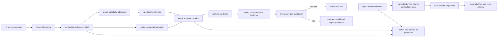

# RFC #547 的目标实现：它改变什么，以及这些改变为何不可省

## 1. 先说明本文所说的“实现”

RFC #547 描述的是 coder-loop 的目标实现合同，不是 main 当前已经具备的功能清单。当前一轮调查的结论是：R12 中十个 capability unit 没有任何一个满足 source-ready 条件，因此本批实现 issue 为零，十个单元全部保持 not-yet。这不是因为 RFC 缺少目标，也不是因为工作流被阻塞，而是因为它拒绝把设计图上的预期输入误写成 main 已经提供的产物。

main 目前拥有一批重要但不闭合的资产：统一 compiler 的骨架、真实 source hash、compiled/rejected 结果类型、公共 projection 的位置、声明驱动的文档 renderer、runtime tree 的 SQLite ADT 与约束、hook declaration carrier、opaque item 存储主体、事务与 migration 框架、baseBranch 和 closure/worktree 资源机制。这些资产决定了目标实现不需要推倒重来。然而，资产存在并不等于能力已经形成：runtime tree 表存在，不代表 production scheduler 以它为权威；hook 能被持久化，不代表 gate 会执行；tagged ref 和 source hash 存在，不代表 definition content 可以在重启后按 ref 取回；generic JSON 能落库，也不代表输入经过了 source schema 的类型准入。

因此，本文始终区分四种事实：**current** 是 main 今天真实运行的行为；**target** 是 RFC 完成后必须成立的合同；**dependency** 是由具名外部能力提供、#547 只消费的边界；**proof** 是能力定义或实现后仍需由真实路径验证的结论。后文中所有“目标系统会……”都属于 target，不表示 current 已经如此运行。

RFC 的核心并非“增加更多类型”。它要建立一条从可变定义到不可变执行实例的单一权威链。任何已经启用的能力都必须沿这条链取得定义、身份、状态和恢复证据；尚未交付的能力必须在明确边界上 reject、hold 或报告 unsupported，不能依赖 default、current source、字符串约定或兼容 fallback 半启用。

全文以一个 item 的完整生命周期检验这条链，而不是按旧问题编号逐项罗列。操作者编写 H1 preset：其中有递归任务结构、typed item/chain 输入、一个 structured JSON 值、required tool 和 pre-spawn gate。chain 与 item 在 H1 下创建，runner 得到 prompt 并退出；随后 source 被修改为 H2，daemon 重启。每个阶段都要回答同一组问题：谁拥有事实，产物是什么，何时可以失败，失败前哪些副作用尚未发生，什么被持久化，以及重启后依据什么继续。

## 2. H1 首先必须得到唯一编译判定

### 2.1 Current 为什么会给出多个答案

current compiler 已经能把 preset 解析成 canonical model，也有 compiled/rejected 分支、source hash 和公共 projection 函数。但是，完整判定并未沿所有消费者保持为同一个对象。成功结果中的 model 与 warnings 会在 `loadPreset` 一类边界上分离；daemon 还能通过 callback 把 finding 写成另一种 observability event；doctor 和 status 并不读取同一份 warning 集合。与此同时，daemon 的成功 cache 以目录路径为 key 并持续到进程结束，direct loader 或 CLI 却可以重新读取当前文件。

结果是，同一时刻的 H1/H2 可能产生两种可见事实：长寿命 daemon 继续使用首次成功装载的 H1，另一个入口已经编译 H2。失败 cache 会被删除并重试，成功 cache 却没有相应的 source identity 或失效事件。cache 在这里不只是性能层，它意外成为定义时间语义的一部分。

dead-fragment 检查暴露了另一个同源问题。current 只有 fragment 的 id、role、path 以及 phase role 验证，没有 versioned typed fragment reference graph；current finding carrier 也只有较窄的 verdict/rule/message 形状。直接增加一个 reachability checker，会迫使该 checker私自重建 graph，并把结果塞进第二种 finding 格式。这个补丁即使能报出一个 warning，也会制造新的事实源。

### 2.2 Target 建立什么

目标系统以一次稳定 source snapshot 为输入，只产生一个 `CompileEnvelope`：成功分支包含 normalized compiled product 和结构化 warnings，拒绝分支包含非空 diagnostics。envelope 穷尽承载typed findings；每个 finding variant按自己的schema拥有稳定identity和payload，message不能成为控制流。callback、CLI、doctor、cache、未来 GUI 或第三方 consumer只能投影或引用 envelope，不能重新判断同一静态事实。

这里必须区分三种 identity。`CompileEnvelope` identity 表示一次完整的编译判定，包括 findings；compiled product identity 只表示可执行的 normalized 产物；后续 definition content identity 表示已经发布、可供实例 pin 的完整内容。它们可以互相引用，但不能被压成一个 hash。否则，修改 warning 规则可能被误判成执行 definition 改变，或者 executable content 改变却沿用旧的完整判定。

公共 schema 是独立可分发的合同，不是某次 projection instance，也不是源码内部的 ArkType boundary。compiler 边界拥有 schema producer；独立 consumer 的缺席意味着 cross-owner 兼容性尚未证明，不意味着 producer 可以继续只输出一个看似 JSON 的实例。D10只接受D1验证过的compiled-product handoff；envelope、product、schema和definition identity保持分域，definition bundle按自己的canonical content identity发布。current doctor 默认诊断 current definition，展示来自同一 envelope 的 findings；pinned instance 的完整性健康属于 status/ref resolver 或显式 definition-ref 诊断，不与 current source 混成一个真假结论。

### 2.3 失败与恢复

compile rejected 时，不允许产生 live definition、成功 cache 或“复制完成”marker。source 在 snapshot 与读取之间变化时，结果必须是具名 race/identity failure，再以新的完整 snapshot 重试；不能把两次读取拼成一个 artifact。cache 只能缓存完整 envelope 或按内容 identity 缓存 verified product，不能继续让 path 充当权威。

这一阶段仍有明确边界。independent schema consumer 是验证依赖；它不阻断本仓生成、版本化和 round-trip 验证 schema。dead-fragment analysis 仍不是 source-ready：它所需的 typed graph producer和 typed finding carrier尚未进入 main，因此 #547 不能靠缩减验收或把其他 owner 的实现塞进 checker 来提前开工。

## 3. Compile 成功之后，为什么还必须发布不可变 definition

### 3.1 H1/H2 是最直接的反例

假设 item 在 H1 下首次运行。current 会计算真实 source hash，也可能把 tagged ref 写进 runtime node，但 definition 表中没有可按 ref 恢复的完整内容。scheduler 在每次 spawn 前仍能根据路径加载 preset并重新渲染 prompt。进程内 path cache可能暂时把行为冻结在 H1；daemon 一旦重启，cache 消失，旧 item 会重新读取 H2。

这种行为表面上像“支持热更新”，实际上破坏了实例 identity。status 和 events 可能继续显示 H1 的 ref，runner 行为却来自 H2。若 H2 删除当前 phase，系统可能在已经建立 run/closure 资源后才失败；若 H2 保留 phase但改变 prompt、binding 或工具要求，旧实例会静默改变行为。tagged ref 此时只负责归因，不负责执行同源。

current materialize 顺序还会放大问题：source 被复制到 staging，完成 marker 写入，目录 rename为公开 target，并清除旧 sibling，随后才进行完整 parse/compile。非法 H2 因而可以成为带“完成”marker的唯一 artifact，并在被拒绝之前删除最后一个合法 H1。并发 materialize也可能互相 prune，使所有调用都返回成功、所有返回路径最终都不存在。

### 3.2 Target 的 publish 合同

compile成功的 product必须进入完整 pre-run bundle。这个 bundle 不是任意原文件备份，而是所有运行前 consumer所需字段的闭包：normalized preset、模板与 fragments、typed binding declarations、状态词表、task graph、tool/gate declarations、doc render declarations、相应 schema和manifest。运行结果不进入 definition；创建前无法计算的事实也不能伪装成 definition 字段。

发布分为可恢复的状态序列。系统先在同一filesystem的staging目录写入尚不可解析的partial bundle，再逐个fsync文件并fsync目录；随后按canonical bytes计算content identity，重新打开并验证manifest、每个asset digest和整体identity；只有全部验证通过，才以rename公布artifact并把metadata置为`live`。相同ref与相同content的重复publish是幂等成功；相同ref却出现不同content是identity collision，必须拒绝；不同ref之间绝不因“只保留最新版本”而互相prune。D10只接受经过验证的compiled-product handoff，并以definition bundle自己的canonical content identity发布`PresetDefinitionRef`。compile envelope保留完整findings；发布过程不重新计算第二份finding集合，也不把envelope、product和definition identity等同。

artifact publish与实例 create必须分相。先发布、后写DB ref的次序意味着崩溃最多留下一个完整但无人引用的 orphan artifact，后续GC可以安全清理；反过来先写DB再补文件，会产生已经commit却无法解析的instance。

所有 instance consumer必须经过shared resolver按tagged ref取得verified bundle。cold resolve依次验证ref的tagged kind与schema、metadata仍为`live`、manifest完整、每个asset digest匹配以及整体content identity匹配；通过全部检查后才可写入process cache。任一步失败都返回具名missing/corrupt/unsupported/retiring结果，不得以旧cache、current source或“尽量兼容”的弱解析继续。current compile与pinned resolve是两个接口：前者回答“现在写在source里的定义是否成立”，后者回答“这个实例创建时固定的定义是否仍可完整取回”。process cache只缓存`definition ref → verified content`，cache miss必须重新读immutable store，不能退回current path。

### 3.3 Corrupt、legacy 与 GC

artifact missing、digest mismatch、unknown schema、kind mismatch或retiring都产生typed definition resolution状态。对已经存在的pinned instance，这些状态导致hold并显示exact ref；系统不能通过重新编译current source“修复”它。

真实中央数据进一步限定了migration：当前可见的历史数据是pre-ref legacy，15个chain、69个item、932个finished run都没有可验证的历史definition content或ref壳。残留materialized目录、repository字段、event、status或current source都无法证明当时使用的H1。此类记录必须标记`legacy-definition-unproven`：list、status和audit仍可读，resume、schedule和mutation停止。用H2构造一个看似完整的ref只会伪造历史。

GC只以persisted ref可达性为依据，扫描chain、item、runtime node、run和保留历史；任何一条持久ref都阻止artifact退役。候选artifact必须在事务中再次确认零ref，才能从`live`进入`retiring`；进入retiring后，新的resolve与create立即拒绝它。清理器随后把artifact移入trash，再删除metadata；若进程在任一步崩溃，restart从retiring/trash状态继续，而不是把它重新当作live。这里不引入reader lease或cache保留权：cache不是retention authority，publish、create与GC的协调只需守住“有持久ref绝不退役、零ref退役后不再新增引用”。

H1/H2 restart、publish各崩溃窗口、create/GC竞争、cache重建和corrupt修复仍需集成验证。目标合同已经确定恢复依据，但不能把尚未跑通的路径写成 current 保证。

## 4. Publish 与 Create 之间为什么需要两份 Pure Plan

不可变 H1 已经存在，并不意味着 item 可以立即写入数据库。实例创建还需回答两类只有在“具体输入 + exact definition”同时已知时才能回答的问题：这些chain/item值是否合法；这份任务定义应该物化成什么runtime graph。两类计算都必须在business事务之前完成，因而分别形成typed admission plan和runtime materialization plan。

### 4.1 Typed admission：值的意义只能由 source schema 决定

current 中 `[item.fields]` 虽有有限类型词表，但该type没有贯穿生产消费者；chain metadata是开放JSON，runtime value大多压成string。缺失的item/chain值在render时经常变成空串，结构值则拖到render才抛异常。`false`、`0`、显式`null`、missing和default因此容易被混为“没有字符串”。generic JSON boundary只能证明数据可以安全编码，不能证明它符合某个source的领域类型。

目标使用封闭递归ValueType：`string | number | boolean | null | array | record | union`，不保留opaque JSON或为未来预埋无consumer的variant。source declaration是值意义的唯一权威；use-site不能重新解释source type。外部 candidate以unknown进入parser，成功后得到`AdmittedBinding`，其中保留owner、source、definition ref、provenance和refined value。

missing是独立状态，不是空串。null只有在类型允许时才是合法值；default属于source declaration；required在相应消费边界判断。定义期可知的default/type compatibility在compile拒绝，具体chain/item值在create、update或batch admission拒绝，运行时才产生的agent exit或外部outcome在各自typed boundary判断。每个约束只在最早拥有足够信息的位置判定一次。

update不能只验证patch里的孤立字段；它必须将patch应用到旧对象后验证完整对象不变量。batch必须共享同一pinned definition和admission规则，任一元素失败则整个batch零写。agent可以写入明确声明的typed exit/result字段，但不能覆盖item、chain或runtime authority拥有的值。

D2拥有typed value及其canonical value serialization：标量有唯一文本，structured value有canonical JSON。它不拥有prompt布局。D6的职责是在后续阶段把value text放入声明驱动的文档结构。这个owner分界避免ValueType同时变成格式模板，也避免renderer重新猜类型。

### 4.2 Runtime materialization：声明图不等于运行图

current 已有leaf、seq、par、join的runtime ADT、SQLite外键和round-trip测试，但production scheduler没有从compiled tree一次构造完整runtime tree。它仍从preset phase数组和item phase/status选择下一步；runtime leaf往往在run真正出现时动态追加。status可以展示一棵树，scheduler却完全不读取它，这棵树因此只是旁观记录，不是推进权威。

目标的任务声明采用referenced-node table：root id、按显式id声明的nodes，以及child/target/dependency引用。stable node id不由数组位置或嵌套路径生成；移动节点不改变identity。compiler建立索引并检查duplicate、dangling、cycle和非法结构。现有linear phase输入只是一种兼容语法糖，parse后立即normalize为同一canonical graph，不形成第二套模型。

在exact H1上，materializer纯计算完整runtime nodes、edges、initial readiness、definition-node refs和需要的资源意图。它不在遍历中写DB。这里有两种不可混淆的缺席：若递归task parser/normalizer尚未交付，compile直接返回`recursive_tasks_unsupported`，根本不产生可发布product；若parser已经能生成合法的non-degenerate par，而真实constructor/scheduler尚未交付，则在任何副作用前返回`par_runtime_unsupported`，新实例拒绝、已pin且到达该路径的实例hold。禁止把par顺序执行，因为那会把“缺能力”伪装成不同业务语义。

两份plan之间可以相互引用definition identity，却不能吞并对方owner：admission不创建runtime node，materializer不解析raw binding。这样，错误能在写入之前完整收集，实例事务只负责提交已经验证的domain products。

## 5. 为什么实例创建必须是一个事务

拿到live H1、admission plan和materialization plan后，目标系统在一个`BEGIN IMMEDIATE`事务中写入：chain/item业务row、tagged definition ref、admitted bindings、完整runtime nodes与edges、initial readiness，以及transactional outbox row。commit之前，scheduler、status和dispatcher都不能观察到这个实例；commit之后，dispatcher才允许执行已经提交的outbox dispatch intent。

这个边界不是为了追求“所有东西放一个事务”这种形式美。若item row先commit、binding随后失败，DB会出现不可运行的item；若runtime tree在first spawn才建立，create成功并不证明实例可调度；若outbox row在business commit后才写，进程可能在两者之间崩溃，造成不可恢复的漏投递。transactional outbox必须和business state同事务，dispatch只能发生在commit后。实际transition产生的effect intent属于后续独立authority，不被create合同预先合并。

create之前的错误都导致零business row。若客户端得到的commit结果未知，恢复顺序不是盲目重跑create，而是用instance identity查询business row与outbox，再决定返回既有结果或安全重试。这个规则防止因网络断开或进程崩溃重复创建runtime graph与外部资源。

去隐藏业务原语也在这个边界落地。item和chain selector是opaque identity；`owner/repo#123`不会被engine parser改写成另一item id。repository不再是engine物理selector或forge admission字段，而是可选typed business binding，只在明确需要remote操作的adapter中读取。local worktree、reconcile与资源身份只使用chain/item/baseBranch/path等本地事实；repository缺失只阻断对应remote operation，不使无remote需求的实例全局hold。

baseBranch并不因此消失。它是引擎确实消费的pre-run chain输入，由typed ChainDefinition提供。ChainDefinition的ADT、parser、version和error属于具名provider；本仓只通过client boundary消费verified ref与payload，不复制第二parser。新item必须显式pin自己的PresetDefinitionRef；empty chain可以独立展示status，mixed chain逐item解析，不能借一个“代表preset”做chain-wide判断。

真实v14数据中的15个chain全部是repository column-only，未发现column/binding冲突，因此repository值可以无损搬到business binding，同时保留row id、69个item、932个run、baseBranch和资源关联。然而，这个shape migration不产生historical definition证据；所有pre-ref记录仍然hold。数据搬运和definition证明是两个完全不同的问题。

## 6. 完整实例如何成为一次可执行 Attempt

事务commit后，scheduler只能读取runtime readiness。创建事务已把首批可执行leaf置为`ready`；scheduler以revision/epoch约束的CAS把其中一个leaf从`ready`改为`claimed`，并在同一权威步骤持久分配稳定的RunIntent和RunId。claim是一次调度租约和身份分配，不是业务完成。binding、definition与runtime capability admission必须在`BEGIN IMMEDIATE`和business row创建之前完成；只有需要明确run host的pre-spawn gate在claim之后判断。任何worktree、closure或process副作用都必须等到这两层检查结束。

一次 attempt的持久轨迹因此不是“spawn后补一条run记录”，而是：`ready`节点经CAS成为`claimed`并得到稳定身份；pre-spawn gate要么把它推进到可spawn状态，要么原子改为`held`并释放capacity；允许spawn后记录process fact；process exit写入不可变exit fact并把attempt置于awaiting-transition；validator据此构造TransitionCommit；commit再原子派生父seq的下一child、par children或join host的新readiness。每次派生都引用原节点revision、definition node identity和RunIntent，duplicate transition幂等返回既有commit，stale revision、foreign credential或错误host则在写入前拒绝。

这条轨迹也定义了restart，而不是把restart留给猜测。`claimed`但没有process fact时，系统按同一intent重新进行pre-spawn恢复，不能另分配RunId；process已经exit但transition未commit时，从exit fact和domain journals重建同一transition request；transition已经commit而outbox尚未dispatch时，只恢复dispatcher，不再推进第二次readiness。这样，崩溃窗口被压缩为“读取哪条已持久事实继续”，而不是“推测上一进程做到哪一步”。

### 6.1 Prompt bytes 的 owner 链

D2将admitted value转成canonical value text；D6读取versioned `DocRenderDeclaration`，按固定顺序组合label、prefix、suffix、style和blankBefore，输出runtime inputs doc bytes。structured value默认使用单行canonical JSON；block或fenced呈现只有声明显式要求时才使用。变量名、placeholder位置、JSON大小或内容不触发启发式布局。

这条链区分两个owner。D2决定“这个值是什么、它的canonical文本是什么”；D6决定“这个文本怎样进入文档”。如果renderer重新解析raw JSON，typed admission就会被旁路；如果ValueType携带任意Markdown布局，类型系统又会变成模板系统。相同definition ref、phase、binding和typed value必须在create、resume和restart得到逐字节相同的prompt输入。

unknown render declaration version、corrupt declaration或unsupported style在任何worktree/process副作用前产生typed hold。多类型create→prompt→真实runner，以及resume后同ref字节一致性目前仍是proof gap；current production renderer的存在只说明部分布局资产可复用。

### 6.2 Tool 与 Gate 必须先证明 runtime capability

current public projection保留tools/toolRequirements槽位，但值恒空；doctor仍硬编码检查`gh`；runner selection只验证binary。hook declaration能被解析、持久化和按global/chain/item形成effective view，但没有executor、decision journal或调度调用。空数组和carrier都不能证明能力存在。

目标tool协议以definition-scoped ToolId贯穿requirement、invocation和outcome。compile后的requirement在每个run中派生稳定requirement identity；实际调用产生带definition/run/phase/tool/namespace/author与durable-commit provenance的evidence；evaluator把journal从`Pending`推进为`Evaluated(Achieved | NotAchieved | NotEvaluated)`；finalize冻结本次attempt允许消费的结果；TransitionCommit只消费已经finalize且属于同一host的ref。provider、availability、invocation、outcome和requiredness是不同轴：availability只说明能否提供；invocation说明发生过调用；outcome说明业务条件是否被确定满足；requiredness决定缺少确定outcome时能否完成。compile、doctor和prompt读取同一registry。首个具体predicate可以是entry-existence，但它仍必须产生与具体run/invocation关联的typed outcome，不能由event或context字符串伪造。

required与expected不是同义词。required tool capability缺席时，新实例unsupported reject、已有实例hold；expected capability缺席时可以继续，但必须显式投影`NotEvaluated`，不能伪装成Achieved，也不能让该轴从结果中消失。已经选择并开始评估的requirement则受finalize cutoff约束：cutoff之后到达的late evidence不得改写本次transition，只能成为后续attempt可见的新事实。restart看到Pending时恢复同一evaluation，看到Evaluated但未finalize时只做finalize，看到已consume ref时不得再次消费。真实invocation/evidence/finalize runtime仍是具名外部dependency；本RFC规定的是本仓必须消费的合同与缺席行为。

目标gate协议使用四个封闭decision point：`run.pre-spawn`的host是RunIntent，触发事实是claim完成，decision决定spawn或hold；`run.post-exit`的host是同一run，触发事实是durable exit，decision决定是否允许构造transition；`container.join`的host是container node/epoch，触发事实是所需children到达候选终态，decision决定join推进或hold；`chain-complete`的host是chain completion epoch，触发事实是root候选完成，decision决定发布终态或hold。每一点都必须把trigger fingerprint、binding identity、decision与consume ref写入GateEvaluation journal，而不能只发event。

GateEvaluation按`evaluating → decided → consumed`推进。restart看到evaluating时以同一host与fingerprint恢复，看到decided时由对应consumer原子consume，看到consumed时返回既有结果。named binding遵循chain覆盖global；item层不参与named gate binding。optional只表示“optional declaration没有matching binding时可以skip”；一旦选中了optional binding，其executor失败或能力缺席就不能静默忽略。任何gate declaration在能力缺席时都使新实例reject、已有实例hold，因为runtime连声明的point/journal语义都无法兑现。

create capability admission发生在`BEGIN IMMEDIATE`之前：它检查声明所需的tool/gate协议版本、registry与runtime实现是否可用。任何gate能力或required tool能力缺席时，新实例typed reject，已经pinned的实例在以后解析时hold；只有expected tool能力缺席允许继续，同时显式形成`NotEvaluated`。它不同于claim之后的具体gate evaluation；后者必须等RunIntent/RunId稳定后才能绑定host。不能继续运行一个“声明存在、runtime忽略”的gate，也不能把required tool降级成prompt提示。

pre-spawn gate发生在RunIntent/RunId已经稳定分配之后，因此decision可以绑定明确host。若gate阻断，runtime原子地从claimed转为held，保留同一intent、run id和evaluation epoch，同时释放scheduler capacity；恢复后根据同一journal/fingerprint重评，而不是创建第二次evaluation。只有gate advance后，系统才允许创建worktree、closure或runner process。其他三个point也遵循同一原则：先持久trigger fact与host，再评估，再由唯一consumer消费；评估失败停在journal/hold，不得绕过gate推进业务状态。

ToolOutcome和GateEvaluation的外部runtime尚未交付。#547定义registry、identity、capability seam、缺席行为和transition消费方式，但不虚构transport或executor。真实entry/outcome/finalize/restart与gate timeout/recovery仍需由具名dependency和集成路径证明。

## 7. Runner 退出为什么不等于业务完成

current run结束、item status写入、active run清理、closure状态、session更新和events分布在多个事务与异步步骤。进程可以在任意两步之间崩溃，留下“run已结束但active_run仍存在”“runner成功但item未推进”“event已写但业务row未更新”等中间状态。startup recovery能清理部分stale/orphan run，却不能重放一个不存在的统一业务commit。

目标系统把runner exit视为fact，而不是推进命令。validated agent exit、ToolOutcome、GateEvaluation和必要的join decision组成typed transition request。`TransitionCommit`是唯一业务完成authority，记录from/to readiness、host identity、RunIntent/RunId、validated result以及被consume的domain journal refs。stale transition、foreign credential或错误host在commit前拒绝。

这些journal不能合并。ToolOutcome拥有工具结果，GateEvaluation拥有gate decision，Transition拥有业务推进，external effect ledger拥有副作用dispatch/dedupe，outbox拥有派生投递。transition可以在同一事务中引用并consume已决定的outcome/evaluation，但不能复制它们的状态；event只投影authority，不能反过来成为authority。

业务事务原子写入transition、派生readiness/cursor/status，以及effect intent与outbox row；它提交的是“将要执行什么”的持久意图，不是外部副作用已经发生。只有commit之后，dispatcher才读取这些rows并调用外部系统、记录delivery/effect ledger，再按TransitionId/effect identity幂等确认。若外部调用结果明确，可安全确认；若调用可能发生但结果无法证明，系统进入unknown-effect hold，等待可验证的外部事实。它不能从日志文字猜测成功，也不能无条件重试导致重复副作用。

scripted join consumer与真实tool/gate runtime是具名dependency。#547只消费decided ref，不顺便实现第二套join算法。transition crash、outbox dispatch、外部effect fault injection仍是proof gap；但恢复依据已经明确是持久journal和identity，而不是process“通常只跑一次”的假设。

## 8. H2 出现并重启后，旧 Item 为什么仍是 H1

现在回到贯穿全文的item。它创建时的business row、admitted bindings、runtime graph与readiness都在同一事务中引用H1 definition ref。daemon重启后，scheduler从runtime readiness恢复待执行节点；shared resolver按H1 ref读取verified bundle；prompt renderer读取H1的binding和doc declarations；tool/gate requirement读取H1的registry；transition validator读取H1的node与exit schema。H2只进入current compile接口，并只影响随后创建的新实例。

status应分别展示pinned instance ref的健康与current source的编译健康。operator可以看到“current是H2且有效，旧instance仍pin H1”，但系统不会因为两者不同自动rebind。doctor默认回答current definition是否健康；instance missing/corrupt/legacy状态由status/ref resolver或显式definition-ref诊断展示。

cache不能改变这条语义。cache hit返回H1 verified content；cache miss从immutable store重读H1；digest mismatch产生corrupt hold；retiring ref拒绝新create并按GC协议处理现有引用。任何分支都不允许尝试current H2。source edit、daemon restart、session resume和cache eviction因此不再具有修改旧实例业务定义的能力。

pre-ref legacy是更严格的边界：没有证据表明历史实例使用哪个完整definition，系统就永久不能声称能恢复它。repository字段、当前preset路径、旧marker、event和run status都不构成H1。保留只读历史和明确hold比构造一个可运行但虚假的definition更可靠。

## 9. Reject、Hold、Unsupported 与 Unknown 不是同一种失败

前面各阶段已经给出了失败点。本节只横向比较它们的判定依据和恢复动作。

| 状态 | 发生条件 | 权威结果或所需持久状态 | Business rows / capacity | 自动恢复条件 | 明确禁止 |
|---|---|---|---|---|---|
| Compile rejected | source snapshot在schema、引用或静态规则上无效 | 返回authoritative rejected envelope与diagnostics；不新增永久历史义务 | 不产生live definition | source变更后以新snapshot重试 | 发布marker、空warning成功 |
| Admission rejected | new create/update/batch的具体值不满足exact definition | typed field/path/expected/actual error | create零写；update/batch零部分写 | caller修正输入 | 先写row、render时补判 |
| Dependency unsupported | definition声明的gate、required tool或其他必需runtime能力/provider未交付或版本不兼容 | capability identity与unsupported reason | new instance拒绝；expected tool缺席例外为继续并显式`NotEvaluated` | dependency按兼容版本advertise | fallback、stub success、silent inert |
| Pinned held | existing instance遇到gate、required tool或其他必需capability缺失，或definition corrupt、pre-spawn gate阻断等 | exact ref、host、journal/evaluation epoch | 保留实例；按状态释放capacity；expected tool缺席不hold而显式`NotEvaluated` | 原条件可验证恢复后按同identity重评 | 换current definition、新建第二evaluation |
| Unknown effect held | 外部副作用可能发生但结果不可证明 | transition/effect identity与unknown fact | 不重复业务推进 | 获得幂等外部证据或人工裁定 | 从event猜成功、无条件retry |
| Legacy-definition-unproven | 历史实例没有可验证完整definition | legacy标记与只读历史 | 禁止resume/schedule/mutation | 只有真实历史artifact证据可解除 | 用current source或repository伪造ref |
| Definition corrupt | pinned artifact缺失、digest/schema/kind不匹配 | corrupt reason与exact ref | existing hold；new resolve失败 | artifact按同identity可验证恢复 | 兼容bundle、隐式recompile |

统一判据是：当前边界已有充分信息且输入无效，使用reject；合法existing instance受可变化的外部或完整性条件阻断，使用hold；声明需要的gate、required tool或其他必需runtime实现不存在，报告unsupported并区分new与existing；expected tool缺席则继续并显式记录`NotEvaluated`；外部副作用的事实本身未知，使用unknown hold而不是猜测。

## 10. RFC 同时移除了哪些隐藏业务原语

单一权威链无法与一组隐式业务捷径共存。current engine仍存在多套GitHub语义：CLI使用`--issue`，queue wire使用issue字段并归一化`owner/repo#id`，batch兼容路径回填issue/issueNumber，repository物理列和forge格式校验成为chain身份，省略preset又可能触发内置default。不同入口对同一字符串应用不同转换，opaque item存储因此没有真正成为公共合同。

目标在一个可消费breaking checkpoint中移除engine-owned GitHub notation、alias、normalize、repository selector、git inference与default preset fallback。合法preset内部仍可以有名为`issue`的业务字段；清零gate必须按ownership与API surface区分engine原语和preset domain，不能用盲目全文grep误删业务模型。

repository迁入typed business binding后，不再参与chain selector、definition content identity或local worktree identity。明确需要远端repository的operation可以按需读取它；缺值只阻断该operation。baseBranch继续作为引擎真实消费的typed ChainDefinition输入，它不是repository物理列的替身。

新item显式pin自己的preset definition。省略/null不会落到default；legacy null不会隐式rebind；empty chain不需要虚构代表preset；mixed chain不能任选一个item的preset解释全链。provider尚未交付时，本仓以typed dependency unavailable停止，不复制flat metadata parser。

plan控制面已经大幅退役，但这不自动证明所有fragment都有consumer。目标dead-fragment分析必须从canonical typed fragment graph计算reachability，并把结果写入唯一CompileEnvelope。current缺少该graph与finding carrier，所以现在不能为了“先做一点”在D8中顺手实现其他owner，也不能把transitive、invalid-kind、cycle或typed finding验收削掉。R12把它保持not-yet，正是单一权威原则在规划层面的应用。

## 11. 为什么局部补丁无法解决这些问题

给compile命令增加JSON输出，但不发布并pin完整definition，preview仍可能是H1，restart执行H2。给binding增加ValueType，但让create先写row、render再验证，DB仍会产生半实例。建立runtime tree表和round-trip测试，但scheduler继续读取phase/status，status中的tree仍不是推进权威。

同样，给preset加tools或gates字段而没有capability handshake与domain journal，只会让声明看似存在、runtime继续忽略。把gate失败写成普通event，transition仍无法判断它是否被持久决定；把tool invocation当outcome，required条件仍可能在没有结果时通过。

重命名`--issue`为`--item`也不够。如果repository物理列、forge parser、git inference、default preset和current fallback仍存在，引擎依然内置同一业务假设。删除plan目录也不够；没有canonical fragment graph与统一finding carrier，dead-fragment checker只能创建第二权威。

最关键的限制是：设计不可分割性不等于实施必须一次完成。各producer和consumer可以分阶段交付，但任何已启用能力都必须沿同一authority合同。若consumer尚未交付，producer可以完成自身schema和round-trip proof；若gate、required tool或其他必需runtime capability尚未交付，声明它的实例必须reject或hold；expected tool缺席则只能以显式`NotEvaluated`继续。不能把半条链描述成兼容模式，因为半启用正是current权威分裂的来源。

## 12. #547 明确不实现什么

#547 不把TOML换成代码载体，也不把ArkType表达式变成公共类型语言。TOML仍负责声明，compiler内部可以使用精确boundary实现，但公共合同由版本化schema和ADT定义。ValueType不保留opaque JSON、computed business key或可选字段汤；新variant只有在producer、persistence、event和consumer同时存在时才能加入。

#547 不定义新的task algebra语义。它提供referenced graph、typed identity、runtime materialization和transition seam，但不发明best-of-n、reopen策略、script join选择算法或par串行降级。non-degenerate par未交付时必须unsupported；scripted join decision由具名consumer拥有。

#547 不实现tool本体、provider transport、outcome/finalize runtime，也不实现gate executor transport或scripted join consumer。它实现本仓的declaration、registry、identity、capability handshake、journal消费合同和缺席行为。gate、required tool或其他必需外部能力不存在时，正确结果是typed reject/hold；expected tool缺席时是继续并显式`NotEvaluated`。本仓不会为任一缺口创建临时transport。

#547 不实现GUI、hook执行平台或remote adapter。它提供公共projection、tagged identity和typed seam，使这些consumer不必猜内部shape；independent consumer的真实读取仍需cross-owner proof。hook carrier可以作为gate binding基础资产，但不能冒充gate executor。

worktree起点、branch命名、definition/resource pin、seq推进、回收和publication sampling仍是engine原生机制，不进入preset DSL。repository只在业务明确需要时由remote operation读取。历史pre-ref实例不会自动“修复”；没有历史definition证据时，永久hold是事实边界，不是缺少兼容代码。

## 13. Current、Target、Dependency 与 Proof 的最终对账

### 13.1 Current 可复用资产，以及它们不能证明什么

| Current资产 | 可以复用 | 不能证明 |
|---|---|---|
| canonical compiler、compiled/rejected骨架、source hash、projection函数 | 单一编译入口、identity素材、公共读面位置 | warning/finding全系统同源、可分发schema、content cache、verified publish |
| source/binding tagged union、unknown-first boundary、JSON-safe store、batch事务框架 | candidate parsing、owner/source表达、原子写基础 | recursive ValueType贯通、missing/default语义、typed admission/exit |
| runtime leaf/seq/par/join ADT、SQLite约束、tree round-trip | runtime domain shape与持久化基础 | compiled→runtime constructor、readiness scheduler、typed transition |
| doc declaration与production renderer | prefix/suffix/style/blankBefore和单一consumer基础 | typed value输入、多类型真实prompt、resume字节一致性 |
| hook declaration carrier与effective view | gate binding层和来源provenance | executor、capability handshake、GateEvaluation journal |
| tagged definition ref/FK、source hash | attribution和引用形状 | definition content、shared resolver、create pin、restart H1 |
| opaque item存储主体、per-item preset互斥、baseBranch/closure资源 | 去原语与资源恢复基础 | 公共CLI/wire全opaque、repository退列、无default/fallback |
| WAL、BEGIN IMMEDIATE、migration/outbox部分框架 | 原子create、journal与升级的工程基建 | 当前业务动作已经单commit或effect可恢复 |

### 13.2 Target 保证

目标完成后，同一source与contract version只有一个CompileEnvelope；instance创建前固定完整definition；pre-run chain/item candidate在create/update/batch admission按exact definition准入，runtime产生的exit/outcome则在各自typed boundary按pinned definition准入；runtime graph完整物化并成为scheduler唯一readiness权威；tool/gate声明必须经过capability handshake；runner exit只通过typed transition推进；external effect只从committed outbox/effect intent恢复；restart、resume、status和prompt只解析pinned ref；engine不再通过GitHub notation、repository selector、default preset或plan控制业务。

这些保证由191项原子需求和36条named seam覆盖。数字表示需求映射完整，不表示191项已经编码或36条runtime边已经接通。

### 13.3 具名 Dependency

- **independent schema consumer：** 验证公共schema在本仓之外能被真实消费；缺席不阻断producer，但保留cross-owner proof gap。
- **typed ChainDefinition provider：** 唯一拥有ChainDefinition ADT、parser、version和error；缺席时本仓不能复制parser，相关new admission unsupported，legacy hold。
- **tool outcome/finalize runtime：** 拥有真实invocation outcome、required finalize与restart journal；缺席时required路径不能运行，expected路径继续并显式`NotEvaluated`。
- **gate evaluator/journal：** 拥有GateEvaluation的执行、持久化和恢复；缺席时任何gate声明都不能inert。
- **scripted join consumer：** 产生可被transition消费的decided join ref；#547不实现第二选择算法。

### 13.4 Proof Gap

仍需真实路径证明：schema cross-owner round-trip；多类型create→prompt→agent exit→transition；referenced graph→constructor→scheduler→join/recovery；H1/H2 restart/resume；publish崩溃与GC竞争；tool outcome/finalize/restart；gate hold/advance/onFailure/dedupe；remote repository present/missing；fragment人口与dead finding；冻结候选SHA上的integration和compatibility real E2E。

proof未完成不自动说明producer不存在；反过来，存在schema、表或carrier也不说明整链已经运行。两者必须分栏记录。

### 13.5 为什么当前滚动批次为零

R11得到的是目标态供需图。R12只有在一个capability unit的全部输入seam已由main或已交付dependency真实提供时，才能写出验收自包含的下一项issue。当前十个unit都缺少至少一个producer，因此source-ready为零。

dead-fragment最接近可拆，但仍不满足条件。目标输入S-33要求versioned canonical typed fragment graph；current只有fragment id/role/path和phase role validation。目标输出S-07要求带identity/location/reason/version的typed finding进入CompileEnvelope；current carrier只有较窄的finding shape。若把graph producer和D1 carrier都塞进D8 issue，验收就依赖其自身范围之外的未来合同；若削掉transitive、invalid-kind、cycle或typed projection，issue又不能交付稳定需求。保持零批次，是拒绝虚构source-ready的正确结果。

main发生变化并满足既定事实gate后，下一轮才重跑必要的存在性、地基和供需匹配。RFC没有因此被宣布实现，也没有因为当前零批次而失效。

## 14. 结论

沿贯穿全文的item重新看一次：H1首先被compiler作出唯一判定；成功product被发布为可按identity取回的immutable definition；pre-run bindings和任务图在exact H1下形成pure plans，runtime结果在各自typed boundary验证；一个事务提交完整instance与outbox；scheduler从runtime readiness分配稳定attempt；prompt、tool和gate只消费pinned declarations与registered capability；runner exit经过typed transition成为唯一业务推进；restart依靠definition ref、runtime state和domain journals继续，而不是重读H2或猜测event。

每一步之所以存在，都对应current的一种具体失败：多读面给出不同finding、path cache与restart改变定义、missing被伪造成空串、runtime tree被scheduler旁路、声明在无executor时静默、run close跨事务、repository/default fallback重新解释身份。RFC的价值不在术语更多，而在为每类事实指定唯一owner、最早判定点和可恢复持久证据。

这套合同允许分阶段交付，却不允许任何一段以“暂时兼容”为名半启用。一个能力的producer可以先交付，consumer未就绪时系统必须明确停止；一旦能力启用，它就不能绕过definition、identity、typed boundary或journal。#547 最终要消除的，正是“系统还能继续跑，所以先猜一个答案”的行为。
