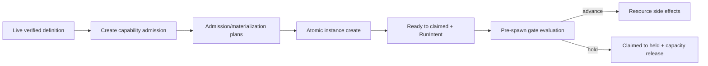

# RFC implementation draft 事实审计

> 审计对象：`.writing-rfc-implementation/draft.md`。对照当前权威 `AGGREGATE-547.md`、`24-r9-expected-foundation.md`、`28-r11-supply-demand-map.md`、`30-r12-rolling-decomposition.md` 与最终审计。本文只报告会改变合同、owner、事务顺序或失败行为的阻断项及具体修法；不修改draft。

## A. 结论

**不通过。阻断项：7。**

draft对current/target的总分栏、15/69/932历史数字、R12零批次、D1/D2/D6/D9/D10 owner边界、外部dependency与主要proof gap整体保持正确；也没有把旧SYNTH或child issue当authority。但七处表述会让读者得到错误的身份关系、准入顺序、unsupported语义或持久化机制，必须在发布前修正。

## B. 阻断项与具体修法

### F1 — Capability handshake被画在实例commit之后

**位置：** `draft.md:15-25,115,147-149,242,270`。

开篇图把链画成`atomic instance creation → readiness → capability handshake`，正文又说缺tool/gate runtime时“新实例在准入阶段reject”。这把两个不同动作混成一个：

- **create capability admission/handshake**必须在D10进入`BEGIN IMMEDIATE`并写business instance前完成；任何gate declaration在gate capability缺失时new create reject，required tool runtime缺失也不得产生可调度instance。
- **pre-spawn gate evaluation**发生在完整instance已commit、scheduler完成`ready→claimed`并分配稳定RunIntent/RunId之后，但仍在worktree/closure/process等资源副作用前；hold执行`claimed→held`并释放capacity。

当前图会让实现者在DB已存在instance后才首次发现create-level dependency不可用，违反Gate-2/Gate-5和D10-R09。

**具体修法：** 将图拆为：

正文分别使用“create handshake”和“runtime evaluation”，不要用一个`capability handshake`横跨两阶段。

### F2 — Tool `expected`在dependency缺失时被错误归入new reject

**位置：** `draft.md:147,183,189,211,219,250`。

draft多处把“tool outcome/finalize runtime或gate evaluator缺失”统一写成new instance reject/相关声明不能运行。正式合同有重要非对称：

- gate capability缺失：任何gate declaration都new reject，pinned hold；optional只允许missing named binding时skip。
- **required** tool outcome capability缺失：new create/schedule unsupported或existing hold。
- **expected** tool capability缺失：实例可以继续，但必须明确投影`not-evaluated`，不得伪造`Achieved`。

状态表`Dependency unsupported → new instance拒绝`因此不是封闭真值。

**具体修法：** 把tool与gate分行；将expected tool写成“允许运行且显式not-evaluated”，并把`new reject`限定到provider/gate/required-tool等合同明确要求的路径。修改13.3中“相关声明不能运行”为“required路径不能运行；expected路径不执法且显式not-evaluated”。

### F3 — Recursive boundary缺失与par runtime缺失被合并成compile reject

**位置：** `draft.md:109,217`。

draft写“若non-degenerate par constructor/scheduler未交付，系统在compile边界拒绝递归声明，并在scheduler再次`par_runtime_unsupported`”。权威Gate-6分成两个条件：

1. referenced-node parser/normalizer boundary未交付时，递归输入在compile返回`recursive_tasks_unsupported`；
2. boundary已能编译但non-degenerate par runtime未交付时，在首资源副作用前返回`par_runtime_unsupported`并hold，绝不顺序降级。

把runtime能力缺失提升为“compile拒绝所有递归声明”会错误禁止可编译的definition，也抹掉compile capability与runtime capability的分层。

**具体修法：** 用两个独立条件段落替换109行；`#547不实现什么`中也明确par可以形成definition，但在runtime capability缺失时typed unsupported/hold。

### F4 — CompileEnvelope、Finding与Definition的identity关系增加了未裁定保证

**位置：** `draft.md:45-47,71`。

有两层越界：

1. “finding的identity、rule、location、severity和版本属于envelope”把D8 dead-fragment finding的字段推广成所有finding的必备shape。权威只要求CompileEnvelope是唯一finding authority；不同typed finding可以有不同subject/location字段，不能假定每个finding都有location。
2. “definition通过ref可达compile envelope”不是D10正式合同。正式关系是`CompileEnvelopeRef`、`CompiledProductIdentity`、`SchemaRef`、`PresetDefinitionRef`分域；compiled branch才能交付product，D10据此构造bundle。bundle需要compile contract ref和warnings，但没有裁定必须持久一条Definition→CompileEnvelopeRef可解析反向引用。

**具体修法：**

- 将45行改成“envelope穷尽承载typed findings；每个variant按其schema拥有稳定identity/payload，message不是控制流”。只在dead-fragment专段列identity/location/reason。
- 删除“definition通过ref可达它”；改成“D10只接受D1验证的compiled-product handoff；envelope/product/schema/definition identities保持分域，definition bundle按自己的canonical content identity发布”。

### F5 — GC段落虚构了existing reader/lease协议

**位置：** `draft.md:83`。

“artifact进入retiring后，已有读者要么持有已验证内容，要么在受控边界结束读取”引入了权威文档没有裁定的reader lease/lifetime机制。D10合同只确定：persisted refs组成mark set；有任一引用不得retire；GC与create/publish做ref级协调；零引用后`live→retiring`、移入trash并删除；restart续做retiring cleanup。cache不是retention authority。

这句可能被读成“即使DB仍引用，只要reader持有cache就能retire”，正好违反ref-aware retention。

**具体修法：** 删除existing reader句。写成：“只有DB全ref表重查为零的live artifact可标retiring；retiring拒绝新resolve/create；失败保留retiring供restart续清理。任何persisted ref存在时不得进入retiring。”不要发明lease或cache pin。

### F6 — Compile rejected被放进“持久化结果”列

**位置：** `draft.md:179-181`。

表头是“持久化结果”，Compile rejected行填“rejected envelope与diagnostics”。D1合同明确direct rejected result没有新增永久history义务；它是authoritative返回值，但不必durably persist。该表述会无意增加rejected-envelope store。

**具体修法：** 将表头改为“权威结果/需持久状态”，并把Compile rejected写成“返回rejected envelope与diagnostics；无live definition，且无新增永久history义务”。其他hold/journal行再分别说明确需持久的状态。

### F7 — Effect已发生与effect intent/outbox已commit混写

**位置：** `draft.md:25,115-117,159-161,242`。

开篇节点写`committed outbox and effects`，transaction章节又把outbox描述成“派生事件”，容易把三种authority压成一个：

- business transaction提交domain state、effect intent/ledger状态与transactional outbox rows；
- commit后dispatcher才允许执行外部effect或投递outbox；
- Transition、Effect、Outbox仍是不同authority，unknown external result进入effect hold。

“committed effects”若指外部副作用已发生是错误的；若只指intent也必须明确。outbox也不只保证某个“创建事件”，不能把具体event当成D10通用合同。

**具体修法：**

- 图中改为`committed effect intents + outbox rows`，再画`after commit dispatcher → external effect/event delivery`。
- 117行把“永久没有创建事件”改成通用因果：“若outbox/effect intent不与business state同事务，commit与记录之间崩溃会造成不可恢复的漏投递或无法判定。”
- 保留159行的五authority分域，并统一全文术语：row/intents是commit内，外部effect是commit后。

## C. 数据、owner、时态与authority复核

以下项目未发现阻断，无需因本审计改写：

| 检查 | 结果 |
|---|---|
| current/target总分栏 | 正确；开头与13节均未把191需求写成已编码 |
| R12状态 | source-ready 0、issue草案0、not-yet 10，正确 |
| 历史数字 | 15 chains、69 items、932 finished runs，全部pre-ref且无可验证ref/content，正确 |
| repository人口 | 15条column-only、当前无冲突；搬运不解除definition hold，正确 |
| D2/D6 owner | value/schema/admission/serialization归D2，layout/renderer归D6，正确 |
| ChainDefinition owner | 外部provider拥有ADT/parser/version/error；本仓client消费，正确 |
| journals owner | Transition/ToolOutcome/GateEvaluation/Effect/Outbox分域，正文主旨正确 |
| D10 create | row/ref/bindings/full runtime/outbox单个`BEGIN IMMEDIATE`，正确 |
| dependency时态 | typed provider、tool/gate runtime、scripted join均写作未交付，正确（除F2行为泛化） |
| proof时态 | restart/GC/recovery、typed flow、recursive runtime、tool/gate、remote、fragment、frozen SHA均未冒充通过 |
| issue/SYNTH authority | 未引用旧SYNTH或child issue作为合同；`#547`仅指本文RFC本身 |

## D. 发布阻断清单

发布前只需修正文，不需要新增机制：

1. 拆分create capability admission与post-claim gate evaluation；
2. 恢复expected tool的`not-evaluated`例外；
3. 分开`recursive_tasks_unsupported`与`par_runtime_unsupported`；
4. 删除universal finding fields及Definition→Envelope反向ref保证；
5. 删除GC existing-reader协议，只保留persisted-ref reachability；
6. 不把rejected envelope写成必须持久化；
7. 区分committed effect intent/outbox row与commit后外部effect。

## 尾结论

**draft事实审计不通过，阻断7项。主要问题不是current/target大面积混淆，而是七个会改变实现合同的局部表述：capability准入时序错误、expected tool缺席行为被抹平、recursive compile与par runtime unsupported合并、identity/ref关系扩张、GC reader协议虚构、rejected envelope被暗示持久化、effect intent与外部effect混写。15/69/932数据、主要owner、零批次、外部dependency和proof gap其余均与当前权威一致。按D节逐项改文即可；不得借修文新增store、lease、fallback或runtime能力。**
