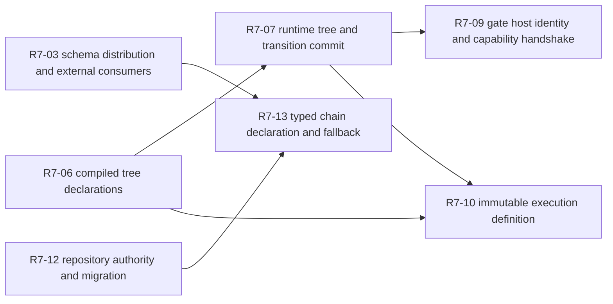

# RFC #547 R6：R7 待调查细节索引

> 固定输入：`11-r5-supply-ledger.md`；仅以 `WORKFLOW.md` R6/R7、`AGGREGATE-547.md` 稳定条款和 `04-r3-supply-slicing.md` 边界作核对。  
> 本索引不查源码、不运行实验、不改变 R5 结论、不生成选项/方案/规模。

## A. 主 agent 摘要（最多一页）

### A1. 分类与覆盖

R5 的 **55/55 个总账族**已逐项进入下列唯一主分类，未映射为 0：

| 分类 | 含义 | 数量 |
|---|---|---:|
| A | 已明确供给/偏离/测试/接缝事实；无需独立 R7，但保留为决策约束或地基 | 27 |
| B | 已形成真实设计/工程分叉；必须经 R7 补足因果与触点事实 | 22 |
| C | 地面事实不足；必须经 R7 查外部 owner、真实消费者或运行路径 | 5 |
| D | 纯未来需求或冻结 SHA 综合证明；留后续，不提前调查 | 1 |
| **合计** |  | **55** |

A = `A-01..12`、`D-06`、`T-01..07`、`J-01..07`；B = 除 `D-04/D-06` 外的 22 个 D 族；C = `D-04`、`U-01..04`；D = `U-05`。

### A2. R7 索引规模与批次

建议 **14 个“一细节一 subagent”调查项**，产物路径固定为 `13-r7-*.md`。这些不是 14 个实现单元，而是 14 个不可混淆的事实裁决点。

- **批次 1（无前置事实依赖）**：finding 权威、cache、materialize、schema 外部链、binding source/type、binding admission、compile tree、tool registry、GitHub 记法、repository 权威。
- **批次 2（消费批次 1 的事实）**：runtime tree/transition、gate host/capability、execution definition pin、chain declaration/fallback。

并行槽位如何分配不属于本报告；批次只表达事实依赖，不表达工作量。

### A3. 关键依赖



其余项可独立调查，只共享 R5、稳定条款和相应 R4 报告作为只读输入。

### A4. R6 gate

**满足。** 55 族全部分类，14 个 R7 项逐项给出稳定条款、R5事实、证据不足原因、可能层、必须建立的事实、最小实验边界、独立派发理由和共享输入；没有候选选项、推荐、成本、PR 大小或实现步骤。R5 结论未改写，`U-05` 未被局部实验提前替代。

---

## B. 证据附录

## B1. 55 族全覆盖分类表

### B1.1 资产族（12/12）

| 总账 ID | 分类 | R6 去向 |
|---|---|---|
| A-01 | A | compiler/result/diagnostics 地基；供 R7-01/06 读取 |
| A-02 | A | projection/schemaVersion/identity 地基；供 R7-01/03/04/06 读取 |
| A-03 | A | source hash 地基；供 R7-02/10 读取 |
| A-04 | A | plan 实体已退役事实；与 D-06 一并留 R10 |
| A-05 | A | binding source/doc 骨架；供 R7-04/05 |
| A-06 | A | doc renderer/prefix/unknown boundary 地基；供 R7-04 |
| A-07 | A | generic JSON/事务/migration 地基；供 R7-05/12/13 |
| A-08 | A | runtime tree ADT/SQL 约束地基；供 R7-07/09/10 |
| A-09 | A | runtime identity/ref 连续地基；供 R7-07/09/10 |
| A-10 | A | closure/回收/局部事务地基；供 R7-07/12 |
| A-11 | A | hook carrier/effective view 地基；供 R7-09 |
| A-12 | A | opaque item/WAL/migration/baseBranch 地基；供 R7-11/12/13 |

### B1.2 偏离与无供给族（24/24）

| 总账 ID | 分类 | R7 索引或后续去向 |
|---|---|---|
| D-01 | B | R7-01 finding 权威与消费者一致性 |
| D-02 | B | R7-02 daemon preset cache 时间一致性 |
| D-03 | B | R7-03 materialize 发布/回滚边界 |
| D-04 | C | R7-04 schema 分发与外部 consumer 地面事实 |
| D-05 | B | R7-01 doctor/findings 消费关系事实 |
| D-06 | A | 缺失已明确且无复杂现存链；保留至 R10，不独立 R7 |
| D-07 | B | R7-05 source type authority |
| D-08 | B | R7-06 create/render 缺值失败时点 |
| D-09 | B | R7-06 create/update admission |
| D-10 | B | R7-05 public binding projection |
| D-11 | B | R7-05 ValueType/exit owner 的现存数据面约束 |
| D-12 | B | R7-05 doc/binding boundary 接缝 |
| D-13 | B | R7-07 compiled recursive tree/normalization |
| D-14 | B | R7-08 runtime constructor/production reachability |
| D-15 | B | R7-08 scheduler authority |
| D-16 | B | R7-08 transition commit/事务 |
| D-17 | B | R7-08 seq/par pin 与 §2.5 接缝 |
| D-18 | B | R7-09 tool registry/四轴/消费者 |
| D-19 | B | R7-09 doctor 工具原语 |
| D-20 | B | R7-10 gate host/capability 握手 |
| D-21 | B | R7-11 definition 内容、ref 与创建 pin |
| D-22 | B | R7-11 resume/restart resolver 与 cache 时间边界 |
| D-23 | B | R7-12 GitHub 记法；R7-13 repository 权威/migration |
| D-24 | B | R7-14 typed chain declaration 与 preset fallback |

### B1.3 未知族（5/5）

| 总账 ID | 分类 | R7 索引或后续去向 |
|---|---|---|
| U-01 | C | R7-04 schema/bindings/GUI/hook 外部链；并向 R7-05 提供 consumer 约束 |
| U-02 | C | R7-09 tool 外部 enforcement；R7-10 gate 外部 capability |
| U-03 | C | R7-11 definition artifact owner/resolver/hold |
| U-04 | C | R7-13 repository/closure owner；R7-14 typed chain boundary |
| U-05 | D | 冻结 SHA 综合验收，留 D11 owner；不进入 R7 |

### B1.4 测试族（7/7）

| 总账 ID | 分类 | 作为哪个 R7 的只读约束 |
|---|---|---|
| T-01 | A | R7-01/04/05/09：shape 不等于语义 |
| T-02 | A | R7-01/02/03；D-06 后续验收 |
| T-03 | A | R7-05/06：旧 binding 语义不能当目标 |
| T-04 | A | R7-07/08/11：fixture 不等于 production |
| T-05 | A | R7-08/11：局部事务/当前源不等于 pin |
| T-06 | A | R7-09/10：carrier 不等于执行 |
| T-07 | A | R7-12/13/14：兼容性不等于退役 |

### B1.5 接缝族（7/7）

| 总账 ID | 分类 | 作为哪个 R7 的只读约束 |
|---|---|---|
| J-01 | A | R7-04/05 |
| J-02 | A | R7-07/08/11 |
| J-03 | A | R7-09/10 |
| J-04 | A | R7-06/13/14 |
| J-05 | A | R7-08/10/11 |
| J-06 | A | R7-08/13 |
| J-07 | A | R7-11/14 |

覆盖校验：

```text
A: 12 assets + 1 deviation + 7 tests + 7 seams = 27
B: 22 deviations = 22
C: 1 deviation + 4 unknowns = 5
D: 1 future verification family = 1
total = 27 + 22 + 5 + 1 = 55
unmapped = 0
```

## B2. R7 逐细节任务索引

### R7-01 — Compile finding 权威与 doctor 消费边界

- **报告路径**：`13-r7-01-finding-authority.md`
- **稳定条款 / 总账**：D1 `CompileResult` 单一权威、P-D1-2 待裁决；`D-01,D-05,A-01,A-02,T-01,T-02`。
- **报告事实**：warnings 与 model 并列，daemon callback 另投影；doctor 未吸收 findings，关系尚未裁决。
- **为何不足**：尚不知道所有 compile 调用者如何取得/保存/展示 warnings，也不知道 doctor 当前健康节的输入生命周期；因此不能只凭“有两条读面”决定统一边界。
- **可能涉及层**：compile API、daemon preset load/cache、CLI projection、doctor/status 展示；不预设权威应落在哪层。
- **必须建立事实**：全部生产 compile 调用点；warning 在 success/error/cache/reload 中的生命周期；doctor/status 当前错误分类与输出契约；同一 compile 结果是否可被拆分后异步消费。
- **最小实验与副作用边界**：隔离 preset 同时产生 warning 与可运行 model，分别走 compile CLI、daemon只读load/status、doctor的隔离 loop-data；不得触碰中央 daemon/生产 DB，不写产品文件。
- **独立派发理由**：这是 finding 权威和消费时序问题，不与 schema 分发或 cache invalidation 共用裁决点。
- **共享只读输入**：R5 `D-01/D-05`；S1 报告；compile公共边界说明。

### R7-02 — Daemon preset cache 的时间一致性与失效面

- **报告路径**：`13-r7-02-preset-cache-coherence.md`
- **稳定条款 / 总账**：§2.3；D1按需计算；D10源变化边界；`D-02,D-22,A-03,T-02,J-07`。
- **报告事实**：成功 promise 按 path 缓存；同进程 scheduler 可见旧 model，CLI/direct 可见新源；失败会重试；重启后读取当前源。
- **为何不足**：缺少所有 cache key、调用者、失效事件、并发请求和失败重试的地面图；无法判断漂移是单点cache还是多生命周期共同结果。
- **可能涉及层**：daemon cache、source hash、materialized path、scheduler load、restart/recovery；不预设修复归 cache 或 definition pin。
- **必须建立事实**：cache创建/命中/淘汰全集；文件修改、materialize、item/chain创建、resume、daemon restart各自读哪份对象；并发compile promise共享及错误重试行为。
- **最小实验与副作用边界**：隔离 daemon + H1/H2 preset编辑，观察同进程各consumer与重启后的hash/model；仅 `/tmp/rfc547-r7-cache-*` 和隔离 loop-data。
- **独立派发理由**：时间一致性与R7-03的文件发布原子性是不同失败判定点；两者必须分开。
- **共享只读输入**：S1/S5摘要，R7-11最终可复用其时间线。

### R7-03 — Preset materialize 的发布、失败与旧版本保留

- **报告路径**：`13-r7-03-materialize-transaction.md`
- **稳定条款 / 总账**：D1装载即编译、§2.3、D10定义内容前置可计算；`D-03,A-03,T-02`。
- **报告事实**：materialize先写marker/rename/prune再parse；非法源可留下完成artifact并删除旧副本。
- **为何不足**：尚缺文件操作顺序、异常窗口、并发发布者、消费者可见性及恢复/清理行为的完整事实。
- **可能涉及层**：source收集、staging/rename、marker、prune、load/compile、daemon启动恢复；不预设事务边界。
- **必须建立事实**：每个副作用时点；每类异常前后目录状态；旧artifact何时失去可达性；并发materialize相互影响；失败后下次load读取什么。
- **最小实验与副作用边界**：纯本地临时source/materialized root，注入语法错误、缺文件和并发调用，记录目录快照；不启动daemon。
- **独立派发理由**：这是文件发布事务，不能并入cache或definition resolver而掩盖独立恢复语义。
- **共享只读输入**：S1报告、R7-02只共享source/hash术语。

### R7-04 — 公共 schema 分发与外部 consumer/producer 实存链

- **报告路径**：`13-r7-04-schema-external-consumers.md`
- **稳定条款 / 总账**：P-D1-1、P-D2-4、S1/S2公共供给；`D-04,U-01,A-02,J-01,T-01`。
- **报告事实**：仓内只有projection instance和ArkType boundary，无可分发schema；外部schema、typed bindings、GUI/hook消费者未知。
- **为何不足**：仓内“无artifact”不能证明全系统无producer/consumer；也不知道外部消费者实际需要的版本、派生和兼容读面。
- **可能涉及层**：artifact发布、CLI/package、GUI/hook/外挂repo、bindings落盘；不预设artifact载体。
- **必须建立事实**：所有外部owner与连接路径；是否读取projection instance、源码type或私有shape；schema版本/缓存/失败策略；typed bindings实际producer。
- **最小实验与副作用边界**：只读搜索已知外部repo/已安装包与运行artifact；必要时在隔离目录调用只读schema命令；不得改外部repo或服务。
- **独立派发理由**：这是跨repo存在性调查，必须与本仓binding设计分开，避免把未知改成不存在。
- **共享只读输入**：R5 `U-01`、S1/S2接缝；结果供R7-05与R7-14读取。

### R7-05 — Binding source type authority、公共投影与数据形状

- **报告路径**：`13-r7-05-binding-type-authority.md`
- **稳定条款 / 总账**：§2 C/E/F、P-D2-1/4/5/6/7、P-D6-3；`D-07,D-10,D-11,D-12,A-05,A-06,J-01,T-01,T-03,U-01`。
- **报告事实**：item四词type无人消费、chain开放、runtime string-only；projection固定string；无recursive ValueType/exit owner；doc边界局部精确。
- **为何不足**：缺少现存值域、嵌套形状、同source跨phase用法、外部consumer读取需求和agent-owned数据载体的完整地面事实，不能从四词表直接推出类型语言细节。
- **可能涉及层**：preset source schema、canonical binding、public projection、prompt/bindings artifact、transition exit输入；不预设variant集合。
- **必须建立事实**：bundled与fixture所有source实际值域；结构值深度/可空性；同source引用冲突；所有投影consumer字段读取；是否已有agent result object边界。
- **最小实验与副作用边界**：静态全量声明/consumer inventory，加隔离compile/render结构值探针；不启动中央daemon，不写生产preset。
- **独立派发理由**：类型权威/公开形状与R7-06的实例准入/失败时点是不同裁决点。
- **共享只读输入**：R7-04外部consumer结果可后补；S2报告。

### R7-06 — Binding create/update admission 与 render 失败时点

- **报告路径**：`13-r7-06-binding-admission.md`
- **稳定条款 / 总账**：§2 D、§2.3、P-D2-2/3；`D-08,D-09,A-07,J-04,T-03`。
- **报告事实**：item/chain缺值静默空串；create/update不按required/type/default执法；结构值到render才throw。
- **为何不足**：缺少所有入口、批量原子性、update patch、migration/recovery和spawn准备的真实事务顺序，不能把单一resolver反例直接翻译成完整准入边界。
- **可能涉及层**：CLI/wire、daemon create/add/batch/update、runtime-data、SQLite事务、scheduler spawn/render；不预设新增门的位置。
- **必须建立事实**：每入口已有值可决定时点；写前/写后副作用；batch失败原子性；历史缺值恢复；render异常如何落status/event/retry。
- **最小实验与副作用边界**：隔离loop-data与fixture preset，对chain create、item add/batch/update、spawn分别注入缺值/错类型；不得用中央daemon或真实runner。
- **独立派发理由**：事务/错误出口需要独立全链调查，不能塞进类型语言索引。
- **共享只读输入**：R7-05提供source/value分类；S2/S6接缝。

### R7-07 — Compiled recursive tree 的声明、normalization 与identity

- **报告路径**：`13-r7-07-compiled-tree-model.md`
- **稳定条款 / 总账**：P-D3-1/2/3/4/5/7/8、§2.4；`D-13,A-01,A-02,A-08,J-02,T-04`。
- **报告事实**：canonical/投影只有退化phase seq；无递归声明、显式node id、join候选、结构检查。
- **为何不足**：缺少现有phase/status/DAG校验可承载的结构边界、identity命名冲突面及所有compiled consumer假设。
- **可能涉及层**：TOML boundary、canonical compiler、DAG findings、projection、phase查询；不进入runtime调度语义。
- **必须建立事实**：所有phase-list consumers；现有identity生成/引用集合；校验顺序与finding分类；线性preset兼容读面；外部consumer是否假设数组。
- **最小实验与副作用边界**：只读consumer inventory和临时nested声明边界探针；不修改bundled preset、不启动daemon。
- **独立派发理由**：定义树模型必须先于runtime constructor，且不能与调度实现混成一个根因。
- **共享只读输入**：S1/S3报告；结果供R7-08/10/11。

### R7-08 — Runtime tree constructor、scheduler authority 与transition commit

- **报告路径**：`13-r7-08-runtime-transition-commit.md`
- **稳定条款 / 总账**：P-D3-1/3/4/6/8/9、§2.4/2.5；`D-14,D-15,D-16,D-17,A-08,A-09,A-10,J-02,J-05,J-06,T-04,T-05`。
- **报告事实**：runtime seq/par/join SQL与ADT存在但主要fixture可写；production scheduler仍按phase/status/runs推进；无唯一typed transition commit；run close跨事务。
- **为何不足**：缺少production constructor入口、所有推进/重开/恢复/闭包调用链及资源副作用的统一时间线，无法判断哪些SQL资产真正可接、哪些只是fixture形状。
- **可能涉及层**：chain/item实例化、task-runtime/sqlite、scheduler、run lifecycle、closure/worktree、events/status/recovery；不预设根因在scheduler或storage。
- **必须建立事实**：production可达调用图；每次推进的权威信号；cursor/closure/run写入事务边界；失败/kill/restart后的exactly-once或重复行为；par pin现存输入与资源交互。
- **最小实验与副作用边界**：隔离daemon、stub runner、临时git fixture；覆盖success/failure/kill/restart并查SQLite/events/resources；不得运行真实GitHub E2E。
- **独立派发理由**：这是跨进程/存储的核心复杂细节，必须消费R7-07定义事实后单独调查。
- **共享只读输入**：R7-07输出；S3/S6报告。

### R7-09 — Tool registry、doctor 与外部 enforcement 实存链

- **报告路径**：`13-r7-09-tool-capability-chain.md`
- **稳定条款 / 总账**：§2 G/H、P-D4-1…5；`D-18,D-19,U-02,A-11,J-03,T-01,T-06`。
- **报告事实**：registry四轴、phase requirements、prompt doc和runtime finalize无仓内供给；doctor硬编码gh；外部C6未知。
- **为何不足**：缺少外部enforcement owner、真实tool invocation/outcome数据和doctor被哪些preset/target消费的事实，不能从空projection决定完整连接方式。
- **可能涉及层**：preset compiler、projection、doctor、prompt binding、runner/tool wrapper、outcome persistence/finalize；不把gate混入。
- **必须建立事实**：所有工具名硬编码与doctor调用面；runner/tool边界；外部C6 API/事件/持久化；outcome能否与具体run/tool identity关联；失败恢复。
- **最小实验与副作用边界**：本地临时preset/doctor隔离检查，加外部owner只读调查；不登录/修改外部系统，不运行生产tool副作用。
- **独立派发理由**：tool四轴与gate decision point是不同模型和判定点，必须分开。
- **共享只读输入**：S4报告、R7-04外部owner清单可共享。

### R7-10 — Gate host identity、placeholder binding 与capability握手

- **报告路径**：`13-r7-10-gate-capability-handshake.md`
- **稳定条款 / 总账**：P-D5-1…4、§2.4；`D-20,U-02,A-08,A-09,A-11,J-03,J-05,T-06`。
- **报告事实**：hook carrier存在但never execute；preset gate无loader/projection/required标志/host identity/unsupported；外部capability未知。
- **为何不足**：缺少decision point实际触发位置、host identity可用时点、四层脚本绑定解析及外部执行/hold路径。
- **可能涉及层**：compiled tree point、runtime node identity、hook layers、scheduler/daemon decision points、external executor；不预设point词表或执行语义。
- **必须建立事实**：每个现存decision point调用位置与host对象；identity在该时点是否持久；placeholder到script的真实绑定链；无capability/缺binding/脚本失败的错误与恢复。
- **最小实验与副作用边界**：先静态调用图，后在隔离daemon用无副作用脚本/marker验证真实触发；不得触碰中央daemon或生产hooks。
- **独立派发理由**：gate依赖R7-08提供host/transition事实，但不能并入tool或树调度。
- **共享只读输入**：R7-08输出；S3/S4报告；外部owner信息可与R7-09共享。

### R7-11 — Execution definition 内容、创建 pin 与resume/restart resolver

- **报告路径**：`13-r7-11-execution-definition-pin.md`
- **稳定条款 / 总账**：D10 P-D10-1…6；`D-21,D-22,U-03,A-03,A-09,J-02,J-05,J-07,T-04,T-05`。
- **报告事实**：tagged ref/FK与source hash存在，但definition无内容、创建不pin、resolver不读ref；同进程cache偶然冻结，重启漂移。
- **为何不足**：未知artifact owner、可保护字段闭集、所有resume重渲染输入、缺失/损坏恢复及外树GUI/hook读取路径。
- **可能涉及层**：compile product/hash、definition storage/ref、chain/item create事务、scheduler render/resume、status/events/hook/GUI、recovery；不预设artifact介质。
- **必须建立事实**：运行前完整可计算字段全集；每consumer当前source；ref创建与写入事务；H1/H2时间线；artifact缺失/损坏/GC；外部owner。
- **最小实验与副作用边界**：隔离daemon和preset H1/H2，create→spawn→edit→resume→kill/restart，记录prompt/hash/ref/status；不得使用真实GitHub runner。
- **独立派发理由**：definition immutability横跨创建与恢复，是单一复杂根因；与cache/materialize共享事实但裁决边界不同。
- **共享只读输入**：R7-02/03/07/08输出；S1/S3/S5。

### R7-12 — GitHub 记法与opaque item ID 的入口全景

- **报告路径**：`13-r7-12-github-notation-surfaces.md`
- **稳定条款 / 总账**：P-D7-1/3/4、§2 H；`D-23,A-12,T-07`。
- **报告事实**：`--issue`、GitHub引用解析/normalize、batch legacy backfill等仍闭合；opaque item存储主体存在。
- **为何不足**：R5把多种命中合并为一族，尚缺CLI/wire/preset文档/daemon/迁移各入口的调用者与兼容依赖，不能把字符串命中直接当同一退役动作。
- **可能涉及层**：CLI grammar/help、wire fields、daemon parser、batch normalization、preset fragments、migration/tests；repository另由R7-13。
- **必须建立事实**：全部GitHub记法入口和生产调用者；每入口输出到opaque item id的转换；外部脚本依赖；未知/冲突输入的现有失败语义。
- **最小实验与副作用边界**：CLI parse/daemon request使用隔离loop-data，覆盖opaque/non-GitHub id和legacy输入；不调用GitHub网络。
- **独立派发理由**：item记法退役与repository存储权威是两个不同数据模型，不能合并。
- **共享只读输入**：S6报告；T-07清单。

### R7-13 — Repository 权威、SQLite migration 与closure身份接缝

- **报告路径**：`13-r7-13-repository-authority-migration.md`
- **稳定条款 / 总账**：P-D7-2、§2.5 baseBranch例外；`D-23,U-04,A-07,A-10,A-12,J-06,T-07`。
- **报告事实**：repository仍为物理权威并有forge admission；metadata binding形成双读面；closure真实消费baseBranch/repo上下文；future owner未知。
- **为何不足**：缺少所有repository读写者、存量DB冲突数据、migration版本协调和closure/worktree对repository身份的真实依赖。
- **可能涉及层**：CLI sugar、daemon admission、runtime-data、SQLite schema/migration、chain/status、closure/worktree/recovery、外部chain schema；不预设repository最终载体。
- **必须建立事实**：列/metadata双权威读写全集；存量null/格式/冲突分布；migration先例与版本占用；closure资源如何定位repo；外部owner是否已有identity。
- **最小实验与副作用边界**：复制/合成隔离旧schema DB，覆盖一致/冲突/非GitHub repository与closure恢复；不得修改真实DB或远端repo。
- **独立派发理由**：这是持久化/migration/资源身份问题，必须与CLI记法、preset fallback分开。
- **共享只读输入**：R7-12只共享术语；结果供R7-14。

### R7-14 — Typed chain declaration boundary 与preset fallback/recovery

- **报告路径**：`13-r7-14-chain-declaration-fallback.md`
- **稳定条款 / 总账**：D9 P-D9-1…3、D10 chain definition接缝；`D-24,U-04,A-12,J-04,J-07,T-07`。
- **报告事实**：per-item preset真实，但legacy null会回退chain/default；无单一外部typed chain boundary；无item在手的chain判定来源未知。
- **为何不足**：缺少外部boundary owner/schema、全部preset resolution调用点、legacy存量分布及恢复/chain-complete在无item时的读取事实。
- **可能涉及层**：chain create/wire/storage、item preset resolution、status/recovery/chain-complete、外部chain declaration；不预设boundary归属。
- **必须建立事实**：每种null/non-null组合的生产语义；所有fallback调用者；存量DB组合；无item判定所需字段；外部owner实际接口与错误形态。
- **最小实验与副作用边界**：隔离DB构造preset组合，运行只读status/recovery/chain-complete前置判定；外部repo只读；不触发真实runner。
- **独立派发理由**：fallback/chain declaration是定义选择问题，不应与repository migration或execution artifact混合。
- **共享只读输入**：R7-04外部owner、R7-13持久化事实、S5/S6报告。

## B3. 合并与拆分理由

### B3.1 合并

1. `D-01 + D-05` 合并：两者都决定 compile findings 的权威结果如何进入消费端；没有必要让两个subagent重复枚举compile/doctor调用者。
2. `D-07 + D-10 + D-11 + D-12` 合并到R7-05：共同问题是source类型证据在canonical/public/consumer间如何流动；doc是同一binding boundary的局部资产。
3. `D-08 + D-09` 合并到R7-06：缺值空串和create/update无准入必须在同一“最早可决定时点”时间线上观察。
4. `D-14..17` 合并到R7-08：production constructor、scheduler authority、transition commit和§2.5资源副作用构成不可拆的运行推进链。
5. `D-18 + D-19 + U-02(tool份额)` 合并到R7-09：registry的doctor/prompt/runtime三消费者必须用同一工具identity核对。
6. `D-21 + D-22 + U-03` 合并到R7-11：definition内容、创建pin、resume/restart resolver是同一个不可变定义生命周期。

### B3.2 拆分

1. cache与materialize拆分：前者是进程内对象时间一致性，后者是文件发布/回滚事务。
2. schema外部链与binding类型拆分：前者先回答owner/consumer是否存在，后者回答本仓数据形状；跨repo未知不能污染本地类型事实。
3. binding类型与admission拆分：公开类型语言和实例事务/错误出口是不同裁决点。
4. compiled tree与runtime transition拆分：定义模型必须先成为事实，runtime才可调查消费；避免用fixture runtime ADT倒推DSL。
5. tool与gate拆分：四轴registry和decision-point capability是稳定条款明确区分的模型。
6. GitHub item记法、repository权威、chain fallback三分：分别是标识符入口、持久资源身份、定义选择，失败/迁移边界不同。
7. dead-fragment `D-06` 不派R7：R5已明确checker无供给、plan退役事实完整；它保留到R10生成需求和后续验收，不需要为了“明显缺失”重复查存在性。
8. `U-05` 不派R7：冻结 SHA综合验证是D11未来owner，局部调查不能替代。

## B4. R7 建议批次与报告路径

### 批次 1：无前置事实依赖

| 项 | 报告 |
|---|---|
| R7-01 | `13-r7-01-finding-authority.md` |
| R7-02 | `13-r7-02-preset-cache-coherence.md` |
| R7-03 | `13-r7-03-materialize-transaction.md` |
| R7-04 | `13-r7-04-schema-external-consumers.md` |
| R7-05 | `13-r7-05-binding-type-authority.md` |
| R7-06 | `13-r7-06-binding-admission.md` |
| R7-07 | `13-r7-07-compiled-tree-model.md` |
| R7-09 | `13-r7-09-tool-capability-chain.md` |
| R7-12 | `13-r7-12-github-notation-surfaces.md` |
| R7-13 | `13-r7-13-repository-authority-migration.md` |

### 批次 2：消费批次 1 的事实

| 项 | 前置只读事实 | 报告 |
|---|---|---|
| R7-08 | R7-07 compiled tree/identity消费者表 | `13-r7-08-runtime-transition-commit.md` |
| R7-10 | R7-08 host identity/decision时点 | `13-r7-10-gate-capability-handshake.md` |
| R7-11 | R7-02/03时间线、R7-07/08定义与运行consumer | `13-r7-11-execution-definition-pin.md` |
| R7-14 | R7-04外部owner、R7-13存储/migration事实 | `13-r7-14-chain-declaration-fallback.md` |

批次 2 的前置仅是事实输入，不意味着前一报告提出或决定后一报告的方案。

## B5. R7 通用报告纪律

每个subagent：

1. 只回答自己的细节，从观察点追到必要层，不越界裁决相邻项。
2. 把R5事实当调查起点，不重新评价R4结论。
3. 对未知列出已查owner/path/API及仍缺什么；无证据不补猜测。
4. 实验只用隔离目录、隔离loop-data/DB/fixture；禁止中央daemon、生产DB、真实外部副作用。
5. 报告事实、触点、数据、调用链、失败/恢复和确定后果；不写候选方案、推荐、成本、PR大小或实现步骤。
6. 发现跨项事实时只提供带证据的接缝，由主agent转交，不扩张本项裁决范围。

## B6. 排除项

- 不重新调查R4源码证据，不修改R5分类结论。
- 不把反例自动升级为需求；需求推导留R10。
- 不为`json`呈现、ValueType variant、tree语法、gate point、artifact载体等待裁决项写候选。
- 不提前执行U-05冻结SHA integration/real E2E。
- 不按工作量、文件数或预想PR排序批次。
- 不把A类资产/接缝/测试事实误报为“无需保留”；它们继续约束R8/R9/R10。

---

**尾部结论：R5 的55个总账族已以 A27/B22/C5/D1 全覆盖分类，未映射0；22个真实分叉与5个地面未知被收敛为14个互不混淆、按事实依赖分两批的R7调查项。明确资产、测试与接缝继续作为地基，dead-fragment缺失留R10，冻结SHA证明留D11；R6未生成任何方案或规模判断，可以进入R7。**
