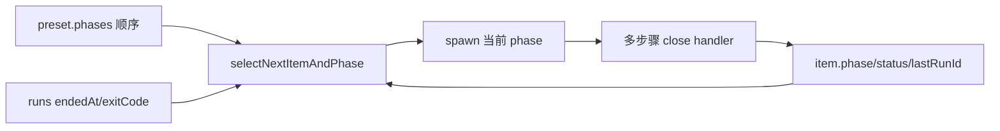
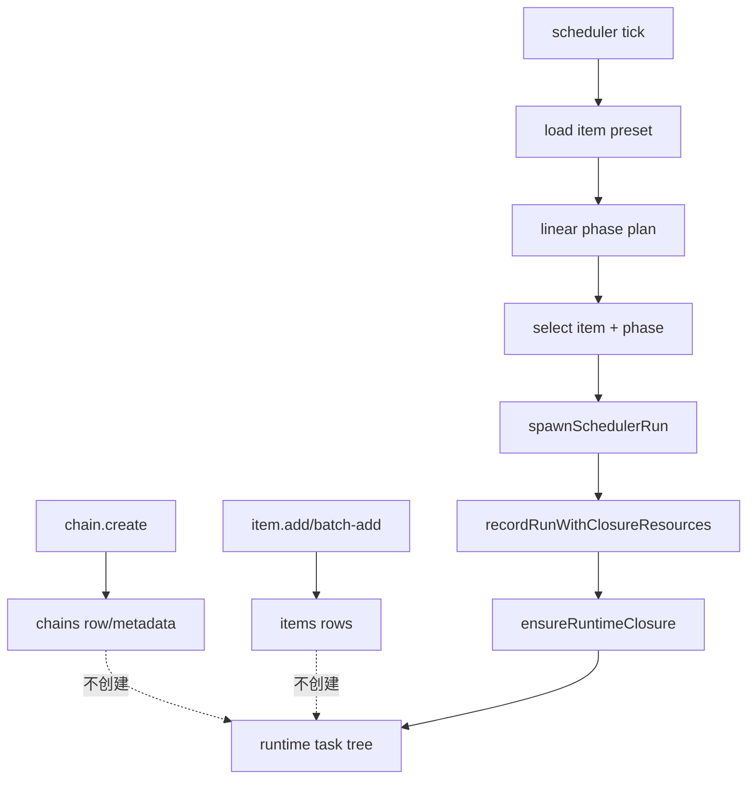

# R7-08 — Runtime tree constructor、scheduler authority 与 transition commit

> 固定基线：`main@699842eba2eefc242d19f8fa9232bc1d9d5c3bdd`  
> 锚点：P-D3-1/3/4/6/8/9、§2.4/2.5；总账 `D-14,D-15,D-16,D-17,A-08,A-09,A-10,J-02,J-05,J-06,T-04,T-05`。前置事实：`13-r7-07-compiled-tree-model.md`。本报告不裁决、不设计、不估算。

## A. 决策摘要（≤1 页）

### A1. 结论

production 没有“compiled tree → runtime tree”的 constructor。scheduler 从 item preset 的线性 `phases[]` 计算 phase plan；每次准备一个 run 时，只把当前 phase 对应的 compiled leaf identity写入 run packet。SQLite 在首次遇到该 item/phase 时动态创建 root、leaf、closure，后续遇到新phase再 append leaf。链/item创建不实例化树，nested seq/par/join/pin均只能由公开 store API或migration/test写入，production scheduler不读取它们决定推进。

实际推进权威是：



runtime `seq.cursor` 不参与 selection，正常run完成也不推进cursor；其生产更新只出现在首次root构造与删除leaf后的修复。因此 status tree是真实持久化投影，但不是调度权威。

不存在 typed `TransitionPath` 或唯一 transition commit。run close依次跨越 agent status写、run complete、active-run clear、session/item update、closure lifecycle、events与chain completion等独立事务/异步步骤。每个 store method有 `BEGIN IMMEDIATE` 原子性，但没有包住整个业务转移。exactly-once只在局部 identity/unique/outbox意图上成立；端到端业务 transition没有 exactly-once语义。

startup recovery是process/run repair，不是transition replay：清 stale current，kill旧process group，把 `endedAt=null` run标成 `orphaned/-1`，保留 item status/phase/session；随后从这些旧事实重新调度。它能消除“活跃进程/unfinished run”阻塞，却不能知道崩溃发生在close步骤的哪一边，也不补交一个原子业务commit。

### A2. success/failure/kill/restart 与资源

- success：exit 0允许线性下一phase；最后phase若没有新的agent status write且status仍continuable，会重跑当前phase。
- ordinary failure：exit非0阻止phase advance；backoff/attempt等是独立item extra状态。
- kill/timeout/rate-limit/session-invalid：各有专用close分支；仍以run/process/item旧字段处理，不产生typed transition。
- daemon kill/restart：unfinished run被标orphan；status可能保持in_progress/entry，后续重新spawn；同一业务意图可产生新runId和重复agent副作用。
- closure branch/worktree/base commit、reachability sampling、consumption intent与cleanup是真实资产；run-start的prepared resources + runtime leaf/closure/run在一个store transaction内。之后spawn与close不在该事务。
- par `pinCommit`、join binding version、epoch/reopen字段有strict ADT/SQL/round-trip；production没有par constructor或scheduler consumer，故没有same-commit并行资源行为。

### A3. 置信度、资产与未知

高置信度：production调用图、SQL约束、事务边界、close/recovery次序均直接核验；19个task-tree store tests通过。按任务明确禁止 worktree，本次没有运行会创建closure worktree的engine-integration harness；因此真实stub-runner success/failure/kill时序引用现有隔离integration源码/证据，未冒充新实验。

可保留：runtime ADT/strict boundary、SQLite FK/unique/check、definition/run/closure identity链、局部run-start事务、recovery identity核对、closure consumption intent和resource reconciliation。

未知：未来recursive compiled tree constructor、par scheduling、typed transition payload、跨事务commit载体及其replay策略；这些均不能从现有SQL命名推导。

---

## B. 生产事实与证据

### B1. Production 可达调用图

#### 创建面



chain/item create只写业务 rows；全仓 production `createTaskTree`调用为零。runtime tree首次生产写在run-start路径：

1. `resolvePhasePlanForChainWithItems`从代表item preset取 plan；
2. `buildPhasePlanFromPreset` filter `preset.phases`；
3. selection选择item/phase；
4. `spawnSchedulerRun`加载item preset、计算definition content identity、构造run extra；
5. `recordRunWithClosureResources`调用 `ensureRuntimeClosure`；
6. 若无root动态建seq root，只append当前 phase leaf/closure；
7. insert run并关联 leaf。

证据：`src/scheduler.ts:592-713,1565-1706`; `src/sqlite-state.ts:1643-1671,1915-1918,2292-2361`。

#### compiled identity只作关联

R7-07证明 compiled tree固定退化。scheduler把 `preset.tasks.children` flatMap为 phase→single `definitionNodeId` packet，再找当前phase id；SQLite只校验非空 definition ref/node string，不存在定义节点FK。identity链为：

`sourceHash → run.extra.definitionContentIdentity/definitionPhases → runtime leaf.definitionRef+definitionNodeId → run.runtimeNodeId/closureId`。

这是真实关联，但constructor没有递归消费 compiled root。

### B2. Scheduler 推进权威

`SchedulerPhasePlan`只有：

- `firstPhase`;
- `nonTriggerPhases[]`;
- `itemTriggerPhases[]`
  （`src/scheduler.ts:592-622`）。

`selectNextItemAndPhase`读取：

- `item.phase/status/lastRunId/statusUpdatedAt`;
- latest run `endedAt/exitCode/startStatus`;
- phase array index；
- trigger phase afterPhase/whenStatus
  （`src/scheduler.ts:635-721`）。

下一phase规则：

1. current run未结束 → 不选；
2. terminal status → 不选；
3. latest run与item/phase不一致 → 不选；
4. latest exit非0 → 不前进；
5. exit 0 → `nonTriggerPhases[index+1]`；
6. 最后phase未写status且仍pending → 重跑最后phase。

它不读取 task tree、seq cursor、par state、join evaluation或candidate。D-15因此仍不符合。

### B3. Runtime ADT/SQL资产与production缺口

`src/task-runtime.ts:3-58,127-175`定义 strict：

- tagged definition ref；
- runtime/definition node identity；
- leaf/seq/par；
- seq cursor；
- par pin/state/reopen；
- drain/validator join；
- evaluation not-evaluating/evaluating/decided/consumed。

SQL主要约束：

| 资产 | 约束 |
|---|---|
| execution definition | PK `(kind,content_identity)` |
| task node | runtime PK、definition FK、parent/index unique |
| tree | 每chain唯一root |
| closure/leaf | 1:1、item/phase unique |
| run | closure/runtime node composite FK |
| active run | run/closure FK |
| seq cursor | 必须指direct child（store层检查） |
| par join | binding version与evaluation FK |
| source par | closure必须引用实际parent par |

证据：`src/sqlite-state.ts:630-773,2363-2405`。

但 production只生成seq root+leaf；`createTaskTree`递归写入和par/join更新主要被tests/migration调用。scheduler没有读取par state/pin/join。D-14仅部分符合。

### B4. Cursor写读事实

dynamic root首次创建时 cursor指向首leaf；append后续phase leaf不更新cursor（`src/sqlite-state.ts:2327-2336`）。正常 run close无cursor write。唯一production cursor调整是删除item/leaf时把next指向仍存direct child或complete（`src/sqlite-state.ts:1849-1877`）。

后果：

- scheduler可推进到review而status tree cursor仍指iteration；
- cursor与phase权威可长期不同；
- nested seq round-trip正确不证明readiness使用cursor；
- 不能把cursor字段称为committed transition位置。

### B5. Run-start事务与资源副作用

所有store write wrapper各自使用 `db.transaction(fn).immediate()`（`src/sqlite-state.ts:1605-1612`）。

`recordRunWithClosureResources`的局部事务覆盖：

- execution definition/root/leaf/closure；
- prepared closure id/resources核对；
- run row及runtime identity关联。

测试 `prepared closure resources and run history commit atomically`证明冲突时整method回滚。通过后，以下在事务外发生：

- current run设置；
- item phase/lastRun/attempt更新；
- credential mint；
- prompt/runner evidence文件；
- runner process spawn；
- events。

因此“run已持久但process未spawn”“资源已准备但current/item未更新”等窗口由补偿/重调度处理，不是单提交消除。

closure资源由engine命名/创建：base commit、branch、worktree path绑定closure。资源清理只在consumed/reconciliation路径执行；cleanup失败保留可重试事实（`src/scheduler.ts:1010-1090,1489-1524`）。这是A-10资产。

### B6. Close handler 时间线与事务分割

从 `src/scheduler.ts:1930-2165` 可重建：

1. runner stdout/stderr持续解析session/rate-limit；
2. agent可在child退出前通过daemon独立写item status；
3. child close触发status/exit分类；
4. `completeRun`独立事务写endedAt/exitCode/status/extra；
5. `clearCurrentRun`独立事务；
6. session id独立写/清；
7. item phase/lastRun/attempt/backoff独立update；
8. closure lifecycle独立事务；
9. emit phase/agent/closure等events；
10. 尝试closure consumption、queue/chain completion。

不同错误分支会跳过或改变部分步骤。event persistence还可独立失败。没有一个对象同时携带 path identity、target、bindings、exit payload与commit id；`item.status`写是独立business mutation，run exit是另一事实。D-16无供给。

### B7. 并发与局部 exactly-once

#### 已有保证

- SQLite `BEGIN IMMEDIATE`串行单method writes；
- runtime node/closure/item-phase/active-run uniqueness拒绝同identity冲突；
- scheduler slot/state避免同repo重复active spawn；
- run/closure composite FK防止错配；
- closure consumption intent有 `pending → emitted`，restart后可补event；
- cleanup保留resources/intent以便retry。

#### 不存在的端到端保证

- agent status write与run close不是同事务；
- process副作用/git commit/remote请求不受DB exactly-once保护；
- crash后新run可重复prompt与外部副作用；
- events不构成business commit；
- item phase/status与tree cursor可分叉；
- closure suspend/consume与phase推进不是同commit。

因此只能说局部idempotency/uniqueness，不可说transition exactly-once。

### B8. Success / failure / kill / restart 矩阵

| 场景 | durable run | item/phase | tree/closure | restart行为 |
|---|---|---|---|---|
| success exit 0 | complete | 可进下一phase；最终状态取agent write | leaf保留，closure后续suspend/consume | 按item/runs重算 |
| exit nonzero | complete failure | 不进下一phase；backoff按分支 | tree不回滚 | 后续按continuable/backoff |
| spawn失败 | 可能在process前已有run准备事实，进入spawn abort补偿 | entry/status/backoff恢复 | prepared closure可能保留 | 继续重试 |
| timeout/idle kill | run记录kill分类 | retry/attempt规则 | closure保留 | 重试可产生新run |
| rate limit | complete分类并回滚attempt | rate-limit gate | closure保留 | 到期再调度 |
| session invalid | complete；清session | phase仍按旧规则 | closure session更新分离 | fresh再跑 |
| daemon SIGKILL mid-run | endedAt可能null，current存在/不存在 | business fields保留 | resources保留 | kill stale PG、clear current、orphan run |
| crash mid-close | run可能已ended、item/closure/events未推进 | 任意中间组合 | 不做transition replay | scheduler从残留事实继续 |

### B9. Startup recovery精确边界

`recoverStaleSchedulerState`（`src/daemon.ts:2350-2397`）：

- 遍历current runs；
- 强制要求run runtime identity仍在tree；
- kill stale process group；
- clear current；
- emit `scheduler.recovery(stale_current_run)`；
- reconcile unfinished runs；
- reconcile closure resources。

`reconcileOrphanedRuns`（`src/daemon.ts:2400-2432`）把所有 `endedAt=null` run独立 `completeRun`为 `exitCode=-1,status=orphaned`，附 `reconciledBy=daemon_startup`，再emit一个summary event。

明确不做：

- 不改item status/phase/session（源码注释钉死）；
- 不推进seq cursor；
- 不恢复typed transition；
- 不判断agent side effect是否已发生；
- 不重放close handler余下步骤。

所以restart提供at-least-retry倾向，而非exactly-once业务完成。

### B10. Par pin与资源交互

现存 par snapshot含 `pinCommit`，SQL持久化该值；join binding/evaluation版本完整。但：

- compiled tree不能声明par；
- production constructor不创建par；
- scheduler不读取pinCommit；
- closure resources从chain base/item phase动态准备；
- 没有“同一par children必须基于同pin”的production guard；
- reopen count/budget/evaluation没有scheduler推进者。

因此par pin仅storage asset。§2.5的fresh base/closure branch/reachability sampling有production供给；“par同commit派生”无production供给，D-17只能部分符合。

### B11. 实验与只读证据

#### 新执行：SQLite/runtime tree层

```sh
bun test tests/unit/sqlite-state/task-tree.test.ts --timeout 30000 \
  > /tmp/rfc547-r7-08-task-tree-tests.log 2>&1
```

结果：19 pass / 0 fail。覆盖：

- run/closure round-trip与conflict；
- prepared resources + run局部原子；
- dynamic phase leaf materialization；
- nested tree/cursor/source-par约束；
- lifecycle/consumption intent；
- join binding/evaluation；
- migration/recovery相关store行为。

这些tests使用隔离临时DB并清理；不触碰中央daemon/生产DB。

#### 未执行：stub-runner/worktree路径

仓库现有 `scripts/engine-integration.ts` 会在 `.coder-loop/runtime/engine-integration/<uuid>` 创建git fixture、closure worktree并启动daemon。任务明确禁止修改repo与创建worktree，故本次没有运行；不能把其existing green当本次证据。

failure/kill/restart事实通过production调用顺序及已存在隔离tests inventory核验：

- `tests/integration/daemon/startup-recovery.integration.ts`;
- `tests/integration/scheduler/daemon-restart.integration.ts`;
- `tests/integration/scheduler/phase-advancement.integration.ts`;
- `tests/integration/scheduler/backoff-attempts.integration.ts`.

检索登记：`/tmp/rfc547-r7-08-recovery-tests.txt`。这符合防污染边界，但留下“本次未新跑真实process crash”的明确证明缺口。

### B12. 测试同错与盲区

#### 同错

- nested seq/par/join tests直接调用 `createTaskTree`，绕过compiler和production constructor；
- identity integration只证明退化leaf关联；
- phase advancement tests按旧phase/run/item权威写期待，可与tree cursor旁路共同绿；
- run-start atomic test不能推广到run-close；
- restart tests证明process cleanup与旧线性reselection，不证明transition replay；
- worktree tests证明resource reconcile，不证明par pin。

#### 有效资产证明

- strict ADT/SQL constraint；
- unique/FK拒绝错配；
- local transaction rollback；
- stale process kill/orphan run reconciliation；
- consumption intent恢复；
- closure resource cleanup/retry。

#### 未覆盖

- compiled nested tree生产constructor；
- scheduler仅从runtime cursor/readiness推进；
- typed transition path提交；
- crash在close每两个步骤间的系统化fault injection；
- agent外部副作用dedupe；
- real par overlapping children同pin；
- join evaluation/reopen/restart全链。

### B13. 事实支持形态与确定后果（不推荐）

| 形态 | 当前事实 | 确定后果 |
|---|---|---|
| 保持phase/run/item为权威，tree作projection | 当前实现 | linear可运行；cursor可漂移；nested/par不可达 |
| 仅使用现有runtime tree storage | store API可写 | 无compiler constructor/scheduler消费，仍是fixture形态 |
| 把agent status write视为transition | 当前业务信号之一 | 与run close/closure/event分离，不原子 |
| 把run exit视为transition | scheduler已消费 | 缺typed path/output，agent status仍第二权威 |
| 以recovery补偿多步close | 当前局部做法 | 清理process/run，不能判定/重放业务side effect |
| 使用par pin SQL直接宣称same-commit | 只有字段/round-trip | production无par child/resource guard |

### B14. 证据索引

| 事实 | 位置 |
|---|---|
| R7-07 compiled前置 | `13-r7-07-compiled-tree-model.md` |
| phase selection权威 | `src/scheduler.ts:592-713` |
| spawn/runtime identity | `src/scheduler.ts:1565-1741` |
| close多步骤 | `src/scheduler.ts:1930-2165` |
| closure reconcile | `src/scheduler.ts:1010-1090` |
| closure consume/outbox | `src/scheduler.ts:1489-1524` |
| runtime ADT | `src/task-runtime.ts:3-58,127-175` |
| SQL schema约束 | `src/sqlite-state.ts:630-773` |
| transaction wrapper | `src/sqlite-state.ts:1605-1612` |
| run-start局部事务 | `src/sqlite-state.ts:1643-1671,1915-1918` |
| cursor delete修复 | `src/sqlite-state.ts:1849-1877` |
| dynamic constructor | `src/sqlite-state.ts:2292-2361` |
| recursive store insert | `src/sqlite-state.ts:2363-2405` |
| daemon recovery | `src/daemon.ts:2350-2432` |
| test运行日志 | `/tmp/rfc547-r7-08-task-tree-tests.log` |
| recovery test inventory | `/tmp/rfc547-r7-08-recovery-tests.txt` |

## 尾结论

production runtime tree是“run遇到phase时动态append leaf”的持久化骨架，不是compiled tree实例，也不是scheduler权威；调度仍由`preset.phases + item.phase/status + runs`决定，seq cursor不参与。run-start有强局部事务，closure/resource/recovery也有可保留资产，但run close跨多个事务、process与event，既无typed TransitionPath也无唯一commit；crash recovery只清process/current并orphan unfinished run，不重放业务transition。nested seq/par/join/pin的ADT与SQL主要由fixture供给。故D-14/D-17仍部分符合，D-15不符合，D-16无供给；不能以表、绿测、identity或recovery存在升级为exactly-once runtime semantics。
