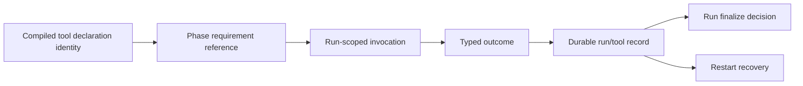

# R7-09 — Tool registry、doctor 与外部 enforcement 实存链

> 固定基线：`main@699842eba2eefc242d19f8fa9232bc1d9d5c3bdd`  
> 锚点：§2 G/H、P-D4-1…5；总账 `D-18,D-19,U-02,A-11,J-03,T-01,T-06`。本报告只调查 tool；gate decision point/placeholder/host handshake 留给 R7-10。

## A. 决策摘要（≤1 页）

### A1. 观察与结论

完整因果链在第一个生产边界即中断：TOML parser 没有 `[[tools]]` 或 phase `toolRequirements`，unknown declaration 被删除；canonical model没有 registry；projection 仅硬写 `tools:[]` 与 `toolRequirements:[]`。因此 doctor、prompt、runner、run finalize 不可能从同一声明取得 tool identity。

doctor 的真实工具检查有两类：

1. **固定原语**：无条件检查 `gh`、`gh auth status`、`coder-loop`，可选 `--repo` 再执行 `gh repo view`；
2. **runner prerequisite**：从 status 的 phase runner selections 取得 binary，只检查 PATH existence。

第二类是 runner 可执行文件准入，不是 D4 tool registry：它没有 provider/availability/outcome/enforcement，也不记录“某 run 使用某 tool”。scheduler 只 spawn runner、解析 runner session/exit/rate-limit，并无 tool invocation event、tool outcome、run/tool identity或 required-tool finalize。

R7-04 已核验的 owner 中也没有 C6 实现。`github-hapi-agent-router` 的 `outcome=consumed|not-consumed` 是 webhook delivery协议，不引用 coder-loop run/tool identity；HAPI 有自身动态 tool discovery与 tool-call事件，但没有 coder-loop `toolRequirements`、`entry-existence`、run identity或 finalize接口。全本机外仓搜索的精确 D4 词仅命中文档/原型及无关项目。故 U-02 收窄为：**已访问 owner没有从 #547 声明到 C6 outcome 的实存链；未 checkout/归属仅由 issue 登记的 #545 外树仍未知。**

### A2. 身份、恢复与影响

- compiler 无 tool identity，projection 空数组不能建立引用；
- scheduler event identity是 chain/item/run/phase/runner，不含 tool；
- status/events/SQLite 没有 tool availability/invocation/outcome字段；
- run close以 process exit、agent status write、rate-limit/session-invalid等信号推进，不检查 required outcome；
- restart只能恢复 run/session/queue等已有状态，无法恢复不存在的 tool outcome。

确定后果：即使 agent真实调用了 `gh` 或任意 runner-native tool，coder-loop也无法把它与一个 compiled requirement关联；即使 runner/tool stream有“tool call”，本仓也没有 ingest/persist/finalize消费者。doctor 的成功只证明 binary/auth当时可用，不证明某 phase要求、某 run使用或某 outcome达成。

### A3. 置信度、未知与 readiness

- **高置信度**：本仓入口、doctor、runner、event/persistence/finalize全链；有源码、全量检索和只读 doctor实验。
- **中置信度**：本机可访问 router/HAPI外仓；其自身 tool/outcome词汇已核验为不同协议。
- **未知**：没有本地 checkout/可验证 API 的 #545 C6未来实现、external wrapper与 outcome store。

R7-10可使用本报告的“tool链为空”结论，但不得把 HAPI capability或hook carrier当作 tool/gate统一模型。

---

## B. 证据与因果链

### B1. 声明 → canonical → projection

| 阶段 | 实存形态 | 结果 |
|---|---|---|
| TOML boundary | 只有 name/item/runtime/statuses/phases/fragments/agent；phase无 requirements | tool声明被unknown-key行为删除 |
| canonical | `Preset`/`PresetPhase`无tools/requirements | 无 identity、四轴或引用 |
| compiled model | `Preset + source/hash/tasks` | 无法恢复已删声明 |
| public projection | `tools:{id}[]`, phase `toolRequirements:string[]` | projector恒写空数组 |

证据：`src/loop.ts:490-518,714-787,533-583,2935-2955`。四轴 `provider/availability/outcome/enforcement` 在任何 production domain type 中均不存在；即使空数组变非空，现有 DTO shape仍不足以表达稳定条款。

### B2. 全部工具名硬编码

命令：

```sh
rg -n '"gh"|"git"|"claude"|"codex"|"opencode"|whichBinary|spawnCapture|Bun\\.spawn|toolRequirements|tools:' src
```

原始结果：`/tmp/rfc547-r7-09-hardcoded.txt`。

分类：

| 名称 | 位置/用途 | 是否 D4 tool |
|---|---|---|
| `gh` | doctor PATH/auth/repo access | 否；固定 operator prerequisite |
| `git` | doctor worktree/origin；engine worktree/ref操作 | 否；engine runtime dependency |
| `coder-loop` | doctor PATH | 否；self CLI prerequisite |
| `claude/codex/opencode` | runner封闭 union、binary/model选择、spawn/session parse | 否；runner provider |
| projection `tools` | compile DTO | 仅恒空 placeholder |

这里“工具名硬编码”不等于都应进入 registry；事实是 doctor 的 `gh` 与稳定条款直接冲突，而 git/runner/self各自属于现有engine/runner边界。本报告不裁决哪些应迁移。

### B3. Doctor 输入、消费者与失败

`checkOperatorPrereqs`：

- `whichBinary("gh")`；
- 若存在则 `gh auth status`；
- 去重检查 status提供的 phase runner binary；
- `whichBinary("coder-loop")`
  （`src/install-commands.ts:116-181`）。

`runDoctorCommand`先构造 status snapshot，然后只把 `target.runner.phases`交给 prerequisite检查；完全不读取 compile projection tools（`src/install-commands.ts:272-300`）。`--repo` 是独立条件，执行 `gh repo view`（行294-299）。

#### 隔离只读实验

资产：`/tmp/rfc547-r7-09-doctor/`。目标是普通 git repo，loop-data路径不存在；未创建/修改任何 DB、daemon或外部系统。

```sh
bun src/loop.ts doctor /tmp/rfc547-r7-09-doctor/target \
  --loop-data-root /tmp/rfc547-r7-09-doctor/absent-loop-data
```

观察：

- 即使 status没有 preset phases（`phase runners=<none>`），doctor仍输出 `gh CLI` 与 `gh 已认证`；
- 唯一 exit 1来自 missing-state FAIL，不影响“gh检查无条件发生”的观察；
- 没有创建 `absent-loop-data` DB；
- 原始输出：`doctor.stdout`, `doctor.stderr`, `result.txt`。

doctor consumer是 operator调用的任何 target，而不是声明了 GitHub tool的 preset集合。其检查结果没有 tool identity，也不进入 run。

### B4. Runner/tool 边界

phase runner selection是封闭 `claude|codex|opencode`，带 binary/model/source；scheduler：

1. resolve phase runner；
2. build runner invocation与authorization evidence；
3. 检查 absolute runner binary存在；
4. spawn runner；
5. emit `agent.spawn`；
6. close handler解析 session id、rate limit、process exit与agent status
   （`src/scheduler.ts:1565-1741,1930-2150`）。

runner stream处理没有统一 tool-call ADT。coder-loop只读取 runner过程输出用于session/rate-limit/message文本；没有：

- invocation tool id；
- declared requirement id；
- outcome variant；
- entry artifact identity；
- requirement→invocation→outcome关联。

因此 runner本身可调用工具不构成 C6。PATH检查只证明binary存在；runner authorization evidence也描述runner filesystem/runtime授权，不消费 registry。

### B5. API、event、持久化和 finalize inventory

全仓精确检索：

```sh
rg -n 'toolRequirements|toolRequirementsDoc|entry-existence|required-tool|unsupported-capability' src tests
rg -n 'tool_call|tool.result|tool outcome|outcome.*tool' src tests
```

生产命中只有 compile DTO placeholder；无 API/daemon command。`ObservabilityEventTypeBoundary`没有 tool invocation/outcome/finalize事件（`src/observability.ts:20-150`）。SQLite schema/row parsers没有 tool table或run-tool列。status snapshot没有 registry、availability或outcome。run close handler没有 required-tool分支。

于是现存恢复语义为：

- spawn failure：engine backoff/restore；
- session invalid：清session并按既有状态处理；
- rate limit：回滚attempt/backoff；
- process close：按runner/status信号处理；
- daemon restart：恢复既有run/session/scheduler状态。

其中没有任何分支可区分“runner成功但required tool outcome未达成”。不存在的 outcome既不会被持久化，也没有 exactly-once、重复、失联或重算策略。

### B6. 外部 C6 owner只读核验

R7-04 owner清单对应调查：

| owner/面 | 只读证据 | 与 C6关系 |
|---|---|---|
| `mouriya-s-lab/coder-loop` | 当前基线与app运行仓 | 无registry/runtime enforcement |
| `mouriya-s-lab/github-hapi-agent-router` | `src/forwarder.ts`, `push-loop.ts`, stores | `consumed/not-consumed`是delivery outcome，不是tool outcome |
| `mouriya-s-lab/hapi` | CLI runner/OMP source搜索 | 有自身tool discovery/tool-call消息；无coder-loop requirement/run identity |
| GUI/hook | R7-04：owner/实现未落地 | 无 C6 consumer |
| #545 “工具树” | 仅 `AGGREGATE-547.md:244,259` 与 `v3/children-brief.md:21` | 无本地独立checkout/API证据，保持未知 |

外仓命令与结果登记：

- `/tmp/rfc547-r7-09-external-hits.txt`
- `/tmp/rfc547-r7-09-owner-readonly.txt`

Router的delivery identity是 GitHub `deliveryId/repository/issue/sessionId`，失败按 transport 60s、not-consumed 5min defer；没有 coder-loop runId/toolId（`github-hapi-agent-router/src/push-loop.ts:29-109`）。其“outcome”同名但语义和身份均不相接，不能借用作证。

HAPI OMP会发现/持久化 host tool names并转发 tool-call事件，但其identity属于HAPI session/tool stream；没有读取 `PresetCompileProjection`、`toolRequirements`或发送 coder-loop finalize。它是相邻capability资产，不是C6实存链。

### B7. Outcome identity 与失败恢复判定

满足“实存链”的最低事实需要同时看到：



当前仅有 run/phase/runner identity，D/R/I/O/P/F/X 的tool边均缺失。Mermaid描述核验维度，不提出实现。

确定后果：

- 无法证明 outcome来自声明工具而非伪造的同名文件/文本；
- 无法证明同run多次调用如何聚合；
- 无法在kill窗口区分“已达成未写入”和“未达成”；
- 无法使required失败先于普通run completion被拒；
- 无法跨restart继续/重放finalize。

### B8. Tool 与 gate 分离

本报告不把以下内容计入tool供给：

- daemon command caller/status write gates；
- hook declaration carrier；
- future gate `advance|hold|reopen`；
- runner authorization；
- GitHub router delivery outcome。

Tool问题是 registry四轴与可归因outcome；gate问题是decision point/host/capability handshake。二者可能在未来同一run附近出现，但当前没有共享生产模型，不能因“gate”词或hook持久化而合并。

### B9. 测试同错与盲区

#### 同错

- compile boundary tests接受恒空 `tools/toolRequirements`，只守shape；
- doctor tests把 `gh + runner + coder-loop` 作为固定prerequisite，能绿但不证明声明驱动；
- scheduler tests以process exit/status/session为终态输入，没有required-tool fixture，因此与缺失finalize共同自洽；
- hook tests明确“never execute”，不覆盖tool。

#### 正向资产

- phase runner选择与PATH检查是真实可保留的runner prerequisite；
- scheduler runId/phase/item identity与事件持久化可作为相邻归因资产；
- router/HAPI有各自的typed outcome/capability与恢复样板，但未连接本契约。

#### 缺失覆盖

- 非GitHub preset不检查gh；
- 两phase不同requirements只检查各自tool；
- required无outcome compile拒绝；
- real declaration出现在projection/prompt；
- invocation/outcome带同一run/tool identity；
- runner exit success但required outcome缺失时finalize失败；
- outcome写入前后kill/restart；
- duplicate tool event幂等。

### B10. 事实支持形态及确定后果（不推荐）

| 形态 | 事实支持 | 确定后果 |
|---|---|---|
| 保持doctor固定gh、runner PATH | 当前完整实现 | GitHub原语持续存在；无phase/tool关联 |
| 把runner binary当tool registry | 仅PATH选择事实 | 丢失outcome/enforcement，无法表示runner内工具 |
| 利用runner/HAPI tool events外部执法 | 相邻events存在，连接不存在 | identity/finalize/recovery未知，不能声称closed loop |
| 外树C6消费compiled declarations | 仅文档owner登记 | API/event/store尚无可验证事实 |
| 仅prompt散文要求工具 | runner可读prompt | 不可判定、不可归因、无法结构化恢复 |

### B11. 证据索引

| 事实 | 位置 |
|---|---|
| TOML/canonical无tool | `src/loop.ts:490-518,714-787` |
| projection空shape/常量 | `src/loop.ts:533-583,2935-2955` |
| doctor硬编码 | `src/install-commands.ts:116-181,272-315` |
| runner selection/build | `src/loop.ts:5249-5339,6860-6971` |
| scheduler spawn/close | `src/scheduler.ts:1565-1741,1930-2150` |
| events union无tool outcome | `src/observability.ts:20-150` |
| 外树owner登记 | `AGGREGATE-547.md:244,259`; `v3/children-brief.md:21` |
| router retry/outcome | `/Users/mouriya/Ext/code/github-hapi-agent-router/src/forwarder.ts:13-58`; `src/push-loop.ts:29-109` |
| HAPI相邻tool capability | `/Users/mouriya/Ext/code/hapi/cli/src/omp/ompRemoteLauncher.ts:79-84,250-259,639-689` |
| doctor实验 | `/tmp/rfc547-r7-09-doctor/` |
| hardcode/外仓检索 | `/tmp/rfc547-r7-09-hardcoded.txt`, `/tmp/rfc547-r7-09-external-hits.txt`, `/tmp/rfc547-r7-09-owner-readonly.txt` |

## 尾结论

当前没有 `tool declaration → requirement → invocation → outcome → persistence → finalize/recovery` 实存链。doctor无条件硬编码gh并仅检查runner binary，scheduler只知道runner过程与run identity；外部router/HAPI虽各有同名outcome或tool事件，却没有coder-loop declaration/tool/run identity连接。D-18仍是无供给，D-19仍不符合；U-02只可收窄为“已访问owner无C6闭环，未可访问的#545外树保持未知”，不能以空projection、runner事件、hook/gate或绿测代替runtime enforcement。
