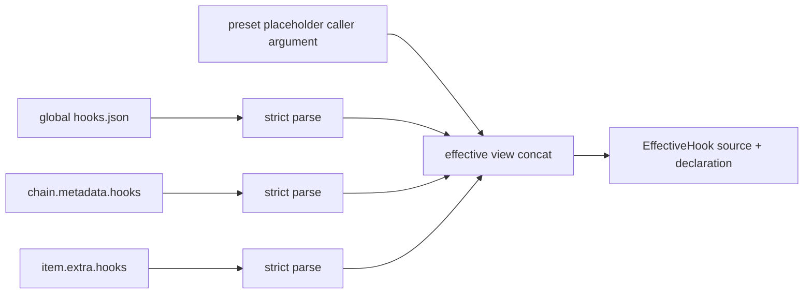
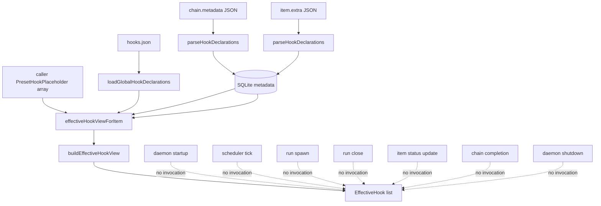

# R7-10 — Gate host identity、placeholder binding 与 capability 握手

> 基线：`main@699842eba2eefc242d19f8fa9232bc1d9d5c3bdd`。  
> 锚点：P-D5-1…4、§2.4；总账 `D-20,U-02,A-08,A-09,A-11,J-03,J-05,T-06`。前置事实：`13-r7-08-runtime-transition-commit.md`、`07-r4-runtime-tree-identity.md`、`08-r4-capability-registry.md`。本报告只调查 gate，不把 gate 与 tool registry、preset trigger 或 status admission gate 合并；不裁决、不设计、不估算。

## A. 摘要（≤1页）

仓内现存 gate 供给止于 **declaration carrier + 分层持久化 + caller 手传的 effective view**。`GateDecisionPoint` 是八个字符串组成的封闭 union；可持久化 gate declaration 携带 `script/timeoutMs/onFailure`，`tick` 另有 `minIntervalMs`。`PresetHookPlaceholder` 只有 `name/point`，没有 required/optional、host identity、script binding reference。effective view 只按 global→chain→preset→item 拼接并保留来源，不匹配名字、不解析 placeholder、不选择脚本、不定义覆盖关系，也不执行。

静态调用图显示，八个 point 都没有 production invocation。它们能与现有 daemon/scheduler 生命周期位置作词义上的邻接，但 point string 没有引用该位置的 host object：startup/shutdown/tick 没有单一 task host；pre-spawn 在 runtime identity 建立前后横跨多步；post-exit 与 chain completion 横跨多次写入；status transition 有 chain/item identity，agent 写入时还能查 stored run task identity；`container.advance` 则没有 production runtime-tree scheduler authority。故“词表存在”与“host identity 已锚定”是两个不同事实。

隔离 daemon 实验把可观察 marker 脚本放在 global startup/shutdown，把 `/bin/false` 放在 chain pre-spawn 与 item post-exit，并由 caller 手传 preset placeholder。effective view 原样返回五项、顺序为 global/global/chain/preset/item；daemon start/close 后 marker 均不存在。仓内 integration test 进一步覆盖 scheduling，明确断言 hook scripts never execute，`/bin/false` 不形成 hold。有效 declaration 因此是 inert data。

当前没有 capability handshake：不存在 `unsupported-capability`、missing-binding、script exit/timeout 的结构化错误或 pending gate decision；`onFailure` 没有状态转移消费者。malformed global file 会阻止 daemon startup，malformed chain/item hook 会在相应输入边界失败；但不存在的 script path 可被接受，因为不检查也不运行。重启能恢复 global/chain/item declaration，不能自行恢复 caller-only preset placeholder，也没有 hold/retry decision state 可恢复。

R5 总账据此保持：A-08/A-09 的 runtime identity 资产与 A-11 carrier 资产确实存在，但 J-05 没有 gate 引用接缝；D-20 仍无执行、binding、host identity、projection 与 handshake 供给；T-06 证明 carrier 不等于 gate execution；U-02 对外部 executor/capability 仍是静态未知，仓内没有 producer/consumer 证据。

## B. 证据附录

### B1. 调查边界与命令

只读代码与报告；实验使用 `/tmp/rfc547-r7-10-*` 和隔离 loop-data，scheduler disabled，不连接中央 daemon、不建 worktree、不触碰生产 hooks/DB。

关键命令：

```sh
git rev-parse HEAD
rg -n 'GateDecisionPoint|GateHookDeclaration|PresetHookPlaceholder|buildEffectiveHookView|effectiveHookViewForItem|unsupported-capability' src tests
rg -n 'run\.pre-spawn|run\.post-exit|item\.status-transition|container\.advance|chain\.complete|daemon\.startup|daemon\.shutdown|tick' src tests
bun /tmp/rfc547-r7-10-experiment.ts \
  > /tmp/rfc547-r7-10-experiment.jsonl \
  2> /tmp/rfc547-r7-10-experiment.err
```

实验退出码 `0`。产物：

- `/tmp/rfc547-r7-10-experiment.ts`
- `/tmp/rfc547-r7-10-experiment.jsonl`
- `/tmp/rfc547-r7-10-experiment.err`
- 隔离 root：`/tmp/rfc547-r7-10-22c51e1d-7cf8-4de5-88c7-c481b007410b`

### B2. declaration、placeholder 与 effective view

#### B2.1 类型事实

| 对象 | 现存字段/variant | 不存在于对象中的信息 |
|---|---|---|
| `GateDecisionPoint` | `run.pre-spawn`、`run.post-exit`、`item.status-transition`、`container.advance`、`chain.complete`、`daemon.startup`、`daemon.shutdown`、`tick` | host object、host identity、runtime node ref |
| non-tick gate | `kind:"gate"`、`point`、`script`、`timeoutMs`、`onFailure:"hold"\|"advance"` | declaration name、placeholder name、binding ref、capability id |
| tick gate | 上述字段 + `minIntervalMs` | 同上 |
| preset placeholder | `kind:"named-gate-placeholder"`、`name`、`point` | required/optional、script、timeout、failure policy、host identity、binding ref |
| effective hook | `source` + 原 declaration | resolved declaration、precedence、shadow/override、execution result |

证据：`src/hook-declarations.ts:15-58`。

#### B2.2 输入边界与序列化

- 持久化 declaration 使用严格 arktype boundary，undeclared key 拒绝；point、`onFailure`、tick interval 均为封闭输入，`script` 不能为空，timeout 必须为正：`src/hook-declarations.ts:60-81,103-131`。
- global document 是 `{version:1,hooks:[...]}`；JSON malformed 或 boundary failure 直接抛错：`src/hook-declarations.ts:82,85-101`。
- declaration 可完整序列化回 JSON；这里没有执行或 capability 字段：`src/hook-declarations.ts:147-168`。
- placeholder 没有对应 runtime parser、global document parser 或 JSON serializer；仓内唯一形式是 TS type：`src/hook-declarations.ts:48`。

#### B2.3 effective view 的真实操作

`buildEffectiveHookView` 只做四次数组 map/spread：global、chain、preset、item；没有按 name/point 建索引，没有冲突检查、匹配、覆盖、binding 或执行：`src/hook-declarations.ts:138-145`。daemon 方法读取已存 global/chain/item，preset placeholders 由调用者参数传入，然后调用该拼接函数：`src/daemon.ts:1215-1232`。

因此 effective-view order 是 **列举顺序**，不是 precedence 或 binding semantics。

### B3. 四层 carrier / binding 链

| 层 | declaration 来源 | parse | persistence / restart | 进入 effective view | placeholder→script binding |
|---|---|---|---|---|---|
| global | `<loop-data>/hooks.json` | daemon startup strict parse | 文件存在则 restart 重载 | daemon field | 无 |
| chain | `chain.metadata.hooks` | request/storage parse | metadata JSON/SQLite round-trip | 由 chain id 读取 | 无 |
| preset | caller 提供 `PresetHookPlaceholder[]` | 无 runtime boundary | 不持久；restart 后 caller 必须再传 | 直接使用方法参数 | 无 |
| item | `item.extra.hooks` | request/storage parse | extra JSON/SQLite round-trip | 由 item row id 读取 | 无 |

证据：

- global startup load：`src/daemon.ts:1235-1244`。
- chain/item typed slots：`src/runtime-data.ts:107-138,159-176`。
- chain/item JSON 输出：`src/runtime-data.ts:349-352,417-435`。
- chain/item parse：`src/runtime-data.ts:528-554,557-570`。
- item status projection 主动删除 hooks：`src/runtime-data.ts:438-443`。
- effective view 组装：`src/daemon.ts:1215-1232`。

链路在 carrier 处终止：



没有从 `X` 到 resolver、executor、decision state 或 lifecycle point 的 production edge。

### B4. decision point → lifecycle site → host identity

下表中的“邻近位置”仅表示现存生命周期代码与词义最接近；不是 hook invocation。

| vocabulary point | 最接近的 production lifecycle site | 当时可见 host / identity | runtime identity 是否已持久 | hook invoked |
|---|---|---|---|---|
| `daemon.startup` | daemon `start()`，先读取 global hooks，后开 socket/store/recovery | daemon paths/config；尚无单一 chain/item/run host | 对既存数据的恢复稍后发生；新 task identity 不适用 | 否 |
| `daemon.shutdown` | daemon close/shutdown path | daemon、可能有多 chain/run | 既存记录可能在库中，但 point 不引用任何一个 | 否 |
| `tick` | daemon tick → scheduler tick | daemon/scheduler、active chains 集合 | 依具体 chain/run 而异；无单一 host ref | 否 |
| `run.pre-spawn` | scheduler spawn path | chain/item/phase；路径先准备 worktree/resource，随后写 definition/root/leaf/closure/run，再 spawn child | 路径前段无 runtime leaf/run；`recordRunWithClosureResources` 后才有 | 否 |
| `run.post-exit` | child close handler | run、item、chain、output/status/session/closure | run identity 已有；后续完成/清理跨多个写入 | 否 |
| `item.status-transition` | daemon status admission → `store.updateItem` | chain/item；agent 写入还可从 stored run 取得 task identity | agent path 可已有 run identity；operator path不保证 | 否 |
| `container.advance` | 无 production runtime-tree scheduler authority；只有旧 phase/item scheduler | 无已定义 container host | 无 container cursor/transition authority可锚定 | 否 |
| `chain.complete` | scheduler completion checks、trigger、closure consume、chain update/event | chain、items/runs/closure集合 | 相关 identity 可存在，但没有 point→top-level join ref | 否 |

代码位置：

- startup/global load：`src/daemon.ts:1235-1260`；shutdown：`src/daemon.ts:1512-1588`。
- tick 调度：`src/daemon.ts:3622-3678`、`src/scheduler.ts:492-580`。
- spawn path：`src/scheduler.ts:1565-1775`；其中 runtime identity 的创建事务在 `recordRunWithClosureResources` 调用处。
- close path：`src/scheduler.ts:1992-2165`。
- item status admission/update：`src/daemon.ts:3104-3210`。
- chain completion：`src/scheduler.ts:2660-2800`。

R7-08 已通过读写与实验建立：chain/item create 不实例化 runtime tree；leaf/closure/run identity 首次在 run record transaction 出现；scheduler authority 仍是 phase/item status/runs；没有 typed transition commit（`13-r7-08-runtime-transition-commit.md`）。所以同一个 `run.pre-spawn` 字面量不能证明它是在 identity 创建前还是后；现存代码也没有调用点来消除这个歧义。

另有三个同名邻接物，但均不是本 gate：

1. chain-complete preset trigger 是独立 trigger mechanism，不消费 `GateHookDeclaration`。
2. item status admission gate 是 daemon command authorization/admission，不执行 declared script gate。
3. runtime tree identity 在 run record 后可查询，不代表 hook declaration 引用了该 identity。

### B5. capability、错误与恢复矩阵

| 场景 | 当前入口结果 | 结构化 gate 错误 | 状态/恢复事实 |
|---|---|---|---|
| malformed global JSON/document/hook | daemon startup 抛错 | 一般 parse error；非 `unsupported-capability` | daemon 未完成 startup |
| malformed chain hook | request/storage parse 抛错 | parse error | malformed declaration不入库 |
| malformed item hook | request/storage parse 抛错 | parse error | malformed declaration不入库 |
| valid declaration + nonexistent script | 接受、持久化、可列入 effective view | 无 | restart 后 declaration 仍在；仍不执行 |
| preset placeholder 缺同名 script | placeholder 可被 caller 列入 view | 无 missing-binding error | 无 binding state；restart 不恢复 placeholder |
| duplicate placeholder/declaration name/point | 没有统一 resolver；declaration 本身无 name | 无 ambiguity error | view 保留原数组项 |
| runtime 不支持 gate capability | declaration 静默保持 inert | 无 `unsupported-capability` | scheduler照常运行 |
| script exit nonzero | 不会发生执行 | 无 script-failed error | `onFailure` 不产生 hold/advance |
| script timeout | 不会发生执行 | 无 timeout error | 无 retry/pending decision |
| daemon restart during hypothetical hold | 仓内无该状态 | 无 | global/chain/item carrier恢复；pending decision不存在 |

仓库搜索没有 `unsupported-capability` 的 production error，也没有 missing binding、hook exit/timeout、hold/advance transition event。`onFailure` 只在 parse/store/serialize 路径出现：`src/hook-declarations.ts:36-45,66-80,118-129,155-166`。

### B6. 隔离实验

#### B6.1 输入

- global：`daemon.startup` 与 `daemon.shutdown` gate，script 若执行会 append marker。
- chain：`run.pre-spawn` gate，script `/bin/false`。
- preset：caller 手传 `{kind:"named-gate-placeholder",name:"approval",point:"item.status-transition"}`。
- item：`run.post-exit` gate，script `/bin/false`。
- scheduler disabled；isolated loop-data；无 worktree、无中央 daemon。

#### B6.2 观察

effective view 精确为：

1. global startup gate
2. global shutdown gate
3. chain pre-spawn gate
4. preset placeholder
5. item post-exit gate

marker 观察：

| 时点 | marker exists |
|---|---|
| daemon startup 后 | `false` |
| daemon shutdown 后 | `false` |

这同时证实：global/chain/item 真实落入 carrier，caller placeholder 能进入 view，拼接顺序固定；startup/shutdown point 没有执行脚本。它不声称 scheduler path 已被本实验触发；该点由下一节既有 integration test 覆盖。

### B7. tests：同错与盲区

#### B7.1 已有正向/同错证据

| 测试 | 实际证明 |
|---|---|
| `tests/unit/daemon/hook-declarations.test.ts` | declaration strict parse、round-trip、effective-view concat、invalid point/field/missing field拒绝 |
| `tests/unit/daemon/hook-declarations.exhaustiveness.ts` | ADT exhaustiveness；不证明 runtime invocation |
| `tests/integration/daemon/hooks.integration.ts:5-63` | global/chain/item persist/reload；实际 scheduling 中 scripts “never execute”；`/bin/false` 不 hold；observer marker不产生 |
| `tests/integration/daemon/hooks.integration.ts:65-165` | effective item hooks 内部可取，但 status/CLI projection隐藏 |

这里的同错形状是：unit tests 对 carrier 全绿、integration scheduling 也按“never execute”断言通过，因此测试成功与 capability handshake/执行链缺失可以同时成立。A-11 是真实资产，T-06 也同样成立。

#### B7.2 没有覆盖的行为

- lifecycle decision point 的 production invocation；
- point variant 携带/校验 host identity；
- preset TOML loader、canonical/compile projection、required/optional；
- placeholder name 到 script declaration 的 resolution；
- missing/duplicate binding ambiguity；
- unsupported capability 的调度前拒绝；
- script exit、timeout、retry、hold、advance；
- pending decision 的 restart/recovery；
- 外部 executor 对相同 declaration/host identity 的消费。

### B8. 调用图与接缝



J-03：canonical/compiler 侧没有 preset gate source，而 runtime hook carrier 侧只有 caller placeholder；二者没有 producer→consumer edge。  
J-05：runtime tree/run identity 可以存在，但 `GateDecisionPoint`/placeholder/declaration 都没有 identity ref，scheduler 也没有 typed gate transition commit。  
U-02：仓内无 executor；已读外部 owner 的既有调查没有同 declaration identity 的消费证据，未访问/未 checkout 的外树不能据此判不存在，故保持未知。

### B9. 事实支持的形状与后果（非方案）

1. **词表形状**：仓内 vocabulary 有八点；稳定 D5 锚点列出的 `container.join` 与现存 `container.advance` 不同。两者不能因语义相近而视为同一 variant。
2. **宿主形状**：startup/shutdown/tick 是 daemon或集合级；run points 是 run/item/phase邻近；container/chain 点需要树或join identity。单一无 payload 的 string union 不携带这些不同宿主。
3. **时序形状**：首次 run identity 创建位于 spawn path 中段；因此“pre-spawn”若无实际调用位置，不能导出 identity 可用性。
4. **提交形状**：post-exit、status transition、chain completion 均横跨多次状态写入；当前没有 gate decision 与某次 typed transition commit 的原子关联。
5. **binding 形状**：三层 script declaration与一层 name-only placeholder被并列列举；不存在从 name 到 script 的函数，也不存在 precedence/ambiguity结果。
6. **capability 形状**：有效且无法执行的 declaration 不会被拒绝；所以 declaration presence 既不证明 capability，也不改变 scheduling。
7. **failure 形状**：parse failure 是现存输入失败；missing binding/script failure/timeout 是不可达状态，因为 resolver/executor 不存在。
8. **recovery 形状**：carrier 可恢复不等于 decision 可恢复；仓内没有 pending hold、attempt、decision outcome 或 retry cursor。
9. **projection 形状**：item status 主动隐藏 hooks；placeholder又不持久。CLI/status 因而不是 gate全集或 resolved binding 的读面。
10. **边界形状**：gate 与 tool registry、chain-complete trigger、status admission分别有不同 identity与消费路径；现存事实不支持互相替代。

### B10. 对 P-D5 与总账的事实映射

| 锚点 | 本轮事实 |
|---|---|
| P-D5-1 typed preset declaration/重名/位置校验 | persistent hook declaration有typed boundary；preset gate declaration/required/optional/name uniqueness没有 loader/boundary |
| P-D5-2 compiled projection gate全集 | 无 canonical/compile projection；effective view 是 runtime caller组装且status隐藏hooks |
| P-D5-3 capability handshake | 无结构化 unsupported、无实例化/调度拒绝；valid gates inert |
| P-D5-4 point variant + host identity | string vocabulary存在；host identity payload与point→host校验不存在，且 `container.advance` 与锚点 `container.join` 不同 |
| A-08/A-09 | runtime tree/identity资产存在，但创建时点晚于chain/item create，且没有 gate ref |
| A-11 | hook carrier、strict parse、layer persistence、effective view是真实资产 |
| D-20 | placeholder binding、executor、host identity、projection、handshake仍无供给 |
| J-03/J-05 | compiler→gate source与runtime identity→gate reference两条接缝均缺失 |
| T-06 | tests明确把“persist/reload but never execute”作为成功行为 |
| U-02 | 外部 capability/executor保持未知；仓内没有可追踪到外部的接口或identity |

### B11. 证据索引

| ID | 证据 |
|---|---|
| E-01 | `src/hook-declarations.ts:15-58` — point/declaration/placeholder/layers ADT |
| E-02 | `src/hook-declarations.ts:60-131` — strict parse 与错误边界 |
| E-03 | `src/hook-declarations.ts:138-145` — 四层纯拼接 |
| E-04 | `src/hook-declarations.ts:147-168` — declaration JSON serialization |
| E-05 | `src/daemon.ts:1215-1232` — caller placeholder + stored layers 的 effective view |
| E-06 | `src/daemon.ts:1235-1260` — global load 与 startup顺序 |
| E-07 | `src/runtime-data.ts:107-138,159-176,349-352,417-443,528-570` — chain/item storage 与 status隐藏 |
| E-08 | `src/daemon.ts:3622-3678`; `src/scheduler.ts:492-580` — tick邻近路径 |
| E-09 | `src/scheduler.ts:1565-1775` — spawn邻近路径 |
| E-10 | `src/scheduler.ts:1992-2165` — post-exit邻近路径 |
| E-11 | `src/daemon.ts:3104-3210` — status transition邻近路径 |
| E-12 | `src/scheduler.ts:2660-2800` — chain completion邻近路径 |
| E-13 | `tests/integration/daemon/hooks.integration.ts:5-165` — persistence、never execute、status omission |
| E-14 | `tests/unit/daemon/hook-declarations.test.ts`; `hook-declarations.exhaustiveness.ts` — carrier tests |
| E-15 | `/tmp/rfc547-r7-10-experiment.jsonl`、`.err` — isolated daemon observation |
| E-16 | `13-r7-08-runtime-transition-commit.md` — identity创建时点与无typed transition commit |
| E-17 | `07-r4-runtime-tree-identity.md`; `08-r4-capability-registry.md` — runtime identity与D5前置事实 |

## 结论

现存实现提供严格可持久化的 hook declaration carrier 和手传 placeholder 的四层列举视图；它没有把 point 绑定到稳定 host identity，没有 placeholder→script resolution，没有 lifecycle invocation、capability handshake、failure decision 或 recovery state。八个 decision-point 字符串目前都是 vocabulary，不是 runtime hook point。carrier 与 runtime identity各自存在，但二者之间没有消费接缝；外部 executor/capability仍无仓内证据，保持 U-02 未知。
