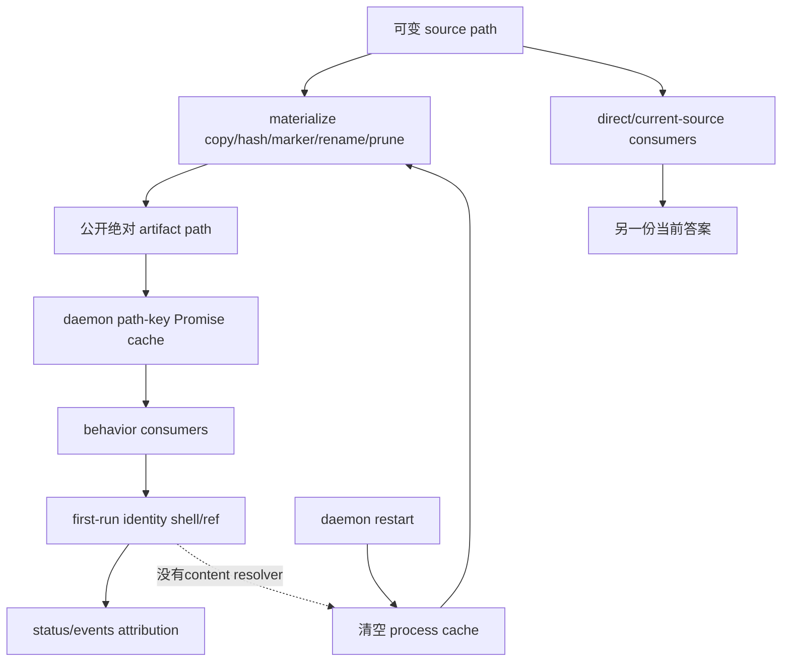

# RFC #547 R8/G2 — Definition 版本生命周期决策档案

> 固定基线：`main@699842eba2eefc242d19f8fa9232bc1d9d5c3bdd`。  
> 只读输入：稳定 D1/D10；`13-r7-02-preset-cache-coherence.md`、`13-r7-03-materialize-transaction.md`、`13-r7-11-execution-definition-pin.md`。  
> 本档案只整理操作员裁决所需的问题、事实支持形态、确定后果、触点与未知；不推荐、不代裁、不转写实现、不估算规模。

## A. 摘要（≤1页）

G2 的来源不是一个“cache bug”，而是三个彼此独立、当前又串联放大的生命周期问题：

1. **file transaction**：materialize 以“复制完成”为发布点，在 compile verdict 前写 marker、rename并删除同basename旧版本；非法或缺文件的 H2 可以成为唯一“完成”artifact，不同hash并发发布还能互相prune。
2. **process cache**：daemon 以绝对目录路径缓存成功 Promise 到进程结束；失败则删 key重试。它让同进程旧实例偶然继续使用 H1，却让 direct/current-source consumer看见H2；restart后cache消失，旧实例又重新读取H2。
3. **instance resolver**：chain/item创建不编译、不pin完整定义。首次run才懒建hash/ref/leaf/closure identity shell；所有行为consumer仍从path/cache读定义，persisted ref只作attribution，不能解析prompt、fragment、词表、rights、runner/model或status。

三者形成的复杂因果是：文件层可能先删除H1并公开不可消费H2；进程cache可暂时遮蔽这个变化；restart清空遮蔽后，旧实例从当前path重绑H2；SQLite里虽保留H1 identity，却没有内容或resolver可恢复H1。反方向也成立：即使文件发布变得原子，已resolved成功Promise也不会自动失效；即使cache能识别新source，旧实例仍无pin；即使实例ref可解析内容，文件层的并发、损坏与retention仍有独立正确性。因此三个裁决点不能互相替代。

稳定 D1/D10 已固定的口径不是待选项：compile canonical model与公共projection同源；同源同schemaVersion投影具确定性；运行实例只保护创建前可完整计算的定义；chain/item在创建成功前持tagged ref；daemon/scheduler/status/events/hook/GUI及resume重渲染沿ref同源；源变化只影响新实例；旧定义缺失/损坏显式hold/报错且不回退当前文件；演进只经新实例或另行裁定的migration；runtime join binding演化不冒充definition切换。

仍需操作员裁决的内容分两层：

- **口径问题**：受保护字段闭集、chain与preset实例边界、创建成功的pin时点、当前源读面与实例读面的对外区分、历史实例migration的产品语义。
- **工程分叉**：文件publish verdict/retention/concurrency/integrity形态，process cache的身份/寿命/finding语义，以及definition内容载体、创建事务、resolver失败外显和consumer迁移方式。

R7提供的证明缺口不是决定：未新跑完整create→spawn→edit→resume→kill/restart，只限制证据强度；不能据此选择artifact、cache或migration形态。本档案列出 18 个逐项裁决问题，均保留事实支持的分叉，不给答案。

## B. 完整决策档案

### B1. 问题来源与稳定要求

#### B1.1 D1 固定输入

D1 已固定：

- source经parse/resolve/typecheck形成canonical `CompiledTaskModel`；
- 公共JSON projection由同一canonical model唯一投影，携`schemaVersion`；
- 同源、同schemaVersion的投影具有字节确定性，因为它参与定义内容寻址；
- compile回答“该preset现在说什么”，不是“运行中实例绑定哪份定义”。

R7-02/03/11没有推翻这些要求；它们证明当前生产生命周期没有把canonical compile结果稳定地连接到运行实例。

#### B1.2 D10 固定输入

| 稳定条款 | 固定要求 | R7当前事实 |
|---|---|---|
| P-D10-1 | 只保护实例创建前可完整计算的字段闭集；排除result/evaluation/cursor/decision | R7-11已列pre-run字段全集，但尚未裁定preset/chain闭集 |
| P-D10-2 | 创建成功前完成compile/normalize/validate/content-address；chain/item持tagged ref | ref/FK存在但首次run才懒写；无production chain ref；创建不pin |
| P-D10-3 | 全consumer及resume effectivePrompt沿实例ref读同定义 | 所有行为consumer读path/cache；ref只作attribution |
| P-D10-4 | 源变化只影响新实例；旧定义缺失/损坏显式hold/error，不回退current source | restart后旧实例隐式读H2；missing/corrupt走普通load failure/current rebuild |
| P-D10-5 | 只经新实例或另行裁定migration演进；无MVCC/隐式rebind/尽量兼容 | 没有显式rebind API，但restart/migration会隐式rebind |
| P-D10-6 | runtime join append-only binding version不是definition版本切换 | join binding局部资产存在，definition resolver仍缺失 |

这些固定要求不进入本档案的“是否要做”问题；只剩满足要求时的口径闭集和工程分叉待裁。

### B2. 当前事实时间线

#### B2.1 H1→H2 正常编辑时间线

| 时点 | file transaction | process cache | instance resolver | 可见结果 |
|---|---|---|---|---|
| t0 source=H1 | H1可materialize | cache尚冷 | chain/item create只存locator | 无definition content/ref pin |
| t1 first spawn | H1目录可能已发布 | path key cold-load H1并保留成功Promise | 首run才写H1 hash/ref/root/leaf/closure/run | daemon行为H1；ref只归因 |
| t2 source改H2 | H2 publish会eager prune同basename H1 | daemon hit仍H1；direct/current读面见H2 | node/ref仍H1但不控制行为resolver | 同时出现H1/H2两答案 |
| t3 same-daemon resume | 未必重新materialize | success cache继续H1 | effectivePrompt按cached H1重渲染 | 表面“旧实例稳定”来自process cache |
| t4 daemon restart | 磁盘可能只剩H2 | 新Map为空并读取current H2 | recovery看H1 identity，调度behavior读H2 | 旧实例无提示重绑H2 |
| t5 new instance | current H2 | H2 cache | 首run写H2 identity | 新实例也用H2 |

#### B2.2 发布失败/损坏时间线

| 场景 | file结果 | cache遮蔽 | restart/resolve结果 |
|---|---|---|---|
| H2 syntax/structure invalid | H2可带marker公开并删除H1，随后compile rejected | 已暖H1 cache仍可继续返回H1 | restart后重新load H2并失败；H1 ref无法恢复内容 |
| source缺`preset.toml` | 不完整目录可被标记完成并删除旧版 | 已暖对象可能暂时可用 | 新load普通ENOENT/compile failure |
| marked target被破坏 | marker命中，不复核文件 | 已暖cache可能不触盘 | restart/new load持续命中损坏artifact |
| 不同hash并发publish | 发布者可互prune，成功返回路径最终不存在 | 已resolved对象可能继续活在内存 | 新load按当前source重新materialize或失败 |

#### B2.3 复杂因果分解

根因不是单点：

- publish verdict早于compile verdict；
- marker只证明copy完成；
- prune不看compile成功或active ref；
- 不同hash无互斥；
- process cache以path而非source/definition/instance identity为key；
- success与failure寿命不对称；
- source edit/materialize/create/resume不是cache失效事件；
- create不pin，first-run才写identity shell；
- definition row无content/path/manifest；
- behavior consumer不反向查询ref；
- materialized目录与SQLite definition row没有连接。

### B3. 三个独立裁决点

| 裁决点 | 自己必须回答 | 不能由哪一层代答 | 现存触点 |
|---|---|---|---|
| File transaction | 何时算可公开、并发如何串行/隔离、旧版何时可退、marker如何证明完整性、损坏如何识别 | cache失效或definition pin不能使一个已公开损坏目录变合法 | source collection、hash、staging、marker、rename、family prune、materialized绝对路径 |
| Process cache | cache保护的是source load还是instance definition、key/寿命/失败/并发/finding语义、restart如何重新取得对象 | 原子file publish不自动让已settled Promise失效；instance pin也不自动决定compile CLI cache | daemon Map、cold promise sharing、failure deletion、all daemon consumers、finding callbacks |
| Instance resolver | 哪些字段在何时pin、ref指向什么内容、所有consumer如何沿ref、missing/corrupt如何hold、历史实例如何处理 | cache稳定不能证明pin；file retention不能证明consumer用ref | chain/item create、definition rows、task nodes、spawn/resume/status/events/hook/GUI、migration/recovery |

三个裁决点可以分别选择形态；组合后仍必须检查跨点接缝，但不能用一个点的选择删除另外两个问题。

### B4. File transaction：事实支持形态全集

下表沿用R7-03已列出的事实支持形态；不排序、不推荐。部分形态是正交轴，可以组合，不表示互斥方案包。

| ID | 形态 | 确定后果 | 触点 | 仍未知 |
|---|---|---|---|---|
| F1 | 当前copy-complete发布 | reject可替代最后合法版本；不同hash可互删；marker命中可持续损坏 | marker、rename、eager family prune | 无新增未知；现状已观察 |
| F2 | source先完整compile、后materialize | invalid source不产生新artifact；source与copy间仍可能变化 | direct compile、source collection、materialize入口 | compile到copy之间snapshot一致性 |
| F3 | staging内materialize并以staging内容compile，成功后rename | compile verdict先于公开；reject只清staging | staging、token substitution、compile root、rename | `{{PRESET_ROOT}}`最终路径与staging读取一致性 |
| F4 | 新target发布但延迟family prune | publish与retire分开，多版本暂存；磁盘上限不再由单次调用保证 | target publish、prune时点 | reject是否在publish前已判定 |
| F5 | immutable多版本 + consumer reachability cleanup | active ref可保留旧版；需要可查询的reachability账 | definition ref、artifact identity、cleanup | owner、lease/ref完整性、orphan policy |
| F6 | generation/pointer式发布 | consumer经稳定selector进入generation，旧版可独立retire | selector、consumer open、generation cleanup | 当前绝对path consumer迁移边界 |
| F7 | basename族串行化 | 消除同族并发互prune；不自动解决reject-before-publish/prune | materialize并发入口、family ownership | 锁生命周期、crash/reentry语义 |
| F8 | marker携带manifest/verdict并命中复核 | marker可识别文件/校验状态；损坏可被发现 | marker schema、hit validation | 发现后重建/hold/error语义 |

固定约束：无论选择何种形态，file层的“发布成功”与process cache的“已有entry是否继续有效”是两个事件；file层retention又必须与instance ref的真实可达性来源对齐，不能假设ref已可解析。

### B5. Process cache：事实支持形态与确定后果

R7-02没有选择cache方案，只给出必须覆盖的时间轴。下表按现存事实形成可裁工程分叉，不作优先级。

| ID | 形态/口径 | 确定后果 | 触点 | 仍未知 |
|---|---|---|---|---|
| C1 | 保持path-only、success到进程结束、failure删除 | 同进程共享path偶然冻结H1；restart旧实例重绑；hit不重发findings | daemon Map、all loadedPreset consumers | 与D10不相容的缺口保持 |
| C2 | cache current-source compile结果，以完整source identity判命中 | 同一source可共享计算；source变更产生新current结果；仍不等于旧实例pin | source hash/stat、materialize结果、Map key | alias/realpath、hash计算时点、finding replay |
| C3 | cache immutable definition identity对应内容 | cache entry语义与instance ref可对齐；依赖resolver先有真实content | definition artifact/ref、Map key、consumer loader | definition artifact载体与GC |
| C4 | 仅在单次请求/并发cold窗口共享Promise，不跨成功请求保留 | 保留并发去重，后续调用重新决定source/definition | loader invocation、promise lifecycle | I/O/compile代价不是本档案事实 |
| C5 | 长寿命entry但显式失效 | edit/materialize等事件可切换current-source对象；旧实例是否切换仍由resolver决定 | invalidation producer、Map、consumer timing | 全部失效事件、并发in-flight处理 |
| C6 | current-source cache与instance-definition cache分离 | “现在的source”与“运行实例”各自有明确identity；两个cache不能互相冒充 | compile CLI/ingress、daemon instance consumers | 两类read surface的命名与observability |

任一cache形态都必须逐项说明：

- 同进程success；
- 同进程failure与修复；
- concurrent cold request；
- restart后的旧实例；
- restart后的新实例；
- all daemon behavior consumers；
- daemon外direct/current-source consumer；
- model与findings的同一生命周期；
- path alias与工作目录；
- cache identity与definition identity的关系。

这些是裁决覆盖口径，不是额外机制要求。

### B6. Instance resolver：事实支持形态全集

| ID | 形态 | 可保护内容/确定后果 | 触点 | 仍未知 |
|---|---|---|---|---|
| R1 | 仅hash/ref identity shell（当前） | 只能attribution，不能重渲染或恢复；path/cache继续成为behavior resolver | execution_definitions四列、task node/run extra | 现状缺口已知 |
| R2 | 完整compiled preset内容 | 可覆盖prompt/fragments/status/exits/variables/rights/triggers/schema/literals/timeout/order等preset语义 | compile product、item create、spawn/resume/status | chain baseBranch/tree/join不自动包含 |
| R3 | preset definition + 独立chain definition | tagged两类分别保护item preset与chain创建前语义 | ChainDefinitionRef、PresetDefinitionRef、chain/item create | chain字段闭集、二者引用关系 |
| R4 | 规范projection + 独立content payload | projection负责公共规范字段，payload补prompt/fragment bytes与私有执行输入 | projection boundary、artifact content、resolver | 两者identity/版本一致性 |
| R5 | materialized source tree作为ref可解析内容 | 保留完整源bytes，resolver可重compile同一源；compile确定性和artifact retention成为关键 | materialized tree、sourceHash、compile loader | schema/compiler版本与重编译兼容边界 |
| R6 | canonical compiled artifact作为ref内容 | resolver直接读取创建时canonical执行模型；不需从current source重解释 | compiled serialization boundary、artifact store | 可序列化闭集、schema演进 |

R2-R6是事实支持的内容边界形态，不代表介质决定。无论内容形态如何，D10固定要求还需要：

- 创建成功前compile/validate/content-address并写tagged ref；
- create事务失败时实例不成功；
- spawn、resume、rights、status、events、hook、GUI沿ref读取；
- missing/corrupt按identity显式hold/error；
- current source只服务compile CLI、新实例与ingress预校验；
- runtime result/cursor/evaluation/decision不进入definition；
- runtime join binding追加不更换definition。

### B7. 跨裁决点组合的确定后果

这不是组合推荐表，只列如果一层保持某形态，其他层会留下什么事实后果。

| 组合事实 | 确定后果 |
|---|---|
| file publish修正，cache仍C1，resolver仍R1 | 新artifact合法性改善；已暖daemon仍path冻结，restart旧实例仍重绑current |
| resolver可pin内容，file仍F1 | 已pin内容若不依赖被prune目录可恢复；若ref指向目录则旧实例仍可能失去artifact |
| cache按definition identity，resolver仍R1 | 没有content可装入cache；identity一致仍不能恢复behavior |
| immutable artifact保留，consumer仍读path/current | 磁盘上H1存在不等于旧实例会选择H1 |
| explicit invalidation切到H2，旧实例没有ref resolver | 同进程旧实例会更早重绑H2，不能满足D10 |
| create写ref但resume/status仍读current | 部分consumer同源，系统仍保留behavior分叉 |
| definition内容完整但file marker不复核 | resolver若依赖marked目录，损坏仍需独立识别；内容row与目录若分离则两者GC/一致性仍需定义 |
| file retention按active ref，ref只在first run产生 | create到first run之间没有可达性账，不能证明artifact可安全retire |

### B8. 口径问题与工程分叉

#### B8.1 口径问题

口径问题决定“系统承诺什么”，不能由局部实现便利反推：

1. preset definition的创建前字段闭集；
2. chain definition的创建前字段闭集；
3. chain/item各自何时算“实例创建成功”并完成pin；
4. current-source read surface与instance read surface的对外区分；
5. mixed chain/preset内容如何各持tagged ref但不混淆owner；
6. 历史实例无可恢复内容时的migration产品语义。

#### B8.2 工程分叉

工程分叉决定“在固定承诺下由什么边界实现”：

- compile-before-publish还是staging compile；
- publish/retire是否分离；
- retention按family、generation或reachability；
- materialize并发互斥与marker integrity；
- cache按path/source/definition identity及其寿命；
- finding在cache hit/invalidation/restart的传播；
- definition保存source、canonical、projection+payload或其他已证实闭集；
- ref写入与create的事务接缝；
- resolver missing/corrupt的状态与错误投影；
- 旧数据migration执行面。

“证明缺口”单列，不属于任何一类决定：

- R7-11未新跑完整create→spawn→edit→resume→kill/restart；
- source在hash/copy之间变化的受控FS实验未做；
- 非macOS文件系统rename语义未建立；
- 外部GUI/hook/hapi-remote-session consumer仍未知；
- compiler/schema跨版本重读旧artifact的行为未建立。

这些缺口限制验证强度或需要后续证据，但不自动选择任何口径或工程分叉。

### B9. 操作员逐项裁决问题

以下 18 问均要求逐项留下明确答案；本档案不提供默认答案。

#### 口径裁决

1. **Preset定义闭集**：R7-11 B2列出的pre-run preset字段中，哪些构成 `PresetDefinitionRef` 所指向的不可变闭集；哪些明确不属于定义？
2. **Chain定义闭集**：chain create前已知的tree/join/baseBranch、bindings、runner/model与调度metadata中，哪些构成 `ChainDefinitionRef`；哪些保持运行配置或business data？
3. **Pin完成时点**：chain与item分别在哪个对外“创建成功”判定点之前必须完成compile、validation、content-address与ref持久化？
4. **读面命名**：哪些命令/API明确回答“当前source”，哪些明确回答“运行实例”；两类结果如何在输出中避免被当作同一版本？
5. **两类ref关系**：chain definition与item preset definition在mixed-preset chain中如何表达所有权与引用关系，哪些consumer读哪一种？
6. **历史实例口径**：没有可恢复definition内容的存量chain/item，是进入显式migration、保持不可运行并报identity，还是采用另一条经操作员裁定的历史语义？

#### File transaction 裁决

7. **Publish verdict**：materialized artifact以哪个已完成判定作为“公开可消费”，该判定是否包含parse/type/DAG/prompt/fragment全部compile verdict？
8. **Snapshot一致性**：hash、copy、token substitution与compile消费的是哪一个不可变bytes snapshot，如何定义source并发修改时的结果？
9. **Publish与retire**：新版本公开与旧版本退役是否同一事件；若分离，退役依据是basename family、generation还是instance reachability？
10. **并发所有权**：同basename不同hash与同hash发布者的串行/合并/冲突语义分别是什么？
11. **Artifact完整性**：marker证明copy、manifest还是compile verdict；命中后复核哪些内容；损坏被发现时是重建、hold还是按identity报错？

#### Process cache 裁决

12. **Cache职责与identity**：daemon cache缓存current-source compile、immutable definition content，还是两类分离对象；key分别是什么？
13. **Cache寿命**：success、failure、并发cold request、显式source变化与restart分别如何保留、合并、删除或重建entry？
14. **Findings一致性**：model命中、failure重试、invalidation与restart时，findings按compile identity、source identity还是instance identity归属和重放？

#### Instance resolver 裁决

15. **Definition内容形态**：ref解析的是完整canonical compiled内容、完整source tree、projection+payload，还是其他能覆盖闭集且不重读current source的内容？
16. **Create事务接缝**：definition publish、ref写入与chain/item row创建之间，哪些失败必须使create整体不成功，哪些artifact可作为orphan后清理？
17. **全consumer迁移边界**：scheduler spawn/resume、rights/status mutation、status/events、hook payload与GUI分别通过哪个统一resolver取得同一ref内容？
18. **Missing/corrupt外显**：旧实例definition缺失、损坏、schema不可读时，hold/error状态、identity、可观测面与恢复入口分别是什么，且如何证明不会回退current source？

### B10. 每问所需事实与未决证据

| 问题 | 已有足够事实 | 不应被误当作决定的缺口 |
|---|---|---|
| 1-2 | R7-11 pre-run字段全集及preset/chain边界 | 外部GUI/hook未来字段未知 |
| 3 | create当前不pin、first run才写ref | 未跑完整runner timeline不改变create事实 |
| 4-5 | direct/current与daemon/instance消费者矩阵 | 外部consumer未实现不决定命名 |
| 6 | current migration/restart隐式rebind事实 | 存量分布/业务处置需另有操作员口径 |
| 7-11 | R7-03副作用、异常、并发、marker实验 | FS fault injection只补证明，不选事务形态 |
| 12-14 | R7-02 key/寿命/consumer/finding时序 | alias实验未跑不替代identity裁决 |
| 15-18 | R7-11内容缺口、ref事务、consumer/resolver、missing/corrupt矩阵 | 完整E2E未跑不决定artifact或错误形态 |

### B11. 决策记录模板

每一问的正式裁决记录应分别填写以下字段，避免把“选择”与“验证计划”混在一起：

| 字段 | 内容边界 |
|---|---|
| 问题编号 | B9 的唯一编号 |
| 固定稳定条款 | D1/P-D10对应条款 |
| 裁决句 | 对该问题的单一明确答案 |
| 明确排除 | 未被选择的语义，不写实现优劣辩护 |
| 受影响触点 | 仅列B4-B6已有消费者/边界 |
| 保留未知 | 该决定未解决的外部owner或证明缺口 |
| 后续验证 | 用于证明裁决落地；不得反过来生成需求 |

本模板不要求在本档案中填答案。

### B12. 输入报告追溯

| 输入 | 本档案消费内容 |
|---|---|
| 稳定 D1 | canonical compile、唯一projection、determinism、current-source问题边界 |
| 稳定 D10 | pre-run闭集、tagged refs、全consumer同源、source只影响新实例、missing hold/error、无隐式rebind/MVCC、join边界 |
| R7-02 | path-only Promise cache、success/failure不对称、H1/H2、consumer/finding/restart矩阵、十项时间约束 |
| R7-03 | materialize副作用顺序、异常/并发/marker损坏、八类file transaction形态 |
| R7-11 | pre-run字段全集、definition rows/ref事务、全consumer resolver、H1/H2 timeline、missing/corrupt/GC、六类内容边界形态 |

## 尾结论

G2 必须把 definition 生命周期拆成 file transaction、process cache、instance resolver 三个独立裁决点。当前链路在file层先公开并prune、在process层以path success Promise偶然冻结、在instance层直到first run才写不可解析的identity shell；于是同进程H1、direct H2与restart旧实例H2可以同时成立，文件损坏和旧版丢失又会在cache消失后暴露。稳定D1/D10已经固定canonical/current-source与immutable-instance的分界、tagged ref、全consumer同源、missing hold/error和禁止隐式rebind；待裁的是字段/实例口径及各层工程分叉。本档案列出18个操作员问题和file/cache/resolver的全部事实支持形态，不给答案；未跑的完整runtime时间线、FS fault injection与未知外部consumer保持为证明缺口，不作为选择依据。
