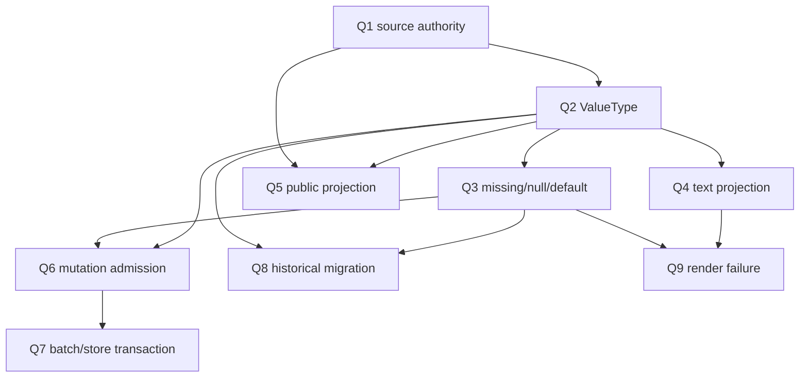

# R8/G3 · Binding 类型权威与实例 admission 决策档案

> 固定基线：`main@699842eba2eefc242d19f8fa9232bc1d9d5c3bdd`  
> 唯一事实输入：稳定设计 D2/D6、`13-r7-05-binding-type-authority.md`、`13-r7-06-binding-admission.md`。  
> 纪律：本文不查源码、不运行实验、不推荐、不裁决、不设计实现、不估规模。文中“形态”是事实支持的决策空间，不是完备方案集。

## A. 主 agent 摘要

### A1. 为什么需要操作员裁决

稳定设计已经决定：source类型有唯一权威；结构类型可由独立consumer公开解释；公共产物真实携带type/required/default；缺值不准静默变`""`；失败必须在最早可决定阶段发生；render-only错误要点名binding key与source。尚未决定的是这些保证的**具体类型语言、文本投影、实例准入事务位置和存量处置**。

两份R7报告证明必须把问题分成两组，不能压成“加校验”：

1. **类型语言/权威组**：当前item四词、phase source、recursive JsonValue存储与string-only renderer互不相接；chain无schema；runtime string-only；public projection固定谎称string；agent-owned `exit.*`数据面不存在。
2. **实例admission/事务组**：chain/item create、batch、update、migration均只做generic JSON；结构值直到spawn render才失败，并已经越过closure/run/current/item准备写；batch只是SQL原子地接受错误值；restart不补验。

类型语言不先确定，admission不知道校验什么；admission事务不独立裁决，类型模型即使正确也可能继续在错误时点失败。

### A2. 当前事实及不可继续含混之处

- `[item.fields]`的`string|number|boolean|json`只保存不执法；chain没有source schema；runtime是另一套string contract。
- phase binding只有key/source/doc，没有source type、required、target expectation、projection或owner。
- generic存储接受recursive JSON，renderer只接受scalar；null/missing坍缩为空串，object/array抛错。
- public compile JSON只公开`key,type:"string",sourceKind`，丢失source path、真实type、required/default/doc/owner。
- bundled数据只实际覆盖string/number item字段；boolean/json结构语义不能由现有preset归纳。
- create/update/migration不按preset校验；wrong/missing值持久化并跨restart保留。
- batch单SQLite transaction可保留，但当前语义是“整批接受typed错误”。
- render结构错误被分类为可重试spawn preparation failure，产生失败run/backoff；missing则正常spawn空值。
- D6 doc product/声明驱动renderer是局部资产；outer variables boundary仍宽，测试仍含key selector。

### A3. 本档案要求的9项裁决

| # | 裁决层 | 核心问题 |
|---|---|---|
| Q1 | 类型权威 | source type声明的唯一归属与use-site expectation关系 |
| Q2 | 类型语言 | recursive ValueType首批可表达值与`json`去留/含义 |
| Q3 | 缺值模型 | missing/null/required/default是否区分及default归属 |
| Q4 | 文本投影 | scalar/structure如何显式投影到prompt text |
| Q5 | 公共产物 | projection公开到何种source/type/owner细度及未知consumer策略 |
| Q6 | mutation admission | chain/item add/update的最早校验边界与完整对象语义 |
| Q7 | batch/store事务 | typed拒绝原子性由daemon还是store保证、旁路如何封闭 |
| Q8 | 存量/migration | 已持久化missing/wrong/structure值如何进入新语义 |
| Q9 | render错误 | 运行期不可决定值失败时的错误分类、副作用与retry |

Q1–Q5是类型语言/公开合同；Q6–Q9是实例事务/生命周期。操作员可逐项裁决，也可明确“未知，需先补外部consumer或存量分布事实”。

### A4. 可保留资产与裁决边界

可保留：source tagged union、known source校验、chain fallback ADT、doc product/renderer、recursive JSON安全边界、versioned compile projection框架、wire known-key/size/depth、rights、idField一致性、SQLite IMMEDIATE/batch事务、migration JSON保真、spawn cleanup/observability容器。

这些资产只减少重建面，不能决定Q1–Q9。任何形态若与P-D2-2/3的“无空串降级/最早时点”冲突，只能作为现状对照，不能被误记为符合形态。

---

## B. 完整决策档案

### B1. 稳定设计已经决定什么

| 条款 | 已冻结保证 | 仍需裁决的具体化 |
|---|---|---|
| P-D2-1 | source类型唯一权威；存在target expectation时检查兼容 | 权威声明载体、ValueType、expectation表达 |
| P-D2-2 | `""`静默降级物理死亡；失败点名key+source | missing/null语义、错误variant/载体 |
| P-D2-3 | 最早可决定阶段拒绝，不提前臆断动态值 | mutation/store/render分工 |
| P-D2-4 | 结构类型可由公共JSON schema解释 | recursive shape、schema版本/外部consumer |
| P-D2-5 | projection真实携type/required/default | source path、projection/owner等附加字段 |
| P-D2-6/7 | `exit.*`沿同一类型流且agent-owned不可伪造 | agent result边界尚不存在，何时纳入本轮 |
| P-D6-1/2 | doc输出声明驱动、prefix已落地 | 无需重裁已落地语义 |
| P-D6-3 | doc字段贯穿typed parse→render链 | outer variables boundary精化方式 |

稳定条款排除两种“伪裁决”：继续用missing→`""`，或把所有错误留到render。其余细节不能由条款自动推出。

### B2. 当前类型权威图

#### B2.1 四个互不等价的事实源

| 面 | 当前证据 | 能表达 | 不能表达/不执法 |
|---|---|---|---|
| item field声明 | 四词string/number/boolean/json | root字段名+一词type | nested结构、null、required/default；生产不消费type |
| phase variable | item/chain/runtime source+局部chain fallback+doc | 使用点、key、doc | source ValueType、target expectation、projection、owner |
| persistence | recursive JsonValue | scalar/null/array/object保真 | 与preset声明的关系 |
| renderer | scalar→string | string/finite number/boolean | structure；missing/null被错误合并 |

chain没有schema，runtime engine/business又固定string。因而当前不存在一个可以被compiler、create/update、projection、renderer共同消费的authority。

#### B2.2 真实数据与证明边界

- bundled五preset的154个variable引用中，item 27、chain 24、runtime 103。
- item声明样本只有string×3、number×3；boolean/json为零。
- 隔离probe证明compiler可接受四词和同source异型fallback，却仍全部project为string、findings为空。
- nested object/array是generic存储的真实值，不是bundled业务需求已确认的首批类型。

所以Q2不能以“代码支持json”或“bundled没用json”代替裁决。

### B3. 当前实例时间线

| 阶段 | 已知信息 | 当前结果 | 已发生副作用 |
|---|---|---|---|
| chain create | chain metadata+可选preset | generic JSON成功 | chain row |
| item add | item preset+完整extra | 不查field type/required/default | item row、created event、tick |
| batch add | 每项preset+extra | 全input后单transaction写 | typed错误整批成功，随后events |
| item update/patch | 当前item+preset+merge结果 | generic JSON/rights；不复验声明 | item update/event/tick |
| migration/restart | persisted extra+preset refs | generic JSON保真，不补验 | 错值继续存在 |
| spawn preparation | loaded preset+item/chain/runtime | missing空串；structure throw | structure throw前已准备worktree/closure/run/current/item attempt |
| failure containment | ordinary preparation error | failed run、backoff、spawn.aborted | status部分恢复，attempt/lastRunId等痕迹可留 |

这张时间线是Q6–Q9的共同事实，不决定最终validator放在哪里。

### B4. 决策轴一：source type唯一权威（Q1）

#### 问题来源

item四词、chain无schema、runtime string与phase use-site互不相接；同一`chain.shared`可在不同phase配置number/boolean fallback而compiler无法比较。稳定条款要求唯一source authority与expectation compatibility。

#### 事实支持的形态及确定后果

| 形态 | 确定后果 | 具体触点 | 仍未知 |
|---|---|---|---|
| A. source catalog唯一声明type；phase只引用 | 同source跨phase天然同type；alias可保留 | item fields、chain schema、runtime catalog、canonical source union、projector | chain schema owner/载体 |
| B. source声明type + phase可声明target expectation | 可表达消费端窄化/兼容检查；需定义variance/coercion | phase variable ADT、compiler compatibility findings、projection | 现有业务是否需要expectation |
| C. 每phase use-site声明type，compiler按source归并一致性 | 使用点自包含；同source冲突需全局比较 | variable parser、source identity、compiler grouping | 无使用点时source type从何来 |
| D. 从持久值运行时推断 | 无声明迁移较少；同source随值漂移，无法满足公开静态schema | create/update/store/render | 与P-D2-1/4冲突，不能作为符合形态 |

A/B/C是事实可区分的权威形态；没有事实证明哪一项符合外部consumer需求。

#### 操作员裁决 Q1

1. source type唯一声明应落在source catalog，还是允许phase use-site携target expectation？
2. 若允许expectation，它是兼容约束还是新的source解释权？
3. 如果信息不足，是否先冻结“source authority唯一、expectation待后续”，不确定具体载体？

### B5. 决策轴二：ValueType及结构值（Q2）

#### 问题来源

四词`json`无法说明nested成员、array element、union/null，也没有文本projection；generic JsonValue很宽，公共consumer无法仅靠projection解释。

#### 事实支持的形态及确定后果

| 形态 | 确定后果 | 具体触点 | 仍未知 |
|---|---|---|---|
| A. 保留四scalar词，`json`作为不透明值 | 不能满足结构schema公开解释；renderer仍需另定 | item parser、projection | P-D2-4如何成立 |
| B. closed recursive ValueType（record/list/scalar等） | 可生成公共schema并递归admit；新增variant需全链穷尽 | parser/domain/projection/admission/render/exit | 首批variant、tuple/union/enum需求 |
| C. recursive JSON-shape refinement附着`json` | 可逐字段约束现有JsonValue；需要合法表达式/公共序列化 | TOML boundary、compiler、schema exporter | refinement语法与外部语言 |
| D. 只支持实际bundled string/number，boolean/structure延后 | 缩小首批surface；已有boolean fallback/runtime语义需显式归类 | bundled declarations、fallback、projection | 是否阻塞已冻结P-D2-4验收 |

#### 操作员裁决 Q2

1. 首批ValueType必须表达哪些scalar/record/list/null/union能力？
2. 当前`json`是退役、变为明确recursive shape，还是保留为不透明值但禁止prompt binding？
3. 若结构需求不足，允许把具体variant保持未知，但是否仍要求公共ADT预留方式不得用opaque string？

### B6. 决策轴三：missing、null、required、default（Q3）

#### 问题来源

当前missing与null都变`""`；chain fallback是每个binding局部scalar；item没有required/default；projection不公开这些事实。

#### 事实支持的形态及确定后果

| 形态 | 确定后果 | 具体触点 | 未知 |
|---|---|---|---|
| A. missing与null是不同variant | 可分别声明required/nullable；旧null数据需迁移语义 | ValueType、parser、admission、projection、renderer | 哪些source允许null |
| B. null视为present value，missing独立 | nullable type必须显式；required只检查key存在 | JSON boundary、lookup、defaults | prompt如何投影null |
| C. null等价missing但不再变空串 | required/default逻辑简单；丢失业务null区分 | resolver/admission | 现有数据是否依赖null |
| D. default归source schema | 同source全phase一致；现有per-binding chain fallback需迁移 | chain schema/compiler | 是否需要phase-specific default |
| E. default归use-site binding | 同source可按phase不同；需compatibility与公共投影真实展示 | phase variable/compiler | 现有异型fallback是否业务必要 |

#### 操作员裁决 Q3

1. null是否是可声明值，还是与missing合并但必须显式失败/default？
2. required/default属于source还是use-site？是否允许同source跨phase不同default？
3. 动态runtime pending与静态missing是否需要不同错误variant？

### B7. 决策轴四：prompt文本投影（Q4）

#### 问题来源

prompt终端仍是string；当前number/boolean用`String`，structure直接throw。类型语言必须明确“值→文本”而不能隐式猜测。

#### 事实支持的形态及确定后果

| 形态 | 确定后果 | 具体触点 | 未知 |
|---|---|---|---|
| A. 每个ValueType内建canonical projection | 同类型全phase一致；record/list需确定canonical JSON/排序/空白 | type ADT、renderer、projection docs | 可读性/兼容需求 |
| B. binding use-site显式选择projection | 同source可按prompt需要变化；必须公开projection并检查适用类型 | phase variable、compiler、public JSON、renderer | projection variant集合 |
| C. structure不得直接进prompt，只能path-select scalar | 简化文本；结构仍可供GUI/exit但模板需显式叶路径 | source path typechecker、compiler | array/optional path语义 |
| D. 任意structure自动JSON.stringify | 快速覆盖generic JSON；若未由类型声明约束会把存储偶然shape变合同 | renderer | canonicalization与敏感字段 |

#### 操作员裁决 Q4

1. structure进入prompt时采用内建canonical文本、use-site projection，还是只允许scalar path？
2. number/boolean的现有文本形式是否视为稳定兼容，还是也必须显式projection？
3. render错误是否必须同时显示binding key、source path、expected type与actual type？

### B8. 决策轴五：公共projection与owner（Q5）

#### 问题来源

当前public variable固定string，外部真实consumer尚不存在；P-D2-4/5又要求独立consumer可解释结构与真实required/default。`exit.*` owner/data面尚不存在。

#### 事实支持的形态及确定后果

| 形态 | 确定后果 | 具体触点 | 未知 |
|---|---|---|---|
| A. projection内嵌每个variable完整type/source/required/default/projection/owner | 单instance自足；重复source schema | public boundary/projector/schemaVersion | payload稳定性 |
| B. projection提供source catalog，variables只引用source id+expectation | 去重并显式authority；consumer需join两块 | canonical IDs、public schema | source id稳定规则 |
| C. variables保留现shape，另发布schema artifact | instance/schema分离；当前不存在artifact分发链 | CLI/package/version/cache | 外部owner/语言 |
| D. 在consumer出现前延后public结构 | 避免猜需求；但无法满足P-D2-4/5关闭条件 | RFC gate | 谁是首个consumer |

#### 操作员裁决 Q5

1. public JSON应内嵌完整类型，还是source catalog+引用？
2. 是否现在就公开agent-owned/engine-owned/external-owned，即使`exit.*`实现延后？
3. 外部consumer未知时，哪些字段可以明确裁决，哪些应保持未知而阻止D2关闭？

### B9. 决策轴六：create/update最早admission（Q6）

#### 问题来源

chain/item值在mutation时已经存在，却不按schema检查；update replacement/patch merge后也不复验完整对象。稳定条款禁止拖到render。

#### 事实支持的形态及确定后果

| 形态 | 确定后果 | 具体触点 | 未知 |
|---|---|---|---|
| A. daemon request边界按关联definition验证 | 错误写前拒绝、可给request错误；store旁路仍可写坏值 | chain.create、item.add/batch/update、definition resolver | 内部writer封闭性 |
| B. store接受已解析typed value | 所有调用者必须先构造refined domain type；SQL仍存JSON | daemon→store types、migration、fixtures | definition如何进入store边界 |
| C. store内部按definition ref验证 | 旁路最少；store需知道schema/resolver，改变层职责 | store API/transaction/migration | 是否越过引擎层边界 |
| D. daemon+store双层同一parser证据 | 防旁路但可能重复判断；需避免语义漂移 | shared parser/domain type | 性能与错误归属 |
| E. render-only | 保持开放存储；明确违反P-D2-3，保留副作用窗口 | scheduler render | 不能作为符合形态 |

update还需独立选择：验证patch字段，或先merge再验证完整result。只验patch无法发现删required/与旧值组合违规；完整result需要明确null/delete patch语义。

#### 操作员裁决 Q6

1. typed admission的domain boundary在daemon、store typed input，还是两者共享证据？
2. update应以“patch操作合法”还是“merge后完整对象合法”为最终判据？
3. chain create在definition/chain schema owner尚未知时是否必须保持blocked，而非继续generic成功？

### B10. 决策轴七：batch与旁路事务（Q7）

#### 问题来源

现有batch单IMMEDIATE transaction是资产，但typed errors在构造input时不出现；events在commit后逐条发出。store API/迁移可绕daemon。

#### 事实支持的形态及确定后果

| 形态 | 确定后果 | 具体触点 | 未知 |
|---|---|---|---|
| A. 全batch写前逐项parse，任一失败零DB写 | 复用现有一次createItems transaction；错误可定位index | batch builder/parser | 多preset schema cache |
| B. transaction内逐项admit+insert | schema/read与write同快照；validator需进入store transaction | store transaction | definition resolver一致性 |
| C. 允许partial typed success | 与当前“整批拒/放”rights/SQL资产冲突，需新结果模型 | wire/event/idempotency | 是否有业务需求 |
| D. 只保证DB原子，events可部分 | 当前即此；若事件发送中断会有可观察差异 | post-commit event loop | 是否需outbox不属本裁决直接事实 |

#### 操作员裁决 Q7

1. typed batch是否坚持任一item错误则整批拒绝？
2. schema解析必须在DB transaction外完成，还是需同transaction读取definition？
3. store/迁移/fixture旁路是否必须只能接收refined value，还是保留显式unsafe migration入口？

### B11. 决策轴八：存量与migration（Q8）

#### 问题来源

历史DB可有missing、wrong scalar、object/array；row decode与restart原样接受。尚无生产存量分布统计，也没有typed migration。

#### 事实支持的形态及确定后果

| 形态 | 确定后果 | 具体触点 | 未知 |
|---|---|---|---|
| A. migration严格验证，任一违规整库升级失败 | 不静默改变；可能阻塞启动 | schema migration/error report | 真实违规量 |
| B. 可证明无损的值自动normalize，其余失败 | 保留scalar兼容；需定义proof与审计 | migration transforms | string↔number coercion是否允许 |
| C. 违规row进入显式quarantine/blocked state | daemon可启动且不运行坏item；需公开状态/修复入口 | item status/metadata/events/status | 是否已有合适domain state |
| D. grandfather旧值，首次mutation或spawn再拒 | 迁移简单；继续保留晚失败窗口与不一致 | version marker/resolver | 与P-D2-3冲突程度 |
| E. 按旧definition schema验证 | 最准确；当前definition内容未持久，事实条件不成立 | D10 artifact | 历史schema可恢复性 |

#### 操作员裁决 Q8

1. 违规存量应阻断整库、隔离row、自动normalize还是暂时grandfather？
2. 哪些转换被视为无损（如finite number文本、boolean文本、null）？
3. 在没有真实存量统计与历史definition内容时，是否将最终处置标为未知并先要求离线盘点？

### B12. 决策轴九：render错误、副作用与retry（Q9）

#### 问题来源

动态runtime值只能在spawn/run时决定，但当前render在closure/run/current/item准备写之后。结构schema错误与missing runtime都进入通用可重试preparation failure；错误不含binding key。

#### 事实支持的形态及确定后果

| 形态 | 确定后果 | 具体触点 | 未知 |
|---|---|---|---|
| A. render/preflight移到所有durable resource准备前 | deterministic错误无run/attempt痕迹；某些runtime/worktree值可能尚不存在 | scheduler ordering/context construction | 哪些runtime facts依赖worktree/runId |
| B. 保持时点但分类deterministic no-retry | 仍有失败run/资源痕迹，但不盲重试 | SchedulerError ADT/backoff/status/event | 正式terminal/blocked落点 |
| C. 两段render：静态bindings mutation后预检，动态facts资源准备后解析 | 符合最早时点原则；需类型标记value availability | binding metadata/scheduler | availability taxonomy |
| D. 所有render错误统一可重试 | 当前形态；确定性schema错误反复run/backoff，不能满足稳定目标 | generic catch | 不能作为符合形态 |
| E. render失败形成显式blocked/error item状态 | 对operator可见并停止retry；需恢复/修复后重开语义 | status vocabulary/events/unblock | 是否由preset或engine拥有状态 |

#### 操作员裁决 Q9

1. 是否采用静态/动态两段preflight，按“值可决定时点”分开？
2. deterministic schema/missing错误是否必须no-retry；落item blocked、run failed还是request error？
3. 若动态值只有resource准备后可知，允许哪些durable副作用，失败后哪些字段必须回滚？

### B13. 两组裁决的依赖与不可混并项

这不是实施顺序，而是裁决信息依赖：

- Q1–Q5没有答案时，Q6只能决定“必须最早校验”，不能决定validator输入。
- Q6不自动回答Q7；单item写前验证与batch整批原子是不同保证。
- Q8不能由Q6顺带处理；历史row没有request边界。
- Q9只处理真正运行期才可决定的值，不能吞掉Q6应前移的错误。
- D6 doc typed boundary可随Q1/Q5精化，但不能以doc product已存在证明ValueType已贯穿。

### B14. 口径选择与工程分叉

| 项 | 主要性质 | 原因 |
|---|---|---|
| null与missing是否区分 | 口径+数据模型 | 决定required/default及历史解释 |
| default归source还是use-site | 口径 | 决定同source跨phase是否可差异 |
| structure是否可直接入prompt | 口径 | 决定projection合同 |
| source catalog还是内嵌变量type | 口径+公共协议 | 外部consumer读取方式不同 |
| daemon/store/shared refined boundary | 工程分叉 | 改变旁路、事务与层职责 |
| batch transaction内/外admit | 工程分叉 | 改变schema快照与失败原子性 |
| migration fail/quarantine/normalize | 工程+运维分叉 | 改变启动与存量可用性 |
| preflight时点/no-retry/blocked | 工程+运行语义 | 改变run、attempt、资源和恢复 |
| `exit.*`何时进入首批 | 范围裁决 | 当前无agent result carrier，不能靠binding局部补齐 |

“口径”并非低成本；它只是操作员需先确定的语义，而非可由代码事实唯一推出。

### B15. 操作员裁决记录模板

| 问题 | 裁决 | 允许的未决记录 |
|---|---|---|
| Q1 source authority/expectation | — | 外部owner未知；只冻结唯一authority原则 |
| Q2 ValueType/`json` | — | 首批variant待真实需求 |
| Q3 missing/null/default | — | 存量null分布待盘点 |
| Q4 prompt projection | — | structure是否进入prompt待定 |
| Q5 public projection/owner | — | consumer不存在，字段/版本待定 |
| Q6 mutation admission | — | chain schema owner未定 |
| Q7 batch/store transaction | — | definition resolver transaction待定 |
| Q8 historical migration | — | 真实DB分布/历史definition不可得 |
| Q9 render failure/retry | — | dynamic availability taxonomy待定 |

任何“未知”必须写出缺的事实与后续调查，不得由实施者自行选默认。

### B16. 证据索引

| 主题 | 只读事实源 |
|---|---|
| 类型权威/值域/projection/result | `13-r7-05-binding-type-authority.md` A1–A3、B2–B10 |
| create/update/batch/migration/render | `13-r7-06-binding-admission.md` A1–A6、B2–B13 |
| D2稳定条款 | `AGGREGATE-547.md:87-98` |
| D6稳定条款 | `AGGREGATE-547.md:156-163` |
| D2验证锚点 | `AGGREGATE-547.md:286-304` |
| D6验证锚点 | `AGGREGATE-547.md:325-327` |

## 尾部结论

G3不是“给extra加一个validator”，而是两个必须分别裁决、再对接的系统问题：Q1–Q5决定source/value类型权威、missing/default、文本投影与公共合同；Q6–Q9决定mutation、batch/store、历史migration及真正动态render错误的事务与生命周期。现状的四词声明、recursive JSON存储、固定string projection和scalar renderer互不构成权威链；现状的IMMEDIATE事务、generic admission与spawn cleanup也不构成最早阶段typed rejection。本文列出9项操作员裁决、各自事实支持形态、确定后果、具体触点和未知，不推荐任何形态，也未把稳定保证重新开放。未决项可明确保持未知，但不得由实现阶段静默补成默认。
