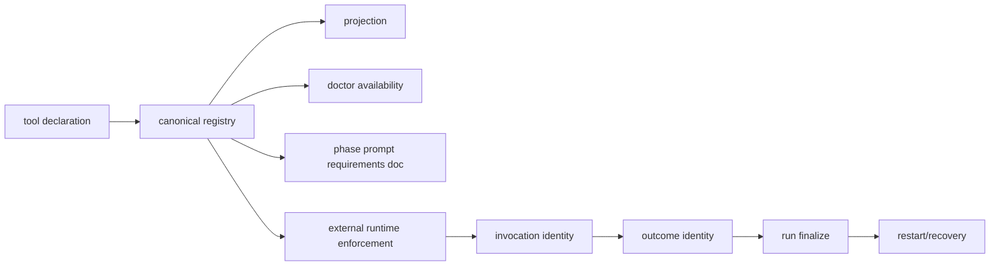
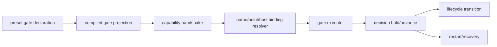

# RFC #547 R8/G5 — Tool 与 Gate capability contract 决策档案

> 固定基线：`main@699842eba2eefc242d19f8fa9232bc1d9d5c3bdd`。  
> 只读输入：稳定 D4/D5；`13-r7-09-tool-capability-chain.md`、`13-r7-10-gate-capability-handshake.md`。  
> 本档案只整理操作员裁决所需的事实、形态、触点、后果、未知和逐项问题；不推荐、不代裁、不转写实现、不估算规模。

## A. 摘要（≤1页）

G5包含两个相邻但不能合并的 capability contract：

- **Tool contract**回答“某phase声明需要什么工具、能否取得、使用结果如何判定、run何时因required outcome未达成而失败”。稳定D4把它拆成`provider / availability / outcome / enforcement`四轴，并要求同一registry供compile/projection、doctor、prompt文档和外部runtime enforcement消费。
- **Gate contract**回答“运行到哪个带稳定host identity的decision point时，需要哪道命名gate、脚本绑定如何解析、runtime是否有执行能力、decision如何hold/advance并在失败或重启后恢复”。稳定D5要求typed preset declaration、完整projection、point+host identity以及实例化/调度前的capability handshake。

两者有不同identity、不同判定点和不同恢复单位。Tool以`definition/tool/phase/run`贯穿声明、invocation、outcome、finalize；required合法性在compile期由outcome轴判定，runtime最终判定点是run finalize。Gate以`definition/gate/point/host/decision`贯穿声明、binding、execution与transition；无capability的判定点在实例化/调度前，真正gate decision发生在具体lifecycle host。Tool outcome不能替代gate decision，gate脚本也不能替代tool registry。

当前tool链没有registry/canonical/projection真实内容、phase requirements、prompt doc或runtime outcome闭环；doctor无条件硬编码`gh`并只查binary，scheduler只知道runner process/run identity。相邻的runner/HAPI tool events和router outcome不引用coder-loop declaration/tool/run identity。当前gate链只有严格可持久化的global/chain/item hook declaration carrier和caller手传placeholder的effective-view拼接；八个point都未在production调用，placeholder没有required/optional、host identity或script binding，`onFailure`没有执行或恢复语义。

外部存在性必须分两层陈述：在本机已访问的coder-loop、router、HAPI及已核owner中，没有从D4/D5 declaration到runtime enforcement/executor的同identity链；未checkout、未可访问或仅由issue登记的外树C6/tool owner及gate capability owner仍未知。前者是负向实存事实，后者不是“不存在”。

稳定D4/D5已经固定的口径不重开：tool四轴正交、required只对确定outcome合法、首波outcome为`entry-existence`、doctor声明驱动、三consumer同表；gate具名required/optional、compile/preview可存在但无capability时实例化/调度结构化拒绝、point使用统一封闭ADT并携稳定host identity。仍需裁决的是identity闭集、外部合同owner、outcome/decision persistence与recovery、binding precedence/ambiguity、错误投影和跨边界握手形式。

本档案列出tool与gate的全部事实支持形态及确定后果，并给出20个操作员逐项问题。现有测试/外部证据缺口只限制验证强度，不作为选择依据。

## B. 完整决策档案

### B1. 问题来源与稳定要求

#### B1.1 D4 Tool固定口径

| 稳定条款 | 固定要求 | 当前事实 |
|---|---|---|
| P-D4-1 | 一张registry供doctor、prompt doc、外树enforcement；源码零工具名兜底 | canonical/projection无registry；doctor硬编码`gh`；外树无实存消费链 |
| P-D4-2 | provider、availability、outcome、enforcement四维正交 | 当前只有runner kind/PATH与doctor binary check，不能表达四轴 |
| P-D4-3 | `required`只对有确定outcome的tool合法；provider不参与；首波outcome仅`entry-existence` | 无tool/outcome boundary、compile check或runtime finalize |
| P-D4-4 | doctor按所查preset声明检查external tool；bundled preset显式声明`gh` | doctor不读取preset工具声明，所有target都查固定`gh` |
| P-D4-5 | projection真实输出`tools`与各phase `toolRequirements` | `tools`为空常量，phase requirements不存在 |

D4只在本域固定声明/compile/doctor/prompt合同；runtime required outcome enforcement属于外树C6，但必须消费同一identity，不能以“外树”省略接口。

#### B1.2 D5 Gate固定口径

| 稳定条款 | 固定要求 | 当前事实 |
|---|---|---|
| P-D5-1 | preset gate声明为typed `name + required/optional + point`；重名/非法位置load时拒绝 | placeholder仅TS `name/point`；无preset loader、required/optional、name uniqueness |
| P-D5-2 | compiled projection暴露gate全集 | 无canonical/projection；effective view是runtime caller拼接且status隐藏hooks |
| P-D5-3 | 无runtime capability时compile/preview可成功，实例化或调度结构化`unsupported-capability`拒绝 | valid declaration inert；无handshake或拒绝 |
| P-D5-4 | 统一`GateDecisionPoint`封闭ADT；point携host identity；host不匹配compile拒绝 | 仓内八字符串词表与稳定四点不一致；无host payload/校验/调用 |

D5明确把preset declaration与global/chain script binding分属不同边界；本档案不把脚本路径塞回preset，也不把hook carrier存在当成gate capability。

### B2. 两模型、两identity链、两判定点

#### B2.1 Tool模型

需要保持的identity维度：

- definition identity；
- tool identity；
- phase requirement identity；
- run identity；
- invocation/attempt identity；
- outcome identity；
- finalize/recovery identity。

**两个tool判定点**：

1. compile判定：tool是否存在、四轴shape是否合法、`required`是否有可执法outcome；
2. run finalize判定：runner exit与required tool outcome共同决定run是否成立。

doctor availability是预检，不是outcome；prompt doc是说明，不是enforcement；runner binary存在也不表示runner内工具被调用。

#### B2.2 Gate模型

需要保持的identity维度：

- definition identity；
- gate declaration identity/name；
- point variant；
- stable host identity；
- resolved binding/script identity；
- gate decision/attempt identity；
- transition identity；
- recovery identity。

**两个gate判定点**：

1. 实例化/调度前判定：runtime是否声明并能识别所需gate capability；否则结构化unsupported拒绝；
2. lifecycle decision判定：具体host抵达point时，binding/executor结果如何阻止或允许对应transition。

这不同于tool compile/finalize。Gate没有“工具被使用”的outcome；tool也没有“某host transition是否放行”的decision。

#### B2.3 不得合并的邻接对象

| 邻接对象 | 不是Tool contract的原因 | 不是Gate contract的原因 |
|---|---|---|
| runner binary/PATH | 只有runner selection/存在性，无tool axes/outcome | 不对应decision point/host |
| HAPI tool-call event | 无coder-loop definition/tool/run identity与finalize | tool-call不是gate transition |
| router `consumed/not-consumed` | webhook delivery outcome，不是tool outcome | delivery不是host gate decision |
| hook declaration carrier | 无tool registry | 只存script/point，不解析placeholder或执行 |
| chain-complete preset trigger | 无tool identity | 独立trigger机制，不消费gate declaration |
| status admission gate | daemon authorization/admission，不是tool enforcement | 不执行declared gate script |

### B3. 当前Tool事实链

#### B3.1 声明到projection

- TOML/canonical没有`tools`或phase requirements来源；
- projection保留空`tools`shape，但内容是常量；
- prompt没有`toolRequirementsDoc`；
- 无provider/availability/outcome/enforcement boundary；
- 无required合法性compile error。

空shape只证明位置存在，不证明registry供给。

#### B3.2 Doctor、runner与runtime

| 面 | 当前输入 | 当前输出/行为 | 缺失连接 |
|---|---|---|---|
| doctor | 固定`gh` binary + runner binaries | binary存在/版本结果 | 不读取preset/tool/phase/outcome |
| runner selection | phase runner kind/model | spawn `claude/codex/opencode` | runner不是tool registry |
| scheduler | runner process/run identity | exit/session/rate-limit等run状态 | 无tool invocation/outcome |
| observability |现有run/phase事件 | 无tool outcome variant | 无definition/tool/run关联 |
| persistence | run与runtime identity | 无tool invocation/outcome/finalize row | kill/restart无法恢复tool判定 |

#### B3.3 Tool failure/recovery

当前不可达的tool状态：

- unknown tool capability compile error；
- required tool without outcome compile error；
- invocation success/failure；
- outcome attained/not attained；
- duplicate outcome幂等；
- runner exit 0但required outcome缺失导致finalize failure；
- outcome写入前后kill/restart恢复。

因此“runner成功”是当前唯一进程结果之一，但不能回答required tool完成。

### B4. 当前Gate事实链

#### B4.1 Carrier与binding

| 层 | 当前对象 | 持久性 | binding语义 |
|---|---|---|---|
| global | hook declarations from `hooks.json` | restart重载 | 无name match/placeholder resolution |
| chain | `metadata.hooks` | SQLite round-trip | 无precedence/override |
| preset | caller-only placeholder `name/point` | 不持久 | 无loader/required/optional/script ref |
| item | `extra.hooks` | SQLite round-trip | 无ambiguity/selection |

effective view只按global→chain→preset→item列举，顺序不是precedence。

#### B4.2 Point与host

| 当前vocabulary | 最近生命周期host | identity事实 | 调用 |
|---|---|---|---|
| daemon startup/shutdown、tick | daemon或active-chain集合 | 无单一task host | 无 |
| run pre-spawn | chain/item/phase；run identity在路径中段才产生 | point未规定创建前/后 | 无 |
| run post-exit | run/item/chain close多步骤 | run identity存在但无单一commit | 无 |
| item status-transition | chain/item，agent路径可关联stored run | declaration无identity ref | 无 |
| container.advance | 无production container scheduler authority | 无stable container host | 无 |
| chain.complete | chain/items/runs/closure集合 | 无top-level join identity ref | 无 |

稳定D5要求的`container.join`与当前`container.advance`不是同一variant，不能按名字近似合并。

#### B4.3 Gate failure/recovery

现存parse failure只覆盖malformed global/chain/item declaration。以下状态不可达：

- missing named binding；
- duplicate/ambiguous binding；
- unsupported gate capability；
- script nonzero/timeout；
- hold/advance decision；
- pending decision retry；
- restart恢复某host的未决decision。

`onFailure:"hold"|"advance"`只是inert data。Carrier可恢复不等于decision可恢复；preset placeholder甚至不会随restart恢复。

### B5. 已知owner与未知owner边界

#### B5.1 已核验owner的负向实存事实

R7-09/10已核验的范围内：

- coder-loop仓内无tool enforcement或gate executor；
- `github-hapi-agent-router`的delivery outcome不引用coder-loop tool/gate/run identity；
- HAPI虽有动态tool discovery/tool-call events，但无coder-loop `toolRequirements`、`entry-existence`、gate host identity或finalize接口；
- 已读外部owner没有从compiled declaration到C6 outcome或gate decision的闭环。

这些结论只适用于已访问代码和接口。

#### B5.2 保持未知的外部范围

- 仅由issue/设计登记、未checkout或未可访问的C6/tool enforcement owner；
- 未落地或未访问的gate capability/executor owner；
- 未来GUI/hook外部consumer；
- 外部系统是否已有可复用的identity、persistence、recovery协议。

正确表述是“已访问owner无实存链；未访问owner未知”，不是“外部系统不存在”。

### B6. Tool：全部事实支持形态及后果

下表既包含当前可运行形态，也包含稳定D4允许但尚无实存链的合同形态；不排序、不推荐。

| ID | 形态 | 确定后果 | 触点 | 未知 |
|---|---|---|---|---|
| T1 | 保持doctor固定`gh` + runner PATH | GitHub原语继续硬编码；无phase/tool/outcome关联 | doctor、runner lookup | 与D4缺口保持 |
| T2 | 把runner binary当tool registry | 可表达runner存在；丢provider/outcome/enforcement，不能表示runner内tools | runner selection、doctor | 无法闭合required |
| T3 | 仅prompt散文要求tool | agent可读要求；不可判定、归因、持久或恢复 | prompt render | compliance无法结构化 |
| T4 | 利用runner/HAPI相邻tool events外部执法 | 相邻事件可观察；若无共同identity，不能finalize/recover | runner wrapper、HAPI events | identity/API/store均未知 |
| T5 | 外树C6消费compiled declarations | 符合owner登记方向；当前没有可验证API/event/store | projection、external boundary、run finalize | owner/transport/persistence未知 |
| T6 | D4同表三消费 + C6同identity闭环 | doctor/prompt/runtime读取同一tool identity；required可由outcome finalize | compiler、projection、doctor、prompt、C6、run | 外树实现与错误/recovery协议待裁 |

四轴的事实支持分解：

| 轴 | 已固定口径 | 当前事实 | 待裁工程接缝 |
|---|---|---|---|
| provider | engine/external正交 | 无registry | engine capability解析与external owner接口 |
| availability | 存在性解析 | doctor仅查固定binary | provider-specific availability结果/缓存 |
| outcome | tool固有；首波`entry-existence` | 无outcome model | identity、persistence、dedupe |
| enforcement | required/expected；required依赖outcome | 无phase requirements | finalize与failure投影 |

### B7. Gate：全部事实支持形态及后果

#### B7.1 当前与stable handshake形态

| ID | 形态 | 确定后果 | 触点 | 未知 |
|---|---|---|---|---|
| G1 | 当前carrier + caller placeholder + effective list | declaration可persist/list；不执行、不binding、不改变scheduling | global/chain/item storage、effective view | 全部capability语义缺失 |
| G2 | compile接受gate且runtime继续静默 | required/optional等价未声明；违反D5禁止的中间状态 | compiler、scheduler | 不允许作为stable终态 |
| G3 | compile/preview接受，实例化/调度前unsupported拒绝 | 无capability时不会进入phase；错误可点名capability | compile projection、instantiate/schedule boundary | handshake owner/API/error payload |
| G4 | runtime声明capability并解析binding后执行decision | gate可影响具体host transition；需要identity/persistence/recovery闭环 | handshake、resolver、executor、transition | 外部executor合同未知 |

#### B7.2 R7-10证明的十个形状轴

| 轴 | 当前形状 | 稳定/事实后果 | 待裁接缝 |
|---|---|---|---|
| vocabulary | 八个string；含`container.advance` | 不等于稳定`container.join`四类点 | 统一ADT版本与兼容处理 |
| host | daemon/set、run、item、container、chain异构 | 无payload string不能携各类host identity | point variant payload |
| timing | run identity在pre-spawn路径中段才创建 | point必须精确定义identity可用时点 | invocation位置 |
| commit | post-exit/status/complete跨多写入 | decision需与哪次transition关联仍未定 | decision/transition identity |
| binding | 三层script + 一层name placeholder并列 | list order不是resolution | name/point/host match与precedence |
| capability | valid declaration inert | presence不证明runtime支持 | handshake版本/能力集合 |
| failure | 只有parse failure可达 | missing/script/timeout错误无现状 | typed error ADT |
| recovery | carrier可恢复，decision不可恢复 | restart没有pending hold/retry | decision persistence |
| projection | status隐藏hooks，placeholder不持久 | 无gate全集/resolved binding读面 | compile/status/event projection |
| boundary | gate/tool/trigger/admission分离 | 不可用相邻机制替代 | owner与consumer合同 |

### B8. 跨模型接缝与禁止替代

| 若发生的混合 | 会丢失的事实 |
|---|---|
| 用gate script代表tool invocation | tool provider/availability/outcome/enforcement与run finalize消失 |
| 用tool outcome代表gate decision | point/host identity、transition hold与binding消失 |
| 用doctor availability作为required outcome | “存在”被误作“合规使用已达成” |
| 用runner exit作为tool finalize | runner内部多tool无法区分，required缺outcome仍被判成功 |
| 用effective hook list作为binding | 无name resolution、precedence、ambiguity或host match |
| 用`onFailure`字段作为recovery | 没有executor/decision/pending state，字段不能产生行为 |
| 用chain-complete trigger作为gate | trigger不消费gate declaration或script binding |
| 用status admission作为gate | admission authorization不对应declared lifecycle point |

Tool与gate可以共享底层run/definition identity设施，但不能共享domain identity或最终判定。

### B9. 口径问题与工程分叉

#### B9.1 口径问题

口径决定合同语义：

- tool identity、phase requirement、invocation与outcome的关系；
- `entry-existence`何时算成立以及与run/worktree的作用域；
- expected与required的finalize可见语义；
- gate declaration identity、point variant与host identity闭集；
- required/optional在capability存在/缺失/binding缺失时的意义；
- gate decision与transition的关系；
- 已访问外部owner与未知owner的证据边界。

#### B9.2 工程分叉

工程分叉决定固定语义由何边界承载：

- registry TOML/canonical/projection/parser；
- doctor availability provider adapter与缓存；
- prompt requirements doc render；
- C6 API/event/persistence/finalize；
- invocation/outcome dedupe与restart recovery；
- gate capability advertisement与version handshake；
- placeholder→script resolution层级、precedence与ambiguity；
- executor transport、timeout与typed errors；
- pending gate decision storage与transition commit接缝；
- status/events/GUI投影。

#### B9.3 证明缺口不是决定

- 未访问C6/gate owner未知；
- 没有真实external tool invocation/outcome样本；
- 没有gate executor可运行script failure/timeout/restart；
- 没有production container scheduler authority；
- 没有compiled gate/tool declarations可做完整E2E。

这些限制后续验证，不自动选择provider、transport、storage、binding precedence或recovery形态。

### B10. 操作员逐项裁决问题

以下20问要求逐项明确记录答案；本档案不提供默认答案。

#### Tool口径

1. **Tool identity**：registry中哪个稳定identity贯穿definition、phase requirement、doctor、prompt、invocation、outcome与finalize？
2. **Provider boundary**：engine与external provider各自负责availability、invocation、outcome中的哪些步骤，哪些步骤必须保持provider无关？
3. **Entry-existence作用域**：首波outcome `entry-existence`相对于run、worktree、commit/path的成立条件与唯一性边界是什么？
4. **Expected语义**：`expected`在prompt、observability与run结果中承诺什么，明确不承诺什么？
5. **Required finalize**：runner exit成功但required outcome缺失、迟到、重复或冲突时，run如何判定并关联哪个identity？

#### Tool工程分叉

6. **Registry公共形状**：TOML、canonical与projection分别暴露四轴的何种封闭ADT，tool/phase引用如何校验？
7. **Doctor availability**：doctor通过何种provider adapter解析声明的external/engine capability，availability结果如何分类、缓存与归属preset？
8. **Prompt文档**：`toolRequirementsDoc`由registry哪些字段生成，如何保证每phase只看到自己的requirements且不成为执法替代？
9. **C6合同**：外树enforcement通过何种API/event接收definition/tool/phase/run identity，并回传invocation/outcome？
10. **Outcome persistence/recovery**：outcome在写入前后kill、duplicate event、retry与restart时，幂等key、finalize顺序与恢复入口是什么？

#### Gate口径

11. **Gate declaration identity**：name在definition内、point内还是全preset范围唯一；required/optional分别约束capability与binding的什么语义？
12. **Point ADT闭集**：稳定`run.pre-spawn/run.post-exit/container.join/chain-complete`各自携带哪种host identity；当前额外point如何定性？
13. **Pre-spawn时点**：`run.pre-spawn`位于run/runtime identity创建前还是后，gate host用什么稳定identity？
14. **Decision与transition**：post-exit、container join、chain complete等gate decision分别阻断哪一个typed transition，decision identity如何关联transition？
15. **Optional缺失语义**：capability存在但optional gate无binding、binding失败或executor不可达时，何者可继续、何者必须结构化记录？

#### Gate工程分叉

16. **Capability handshake**：runtime如何advertise gate capability/version，实例化/调度在哪个边界比较compiled requirements并输出unsupported error？
17. **Binding resolution**：global/chain/item script declaration如何按name/point/host匹配preset declaration；层级顺序、override、duplicate与ambiguity如何处理？
18. **Executor合同**：script/外部executor收到哪些definition/gate/host/decision输入，timeout、exit与malformed output如何形成typed result？
19. **Decision persistence/recovery**：pending/hold/advance、attempt、timeout与retry存在哪里；restart如何定位同一host decision且不重复transition？
20. **Gate读面**：compiled projection、status/events、hook payload/GUI分别显示declaration、resolved binding、capability与decision的哪些字段，哪些敏感script信息不得外投？

### B11. 问题与现有证据边界

| 问题 | 已有事实足够支持裁决 | 仍需后续证明但不代替裁决 |
|---|---|---|
| 1-5 | D4四轴、doctor/runner边界、无outcome/finalize、run identity存在 | external invocation样本 |
| 6-10 | 空projection、hardcoded doctor、相邻external events但无共同identity | C6 owner/API可访问性 |
| 11-15 | D5 required/optional/point要求、八点host矩阵、无identity/decision | future container scheduler细节 |
| 16-20 | carrier四层、无handshake/binding/executor/recovery/projection | gate owner/transport与真实failure实验 |

### B12. 决策记录模板

| 字段 | 记录边界 |
|---|---|
| 问题编号 | B10唯一编号 |
| 模型 | Tool或Gate；不得写“capability通用”掩盖身份差异 |
| 固定条款 | 对应P-D4或P-D5 |
| 裁决句 | 单一明确答案 |
| identity链 | 声明到判定/恢复使用的稳定identity |
| 判定点 | compile/finalize或handshake/lifecycle decision |
| 受影响触点 | 只列B3/B4/B6/B7已建立的边界 |
| 外部owner状态 | 已访问无链，或未访问未知；不得混写 |
| 保留未知 | 决定未解决的验证/owner空位 |
| 后续验证 | 证明裁决落地，不生成新需求 |

### B13. 输入追溯

| 输入 | 本档案消费 |
|---|---|
| 稳定D4 | registry三consumer、四轴、required/outcome判据、doctor声明驱动、真实projection、C6外树边界 |
| 稳定D5 | typed gate declaration、完整projection、unsupported handshake、统一point+host identity |
| R7-09 | tool hardcode、doctor/runner、API/event/store/finalize inventory、known external owners、five fact-supported shapes |
| R7-10 | hook carrier/effective view、八点host矩阵、四层binding缺口、capability/error/recovery、十个shape axes |

## 尾结论

G5不是一个通用“capability表”，而是Tool与Gate两套合同。Tool沿definition/tool/phase/run/invocation/outcome identity，在compile合法性与run finalize两处判定；Gate沿definition/gate/point/host/binding/decision identity，在实例化/调度handshake与lifecycle transition两处判定。当前tool只有hardcoded doctor、runner过程和相邻external events，没有registry到outcome/finalize闭环；当前gate只有carrier/effective list，没有host binding、invocation、decision或recovery。已访问owner无同identity链，未访问owner继续未知。本档案列出20个操作员问题、Tool六类形态与Gate/host十轴形态，不给答案；证明缺口不作为provider、transport、binding、storage或recovery选择依据。
