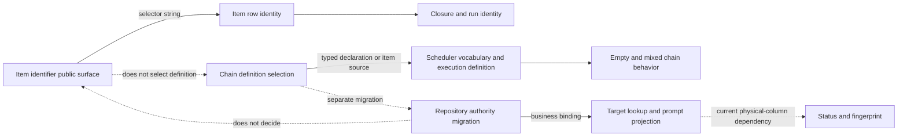
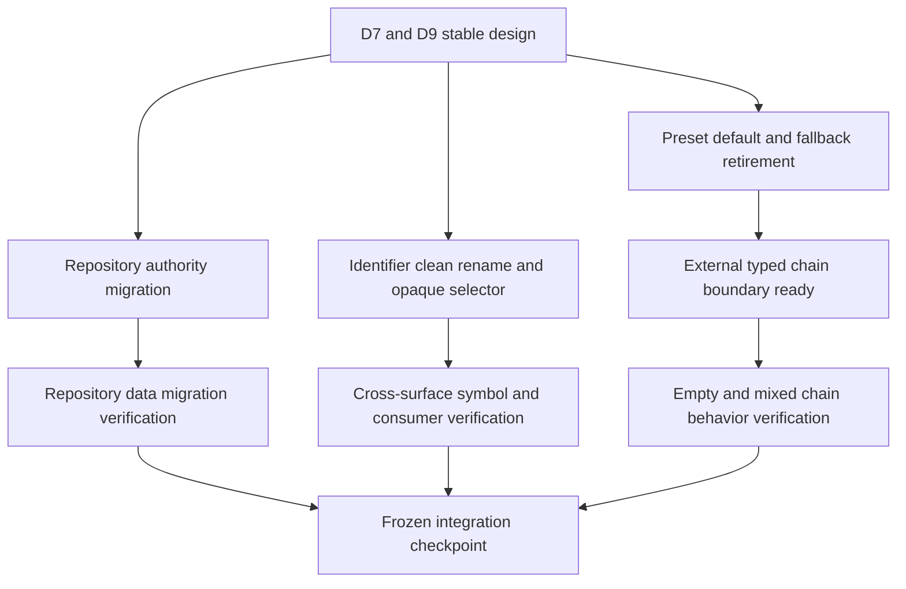

# RFC #547 R8/G6 决策档案：engine de-GitHub primitives

> 固定基线：`main@699842eba2eefc242d19f8fa9232bc1d9d5c3bdd`  
> 稳定设计锚点：`AGGREGATE-547.md` D7、D9、§2.5。  
> 事实输入：`13-r7-12-github-notation-surfaces.md`、`13-r7-13-repository-authority-migration.md`、`13-r7-14-chain-declaration-fallback.md`。  
> 本档案只把已经调查到的事实组织成操作员可逐项裁决的问题；不推荐、不裁决、不设计实现、不估规模。

## A. 主 agent 摘要（最多一页）

### A1. 本组不是一次重构，而是三个独立决策域

G6 的“engine de-GitHub”表面上共享 GitHub 遗留词表，实际上包含三个不能互相替代的决策域：

1. **item identifier 的公开记法与兼容边界**：决定同一个 opaque id 经 CLI、socket wire、batch 与历史 migration 是否仍可被改写，以及公开词表怎样完成已稳定的 clean rename。
2. **repository 的持久化权威、business binding 与资源身份**：决定物理列怎样退出、双权威存量怎样处置、target lookup/fingerprint 怎样失去旧列依赖；它不决定 item selector，也不决定 preset source。
3. **chain definition 的选择、default/fallback 与外部 typed boundary**：决定省略声明、legacy null/both-set、empty/mixed-preset chain 分别由什么定义驱动；它不等于 repository migration。

三域存在接缝，但不可压成“一次 de-GitHub migration”：repository 列退役不会消除 queue 的 GitHub normalization；`--issue` 改名不会消除 `DEFAULT_PRESET_NAME`；preset fallback 退役也不会决定存量 repository 冲突。

### A2. 不重新开放的稳定设计

- **D7 item identity**：item id 是 opaque string；引擎不解析引用记法。queue wire 使用 `itemId`。
- **D7 repository**：repository 退出物理列，进入 chain business bindings；`baseBranch` 因 worktree 机制真实消费而保留引擎一等字段。
- **D7 CLI**：`--issue` 干净改名为 `--item`，不保留 alias；usage、engine epilogue 与 bundled fragments 同步。
- **D7 清零**：engine-owned GitHub 记法符号必须具备可验证的清零口径；preset 自有业务字段 `issue` 不属于这一清零对象。
- **D9 default**：省略 preset 持久化为 `null`，不得选择默认 bundled preset；需要定义时应点名失败。
- **D9 boundary**：chain declaration 只通过单一外部 typed boundary；本域不另建第二套 parser/schema。
- **D9 recovery**：item recovery 继续读取该 item 自己的 preset declaration。

因此，本档案所列形态仅用于裁决**迁移、兼容、存量和跨读面的确定语义**，不把稳定结论重新列为候选。

### A3. 需要操作员裁决的 11 个问题

| 编号 | 决策域 | 裁决问题 |
|---|---|---|
| Q1 | identifier | opaque id 在一般 item、queue 与 direct wire 三条寻址路径上的统一可寻址集合如何落地？ |
| Q2 | identifier | clean rename 生效时，仓内调用者与不可枚举外部调用者以什么发布边界承受 breaking change？ |
| Q3 | identifier | batch runtime compatibility 与 v11→v12 历史 migration 应怎样分界、退场和验收？ |
| Q4 | repository | 物理列退役后，target lookup、status 与 fingerprint 的单一 repository 读面是什么？ |
| Q5 | repository | 存量列/binding 一致、冲突、缺失及非 GitHub 值各自采用什么迁移政策？ |
| Q6 | repository | migration 必须保持哪些 closure/worktree/recovery 不变量，哪些 projection 允许改变？ |
| Q7 | definition | omitted preset 为 null 后，哪些操作可在无定义下成功，哪些必须点名失败？ |
| Q8 | definition | legacy item/chain 的 null/null 与 both-set 行怎样恢复或拒绝？ |
| Q9 | definition | empty chain 与 mixed-preset chain 的 chain-wide definition/vocabulary 来源是什么？ |
| Q10 | definition | 单一 external typed chain boundary 的 owner、artifact 与 readiness 如何成为可验证前置条件？ |
| Q11 | 跨域验收 | engine legacy 清零怎样与合法 preset 业务词表隔离，并覆盖所有公开/存量 consumer？ |

### A4. 当前最关键的事实约束

- 一般 item CLI 已 opaque 透传，但 queue CLI 与 queue wire 使用两套不同的 lossy 规则；同一 raw string 可命中不同 item。
- batch legacy 是 CLI-only compatibility；direct daemon wire 已拒绝 legacy key；v11→v12 migration 又是独立的历史优先级规则。
- `chains.repository` 仍同时承担 target lookup、status 与 fingerprint 输入；prompt binding 却可用 metadata 同名值覆盖它，冲突不报错。
- closure、run、worktree 的持久身份不依赖 repository string；但 operator target lookup 与 fingerprint 当前仍依赖该列。
- public admission 要求 item `preset XOR presetPath`，但 store 仍容纳 null/null 与 both-set；各 consumer 对这些组合的解释不一致。
- 无 item 的 path-only chain 可被 status 加载，却被 scheduler 因 `chain.preset === null` 跳过；mixed-preset chain 又取第一条代表 item 形成 chain-wide vocabulary。
- external typed chain boundary 当前没有可证明的 owner/schema/artifact；不能把它写成已存在供给。

---

## B. 完整决策档案

## 1. 稳定设计与待裁工程语义的边界

| 主题 | 已稳定，不再裁决 | 本档案仍需裁决 |
|---|---|---|
| item id | opaque；无 GitHub normalization | 旧入口/调用者的 breaking 边界、batch历史兼容退场、跨入口验收 |
| CLI | `--issue`→`--item`，无 alias | 仓内同步原子性与外部依赖不可枚举时的发布事实表达 |
| repository | 退物理列，入bindings；baseBranch保留 | 存量冲突/缺失/non-GitHub政策；旧读面替代；migration不变量 |
| preset default | 省略即null；无默认preset | null状态允许的操作集合；legacy异常组合；empty/mixed chain语义 |
| chain boundary | 唯一外部typed boundary | owner、artifact、依赖就绪与当前缺口怎样登记/阻断 |
| engine清零 | engine-owned GitHub primitives可验证清零 | 清零scope怎样排除合法preset业务字段并覆盖consumer |

“兼容依赖存在”不构成保留 alias 的候选；“外部 boundary 尚不存在”也不构成在本域临时复制 schema 的候选。两者分别是 breaking 发布与依赖就绪问题。

## 2. 三域分界与不能混并的原因

分界的确定后果：

1. item selector 清理可以在 repository 列仍存在时被独立验收。
2. repository migration 可以保持 item/closure identity 不变，却仍需修改 target lookup/fingerprint 的读面。
3. preset fallback retirement 需要处理 null/both-set、empty/mixed chain，不能借 repository migration 的 transaction 自动获得语义。
4. 三域可以共享一个发布 checkpoint，但不能共享一个含糊的“迁移成功”断言。

## 3. 当前端到端事实时间线

### 3.1 Item identifier 路径

1. 一般 item CLI 接收 `--issue`，只检查非空、无空白，原样形成 wire `itemId`。
2. daemon item CRUD 以 `itemId` 寻址并施加非空、无空白、最长256字符与chain内unique。
3. queue CLI 在发送前把 `owner/repo#42`、`#42`压成`42`；queue wire字段仍叫`issue`。
4. direct queue wire只剥开头一个`#`，不会剥cross-repo前缀。
5. 因而一般 item CLI、queue CLI、direct queue wire对同raw string并不等价。
6. batch CLI仅在canonical `itemId`缺失时消费`issue|issueNumber`；direct batch wire拒绝legacy key。
7. v11→v12 migration按`extra.id → extra.issue → issue_number`推导历史id；这不是runtime alias。

### 3.2 Repository 路径

1. chain create当前要求repository并验证`owner/repo`形状，写入`chains.repository TEXT NOT NULL`。
2. target lookup、chain list/status与fingerprint仍读取物理列。
3. prompt binding展开metadata后，同名`repository` binding可覆盖列值；冲突不报错。
4. store/schema允许历史非GitHub列值，daemon admission不允许新建同形态值。
5. 当前没有repository物理列→binding的migration。
6. closure与worktree实际以row id、chain name、repoCwd、baseBranch、closureId/runtimeNodeId、worktreePath、branchName、baseCommit等恢复，不以repository string为持久身份。

### 3.3 Chain definition 路径

1. 新item public admission要求`preset XOR presetPath`。
2. schema/store仍可持有null/null或both-set。
3. item resolver顺序为item path→item name→chain fallback；both-set静默path胜出。
4. chain resolver顺序为metadata presetPath→chain.preset→error；both-set同样静默path胜出。
5. chain create省略preset时仍seed `gh-issue-pr-iteration`；target resolver另有独立同名default。
6. socket status、target status、scheduler与migration对无source组合分别表现为empty vocabulary、global default、early skip、chain/global fallback或互斥错误。
7. mixed-preset chain用第一条带source的代表item决定chain-wide vocabulary/phase plan。
8. restart重新执行current-source resolver；当前没有按内容固定definition的事实可抵消legacy fallback rebind。

## 4. 域一：item identifier public notation

### Q1. opaque id 的统一可寻址集合

**为什么出现。** 稳定设计要求opaque/no normalization，但一般item、queue CLI与direct queue wire当前采用三套selector转换。

**稳定设计要求。** 所有引擎selector把id当opaque string；queue wire字段改为`itemId`；`owner/repo#42`、`42`、`#raw`可以是彼此不同的合法id。

**当前事实。** 一般item路径原样透传；queue CLI会剥cross-repo或leading `#`；direct wire只剥leading `#`。实验证明同raw可命中不同row。

**事实支持形态（非完备、无推荐）。** 由于stable design已经排除保留normalization，事实支持的落地差异只剩：

- 在同一breaking boundary同时切换queue CLI、wire key、daemon lookup及所有调用者；确定后果是该boundary前后各自内部一致，旧wire caller在boundary后失败。
- 以多个有明确依赖顺序的提交完成，但只在全部切换后的checkpoint声称行为成立；确定后果是中间SHA存在已知不一致，不能作为可消费发布点。

**具体触点。** queue CLI parser/normalizer、queue socket arg key、daemon handler、一般item usage、context中性`--item-id`对照、queue tests与operator docs。

**未知。** repo外direct socket callers与operator脚本不可枚举。

**操作员裁决问题。** 该breaking change的唯一可消费checkpoint是单个原子发布边界，还是允许不可发布的有序中间SHA？

### Q2. clean rename 与 consumer 发布边界

**为什么出现。** 仓内并非只有parser使用`--issue`：root usage、engine completion epilogue、bundled fragments、docs、integration scripts与real E2E都主动发出旧flag。

**稳定设计要求。** `--issue`→`--item`干净改名，无alias。

**当前事实。** 一般item命令、queue、engine prose和脚本仍使用旧词表；direct item wire已叫`itemId`。gh preset内部`item.issue`与`{{ISSUE}}`是L2业务字段，不是engine CLI alias。

**事实支持形态。** 

- 仓内producer/consumer在同一可消费checkpoint同步；确定后果是仓内测试可证明新contract，旧仓外caller立即breaking。
- 仓内分提交迁移、发布checkpoint统一；确定后果是中间commit只能作为施工态，不能用部分green说明contract已完成。

无alias不是待选形态；外部caller迁移窗口不能通过保留alias表达。

**具体触点。** 五个item command、queue command、root usage、`phaseExitsEpilogue`、bundled action fragments、README/docs、engine integration、filesystem grants、issue-560与real-e2e scripts。

**未知。** repo外复制过命令的agent prompt、shell脚本与socket client数量。

**操作员裁决问题。** 哪个版本/checkpoint被定义为clean rename的breaking发布边界，并怎样明确旧外部caller在该点后的失败语义？

### Q3. batch runtime compatibility 与历史 migration 的边界

**为什么出现。** batch CLI backfill与v11→v12 migration都识别`issue`词表，但生命周期、输入边界和失败语义不同。

**稳定设计要求。** runtime batch legacy backfill物理移除；opaque storage保留；历史DB升级仍必须可达且数据无损。

**当前事实。** CLI-only batch backfill接受`issue` string/number或`issueNumber` number；direct wire拒绝。canonical+legacy混合不是冲突比较，而是unsupported field。历史migration按`extra.id→extra.issue→issue_number`，且不复用当前length/whitespace validator。

**事实支持形态。** 

- runtime compatibility随clean rename边界删除，历史migration长期保留为旧schema升级路径；确定后果是源码仍可能出现历史`issue_number/extra.issue`，清零gate必须区分migration证据与runtime symbol。
- 在一个明确最低可升级schema之后另行删除历史migration；确定后果是旧于该schema的DB不再可直接升级，需要先经过旧版本。这个最低schema事实当前未给出。

**具体触点。** batch CLI parser、daemon child key validation、v11→v12 migration、migration tests、D7 symbol grep口径。

**未知。** 生产DB最低schema版本分布；是否存在repo外CLI batch legacy producer。

**操作员裁决问题。** runtime legacy删除与历史schema升级支持各自持续到哪个版本边界，清零验收是否明确豁免仍需保留的历史migration词表？

## 5. 域二：repository authority、migration 与身份

### Q4. 物理列退役后的单一读面

**为什么出现。** repository已出现物理列与metadata binding双权威；prompt读面可被binding覆盖，而target/status/fingerprint仍读列。

**稳定设计要求。** repository只作为business binding；物理列和forge格式admission退役；`baseBranch`保留一等。

**当前事实。** 同一chain可向prompt与operator读面展示不同repository；target lookup和fingerprint仍依赖旧列，直接删列会失去当前选择键。

**事实支持形态。** 

- target lookup继续提供repository业务selector，但其值只从bindings读取；确定后果是selector仍是业务便利面，不再是引擎资源identity，缺binding时必须有显式结果。
- target lookup改用现有非repository chain identity，repository只投影到业务输出；确定后果是依赖repository target字符串的operator调用必须改用另一已存在identity。
- repository不再参与target lookup但仍可作为纯create sugar写binding；确定后果是create输入与后续寻址输入不对称，需要公开说明。

这些是事实可区分的读面形态，不构成完备设计。

**具体触点。** chain create admission、chain list/status、target resolver、fingerprint、prompt binding merge、business binding projection。

**未知。** 外部typed chain owner最终提供的canonical chain selector；repo外target调用依赖。

**操作员裁决问题。** 列退役后，repository binding是否仍是公开target selector；若不是，哪一个已经存在且稳定的chain identity承担该职责？

### Q5. 存量repository组合的迁移政策

**为什么出现。** 真实存量可有列/binding一致、冲突、binding缺失、列非GitHub等组合；当前无repository migration。

**稳定设计要求。** 既有DB数据无损；旧树稳定细化要求列/binding冲突响亮失败、不静默选边。

**当前事实。** 当前merge语义让binding静默覆盖列；umbrella迁移已有“实际保留binding、注释声称旧列赢”的冲突先例，不能直接借其注释推导repository政策。

**事实支持形态。** 

- 一致：保留现有binding并退列，或重写同值binding；两者结果值相同，但审计来源不同。
- 仅列有值：复制到binding后退列；确定后果是包括非GitHub字符串在内的历史值作为opaque业务值保留。
- 仅binding有值：保留binding后退列；确定后果是当前列缺失/占位不再具有权威性。
- 冲突：稳定要求响亮失败；仍待裁的是整库事务回滚、chain级hold或显式预检阻断发生在哪一层。
- 两者均缺：退列后repository binding缺失；确定后果取决于Q4中哪些操作要求该binding。

**具体触点。** SQLite schema bump、IMMEDIATE transaction、shape/re-entry detection、binding JSON parse、daemon startup日志、status/read migration。

**未知。** 生产DB各组合计数；历史non-GitHub值数量；冲突是否真实存在。

**操作员裁决问题。** 冲突的响亮失败作用域是整库升级失败、单chain隔离还是启动前预检阻断；一致/单边/双缺组合各自需要什么审计记录？

### Q6. closure/worktree/recovery migration 不变量

**为什么出现。** repository物理列参与operator projection但不构成真实closure identity；如果把所有相关输出都误当身份，会无谓扩大migration。

**稳定设计要求。** repository载体改变不得损坏既有items/runs/closure/worktree；baseBranch保持引擎一等。

**当前事实。** 恢复身份依赖chain/item row id、chain name、repoCwd、baseBranch、closureId/runtimeNodeId、worktreePath、branchName与baseCommit。改repository列本身不会改变已持久tree/run/closure；但target lookup与fingerprint当前会改变或失效。

**事实支持形态。** 

- 以所有上述持久identity逐项相等作为强不变量，允许repository projection来源改变；确定后果是migration验证需区分identity与展示值。
- fingerprint若包含repository列，可迁移为binding值后保持相同业务输入；确定后果是冲突/缺失行无法无条件保持旧fingerprint。
- fingerprint停止包含repository；确定后果是其语义改变，需由拥有fingerprint contract的域裁决，不能由本migration暗中决定。

**具体触点。** chains/items/runs/closures表、worktree fields、status projection、fingerprint生成、migration前后恢复路径。

**未知。** fingerprint的外部消费者和变更容忍度；真实恢复中是否存在未调查的repository-derived缓存键。

**操作员裁决问题。** migration验收中哪些字段必须逐字节保持、哪些只需语义保持、fingerprint是保持业务输入还是明确变更contract？

## 6. 域三：chain definition selection 与 fallback

### Q7. omitted preset/null 的操作语义

**为什么出现。** D9稳定要求省略为null且无default，但当前不同consumer把null解释为空成功、global default、skip或fallback。

**稳定设计要求。** 未声明时持久化null；需要preset的路径点名失败；无静默替代。

**当前事实。** socket chain.status在全无source时可返回empty vocabulary；target status加载global default；scheduler对某些empty chain early skip；item resolver可能用chain source。

**事实支持形态。** 

- 纯存储/列举操作允许null，首次需要definition/vocabulary的操作点名失败；确定后果是必须列出“需要定义”的操作集合。
- chain declaration boundary可为某些chain级操作提供非preset definition；确定后果是成功来自显式typed declaration，不来自default preset。

把null自动映射bundled preset不属于事实支持形态，因为它重新打开D9。

**具体触点。** chain create、chain list/status、target status、scheduler admission、chain-complete、item add/recovery、doctor或compile projection。

**未知。** 外部boundary最终可提供哪些chain-level definition字段；无item chain是否有合法的非preset行为全集。

**操作员裁决问题。** 请逐项标定null chain在create/list/status/add item/schedule/chain-complete上的success或named error，并指出成功所需的显式来源。

### Q8. legacy null/null 与 both-set 恢复政策

**为什么出现。** public admission已XOR，但schema/store保留不满足XOR的历史状态；resolver对both-set静默path胜出，对null/null回退chain或global source。

**稳定设计要求。** normal runtime不得靠default；item recovery仍取per-item preset；definition不能静默rebind。

**当前事实。** legacy item null/null在restart/migration时会重新选择当前chain/default；both-set没有冲突错误。chain层metadata path与name也有相同path优先。

**事实支持形态。** 

- 启动migration将可无歧义的legacy行规范化为单一source，歧义/无source行hold或失败；确定后果是migration必须能证明所选source，不得读取global default。
- 不改写行，但resolver把异常组合变成结构化legacy错误；确定后果是历史chain/item需显式repair后才能继续。
- 以单独标记的migration-only compatibility读取legacy fallback；确定后果是normal runtime与legacy恢复必须可观察地区分，且不得静默rebind。

**具体触点。** item/chain schema、startup migration、daemon chain/item resolver、restart、status与错误ADT。

**未知。** 生产DB异常组合计数；历史行能否从其他持久证据唯一恢复source。

**操作员裁决问题。** 哪些legacy组合允许自动规范化，所需证据是什么；哪些组合必须hold/repair；是否允许可观察的migration-only fallback？

### Q9. empty chain 与 mixed-preset chain-wide 来源

**为什么出现。** chain-wide vocabulary/phase plan当前借第一条item；无item时又有独立gate，导致有效path-only chain被跳过。

**稳定设计要求。** 无default；chain-level task tree/join来自外部typed chain declaration；per-item recovery继续用per-item preset。

**当前事实。** scheduler empty gate只看`chain.preset`，忽略metadata presetPath；mixed chain选择第一条有source的item，结果可受row顺序影响。

**事实支持形态。** 

- chain-wide行为只从显式chain declaration取得，items只提供自己的phase definition；确定后果是无declaration的empty/mixed chain在需要chain-wide行为时失败。
- 某类chain被声明为无chain-wide execution，只调度items；确定后果是chain-complete/top-level join不可凭第一item推导，必须明确不存在或由boundary声明。

继续用first representative不满足稳定的单一boundary，也不能形成顺序无关语义。

**具体触点。** scheduler empty gate、representative item selection、socket/target status vocabulary、chain-complete trigger、external task tree/join declaration。

**未知。** 外部boundary对“无chain-wide execution”是否建模；mixed-preset在实际DB中的数量。

**操作员裁决问题。** empty与mixed chain各自允许哪些chain-wide操作；其唯一来源是显式chain declaration还是明确不存在？

### Q10. external typed chain boundary 的 owner 与 readiness

**为什么出现。** D9要求消费单一外部boundary，但当前调查没有找到实存owner、schema或producer/consumer artifact。

**稳定设计要求。** 本域不新增第二套parser/schema；合法/非法declaration结果与boundary独立运行一致。

**当前事实。** 当前chain create/socket/store仍是legacy字段组合；没有可引用的versioned declaration artifact，也没有owner E2E。

**事实支持形态。** 

- 将boundary artifact作为本域开工/验收的硬前置；确定后果是未就绪时G6只能完成不依赖它的identifier/repository工作，不能声称D9完成。
- 在同一冻结checkpoint由明确外部owner先交付artifact，本域仅消费；确定后果是依赖顺序必须在问题树中可见，diff中不能出现复制schema。

本域临时定义boundary不属于稳定设计允许的形态。

**具体触点。** external owner issue/dependency、versioned schema或ADT artifact、parse API、CLI/socket/store consumer、V-9b fixture与E2E。

**未知。** owner是谁、artifact路径、版本策略、交付顺序和当前readiness。

**操作员裁决问题。** 指定该boundary的唯一owner与可消费artifact，并确定它是G6前置还是同checkpoint中有序前置；若尚不存在，D9以何种明确blocked状态登记？

## 7. 存量数据与兼容依赖矩阵

| 存量/consumer | 当前接受 | 稳定终态 | 必须裁决的迁移事实 |
|---|---|---|---|
| 一般item CLI caller | `--issue <opaque>` | `--item <opaque>` | breaking checkpoint；仓外caller不可枚举 |
| queue CLI caller | `--issue`且lossy normalize | `--item` opaque | selector集合改变；旧raw可能改为命中不同row |
| direct queue wire | `{issue}`且剥leading `#` | `{itemId}` opaque | wire version/breaking failure边界 |
| batch CLI legacy JSON | `issue|issueNumber` backfill | canonical `itemId` | runtime compatibility删除点 |
| direct batch wire | 只收`itemId` | 不变canonical | 已经breaking，无legacy迁移需要 |
| v11→v12 DB | `extra.id|extra.issue|issue_number` | opaque item_id | 历史升级支持寿命、validator差异 |
| repository列-only | NOT NULL字符串 | binding | 复制与审计；non-GitHub值opaque保留 |
| repository binding-only | prompt可用 | binding | 退列后保持；Q4 lookup语义 |
| repository冲突 | prompt binding覆盖、其他读列 | 不得静默选边 | failure作用域与修复入口 |
| item null/null | chain/global fallback | 无default；per-item recovery规则 | 自动规范化证据或hold |
| item both-set | path静默胜出 | 单一声明 | 歧义错误或migration规范化 |
| empty chain | status/default/skip分裂 | external declaration或点名无定义 | 逐操作success/error表 |
| mixed-preset chain | first representative | 顺序无关的显式chain语义 | chain-wide来源 |

## 8. Closure 与恢复不变量

repository migration与preset fallback retirement必须分别验证，原因是两者保护对象不同：

| 类别 | repository migration需保护 | preset fallback retirement需保护 |
|---|---|---|
| row identity | chain/item row id不变 | item仍关联同一chain与自身source |
| closure identity | closureId/runtimeNodeId不变 | definition缺失时不暗换source继续 |
| worktree | repoCwd/baseBranch/path/branch/baseCommit不变 | resume使用被选定/固定的definition |
| runs/events | 已有run关联不变 | vocabulary/phase不由global default重算 |
| operator projection | repository来源从列转binding | status对null/legacy组合与runtime一致 |
| failure | 冲突响亮，不选边 | 无source/歧义响亮，不fallback |

不能用“closure不依赖repository”推导“repository migration无需runtime验证”：target lookup和fingerprint仍是当前真实consumer。也不能用“repository migration保住runs”推导“preset restart不rebind”：后者是独立definition source问题。

## 9. 外部 owner 与明确未知

以下事实必须保持未知，不能在实现拆分前被假定：

1. external typed chain boundary的owner、artifact、schema版本与delivery issue。
2. repo外CLI、socket、batch与target lookup consumers。
3. production DB中repository组合、item/chain null/both-set与mixed-preset计数。
4. fingerprint的外部contract与消费者。
5. 历史DB最低直接升级版本承诺。
6. 是否存在未调查的repository-derived缓存或第三方资源键。

未知的确定后果是：相关裁决必须把“先取得inventory/owner事实”写成前置，而不是用经验值补齐；本档案不据此新增兼容层。

## 10. 三域依赖关系

依赖图表达的是事实顺序而非实现拆分：identifier与repository可独立推进事实闭环；D9消费external boundary，因此boundary readiness先于其完整验收；最终checkpoint需要三域各自证据，不能以其中一个green替代另两个。

## 11. 口径选择与工程分叉

以下“口径”属于操作员必须先确定的验收/发布语义；它们不是实现方案：

| 口径 | 若不先确定的后果 |
|---|---|
| clean rename的可消费checkpoint | 中间SHA可能被误报为兼容或完成 |
| 历史migration词表是否计入symbol清零 | 要么误删升级路径，要么清零gate永远失败 |
| repository冲突failure作用域 | migration可能静默选边或全库不可用而无预期 |
| null chain逐操作矩阵 | status、scheduler、migration继续各自解释 |
| legacy异常行自动修复证据 | fallback会把不确定选择伪装成恢复成功 |
| external boundary readiness gate | 本域会被迫复制schema或在不存在的依赖上验收 |
| fingerprint保持/变更contract | repository退列会产生无法分类的行为变化 |

工程分叉只在上述口径确定后才有意义。本档案不把“事务怎么写、类型放哪、提交怎么拆”提前升级为需求。

## 12. 操作员逐项裁决模板

请按下表逐项填写，不需一次选择实现细节：

| 问题 | 裁决字段 |
|---|---|
| Q1 | 可消费checkpoint；是否允许不可发布中间SHA |
| Q2 | breaking版本；旧caller的明确失败语义 |
| Q3 | runtime legacy删除点；历史DB最低升级承诺；清零豁免范围 |
| Q4 | repository binding是否仍可作target selector；否则使用哪个既存identity |
| Q5 | 冲突failure作用域；一致/单边/双缺审计要求 |
| Q6 | 字节级不变量；语义级不变量；fingerprint contract |
| Q7 | create/list/status/add/schedule/chain-complete的null矩阵 |
| Q8 | 可自动规范化组合与证据；必须hold组合；migration-only fallback是否允许 |
| Q9 | empty/mixed chain-wide行为及唯一来源 |
| Q10 | external owner；artifact；ready gate；依赖顺序 |
| Q11 | engine清零scope；preset业务字段豁免；consumer inventory边界 |

## 13. Q11：跨域清零与合法业务词表隔离

**为什么出现。** D7同时要求symbol清零，而`gh-issue-pr-iteration`合法地以`issue`作为业务字段；历史migration也可能必须保留旧schema词表。

**稳定设计要求。** engine-owned normalize、wire、CLI、physical repository primitives清零；preset业务schema不被误删。

**当前事实。** `issue`至少同时表示CLI flag、queue wire、batch legacy key、migration extra、gh preset业务字段；仅做全仓字符串grep无法表达ownership。

**事实支持形态。** 

- 按目录/AST/symbol ownership分别建立engine runtime清零与preset业务允许表；确定后果是同字面量可被归因，新增engine命中仍失败。
- 对必须保留的历史migration使用明确文件/版本豁免；确定后果是豁免必须窄且可审计，不能覆盖runtime parser。
- consumer验收分别覆盖CLI usage、engine-generated prose、bundled fragments、scripts与wire schema；确定后果是只grep `src/`不足以证明clean rename完成。

**具体触点。** D7 V-7a/V-7b/V-7c，engine/presets目录，migration files，docs/scripts，compiled preset业务projection。

**未知。** repo外consumer仍不可由清零gate证明迁移完成。

**操作员裁决问题。** 清零gate采用什么ownership scope，历史migration保留哪些窄豁免，怎样明确证明合法preset `issue`字段未被误判？

## 14. 证据索引

| 主题 | 输入证据 |
|---|---|
| opaque id入口、queue差异、batch与migration | `13-r7-12-github-notation-surfaces.md` A、B2–B10 |
| repository双权威、migration与closure身份 | `13-r7-13-repository-authority-migration.md` A、B2–B11 |
| preset source组合、consumer分裂、external owner | `13-r7-14-chain-declaration-fallback.md` A、B2–B14 |
| 稳定D7 | `AGGREGATE-547.md:169-177` |
| 稳定D9 | `AGGREGATE-547.md:198-205` |
| D7/D9验证锚点 | `AGGREGATE-547.md:328-337` |
| baseBranch例外 | `AGGREGATE-547.md` §2.5 |

## 15. 尾部结论

**R8/G6 尾部结论：稳定设计已经排除GitHub selector normalization、`--issue` alias、repository物理列与默认preset，仍待操作员裁决的是三组不同的迁移和失败语义。第一组要统一一般item、queue、wire与batch的opaque寻址，并把runtime compatibility同历史DB migration分开；第二组要让repository binding成为唯一权威，同时为列/binding冲突、target lookup、fingerprint及closure/worktree不变量给出明确政策；第三组要让null、legacy异常行、empty/mixed chain不再由default或first representative暗中决定，并以真实存在的外部typed boundary为前置。三组共11项问题，不能以一次“de-GitHub重构”或一个migration成功断言合并验收。合法gh preset业务字段`issue`不属于engine清零对象；repository migration与preset fallback retirement是两个独立迁移。**
