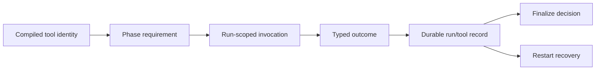

# R8/G7 — Cross-system owner 决策档案

> 固定基线：`main@699842eba2eefc242d19f8fa9232bc1d9d5c3bdd`。  
> 只读事实输入：`13-r7-04-schema-external-consumers.md`、`13-r7-09-tool-capability-chain.md`、`13-r7-10-gate-capability-handshake.md`、`13-r7-11-execution-definition-pin.md`、`13-r7-13-repository-authority-migration.md`、`13-r7-14-chain-declaration-fallback.md`；稳定锚点：AGGREGATE §2、D4、D5、D7、D9、D10、§4与§6的跨树能力及归属冲突。  
> 本档案不查源码、不做实验、不推荐、不裁决、不实现、不估算规模。所列形态仅为六份报告事实能够区分的形态，不宣称穷尽未来系统。

## A. 执行摘要（≤一页）

### A1. 为什么需要单独裁决owner

本RFC既生产跨系统合同，也消费外部能力，但当前证据呈现三种必须分开的状态：

1. **本仓明确缺口**：schema artifact、definition content/resolver、tool registry/outcome链、preset gate binding/handshake、typed chain boundary均没有生产闭环；repository与preset fallback还保留相互冲突的旧权威。
2. **已访问owner无实现**：已核验的coder-loop code/app、`github-hapi-agent-router`、`hapi`及本机code目录，没有发现相同identity与合同的schema consumer、definition consumer、tool enforcement、gate executor或typed chain producer。router/HAPI虽有相邻的Zod、delivery outcome、tool stream，但语义和identity不相接。
3. **未checkout或未定owner未知**：GUI repo/部署owner未定，hook runtime未实现，`hapi-remote-session`无本地checkout，工具树C6及若干外树能力只有文档登记。未知不能升级成“不存在”，也不能被当作已经会供给本仓所需合同。

四组边界必须分别闭合：

- **schema**：本仓应产出独立consumer可取得、可派生类型的合同；外部owner不能替本仓补回projector删除的语义。
- **definition**：本仓必须在实例创建时pin可恢复内容，并让所有消费者按ref解析；外部GUI/hook是否消费，不改变本仓scheduler/resume/restart责任。
- **tool/gate**：本仓负责声明、compiled identity与capability handshake边界；外部执行者若存在，仍须用同一run/tool/gate/host identity返回可恢复outcome/decision。
- **typed chain**：边界owner存在稳定冲突（AGGREGATE同时把它列为S8本树供给与C2外树供给）；外部owner未落地不能替代本仓清除repository双权威、default preset和多resolver。

### A2. 当前因果与确定影响

- projection instance不是schema；private ArkType boundary和`schemaVersion:1`不能证明artifact分发、producer版本或consumer兼容。
- definition row只有hash/ref壳，无content/path/manifest；同daemon H1稳定来自path cache偶然，restart旧实例读取H2。
- tool声明在第一个边界就不存在；doctor硬编码gh/runner PATH，runner/HAPI tool events没有coder-loop tool/run identity。
- gate carrier能持久化但不绑定placeholder、host或lifecycle，也不执行；有效声明可以永久inert且无`unsupported-capability`。
- repository列与metadata binding形成双权威；closure真实身份却依赖repoCwd/baseBranch/closure资源，不依赖repository字符串。
- chain/item preset resolver按入口分裂；省略preset仍seed默认，legacy item与restart会回退当前chain/default，外部producer即使出现也会遭遇不同socket/store/status语义。

### A3. 决策方法

本档案给出十二个逐项裁决/调查停点问题。每题可选择“保持未知/另查”，但必须注明停点：在什么事实出现前不确定owner、不拆实现边界、不把外部能力写成依赖。

纯口径选择只决定合同名称、责任描述和“已访问无实现/未知”的记录方式。一旦要求artifact发布、identity handshake、outcome/finalize、definition retention、migration或统一resolver，便是工程分叉。外部owner可以承担跨树能力，但不能替本仓稳定合同；本仓也不能猜测外部实现填补未知。

---

## B. 完整决策案

## B1. 稳定跨树合同与归属冲突

### B1.1 本树对外供给

| 能力 | 本树稳定份额 | 预期consumer |
|---|---|---|
| S1/S2 | 版本化compile projection与可派生schema artifact | GUI、hook metadata、外挂预校验 |
| S3 | gate声明与compiled gate全集 | hook/gate runtime |
| S4 | tool registry、requirements、可执法性compile检查、doc | tool enforcement runtime |
| S5 | typed bindings | GUI/prompt落盘 |
| S6/S7 | recursive tree、join candidate与definitionRef引用 | GUI、join runtime |
| S8 | chain metadata boundary parse/validation（接口假设） | chain semantics |

### B1.2 本树消费的外部能力

| 能力 | 外部稳定份额 | 本树接缝 |
|---|---|---|
| C1 | `GateDecisionPoint`封闭ADT | D5 host point引用 |
| C2 | typed chain declaration boundary | D9消费 |
| C3/C4/C5 | join演化、script join、par scheduling | D3/D10 runtime |
| C6 | tool outcome达成、run finalize enforcement | D4 runtime闭环 |
| C7 | runtime node关联compiled node identity | D10 |
| C9 | chain tree/chain-complete语义 | D9 |

### B1.3 已知归属冲突

AGGREGATE同时登记：

- S8：chain boundary由本RFC编译/校验面供给；
- C2：chain boundary全部由外部任务代数树供给，本域只消费；
- schema artifact的归属也有本树缺口与外挂共享合同之间的冲突。

这些是操作员必须裁决的责任边，不是让模型从“哪个repo目前有代码”反推。当前没有外部typed chain producer，不能以缺席自动判给本仓；同样不能以文档写了外树就免除本仓现有socket/store/resolver合同。

## B2. Owner证据分层

### B2.1 已访问owner与现状

| owner/系统 | 已核验事实 | 明确不是 |
|---|---|---|
| `mouriya-s-lab/coder-loop` code | projection instance、private boundary、hash/ref、hook carrier、CLI/socket/store入口 | schema artifact、definition resolver、tool/gate闭环、typed chain boundary |
| installed app | wrapper指向较旧app SHA，基线时无`preset`命令 | 稳定external compile producer |
| `github-hapi-agent-router` | 自有Zod config、GitHub delivery queue/outcome | coder-loop schema/tool/gate/definition/chain consumer |
| `hapi` | 自身tool discovery与tool-call stream | coder-loop requirement/run identity/finalize consumer |
| 本机其他code目录 | 未发现独立`chain.create` typed producer | 全系统不存在的证明 |
| target fixture repos | 使用operator CLI | compile/schema/definition contract consumer |

### B2.2 未定、未实现或未checkout

| 面 | 状态 | 必须保持的未知 |
|---|---|---|
| GUI | repo/owner/API未定，只有prototype/design | 技术栈、schema cache、failure UI、definition消费 |
| hook/gate runtime | execution model不存在 | executor owner、decision persistence、host protocol |
| `hapi-remote-session` | 本机无checkout | 真实API、schema/tool/chain关系 |
| C6工具树 | 只有能力/issue登记 | API、event/store、outcome identity、recovery |
| C2/C9任务代数方向 | 归属文字存在且互相冲突 | typed chain boundary producer及版本 |

### B2.3 本仓缺口不受owner未知影响

以下事实不依赖外部owner是否最终存在：

- projector当前删除或伪造类型证据；
-无schema artifact发布面；
-definition content与ref resolver不存在；
-scheduler/resume/restart读current path/cache；
-tool declaration/requirement在canonical model不存在；
-gate placeholder无binding/host/invocation/handshake；
-repository列与binding双权威；
-default preset与resolver分裂；
-new item虽有XOR admission，store/legacy仍允许null/null与both-set。

外部owner只能在明确接口上消费或供给，不能 retroactively 把这些本仓事实变成符合。

## B3. Schema producer/consumer边界

### B3.1 当前事实

现存两个相邻产物：

- code CLI输出某个preset的projection instance；
- private source内ArkType runtime boundary。

它们都不是独立consumer可取得并派生类型的schema。仓库不发布package，没有schema文件/CLI/generator/release artifact；installed app甚至缺compile命令。已访问外部owner没有consumer，未来owner未知。

schema与projection真实性还有独立要求：schema只能描述projector实际输出，不能恢复被删掉的path、fallback、required、owner、prompt/fragment bytes或真实ValueType。

### B3.2 事实支持形态

| 形态 | 确定后果 | 具体触点 | 未知 |
|---|---|---|---|
| 仅projection instance | consumer手写/猜shape | code CLI、installed producer | compat与独立派生失败 |
| consumer import private ArkType boundary | 与source commit耦合 | package/source访问 | 不满足零source import |
| 独立版本化schema artifact | 可形成派生合同类别 | generator、发布、discovery、version/cache | 载体与owner未定 |
| 未来API提供projection/schema | 可集中发现与版本 | GUI/ingress network面 | API/owner不存在 |
| typed bindings作为第二公共面 | 值与metadata可分开 | writer/reader/version/owner | 当前全不存在 |

这里“artifact由谁发布”与“projection包含什么真实语义”是两项决策。外部consumer不能负责修正本仓projection。

## B4. Immutable definition producer/consumer边界

### B4.1 当前事实

本仓可以在execution前计算完整compiled preset字段，也有：

- source hash；
- tagged `ExecutionDefinitionRef`；
- SQLite FK；
- compiled leaf→run/node attribution；
- run-start局部事务。

但实例创建不pin；definition row无content/path/manifest；production不产`ChainDefinitionRef`；行为consumer不按ref解析。同daemon缓存偶然冻结H1，restart重读H2。materialized目录与definition row无连接、会eager prune、marked corrupt不自愈。

外部GUI/hook是否未来读取definition，不改变本仓daemon/scheduler/status/resume必须沿ref同源的稳定责任。

### B4.2 事实支持形态

| 形态 | 确定后果 | 触点/未知 |
|---|---|---|
| 完整compiled preset内容 | 可恢复item执行语义 | 不自动包含chain tree/baseBranch/join |
| preset definition + 独立chain definition | 两tag各有创建事务/consumer | 当前只有preset hash producer，chain边界未定 |
| 规范projection + content payload | 可分公共shape与重渲染bytes | projection单独不足以重建prompt |
| 仅hash/ref（当前） | 只能归因，不能恢复行为 | mutable source/cache成为事实resolver |

artifact介质、发布owner、retention与GC仍需裁决；但“按ref解析、缺失hold、不current-source fallback”是本仓稳定合同，不能外包给GUI或hook。

## B5. Tool registry与外部enforcement边界

### B5.1 本仓声明份额

稳定D4把本仓份额钉为：

- `[[tools]]` registry；
- per-phase requirements；
- provider/availability/outcome/enforcement正交；
- required合法性在compile时由outcome判定；
- doctor与prompt doc消费同一表；
- compiled projection真实化。

runtime outcome达成/finalize归C6外树。但当前本仓连声明/canonical/projection都没有，doctor仍硬编码gh与runner PATH。因此不能把“外部C6未知”用作本仓D4缺口的解释。

### B5.2 外部闭环最低身份

要声称C6实存，至少需要同一条identity链：

已访问router的delivery outcome与HAPI tool stream均缺compiled declaration、coder-loop run/tool identity和finalize接缝；只是相邻资产。

### B5.3 事实支持形态

| 形态 | 确定后果 |
|---|---|
| 保持doctor固定gh/runner PATH | 原语继续；无phase/tool/outcome关联 |
| runner binary当tool registry | 只表达PATH；无法表达runner内工具/outcome |
| 利用runner/HAPI events外部执法 | 需要新增identity/finalize/recovery接缝；当前未实存 |
| 外树C6消费compiled declaration | 合同责任可分层；API/store尚未知 |
| prompt散文要求工具 | 不可判定、不可归因、不可恢复 |

外部owner调查的停点不能早于“发现真实API/event/store与identity链”；同名`tool`或`outcome`不够。

## B6. Gate declaration、host与executor边界

### B6.1 当前四层carrier

本仓有：

- 八个point字符串；
- global/chain/item script declarations；
- caller手传preset placeholder；
-按global→chain→preset→item拼接的effective view。

没有：

- typed preset gate declaration required/optional；
- placeholder→script resolver、precedence或ambiguity；
- point→host identity；
- lifecycle invocation；
- capability handshake与`unsupported-capability`；
- script failure/timeout decision；
- pending hold/retry/recovery state；
- compiled/status gate全集。

有效declaration可以被持久、恢复并永久不执行。carrier恢复不等于decision恢复。

### B6.2 Host/时序事实

| point类别 | host事实 | owner接缝 |
|---|---|---|
| startup/shutdown/tick | daemon或集合级，无单一task host | executor需明确集合身份 |
| pre-spawn | run identity在路径中段才创建 | 调用点决定可用identity |
| post-exit/status/chain-complete | 横跨多次状态写入 | gate decision需关联typed commit |
| container point | 当前无runtime-tree scheduler authority | `container.advance`与稳定`container.join`还不一致 |

### B6.3 事实支持形态

R7-10事实支持的边界形状是：

1. point词表存在但variant不完全对齐稳定D5；
2.不同point需要不同host payload；
3. pre-spawn字面量不能决定identity创建前后；
4. post-exit等没有原子commit接缝；
5. placeholder与declaration没有binding函数；
6. declaration presence不证明capability；
7. parse failure可达，missing/script/timeout失败不可达；
8. carrier可恢复，decision不可恢复；
9. status不是gate全集读面；
10. gate不能由tool、trigger或status admission替代。

外部executor若承担执行，仍必须消费本仓compiled gate identity并返回host-scoped decision；不能只接受script path或point string。

## B7. Typed chain boundary、repository与preset resolver

### B7.1 Owner冲突

当前没有外部typed chain producer。实存入口只有：

- coder-loop CLI flat config；
- daemon socket JSON；
- SQLite store input。

AGGREGATE却同时把typed boundary列为本树S8和外树C2。操作员必须决定谁定义schema、parse和version，谁只消费；在此之前不能让任何实现issue假设接口已存在。

### B7.2 Repository authority

当前repository：

- 是NOT NULL物理列和CLI/daemon forge-format admission；
- 被target lookup/status/fingerprint读取；
- 同时可被metadata同名binding静默覆盖prompt；
- 冲突/non-GitHub值可持久跨restart。

closure/worktree真实身份使用chain/item id/name、item.repoCwd、baseBranch及closure resource，不依赖repository字符串。baseBranch因此有引擎原生事实，repository列没有。

事实支持形态：

| 形态 | 确定后果 |
|---|---|
| binding单权威、一次迁除列 | column consumers同边界迁移；冲突需显式分类 |
| 过渡双写+一致性门 | 兼容旧consumer；双事实源持续更久 |
| 列作legacy cache、binding权威 | 定义重建/drop；status不得无条件读cache |
| repository完全退出chain业务模型 | target lookup需新选择键；prompt需显式business binding |
| 外部typed declaration先落地再迁移 | owner/schema成为前置；当前未知不能当既定 |

稳定P-D7-2已经要求repository变business binding且冲突响亮失败；外部owner不能替本仓处理现有SQLite、status和migration。

### B7.3 Preset fallback与chain definition

当前：

- new item public admission要求name/path XOR；
- store允许null/null和both-set；
- chain create省略preset会seed bundled default；
- daemon、socket status、target status、scheduler、migration各有不同resolver/default/early skip；
- legacy null item回退chain/default；
- mixed-preset chain-wide判定用first representative item；
- restart会重选current source，放大definition rebind。

事实支持形态：

| 形态 | 确定后果 |
|---|---|
| chain declaration带definition source/ref，item显式override | empty chain有source；mixed override/pin需定义 |
| chain无preset，全部从item派生 | empty chain不能跑preset chain-complete |
| legacy fallback仅迁移隔离态 | normal/migration必须可观察区分，不得静默rebind |
| 统一resolver service | 入口组合语义一致；不自动产生typed boundary/pin |
| versioned external declaration→单一domain ADT | CLI/socket/store共用parse结果；owner/artifact仍未知 |

typed chain owner、repository migration、preset-null语义和definition pin是相邻但不同的接缝，不能以一个“外部schema”统包。

## B8. 已访问无实现、未知与本仓缺口的判定规则

### B8.1 “已访问owner无实现”

只能在以下范围使用：

- 报告实际核验的repo/checkout/version；
- 精确identity与接口，而非同名词；
- 当时基线。

例如“HAPI有tool events”不改变“没有coder-loop run/tool identity”；“router有outcome”不改变“不是required-tool outcome”。

### B8.2 “未知”

以下情况保持未知：

- owner/repo未定；
-无本地checkout/API材料；
-只有issue/设计登记；
-未来能力的协议、版本、failure/recovery尚未实现。

未知不允许写成：

- 全系统不存在；
- 外部一定会供给；
- 可以暂时依赖某个猜测接口；
- 本仓无需完成自己的声明/identity/resolver合同。

### B8.3 “本仓缺口”

只要稳定合同的producer或本仓consumer明确归本仓，即使外部owner未知也可判本仓缺口。例如：

- schema projection语义与artifact producer；
-tool declaration/canonical/projection；
- gate preset declaration与unsupported handshake边界；
- definition creation pin和本仓resolver；
-repository列/default preset/多resolver退役。

## B9. 组合约束与不可等同事项

以下等同关系均不成立：

1. projection instance ≠ schema artifact；
2. private runtime boundary ≠ external derivable contract；
3. `schemaVersion` ≠ producer/version negotiation；
4. hash/ref/FK ≠ immutable definition content/resolver；
5. daemon cache稳定 ≠ definition pin；
6. runner/HAPI tool event ≠ compiled requirement outcome；
7. router delivery outcome ≠ tool finalize；
8. gate carrier/effective view ≠ binding/executor/capability；
9. point string ≠ host identity；
10. repository列 ≠ worktree resource identity；
11. external typed chain boundary未知 ≠ repository migration可等待不做；
12. new-item XOR ≠ legacy/store resolver统一；
13. 已访问owner无consumer ≠ 全系统无consumer；
14. issue登记某外树owner ≠ 对端能力已存在；
15. external owner负责runtime机制 ≠ 本仓可省略compiled declaration与identity。

## B10. 纯口径选择与工程分叉

### B10.1 纯口径选择

- “schema”只指可独立取得、可派生的artifact；
- “definition ref”与“definition content/resolver”分别命名；
- “tool outcome”“delivery outcome”“runner event”不混用；
- “gate declaration carrier”“resolved binding”“capability”“decision”分层命名；
- “repository business binding”“repoCwd resource identity”“baseBranch engine metadata”分开；
- owner状态统一写为“已访问无实现 / 未checkout或未定未知 / 本仓缺口”；
- S8/C2冲突在裁决前保持冲突，不擅自选边。

如果口径进一步声称可执行、durable、compatible或authoritative，就进入工程分叉。

### B10.2 工程分叉

- schema生成、发布、installed producer identity、consumer discovery/version/cache；
-definition content边界、创建transaction、resolver、retention/hold/migration；
- tool declaration/projector与C6 invocation/outcome/store/finalize/recovery协议；
- gate placeholder binding、host identity、invocation、decision persistence与handshake；
- typed chain schema owner、parse/version与socket/store等价；
-repository migration冲突、target选择、compat窗口；
- preset-null、legacy isolation、mixed-preset与empty-chain语义；
-外部owner的repo/API建立及E2E验证。

## B11. 调查停点

在以下停点之前，不得把未知能力写成已存在依赖：

| 能力 | 最低停点证据 |
|---|---|
| schema consumer | 真实owner读取artifact、派生类型、处理unknown version/shape |
| definition consumer | 以tagged ref取得内容并在missing/corrupt时hold，不回退current source |
| C6 tool enforcement | compiled tool identity→run invocation→typed outcome→durable finalize/recovery |
| gate executor | compiled gate+host identity→binding→capability→decision→restart恢复 |
| typed chain boundary | 明确owner/version/schema；CLI/socket/store消费同一parsed ADT |
| repository migration | 存量冲突分类、所有column consumers迁移、transaction/restart证据 |
| preset resolver | 全null/name/path/both组合统一，legacy与normal可观察区分 |

若调查无法达到停点，结论应保持“未知”，而不是选择最像的相邻系统。

## B12. 需要操作员逐项裁决的问题

每题均允许“保持未知/另查”，但需同时选择调查停点。

1. **Schema责任：** schema artifact的规范producer归本仓还是共享/外部发布面；无论归属如何，本仓projection真实性与版本identity由谁保证？（归属 + 工程分叉）
2. **首个schema consumer：** GUI、外挂、hook或其他owner中，谁作为首个独立消费证明；若owner未定，是否停在“不得选择载体/兼容政策”并另查？（owner/调查停点）
3. **Definition owner：** preset与chain definition content分别由谁创建、持久、解析和GC；本仓daemon/scheduler/status/resume是否明确为必须按ref消费？（归属 + 工程分叉）
4. **Definition外部消费：** GUI/hook需要完整definition、公共projection还是仅identity；在owner未知时，哪些字段保持未知而不阻塞本仓pin/resolver？（合同边界）
5. **Tool本仓/外树分界：** 是否确认本仓止于registry/requirements/compile legality/doc/projection，C6只承担run-scoped outcome/finalize/recovery；二者以何种identity握手？（跨树工程分叉）
6. **C6调查停点：** 是否先调查#545实际owner/API，最低要求看到哪条compiled tool→outcome→finalize链；若看不到，是否保持未知而禁止实现依赖？（调查裁决）
7. **Gate本仓/外树分界：** C1 point词表、preset gate declaration、host identity和`unsupported-capability`分别归谁；现存carrier是保留资产还是独立legacy层？（归属 + 工程分叉）
8. **Gate executor停点：** 未定hook/runtime owner在出现何种binding/capability/decision/recovery证据前保持未知；是否需要先裁决`container.join`与现存`container.advance`词表差异？（调查/口径）
9. **Typed chain boundary归属：** S8与C2冲突最终由本仓还是任务代数树定义schema/parse/version；另一方具体只消费什么？（归属裁决）
10. **Repository迁移：** external typed producer落地是否是迁移前置；若不是，列→binding的冲突、target选择和compat政策如何独立裁决？（工程分叉）
11. **Preset/empty-chain语义：** chain是否携definition ref并允许item override，还是行为完全从items派生；legacy fallback、mixed-preset与empty-chain分别如何处理？（工程分叉）
12. **未知治理：** GUI、`hapi-remote-session`、C6、hook executor中哪些现在另查，哪些保持未知；每项在达到B11停点前明确禁止哪些依赖或规格主张？（调查停点）

## B13. 裁决记录模板

| 问题 | 操作员裁决 | owner状态 | 调查停点/保持未知 | 不得误推 |
|---|---|---|---|---|
| Q1 Schema责任 | 待裁决 | — | — | instance不冒充schema |
| Q2 首个consumer | 待裁决 | — | — | owner未定不猜载体 |
| Q3 Definition owner | 待裁决 | — | — | ref不冒充content |
| Q4 Definition外部消费 | 待裁决 | — | — | 外部未知不阻塞本仓pin |
| Q5 Tool分界 | 待裁决 | — | — | HAPI event不冒充outcome |
| Q6 C6停点 | 待裁决 | — | — | issue登记不冒充API |
| Q7 Gate分界 | 待裁决 | — | — | carrier不冒充executor |
| Q8 Gate停点 | 待裁决 | — | — | point不冒充host |
| Q9 Chain boundary | 待裁决 | — | — | S8/C2冲突不擅自消解 |
| Q10 Repository | 待裁决 | — | — | 外部owner不代替migration |
| Q11 Preset/empty chain | 待裁决 | — | — | XOR不证明legacy统一 |
| Q12 未知治理 | 待裁决 | — | — | unknown不改写不存在 |

## B14. 证据索引

| 主题 | 只读事实来源 |
|---|---|
| schema producer、installed app、external owners、五种形态 | `13-r7-04-schema-external-consumers.md` A1–A3、B1–B10 |
| tool declaration/doctor/runtime缺口 | `13-r7-09-tool-capability-chain.md` A1–A3、B1–B5 |
| 外部C6核验、identity链与五种形态 | `13-r7-09-tool-capability-chain.md` B6–B11 |
| gate carrier、host、handshake与recovery | `13-r7-10-gate-capability-handshake.md` A、B2–B8 |
| gate十种事实形状与稳定映射 | `13-r7-10-gate-capability-handshake.md` B9–B11 |
| definition pin/resolver与外部owner | `13-r7-11-execution-definition-pin.md` A、B2–B8 |
| definition四种形态 | `13-r7-11-execution-definition-pin.md` B9–B10 |
| repository双权威、closure身份、migration | `13-r7-13-repository-authority-migration.md` A、B1–B9 |
| typed chain owner与repository五种形态 | `13-r7-13-repository-authority-migration.md` B10–B14 |
| preset resolver、empty/mixed/legacy/restart | `13-r7-14-chain-declaration-fallback.md` A、B2–B9 |
| external chain owner、五种形态 | `13-r7-14-chain-declaration-fallback.md` B10–B15 |
| 稳定跨树能力与冲突 | `AGGREGATE-547.md` §2、D4、D5、D7、D9、D10、§4、§6 |

## 尾部结论

**G7的核心不是为未知系统猜owner，而是同时守住三类事实：本仓已确认的合同缺口、已访问owner中没有相同identity闭环、未checkout或未定owner继续未知。Schema、definition、tool/gate和typed chain各有独立producer/consumer责任：外部owner可以承担明确的runtime或消费能力，但不能替本仓补写真实projection、creation pin/ref resolver、compiled declaration/handshake、repository migration和统一preset语义；本仓也不能把router/HAPI相邻词汇或issue登记冒充外部供给。十二项问题及调查停点裁决前，未知不升级为不存在，归属文字不升级为实现依赖。**
