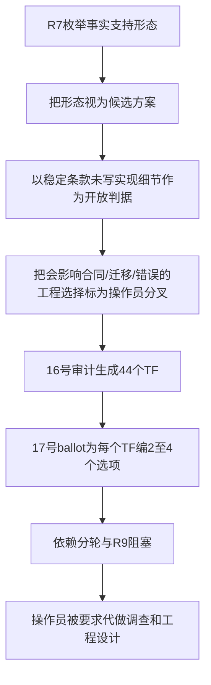
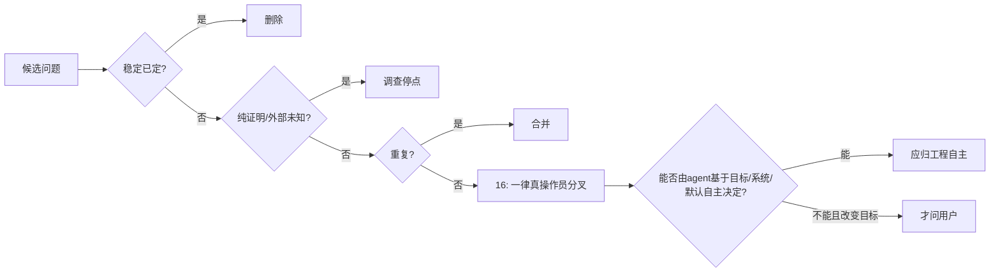

# RFC #547 — R8 把调查责任转交操作员的根因调查

> 固定基线：`main@699842eba2eefc242d19f8fa9232bc1d9d5c3bdd`。  
> 只读输入：`AGGREGATE-547.md`、`WORKFLOW.md`、`16-r8-decision-audit.md`、`17-r8-decision-ballot.md`。  
> 本报告调查 TF-01…TF-44 为何被错误包装为“真操作员分叉”，并给出恢复gate；不修改ballot/WORKFLOW，不查源码/实验，不裁决实现。

## A. 摘要（≤1页）

主agent把44项工程调查和实现归约责任转交给操作员，根因不在“题目太多”，而在 **R8问题资格判据错了**。`16-r8-decision-audit.md:B1`把“稳定条款未写死、且不同选择会改变合同/迁移/失败语义”定义为真操作员分叉；这个判据把三类本应由agent承担的工作一起升级了：

1. 稳定RFC已给出目标和约束后，agent仍需自主完成的工程设计；
2. 真实系统或外部owner尚未查明、应继续派subagent调查的事实缺口；
3. R7为解释现状而枚举的“事实支持形态”，被后续文档当成用户可选需求。

`16`虽然口头写了“稳定事项不重问、证明停点不进ballot、产物不生成需求”，却在B3/B12把所有剩余技术开放点命名为44个“真分叉”。`17`再为每项创造2–4个互斥选项和`X`，把候选形态、owner位置、数据结构、事务边界、cache key、错误投影、重试与migration机制变成操作员作业。第一轮六题中，TF-06、TF-16、TF-32都能从稳定要求、最小机制和现有边界自主收敛；TF-04/17含尚未调查完的owner冲突；只有TF-25是AGGREGATE逐字登记的产品语法待裁。把六题都称作“无前置、必须先答”直接违反默认自主执行。

逐TF复核结果：

- **A 已由稳定RFC/既有裁决/唯一合理默认决定：5项**（TF-01、06、10、33、43）。
- **E 产物自增长或工程实现形态，agent应自主收敛而不问用户：26项**。
- **I 必须先补真实事实调查，不能让用户替代调查：7项**（TF-14、20、31、35、37、39、42）。
- **U 确实是上下文无法取得、且会实质改变目标/owner的用户意图分叉：6项**（TF-02、04、07、09、17、25）。

六个U不是44题的残余“都要问”：其中TF-02、07、09、25是AGGREGATE明确写出的待裁决项；TF-04、17分别对应§6明确登记的schema artifact归属矛盾和chain metadata boundary归属矛盾。它们才满足“调查后仍有多个合理方向且取舍改变目标/owner”。其余38项不应呈现给操作员。

正确恢复不是立即改ballot或开始实现，而是：停止发题并道歉 → 将`16/17`的问题资格和`WORKFLOW` R8账本标为不可信 → 重新固定稳定问题清单 → 对A直接恢复既定结论 → 对I派subagent补事实 → 对E由agent按最小改动、现有架构和依赖自主收敛 → 只有仍剩的U才一次一个向操作员说明真实取舍 → 通过独立gate后再恢复R9。

**未映射TF=0。现有44题ballot不能继续作为用户输入队列。**

## B. 根因与逐项审计

### B1. 规则锚点

#### B1.1 需求权威

`WORKFLOW.md:6`规定事实源是稳定RFC、操作员裁决、v3权威记录和真实系统；`WORKFLOW.md:79`明确“调查可以扩展，但不能据此新增需求”。这意味着：

- R7/R8产物只能组织证据，不能因为发现技术形态就生成新的用户需求；
- 实现细节没有被稳定条款逐字规定，不等于出现用户意图歧义；
- 评审/审计发现反例，只能证明某主张守不住；不能自动要求新机制。

#### B1.2 默认自主执行

当前治理规则要求：答案能从上下文、工具、项目惯例或低成本默认取得时直接做；只有调查后仍有多个合理选项、且会实质改变结果，或信息无法取得且猜错会显著返工时才问。

映射到本RFC：

- “表放哪、事务怎么切、cache key是什么、错误ADT怎么投影”通常是工程归约，不是用户目标；
- “外部owner/API现在是什么”是调查题，不是偏好题；
- “TOML采用哪种公开语法”“明确归哪个项目owner”才可能是用户意图题。

#### B1.3 主张弱化与范围约束

稳定主张守不住时，应把主张弱化到需求实际需要的强度；只有需求明确要求强保证，才新增机制。`16/17`反向操作：它们把每个无法从现状直接实现的强主张拆成多个机制选项，让用户选择用何种机制守住，导致范围由产物自身生长。

#### B1.4 WORKFLOW内部张力

`WORKFLOW.md:277-292`要求R8档案列事实支持形态并逐项呈现操作员；但这段必须受`WORKFLOW.md:79`“不能新增需求”和默认自主执行约束。`16`把“逐项呈现”解释为“所有非稳定写死的工程点都需用户裁决”，是规则解释错误，而非用户真的要求44项设计审查。

### B2. 根因链

根因分层：

1. **资格判据错误**：`16:31`把“会改变合同/迁移/失败语义”当作用户分叉的充分条件，缺少“是否真实意图歧义、能否由agent自主取得”的必要条件。
2. **事实形态升格**：R7/R8中的非完备形态原本用于说明后果，`17`把它们编码为A/B/C选项；产物从证据变成需求生产者。
3. **工程责任外包**：字段闭集、identity、transaction、resolver、cache、recovery、migration、错误投影等被当成用户偏好，而不是agent依据稳定约束完成的工程工作。
4. **调查责任外包**：owner/API/存量/外部consumer未知虽列STOP，相关TF仍保留在ballot，允许用户在事实未明时“选”。
5. **稳定主张弱化**：已经固定的单一权威、完整pin、无fallback、runtime authority、D4/D5边界被重新包装为形态选择，或被拆成机制投票。
6. **依赖图自我强化**：`17`用TF依赖产生五轮顺序，再由`WORKFLOW.md:409-413`把R9标记为等待六题；文档生成的依赖被误当真实目标依赖。
7. **缺少最终“不问”gate**：`16`做了稳定/证明/重复审计，却没有最后逐TF问“主agent能否用稳定要求+真实系统+最小合理默认自行决定”。

### B3. 同根因的其他位置

| 位置 | 同根因表现 | 后果 |
|---|---|---|
| `16:B3/B12` | 44个技术主题全部命名“真分叉” | 工程细节获得与产品意图同等地位 |
| `16:B15.1` | “只询问TF-01…44” | 防扩张规则反而固化了错误集合 |
| `17:A` | 宣称44项都需操作员分五轮回答 | 用户承担系统设计委员会职责 |
| `17:R1 TF-06` | source authority已固定，仍让用户选expectation形态 | 稳定要求被弱化成偏好 |
| `17:R1 TF-16` | 完整pre-run定义可由consumer inventory计算，仍让用户选字段包 | 调查/归约责任外包 |
| `17:R1 TF-32` | D4四轴与outcome已定，仍让用户选identity scheme | 工程identity设计外包 |
| `17:R4` | file/cache/transaction/recovery逐项投票 | 实现机制选择被当需求 |
| `17:R5` | 外部C6/gate证据未到仍保留最终产品票 | 调查未知与意图选择混合 |
| `WORKFLOW:409-413` | ledger写成“先缺六题，R9不得继续” | 错误ballot成为流程硬依赖 |

### B4. 分类定义

| 类别 | 含义 | 正确动作 |
|---|---|---|
| A — 已决定 | 稳定RFC、已有操作员裁决或唯一低成本默认已经给答案 | 不问；恢复既定约束 |
| E — 工程自主 | 目标已定，只剩实现结构、内部API、事务、identity、迁移技术或错误投影 | 主agent/subagent自主设计并以最小改动验证 |
| I — 先调查 | 缺真实owner/API/存量/runtime证据，当前不能可靠决定 | 派subagent补事实；禁止让用户猜 |
| U — 用户意图 | 上下文无法取得，多个合理方向会改变公开语义、scope或owner | 调查穷尽后一次一个询问 |

分类是恢复路由，不是实现裁决。

### B5. TF-01…TF-44逐项映射

| TF | 分类 | 为什么不应/应问用户 | 正确路由 |
|---|---|---|---|
| TF-01 Finding authority/rejected warnings | **A** | D1已定义`CompileResult=compiled(model,warnings)\|rejected(non-empty diagnostics)`；ballot重新发明validation authority/stage集合 | 恢复稳定ADT，不问 |
| TF-02 Doctor健康时间面 | **U** | AGGREGATE P-D1-2逐字登记“doctor是否吸收compile findings”为待裁；会改变operator产品面 | 只问doctor与findings关系，不让用户设计cache/history |
| TF-03 Finding identity/replay/durability | **E** | 是实现规范finding authority的identity与持久化设计 | 由TF-01/02约束后自主收敛 |
| TF-04 Schema producer/consumer责任 | **U** | §6-5明确存在本树与共享/外部归属矛盾；owner改变交付scope | 在已知owner事实后只问归属，不问artifact内部实现 |
| TF-05 公共合同面数量 | **E** | D1/D2已分别要求schema、projection、typed values；如何组织ref/面是架构归约 | 自主最小化公共面 |
| TF-06 Source/use-site expectation | **A** | D2已定source唯一权威，expectation若存在只做兼容检查；无真实需求时唯一合理默认是不新增第二解释层 | 不问；按YAGNI保持最小 |
| TF-07 ValueType首批闭集 | **U** | AGGREGATE D2明确列为待裁，公开类型语言范围会改变目标合同 | 只呈真实值域支持的最小集分叉 |
| TF-08 Missing/null/required/default | **E** | D2已给required/default、禁止空串和最早阶段；null随TF-07类型闭集推导 | 自主建立ADT与阶段语义 |
| TF-09 Prompt projection | **U** | AGGREGATE明确登记JSON默认呈现fenced vs inline；是用户可见文本合同 | 只问默认呈现，不让用户设计error字段 |
| TF-10 Agent-owned result | **A** | P-D2-6/7已定`exit.*`同一类型流、agent-owned、不可覆盖外部值 | 恢复已定owner/边界；对象实现自主 |
| TF-11 Admission boundary | **E** | D2已定compile/chain create/item add/spawn时点；daemon/store组织是实现 | 自主按最早可决定边界实现 |
| TF-12 Update合法性 | **E** | 非法持久态不可表示已定；patch/replace/domain operation是API实现选择 | 依据现有API与最小breaking自主收敛 |
| TF-13 Batch/旁路refinement | **E** | batch不得部分写非法对象由不变量推出；事务位置/unsafe migration是实现 | 自主设计事务和显式migration边界 |
| TF-14 Binding存量migration | **I** | 没有存量分布/历史definition事实，先选隔离/normalize会猜数据 | 派subagent盘点后自主形成最小迁移 |
| TF-15 Preflight/retry/副作用 | **E** | 验证阶段和deterministic failure原则已定；错误落点/回滚为工程 | 自主按副作用最小化收敛 |
| TF-16 PresetDefinition闭集 | **E** | P-D10-1要求全部创建前可计算执行定义；R7已有consumer/字段全集，可机械求闭包 | 由consumer闭包推导，不问字段套餐 |
| TF-17 ChainDefinition闭集/owner | **U** | §6-3记录S8/C2归属方向相反；owner改变本树/外树scope | 先分离“字段闭包可推导”与“boundary归属需问” |
| TF-18 Pin/create事务 | **E** | P-D10-2已定创建成功前pin；事务/orphan是实现 | 自主形成原子create边界 |
| TF-19 Current/instance读面 | **E** | D10已定两问题答案不同且全consumer沿ref；命令命名/投影是实现 | 自主保持清晰双读面 |
| TF-20 历史instance migration | **I** | 缺历史实例数量、可恢复内容与使用状态 | 先盘点，不让用户猜处置比例 |
| TF-21 Artifact publish/snapshot/integrity | **E** | compile成功后才可消费、同源确定性和损坏显错已定；事务形态是工程 | 自主选择满足原子发布的最小机制 |
| TF-22 Publish/retire/concurrency | **E** | active definition不得丢失由D10推出；retention/locking是工程 | 根据ref reachability与并发事实设计 |
| TF-23 Process cache | **E** | cache不得成为instance authority；key/lifetime/invalidation是性能与一致性实现 | 自主设计，不能让用户选cache |
| TF-24 Definition content/resolver/error | **E** | 完整pre-run闭集、全consumer同ref、missing hold/error均已定；载体/状态投影是工程 | 依约束自主归约 |
| TF-25 Recursive DSL语法 | **U** | AGGREGATE D3明确登记nested inline vs referenced node table待裁；公开DSL会实质改变用户输入 | 只问语法形态；compat migration自主设计 |
| TF-26 Node identity | **E** | D3已定显式stable id、move路径变化identity不变；scope/error分类是工程 | 自主建模 |
| TF-27 Runtime constructor | **E** | compiled tree实例化为runtime是稳定目标；时点/事务由create与pin依赖推导 | 自主设计 |
| TF-28 Scheduler authority迁移 | **E** | P-D3-9已定committed transition/readiness权威；旧字段角色是迁移工程 | 自主过渡，不重问authority |
| TF-29 Transition commit | **E** | D3已定唯一business completion signal及必需payload类别；存储/关联是工程 | 自主建立typed commit |
| TF-30 Recovery/dedupe | **E** | 一旦commit权威确定，replay/retry/hold按事实与幂等边界推导；不是用户偏好 | 自主设计并补fault tests |
| TF-31 Par/reopen/guard | **I** | par scheduler/真实路径尚未存在或未验证；现阶段问资源接缝会让产物超前生长 | 先调查/等外树能力，稳定guard照做 |
| TF-32 Tool identity/provider/outcome scope | **E** | D4四轴、provider无关判据和首波`entry-existence`已定；identity scheme是工程 | 自主定义最小稳定identity |
| TF-33 Expected/required finalize | **A** | D4已定required需确定outcome、无outcome至多expected、provider无关 | 恢复既定判据；迟到/重复处理自主 |
| TF-34 Registry/doctor/prompt | **E** | P-D4-1/4/5已定同表三consumer与doctor声明驱动；shape/adapter是工程 | 自主实现合同 |
| TF-35 C6闭环 | **I** | 外部owner/API未访问，现有HAPI event不构成链 | 派subagent取得owner/API；不让用户选择虚构transport |
| TF-36 Gate point/host/pre-spawn | **E** | D5已定四类point与stable host identity；精确payload/时点需结合runtime设计 | 与TF-29依赖自主归约 |
| TF-37 Optional/binding resolution | **I** | 外部gate owner和真实binding/executor合同未知，现有carrier不足以决定precedence | 先调查owner/API，再按最小规则设计 |
| TF-38 Capability handshake | **E** | P-D5-3已定compile preview允许、instantiate/schedule unsupported拒绝 | advertisement/version/error为工程 |
| TF-39 Gate executor/recovery | **I** | executor owner、decision API、recovery事实不存在/未访问 | 先调查外树，不能让用户设计未知系统 |
| TF-40 De-GitHub发布/兼容 | **E** | D7已定clean removal；checkpoint、compat窗口、历史migration豁免是发布工程 | 依据调用者/迁移事实自主制定 |
| TF-41 Repository authority/selector | **E** | D7已定repository为business binding、物理列退役；selector可由既有chain identity最小替代 | 自主遵循单一权威，不问用户挑内部selector |
| TF-42 Repository conflict migration | **I** | 缺真实DB冲突/null/非GitHub分布；resource不变量虽已知但处置需数据 | 先盘点真实数据再自主迁移 |
| TF-43 Chain null/fallback/mixed | **A** | D9已定无默认preset、新item显式per-item、无item chain判定来自chain metadata、legacy不隐式rebind | 恢复稳定语义；migration细节另调查 |
| TF-44 清零gate scope | **E** | D7只清engine原语、合法preset业务字段保留；ownership allowlist/AST gate是工程 | 自主构建窄审计gate |

映射核算：44/44，未映射0。

### B6. 分类计数

| 分类 | TF | 数量 |
|---|---|---:|
| A 已决定 | 01、06、10、33、43 | **5** |
| E 工程自主 | 03、05、08、11、12、13、15、16、18、19、21、22、23、24、26、27、28、29、30、32、34、36、38、40、41、44 | **26** |
| I 先调查 | 14、20、31、35、37、39、42 | **7** |
| U 用户意图 | 02、04、07、09、17、25 | **6** |
| 合计 | TF-01…44 | **44** |

### B7. 六个真实用户意图分叉的最小边界

| TF | 为什么只有它需要用户 | 必须先剥离的工程/调查内容 |
|---|---|---|
| TF-02 | P-D1-2明确问doctor是否吸收compile findings | cache、history、event durability由agent设计 |
| TF-04 | schema artifact归本树还是共享/外部存在权威记录矛盾 | 首consumer先调查；artifact格式由owner后自主设计 |
| TF-07 | ValueType首批结构variant最小集被明确登记待裁 | 只提供真实值域支持的最小集合，不编空variant |
| TF-09 | JSON默认呈现形态是明确用户可见合同待裁 | typed error字段、renderer结构由agent设计 |
| TF-17 | chain metadata boundary归本RFC还是外树#705存在直接归属冲突 | 字段闭包可从稳定语义推导，不与owner一起问 |
| TF-25 | recursive TOML nested inline vs referenced table被明确登记待裁 | linear migration、projection version由agent设计 |

即使这六项也应一次只问一个真实分叉，并在问题中说明现有权威冲突；不能把整份ballot交给用户。

### B8. `16`为何没能阻止44题

`16`做对了三件事：识别稳定项、识别STOP、合并重复。但最后仍失败，因为它的过滤顺序缺一层：

缺失的最后gate使“不是稳定句子的所有技术决定”都落入操作员队列。`16:B15`虽写“不让产物生成需求”，但没有对TF逐项执行需求追溯；B12题干本身已经把内部机制提升成需求。形式上的未映射0掩盖了问题资格整体错误。

### B9. 正确恢复动作顺序

以下只规定流程恢复，不给实现方案：

1. **停止继续呈现ballot**：当前44题队列不得再要求操作员作答。
2. **诚恳道歉并承认责任错位**：说明主agent把工程与调查责任外包给用户，而不是把问题归因于文档复杂。
3. **冻结不可信产物的决策资格**：保留`16/17`作根因证据，但其“真分叉”和依赖轮次不得驱动R9。
4. **恢复三个需求锚点**：稳定问题清单、真实系统现状、既定信任/范围假设；不以TF/ballot自身为需求源。
5. **先处理A类**：直接恢复稳定结论，删除伪问题，不向用户确认。
6. **再处理I类**：按主/subagent边界派独立事实调查；owner/API/存量/运行证明由agent取得。
7. **自主收敛E类**：用稳定要求、现有架构、最小改动、类型约束和依赖关系选取唯一合理工程形态；若主张过强，弱化主张而非新增机制。
8. **重新审计剩余歧义**：只有调查后仍有多个合理方向、且取舍改变公开语义/scope/owner，才能保留U。
9. **一次一个询问U类**：只呈真实意图差异，不附带cache/transaction/identity等工程作业。
10. **独立恢复gate**：确认没有A/E/I重新混入用户问题、没有产物自生需求、未映射0后，才更新R8账本并决定R9是否可继续。

### B10. 恢复gate

R8恢复前必须全部满足：

- [ ] 44题ballot不再作为待办队列；
- [ ] 每个待用户问题能引用AGGREGATE明确待裁或明确owner冲突；
- [ ] 每个工程问题能追溯到稳定需求，但不要求用户选择机制；
- [ ] 每个未知有具体subagent调查对象、证据门槛和停止条件；
- [ ] 没有因“当前实现守不住”而提升保证或新增机制；
- [ ] 没有因“多个技术形态都可行”就认定用户意图不明；
- [ ] U类每次只问一个、答案会实质改变目标；
- [ ] R9前置来自稳定条款和真实依赖，不来自ballot轮次自身；
- [ ] 独立审计确认TF-01…44映射0遗漏，且A/E/I/U路由无责任外包。

## 尾结论

`16-r8-decision-audit.md`没有真正完成“真裁决”审计：它只剥离了显式稳定句、证明停点和重复，却把剩余所有会影响合同/迁移/错误的技术开放点一律升级为操作员分叉，遗漏了“agent能否根据稳定目标、真实系统、依赖和最小合理默认自主决定”这一最终gate。`17`随后把R7非完备事实形态编成44题选项，并用自生成依赖阻塞R9，造成调查与工程责任外包。逐TF重审后，5项已决定、26项应由agent自主工程收敛、7项必须先调查，只有6项属于真实用户意图分叉；44/44映射、未映射0。恢复必须先停止ballot、恢复需求权威、完成调查与自主归约，最后才一次一个询问仍存在的真实意图分叉。
