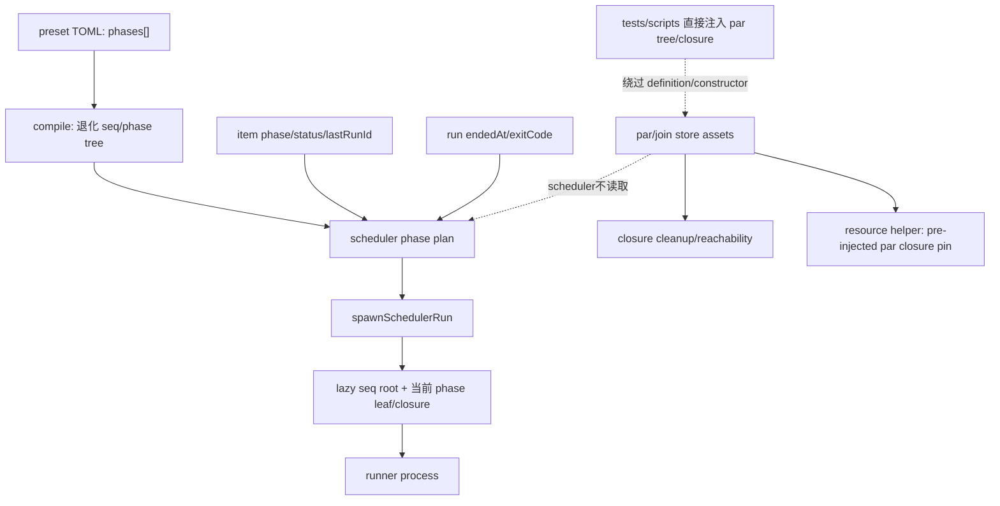

# R8/I-31 — `par` runtime readiness 与最早拒绝边界

> 固定基线：`main@699842eba2eefc242d19f8fa9232bc1d9d5c3bdd`。前置事实：`13-r7-07-compiled-tree-model.md`、`13-r7-08-runtime-transition-commit.md`。  
> 范围：只读 source/test/相邻仓；不修改产品、测试、WORKFLOW、DB，不创建 worktree，不运行 engine integration。

## A. 主 agent 摘要（≤1页）

**结论：当前 production 不具备 non-degenerate `par` readiness。** 定义入口只有线性 `phases[]`；`buildCompiledTaskTree`只生成退化 `seq → phase`；`[tasks]`会被静默忽略。production 没有调用 `createTaskTree(...)` 的 recursive constructor，scheduler仍由 `preset.phases`、item phase/status/lastRunId及run exit推进，不读取par state、join evaluation、reopen count/budget或candidate。因而不存在“声明→constructor→调度”的production par路径，也没有会触发的compile/runtime unsupported guard。

已有资产必须与readiness分开：

- **已实现、production可达但不负责par调度**：strict leaf/seq/par ADT与SQLite约束/round-trip；closure cleanup按open-par结构保留后代；资源helper能为**已经注入**且带`sourceParNodeId`的closure使用持久base commit。
- **fixture/script-only producer**：tests、scheduler harness、`scripts/issue-558-integration.ts`、`scripts/issue-560-integration.ts`直接调用store API注入par/tree/closure；`addClosureReachabilityFact`也仅由测试调用。它们绕过定义与production constructor，不能证明readiness。
- **production缺失**：per-par concurrency字段与consumer；reopen budget resolver/enforcement及count transition；join evaluator/consumer；candidate选择；par pin从定义传播到成员；next-epoch producer；scheduler对上述事实的读取。
- **外部未知**：对相邻仓 `coder-loop-v1`、`coder-loop-e2e-fixture`、`github-hapi-agent-router`、`hapi`、`moat`、`moat-lifecycle-daemon`、`moat-rpc-executor` 的精确符号扫描未命中实现（证据：`/tmp/rfc547-i31-adjacent.txt`）；未访问的外部task-algebra owner仍未知，不能写成“不存在”。



**最早guard点。** 今天没有recursive declaration可拒绝；引入typed recursive definition后，chain-level par只能在typed `ChainDefinition`形成后判断，item-specific instance最早在item admission且已解析其选定definition后判断。对legacy或绕过入口写入的runtime rows仍须scheduler backstop。当前共享production中最早可靠位置是`spawnSchedulerRun`加载**具体item preset之后**、调用`worktreeManager(...)`、写run/current-run或spawn进程之前（`src/scheduler.ts:1520-1660`）。更早的`resolvePhasePlanForChainWithItems`不够：它使用代表item，mixed-preset chain存在，显式phase override还能绕过正常plan构造。P-D3-6要求具名unsupported error；禁止静默线性降级。

**参数证据。** `pinCommit`、reopen `{count,budgetRef}`、drain/validator join及evaluation是真实存储形状（`src/task-runtime.ts:3-58,127-175`; `src/sqlite-state.ts:2397-2400,2503-2527`），但只有pin存在局部下游行为：`persistedParPin`读取closure的`baseCommit`，前提是`sourceParNodeId !== null`，并不读取parent par row的`pin_commit`。production lazy leaf的`sourceParNodeId=null`，所以这不是定义到成员的pin传播。`budgetRef`仍是opaque字符串，无resolver/range/enforcement；join/evaluation有reader无production evaluator；没有concurrency参数或consumer。

**实验与同错边界。** 只运行：

```sh
bun test tests/unit/runtime/closure-lifecycle.test.ts \
  tests/unit/runtime/task-runtime.test.ts \
  > /tmp/rfc547-i31-runtime-tests.log 2>&1
```

结果为11 pass、0 fail、34 assertions。它证明strict ADT、closure reachability、resource identity与pure persisted-pin helper；其中通过的`open append and next-epoch candidates are explicit seeds without producer APIs`反而钉住fixture/storage-only边界。未运行会创建worktree的integration/E2E；因此production par spawn、并发上限、join、reopen、crash recovery均仍是proof gap。

## B. 证据、消费者与TF约束

### B1. Production reachability与消费者

| 面 | 实然与证据 | 分类 |
|---|---|---|
| definition | TOML仅`phases[]`；无tasks/par/join/candidate/reopen/concurrency/budget声明；unknown `[tasks]`静默丢弃（R7-07 B2/B9） | production不支持 |
| compile | `buildCompiledTaskTree`只派生退化树（`src/loop.ts:780-787,864-874,4683-4695`） | implemented-linear |
| constructor | `src/`无`createTaskTree` caller；run-start懒建seq root+当前leaf（`src/sqlite-state.ts:1974+`; R7-08 B1） | implemented-linear |
| scheduler | tick/plan/selection只读phase/item/run（`src/scheduler.ts:492-713`） | implemented-linear |
| par/join store | strict ADT、SQL insert/readback、FK/check/round-trip（`src/sqlite-state.ts:2397-2400,2503-2527`） | implemented-store |
| par producer | task-tree tests、integration harness、issue-558/560 scripts直接注入 | fixture/script-only |
| join/reopen/candidate | readers/seed存在；无production mutation/evaluator/selection | proof gap |
| closure reachability | open-par descendants由cleanup consumer保留（`src/closure-lifecycle.ts`） | production asset，非scheduler |
| resource pin | pre-injected par-member closure可复用base commit | production asset，非传播证明 |

`listJoinBindings`/`listJoinEvaluations`没有store外production caller；`addClosureReachabilityFact`没有production caller。`createTaskTree`调用只在tests/scripts。故store round-trip、issue-560直接seed后的资源行为及cleanup结构理解，均不能连成definition→constructor→scheduler→resource链。

### B2. 对E-class TF-27–31的约束

- **TF-27 constructor timing/transaction**：仍是工程选择；事实已排除把当前lazy leaf append或公开`createTaskTree` API称作recursive constructor。
- **TF-28 scheduler authority**：稳定设计已要求runtime readiness为权威，不是待选产品方向；当前phase-array只能作为migration/audit compatibility，不能继续充当par推进权威。
- **TF-29 transition commit**：par字段没有带来现成commit机制；单个store transaction不回答跨item/tree/resource/effect的transition commit。
- **TF-30 recovery**：现有cleanup/reachability不是transition replay或side-effect dedupe；真实crash证据仍是独立proof gap。
- **TF-31**：稳定设计已经固定per-par concurrency/reopen为声明参数，pin/seq/cleanup为engine-native；不得重新开放为产品选项。剩余是证据与工程工作：实现真实consumer、加入unsupported guard，并证明definition→constructor→scheduler→resource→recovery整链。proof gap不是产品选项。

**尾结论：现有par能力止于可持久化、可由fixture注入且部分资源/清理代码可理解的结构；production没有声明到调度的可达链。最早可靠backstop必须位于具体item definition加载后、任何资源与run副作用前，且以具名unsupported error拒绝，不能顺序降级。**
