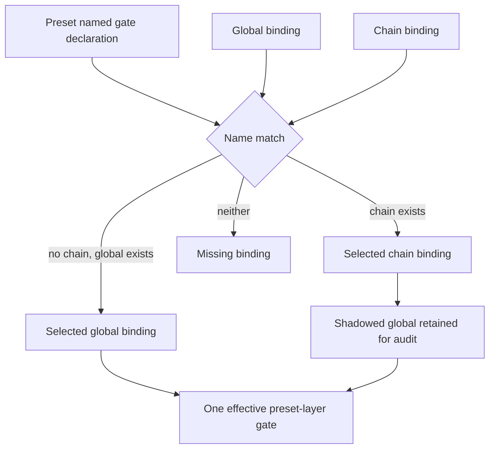

# RFC #547 R8 恢复调查 I-37：gate optional 与 binding resolution 合同

> 固定基线：`main@699842eba2eefc242d19f8fa9232bc1d9d5c3bdd`。  
> 调查边界：只读AGGREGATE、R7报告、当前源码、已完整落盘的issue对象、已checkout/installed owner与production carrier计数；未修改repo/服务/WORKFLOW，未执行生产hook。  
> 问题：查明global/chain/item与preset named gate的真实producer、名字/override/precedence、required/optional、missing binding、script failure以及consumer/recovery合同，消除TF-37中不应再由操作员猜的未知。

## A. 主 agent 摘要（≤1页）

### A1. 结论：TF-37的precedence与missing语义已由真实owner合同决定

可识别owner不是未知外部系统，而是同一repo的RFC-4 gate树：umbrella [#543](https://github.com/mouriya-s-lab/coder-loop/issues/543)、binding owner [#713](https://github.com/mouriya-s-lab/coder-loop/issues/713)、preset declaration owner [#740](https://github.com/mouriya-s-lab/coder-loop/issues/740)、shared evaluator owner [#712](https://github.com/mouriya-s-lab/coder-loop/issues/712)。四份issue均有本地完整body；#712/#713/#740目前open，合同已写清但未实现。

它们已经给出唯一可用的binding合同：

1. preset只声明`name + required|optional + GateDecisionPoint/host`，不含本机script路径。
2. named binding只由**global与chain**层提供；item层不是named binding producer。
3. 同名binding采用配置覆盖：**chain覆盖global**；只执行一个selected script，不把global+chain两份都跑。
4. 生效视图同时投影selected binding与shadowed source以供审计。
5. optional未绑定：空过并发skip事件；required未绑定：新实例创建结构化拒绝，既有pinned实例恢复时显式hold。
6. binding已解析后与普通gate走同一executor、`onFailure`、decision合成与recovery路径；required/optional不重新解释script crash/timeout。

因此TF-37原ballot中“item>chain>global”“跨层重名即ambiguity”“每gate自选层级”等候选已被owner合同排除。**无需再让操作员选择precedence。** 可直接收敛为：named binding resolution = chain-over-global；item不参与；selected+shadowed可观察；missing三态穷尽。

### A2. 当前实现与合同的距离

main只有carrier：

- direct hook declaration含`kind/point/script/timeoutMs/onFailure`，没有name。
- preset placeholder只有`name/point`，没有required/optional、host identity或binding ref。
- effective view只是global→chain→preset→item数组拼接；这个顺序是普通direct hooks的执行/展示顺序，不是named binding precedence。
- 没有resolver、selected/shadowed result、missing-binding error、executor、decision或recovery state。
- `effectiveHookViewForItem`在production源码中只有定义，没有scheduler/daemon lifecycle consumer；调用者仅测试。
- installed app版本没有这些exact carrier symbols；当前production DB也没有global/chain/item hooks实例。

### A3. 两种必须分开的多层语义

| 模型 | 多层规则 | 结果 |
|---|---|---|
| direct global/chain/item hooks | additive，按global→chain→preset→item执行 | 同一点多hook全部参与，decision AND合成 |
| preset named gate binding | global/chain是候选供给，chain shadow global | preset层只执行一个selected script |

把array concat顺序解释为named binding precedence会把两种模型混在一起；把同名global与chain都执行又会违反#713。

### A4. 仍须等待TF-39的事项

真实executor尚不存在，所以script spawn、timeout、stdout parse、decision journal、hold/retry、restart dedupe与敏感script投影仍必须等待TF-39/#712。现有合同已经足够固定**解析与missing语义**，但不能冒充执行闭环已存在。

---

## B. 完整调查

## B1. Owner定位与证据等级

| Owner/对象 | 状态 | 拥有的合同 | 实现状态 |
|---|---|---|---|
| [#543](https://github.com/mouriya-s-lab/coder-loop/issues/543) RFC-4 umbrella | open | 四层、执行顺序、AND合成、onFailure、operator script | carrier child已部分落地；完整RFC未闭环 |
| [#740](https://github.com/mouriya-s-lab/coder-loop/issues/740) preset gate declaration | open | name、required/optional、point+host、重名/位置校验、projection | 未在main实现 |
| [#713](https://github.com/mouriya-s-lab/coder-loop/issues/713) named binding owner | open | global/chain producer、chain override、三态missing、selected/shadowed | 未在main实现 |
| [#712](https://github.com/mouriya-s-lab/coder-loop/issues/712) evaluator/journal | open | script decision、onFailure、AND、epoch、recovery | 未在main实现 |
| main carrier（#586成果） | merged/current code | direct declaration、四层carrier、concat view | 存在但inert |
| app/coder-loop installed runtime | older | 无exact current carrier symbols | 不是binding consumer |
| github-hapi-agent-router | checkout存在 | 自有GitHub→HAPI链 | 无coder-loop gate identity |
| hapi/hapi-fork/deployed checkout | checkout存在 | 相邻session/tool能力 | 仅测试路径提coder-loop，无gate identity |

R7-04已确认GUI/hook外部owner未形成schema consumer；R7-10确认external executor未知。I-37新增的重要事实不是找到外部实现，而是**本仓已落盘owner issue明确规定了binding规则**，所以precedence不再是外部未知。

## B2. 穷尽搜索范围与命中

只读搜索范围：

- `/Users/mouriya/Ext/code/coder-loop`及现存`coder-loop-worktrees/*`；
- `/Users/mouriya/Ext/app/coder-loop`；
- `/Users/mouriya/Ext/code/github-hapi-agent-router`；
- `/Users/mouriya/Ext/code/hapi`、`hapi-fork`、`hapi-deployed-investigate`；
- `/Users/mouriya/Ext/code`其他checkout与`~/.agents`/`~/.claude` installed surfaces，用exact coder-loop gate symbols筛选。

搜索exact identity：`GateDecisionPoint`、`named-gate-placeholder`、`effectiveHookViewForItem`、`buildEffectiveHookView`、`gate_held`、selected/shadowed binding等。

结果：

1. exact coder-loop carrier只在code repo及其副本/worktrees出现；没有独立owner实现resolver/executor。
2. Codex、Claude Code、OpenHands等有自己的hook机制，但没有coder-loop definition/gate/host identity，不是本合同consumer。
3. router无命中；HAPI仅测试fixture提到coder-loop路径，无gate API或binding。
4. worktree副本与main为同一carrier形态；未发现比main更完整的named resolver实现。

远端源码无需另clone：所有可识别owner均已有本地checkout或完整issue payload；未知owner没有可验证repo identity，不能猜仓库再clone。

## B3. 当前声明层与producer

### B3.1 Direct hook carrier

| 层 | producer/载体 | schema | restart | 当前production population |
|---|---|---|---|---:|
| global | `<loop-data>/hooks.json` | `{version:1,hooks: HookDeclaration[]}` | daemon startup重载 | 文件不存在，0 |
| chain | `chain.metadata.hooks` | `HookDeclaration[]` | SQLite metadata恢复 | 15 chains中0条，0 hooks |
| item | `item.extra.hooks` | `HookDeclaration[]` | SQLite extra恢复 | 69 items中0条，0 hooks |
| preset | caller手传placeholder | `{kind,name,point}` TS type | 不持久 | 无production producer |

`HookDeclaration` direct variant：

```text
observer: kind, point, script, timeoutMs
gate:     kind, point, script, timeoutMs, onFailure
tick:     gate字段 + minIntervalMs
```

direct declaration没有`name`，所以global/chain/item数组里相同point不构成“同名binding”。它们是独立hooks。

### B3.2 Future named gate两域

| 域 | owner | 内容 | 禁止内容 |
|---|---|---|---|
| demand：preset gate declaration | #740/#547 D5 | name、required/optional、point variant、host identity | 本机script path |
| supply：operator binding | #713/#543 | name→script、timeout、onFailure；source=global或chain | item binding、preset本机路径 |

这两域在instance create/load时匹配；compile只验证preset demand自身，不依赖某台机器的binding population。

## B4. 名字唯一性与匹配键

### B4.1 Preset declaration name

#740要求：

- name是合法identifier；
- 装载期校验重名；
- 位置合法且point/host匹配；
- compiled projection暴露name、required/optional、point+host。

因此同一compiled definition里重名不是override输入，而是compile error。稳定D5的“装载期校验重名”已关闭该分叉。

### B4.2 Binding name

#713明确preset与binding两侧共享同一identifier空间。匹配至少消费：

1. gate name；
2. preset declaration point/host；
3. binding source layer（global或chain）。

issue body没有给出“同一层同名binding出现两次”的具体storage shape，因为binding schema尚未实现。可由现有合同直接推导的最小不惊讶规则是：**同一层必须至多一个候选**；否则不存在确定selected值，必须在binding边界以duplicate/ambiguous拒绝，不能按数组先后选一个。这不是新precedence选择，而是使#740重名拒绝与#713单一effective script保持一致的必要条件。

仍待实现时确定：binding载体是map还是list；无论载体如何，同层duplicate不能产生隐式last/first wins。

## B5. Override、precedence与普通hook顺序

### B5.1 Named binding唯一规则



确定规则：

- chain binding覆盖global binding；
- selected只有一个；
- 被覆盖global仍投影为shadowed source；
- item不是binding层；
- 无“同名跨层ambiguity”。

### B5.2 Direct hooks additive规则

#543/#712规定同一point多层命中全部执行：global→chain→preset→item，任一非advance则不放行。这里preset位置放的是named resolution后产生的一个effective gate。

因此完整顺序是：

1. global direct hooks；
2. chain direct hooks；
3. preset named gate解析出的single selected binding；
4. item direct hooks。

global binding若被chain shadow，不会再以direct hook身份执行；binding与普通global hook是不同role。

## B6. Required/optional与missing binding三态

#713已经给出穷尽结果：

| 声明 | binding状态 | 新实例 | pinned实例restart | 观测 |
|---|---|---|---|---|
| required | selected | 创建；作为普通gate执行 | 恢复并执行同一resolved需求 | selected+shadowed、hook events |
| optional | selected | 创建；作为普通gate执行 | 恢复并执行 | selected+shadowed、hook events |
| optional | missing | 允许，空过 | 允许，空过 | skip事件点名gate |
| required | missing | **结构化拒绝创建** | **显式hold** | 点名gate，无fallback |

边界解释：

- required未绑定不在preset compile时报错，因为compile不得依赖本机配置。
- optional只改变“missing binding”结果；它不把已选择脚本的失败变成可忽略。
- pinned实例恢复缺required binding时不降级optional、不切换到其他脚本、不读current source。

## B7. Script failure合同

script binding带`timeout`与`onFailure=hold|advance`。#543/#712规定：

| failure | onFailure=hold | onFailure=advance | 当前可达性 |
|---|---|---|---|
| spawn/crash/nonzero | decision point hold，退避重问，事件可见 | diagnostic后放行 | 不可达，executor未实现 |
| timeout | 同上 | 同上 | 不可达 |
| malformed stdout/未知decision | 同上 | 同上 | 不可达 |
| point不允许reopen | typed `decision_not_allowed_at_point`后按onFailure | 同左 | 不可达 |

`required|optional`不参与该矩阵。binding一旦存在，执行失败只看script executor合同与该binding的`onFailure`。

当前main只在parse时验证script非空、timeout正数、onFailure闭集；不存在script path存在性检查或执行。故“valid + nonexistent script”现在仍可入carrier，且不会产生failure。

## B8. API、调用点与consumer

### B8.1 Current code API

| API | 输入 | 输出 | consumer |
|---|---|---|---|
| `parseHookDeclarations` | untrusted array | typed direct declarations | global/chain/item carriers |
| `parseGlobalHookDocument` | `{version:1,hooks}` | typed direct declarations | daemon startup |
| `buildEffectiveHookView` | four arrays | concatenated source+declaration list | daemon method、unit tests |
| `effectiveHookViewForItem` | chain row、item row、caller placeholders | effective list | integration tests only |

production search结果：`effectiveHookViewForItem(`在`src/`只有方法定义；无scheduler、spawn、exit、status或event caller。`buildEffectiveHookView`在`src/`只有该方法调用。所谓effective view目前不是production execution consumer boundary，只是可调用carrier view。

### B8.2 Projection consumer

- item transparent status主动删除`extra.hooks`；
- current status没有resolved binding、selected/shadowed、missing三态或decision；
- preset placeholder不持久，restart无法由current carrier重建；
- #710/#544未来projection尚未成为main consumer。

结论：现有carrier/effective view没有production consumer；tests证明concat/persist/inert，不证明binding或gate行为。

## B9. Persistence与recovery

### B9.1 已存在

- global文件restart重载；
- chain metadata与item extra round-trip；
- malformed输入在parse边界失败；
- production DB当前0条hook，不存在待迁移binding population。

### B9.2 不存在

- preset declaration/placeholder持久ref；
- resolved binding identity与selected/shadowed snapshot；
- required-missing hold state；
- gate evaluation epoch、pending/decided/consumed journal；
- retry/backoff/fingerprint；
- decision与transition关联。

### B9.3 已定恢复合同

#713要求pinned实例restart时required binding丢失显式hold，不切脚本；#712要求evaluation `evaluating|decided|consumed`持久化、同epoch幂等、decided重消费、evaluating重问。这些是owner合同，不是current runtime事实。

## B10. 错误矩阵：现在与目标合同

| 场景 | current main | owner合同落点 |
|---|---|---|
| malformed direct hook | parse error，拒绝载入 | 保留 |
| preset重名declaration | 无parser | #740 compile error |
| same-layer duplicate binding | 无schema | 边界duplicate/ambiguous拒绝；不得数组顺序选 |
| global+chain同名binding | 无resolver | chain selected、global shadowed |
| optional missing | placeholder仍可concat，无错误/事件 | skip并事件可见 |
| required missing/new | placeholder无required字段 | create structured rejection |
| required missing/restart | 无resolved state | explicit hold |
| script不存在/崩溃/timeout | inert，不执行 | 按onFailure typed处理 |
| capability缺失 | inert，不拒绝 | instance/schedule前unsupported |
| restart pending decision | 无state | #712 journal恢复 |

## B11. 可自主收敛的规则与TF-39停点

### B11.1 无需操作员再选

1. producer层：global/chain，非item。
2. precedence：chain over global。
3. effective cardinality：一个selected script。
4. audit：selected + shadowed。
5. preset declaration重名：compile reject。
6. same-layer duplicate binding：必须reject，不能first/last wins。
7. optional missing：skip+event。
8. required missing：new reject、pinned restart hold。
9. direct hooks：additive global→chain→preset→item；不与binding override混同。
10. required/optional不改变script failure；失败按onFailure。

### B11.2 必须等待TF-39/#712

1. executor transport与process sandbox；
2. timeout实现与kill/reap；
3. stdout decision parse的runtime可达性；
4. evaluation/journal表shape；
5. transition commit原子接缝；
6. crash后dedupe/retry；
7. status/events/GUI敏感script字段遮蔽；
8. external executor owner若出现时的same-identity handshake。

这些实现/恢复问题不能反向重开binding precedence。

## B12. 对E类TF-36…TF-38的约束

### TF-36 Gate identity/point/host

- declaration identity至少为definition + gate name + typed point/host；name不能脱离point/host单独代表runtime decision。
- compile内name重名拒绝，故runtime无需用layer order消歧preset declarations。
- current八点string carrier与稳定四类point ADT不一致，binding resolver必须消费#740投影，不能复用裸string猜host。

### TF-37 Optional/binding resolution

TF-37可从ballot移除为开放precedence问题，记录唯一合同：

```text
named binding sources = global | chain
precedence = chain over global
result = selected(binding, shadowed?) | missing-optional | missing-required
item direct hooks are not named bindings
```

missing-required再按new/restart分支；script failure另走onFailure。

### TF-38 Capability handshake

- capability比较必须发生在named resolution执行前或同一instance boundary；否则optional/required都会继续inert。
- capability缺失与binding缺失是两个typed error axis：前者表示runtime不会执行任何gate，后者表示该name无供给。
- optional不能把unsupported capability变成skip；D5明确含gate模型在runtime不支持时整体unsupported。

## B13. 最小不惊讶默认的依据

本报告只在owner未写storage细节处使用一个推导：同一层duplicate binding必须拒绝。依据不是偏好，而是四条既定不变量共同要求：

1. #740对preset declaration重名装载期拒绝；
2. #713要求每个name只产生一个effective script；
3. #713只定义跨层chain-over-global，不定义同层数组顺序；
4. 现有effective view的数组顺序明确只是列举，不是precedence。

若允许同层first/last wins，会新增owner未声明的隐式precedence并使结果依赖JSON顺序。因此响亮duplicate error是唯一不发明选择规则的形态。

## B14. 未知

1. binding具体JSON/TOML carrier shape（map或list）与schema版本。
2. selected binding是否在实例创建时内容pin，或以definition/ref关联；不得因此改用current配置。
3. #712真实实现后的executor process与decision storage。
4. GUI/status对script path等敏感信息的遮蔽字段。
5. 未识别未来external executor owner；当前checked owners无same identity链。

未知只留在载体、executor和projection；不再包含precedence、producer层或missing语义。

## B15. 证据索引

| 证据 | 位置 |
|---|---|
| 稳定D5 | `AGGREGATE-547.md:144-152` |
| R7 current carrier/无consumer | `13-r7-10-gate-capability-handshake.md` B2–B8 |
| external owner底图 | `13-r7-04-schema-external-consumers.md` B3–B5 |
| RFC四层与合成 | `v3-issue/issues/543/README.md` “声明位与合成语义” |
| named binding唯一合同 | `v3-issue/issues/713/README.md` “预期结果/绑定解析裁决” |
| declaration uniqueness/required optional | `v3-issue/issues/740/README.md` “预期结果” |
| evaluator/failure/recovery | `v3-issue/issues/712/README.md` “预期结果” |
| current declaration schema | `src/hook-declarations.ts:15-145` |
| current carrier persistence | `src/runtime-data.ts:107-138,159-176,349-443,528-570` |
| current daemon view | `src/daemon.ts:1215-1244` |
| consumer search | `rg 'effectiveHookViewForItem\\(|buildEffectiveHookView\\(' src tests` |
| production population | readonly `~/.coder-loop/loop-data/db.sqlite`; `hooks.json` existence check |
| external checkout search | router、hapi系列及local code/app exact-symbol search |

## B16. 尾部结论

**I-37尾部结论：gate binding precedence不再是需要操作员猜的未知。可识别owner #543/#713/#740/#712已经形成一致合同：preset以唯一name声明required/optional需求；global与chain提供binding，chain覆盖global；只执行一个selected script并保留shadowed global供审计；optional未绑定skip+事件，required未绑定在新实例create拒绝、pinned restart hold；item只提供direct hook，不参与named binding；binding后的script失败统一按onFailure，required/optional不吞失败。main当前仅有global→chain→preset→item的inert concat carrier，production consumer与真实population均为零，external checked owners也无same-identity实现。因此TF-37应收敛为上述固定合同；只有executor、decision journal、crash recovery与敏感projection继续等待TF-39/#712。**
