# RFC #547 R8 恢复调查 I-39：gate executor / recovery owner

> 固定基线：`mouriya-s-lab/coder-loop main@699842eba2eefc242d19f8fa9232bc1d9d5c3bdd`。  
> 边界：只读本地源码、稳定记录、I-37 与完整落盘的 GitHub issue；未改 repo/service/WORKFLOW，未建 worktree，未执行任何 hook。  
> 问题：查明 gate binding → host decision → transition → restart 的 owner、API、identity、持久化、timeout/retry/read 面；不重开 I-37 已钉的 binding precedence。

## A. 摘要（≤1页）

真实 owner 已可识别：**同一 `mouriya-s-lab/coder-loop` repo 的 RFC-4 gate 树**，核心执行/可靠性 owner 是 [#712](https://github.com/mouriya-s-lab/coder-loop/issues/712)；输入 payload owner 是 [#710](https://github.com/mouriya-s-lab/coder-loop/issues/710)，binding owner 是 [#713](https://github.com/mouriya-s-lab/coder-loop/issues/713)，preset declaration owner 是 [#740](https://github.com/mouriya-s-lab/coder-loop/issues/740)。join/container/chain-complete 的 script 判定另归 [#714](https://github.com/mouriya-s-lab/coder-loop/issues/714)。“外部 executor”不是一个未知 repo：script 是外部不可信判定主体，但 spawn/parse/journal/transition/recovery 都由 coder-loop L1 拥有。

[#712](https://github.com/mouriya-s-lab/coder-loop/issues/712) 已经钉住完整未来合同，但在基线尚未实现：

- effective gates 按 global→chain→preset→item 运行，单点 AND 合成；named preset 层先按 I-37 的 chain-over-global 解析成一个 selected binding。
- evaluator 经统一 hook spawn 层启动 script；stdin 使用 #710 的版本化 typed payload；stdout 只接受 typed decision JSON。非容器点允许 `advance|hold`；非法 JSON、未知词或非法 `reopen` 走声明的 `onFailure=hold|advance`。
- `timeoutMs` 属每条 hook；timeout/crash/nonzero/protocol violation 都折叠到 `onFailure`，不是隐式 retry。`hold` 扣住当前 host decision，按 backoff 重问；其他 chain 不受影响。
- 稳定 evaluation identity 为 `(decision-point identity, epoch)`，其中 point identity = point variant × host stable identity（chain/container/item/run；daemon points 的无 host-id形态仍是落地决策项）。状态机 write-ahead：`evaluating → decided → consumed`。
- decision ingress 只写 journal；decision 消费与全部 transition effect 单事务。重启见 `decided` 直接重消费、不重跑 script；见 `evaluating` 在同 epoch 重问。epoch 只在 consumed 后递增。
- evaluation-scoped CLI mutation 以 `(evaluation scope, command, canonical args)` 形成幂等 key；mutation、首次 response 快照与业务效果同事务，重放返回首次 response。

当前 main 只有 **inert carrier**：`src/hook-declarations.ts` 定义 point union、direct gate 的 `script/timeoutMs/onFailure`、tick `minIntervalMs` 和四层 concat view；daemon 只加载 global hooks 并暴露 `effectiveHookViewForItem`。production 搜索没有 evaluator caller、script spawn、stdin payload、stdout parser、gate journal、`gate_held`、retry/fingerprint 泛化或 hook runtime read model。现有 `task_join_evaluation_bindings` 的 `evaluating|decided|consumed` 是 task-tree join 状态，不是 #712 gate journal，不能冒充实现。

因此基线不存在真实 `binding → execution → decision → transition → recovery` 闭环。TF-39 不应询问 owner、transport 或 precedence；这些已由 #712/#710/#713 固定。它必须把尚未实现的 transactional journal/API 与 host-specific transition接线列为依赖。E 类 TF-36/38 只能消费 typed payload/decision/journal seam，不能复制 evaluator、把 stdout 当 mutation 通道，或以现有 join evaluation 表替代 gate evaluation。

## B. 完整事实

## B1. Owner 与实现状态

| Owner | 合同 | 基线状态 |
|---|---|---|
| [#712](https://github.com/mouriya-s-lab/coder-loop/issues/712) | executor、decision parse、onFailure、point闭集、fingerprint、epoch journal、mutation幂等、restart | open；未实现 |
| [#710](https://github.com/mouriya-s-lab/coder-loop/issues/710) | stdin payload：trigger context + pinned compiled projection + status snapshot | open；未实现 |
| [#713](https://github.com/mouriya-s-lab/coder-loop/issues/713) | selected/shadowed binding、chain-over-global、missing三态 | open；未实现；precedence由 I-37 固定 |
| [#740](https://github.com/mouriya-s-lab/coder-loop/issues/740) | preset name、required/optional、point/host声明 | open；未实现 |
| [#714](https://github.com/mouriya-s-lab/coder-loop/issues/714) | container advance / par join / chain-complete script variant | 独立 host consumer；不归 #712 普通点接线 |
| merged carrier [#672](https://github.com/mouriya-s-lab/coder-loop/pull/672) / #586 | direct hook declarations、四层 view | 已落地但无执行 consumer |

已穷尽 I-37 标识的本地可识别 owner：code/app coder-loop、github-hapi-agent-router、HAPI 及本机 installed agent surfaces。exact coder-loop gate symbols只在 coder-loop及其副本出现；router/HAPI没有 definition/gate/point/epoch identity。不存在需要另 clone 的已识别外部 repo owner。

## B2. 当前 carrier API 与数据

`src/hook-declarations.ts:9-24` 的闭集：

- `run.pre-spawn`
- `run.post-exit`
- `item.status-transition`
- `container.advance`
- `chain.complete`
- `daemon.startup`
- `daemon.shutdown`
- `tick`

Direct declarations：

- observer：`kind, point, script, timeoutMs`
- gate：`kind, point, script, timeoutMs, onFailure`
- tick gate 额外强制正整数 `minIntervalMs`

`src/hook-declarations.ts:93-115` 只做 boundary parse：script 非空、timeout 正数、point/onFailure/interval 闭集。它不检查 script 是否存在，也不执行。

`buildEffectiveHookView`（同文件 `125-132`）只按 global→chain→preset→item concat。`src/daemon.ts:1215-1234` 的 `effectiveHookViewForItem` 是唯一 production wrapper；源码内无生命周期调用者。global 来自 `<loop-data>/hooks.json`，chain/item 来自 SQLite JSON carrier，preset 仍是 caller-supplied placeholder。

## B3. 已定未来 API / 数据链

```mermaid
flowchart LR
  B["I-37 resolved effective binding"] --> P["#710 typed stdin payload"]
  P --> S["#712 script spawn"]
  S --> O["untrusted stdout bytes"]
  O --> Q["decision boundary parse"]
  Q --> J["journal: evaluating → decided"]
  J --> C["single transactional consumer"]
  C --> T["host transition effect"]
  T --> U["consumed + epoch increment"]
  U --> R["restart read/recovery"]
```

### Input API

#710 固定唯一 payload 组装函数，版本化 JSON 经 stdin；组成：

1. trigger context（point + event/decision identity +关联键）；
2. pinned compiled definition projection（不得重编 current preset path）；
3. typed status snapshot projection。

无 chain/item 上下文的 daemon startup/shutdown/tick 使用 daemon host variant，不伪造 ids。

### Output API

script stdout 只承载 decision JSON：统一三词 ADT `advance | hold | reopen(target, corrections)` + optional reason；具体 point 再缩窄允许集合。非容器点收到 reopen → typed `decision_not_allowed_at_point` → onFailure。stdout **没有 mutation 字段**；mutation 必须走既有 daemon socket CLI admission。

### Transition API

| Host point | advance | hold |
|---|---|---|
| run.pre-spawn | 允许 spawn | 不 spawn，backoff 重问 |
| run.post-exit | 允许下一选择 | 当前 chain 不选下一 item，其他 chain继续 |
| item.status-transition | 同一请求内执行 mutation | 返回结构化 `gate_held`，mutation 零落地 |
| daemon.startup | 进入 ready / scheduler启动 | `starting-held`，socket/status可读 |
| daemon.shutdown | 完成 shutdown | `shutdown-held`，停新调度、保留socket与回收能力 |
| tick | 运行该 tick 推进 | 只跳过该 tick |
| container.advance / chain.complete | 归 #714 | 归 #714 |

这些是 issue 合同，不是当前 runtime API。

## B4. Identity 与 persistence

### 已定 identity

`GateEvaluationIdentity = DecisionPointIdentity × epoch`

`DecisionPointIdentity = point variant × host stable identity`：

- run point：run identity并关联chain/item/phase；
- item transition：item stable identity + candidate transition context；
- container point：runtime container identity（但消费归 #714）；
- chain point：chain identity；
- daemon points：daemon-host identity形态尚待 #712 落地裁定。

fingerprint 与 epoch 明确正交：fingerprint = point identity + host stable identity + 该点相关 canonical state projection + effective declaration hash。不得 hash全库偶然字段。

### 已定 journal

| State | durable meaning | restart |
|---|---|---|
| `evaluating` | spawn 前 write-ahead；尚无 admitted decision | 同 epoch 重问；不查 hold fingerprint |
| `decided` | typed ingress 已准入、decision 持久化 | 直接重消费；不得重跑主体 |
| `consumed` | decision effect 与 consumed 同事务落地 | 不重复消费；epoch递增 |

幂等记录保存 evaluation scope、command、canonical args derived key、首次 response snapshot；miss 时 key + mutation effect 同事务。

### 当前 persistence 不是它

- global/chain/item declarations能重载；preset placeholder不持久。
- `chainCompleteTrigger` fingerprint 在 `chain.metadata`（`src/runtime-data.ts:83,205,261`；`src/scheduler.ts:2755-2808`）只是先例，#712要求泛化后迁出 metadata。
- `task_join_evaluation_bindings`（`src/sqlite-state.ts:722`）只持久 task join 的 `(parNodeId,epoch,bindingVersion,state)`，无 hook identity、decision、response snapshot、fingerprint或host transition；归 task-tree owner，非 #712 store。
- 当前 DB 没有 gate evaluation/key journal 表，也没有 status/event projection。

## B5. Timeout / retry / failure matrix

| Failure | `onFailure=hold` | `onFailure=advance` | Restart contract |
|---|---|---|---|
| spawn error / missing executable | hold + diagnostic/audit + backoff | diagnostic/audit 后放行 | 若已写 evaluating，同 epoch重问 |
| timeout | kill/contain主体，hold + backoff | diagnostic后放行 | evaluation仍在 evaluating，重问 |
| crash / nonzero | hold + backoff | diagnostic后放行 | 同上 |
| malformed/non-JSON stdout | typed protocol failure→hold | diagnostic→advance | 同上 |
| unknown decision | 同上 | 同上 | 同上 |
| point禁止 reopen | `decision_not_allowed_at_point`→hold | diagnostic→advance | 同上 |
| valid decision persisted, pre-consume crash | 不重跑script | 不重跑script | decided重消费 |
| consume mid-effect crash | 不允许部分效果 | 不允许部分效果 | effect+consumed同事务 |
| hold context unchanged | fingerprint抑制重问 | n/a | persisted fingerprint保持防抖 |
| hold context changed | 新 epoch评估 | n/a | 新 scope/key domain |

“retry”有两类必须分开：失败/onFailure hold 的 backoff重问，与 consumed hold 后 fingerprint变化开启新 epoch。`evaluating` crash replay 始终同 epoch，不受 fingerprint抑制。

## B6. Read / observability 面

Owner合同要求但当前不存在：

- `hook.*` decision event：hook identity、point、decision、reason；
- timeout/crash/protocol diagnostic + audit；
- evaluation state transition、recovery action（reconsume / same-epoch re-ask）；
- idempotency key-hit event（scope、command、首次记录时间）；
- status snapshot hooks section：全部 point 的 hold/runtime state；
- evaluation-scoped `item.created` 带 scope identity。

读取方向应沿既有 status/events typed boundary；没有设计任何私有表直读给 GUI/外部消费者。#710 payload 是给判定主体的输入投影，不是 operator recovery read API。

## B7. 对 TF-39 的约束

1. owner 固定为 coder-loop #712；不得把 script host、HAPI或router称作executor owner。
2. transport 已定：JSON stdin + typed stdout decision；mutation走daemon socket CLI。不得发明HTTP/MCP/文件回执。
3. precedence/missing按 I-37，不再 ballot。
4. 必须显式依赖 #710 typed payload、#713 resolved binding、pinned definition；不得从current preset重建。
5. store必须承载 evaluation identity、decision、fingerprint、idempotency response snapshot与transactional consume；不能复用语义不完整的 join table。
6. 各 host transition使用同一 evaluator/consumer，host adapter只能拥有具体effect。
7. timeout/onFailure/hold-backoff/fingerprint/restart语义必须进入运行时测试；静态carrier测试不构成验收。
8. daemon startup/shutdown/tick的host identity与store shape是明确未决实现项；只能在#712范围裁定，不能由TF-39虚构既成API。

## B8. 对 E 类 TF-36 / TF-38 的约束

- validator/agent-phase kind 可以扩展 **typed ingress**，但必须写同一 journal、走同一 consumer；不得复制状态机。
- correction/item mutations携带evaluation scope，复用同一幂等 admission；decision stdout不夹mutation。
- join/container host归#714时仍必须消费相同 decision ADT 与可靠性 seam；不得把现存 task join evaluation state宣称为共享journal。
- payload只消费#710唯一组装路径；不得各executor手拼definition/status shape。
- E类设计可以新增kind-specific admission validator，但不能新增第二套epoch、fingerprint、recovery或transition commit协议。

## B9. 纯未来未知

- gate evaluation tables/columns、decision snapshot与key-response snapshot的确切序列化 shape；
- daemon-host points 的稳定 identity；
- backoff参数与retry hint具体字段；
- script process isolation、signal/kill grace 与stdout size上限；
- hook event/status boundary最终字段名与schema version；
- “全部引擎侧效果单事务”跨文件/进程副作用如何切边（DB effect可原子，外部 effect需明确intent/outbox或禁止进入消费事务）。

这些不能由现有carrier、join表或其他repo类推。

## 尾结论

**Gate executor/recovery owner已确定、实现尚不存在。** 权威链是 coder-loop #713/#740 binding → #710 typed payload → #712 script evaluator/journal/host transition/recovery，container/join/chain-complete host由#714接入同一协议。当前main只有声明carrier和concat view；没有spawn、parse、decision journal、gate transition或restart闭环。TF-39应冻结#712已定合同并登记store/daemon-host/transaction边界未知，不得重问precedence、虚构transport或借用join evaluation表冒充gate可靠性实现。
