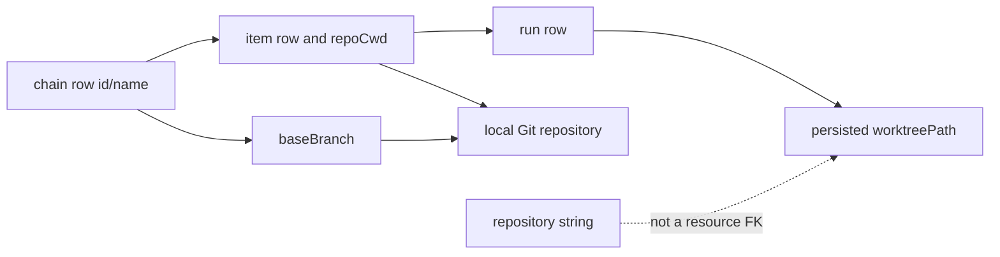

# RFC #547 R8 恢复调查 I-42：repository 存量分布与资源不变量

> 固定代码基线：`main@699842eba2eefc242d19f8fa9232bc1d9d5c3bdd`。  
> 数据边界：只读检查 `~/.coder-loop` 下可访问SQLite文件；未写真实DB、未启动daemon、未执行migration。  
> 隐私边界：不记录chain名、repository、branch或路径原值；只给类别、计数和截断SHA-3。  
> 目的：用真实存量与既有资源身份约束repository迁移；不裁决产品、不实现修复。

## A. 主 agent 摘要（≤1页）

### A1. 权威数据库与schema

`~/.coder-loop`下发现四个SQLite路径。两个是0字节空文件；一个是2026-07-15的备份；当前有数据且仍带WAL配套文件的是：

`~/.coder-loop/loop-data/db.sqlite`

该库 `PRAGMA user_version=14`，包含`chains/items/runs/current_runs/context_entries`，**没有R7-13在main schema v16中调查到的task/closure表**。这意味着真实运行存量落后于代码基线两个schema版本；任何repository退列migration都必须能从v14真实形状顺序升级，不能只对新建v16 fixture成立。

### A2. Repository分类的真实结果

当前库有15条chain：

| 分类 | 数量 |
|---|---:|
| 列与binding一致 | 0 |
| column-only | **15** |
| binding-only | 0 |
| 列/binding冲突 | **0** |
| 两边缺失 | 0 |
| 物理列非GitHub形状 | **0** |

15/15的`metadata.bindings`都是合法object，但其中没有一条`repository`键；物理列均为非空、单slash、两侧非空的`owner/repo`形状。共有3个不同repository值。当前真实存量因此不需要操作员猜冲突选边：**可访问current DB不存在冲突，全部是可直接识别的column-only输入集合**。这不证明未来、备份之外或store旁路永远无冲突；migration仍应保持R7稳定的“冲突响亮失败、不静默选边”不变量。

### A3. Chain、item、run与worktree依赖

- chain：15；状态为deleted 12、stopped 3；active/completed均0。
- item：69；15/15 chains均有items。
- run：932；15/15 chains均有runs；`current_runs=0`。
- persisted worktree path：932/932 run extras带`worktreePath`，按chain归并为15个不同path；磁盘上仍存在3个，恰好属于3条stopped chain；12条deleted chain的persisted path均已不存在。
- repoCwd：13个不同值，12个仍存在；14/15 chains至少有一个仍存在的repoCwd。
- baseBranch：15/15非空，共2个不同值；3条仍有worktree的stopped chain均仍携baseBranch。
- closure：v14没有closure/task表，不能从当前DB枚举closure row；因此“closure为0”不是合法结论。当前可证明的是历史run与worktree资源仍大量存在。

R7-13的资源结论与现状一致：repository字符串不是worktree identity；真实关联仍落在chain/item FK、`item.repo_cwd`、`chain.base_branch`以及run extra里的worktree path。现库没有repository binding冲突，但有真实历史资源，故migration不能以“全是deleted/stopped”推导可丢弃items/runs/path/baseBranch。

### A4. 对migration的事实约束

1. current v14的15条column-only值必须无损进入business binding；不能要求binding预先存在。
2. 物理列退役不能级联或重建丢失69 items、932 runs及其FK/extra。
3. `base_branch`必须原样保留；3条stopped chain仍有真实磁盘worktree。
4. v14→v15/v16演进与repository退列必须有明确顺序/shape detection；不能假定closure表已存在。
5. 0条冲突只消除本机current population的人工选边需要，不取消冲突检测合同。

---

## B. 只读调查记录

## B1. 路径、时间与权威判定

| 路径 | 大小 | user_version | 表 | 判定 |
|---|---:|---:|---|---|
| `~/.coder-loop/db.sqlite` | 0 | 0 | 无 | 空占位，不参与统计 |
| `~/.coder-loop/loop-data/state.sqlite` | 0 | 0 | 无 | 空占位，不参与统计 |
| `~/.coder-loop/loop-data/db.sqlite` | 802816 bytes | **14** | chains/items/runs/current_runs/context_entries | 当前数据源；mtime 2026-07-31 09:36 +0900 |
| `~/.coder-loop/backups/preset-migration-20260715-123342/db.sqlite` | 135168 bytes | 14 | 同v14主体 | 历史备份；不与current合并计数 |

当前库旁有`db.sqlite-shm`与0字节`db.sqlite-wal`；检查全程使用`sqlite3 -readonly`或URI `mode=ro`。

备份快照另有9条chain、10 items、103 runs，repository分类同样为9条column-only、0冲突；其6 active/3 stopped是历史时点，不代表current状态。它只加强“v14历史数据也未预填binding”的事实，不作为当前15条的重复样本。

## B2. SQL口径

### B2.1 Schema与版本

```sql
PRAGMA user_version;
SELECT name FROM sqlite_master WHERE type='table' ORDER BY name;
SELECT sql FROM sqlite_master
WHERE type='table' AND name IN ('chains','items','runs','current_runs');
```

观察：`chains.repository TEXT NOT NULL`、`base_branch TEXT NOT NULL`；items与runs通过`chain_id`关联；runs再通过integer `item_id` FK关联item row。v14无task/closure表。

### B2.2 Repository分类

```sql
WITH c AS (
  SELECT repository,
         json_extract(metadata, '$.bindings.repository') AS binding
  FROM chains
)
SELECT CASE
  WHEN binding IS NULL AND repository IS NOT NULL THEN 'column-only'
  WHEN binding IS NOT NULL AND repository IS NULL THEN 'binding-only'
  WHEN binding = repository THEN 'consistent'
  WHEN binding IS NOT NULL AND repository IS NOT NULL THEN 'conflict'
  ELSE 'missing'
END AS class,
COUNT(*)
FROM c
GROUP BY class;
```

由于v14列为NOT NULL，“binding-only”与“两边missing”在未绕过schema时不可形成；仍将它们列入分类是为了区分未来退列形状，而不是暗示现库存在。

### B2.3 Metadata与binding shape

```sql
SELECT json_type(metadata, '$.bindings'), COUNT(*)
FROM chains GROUP BY 1;

SELECT key, COUNT(*)
FROM chains, json_each(json_extract(metadata, '$.bindings'))
WHERE json_type(metadata, '$.bindings')='object'
GROUP BY key;
```

15/15为object；仅观察到`umbrellaIssue`与`umbrellaRepo`键，各6条；`repository`键0条。metadata malformed计数0。

### B2.4 Resource关联

```sql
SELECT c.status,
       COUNT(DISTINCT c.id) AS chains,
       COUNT(DISTINCT i.id) AS items,
       COUNT(DISTINCT r.id) AS runs
FROM chains c
LEFT JOIN items i ON i.chain_id=c.id
LEFT JOIN runs r ON r.chain_id=c.id
GROUP BY c.status;

SELECT COUNT(*) FROM current_runs;

SELECT COUNT(*), COUNT(DISTINCT json_extract(extra,'$.worktreePath'))
FROM runs
WHERE json_type(extra,'$.worktreePath')='text';
```

磁盘存在性由只读Python `os.path.exists`检查DB中path，不输出path原值。

## B3. Repository总体计数

| 维度 | 结果 |
|---|---:|
| chains | 15 |
| distinct repository值 | 3 |
| metadata合法JSON | 15 |
| bindings为object | 15 |
| bindings含repository | 0 |
| column-only | 15 |
| consistent | 0 |
| conflict | 0 |
| binding-only | 0 |
| missing | 0 |
| empty物理列 | 0 |
| owner/repo形状 | 15 |
| 非GitHub形状 | 0 |

“GitHub形状”在本报告只指一个slash、两侧非空、无空白的`owner/repo`表面形状，不声称远端仓库存在或可访问。

## B4. 匿名逐chain资源矩阵

chain hash为`SHA3-256(chain_id || ':' || repository)`前12hex；repository/branch hash也只保留前12hex。hash用于同报告内分组，不作为稳定外部identity。

| chain hash | 状态 | repo类别 | repo hash | branch hash | items | runs | persisted worktree paths |
|---|---|---|---|---|---:|---:|---:|
| 0A1FA70E49AB | deleted | column-only | 00118765D2A7 | 15C4A824AB27 | 5 | 16 | 1 |
| 20C3FDDB4C95 | deleted | column-only | 60D06D30F46D | 15C4A824AB27 | 10 | 40 | 1 |
| 22023B406826 | deleted | column-only | 60D06D30F46D | 15C4A824AB27 | 1 | 8 | 1 |
| 3D1A826255B9 | deleted | column-only | 60D06D30F46D | 15C4A824AB27 | 1 | 36 | 1 |
| 4CAAA425F78E | deleted | column-only | 60D06D30F46D | 15C4A824AB27 | 1 | 33 | 1 |
| 5494D4010BDE | deleted | column-only | 60D06D30F46D | 15C4A824AB27 | 2 | 102 | 1 |
| 5BA684ACAD07 | deleted | column-only | 60D06D30F46D | 15C4A824AB27 | 1 | 8 | 1 |
| 70AFFF47ECD7 | deleted | column-only | 60D06D30F46D | 15C4A824AB27 | 1 | 1 | 1 |
| 710D4DE77118 | deleted | column-only | 60D06D30F46D | 15C4A824AB27 | 2 | 17 | 1 |
| CF89234C0E84 | deleted | column-only | 00118765D2A7 | 15C4A824AB27 | 6 | 6 | 1 |
| E987B9C1566E | deleted | column-only | 60D06D30F46D | 15C4A824AB27 | 9 | 5 | 1 |
| EA23C6ABF702 | deleted | column-only | 60D06D30F46D | 15C4A824AB27 | 1 | 8 | 1 |
| 483389695D2B | stopped | column-only | 60D06D30F46D | 15C4A824AB27 | 13 | 105 | 1 |
| ACE65564E13E | stopped | column-only | 16F549F3DE1F | 15C4A824AB27 | 4 | 545 | 1 |
| CAA23EA8C6E0 | stopped | column-only | 60D06D30F46D | 72C38D3C8307 | 12 | 2 | 1 |

矩阵证明15/15 chain都不能按“无items/runs空壳”跳过。最大的单chain历史run数为545；repository退列table rebuild若丢FK或extra，会伤及真实历史，而非只影响展示字段。

## B5. 活跃、终态与状态边界

### B5.1 Chain状态

| chain status | chains | items | runs | current runs | 仍存在worktree的chains |
|---|---:|---:|---:|---:|---:|
| deleted | 12 | 40 | 280 | 0 | 0 |
| stopped | 3 | 29 | 652 | 0 | 3 |
| active | 0 | 0 | 0 | 0 | 0 |
| completed | 0 | 0 | 0 | 0 | 0 |

“stopped”不是terminal完成同义词；三条stopped chain保留真实worktree与大量run。current_runs为0只说明当前没有登记运行，不说明资源可丢弃。

### B5.2 Item状态原样分布

| status literal | 数量 |
|---|---:|
| queued | 55 |
| done | 8 |
| changes_requested | 3 |
| contract_invalid | 1 |
| exhausted | 1 |
| retry_export | 1 |

不同preset的terminal词表不能从字面统一推断，因此本报告不自行把69 items分成“terminal/nonterminal”。可确定的是55条仍写着`queued`，且所属chain当前均stopped/deleted。

### B5.3 Run状态

932条历史run均保留；状态种类包括blocked、changes_requested、contract_invalid、done、orphaned及多种retry/required状态。它们是历史事实，不以chain当前非active而失效。

## B6. Worktree、repoCwd、baseBranch与closure边界

| 资源事实 | 计数/观察 |
|---|---|
| run extra含worktreePath | 932/932 |
| distinct persisted worktreePath | 15 |
| 当前磁盘存在path | 3 |
| 有当前path的chain | 3/15，全部stopped |
| distinct repoCwd | 13 |
| 当前存在repoCwd | 12 |
| 至少一个repoCwd存在的chain | 14/15 |
| nonempty baseBranch | 15/15 |
| distinct baseBranch | 2 |

这些数据支持R7-13已建立的依赖链：



v14没有task_closures/task_nodes等表，所以本报告不能直接核对closureId/runtimeNodeId/branchName/baseCommit列。R7-13在main v16代码与隔离实验中证明这些字段不以repository为FK；真实v14库则证明升级输入中仍有worktree历史，且不能先假设新closure schema已经存在。

## B7. Schema版本对migration的限制

1. **入口shape是v14。** 当前真实库不是R7报告的v16形状。migration必须经过或兼容v14→v15/v16既有演进，不能直接假定closure/runtime表存在。
2. **repository列当前NOT NULL。** 在退列前，binding-only/missing无法由正常v14 schema表达；migration第一步需要从column-only构造binding，而非把“无binding”判非法。
3. **全部15条都要搬运。** 没有一条可因已一致而跳过；shape detector必须区分“v14列存在且binding缺失”与“已迁移列不存在”。
4. **FK历史必须保留。** 69 items、932 runs引用15条chain；table rebuild需维持row id与关联。
5. **JSON已有其他业务键。** 6条chain的bindings已有umbrella键；写repository binding时不能覆盖整个bindings object。
6. **baseBranch不可随列一起泛化删除。** 3条真实worktree仍消费其所属chain的baseBranch；15条均非空。
7. **冲突检测仍是contract。** current计数为0冲突只说明本机可自动搬运集合完整；backup也为0。store旁路和未来producer仍能形成冲突，不能据此删除响亮失败分支。
8. **version号不能从报告猜。** R7-13确认main的`STATE_SCHEMA_VERSION=16`且v14-v16已有用途；下一version/多阶段顺序属于后续实现设计，本调查只要求从真实v14可达。

## B8. 与R7-13的核对

| R7-13主张 | 真实current DB结果 | 核对 |
|---|---|---|
| repository物理列仍为NOT NULL | v14 chains确为NOT NULL | 符合 |
| metadata binding可作为另一权威 | schema能存bindings；current无repository binding | 机制存在，当前未形成双值 |
| 冲突可持久化 | current 0冲突；R7隔离store实验有冲突 | 无反证；真实population无需选边 |
| nonGitHub值可由store持久 | current 0；public admission限制仍由R7证明 | 当前无此类存量 |
| repository非worktree identity | 资源通过chain/item/repoCwd/baseBranch/run path关联 | 符合 |
| baseBranch是一等资源输入 | 15/15存在；3个live worktree所属chain均有值 | 符合 |
| main schema v16 | current production-like DB仍v14 | 新增重要约束：migration必须从v14可达 |

## B9. 可由数据排除与不能排除的迁移形态

### 可由current数据排除

- 不能要求“existing binding覆盖列”，因为15/15没有repository binding。
- 不能把所有chain当空/终态壳丢弃，因为15/15有items+runs，3条仍有worktree。
- 不能同时删除baseBranch，因其仍与真实worktree资源相接。
- 不能只验证v16新建fixture，因真实入口是v14。

### 数据尚不能替代的合同

- conflict作用域：current 0样本不能决定整库失败还是逐chain hold；但“不得静默选边”仍稳定。
- fingerprint迁移：当前DB不能单独说明外部consumer容忍度。
- target selector：population不能决定退列后用binding还是chain identity。
- closure v16字段：当前v14无表，需在升级后或v16副本上另证；不能伪报0。
- 外部typed chain producer：仍未知。

## B10. 隐私与可复核性

- 没有把repository、chain name、baseBranch、repoCwd或worktree path原值写入报告。
- 匿名hash使用SQLite `hex(sha3(value,256))`并截取12hex；chain hash另混入row id避免同repository下chain不可区分。
- 所有aggregate可用B2 SQL在readonly连接复核。
- 磁盘存在性检查只返回布尔计数，没有读取repository内容或修改worktree。
- 未复制DB；因此没有额外敏感副本需要清理。

## B11. 未知与调查停点

1. v14升级到main v16时新closure/runtime表对932条历史run的实际转换结果；本调查禁止运行migration。
2. fingerprint的外部consumer与repository字段退役后的预期变化。
3. repo外DB、已离线备份或未来producer是否存在conflict/nonGitHub/binding-only。
4. 15条chain中item状态的preset-specific terminal解释。
5. 3个现存worktree是否仍有未发布Git变更；本调查没有进入Git内容。
6. external typed chain boundary owner与artifact。

这些未知不要求操作员猜真实population；它们分别属于升级验证、consumer合同或外部owner调查。

## B12. 证据索引

| 证据 | 位置/命令 |
|---|---|
| current DB | `~/.coder-loop/loop-data/db.sqlite`，readonly |
| backup对照 | `~/.coder-loop/backups/preset-migration-20260715-123342/db.sqlite`，readonly |
| schema/version | `PRAGMA user_version`; `sqlite_master` |
| classification | B2.2 SQL |
| bindings keys | `json_each(json_extract(metadata,'$.bindings'))` |
| resource counts | chains/items/runs FK aggregate；run `extra.worktreePath` |
| path existence | Python sqlite URI `mode=ro` + `os.path.exists` aggregate |
| R7合同事实 | `13-r7-13-repository-authority-migration.md` |
| R8 ballot接缝 | `17-r8-decision-ballot.md` TF-41/TF-42 |

## B13. 尾部结论

**I-42尾部结论：当前权威DB是schema v14，共15条chain；repository存量为15条column-only、0 consistent、0 binding-only、0 conflict、0 missing、0非GitHub形状，且metadata/bindings均合法。全部15条chain都有items和runs（69/932），3条stopped chain仍有真实磁盘worktree，15条均保留baseBranch；current_runs为0但不能据此丢弃历史或资源。真实数据因此消除了本机migration“冲突选边”的猜测：现有集合可按列值无损建立binding，同时仍必须保留冲突响亮失败合同。最大的新增约束是current库落后于main两个schema版本且没有closure表，repository退列必须从v14 shape可达、保留chain row identity/FK/items/runs/worktree历史与baseBranch，不能只对v16新库验证。**
