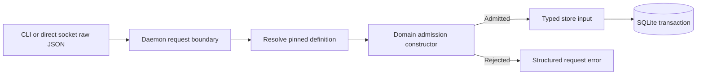
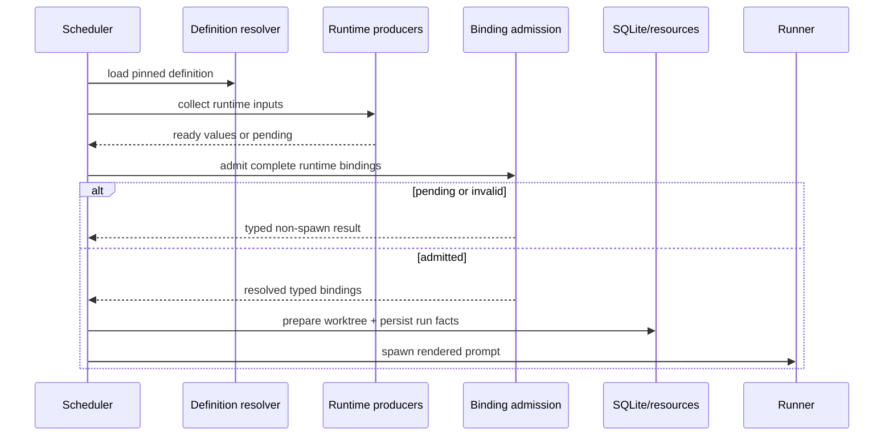

# RFC #547 R8/E-Binding：typed binding runtime 单一合同

> 固定基线：`main@699842eba2eefc242d19f8fa9232bc1d9d5c3bdd`。  
> 输入：`AGGREGATE-547.md` D2/D6、`13-r7-05-binding-type-authority.md`、`13-r7-06-binding-admission.md`、`19-r8-i14-binding-population.md`、`18-r8-autonomy-root-cause.md`。  
> 覆盖：TF-08、TF-11、TF-12、TF-13、TF-15。  
> 本报告自主收敛工程合同；不询问用户、不修改代码/WORKFLOW、不创建worktree。ValueType闭集和结构值JSON呈现是上游参数，不在本报告替裁。

## A. 主 agent 摘要（≤1页）

### A1. 单一结论

E-Binding收敛为一条不可分叉的链：

1. **source schema是唯一类型权威**。每个source field只有`required`或`default(typed value)`缺失策略；missing、present-null和合法空串是三个不同状态。
2. **daemon的definition-aware domain admission是唯一请求权威**。CLI可复用同parser做早反馈，但daemon必须复验；store只接受带definition identity的已准入domain object，不接受raw binding JSON。
3. **create验证将被持久化的完整对象**；update先把replacement/patch变成候选完整对象，再按该实例pinned definition验证。合法patch不等于合法对象。
4. **batch在任何写入前加载并固定各item definition、解析全部候选、聚合全部错误；只有全部合法才以现有单个SQLite IMMEDIATE transaction写入。** commit后才发events。
5. **三阶段preflight**：definition/default compatibility在compile；chain/item值在各自create/update；runtime产生值在任何worktree/closure/run/item mutation或child spawn之前。render只消费typed resolved values，是纯函数，不再承担schema admission。
6. **错误为封闭ADT**，区分definition错误、missing、type/refinement、patch结果、batch、runtime pending/invalid与legacy hold；确定性错误不自动retry，动态pending只在producer事实变化后重试。
7. **历史存量不伪造值或definition**：可证明无损转换才自动迁；不兼容或缺definition证据的row保留可读但进入`legacy-binding-hold`，不得schedule。generic非binding JSON原样保留。

### A2. 为什么只有这一合同

- 最早可决定要求排除render-only admission；它会继续让非法状态落库并在资源副作用后失败。
- 非法状态不可持久化要求update以merge后的完整对象为判据，排除只验patch字段。
- direct socket与store旁路要求daemon复验并让store消费typed object，排除CLI-only validation。
- batch原子与现有API最小breaking要求复用当前单IMMEDIATE transaction，只把typed planning移到事务前，排除逐条写/逐条事件。
- current v14有69条历史items且无definition identity；missing与6条非数字issue不能由current source或空串补造，排除“启动时按当前preset重验并自动修好”。

### A3. 参数而非本报告决定

下列内容由U类/上游合同传入：

- `ValueType`的具体variants；
- 某variant是否允许`null`；
- structured value的canonical JSON projection；
- 各preset最终field schema与default。

E-Binding只要求这些输入是封闭typed schema，并对任意variant穷尽parse/admission/render；不以`json`或string fallback绕开。

### A4. 真实存量约束

- 69个`item.issue`全是text；63个是可逆safe integer文本，6个不可转number。
- branch/pr/lastRunId分别missing 59/58/43条。
- umbrellaIssue有6个integer，当前default却是string；目标definition未闭合前不得迁。
- v14与备份没有历史definition content/hash；current同名preset不能冒充创建时定义。

所以migration必须先冻结目标schema，然后仅自动处理可证明子集；其余显式hold/repair，而不是把迁移困难反向变成runtime宽松规则。

---

## B. 确定合同

## B1. 范围与稳定锚点

| 稳定锚点 | 本合同落实 |
|---|---|
| source schema唯一权威 | field type/default只从pinned definition读取 |
| 最早可决定 | compile→chain/item mutation→runtime pre-spawn三阶段 |
| missing不伪造值 | 没有`undefined/null → ""`；missing为独立variant |
| 非法状态不可持久 | store入口只收Admitted对象；update验完整候选 |
| batch原子 | 全量plan成功后单IMMEDIATE transaction |
| runtime pending typed | pending/invalid分开；后继blocked/error，不回写伪值 |
| D6声明驱动render | projection由typed declaration消费，不按key字面量分支 |

## B2. 核心ADT

### B2.1 输入presence

```text
BindingInput =
  | Missing
  | Present(JsonValue)
```

`Missing`表示key不存在。`Present(null)`是显式null；`Present("")`是显式空串。三者永不互相转换。

### B2.2 Field schema

```text
SourceFieldSchema = {
  source: SourceRef
  valueType: ValueType            // 上游封闭ADT参数
  missing: Required | Default(TypedLiteral)
  owner: Chain | Item | Runtime | Exit
}
```

约束：

- `Default`在compile时已按`valueType`解析为typed literal；异型default使definition rejected。
- nullable只能由`valueType`显式表达；缺失策略不承担nullable。
- 同一`SourceRef`只有一个schema；use-site不能重解释。

### B2.3 Admission结果

```text
AdmissionResult<T> =
  | Admitted { value: T, definitionRef, provenance }
  | Rejected { errors: NonEmpty<BindingError> }

ResolvedBinding<T> =
  | Supplied { value: T }
  | Defaulted { value: T, defaultIdentity }
```

`provenance`只记录supplied/defaulted与source path，不保存第二套类型解释。

### B2.4 持久domain object

```text
AdmittedChainBindings
AdmittedItemBindings
AdmittedBatchItem
```

三者都是带definition ref证据的domain type。raw `JsonObject`只存在于socket/DB migration边界；正常store create/update不能接收raw对象。

## B3. Missing、null、required与default

| 输入 | field schema | 结果 |
|---|---|---|
| Missing | Required | `missing_required_binding` |
| Missing | Default(v) | `Defaulted(v)` |
| Present(null) | type允许null | `Supplied(null)` |
| Present(null) | type不允许null | `binding_type_mismatch` |
| Present("") | string允许空串 | `Supplied("")` |
| Present("") | number/boolean/结构 | type mismatch |

确定后果：

1. 不存在implicit optional。若产品确需optional，必须由ValueType/missing策略上游显式新增variant，不由resolver猜。
2. default只解决missing，不覆盖显式null或错类型。
3. resolved object可保留`Defaulted`证据，但是否把default实体化入业务JSON由storage projection决定；无论如何读回必须得到同一typed语义。
4. agent prompt不能再把missing显示为空串；合法空串只来自真实supplied/default。

## B4. 唯一admission boundary

### B4.1 Authority

daemon command handler在取得pinned definition后调用共享domain constructor；这是direct socket与CLI共同经过的唯一权威判定点。



CLI可调用同一纯parser提前显示错误，但daemon不信任CLI结果。store不重复解释preset；它只验证definition ref/domain tag与SQL约束。

### B4.2 为什么不把schema逻辑放进store

store当前不知道preset/definition且是generic persistence资产。把parser复制进store会形成第二权威；继续让store收raw JSON又保留内部旁路。最小改动是把store public mutation input收紧为Admitted domain object，同时保留一个仅供versioned migration使用的显式legacy入口，normal daemon不可调用。

### B4.3 Owner分层

| source owner | 最早完整信息 | 判定点 |
|---|---|---|
| chain | chain definition + candidate chain bindings | chain create/update |
| item | item preset definition + candidate item object | item add/update/batch |
| runtime | run identity + runtime producer value | pre-spawn preflight |
| exit/agent result | phase result schema + submitted result | transition admission |

本报告直接覆盖chain/item/runtime；exit result沿同构造器但其对象闭集由上游定义。

## B5. Create合同

### B5.1 Chain create

顺序：

1. parse request/generic安全边界；
2. resolve并pin ChainDefinition；
3. 从candidate metadata/business bindings构造完整chain source object；
4. 对所有chain fields应用required/default/type/refinement；
5. 若任一错误，返回`binding_admission_rejected`，零DB写、零event；
6. 若全部成功，以AdmittedChainBindings调用store事务；
7. commit后发created event。

### B5.2 Item add

顺序：

1. 解析item id、repoCwd、caller rights与generic limits；
2. resolve并pin该item的PresetDefinition；
3. 执行idField等engine-owned注入，形成**最终candidate object**；
4. 以source schema验证全部item fields；
5. 成功才写item；失败零写、零scheduler tick/created event。

idField回填是candidate构造的一步，不是其他fields无需验证的特例。

## B6. Update合同（TF-12）

### B6.1 单一判据

无论调用者发送replacement还是`extraPatch`，最终合法性只看merge后的完整candidate object：

```text
candidate = applyAuthorizedOperation(currentPersistedObject, request)
admit(candidate, pinnedDefinition)
```

patch本身只做operation grammar与rights检查。某字段单独类型正确不能证明跨字段refinement或required集合仍成立。

### B6.2 顺序

1. 加载current row与其pinned definition ref；
2. caller/field rights admission；
3. parse replacement/patch且施加size/depth limits；
4. 纯函数生成candidate；
5. engine invariants（identity/dependency/control fields）验证；
6. binding domain admission验证完整candidate；
7. 单个IMMEDIATE transaction写入；
8. commit后event/tick。

### B6.3 并发

update必须在事务提交时确认读取的row revision/updatedAt仍未变化；若变化返回`concurrent_update`，caller重新读后重放operation。不能在旧snapshot验证后覆盖较新的合法对象。

### B6.4 禁止形态

- 只验证patch中出现的fields；
- replacement/patch走两套schema规则；
- update时改用current同名preset而非实例pinned definition；
- schema错以普通spawn failure延迟暴露。

## B7. Batch合同（TF-13）

### B7.1 Planning

batch request先形成纯内存`BatchAdmissionPlan`：

```text
BatchAdmissionPlan =
  | Ready { admittedItems: NonEmpty<AdmittedBatchItem> }
  | Rejected { itemErrors: NonEmpty<{ inputIndex, itemId?, errors }> }
```

每个item可有不同preset definition；resolver必须为每项确定并记录definition ref，不能用第一项代表全批。

### B7.2 事务时序

1. parse整个array与每项generic boundary；
2. resolve/pin所有definition refs；
3. 构造每项最终candidate（含idField）；
4. validate全部项并聚合错误；
5. 任一错误则整批Rejected，**不进入write transaction**；
6. 全部成功后调用现有`createItems`单个IMMEDIATE transaction；
7. SQL conflict使整批rollback；
8. commit成功后按输入顺序发created events。

### B7.3 Definition coherence

planning完成到commit之间使用immutable definition refs；source文件变化不影响本批。若ref artifact在commit前missing/corrupt，整批返回definition错误，不能重编current source。

### B7.4 Bypass

normal CLI/socket/store没有`unsafe`或`skipRefinement`。历史migration仅能通过版本化migration function写legacy state，并必须同时写migration classification/hold；它不是runtime alias。

## B8. 三阶段preflight（TF-15）

### B8.1 阶段表

| 阶段 | 可决定事实 | 失败结果 | 可否retry |
|---|---|---|---|
| compile | field type、default compatibility、source冲突、projection声明 | definition rejected | 修改definition后重新compile，不是runtime retry |
| chain/item mutation | persisted candidate的required/type/refinement | request rejected，零写 | caller修输入后新请求 |
| runtime pre-spawn | runtime producer值是否ready且符合schema | typed pending或blocked-invalid，零资源副作用 | pending在producer变化后；invalid在输入/definition修复后 |
| render | 已resolved typed values→text/doc | programmer/integrity error | 不作scheduler自动retry |

### B8.2 Runtime顺序

runtime preflight必须移到以下副作用之前：

- worktree/branch创建或变更；
- closure/runtime node/run/current_run写入；
- item attempts/lastRunId/agentCwd/phase更新；
- child process spawn；
- created/spawn events。



### B8.3 Dynamic pending与invalid

- `runtime_binding_pending`表示producer尚未产生值，不是空值，也不增加attempt。
- `runtime_binding_invalid`表示producer给出的present值不符合schema；后继显式blocked/error，保留source/path证据。
- pending可按producer变更事件或有界backoff重检；没有事实变化不得busy retry。
- deterministic invalid不进入通用scheduler spawn retry/backoff，避免重复资源准备。

## B9. Render合同与D6

render接收`ResolvedBinding<ValueType>`，不接raw `JsonValue | undefined`。

1. supplied/defaulted都已typed；renderer不再决定missing/default/type。
2. scalar/structure怎样文本化由ValueType + doc projection声明决定；本报告不替TF-07/09裁具体形态。
3. renderer不得检查key字面量；D6的doc prefix等继续由声明结构驱动。
4. 若renderer遇到未实现ValueType variant，属于definition/runtime版本完整性错误，必须点名definition ref、binding key、source与variant；它不是用户数据可重试错误。
5. `stringifyBindingValue(undefined/null) => ""`路径物理退役；null只按显式nullable/projection处理。

## B10. 错误ADT与retry分类

### B10.1 Domain errors

```text
BindingError =
  | DefinitionUnavailable { definitionRef, reason: missing|corrupt|incompatible }
  | MissingRequiredBinding { owner, source, bindingKeys, objectPath }
  | BindingTypeMismatch { owner, source, bindingKeys, objectPath, expected, actual }
  | BindingRefinementFailed { owner, source, bindingKeys, objectPath, refinement, actual }
  | DefaultTypeMismatch { definitionRef, source, expected, actual }
  | SourceTypeConflict { definitionRef, source, expectations }
  | CandidateInvariantViolation { objectPath, invariant }
  | ConcurrentUpdate { objectIdentity, expectedRevision, actualRevision }
  | RuntimeBindingPending { runHost, source, producer }
  | RuntimeBindingInvalid { runHost, source, cause }
  | LegacyBindingHold { objectIdentity, classification, evidence }
```

`bindingKeys`是消费该source的use-site集合，避免当前错误只有source label、不知道哪个prompt binding失败。

### B10.2 Transport envelopes

- 单create/update：`binding_admission_rejected` + nonempty `errors`。
- batch：`batch_binding_admission_rejected` + indexed nonempty item errors；不只返回首错。
- runtime：status/event使用`runtime-binding-pending`或`runtime-binding-blocked`，不压成`spawn.aborted`字符串。

### B10.3 Retry表

| variant | 自动retry |
|---|---|
| definition missing/corrupt/incompatible | 否；hold直到artifact恢复/repair |
| missing/type/refinement/default/source conflict | 否 |
| concurrent update | caller可重读后立即retry；daemon不盲重放 |
| runtime pending | 是，仅producer事实变化或有界backoff |
| runtime invalid | 否，直到producer/definition改变 |
| legacy hold | 否，显式migration/repair |
| transient DB busy/IO | 沿既有infra retry，不与binding错误合并 |

## B11. 事务与副作用总表

| 入口 | admission相对事务 | transaction | commit前副作用 | commit后动作 |
|---|---|---|---|---|
| chain create | raw parse+definition+admission先完成 | existing IMMEDIATE create | 无 | event/status |
| item add | candidate+admission先完成 | existing IMMEDIATE create | 无 | event/tick |
| item update | 事务读revision；candidate/admission；CAS写 | single IMMEDIATE update | 无 | event/tick |
| batch add | 全批plan先完成 | existing single IMMEDIATE batch | 无 | per-item events |
| runtime preflight | 在资源/run事务之前 | 失败不进入资源事务 | 无 | 成功才prepare/spawn |
| migration | versioned migration transaction | schema-specific IMMEDIATE | 无外部副作用 | classification/hold可读 |

对于update，为避免事务外snapshot race，实现可在IMMEDIATE transaction内重读row、纯函数构造并admit，再CAS写；关键合同是validation所对应的row版本与commit一致，而不是强制某个函数放置。

## B12. Migration与存量hold

### B12.1 分类ADT

```text
LegacyBindingClassification =
  | ProvenEquivalent
  | LosslessConvertible { conversion }
  | IncompatibleValue { source, observedType }
  | MissingWithoutEvidence { source }
  | DefinitionUnknown
  | NonBindingMetadata
```

### B12.2 当前69 items的处理约束

| population | classification | 合同 |
|---|---|---|
| 63 canonical safe integer issue texts | LosslessConvertible，且仅当冻结目标schema仍为number | conversion后按目标definition复验 |
| 6 nonnumeric issue texts | IncompatibleValue | 保留原值，item进入legacy hold；不parse前缀/0/default |
| 59 missing branch | MissingWithoutEvidence | 目标schema若required则hold；只有显式typed default可解析 |
| 58 missing pr | 同上 | 同上 |
| 43 missing lastRunId | 同上 | 同上 |
| umbrellaIssue integer + string default冲突 | definition conflict | definition先rejected；不得按row各自解释两型 |
| dependsOn/presetMigration/scheduler objects | NonBindingMetadata | 原样保留，不过ValueType migration |

### B12.3 Definition unknown

v14无历史definition identity。migration不得用current同名preset给旧row补造`definitionRef`。允许的终态只有：

1. 有独立历史证据恢复真实definition后正常admit；或
2. 标记`DefinitionUnknown + LegacyBindingHold`，对象可list/status/export/repair但不可schedule/update业务bindings。

repair必须创建显式新definition association并再次完整admit；不是静默恢复。

### B12.4 Hold可见性

hold需投影：object identity、classification、source paths、definition evidence状态、可执行repair action类别。敏感原值不必进入status；完整值留在原存储/受控export。

## B13. 资产复用

| 现有资产 | 复用方式 | 不能冒充的能力 |
|---|---|---|
| preset loader/source ADT | 提供pinned field schema输入 | 当前四词/宽object不是完整type authority |
| ArkType boundary模式 | 边界parse与封闭error输入 | 不能以exception字符串作domain error |
| generic JSON size/depth | admission前安全边界 | 不证明field type合法 |
| idField冲突检查 | candidate构造的engine invariant | 不替代全部fields admission |
| caller/field rights | update operation authorization | 不证明merge后对象合法 |
| dependency validation | candidate invariant的一部分 | 不替代binding schema |
| SQLite IMMEDIATE transaction | create/update/batch/migration原子写 | 不自动提供typed admission |
| batch一次`createItems` | 保持单commit与event-after-commit | 需在调用前形成Admitted plan |
| scheduler cleanup/backoff | 只处理真实transient spawn/infra失败 | deterministic schema错不得混入 |
| runtime-data remainder保真 | 保留非binding metadata与legacy原值 | normal writes不能继续绕过schema |
| D6 doc parser/renderer | 声明驱动projection | 不按key猜type/default |

## B14. 明确否决的形态

1. **render-only validation**：违反最早可决定，保留非法持久态与副作用窗口。
2. **CLI-only validation**：direct socket/store可绕过，CLI不可信。
3. **store自行加载current preset**：形成第二resolver并导致历史rebind。
4. **只验patch fields**：merge后非法状态仍可持久。
5. **replacement与patch不同规则**：同一对象因API形态得到不同合法性。
6. **batch逐项写/首错后保留前项**：违反现有原子资产。
7. **batch用代表item definition**：mixed preset被错误解释。
8. **missing→空串/null/0**：伪造业务值。
9. **default覆盖显式错类型**：把错误输入伪装missing。
10. **runtime schema错走spawn retry**：重复资源准备且永远不会自愈。
11. **current source重验历史row并视为原definition**：伪造历史身份。
12. **全体generic JSON纳入binding migration**：误伤engine metadata。
13. **unsafe runtime bypass flag**：把migration例外变为永久旁路。

## B15. 具体代码触点（实现工作清单边界）

| 触点 | 合同变化 |
|---|---|
| preset canonical field/source model | 输出SourceFieldSchema与typed default |
| compile pipeline/projection | default/type/source conflict；真实required/default/type |
| daemon chain create | definition-aware chain admission |
| daemon item add/batch | candidate构造+per-item definition admission |
| daemon item update | merge完整对象+revision一致+admission |
| sqlite store input types | raw→Admitted domain inputs；保留migration-only seam |
| sqlite batch transaction | 复用单IMMEDIATE，接收Admitted plan |
| scheduler pre-spawn | runtime preflight移到资源副作用前 |
| binding resolver/render | 只消费ResolvedBinding，删除missing空串通路 |
| status/events/errors | typed admission/runtime/legacy variants |
| schema migration | classification、lossless conversion、hold |
| tests/fixtures | 每入口同一invalid matrix与事务/side-effect断言 |

这些触点不是新增需求；它们是让同一合同贯穿现有producer/consumer的编译错误工作面。

## B16. 验证合同

### B16.1 Compile

- default与field type不兼容→rejected，点名source/type；
- 同source冲突schema→rejected；
- public projection保留真实type/required/default/owner。

### B16.2 Chain/item create

- missing required、wrong type、refinement failure分别拒绝；DB row/event均为0；
- explicit null与missing分别测试；合法空串不与missing混同；
- typed default只在key absent时生效。

### B16.3 Update

- patch字段自身合法但merge后缺required/跨字段非法→拒绝且row不变；
- replacement/patch对同candidate给相同结果；
- concurrent revision→`concurrent_update`，不覆盖新值。

### B16.4 Batch

- 多preset batch逐item读取definition；任一typed error→0 inserts/0 events；
- SQL duplicate冲突→整批rollback；
- 全部成功→一次commit后按序events。

### B16.5 Runtime

- pending/invalid在worktree/closure/run/item mutation前返回；
- pending不增加attempt且只在事实变化/有界backoff重试；
- admitted后render不再发生user schema error；
- renderer integrity error不进入spawn retry。

### B16.6 Migration

- v14 population副本分类总数与I-14一致；
- 63条只在目标number schema下无损转换；6条与missing集合hold；
- nonbinding structured metadata逐字保真；
- definition unknown不可schedule；
- migration重入/rollback不产生半分类、半转换。

### B16.7 端到端完成边界

实现issue仍须按其正文运行最小专用runtime场景：通过真实daemon socket create/update/batch并观察SQLite与events；再触发pre-spawn pending/invalid，证明零worktree/run/child副作用。typecheck/unit只能辅助，不能替代该路径。

## B17. 仍登记但不阻塞本合同的未知

1. ValueType首批variant与nullable集合；本合同参数化消费。
2. structured value的canonical JSON文本格式；renderer参数。
3. 各preset最终branch/pr/lastRunId/umbrellaIssue业务schema；migration在冻结前保持hold。
4. 历史definition是否能从外部备份恢复；没有证据时DefinitionUnknown。
5. 外部typed producer字段需求；不得放宽daemon admission等待它。

没有一个未知需要重新打开TF-08/11/12/13/15。

## B18. 证据索引

| 事实 | 输入 |
|---|---|
| 稳定D2三阶段/type authority/missing | `AGGREGATE-547.md` D2 |
| D6声明驱动doc | `AGGREGATE-547.md` D6 |
| 类型权威断裂与render值域 | `13-r7-05-binding-type-authority.md` B2–B9 |
| create/update/batch/pre-spawn时间线 | `13-r7-06-binding-admission.md` B2–B10 |
| 存量类型/missing/definition证据 | `19-r8-i14-binding-population.md` B2–B9 |
| 自主收敛责任 | `18-r8-autonomy-root-cause.md` |

## B19. 尾部结论

**E-Binding尾部结论：TF-08/11/12/13/15已单一收敛。source schema定义required或typed default，missing/null/空串分离；daemon在取得pinned definition后以共享domain constructor作唯一权威admission，store只收带definition证据的Admitted对象；create验证最终完整对象，update验证replacement/patch合并后的完整candidate并防并发覆盖；batch先逐item固定definition并全量admit，随后复用单个IMMEDIATE transaction，commit后才发event；runtime preflight必须位于worktree/closure/run/item写入和spawn之前。错误使用封闭ADT并把确定性schema错、dynamic pending、invalid producer、legacy hold与infra retry分开。v14存量只自动迁可证明无损子集，6条不兼容issue、无历史证据的missing与DefinitionUnknown均可读但hold，非binding JSON不动。ValueType/JSON呈现和最终业务field schema作为参数保留，不重新打开本合同。**
