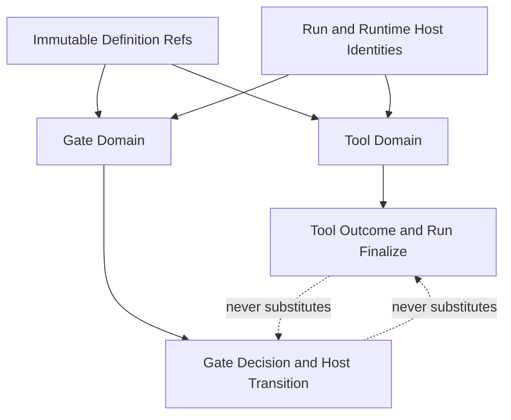

# RFC #547 R8/E-Capability：Tool 与 Gate 单一能力合同

> 固定基线：`main@699842eba2eefc242d19f8fa9232bc1d9d5c3bdd`。  
> 输入：`AGGREGATE-547.md` D4/D5、`13-r7-09-tool-capability-chain.md`、`13-r7-10-gate-capability-handshake.md`、`19-r8-i35-c6-tool-chain.md`、`19-r8-i37-gate-binding-contract.md`、`19-r8-i39-gate-executor.md`、`18-r8-autonomy-root-cause.md`。  
> 覆盖：TF-32、TF-34、TF-36、TF-38。  
> 本报告形成确定工程合同；不询问用户、不修改代码/WORKFLOW、不创建worktree。未实现owner接口不由本仓虚构transport。

## A. 主 agent 摘要（≤1页）

### A1. 单一收敛

Tool与Gate共享definition/run/host基础identity设施，但保持两套domain合同：

**Tool：**

1. `ToolDefinitionId = PresetDefinitionRef + registry tool name`，贯穿registry、phase requirement、doctor、prompt、run requirement与outcome。
2. registry四轴固定为`provider / availability / outcome / enforcement`；`required`是否合法只看tool是否声明确定性outcome，与provider无关。
3. 首波outcome只有`entry-existence`。每个run的required判定实例以`RunToolRequirementId = RunId + PhaseNodeId + ToolDefinitionId + OutcomeVariant`持久化；从context entry的typed run author证明，不借HAPI call id或router delivery id。
4. canonical registry是compile、doctor availability、prompt requirements doc的唯一数据源；三个consumer使用同一registry version/ref，不复制tool表。
5. C6 owner已知：coder-loop #545/#597消费#553声明。链尚未实现，但owner未知已消除；本合同只规定identity、store/finalize/recovery seam，不发明外部API。

**Gate：**

1. compiled gate identity为`PresetDefinitionRef + GateDeclarationId(name) + typed point/host ref`；runtime evaluation再加stable host identity与epoch。
2. 稳定point闭集只有`run.pre-spawn`、`run.post-exit`、`container.join`、`chain-complete`；各variant携自己的host payload，禁止裸string后猜host。
3. preset named binding只来自global/chain，chain覆盖global，item不参与；selected唯一且shadowed可审计。该I-37结论不再开放。
4. runtime通过版本化`GateRuntimeCapability`广告其point/decision/journal支持。含gate的definition在create/resume时比较需求；当前capability absent，必须结构化`unsupported-capability`拒绝，不能进入scheduler成为inert carrier。
5. executor owner已知为coder-loop #712（payload #710、binding #713、join #714），但尚未实现。当前guard只拒绝，不虚构HTTP/MCP/文件transport；未来接同owner的typed evaluator/journal seam。

### A2. 当前事实

- main没有`[[tools]]` registry、entry-existence ADT、required outcome finalize；只有可复用的context append/store与run author信息。
- main有gate declaration carrier与global→chain→preset→item concat view，但无host binding、capability、executor、decision或recovery；effective view没有production scheduler consumer。
- installed/router/HAPI surfaces没有同一coder-loop identity链；相邻session/call/delivery identities不能成为主键。
- #553/#597与#710/#712/#713/#714是已识别同repo owner，状态open。缺的是实现，不是让操作员选择owner。

### A3. 完成边界

本合同把当前系统置于诚实状态：无tool enforcement时，required tool不能被宣称可执行；无gate capability时，含gate实例不能被调度。未来owner实现只需满足本报告的typed seams，不得改变registry authority、provider无关required判据、gate point/host identity、binding precedence或unsupported行为。

---

## B. 确定合同

## B1. 两个domain、一个基础identity层



共同基础：definition ref、phase/node identity、chain/item/run/runtime node identity、typed error/event envelope。不同domain：

| Tool | Gate |
|---|---|
| 证明某tool outcome是否达成 | 决定某生命周期transition是否放行 |
| compile合法性 + run finalize判定 | capability handshake + host transition判定 |
| provider/availability/outcome/enforcement | name/point/host/binding/decision |
| context entry等outcome evidence | script/agent evaluator的typed decision |

doctor availability不能证明tool outcome；tool outcome不能代表gate decision；gate script也不能冒充tool invocation。

## B2. Tool registry ADT（TF-32/34）

### B2.1 Canonical shape

```text
ToolRegistry = {
  schemaVersion: ToolRegistrySchemaVersion
  registryRef: ToolRegistryRef
  tools: NonEmpty<ToolDefinition>
}

ToolDefinition = {
  id: ToolDefinitionId
  name: ToolName
  provider: EngineProvider(capabilityId) | ExternalProvider(providerId, capabilityId)
  availability: AvailabilityRequirement
  outcome: None | EntryExistence(EntryExistenceSpec)
  documentation: ToolDocumentation
}

ToolRequirement = {
  toolId: ToolDefinitionId
  enforcement: Required | Expected
}
```

四轴保持正交：provider不决定availability，availability不证明outcome，outcome不决定required/expected之外的业务语义。

### B2.2 Identity

```text
ToolDefinitionId = (PresetDefinitionRef, ToolName)
PhaseToolRequirementId = (PresetDefinitionRef, PhaseNodeId, ToolDefinitionId)
RunToolRequirementId = (RunId, PhaseToolRequirementId, OutcomeVariant)
```

ToolName在一个preset definition内唯一；新增同名是compile error。provider内部binary/API名字可变但不改变ToolDefinitionId；若语义outcome改变，definition content/ref随之改变。

### B2.3 Required legality

```text
Required(tool) is legal iff tool.outcome is a deterministic closed variant.
```

首波唯一合法outcome为`entry-existence`。`outcome=None + required`是compile error；provider=engine不能例外。`expected`可用于无确定outcome的tool，但不阻断run finalize。

### B2.4 Entry-existence

`EntryExistenceSpec`必须声明typed entry author/namespace约束，不用自由文本grep。判定查询durable context entry：

- author绑定到同一`chainId/itemId/runId/phase`；
- entry commit完成；
- namespace/tool identity与requirement一致；
- 至少一条满足即产生`Achieved`；零条产生`NotAchieved`。

真实entry body不进入outcome event；只投影entry id/count、definition/tool/run identity。

## B3. Registry三consumer单一合同（TF-34）

### B3.1 Compile consumer

输入：canonical ToolRegistry。职责：

- 校验tool name唯一、provider/capability id、outcome variant；
- 解析phase requirement ref；
- 执行required/outcome合法性；
- 将真实registryRef、ToolDefinition与phase requirements投影入compiled model。

### B3.2 Doctor availability consumer

doctor按每个ToolDefinition.provider调用typed provider adapter，只回答`Available | Unavailable | Indeterminate`及结构化原因。结果携registryRef/toolId/provider capability version与检查时点。

doctor不得：

- 无条件检查`gh`或runner；
- 把available写成outcome achieved；
- 以provider字面量改变required合法性；
- 缓存跨registryRef结果。

### B3.3 Prompt doc consumer

`toolRequirementsDoc`只从当前phase的ToolRequirement + ToolDefinition.documentation/outcome/enforcement生成。它说明required/expected与如何产生evidence，但不执法，也不显示其他phase requirement。

### B3.4 共同版本

三个consumer接收同一`ToolRegistryRef`与parsed ADT；不得各自读TOML、grep prompt或复制string union。registry schema unknown variant导致structured incompatibility，不被忽略。

## B4. Tool运行时与C6 seam

### B4.1 Owner

| 份额 | Owner |
|---|---|
| registry/compile | coder-loop #553（RFC #547） |
| runtime enforcement/outcome/finalize | coder-loop #597（RFC #545 C6） |
| context append/store substrate | current coder-loop daemon/SQLite |

“外树”只表示另一个RFC delivery tree，不是未知repo。Router/HAPI identities只能作未来观测关联，不能成为C6 primary key。

### B4.2 Finalize state

```text
ToolOutcomeEvaluation =
  | Pending { requirementId }
  | Evaluated { requirementId, result: Achieved(evidenceRef) | NotAchieved }
  | Consumed { requirementId, runVerdict }
```

顺序：

1. runner/process exit事实落地；
2. 在撤销run credential前完成/冻结可接受entry commits；
3. 对每个RunToolRequirementId查询outcome；
4. 持久化Evaluated；
5. required任何NotAchieved→run structured failure；expected缺失只投影；
6. verdict与evaluation consume原子关联；
7. credential revoke与cleanup在判定后。

restart：Evaluated未Consumed直接重消费，不重猜current definition；Pending用同RunToolRequirementId重评。该store/API由#597落地；本报告不指定HTTP/event transport，因为owner与daemon/store同repo且当前无外部transport事实。

## B5. Gate declaration与identity（TF-36）

### B5.1 Compiled declaration

```text
GateDeclaration = {
  id: GateDeclarationId
  name: GateName
  mode: Required | Optional
  point: GatePoint
}

GateDeclarationId = (PresetDefinitionRef, GateName)
```

同definition内name唯一；duplicate在compile拒绝。GateName不单独成为runtime host identity。

### B5.2 GatePoint封闭ADT

```text
GatePoint =
  | RunPreSpawn { phaseNodeId }
  | RunPostExit { phaseNodeId }
  | ContainerJoin { containerNodeId }
  | ChainComplete { topLevelJoinNodeId }
```

这四类是稳定D5 point；current八字符串carrier是legacy hook vocabulary，不是compiled gate contract。`container.advance`、`chain.complete`等不能用字符串近似替代typed variants。

### B5.3 Runtime host payload

```text
GateHost =
  | RunIntentHost { chainId, itemId, phaseNodeId, runId }
  | CompletedRunHost { chainId, itemId, phaseNodeId, runId, exitFactRef }
  | ContainerJoinHost { chainId, runtimeContainerNodeId, closureId, epoch }
  | TopLevelJoinHost { chainId, topLevelJoinNodeId, closureSetRef, epoch }
```

`run.pre-spawn`先持久预分配RunId/RunIntent，再评gate，故host identity在任何script spawn或runner spawn前稳定；advance后同RunId进入真实run，hold不创建第二RunId。post-exit使用既有RunId。container/chain points使用runtime tree stable node identity，不使用数组path或第一item。

### B5.4 Evaluation identity

```text
GateDecisionPointId = (GateDeclarationId, GatePoint, GateHostStableId)
GateEvaluationId = (GateDecisionPointId, Epoch)
```

fingerprint与epoch正交：fingerprint只含point identity、host stable identity、相关canonical state、effective declaration hash；不能hash全库偶然字段。

## B6. Named binding合同（消费I-37）

```text
NamedGateBindingResolution =
  | Selected { binding, source: Chain | Global, shadowedGlobal? }
  | MissingOptional
  | MissingRequired
```

确定规则：

1. producer仅global/chain；item direct hooks不是named binding。
2. chain覆盖global；selected恰好一个。
3. same-layer duplicate binding在边界拒绝，不按数组顺序选。
4. optional missing→skip+event；required missing→new instance拒绝、pinned restart hold。
5. binding存在后script failure只看`onFailure`，optional不吞failure。

direct hooks与preset named gate是两种role：direct hooks可按global→chain→preset→item additive执行；named binding只选择一个preset层script。

## B7. Gate capability advertisement/version（TF-38）

### B7.1 Capability ADT

```text
GateRuntimeCapability = {
  capabilityId: "coder-loop.gate-runtime"
  protocolVersion: GateProtocolVersion
  supportedPoints: Set<GatePointVariant>
  supportedDecisions: Set<Advance | Hold | Reopen>
  journalVersion: GateJournalVersion
  payloadSchemaVersion: HookPayloadSchemaVersion
}

GateCapabilityRequirement = {
  minimumProtocolVersion
  requiredPoints
  requiredDecisionVariants
  minimumJournalVersion
  payloadSchemaVersion
}
```

compiled definition从实际gate declarations推导requirement；不由用户手写重复列表。

### B7.2 Advertisement owner

同一daemon内#712 evaluator完成注册后，daemon capability registry广告GateRuntimeCapability。它是进程真实能力，不是配置承诺。仅有carrier、issue或source symbol不能广告支持。

### B7.3 Handshake时点

- compile/preview允许产生含gate的model；
- instance create在持久业务instance前比较capability；
- scheduler resume/restart再次比较pinned requirement与当前runtime capability；
- 不兼容时create拒绝或既有instance hold，均不得执行phase/transition。

optional declaration也需要runtime理解skip/binding/point，因此capability缺失时同样unsupported；optional不是capability fallback。

### B7.4 当前baseline guard

baseline capability为`Absent`。唯一诚实行为：

```text
UnsupportedCapability {
  capabilityId,
  requiredVersion,
  available: Absent | IncompatibleVersion,
  definitionRef,
  gateIds,
  requiredPoints
}
```

含gatemodel可compile/preview，但create/schedule前结构化拒绝。不得让current concat view进入scheduler后静默无效。

## B8. Gate executor未来接缝（不虚构transport）

### B8.1 Owner链

| 份额 | Owner |
|---|---|
| typed payload | #710 |
| executor/journal/recovery | #712 |
| named binding | #713 |
| preset declaration | #740 |
| container/join接线 | #714 |

script是不可信判定主体，但executor owner是coder-loop L1，不是script host/HAPI/router。

### B8.2 已定seam

#712已定JSON stdin payload、typed stdout decision；mutation走既有daemon socket CLI并携evaluation scope。E-Capability不另造HTTP/MCP/file callback，也不规定尚不存在的外部API。

未来实现必须提供：

```text
evaluateGate(
  capability: GateRuntimeCapability,
  evaluationId: GateEvaluationId,
  payload: VersionedGatePayload,
  binding: ResolvedGateBinding
) -> PersistedGateDecision
```

返回不是内存临时值，而是#712 journal中的`evaluating → decided → consumed`状态；decision consume与host transition原子关联。

## B9. Error ADT

```text
CapabilityError =
  | UnknownToolReference { definitionRef, phaseNodeId, toolName }
  | DuplicateToolName { definitionRef, toolName }
  | RequiredToolWithoutOutcome { toolId }
  | ToolProviderUnavailable { toolId, providerId, reason }
  | ToolOutcomeNotAchieved { requirementId }
  | ToolOutcomeEvaluationCorrupt { requirementId, reason }
  | DuplicateGateName { definitionRef, gateName }
  | InvalidGatePointHost { gateId, point, host }
  | MissingRequiredGateBinding { gateId, instanceId }
  | DuplicateGateBinding { gateName, layer }
  | UnsupportedCapability { capabilityId, required, available, definitionRef }
  | GatePayloadVersionMismatch { evaluationId, required, available }
  | GateDecisionProtocolError { evaluationId, category }
  | GateEvaluationRecoveryHold { evaluationId, state, reason }
```

分类：

- compile errors：unknown/duplicate tool、required无outcome、duplicate gate、invalid point/host declaration；
- instance errors：missing required binding、unsupported capability；
- doctor facts：provider unavailable，不自动改写run outcome；
- finalize errors：required outcome未达成/corrupt；
- runtime gate errors：payload/decision/recovery，由onFailure或hold合同消费。

所有错误携typed identity，不压成script stderr或provider字符串。

## B10. Version与兼容

### B10.1 独立版本轴

| Axis | 保护对象 |
|---|---|
| ToolRegistrySchemaVersion | registry ADT与projection |
| ProviderCapabilityVersion | doctor/provider adapter能力 |
| OutcomeProtocolVersion | entry-existence判定shape |
| GateProtocolVersion | point/decision/evaluation合同 |
| HookPayloadSchemaVersion | executor stdin payload |
| GateJournalVersion | persistent recovery状态 |

不能用一个`schemaVersion=1`代表全部轴。definition pin记录实际refs/requirements；runtime advertisement记录当前capabilities。

### B10.2 Unknown variant

consumer遇到未知registry/outcome/point/decision/version：结构化incompatible/unsupported；不得default忽略、降级expected/optional或换current definition。

### B10.3 Upgrade/restart

- 新runtime兼容旧pinned requirement时按旧definition执行；
- runtime降级/缺capability时existing instance hold；
- tool outcome Evaluated/Consumed与gate Decided/Consumed按各自journal version恢复；
- 损坏state不重跑成另一个identity，不读current source替代。

## B11. Recovery合同

### B11.1 Tool

| 状态 | restart动作 |
|---|---|
| Pending | 按同RunToolRequirementId重评durable entries |
| Evaluated | 不重新解释definition，直接尝试consume |
| Consumed | 幂等返回既有run verdict |
| corrupt/missing | hold并投影ToolOutcomeEvaluationCorrupt |

### B11.2 Gate

| 状态 | restart动作 |
|---|---|
| evaluating | 同GateEvaluationId/epoch重问，mutation idempotency吸收重放 |
| decided | 不重启script，直接重消费decision |
| consumed | 不重复transition；进入下一epoch规则 |
| capability/version不兼容 | hold，零transition |
| required binding丢失 | hold，不换global/current script |

tool journal与gate journal可共享transaction/idempotency基础设施，但不能共享domain state或用一方记录替代另一方。

## B12. Public projections

### B12.1 Compile

- tools：id、provider、availability、outcome、documentation；
- phase requirements：toolId、enforcement；
- gates：gateId/name/mode/point variant/host ref；
- capability requirements：从gates推导，不含runtime availability结果。

### B12.2 Doctor

- registryRef/toolId/provider capability/version；
- available/unavailable/indeterminate与typed reason；
- 不显示outcome achieved。

### B12.3 Status/events

- tool：RunToolRequirementId、Pending/Evaluated/Consumed、Achieved/NotAchieved，敏感entry body隐藏；
- gate：GateEvaluationId、selected binding source、shadowed存在性、capability version、evaluating/decided/consumed/hold；
- script path/args与payload敏感字段按control-plane权限遮蔽。

prompt doc只含authoring/agent所需requirements，不暴露provider secret或gate local script路径。

## B13. 具体触点

| 触点 | 合同变化 |
|---|---|
| preset parser/canonical model | `[[tools]]`与phase requirements；typed gates |
| compiled projection/schema | registry、requirements、gate point/host、capability requirement |
| doctor | registry-driven provider adapters，删除硬编码检查 |
| prompt renderer | per-phase registry-driven requirements doc |
| definition artifact | pin ToolDefinitionIds、GateDeclarationIds与requirements |
| daemon capability registry | GateRuntimeCapability真实advertisement |
| instance create/resume | capability handshake与missing binding |
| context store API | exists-by-typed-author/tool namespace |
| run close/finalize | C6 outcome evaluate/persist/consume |
| hook payload builder | #710唯一versioned payload |
| gate evaluator | #712 stdin/stdout parse、onFailure、journal |
| runtime scheduler/tree | point→stable host接线；#714 join消费 |
| status/events | tool outcome与gate capability/decision投影 |

## B14. Owner边界

### 本仓#547必须供给

- tool registry/schema/compile/projection；
- phase requirements与required合法性；
- gate declaration/name/point/host projection；
- runtime capability requirement；
- current unsupported guard所需compiled facts。

### 已知同repo外树owner供给

- #597：C6 outcome evaluate/finalize/recovery；
- #710：gate payload；
- #712：executor/capability advertisement/journal/recovery；
- #713：binding resolution；
- #714：container/join/chain-complete接线。

### 禁止越界

#547不能为未实现owner临时创建第二executor、第二outcome store、HTTP callback或假capability。交付顺序未满足时，只能以typed unsupported/owner dependency hold表示。

## B15. 明确否决的形态

1. tool identity使用binary path/provider tool name而非definition tool id。
2. required合法性按provider分支；engine provider自动required。
3. doctor available冒充outcome achieved。
4. prompt散文作为执法证据。
5. HAPI callId/router deliveryId成为C6主键。
6. required outcome在credential revoke/cleanup后临时猜测且不持久。
7. gate point用裸string，runtime按模板位置猜host。
8. `container.advance`近似代替`container.join`。
9. pre-spawn在stable run identity前执行。
10. item层参与named binding或按数组last-wins。
11. optional gate在runtime capability缺失时静默skip。
12. carrier存在就advertise capability。
13. current effective concat view直接进入scheduler而无handshake。
14. 为#712未实现状态虚构HTTP/MCP/file transport。
15. 复用task join table冒充gate journal。
16. tool outcome与gate decision合并为通用boolean capability result。
17. unknown version/default variant被忽略。

## B16. 验证合同

### B16.1 Tool compile/registry

- duplicate/unknown tool拒绝；
- required+None outcome拒绝，任意provider结果相同；
- required+entry-existence通过；
- compile JSON可独立遍历四轴与phase requirement；
-两个phase只渲染各自requirements。

### B16.2 Doctor

- 无gh声明的fixture不检查gh；声明provider不可用返回typed reason；
- availability不改变compiled outcome/enforcement；
- registry version改变使旧cache不可复用。

### B16.3 Current gate guard

- capability absent时含required/optional gate的model可compile；
- create/schedule前返回UnsupportedCapability；
- 零phase、零script、零transition；
- status点名definition/gates/required points。

### B16.4 Gate identity/binding

- 四point各自projection携正确host ref；wrong host compile拒绝；
- chain/global同名只选chain并显示shadowed；same-layer duplicate拒绝；
- optional missing skip event；required missing new reject/restart hold；
- item direct hook不参与named binding。

### B16.5 Future C6 integration

- real run提交typed context entry后entry-existence Achieved；无entry required run失败；
- provider engine/external使用相同outcome判据；
- kill在evaluation/consume边界，restart不丢判定、不重复verdict；
- credential revoke前outcome已冻结。

### B16.6 Future gate integration

- capability advertisement版本匹配才可instantiate；
- pre-spawn host已有stable RunId且hold不spawn runner；
- decided后kill，restart不重跑script而重消费；evaluating后kill同epoch重问；
- container/chain host由#714接同一GateEvaluationId协议；
- capability降级后existing instance hold。

### B16.7 验证边界

本仓当前可完成compile/doctor/prompt/current-unsupported真实路径；不得用mock executor声称C6/gate闭环完成。#597/#712/#714合流后，必须由整链路integration在冻结SHA触发真实context outcome与script hold/advance/restart。

## B17. 仍登记但不阻塞的实现未知

1. #597 store表名/index与transaction函数布局；identity/ordering已定。
2. #712 journal表shape及daemon startup/shutdown/tick legacy hooks处置；稳定四point不变。
3. provider adapter的具体availability命令/API；registry接口已定。
4. status/event最终字段名与敏感信息权限；必须投影的identity/state已定。
5. external adapter未来是否关联HAPI call id；只能辅助observability。

这些未知不重新打开TF-32/34/36/38，也不允许#547预实现外树。

## B18. 证据索引

| 事实 | 输入 |
|---|---|
| D4四轴/required/outcome/三consumer | `AGGREGATE-547.md` D4 |
| D5声明/handshake/point-host | `AGGREGATE-547.md` D5 |
| tool current chain | `13-r7-09-tool-capability-chain.md` |
| gate current carrier/无执行 | `13-r7-10-gate-capability-handshake.md` |
| C6 owner与context substrate | `19-r8-i35-c6-tool-chain.md` |
| binding precedence/missing | `19-r8-i37-gate-binding-contract.md` |
| executor owner/journal合同 | `19-r8-i39-gate-executor.md` |
| 自主收敛责任 | `18-r8-autonomy-root-cause.md` |

## B19. 尾部结论

**E-Capability尾部结论：TF-32/34/36/38已单一收敛。Tool以definition-scoped ToolDefinitionId贯穿registry、phase、run requirement与entry-existence outcome；provider/availability/outcome/enforcement四轴正交，required只由确定outcome合法化；compile、doctor、prompt消费同一versioned registry。Gate以definition-scoped gate name + typed point/host形成声明identity，runtime再加stable host与epoch；point闭集为run.pre-spawn/run.post-exit/container.join/chain-complete，named binding固定chain覆盖global且item不参与。daemon只在#712真实注册后广告versioned GateRuntimeCapability；当前capability absent，含gate实例在create/schedule前结构化unsupported，不能inert运行。C6与gate executor owner分别已知为coder-loop #597与#712链，但尚未实现；#547只提供typed declarations、requirements、identity和guard，绝不虚构transport/store或借HAPI/router identity代替。**
