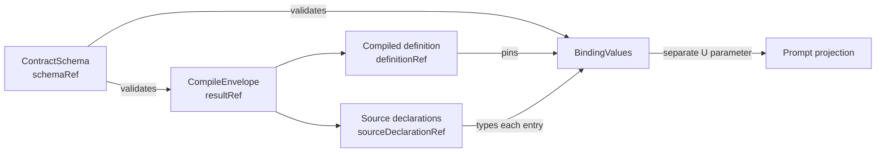

# R8/E-Compile — TF-03/05 单一工程合同

> 固定基线：`main@699842eba2eefc242d19f8fa9232bc1d9d5c3bdd`。  
> 需求锚点：AGGREGATE D1/D2；事实输入：R7-01/04/05、`18-r8-autonomy-root-cause.md`、R8/I-14。范围仅为工程合同，不修改代码、WORKFLOW或产品裁决。

## A. 主 agent 摘要（≤1页）

采用一个**内容寻址的 Compile Contract family**，而不是三个互相复制定义的公共协议：

1. `CompileEnvelope = compiled(product,warnings) | rejected(nonEmptyDiagnostics)` 是唯一validation authority；compiler callback、event、doctor、cache不得形成第二份finding集合。
2. family内有三种不同职责的文档：`ContractSchema`描述wire shape，`CompileEnvelope`是某次编译的instance，`BindingValues`是某个已pin definition下的typed value instance。后两者都以ref引用同一schema/source declaration identity，不重复解释类型。
3. 每个envelope先按确定性顺序和canonical JSON编码，再计算`compileResultRef`；每个finding的`findingRef`由`compileResultRef + normalized finding payload + duplicateIndex`确定。归属（chain/item/CLI invocation）是另一个`ObservationContext`，不进入finding identity。
4. cache保存整个envelope，不再只缓存model；events只携`compileResultRef/findingRef/context`作派生观测。被实例引用的compiled envelope随definition artifact持久保留；未被引用的direct/rejected结果没有新增永久历史义务。这样既能精确replay，也不偷偷替TF-02决定doctor看current、cache还是history。
5. `ContractSchemaRef`、`PresetDefinitionRef`、`SourceDeclarationRef`、`CompileResultRef`均为tagged ref。projection和bindings只能引用，不能用裸hash、path、message或重新执行ArkType补意义。

这是最小机制：复用现有封闭`CompileResult`、唯一projector、ArkType boundary、`schemaVersion`和source hash；只补齐确定性identity、完整envelope cache、公共schema/ref和typed binding value文档。它不增加第二validation引擎、finding数据库、独立type DSL、per-consumer projection或长期rejected审计库。

U类只作为参数边界：

- TF-02决定doctor选择哪一种已定义读面；工程层只提供`compile current`、`lookup cached ref`、`lookup retained definition ref`，不替它选。
- TF-04决定schema producer/首consumer owner与分发载体；合同要求**恰好一个规范producer**，但不猜CLI、文件、package或API。
- TF-07提供封闭`ValueType` variants；本合同只要求所有source declaration、projection和value validation引用同一variant identity。
- TF-09提供prompt文本projection；本合同不把fenced/inline等文本规则塞进公共value或schema。

存量I-14表明真实DB没有历史definition identity，且存在可转换、不可转换、缺值和definition未定四类；因此migration只能产生分类结果或hold，禁止用current同名preset回填历史类型。此约束不扩张TF-14产品政策。

## B. 工程合同

### B1. Canonical ADT与finding identity

```text
CompileEnvelope =
  | { kind:"compiled", contractVersion, schemaRef, resultRef, product, warnings[] }
  | { kind:"rejected", contractVersion, schemaRef, resultRef, diagnostics:[Error, ...] }

Finding = {
  findingRef, verdict:"warn"|"error", code, rule,
  subject:{kind, identity}|null, parameters, renderedMessage
}
```

- `code + subject + parameters`是机器语义；`renderedMessage`只供人读，consumer不得解析。
- compiler按`verdict/code/subject identity/canonical parameters`稳定排序；完全重复项以排序后`duplicateIndex`区分。`resultRef`由**不含自身ref**的完整canonical envelope计算，`findingRef`再由result ref与normalized finding计算；同输入、同contract version必得同bytes/refs。
- rejected仍保持稳定ADT的non-empty diagnostics；成功warning只存在compiled branch。增量callback不得泄露一个最终envelope不拥有的“额外权威集合”。
- source不可读、TOML非法等失败也能由完整rejected envelope得到result ref，不依赖成功后才存在的`sourceHash`。

被否决：随机attempt UUID（不可replay）；`rule+message`作identity（文案即协议且会碰撞）；chain id进入finding id（同一事实被复制）；daemon event作authority（异步失败/cache-hit丢失）；另建finding表（无查询/历史需求，增加双写一致性）。

### B2. Replay、durability与cache

| 对象 | authority与保留 | replay |
|---|---|---|
| direct compile | 本次完整envelope；进程结束无永久保留义务 | 调用方持有的原bytes/ref |
| daemon cache | key=`contractVersion + resolved source content identity`，value=完整envelope | cache hit返回同一envelope，不重新拼finding |
| instance-bound compiled definition | envelope/normalized model随definition artifact原子发布并由tagged ref保留 | chain/item/status/event沿definition ref读取 |
| rejected result | operation返回完整envelope；除非未来U类产品面引用，否则不建永久history | 同operation内按result ref重放 |
| event | 只存refs、context与必要展示副本；写失败不改变compile verdict | 由ref解析；解析不到明确`artifact-missing` |

source bytes变化产生新content identity和cache key；不原地刷新旧entry。artifact缺失、hash不符、schema未知均为封闭typed error并停止，不回退current source、不返回旧model。publish使用“写完整临时对象→校验hash/boundary→atomic rename→发布ref”；只允许成功完成的artifact被实例引用。

### B3. 一个contract family、三个文档角色



| 文档 | 必须包含 | 禁止承担 |
|---|---|---|
| `ContractSchema` | CompileEnvelope、projection、tagged refs、Finding、BindingValues及TF-07注入的ValueType wire schema | 某preset的实际值；prompt呈现 |
| `CompileEnvelope` | definition projection、真实source declarations/type refs、required/default声明、findings、source/content identity | schema元描述；runtime binding值 |
| `BindingValues` | `definitionRef`、每项`sourceDeclarationRef`、typed canonical value或明确pending/missing error variant | 重声明/重解释类型；默认为字符串 |

这三个是**一个版本/identity体系下的schema与两种instance**，不是三套公共类型权威。projection可以为可读性内联展示字段，但规范意义来自ref；内联值与ref解析结果不一致时整份文档拒绝。

被否决：只发projection instance冒充schema（无法派生完整类型）；外部import私有ArkType（与source commit耦合）；schema/projection/bindings各复制ValueType（漂移）；bindings携裸`type:"string"`而无source ref（重演R7-05证据丢失）；把prompt string当typed value（TF-09泄漏进数据合同）。

### B4. 生产/消费触点

| 触点 | 必须改成的消费规则 |
|---|---|
| compiler | 先构造完整envelope并boundary assert，再发布callback/CLI/cache/artifact |
| `preset compile --json` | success/rejected都输出同一公共envelope；退出码仍由kind决定 |
| `loadPreset` | 内部返回compiled product或typed rejection，禁止join message后丢diagnostics |
| daemon preset cache | 缓存整个envelope；并发caller共享result ref，ObservationContext各自派生 |
| definition publish/instantiate | 仅compiled envelope可发布并形成definition ref；warnings与model同ref |
| status/events/hook/GUI | 只消费公共ref/schema；不得import私有boundary或重新compile path |
| chain/item admission | 按definition内source declaration验证typed values；失败返回结构化binding error |
| prompt renderer | 只接收已验证BindingValues；TF-09决定文本projection，缺值不再坍缩`""` |

当前仓内唯一真实公共producer是code checkout的compile CLI；installed app尚无该命令，GUI/hook/bindings writer也未实现（R7-04）。所以首个独立consumer E2E必须等待TF-04 owner落定；这不是放宽本合同或虚构consumer的理由。

### B5. Version、错误与migration

- `contractVersion`版本化整个family；每份文档携精确`schemaRef`。consumer遇未知version/variant必须拒绝，禁止“忽略后猜测”。
- additive字段只有在schema明确optional且旧consumer行为已定义时才可同version；required字段、union variant或语义变化必须新version/schema ref。缓存永远以ref隔离，无in-place reinterpretation。
- errors使用封闭variant：`compile-rejected`、`schema-unsupported`、`artifact-missing`、`artifact-corrupt`、`ref-mismatch`、`binding-missing`、`binding-type-mismatch`、`binding-pending`；均携相关tagged refs与subject，message非控制流。
- v1 projection可作为新envelope的legacy view生成，但不能继续作为canonical model；旧consumer在迁移窗只读该view。没有真实consumer证据前不承诺其长期兼容期。
- pre-ref存量不伪造definition ref。可证明无损转换、明确不兼容、缺值、definition未定分别记录；后三类hold/交由对应migration裁决，不从current source、旧空串或列类型推断。

### B6. 与U类接口

| U项 | 本合同固定 | 留给U的唯一参数 |
|---|---|---|
| TF-02 | 三个可寻址读面返回同一envelope/ref；runtime health与compile result类型分开 | doctor选择current、cached或retained哪一读面及展示政策 |
| TF-04 | 一个规范schema producer；所有consumer按schemaRef验证 | producer owner、首consumer及分发载体 |
| TF-07 | 单一封闭ValueType registry被source declaration引用 | variant闭集与opaque JSON政策 |
| TF-09 | typed values与prompt字符串分层，render失败结构化 | scalar/structure默认文本呈现 |

没有第二个事实无法裁决且会改变用户产品语义的方向；以上四项之外不新增U。

### B7. 验证要求与证据

最小验收必须直接覆盖：

1. compiled/rejected boundary round-trip，结果canonical bytes与refs重复运行一致；
2. daemon cold/in-flight/cache-hit三路得到相同result/finding refs，context不同但finding不复制；
3. event写失败不影响compile authority，ref仍可解析；corrupt/missing artifact显式失败；
4. schema artifact驱动一个**独立consumer**解析compiled、rejected、BindingValues及unknown-version失败，不import coder-loop source；
5. 同source跨phase只引用同一source declaration/type；projection与bindings故意篡改inline type时拒绝；
6. required缺失在compile/chain create/item add/spawn各自最早可决定边界失败，无`""`路径；
7. source H1编译并实例化后改为H2、restart/cache miss，旧实例仍按H1 refs，新实例用H2；
8. I-14四类存量migration fixture证明不隐式rebind或猜值。

证据基线：现有`CompileResult`与public boundary/projector（`src/loop.ts:531-592,783-805,2900-2966`）；`loadPreset`信息损失及daemon callback/cache分叉（R7-01 B1–B3）；instance≠schema且无外部consumer（R7-04 B1–B6）；source类型三通道、固定string projection与空串/结构throw（R7-05 B2–B7）；真实存量类型/缺值/无历史definition（R8/I-14）。

**尾结论：TF-03/05收敛为一个内容寻址、完整envelope缓存与tagged-ref贯穿的Compile Contract family；schema只定义形状，projection与typed bindings分别承载定义实例和值实例，三者共享唯一source/type identity，不建立第二finding权威，也不越权决定doctor、schema owner、ValueType闭集或prompt呈现。**
