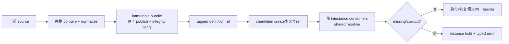

# R8/E-Definition — TF-16/18/19/21/22/23/24 单一工程合同

> 固定基线：`main@699842eba2eefc242d19f8fa9232bc1d9d5c3bdd`。  
> 需求锚点：AGGREGATE D10；事实输入：R7-02/03/11、R8/I-20、`18-r8-autonomy-root-cause.md`。仅写工程合同，不修改代码、WORKFLOW或DB，不创建worktree。

## A. 主 agent 摘要（≤1页）

采用唯一生命周期：



`PresetDefinition`闭集由production pre-run consumer机械求并集，不按“字段套餐”选择：identity/source manifest；item schema；runtime business-key声明与literal；完整status vocabulary；normalized task tree与node identity；prompt/template及fragment bytes、role binding；exits/trigger/transition declaration；variables/source/default/doc/type；runner/model defaults；rights；agent timeout；compile contract/schema version与warnings。runId、session、attempt、worktree/base commit、cursor、join evaluation/decision/result等运行期事实明确排除。chain定义另有tagged `ChainDefinitionRef`；其owner和最终字段份额由U类参数提供，但一旦提供，同样机械闭合所有chain-level pre-run consumers，不允许preset/current source代填。

bundle以canonical manifest及其全部相对文件bytes内容寻址；`PresetDefinitionRef`/`ChainDefinitionRef`禁止裸hash。完整compile与boundary校验成功后才可publish。publish先于create；create在一个SQLite事务中验证artifact为live、写definition元数据及chain/item ref。这样create失败最多留下无引用artifact，绝不会留下无content instance。

系统保留清晰双读面：

- `compile current`只回答“source现在说什么”，供compile CLI、新实例与ingress预校验；
- `resolve instance ref`只回答“该实例绑定什么”，供daemon/scheduler/resume/status/events/hook/GUI及所有mutation authorization。

两者不共享语义fallback。missing/corrupt/unsupported artifact使对应instance进入hold并返回typed error；禁止重新compile current source、禁止path/cache偶然冻结、禁止“最佳努力”rebind。

process cache仅是`tagged ref → verified immutable bundle Promise`的性能层，永远不是authority。retention以SQLite全部definition refs的可达性为准；GC与create共享ref级协调，在DB中先把无引用artifact标为retiring，再删除文件。source同basename新版本、并发publish、daemon restart均不能删除或替换仍被引用的bundle。

R8/I-20证明当前真实v14历史为15 chains、69 items、932 runs，全部没有definition identity/content，且当前active=0、3个stopped chain仍可被resume。它们统一标为`legacy-definition-unproven`：可只读查看，禁止resume/schedule/mutation；不能用current同名preset、event path、残留marker或status artifact伪造历史ref。此结论不要求用户猜历史内容，也不替U类chain owner/字段份额裁决。

## B. 确定工程合同

### B1. Definition ADT、闭集与identity

```text
DefinitionRef =
  | { kind:"preset", contentIdentity, schemaVersion }
  | { kind:"chain",  contentIdentity, schemaVersion }

DefinitionBundle = {
  ref, compileContractRef, manifest,
  normalizedDefinition, assets[{logicalPath,digest,bytes}],
  compileWarnings
}
```

`contentIdentity = sha256(canonical(manifest + normalizedDefinition + logicalPath/digest列表))`；不含物理artifact目录、mtime、source绝对路径或运行结果。manifest逐文件记录相对路径、长度和digest，禁止只用`.materialized-complete` marker。prompt里的preset-root使用logical asset ref在render边界解析，不把随机staging/机器路径写入语义hash。

PresetDefinition闭集及计算时点：

| 组 | 字段 | 最晚计算点 |
|---|---|---|
| source/identity | name、source manifest/hash、schema/contract ref | compile |
| item/runtime | id field、field schemas、business keys/literals | compile |
| control | statuses、tree/node ids、exits/triggers/transitions | compile |
| render | prompt/template bytes、fragments bytes/roles、variables/source/default/doc/type | compile |
| execution policy | runner/model defaults、rights、agent timeout | compile |
| diagnostics | compiled branch warnings | compile |

chain definition payload为`ChainDefinitionFields<UChainContract>`：U只提供owner与字段声明；compiler随后对chain task tree、顶层join及所有实际chain-level pre-run consumer做同样闭包检查。baseBranch等字段是否进入该payload不在此擅自决定；一旦U归属明确，不允许遗漏其consumer。

否决：仅保存projection（丢prompt/fragment bytes、完整binding、schema等）；仅保存source hash/identity shell（不能resolver）；保存整source绝对路径（可变且机器相关）；把runtime cursor/evaluation放入definition（变相MVCC）；让字段由实现者手挑（不能保证全consumer同源）。

### B2. Publish + create事务

#### Publish

1. 从稳定source snapshot收集全部文件bytes并计算manifest；
2. parse、typecheck、DAG/template/fragment校验并生成normalized definition；
3. 在同filesystem的staging目录写完整bundle；
4. 重新读取并校验boundary、逐文件digest及content identity；
5. `fsync`文件/目录后atomic rename到`definitions/<kind>/<contentIdentity>`；
6. 同ref已存在时只在完整复核相等后复用；不相等报`definition-ref-collision`。

不在publish时prune sibling。compile rejected不产生live bundle；staging由finally/recovery清理。不同hash互不删除，同hash并发最终复用同一经校验目录。

#### Create

- chain create：先取得所需chain ref及任何创建时已选preset refs，再在一个`BEGIN IMMEDIATE`事务中验证artifact metadata为`live`，写chain row与refs。
- item add/batch-add：先compile/publish选定preset；单item或整batch事务同时做binding admission、写item row与`PresetDefinitionRef`。batch任一失败则无item落地。
- runtime tree/run只引用已有instance ref；不得在first spawn才首次“认领”definition。

文件publish不能与SQLite形成单一跨介质事务，因此采用安全次序：**artifact先完成，DB ref后提交**。崩溃窗口只有可GC的无引用artifact；不存在已提交instance指向半成品。现有`execution_definitions` tagged PK/FK、source hash、staging+rename和`BEGIN IMMEDIATE`可复用；identity-only row须扩为可解析artifact metadata，当前first-spawn lazy insert须退出authority路径。

### B3. Shared resolver与双读面

只允许两个显式入口：

```text
compileCurrent(SourceLocator) -> CompileEnvelope
resolveDefinition(DefinitionRef) -> Result<VerifiedBundle, DefinitionResolveError>
```

所有instance行为必须先从row读取tagged ref，再调用`resolveDefinition`：

- daemon status vocabulary、unblock、item id/schema、terminal/status admission；
- exits/action、phase/rights/mutation authorization；
- scheduler plan、runner/model、prompt、fragment、binding render；
- session resume的完整effective prompt重渲染；
- startup recovery后的再调度；
- status/events/hook/GUI的definition展示。

`compileCurrent`不得接受instance id；`resolveDefinition`不得接受source locator。CLI/API命名和响应必须显示`current`或`instance/ref`，避免隐式混用。events可携ref作attribution，但不是content resolver。

### B4. Integrity、错误与hold

`resolveDefinition`在cache miss时核验：

1. tagged ref/schema version；
2. metadata state=`live`；
3. artifact目录与manifest存在；
4. manifest boundary；
5. 全部asset digest与content identity；
6. normalized definition public/private boundary。

封闭错误：`definition-ref-missing`、`definition-artifact-missing`、`definition-artifact-corrupt`、`definition-schema-unsupported`、`definition-kind-mismatch`、`definition-retiring`、`legacy-definition-unproven`。错误携chain/item/ref/损坏subject，不靠message控制流。

任何错误都：

- 拒绝新的mutation、spawn、resume和transition；
- 清除/不创建current-run，记录结构化hold reason；
- status明确显示held及所需ref；
- 保留DB/ref/artifact现场供修复；
- 不读取current source，不换ref，不生成“兼容”bundle。

artifact修复只能重新放回**与原ref逐byte/canonical identity一致**的bundle；不同内容必须是显式新实例或另行裁定migration。

### B5. Retention、GC与并发

SQLite `definition_artifacts`至少持`ref,state(live|retiring),manifestDigest,locator,createdAt`。所有chain/item/runtime node/run/history中仍存在的tagged ref组成mark set；只要任一持久对象引用，artifact不得retire。删除业务对象是否保留历史由其现存DB retention决定，GC不自行抹掉history row来腾artifact。

GC协议：

1. 仅扫描已完成且超过grace period的unreferenced live artifacts；
2. 取得ref级publish/GC lock并开启`BEGIN IMMEDIATE`；
3. 重新查询全部ref表；仍为零才标`retiring`并提交；
4. atomic rename到同filesystem trash，再递归删除；
5. 删除metadata row；失败保留retiring状态供restart续做。

create/publish在同一ref lock下只可引用`live`；因此不会在GC检查后新增ref。startup recovery清staging；对retiring完成删除；对live缺文件只报告corrupt/hold，不从source重建。禁止basename sibling eager prune、marker-only keep-set和吞掉rm失败。

### B6. Process cache

- key精确为完整tagged ref（kind/contentIdentity/schemaVersion），不是path、name、mtime、chain或item；
- value为`Promise<VerifiedBundle>`，并发cold read共享；只在完整integrity check后成功；
- bounded LRU eviction只影响内存，不影响artifact/instance；
- success可在进程内复用，因为bundle immutable；restart重验artifact；
- failure entry立即删除或短暂negative-cache后删除，允许原内容修复；不得退回current；
- cache hit replay同一bundle/compile warnings；context/event另行派生；
- GC不删除有DB ref的artifact，故无需cache lease充当持久性证明。

否决：path→Promise终身cache（H1/H2/restart分裂）；每次从current重compile（隐式rebind）；cache object作为唯一content（重启丢失）；用TTL选择definition（时间而非instance authority）。

### B7. Migration与legacy hold

真实v14 pre-ref数据没有可证明的历史bytes/hash：932/932 runs无definition identity，43个event materialized目录只剩2个且不能关联，run status也不能重建定义。因此migration固定为：

1. schema升级新增nullable tagged refs与hold reason，不为legacy row制造hash；
2. 所有现存legacy chain/item标`legacy-definition-unproven`；
3. 列表/status/audit保持只读可见；resume/schedule/mutation拒绝；
4. deleted历史保持原状态；3个stopped chain即使operator请求resume也先返回hold；
5. 只有外部可验证的exact bundle证据或未来显式migration产品裁决，才能另行写ref；current同名preset/path/event marker均不够。

这不是把迁移选择退给用户，而是由证据强制的非伪造策略。

### B8. 验证要求与事实依据

必须直接验证：

1. H1 create后编辑H2、daemon restart、status/mutation/resume/spawn仍解析H1；新instance为H2；
2. compile/fragment/template失败不publish、不pruneH1；
3. publish在每个写/rename/fsync/create提交崩溃点恢复后，仅出现unreferenced完整artifact或完整instance ref；
4. 同hash/不同hash并发publish不互删，create与GC竞争不产生dangling ref；
5. 缺文件、篡改asset/manifest、unknown schema均hold且从未读取current source；
6. cache cold/concurrent/hit/evict/restart始终按ref返回同bytes；
7. daemon、scheduler、resume、status/events/hook/GUI测试以resolver spy证明零instance path recompile；
8. v14 fixture升级后legacy可读、不可resume/mutate，且0个伪造ref；
9. mark/sweep覆盖chain/item/tree/run/history refs，cleanup失败可重试。

事实依据：R7-02证明path Promise cache及restart重绑；R7-03证明marker先于compile、eager prune、并发互删与损坏命中；R7-11 B2/B3机械列出pre-run字段与全部production consumers，B4/B6证明当前ref仅identity shell、first-spawn写入及无content resolver/GC；R8/I-20证明真实历史全部pre-ref且不可恢复。

**尾结论：TF-16/18/19/21/22/23/24收敛为“完整pre-run闭集的immutable bundle先原子publish，chain/item create事务再写tagged ref，全部instance consumer经shared resolver读取，ref可达性负责retention，cache仅按ref加速，missing/corrupt与pre-ref历史统一hold且绝不回退current source”的单一生命周期。**
