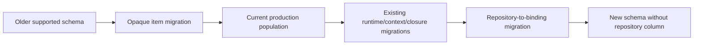
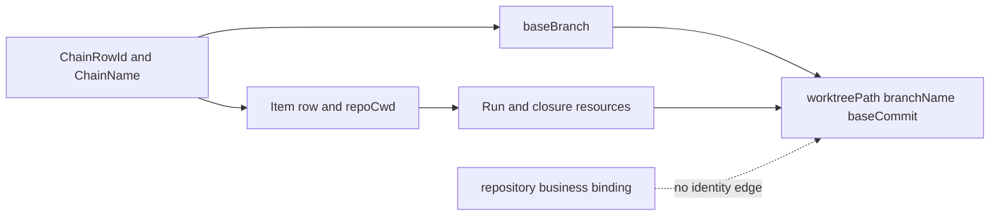

# RFC #547 R8/E-DeGitHub：engine 去 GitHub 原语与 repository migration 单一合同

> 固定基线：`main@699842eba2eefc242d19f8fa9232bc1d9d5c3bdd`。  
> 输入：`AGGREGATE-547.md` D7/D9、`13-r7-12-github-notation-surfaces.md`、`13-r7-13-repository-authority-migration.md`、`13-r7-14-chain-declaration-fallback.md`、`19-r8-i42-repository-population.md`、`18-r8-autonomy-root-cause.md`。  
> 覆盖：TF-40、TF-41、TF-44。  
> 本报告自主形成breaking、selector、migration与清零合同；不询问用户、不修改代码/WORKFLOW、不创建worktree。

## A. 主 agent 摘要（≤1页）

### A1. 单一收敛

E-DeGitHub必须在**一个可消费发布checkpoint**同时完成以下合同；中间提交只属施工态，不对外承诺可运行：

1. item id全入口opaque：CLI统一`--item`，wire统一`itemId`，queue不再normalize，batch runtime legacy keys删除；不留alias。
2. repository退出engine identity与物理schema，仅作为可选`chain.metadata.bindings.repository`业务值；`chain create --repository`可保留为不校验格式的纯sugar。
3. public chain selector使用已有唯一opaque chain name；SQLite row id是内部FK identity。repository不再参与target lookup、status selection或identity fingerprint。
4. `baseBranch`保留engine一等字段；worktree仍由chain/item row identity、chain name、item.repoCwd、baseBranch及persisted closure/run资源驱动。
5. current schema v14真实库先沿既有升级路径达到repository migration前shape，再以单个SQLite IMMEDIATE transaction将列值搬入binding并退列。15条current chain全部column-only、0冲突，均可机械搬运；冲突仍必须全事务响亮失败，不选边。
6. runtime不保留GitHub兼容层；旧CLI/wire调用在checkpoint后结构化失败。历史DB migration是唯一窄兼容面，可继续识别旧schema字段。
7. engine清零采用三层gate：typed/API symbol、public producer文本、version-scoped historical migration。合法preset业务字段`issue`明确允许，不属于engine清零。
8. 同checkpoint移除`DEFAULT_PRESET_NAME`与implicit seed；省略preset持久化null。无定义操作语义归既定D9/另一收敛合同，本报告只保证不再选择GitHub bundled preset。

### A2. 为什么selector只能是chain identity

repository已稳定降为business binding，不能继续充当engine target selector或cache key。现有chain name具备public唯一性并贯穿operator、worktree ownership与chain record；row id具备SQLite FK稳定性。故唯一不重新引入business authority的分工是：

- public/operator selector：opaque `chainName`；
- internal/storage selector：`chainRowId`；
- repository：可选业务binding，只投影、不寻址。

无repository的chain因此可正常创建/寻址；同repository可有任意多个chain；repository变化不改变chain identity。

### A3. 真实生产存量约束

当前权威DB为schema v14：15 chains、69 items、932 runs；15/15 repository均column-only、0 binding、0 conflict、0 non-GitHub形状。12 chains deleted、3 stopped；3条stopped仍有磁盘worktree，15/15有items+runs，15/15有baseBranch。v14没有main v16 closure表。

因此migration无需让操作员猜冲突选边，但必须：从v14可达、保留chain row ids/FKs/items/runs/extra、合并现有bindings而非覆盖、保留baseBranch、允许没有future repository值，并在任一冲突时零写回滚。

### A4. 兼容边界

- **runtime compatibility：零。** 无`--issue` alias、无queue normalize、无batch `issue|issueNumber` backfill、无repository forge parser、无default preset。
- **historical upgrade：窄。** v11→v12等旧DB字段转换可保留在versioned migration文件；不能被normal request parser调用。
- **业务preset：不清。** `gh-issue-pr-iteration`自己的`item.issue`、`{{ISSUE}}`等属于L2业务schema，可继续存在；它们不能泄回engine CLI/wire/schema。

---

## B. 确定合同

## B1. Identity模型

### B1.1 Item

```text
ItemId = OpaqueNonBlankString(maxLength=256, noWhitespace)
ItemIdentity = (ChainRowId, ItemId)
```

engine不解析`#`、slash、colon、owner/repo或数字。`owner/repo#42`、`42`与`#42`是三个不同id，必须全入口可分别寻址。

### B1.2 Chain

```text
ChainRowId = internal SQLite primary key
ChainName = public opaque unique selector
ChainIdentity = { rowId: ChainRowId, name: ChainName }
```

ChainName已有unique约束且参与worktree ownership；public command/status以name选择，daemon/store解析后用row id关联。若某API已有row id内部调用，可继续typed使用，但不得把repository拼进identity。

### B1.3 Repository与baseBranch

```text
RepositoryBinding = optional business JsonValue at metadata.bindings.repository
BaseBranch = engine-owned nonblank branch input
```

repository value不做forge格式校验；business schema若要求string，由对应typed chain declaration/admission负责，而非engine全局parser。baseBranch继续一等，因为真实Git/worktree路径消费它。

## B2. Public CLI与wire breaking合同（TF-40）

### B2.1 CLI

| 当前 | checkpoint后 |
|---|---|
| `item add/update/reorder/exits/exit-action --issue` | `--item` |
| `queue unblock --issue` | `--item` |
| batch JSON `issue|issueNumber` backfill | 仅`itemId` |
| `--umbrella owner/repo#n` | 移除engine parser/flag；业务bindings显式提供 |
| `chain create`强制repository | repository可省略；可选sugar只写binding |

旧flag直接由CLI grammar拒绝并显示新usage；不做deprecation alias，因为稳定D7要求clean rename。

### B2.2 Socket wire

| Operation | canonical selector |
|---|---|
| item CRUD/exits | `itemId` |
| queue unblock | `itemId` |
| batch child | `itemId` |
| chain lookup/status | `chainName`或内部typed `chainRowId` |

旧`issue`、`issueNumber`、repository target字段在normal wire得到`invalid_request: unsupported field`；不比较canonical与legacy值，不做normalize。

### B2.3 同checkpoint consumer同步

必须同步：

- root usage/help；
- engine completion epilogue；
- bundled preset command fragments；
- integration/real-e2e/fixture scripts；
- README/operator/operations/preset-authoring docs；
- shell completion或filesystem grants中的命令文本；
- socket client tests与error fixtures。

parser先改而producer文本未改的SHA不可作为发布点。

## B3. Repository读写合同（TF-41）

### B3.1 Create

chain create不要求repository。若调用者给`--repository <value>`：

1. 只检查它满足generic binding boundary/目标typed schema；
2. 写`metadata.bindings.repository=value`；
3. 不写物理列；
4. 不验证`owner/repo`；
5. 不改变chainName/rowId。

没有sugar时，caller可在bindings对象中显式给repository；两者同request同时出现且值不同必须按同一business field冲突响亮拒绝，不能last-wins。

### B3.2 Update

repository更新就是普通typed binding update，走merge后完整metadata admission。它不重命名chain、不迁worktree、不改变row id/closure/run关联。

### B3.3 Read/status

| Surface | Repository行为 |
|---|---|
| chain list/status | 可在business bindings projection中显示；缺失为missing，不伪造 |
| target lookup | 只按chainName/rowId，不按repository |
| prompt bindings | 只从metadata.bindings读取，不与列merge |
| fingerprint | 无repository专用字段；若generic business metadata本就是fingerprint输入，则作为普通binding随整体参与 |
| worktree/reconcile | 完全不读取repository |

status必须把`identity.chainName`与`bindings.repository?`分栏，避免consumer把业务值再次当selector。

## B4. DEFAULT preset退役接缝

同一breaking checkpoint：

- chain create未声明preset时持久化`null`；
- target/status resolver不加载global default；
- scheduler/item resolver在需要definition而无显式source时返回typed error/hold；
- `DEFAULT_PRESET_NAME` engine symbol清零。

合法bundled preset名称可在preset目录、fixture和文档性示例出现；不能作为engine fallback常量。repository migration不负责选择preset，两者是同checkpoint内独立migration/behavior gate。

## B5. Schema migration拓扑

### B5.1 输入shape

真实入口是v14，而main事实为v16。因此upgrade不是“只处理v16新库”，而是：



具体新version号由实现读取当前`STATE_SCHEMA_VERSION`顺序分配，不在报告猜数字；合同是所有受支持旧shape沿唯一有序路径可达。

### B5.2 Repository migration分类

```text
RepositoryMigrationRow =
  | ColumnOnly { value }
  | BindingOnly { value }
  | Consistent { value }
  | Conflict { columnValue, bindingValue }
  | Missing
```

处理：

| 分类 | 处理 |
|---|---|
| ColumnOnly | 将列值原样写入binding |
| BindingOnly | 保留binding |
| Consistent | 保留binding/同值，只记录consistent |
| Conflict | 整个migration响亮失败，零写，不选边 |
| Missing | 允许无repository binding，因repository是optional business field |

非GitHub字符串按opaque business value原样搬运，不规范化、不拒绝。

### B5.3 JSON merge

现有`metadata.bindings`可能含umbrella或其他业务键。migration仅设置/保留`repository`key，不替换bindings object或metadata remainder。malformed metadata/bindings是migration error，不能变空object吞数据。

## B6. Transaction与re-entry

### B6.1 单事务

repository migration在一个SQLite `IMMEDIATE` transaction中：

1. 检测schema/table/column shape；
2. 扫描全部chain并分类；
3. 若任一Conflict/malformed，抛typed migration error；
4. 为每row生成新metadata；
5. rebuild chains表，保留原`id/name/preset/base_branch/status/metadata/timestamps`；
6. 复制rows保持id；
7. 恢复indices/FKs；
8. 验证counts/FK；
9. 更新user_version；
10. commit。

commit前crash由SQLite rollback；没有跨文件副作用。

### B6.2 Shape re-entry

- 列存在且version旧：执行分类/migration；
- 列不存在且新metadata shape完整：视为已迁，不重复写；
- version/shape不一致但可证明处于既有migration重入态：按shape detector恢复；
- 无法证明的混合shape：响亮失败，不创建默认列/空binding。

### B6.3 外键与row identity

rebuild不得重新分配chain id。migration后必须满足：

- chain ids/names集合相同；
- items.chain_id、runs.chain_id仍全部有效；
- item ids、run ids、current/history rows逐项保留；
- baseBranch逐字相同；
- runtime/closure/worktree资源字段不改。

## B7. Current production population具体合同

| 事实 | migration约束 |
|---|---|
| schema v14 | 先过既有v15/v16 shape，再退列；测试必须含v14 fixture |
| 15 chains全部ColumnOnly | 15条全部写binding，不能要求预存binding |
| 0 conflict | 本机无需人工repair；不能删除Conflict guard |
| 0 nonGitHub | 无需当前数据转换；future非GitHub仍允许 |
| 69 items/932 runs | table rebuild保持全部FK与历史 |
| 15/15 chains有items+runs | 无chain可按“空壳”跳过 |
| 3 stopped chain有live worktree | migration不得清理/重建worktree |
| 15/15 baseBranch存在 | 全部保留；不随repository退列 |
| v14无closure表 | 验证既要覆盖v14历史run extra，也要覆盖升级后v16 closure rows |

迁移可以在只读预检先输出aggregate分类，但真实写入仍为上述单事务；current 0冲突使预检可自主判定为可迁，不需要用户选择。

## B8. 历史upgrade与runtime compatibility边界

### B8.1 可保留历史词表

versioned migration可继续识别：

- v11 `issue_number`列；
- historical `extra.issue`/`extra.id`优先级；
- legacy repository物理列；
- 旧schema shape detector字段。

这些只在`sqlite-state` migration dispatch的旧version分支可达。

### B8.2 禁止runtime复用

- batch parser不调用历史`issue|issueNumber`转换；
- queue selector不调用historical normalize；
- normal row decode不生成repository列fallback；
- new create/update不写legacy列/keys；
- docs不指导先用旧命令再迁。

历史migration的存在不构成runtime alias，也不推迟clean rename。

## B9. Failure ADT

```text
DeGithubError =
  | UnsupportedLegacyCliFlag { flag, replacement }
  | UnsupportedLegacyWireField { operation, field, replacement }
  | ItemIdInvalid { reason: empty|whitespace|tooLong }
  | ChainNotFound { chainName }
  | DuplicateChainName { chainName }
  | RepositoryBindingConflict { sourceA, sourceB }
  | RepositoryMigrationConflict { chainRowId, columnHash, bindingHash }
  | RepositoryMigrationMalformedMetadata { chainRowId, path }
  | RepositoryMigrationShapeMismatch { userVersion, observedShape }
  | RepositoryMigrationIntegrityFailure { invariant }
  | DefinitionSourceMissing { chainName, itemId? }
```

migration errors只记录row id和hash/类型，不把repository敏感值写日志。Conflict不是retryable；修复数据/shape后重新启动migration。DB busy/IO沿infra error，不与业务conflict混合。

## B10. Engine清零gate（TF-44）

清零不是单个全仓grep，而是三个互补gate。

### B10.1 Gate 1：typed/API surface

对engine-owned `src/`与public type declarations验证无：

- `normalizeQueueIssueId`；
- `parseUmbrellaRef`、umbrellaRepo/umbrellaIssue engine typed slots；
- runtime `issueNumber`/queue wire `issue`；
- repository physical chain field、forge regex、repository-based target selector；
- `DEFAULT_PRESET_NAME`；
- CLI union中`--issue`。

使用TypeScript/compiler tests与exact symbol search；不能仅靠文字grep证明wire/type已变。

### B10.2 Gate 2：public producers/consumers

对`src` usage/epilogue、`presets` command fragments、`scripts`、operator docs与fixtures验证：

- 无engine command `--issue`；
- queue/item示例使用`--item`/`itemId`；
- 无repository必填/forge格式说明；
- 无implicit default preset说明。

合法`gh-issue-pr-iteration`业务字段`issue`、template `{{ISSUE}}`允许，但其文本若构造engine command必须使用`--item`。

### B10.3 Gate 3：historical migration窄允许表

历史词表只允许在具名version migration函数、其focused fixture与migration guide出现。allowlist按文件+symbol+schema version精确列出；禁止目录级豁免。每个允许项必须有从旧shape升级的test，证明其不被runtime parser引用。

### B10.4 Ownership分类

| 命中 | 分类 |
|---|---|
| preset `item.issue`业务schema | allowed L2 business |
| migration `issue_number` | allowed historical, narrow |
| CLI `--issue` | forbidden engine public |
| wire `{issue:...}` | forbidden engine runtime |
| repository binding key | allowed business |
| `chains.repository`列/type | forbidden physical primitive |
| bundled preset名称fixture | allowed explicit preset |
| engine default constant | forbidden fallback |

## B11. Status、fingerprint与observability

### B11.1 Status

```text
chain.identity = { rowId?, name }
chain.bindings.repository = optional business projection
chain.baseBranch = engine resource field
```

operator filtering按chainName/status等engine fields；repository如需业务过滤，由generic binding query明确表达，不能偷偷作为target identity。

### B11.2 Fingerprint

chain completion fingerprint移除专用`chain.repository`输入。若算法本就hash canonical metadata以检测业务上下文变化，repository binding随metadata整体自然参与；不得同时再加一次repository特权字段。migration前后对相同业务metadata的canonical projection应稳定，或明确产生一次versioned fingerprint reset，不能暗中keep-active/retrigger。

### B11.3 Events/logs

- chain/item events以chainName/row id/itemId关联；
- repository只在授权business binding projection出现；
- migration event记录counts/classification/hashes，不记录原值；
- legacy CLI/wire failure记录field/operation/replacement，不回显敏感payload。

## B12. Closure/worktree不变量



逐项不变量：

- chain/item/run/closure row ids和FK；
- closureId/runtimeNodeId/definition refs；
- item.repoCwd；
- chain.baseBranch；
- worktreePath、branchName、baseCommit；
- run/session/history extra；
- current stopped/deleted状态。

migration不调用Git、不移动目录、不清理orphan、不重算branch。资源验证只读比对DB与现存path。

## B13. 具体触点

| 层 | 触点 |
|---|---|
| CLI grammar | item五命令、queue unblock、batch parser、chain create、root usage |
| daemon wire | ITEM/QUEUE keysets、known-key validator、chain lookup |
| item selector | 删除queue normalization，统一validateItemId |
| chain identity | name→row id resolver、status/list/filter |
| chain create | repository optional sugar→bindings；preset omitted→null |
| runtime data | repository不再typed physical field；bindings保真 |
| SQLite schema | chains退repository列，保留base_branch；version migration |
| migrations | v11→v12历史item；v14→v16可达；repository退列 |
| renderer | repository只从bindings；无列fallback |
| scheduler | target/fingerprint去repository特权；worktree链不变 |
| status/events | identity与business binding分栏 |
| engine prose | phase exits epilogue、usage/errors |
| bundled preset | action fragments命令flag；业务issue字段保留 |
| scripts/docs | integration/real-e2e/README/operator docs全同步 |
| tests | selector同构、migration、closure/resource、清零gate |

## B14. 事务与发布时序

### B14.1 施工提交允许顺序

可以分提交实现type、migration、CLI、consumer文本、tests，但任何中间SHA若存在以下任一情况都不可发布：

- daemon只接受新wire而engine epilogue仍发旧flag；
- schema已退列而status仍读列；
- CLI已opaque而queue仍normalize；
- default seed删除但target resolver仍global fallback；
- migration未能从v14到达；
-清零gate未覆盖历史/业务ownership。

### B14.2 发布checkpoint readiness

单checkpoint必须同时具备：

1. all runtime/public consumers新contract；
2. old DB自动upgrade；
3. old runtime caller结构化breaking；
4. current DB dry-copy migration验证；
5. resource invariants验证；
6. symbol/public/historical三层清零gate；
7. explicit preset/null behavior一致。

不提供“双协议过渡发布”，因为alias/双列/dual read会重新建立双权威并违反D7。

## B15. 明确否决的形态

1. 保留`--issue` alias/deprecation期。
2. queue CLI与direct wire采用不同normalize。
3. batch继续接受`issue|issueNumber`。
4. repository列作为legacy cache长期保留。
5. binding权威但target/status继续读列。
6. repository binding继续做engine primary selector。
7. 无repository时从git remote推断并持久化。
8. migration冲突时列赢或binding赢。
9. nonGitHub值拒绝/规范化。
10. repository退列同时删除baseBranch。
11. rebuild重分配chain ids或清理deleted/stopped资源。
12. 只对v16空fixture验证，不覆盖真实v14shape。
13. runtime parser调用historical migration helper。
14. 全仓删除字符串`issue`并误伤preset业务schema。
15. 目录级allowlist掩盖新engine legacy命中。
16. default bundled preset以另一个常量/target resolver继续存在。
17. 用repository+chainName复合selector制造新business identity。

## B16. 验证合同

### B16.1 Opaque selectors

- 同chain创建`owner/repo#42`、`42`、`#42`三个item；一般CRUD与queue CLI/direct wire分别原样命中；
- whitespace/empty/too-long按中性validator拒绝；
- old `--issue`与wire `issue`均明确unsupported；
- batch mixed legacy/canonical不进入比较分支，legacy field直接unsupported。

### B16.2 Chain selector

- 无repository创建两个不同name chains成功；
- 相同repository binding下多chain按name分别寻址；
- 修改/删除repository binding后chainName、row id、status lookup不变；
- repo外值不被forge parser拒绝。

### B16.3 Migration fixture矩阵

- v14真实shape：15 column-only等价fixture→全部binding、退列、baseBranch/FK不变；
- consistent、binding-only、missing分别成功；
- conflict在任何写前使整个transaction失败；
- malformed metadata/bindings失败且原库不变；
- nonGitHub字符串逐字round-trip；
- re-entry shape重复启动不重复改写。

### B16.4 Current DB copy验证

只在本地副本运行完整upgrade：

- before/after chain id/name、69 items、932 runs与FK逐项相同；
- 15 repository hashes对应15 binding hashes；
- baseBranch hashes相同；
- 3个现存worktree path不移动，12个历史path记录保留；
- daemon以新schema启动，list/status按chainName读取；
- 不连接真实runner/GitHub、不执行生产migration。

### B16.5 Closure/resource

在v16含closure fixture上比对closureId/runtimeNodeId/worktreePath/branchName/baseCommit；迁移前后restart/reconcile只读同资源。v14没有closure表时不伪报0，而是验证历史run extra完整并继续升级后fixture。

### B16.6 Clean gates

- typed/API exact symbols零命中；
- `src/presets/scripts/docs`中engine command `--issue`零命中；
- historical allowlist只有versioned migration symbols且每项有fixture；
- preset business `issue` fixture继续compile/render，证明未误删；
- `DEFAULT_PRESET_NAME` engine symbol零命中，省略preset status显示null。

### B16.7 Runtime E2E边界

实现issue须启动隔离daemon，从v14 DB副本完成upgrade，再经真实CLI执行chain create/item add/queue unblock/status并观察SQLite、status与worktree资源。typecheck/unit/grep仅辅助，不能替代此进程级路径。coder-loop GitHub real E2E仍只由专用compatibility issue在冻结SHA运行。

## B17. 资产复用

| 资产 | 复用 |
|---|---|
| `item_id TEXT`+chain unique | opaque identity主体 |
| daemon `itemId` CRUD wire | canonical selector命名 |
| `validateItemId` | 中性shape校验 |
| chain name unique/row id FK | public/internal selector |
| metadata JSON保真 | repository business binding |
| SQLite IMMEDIATE migrations | 单事务退列 |
| table rebuild/shape detection先例 | v14→new schema可达/re-entry |
| item.repoCwd/baseBranch | worktree identity |
| persisted run/closure resources | recovery不变量 |
| unsupported field validator | breaking wire error |

这些资产不能被用来保留GitHub词表：历史migration框架不等于runtime compatibility，chain name/row id也不要求repository存在。

## B18. 仍登记但不阻塞的未知

1. 新schema具体version数字；按实现时current version顺序分配，不改变合同。
2. repo外旧CLI/socket caller数量；breaking checkpoint已明确，不保留alias。
3. 其他机器是否存在repository conflict；migration guard覆盖。
4. generic metadata fingerprint未来整体算法；本合同只禁止repository特权/identity作用。
5. external typed chain producer最终artifact；repository业务binding与chain identity已独立。

没有未知需要重新打开TF-40/41/44。

## B19. 证据索引

| 事实 | 输入 |
|---|---|
| D7 opaque/repository/CLI/清零 | `AGGREGATE-547.md` D7 |
| D9无default preset | `AGGREGATE-547.md` D9 |
| CLI/wire/batch/migration差异 | `13-r7-12-github-notation-surfaces.md` |
| repository双权威/resource identity | `13-r7-13-repository-authority-migration.md` |
| preset default/resolver分裂 | `13-r7-14-chain-declaration-fallback.md` |
| 真实v14 population/resources | `19-r8-i42-repository-population.md` |
| 自主收敛责任 | `18-r8-autonomy-root-cause.md` |

## B20. 尾部结论

**E-DeGitHub尾部结论：TF-40/41/44已单一收敛。一个可消费breaking checkpoint同时把item CLI改为`--item`、wire改为`itemId`、删除queue/batch GitHub normalize与runtime alias、让repository只作为可选business binding并退物理列、让chainName/row id分别承担public/internal identity、保留baseBranch并清除implicit default preset。repository migration必须从真实schema v14沿既有升级路径可达，在单个IMMEDIATE transaction中分类、冲突零写失败、搬运15条column-only值并保持chain ids、69 items、932 runs、closure/worktree资源与baseBranch。清零gate分typed/API、public producer文本、historical migration三层；合法preset业务`issue`与窄历史升级词表明确豁免，engine runtime零GitHub原语。旧caller在checkpoint后结构化失败，不以alias、双列或repository selector延长双权威。**
