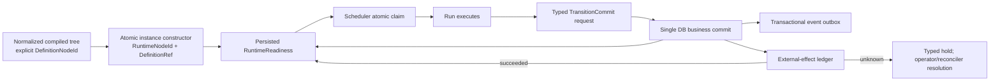

# RFC #547 R8 自主工程收敛 E-Runtime：TF-26/27/28/29/30

> 固定基线：`main@699842eba2eefc242d19f8fa9232bc1d9d5c3bdd`。  
> 输入：`AGGREGATE-547.md` D3 / §2.5、`13-r7-07-compiled-tree-model.md`、`13-r7-08-runtime-transition-commit.md`、`19-r8-i31-par-runtime-readiness.md`、`18-r8-autonomy-root-cause.md`。  
> 边界：自主工程归约，不询问操作员；不改代码/WORKFLOW，不建 worktree，不把未来 par 能力扩成当前需求。

## A. 摘要（≤1页）

TF-26…30 收敛为一条唯一链，不存在需要用户选择的实现分叉：

1. **定义 identity**：每个可引用 compiled node 必须携带 preset-local、显式、稳定、唯一的 `DefinitionNodeId`；移动节点不改 id。结构路径只用于 diagnostic，不作 identity。每个运行实例在物化事务中分配 opaque `RuntimeNodeId`，并永久携带 `(ExecutionDefinitionRef, DefinitionNodeId)`；runtime id 不由路径、phase name或数组位置派生。
2. **constructor**：chain-owned root 在 chain create 与 pinned `ChainDefinitionRef` 同事务物化；item-owned subtree 在 item admission 与 item row、pinned `PresetDefinitionRef`、完整 typed bindings 同事务物化。constructor 递归消费唯一 normalized compiled tree，完整写入 node/edge/join/initial readiness；禁止 run-start lazy append 充当 constructor。事务失败即实例不存在，无 orphan half-tree。
3. **scheduler authority**：scheduler 只查询持久化 runtime readiness并以原子 claim 获得 ready leaf；`preset.phases[]`、`item.phase/status/lastRunId`、runner exit只能是 compatibility projection、输入事实或审计，不能决定后继。线性 preset先 normalize成退化 seq，再走同一 constructor/readiness/transition路径。
4. **唯一业务 commit**：runner退出不是完成信号。agent/validator提交 typed transition，唯一 `commitTransition` 在一个数据库事务中验证 run/leaf/definition/path/typed exit payload，写 transition record，推进 node/cursor/join/readiness，更新 compatibility projections，并写同事务 outbox events。成功返回 stable `TransitionId`；相同 idempotency key重放返回原结果，不重复推进。
5. **副作用与恢复**：数据库内推进 exactly-once-by-key；外部副作用不伪称 exactly-once。每项 effect 带 stable idempotency key与 durable ledger。可证明未执行才 retry；可证明完成则收敛 succeeded；崩溃后无法判定则进入 typed `unknown` 并 hold关联node/transition，禁止自动重放。恢复只重放 committed DB transition/outbox和可安全重试effect，不从旧phase/status猜业务推进。
6. **当前 par guard**：production没有 non-degenerate par链。现在唯一确定动作是在具体item pinned definition加载后、任何worktree/branch/run/current-run/process等副作用前，以具名 `par_runtime_unsupported` 拒绝；compile可产出结构，但scheduler不得串行降级。guard不要求实现future par scheduler。

这套合同以“identity → constructor → readiness claim → typed commit → recovery ledger”形成单一因果闭环。它保留现有 strict runtime ADT/SQLite约束、definition/run/closure关联、局部run-start事务、closure resource reconciliation与outbox意图资产，但降级现有phase-array推进、lazy leaf append和orphan-run repair为迁移/兼容机制，不能继续冒充runtime语义权威。

## B. 确定合同

## B1. 单一数据链



一条边只拥有一个权威：compiled tree定义结构，constructor定义实例诞生，runtime readiness定义可调度性，transition commit定义业务推进，effect ledger定义外部副作用恢复。

## B2. TF-26 — node identity

### B2.1 Definition identity

```ts
DefinitionNodeIdentity = {
  definitionRef: ExecutionDefinitionRef,
  definitionNodeId: DefinitionNodeId
}
```

确定约束：

- `DefinitionNodeId` 是作者显式声明的非空 identifier，在单个 compiled definition 全树唯一；
- compile在装载期拒绝重复、缺失与悬空引用；
- rename显示名、移动父节点、改变结构路径不得改变 id；
- linear legacy normalization生成确定的兼容 id，但生成规则只属于migration adapter；normalized model之后不保留“显式/生成”双语义；
- candidate、transition target、reopen target、dependsOn全部引用 id，不引用数组下标或路径；
- diagnostic可附结构路径，但存储/FK/event/API不得以路径作主键。

### B2.2 Runtime identity

```ts
RuntimeNodeIdentity = {
  runtimeNodeId: RuntimeNodeId,
  definitionRef: ExecutionDefinitionRef,
  definitionNodeId: DefinitionNodeId
}
```

- `RuntimeNodeId` 在constructor内分配并由DB唯一约束；是运行实例内的稳定主键；
- 同一definition可被多个chain/item实例化，故不能只用definition node id作runtime主键；
- reopen/evaluation epoch改变状态，不重造node identity；若业务确需新增correction node，必须作为新物化实例获得新runtime id并显式记录source transition；
- run、closure、transition、readiness、event均引用runtime id；definition pair用于跨compile/persistence/status/events关联。

### B2.3 否决形态

| 否决形态 | 理由 |
|---|---|
| path/position作id | move会改id，违反P-D3-1 |
| phase name拼接作全局id | rename漂移，且nested同名域不可扩 |
| runtime直接复用definition id | 多实例冲突，丢instance身份 |
| `(position,id)`混合权威 | 产生两套相等性；位置会抢跑稳定id |
| reopen重造全部runtime ids | 破坏历史run/transition关联与幂等key |

## B3. TF-27 — constructor时点与事务

### B3.1 两个实例边界

| 实例 | constructor时点 | 同事务内容 |
|---|---|---|
| chain definition instance | `chain create`，typed chain declaration与pin均已解析后 | chain row、`ChainDefinitionRef`、root runtime tree、initial node states/readiness、bindings |
| item definition instance | `item add/batch-add`，具体item preset与bindings已解析后 | item row、`PresetDefinitionRef`、item-owned subtree/attachments、initial readiness、bindings |

mixed-preset chain要求item constructor以该item自己的pinned definition为输入，禁止代表item或chain seed preset代算其他item。

### B3.2 Constructor输入/输出

```ts
MaterializeInput = {
  owner: ChainOwner | ItemOwner,
  definitionRef: ExecutionDefinitionRef,
  compiledRoot: CompiledTaskNode,
  typedBindings: BindingEnvironment
}

MaterializeResult = {
  instanceRef: ExecutionInstanceRef,
  rootRuntimeNodeId: RuntimeNodeId,
  nodeMap: ReadonlyMap<DefinitionNodeId, RuntimeNodeId>
}
```

constructor是pure planning + single store transaction：

1. 递归遍历normalized tree；
2. 分配runtime ids并建立definition→runtime map；
3. 验证所有内部引用可解析；
4. 计算initial state/readiness；
5. 在单事务写owner、pin、nodes、edges、join config与readiness；
6. commit后才对scheduler可见。

任何错误回滚全部记录。禁止先建chain/item后异步补树；禁止scheduler第一次run时按phase动态append；禁止store public fixture API成为production constructor入口。

### B3.3 现有资产

保留：runtime leaf/seq/par/join strict ADT、SQLite FK/check/unique、definitionRef+definitionNodeId字段、closure/run关联。重构：`ensureRuntimeClosure`的lazy root/leaf逻辑只作为legacy migration helper，完成迁移后不在new-instance production路径。

## B4. TF-28 — readiness唯一scheduler权威

### B4.1 Readiness ADT

```ts
RuntimeReadiness =
  | { kind: "blocked"; blockers: NonEmptyArray<RuntimeBlocker> }
  | { kind: "ready"; readinessVersion: number }
  | { kind: "claimed"; claimId: ClaimId; runId: RunId }
  | { kind: "awaiting-transition"; runId: RunId }
  | { kind: "held"; reason: HoldReason }
  | { kind: "terminal"; outcome: RuntimeTerminalOutcome }
```

`RuntimeBlocker`是封闭ADT，至少区分 predecessor-transition、dependency、join、gate、external-effect、unsupported-capability。boolean/nullable soup不允许。

### B4.2 Scheduler触点

当前 `selectNextItemAndPhase` / `buildPhasePlanFromPreset` 的权威角色由单一store query替代：

1. 查询`ready` leaves；
2. 依已裁公平/容量规则选择；
3. CAS/事务 `ready → claimed(runId)`；
4. claim成功后才准备资源并spawn；
5. process exit写run事实并使node进入`awaiting-transition`或失败/hold，不直接推进后继；
6. only `commitTransition`重新计算并写后继readiness。

### B4.3 旧事实的新角色

| 旧事实 | 新角色 | 禁止用途 |
|---|---|---|
| `preset.phases[]` | parse兼容输入，立即normalize为tree | scheduler index+1 |
| `item.phase` | compatibility projection/current display | readiness authority |
| `item.status` | business vocabulary projection/transition input | 单独解锁seq后继 |
| `lastRunId` | audit与当前run关联 | 判定phase完成 |
| run `exitCode/endedAt` | execution fact、transition admission输入 | business completion |
| `seq.cursor` | runtime结构投影，随commit同事务更新 | 与readiness分别写成双权威 |

compat fields由transition transaction单向投影，禁止反向驱动runtime。迁移完成前若投影与runtime不一致，scheduler信runtime并发diagnostic；不得“择一看起来合理”。

## B5. TF-29 — typed transition唯一业务commit

### B5.1 Transition request ADT

```ts
TransitionCommitRequest = {
  transitionId: TransitionId,
  idempotencyKey: TransitionKey,
  instanceRef: ExecutionInstanceRef,
  sourceRuntimeNodeId: RuntimeNodeId,
  sourceDefinition: DefinitionNodeIdentity,
  runId: RunId,
  pathId: TransitionPathId,
  exit: TypedExitPayload,
  observedReadinessVersion: number
}
```

- request来自agent-owned exit CLI或trusted validator ingress；边界parse后才进入domain；
- `pathId`必须属于source compiled node；target/template/bindings/exit schema从pinned definition解析；request不能自由构造target；
- run必须是该leaf当前claim/awaiting-transition run；stale/foreign run拒绝；
- exit payload按path声明的`exit.*` schema精确验证；外部权威bindings不可由agent覆盖。

### B5.2 Transition状态

```ts
TransitionRecord =
  | { kind: "committed"; transitionId; key; source; target; exit; commitVersion }
  | { kind: "held"; transitionId; key; source; reason }
```

普通domain validation failure不写伪transition；返回typed rejection。只有需要持久恢复的外部unknown/gate hold成为`held`。

### B5.3 单事务业务效果

`commitTransition`事务必须同时：

1. 以idempotency key查重；命中返回原record；
2. 锁定/验证source runtime state和readiness version；
3. 写immutable transition record；
4. 更新source terminal/held state；
5. 更新seq cursor、dependency satisfaction、join input/evaluation候选；
6. materialize已由compiled path明确要求的runtime target/correction（若目标在初始constructor已存在，只激活不重建）；
7. 重算受影响nodes的readiness；
8. 更新item phase/status等compat projections；
9. 写event outbox；
10. 原子commit。

事件发布失败不回滚business commit；outbox重试发布。事件不是commit authority。

### B5.4 Materialization规则

- static compiled nodes在constructor一次性物化；transition只变state/readiness；
- dynamic correction/validator invocation只有compiled candidate/typed target授权时才可物化；
- 动态物化记录`sourceTransitionId + definitionRef + candidateId/definitionNodeId`，同transition key重放返回同runtime ids；
- 不接受自由JSON node、位置寻址或“先插item后补边”。

## B6. TF-30 — recovery与dedupe

### B6.1 DB内恢复

- transition record/readiness/cursor/join/projection/outbox同事务，因此restart不需要猜close handler执行到哪一步；
- committed transition存在即已完成，按key重放返回原结果；
- run ended但无transition：node保持`awaiting-transition`或typed hold，不能从exit 0推断advance；
- claimed run在restart被证实process消失：记录orphan execution fact，释放/转换claim前先依据是否存在committed transition；
- outbox按event id重发，consumer去重；
- constructor事务无半成品；若instance不存在则重新执行整个admission，不做partial tree repair。

### B6.2 外部副作用ledger

```ts
EffectState =
  | { kind: "planned"; effectId; idempotencyKey }
  | { kind: "executing"; effectId; attempt }
  | { kind: "succeeded"; effectId; receipt }
  | { kind: "failed-retryable"; effectId; nextAttemptAt; error }
  | { kind: "failed-terminal"; effectId; error }
  | { kind: "unknown"; effectId; lastAttempt; reason }
```

规则：

- effect intent在触发外部动作前持久化；
- 对支持幂等key/查询receipt的系统，重试复用同key并以receipt收敛；
- 可证明请求未发出才从planned安全重试；
- process在请求后、receipt持久化前崩溃且外部无查询/幂等保证 → `unknown`；
- `unknown`阻塞依赖该effect的transition/node，禁止自动重放；仅typed reconciler/operator evidence可转succeeded或明确retry；
- git/worktree本地资源继续使用closure identity与reconciliation资产，但git push/PR/API等外部动作仍按ledger，不因本地branch存在推断远端effect完成。

### B6.3 去重键

| 行为 | key |
|---|---|
| runtime constructor | `(instanceRef, definitionRef)` |
| transition commit | `(instanceRef, sourceRuntimeNodeId, runId, pathId, agentExitSubmissionId)` |
| dynamic materialization | `transitionId + target/candidate identity` |
| outbox event | `transitionId + eventKind + ordinal` |
| external effect | `transitionId + effectKind + targetIdentity` |

keys是typed product，不用拼接路径字符串；持久化唯一约束是最终防线。

## B7. Compatibility与migration

1. 对每个legacy linear definition先normalize为退化seq并生成稳定兼容DefinitionNodeId映射；映射持久化到definition artifact，不能每次启动重算不同值。
2. 对未实例化对象，新constructor直接生效。
3. 对存量active instance，migration在scheduler重新开放前一次性事务物化runtime tree，并把现有item/run/phase事实仅作为migration输入；生成明确`legacy-migrated` provenance。
4. 无法唯一映射（冲突run、phase未知、缺definition artifact）→ typed hold；禁止猜测current preset或隐式rebind。
5. migration后scheduler只读runtime readiness。旧字段继续作为projection直到所有外部read consumer迁移完成；写入口只允许transition transaction更新。
6. schema migration rollback只负责物理原子性；不通过保留双scheduler权威实现兼容。

## B8. 当前 non-degenerate par guard

### B8.1 唯一位置

在`spawnSchedulerRun`加载**具体item pinned definition**之后，且在以下任何动作之前：

- worktree/branch/base pin准备；
- runtime lazy node/closure/run写入；
- current-run/item attempt更新；
- credential mint；
- runner process spawn；
- 外部请求。

检测normalized compiled tree含non-degenerate par即返回：

```ts
{ kind: "unsupported-capability", capability: "par-runtime", code: "par_runtime_unsupported", definitionRef, nodeId }
```

该拒绝进入structured diagnostic/status/event；item/chain保持未执行hold，不消耗attempt。

### B8.2 为什么不放别处

- compile不能拒绝合法D3结构；P-D3-6明确是调度能力guard；
- representative-item phase plan不适合mixed preset；
- run/closure写后才拒绝已经发生副作用；
- scheduler fallback串行会改变join/reopen语义；warn会静默卡死或错跑。

### B8.3 guard解除条件

只由外树真实par scheduler capability及其专用integration证明解除。当前报告不定义concurrency/reopen/join执行算法，不从future扩需求。

## B9. 具体实现触点

| 触点 | 目标改造 |
|---|---|
| preset TOML boundary / compiler | recursive normalized tree、explicit ids、typed paths、linear adapter、reject unknown structural input |
| compile projection/schema | 真实递归tree与identity/path/candidate投影 |
| definition artifact/pin resolver | constructor只消费pinned compiled artifact |
| chain create | chain tree materialization transaction |
| item add/batch add | item subtree + bindings + pin原子materialization；batch全回滚 |
| `sqlite-state.ts` | constructor transaction、readiness/claim、transition/outbox/effect ledger原子API |
| scheduler selection | phase-plan替换为ready leaf query + claim；加入par unsupported guard |
| run close | 只写execution fact/awaiting-transition，不推进business path |
| exit CLI/daemon admission | typed transition request parse、run ownership、idempotency |
| status/events | runtime tree/readiness/transition/effect hold同identity投影 |
| startup recovery | claim/orphan reconciliation、transition/outbox/effect recovery，不读current preset猜推进 |
| migration | linear definition mapping、active instance materialization、conflict hold |

## B10. 事件合同

最小事件族：

- `runtime.instance_materialized`
- `runtime.node_readiness_changed`
- `runtime.node_claimed`
- `runtime.transition_committed`
- `runtime.transition_rejected`（validation，不是business record）
- `runtime.transition_held`
- `runtime.effect_state_changed`
- `runtime.recovery_action`
- `runtime.unsupported_capability`

每条包含`instanceRef/runtimeNodeId/definitionRef/definitionNodeId`相关子集和stable event id；transition事件含transitionId/pathId/runId，禁止以phase index或路径代替identity。event由transactional outbox投递。

## B11. 资源合同

- closure仍是task-level资源所有权边界；runtime leaf引用closure identity；
- constructor不创建worktree/branch：它只写逻辑实例；资源在node claim后准备，避免未ready节点副作用；
- prepared resource与run-start继续利用现有局部原子事务，但必须受claimId/runtimeNodeId约束；
- par runtime未支持时不准备任何成员资源；
- consume/cleanup由committed transition触发intent，保留现有retryable cleanup facts；
- cleanup失败不回滚transition，资源ledger保持待清理并可恢复。

## B12. 验证合同

### 静态/单元

1. explicit id duplicate/missing/dangling/move-stability；
2. linear→degenerate seq normalization只有一个post-parse model；
3. constructor deterministic plan与事务rollback；
4. readiness ADT/transition ADT exhaustive；
5. typed exit与target binding compatibility；
6. idempotency unique constraints/outbox event ids；
7. legacy migration conflicts进入hold。

### 进程级integration

1. create item后、spawn前读取完整runtime tree，identity跨compiled/SQLite/status一致；
2. seq(A,B)：A exit 0但无transition时B不ready；提交valid transition后B ready；
3. duplicate transition同结果、无二次cursor/readiness/event；
4. kill -9分别发生在run exit前、transition事务前/后、outbox publish前/后，restart不猜推进、不重复business commit；
5. external effect：幂等成功重试、可查询receipt恢复、不可判定进入unknown hold；
6. mixed-preset items各由自身definition constructor/guard；
7. non-degenerate par在首个资源/run副作用前具名拒绝，attempt不增加。

### 专用整链路

冻结SHA的v3 integration连接compile→constructor→readiness→claim→typed transition→status/events→restart。compatibility real E2E由专用#685执行，不由本工程合同提前扩大。

## B13. 资产与否决总表

### 保留资产

- strict runtime task ADT与SQLite constraints/round-trip；
- `ExecutionDefinitionRef + definitionNodeId + runtimeNodeId`关联方向；
- run/closure identity与prepared-resource局部事务；
- closure consumption intent、cleanup/reconciliation；
- SQLite `BEGIN IMMEDIATE`、unique/FK/check；
- observability typed boundaries与outbox式恢复先例；
- orphan process/run detection，改作execution repair输入。

### 否决

| 形态 | 否决理由 |
|---|---|
| phase-array继续作scheduler fallback | 留第二权威，par错跑 |
| lazy run-start建tree | constructor晚于副作用，实例不完整 |
| runner exit=business complete | 无typed path/payload，crash窗口无法判别 |
| item.status单独解锁后继 | 绕过数据边与commit |
| 多store method顺序视为事务 | crash可见partial state |
| event视为commit | event publish可失败/重放，非business authority |
| 外部effect声称exactly-once | 本地DB不能原子覆盖远端系统 |
| unknown自动retry | 可能重复不可逆副作用 |
| 从current preset恢复旧instance | 违反definition pin/no implicit rebind |
| 借现有par SQL宣称runtime ready | 无definition→constructor→scheduler production链 |
| 为解除guard提前设计par算法 | 超出当前确定需求，产物自增长 |

## 尾结论

**单一收敛：显式稳定DefinitionNodeId → admission时原子runtime constructor → 持久readiness唯一scheduler权威 → typed transition单一业务commit → outbox/effect ledger恢复；外部副作用unknown即hold。** 现有phase推进/lazy tree/orphan repair只作迁移资产，不再作authority。production par链不存在，当前唯一正确行为是在具体item definition加载后、最早副作用前返回具名`par_runtime_unsupported`，不串行降级，也不借future能力扩需求。
