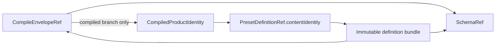

# RFC #547 — R8 正式决策与统一集成合同

> 固定基线：`main@699842eba2eefc242d19f8fa9232bc1d9d5c3bdd`。  
> 事实源：`AGGREGATE-547.md`、`18-r8-autonomy-root-cause.md`、7份19号调查、6份20号工程合同、`21-r8-autonomy-audit.md`、`21-r8-u-autonomous-decisions.md`。  
> 本报告只完成规范收敛；不声称未实现dependency已经交付，不修改WORKFLOW/AGGREGATE/代码。

## A. 正式摘要（≤1页）

R8正式收敛完成：**44/44决策有唯一记录，未映射0，剩余用户问题0。** 5个A恢复稳定条款；7个I由真实人口/owner/runtime调查转成可执行约束；26个E进入6份单一工程合同；6个原U依据用户“自主完成workflow”授权、稳定公理与真实owner形成正式裁决。

六项正式自主裁决：

1. doctor默认只诊断current definition并显示其compile findings；pinned instance健康归status/ref读面或显式definition-ref入口，不默认扫描instances。
2. schema规范producer是本仓coder-loop compiler；独立版本化artifact供外部consumer派生类型。
3. 首批ValueType为最小递归闭集：`string | number | boolean | null | array | record | union`；无opaque json。
4. structured prompt projection默认canonical JSON inline。
5. ChainDefinition typed boundary、parse/version/error归外树owner [#705](https://github.com/mouriya-s-lab/coder-loop/issues/705)；#547只消费tagged ref，不复制parser。
6. recursive TOML采用referenced node table：root id、keyed node declarations与child id refs；现有`[[phases]]`只作compat输入并立即normalize到同一模型。

统一集成时序为：

`compile envelope → compiled product identity → immutable definition publish → pure binding/runtime plan → 单一create事务(row+ref+bindings+完整runtime instance) → scheduler readiness claim → capability/binding resolution → #712 pre-spawn decision → 首个worktree/run副作用 → typed transition commit → domain journals/effect ledger/outbox recovery`。

八个接缝已经固定：compile与definition不共用identity；create没有半实例；v14 repository shape迁移不能解除pre-ref definition hold；runtime effect ledger不复制#597/#712领域journal；pre-spawn hold复用同一RunIntent/RunId；recursive语法未实现时compile与scheduler双层具名unsupported；schema consumer缺席是dependency而非owner未知；repository只作为typed business binding，不渗回engine selector/definition专用字段。

当前明确未实现：独立schema consumer、[#597](https://github.com/mouriya-s-lab/coder-loop/issues/597) tool outcome/finalize、[#712](https://github.com/mouriya-s-lab/coder-loop/issues/712) gate executor/journal、non-degenerate par production scheduler。它们分别以typed dependency/unsupported/hold与后续专用验证缺口记录；本报告不把设计合同写成运行时事实。

R8规范gate已通过，可回写R9输入；R9只能按本报告重构规格/issue图和验收边界，不能恢复17号ballot、双identity、双journal、半实例或隐式migration。

## B. 正式决策

## B1. 稳定决策表

### B1.1 五个A：稳定条款恢复

| TF | 正式决策 |
|---|---|
| TF-01 | `CompileEnvelope = compiled(product,warnings) | rejected(nonEmptyDiagnostics)`是唯一finding authority；callback/event/doctor均为同一envelope的派生读面，不另产finding集合。 |
| TF-06 | source schema是ValueType唯一解释权；use-site只声明source引用、required/default/projection或兼容性expectation，不形成第二类型authority。 |
| TF-10 | `exit.*`是agent-owned typed result；外部/item/chain/runtime authoritative bindings不可被agent exit覆盖；所有transition按owner穷尽校验。 |
| TF-33 | `required`只有工具定义确定outcome时合法；`expected`缺outcome仅形成非阻塞validation；availability、invocation、outcome互不替代。 |
| TF-43 | engine无default preset；新item显式选择per-item definition；chain declaration独立；legacy不隐式rebind current/default。 |

### B1.2 六个自主U：正式裁决与事实理由

#### TF-02 — Doctor current findings；instance健康显式读取

**决策：** `coder-loop doctor <target>`默认只读取current definition source及其完整compile envelope findings，不扫描instances。pinned instance健康由status/ref读面读取，或通过显式`--definition-ref <tagged-ref>`入口诊断；runtime/operational health保持独立section。current与instance不得合成单一overall truth，instance不得由current替代。

**理由：** current与pinned instance是D10已钉的不同问题；默认只诊断current可避免无界历史instance扫描，也避免把current与pinned ref混为同一时间面。

**排除：** 不默认只看cache；不默认扫描instances；不扫描后拿current修复旧ref；不把一个legacy坏实例解释为current compile失败。

#### TF-04 — Schema producer本仓

**决策：** coder-loop compiler是唯一规范schema producer。schema从公共ADT/boundary生成，带独立`schemaIdentity/schemaVersion`，通过CLI可读取的版本化artifact分发；projection instance不得冒充schema。外部消费daemon [#747](https://github.com/mouriya-s-lab/coder-loop/issues/747) 是首个独立consumer，只派生/验证，不反向定义schema。

**理由：** [#745](https://github.com/mouriya-s-lab/coder-loop/issues/745)已明确本仓缺口；#747要求zero private source import和unknown version拒绝。authority与source ADT同仓可避免平行shape；CLI artifact复用现有公开binary，少于新增共享schema repo/package。

**排除：** 不手写consumer shape；不import private `src/loop.ts`；不由外部repo或第三repo成为规范producer。

#### TF-07 — 最小递归ValueType

**决策：**

```ts
ValueType =
  | { kind: "string" }
  | { kind: "number" }
  | { kind: "boolean" }
  | { kind: "null" }
  | { kind: "array"; element: ValueType }
  | { kind: "record"; fields: ClosedFieldMap<ValueType> }
  | { kind: "union"; variants: NonEmptyArray<ValueType> }
```

`json`只作source语法糖，compile为上述递归shape，不成为opaque variant。missing不属于ValueType。首批不含tuple/map/enum/literal/open-record/optional专用variant。

**理由：**真实人口证明string/number/boolean；稳定V-R4/V-2c要求结构JSON；null/array/record/union是递归JSON与nullable的最小闭包。内部`dependsOn`/scheduler objects不是binding，不能产生更多variant。

**排除：** 不保留opaque json；不只做scalar而违背结构验收；不加无真实consumer的variant。

#### TF-09 — Canonical JSON inline

**决策：** structured value默认投影为单行、canonical key order、无非语义空白的inline JSON。scalar使用各类型canonical文本。block/fenced呈现必须由显式doc renderer声明，不是默认。

**理由：**placeholder可位于任意句内/列表/配置上下文；inline不假设Markdown块位置，字节确定且与现有字符串替换兼容。fence会引入换行、语言标签与围栏转义语义。

**排除：** 不默认fenced；不按value内容启发式选择；不禁止结构插值。

#### TF-17 — ChainDefinition外树#705 owner

**决策：** typed chain declaration/ChainDefinition的ADT、boundary、static validation、version与error taxonomy由任务代数外树 [#705](https://github.com/mouriya-s-lab/coder-loop/issues/705) 唯一拥有；#547只消费其tagged `ChainDefinitionRef`及公开schema，不复制parser。字段闭包由#705的真实pre-create consumers机械求得：chain task tree、top join、baseBranch、chain-level bindings与首次run前必需配置；runtime cursor/evaluation/run/worktree/session不进入definition。

**理由：** #705正文逐字声明“本child导出并唯一拥有”；它拥有chain task tree/top join和baseBranch声明。#547再定义会产生双parser与版本冲突。

**排除：** 不把chain metadata当opaque自由dict；不由写入方/daemon另造parser；不把runtime facts冻结进definition。

#### TF-25 — Recursive referenced node table syntax

**决策：** recursive TOML采用referenced node table：`tasks.root`声明root id，keyed node declarations以stable id定义node，children只保存child id refs。现有`[[phases]]`与recursive root互斥；linear输入作为compat语法糖立即normalize为退化seq，parse后只保留一个canonical recursive ADT。

概念形状：

```toml
[tasks]
root = "root"

[[tasks.nodes]]
id = "root"
kind = "seq"
children = ["build", "verify"]

[[tasks.nodes]]
id = "build"
kind = "phase"
phase = "build"

[[tasks.nodes]]
id = "verify"
kind = "par"
children = ["unit"]
join = { kind = "validator", candidate = "verify-gate" }

[[tasks.nodes]]
id = "unit"
kind = "phase"
phase = "unit"
```

**理由：** stable id与cross-node refs构成唯一identity；移动node只改变parent child refs。compiler建立id index完成duplicate、dangling与cycle检查。

**排除：** 不采用nested inline作为主语法；不长期支持两种recursive grammar；不让声明位置变成identity；不同时接受`[[phases]]`与`[tasks]`并设precedence。

## B2. 八个统一接缝Gate

## Gate-1 — CompileResult identity → Definition identity

### 唯一关系



- `CompileEnvelopeRef`标识一次完整canonical envelope（success含warnings，rejected含non-empty diagnostics）。
- 只有compiled branch拥有`CompiledProductIdentity`；rejected envelope绝不能publish definition。
- `PresetDefinitionRef`是tagged domain ref，其`contentIdentity`来自compiled product canonical bytes；它不等于envelope ref或schema ref。
- definition bundle引用compile envelope/schema refs并保留warnings可达性；不得重新计算第二组findings。
- chain definition使用独立tagged `ChainDefinitionRef`，由#705 owner发布；两类ref禁止裸hash互换。

### 错误

`compile-rejected | schema-version-unsupported | product-identity-mismatch | definition-bundle-corrupt`为不同typed错误；不得压为string或fallback current。

## Gate-2 — Publish → admission → row/ref → runtime constructor唯一事务

### 固定时序

1. compile current并得到compiled product；
2. staging写完整bundle、校验manifest/bytes/schema、atomic publish immutable definition；
3. resolve exact Preset/ChainDefinitionRef；
4. pure binding admission plan；
5. pure runtime materialization plan；
6. 一个`BEGIN IMMEDIATE`事务同时写：chain/item row、tagged ref、admitted typed bindings、完整runtime nodes/edges/join config/initial readiness、migration provenance与transactional outbox rows；
7. commit后只dispatch已持久化outbox events；
8. scheduler此后才可观察instance。

### 不变量

- publish失败：无definition；create失败：最多留无引用artifact，可由GC回收；
- row/ref/bindings/tree任一写失败：全部回滚，绝无可见半实例；
- batch先全量resolve/admit/materialize plan，再一个事务写全部items；
- first-run lazy append不再是new-instance constructor；只可作为显式legacy migration helper。

## Gate-3 — v14 migration顺序

### 已知人口

v14中央状态：15 chains、69 items、932 runs；全部pre-ref。repository为15条column-only、0 dual-source conflict，可值级无损搬运；这不证明历史definition。63条issue文本仅值级可逆，6条不兼容；branch/pr/lastRunId大量missing；umbrellaIssue definition自身类型冲突。

### 固定顺序

1. readonly识别v14 physical shape并留backup/checkpoint；
2. 保留row ids、items、runs、baseBranch与历史worktree事实；
3. 将repository物理列值无损复制到typed chain business-binding migration staging；若出现dual-source conflict则整migration零写失败；
4. 所有chain/item标记`legacy-definition-unproven`，只读/hold；repository搬运不得解除hold；
5. 只有目标definition ref + ValueType source schema已证明时，才迁binding值；63条issue候选也不得提前转换；
6. incompatible/missing/schema unknown保持typed hold，不填空串/0/current default；
7. runtime tree只在definition可证时物化；否则不造假constructor；
8. migration后new writes只走typed admission，legacy repair走显式命令/事务。

### 禁止

不从current同名preset、status、run marker或repository值推断历史H1；不因0 current conflict删除未来conflict check；不改非binding JSON。

## Gate-4 — Runtime transition、ToolOutcome、GateEvaluation与Effect ledger

### 单一authority分层

| Domain | Authority record | 拥有者 |
|---|---|---|
| business graph progress | `TransitionRecord` | runtime transition store |
| required/expected tool achievement | `ToolOutcomeEvaluation` | #597 tool domain journal |
| gate decision epoch | `GateEvaluation` | #712 gate domain journal |
| external dispatch/retry/unknown | `EffectLedgerEntry` | generic effect ledger |
| event delivery | `OutboxEvent` | derived observability |

- transition只引用并consume已decided/evaluated的domain ref；不复制tool outcome/gate decision字段成为第二journal。
- effect ledger只记录外部dispatch与receipt/unknown；不重新判定业务outcome或gate。
- event outbox是派生交付，不是completion authority。
- DB内transition effects与domain-ref consumption必须同一事务；跨repo/remote副作用通过intent+idempotency/receipt，unknown即hold。

### 禁止

不把context entry本身、HAPI call event、router consumed或join evaluation表冒充#597/#712 journal；不允许“transition status + journal status”各自推进scheduler。

## Gate-5 — Pre-spawn精确时序

1. 在无资源副作用前完成definition integrity、typed bindings/runtime values、required capability与named binding preflight；
2. scheduler从persisted readiness原子`ready → claimed`，分配stable `RunIntentId/RunId`；
3. resolution读取同一definition-scoped tool/gate identities与chain-over-global selected binding；
4. #712创建/恢复同一pre-spawn evaluation epoch；
5. `hold`：在同一事务将`claimed → held`，保留同一RunIntent/RunId/evaluation epoch并释放scheduler capacity；不建worktree/closure/process，不增新attempt；恢复按journal/fingerprint重评；
6. `advance`：才准备worktree/branch/closure，持久run resources/current run，mint credential并spawn；
7. spawn/preparation失败走typed containment/retry，不伪造business transition；
8. runner exit只写execution fact/awaiting-transition，typed transition才推进readiness。

此顺序防止gate hold后遗留资源、重复RunId或半spawn。

## Gate-6 — Recursive声明未实现时双层unsupported

- 当前parser会静默丢未知`[tasks]`，正式合同禁止此行为。
- 在referenced-node recursive boundary/normalizer尚未交付时，任何`[tasks]`输入在compile返回typed rejected：`recursive_tasks_unsupported`，点名source location；linear `[[phases]]`正常。
- recursive compile交付但par scheduler未交付时，non-degenerate par可compile/project；create/schedule在已解析具体item pinned definition后、任何资源/run副作用前返回`par_runtime_unsupported`并hold，不消耗attempt。
- legacy/绕过入口已有par runtime rows由scheduler backstop同样hold。
- 绝不顺序降级par、静默warn或因future算法未定拒绝合法definition语法。

## Gate-7 — Schema independent consumer dependency

- coder-loop producer合同可先由schema generation + boundary round-trip + unknown-version tests验证。
- 首个独立consumer #747尚未实现，因此cross-owner验证记录为`dependency-unavailable(schema-consumer)`，不是owner/产品未知。
- 在该dependency完成前，不得声称“独立consumer只靠schema成功解析”的验收已通过；也不得因此退化为projection instance、private source import或手写shape。
- consumer落地后必须覆盖compiled/rejected/binding values/version mismatch和daemon停机时prevalidation。

## Gate-8 — De-GitHub、ChainDefinition与binding边界

- repository迁移为optional typed chain business binding；engine scheduler/selector使用opaque chain identity，不读取repository格式。
- repository不进入definition content的专用字段；若pre-run consumer需要它，只通过typed binding source ref进入resolved input。
- `baseBranch`保持#705 ChainDefinition的engine-native pre-run字段；不与repository合并为一个字符串/ref。
- #547只消费#705的ChainDefinitionRef/schema；repository migration不得重开chain parser owner。
- worktree创建、closure资源与reconciliation完全不读取repository。只有明确需要remote operation的边界adapter才按需消费optional resolved repository business binding；missing/invalid只阻断该remote operation，不阻断本地worktree/reconcile，也不fallback git inference。

## B3. 统一identity、状态与error合同

### B3.1 Identity products

| Identity | 构成 | 禁止替代 |
|---|---|---|
| CompileEnvelopeRef | canonical full envelope bytes identity | DefinitionRef、attempt timestamp |
| SchemaRef | schema family + version + content identity | projection schemaVersion alone |
| PresetDefinitionRef | tagged preset + product content identity | path/current name/naked hash |
| ChainDefinitionRef | tagged chain + #705 artifact identity | preset ref/free metadata JSON |
| DefinitionNodeIdentity | DefinitionRef + explicit node id | path/index/name concat |
| RuntimeNodeIdentity | instance ref + opaque runtime id + definition node identity | definition id alone |
| TransitionId | instance/source/run/path/submission idempotency product | runner exit/runId alone |
| ToolEvaluationId | tool definition id + run requirement + epoch | entry id/HAPI call id |
| GateEvaluationId | gate definition/point/host + epoch | hook array index/join epoch |
| EffectId | transition + effect kind + target identity | random retry attempt id |

### B3.2 State ADTs

- Definition: `staging | live | retiring | corrupt`；active refs只指live。
- Legacy: `legacy-definition-unproven | repairable | migrated`。
- Runtime readiness: `blocked | ready | claimed | awaiting-transition | held | terminal`。
- Transition: `committed | held`；普通invalid request不写伪record。
- Tool: `not-evaluated | achieved | missing`，后果由required/expected解释。
- Gate: `evaluating | decided | consumed`。
- Effect: `planned | executing | succeeded | retryable-failed | terminal-failed | unknown`。
- Capability: `supported(version) | unsupported(reason) | dependency-unavailable(owner)`。

所有variant必须boundary parse与exhaustive switch；无boolean flag soup/default catch-all。

### B3.3 Error taxonomy

| Stage | Typed errors |
|---|---|
| compile | syntax, structure, duplicate/dangling id, type/default, recursive unsupported, capability declaration invalid |
| publish/resolve | schema unsupported, integrity mismatch, missing/corrupt definition, ref kind mismatch |
| admission | missing required, type mismatch, conflicting source, legacy definition unknown, dependency unavailable |
| runtime claim | stale readiness, already claimed, unsupported par/capability, gate held |
| transition | stale/foreign run, invalid path, exit schema mismatch, duplicate replay, domain journal unresolved |
| recovery | orphan execution, decided-unconsumed, effect unknown, outbox pending |
| migration | physical shape mismatch, repository conflict, unprovable binding conversion |

确定性schema/definition错误不retry；dependency/hold等待外部状态改变；infra retry保留同identity；effect unknown不自动重放。

## B4. 44/44正式映射

| TF | 来源类 | 正式落点 |
|---|---|---|
| 01 | A | B1.1 CompileEnvelope唯一finding authority |
| 02 | 自主U | B1.2 doctor默认current findings；instance健康归status/ref或显式definition-ref入口 |
| 03 | E-Compile | Gate-1完整envelope ref、deterministic cache/durability |
| 04 | 自主U | B1.2/Gate-7本仓schema producer、#747 consumer dependency |
| 05 | E-Compile | schema/compile/binding同一contract family、不同文档角色 |
| 06 | A | B1.1 source schema唯一类型authority |
| 07 | 自主U | B1.2最小递归ValueType，无opaque json |
| 08 | E-Binding | missing/null/required/default ADT与阶段语义 |
| 09 | 自主U | B1.2 canonical JSON inline |
| 10 | A | B1.1 typed `exit.*` agent owner |
| 11 | E-Binding | Gate-2 admission最早边界、Gate-5 preflight |
| 12 | E-Binding | 完整candidate patch/replacement validation + CAS |
| 13 | E-Binding | Gate-2 batch全plan后单事务；migration旁路显式 |
| 14 | I-14 | Gate-3四类population；无证据值hold |
| 15 | E-Binding | Gate-5首个副作用前preflight；deterministic不retry |
| 16 | E-Definition | definition字段由全部pre-run consumer机械闭包 |
| 17 | 自主U | B1.2 #705 ChainDefinition owner，#547只消费 |
| 18 | E-Definition | Gate-2 publish先于create；row/ref/tree单事务 |
| 19 | E-Definition | current与instance tagged-ref双读面 |
| 20 | I-20 | Gate-3全部pre-ref legacy只读/hold |
| 21 | E-Definition | staging verify + atomic immutable publish/integrity |
| 22 | E-Definition | live/retiring与ref-aware GC/create协调 |
| 23 | E-Definition | cache只缓存verified tagged ref，不作authority |
| 24 | E-Definition | shared resolver、missing/corrupt typed hold、不fallback current |
| 25 | 自主U | B1.2 referenced node table recursive DSL；linear normalize |
| 26 | E-Runtime | B3 DefinitionNode/RuntimeNode双域单向关联 |
| 27 | E-Runtime | Gate-2 admission时完整constructor，无lazy half-tree |
| 28 | E-Runtime | Gate-5 readiness claim唯一scheduler authority |
| 29 | E-Runtime | Gate-4 typed transition唯一business commit |
| 30 | E-Runtime | Gate-4 effect/outbox recovery；unknown hold |
| 31 | I-31 | Gate-6 compile/scheduler具名unsupported，无串行降级 |
| 32 | E-Capability | B3 definition-scoped ToolId与四轴正交 |
| 33 | A | B1.1 required/outcome判据 |
| 34 | E-Capability | registry同ref/version供compile/doctor/prompt |
| 35 | I-35 | Gate-4 #597 owner已知、实现缺失dependency hold |
| 36 | E-Capability | B3 gate definition/point/host/evaluation identity |
| 37 | I-37 | chain覆盖global、item不参与、selected/shadowed、missing三态 |
| 38 | E-Capability | capability真实注册才advertise；unsupported握手 |
| 39 | I-39 | Gate-4/5 #712链owner已知、executor/journal缺失hold |
| 40 | E-DeGitHub | single breaking checkpoint，不留CLI/wire/runtime alias双权威 |
| 41 | E-DeGitHub | Gate-8 repository business binding、chain identity selector |
| 42 | I-42 | Gate-3 15条column-only无损staging、未来冲突零写 |
| 43 | A | B1.1无default preset、无implicit rebind |
| 44 | E-DeGitHub | typed/API、public producer、historical allowlist三层清零gate |

核算：5 A + 7 I + 26 E + 6自主U = **44**；未映射 **0**。

## B5. 七个I的最终约束

| I | 已确定 | 当前未证明/不得声称 |
|---|---|---|
| I-14 / TF-14 | migration四类；可逆候选、不兼容、definition unknown、非binding | 63条值级可逆不等于历史schema正确 |
| I-20 / TF-20 | 0可恢复历史definition；pre-ref只读/hold | current source/status/run marker可恢复H1 |
| I-31 / TF-31 | no production par；双层unsupported | store round-trip=par runtime readiness |
| I-35 / TF-35 | owner为coder-loop #597；context substrate partial | HAPI/router event=tool outcome；闭环已实现 |
| I-37 / TF-37 | named binding chain-over-global；item不参与；missing三态 | concat order=precedence |
| I-39 / TF-39 | executor owner #712链；stdin/stdout/journal合同已定 | executor/journal已实现；join table可代替 |
| I-42 / TF-42 | v14 repository 15 column-only、0 conflict，可无损staging | 0 conflict允许删除冲突检测/解除definition hold |

## B6. 二十六个E的正式合同索引

| 合同 | TF | 本报告统一参数 |
|---|---|---|
| E-Compile | 03、05 | Gate-1 identity；TF-02/04/07/09参数已冻结 |
| E-Binding | 08、11、12、13、15 | Gate-2单事务；Gate-3 migration；ValueType/inline projection冻结 |
| E-Definition | 16、18、19、21、22、23、24 | Gate-1 refs；Gate-2 publish/create；#705 chain owner |
| E-Runtime | 26、27、28、29、30 | Gate-2 constructor；Gate-4 journal seam；Gate-5 claim；Gate-6 guard |
| E-Capability | 32、34、36、38 | Gate-4 domain journals；Gate-5 pre-spawn；owner/dependency事实 |
| E-DeGitHub | 40、41、44 | Gate-3 repository migration；Gate-8 authority边界 |

同一TF只有一个主合同；跨合同只通过本报告Gate引用，不复制状态机/identity/parser。

## B7. 未实现dependency与proof边界

| Dependency | 当前事实 | 必须行为 | 后续证明 |
|---|---|---|---|
| independent schema consumer #747 | schema producer/consumer合同存在，consumer未落地 | `dependency-unavailable(schema-consumer)`；不声称cross-owner E2E | daemon停机预校验 + derived type + version mismatch |
| tool runtime #597 | context append/store substrate partial；registry/finalize链未实现 | required runtime实例create/schedule unsupported或existing hold；expected不得伪装成功事件 | outcome成立/缺失、finalize、retry/exhausted、restart |
| gate executor #712 | carrier存在；spawn/parse/journal/transition/recovery未实现 | gate capability不advertise；任何gate declaration在create时typed reject，既有pinned instance恢复时hold；optional只允许missing binding skip，不允许missing executor inert | hold→advance、onFailure、decided/evaluating restart、mutation dedupe |
| script join #714 | owner合同存在，完整consumer未证明 | variant只有全链实现后准入；否则typed unsupported | join持久化/观测/消费/reopen整链 |
| non-degenerate par | strict store ADT存在但production链不存在 | Gate-6 `par_runtime_unsupported`，首副作用前拒绝 | definition→constructor→scheduler→resource→join/reopen→recovery |

### 完成语义

- R8“完成”只表示decision/contract收敛；不表示上述runtime完成。
- 未跑真实路径不得称E2E通过。
- 每个implementation issue只验证自身边界；冻结SHA整链路由专用integration issue，bundled compatibility由#685 real E2E。

## B8. R9可回写条款

R9更新规格/issue图时必须：

1. 以本报告替代16/17的44题ballot；不保留选项、待答栏或“推荐”措辞。
2. 把B1六项写成正式决策；TF-25写referenced node table，不回退nested inline。
3. 把B2八Gate写入跨issue dependency/acceptance：identity、create事务、migration、journal、pre-spawn、recursive unsupported、schema dependency、de-GitHub边界。
4. issue owner按真实树：schema producer本仓#745；ChainDefinition外树#705；tool #597；gate #712链；script join #714。
5. 任何schema/tool/gate/par未实现能力使用B7 typed dependency/unsupported/hold，不写“已支持”。
6. 每个child引用唯一主合同；不得复制ValueType、ChainDefinition parser、transition/journal state machine。
7. migration明确v14 pre-ref全hold；repository无损搬运不解除hold；binding无schema不改写。
8. 验收矩阵区分compile、create、schedule、runtime finalize、restart和cross-owner E2E的最早可决定点。
9. R9只做规格收敛/issue切分，不提前实现代码，不把proof gap变成新产品需求。
10. 若R9产物与本报告冲突，先修R9产物，不反向重开已决TF。

## 尾结论

**R8正式决策已44/44映射、未映射0、剩余用户问题0。** CompileEnvelope、DefinitionRef、RuntimeNode、Transition、ToolOutcome、GateEvaluation与Effect各有单一identity/authority；publish→admission→constructor只有一个create事务；v14 migration不伪造definition；pre-spawn gate早于全部资源副作用；recursive未实现与par runtime缺失均具名拒绝。schema独立consumer、#597、#712/#714及non-degenerate par仍是typed dependency/unsupported/hold与后续验证缺口，不是已实现能力。R9可据此回写规格与issue图，但不得恢复ballot、双journal、半实例或隐式兼容路径。
