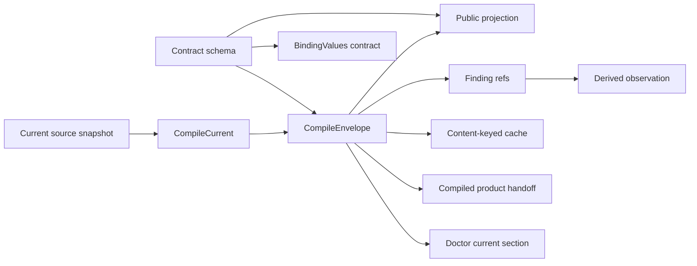
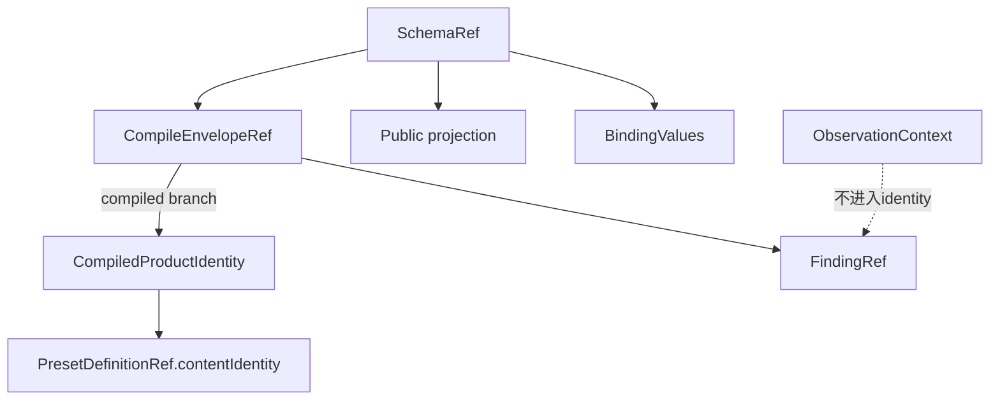

# R10/D1 — Compile contract 需求侧原子推导

> 权威输入仅为更新后的AGGREGATE D1、`24-r9-expected-foundation.md`的D1/Gate-1/2/7、必要S1/R8摘要。本文不读取旧issue边界，不估规模，不实现代码。  
> 目标：把D1尚未实现的能力分解为可验收原子操作，不新增compile产品语义。

## A. 摘要（≤1页）

D1需要 **14项原子需求**，组成一条唯一链：



核心不变量：

- `CompileEnvelope = compiled(product,warnings) | rejected(nonEmptyDiagnostics)`是唯一finding authority；
- `CompileEnvelopeRef`、`SchemaRef`、`PresetDefinitionRef`分域，禁止裸hash互换；
- compiler、cache、CLI projection、callback/event、doctor都消费同一envelope，不重新编一组findings；
- schema、compile envelope、binding values属于一个contract family，但分别是schema、definition instance、value instance，不能互相冒充；
- 只有compiled branch可产生`CompiledProductIdentity`并进入immutable definition publish；rejected branch不能发布definition；
- doctor默认只诊断current source/findings；pinned instance健康不由D1 current compile判断；
- schema producer可以独立交付；independent schema consumer缺失只阻断cross-owner验证，不阻断compile/schema运行。

24号已经给出全部产品语义、identity分域、publish顺序和dependency边界；**地基规范没有未闭合产品问题**。D1必须自建compiler-facing envelope、finding identity、schema artifact、cache/doctor/callback贯通及public read面；immutable definition store/publish、create事务、ref-aware retention属于Gate-2的D10-owned地基，D1只提供完成handoff/boundary validation的compiled product与refs，不复制其生命周期。

失败使用封闭ADT，message只供人读。deterministic compile failure不retry；cache/observation或D10 publish基础设施失败不得改变compiler verdict。handoff boundary不匹配、schema未知或product identity不匹配响亮失败，不回退current或私有source shape。

具名dependency `independent-schema-consumer` 是**验证gate而非运行时compile依赖**：

```text
IndependentConsumerVerification =
  | Verified { schemaRef, consumerContractVersion }
  | DependencyUnavailable { capabilityId:"independent-schema-consumer" }
  | Failed { typedMismatch }
```

consumer未落地时记录`DependencyUnavailable`，producer仍须完成schema generation、boundary round-trip和unknown-version拒绝测试；不得声称cross-owner E2E通过。

## B. 14项原子需求

| ID | Producer → Consumer | Operation | Invariant | Failure | Recovery |
|---|---|---|---|---|---|
| D1-R01 | source resolver → compiler | `readCurrentSource(locator) -> SourceSnapshot` | 一次compile只读一个稳定snapshot；identity覆盖规范输入bytes | `source-unreadable`、`source-raced` | 失败无publish；重新调用重新取current |
| D1-R02 | compiler → all compile consumers | `compileCurrent(snapshot) -> CompileEnvelope` | compiled/rejected穷尽；rejected diagnostics非空 | structured syntax/structure/template/etc diagnostic | deterministic rejection原样返回，不retry |
| D1-R03 | compiler → refs/cache | `identifyEnvelope(envelope) -> CompileEnvelopeRef` | canonical bytes、contract version相同则ref相同；ref不含attempt/context | `canonicalization-failed` | 不缓存、不发布；修复实现后重算 |
| D1-R04 | compiler → finding consumers | `identifyFindings(envelope) -> FindingRef[]` | ref由envelope ref+normalized payload+duplicate index决定；message非identity | duplicate/invalid subject boundary error | 整个envelope拒绝内部发布，不另造随机id |
| D1-R05 | compile call → observation consumers | `attachObservationContext(envelopeRef, context)` | chain/item/CLI调用归属与finding identity分离 | invalid context | compile result仍有效；仅观测失败 |
| D1-R06 | compiler → public CLI/API | `projectCompileEnvelope(envelope) -> PublicCompileResult` | success/rejected均保留完整权威集合并带schemaRef/resultRef | `projection-boundary-mismatch` | 响亮失败；不得降级旧message/string |
| D1-R07 | schema producer → public consumers | `publishContractSchema(schema) -> SchemaRef` | schema覆盖CompileEnvelope/projection/Finding/BindingValues/tagged refs；instance不冒充schema | `schema-generation-failed`、`schema-integrity-mismatch` | 旧ref不覆盖；修复后发布新完整artifact |
| D1-R08 | public consumer → schema artifact | `readContractSchema(schemaRef)` | exact ref/version读取；unknown variant/version拒绝 | `schema-missing`、`schema-corrupt`、`schema-unsupported` | 不import私有source、不猜shape；取得兼容artifact后重试 |
| D1-R09 | daemon/internal callers → compile cache | `resolveCompileEnvelope(contentKey)` | key含contract version+source content identity；value是完整envelope Promise | load/compile/cache infrastructure failure | failure entry删除/可重试；success immutable，可evict不改authority |
| D1-R10 | compiler → definition publisher | `handoffCompiledProduct(envelope)` | 仅compiled branch产生product identity；product ref≠envelope/schema ref | `compile-rejected`、`product-identity-mismatch` | 无definition publish；修复source后产生新identity |
| D1-R11 | D1 handoff → D10 immutable artifact publisher | `validateCompiledProductHandoff(product)` | compiled product的typed boundary、contract/schema ref、product identity与logical asset declarations完整且自洽；不执行artifact lifecycle | `handoff-boundary-mismatch`、`product-identity-mismatch`、`asset-declaration-invalid` | 不调用D10 publisher；修复compiler/handoff后重新产生确定性product |
| D1-R12 | envelope → callback/event adapter | `deriveFindingObservations(envelope,context)` | adapter只投影已有finding refs；event不是authority | observation persistence unavailable | verdict/cache/publish不回滚；后续可按ref重放派生观测 |
| D1-R13 | doctor → current compile read面 | `doctorCurrent(target) -> CompileHealthSection` | 读取current envelope；不默认扫描pinned instances；不合成第二finding集合 | current source/compile/schema typed error | doctor结构化显示；instance健康转status/ref显式入口 |
| D1-R14 | schema producer → verification coordinator | `verifyIndependentConsumer(schemaRef)` | capability id稳定为`independent-schema-consumer`；issue号仅出处 | dependency unavailable或typed mismatch | unavailable保持未证明；consumer落地后跑同一version矩阵 |

## C. Identity、ref与数据边界

### C1. Ref关系



| Identity | 表示 | 禁止替代 |
|---|---|---|
| `SchemaRef` | contract family wire schema exact version/content | projection内裸`schemaVersion` |
| `CompileEnvelopeRef` | 完整compiled/rejected canonical envelope | source path、attempt id、DefinitionRef |
| `FindingRef` | 某envelope内normalized finding occurrence | rule/message、event id |
| `CompiledProductIdentity` | compiled branch的definition product content | envelope ref、schema ref |
| `PresetDefinitionRef` | tagged preset definition domain ref |裸hash、current preset name/path |
| `ObservationContext` | 谁/何时/哪次入口观察同一结果 | finding identity组成部分 |

### C2. Public/private边界

- public：ContractSchema、CompileEnvelope public projection、typed diagnostics/findings、tagged refs；
- definition handoff：normalized compiled product及其完整assets，由immutable artifact boundary消费；
- private：compiler内部parser/boundary实现、cache object identity、source绝对实现细节；
- independent consumer不得import私有compiler source或执行内部ArkType表达式；
- public projection可为可读性内联字段，但与ref解析不一致时整份拒绝。

## D. 事务、发布与恢复

### D1. D1自身写边界

1. source snapshot与compile是pure/read phase；
2. envelope/ref生成完成后才写cache或派生observation；
3. schema artifact由D1按其schema producer合同发布；compiled product仅完成handoff/boundary validation，definition bundle的staging、manifest bytes重读、fsync、atomic publish与cleanup全由D10负责；
4. rejected envelope不进入D10 definition publisher；
5. direct rejected结果无新增永久history义务；
6. observation写失败不改变compile verdict。

D1不自建chain/item create事务。Gate-2的`BEGIN IMMEDIATE`在definition publish完成后，由实例创建方同写row/ref/bindings/runtime/outbox rows。D1只保证其handoff是已验证、可内容寻址、可由tagged ref引用的compiled product。

### D2. Crash矩阵

| 崩溃点 | 可见状态 | 恢复 |
|---|---|---|
| source read/compile中 | 无artifact/ref | 重新compile current |
| envelope生成后、cache前 | caller可持有结果；无cache | 下次按content key重算同ref |
| schema artifact staging中 | 仅不完整schema staging | D1 schema recovery清理；live schema ref不可见 |
| compiled product handoff后、D10 publish前 | 无definition artifact/ref | D10未被调用或响亮拒绝；修复handoff后重试 |
| observation写前/中 | authoritative envelope仍成立 | 由ref重放派生观察；不重编finding |
| cache进程退出 | durable artifact不受影响 | 新进程按content/ref重验并暖cache |

## E. 错误与授权

### E1. Error ADT

| 类别 | Variants | Retry |
|---|---|---|
| source | `source-unreadable`、`source-raced` | source/infra变化后可重新compile |
| compile | syntax/structure/type/template/fragment diagnostics | deterministic，不自动retry |
| schema | `schema-generation-failed`、`schema-missing/corrupt/unsupported` | artifact/版本修复后 |
| identity | `canonicalization-failed`、`ref-mismatch`、`product-identity-mismatch` | 实现或artifact修复后 |
| definition handoff | `handoff-boundary-mismatch`、`asset-declaration-invalid` | 修复compiler/handoff后重试；artifact lifecycle错误归D10 |
| dependency verification | `dependency-unavailable`、`consumer-contract-mismatch` | consumer状态变化后 |

### E2. Authorization/consumer保证

D1不新增ACL或产品角色。它沿用现有入口授权边界，并固定最小数据能力：

- public compile/schema consumer只能读公共projection/schema，不读取private normalized assets；
- internal definition publisher只能接受compiled branch和verified product identity；
- doctor只能默认读取current compile面，不能借current权限修复/替换pinned ref；
- callback/event adapter只有派生观察权，不能修改envelope或finding；
- independent consumer的prevalidation不是最终create authority，engine admission仍是兜底。

## F. 地基匹配

| 需求 | 24号供给 | 分类 | D1责任 |
|---|---|---|---|
| CompileEnvelope唯一authority | 明确稳定条款 | 直接 | 贯通所有compile consumers |
| Canonical compiler/result/projection/hash | R5可复用资产 | 直接 | 保留并补完整envelope |
| Envelope/Finding deterministic refs | Gate-1目标 | 修补后 | 自建 |
| ContractSchema artifact | D1/Gate-7目标 | 修补后 | 自建producer/read面 |
| Public compiled/rejected projection | D1目标 | 修补后 | 自建统一projection |
| Content-keyed full-envelope cache | D1目标 | 修补后 | 自建 |
| Doctor current findings | D1正式裁决 | 修补后 | 自建current section |
| Callback/event同envelope派生 | D1目标 | 修补后 | 自建adapter；复用observability substrate |
| Compiled product→definition handoff | Gate-1 | 修补后 | D1产出；D10 publisher消费 |
| Atomic immutable bundle publish | Gate-2/D10 | 相邻域 | D1只提供validated handoff；staging/manifest bytes/ref重读/fsync/atomic publish/cleanup全归D10 |
| Chain/item create事务 | Gate-2 | 非D1自建 | 由definition/runtime地基消费D1 ref |
| Independent consumer round-trip | Gate-7 | 具名依赖 | D1保留typed verification gate |
| Pinned instance health | D10 | 非D1读面 | status/ref resolver，doctor仅显式ref入口 |

分类结论：

- **直接供给**：稳定语义与现存compiler/projection/hash骨架；
- **D1自建**：R01–R10、R12–R14及R11的compiled-product handoff/boundary validation；
- **相邻域地基**：D10独占immutable artifact store/publish生命周期与Gate-2 create transaction；
- **具名依赖**：independent schema consumer的cross-owner验证；
- **地基未闭合**：0项产品语义；仅有未实现与proof gap。

## G. 验证边界

### G1. D1本域必须证明

1. compiled/rejected public boundary round-trip；
2. 同snapshot/contract version重复compile得到相同envelope/finding refs与canonical bytes；
3. cold/in-flight/cache-hit返回同一完整envelope，context不同但finding identity相同；
4. callback/event/doctor/CLI不产生envelope外finding；
5. rejected不能publishdefinition，compiled product identity与envelope/schema ref分域；
6. schema artifact可生成、读取、校验，unknown version/variant响亮拒绝；
7. malformed/inconsistent compiled-product handoff在进入D10前响亮拒绝；
8. daemon restart后compile cache不作authority；definition artifact/ref重验由D10证明；
9. doctor默认current-only，instance异常不被current替代；
10. observation持久化失败不改变compile verdict。

### G2. Dependency/共享集成后证明

- independent consumer只靠public schema解析compiled、rejected、BindingValues并拒绝version mismatch；
- definition publisher消费D1 compiled product，H1/H2 immutable ref不漂移；
- Gate-2 create事务只引用已发布compiled product；
-冻结SHA cross-owner/compatibility E2E按专用验收执行。

dependency unavailable时D1可完成producer侧单元/集成，但不得把G2第一项称为通过。

## 尾结论

**D1推导出14项原子需求：稳定source snapshot产生唯一CompileEnvelope，canonical refs贯穿finding、cache、public projection、doctor与派生观测；schema作为同一contract family的独立版本化artifact；只有完成D1 handoff/boundary validation的compiled product可交给D10。24号已闭合全部产品语义，D1自建compiler-facing读写与identity，Gate-2的artifact publish/create生命周期由D10拥有；唯一具名dependency是`independent-schema-consumer`的cross-owner验证，它缺失时只形成typed verification gate，不阻断compile/schema producer，也不得冒充E2E完成。**
