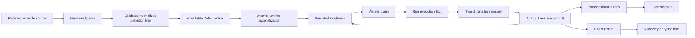

# RFC #547 R10/D3 需求侧推导：recursive definition 到 typed transition runtime

> 权威输入：`AGGREGATE-547.md` D3、`24-r9-expected-foundation.md` 的 D3 与统一 Gate、必要的 tree/runtime 供给摘要。  
> 范围：只推导 referenced-node definition → normalize → runtime instance → readiness scheduler → typed transition → recovery 的原子需求；不复制旧issue、不查源码、不修改其他文件、不新增join/par语义、不估规模。  
> 当前边界：non-degenerate par runtime固定为typed unsupported；绝不顺序降级。

## A. 摘要（≤1页）

D3只有一条可交付因果链：referenced node table经版本化boundary解析，验证后normalize成唯一canonical tree；immutable definition先发布，chain/item create在单一`BEGIN IMMEDIATE`事务中连同definition ref、typed bindings、完整runtime tree、initial readiness与outbox一起物化；scheduler只原子claim持久化readiness；runner exit只形成execution fact，业务推进只能由typed transition commit在单事务中写transition、node/cursor/readiness、compat projection与outbox；restart只恢复已持久化identity/journal，不从phase/status/current source猜推进。

本轮推导得到 **24项原子需求**：

- definition/normalize：6项；
- instance/readiness：7项；
- transition/authorization：6项；
- recovery/observability/guard：5项。

分层事实：

| 类别 | 本轮定位 |
|---|---|
| 地基已供 | seq/par/join runtime ADT、SQL FK/CHECK/round-trip、runtime identity槽、closure/run资源关联、SQLite/WAL事务资产 |
| 修补后复用 | immutable definition publish/ref、typed binding admission、single-create transaction、transition/outbox/effect journal地基、gate capability guard |
| D3自建 | referenced-node boundary/normalizer、完整constructor、readiness query/claim、typed transition domain/store、D3 recovery/read models |
| 具名dependency | typed ChainDefinition provider（出处 #705）；gate evaluator/journal（出处 #712）；scripted join consumer（出处 #714） |
| 地基未闭合 | production non-degenerate par scheduler、join evaluator/consumer、referenced boundary、production constructor、transition commit、冻结SHA整链证明 |

当前不等待未来par语义：boundary可表示canonical结构，但任何具体instance含non-degenerate par时，若production capability未真实注册，则在首个资源副作用前返回`par_runtime_unsupported`并hold；scheduler还保留同一backstop，禁止线性执行、禁止只靠compile通过宣称runtime支持。

完成标准不是“ADT/表存在”，而是同一pinned definition identity贯穿normalize、materialize、readiness、claim、run、transition、outbox与recovery；任一缺ref、损坏、stale version、unsupported capability或unknown external effect均typed hold，零猜测fallback。

---

## B. 原子需求与匹配

## B1. 权威链与边界



每条边只有一个authority：source boundary决定可解析输入；normalized definition决定结构；constructor决定runtime实例；readiness决定可调度性；transition commit决定业务推进；effect ledger决定外部副作用恢复。

## B2. Definition 与 normalize（R-D3-01…06）

### R-D3-01 — Versioned referenced-node boundary

公开definition必须是版本化referenced node table：一个root id、以stable id为key的node declarations、child/target id refs。unknown schema/version/variant结构化拒绝；不得把unknown `[tasks]`静默丢弃。

- **D3自建：** parser boundary与typed error。
- **具名dependency：** chain-owned声明由typed ChainDefinition provider（出处 #705）提供相同版本/ref，不由本树复制parser。

### R-D3-02 — Stable definition node identity

每个node具有definition内唯一显式`DefinitionNodeId`；identity不取数组位置、结构path、phase显示名。rename/move保持id；path只用于diagnostic。

- **地基已供：** runtime表已有definition/runtime identity槽可复用。
- **D3自建：** authoring boundary的id约束。

### R-D3-03 — Graph完整性在compile拒绝

normalize前穷尽拒绝duplicate id、missing root、dangling child/target、非法host-kind引用、静态cycle及node variant字段不完整。错误含definition ref/source location/node id/ref path；不以exception文本作公共合同。

- **D3自建。**
- **不新增语义：** 只验证D3稳定结构合法性，不定义新的join选择或par行为。

### R-D3-04 — Linear input仅为compat sugar

legacy `[[phases]]`在load边界确定性生成stable compat node ids并立即normalize为同一canonical tree；normalize后scheduler/store/status不得保留第二套linear authority。

- **修补后复用：** existing linear loader作为adapter输入。
- **D3自建：** deterministic normalization与compat finding。

### R-D3-05 — Canonical tree唯一权威

compile projection、definition artifact、constructor与status结构投影都引用同一normalized tree/ref；不得各自重读TOML、重建phase plan或用代表item决定chain-wide结构。

- **修补后复用：** CompileEnvelope/immutable definition ref地基。
- **D3自建：** canonical recursive projection。

### R-D3-06 — Capability在definition/instance双层判定

definition boundary能够表达的variant不等于runtime已支持。compile记录required runtime capabilities；instance create/resume比较真实advertisement。boundary本身尚未交付时返回`recursive_tasks_unsupported`；non-degenerate par runtime未交付时返回`par_runtime_unsupported`。

- **修补后复用：** unified capability advertisement/typed unsupported gate。
- **地基未闭合：** production par runtime capability。

## B3. Runtime instance 与 readiness（R-D3-07…13）

### R-D3-07 — Pure materialization plan

constructor先以纯函数从`ExecutionDefinitionRef + owner identity + normalized root + admitted bindings`生成完整`RuntimeMaterializationPlan`：nodes、edges、definition→runtime map、initial states/readiness、owner links、outbox intent。plan失败时不得写DB。

- **D3自建。**
- **修补后复用：** typed binding admission输出。

### R-D3-08 — Create单事务完整物化

chain-owned root与chain row/ChainDefinitionRef同事务物化；item-owned subtree与item row/PresetDefinitionRef/admitted bindings同事务物化。一个`BEGIN IMMEDIATE`写完整nodes/edges/readiness/outbox；commit前scheduler不可见，任一失败零owner row、零half-tree、零event。

- **地基已供：** SQLite/WAL/IMMEDIATE与FK。
- **修补后复用：** publish-before-create与outbox地基。
- **D3自建：** recursive constructor/store operation。

### R-D3-09 — Runtime identity单向关联

每个materialized node分配opaque`RuntimeNodeId`，永久携`(ExecutionDefinitionRef, DefinitionNodeId, owner instance)`。DefinitionNode→RuntimeNode为单向map；runtime id不由definition id/path派生，reopen/epoch不重造原node identity。

- **地基已供：** strict runtime node ADT、identity字段与SQL约束。
- **D3自建：** production map生成与唯一性验证。

### R-D3-10 — Persisted readiness封闭ADT

readiness至少区分`blocked | ready | claimed | awaiting-transition | held | terminal`，并携version/typed blockers/claim/run identity；不得用nullable status/boolean组合。blocker只表达已有D3依赖、gate/effect/unsupported，不新增业务状态词。

- **地基已供：** runtime node/state persistence形状。
- **D3自建：** authoritative readiness domain与query。

### R-D3-11 — Scheduler只读readiness

scheduler候选查询只返回persisted `ready` leaves；`item.phase/status/lastRunId`、phase数组、runner exit、seq projection不能解锁后继。compat fields由transition单向投影；不一致时信runtime并发diagnostic。

- **D3自建：** production readiness selector。
- **地基未闭合：** current scheduler仍未接runtime authority。

### R-D3-12 — Atomic claim与容量释放

scheduler在单事务/CAS中以`readinessVersion`执行`ready → claimed(ClaimId, RunId)`；stale claim返回typed conflict并重选。每个ready node至多一个active claim。pre-spawn gate hold必须同事务`claimed → held`并释放capacity，保留同一RunId/evaluation epoch。

- **D3自建：** claim store/read protocol。
- **具名dependency：** gate evaluator/journal（出处 #712）提供hold decision/ref，不由D3复制journal。

### R-D3-13 — 首副作用前guard

在具体item/chain pinned definition和runtime instance已知后、任何worktree/branch/closure/run/current-run/item attempts/process副作用前，检查recursive/par/gate dependency capability。unsupported使node held并释放claim；scheduler还有同一backstop以覆盖legacy/旁路rows。

- **修补后复用：** pre-spawn Gate-5与capability guard。
- **固定边界：** non-degenerate par永远不顺序降级。

## B4. Typed transition 与授权（R-D3-14…19）

### R-D3-14 — Runner exit不是业务推进

process exit只持久execution fact并使source node进入`awaiting-transition`或typed execution hold；不得直接推进seq/join/后继、写terminal业务状态或消费gate decision。

- **D3自建：** execution fact→awaiting transition接缝。

### R-D3-15 — Transition request封闭ADT

请求必须携`TransitionId/idempotencyKey/instanceRef/sourceRuntimeNodeId/source DefinitionNodeIdentity/runId/pathId/typed exit payload/observedReadinessVersion`。target、template、binding与exit schema只从pinned definition/path读取，caller不能自由指定。

- **修补后复用：** D2 typed exit/admission。
- **D3自建：** transition boundary。

### R-D3-16 — Actor与run授权

agent只能以当前run-scoped credential提交其claimed/awaiting node允许的agent-owned exit字段；operator/validator使用各自typed ingress与权限。foreign/stale/terminal run、wrong instance/node/path、覆盖external binding一律拒绝并审计。

- **地基已供：** run credential与command authorization资产。
- **D3自建：** transition-specific authorization与audit。

### R-D3-17 — 单一业务commit

`commitTransition`是唯一推进authority。在一个DB事务中：查idempotency key、锁定/验证runtime/readiness version、写immutable transition、更新source/node/cursor与既有join input、重算受影响readiness、更新compat projections、写outbox/effect intents并commit。

- **修补后复用：** transaction/outbox/effect地基。
- **D3自建：** transition domain/store。
- **不新增语义：** “既有join input”仅按compiled definition写入，不定义join判定算法。

### R-D3-18 — Idempotency与并发

相同idempotency key且canonical request相同返回原TransitionRecord；同key不同payload为`transition_key_conflict`。readiness version/claim/run变化为`stale_transition`，零写。不同nodes可并行提交；同一受影响runtime cut由DB锁/version序列化。

- **D3自建。**

### R-D3-19 — Gate/join decision只作为typed dependency

transition若依赖gate或scripted join，只消费对应owner已持久化的`decided` ref；决策consume与host transition必须同事务，不能解析script stdout、重跑evaluator或从carrier推断结果。

- **具名dependency：** gate evaluator/journal（出处 #712）；scripted join consumer（出处 #714）。
- **地基未闭合：** dependency未交付时typed unsupported/hold。

## B5. Recovery、资源、错误与读面（R-D3-20…24）

### R-D3-20 — Outbox与external effect分域

DB business commit与event outbox同事务；commit后dispatcher幂等发布。Git/worktree/remote等external effect有独立EffectId/ledger：可证未执行才retry，可证完成则succeeded，无法判断则`unknown`并hold关联node/transition，禁止自动重放。

- **修补后复用：** unified Journal/Effect/Outbox Gate-4。
- **D3自建：** transition/effect refs关联。

### R-D3-21 — Restart只恢复持久事实

restart按definition ref、runtime node/readiness、claim/run、transition、outbox/effect ledger恢复：committed transition不重提交，ready重新候选，claimed按run事实reconcile，awaiting-transition等待合法commit，held保持原因。不得从item.phase/status、current source或process残影猜业务推进。

- **D3自建：** runtime recovery coordinator。
- **修补后复用：** shared definition resolver、run/closure reconciliation。

### R-D3-22 — Legacy与损坏hold

pre-ref历史instance、missing/corrupt definition、runtime tree不完整、definition/runtime map不一致、unknown effect、unsupported capability均进入typed hold；可list/status/export/repair但不可schedule。repository migration不得解除definition/runtime hold。

- **修补后复用：** v14 legacy hold与definition integrity错误。
- **D3自建：** D3 integrity classifier。

### R-D3-23 — Structured error family

最低错误variants：

```text
recursive_definition_invalid
recursive_tasks_unsupported
par_runtime_unsupported
runtime_materialization_failed
runtime_instance_incomplete
runtime_identity_mismatch
readiness_claim_conflict
stale_transition
transition_not_authorized
transition_payload_invalid
transition_key_conflict
dependency_capability_unavailable
external_effect_unknown
legacy_runtime_unproven
```

每项携definition/instance/node/run/transition identity与可安全公开的location；deterministic错误不进spawn retry，capacity/DB transient conflict可重选，unknown effect需显式reconcile。

- **D3自建：** error ADT与retry classification。

### R-D3-24 — Status/events只投影authority

status输出definition ref、root/runtime node identity、readiness/blockers、claim/run、latest transition、dependency capability与hold原因；compat phase/status明确标记projection。events只从transactional outbox发布并携TransitionId/RuntimeNodeId；不得由读面重新计算tree/readiness。

- **D3自建：** projection/events adapter。
- **修补后复用：** compile/status/event contract family。

## B6. 原子读写矩阵

| 操作 | 权威读取 | 原子写入 | commit前外部副作用 | 失败结果 |
|---|---|---|---|---|
| normalize | versioned source + refs | immutable compiled model（publish另域） | 无 | compile rejected |
| materialize | pinned definition + admitted bindings | owner/ref/nodes/edges/readiness/outbox | 无 | instance不存在 |
| claim | ready row + version + capacity | claimed/ClaimId/RunId/capacity | 无 | conflict重选 |
| pre-spawn hold | claim + decided gate ref | held/released capacity/evaluation ref | 无 | held |
| run exit | claimed run/process fact | run exit + awaiting-transition/hold | 仅已发生runner process | 不推进业务 |
| transition | pinned path + runtime/readiness/run + dependency decision refs | transition/nodes/cursor/readiness/compat/outbox/effect intents | 无新增外部effect | rejection或committed |
| dispatch effect | committed outbox/effect intent | ledger state | 有，按EffectId | unknown则hold |
| recovery | all persisted authorities | reconcile state/outbox retry | 只安全retry | typed hold |

## B7. 并发、容量与资源约束

1. claim、transition、gate decision consume都用observed version/CAS或同事务row lock；不得先读后无条件写。
2. capacity在claim占用；pre-spawn hold/unsupported在同事务释放；runner真正spawn才保持active capacity。
3. same node单active claim；不同ready leaves可并行，受共同ancestor/readiness cut影响的commit由version冲突序列化。
4. constructor不创建worktree/branch/process；这些在capability与pre-spawn advance之后。
5. resource identity继续使用repoCwd/baseBranch/closure/run，不读repository business binding。
6. non-degenerate par无runtime capability时不分配branch/member资源、不创建伪linear run。

## B8. 权限与信任边界

| 边界 | 不可信输入 | 升格条件 |
|---|---|---|
| definition parse | TOML/node table | versioned typed boundary + graph validation |
| create | bindings/owner declaration | definition-aware admission + materialization plan |
| claim | scheduler observation | readiness version transaction |
| transition ingress | agent/validator/operator payload | credential/actor/path/exit schema validation |
| dependency decision | gate/join ref | owner journal state=`decided`, identity match |
| external effect result | process/Git/remote observation | typed reconciler evidence |

agent不能写readiness、runtime node、cursor/join state、TransitionRecord、decision ref或outbox；这些只由domain operations持久化。

## B9. 供给匹配表

| 原子面 | 地基已供 | 修补后复用 | D3自建 | dependency/未闭合 |
|---|---|---|---|---|
| referenced parse/normalize | linear loader、source projection | compile envelope/artifact | R-D3-01…05 | ChainDefinition provider（出处 #705） |
| runtime identity/store | seq/par/join ADT、FK/CHECK/round-trip | immutable ref/create transaction | R-D3-07…10 | production constructor未闭合 |
| scheduler | run/closure/resource基础 | pre-spawn/capacity gate | R-D3-11…13 | par runtime未闭合 |
| transition | run credential、typed exit基础、transactions | journal/outbox/effect | R-D3-14…18 | transition production链未闭合 |
| gate/join | hook carrier、join storage形状 | capability/decision ref consumption | identity validation only | #712、#714未交付 |
| recovery/read | run/closure reconcile、status/event槽 | shared resolver/legacy hold | R-D3-20…24 | restart/fault整链未证明 |

## B10. 明确不建的机制

1. 不新增join evaluator、candidate selection、best-of-n或reopen业务语义。
2. 不把non-degenerate par顺序执行作为compat。
3. 不新增第二套node position/path identity。
4. 不保留linear与recursive双scheduler。
5. 不让run exit、item status或event成为第二transition authority。
6. 不让D3复制gate/join journal或解析其transport。
7. 不为unknown external effect承诺exactly-once。
8. 不因dependency未交付而伪造capability advertisement。
9. 不用runtime lazy append替代完整constructor。
10. 不把fixture/store injection算production producer。

## B11. 验证矩阵

### B11.1 Boundary/normalize

- referenced fixture成功产生root/keyed nodes/child refs；projection与artifact同ref。
- duplicate、dangling、cycle、wrong host、unknown variant/version分别typed reject。
- linear fixturenormalize后与等价referenced degenerate seq canonical tree一致；scheduler无linear分支。

### B11.2 Materialization

- chain/item create后单事务内owner/ref/node map/readiness/outbox齐全。
- constructor中途任一点fault→零owner或零新增tree（按操作边界），无half-tree。
-同definition多实例runtime ids不同，definition node mapping正确。

### B11.3 Scheduler/guard

- 两scheduler竞争同ready node仅一方claim成功。
- stale readiness version返回claim conflict并重选。
- gate hold原子释放capacity且零worktree/run/process副作用。
- non-degenerate par返回`par_runtime_unsupported`并held；scheduler backstop覆盖旁路row；无linear spawn。

### B11.4 Transition

- runner exit只到awaiting-transition，后继仍blocked。
-合法typed commit一次推进全部node/cursor/readiness/compat/outbox。
-同key重放返回原TransitionId；同key异payload冲突；stale/foreign run零写。
- agent越权external binding、wrong path/target、bad exit payload分别拒绝并审计。

### B11.5 Recovery/effects

- commit后event dispatch前kill：restart从outbox补发，不重复transition。
- effect前/后/unknown三个fault点分别retry/succeeded/hold。
- missing/corrupt ref、incomplete tree、pre-ref legacy均hold且不读current source。
- projection mismatch只报diagnostic，scheduler仍按runtime readiness。

### B11.6 Dependency boundary

- #712 capability absent：gate declaration instance reject/existing hold，D3不执行carrier。
- #714 absent：需要scripted join的transition typed unsupported/hold，不自行判join。
- #705 boundary absent/unknown version：chain recursive declaration拒绝，不启用本树私有parser。

### B11.7 完整路径证明

冻结SHA integration必须真实执行：referenced definition parse → immutable pin → create materialization → readiness claim → runner exit → typed transition → next readiness → restart继续；并另跑non-degenerate par fixture观察首副作用前typed unsupported。unit/store round-trip不能替代该链。

## B12. 需求核算

| 区段 | IDs | 数量 |
|---|---|---:|
| Definition/normalize | R-D3-01…06 | 6 |
| Runtime/readiness | R-D3-07…13 | 7 |
| Transition/authorization | R-D3-14…19 | 6 |
| Recovery/read/error | R-D3-20…24 | 5 |
| **总计** | **R-D3-01…24** | **24** |

每项均追溯到D3稳定条款或统一Gate的必要接缝；新增join/par语义为0。

## B13. 尾部结论

**R10/D3尾部结论：24项原子需求把referenced-node definition、唯一normalize、immutable ref、原子完整constructor、persisted readiness、CAS claim、typed transition commit、outbox/effect recovery连成一条authority链。地基已有runtime ADT/SQL identity/closure事务资产；D3必须自建boundary、normalizer、production constructor、readiness scheduler、transition store与recovery读面；typed ChainDefinition provider（出处 #705）、gate evaluator/journal（出处 #712）和scripted join consumer（出处 #714）只以具名dependency ref接入，不被D3复制。non-degenerate par能力仍未闭合，固定在首资源副作用前`par_runtime_unsupported`+hold并保留scheduler backstop，绝不串行降级；本报告没有新增join/par语义或兼容机制。**
