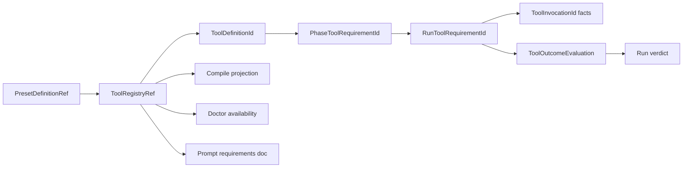
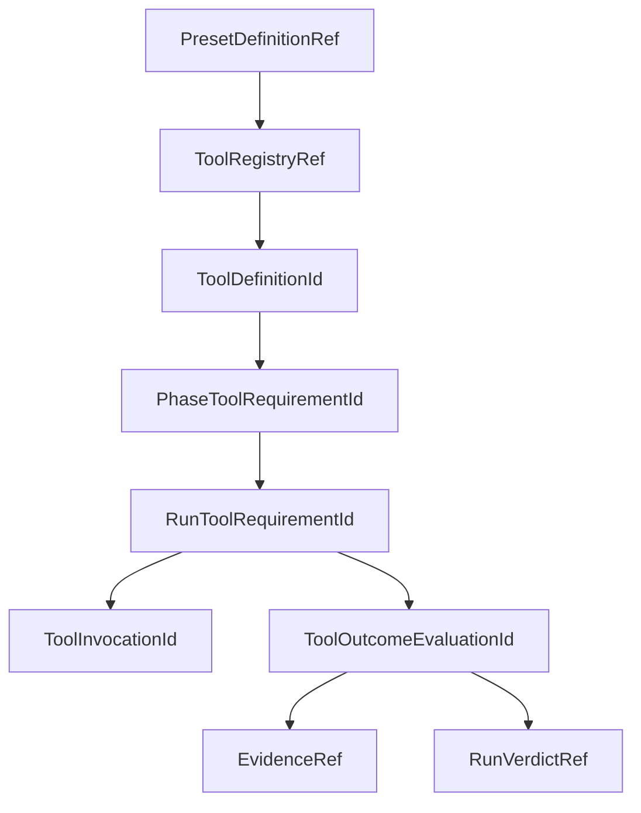

# R10/D4 — Tool registry 需求侧原子推导

> 权威输入仅为AGGREGATE D4、`24-r9-expected-foundation.md` D4/Gate-1/2/4及capability供给摘要。本文不读取旧issue边界、不查源码、不指定外部transport。  
> 范围只覆盖tool registry、requirements、doctor/prompt、entry-existence与tool outcome/finalize seam；hook carrier严格留在D5。

## A. 摘要（≤1页）

D4推导出 **18项原子需求**。唯一权威链为：



四个正交语义轴：

1. **availability**：provider capability此刻是否`available | unavailable | indeterminate`；
2. **invocation**：是否/如何发生某次provider-neutral typed invocation；
3. **outcome**：是否满足definition声明的确定性结果，首波仅`entry-existence`；
4. **requiredness**：phase use-site为`required | expected`。

provider/adaptor属于invocation与availability的定义输入，但provider名字不能决定outcome或required合法性。`available`不等于invoked，invoked不等于achieved；context/event存在也不能天然成为outcome。

identity链必须分层：

- `ToolDefinitionId = (PresetDefinitionRef, ToolName)`；
- `PhaseToolRequirementId = (PresetDefinitionRef, PhaseNodeId, ToolDefinitionId)`；
- `RunToolRequirementId = (RunId, PhaseToolRequirementId, OutcomeVariant)`；
- `ToolInvocationId = (RunToolRequirementId, InvocationKey)`，其中InvocationKey是provider-neutral稳定幂等键，不是retry attempt或外部call id；
- `ToolOutcomeEvaluationId = (RunToolRequirementId, EvaluationEpoch)`。

compile、doctor、prompt三个consumer只读取同一`ToolRegistryRef`/version：

- compile校验registry、requirements与required/outcome合法性；
- doctor只报告availability，不宣称outcome；
- prompt只说明当前phase要求与证据产生方式，不执法。

首波outcome `entry-existence`只查询durable、typed author属于同一chain/item/run/phase、namespace/tool一致且commit完成的entry。真实body不进入outcome projection。required未达成导致structured run failure；expected未达成只投影，不能伪造成achieved。

24号已经闭合所有产品语义和unsupported边界；地基未闭合产品问题为0。D4自建registry、identity、compile/doctor/prompt consumers、public projection与runtime requirement handoff。具名dependency `tool-outcome-finalize-runtime`负责entry查询、evaluation journal、finalize/consume/recovery并在真实注册后advertise capability；D4不得虚构HTTP、MCP、event transport或借hook carrier代替。

dependency缺失时：

- compile/preview仍允许；
- 含required runtime requirement的新instance在create/schedule返回typed unsupported；
- 既有pinned instance恢复为hold；
- expected可以存在，但必须明确`not-evaluated(capability-unavailable)`，不得产生成功事件。

## B. 四轴合同

| 轴 | Definition/Runtime shape | 能证明 | 不能证明 |
|---|---|---|---|
| Availability | provider capability ref + requirement；runtime observation | 当前adapter capability状态 | invocation或outcome |
| Invocation | typed invocation spec；0..n `ToolInvocationId` facts | 某幂等调用意图/执行事实 | outcome achieved |
| Outcome | `None | EntryExistence(spec)`；evaluation journal | durable evidence是否满足closed predicate | provider可用或调用发生 |
| Requiredness | phase requirement `Required | Expected` | outcome缺失如何影响run verdict | 改写outcome predicate |

`required`合法当且仅当tool声明确定性closed outcome；首波只有`entry-existence`满足。`outcome=None + required`为compile error，provider=engine也不例外。expected可用于无outcome或缺outcome runtime，但永不阻断finalize，也不能被显示为achieved。

## C. 18项原子需求

| ID | Producer → Consumer | Operation | Invariant | Failure | Recovery |
|---|---|---|---|---|---|
| D4-R01 | preset compiler → registry consumers | `parseToolRegistry(definition) -> ToolRegistry` | registry有schemaVersion/ref；tool name在definition内唯一 | `tool-registry-invalid`、duplicate name | compile rejected；无runtime写入 |
| D4-R02 | registry → all tool identities | `assignToolDefinitionId(defRef,name)` | id只由pinned definition+name决定；provider变化通过definition ref变化 | empty/duplicate/foreign ref | compile rejected，不生成裸string id |
| D4-R03 | registry → availability adapters | `compileAvailability(tool) -> AvailabilityRequirement` | availability与invocation/outcome/requiredness正交 | unknown capability/provider ref | compile rejected或typed unsupported declaration |
| D4-R04 | registry/runtime → invocation facts | `compileInvocation(tool)`及`recordInvocation(requirement,key)` | InvocationKey provider-neutral且幂等；外部call id不作主键 | duplicate mismatch、unsupported invocation | 同key返回原fact；不推断outcome |
| D4-R05 | registry → outcome runtime | `compileOutcome(tool) -> None | EntryExistenceSpec` | outcome是closed tagged variant；不执行自由文本grep | unknown outcome、untyped author/namespace | compile rejected |
| D4-R06 | phase compiler → requirement consumers | `bindRequirement(phase,tool,enforcement)` | phase ref必须解析同registry tool；required仅配closed outcome | dangling tool、required-without-outcome | compile rejected，点名phase/tool |
| D4-R07 | compiler → compiled model | `compileRegistryAndRequirements()` | registry、phase requirements、definition ref/version一次生成 | inconsistent ref/version | whole compile rejected |
| D4-R08 | compiler → public consumer | `projectToolRegistry()` | 投影真实id/provider/availability/invocation/outcome/doc与phase enforcement | boundary/ref mismatch | public compile rejected；不输出空假registry |
| D4-R09 | doctor → provider adapter | `checkAvailability(registryRef,toolId)` | 只返回Available/Unavailable/Indeterminate+typed reason/version/time | adapter absent/error/version mismatch | Indeterminate或typed unsupported；不写Achieved |
| D4-R10 | prompt renderer → agent | `renderToolRequirementsDoc(phaseRequirementIds)` | 仅当前phase；声明驱动；说明required/expected及evidence，不执法 | missing registry/tool/doc | render typed error/hold，不grep prompt补表 |
| D4-R11 | runtime capability registry → create/resume | `checkToolOutcomeCapability(requirements)` | capability只有真实journal/finalize实现注册后advertise | absent/incompatible version | required create/schedule reject；existing hold；expected显式not-evaluated |
| D4-R12 | runtime constructor → finalize | `instantiateRunRequirements(runId,phaseRequirements)` | 每项形成稳定RunToolRequirementId；同run重放不复制 | foreign definition/phase/run | create/run planning回滚或hold |
| D4-R13 | context store → outcome evaluator | `commit/queryEntryExistence(requirementId,spec)` | entry durable committed；typed author同chain/item/run/phase；namespace/tool一致 | invalid author、uncommitted、query unavailable | invalid evidence忽略并审计；infra unknown hold |
| D4-R14 | outcome runtime → journal | `evaluateOutcome(evaluationId,evidence)` | Pending→Evaluated(Achieved ref/NotAchieved)单向；body不入projection | journal conflict/corrupt/effect unknown | 同id重评/返回原结果；unknown hold |
| D4-R15 | finalize → run verdict | `deriveToolVerdict(runRequirements,evaluations)` | required任一NotAchieved→structured failure；expected缺失仅投影 | unresolved required evaluation | finalize hold，不伪造success |
| D4-R16 | finalize → transition/run store | `consumeOutcomeAndCommitVerdict()` | evaluation consume与run verdict/transition ref同事务；event派生 | stale/duplicate/transaction failure | duplicate返回原verdict；失败不部分推进 |
| D4-R17 | startup recovery → outcome journal | `recoverOutcomeEvaluation(id)` | Pending同id重评；Evaluated直接consume；Consumed幂等返回 | missing/corrupt/version unsupported | existing instance hold，绝不读current definition替代 |
| D4-R18 | status/events → authorized observer | `projectToolRuntimeState()` | 投影requirement/evaluation/result refs与counts；隐藏entry body/secrets | unknown state/ref | typed corrupt/unsupported；不猜成功 |

## D. Identity与ref



| Identity | 构成 | 禁止替代 |
|---|---|---|
| ToolRegistryRef | definition ref + registry schema/content identity | process cache key、empty projection |
| ToolDefinitionId | definition ref + tool name | provider binary/API/name alone |
| PhaseToolRequirementId | definition ref + phase node + tool id | prompt key、array index |
| RunToolRequirementId | run + phase requirement + outcome variant | HAPI call、context entry id |
| ToolInvocationId | run requirement + stable InvocationKey | retry attempt、provider request id |
| ToolOutcomeEvaluationId | run requirement + epoch | invocation id、event id |
| EvidenceRef | typed durable entry ids/count/digest | entry body、log grep |
| RunVerdictRef | run + consumed evaluation set/commit | exitCode alone |

Invocation与outcome可一对多或零对一：entry-existence可以由符合author contract的durable entry达成，不能强制“看到invocation才查outcome”；反之invocation存在也不能生成Achieved。

## E. 三consumer保证

### E1. Compile

compile负责：

1. registry schema/version；
2. tool name/id唯一性；
3. availability/invocation/outcome tagged variants；
4. phase requirement ref；
5. required/outcome合法性；
6. public projection与definition artifact pin。

compile不检查此刻provider是否在线，也不运行outcome query；这些动态事实不能拖回定义校验。

### E2. Doctor

doctor按registry provider adapter报告：

```text
ToolAvailability =
  | Available { capabilityVersion, checkedAt }
  | Unavailable { reason, checkedAt }
  | Indeterminate { reason, checkedAt }
```

它携registryRef/toolId，不跨ref缓存，不把Available写成Invoked/Achieved，不硬编码provider工具名。

### E3. Prompt

prompt doc只消费当前phase requirements和对应ToolDefinition.documentation/outcome/enforcement。它不显示其他phase、不执法、不暴露provider secret，也不通过prompt文本反向构造registry。

## F. Entry-existence、finalize与恢复

### F1. Entry predicate

`EntryExistenceSpec`至少绑定：

- pinned definition/tool/requirement identity；
- expected author scope：chain/item/run/phase；
- tool namespace；
- durable committed state。

评价只输出EvidenceRef（entry ids/count/digest等最小审计引用），不复制正文。entry来自何种transport不属于D4合同；只要通过现有typed context store boundary并满足author contract即可。

### F2. Journal

```text
ToolOutcomeEvaluation =
  | Pending { evaluationId, requirementId }
  | Evaluated { evaluationId, result: Achieved(evidenceRef) | NotAchieved }
  | Consumed { evaluationId, runVerdictRef }
```

恢复：

| 状态 | 动作 |
|---|---|
| Pending | 按同evaluation/requirement id重查durable entries |
| Evaluated | 不重解释definition，直接尝试consume |
| Consumed | 幂等返回原verdict |
| missing/corrupt/incompatible | hold并结构化投影 |

finalize顺序只规定domain seam：runner exit fact稳定→冻结可接受entry commits→evaluate→persist Evaluated→derive verdict→同事务consume/verdict→派生event。D4不规定dependency内部进程、RPC或队列transport。

## G. 地基匹配

| 能力 | 24号供给 | 分类 | Owner |
|---|---|---|---|
| required/outcome稳定判据 | 明确 | 地基直接供给 | D4消费 |
| 四轴正交 | 明确 | 地基直接供给 | D4消费 |
| public projection/boundary槽位 | R5资产 | 修补复用 | D4 |
| tagged identity/事务基建 | R5/Gate-1/2/4 | 修补复用 | shared foundation |
| canonical ToolRegistry/ToolId | 目标保证 | D4自建 | D4 |
| phase/run requirement identities | 目标保证 | D4自建 | D4 |
| compile consumer | 目标保证 | D4自建 | D4 |
| doctor availability consumer | 目标保证 | D4自建 | D4 |
| prompt requirements consumer | 目标保证 | D4自建 | D4 |
| public registry/runtime projections | 目标保证 | D4自建 | D4 |
| entry author/context persistence substrate | capability摘要已有部分资产 | 修补复用 | shared context store |
| outcome evaluation journal | 未实现 | 具名dependency | tool-outcome-finalize-runtime |
| run finalize/consume/recovery | 未实现 | 具名dependency | tool-outcome-finalize-runtime |
| capability advertisement | 只有真实实现后允许 | 具名dependency | tool-outcome-finalize-runtime |
| hook carrier | D5资产 | 明确排除 | 不进入D4 |

分类结论：

- **地基直接供给**：四轴、required/outcome判据、unsupported行为；
- **修补复用**：projection槽位、tagged identity、事务/outbox、typed context store substrate；
- **D4自建**：R01–R10、R12、R18及definition/runtime handoff shapes；
- **dependency**：R11 capability实现与R13–R17 journal/finalize/recovery；
- **未闭合产品语义**：0；
- **未证明运行项**：dependency闭环与整链E2E。

## H. Dependency typed gate

```text
ToolOutcomeRuntimeCapability =
  | Supported {
      protocolVersion,
      journalVersion,
      outcomes: Set<EntryExistence>,
      authorContractVersion
    }
  | Unsupported {
      capabilityId:"tool-outcome-finalize-runtime",
      reason: Absent | IncompatibleVersion | OutcomeUnsupported
    }
```

行为：

| Requirement | Capability | 新instance | pinned恢复 |
|---|---|---|---|
| required entry-existence | Supported compatible | 允许 | 按journal恢复 |
| required entry-existence | Unsupported | typed reject before schedule | hold |
| expected | Supported compatible | 允许并评价 | 按journal恢复 |
| expected | Unsupported | 允许但显式not-evaluated | 继续运行且不伪造Achieved |

issue号只作出处，不进入capability id、error、store key或运行分支。

## I. 验证边界

### I1. D4本域

1. registry boundary/version、tool name唯一与deterministic refs；
2. provider/availability/invocation/outcome/requiredness正交组合；
3. `required + outcome=None` compile rejected；
4. dangling phase tool ref rejected；
5. compile projection真实包含registry与phase requirements；
6. doctor Available/Unavailable/Indeterminate不产生outcome；
7. prompt只显示当前phase且不执法；
8. invocation idempotency不依赖provider call id；
9. unknown registry/outcome/capability version结构化拒绝；
10. hook carrier零引用/零复用。

### I2. Dependency集成

1. typed author正确/错误、namespace匹配、uncommitted entry的entry-existence矩阵；
2. required Achieved/NotAchieved与expected missing的finalize矩阵；
3. Pending/Evaluated/Consumed restart；
4. evaluation consume与run verdict事务故障注入；
5. duplicate invocation/evaluation/finalize返回原identity/result；
6. capability absent/incompatible的新instance reject、pinned hold、expected not-evaluated；
7.敏感entry body不进入status/event；
8.冻结SHA真实run→entry→outcome→finalize→restart整链。

dependency未实现时，D4可完成registry/compile/doctor/prompt/projection与unsupported handshake，但不得声称required outcome/finalize runtime或整链E2E完成。

## 尾结论

**D4推导出18项原子需求：definition-scoped ToolRegistry/ToolId贯穿phase/run requirement、provider-neutral invocation与outcome evaluation identity；availability、invocation、outcome、requiredness四轴严格正交；compile、doctor、prompt共享同一registry ref/version；首波entry-existence通过typed durable author证据评价，required/expected在finalize穷尽处理。24号已闭合产品语义，D4自建registry与三consumer，具名`tool-outcome-finalize-runtime` dependency负责journal/finalize/recovery且不虚构transport；hook carrier完全排除。**
