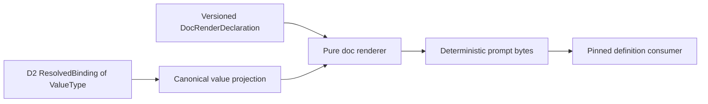

# RFC #547 R10/D6 需求侧推导：声明驱动 doc/prompt rendering

> 权威输入：`AGGREGATE-547.md` D6、`24-r9-expected-foundation.md` 的 D6/统一 Gate、doc供给摘要。  
> 范围：只推导typed binding进入doc/prompt projection后的原子需求；不查源码/旧issue、不修改其他文件、不重新实现D2类型/admission。  
> 正式默认：scalar使用各类型canonical文本；structured value使用单行canonical JSON；block/fenced只能由显式renderer声明。

## A. 摘要（≤1页）

D6的唯一职责是把D2已经准入的精确typed value，按use-site doc声明确定性地投影为prompt/doc字节。它不判断source type、不补missing/default、不做refinement、不按value/key/placeholder内容选择布局。

本轮推导得到 **20项原子需求**：

- 声明与版本：5项；
- D2接口与value projection：5项；
- prefix/suffix/style/blankBefore组合：5项；
- consumer、错误与验证：5项。

单一数据链：



地基匹配：

| 类别 | D6定位 |
|---|---|
| 地基已供 | `PresetVariableDoc` product、label门控、prefix/suffix/style/blankBefore归一化、纯声明驱动renderer、bundled prefix迁移与既有测试 |
| 修补后复用 | D2递归ValueType、ResolvedBinding、missing/null分离、typed default/admission、canonical scalar/JSON serializer；D1 schema/version与immutable definition ref |
| D6自建 | named typed outer boundary、versioned doc declaration projection、typed value→text adapter、structured inline默认、render error ADT、consumer一致性守护 |
| dependency | D2 typed binding runtime必须先提供精确ResolvedBinding/ValueType；D1公共schema/definition artifact负责跨consumer版本/ref |
| 地基未闭合 | 多类型真实create→render→prompt→runner路径、独立consumer round-trip、unknown-version失败路径 |

D6不扩张样式语言：`style`只消费已有封闭variant及其既定字节语义；没有需求证据时不新增Markdown模板、自动缩进、内容长度阈值或smart formatting。prefix/suffix逐字作用于canonical value文本；blankBefore只由声明控制；structured默认inline，显式block/fenced才改变容器布局。

完成判据是：相同definition ref、doc declaration与typed value产生逐字节相同输出；key改名或value内容变化不会改变未声明的format策略；任何缺声明、unknown version/variant或renderer不支持的ValueType均返回携完整identity的typed error，而非空串、fallback或通用spawn failure。

---

## B. 原子需求与匹配

## B1. 责任边界

D6输入只能是：

```text
DocRenderInput = {
  definitionRef
  phaseNodeId
  bindingKey
  sourceRef
  value: ResolvedBinding<ValueType>
  declaration: DocRenderDeclaration
}
```

D6输出只能是：

```text
DocRenderResult =
  | Rendered { bytes, renderIdentity }
  | Rejected { error: DocRenderError }
```

D2拥有value解析、required/default、nullable、refinement与canonical value serializer。D6拥有doc declaration解释与最终文本组合。两域之间无raw JSON、`undefined`或string fallback。

## B2. 声明与版本（R-D6-01…05）

### R-D6-01 — Named typed outer boundary

variables/doc外层必须由版本化named typed boundary解析，不再以宽`object`+手写字段同步。unknown field、wrong type、unknown style/projection variant在definition load/compile阶段结构化拒绝。

- **D6自建。**
- **修补后复用：** D1 schema artifact/version框架。

### R-D6-02 — Doc declaration product完整

每个启用doc输出的binding use-site拥有完整`DocRenderDeclaration`：

```text
DocRenderDeclaration = {
  label
  prefix
  suffix
  style
  blankBefore
  valueProjection: Default | Inline | Block | Fenced
}
```

其中prefix/suffix为空、blankBefore=false、valueProjection=Default等缺省值在parse时归一化，renderer不处理optional soup。

- **地基已供：** label/prefix/suffix/style/blankBefore product与归一化。
- **D6自建：** typed projection variant与公共boundary贯通。

### R-D6-03 — Label门控装饰

未声明doc/label的binding不产生doc行；不能只给prefix/suffix/style/blankBefore制造匿名输出。装饰字段在无label时compile reject，而不是renderer忽略。

- **地基已供并保持。**

### R-D6-04 — Use-site声明不改变source type

doc declaration属于binding use-site；相同source在不同phase可有不同label/prefix/suffix/style/blankBefore，但不得声明不同ValueType、default或nullable。renderer只接收source authority已解释的value。

- **dependency：** D2 source schema唯一authority。
- **D6自建：** boundary禁止type字段混入doc declaration。

### R-D6-05 — Declaration identity/version固定

compiled projection与immutable definition artifact原样携`DocRenderDeclaration`及schema version；运行时从pinned definition读取。source文件变化只影响新definition，resume不得重读current doc声明。

- **修补后复用：** D1/D10 definition ref与artifact。
- **D6自建：** declaration projection/round-trip。

## B3. D2接口与canonical value projection（R-D6-06…10）

### R-D6-06 — 只接受ResolvedBinding

renderer API不接受raw `JsonValue | undefined | null`。输入必须是D2的`Supplied(value)`或`Defaulted(value, defaultIdentity)`；missing required在admission阶段已拒绝，不能到D6变空串。

- **dependency：** D2 typed binding runtime。

### R-D6-07 — Scalar canonical文本

string、number、boolean、null各由D2共享canonical serializer产生值文本；D6不调用通用语言`String()`猜语义。至少保证：boolean固定小写、number使用公共ValueType定义的canonical有限数格式、null只在type允许时为`null`、string内容不自动加引号或trim。

- **修补后复用：** D2 canonical scalar projection。
- **D6自建：** 接入而非复制serializer。

### R-D6-08 — Structured默认单行canonical JSON

array/record/union等structured value在`Default`或`Inline`下使用D2公共canonical JSON bytes：单行、确定key order、确定escape、无内容相关pretty-print。相同typed value逐字节相同。

- **正式裁决固定。**
- **dependency：** D2 canonical JSON serializer。

### R-D6-09 — Block/fenced必须显式

只有`valueProjection=Block|Fenced`可使用多行/block容器；Default绝不因长度、换行、对象大小、binding key或placeholder位置自动切换。Block/Fenced只改变容器布局，内部值仍来自同一canonical serializer。

- **D6自建。**
- **不新增机制：** 不定义新的fence语言/pretty JSON；只要求显式variant被穷尽消费。

### R-D6-10 — Supplied/defaulted文本等价

同一typed value无论来源是Supplied或Defaulted，其value text逐字相同；provenance只进入typed audit/debug projection，不在prompt中偷偷加“default”标记，除非未来doc声明显式要求（本轮不新增）。

- **D6自建。**

## B4. prefix/suffix/style/blankBefore组合（R-D6-11…15）

### R-D6-11 — 固定组合管线

每个doc entry按唯一顺序组合：

```text
canonical value
→ apply valueProjection container
→ apply prefix before projected value
→ apply suffix after projected value
→ apply declared style with label
→ apply blankBefore separator
```

没有另一条按key或value分支的builder。

- **D6自建：** 单一pure function与exhaustive match。

### R-D6-12 — Prefix逐字且只在声明处生效

prefix是声明字节，紧邻projected value之前输出；不解析为Markdown、数字符号、issue marker或source语义。空prefix无输出。bundled `prefix="#"`继续通过声明获得旧行为。

- **地基已供：** prefix迁移与renderer。
- **D6修补：** typed boundary/projection贯通。

### R-D6-13 — Suffix逐字且不参与value parse

suffix在projected value之后逐字输出；不回流D2参与类型解析或canonical JSON。空suffix无输出；suffix内容不得触发block/fenced启发式。

- **地基已供并保持。**

### R-D6-14 — Style封闭穷尽

style使用已有`DocStyle`封闭ADT及既定字节语义。renderer对每variant显式处理，无catch-all/default。unknown style由boundary拒绝；新增style必须同时更新schema、parser、renderer、projection与tests。

- **地基已供：** style声明与renderer资产。
- **D6自建：** public schema/version与exhaustiveness守护。

### R-D6-15 — blankBefore只控制条目分隔

`blankBefore=true`只在当前entry前插入一个规范空行separator；false不插入。它不依赖前一value内容、是否structured或style。首entry的行为由同一规范函数确定并测试，不由caller自行trim。

- **地基已供：** blankBefore声明。
- **D6自建：** entry-list composer单一化。

## B5. Consumer、错误与保证（R-D6-16…20）

### R-D6-16 — 单一runtime inputs doc consumer

prompt构建只调用一个`renderRuntimeInputsDoc(inputs)`；phase、runner、resume路径不得复制变量循环、重读TOML或自行拼prefix。每phase只渲染其compiled binding declarations，顺序来自canonical definition。

- **地基已供：** production runtime-inputs renderer。
- **D6修补：** 所有prompt/resume consumer收敛到typed API。

### R-D6-17 — 公共projection可独立解释

compile JSON/schema必须让独立consumer仅凭`ValueType + DocRenderDeclaration + schemaVersion`判断每条输出的value projection与装饰；不能要求执行ArkType或grep业务key。unknown version/variant结构化拒绝。

- **dependency：** D1 schema artifact/independent consumer证明。
- **D6自建：** doc wire schema。

### R-D6-18 — Typed render error

```text
DocRenderError =
  | UnsupportedDocSchemaVersion
  | UnsupportedValueTypeVariant
  | UnsupportedDocStyleVariant
  | UnsupportedValueProjection
  | DefinitionDocDeclarationCorrupt
  | CanonicalValueSerializationFailed
```

错误携definitionRef、phaseNodeId、bindingKey、sourceRef、ValueType variant、doc schema/style/projection；不泄露敏感value全文。它们是definition/integrity错误，不进入普通runner retry。

- **D6自建。**

### R-D6-19 — 字节确定性与无启发式保证

相同`definitionRef + phaseNodeId + bindingKey + typed value`在任意create/resume/restart consumer得到逐字节相同doc。改变binding key而保持等价doc/value时，除声明中label/key显式变化外，format不变；结构大小、内容、placeholder位置不能改变style/projection。

- **D6自建：** golden/property contract。

### R-D6-20 — 失败发生在spawn副作用前

正常用户值的type/missing错误已由D2 admission消除。若D6遇到version/variant/integrity错误，prompt构建在worktree/run/process等首副作用前typed hold/reject；不得把它压成spawn aborted后自动retry。已持久legacy/corrupt definition保持可读但不可schedule。

- **修补后复用：** unified pre-spawn Gate与definition hold。
- **D6自建：** render error接线。

## B6. 字节组合规范

本报告不发明具体style词表；对任一现有style，renderer必须满足以下可组合接口：

```text
renderValue(value, valueProjection) -> ProjectedValueBytes
decorateValue(prefix, ProjectedValueBytes, suffix) -> DecoratedValueBytes
renderStyle(style, label, DecoratedValueBytes) -> EntryBytes
prependSeparator(blankBefore, entryIndex, EntryBytes) -> FinalEntryBytes
```

职责限制：

- `renderValue`不读label/prefix/style；
- `decorateValue`不读ValueType或解析JSON；
- `renderStyle`不改变canonical value内部bytes；
- `prependSeparator`不trim/inspect entry；
- caller只join FinalEntryBytes，不二次格式化。

## B7. 地基与dependency匹配

| 原子面 | 地基已供 | 修补后复用 | D6自建 | dependency/未闭合 |
|---|---|---|---|---|
| doc parse/product | label门控与五字段product | D1 schema/version | named typed outer boundary | independent schema consumer未证明 |
| value输入 | source/doc separation资产 | D2 ResolvedBinding/ValueType | typed adapter | D2真实E2E未完成 |
| scalar/structured | scalar renderer局部资产 | D2 canonical serializers | inline/default/block dispatch | 多类型路径未证明 |
| decorators | prefix/suffix/style/blankBefore renderer | immutable definition pin | exhaustive composer | resume同ref证明未跑 |
| consumer/error | runtime-inputs doc consumer | pre-spawn hold/status error | typed error与single consumer guard | runner完整路径未跑 |

## B8. 版本与兼容合同

1. `DocRenderSchemaVersion`独立于某preset instance的`schemaVersion`字段；definition ref固定具体版本。
2. 旧linear/string-only definition若有可证明doc declaration，migration只能规范化为同字节声明；不能按current source补字段。
3. unknown future style/projection/value variant拒绝，不忽略或fallback inline。
4. bundled prefix迁移是显式声明资产，不保留`ISSUE`等业务key compatibility branch。
5. source变化产生新definition；旧instance按pinned doc version/render规则继续，不能使用当前renderer默认悄改字节。若runtime不再支持旧version，existing instance typed hold。

## B9. 明确否决的形态

1. 按binding key（如`ISSUE`）选择prefix/style。
2. 按value是object/长度/换行自动fenced或pretty。
3. missing/null统一成空串。
4. renderer重新解析raw JSON/type/default。
5. prefix/suffix参与类型转换。
6. style用开放string+default分支。
7. phase/resume各自复制doc拼接。
8. projection instance丢doc fields，consumer自己猜。
9. unknown version/variantfallback到string。
10. render integrity错误进入通用spawn retry。
11. 为保持旧示例新增业务key兼容层。
12. 在D6发明新的ValueType或nullable规则。

## B10. 验证矩阵

### B10.1 Boundary

- label+prefix/suffix/style/blankBefore/projection合法fixture完整round-trip；
- 无label却带装饰、unknown field/style/projection、wrong type分别compile reject；
- compile JSON/schema独立consumer可穷尽读取。

### B10.2 Value projection

- string/number/boolean/null各有canonical golden；
- array/record/union等价typed values输出相同单行canonical JSON；
- supplied/defaulted同值输出相同；
- Default不会因大对象/换行内容切换block。

### B10.3 Decoration

- prefix/suffix逐字包围projected value；
- 每个现有style variant逐一golden，无default；
- blankBefore首项/中间项true/false矩阵逐字节断言；
- 两个仅key不同、doc/value相同的binding除显式label外输出相同。

### B10.4 Consumer/version

- create与resume使用同definition ref输出逐字节相同prompt；修改current preset不影响旧instance；
- unknown doc schema/style/value variant在spawn副作用前typed hold；
- 每phase只含自身bindings；无第二变量循环/业务key分支；
- bundled `prefix="#"`语义与迁移前已修复行为等价。

### B10.5 Runtime完整路径

冻结SHA integration须走真实typed chain/item create→admission→prompt render→runner接收，覆盖至少scalar与structured值，并核对worktree/run/process副作用前错误。unit golden、compile JSON与renderer直调不能替代该路径。

## B11. 需求核算

| 区段 | IDs | 数量 |
|---|---|---:|
| 声明/version | R-D6-01…05 | 5 |
| D2/value projection | R-D6-06…10 | 5 |
| decorators/style | R-D6-11…15 | 5 |
| consumer/error/guarantee | R-D6-16…20 | 5 |
| **总计** | **R-D6-01…20** | **20** |

D2类型/admission需求新增为0；D6只消费其稳定接口。

## B12. 尾部结论

**R10/D6尾部结论：20项原子需求把versioned DocRenderDeclaration与D2 ResolvedBinding连接到单一pure renderer：scalar使用D2 canonical文本，structured默认单行canonical JSON，block/fenced仅显式声明；prefix、suffix、既有封闭style与blankBefore按固定管线组合，任何key/value/位置启发式均禁止。现有doc product、label门控、renderer与prefix迁移可复用；D6只自建typed outer boundary、doc projection/version、value adapter、typed error与consumer一致性，不重新实现ValueType、missing/default/refinement。相同pinned definition/value必须逐字节稳定，unknown version/variant或integrity错误在spawn副作用前typed hold；多类型真实prompt/runner链仍需冻结SHA integration证明。**
