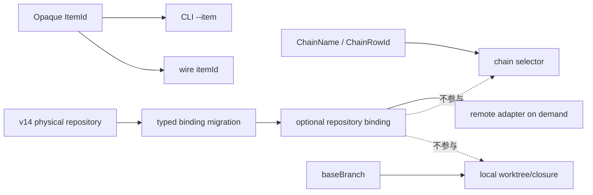
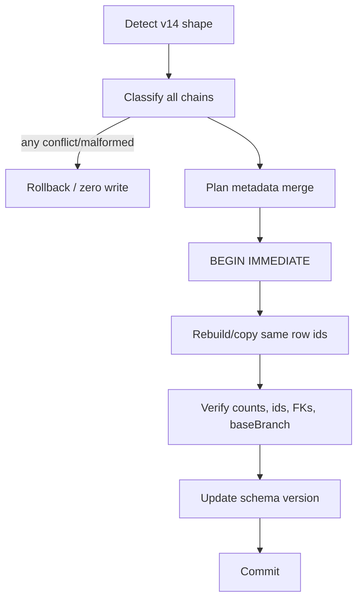

# R10/D7 — De-GitHub 需求侧原子推导

> 权威输入仅为AGGREGATE D7/Gate-3/8、`24-r9-expected-foundation.md` D7及De-GitHub供给与真实v14摘要。本文不读取旧issue边界、不查源码、不修改其他文件。  
> 范围：opaque item/chain identity、repository business binding、baseBranch、public surface清零、v14 resource-preserving migration与ownership gate。

## A. 摘要（≤1页）

D7推导出 **19项原子需求**，在一个可消费breaking checkpoint形成唯一权威：



稳定不变量：

- engine不知道GitHub、issue notation或forge repository格式；
- item id是opaque domain value，所有CLI/wire/batch/queue入口不normalize `#`、数字、slash或`owner/repo#n`；
- public chain selector是opaque `ChainName`，内部关联是`ChainRowId`；repository永不寻址；
- repository只存在于optional typed chain business bindings，可选CLI sugar也只写同一binding；
- `baseBranch`是唯一明确保留的engine-native pre-run字段，属于typed ChainDefinition provider的ChainDefinition；
- local worktree、closure与reconciliation完全不读repository；只有明确remote operation的boundary adapter按需读取；
- repository missing/invalid只阻断该remote operation，不阻断local resources，也不fallback git inference；
- v14的15条column-only repository值无损搬入binding，但15 chains/69 items/932 runs仍为pre-ref legacy hold，搬运不得解除hold。

清零不是全仓禁止单词`issue`或GitHub业务preset。ownership gate分三层：

1. engine typed/API/runtime surface禁止GitHub原语和旧alias；
2. public producer（CLI usage、wire schema、operator docs、scripts/templates）只产canonical opaque item/chain合同；
3. version-scoped historical migration可读取旧列/字段，合法preset业务schema可继续拥有`issue`。

24号已闭合全部产品语义；未闭合产品问题为0。D7自建opaque boundaries、CLI/wire/checkpoint、repository binding读写、migration与ownership gate；复用generic binding、SQLite migration、closure/worktree/baseBranch与opaque identity资产。typed ChainDefinition provider是baseBranch定义owner的共享能力，不由D7复制。真实remote adapter和冻结SHA compatibility路径仍是proof gap，不是新增dependency contract。

失败全部结构化：

- 旧CLI/wire/runtime alias在checkpoint后拒绝，不兼容回填；
- repository双来源冲突使请求或整个migration零写失败；
- mixed/unknown schema shape、malformed metadata、resource count/FK mismatch响亮失败；
- migration crash由单SQLite事务rollback，re-entry按version+shape判定；
- legacy definition unknown继续hold，不从repository/current source推断历史definition。

## B. Identity与ownership

### B1. Domain identities

```text
ItemIdentity  = (ChainRowId, ItemId)
ChainIdentity = { rowId: ChainRowId, name: ChainName }
RepositoryBinding = Optional<TypedBusinessValue>
BaseBranch = EngineNativePreRunValue
```

| 值 | Authority | 可用于 | 禁止用于 |
|---|---|---|---|
| ItemId | opaque item boundary | item lookup、queue、batch、events | issue parsing、numeric normalization |
| ChainName | public unique chain identity | operator/API selector | repository-derived selector |
| ChainRowId | internal store identity | FK、runtime/resource关联 | public repository替代 |
| RepositoryBinding | chain business bindings | prompt/明确remote adapter | chain/item identity、cache key、worktree ownership |
| BaseBranch | typed ChainDefinition | local Git/worktree base input | repository字符串的一部分 |

repository的具体ValueType由typed chain source schema决定；engine只经generic binding boundary，不验证`owner/repo`、forge host或slash数量。

### B2. Engine/preset ownership

| Surface | `issue`/GitHub业务词 | 旧engine selector/normalizer | 判定 |
|---|---|---|---|
| engine domain/API/wire | 禁止作为一等原语 | 禁止 | 必须清零 |
| bundled/target preset schema/prompt | 允许业务字段 | 不得泄回engine | 保留 |
| versioned historical migration | 允许识别旧shape | 仅migration内部 | 窄allowlist |
| changelog/migration说明 | 可描述历史 | 不可生成runtime alias | 文档性允许 |
| operator docs/scripts/templates | 只用canonical新入口 | 禁止旧命令作为可执行示例 | 必须更新 |

## C. 19项原子需求

| ID | Producer → Consumer | Operation | Invariant | Failure | Recovery |
|---|---|---|---|---|---|
| D7-R01 | CLI/wire boundary → item domain | `parseOpaqueItemId(value)` | 非空且满足generic边界；不解析`#`/slash/数字 | `item-id-invalid` | caller修值后重试；不normalize |
| D7-R02 | operator → CLI | canonical `--item <ItemId>` | 所有item/queue operations同一flag | old `--issue`为`legacy-selector-unsupported` | 无alias；显示canonical usage |
| D7-R03 | client → daemon wire | canonical `{itemId}` | request/response/event统一field | `issue/issueNumber` unknown field | client升级后重试 |
| D7-R04 | batch producer → item admission | batch只接受`itemId` | 每行同opaque parser；不backfill legacy key | mixed/legacy row使batch全拒 | 修正整batch后重试 |
| D7-R05 | operator/API → chain resolver | `resolveChain(ChainName) -> ChainRowId` | public name唯一；storage用row id | unknown/ambiguous chain | 不尝试repository lookup |
| D7-R06 | chain create → bindings | `writeRepositorySugar(optionalValue)` | sugar与explicit binding写同一field；engine不forge-validate | 双来源不同值`repository-binding-conflict` | 请求零写；统一值后重试 |
| D7-R07 | chain update/read → bindings | generic typed binding update/projection | update不改chain id/name/resources；status分栏identity与binding | type/admission mismatch | candidate零写；修值重试 |
| D7-R08 | remote operation → binding resolver | `resolveRepositoryForRemoteOperation()` | 仅明确声明需要的operation读取 | missing/type-invalid | 只阻断该operation；不fallback推断 |
| D7-R09 | local resource manager → chain/item/baseBranch | create/reconcile worktree/closure | 零repository read；资源identity保持既有chain/item/path | repository absent不构成错误 | 按local资源事实恢复 |
| D7-R10 | typed ChainDefinition → local Git | `resolveBaseBranch()` | baseBranch保留engine-native、与repository分域 | missing/corrupt definition | instance hold；不从repo字符串推断 |
| D7-R11 | migration scanner → classification | classify ColumnOnly/BindingOnly/Consistent/Conflict/Missing | 全row穷尽；非GitHub字符串opaque保留 | malformed metadata/unknown shape | migration零写失败 |
| D7-R12 | migration planner → SQLite | copy column→`metadata.bindings.repository`并退列 | 先全量plan；单`BEGIN IMMEDIATE`；Conflict任一则全失败 | conflict、constraint、FK/count mismatch | transaction rollback |
| D7-R13 | startup migration → schema detector | detect version+physical shape | supported旧shape唯一顺序前进；不猜mixed state | `migration-shape-mismatch` | 保持原库；人工/明确repair后重入 |
| D7-R14 | migration → business/history rows | preserve row/resource invariants | chain ids/names、69 items、932 runs、extra、baseBranch、FK逐项保留 | count/id/FK/resource projection mismatch | commit前拒绝；rollback |
| D7-R15 | migration → legacy state | set/retain `legacy-definition-unproven` hold | repository搬运不证明历史definition，不物化假runtime tree | missing historical definition | 只读/hold；显式schema-proven repair |
| D7-R16 | ownership scanner → typed/API/runtime | reject GitHub engine primitives | engine symbols/fields/parser/normalizer为零 | forbidden engine-owned hit | checkpoint失败，不发布 |
| D7-R17 | ownership scanner → public producers | audit CLI usage/wire/docs/scripts/templates | executable examples只产`--item`/`itemId`/chainName | legacy producer hit | 更新producer后重跑gate |
| D7-R18 | ownership classifier → preset/migration | apply narrow allowlist | preset business `issue`允许；历史migration仅version-scoped | unowned/overbroad allowlist hit | 分类修正；不得删除合法preset业务 |
| D7-R19 | release coordinator → all consumers | publish one breaking checkpoint | CLI/wire/store/docs/scripts同版本切换；runtime alias为零 | 任一consumer/gate未就绪 | 不发布；施工commit不宣称可消费 |

## D. Public surface与错误

### D1. Checkpoint后的canonical面

| 面 | Canonical contract |
|---|---|
| item CLI | `--item` |
| queue CLI | `--item` |
| batch JSON | `itemId` |
| daemon wire | `itemId` |
| public chain selector | `chainName` |
| internal chain selector | `chainRowId` |
| repository input | optional typed binding或pure sugar |
| repository display | `bindings.repository?`，与identity分栏 |
| base branch | typed ChainDefinition field |

旧alias不返回兼容成功；错误必须点名canonical replacement，但不能在内部转换后继续运行。

### D2. Error ADT

| Stage | Typed errors | Side effect |
|---|---|---|
| boundary | `item-id-invalid`、`legacy-selector-unsupported`、`unknown-wire-field` | 无写入 |
| chain binding | `repository-binding-conflict`、`repository-type-invalid` | request零写 |
| remote operation | `repository-binding-missing/invalid` | 仅operation blocked |
| definition/local resource | `base-branch-missing`、`definition-corrupt` | instance hold；local resource不猜 |
| migration | `shape-mismatch`、`metadata-malformed`、`repository-conflict`、`fk/count-mismatch` | 全事务rollback |
| ownership gate | `forbidden-engine-primitive`、`legacy-public-producer`、`allowlist-owner-unknown` | checkpoint不发布 |
| legacy | `legacy-definition-unproven` | read-only/hold |

## E. v14 migration

### E1. 已知输入

| Fact | Contract consequence |
|---|---|
| schema v14 | 必须从v14真实shape沿唯一upgrade path可达 |
| 15 chains | 全量分类，不抽样 |
| 15 ColumnOnly | 无损写入binding，不能要求binding预存 |
| 0 Conflict | current population无需人工选边，但guard保留 |
| 69 items / 932 runs | table rebuild不得丢失或重编号 |
| 15/15 baseBranch |逐值保留 |
| 3 stopped chains仍有worktree | 不得因stopped/deleted状态清资源 |
| v14无closure表 | 不得假定新schema表已存在 |

### E2. Transaction



metadata merge只设置/保留`bindings.repository`，不替换其他bindings或remainder。Missing合法，因为repository optional。BindingOnly/Consistent保留binding；Conflict不选边。

### E3. Re-entry/recovery

| Shape | Action |
|---|---|
| old version + repository column | 重新全量classify/plan |
| new version + no column + valid binding shape | 已迁移，不重复写 |
| transaction crash | SQLite rollback，按原shape重入 |
| version/shape可证明处于支持的中间migration | 按唯一upgrade step恢复 |
| mixed/unknown | typed failure，禁止补默认列/空binding |

repository迁移完成后，legacy definition hold保持原状；repair必须有schema/definition证据，不能用current preset或repo值解除。

## F. Ownership清零gate

### F1. 三层gate

1. **Typed/API gate**：engine domain types、CLI args、wire boundary、runtime selectors、cache/fingerprint无GitHub/issue/repository identity原语。
2. **Public producer gate**：usage、help、operator docs、scripts、templates、examples不再生成旧flag/field。
3. **Historical gate**：只有version-scoped migration和明确历史说明可识别旧shape；normal request parser不可调用。

### F2. Allowlist分类

```text
Ownership =
  | EngineOwnedForbidden
  | PresetBusinessAllowed
  | HistoricalMigrationAllowed { schemaVersions }
  | DocumentationHistoryAllowed
```

禁止全仓raw grep“issue”后删除：合法preset `item.issue`、prompt `{{ISSUE}}`等属于L2业务。每个命中必须按owner分类；unknown owner使gate失败，不能自动归allowlist。

## G. 地基匹配

| 能力 | 24号/R5供给 | 分类 | D7责任 |
|---|---|---|---|
| engine不知道GitHub | 稳定条款 | 地基直接 | 执行清零gate |
| repository optional business binding | 正式裁决 | 地基直接 | 实现读写/migration |
| opaque item/wire主体 | R5资产 | 修补复用 | R01–R04 |
| chainName/rowId identity | 既有资产/正式裁决 | 修补复用 | R05 |
| generic typed bindings | D2/shared substrate | 修补复用 | R06–R08 |
| closure/worktree/reconcile | R5资产 | 直接复用 | R09，增加零repository gate |
| baseBranch消费 | R5资产 | 直接复用 | R10，接typed provider |
| SQLite migration/IMMEDIATE | R5资产 | 修补复用 | R11–R15 |
|真实v14人口 | I-42事实 | 直接输入 | migration fixture/oracle |
| CLI/wire breaking surface | 尚未统一 | D7自建 | R02–R04、R19 |
| docs/scripts/public producer清零 | 尚未证明 | D7自建 | R17 |
| engine/preset ownership classifier | 目标保证 | D7自建 | R16–R18 |
| typed ChainDefinition provider | 共享能力 | dependency seam | D7只消费baseBranch |
| remote operation adapter | 真实路径未证明 | proof gap | D7定义边界，不虚构transport |
| compatibility real E2E | 未运行 | proof gap | 专用冻结SHA验收 |

分类结论：

- **地基直接/复用**：opaque persistence、chain identity、generic bindings、baseBranch、closure/worktree、migration事务；
- **D7自建**：19项中的opaque/public边界、repository binding/migration、ownership gate与checkpoint；
- **共享能力**：typed ChainDefinition provider只供baseBranch schema/ref；
- **具名外部runtime dependency**：无；
- **未闭合产品语义**：0；
- **proof gaps**：remote adapter、historical allowlist实扫、冻结SHAcompatibility。

## H. 验证边界

### H1. Boundary/identity

1. `42`、`#42`、`owner/repo#42`作为三个不同ItemId round-trip；
2. 全CLI/queue/batch/wire只接受`--item`/`itemId`；
3.旧flag/field结构化失败且零写；
4. chainName selector与rowId FK稳定；repository相同/缺失/变化不影响identity；
5. status把identity与repository binding分栏。

### H2. Repository/local resources

1. create sugar与explicit binding同值成功、冲突零写；
2. repository更新不改chain/worktree/closure identity；
3. local worktree/closure/reconcile在repository missing/invalid时仍按既有facts工作；
4. remote operation missing/invalid只阻断自身且不fallback；
5. baseBranch缺失从typed definition报错，不从repository推断。

### H3. Migration

1. v14 fixture精确含15 chains/69 items/932 runs、15 ColumnOnly；
2. ColumnOnly/BindingOnly/Consistent/Conflict/Missing/malformed全矩阵；
3. Conflict任一导致全库零写；
4. before/after ids、FK、extra、baseBranch、counts完全相同；
5. 3个stopped chain的资源事实不被清理；
6. transaction crash/re-entry与mixed shape拒绝；
7. repository搬运后legacy hold仍在。

### H4. Ownership/checkpoint

1. typed/API forbidden symbols与runtime aliases清零；
2. CLI help/docs/scripts/templates不产生旧入口；
3.合法preset业务`issue`通过owner allowlist；
4. migration旧词只在声明schema version范围出现；
5. unknown owner命中使gate失败；
6. 单checkpoint全消费者通过后才可消费发布。

### H5. E2E边界

必须在实际发布候选上运行：

- canonical opaque item CLI→wire→store→queue/status；
- repository-free local chain/worktree路径；
- repository-present remote operation路径及missing阻断；
- v14 copy upgrade与resource invariants；
- compatibility real E2E专用冻结SHA验证。

未运行这些真实路径前，只能声称合同/局部实现完成，不能声称D7生产迁移或compatibility完成。

## 尾结论

**D7推导出19项原子需求：item与chain identity完全opaque，repository只作optional typed business binding，baseBranch独立保留，local worktree/closure/reconcile零repository读取；CLI/wire/docs/scripts在单一breaking checkpoint清除旧原语，v14以单IMMEDIATE事务无损搬运15条column-only值并保留15 chains/69 items/932 runs及资源事实，legacy definition继续hold。24号已闭合产品语义，D7自建public边界、migration与三层ownership gate；无具名外部runtime dependency，剩余仅remote adapter与冻结SHA真实路径proof gap。**
