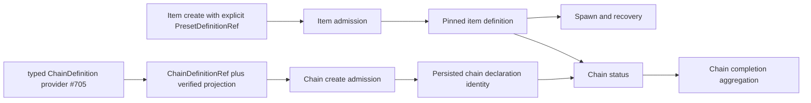

# RFC #547 R10/D9 需求侧推导：typed chain boundary 与 preset fallback 退役

> 权威输入：`AGGREGATE-547.md` D9、`24-r9-expected-foundation.md` 的 D9/Gate、chain fallback 供给摘要。  
> 范围：只推导本仓消费 typed `ChainDefinition`、item 显式 pin preset、fallback 退役后的原子需求；不查源码/旧 issue、不修改其他文件、不设计 provider 内部 parser。  
> 具名 dependency：typed ChainDefinition provider（出处 #705）唯一拥有 `ChainDefinition` ADT、parser、schema version、canonical validation 与 provider error；本仓不得复制。

## A. 摘要（≤1页）

D9解决的不是“换一个默认 preset”，而是消除三个时间面互相替代：chain declaration、item pinned preset definition、current preset catalog。新 chain 必须引用 provider 已验证的 typed chain declaration；每个新 item 必须显式 pin 自己的 `PresetDefinitionRef`。运行、恢复、status 与完成判断只读各自应读的域，不得用 chain preset、代表 item或 current/default 补洞。

本轮推导得到 **20项原子需求**：

- provider/ref/version boundary：5项；
- null、omitted、legacy 与 admission：5项；
- per-item runtime/recovery 与 fallback 清零：5项；
- empty/mixed chain、消费者、错误与验证：5项。



地基匹配：

| 类别 | D9定位 |
|---|---|
| 地基已供 | opaque chain/item storage主体、item `preset XOR presetPath` 互斥、per-item优先读取、事务化migration框架、`baseBranch`真实消费 |
| 修补后复用 | D1/D10 tagged definition identity、immutable publish/pin/integrity；D2 typed bindings；统一typed hold与pre-spawn副作用边界 |
| D9本仓自建 | provider client boundary、new admission、item pin必填、所有default/chain/current fallback清零、legacy classification、status/recovery/complete按域消费 |
| 具名 dependency | typed ChainDefinition provider（出处 #705）提供ADT/parser/version/errors及已验证projection；本仓只消费 |
| 仍未闭合 | provider外树交付、cross-boundary round-trip、legacy人口分类、empty/mixed chain与restart真实路径 |

`null`、omitted与legacy不得合并：

- 新 chain 的 `chainDefinitionRef` omitted或显式null都是typed reject；
- 新 item 的 `presetDefinitionRef` omitted或显式null都是typed reject；
- 已存在的无ref/null行是legacy事实，不从current、chain或default推断；分类后进入typed hold；
- 合法的“无默认 preset”不是保存null后等待运行时猜测，而是每个item都显式pin。

empty chain不需要preset才能被读取；mixed chain允许不同item pin不同preset。chain status展示chain declaration identity与逐item pinned identity，不选“代表item”。chain-complete只聚合已持久化runtime/terminal事实；不加载任意preset来制造全chain词表。

---

## B. 原子需求与匹配

## B1. 责任边界

provider输出的概念接口为：

```text
VerifiedChainDefinition = {
  ref: ChainDefinitionRef
  schemaVersion
  projection
  integrity
}
```

本仓消费结果为：

```text
ChainDefinitionResolution =
  | Resolved { verified: VerifiedChainDefinition }
  | Unavailable { dependency: "typed-chain-definition-provider" }
  | Rejected { error: ProviderChainDefinitionError }
```

这些是接口形状，不是要求本仓定义provider ADT或重写parser。provider error保持typed provenance；本仓只增加消费上下文及本地admission/hold error。

## B2. Provider/ref/version boundary（R-D9-01…05）

### R-D9-01 — Provider唯一拥有ChainDefinition语义

typed ChainDefinition provider（出处 #705）唯一拥有`ChainDefinition` ADT、字段合法性、parser、schema version与provider error。本仓禁止复制字段表、宽object parser、版本switch或“足够运行”的局部validator。

- **具名 dependency。**
- **D9本仓自建：** provider client及错误映射外壳。

### R-D9-02 — ChainDefinitionRef为独立tagged identity

`ChainDefinitionRef`必须与`PresetDefinitionRef`、`CompileEnvelopeRef`、`SchemaRef`保持分域；禁止裸hash/string互换、用preset ref填chain ref或由路径/名字现场构造ref。

- **修补后复用：** D1/D10 tagged identity与integrity。
- **D9本仓自建：** chain入口、存储与读面贯通。

### R-D9-03 — 新chain只接收provider已验证结果

chain create admission先由provider解析/验证声明并取得`VerifiedChainDefinition`，本仓只消费其typed projection。未成功resolution前不得写chain row、runtime目录或outbox。

- **dependency：** provider可用且支持该version。
- **D9本仓自建：** pure create plan与事务入口。

### R-D9-04 — Version与ref原样持久化

chain row必须保存provider给出的tagged ref、schema version及完成本仓消费所需的verified projection/ref，不得只存声明名字或current path。resume/restart按pinned ref解析，不重读current declaration。

- **修补后复用：** D10 immutable definition resolver/integrity。
- **D9本仓自建：** chain ref persistence与consumer wiring。

### R-D9-05 — Unknown version/error不降级

unknown schema version、unknown provider error variant、integrity mismatch或dependency unavailable均返回typed failure；禁止用legacy flat metadata、默认值或本仓parser继续。

- 新create：typed reject、零写入。
- 既有pinned chain：typed hold、零spawn副作用。

## B3. Null、omitted、legacy与admission（R-D9-06…10）

### R-D9-06 — 新chain ref omitted与null均reject

新chain create的`chainDefinitionRef`是required product field。wire omitted与显式null在边界分别保留输入证据，但归入不同typed admission error；二者均不得seed默认chain declaration。

- `chain_definition_ref_missing`
- `chain_definition_ref_null`

### R-D9-07 — 新item preset ref omitted与null均reject

新item create/batch-add必须携非null`PresetDefinitionRef`。omitted与显式null分别产生typed error；不得回退chain declaration、chain legacy preset、current catalog或bundled default。

- `item_preset_definition_ref_missing`
- `item_preset_definition_ref_null`

### R-D9-08 — Item preset选择恰好一个

item admission完成后只有一个pinned `PresetDefinitionRef`成为运行authority。若过渡入口仍接收source selector，它只能在admission前解析为ref，且互斥冲突typed reject；事务内及运行时不再保存“ref或path或name任选”的未决状态。

- **地基已供：** per-item selector互斥检查。
- **修补后复用：** D10 publish→create pin。

### R-D9-09 — Legacy无ref行只分类不猜测

既有chain/item缺ref、preset为null或仅有旧name/path时，migration/reader必须标为明确legacy variant，保留原始证据。禁止从current文件、chain字段、default名或相邻item反推等价definition。

```text
LegacyDefinitionState =
  | LegacyChainDefinitionUnproven
  | LegacyItemDefinitionUnproven
  | LegacyConflictingDefinitionEvidence
```

- **修补后复用：** Gate 3 `legacy-definition-unproven`原则。
- variant最终命名可由共同error vocabulary统一，但语义不得折叠为null。

### R-D9-10 — New reject与legacy hold严格分离

同一缺失事实按生命周期分流：

| 生命周期 | 结果 | 允许副作用 |
|---|---|---|
| 新chain/item admission | typed reject | 零持久化/零资源 |
| 已存在legacy row被status读取 | 返回legacy state | 只读 |
| 已存在legacy row准备spawn/recover | typed hold | 可写hold审计；零spawn资源 |
| 显式repair成功后 | 重新admit并pin | 仅按repair合同 |

不得因“历史兼容”让新入口接受null，也不得因新入口required而删除/伪造legacy证据。

## B4. Per-item runtime/recovery与fallback清零（R-D9-11…15）

### R-D9-11 — Spawn只读item pinned preset

每次spawn的phase、status vocabulary、prompt与runner resolution只来自该item pinned immutable preset definition。chain declaration可提供chain域配置，但不能替代item preset。

- **修补后复用：** D10 shared resolver。
- **D9本仓自建：** 删除chain/current/default替代路径。

### R-D9-12 — Recovery保持同一item ref

daemon restart、orphan recovery、resume与retry必须从运行记录/item row恢复同一`PresetDefinitionRef`，校验integrity后继续。current preset变化、chain declaration变化或其他item ref均不影响它。

- 无ref或resolver失败：typed hold。
- 禁止silent rebind。

### R-D9-13 — Chain declaration与item definition正交

`ChainDefinitionRef`回答chain级声明身份；`PresetDefinitionRef`回答单item执行定义身份。两者不共享null语义、不互为fallback、不由相同裸name/hash解析。消费者必须显式声明需要哪一域。

### R-D9-14 — 无default preset常量或行为

operator CLI、socket/API、daemon create、status、scheduler、recovery与tests不得存在“未指定就取bundled/default preset”的行为。移除默认后缺ref必须产生R-D9-06/07/09/10规定的结果，而非换一个fallback位置。

### R-D9-15 — 无implicit rebind

任何读取失败、definition unavailable、name collision、version mismatch或current source变化均不得自动把item绑定到可用definition。definition改变只能通过显式、审计化且满足D10身份合同的操作；对已开始instance不得就地改写历史ref。

## B5. Empty/mixed chain与消费者（R-D9-16…20）

### R-D9-16 — Empty chain可独立status

零item chain的status只需解析chain declaration及chain自身runtime facts；不得为了构造preset词表而加载default、chain preset或虚构代表item。若chain ref合法，empty本身不是错误。

- chain definition unresolved时按其typed error/legacy state报告。
- empty与definition-missing是两条正交状态。

### R-D9-17 — Mixed chain逐item判定

同一chain可包含pin到不同`PresetDefinitionRef`、不同version/phase vocabulary的items。status、scheduler与recovery逐item解析，不选择第一个/最后一个/当前item作为chain-wide preset。

### R-D9-18 — Status公开分域identity与error

status/API必须分别公开：

- chain的`ChainDefinitionRef`/version或typed chain error；
- 每个item的`PresetDefinitionRef`/version或legacy/hold error；
- 当前run实际使用的pinned item ref。

不得用单一`preset`字段混合chain/current/item语义，也不得把provider error压成字符串。

### R-D9-19 — Chain-complete只聚合runtime事实

chain-complete判断从已持久化item runtime terminal事实与chain自身完成规则聚合；不得通过代表item preset、chain legacy preset或default vocabulary解释所有items。mixed chain各item的terminal解释必须在其自身typed transition/runtime边界内完成。

- empty chain的完成语义若由ChainDefinition声明，消费provider projection；
- 本仓不得为填空复制provider parser或发明默认“空即完成/不完成”。

### R-D9-20 — Error/version/consumer一致性可验证

create、batch、status、scheduler、recovery与chain-complete对相同ref/version/legacy事实必须返回同一分类。最低验证矩阵必须覆盖：

1. valid new chain + explicit item ref；
2. chain ref omitted/null/unknown-version；
3. item ref omitted/null/conflict；
4. legacy chain/item missing ref进入hold且不fallback；
5. empty valid chain；
6. mixed chain中至少两个不同preset refs；
7. restart/resume保持逐item ref；
8. provider unavailable与integrity mismatch在首个spawn副作用前停止。

cross-boundary runtime在provider未交付时只能登记`dependency-unavailable(typed-chain-definition-provider)`，不得把本仓stub/parser测试称为完成。

---

## B6. 固定消费规则

| 消费者 | 必须读取 | 禁止读取/替代 |
|---|---|---|
| chain create | provider verified ChainDefinition + ref/version | default chain、flat metadata parser |
| item create | explicit published PresetDefinitionRef | chain preset、current/default |
| item spawn | item pinned immutable definition | chain/representative item |
| restart/recovery | run/item原pinned ref | current source、同chain其他item |
| chain status | chain ref + 每item各自ref/runtime | 单一chain-wide preset vocabulary |
| empty chain status | chain definition/runtime | default或虚构item |
| chain complete | typed item terminal runtime + chain completion projection（若需要） | 代表item preset/default |

## B7. Error ADT最低语义

本仓本地边界至少保留以下可穷尽类别；provider内部类别原样嵌套，不在此复制：

```text
D9BoundaryError =
  | ChainDefinitionRefMissing
  | ChainDefinitionRefNull
  | ItemPresetDefinitionRefMissing { itemId }
  | ItemPresetDefinitionRefNull { itemId }
  | ItemPresetSelectorConflict { itemId }
  | ProviderUnavailable { dependency }
  | ProviderRejected { providerError }
  | UnsupportedChainDefinitionVersion { ref, version }
  | DefinitionIntegrityMismatch { ref }
  | LegacyDefinitionUnproven { chainId, itemId? }
  | LegacyDefinitionEvidenceConflict { chainId, itemId? }
```

每个错误携chain/item/ref/version与入口上下文；consumer exhaustive match。禁止catch-all后套default、裸throw message或继续spawn。

## B8. 不变量

1. 一个已admit的新chain恰有一个合法`ChainDefinitionRef`。
2. 一个已admit的新item恰有一个合法pinned `PresetDefinitionRef`。
3. chain ref与item preset ref不互换。
4. omitted/null不会生成默认identity。
5. legacy事实不会从current反推。
6. recovery使用与create相同的item ref。
7. empty chain不触发preset fallback。
8. mixed chain没有代表preset。
9. chain-complete不重新解释item词表。
10. provider parser只有一个owner。

## B9. 明确非目标

- 不在本仓设计或实现`ChainDefinition` parser/ADT/schema。
- 不定义#705的交付issue内部结构。
- 不恢复chain-wide preset或default preset。
- 不把chain declaration塞入preset DSL。
- 不为legacy行自动选择“最像”的current definition。
- 不禁止mixed chain，也不把它拆成多个chain。
- 不发明empty chain默认完成语义。
- 不以兼容alias延长旧null/name/path fallback。

## B10. 分类匹配

| 需求组 | 地基已供 | 修补后复用 | D9本仓自建 | 具名dependency/缺口 |
|---|---|---|---|---|
| R-D9-01…05 provider/ref | opaque storage槽位 | D1/D10 identity/integrity | client、persistence、error mapping | #705 provider/round-trip |
| R-D9-06…10 admission/legacy | selector互斥、migration框架 | typed reject/hold、legacy原则 | required refs、分类、零fallback | legacy人口冻结SHA验证 |
| R-D9-11…15 runtime/recovery | per-item优先路径 | immutable resolver/pin | 删除所有fallback/rebind | restart真实链 |
| R-D9-16…20 consumers | status/runtime聚合基架 | typed runtime/transition | empty/mixed/status/complete分域 | provider交付与跨边界integration |

## B11. 验证层次

### B11.1 Static/schema

- provider contract adapter只引用provider公开types；
- unknown provider/schema/error variant触发exhaustive失败；
- `ChainDefinitionRef`与`PresetDefinitionRef`不可赋值；
- public input required字段不可由optional/null product表示。

### B11.2 Admission

- omitted/null分别断言typed error与零DB/outbox/resource写；
- batch任一item缺ref则全batch零写；
- provider unavailable/unknown version不调用本地fallback parser；
- valid create持久化原ref/version。

### B11.3 Legacy

- legacy raw evidence无损分类；
- status可读typed legacy state；
- spawn/recovery写typed hold并证明未创建worktree/process/run side effect；
- current存在同名definition也不自动repair。

### B11.4 Empty/mixed consumers

- empty chain status不访问preset resolver；
- mixed chain两个item分别显示/恢复各自ref；
- 一个item错误不被另一itemdefinition掩盖；
- chain-complete读取typed terminal runtime，不选代表item。

### B11.5 Frozen-SHA integration

在typed ChainDefinition provider真实交付后，冻结SHA路径覆盖provider declaration→chain create→两个不同preset item create→spawn→daemon restart→status→chain complete，并另跑empty chain与legacy hold。必须观察DB ref、status identity、runner实际definition及首副作用前失败；provider stub、unit parser或旧default绿测不能替代。

## B12. 需求核算

| 区段 | IDs | 数量 |
|---|---|---:|
| provider/ref/version | R-D9-01…05 | 5 |
| null/omitted/legacy/admission | R-D9-06…10 | 5 |
| runtime/recovery/fallback清零 | R-D9-11…15 | 5 |
| empty/mixed/consumer/error | R-D9-16…20 | 5 |
| **总计** | **R-D9-01…20** | **20** |

provider-owned parser/ADT需求新增为0；本仓只消费其稳定公开接口。

## B13. 尾部结论

**R10/D9尾部结论：20项原子需求以typed ChainDefinition provider（出处 #705）为唯一ChainDefinition ADT/parser/version/error owner，本仓只消费verified ChainDefinitionRef/projection；新chain与新item的required ref omitted或null均typed reject，legacy无ref/null只保留证据并在运行前typed hold，任何路径都不得回退chain/current/default或implicit rebind。每个item显式pin自身PresetDefinitionRef，spawn/restart/recovery保持同一ref；empty chain无需preset即可status，mixed chain逐item解析且没有代表preset，chain-complete只聚合typed runtime事实及provider给出的chain完成投影。现有opaque storage、selector互斥、per-item优先、migration与baseBranch消费可复用；provider外树交付、legacy人口及empty/mixed/restart跨边界runtime仍需冻结SHA证明。**
