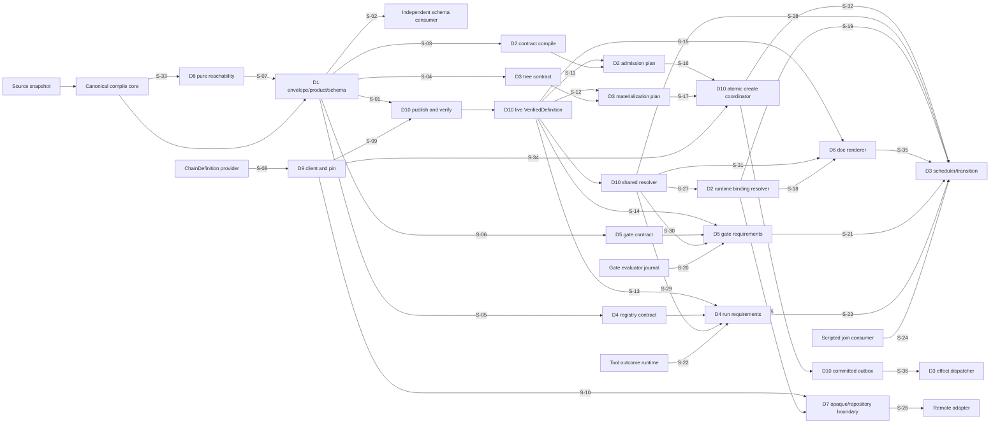

# RFC #547 R11：191项供需匹配与无环接缝图

> 只读输入：R5 `11-r5-supply-ledger.md`、R9 `24-r9-expected-foundation.md`、R10十份 `26-r10-*.md` 与已通过的 `27-r10-demand-audit.md`。  
> 本报告不查源码/旧issue，不改变191项需求，不排序实现、不创建或重拆issue。issue号仅作dependency出处，绝不作合同identity。

## A. 主agent摘要（≤1页）

R11修正版完成 **191/191** 原子供需匹配。每行现在以同ID R10分类、具体R5 `A/D/U/T/J`事实和R9保证决定一个主分类与唯一owner；不再复制domain范围证据。proof只作正交标签，未运行不再被算作foundation缺失。

| 主分类 | 数量 | 判据 |
|---|---:|---|
| 直接复用 | 9 | 同一原子能力已有可保留生产资产 |
| 修补后复用 | 11 | 同一资产存在但需收紧/贯通 |
| 过渡兼容 | 10 | 只处理显式legacy/migration/linear adapter |
| 消费能力自建 | 150 | R10把该原子producer/consumer归本域自建 |
| 地基仍缺 | 11 | 该原子能力的唯一producer是未交付具名foundation |
| **合计** | **191** | **交集0、遗漏0** |

跨domain authority边已抽成 **36个named seams**；Mermaid中每条跨domain边标注对应seam，seam表每条也在图中出现。D10 publisher/verified definition与create coordinator已拆开，真实阶段为publish/verify→D2/D3 admission plans→D10 create；完整artifact DAG机械检查循环 **0**。

R12 readiness仍只是能力边界输入，不创建issue、不排序实现：每个10 capability unit列完整named seam先决/出口、owned product、独立观察点、显式dependency/proof和自包含验收闭包。

---

## B. 191项逐条映射

| ID | 原子保证（短名） | 主分类 | dependency/proof正交标签 | 唯一owner | 原子证据→预期保证 |
|---|---|---|---|---|---|
| D1-R01 | source resolver → compiler | 消费能力自建 | — | D1 CompileEnvelope/Schema producer | R10 D1-R01原子分类；R5 A-01+D-02；R9 D1保证 |
| D1-R02 | compiler → all compile consumers | 消费能力自建 | — | D1 CompileEnvelope/Schema producer | R10 D1-R02原子分类；R5 A-01+D-01；R9 D1保证 |
| D1-R03 | compiler → refs/cache | 消费能力自建 | — | D1 CompileEnvelope/Schema producer | R10 D1-R03原子分类；R5 A-01+D-01；R9 D1保证 |
| D1-R04 | compiler → finding consumers | 消费能力自建 | — | D1 CompileEnvelope/Schema producer | R10 D1-R04原子分类；R5 A-02+D-01；R9 D1保证 |
| D1-R05 | compile call → observation consumers | 消费能力自建 | — | D1 CompileEnvelope/Schema producer | R10 D1-R05原子分类；R5 A-03；R9 D1保证 |
| D1-R06 | compiler → public CLI/API | 消费能力自建 | — | D1 CompileEnvelope/Schema producer | R10 D1-R06原子分类；R5 A-02+D-04；R9 D1保证 |
| D1-R07 | schema producer → public consumers | 消费能力自建 | — | D1 CompileEnvelope/Schema producer | R10 D1-R07原子分类；R5 D-04+U-01；R9 D1保证 |
| D1-R08 | public consumer → schema artifact | 消费能力自建 | proof: independent-schema-consumer | D1 CompileEnvelope/Schema producer | R10 D1-R08原子分类；R5 D-04+T-01；R9 D1保证 |
| D1-R09 | daemon/internal callers → compile cache | 消费能力自建 | — | D1 CompileEnvelope/Schema producer | R10 D1-R09原子分类；R5 A-02+D-02；R9 D1保证 |
| D1-R10 | compiler → definition publisher | 消费能力自建 | — | D1 CompileEnvelope/Schema producer | R10 D1-R10原子分类；R5 A-03+D-21；R9 D1保证 |
| D1-R11 | D1 handoff → D10 immutable artifact publisher | 消费能力自建 | — | D1 CompileEnvelope/Schema producer | R10 D1-R11原子分类；R5 D-21+U-03；R9 D1保证 |
| D1-R12 | envelope → callback/event adapter | 消费能力自建 | — | D1 CompileEnvelope/Schema producer | R10 D1-R12原子分类；R5 D-01；R9 D1保证 |
| D1-R13 | doctor → current compile read面 | 消费能力自建 | — | D1 CompileEnvelope/Schema producer | R10 D1-R13原子分类；R5 D-05；R9 D1保证 |
| D1-R14 | schema producer → verification coordinator | 消费能力自建 | proof: independent-schema-consumer | D1 CompileEnvelope/Schema producer | R10 D1-R14原子分类；R5 U-01+U-05；R9 D1保证 |
| D2-R01 | source declaration 必须引用唯一 source schema；use-site 仅含 source ref、owner、requ… | 消费能力自建 | proof: schema/consumer round-trip | D2 binding/value contract | R10 D2-R01原子分类；R5 A-05+D-07；R9 D2保证 |
| D2-R02 | ValueType 只允许冻结的七类递归闭集；record 为 closed fields，union 非空；opaque json、隐式 opt… | 消费能力自建 | — | D2 binding/value contract | R10 D2-R02原子分类；R5 D-11；R9 D2保证 |
| D2-R03 | 每个 binding 使用稳定 BindingIdentity = DefinitionRef + SourceIdentity + OwnerS… | 消费能力自建 | — | D2 binding/value contract | R10 D2-R03原子分类；R5 A-05+D-07；R9 D2保证 |
| D2-R04 | binding 状态使用 ADT：missing | 消费能力自建 | — | D2 binding/value contract | R10 D2-R04原子分类；R5 D-08；R9 D2保证 |
| D2-R05 | 所有 CLI/API/file/migration candidate 先以 unknown 解析；成功后保留 source identity、o… | 消费能力自建 | — | D2 binding/value contract | R10 D2-R05原子分类；R5 D-09；R9 D2保证 |
| D2-R06 | missing 判定只表示 source 未提供值；required+missing 失败，optional+missing 保持 missing… | 消费能力自建 | — | D2 binding/value contract | R10 D2-R06原子分类；R5 A-07+D-09；R9 D2保证 |
| D2-R07 | 显式 null 不触发 default；schema 接受 null 才 admitted，否则 type mismatch。union 中 nu… | 消费能力自建 | — | D2 binding/value contract | R10 D2-R07原子分类；R5 D-08；R9 D2保证 |
| D2-R08 | type validation 必须递归到 array element、record field、union variant；closed rec… | 消费能力自建 | — | D2 binding/value contract | R10 D2-R08原子分类；R5 D-09；R9 D2保证 |
| D2-R09 | create 前完成全部 binding admission、definition integrity 与 consumer-required c… | 消费能力自建 | proof: atomic create/migration/transition | D2 binding/value contract | R10 D2-R09原子分类；R5 A-07+D-09；R9 D2保证 |
| D2-R10 | batch create/update 先对全部对象生成完整 plan；任一 plan 失败则整批零写。 | 消费能力自建 | proof: atomic create/migration/transition | D2 binding/value contract | R10 D2-R10原子分类；R5 A-07+J-04；R9 D2保证 |
| D2-R11 | admitted storage 保存 BindingIdentity、canonical typed value、source schema/r… | 消费能力自建 | proof: atomic create/migration/transition | D2 binding/value contract | R10 D2-R11原子分类；R5 A-07+D-10；R9 D2保证 |
| D2-R12 | runtime resolver 只从 pinned definition 与 admitted storage 解析；current sourc… | 消费能力自建 | — | D2 binding/value contract | R10 D2-R12原子分类；R5 D-22+J-07；R9 D2保证 |
| D2-R13 | candidate patch/replacement 必须提交完整 replacement value，以 expected admitted … | 消费能力自建 | — | D2 binding/value contract | R10 D2-R13原子分类；R5 A-07+D-09；R9 D2保证 |
| D2-R14 | binding update 与其派生 consumer invalidation/outbox rows 在同一事务提交；commit 后只 d… | 消费能力自建 | proof: atomic create/migration/transition | D2 binding/value contract | R10 D2-R14原子分类；R5 A-07+J-04；R9 D2保证 |
| D2-R15 | 为 admitted typed value 提供唯一canonical value serialization：scalar按类型转canoni… | 消费能力自建 | — | D2 binding/value contract | R10 D2-R15原子分类；R5 A-06+D-08；R9 D2保证 |
| D2-R16 | projection 必须保留 binding identity、ValueType、source/owner、required/default/… | 消费能力自建 | proof: schema/consumer round-trip | D2 binding/value contract | R10 D2-R16原子分类；R5 A-02+D-10+J-01；R9 D2保证 |
| D2-R17 | runner 提交的 exit. 先按 pinned exit source schema 解析为完整 candidate；只能写 agent-o… | 消费能力自建 | — | D2 binding/value contract | R10 D2-R17原子分类；R5 D-11+D-16；R9 D2保证 |
| D2-R18 | typed exit candidate 与 TransitionId 做 idempotent CAS；只有完整 validation 成功的 … | 消费能力自建 | proof: atomic create/migration/transition | D2 binding/value contract | R10 D2-R18原子分类；R5 D-16+J-05；R9 D2保证 |
| D2-R19 | legacy raw binding 只有在目标 DefinitionRef 与 source schema 可证明时才迁移；missing/sc… | 消费能力自建 | proof: atomic create/migration/transition | D2 binding/value contract | R10 D2-R19原子分类；R5 A-07+T-03；R9 D2保证 |
| D2-R20 | consumer 只能接收 admitted(value) 或具名 typed failure/hold；不得接收 raw candidate、u… | 消费能力自建 | proof: schema/consumer round-trip | D2 binding/value contract | R10 D2-R20原子分类；R5 D-07…11；R9 D2保证 |
| R-D3-01 | Versioned referenced-node boundary | 消费能力自建 | dependency: typed-chain-definition-provider | D3 runtime tree/transition contract | R10 R-D3-01原子分类；R5 D-13+U-04；R9 D3保证 |
| R-D3-02 | Stable definition node identity | 消费能力自建 | — | D3 runtime tree/transition contract | R10 R-D3-02原子分类；R5 A-08；R9 D3保证 |
| R-D3-03 | Graph完整性在compile拒绝 | 消费能力自建 | — | D3 runtime tree/transition contract | R10 R-D3-03原子分类；R5 D-13；R9 D3保证 |
| R-D3-04 | Linear input仅为compat sugar | 过渡兼容 | — | D3 runtime tree/transition contract | R10 R-D3-04原子分类；R5 A-08+D-15；R9 D3保证 |
| R-D3-05 | Canonical tree唯一权威 | 消费能力自建 | — | D3 runtime tree/transition contract | R10 R-D3-05原子分类；R5 D-13+J-02；R9 D3保证 |
| R-D3-06 | Capability在definition/instance双层判定 | 地基仍缺 | dependency: non-degenerate-par capability | D3 runtime tree/transition contract | R10 R-D3-06原子分类；R5 D-14+U-05；R9 D3保证 |
| R-D3-07 | Pure materialization plan | 消费能力自建 | — | D3 runtime tree/transition contract | R10 R-D3-07原子分类；R5 D-14；R9 D3保证 |
| R-D3-08 | Create单事务完整物化 | 消费能力自建 | — | D3 runtime tree/transition contract | R10 R-D3-08原子分类；R5 A-08+D-14；R9 D3保证 |
| R-D3-09 | Runtime identity单向关联 | 消费能力自建 | — | D3 runtime tree/transition contract | R10 R-D3-09原子分类；R5 A-09；R9 D3保证 |
| R-D3-10 | Persisted readiness封闭ADT | 消费能力自建 | — | D3 runtime tree/transition contract | R10 R-D3-10原子分类；R5 A-08+D-15；R9 D3保证 |
| R-D3-11 | Scheduler只读readiness | 消费能力自建 | — | D3 runtime tree/transition contract | R10 R-D3-11原子分类；R5 D-15；R9 D3保证 |
| R-D3-12 | Atomic claim与容量释放 | 消费能力自建 | dependency: gate-evaluator/journal | D3 runtime tree/transition contract | R10 R-D3-12原子分类；R5 A-10+D-15；R9 D3保证 |
| R-D3-13 | 首副作用前guard | 修补后复用 | dependency: non-degenerate-par capability | D3 runtime tree/transition contract | R10 R-D3-13原子分类；R5 A-10+D-17；R9 D3保证 |
| R-D3-14 | Runner exit不是业务推进 | 消费能力自建 | — | D3 runtime tree/transition contract | R10 R-D3-14原子分类；R5 D-16；R9 D3保证 |
| R-D3-15 | Transition request封闭ADT | 消费能力自建 | — | D3 runtime tree/transition contract | R10 R-D3-15原子分类；R5 D-11+D-16；R9 D3保证 |
| R-D3-16 | Actor与run授权 | 消费能力自建 | — | D3 runtime tree/transition contract | R10 R-D3-16原子分类；R5 A-09；R9 D3保证 |
| R-D3-17 | 单一业务commit | 消费能力自建 | — | D3 runtime tree/transition contract | R10 R-D3-17原子分类；R5 A-07+D-16；R9 D3保证 |
| R-D3-18 | Idempotency与并发 | 消费能力自建 | — | D3 runtime tree/transition contract | R10 R-D3-18原子分类；R5 D-16+T-05；R9 D3保证 |
| R-D3-19 | Gate/join decision只作为typed dependency | 地基仍缺 | dependency: gate-evaluator/journal；dependency: scripted-join-consumer | D3 runtime tree/transition contract | R10 R-D3-19原子分类；R5 D-20+U-02；R9 D3保证 |
| R-D3-20 | Outbox与external effect分域 | 消费能力自建 | — | D3 runtime tree/transition contract | R10 R-D3-20原子分类；R5 A-07+D-16；R9 D3保证 |
| R-D3-21 | Restart只恢复持久事实 | 消费能力自建 | — | D3 runtime tree/transition contract | R10 R-D3-21原子分类；R5 A-09+D-22；R9 D3保证 |
| R-D3-22 | Legacy与损坏hold | 过渡兼容 | — | D3 runtime tree/transition contract | R10 R-D3-22原子分类；R5 D-21/22+T-05；R9 D3保证 |
| R-D3-23 | Structured error family | 消费能力自建 | — | D3 runtime tree/transition contract | R10 R-D3-23原子分类；R5 D-16；R9 D3保证 |
| R-D3-24 | Status/events只投影authority | 消费能力自建 | — | D3 runtime tree/transition contract | R10 R-D3-24原子分类；R5 A-09+T-04；R9 D3保证 |
| D4-R01 | preset compiler → registry consumers | 消费能力自建 | — | D4 ToolRegistry/requirement contract | R10 D4-R01原子分类；R5 D-18+J-03；R9 D4保证 |
| D4-R02 | registry → all tool identities | 消费能力自建 | — | D4 ToolRegistry/requirement contract | R10 D4-R02原子分类；R5 D-18；R9 D4保证 |
| D4-R03 | registry → availability adapters | 消费能力自建 | — | D4 ToolRegistry/requirement contract | R10 D4-R03原子分类；R5 D-18；R9 D4保证 |
| D4-R04 | registry/runtime → invocation facts | 消费能力自建 | — | D4 ToolRegistry/requirement contract | R10 D4-R04原子分类；R5 D-18；R9 D4保证 |
| D4-R05 | registry → outcome runtime | 消费能力自建 | — | D4 ToolRegistry/requirement contract | R10 D4-R05原子分类；R5 D-18；R9 D4保证 |
| D4-R06 | phase compiler → requirement consumers | 消费能力自建 | — | D4 ToolRegistry/requirement contract | R10 D4-R06原子分类；R5 D-18；R9 D4保证 |
| D4-R07 | compiler → compiled model | 消费能力自建 | — | D4 ToolRegistry/requirement contract | R10 D4-R07原子分类；R5 D-18+T-01；R9 D4保证 |
| D4-R08 | compiler → public consumer | 消费能力自建 | — | D4 ToolRegistry/requirement contract | R10 D4-R08原子分类；R5 D-19+T-06；R9 D4保证 |
| D4-R09 | doctor → provider adapter | 消费能力自建 | — | D4 ToolRegistry/requirement contract | R10 D4-R09原子分类；R5 D-18；R9 D4保证 |
| D4-R10 | prompt renderer → agent | 消费能力自建 | — | D4 ToolRegistry/requirement contract | R10 D4-R10原子分类；R5 D-18+T-06；R9 D4保证 |
| D4-R11 | runtime capability registry → create/resume | 地基仍缺 | dependency: tool-outcome-finalize-runtime；proof: real journal/finalize | D4 ToolRegistry/requirement contract | R10 D4-R11原子分类；R5 D-18+U-02；R9 D4保证 |
| D4-R12 | runtime constructor → finalize | 消费能力自建 | — | D4 ToolRegistry/requirement contract | R10 D4-R12原子分类；R5 D-18；R9 D4保证 |
| D4-R13 | context store → outcome evaluator | 地基仍缺 | dependency: tool-outcome-finalize-runtime；proof: real journal/finalize | tool-outcome-finalize runtime provider | R10 D4-R13原子分类；R5 D-18+U-02；R9 D4保证 |
| D4-R14 | outcome runtime → journal | 地基仍缺 | dependency: tool-outcome-finalize-runtime；proof: real journal/finalize | tool-outcome-finalize runtime provider | R10 D4-R14原子分类；R5 D-18+U-02；R9 D4保证 |
| D4-R15 | finalize → run verdict | 地基仍缺 | dependency: tool-outcome-finalize-runtime；proof: real journal/finalize | tool-outcome-finalize runtime provider | R10 D4-R15原子分类；R5 D-18+U-02；R9 D4保证 |
| D4-R16 | finalize → transition/run store | 地基仍缺 | dependency: tool-outcome-finalize-runtime；proof: real journal/finalize | tool-outcome-finalize runtime provider | R10 D4-R16原子分类；R5 D-18+U-02；R9 D4保证 |
| D4-R17 | startup recovery → outcome journal | 地基仍缺 | dependency: tool-outcome-finalize-runtime；proof: real journal/finalize | tool-outcome-finalize runtime provider | R10 D4-R17原子分类；R5 D-18+U-02；R9 D4保证 |
| D4-R18 | status/events → authorized observer | 消费能力自建 | — | D4 ToolRegistry/requirement contract | R10 D4-R18原子分类；R5 A-11+D-18；R9 D4保证 |
| D5-R01 | GateDeclaration 必须是 {id,name,mode,point} 的 typed product；mode 仅 required | 消费能力自建 | — | D5 gate protocol contract | R10 D5-R01原子分类；R5 A-11+D-20；R9 D5保证 |
| D5-R02 | point 封闭 ADT 仅含 RunPreSpawn{phaseNodeId}、RunPostExit{phaseNodeId}、Contain… | 消费能力自建 | — | D5 gate protocol contract | R10 D5-R02原子分类；R5 D-20；R9 D5保证 |
| D5-R03 | RunPreSpawn runtime host 必须是 stable RunIntentHost{chainId,itemId,phaseNod… | 消费能力自建 | — | D5 gate protocol contract | R10 D5-R03原子分类；R5 A-09+D-20；R9 D5保证 |
| D5-R04 | RunPostExit host 必须是 CompletedRunHost{chainId,itemId,phaseNodeId,runId,ex… | 消费能力自建 | — | D5 gate protocol contract | R10 D5-R04原子分类；R5 D-20；R9 D5保证 |
| D5-R05 | ContainerJoin host 必须使用 runtime container stable identity、closure identit… | 消费能力自建 | — | D5 gate protocol contract | R10 D5-R05原子分类；R5 D-20；R9 D5保证 |
| D5-R06 | ChainComplete host 必须使用 chain identity、top-level join identity、closure-se… | 消费能力自建 | — | D5 gate protocol contract | R10 D5-R06原子分类；R5 A-11+D-20；R9 D5保证 |
| D5-R07 | GateDecisionPointId = (GateDeclarationId, GatePoint, GateHostStableId)；Ga… | 消费能力自建 | — | D5 gate protocol contract | R10 D5-R07原子分类；R5 A-11+D-20；R9 D5保证 |
| D5-R08 | named binding producer 仅 global 与 chain；chain 覆盖 global；item direct hook … | 消费能力自建 | — | D5 gate protocol contract | R10 D5-R08原子分类；R5 A-11；R9 D5保证 |
| D5-R09 | same-layer duplicate binding 在边界 typed reject；禁止按数组顺序、最后写入或 concat order 选中。 | 消费能力自建 | — | D5 gate protocol contract | R10 D5-R09原子分类；R5 A-11+D-20；R9 D5保证 |
| D5-R10 | resolution ADT 必须区分 Selected{binding,source,shadowedGlobal?} | 消费能力自建 | — | D5 gate protocol contract | R10 D5-R10原子分类；R5 A-11+D-20；R9 D5保证 |
| D5-R11 | required missing：新 instance create typed reject，既有 pinned instance schedu… | 消费能力自建 | — | D5 gate protocol contract | R10 D5-R11原子分类；R5 D-20；R9 D5保证 |
| D5-R12 | binding 已 Selected 后，required/optional 不改变 executor failure 语义；failure 只按… | 消费能力自建 | — | D5 gate protocol contract | R10 D5-R12原子分类；R5 D-20；R9 D5保证 |
| D5-R13 | runtime capability 必须具名、版本化，并声明 protocol、supported point variants、decisio… | 消费能力自建 | dependency: gate-evaluator/journal | D5 gate protocol contract | R10 D5-R13原子分类；R5 D-20+U-02；R9 D5保证 |
| D5-R14 | compile/preview 可产生含 gate 的 model，但 create 在写业务 instance 前 handshake；resu… | 消费能力自建 | dependency: gate-evaluator/journal | D5 gate protocol contract | R10 D5-R14原子分类；R5 D-20+U-02；R9 D5保证 |
| D5-R15 | 任何 gate declaration 在 capability absent 时都执行 R14；optional 不能跳过 capability… | 消费能力自建 | dependency: gate-evaluator/journal | D5 gate protocol contract | R10 D5-R15原子分类；R5 D-20+U-02；R9 D5保证 |
| D5-R16 | pre-spawn 前完成 definition integrity、typed runtime values、capability handsh… | 消费能力自建 | dependency: gate-evaluator/journal | D5 gate protocol contract | R10 D5-R16原子分类；R5 A-09+D-20；R9 D5保证 |
| D5-R17 | gate evaluator/journal 以同一 GateEvaluationId 创建或恢复 evaluating | 地基仍缺 | dependency: gate-evaluator/journal | gate-evaluator/journal provider | R10 D5-R17原子分类；R5 D-20+U-02；R9 D5保证 |
| D5-R18 | decision=hold 时同一事务执行 claimed→held，保留 RunIntent/RunId/evaluation epoch，释放… | 地基仍缺 | dependency: gate-evaluator/journal | gate-evaluator/journal provider | R10 D5-R18原子分类；R5 D-20+U-02；R9 D5保证 |
| D5-R19 | 业务 transition 只能引用并 consume decided GateEvaluationRef；transition effects … | 消费能力自建 | dependency: gate-evaluator/journal | D5 gate protocol contract | R10 D5-R19原子分类；R5 D-16+D-20；R9 D5保证 |
| D5-R20 | restart 扫描 evaluating/decided/consumed 与 held readiness：decided-unconsume… | 消费能力自建 | dependency: gate-evaluator/journal；dependency: scripted-join-consumer | D5 gate protocol contract | R10 D5-R20原子分类；R5 D-20+T-06；R9 D5保证 |
| R-D6-01 | Named typed outer boundary | 消费能力自建 | — | D6 doc projection/renderer | R10 R-D6-01原子分类；R5 A-05/06+D-12；R9 D6保证 |
| R-D6-02 | Doc declaration product完整 | 消费能力自建 | — | D6 doc projection/renderer | R10 R-D6-02原子分类；R5 A-05+D-12；R9 D6保证 |
| R-D6-03 | Label门控装饰 | 直接复用 | — | D6 doc projection/renderer | R10 R-D6-03原子分类；R5 A-05；R9 D6保证 |
| R-D6-04 | Use-site声明不改变source type | 消费能力自建 | — | D6 doc projection/renderer | R10 R-D6-04原子分类；R5 A-05+D-07；R9 D6保证 |
| R-D6-05 | Declaration identity/version固定 | 消费能力自建 | — | D6 doc projection/renderer | R10 R-D6-05原子分类；R5 A-02+D-12；R9 D6保证 |
| R-D6-06 | 只接受ResolvedBinding | 消费能力自建 | — | D6 doc projection/renderer | R10 R-D6-06原子分类；R5 D-07/08；R9 D6保证 |
| R-D6-07 | Scalar canonical文本 | 消费能力自建 | — | D6 doc projection/renderer | R10 R-D6-07原子分类；R5 D-08；R9 D6保证 |
| R-D6-08 | Structured默认单行canonical JSON | 消费能力自建 | — | D6 doc projection/renderer | R10 R-D6-08原子分类；R5 D-08；R9 D6保证 |
| R-D6-09 | Block/fenced必须显式 | 消费能力自建 | — | D6 doc projection/renderer | R10 R-D6-09原子分类；R5 A-06+D-12；R9 D6保证 |
| R-D6-10 | Supplied/defaulted文本等价 | 消费能力自建 | — | D6 doc projection/renderer | R10 R-D6-10原子分类；R5 D-09；R9 D6保证 |
| R-D6-11 | 固定组合管线 | 消费能力自建 | — | D6 doc projection/renderer | R10 R-D6-11原子分类；R5 A-06；R9 D6保证 |
| R-D6-12 | Prefix逐字且只在声明处生效 | 直接复用 | — | D6 doc projection/renderer | R10 R-D6-12原子分类；R5 A-06；R9 D6保证 |
| R-D6-13 | Suffix逐字且不参与value parse | 直接复用 | — | D6 doc projection/renderer | R10 R-D6-13原子分类；R5 A-06；R9 D6保证 |
| R-D6-14 | Style封闭穷尽 | 消费能力自建 | — | D6 doc projection/renderer | R10 R-D6-14原子分类；R5 A-06+D-12；R9 D6保证 |
| R-D6-15 | blankBefore只控制条目分隔 | 消费能力自建 | — | D6 doc projection/renderer | R10 R-D6-15原子分类；R5 A-05/06；R9 D6保证 |
| R-D6-16 | 单一runtime inputs doc consumer | 直接复用 | — | D6 doc projection/renderer | R10 R-D6-16原子分类；R5 A-06；R9 D6保证 |
| R-D6-17 | 公共projection可独立解释 | 消费能力自建 | proof: cross-consumer/runner | D6 doc projection/renderer | R10 R-D6-17原子分类；R5 A-02+U-01；R9 D6保证 |
| R-D6-18 | Typed render error | 消费能力自建 | — | D6 doc projection/renderer | R10 R-D6-18原子分类；R5 D-12；R9 D6保证 |
| R-D6-19 | 字节确定性与无启发式保证 | 消费能力自建 | — | D6 doc projection/renderer | R10 R-D6-19原子分类；R5 A-06+T-03；R9 D6保证 |
| R-D6-20 | 失败发生在spawn副作用前 | 修补后复用 | proof: cross-consumer/runner | D6 doc projection/renderer | R10 R-D6-20原子分类；R5 D-08+U-05；R9 D6保证 |
| D7-R01 | CLI/wire boundary → item domain | 修补后复用 | — | D7 opaque/repository boundary | R10 D7-R01原子分类；R5 A-12+D-23；R9 D7保证 |
| D7-R02 | operator → CLI | 修补后复用 | — | D7 opaque/repository boundary | R10 D7-R02原子分类；R5 A-12+D-23；R9 D7保证 |
| D7-R03 | client → daemon wire | 修补后复用 | — | D7 opaque/repository boundary | R10 D7-R03原子分类；R5 A-12+D-23；R9 D7保证 |
| D7-R04 | batch producer → item admission | 修补后复用 | — | D7 opaque/repository boundary | R10 D7-R04原子分类；R5 A-12+D-23；R9 D7保证 |
| D7-R05 | operator/API → chain resolver | 修补后复用 | — | D7 opaque/repository boundary | R10 D7-R05原子分类；R5 A-12；R9 D7保证 |
| D7-R06 | chain create → bindings | 修补后复用 | proof: remote-adapter/frozen-SHA | D7 opaque/repository boundary | R10 D7-R06原子分类；R5 A-05+D-23；R9 D7保证 |
| D7-R07 | chain update/read → bindings | 修补后复用 | proof: remote-adapter/frozen-SHA | D7 opaque/repository boundary | R10 D7-R07原子分类；R5 A-05+D-23；R9 D7保证 |
| D7-R08 | remote operation → binding resolver | 修补后复用 | proof: remote-adapter/frozen-SHA | D7 opaque/repository boundary | R10 D7-R08原子分类；R5 A-05+D-23；R9 D7保证 |
| D7-R09 | local resource manager → chain/item/baseBranch | 直接复用 | — | D7 opaque/repository boundary | R10 D7-R09原子分类；R5 A-10+J-06；R9 D7保证 |
| D7-R10 | typed ChainDefinition → local Git | 直接复用 | — | D7 opaque/repository boundary | R10 D7-R10原子分类；R5 A-12+J-06；R9 D7保证 |
| D7-R11 | migration scanner → classification | 过渡兼容 | — | D7 opaque/repository boundary | R10 D7-R11原子分类；R5 A-12+D-23；R9 D7保证 |
| D7-R12 | migration planner → SQLite | 过渡兼容 | — | D7 opaque/repository boundary | R10 D7-R12原子分类；R5 A-07/12+D-23；R9 D7保证 |
| D7-R13 | startup migration → schema detector | 过渡兼容 | — | D7 opaque/repository boundary | R10 D7-R13原子分类；R5 A-12+D-23；R9 D7保证 |
| D7-R14 | migration → business/history rows | 过渡兼容 | — | D7 opaque/repository boundary | R10 D7-R14原子分类；R5 A-10/12；R9 D7保证 |
| D7-R15 | migration → legacy state | 过渡兼容 | — | D7 opaque/repository boundary | R10 D7-R15原子分类；R5 D-21+D-23；R9 D7保证 |
| D7-R16 | ownership scanner → typed/API/runtime | 消费能力自建 | — | D7 opaque/repository boundary | R10 D7-R16原子分类；R5 D-23+T-07；R9 D7保证 |
| D7-R17 | ownership scanner → public producers | 消费能力自建 | — | D7 opaque/repository boundary | R10 D7-R17原子分类；R5 D-23；R9 D7保证 |
| D7-R18 | ownership classifier → preset/migration | 消费能力自建 | — | D7 opaque/repository boundary | R10 D7-R18原子分类；R5 D-23；R9 D7保证 |
| D7-R19 | release coordinator → all consumers | 消费能力自建 | proof: remote-adapter/frozen-SHA | D7 opaque/repository boundary | R10 D7-R19原子分类；R5 D-23+U-05；R9 D7保证 |
| D8-R01 | plan 不得作为 source declaration、compiled product variant、runtime selector、sc… | 直接复用 | — | D8 fragment reachability rule | R10 D8-R01原子分类；R5 A-04；R9 D8保证 |
| D8-R02 | plan 的目录、registry、命令与 public API 入口保持退役；不得增加 alias、compat command 或 hidde… | 直接复用 | — | D8 fragment reachability rule | R10 D8-R02原子分类；R5 A-04；R9 D8保证 |
| D8-R03 | persistence、migration 与 wire format 不得新写 plan；历史 opaque remainder 不成为 exe… | 消费能力自建 | — | D8 fragment reachability rule | R10 D8-R03原子分类；R5 A-04+D-06；R9 D8保证 |
| D8-R04 | projection/schema/doctor/status 不得发布 plan variant、plan owner 或 plan-deriv… | 消费能力自建 | — | D8 fragment reachability rule | R10 D8-R04原子分类；R5 A-04+D-06；R9 D8保证 |
| D8-R05 | 删除 plan 后不得新增 fragment jump/redirect/goto、implicit next、string target 或基于… | 消费能力自建 | — | D8 fragment reachability rule | R10 D8-R05原子分类；R5 A-04+D-06；R9 D8保证 |
| D8-R06 | 每个 fragment declaration 必须具有 definition-scoped stable FragmentIdentity；路径… | 消费能力自建 | — | D8 fragment reachability rule | R10 D8-R06原子分类；R5 D-06；R9 D8保证 |
| D8-R07 | reachability root 只能是 compiled product 中已经存在且会消费 fragment 的 typed root；“可… | 消费能力自建 | — | D8 fragment reachability rule | R10 D8-R07原子分类；R5 D-06；R9 D8保证 |
| D8-R08 | reachability edge 只能是现有 consumer declaration中的 typed FragmentRef；不得从字符串包含… | 消费能力自建 | — | D8 fragment reachability rule | R10 D8-R08原子分类；R5 D-06；R9 D8保证 |
| D8-R09 | analysis 从全部真实 roots 对 FragmentRef 图做确定性传递闭包；direct 与 transitive 可达均不报告 d… | 消费能力自建 | — | D8 fragment reachability rule | R10 D8-R09原子分类；R5 D-06；R9 D8保证 |
| D8-R10 | duplicate declaration、dangling ref、invalid ref kind 与 cycle 按各自 compile s… | 消费能力自建 | — | D8 fragment reachability rule | R10 D8-R10原子分类；R5 A-01+D-06；R9 D8保证 |
| D8-R11 | 每个不可达 fragment 产生 structured finding，至少含稳定 code、severity、FragmentIdentity… | 消费能力自建 | — | D8 fragment reachability rule | R10 D8-R11原子分类；R5 D-01+D-06；R9 D8保证 |
| D8-R12 | dead-fragment finding 与 model/warnings 不可拆开成功返回；compiled envelope 必须携带完整 … | 消费能力自建 | — | D8 fragment reachability rule | R10 D8-R12原子分类；R5 D-01+J-03；R9 D8保证 |
| D8-R13 | public projection、compile callback 与 doctor current-definition section 只派… | 消费能力自建 | — | D8 fragment reachability rule | R10 D8-R13原子分类；R5 A-02+D-05；R9 D8保证 |
| D8-R14 | cache/materialize/publish 只有在 source identity 与完整 envelope 对齐后才可复用；旧无-rul… | 修补后复用 | — | D8 fragment reachability rule | R10 D8-R14原子分类；R5 D-02/03+T-02；R9 D8保证 |
| D8-R15 | downstream consumer 只接收 canonical fragment identity/ref 与 CompileEnvelope… | 消费能力自建 | proof: independent-consumer/population | D8 fragment reachability rule | R10 D8-R15原子分类；R5 A-02+U-01；R9 D8保证 |
| D8-R16 | bundled 与外部 fixture 必须同时包含 reachable、transitively reachable、dead、dangling… | 消费能力自建 | proof: independent-consumer/population | D8 fragment reachability rule | R10 D8-R16原子分类；R5 T-02+U-05；R9 D8保证 |
| R-D9-01 | Provider唯一拥有ChainDefinition语义 | 地基仍缺 | dependency: typed-chain-definition-provider | typed ChainDefinition provider | R10 R-D9-01原子分类；R5 D-24+U-04；R9 D9保证 |
| R-D9-02 | ChainDefinitionRef为独立tagged identity | 消费能力自建 | dependency: typed-chain-definition-provider | D9 chain client/pin contract | R10 R-D9-02原子分类；R5 A-03/09+D-24；R9 D9保证 |
| R-D9-03 | 新chain只接收provider已验证结果 | 消费能力自建 | dependency: typed-chain-definition-provider | D9 chain client/pin contract | R10 R-D9-03原子分类；R5 D-24+U-04；R9 D9保证 |
| R-D9-04 | Version与ref原样持久化 | 消费能力自建 | dependency: typed-chain-definition-provider | D9 chain client/pin contract | R10 R-D9-04原子分类；R5 D-21/24；R9 D9保证 |
| R-D9-05 | Unknown version/error不降级 | 消费能力自建 | dependency: typed-chain-definition-provider | D9 chain client/pin contract | R10 R-D9-05原子分类；R5 D-24+U-04；R9 D9保证 |
| R-D9-06 | 新chain ref omitted与null均reject | 消费能力自建 | — | D9 chain client/pin contract | R10 R-D9-06原子分类；R5 D-24；R9 D9保证 |
| R-D9-07 | 新item preset ref omitted与null均reject | 消费能力自建 | — | D9 chain client/pin contract | R10 R-D9-07原子分类；R5 D-24；R9 D9保证 |
| R-D9-08 | Item preset选择恰好一个 | 直接复用 | — | D9 chain client/pin contract | R10 R-D9-08原子分类；R5 A-12；R9 D9保证 |
| R-D9-09 | Legacy无ref行只分类不猜测 | 过渡兼容 | — | D9 chain client/pin contract | R10 R-D9-09原子分类；R5 D-24+J-07；R9 D9保证 |
| R-D9-10 | New reject与legacy hold严格分离 | 过渡兼容 | — | D9 chain client/pin contract | R10 R-D9-10原子分类；R5 D-24+J-07；R9 D9保证 |
| R-D9-11 | Spawn只读item pinned preset | 消费能力自建 | — | D9 chain client/pin contract | R10 R-D9-11原子分类；R5 D-24；R9 D9保证 |
| R-D9-12 | Recovery保持同一item ref | 消费能力自建 | proof: restart/empty/mixed | D9 chain client/pin contract | R10 R-D9-12原子分类；R5 D-22/24；R9 D9保证 |
| R-D9-13 | Chain declaration与item definition正交 | 消费能力自建 | — | D9 chain client/pin contract | R10 R-D9-13原子分类；R5 D-21/24；R9 D9保证 |
| R-D9-14 | 无default preset常量或行为 | 消费能力自建 | — | D9 chain client/pin contract | R10 R-D9-14原子分类；R5 D-23/24；R9 D9保证 |
| R-D9-15 | 无implicit rebind | 消费能力自建 | — | D9 chain client/pin contract | R10 R-D9-15原子分类；R5 D-22/24；R9 D9保证 |
| R-D9-16 | Empty chain可独立status | 消费能力自建 | proof: restart/empty/mixed | D9 chain client/pin contract | R10 R-D9-16原子分类；R5 D-24；R9 D9保证 |
| R-D9-17 | Mixed chain逐item判定 | 消费能力自建 | proof: restart/empty/mixed | D9 chain client/pin contract | R10 R-D9-17原子分类；R5 D-24；R9 D9保证 |
| R-D9-18 | Status公开分域identity与error | 消费能力自建 | — | D9 chain client/pin contract | R10 R-D9-18原子分类；R5 A-09/12+D-24；R9 D9保证 |
| R-D9-19 | Chain-complete只聚合runtime事实 | 消费能力自建 | proof: restart/empty/mixed | D9 chain client/pin contract | R10 R-D9-19原子分类；R5 D-15/24；R9 D9保证 |
| R-D9-20 | Error/version/consumer一致性可验证 | 消费能力自建 | proof: restart/empty/mixed | D9 chain client/pin contract | R10 R-D9-20原子分类；R5 D-24+U-05；R9 D9保证 |
| D10-R01 | 机械闭合 preset 运行前内容。 从D1 compiled branch收集全部pre-run consumer所需的source ident… | 消费能力自建 | — | D10 artifact/create lifecycle | R10 D10-R01原子分类；R5 D-21+U-03；R9 D10保证 |
| D10-R02 | 经D9 client boundary接收外部typed ChainDefinition provider已经验证的bundle/ref。 D10… | 消费能力自建 | dependency: typed-chain-definition-provider | D10 artifact/create lifecycle | R10 D10-R02原子分类；R5 D-24+U-04；R9 D10保证 |
| D10-R03 | 分离 CompileEnvelope 与 definition 身份。 CompileEnvelopeRef标识完整compiled/reject… | 消费能力自建 | — | D10 artifact/create lifecycle | R10 D10-R03原子分类；R5 A-03+D-21；R9 D10保证 |
| D10-R04 | 生成canonical bundle与manifest。 bundle包含tagged ref、compile contract ref、norm… | 消费能力自建 | — | D10 artifact/create lifecycle | R10 D10-R04原子分类；R5 A-03+D-21；R9 D10保证 |
| D10-R05 | 完整bundle只在同filesystem staging中构造。 写完全部metadata、normalized payload与assets后… | 消费能力自建 | — | D10 artifact/create lifecycle | R10 D10-R05原子分类；R5 D-03+U-03；R9 D10保证 |
| D10-R06 | publish前重读验证。 从staging重读并验证tagged kind/schema、manifest boundary、每个asset d… | 消费能力自建 | — | D10 artifact/create lifecycle | R10 D10-R06原子分类；R5 D-03；R9 D10保证 |
| D10-R07 | fsync后atomic publish且幂等处理同ref。 完整验证后fsync文件/目录，再atomic rename到content-add… | 消费能力自建 | — | D10 artifact/create lifecycle | R10 D10-R07原子分类；R5 D-03；R9 D10保证 |
| D10-R08 | 持久化artifact生命周期元数据。 至少保存完整tagged ref、live\ | 消费能力自建 | — | D10 artifact/create lifecycle | R10 D10-R08原子分类；R5 D-21；R9 D10保证 |
| D10-R09 | create前组合纯计划。 在进入写事务前取得exact live refs、D2 AdmittedBindings纯计划和D3完整runtime… | 消费能力自建 | — | D10 artifact/create lifecycle | R10 D10-R09原子分类；R5 D-09/14/21；R9 D10保证 |
| D10-R10 | 单一BEGIN IMMEDIATE原子创建完整instance。 同一事务重验artifact=live，写chain/item row、全部de… | 消费能力自建 | — | D10 artifact/create lifecycle | R10 D10-R10原子分类；R5 A-07/08+D-21；R9 D10保证 |
| D10-R11 | commit后只dispatch持久outbox。 所有外部dispatch/effect必须从已提交outbox读取，不能在create tra… | 消费能力自建 | — | D10 artifact/create lifecycle | R10 D10-R11原子分类；R5 A-07+D-16；R9 D10保证 |
| D10-R12 | 提供current专用读面。 compileCurrent(SourceLocator) -> CompileEnvelope只服务preview… | 消费能力自建 | — | D10 artifact/create lifecycle | R10 D10-R12原子分类；R5 A-01；R9 D10保证 |
| D10-R13 | 提供共享instance resolver。 resolveDefinition(DefinitionRef) -> Result<Verifie… | 消费能力自建 | — | D10 artifact/create lifecycle | R10 D10-R13原子分类；R5 D-22+U-03；R9 D10保证 |
| D10-R14 | resume/restart始终重解析pinned ref。 resume重渲染、startup recovery再调度、restart后的sta… | 消费能力自建 | proof: restart/GC/recovery | D10 artifact/create lifecycle | R10 D10-R14原子分类；R5 D-22+J-07；R9 D10保证 |
| D10-R15 | definition与runtime join演进分域。 immutable bundle固定definition-time join decla… | 消费能力自建 | dependency: scripted-join-consumer | D10 artifact/create lifecycle | R10 D10-R15原子分类；R5 D-14/20；R9 D10保证 |
| D10-R16 | resolver cold-read执行全完整性验证。 依次验证tagged kind/schema、metadata=live、artifact… | 消费能力自建 | — | D10 artifact/create lifecycle | R10 D10-R16原子分类；R5 A-03+D-21；R9 D10保证 |
| D10-R17 | definition错误统一typed hold且可精确恢复。 resolver错误及legacy-definition-unproven拒绝mu… | 消费能力自建 | proof: restart/GC/recovery | D10 artifact/create lifecycle | R10 D10-R17原子分类；R5 D-21/22；R9 D10保证 |
| D10-R18 | cache只加速verified tagged ref。 key为完整kind/contentIdentity/schemaVersion，val… | 消费能力自建 | proof: restart/GC/recovery | D10 artifact/create lifecycle | R10 D10-R18原子分类；R5 D-02/22；R9 D10保证 |
| D10-R19 | ref-aware retention与并发GC。 mark set覆盖chain/item/runtime nodes/runs/history… | 消费能力自建 | proof: restart/GC/recovery | D10 artifact/create lifecycle | R10 D10-R19原子分类；R5 D-21+U-03；R9 D10保证 |
| D10-R20 | 所有v14 pre-ref历史保持不可证明hold。 migration新增nullable tagged refs与hold reason，把1… | 过渡兼容 | proof: restart/GC/recovery | D10 artifact/create lifecycle | R10 D10-R20原子分类；R5 D-21/22+T-05；R9 D10保证 |

核算：14+20+24+18+20+20+19+16+20+20=**191**；ID unique 191、重复0、遗漏0。

## C. 完整具名接缝

| Seam | Producer artifact | Consumer action | Typed failure |
|---|---|---|---|
| S-01 | D1 `CompiledProductHandoff` | D10 publisher验证并build candidate | handoff reject，不publish |
| S-02 | D1 versioned public schema | independent consumer验证round-trip | dependency unavailable仅proof未完成 |
| S-03 | D1 compiled source/binding schema | D2建立ValueType/admission contract | schema/version reject |
| S-04 | D1 normalized compiled tree | D3生成materialization plan | recursive/capability typed error |
| S-05 | D1 compiled tool declarations/ref | D4构建registry/requirements | registry typed reject |
| S-06 | D1 compiled gate declarations/ref | D5构建resolution/capability requirement | declaration typed reject |
| S-07 | D8 structured dead-fragment finding | D1封装同一CompileEnvelope | finding不旁路envelope |
| S-08 | typed ChainDefinition provider verified ref/projection | D9 client admission/pin | provider error reject/hold |
| S-09 | D9 verified chain/item refs | D10 publisher固定typed refs进入live definition | missing/legacy reject或hold |
| S-10 | D9 provider-verified baseBranch projection | D7 local/remote branch boundary消费 | 不从repository推断 |
| S-11 | D10 live VerifiedDefinition/ref | D2针对exact definition生成admission plan | integrity/admission失败零写 |
| S-12 | D10 live VerifiedDefinition/tree | D3生成exact materialization plan | unsupported/invalid plan零写 |
| S-13 | D10 live VerifiedDefinition/tools | D4实例化requirement contract | missing capability reject/hold |
| S-14 | D10 live VerifiedDefinition/gates | D5实例化gate requirement | missing capability reject/hold |
| S-15 | D10 live VerifiedDefinition/doc declarations | D6绑定pinned renderer input | render error pre-spawn hold |
| S-16 | D2 `AdmittedBindings` pure plan | D10 create coordinator原子组合 | 任一plan失败整批零写 |
| S-17 | D3 runtime materialization/readiness plan | D10 create coordinator原子组合 | constraint失败整体rollback |
| S-18 | D2 ResolvedBinding + canonical value text | D6按declaration渲染bytes | 不回退raw/string |
| S-19 | D2 validated typed exit request | D3 transition store授权/commit | stale/invalid不推进 |
| S-20 | gate evaluator/journal capability+decision ref | D5 handshake/consume protocol | absent new reject、pinned hold |
| S-21 | D5 validated GateEvaluation decision/ref | D3应用readiness/transition | unknown/duplicate不推进 |
| S-22 | tool outcome/finalize runtime evaluation/verdict | D4 requirement protocol消费 | required unresolved hold |
| S-23 | D4 validated ToolOutcome verdict/ref | D3 transition consumer应用 | 不以event代journal |
| S-24 | scripted join consumer decision/ref | D3 join readiness/transition消费 | unavailable typed unsupported/hold |
| S-25 | D2 optional repository typed binding | D7 repository boundary投影 | missing保持typed optional |
| S-26 | D7 remote-operation request + repository binding | remote adapter执行 | missing binding typed remote error |
| S-27 | D10 shared resolver VerifiedBundle/source schema | D2 runtime binding resolver | resolve error统一hold |
| S-28 | D10 shared resolver VerifiedBundle/tree | D3 scheduler/recovery | 不recompile current |
| S-29 | D10 shared resolver VerifiedBundle/tools | D4 prompt/finalize/status consumer | ref/version error hold |
| S-30 | D10 shared resolver VerifiedBundle/gates | D5 recovery/status consumer | capability/ref error hold |
| S-31 | D10 shared resolver VerifiedBundle/doc | D6 runtime prompt renderer | byte-stable或typed hold |
| S-32 | D10 committed complete instance/readiness | D3 scheduler开始claim | commit前不可见，半实例禁止 |
| S-33 | canonical compile graph | D8执行pure fragment reachability analysis | invalid graph保持compile structure error |
| S-34 | D9 verified chain/item refs | D10 create/admission stage固定instance refs | missing/legacy零写reject或hold |
| S-35 | D6 deterministic prompt bytes或typed render error | D3 actual prompt/spawn consumer | render error在首资源副作用前hold |
| S-36 | D10 committed outbox rows | D3 effect dispatcher只dispatch committed rows | commit未知先查row，禁止内存猜测 |

每个artifact语义只归producer，每个消费动作只归consumer；D10组合D2/D3/D9产物但不取得其parser/semantic owner。

## D. 完整 artifact DAG

`CORE→D8→D1`是compile内部单向finding贡献。publisher与create是不同节点：`PUB→LIVE→D2A/D3P→CREATE`。对图中 **29节点/45有向边** 执行拓扑检查，29节点全部可消去；**循环0**。图中36个seam ID与C表36项一一对应且各出现一次；S-07/S-33分别钉住reachability输出/输入，S-09/S-34分别钉住publish/create阶段，S-35/S-36分别钉住prompt spawn与committed outbox dispatch。

## E. Foundation与proof正交账

| 类型 | 项 | 主分类影响 |
|---|---|---|
| dependency | typed ChainDefinition provider | 仅provider-owned R-D9-01为地基仍缺；D9/D10 consumer仍按自建分类 |
| dependency | tool outcome/finalize runtime | provider-owned D4-R13…17为地基仍缺；D4 registry/handshake不转owner |
| dependency | gate evaluator/journal | provider-owned D5-R17/18为地基仍缺；D5协议consumer仍自建 |
| dependency | scripted join consumer | 无availability时相关consumer typed unsupported/hold |
| capability | non-degenerate par runtime | R-D3-06/19地基仍缺；绝不顺序降级 |
| proof | schema/remote/fragment/runtime/restart/frozen-SHA | 只标未验证，不改变本域主分类或owner |

issue号只作为dependency出处；合同identity仍是capability id、schema version、tagged ref、journal/ref identity。

## F. R12 capability-unit readiness（边界，不是issue/顺序）

| Unit | 完整named seam先决/出口 | Owned product | 独立观察点 | dependency/proof | 自包含验收闭包 |
|---|---|---|---|---|---|
| compile contract | 先决S-07；出口S-01/02/03/04/05/06 | CompileEnvelope/Schema/Handoff | CLI/callback/doctor同ref | independent consumer仅S-02 proof | main compiler资产 + 本unit diff；外部consumer缺席时producer验收仍闭合 |
| typed binding flow | 先决S-03/S-11/S-27；出口S-16/18/19/25 | ValueType/admission/resolver/CAS plans | typed DB/projection/error | schema/create/transition为显式integration proof | main JSON/transaction槽位 + 本unit diff + exact VerifiedDefinition contract |
| runtime tree/transition | 先决S-04/S-12/S-19/S-21/S-23/S-24/S-28/S-32/S-35/S-36；出口S-17 | runtime plan/readiness/transition journal | scheduler/status/restart | par/gate/join explicit dependencies | main runtime SQL + 本unit diff；缺capability走typed unsupported/hold |
| tool protocol | 先决S-05/S-13/S-22/S-29；出口S-23 | ToolRegistry/requirements/verdict seam | compile/doctor/prompt/status | tool runtime dependency与real-journal proof | main projection/context槽位 + 本unit diff；provider缺席验证reject/hold |
| gate protocol | 先决S-06/S-14/S-20/S-30；出口S-21 | declaration/resolution/handshake/consume seam | create/hold/evaluation/status | gate evaluator + scripted join dependencies | main hook/readiness槽位 + 本unit diff；dependency缺席路径可独立验收 |
| doc projection | 先决S-15/S-18/S-31；出口S-35 | deterministic rendered bytes/error | exact prompt bytes | multi-value runner proof | main renderer + 本unit diff + explicit D2/D10 typed contracts |
| opaque/repository boundary | 先决S-10/S-25；出口S-26 | opaque IDs/repository/baseBranch boundary | CLI/local/remote typed result | remote adapter/frozen-SHA proof | main opaque/worktree资产 + 本unit diff；remote未交付不冒充proof |
| dead-fragment analysis | 先决S-33；出口S-07 | structured reachability finding | same envelope projections | population/consumer proof | main canonical graph + 本unit diff；不依赖future checker |
| chain pin/no-fallback | 先决S-08；出口S-09/S-10/S-34 | provider client/item pin/read contract | empty/mixed/restart status | typed provider + runtime proof | main opaque storage + 本unit diff + explicit provider；缺席typed blocked |
| immutable lifecycle | 先决S-01/S-09/S-16/S-17/S-34；出口S-11/12/13/14/15/S-27/28/29/30/31/S-32/S-36 | live artifact/resolver/create/GC | publish/create/restart/GC | provider及frozen-SHA proof | main hash/ref/transaction资产 + 本unit diff；不parse相邻domain语义 |

每unit的验收只允许引用main已供资产、本unit diff和表中显式dependency；出口consumer未同时交付时只验typed artifact contract，跨unit真实消费留在已列proof，不暗赖未声明future unit。

## G. 最终核算与尾结论

| 检查 | 结果 |
|---|---:|
| 原子需求覆盖/unique | 191/191 |
| 主分类计数 | 直接复用9；修补后复用11；过渡兼容10；消费能力自建150；地基仍缺11 |
| named seams | 36 |
| seam↔DAG缺失 | 0 |
| artifact DAG节点/边 | 29/45 |
| artifact DAG循环 | 0 |
| capability units | 10 |
| 重拆/实现排序/规模 | 0 |
| issue号作为合同identity | 0 |

**R11修正尾部结论：191/191项现按同ID R10分类、具体R5事实与R9保证逐项匹配，主分类唯一且proof不再冒充foundation；D4-R05归D4自建，D4-R12归D4-owned requirement instantiation。36个named seams覆盖全部跨domain authority边并与Mermaid一一对应且各出现一次；D10 publish/verify与create coordinator分相后，完整artifact DAG循环0。10个R12 capability unit均列完整seam先决/出口、owned product、独立观察点、显式dependency/proof与自包含验收闭包。本报告仍不改变191需求、不创建或重拆issue、不规定实现顺序或规模，issue号不作为合同identity。**
