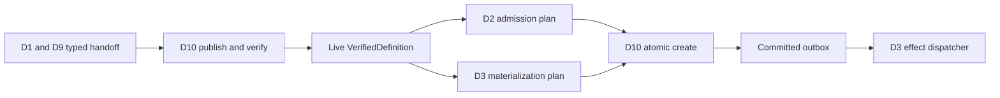

# RFC #547 R11 最终独立复审

> 只读输入：最终版 `28-r11-supply-demand-map.md`、`11-r5-supply-ledger.md`、`24-r9-expected-foundation.md`、十份 `26-r10-*.md` 与 `27-r10-demand-audit.md`。本文直接记录当前结论，不保留旧缺陷或更正段；不查源码/旧 issue，不修改被审计报告，不重拆 issue、不排序实现、不估规模。

## A. 最终结论（≤1页）

**通过。缺陷数：0。R12 Ready。**

最终版R11的四层核算全部闭合：

1. **191/191映射：** 十份R10需求ID与R11逐条映射ID集合完全相等，重复0、遗漏0；每行只有一个主分类和一个owner。分类计数为直接复用9、修补后复用11、过渡兼容10、消费能力自建150、地基仍缺11，合计191。
2. **36 seams一一对应：** C表有36个唯一seam ID，Mermaid也恰有36次seam标注；集合差0、重复标注0。每条表合同在图中出现一次，每条图中跨域authority边都有具名producer artifact、consumer action和typed failure。
3. **完整DAG无环：** D10 publish/verify、live definition、admission/materialization、atomic create、committed outbox均已分相；D6 prompt bytes→D3 spawn、D10 outbox→D3 effect dispatcher、CORE→D8、D8→D1也均入图。解析得到29节点、45边，拓扑消去29节点，cycle 0。
4. **10 capability units自包含：** 每个unit列出完整named seam先决/出口、唯一owned product、独立观察点、dependency/proof和验收闭包；36个seam全部至少被一个unit引用。unit只汇总边界，不创建issue、不规定实现顺序、不估规模。

原子证据、owner和缺口语义也一致：`D4-R05`与`D4-R12`归D4自建；proof-only需求不再进入foundation缺失；typed ChainDefinition provider、tool outcome/finalize runtime、gate evaluator/journal、scripted join consumer、non-degenerate par及冻结SHA proof继续保持dependency/unsupported/unproved，未冒充交付。issue号只作来源，未成为capability、schema、ref、journal、error或store identity。

因此R11已经提供R12所需的完整供需边界；R12可以仅按当前owned product、named seam和独立观察点继续，不需要从旧issue、文件或Gate反推新authority。

## B. 191项全映射复核

### B1. 算法

| 步骤 | 操作 | 结果 |
|---|---|---:|
| R10集合 | 从十报告抽取冻结格式的需求ID并去重 | 191 |
| R11集合 | 从B表抽取首列完整匹配需求ID格式的行 | 191 |
| 集合差 | `R10-R11` / `R11-R10` | 0 / 0 |
| 重复 | 对R11 ID计数大于1 | 0 |
| 主分类 | 每行读取唯一非空主分类 | 191/191 |
| owner | 每行读取唯一非空owner | 191/191 |
| 原子证据 | 核对同ID R10分类、具体R5 A/D/U/T/J事实与R9保证 | 191/191具备 |

### B2. Domain覆盖

| Domain | R10需求 | R11映射 | 结果 |
|---|---:|---:|---|
| D1 | 14 | 14 | 通过 |
| D2 | 20 | 20 | 通过 |
| D3 | 24 | 24 | 通过 |
| D4 | 18 | 18 | 通过 |
| D5 | 20 | 20 | 通过 |
| D6 | 20 | 20 | 通过 |
| D7 | 19 | 19 | 通过 |
| D8 | 16 | 16 | 通过 |
| D9 | 20 | 20 | 通过 |
| D10 | 20 | 20 | 通过 |
| **合计** | **191** | **191** | **通过** |

### B3. 分类与owner抽查

| 检查点 | 最终状态 |
|---|---|
| D1 handoff vs D10 artifact lifecycle | D1只拥有compiled-product handoff validation；D10拥有bundle/publish/resolver/GC |
| D2 serialization vs D6 rendering | D2拥有canonical value text；D6拥有declaration/layout/rendered bytes |
| D4-R05 | D4 ToolRegistry contract自建 |
| D4-R12 | D4 run-requirement instantiation自建 |
| provider→D9→D10 | provider拥有ChainDefinition语义，D9拥有client/pin，D10只消费verified ref |
| proof-only行 | 保持本域主分类，proof为正交标签 |
| external/runtime foundation | 只有唯一producer未交付的原子行进入地基仍缺 |

## C. 36 seams双向核对

### C1. 机械结果

| 检查 | 结果 |
|---|---:|
| C表seam行 | 36 |
| C表unique IDs | 36 |
| DAG seam标注 | 36 |
| DAG unique seam IDs | 36 |
| `C-DAG` | 0 |
| `DAG-C` | 0 |
| DAG重复seam标注 | 0 |

### C2. 关键跨域链

| 链 | Seam覆盖 | 判定 |
|---|---|---|
| compile core→D8 finding→D1 envelope | S-33、S-07 | 输入/输出分域，无ID复用 |
| D1 product/schema/tree/tools/gates | S-01…06 | 五类consumer边明确 |
| provider→D9→D10/D7 | S-08…10、S-34 | publish与create阶段分开 |
| live definition→D2/D3/D4/D5/D6 | S-11…15 | exact definition consumer完整 |
| D2/D3 plans→D10 create | S-16、S-17 | D10只组合，不夺语义owner |
| D2 value/exit/repository→D6/D3/D7 | S-18、S-19、S-25 | consumer action明确 |
| gate/tool/join decisions→D3 | S-20…24 | journals与transition分域 |
| resolver fan-out | S-27…31 | instance consumers均读pinned bundle |
| complete instance→scheduler | S-32 | commit前不可见 |
| D6 bytes→prompt/spawn | S-35 | render failure在首副作用前 |
| committed outbox→effect dispatcher | S-36 | 只dispatch持久row |

每条seam只有一个producer artifact authority与一个consumer action；failure方向不会通过fallback、event、current source或stub绕开。

## D. 完整artifact DAG

### D1. 图形完整性

最终图明确分开：

同时包含compile finding、resolver fan-out、gate/tool/join decision、doc prompt consumer及remote adapter边；没有用一个coarse节点隐藏双向依赖。

### D2. 拓扑核算

| 项 | 结果 |
|---|---:|
| 节点 | 29 |
| 有向边 | 45 |
| 初始入度0队列可启动 | 是 |
| 拓扑消去节点 | 29 |
| 剩余节点 | 0 |
| cycle | 0 |

因此cycle 0来自完整显式边集，而不是遗漏边、复用seam或合并publish/create。

## E. 10 capability units与R12

| 检查 | 结果 |
|---|---|
| unit数量 | 10 |
| 每unit有完整named seam先决/出口 | 通过 |
| 36 seams在unit表的引用覆盖 | 36/36 |
| 每unit唯一owned product | 通过 |
| 每unit独立观察点 | 通过 |
| dependency/proof显式 | 通过 |
| 缺dependency时typed reject/hold/unsupported | 通过 |
| producer可独立验收、跨unit消费另列proof | 通过 |
| 创建/重拆issue | 0 |
| 实现排序 | 0 |
| 规模估算 | 0 |
| issue号作为authority | 0 |

unit验收闭包只引用main已供资产、本unit diff和明确列出的dependency；consumer未同时交付时验typed artifact contract，真实跨unit消费进入已声明integration/frozen-SHA proof，不暗赖未声明future issue。

## F. 缺口与需求权威

| 项 | 当前语义 | 审计 |
|---|---|---|
| independent schema consumer | producer可验；cross-owner proof未完成 | 未冒充交付 |
| typed ChainDefinition provider | provider缺席时reject/hold | owner未被D9/D10吞并 |
| tool outcome/finalize runtime | journal/finalize未交付 | D4 requirement协议与provider分域 |
| gate evaluator/journal | capability absent时new reject/pinned hold | D5不虚构executor |
| scripted join consumer | typed unsupported/hold | D3不自行判join |
| non-degenerate par | `par_runtime_unsupported` | 无串行降级 |
| remote/restart/GC/frozen-SHA | proof未完成 | 不改主分类、不称E2E |

R11没有改变191项需求，没有把proof生产成需求，也没有从capability unit推导issue边界。需求权威仍是R10原子合同与R9地基，R5只提供实然证据。

## G. 最终核算

| 检查 | 结果 |
|---|---:|
| 原子需求 | 191/191 |
| 主分类/owner唯一 | 191/191 |
| named seams一一对应 | 36/36 |
| seam↔DAG差集 | 0 |
| DAG节点/边 | 29/45 |
| DAG cycle | 0 |
| capability units | 10 |
| unit seam覆盖 | 36/36 |
| dependency/proof冒充交付 | 0 |
| 重拆/排序/估规模 | 0 |
| issue号合同化 | 0 |
| 缺陷 | **0** |
| R12 readiness | **Ready** |

## 尾结论

**最终版R11通过独立复审：191/191项具有唯一主分类、owner与原子证据；36个named seams与DAG标注一一对应且完整覆盖跨域authority边；29节点/45边完整artifact DAG拓扑循环0；10个capability unit覆盖36/36 seams，并以owned product、显式dependency/proof和独立观察点形成自包含验收闭包。未发现需求增删、双方吞半个、proof冒充foundation、issue号合同化、重拆、排序或规模估算。缺陷数0，R12 Ready。**
