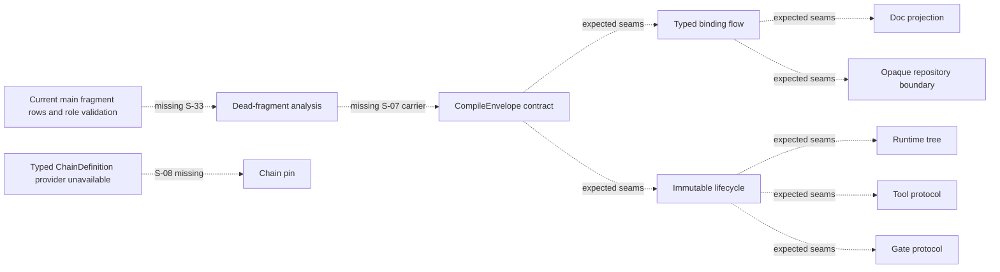

# RFC #547 R12：滚动重拆当前零批次

> 输入：`28-r11-supply-demand-map.md`、`29-r11-map-audit.md`、`31-r12-decomposition-audit.md`、`24-r9-expected-foundation.md`、`AGGREGATE-547.md` 与项目验证边界。  
> 本报告只记录当前 main 的真实 source-readiness；不创建/修改 GitHub issue，不修改代码/WORKFLOW，不实现，不估规模，不展开或排序完整未来树。  
> R11 seam 是 expected contract，只有其 producer artifact 已进入 main 后才能算 R12 当前供给。

## A. 主 agent 摘要（≤1页）

当前正确结论是：

| 核算 | 数量 |
|---|---:|
| R11 capability units | 10 |
| 当前 source-ready | 0 |
| 本批合法 issue 草案 | 0 |
| 延后 not-yet | 10 |

上一版把 expected `S-33` 当成 main 已有 canonical typed fragment graph，又把 expected `S-07` 当成 main 已有 typed finding carrier。真实 main 不具备这两个 artifact：

- 当前 fragment 只有 `id/role/path`，phase 只有 role names；没有 versioned `FragmentIdentity` / typed `FragmentRef` graph，也没有 transitive edge、invalid-kind 或 cycle structure；
- 当前 compile finding/public projection 只有 `verdict/rule/message`；不能承载包含 identity/location/reason/version 的 `S-07` structured finding。

因此 dead-fragment analysis 也不是 source-ready。若现在形成 D8 issue，只能：

1. 把 canonical graph producer 与 D1 finding carrier 一并塞进 D8，破坏唯一 owner；或
2. 删除 transitive/structure-error/typed finding 验收，弱化冻结需求；或
3. 依赖未来 issue 才能通过。

三者都不允许。本轮不保留 dead-fragment issue 草案，也不保留虚构的专用 integration 文件或命令。

**零批次不是 blocked。** R12 的职责是“只拆现场足够清楚的下一批”，不是每轮必须制造 issue。当前 0/10 source-ready 正是滚动 gate 正常工作：expected seam 没有被冒充为 current supply，需求没有为了产出草案而膨胀或弱化。下次只在 main 事实发生变化后重新检查，不预先指定由哪个未来 issue、以什么顺序实现这些地基。

---

## B. 当前 capability DAG 位置



虚线表示 expected dependency 尚未成为 current artifact，不表示实现顺序。图中没有一个 unit 同时满足“全部输入已在 main/显式可用 dependency中”与“本 unit diff 可独立验收”。

## C. 十个 capability unit 全部 not-yet

| Capability unit | 当前缺少的事实 / named seam | 为什么本轮不能写 issue 草案 |
|---|---|---|
| compile contract | 缺真实 `S-07` typed finding carrier/input；public finding仍是`verdict/rule/message` | 若先写草案，完整finding population依赖尚未交付的D8 product；不能把旁路warning或手传finding当同源envelope |
| typed binding flow | 缺 `S-03` D1 typed schema、`S-11` exact live definition、`S-27` pinned resolver projection | main generic JSON/string槽位不能替代source-schema authority；验收会暗赖D1/D10未来能力 |
| runtime tree/transition | 缺 `S-04`、`S-12`、`S-19`、`S-21`、`S-23`、`S-24`、`S-28`、`S-32`、`S-35`、`S-36` | compiled tree、pinned definition、typed exit、gate/tool/join decision、prompt、committed instance/outbox未形成完整输入闭包 |
| tool protocol | 缺 `S-05`、`S-13`、`S-22`、`S-29`；tool outcome/finalize runtime未交付 | 空projection/hook carrier不能冒充ToolRegistry或journal/finalize；required路径无法真实验收 |
| gate protocol | 缺 `S-06`、`S-14`、`S-20`、`S-30`；gate evaluator/journal未交付 | carrier/effective view不能冒充capability、evaluation journal或recovery；草案会依赖外部未交付producer |
| doc projection | 缺 `S-15` pinned doc declaration、`S-18` typed canonical value、`S-31` pinned resolver doc projection | 现有renderer资产不足以证明多类型pinned value→prompt bytes；验收会暗赖D2/D10 |
| opaque/repository boundary | 缺 `S-10` provider-verified baseBranch、`S-25` optional typed repository binding | 直接动public boundary会继续依赖legacy chain/repository authority，不能独立证明单一typed来源 |
| dead-fragment analysis | 缺 current `S-33` versioned canonical typed fragment graph；缺 current `S-07` D1 typed finding carrier | 当前grammar/model没有transitive/invalid-kind/cycle ref graph，public finding也不能承载identity/location/reason；D8单owner无法自包含 |
| chain pin/no-fallback | 缺 `S-08` typed ChainDefinition provider | 本仓不得复制provider parser/version/error，也不得以chain/default/current fallback替代；没有合法独立验收入口 |
| immutable lifecycle | 缺 `S-01` compiled handoff、`S-09`/`S-34` verified chain refs、`S-16` admitted bindings、`S-17` runtime materialization | D10只能组合typed产物，不能在草案内吞掉D1/D2/D3/D9语义来制造source-ready |

## D. Dead-fragment 的事实修正

### D1. `S-33` 仍是 expected seam

Expected contract：

```text
VersionedCanonicalFragmentGraph -> D8 ReachabilityAnalysis
```

Current main只提供fragment rows与phase role validation。它不能证明：

- definition-scoped `FragmentIdentity`；
- typed consumer refs与ref kind；
- fragment到fragment的传递边；
- dangling、invalid-kind与cycle结构；
- rule/schema version参与compile identity。

所以“canonical compiler骨架存在”只能证明可改造素材，不能证明 `S-33` producer已交付。

### D2. `S-07` 仍是 expected seam

Expected contract：

```text
D8 StructuredDeadFragmentFinding -> D1 CompileEnvelope
```

Current main finding/public projection只能表达`verdict/rule/message`。它不能无损承载：

- stable finding identity；
- fragment identity；
- source location；
- `NoConsumerPath` reason；
- finding/schema version。

若没有D1 typed carrier，真实CLI无法观察 `S-07`；手传product、旁路文件或只测pure boolean都不算 seam 完成。

### D3. 删除上一版虚构验收

本报告不提出任何dead-fragment专用integration文件或命令。未来只有在 `S-33` 与 `S-07` current facts已经进入main、并形成合法草案后，才根据当时项目真实test runner合同写验证命令。现在不预建文件、不猜命令、不用测试设计倒逼范围扩张。

## E. 下次滚动检查的事实 gate

下次R12只重新读取current main；以下 gate 是事实判据，不是实现任务、顺序或issue拆分：

| Gate | 必须在 main 观察到的事实 | 观察不到时 |
|---|---|---|
| G-01 S-33 producer | versioned canonical typed fragment graph artifact，含合法roots/refs/kinds与确定identity | dead-fragment保持not-yet |
| G-02 S-07 carrier | D1 CompileEnvelope/public boundary可无损承载typed finding identity/location/reason/version | dead-fragment与compile contract保持not-yet |
| G-03 rule identity | reachability rule/schema version进入compile identity/cache invalidation contract | 不允许以旧cache/no-warning验收 |
| G-04 source-ready闭包 | 某unit全部named seam输入已由main或已交付具名dependency提供 | 该unit不得写草案 |
| G-05 independent acceptance | 本unit owned product能由main资产+本unit diff直接观察，不需未来unit | 该unit不得写草案 |
| G-06 dependency honesty | 缺能力时存在冻结的typed reject/hold/unsupported边界 | 不得用stub/fallback冒充交付 |
| G-07 command reality | 验证命令、runner、fixture与日志合同在当时项目中真实存在或明确属于该unit diff | 不得写虚构命令 |
| G-08 scope stability | 草案无需吞入其他domain owner、弱化冻结需求或新增兼容机制 | 否则保持not-yet |

某个unit通过全部gate时，只把当时 source-ready 的最小集合带入下一轮；不因本报告提前承诺顺序或完整未来树。

## F. 本轮副作用与边界

| 检查 | 结果 |
|---|---:|
| GitHub issue创建/修改 | 0 |
| issue草案 | 0 |
| 代码实现/修改 | 0 |
| WORKFLOW修改 | 0 |
| worktree创建 | 0 |
| integration文件/命令虚构 | 0 |
| 需求弱化/扩张 | 0 |
| 完整未来树/实现排序/规模估算 | 0 |
| issue号作为合同identity | 0 |

因为本批没有合法issue草案，本报告不写issue body、验证命令或real-E2E归属句；这些只属于未来通过事实gate后形成的具体草案。当前也不以“缺草案”为由创建占位issue。

## G. 覆盖核算

| 检查 | 结果 |
|---|---:|
| capability unit覆盖 | 10/10 |
| source-ready | 0 |
| 本批 | 0 |
| 延后 not-yet | 10 |
| dead-fragment状态 | not-yet |
| 当前缺少的关键seam事实 | S-33 producer、S-07 carrier |
| blocked状态 | 否 |

## H. 尾部结论

**R12滚动重拆当前真实结论：本批0、延后10，没有合法issue草案。dead-fragment analysis并非source-ready：main尚无S-33要求的versioned canonical typed fragment graph，也无S-07要求的D1 typed finding carrier；R11 expected seam不能升级为current供给。为强行产出草案而让D8吞并graph producer/D1 carrier、弱化transitive与typed finding验收、或依赖未来issue都不允许。其余9个unit同样缺少明确named seam或具名foundation。零批次不是blocked，而是R12“只拆现场足够清楚的下一批”在当前事实下的正确结果；下次仅在main事实变化并通过G-01…G-08后滚动重检。本报告未创建/修改GitHub issue，未改代码/WORKFLOW，未生成虚构integration命令，也未展开实现顺序或完整未来树。**
