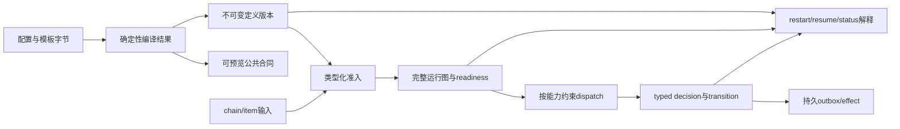
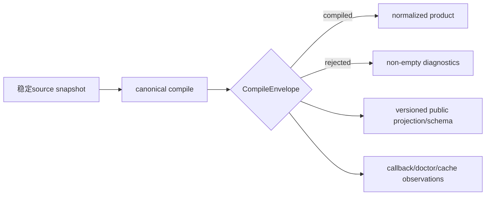
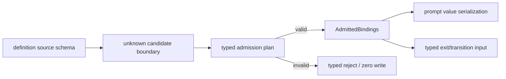
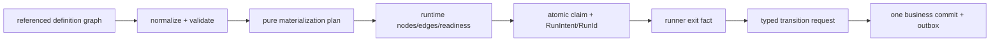
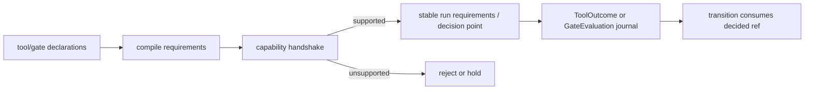
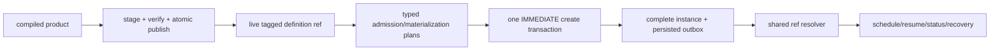
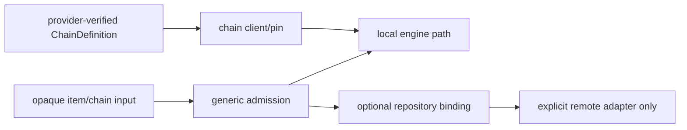

# RFC #547 写作素材：从定义字符串到可恢复执行的系统能力

> 只读依据：`AGGREGATE-547.md`、`24-r9-expected-foundation.md`、`28-r11-supply-demand-map.md`、`SYNTH-547-type-system-compile.md`。本文为新文档提供概念与因果素材，不复刻旧章节结构，不把expected合同写成current实现，也不以历史issue编号定义能力。

## A. 一页概念模型

这个RFC最终不是要“给preset多加一些字段”，而是要把一份运行前到来的字符串定义变成一个**可以被检查、固定、实例化、执行、恢复和解释的版本化程序**。系统的可观察变化可以用一条生产链概括：

这条链解决的是当前系统中的同一类根因：**不同时间、不同入口和不同consumer可以重新解释同一份可变配置，于是“检查过的定义”“实际执行的定义”“恢复后看到的定义”不是同一个事实。** 类型丢失、current-source重载、fixture-only runtime tree、空tool projection、hook carrier无executor、repository/default preset fallback，看起来是不同缺陷，实质都是某个生产阶段没有唯一typed产物，后续只好猜测、重读或依赖惯例。

RFC完成后，操作者应能观察到八组能力：

1. 一次编译产生完整且可供人和机器预览的结果；
2. 输入值在创建前按来源schema准入，进入runner后不再退化成字符串猜测；
3. 任意声明式任务结构被完整实例化，只有typed transition能推进业务；
4. 工具与gate声明只有在真实runtime capability存在时才能影响调度；
5. 每个实例固定完整不可变定义，restart/resume不随current source漂移；
6. prompt文档由类型值和显式render声明确定，字节可复现；
7. 引擎不再内置GitHub、default preset、repository selector或plan控制面；
8. 旧数据、损坏artifact和外部能力缺失都以可解释hold/unsupported呈现，而不是静默fallback。

这些能力必须共同存在。只有compile而没有pin，restart仍会漂移；只有typed binding而没有原子create，DB仍会出现半实例；只有gate declaration而没有journal，调度仍可能静默跳过；只有opaque item id而保留repository/default fallback，引擎仍有隐藏原语。RFC的系统性价值来自各阶段共享identity、typed seam和事务边界，而不是任何单项语法功能。

## B. 八项可观察能力与具体因果

### B1. “配置是否成立”只有一个答案

**用户能观察什么：** 对同一source bytes和contract version，CLI、callback、doctor、cache以及未来GUI/第三方consumer得到同一compiled/rejected结论、同一finding identity和同一公共投影。失败是结构化diagnostic，而不是某个入口抛字符串、另一个入口仍显示成功。

**生产链改变：**

当前链中已经有canonical compiler、source hash、compiled/rejected骨架和公共projection槽位；但warnings与model可以拆开，daemon callback可另投影，doctor不沿同一结果，cache又以path而非完整content contract为key。结果是同一次定义可能在不同读面产生不同finding集合。

RFC目标不是再做一个checker，而是让`CompileEnvelope`成为唯一finding authority，并让schema、envelope、compiled product和definition ref保持不同typed identity。这样，定义错误只在compile阶段决定一次；下游只能投影或引用，不能重算第二份真相。

**外部依赖与证明：** 独立schema consumer仍未交付，因此本仓可以证明schema生成、round-trip和unknown-version拒绝，却不能声称cross-owner consumer已经兼容。GUI预览是公共投影的潜在consumer，不是本RFC内已经完成的运行路径。

### B2. “这个输入值能否运行”在最早有足够信息时决定

**用户能观察什么：** number、boolean、null、array、record和union不会先被`String(...)`压平；missing、显式null和default有不同结果；缺required值或类型错误使create/update整批零写。runner提交的`exit.*`也按pinned schema校验，不能覆盖item/chain/runtime authority。

**生产链改变：**

当前可保留资产包括source tagged union、unknown-first边界、JSON-safe persistence和batch事务框架；失败根因是source schema没有成为唯一类型authority，item/chain/runtime值在不同入口被重新解释，missing常被填成空串，结构值到render时才爆炸。

目标能力把验证时点分清：定义本身能决定的schema/default兼容在compile处理；具体chain/item值在create/update admission处理；真正运行时才产生的exit或runtime事实在对应boundary处理。每种约束只有一个判定点，后续持有的是refined value及其owner/source/ref/provenance，而不是raw map。

**与其他能力的关系：** admission必须读取exact live definition，并把完整plan交给原子create；prompt renderer只消费admitted value；transition只消费validated exit。缺少不可变definition时，typed value仍会在restart后换schema；缺少transition authority时，typed exit也可能被普通run close绕过。

**证明缺口：** 多类型create→render→agent exit→transition的真实整链尚未运行。generic JSON round-trip只能证明存得下，不能证明source-schema authority成立。

### B3. “任务定义能表达什么”与“调度器实际推进什么”形成一条identity链

**用户能观察什么：** 定义可以描述referenced seq/par/join结构；duplicate、dangling和cycle在compile时拒绝；create后status能看到完整runtime graph与稳定node identity；scheduler只领取`ready`节点；agent退出本身不推进业务，只有授权、幂等的typed transition commit才改变readiness/cursor/status。

**生产链改变：**

当前系统已有runtime leaf/seq/par/join ADT、SQLite FK/unique/check、closure/worktree资产和部分run-start事务；但production scheduler仍按线性phase/status推进，recursive tree主要由fixture直接构造，正常完成不沿统一runtime transition更新。

RFC目标把definition node、runtime node、run intent和transition identity分域并单向关联。linear phase数组只是一种输入sugar，进入运行链前必须normalize成同一canonical graph。create必须一次物化整棵树，不能等first spawn再补node或definition ref。claim、hold、capacity release、transition和effect/outbox各自有清晰原子边界。

**外部依赖：** non-degenerate par runtime尚未交付时必须在首个资源副作用前返回`par_runtime_unsupported`并hold，不能顺序执行冒充par。scripted join decision也仍是外部consumer seam；D3只能消费decided ref，不能自行实现另一套join判定。

**证明缺口：** referenced-node parser→constructor→scheduler→join/recovery的production路径未闭合；现有nested tree/join绿色测试主要证明fixture/SQL shape，不证明真实调度。

### B4. “声明了工具或gate”不再等于“系统假装会执行”

**用户能观察什么：** compile、doctor和prompt看到同一definition-scoped tool registry；required只对有确定outcome的工具合法。gate声明能指明稳定point/host，但如果真实evaluator/journal capability未注册，新实例在create前拒绝，已有实例hold；optional gate只在named binding缺失时skip，不能因为executor不存在而静默放行。

**生产链改变：**

当前有public boundary槽位、hook declaration carrier、分层binding/effective view和通用事务基建；缺的是registry、runtime outcome journal、gate host identity、executor、decision journal、consume与recovery。空tools数组或持久化hook配置只证明carrier存在，不能证明任何约束被执行。

目标能力把四类概念拆开：availability回答能否提供，invocation记录调用事实，outcome回答确定条件是否达成，requiredness决定未达成的业务后果。类似地，GateDefinition描述需求，runtime capability广告协议，GateEvaluation journal拥有decision，D3 transition只消费结果。这样不会用event/context伪造ToolOutcome，也不会让hook carrier冒充gate executor。

**外部依赖：** tool outcome/finalize runtime与gate evaluator/journal均未交付；当前正确行为是required路径unsupported/new reject或existing hold。scripted join consumer同样不能由gate或runtime tree顺便代替。

**证明缺口：** 真实entry/outcome/finalize/restart，以及gate hold→advance/onFailure/dedupe路径都未运行。

### B5. “创建时使用的定义”在整个实例生命期保持不变

**用户能观察什么：** H1定义创建的实例在source编辑成H2、daemon restart或session resume后仍执行H1；新实例才使用H2。缺文件、篡改asset、unknown schema或retiring artifact使实例显示typed hold及所需ref，不会重编current source“修好”。scheduler永远看不到只有row没有tree、或只有ref没有content的半实例。

**生产链改变：**

当前资产包括真实source hash、tagged ref/FK、WAL/IMMEDIATE与migration框架；但definition table只有identity壳，chain/item create不pin完整content，first spawn才懒建部分runtime attribution，restart/resume重读current path。path Promise cache使同进程偶然稳定，反而掩盖重启漂移。

目标能力要求完整pre-run bundle先在同filesystem staging中构造、重读校验digest/identity、fsync并atomic publish。随后create在一个事务中写owner row、definition refs、admitted bindings、完整runtime nodes/edges/readiness和outbox。artifact-first/DB-ref-second的次序使崩溃最多留下可GC的无引用完整artifact，不会留下committed dangling instance。

所有instance consumer只能走shared resolver；current compile与instance resolve是两个时间面。cache只按完整tagged ref缓存verified bundle，不是authority。GC按chain/item/node/run/history的ref可达性决定retention，并与publish/create协调。

**历史边界：** 真实v14的15 chains、69 items、932 runs全部没有可证明历史definition。它们必须保持`legacy-definition-unproven`：list/status/audit可读，resume/schedule/mutation拒绝。current preset、repository、event、marker、status或残留目录都不能合成历史ref。

**证明缺口：** H1/H2 restart/resume、publish崩溃矩阵、create/GC竞争、cache restart、corrupt repair与ref-aware cleanup尚未完成integration。

### B6. “同一类型值如何进入prompt”由声明决定，而不是由名字或内容猜测

**用户能观察什么：** 相同definition ref、phase、binding和typed value在create/resume/restart生成逐字节相同的runtime inputs doc；scalar有canonical文本，structured value默认单行canonical JSON；block/fenced只有显式声明才出现。换变量名、placeholder位置或JSON大小不会偷偷改变布局。

**生产链改变：** admitted typed value先由D2产生canonical value text，再由D6用versioned `DocRenderDeclaration`组合label/prefix/suffix/style/blankBefore，最后只有一个runtime doc consumer把bytes交给prompt/spawn。类型错误应在admission消失；unknown render version、corrupt declaration或unsupported style在首资源副作用前hold。

当前production renderer和prefix迁移可复用，失败根因是outer binding boundary仍宽、部分路径手写binding、结构值晚失败，并且历史上存在按业务变量名分支的渲染特判。目标不是把format逻辑移到ValueType里，而是维持两个owner：D2决定value serialization，D6决定doc layout。

**证明缺口：** 多类型真实prompt/runner路径和resume同ref字节一致性未运行。独立schema consumer缺席也意味着外部系统尚未证明能解释render declaration。

### B7. “通用引擎”不再通过隐藏原语决定业务

**用户能观察什么：** item/chain identity是opaque string；CLI/wire不解析GitHub issue记法；repository只是optional typed business binding，仅remote operation按需读取；local worktree/reconcile只用chain/item/baseBranch等本地资源事实。新item显式pin自己的preset definition，empty chain不借代表preset，mixed chain逐item解析。plan/jump不再是执行控制面，无consumer fragment得到compile finding。

**生产链改变：**

当前opaque storage/wire主体、per-item preset互斥、baseBranch消费、closure资源和plan主体退役均可保留；但repository物理列/forge admission、`--issue`记法、git inference、legacy preset fallback和current/default重绑仍会形成双authority。dead-fragment checker又尚不存在，因此“plan删除了”并不等于所有游离definition content都有真实consumer。

目标能力以一个breaking checkpoint清除engine-owned alias，同时保留合法preset业务字段。repository搬到generic binding不赋予它selector意义；baseBranch仍属于外部typed ChainDefinition provider的定义。ChainDefinition ADT/parser/version/error由provider唯一拥有，本仓只有client、pin和no-fallback消费合同。

**外部依赖：** typed ChainDefinition provider尚未交付；本仓不得为了推进而复制parser或用flat metadata/default preset补位。remote adapter真实消费也仍是proof gap。

**证明缺口：** typed/API/public producer/historical allowlist清零、empty/mixed/restart、remote repository present/missing路径以及bundled/external fragment人口尚未在冻结SHA验证。

### B8. “失败后系统处于什么状态”成为公开能力

**用户能观察什么：** compile reject、admission reject、unsupported capability、held instance、unknown effect、legacy-unproven和corrupt definition是不同typed状态。status/events只投影各自authority；restart读取persisted journal/readiness/ref继续处理，而不是根据event文字或current source猜测。

当前系统已有事务、outbox基架、status/recovery identity和若干SQL约束，但多个业务动作跨事务，event容易被当作事实，缺能力时也可能只有普通load/spawn错误。RFC目标把失败语义与恢复动作配对：

| 失败发生点 | 稳定结果 | 禁止恢复方式 |
|---|---|---|
| source/compile | rejected envelope + diagnostics | 产生live definition或空warning成功 |
| create admission | zero business rows | 先写row后补binding/tree |
| capability handshake | new reject / pinned hold | optional inert、stub success |
| pre-spawn gate | claimed→held、释放capacity | 建worktree/process后再报错 |
| transition/effect | committed journal/outbox或unknown hold | 从event推断已完成、重复外部副作用 |
| definition resolve | typed hold + exact ref | compile current、换ref、兼容bundle |
| legacy migration | read-only/history preserved | 用current locator伪造historical identity |

这使“失败”不只是错误消息，而是调度器、operator和恢复逻辑都能共同理解的状态机分支。

## C. 能力如何共同形成一个系统

### C1. 三个时间层，各有唯一判定

| 时间层 | 只能决定什么 | 主要产物 | 不得提前/推迟的事实 |
|---|---|---|---|
| 定义编译期 | 结构、引用、schema、静态compat、声明要求 | CompileEnvelope、normalized products、tagged identities | 不臆造具体item值或runtime outcome；不把结构错误拖到spawn |
| 实例创建期 | exact definition下的chain/item值、完整runtime materialization、capability准入 | admitted bindings、complete instance、outbox rows | 不创建半实例；不把missing/default留给renderer |
| 运行/恢复期 | tool/gate/join decision、agent exit、effect delivery、restart reconciliation | domain journals、typed transition、effect ledger | 不重解释definition；不把event/message当authority |

所谓“全链路类型化”不是消灭运行期检查，而是把每种检查放在最早拥有足够信息的层，并禁止其他层再次解释同一约束。

### C2. 五种共享粘合剂

1. **Tagged identity：** envelope、schema、preset definition、chain definition、node、run intent、transition、outcome与evaluation各自分域；identity使跨阶段关联不靠路径或名字。
2. **Immutable artifact：** 定义字节和normalized model在实例创建前固定，使恢复读到的语义等于创建时语义。
3. **Pure plans + one commit：** D2 admission、D3 materialization、D9 verified refs都先产typed plan，由D10一次写入；跨domain共享事务但不共享语义owner。
4. **Domain journals：** Transition、ToolOutcome、GateEvaluation、Effect与Outbox各有authority；消费可以同事务，身份不能合并。
5. **Typed unsupported/hold：** 外部能力未交付时系统仍有确定行为，不用fallback掩盖dependency gap。

### C3. 不能拆开的因果组合

| 如果只实现 | 仍会发生什么 | 必须共同具备 |
|---|---|---|
| 公共compile JSON | restart仍重读H2，preview与execution分裂 | immutable definition + shared resolver |
| ValueType/admission | create若分事务仍可能有row无binding/tree | atomic create composition |
| recursive definition ADT | scheduler仍按旧phase数组推进 | production constructor + readiness + typed transition |
| tool/gate声明 | runtime可静默忽略或伪造成功 | capability handshake + domain journal + transition consume |
| deterministic renderer | 输入若仍是raw/string，布局稳定但语义错误 | admitted typed value + pinned doc declaration |
| de-GitHub CLI rename | repository/default/current fallback仍保留业务原语 | binding migration + provider pin + no-fallback |
| definition ref | 只有identity壳仍无法恢复content | complete bundle + integrity + retention/GC |
| unit/fixture绿测 | 可能只证明synthetic refs与old contract | 冻结SHA integration/real consumer proof |

## D. 当前资产、RFC目标、外部依赖、证明缺口

### D1. 当前已实现且可复用的资产

- canonical compiler/result/projection骨架、source hash和部分typed boundary；
- binding source union、unknown-first解析、JSON-safe storage与batch/IMMEDIATE事务框架；
- runtime seq/par/join ADT、SQLite identity/FK/约束、closure/worktree资源机制；
- doc renderer、声明product与prefix迁移；
- hook/gate carrier、分层binding/effective view与写授权；
- tagged definition ref壳、run→node attribution、opaque item/wire主体、per-item preset选择资产；
- plan主体退役、baseBranch真实消费、migration与outbox substrate。

这些资产是“可以接着修”的事实，不等于目标production chain已闭合。特别是shape、FK、carrier、marker、hash和generic JSON均不能单独升级为语义完成。

### D2. RFC必须新增或贯通的目标能力

- 完整CompileEnvelope/finding/schema family及所有current consumer同源；
- typed admission、binding identity/state、canonical value serialization与typed exit；
- referenced definition graph、full constructor、readiness scheduler、transition/effect recovery；
- ToolRegistry/requirements与gate declaration/handshake consumer合同；
- versioned doc declaration及单一runtime renderer入口；
- opaque/de-GitHub breaking checkpoint、repository binding migration、fallback退役；
- dead-fragment reachability finding；
- provider client/item pin/no-rebind；
- complete immutable bundle、atomic publish/create、resolver/cache/GC与legacy hold。

### D3. 外部或独立owner依赖

| 依赖 | 本RFC消费什么 | 缺失时的正确行为 |
|---|---|---|
| independent schema consumer | public schema/version round-trip证明 | producer可交付；cross-owner proof未完成 |
| typed ChainDefinition provider | verified ChainDefinitionRef/projection/error | new reject、pinned hold；不复制parser |
| tool outcome/finalize runtime | capability、evaluation/verdict journal | required unsupported/hold；expected不伪造achieved |
| gate evaluator/journal | capability与GateEvaluation decision/ref | declaration new reject、pinned hold |
| scripted join consumer | typed join decision/ref | typed unsupported/hold |
| non-degenerate par runtime | 真并行调度与join/recovery | `par_runtime_unsupported`，不顺序降级 |
| remote adapter | repository binding真实消费 | 只阻断remote operation；local路径不受影响 |

### D4. 仍需真实证明的路径

- 独立consumer只依赖public schema并拒绝unknown version；
- 多类型create→render→runner→typed exit→transition；
- recursive/non-degenerate tree的constructor、schedule、join与restart；
- tool/gate真实journal、finalize、hold/re-evaluate与dedupe；
- remote repository present/missing及local零repository读取；
- dead-fragment bundled/external人口与所有读面同源；
- provider→empty/mixed chain→restart no-fallback；
- H1/H2 publish/create/restart/GC/corruption recovery；
- 冻结发布候选SHA的integration与现有preset compatibility real E2E。

文档、unit shape、synthetic fixture、旧绿测或“当前没有warning”都不能替代这些证明。

## E. 可用于新文档的叙事主线

### E1. 从“动态DSL”而不是“静态TS类型”出发

preset在引擎编译完成后才出现，所以目标不是把每个status变成引擎源码里的字面量union，而是在装载期把动态文本编译成运行时可信ADT。公共schema让GUI和第三方能理解它，pinned artifact让执行与恢复能持续相信它。

### E2. 从一次具体故障贯穿全篇

可以用“H1创建、source改成H2、daemon restart”作为主例：

1. current compiler正确显示H2；
2. H1实例必须仍resolve H1；
3. H1 bindings继续按H1 schema解释；
4. H1 tree、tool/gate requirements和doc layout不变；
5. resume prompt逐字节按H1重建；
6. H1 artifact损坏则hold，不重编H2；
7. GC只在所有H1 ref不可达后回收。

这个例子自然串起compile、identity、binding、runtime、capability、render和recovery，比按模块罗列更能说明RFC为何是一个系统。

### E3. 用“失败被前移且具名化”解释类型系统价值

另一个叙事轴是失败发生位置的变化：过去missing变空串、结构值到render才失败、gate到schedule才发现无executor、recursive tree被线性调度、definition丢失后重读current；未来它们分别在admission、pre-spawn handshake、compile/runtime capability guard和resolver处形成typed reject/hold。类型系统的用户价值是更早、更稳定、更可恢复，而不是类型名本身。

### E4. 以可观察结果收尾

最终验收不应只列内部类型：应展示同一source在CLI/doctor/consumer中的一致finding、错误输入零写、完整tree的status/readiness、缺capability的hold、H1/H2 restart不漂移、prompt字节稳定、remote缺repository只阻断remote操作、legacy历史可读但不可resume，以及所有外部effect只从committed outbox恢复。

## 尾结论

**RFC #547最终要交付的是一条从动态配置到可恢复执行的typed production pipeline：定义只编译一次，输入只准入一次，实例完整且不可变，调度只读readiness，业务只由typed transition推进，工具/gate只消费真实journal，prompt只由admitted value与声明生成，恢复只读持久ref/state/outbox，引擎不再以GitHub、repository、default preset或plan原语猜业务。当前已有compiler、hash、ADT、SQL、renderer、carrier、transaction与opaque identity等骨架；RFC目标是补齐并贯通它们。typed ChainDefinition、tool/gate/join/par/remote等外部能力与冻结SHA真实链仍是dependency或proof gap，缺失时必须reject/hold/unsupported，不能被文档、fixture、fallback或旧绿测冒充交付。**
