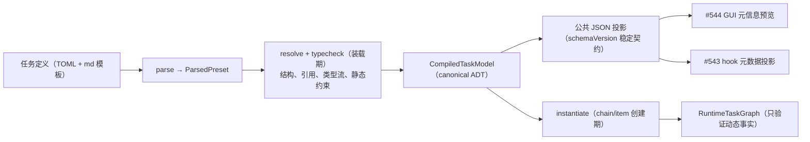

# SYNTH-#547 v3 类型系统：装载期编译与稳定编译产物

> 本文档是**本地合成**，未写回 GitHub。依据 RFC #547 与其全部 sub-issue 合并而成。
> 来源：`v3-issue/issues/<N>/`（issue.json + comments.json + timeline.json + subissues.json）+ `v3-issue/design/`。

## 范围与组成

- **源 RFC**：#547 — RFC: v3 类型系统——装载期编译、可计算元信息与零原语任务定义
- **子 issue 总数**：21（OPEN 11 / CLOSED·COMPLETED 1 / CLOSED·NOT_PLANNED 9）
- **本合成 issue 编号**：`SYNTH-#547`（仅本地标识）

---

## 一、RFC 设计骨架（#547 原文）

## 摘要

v3 类型系统定为**分阶段编译与验证**：任务定义（TOML 载体演进，不换代码载体）装载一次产出 canonical `CompiledTaskModel`（内存 ADT）及其版本化公共 JSON 投影（`coder-loop preset compile --json`）。凡只依赖定义即可决定的性质在装载期完成；依赖 chain/item 输入的性质在实例创建期完成；依赖工具调用、hook/gate 结果等运行事实的性质保留运行期验证。变量类型权威归来源 schema，binding 只声明来源引用、缺失策略与显式文本投影；新增 `[[tools]]` 注册表与 per-phase 工具调用约束，但将工具来源、输出条件与执法等级正交建模。任务树节点具有跨 compile/SQLite/status 稳定关联的 identity。引擎零原语残留六处全部退役；plan 面从 preset 退役并新增 dead-fragment 编译检查。本 RFC 是 #453 类型权威线在 v3 的直接后继，承接 #546 登记的八项 DSL 表达力需求。

## 操作员输入（verbatim）

目标源（操作员，2026-07-02，`v3/v3-goals.md` 目标 3 与目标 4）：

> "因为全链路类型化，所以状态机的判定来源是可计算类型，所以不需要运行时验证，元信息本身是可计算的。我认为这部分需要 GUI 可预览。"

> "因为类型可计算，所以只需要定义字符串就可以做复杂任务。现在只是 iter+review 循环，我的目的是想要不预先定义任何原语，仅凭 meta 就能做到。……然后可选的 prompt 要求必须调用某种特殊定义的 CLI 工具用于 context 共享，这样独立运行的无状态 agent 也有一定程度上的 context 传递能力。"

类型化路线的第一性表述（操作员，2026-06-12，#453 body）：

> "正常来说这个软件就如同readme一样所说，是个字符串构造器加状态机，而外部的所谓的preset文件本质上是另一种dsl，而dsl可以类型化……因为有了类型，所以内存内的原本是无类型的数据变成了有类型，所以纯动态后天添加的preset想怎么设计流程就怎么设计流程"

## 定位事实

引擎是通用解释器，preset 在引擎 TS 编译**之后**到来——「状态字面量静态可枚举」不可能落在引擎自身的 TS 字面量联合里（那要求 preset 与引擎一起编译，与上引「纯动态后天添加」矛盾），落点是**任务定义装载期**。但「不需要运行时验证」不能解释为运行期零验证：外部工具是否真正调用、动态 context 是否出现、hook/gate 判定等事实只有执行时才存在。v3 的准确性质是：**每项约束在最早可决定的阶段验证，且同一约束只有一个权威判定点**。现状已是半个编译器：`loadPreset`（arktype 边界 parse + 约 15 条局部校验，`docs/preset-authoring.md` §3）→ 跨表 DAG 校验（`src/preset-dag-check.ts`，#408）→ typed `Preset` ADT，且 #454 后 daemon 校验、scheduler 调度、渲染、CLI 查询已唯一消费该产物（#453 T2）。缺口：产物不可导出；检查不完备；变量来源虽是 ADT，目标端仍一律坍缩为 `String(...)`；渲染失败语义三套不一致；doc 渲染存在按变量名分支的特判；plan fragments 游离于状态机之外。

## 裁决记录（操作员，2026-07-02，RFC-2 设计会话）

| # | 决策点 | 裁决 | 理由要点 |
|---|---|---|---|
| A | 编译产物形态 | 装载即编译：canonical `CompiledTaskModel`（内存 ADT）+ `coder-loop preset compile <name\|path> --json` 版本化公共投影（带 `schemaVersion`），按需计算不落缓存 | 单一事实源是定义文件本身；公共 DTO 与内存模型同源但不强求同 shape，必须由唯一投影函数与 boundary round-trip 守护 |
| B | DSL 载体 | TOML 演进，否决代码载体（preset.ts） | 纯 meta 声明与零原语哲学一致；代码载体需求值任意代码、GUI 不可逆向生成；编辑器校验由边界 schema 导出 JSON Schema 补 |
| C | 类型声明表达力 | 类型权威归 source schema；公开 DSL 使用可序列化、递归、封闭的 `ValueType` ADT，四型是基线 variant，结构化 JSON 由 array/record/union 等 schema variant 精化；arktype 仅作实现层 boundary parser，不作为公共类型语言 | 同一 source 不得在不同 phase 被重新解释成冲突类型；GUI、hook、第三方消费者无需实现 arktype 表达式语言 |
| D | 缺失语义与验证阶段 | binding 显式声明 `required`（默认）或 typed `default`；杀 `item.*` 静默 `""`。定义可决定的 default/type compatibility 在装载期验证；chain/item 值完备性在对应实例创建期验证；动态 runtime 值在执行边界验证 | 「不需要运行时验证」改写为「最早可决定阶段验证」；不把尚不存在的运行事实伪装成定义事实 |
| E | businessKeys | 不加 `computed` variant | 派生需求由模板侧相邻占位符组合覆盖；单 variant ADT 已留扩展位，YAGNI |
| F | doc 渲染特判 | 非法化引擎按变量名分支；doc 渲染完全声明驱动（现有 `label/suffix/style/blankBefore` 扩 `prefix`） | #539 一类问题根除于机制而非逐个修 |
| G | 工具约束 | `[[tools]]` 注册表 + per-phase `toolRequirements`；工具 `provider`（engine/external）、`availability`、`outcome` 与 `enforcement`（required/expected）正交建模。`outcome` = 工具的确定性输出条件：合规使用必然使其成立（达成确定）、run 收尾点可计算（判定确定）、不经该工具不可成立（达成唯一）。`required` 合法性的判据是工具定义了 outcome，不是 provider 必须为 engine；无 outcome 的工具至多 `expected`。outcome 为工具固有——一个 capability 携带唯一输出条件，`toolRequirements` 只选档位 | 执法对象是确定性输出条件而非调用动作，不存在「合规但不可观测」类别；不把当前观测能力冻结成长期类型语义；一张表服务 doctor、约束执法、prompt 文档注入三个消费端 |
| H | 零原语清理 | 六残留全部退役（下节清单）；引擎不得以任何 preset 名兜底 | #453 T1/T4 红线补全 |
| I | plan 面 | 从 preset 退役；planning 定性为 operator 侧活动（skill 空间 + 队列 CLI + RFC-6 调用面），不属于任务定义 DSL；新增 dead-fragment 编译检查（warn）；不加 fragment 跳转边声明位 | 调查证据见下节；跳转链唯一样本随 plan 退役消失 |

## 核心设计

### 编译管线

公共 JSON 投影六块：`preset` 元信息（name/dir/源 hash）；`statuses` + `stateGraph`；`phases` + 任务树结构；`tools`；`fragments`；`findings`。编译接口返回 typed `CompileResult = compiled(model, warnings) | rejected(non-empty diagnostics)`；CLI/GUI/doctor/第三方不得解析 exception 文本。JSON 是 canonical model 的稳定投影，不是第二套模型。

任务树的每个可引用节点必须有稳定显式 identity。compile 输出、SQLite 运行态、status/events/hook 投影使用同一 identity 链关联；结构路径只用于展示，不得代替身份。

### DSL 演进面（承接 #546 八项表达力需求，全部接受）

1. **phase 任务树声明**：`[[phases]]` 线性数组演进为可声明递归 seq/par 结构；每个可引用节点有稳定显式 id；join 策略字段为封闭 ADT。#739 基础阶段只落 `drain | validator`；本轮 v3 的 #714 在语义、持久化、观测投影和所有消费点齐备时一次加入 `script`，v3 关闭终态为 `drain | validator | script`；`best-of-n` 仍是未来演进方向。
2. **validator 的 item 调用声明**：preset 引用 + 变量绑定，复用三前缀绑定 DSL。
3. **reopen target 静态可检引用**：`self | 同 seq 更早兄弟`，装载期校验。
4. **per-par 并发上限与 reopen 预算声明位**：参数归元数据、机制归引擎（#396 契约）。
5. **装载期检查清单**：树 well-formedness、reopen target 合法性、join 声明完备性、静态 `dependsOn` 查环——并入编译管线，与 #408 既有两规则同层。
6. **编译产物含任务树结构**（供 #544 渲染）。
7. **具名 gate 点声明位**（#543 需求）：preset 声明「此处需要一道命名 gate」（名字 + required/optional 标志），脚本绑定归全局/chain 层。声明只有在运行时 capability 能识别并执行时才可进入可调度模型；不得出现 compile 接受 required gate、scheduler 静默忽略的中间状态。
8. **具名 join 候选声明位**（#546 / `v3/join-evolution-decision.md` 需求）：preset 声明具名 validator 调用候选，编译产物携带稳定 candidate id；#702 物化诞生与 #703 演化通道只能引用 enclosing 实例 pinned 定义内的 `(definitionRef, candidateId)`；`definitionRef` 为 #743 的 tagged `ExecutionDefinitionRef = preset | chain`，运行时不得自由构造调用声明。候选完备性与悬空引用在装载期拒绝。

### 类型化转移路径与 prompt 输入

编译模型必须把状态图边从裸 `status + when` 提升为可计算的 transition path。每条路径的公共投影至少包含：稳定 path identity、目标 step/preset invocation、可选 prompt template identity/hash、完整输入 bindings、由 agent 提供的 `exit.*` 子 schema，以及每个 binding 的 source/type/required/default/projection。

binding source union 新增 `exit.*`：它只允许出现在转移路径输入中，其值由当前 agent 在完成 CLI 中提交。固定或外部值不进入 exit object，继续复用 `item.*` / `chain.*` / `runtime.*` / typed literal 的既有最早可决定阶段验证。编译器必须双向检查模板占位符与 bindings、exit 输出与目标输入的类型兼容性、非终结路径的目标唯一性；非法路径不得进入可调度模型。

CLI 的 per-phase 出边查询是该编译产物的最小投影：除 path/status 选项外，必须返回所选路径要求的 agent-owned exit schema。完整 transition commit 是唯一业务完成信号；公共编译产物使 GUI、CLI 与第三方调用方无需解析 prompt 散文即可构造合法退出。

### 零原语退役清单

| 残留 | 位置 | 处置 |
|---|---|---|
| `DEFAULT_PRESET_NAME`（红线唯一违例） | `src/daemon.ts:374` / `src/loop.ts:70` | 退役；chain 级 preset 显式传或 null，legacy default-seed（`src/daemon.ts` `handleChainCreate` 注释自证）随 chain 层语义归 #546 后消解 |
| `REPOSITORY_REF_PATTERN` + `chains.repository NOT NULL` | `src/daemon.ts:395`、`src/sqlite-state.ts` | `repository` 降为 chain binding 业务字段，引擎不校验格式不设物理列；`baseBranch` 保留引擎一等（worktree 机制真实消费，`src/scheduler.ts` `chooseWorktreeStartRef`） |
| `--issue` CLI flag（六处） | `src/loop.ts` 命令树 + epilogue 文本 | 干净改名 `--item`，不留 alias |
| `normalizeQueueIssueId`（GitHub 记法解析） | `src/loop.ts:4000` | 退役；引擎收 opaque string，记法便利归调用方工具 |
| `inferRepositoryFromGit` | `src/loop.ts:3977` | 随 repository 降级退役 |
| doctor 无条件查 `gh` | `src/install-commands.ts` | 改为 `[[tools]]` `provider = external` 声明驱动，与既有「按 phase runner 推导 runner CLI 检查」同构 |

### plan 面退役（裁决 I 的调查证据）

12 个 `plan/*.md` fragments 注册于 `[[fragments]]`（role="plan"）但**无任何 phase 的 `roles` 含 "plan"**（四 phase 分别为 `["common","quality","iter"]`/`["common","quality","review"]`/`["common"]`/`["common"]`）——引擎从不渲染，仅过 `assertReadable`。`plan/index.md` 自证："Planning is **not** a `preset.phases` member… The L1 engine does not see planning."。真实调用路径是 `/dev-plan` slash command 的交互会话，而该入口已烂：引用 `config.json`（#433 退役）、`coder-loop install`（#436 退役）、`workflow.md`（#434 退役）、`kind:*` labels（#450→#420→#401 删除）——按其步骤今天第一步即失败，烂而无人报障即不在生产路径的实证。planning 实践早已由 issue 写作 skill 会话 + `item add/batch-add` CLI 承担（#412 已使创建面显式化）。`contract.md` 中被 iter/review 执行侧消费的部分留任。`/dev-plan` 命令去留归 operator 工具空间，本 RFC 只登记。

dead-fragment 编译检查（warn：声明了却无任何 phase role 可见的 fragment）与 #408 dead-vocabulary 同构——该检查若早存在，12 个死 fragment 第一天即暴露。

## 接口假设（跨 RFC 接缝）

- **答复 #546（RFC-1）**：八项表达力需求全部承接（上节）；代数语义、调度、reopen 机制归 #546，声明面与装载期校验归本 RFC。反向登记项已闭合：`DEFAULT_PRESET_NAME` 退役后「无 item 在手的 chain 级判定」落点 = **chain metadata**（#546 已裁：chain 层任务树含顶层 join/chain-complete 判定声明在 chain 自身元数据，不来自任何 preset）；该声明的边界 parse 与校验归本 RFC 编译/校验面（chain metadata 声明与 preset 编译产物同层校验，引擎不以 preset 名兜底）；item 恢复词表（`entryItemStatusForRecovery`）仍取自 per-item preset。
- **供给条款五条不进 DSL**（#546 body「资源模型公理·供给条款（引擎自身 git 行为契约）」节 + 权威记录 `v3/closure-lifecycle-decision.md` §3）：起点公理、闭包分支程序化、seq 流转、par 同 commit 派生（pin）、回收与消费采样——五条全部是**引擎原生行为**（结构性 git 操作归引擎，供给视角对偶于递出面定理），不进 DSL 声明面。具体到 DSL 无声明位的项：起点解析（引擎按 `chain.baseBranch` 创建时刻最新快照，fetch 义务与快照一致性归引擎）、闭包分支创建与命名（引擎自有命名空间，agent 契约是在其上工作）、par pin 的钉入/复用/嵌套内层重钉、回收（suspend 零 GC、仅 consumed 后回收、启动状态对账）、终态谓词采样（谓词对象即闭包分支）——preset 作者无声明位、无可 override 参数。唯一相关的声明位是 `chain.baseBranch`（**chain metadata 字段**，非 preset 字段，归 #705 声明位；其边界 parse 与校验归本 RFC 的编译/校验面，同层于 preset 编译产物）。preset 指示 agent 自建分支（`git switch -c`）退役后（#546 供给条款 2 兑现），DSL 层不留任何分支命名/起点/pin 相关声明位——本 RFC 编译器不需为其新增 variant，实现 children（#739/#742 等）在其声明面上零触碰这些机制项。
- **答复 #545（RFC-3）**：`required | expected` 两档词表采其裁决 4；本 RFC 拥有声明语法、provider/availability/outcome/enforcement ADT、可执法性编译检查（判据双向：不可伪造 + 构造性完备）与 `toolRequirementsDoc` doc builder；工具本体、outcome 达成通道与 run-fail 执法机制归 #545。
- **答复 #543（RFC-4）**：hook「全量元数据」= 编译产物投影 + 运行态快照，不另造第二套 shape；具名 gate 点 DSL 声明位由本 RFC 提供（上节第 7 项）。
- **答复 #544（RFC-5）**：其关闭验证行 9（元信息预览）唯一硬依赖本 RFC 的 JSON 编译产物；其 status 快照 boundary 收紧与编译产物互补不重叠（快照=运行态，编译产物=定义态）；prompt 落盘（`prompt.md` + `bindings.json`）归 #544，本 RFC 的 typed bindings 使 `bindings.json` 携带类型化值。
- **答复 RFC-6（#548，已确认）**：「工作流程选择」= preset 引用，`preset compile --json` 编译产物是第三方调用的请求校验面——消费端为外挂消费 daemon 的请求预校验（#548 裁决 D），引擎创建期 required 校验兜底。

## 开放问题（实现 child 落地时裁，本 RFC 不臆断答案）

- seq/par 在 TOML 的具体语法形态（嵌套内联表 vs 引用式节点表）。
- `json` 渲染呈现形态默认值（fenced code block vs inline）。
- `preset compile` findings 与 doctor 的关系（doctor 是否吸收 compile findings 作为其 preset 健康节）。

## 范围外

- 任务代数语义、调度、reopen、worktree 公理——#546。
- context 工具本体与执法机制——#545。
- hook 执行模型与 gate 语义——#543。
- GUI、prompt 落盘、快照 boundary 收紧——#544。
- GitHub 外挂与第三方调用面——RFC-6。
- #534 audit 树的 v2 缺陷（含 #539 的 v2 修复）——并行不悖，不吸进范围。
- bundled preset 的「iter 三阶段两并行」与闭包分支契约迁移——由 #707 承接；其依赖本 RFC 的声明/编译能力与 #546 的运行语义。

## 约束

- **代码红线（操作员裁决 2026-06-12，全仓 issue 统一）**：必须全链路 ADT，禁止任何类型退化。不引入 `any` / 匿名形状；`unknown` 仅限 catch 与边界 parse 入口；禁止真 `as` 断言（`as const` 除外）；外部输入经边界 parse（arktype）为精确类型后流转；不得删除类型依赖、绕过或降级既有类型边界。违反红线 = changes requested，无例外。依据：#78 / #109 原始约束、#453 契约 T3/T5。
- #453 契约 T1-T5 在 v3 全部延续，本 RFC 不重定义。
- 验证阶段不得错位：装载期不臆造动态事实，运行期不得重复解释定义期已编译的结构。
- 公共类型语言必须可稳定序列化；arktype 可实现边界校验，但消费者不得被迫执行 arktype expression。
- 新 ADT variant 只有在语义、持久化、status/事件投影和所有穷尽消费者同时存在时才可加入；禁止空预留 variant。

## 关闭验证

本 RFC 是设计契约，自身不产出 PR。编译管线 #549 已合入；实现 children #735 / #736 / #737 / #738 / #739 / #740 / #741 / #742 / #743 与冻结 SHA 综合验收 child #744 已挂接，全部落地后按下表复核关闭。

| # | 终态条件 | Command | Env | Expect |
|---|---|---|---|---|
| 1 | 编译产物可导出且六块齐全 | `coder-loop preset compile gh-issue-pr-iteration --json \| jq '.schemaVersion, (.stateGraph.edges \| length), (.phases[0].variables[0].type)'` | local | schemaVersion 输出；边数 > 0；变量带 type 字段 |
| 2 | 零原语清零 + 变量名特判死亡 | `grep -rnE 'DEFAULT_PRESET_NAME\|REPOSITORY_REF_PATTERN\|normalizeQueueIssueId\|inferRepositoryFromGit\|=== "ISSUE"' src/` | local | 无输出 |
| 3 | required 校验前移创建期 | fixture chain 缺 required chain binding 跑 `chain create`；缺 required item 字段跑 `item add` | local | 均创建被拒，错误点名缺失字段；无静默 `""` render 通路 |
| 4 | json 类型可渲染 | fixture preset 声明 json 字段绑定，真实 spawn 路径渲染 | local | 规范化 JSON 出现在渲染产物，无 throw |
| 5 | 工具约束定义期判定 | fixture 分别声明 outcome 缺失+required（任意 provider）、outcome=entry-existence+required → compile | local | 前者编译错误，错误点名 required 需要确定性输出条件（不提及 provider）；后者编译通过；可执法性判定只消费 outcome 轴，provider 不出现在判定路径 |
| 6 | dead fragment 定义期暴露 | fixture preset 含无 phase role 消费的 fragment → compile | local | warn finding，点名 fragment id |
| 7 | plan 面退役 | `ls presets/gh-issue-pr-iteration/plan/ 2>&1; grep -c 'role = "plan"' presets/gh-issue-pr-iteration/preset.toml` | local | 目录不存在；计数 0 |
| 9 | 验证阶段不漂移 | fixture 分别制造定义错误、实例缺值、run 内 required-tool 的 outcome 不成立 | local | 三类错误分别在 compile、create、run-finalize 最早可决定点被拒；无重复判定或提前臆断 |
| 10 | 运行实例定义不漂移 | 用 H1 创建实例，改同路径 preset 为 H2，kill -9/restart daemon | local | 旧实例继续绑定 H1、新实例使用 H2；只保护事前可计算定义，无运行态 MVCC/事务快照 |
| 11 | identity 连续 | 编译 `seq(leaf, par(leaf, leaf))`，构造运行态并读取 SQLite/status/events | local | 同一节点 identity 可跨 compile/持久化/观测关联，结构路径不充当主键 |
| 12 | 公共投影契约 | 对 compile success/rejected 两分支做 boundary round-trip，并让一个独立消费者只靠 schema 读取 | local | 无 exception 文本解析、私有补丁、字段猜测或 arktype expression 执行 |

## 本 issue 的验证边界

- **验证层级**：本 RFC umbrella 不直接运行测试，也不以任一 implementation PR 的局部测试关闭。
- **关闭所需证明**：所有直接 children 达到各自正文声明的验证深度；跨 child 的 v3 新语义接缝由 #684 在冻结合流 SHA 上证明；现有 bundled preset 兼容性由 #685 在发布候选 SHA 上证明。
- **不在本 issue 内执行**：不在 RFC 迭代中重复运行 `scripts/real-e2e.ts`，不把 compatibility E2E 绿解释成 `RFC: v3 类型系统——装载期编译、可计算元信息与零原语任务定义` 的新语义已经成立。
- **现有 GitHub real E2E**：本 issue 不运行 `bun scripts/real-e2e.ts`；该 compatibility 验证只由 #685 在冻结发布候选 SHA 上执行。
## 依赖关系

- Relates to: #546（互为接缝：代数归它、声明面归本 RFC；其八项需求清单以本 RFC 为答复）、#545 / #543（声明语法在本 RFC、语义在各家）、#544（其关闭验证行 9 硬依赖本 RFC）、#453（已关闭的前史 umbrella，T 契约延续；其 child #456 已关闭，不再构成本 RFC 的阻塞项）、#412（preset 事实源已到 item 级，本 RFC 的创建期校验建立在其上）。
- Children: #549（编译管线）、#735（doc 渲染声明驱动化）、#736（GitHub 记法与 repository 原语退役）、#737（变量绑定类型流）、#738（`[[tools]]` 注册表）、#739（phase 任务树声明面）、#740（具名 gate 点声明位）、#741（dead-fragment 检查与 plan 面退役）、#742（chain 级判定声明化）、#743（运行实例绑定事前可计算的不可变执行定义；禁止运行态 MVCC/事务快照）、#744（编译契约冻结 SHA 综合验收）。本 umbrella 的关闭依赖这些 children 全部完成并通过上表关闭验证；umbrella 不阻塞 children 开工。

---

## 二、当前实现 children（OPEN，当前 spec）

### #735 feat(engine): doc 渲染声明驱动化

- state: **OPEN** | author: `RiriAgent` | created: 2026-07-17

## 必须先读的关联 issue

继承 [#547](https://github.com/mouriya-s-lab/coder-loop/issues/547) 的共享契约与关闭验证。

## 目标

消费编译产物，清除按变量名分支。

runtime-inputs doc 渲染完全由 `[phases.variables]` 的 doc 声明驱动，引擎渲染路径不存在任何按变量 key 字面量的分支。

## 问题

> "doc 渲染存在按变量名分支的特判（`renderRuntimeInputsDoc` 的 `"ISSUE"` 特例，#539 已在 #534 树登记 v2 修复）" — #547 定位事实

机制上引擎只要允许一处按变量名分支，就为任意「知名变量名特权」开了口子——每个后续特判都会引用这个先例。

## 预期结果

性质表述：

1. **完全声明驱动**：runtime-inputs doc 的每一行输出都可追溯到某绑定的 doc 声明字段；引擎渲染函数的输入是声明结构，不读变量 key 的字面量值做分支。
2. **声明面扩 `prefix`**：覆盖原特判所表达的排版需求；bundled preset 迁移为显式声明，渲染语义与 #539 修复后的正确行为等价。
3. **编译器守护**：doc 声明是 typed 结构（arktype parse），新增 doc 字段必须过 parse + 渲染两端类型链，不能以「渲染函数里认变量名」旁路。

## 验收标准

| Dimension | Check | Command | Env | Expect |
|---|---|---|---|---|
| function | 变量名特判死亡（RFC 关闭验证行 2 之本 child 份额） | `grep -rnE '=== "ISSUE"' src/` | local | 无输出 |
| function | 不以别的字面量重生 | 单元测试：两个仅 key 名不同、doc 声明相同的绑定 → 渲染输出逐字节相同（除 key 名本身） | local | 测试绿 |
| function | prefix 声明生效 | fixture preset 绑定声明 `doc.prefix`，渲染 runtime-inputs doc | local | 输出含 prefix 行，位置符合声明 |
| integration | bundled preset 语义等价 | 迁移前后对 gh-issue-pr-iteration 渲染 runtime-inputs doc 做 diff | local | 语义等价（与 #539 修复后的正确行为一致），diff 列入 PR evidence |
| environment | 类型链完好 | `bun run typecheck && bun test` | local | 全绿 |

## 依赖关系

- Depends on: #549。
- Blocks: #744。

### #736 feat(engine): GitHub 记法与 repository 原语退役

- state: **OPEN** | author: `RiriAgent` | created: 2026-07-17

## 必须先读的关联 issue

继承 [#547](https://github.com/mouriya-s-lab/coder-loop/issues/547) 的共享契约与关闭验证。

## 目标

清除引擎 GitHub 特化并迁到声明。

引擎的 CLI/解析/存储面退役全部 GitHub 记法与 repository 格式假设：opaque item id、repository 降为 chain binding 业务字段、`--issue` 干净改名 `--item`。

## 问题

> "引擎是通用解释器……唯一落点是定义装载期" 的前提下，引擎却在 CLI/解析/存储三面私运 GitHub 形状（#547 定位事实 + 零原语清单）；`REPOSITORY_REF_PATTERN` + NOT NULL 物理列使 "非 GitHub 场景无法建 chain"（`v3/survey-engine-daemon.md` §9 第 6 条）。

这是 #453 T1（引擎零 GitHub 原语）红线的存量违反面，v3 承诺清零（RFC 关闭验证行 2）。

## 预期结果

性质表述：

1. **opaque id**：引擎对 item id 只做「非空、无空白」等中性校验，不解析任何引用记法；`normalizeQueueIssueId`、`inferRepositoryFromGit`、batch JSON 的 `issue`/`issueNumber` legacy back-fill、`--umbrella`/`parseUmbrellaRef` 物理移除，记法便利归调用方工具（skill / 外挂）。`queue.unblock` socket wire 字段 `issue` 改名 `itemId`（与 batch 面既有 wire 字段一致）。
2. **repository 是业务字段**：引擎不校验其格式、不设物理列——迁入 `chain.metadata.bindings`（SQLite migration，schema 版本 bump，既有 DB 升级数据无损）；`REPOSITORY_REF_PATTERN` 物理移除；消费 `chain.repository` 的引擎路径改读 binding 或退役。`baseBranch` 保留引擎一等。
3. **CLI 词表与模型一致**：`--issue` → `--item` 干净改名，不留 alias；usage/epilogue 文本与**全部** bundled preset fragment 文本同步（2026-07-02 核实命中面：`gh-issue-pr-iteration` 的 `review/actions/*.md`、`plan/init-queue.md`（该文件随 #741 plan 面退役消失，两序皆可）、`real-e2e-minimal/review-entry.md`）；`grep -rn -- '--issue' src/ presets/` 零命中。
4. **可验证清零**：RFC 关闭验证行 2 的 grep 在本 child 份额（`REPOSITORY_REF_PATTERN|normalizeQueueIssueId|inferRepositoryFromGit`）无命中。

## 验收标准

| Dimension | Check | Command | Env | Expect |
|---|---|---|---|---|
| function | 三符号清零（RFC 关闭验证行 2 本 child 份额） | `grep -rnE 'REPOSITORY_REF_PATTERN\|normalizeQueueIssueId\|inferRepositoryFromGit' src/` | local | 无输出 |
| function | `--issue` 字面量清零 | `grep -rn -- '--issue' src/ presets/` | local | 无输出 |
| function | 记法 alias 与 umbrella 便利面清零 | `grep -rnE 'parseUmbrellaRef\|umbrellaRepo\|umbrellaIssue\|issueNumber' src/` | local | 无输出（`umbrellaRepo`/`umbrellaIssue` 在 presets/ 内属 L2 业务命名空间，合法保留） |
| function | socket wire 字段迁移 | `grep -n '"issue"' src/daemon.ts` | local | 无 wire 字段命中（`idField = "issue"` 类 preset 业务值若命中，逐条在 PR evidence 说明其非 wire 性质） |
| function | 非 GitHub chain 可建 | fixture：不带 repository、item id 为任意字符串（如 `task-001`）建 chain + `item add` + `status --json` | local | 创建成功，`state.kind == "ok"`，queue 可见该 item |
| function | 记法不再被解析 | `item add` 传 `owner/repo#12` 形态 id → 存储与 status 输出 | local | 原样 opaque 存取，无 normalize |
| integration | migration 数据无损 | 用 v13 库（含既有 chain/repository 值）启动新 daemon → `coder-loop status <target> --json` | local | schema 升级成功，repository 值可从 bindings 读回，items/runs 完好 |
| environment | 类型链完好 | `bun run typecheck && bun test` | local | 全绿 |

## 依赖关系

- Depends on: #549。
- Blocks: #744。

### #737 feat(engine): 变量绑定类型流与创建期 required 校验

- state: **OPEN** | author: `RiriAgent` | created: 2026-07-17

## 必须先读的关联 issue

继承 [#547](https://github.com/mouriya-s-lab/coder-loop/issues/547) 的共享契约与关闭验证。

## 目标

贯通目标端类型与缺失语义。

变量绑定升级为分阶段类型流：source schema 是值类型的唯一权威，binding 只声明 source 引用、缺失策略与显式文本 projection；定义期检查类型兼容，chain/item 创建期检查实例完备性，动态 runtime 值在执行边界检查；消灭静默 `""` 降级。

## 问题

> "变量目标端一律 `String(...)` 坍缩且 `json` 字段渲染即 throw（`src/loop.ts` `stringifyBindingValue`）；渲染失败语义三套不一致（`item.*` 缺失静默 `""`、`chain.*` throw 可 default、`runtime.*` throw）" — #547 定位事实

静默 `""` 是最恶性形态：agent 拿到空占位符照常跑，失败被推迟到不可归因的下游（错 PR、错分支），没有任何错误现场。

## 预期结果

性质表述：

1. **source schema 是类型权威**：item/chain/runtime source 在各自 schema 中声明类型；同一 source 被多个 phase 引用时不得被重新声明成冲突类型。binding 只声明 source、`required | default` 与显式 projection；target expectation 如存在，编译器检查兼容性。
2. **不存在静默降级通路**：任何绑定解析失败，要么在创建期被拒（required 完备性可静态判定的部分），要么在 render 期 throw 且错误点名绑定 key 与来源——`""` 兜底代码路径物理移除，编译器（穷尽 union 分支）保证新增 source kind 必须显式选择失败语义。
3. **验证阶段准确**：default/type compatibility 在 compile 检查；`chain create` 只检查当时已选 workflow 可决定的 required chain 值；`item add`/`batch-add` 检查 item preset 的 required item 值；只有执行时产生的 runtime 值在 spawn 前检查。任何阶段不得提前臆断尚不存在的值，也不得把已可决定的失败拖到 render 后。
4. **结构类型可公开消费**：公开 DSL 用可序列化、递归、封闭的 `ValueType` ADT 表达结构化值；arktype 只负责实现层 boundary parse。结构值经 binding 的显式 canonical-json projection 渲染，不把 `json` 当不透明逃生舱。
5. **产物真实化**：编译产物 `phases[].variables[]` 携带 type/required/default 真实声明。

6. **转移输入沿同一类型流**：source union 增加 `exit.*`，仅用于 path-specific prompt bindings；其 schema 是 CLI 完成当前任务时 agent 必须构造的对象。`item.*` / `chain.*` / `runtime.*` / literal 仍由既有权威来源解析，不进入 agent 可写对象。完整输入按同一 `ValueType`、`required | default` 与 projection 规则形成，不另造 transition 专用类型语言。
7. **来源不可伪造**：同名 `exit.*` 与外部 binding 不得互相覆盖；编译产物与 CLI 查询明确标出 agent-owned 字段。已知 required 外部值在最早可决定阶段缺失时拒绝 transition；只能在 successor spawn 产生的 runtime 值保持 typed pending，解析失败使后继显式 blocked/error，不回写或伪造前驱结果。

补充验收：fixture 路径模板同时声明结构化 `exit.result`、`item.issue`、`chain.repository`、`runtime.base_sha` 与 typed literal；compile 产物逐项携带真实类型和 owner，agent CLI 只被要求填写 `exit.result`。错类型/缺失 result 被拒；agent 在 state object 伪造 repository/base_sha 不得覆盖权威 binding。

### 显式决策项（RFC 开放问题分配，落地时裁，裁决留本 thread）

- `json` 渲染呈现形态默认值（fenced code block vs inline）。
- `ValueType` 首批结构 variant 的最小集；裁决必须保证 GUI/hook/第三方只靠公共 JSON schema 即可解释，不要求执行 arktype expression。

## 验收标准

| Dimension | Check | Command | Env | Expect |
|---|---|---|---|---|
| function | required 校验前移创建期（RFC 关闭验证行 3） | fixture chain 缺 required chain binding 跑 `chain create`；缺 required item 字段跑 `item add` | local | 均创建被拒，错误点名缺失字段；无静默 `""` render 通路 |
| function | json 类型可渲染（RFC 关闭验证行 4） | fixture preset 声明 json 字段绑定，真实 spawn 路径渲染 | local | 规范化 JSON 出现在渲染产物，无 throw |
| function | 静默 `""` 通路物理死亡 | 单元测试：item 字段缺失 + 未声明 default 的绑定走 render → 断言 throw 且信息含绑定 key；`grep -n 'return ""' src/loop.ts` 对照绑定解析区段 | local | 测试绿；绑定解析路径无 `""` 兜底 |
| function | default 类型校验 | fixture 声明 `type="number"` + `default="abc"` → compile | local | 编译错误点名类型不匹配 |
| function | 精化校验双点生效 | fixture json 绑定带 arktype 精化：写入不合规值 → `item update` 拒；声明不合法精化表达式 → compile 错 | local | 两处均拒且点名 |
| integration | 产物携带真实声明 | `coder-loop preset compile <fixture> --json \| jq '.phases[0].variables[0] \| {type, required}'` | local | 输出真实声明值 |
| function | source 类型唯一 | fixture 让两个 phase 以冲突类型引用同一 source → compile | local | 编译错误点名 source 与冲突 expectation；不存在 per-use 重解释 |
| function | 分阶段验证 | 分别制造 default 类型错、chain/item 缺值、动态 runtime 缺值 | local | 分别在 compile、对应 create/add、spawn boundary 最早可决定点失败 |
| integration | schema 可移植 | 独立 consumer 从 compile JSON 读取嵌套结构类型与 projection | local | 无 arktype expression 执行、无 `json` 不透明猜测 |
| environment | 类型链完好 | `bun run typecheck && bun test` | local | 全绿 |

## 架构切片

1. **系统定位**：编译管线的变量类型流级（声明 parse + 编译期校验）+ daemon 创建期准入门（`handleChainCreate`/`handleItemAdd` 与 #397 status 准入门同类）。
2. **全局坐标**：创建请求域（不可信 JSON，socket 边界）→ typed bindings 域；render 期从 typed 域取值，规范化 JSON 是 typed 值向 prompt 文本域的显式投影。
3. **类型↔值不漂移**：防值漂移——`""` 静默降级让「缺失」与「空串」两个值在跨域时合并，下游不可区分；显式策略（required/default）使缺失在边界即被裁决。
4. **消除的错误类别**：「agent 拿着空占位符跑完全程」不可表达；「json 字段能存不能用」消失。

## log/观测义务

- 创建期拒绝沿既有 daemon `invalid_request` + validation/audit 事件形态（每 mutation 1-3 条审计的既有契约不变）。
- render 期 throw 沿既有 diagnostic 语义；无新事件类型，若需新增须过 `ObservabilityEventTypeBoundary` 枚举。

## 依赖关系

- Depends on: #549。
- Blocks: #698、#706、#709、#739、#744。

### #738 feat(engine): tools 注册表与 phase requirements 编译

- state: **OPEN** | author: `RiriAgent` | created: 2026-07-17

## 必须先读的关联 issue

继承 [#547](https://github.com/mouriya-s-lab/coder-loop/issues/547) 的共享契约与关闭验证。

## 目标

只交付声明/编译；runtime required outcome 由 #545 integration owner 验收。

新增 `[[tools]]` 注册表与 per-phase `toolRequirements` 声明位，把 provider、availability、outcome、enforcement 正交建模；编译期依据工具有无确定性输出条件（outcome）判定约束是否可执法，一张表喂 doctor、prompt 文档注入与 #545 执法。

## 问题

「可选的 prompt 要求必须调用某种特殊定义的 CLI 工具」（#547 操作员输入 verbatim，`v3/v3-goals.md` 目标 4）在 DSL 中没有声明位：约束只能写进 prompt 散文，引擎无从判定可执法性，doctor 无从知道该检查什么，#545 的执法机制无声明可消费。doctor 因此硬编码 `gh`（零原语残留第 6 处）。

## 预期结果

性质表述：

1. **一张表三消费端**：`[[tools]]` 注册表是工具事实的唯一声明位——doctor 存在性检查、prompt 文档注入（`toolRequirementsDoc`）、#545 执法全部查同一张表；引擎源码中不存在任何工具名字面量兜底。
2. **四维正交**：工具来源 `provider`、存在性解析 `availability`、输出条件 `outcome`、执法等级 `enforcement` 分别建模；不得用 `engine | external` 一个字段同时代替四种事实。
3. **可执法性定义期判定**：`required` 仅对定义了 `outcome`（确定性输出条件，#547 裁决 G 三重确定性：达成确定、判定确定、达成唯一）的工具合法，判定只消费 outcome 轴、provider 不参与；判据双向——不可伪造（条件成立 ⇒ 工具被使用）与构造性完备（合规使用 ⇒ 条件成立）缺一不可。external 工具当前无满足三重确定性的 outcome 形态，声明 required 即编译错误（wrapper 路径若要合法，须以「条件成立 ⟺ 经 wrapper 调用」双向成立为门槛回 RFC 层另裁）。档位与 outcome variant 均为封闭 ADT；outcome variant 按 #547 variant 准入纪律随真实场景与消费端落地，首波仅 entry-existence。
4. **doctor 声明驱动**：doctor 的 external 工具存在性检查由所查 preset 的 `[[tools]]` 声明驱动；`gh` 硬编码检查退役，bundled preset 显式声明 `gh` 为 external 工具——对既有 target 行为不变，对非 GitHub preset 不再误报。
5. **产物真实化**：编译产物 `tools` 块与 `phases[].toolRequirements` 携带真实声明。

## 验收标准

| Dimension | Check | Command | Env | Expect |
|---|---|---|---|---|
| function | 工具约束定义期判定（RFC 关闭验证行 5） | fixture 分别声明 external 无 outcome+required、engine 无 outcome+required、outcome=entry-existence+required → compile | local | 两个无 outcome 的 required 编译错误，错误点名 required 需要确定性输出条件（不提及 provider）；带 entry-existence outcome 的 required 编译通过；可执法性判定只消费 outcome 轴 |
| function | engine capability 引用校验 | fixture 声明 `provider = engine` 指向不存在的 capability → compile | local | 编译错误点名未知 capability |
| function | toolRequirementsDoc per-phase 切片 | fixture 两 phase 声明不同 toolRequirements，渲染各自 prompt | local | 各 phase doc 只含自己声明的工具约束 |
| function | doctor 声明驱动 | 对无 `gh` 声明的 fixture preset target 跑 `coder-loop doctor`；对 bundled preset target 跑 doctor | local | 前者不检查 `gh`；后者检查 `gh`（行为与现状等价） |
| function | gh 硬编码退役 | `grep -n 'whichBinary("gh")' src/install-commands.ts` 及等价字面量检查 | local | 无无条件调用（仅声明驱动路径） |
| integration | 产物真实化 | `coder-loop preset compile <fixture> --json \| jq '.tools, .phases[0].toolRequirements'` | local | 输出真实声明 |
| environment | 类型链完好 | `bun run typecheck && bun test` | local | 全绿 |

## 架构切片

1. **系统定位**：编译管线的工具约束级（`[[tools]]` parse + 可执法性校验）+ 两个消费端切面（doctor 存在性检查、render 期 `toolRequirementsDoc` doc builder）。
2. **全局坐标**：工具声明域（preset TOML）→ 引擎 capability 闭合域（engine kind，穷尽 union）/ 外部工具存在性域（external kind，doctor PATH 检查）。执法消费端在 #545 域，本 child 只交付声明契约。
3. **类型↔值不漂移**：防值漂移——三消费端各自维护工具清单必失同步，单一注册表封死；防类型泄露——`gh` 字面量是 L2 业务工具名硬编码进 L1 doctor。
4. **消除的错误类别**：「声明了引擎观察不到的 required 约束」在编译期不可表达；「doctor 检查与 preset 真实依赖脱节」不可表达。

## log/观测义务

- compile 校验错误经 findings 通道；doctor 输出沿既有 results 行形态。
- 无新增运行期事件（「调用过」判定与执法事件归 #545）。

## 依赖关系

- Depends on: #549。
- Blocks: #732、#733、#744。

### #739 feat(engine): phase task tree 声明与装载期检查

- state: **OPEN** | author: `RiriAgent` | created: 2026-07-17

## 必须先读的关联 issue

继承 [#547](https://github.com/mouriya-s-lab/coder-loop/issues/547) 的共享契约与关闭验证。

## 目标

只交付语法、编译与 unsupported guard；compile→runtime identity 的生产连续性后置到 #546 runtime/final integration，禁止直接 store fixture。

DSL 可声明递归 seq/par phase 任务树（含稳定节点 identity、join ADT、validator 调用、reopen target 引用、per-par 参数位、join 候选具名声明位），装载期完成全部结构检查，编译产物携带任务树结构与 identity。

## 问题

> "「零原语纯 meta 定义」……纯 meta 定义'三阶段两并行 + 强制 CLI 工具调用'需要 DSL 增加什么表达力——从 RFC-1 拿并行结构需求清单" — `v3/rfc-split.md` RFC-2 议题 2

#546 登记的八项表达力需求中，第 1–6 项是并行结构基础，第 8 项是具名 join 候选声明位；当前 DSL 均无法表达：线性数组连「两个 phase 并行」都写不出来，更没有 join、reopen target、并发上限或候选注册位。第 7 项具名 gate 点由 #740 承接。

## 预期结果

性质表述：

1. **递归可声明且 identity 稳定**：seq/par 任意嵌套深度可声明；每个可引用节点具有 preset 内稳定显式 id。compile 输出、SQLite、status/events 沿同一 identity 链关联；移动节点导致结构路径变化时 identity 不变。存量线性数组 normalize 为退化 seq，不保留第二套 parse 后模型。
2. **join 是封闭 ADT**：当前仅 `drain | validator` 两个有完整语义的 variant；TS 侧穷尽 switch。本 child 交付时 union 只有 `drain | validator`；本轮 v3 的 #714 随后把 `script` 连同语义、持久化、观测投影和全部消费点一次加入，`best-of-n` 仍只登记未来方向。validator 携带 typed workflow invocation，不用自由字符串拼调用。
3. **非法结构活不过装载期**：树 well-formedness（空 par、重复 phase 名、悬空引用）、reopen target 合法性（只能 `self | 同 seq 更早兄弟`）、join 声明完备性（par 必有 join；validator 必有调用声明）、静态 `dependsOn` 环——全部是编译 error findings，与 #408 同层同形态；错误点名违规节点。
4. **参数归元数据**：per-par 并发上限与 reopen 预算是声明位 + 编译期类型/范围校验；消费机制归 #546 children（#396 机制/参数分离契约）。
5. **产物真实化**：编译产物 phases 块任务树结构非退化——嵌套 seq/par 树可被 `jq` 遍历（#544 渲染的输入）。
6. **过渡期不静默错跑**：scheduler 对新结构的消费归 #546 children；在其落地前，含非退化 par 的编译产物被调度侧点名拒绝（错误指明「par 调度尚未落地」）——不做退化串行执行（会错跑 validator join 语义）、不做可忽略的 warn。本 child 触 scheduler 仅限这一道 guard。
7. **join 候选具名声明位**（`v3/join-evolution-decision.md` 不变量 7 的编译面；操作员裁决 2026-07-11）：preset 可声明具名 join 候选（validator 调用声明的具名注册，形态同预期结果 2 的 typed workflow invocation），编译产物携带候选表（每候选稳定 id）。运行时进入 join 位的值只能引用该候选表——#702 物化诞生时 join 参数与 #703 演化通道的值域即 `(definitionRef, candidateId)`，其中 `definitionRef` 为 #743 的 tagged `ExecutionDefinitionRef = preset | chain`，运行时不接受自由构造的调用声明。装载期校验：候选自身完备性（同预期结果 3 的 validator 完备性规则）；树内 join 声明与候选引用的悬空检查。

8. **结构边同时是类型化转移路径**：每条可选后继路径具有稳定 identity、目标 step/preset invocation、可选 prompt template 与输入 binding 表。终结路径可无目标；非终结路径必须有且只有一个合法目标。prompt 占位符必须与 bindings 双向完备，`exit.*` 输出 schema 必须与目标输入兼容。
9. **结构推进不得绕过数据边**：`seq` 的后继 readiness 消费 committed transition，而不是裸 terminal 或 runner exit；存量线性数组 normalize 为退化 `seq` 时同样生成/消费 transition path，不保留第二套无 payload 推进模型。

补充验收：fixture 声明 `seq(A,B)`，A 的路径为 B 选择专属模板并要求结构化 exit object；compile JSON 可遍历 path identity、target、template、完整 bindings 与 agent-owned schema。悬空目标、模板未绑定占位符、未使用 binding、输出/输入类型不兼容均编译失败并点名路径。

### 显式决策项（RFC 开放问题分配，落地时裁，裁决留本 thread）

- seq/par 在 TOML 的具体语法形态（嵌套内联表 vs 引用式节点表）。

## 验收标准

| Dimension | Check | Command | Env | Expect |
|---|---|---|---|---|
| function | 嵌套树可声明可导出 | fixture preset 声明 seq 内嵌 par（含 validator join + 调用声明）→ `preset compile --json \| jq` 遍历树 | local | 编译通过；产物树结构与声明同构 |
| function | reopen target 静态校验 | fixture 声明指向「未跑到的后位兄弟」/「跨 seq 节点」的 reopen target → compile | local | 编译错误点名非法引用与规则 |
| function | join 完备性 | fixture par 缺 join / validator 缺调用声明 → compile | local | 编译错误点名 |
| function | 静态 dependsOn 查环 | fixture 声明静态环 → compile | local | 编译错误点名环路径 |
| function | 参数声明位 | fixture 声明 per-par 并发上限与 reopen 预算（含非法值如负数）→ compile | local | 合法值入产物；非法值编译错误 |
| function | 过渡期 guard | 含非退化 par 的 fixture preset 建 chain 并启 daemon 调度 | local | 调度侧点名拒绝（错误指明 par 调度尚未落地），不串行执行、链不静默卡死 |
| integration | 存量 preset 零改动兼容 | `bun test`（全量既有 preset 加载用例）+ 对 bundled preset `preset compile` | local | 全绿；线性数组呈现为退化 seq 树 |
| integration | identity 跨层连续 | 编译嵌套树、持久化运行态、读取 status/events，再移动一个不改 id 的节点重编译 | local | compile/SQLite/status/events 可按 id 关联；路径变化不制造新身份 |
| function | 空预留 variant 禁止 | 枚举 join union 并检查每个 variant 的 scheduler/persistence/status consumer | local | union 中只有完整实现的 variant，无 best-of-n/script 占位 |
| function | join 候选声明位（预期结果 7） | fixture 声明具名候选 → `preset compile --json \| jq` 读候选表；另一 fixture 声明不完备候选（缺调用声明）→ compile | local | 产物含候选表（稳定 id + typed invocation）；不完备候选编译错误点名 |
| environment | 类型链完好 | `bun run typecheck && bun test` | local | 全绿 |

## 架构切片

1. **系统定位**：编译管线的结构校验级——任务树 parse + well-formedness 检查，与 #408 `checkPresetDag` 同层；产物 phases 块的树结构投影。调度消费归 #546 children，本 child 在 scheduler 侧仅一道「非退化 par 点名拒绝」guard。
2. **全局坐标**：TOML 树声明域 → typed task tree ADT（封闭 join union）→ 编译产物树投影（#544 渲染输入）。#546 的调度语义域消费同一棵内存树。
3. **类型↔值不漂移**：防值漂移——产物树与内存树同源（一次 parse，两个投影）；防类型泄露——join/reopen 的**语义**不进声明面类型（声明面只知道词表与引用合法性，不知道调度行为）。
4. **消除的错误类别**：「非法树（悬空 reopen target、缺 join、静态 dependsOn 环）活到运行期死锁」不可表达；「par 语义未落地时静默串行错跑」不可表达（guard）。

## log/观测义务

- 新增结构校验的 error/warn 进 compile findings 通道（与 #408 同形态）。
- scheduler guard 拒绝沿既有 scheduler diagnostic 事件形态记录，点名 preset 与 par 节点。

## 依赖关系

- Depends on: #549、#737。
- Blocks: #698、#706、#707、#709、#726、#744。

### #740 feat(engine): 具名 gate point 声明位

- state: **OPEN** | author: `RiriAgent` | created: 2026-07-17

## 必须先读的关联 issue

继承 [#547](https://github.com/mouriya-s-lab/coder-loop/issues/547) 的共享契约与关闭验证。

## 目标

硬依赖共享 GateDecisionPoint ADT owner，禁止复制 placeholder。

preset DSL 获得具名 gate 点声明位：任务定义可声明「此处需要一道命名 gate」（名字 + required/optional），装载期校验并由编译产物暴露；但只有 runtime capability 已能识别并执行该声明时，模型才可进入调度。禁止 compile 接受 required gate 而 scheduler 静默忽略。

## 问题

#543 的 preset 级抽象 gate 点（操作员目标 5："这种 gate 怎么设计是后来人自己设计，程序要提供这种接口和能力"，`v3/v3-goals.md`）需要任务定义里有一个「此处要 gate」的声明位；当前 DSL 没有任何此类声明面，#543 的 preset 级 gate child 无从启动（总控简报边 3 钉此依赖）。

## 预期结果

性质表述：

1. **声明位存在且类型化**：gate 点声明 = 名字（合法标识符）+ `required | optional` 标志的 typed 结构，arktype 边界 parse；装载期校验重名与位置合法性，违规是编译错误点名。
2. **产物暴露**：编译产物含 gate 点全集（名字、标志、所在位置）——#543 与 #544 从产物读取，不 grep preset.toml。
3. **能力握手而非静默忽略**：本 child 不实现 gate 执行、绑定查找、判定处理；在 #543 runtime capability 落地前，含 gate 声明的模型可 compile/preview，但实例化或调度必须以结构化 `unsupported-capability` 拒绝。不得让 required/optional gate 都悄然等价于未声明。

### gate 点锚定裁决

具名 gate 不发明“phase 边界/树节点”第二套位置语法；声明必须引用 #712 的 `GateDecisionPoint` 封闭 ADT。phase 前后分别引用 `run.pre-spawn` / `run.post-exit`，容器推进引用带稳定 node id 的 `container.join`，chain-complete 引用顶层 join identity。非法点或点与宿主类型不匹配在 compile 期拒绝。编译产物原样投影 point variant + host identity，runtime 不从模板位置猜挂点。

## 验收标准

| Dimension | Check | Command | Env | Expect |
|---|---|---|---|---|
| function | 声明可编译可导出 | fixture preset 声明两个具名 gate 点（一 required 一 optional）→ `preset compile --json \| jq` 取 gate 集 | local | 产物含两点，名字/标志/位置齐全 |
| function | 装载期校验 | fixture 声明重名 gate / 非法位置 → compile | local | 编译错误点名 |
| function | 能力握手 | 在 gate runtime capability 未启用时，对含 required/optional gate 的 fixture 实例化并调度 | local | 在调度前结构化拒绝并点名 capability；不执行任何 phase，不把声明当不存在 |
| environment | 类型链完好 | `bun run typecheck && bun test` | local | 全绿 |

## 架构切片

1. **系统定位**：编译管线的 gate 声明级——具名 gate 点的 parse、校验与产物暴露；执行语义整体在 #543 域。
2. **全局坐标**：preset 声明域（「此处需要一道命名 gate」）→ 编译产物投影（#543/#544 消费）。脚本绑定在全局/chain 层域（#543），本 child 不触。
3. **类型↔值不漂移**：防类型泄露——gate 的执行/判定语义不得进本声明面类型；声明只承载名字、标志、位置。
4. **消除的错误类别**：「preset 的 gate 需求只存在于散文/口头」不可表达——需求成为产物里可枚举的事实。

## log/观测义务

- 无新事件义务（声明零运行期消费；gate 执行事件归 #543）。

## 依赖关系

- Depends on: #549、#712。
- Blocks: #713、#744。

### #741 feat(engine): dead-fragment 检查与 plan 面退役

- state: **OPEN** | author: `RiriAgent` | created: 2026-07-17

## 必须先读的关联 issue

继承 [#547](https://github.com/mouriya-s-lab/coder-loop/issues/547) 的共享契约与关闭验证。

## 目标

交付静态检查与旧 plan 退役。

编译管线新增 dead-fragment 检查（warn：注册了却无任何 phase role 可见的 fragment）；bundled preset 的 plan 面（12 个死 fragment）退役。

## 问题

fragment 注册表允许「注册但永不可见」的死条目而定义期不暴露——bundled preset 的 12 个 plan fragment 游离于状态机之外多个版本无人察觉，正是缺此检查的实证（#547："该检查若早存在，12 个死 fragment 第一天即暴露"）。

## 预期结果

性质表述：

1. **注册可见性被检查**：任何注册于 `[[fragments]]` 但不被任何 phase `roles` 覆盖的 fragment，compile 产出 warn finding 点名 fragment id——与 #408 R3 同层同形态。
2. **plan 面退役**：`presets/gh-issue-pr-iteration/plan/` 目录与 12 条 `role = "plan"` 注册移除；`contract.md` 被 iter/review 消费的部分留任；退役后 bundled preset compile findings 无 dead-fragment warn（自我验证：检查 + 退役互证）。
3. **不加跳转边声明位**：fragment 间跳转不进 DSL（裁决 I："不加 fragment 跳转边声明位"）——本 child 不为 plan 链的查表跳转发明任何替代机制。

### 显式决策项（落地时裁，裁决留本 thread）

- repo 内 dogfood 实例 `.claude/commands/dev-plan.md` 的处置（随 plan 目录一并移除 vs 保留并登记失效）——operator 工具空间的 `~/.claude/commands/` 版本不动，仅登记。

## 验收标准

| Dimension | Check | Command | Env | Expect |
|---|---|---|---|---|
| function | dead fragment 定义期暴露（RFC 关闭验证行 6） | fixture preset 含无 phase role 消费的 fragment → compile | local | warn finding，点名 fragment id |
| function | plan 面退役（RFC 关闭验证行 7） | `ls presets/gh-issue-pr-iteration/plan/ 2>&1; grep -c 'role = "plan"' presets/gh-issue-pr-iteration/preset.toml` | local | 目录不存在；计数 0 |
| function | 退役自洽 | `coder-loop preset compile gh-issue-pr-iteration --json \| jq '.findings'` | local | 无 dead-fragment warn |
| integration | 活 fragment 不误报 | 对 single-phase-example 与 bundled preset compile | local | 无误报 warn；全部既有加载用例绿 |
| environment | 类型链完好 | `bun run typecheck && bun test` | local | 全绿 |

## 架构切片

1. **系统定位**：编译管线的 fragment 可见性检查级（与 #408 R3 dead-vocabulary 同层同形态）+ bundled preset（L2）的 plan 资产退役。
2. **全局坐标**：fragment 注册域（`[[fragments]]`）↔ phase 可见域（`roles`）——检查在两域的连接完整性上；planning 活动整体迁出任务定义 DSL 域，归 operator 工具域。
3. **类型↔值不漂移**：防值漂移——注册表与真实消费失同步（12 个死 fragment 多版本无人察觉即此漂移的实证）。
4. **消除的错误类别**：「注册但永不可见的 fragment 静默存活」从定义期起不可表达（warn 点名）。

## log/观测义务

- dead-fragment warn 经 compile findings 通道；无运行期新事件。

## 依赖关系

- Depends on: #549。
- Blocks: #744。

### #742 feat(engine): chain preset fallback 退役

- state: **OPEN** | author: `RiriAgent` | created: 2026-07-17

## 必须先读的关联 issue

继承 [#547](https://github.com/mouriya-s-lab/coder-loop/issues/547) 的共享契约与关闭验证。

## 目标

清除 DEFAULT_PRESET_NAME 并使用显式 null。

退役引擎红线唯一现存违例 `DEFAULT_PRESET_NAME`：chain create 未声明 preset 时持久化显式 `null`，不再由引擎 seed bundled preset 名。chain task tree / 顶层 join 的 schema、边界 parse 与校验全部归 #705；本 child 只消费其 typed boundary，不重复定义或实现。

## 问题

引擎以 preset 名兜底是「引擎不知道 preset 名」分层契约（CLAUDE.md L1 职责表）的直接违反，#547 定位其为 "红线唯一违例"。chain task declaration 的 shape 与 parse 由 #705 交付；若本 child 为删除 default seed 而再次定义该 shape，会制造两套 admission 契约。因此这里仅要求 chain create 在 preset 缺省时写入显式 null，并把其余 metadata 原样交给 #705 的唯一 typed boundary。

## 预期结果

性质表述：

1. **零 preset 名兜底**：`grep -rnE 'DEFAULT_PRESET_NAME' src/` 无命中（注意：`gh-issue-pr-iteration` 字符串在 src/ 注释与测试 fixture 数据中另有合法出现，2026-07-02 核实，不在本 child 清理范围——红线针对引擎行为路径的兜底，不针对文档性提及）；`chain create` 未传 preset 的语义是显式 null（status 面可见），任何需要 preset 而 chain 级为 null 且 item 级也缺失的路径给出点名错误，不静默替换。
2. **单一 chain metadata boundary**：chain task tree / 顶层 join 声明只经 #705 导出的 typed boundary 解析；本 child 不新增 parser、schema 或校验分支。删除 default seed 后，合法/非法 chain declaration 的结果与 #705 单独运行时完全一致。
3. **item 恢复不受影响**：恢复词表继续取 per-item preset 的 `statuses.entry`。

## 验收标准

| Dimension | Check | Command | Env | Expect |
|---|---|---|---|---|
| function | 字面量清零（RFC 关闭验证行 2 本 child 份额） | `grep -rnE 'DEFAULT_PRESET_NAME' src/` | local | 无输出 |
| function | 不 seed、显式 null | 隔离 loop-data root 下 `chain create` 不传 preset → 读 `daemon status`/`status --json` | local | chain 级 preset 为 null，无字面量；需要 preset 的路径报点名错误 |
| integration | 不复制 #705 boundary | 分别在删除 default seed 前后，经 socket 写入 #705 fixture 的合法/非法 chain declaration | local | 结果与 #705 boundary fixture 完全一致；本 child diff 中无第二套 chain declaration schema/parser |
| environment | 类型链完好 | `bun run typecheck && bun test` | local | 全绿 |

## 架构切片

1. **系统定位**：daemon chain-create 准入级 + chain metadata 边界 parse（与 preset 编译校验同层的定义期校验面）。
2. **全局坐标**：operator 请求域（socket，不可信 JSON）→ chain 声明 typed 域（`ChainMetadata` 扩展）。chain 层任务树的语义域归 #546 children；本 child 是其声明的 parse/校验入口。
3. **类型↔值不漂移**：防值漂移——`DEFAULT_PRESET_NAME` 兜底是引擎私运 L2 业务默认值（引擎替 operator 做业务选择）；退役后「未选 preset」在类型上是显式 null，不是被静默填充的字面量。
4. **消除的错误类别**：「引擎替 operator 选 preset」不可表达；「非法 chain 层判定声明活到运行期」不可表达（写入期拒绝）。

## log/观测义务

- chain 层声明写入沿既有 mutation 审计事件（chain.create / metadata 更新的 1-3 条审计契约）；拒绝沿 `invalid_request` 形态。
- 无新事件类型预期；若需新增须过 `ObservabilityEventTypeBoundary` 枚举。

## 依赖关系

- Depends on: #549。
- Blocks: #705、#744。

### #743 feat(engine): immutable execution definition ref

- state: **OPEN** | author: `RiriAgent` | created: 2026-07-17

## 必须先读的关联 issue

继承 [#547](https://github.com/mouriya-s-lab/coder-loop/issues/547) 的共享契约与关闭验证。

## 目标

只交付 ref 创建、持久化和核心 resolution；hook/GUI consumer evidence 后置到各 consumer/final integration。

让每个运行实例绑定到**执行前已经完整计算出的不可变执行定义**：preset 源文件后续修改、daemon 重启或 GUI 重新读取，都不得把已运行一半的任务树悄悄接到另一份定义。

这不是 MVCC，也不要求运行时状态携带“执行事务”。保护边界只允许覆盖在运行前可完整计算、可内容寻址的定义；任何依赖实际运行结果的值继续属于运行态，不得伪装进定义快照。

## 问题

#549 当前把编译产物定义为“按需计算不落缓存”，#558 只要求运行态节点关联 compiled node id。稳定 id 只能回答“节点叫什么”，不能回答“节点来自哪一份执行定义”。preset 修改后重新编译，同一 id 可以对应不同 join、runner、rights、toolRequirements、prompt 或 fragment；daemon 重启若重新读取当前文件，durable runtime tree 会发生无显式迁移的语义漂移。

## 预期结果

- 发布一份**可保护字段闭集**：只含 item/chain 实例创建前可完整计算的执行定义；逐字段说明计算时点。运行结果、evaluation、cursor、decision、动态追加结果等运行态事实明确排除。
- 实例创建成功前完成对应 kind 定义的编译/规范化、边界校验和内容寻址；chain 运行态持久引用 `ChainDefinitionRef`，item 运行态持久引用 `PresetDefinitionRef`，任何消费者不得只接收无 tag 的裸 `definitionHash`。
- daemon/scheduler、status/events、hook payload 与 GUI 查看该实例时，沿实例引用读取同一份定义；不得按当前 preset 路径重新解释旧实例。**scheduler resume 重渲染路径显式在内**——普通 resume 实发重新渲染的完整 effectivePrompt（`src/scheduler.ts:1006-1022`，`v3/task-closure-decision.md` §4 已钉），其全部定义输入（模板、fragment、词表）必须来自 pin。
- preset 源后续变化只影响新实例；旧实例若绑定定义缺失或损坏，显式 hold/报错，不回退到当前文件重编译。
- 定义演进必须通过显式新实例或另行裁定的 migration；本 issue 不引入运行态 MVCC、事务版本、隐式 rebind 或“尽量兼容”路径。
- 运行时 join 演化不在本 issue 内冒充定义版本切换；其已由 `v3/join-evolution-decision.md` 与 #703 裁定为仅限物化态容器的 append-only 绑定版本追加，定义态 join 在实例生命周期内不可变。

## 验收标准

| Dimension | Check | Command | Env | Expect |
|---|---|---|---|---|
| assumption | 可保护字段闭集与定义 kind | 查本 issue 的设计记录，对照 `CompiledTaskModel` schema 与 chain metadata schema | GitHub + local | preset/chain 两类被保护字段分别列全且有实例创建前计算来源；chain tree/join/baseBranch 不落入 preset bundle hash；无运行结果/事务状态混入 |
| function | preset 漂移不改旧实例 | 用 fixture preset `H1` 创建并跑到 hold；修改同路径为 `H2`（保留 node id、改变 join/prompt/rights），kill -9 daemon 后重启 | local | 旧实例继续消费 `H1`；新实例消费 `H2`；status/events 显示不同 definition identity |
| function | 缺失定义不 fallback | 删除/破坏旧实例引用的定义产物后重启 | local | 旧实例显式 hold/报错并点名 definition identity；不读取当前 preset 代替 |
| integration | 全消费者同源且 kind 不混淆 | 同一 chain 与其 item 分别读取 scheduler 行为、status/events、hook payload、GUI API | local | chain 消费者报告同一 `ChainDefinitionRef`，item 消费者报告同一 `PresetDefinitionRef`；两者均无消费者二次 parse 当前 metadata/TOML，也不存在无 tag 裸 hash |
| type | 定义与运行态边界 | `bun run typecheck && bun test` | local | 通过；定义 ADT 不含运行态 variant，运行态引用定义 identity 而非复制松散字段 |

## 依赖关系

- Depends on: #549、#558。
- Blocks: #698、#702、#710、#713、#726、#744。

### #744 test(v3): 编译契约冻结 SHA 综合验收

- state: **OPEN** | author: `RiriAgent` | created: 2026-07-17

## 必须先读的关联 issue

继承 [#547](https://github.com/mouriya-s-lab/coder-loop/issues/547) 的共享契约与关闭验证。

## 目标

唯一跨 consumer integration owner；显式依赖 #545 runtime tool enforcement、#546 runtime tree、hook/GUI consumers。

## 伞 #547 的关闭终态条件（本 issue 复核对象）

以下是伞 #547 的关闭终态条件。本 issue 负责在冻结 SHA 上逐条复核并留证据；任一行不成立时回到拥有该契约的实现 issue 修复，不在本 issue 内写产品修复。

| # | 终态条件 | Command | Env | Expect |
|---|---|---|---|---|
| 1 | 编译产物可导出且六块齐全 | `coder-loop preset compile gh-issue-pr-iteration --json \| jq '.schemaVersion, (.stateGraph.edges \| length), (.phases[0].variables[0].type)'` | local | schemaVersion 输出；边数 > 0；变量带 type 字段 |
| 2 | 零原语清零 + 变量名特判死亡 | `grep -rnE 'DEFAULT_PRESET_NAME\|REPOSITORY_REF_PATTERN\|normalizeQueueIssueId\|inferRepositoryFromGit\|=== "ISSUE"' src/` | local | 无输出 |
| 3 | required 校验前移创建期 | fixture chain 缺 required chain binding 跑 `chain create`；缺 required item 字段跑 `item add` | local | 均创建被拒，错误点名缺失字段；无静默 `""` render 通路 |
| 4 | json 类型可渲染 | fixture preset 声明 json 字段绑定，真实 spawn 路径渲染 | local | 规范化 JSON 出现在渲染产物，无 throw |
| 5 | 工具约束定义期判定 | fixture 分别声明 outcome 缺失+required（任意 provider）、outcome=entry-existence+required → compile | local | 前者编译错误，错误点名 required 需要确定性输出条件（不提及 provider）；后者编译通过；可执法性判定只消费 outcome 轴，provider 不出现在判定路径 |
| 6 | dead fragment 定义期暴露 | fixture preset 含无 phase role 消费的 fragment → compile | local | warn finding，点名 fragment id |
| 7 | plan 面退役 | `ls presets/gh-issue-pr-iteration/plan/ 2>&1; grep -c 'role = "plan"' presets/gh-issue-pr-iteration/preset.toml` | local | 目录不存在；计数 0 |
| 9 | 验证阶段不漂移 | fixture 分别制造定义错误、实例缺值、run 内 required-tool 的 outcome 不成立 | local | 三类错误分别在 compile、create、run-finalize 最早可决定点被拒；无重复判定或提前臆断 |
| 10 | 运行实例定义不漂移 | 用 H1 创建实例，改同路径 preset 为 H2，kill -9/restart daemon | local | 旧实例继续绑定 H1、新实例使用 H2；只保护事前可计算定义，无运行态 MVCC/事务快照 |
| 11 | identity 连续 | 编译 `seq(leaf, par(leaf, leaf))`，构造运行态并读取 SQLite/status/events | local | 同一节点 identity 可跨 compile/持久化/观测关联，结构路径不充当主键 |
| 12 | 公共投影契约 | 对 compile success/rejected 两分支做 boundary round-trip，并让一个独立消费者只靠 schema 读取 | local | 无 exception 文本解析、私有补丁、字段猜测或 arktype expression 执行 |

## 依赖关系

- Depends on: #735、#736、#737、#738、#739、#740、#741、#742、#743、#732、#733、#698、#706、#710、#726。
- Blocks: #547 closure。

### #745 feat(engine): preset compile schema artifact 分发

- state: **OPEN** | author: `RiriAgent` | created: 2026-07-17

## 必须先读的关联 issue

继承 [#548](https://github.com/mouriya-s-lab/coder-loop/issues/548) 的共享契约与关闭验证。

## 目标

为外部 consumer 发布可版本化、可派生类型的 schema artifact；projection instance 不得冒充 schema。

## 问题

- [#747](https://github.com/mouriya-s-lab/coder-loop/issues/747) prohibits a hand-written projection shape and requires the new consumer repo's types to be imported/generated from the `preset compile --json` schema.
- [#746](https://github.com/mouriya-s-lab/coder-loop/issues/746) simultaneously requires the external daemon to have zero coder-loop source imports and interact only through the CLI.
- Current `coder-loop preset compile ... --json` outputs a **projection instance** with eight data keys; it does not emit JSON Schema or another schema artifact. Live inspection returned `schema == null` and `jsonSchema == null`.
- The precise arktype boundaries exist only as exported TS symbols inside `src/loop.ts:539-598`. `package.json:1-18` marks coder-loop private and exposes only the CLI binary—there is no package export or published schema artifact for the new repo to consume.

Core defect: #747's only allowed integration channel (CLI JSON) carries values, not the schema required to derive a consumer type. Therefore the issue can pass only by hand-writing/inferencing a parallel shape, importing forbidden coder-loop source, or adding an unowned schema-distribution mechanism. None satisfies its own contract.

## 预期结果

本 issue 交付 #747 所需的真实 schema 分发契约——CLI 输出 JSON Schema，或独立版本化的可消费 package/artifact——而不是把 projection instance 当作可派生 schema。

## 依赖关系

- Depends on: #549。
- Blocks: #747。

---

## 三、已落地 children（CLOSED·COMPLETED，含关闭证据）

### #549 v3 编译管线：CompiledTaskModel 与 `preset compile --json` 稳定编译产物

- state: **CLOSED·COMPLETED（已落地）** | author: `RiriAgent` | created: 2026-07-02
- closed: 2026-07-15
- 关联: referenced `c1de2d349905`, referenced `77ea7328df55`, referenced `8380cae9dd0b`, referenced `307a7ec787d2`, referenced `55ff3b2b7345`, referenced `05ee53cc4202`

## 必须先读的关联 issue

#547（RFC: v3 类型系统）。本 child 承接其裁决 A，逐字快照：

> "装载即编译：canonical `CompiledTaskModel`（内存 ADT）+ `coder-loop preset compile <name|path> --json` 版本化公共投影（带 `schemaVersion`），按需计算不落缓存" / 理由："单一事实源是定义文件本身；公共 DTO 与内存模型同源但不强求同 shape，必须由唯一投影函数与 boundary round-trip 守护" — #547 裁决记录 A

产物形态契约，逐字快照：

> "JSON 产物六块：`preset` 元信息（name/dir/源 hash）；`statuses` + `stateGraph`（节点=状态分类，边=「哪个 phase 的哪个 exit 写它」+ 引擎自有转移 entry/exhausted/unblock）；`phases`（exits/trigger/runner/model/typed variables/toolRequirements/rights）+ 任务树结构（#546 的 phase 层 seq/par 树）；`tools`；`fragments`；`findings`（warn 全列；失败进入 `rejected(non-empty diagnostics)`，不以 throw message 承载契约）" — #547 核心设计·编译管线

## 目标

把既有装载路径（parse → 局部校验 → 跨表校验 → typed `Preset` ADT）正名为编译管线，产出 canonical `CompiledTaskModel`，再经唯一 projection 函数由 `coder-loop preset compile <name|path> --json` 导出带 `schemaVersion` 的稳定公共 DTO。成功与失败均使用 typed `CompileResult`/diagnostic ADT，不靠 exception 文本传递契约。

## 使用场景

- #544 GUI 元信息预览、#543 hook 全量元数据投影、#548 外挂消费 daemon 的请求预校验，三方消费同一份 JSON 产物（#547 接口假设已钉，本 child 是这三条下游的唯一硬上游）。
- operator 在本地对任意 preset 跑 `preset compile --json`，不起 daemon 即可看到状态图、phase 声明、findings——preset 作者的定义期反馈回路。

## 上下文

repo `mouriya-s-lab/coder-loop`，基线 main@a007fa4（2026-07-02 核实；下列行号实施前自行 grep 核对）。

- 装载路径现状：`parsePreset`（`src/loop.ts:4085`），arktype 边界 parse（`PresetTomlBoundary` 等，`src/loop.ts:460-488`）+ 约 15 条局部校验，跨表 DAG 校验 `checkPresetDag`（`src/preset-dag-check.ts:83`，#408：error verdict throw、warn verdict 经 observability callback 冒泡）。
- #454 后 daemon 校验、scheduler 调度、渲染、CLI 查询已唯一消费 typed `Preset` 产物（#453 T2）——「装载即编译」的内存半边已存在。
- 无任何 compile/preview CLI 面：`grep -rn "preset compile\|presetCompile" src/` 零命中（2026-07-02 核实）。
- stateGraph 所需数据全部已在 ADT 内可计算：phase exits（`[[phases.exits]]` discriminated union，`src/loop.ts:565-576`）、引擎自有转移——entry 恢复（`preset.statuses.entry` + `scheduler.recovery-entry-restore` / `scheduler.dependency-unblock-restore` 审计源，`src/scheduler.ts:1735`、`src/runtime-data.ts:38`）、exhausted 写入（`src/scheduler.ts:727-738`）。
- status 快照的先例形态：`buildCoderLoopStatusSnapshot` 经 `StatusSnapshotBoundary` arktype 校验后输出——编译产物照此模式（schema 即契约）。

## 问题

编译产物只存在于进程内存，外部消费者拿不到；findings 只在装载现场一次性冒泡，无可重查的稳定面。

> "缺口：产物不可导出（无任何 compile/preview CLI 面）" — #547 定位事实

#544 的元信息预览、#543 的元数据投影、#548 的请求预校验都以「存在稳定编译产物」为前提，当前全部无法启动。

## 预期结果

性质表述：

1. **单一计算路径**：daemon/scheduler/渲染消费 canonical `CompiledTaskModel`；`preset compile` 只调用该模型的唯一公共投影函数——不存在「导出用」与「运行用」两套解析/校验代码。
2. **schema 即契约、模型与 DTO 分层**：JSON shape 由导出的边界 schema 定义，TS 消费端类型从该 schema 派生；公共 DTO 与内存模型同源但不要求同 shape。产物携带 `schemaVersion`，shape 演进时 bump。
3. **六块齐全**：`preset` / `statuses`+`stateGraph` / `phases` / `tools` / `fragments` / `findings` 全部在场。本 child 落地时的基线内容：任务树为退化线性 seq（树声明面归后续 child）、variables 每项携带 `type` 字段（既有未类型化绑定 = `"string"` 基线）、`tools` 为空表、`toolRequirements` 缺位可为空——shape 位置齐、内容由后续 children additive 真实化，不 bump 出不兼容变更。
4. **失败语义**：编译返回封闭 ADT：`compiled(model, warnings)` 或 `rejected(non-empty diagnostics)`；CLI 对 rejected 非零退出并输出结构化 diagnostics，warn 全列；任何消费者不得解析 throw message。
5. **稳定 identity**：任务树每个可引用节点的 identity 进入 canonical model 与公共投影，供 SQLite/status/events 后续沿用；匿名结构路径不得成为 identity。

### 显式决策项（RFC 开放问题分配，落地时裁，裁决留本 thread）

- `preset compile` findings 与 doctor 的关系：doctor 是否吸收 compile findings 作为其 preset 健康节。

### 与 #605 的 scope 边界（操作员裁决 2026-07-11，权威记录 `v3/definition-pin-decision.md`）

裁决 A 的「单一事实源是定义文件本身；按需计算不落缓存」限定于**当前文件问题**——「该 preset 现在说什么」：`preset compile` CLI、新实例创建、ingress 预校验。**运行中实例的事实源是其创建时 pin 的定义**（源 bundle 内容寻址快照，#605 交付），本 child 不实现 pin 面。两问题答案不同、不冲突。对本 child 的具体义务：唯一投影函数产出的 canonical projection 必须确定性（同源同 schemaVersion → 字节稳定），因为它是 #605 闭集语义 hash 的输入。

## 不应残留

- 本 child 范围内：不留第二套 preset 解析/校验路径；不留「运行时发现式」校验的新增点。
- 范围之外不动：scheduler 调度语义、preset.toml schema（除产物导出所需的零星元数据）、daemon 准入门、#534 audit 树正在修的 v2 缺陷。

## 约束

- 代码红线（#547 约束节逐字）："必须全链路 ADT，禁止任何类型退化。不引入 `any` / 匿名形状；`unknown` 仅限 catch 与边界 parse 入口；禁止真 `as` 断言（`as const` 除外）；外部输入经边界 parse（arktype）为精确类型后流转；不得删除类型依赖、绕过或降级既有类型边界。违反红线 = changes requested，无例外。"
- #453 契约 T1-T5 延续；引擎层禁止 `gh-issue-pr-iteration` 字面量（CLAUDE.md Conventions）。
- 编译产物是跨 RFC 消费契约：shape 变更必须走 `schemaVersion`，PR body 显式列 shape diff（#456 先例）。

## 本 issue 的验证边界

- **验证层级**：静态类型、单元/contract、boundary round-trip；涉及真实 daemon 边界时增加最小进程级 integration fixture。
- **本 issue 必须证明**：正文定义的输入能产生精确稳定输出，非法/缺失输入在指定边界被拒绝，下游可直接消费而不猜字段或增加私有 fallback。
- **不在本 issue 内执行**：不运行整个 v3 场景，不运行 `scripts/real-e2e.ts`。多个编译/边界产物合流后的真实消费由 #684 证明；现有 GitHub preset 兼容性由 #685 证明。
- **现有 GitHub real E2E**：本 issue 不运行 `bun scripts/real-e2e.ts`；该 compatibility 验证只由 #685 在冻结发布候选 SHA 上执行。
## 验收标准

| Dimension | Check | Command | Env | Expect |
|---|---|---|---|---|
| function | 产物可导出且六块齐全（RFC 关闭验证行 1） | `coder-loop preset compile gh-issue-pr-iteration --json \| jq '.schemaVersion, (.stateGraph.edges \| length), (.phases[0].variables[0].type)'` | local | schemaVersion 输出；边数 > 0；变量带 type 字段 |
| function | 六块键全部在场 | `coder-loop preset compile gh-issue-pr-iteration --json \| jq 'keys'` | local | 含 preset/statuses/stateGraph/phases/tools/fragments/findings |
| function | invalid preset → 非零退出 + 结构化错误 | 对故意破坏的 fixture preset 跑 `preset compile --json`；`echo $?` | local | 退出码非 0，stderr/输出点名违规校验规则 |
| function | warn findings 全列 | 对含 dead-vocabulary（#408 R3 fixture 形态）的 fixture preset 跑 compile | local | `findings` 块含该 warn，进程退出码 0 |
| integration | 运行时与导出同源 | 单元测试断言 daemon/scheduler 消费的 Preset 与 compile 产物来自同一构造函数（无第二 parse 入口）；`grep` 证明 compile 命令实现调用既有 load 路径 | local | 测试绿；无平行解析函数 |
| integration | 公共投影可独立消费 | success/rejected 两分支 boundary round-trip；独立 fixture consumer 仅由导出 schema 读取 | local | 无 exception 文本解析、私有字段猜测或内存模型依赖 |
| integration | node identity 可承接 | 编译含嵌套树的 fixture，序列化再 parse | local | 每个可引用节点 identity 稳定且唯一，往返不变 |
| environment | 类型链完好 | `bun run typecheck && bun test` | local | 全绿 |

## 依赖关系

- Depends on: 无（本树地基 child，先行）。
- Blocks: #582（#544 元信息预览）、#587（#543 全量元数据投影）、#570（#548 外挂请求预校验）、#605（运行实例绑定事前可计算的不可变执行定义）——前三条是总控简报已钉的跨 RFC 边，#605 消费本 child 的规范化编译产物与公共投影。
- Blocks（树内）: #552（变量绑定类型流）、#553（[[tools]] 编译）、#554（phase 任务树声明面）、#555（具名 gate 点声明位）、#556（dead-fragment 检查与 plan 面退役）——它们向本产物 shape 内填充真实内容。

---

## 四、已替代草稿（CLOSED·NOT_PLANNED，仅摘要）

- #550 [CLOSED·NOT_PLANNED（已替代草稿）] doc 渲染声明驱动化：非法化引擎按变量名分支 — runtime-inputs doc 渲染完全由 `[phases.variables]` 的 doc 声明驱动，引擎渲染路径不存在任何按变量 key 字面量的分支。
- #551 [CLOSED·NOT_PLANNED（已替代草稿）] 引擎 GitHub 记法与 repository 原语退役 — 引擎的 CLI/解析/存储面退役全部 GitHub 记法与 repository 格式假设：opaque item id、repository 降为 chain binding 业务字段、`--issue` 干净改名 `--item`。
- #552 [CLOSED·NOT_PLANNED（已替代草稿）] 变量绑定类型流：目标端类型化与缺失语义统一（required 校验前移创建期） — 变量绑定升级为分阶段类型流：source schema 是值类型的唯一权威，binding 只声明 source 引用、缺失策略与显式文本 projection；定义期检查类型兼容，chain/item 创建期检查实例完备性，动态 runtime 值在执行边界检查；消灭静默 `""` 降级。
- #553 [CLOSED·NOT_PLANNED（已替代草稿）] [[tools]] 注册表与 per-phase toolRequirements 编译 — 新增 `[[tools]]` 注册表与 per-phase `toolRequirements` 声明位，把 provider、availability、outcome、enforcement 正交建模；编译期依据工具有无确定性输出条件（outcome）判定约束是否可执法，一张表喂 doctor、prompt 文档注入与 #545 执法。
- #554 [CLOSED·NOT_PLANNED（已替代草稿）] phase 任务树声明面：seq/par 递归结构、join ADT 与装载期检查 — DSL 可声明递归 seq/par phase 任务树（含稳定节点 identity、join ADT、validator 调用、reopen target 引用、per-par 参数位、join 候选具名声明位），装载期完成全部结构检查，编译产物携带任务树结构与 identity。
- #555 [CLOSED·NOT_PLANNED（已替代草稿）] 具名 gate 点声明位 — preset DSL 获得具名 gate 点声明位：任务定义可声明「此处需要一道命名 gate」（名字 + required/optional），装载期校验并由编译产物暴露；但只有 runtime capability 已能识别并执行该声明时，模型才可进入调度。禁止 compile 接受 required gate 而 scheduler 静默忽略。
- #556 [CLOSED·NOT_PLANNED（已替代草稿）] dead-fragment 编译检查与 plan 面退役 — 编译管线新增 dead-fragment 检查（warn：注册了却无任何 phase role 可见的 fragment）；bundled preset 的 plan 面（12 个死 fragment）退役。
- #557 [CLOSED·NOT_PLANNED（已替代草稿）] chain 级 preset 兜底退役：DEFAULT_PRESET_NAME 清除与显式 null — 退役引擎红线唯一现存违例 `DEFAULT_PRESET_NAME`：chain create 未声明 preset 时持久化显式 `null`，不再由引擎 seed bundled preset 名。chain task tree / 顶层 join 的 schema、边界 parse 与校验全部归 #566；本 child 只消费其 typed boundary，不重复定义或实现。
- #605 [CLOSED·NOT_PLANNED（已替代草稿）] 运行实例绑定事前可计算的不可变执行定义 — 让每个运行实例绑定到**执行前已经完整计算出的不可变执行定义**：preset 源文件后续修改、daemon 重启或 GUI 重新读取，都不得把已运行一半的任务树悄悄接到另一份定义。 这不是 MVCC，也不要求运行时状态携带“执行事务”。保护边界只允许覆盖在运行前可完整计算、可内容寻址的定义；任何依赖实际运行结果的值继续属于运行态，不得伪装进定义快照。

---

## 五、关键评论摘录（≥200 字符的决策性回复）

#### #549 评论 by `RiriAgent` (2026-07-02)

## 架构切片

1. **系统定位**：三层模型（CLAUDE.md L1/L2/target）中 L1 引擎的编译管线出口级——parse → 校验 → CompiledTaskModel 之后新增「产物导出」一级；不新增管线级，只给既有终点开稳定出口。
2. **全局坐标**：任务定义域（不可信 TOML，arktype 边界 parse 点在 `parsePreset`）→ 引擎 typed 域（CompiledTaskModel）→ 外部消费者域（JSON 产物，`schemaVersion` 契约边界）。信任级在第一个边界升格后不再回降——产物是 typed 域的投影，不是二次 parse。
3. **类型↔值不漂移**：防值漂移——「导出产物」与「运行时判定」若各自计算即出现同值双副本失同步；性质 1（单一计算路径）封死。同时防类型泄露——消费端（#544/#543/#548）从产物 schema 派生类型，不得手写第二份 shape。
4. **消除的错误类别**：「外部消费者逆向 preset 语义各自实现半个编译器」从可能变为不必要；「产物与运行时行为不一致」不可表达（同源）。

## log/观测义务

- compile 的 error/warn findings 沿既有 `checkPresetDag` observability callback 形态冒泡；CLI `preset compile` 本身是只读命令，结果经 stdout JSON + 退出码交付。
- 无新增运行期事件义务（daemon 路径不变）。

#### #549 评论 by `RiriAgent` (2026-07-13)

<!-- coder-loop:executable-contract schema=1 source-issue=549 -->

## Intent source

- Issue: https://github.com/mouriya-s-lab/coder-loop/issues/549
- Observed body update timestamp: `2026-07-11T10:10:25Z`
- Operator comments used:
  - https://github.com/mouriya-s-lab/coder-loop/issues/549#issuecomment-4865081552
- Investigated source revision: `mouriya-s-lab/coder-loop@f01560d5d0b324e791db7f599e502f09fc78a652`

## Deliverable

`implementation-pr`

Open one new PR closing only #549. The prior closing PR https://github.com/mouriya-s-lab/coder-loop/pull/658 is closed without merge and is evidence, not an open implementation route. Implement the canonical `CompiledTaskModel`, closed typed compile result/diagnostic channel, unique versioned public projection, and `coder-loop preset compile <name|path> --json` from the same compiler consumed by runtime. Keep #552–#556 additive content and #605 instance-definition pinning out of scope.

## Checks

| ID | Dimension | Kind | Command / cwd / env | Expected exit / output |
|---|---|---|---|---|
| C549-01 | public valid projection | shell | `coder-loop preset compile gh-issue-pr-iteration --json | jq -e '.schemaVersion == 1 and (.preset | has("name") and has("dir") and has("sourceHash")) and (.statuses | type == "object") and (.stateGraph.edges | length > 0) and (.phases | length > 0) and (.phases[0].variables | all(.type == "string")) and (.tools | type == "array" or type == "object") and (.fragments | type == "array") and (.findings | type == "array")'`; cwd repo root; package bin on `PATH` | exit `0`; all versioned six-block projection assertions true |
| C549-02 | top-level contract shape | shell | `coder-loop preset compile gh-issue-pr-iteration --json | jq -e 'keys == ["findings","fragments","phases","preset","schemaVersion","stateGraph","statuses","tools"]'`; cwd repo root | exit `0`; exact schema-v1 top-level keys |
| C549-03 | rejected diagnostic channel | shell | `coder-loop preset compile test-fixtures/preset-compile/invalid --json > /tmp/coder-loop-549-invalid.stdout 2> /tmp/coder-loop-549-invalid.stderr; code=$?; test "$code" -ne 0 && test ! -s /tmp/coder-loop-549-invalid.stdout && jq -e '.kind == "rejected" and (.diagnostics | length > 0) and all(.[]; (.verdict == "error") and (.rule | type == "string") and (.message | type == "string"))' /tmp/coder-loop-549-invalid.stderr`; cwd repo root | exit `0`; compile itself exits nonzero and emits only structured non-empty rejection diagnostics, never a generic throw-message contract |
| C549-04 | warning completeness | shell | `coder-loop preset compile test-fixtures/preset-compile/warning --json | jq -e '.findings | any(.verdict == "warn" and .rule == "dead-vocabulary")'`; cwd repo root | exit `0`; warning preset compiles successfully and exposes the warning in `findings` |
| C549-05 | deterministic identity/projection | shell | `bun test src/preset-compile.test.ts`; cwd repo root | exit `0`; boundary round-trips both result variants; repeated direct/materialized compilation is byte-identical; source text containing its own absolute directory is preserved; task-node identities live in the canonical model, remain unique/stable through JSON round-trip and sibling insertion/reordering, and are projected unchanged rather than derived from position |
| C549-06 | single compiler path | shell | `rg -n 'parsePreset\(' src --glob '*.ts'`; cwd repo root | exit `0`; exactly one production invocation remains and it is owned by the canonical compiler; runtime load and CLI projection both enter through that compiler, with no export-only parser/validator |
| C549-07 | typed boundaries | shell | `bun run typecheck`; cwd repo root | exit `0`; compile CLI args, source resolution, compile result, diagnostics and DTO projection all retain precise boundary-derived types |
| C549-08 | full regression | shell | `bun test`; cwd repo root | exit `0`; full suite green; base/head inventory reports added/removed/renamed/skipped/weakened tests, with no weakened assertion used to obtain green |
| C549-09 | operator CLI runtime | shell | `coder-loop preset compile gh-issue-pr-iteration --json >/tmp/coder-loop-549-a.json && coder-loop preset compile gh-issue-pr-iteration --json >/tmp/coder-loop-549-b.json && cmp /tmp/coder-loop-549-a.json /tmp/coder-loop-549-b.json`; cwd repo root; package bin on `PATH` | exit `0`; two one-shot operator invocations produce byte-identical JSON |
| C549-10 | real engine loading path | shell | `bun scripts/real-e2e.ts`; cwd repo root; active `RiriAgent` gh auth and fixture access | exit `0`; isolated daemon tears down cleanly, fixture issue is `CLOSED`, closing PR is `MERGED`, proving runtime consumption of the compiled model did not regress |

## Pattern scope

| Type | Pattern / query | Allowed sites | Expected convergence |
|---|---|---|---|
| changed | added `any`, broad `object`/`Object`/`{}`, unchecked map/JSON shapes, or anonymous DTO/result shapes in the #549 diff | none; external input must be parsed by named arktype boundaries and internal variants must be named ADTs | zero newly added loose/untyped shapes; exported TS DTO types derive from the public boundary schema |
| changed | added `unknown` | only `catch` bindings and the immediate untrusted boundary-parse input | every occurrence is narrowed/parsed at that boundary and does not flow into compiler internals |
| changed | true `as` assertions (excluding `as const`) | none | zero newly added true assertions or double-cast escapes |
| changed | compile-result control flow based on exception text, `.message` parsing, broad catch-and-continue, or silent fallback/default diagnostics | none | expected failures are exhaustively represented as `compiled(model, warnings)` or `rejected(non-empty diagnostics)`; impossible states fail at their boundary |
| whole-tree | production calls matching `parsePreset(` | the canonical compiler implementation only | exactly one production parse call; `loadPreset`, daemon/scheduler consumers, and compile CLI share that compiler rather than parallel load/export pipelines |
| changed | task identity derived from array index, anonymous structural path, or projection-only synthesis (for example `/task/0`) | none | each referable task node owns a stable semantic identity in `CompiledTaskModel`; projection copies it unchanged and tests cover reorder/insertion stability |
| changed | unconditional replacement of absolute preset-directory strings inside arbitrary prompt/fragment content | source-aware materialization of the reserved `{{PRESET_ROOT}}` token only | literal user content is preserved; direct and materialized compilation of the same source yield identical schema-v1 bytes/hash |
| changed | hard-coded `gh-issue-pr-iteration`, phase names, status literals, known binding keys, or GitHub fields in engine/compiler code | none outside preset fixtures/tests that intentionally assert their own declarations | compiler derives all business vocabulary and graph edges from the loaded preset plus explicitly modeled engine transitions |

## Canonical runtime

- Setup: from repo root at the implementation head, run `bun install --frozen-lockfile`; expose the package bin so `coder-loop` executes this checkout's `src/loop.ts`; verify `gh auth status` keeps `RiriAgent` active before the GitHub fixture run.
- Start: `preset compile` is a one-shot CLI and has no resident service. Invoke the literal valid, invalid, warning, and deterministic commands in C549-01 through C549-04 and C549-09. For the runtime loading path, C549-10 is the target-mandated real E2E driver and starts its own isolated daemon/chain.
- Readiness: a successful compile invocation exits `0`, writes one schema-v1 JSON document to stdout, and writes no error payload; rejected input exits nonzero with the structured rejection document on stderr.
- Behavior: inspect valid six-block projection, warning preservation, closed rejection diagnostics, deterministic bytes, stable canonical node identities, and the real daemon → agent → merged PR → closed issue path.
- Logs/evidence: retain command, cwd, source SHA, exit code, stdout/stderr and test inventory under `/Users/mouriya/.coder-loop/loop-data/chains/v3-549/evidence/549`; the real-E2E transcript must name fixture issue/PR terminal states.
- Stop ownership: direct compile processes own no persistent resources. `scripts/real-e2e.ts` owns and must complete daemon shutdown, fixture cleanup and mutex release; iteration must not leave a production `~/.coder-loop` daemon mutation as evidence.

## Test delta

`required`

Add focused compile-boundary/projection fixtures and tests for valid, rejected and warning results; exact public boundary round-trip; deterministic direct/materialized bytes; literal-path-content preservation; semantic identity uniqueness and reorder/insertion stability; malformed CLI shape; and non-`ENOENT` source-resolution rejection. Existing tests may change only where the canonical model type requires construction updates. Surviving integrity rule: do not delete, skip, rename away, loosen, or replace existing behavioral assertions merely to pass; report base/head inventory and keep the full suite plus real E2E green.

## Dependencies

- Authoritative design upstream: #547, especially decision A quoted in #549; it fixes load-as-compile, model/DTO separation, the six projection blocks, typed diagnostics, and on-demand/no-cache semantics.
- Definition-pin boundary: `v3/definition-pin-decision.md` and #605. #549 must produce deterministic current-definition projection bytes, but must not implement persisted running-instance pinning.
- Downstream blockers: #582, #587, #570 and tree children #552–#556 consume this contract additively; they do not block #549.
- Current source fact at `f01560d`: `src/loop.ts` exposes `PresetTomlBoundary`, `Preset`, `loadPreset`, `parsePreset`, and `StatusSnapshotBoundary`; `loadPreset` performs prompt/fragment readability plus DAG/placeholder validation, while root usage has no `preset` command. This existing path is the compiler input to consolidate, not a second implementation to preserve.
- Prior implementation evidence: PR #658 is closed unmerged at `6ce8a6663e3c6454d74f6c3b4e41f16dab34b098`. Its review comments identify concrete hazards this fresh implementation must cover: typed CLI arg boundary, canonical rather than projection-only task identity, literal-safe materialization normalization, and typed non-`ENOENT` source failures. No open linked PR or branch is available to continue.
- External runtime dependency for C549-10: network access, active `RiriAgent` GitHub CLI auth, and writable `mouriya-s-lab/coder-loop-e2e-fixture`; the harness itself provides serialized fixture access and isolated loop-data teardown.

## Supersedes

`none`

#### #549 评论 by `RiriAgent` (2026-07-13)

<!-- coder-loop:executable-contract schema=1 source-issue=549 -->

## Intent source

- Issue: https://github.com/mouriya-s-lab/coder-loop/issues/549
- Observed body update timestamp: `2026-07-11T10:10:25Z`
- Operator comments used:
  - https://github.com/mouriya-s-lab/coder-loop/issues/549#issuecomment-4865081552
- Investigated source revision: `mouriya-s-lab/coder-loop@f01560d5d0b324e791db7f599e502f09fc78a652`

## Deliverable

`implementation-pr`

Open one new PR closing only #549. The prior closing PR https://github.com/mouriya-s-lab/coder-loop/pull/658 is closed without merge and is evidence, not an open implementation route. Implement the canonical `CompiledTaskModel`, closed typed compile result/diagnostic channel, unique versioned public projection, and `coder-loop preset compile <name|path> --json` from the same compiler consumed by runtime. Keep #552–#556 additive content and #605 instance-definition pinning out of scope.

## Checks

| ID | Dimension | Kind | Command / cwd / env | Expected exit / output |
|---|---|---|---|---|
| C549-01 | public valid projection | shell | `coder-loop preset compile gh-issue-pr-iteration --json | jq -e '.schemaVersion == 1 and (.preset | has("name") and has("dir") and has("sourceHash")) and (.statuses | type == "object") and (.stateGraph.edges | length > 0) and (.phases | length > 0) and (.phases[0].variables | all(.type == "string")) and (.tools | type == "array" or type == "object") and (.fragments | type == "array") and (.findings | type == "array")'`; cwd repo root; package bin on `PATH` | exit `0`; all versioned six-block projection assertions true |
| C549-02 | top-level contract shape | shell | `coder-loop preset compile gh-issue-pr-iteration --json | jq -e 'keys == ["findings","fragments","phases","preset","schemaVersion","stateGraph","statuses","tools"]'`; cwd repo root | exit `0`; exact schema-v1 top-level keys |
| C549-03 | rejected diagnostic channel | shell | `coder-loop preset compile test-fixtures/preset-compile/invalid --json > /tmp/coder-loop-549-invalid.stdout 2> /tmp/coder-loop-549-invalid.stderr; code=$?; test "$code" -ne 0 && test ! -s /tmp/coder-loop-549-invalid.stdout && jq -e '(.kind == "rejected") and (.diagnostics | length > 0) and (.diagnostics | all(.[]; (.verdict == "error") and (.rule | type == "string") and (.message | type == "string")))' /tmp/coder-loop-549-invalid.stderr`; cwd repo root | exit `0`; compile itself exits nonzero and emits only structured non-empty rejection diagnostics, never a generic throw-message contract |
| C549-04 | warning completeness | shell | `coder-loop preset compile test-fixtures/preset-compile/warning --json | jq -e '.findings | any(.verdict == "warn" and .rule == "dead-vocabulary")'`; cwd repo root | exit `0`; warning preset compiles successfully and exposes the warning in `findings` |
| C549-05 | deterministic identity/projection | shell | `bun test src/preset-compile.test.ts`; cwd repo root | exit `0`; boundary round-trips both result variants; repeated direct/materialized compilation is byte-identical; source text containing its own absolute directory is preserved; task-node identities live in the canonical model, remain unique/stable through JSON round-trip and sibling insertion/reordering, and are projected unchanged rather than derived from position |
| C549-06 | single compiler path | shell | `rg -n 'parsePreset\(' src --glob '*.ts'`; cwd repo root | exit `0`; exactly one production invocation remains and it is owned by the canonical compiler; runtime load and CLI projection both enter through that compiler, with no export-only parser/validator |
| C549-07 | typed boundaries | shell | `bun run typecheck`; cwd repo root | exit `0`; compile CLI args, source resolution, compile result, diagnostics and DTO projection all retain precise boundary-derived types |
| C549-08 | full regression | shell | `bun test`; cwd repo root | exit `0`; full suite green; base/head inventory reports added/removed/renamed/skipped/weakened tests, with no weakened assertion used to obtain green |
| C549-09 | operator CLI runtime | shell | `coder-loop preset compile gh-issue-pr-iteration --json >/tmp/coder-loop-549-a.json && coder-loop preset compile gh-issue-pr-iteration --json >/tmp/coder-loop-549-b.json && cmp /tmp/coder-loop-549-a.json /tmp/coder-loop-549-b.json`; cwd repo root; package bin on `PATH` | exit `0`; two one-shot operator invocations produce byte-identical JSON |
| C549-10 | real engine loading path | shell | `bun scripts/real-e2e.ts`; cwd repo root; active `RiriAgent` gh auth and fixture access | exit `0`; isolated daemon tears down cleanly, fixture issue is `CLOSED`, closing PR is `MERGED`, proving runtime consumption of the compiled model did not regress |

## Pattern scope

| Type | Pattern / query | Allowed sites | Expected convergence |
|---|---|---|---|
| changed | added `any`, broad `object`/`Object`/`{}`, unchecked map/JSON shapes, or anonymous DTO/result shapes in the #549 diff | none; external input must be parsed by named arktype boundaries and internal variants must be named ADTs | zero newly added loose/untyped shapes; exported TS DTO types derive from the public boundary schema |
| changed | added `unknown` | only `catch` bindings and the immediate untrusted boundary-parse input | every occurrence is narrowed/parsed at that boundary and does not flow into compiler internals |
| changed | true `as` assertions (excluding `as const`) | none | zero newly added true assertions or double-cast escapes |
| changed | compile-result control flow based on exception text, `.message` parsing, broad catch-and-continue, or silent fallback/default diagnostics | none | expected failures are exhaustively represented as `compiled(model, warnings)` or `rejected(non-empty diagnostics)`; impossible states fail at their boundary |
| whole-tree | production calls matching `parsePreset(` | the canonical compiler implementation only | exactly one production parse call; `loadPreset`, daemon/scheduler consumers, and compile CLI share that compiler rather than parallel load/export pipelines |
| changed | task identity derived from array index, anonymous structural path, or projection-only synthesis (for example `/task/0`) | none | each referable task node owns a stable semantic identity in `CompiledTaskModel`; projection copies it unchanged and tests cover reorder/insertion stability |
| changed | unconditional replacement of absolute preset-directory strings inside arbitrary prompt/fragment content | source-aware materialization of the reserved `{{PRESET_ROOT}}` token only | literal user content is preserved; direct and materialized compilation of the same source yield identical schema-v1 bytes/hash |
| changed | hard-coded `gh-issue-pr-iteration`, phase names, status literals, known binding keys, or GitHub fields in engine/compiler code | none outside preset fixtures/tests that intentionally assert their own declarations | compiler derives all business vocabulary and graph edges from the loaded preset plus explicitly modeled engine transitions |

## Canonical runtime

- Setup: from repo root at the implementation head, run `bun install --frozen-lockfile`; expose the package bin so `coder-loop` executes this checkout's `src/loop.ts`; verify `gh auth status` keeps `RiriAgent` active before the GitHub fixture run.
- Start: `preset compile` is a one-shot CLI and has no resident service. Invoke the literal valid, invalid, warning, and deterministic commands in C549-01 through C549-04 and C549-09. For the runtime loading path, C549-10 is the target-mandated real E2E driver and starts its own isolated daemon/chain.
- Readiness: a successful compile invocation exits `0`, writes one schema-v1 JSON document to stdout, and writes no error payload; rejected input exits nonzero with the structured rejection document on stderr.
- Behavior: inspect valid six-block projection, warning preservation, closed rejection diagnostics, deterministic bytes, stable canonical node identities, and the real daemon → agent → merged PR → closed issue path.
- Logs/evidence: retain command, cwd, source SHA, exit code, stdout/stderr and test inventory under `/Users/mouriya/.coder-loop/loop-data/chains/v3-549/evidence/549`; the real-E2E transcript must name fixture issue/PR terminal states.
- Stop ownership: direct compile processes own no persistent resources. `scripts/real-e2e.ts` owns and must complete daemon shutdown, fixture cleanup and mutex release; iteration must not leave a production `~/.coder-loop` daemon mutation as evidence.

## Test delta

`required`

Add focused compile-boundary/projection fixtures and tests for valid, rejected and warning results; exact public boundary round-trip; deterministic direct/materialized bytes; literal-path-content preservation; semantic identity uniqueness and reorder/insertion stability; malformed CLI shape; and non-`ENOENT` source-resolution rejection. Existing tests may change only where the canonical model type requires construction updates. Surviving integrity rule: do not delete, skip, rename away, loosen, or replace existing behavioral assertions merely to pass; report base/head inventory and keep the full suite plus real E2E green.

## Dependencies

- Authoritative design upstream: #547, especially decision A quoted in #549; it fixes load-as-compile, model/DTO separation, the six projection blocks, typed diagnostics, and on-demand/no-cache semantics.
- Definition-pin boundary: `v3/definition-pin-decision.md` and #605. #549 must produce deterministic current-definition projection bytes, but must not implement persisted running-instance pinning.
- Downstream blockers: #582, #587, #570 and tree children #552–#556 consume this contract additively; they do not block #549.
- Current source fact at `f01560d`: `src/loop.ts` exposes `PresetTomlBoundary`, `Preset`, `loadPreset`, `parsePreset`, and `StatusSnapshotBoundary`; `loadPreset` performs prompt/fragment readability plus DAG/placeholder validation, while root usage has no `preset` command. This existing path is the compiler input to consolidate, not a second implementation to preserve.
- Prior implementation evidence: PR #658 is closed unmerged at `6ce8a6663e3c6454d74f6c3b4e41f16dab34b098`. Its review comments identify concrete hazards this fresh implementation must cover: typed CLI arg boundary, canonical rather than projection-only task identity, literal-safe materialization normalization, and typed non-`ENOENT` source failures. No open linked PR or branch is available to continue.
- Re-enrichment fact: iteration run `run-1783908705935-11-iteration-item-1` left an uncommitted implementation in this issue worktree after focused tests, typecheck, the 511-test suite, direct CLI checks, and real E2E passed. It intentionally created no commit or PR because the superseded C549-03 jq predicate was malformed; the corrected predicate above was re-driven against that exact typed rejection and exits `0`. Resume this issue worktree rather than discarding or recreating those user-owned changes.
- External runtime dependency for C549-10: network access, active `RiriAgent` GitHub CLI auth, and writable `mouriya-s-lab/coder-loop-e2e-fixture`; the harness itself provides serialized fixture access and isolated loop-data teardown.

## Supersedes

https://github.com/mouriya-s-lab/coder-loop/issues/549#issuecomment-4953810448

#### #549 评论 by `RiriAgent` (2026-07-13)

<!-- coder-loop:executable-contract schema=1 source-issue=549 -->

## Intent source

- Issue: https://github.com/mouriya-s-lab/coder-loop/issues/549
- Observed body update timestamp: `2026-07-11T10:10:25Z`
- Operator comments used:
  - https://github.com/mouriya-s-lab/coder-loop/issues/549#issuecomment-4865081552
- Investigated source revisions: base `mouriya-s-lab/coder-loop@f01560d5d0b324e791db7f599e502f09fc78a652`; current implementation/PR head `3f950cbded194a739f586799d172db61c7d715ea`

## Deliverable

`implementation-pr`

Continue the existing implementation PR https://github.com/mouriya-s-lab/coder-loop/pull/674, which closes only #549 and is OPEN/CLEAN at `3f950cbded194a739f586799d172db61c7d715ea`; do not open a replacement or second PR. The prior closing PR https://github.com/mouriya-s-lab/coder-loop/pull/658 is closed without merge and remains archaeology only. The deliverable is the canonical `CompiledTaskModel`, closed typed compile result/diagnostic channel, unique versioned public projection, and `coder-loop preset compile <name|path> --json` from the same compiler consumed by runtime. Keep #552–#556 additive content and #605 instance-definition pinning out of scope.

## Checks

| ID | Dimension | Kind | Command / cwd / env | Expected exit / output |
|---|---|---|---|---|
| C549-01 | public valid projection | shell | `coder-loop preset compile gh-issue-pr-iteration --json | jq -e '.schemaVersion == 1 and (.preset | has("name") and has("dir") and has("sourceHash")) and (.statuses | type == "object") and (.stateGraph.edges | length > 0) and (.phases | length > 0) and (.phases[0].variables | all(.type == "string")) and (.tools | type == "array" or type == "object") and (.fragments | type == "array") and (.findings | type == "array")'`; cwd repo root; package bin on `PATH` | exit `0`; all versioned six-block projection assertions true |
| C549-02 | top-level contract shape | shell | `coder-loop preset compile gh-issue-pr-iteration --json | jq -e 'keys == ["findings","fragments","phases","preset","schemaVersion","stateGraph","statuses","tools"]'`; cwd repo root | exit `0`; exact schema-v1 top-level keys |
| C549-03 | rejected diagnostic channel | shell | `coder-loop preset compile test-fixtures/preset-compile/invalid --json > /tmp/coder-loop-549-invalid.stdout 2> /tmp/coder-loop-549-invalid.stderr; code=$?; test "$code" -ne 0 && test ! -s /tmp/coder-loop-549-invalid.stdout && jq -e '(.kind == "rejected") and (.diagnostics | length > 0) and (.diagnostics | all(.[]; (.verdict == "error") and (.rule | type == "string") and (.message | type == "string")))' /tmp/coder-loop-549-invalid.stderr`; cwd repo root | exit `0`; compile itself exits nonzero and emits only structured non-empty rejection diagnostics, never a generic throw-message contract |
| C549-04 | warning completeness | shell | `coder-loop preset compile test-fixtures/preset-compile/warning --json | jq -e '.findings | any(.verdict == "warn" and .rule == "dead-vocabulary")'`; cwd repo root | exit `0`; warning preset compiles successfully and exposes the warning in `findings` |
| C549-05 | deterministic identity/projection | shell | `bun test src/preset-compile.test.ts`; cwd repo root | exit `0`; boundary round-trips both result variants; repeated direct/materialized compilation is byte-identical; source text containing its own absolute directory is preserved; task-node identities live in the canonical model, remain unique/stable through JSON round-trip and sibling insertion/reordering, and are projected unchanged rather than derived from position |
| C549-06 | single compiler path | shell | `rg -n 'parsePreset\(' src --glob '*.ts'`; cwd repo root | exit `0`; exactly one production invocation remains and it is owned by the canonical compiler; runtime load and CLI projection both enter through that compiler, with no export-only parser/validator |
| C549-07 | typed boundaries | shell | `bun run typecheck`; cwd repo root | exit `0`; compile CLI args, source resolution, compile result, diagnostics and DTO projection all retain precise boundary-derived types |
| C549-08 | full regression | shell | `bun test`; cwd repo root | exit `0`; full suite green; base/head inventory reports added/removed/renamed/skipped/weakened tests, with no weakened assertion used to obtain green |
| C549-09 | operator CLI runtime | shell | `coder-loop preset compile gh-issue-pr-iteration --json >/tmp/coder-loop-549-a.json && coder-loop preset compile gh-issue-pr-iteration --json >/tmp/coder-loop-549-b.json && cmp /tmp/coder-loop-549-a.json /tmp/coder-loop-549-b.json`; cwd repo root; package bin on `PATH` | exit `0`; two one-shot operator invocations produce byte-identical JSON |
| C549-10 | real engine loading path | shell | `bun scripts/real-e2e.ts`; cwd repo root; active `RiriAgent` gh auth and fixture access | exit `0`; isolated daemon tears down cleanly, fixture issue is `CLOSED`, closing PR is `MERGED`, proving runtime consumption of the compiled model did not regress |

## Pattern scope

| Type | Pattern / query | Allowed sites | Expected convergence |
|---|---|---|---|
| changed | added `any`, broad `object`/`Object`/`{}`, unchecked map/JSON shapes, or anonymous DTO/result shapes in the #549 diff | none; external input must be parsed by named arktype boundaries and internal variants must be named ADTs | zero newly added loose/untyped shapes; exported TS DTO types derive from the public boundary schema |
| changed | added `unknown` | only `catch` bindings and the immediate untrusted boundary-parse input | every occurrence is narrowed/parsed at that boundary and does not flow into compiler internals |
| changed | true `as` assertions (excluding `as const`) | none | zero newly added true assertions or double-cast escapes |
| changed | compile-result control flow based on exception text, `.message` parsing, broad catch-and-continue, or silent fallback/default diagnostics | none | expected failures are exhaustively represented as `compiled(model, warnings)` or `rejected(non-empty diagnostics)`; impossible states fail at their boundary |
| whole-tree | production calls matching `parsePreset(` | the canonical compiler implementation only | exactly one production parse call; `loadPreset`, daemon/scheduler consumers, and compile CLI share that compiler rather than parallel load/export pipelines |
| changed | task identity derived from array index, anonymous structural path, or projection-only synthesis (for example `/task/0`) | none | each referable task node owns a stable semantic identity in `CompiledTaskModel`; projection copies it unchanged and tests cover reorder/insertion stability |
| changed | unconditional replacement of absolute preset-directory strings inside arbitrary prompt/fragment content | source-aware materialization of the reserved `{{PRESET_ROOT}}` token only | literal user content is preserved; direct and materialized compilation of the same source yield identical schema-v1 bytes/hash |
| changed | hard-coded `gh-issue-pr-iteration`, phase names, status literals, known binding keys, or GitHub fields in engine/compiler code | none outside preset fixtures/tests that intentionally assert their own declarations | compiler derives all business vocabulary and graph edges from the loaded preset plus explicitly modeled engine transitions |

## Canonical runtime

- Setup: from repo root at the implementation head, run `bun install --frozen-lockfile`; expose the package bin so `coder-loop` executes this checkout's `src/loop.ts`; verify `gh auth status` keeps `RiriAgent` active before the GitHub fixture run.
- Start: `preset compile` is a one-shot CLI and has no resident service. Invoke the literal valid, invalid, warning, and deterministic commands in C549-01 through C549-04 and C549-09. For the runtime loading path, C549-10 is the target-mandated real E2E driver and starts its own isolated daemon/chain.
- Readiness: a successful compile invocation exits `0`, writes one schema-v1 JSON document to stdout, and writes no error payload; rejected input exits nonzero with the structured rejection document on stderr.
- Behavior: inspect valid six-block projection, warning preservation, closed rejection diagnostics, deterministic bytes, stable canonical node identities, and the real daemon → agent → merged PR → closed issue path.
- Logs/evidence: retain command, cwd, source SHA, exit code, stdout/stderr and test inventory under `/Users/mouriya/.coder-loop/loop-data/chains/v3-549/evidence/549`; the real-E2E transcript must name fixture issue/PR terminal states.
- Stop ownership: direct compile processes own no persistent resources. `scripts/real-e2e.ts` owns and must complete daemon shutdown, fixture cleanup and mutex release; iteration must not leave a production `~/.coder-loop` daemon mutation as evidence.

## Test delta

`required`

Add focused compile-boundary/projection fixtures and tests for valid, rejected and warning results; exact public boundary round-trip; deterministic direct/materialized bytes; literal-path-content preservation; semantic identity uniqueness and reorder/insertion stability; malformed CLI shape; and non-`ENOENT` source-resolution rejection. Existing tests may change only where the canonical model type requires construction updates. Surviving integrity rule: do not delete, skip, rename away, loosen, or replace existing behavioral assertions merely to pass; report base/head inventory and keep the full suite plus real E2E green.

## Dependencies

- Authoritative design upstream: #547, especially decision A quoted in #549; it fixes load-as-compile, model/DTO separation, the six projection blocks, typed diagnostics, and on-demand/no-cache semantics.
- Definition-pin boundary: `v3/definition-pin-decision.md` and #605. #549 must produce deterministic current-definition projection bytes, but must not implement persisted running-instance pinning.
- Downstream blockers: #582, #587, #570 and tree children #552–#556 consume this contract additively; they do not block #549.
- Current source fact at `f01560d`: `src/loop.ts` exposes `PresetTomlBoundary`, `Preset`, `loadPreset`, `parsePreset`, and `StatusSnapshotBoundary`; `loadPreset` performs prompt/fragment readability plus DAG/placeholder validation, while root usage has no `preset` command. This existing path is the compiler input to consolidate, not a second implementation to preserve.
- Prior implementation evidence: PR #658 is closed unmerged at `6ce8a6663e3c6454d74f6c3b4e41f16dab34b098`. Its review comments identified concrete hazards covered by the current implementation: typed CLI arg boundary, canonical rather than projection-only task identity, literal-safe materialization normalization, and typed non-`ENOENT` source failures.
- Current delivery fact: iteration committed the accepted tree as `3f950cbded194a739f586799d172db61c7d715ea`, pushed branch `issue-549-run-1783908705935-11-iteration-item-1`, and opened https://github.com/mouriya-s-lab/coder-loop/pull/674. Live metadata shows exactly one closing reference (#549), `state=OPEN`, `mergeStateStatus=CLEAN`, no configured checks, reviews, review comments, or inline comments. Continue this PR under the GitHub routing contract.
- Re-enrichment cause: run `run-1783917337650-38-iteration-item-1` completed submission, then queried its declared exits and found only the exceptional `contract_invalid` item-status edge. Following the injected uniform completion protocol mechanically wrote that status. No GitHub source reports a new contract defect, and no acceptance check failed; this marker refresh records the now-existing PR/head facts rather than broadening or replacing the contract.
- External runtime dependency for C549-10: network access, active `RiriAgent` GitHub CLI auth, and writable `mouriya-s-lab/coder-loop-e2e-fixture`; the harness itself provides serialized fixture access and isolated loop-data teardown.

## Supersedes

https://github.com/mouriya-s-lab/coder-loop/issues/549#issuecomment-4954053225

#### #549 评论 by `RiriAgent` (2026-07-13)

<!-- coder-loop:executable-contract schema=1 source-issue=549 -->

## Intent source

- Issue: https://github.com/mouriya-s-lab/coder-loop/issues/549
- Observed body update timestamp: `2026-07-11T10:10:25Z`
- Operator comments used:
  - https://github.com/mouriya-s-lab/coder-loop/issues/549#issuecomment-4865081552
- Investigated source revisions: base `mouriya-s-lab/coder-loop@f01560d5d0b324e791db7f599e502f09fc78a652`; current implementation/PR head `3f950cbded194a739f586799d172db61c7d715ea`

## Deliverable

`implementation-pr`

Continue the existing implementation PR https://github.com/mouriya-s-lab/coder-loop/pull/674, which closes only #549 and is OPEN/CLEAN at `3f950cbded194a739f586799d172db61c7d715ea`; do not open a replacement or second PR. The prior closing PR https://github.com/mouriya-s-lab/coder-loop/pull/658 is closed without merge and remains archaeology only. The deliverable is the canonical `CompiledTaskModel`, closed typed compile result/diagnostic channel, unique versioned public projection, and `coder-loop preset compile <name|path> --json` from the same compiler consumed by runtime. Keep #552–#556 additive content and #605 instance-definition pinning out of scope.

## Checks

| ID | Dimension | Kind | Command / cwd / env | Expected exit / output |
|---|---|---|---|---|
| C549-01 | public valid projection | shell | `coder-loop preset compile gh-issue-pr-iteration --json | jq -e '.schemaVersion == 1 and (.preset | has("name") and has("dir") and has("sourceHash")) and (.statuses | type == "object") and (.stateGraph.edges | length > 0) and (.phases | length > 0) and (.phases[0].variables | all(.type == "string")) and (.tools | type == "array" or type == "object") and (.fragments | type == "array") and (.findings | type == "array")'`; cwd repo root; package bin on `PATH` | exit `0`; all versioned six-block projection assertions true |
| C549-02 | top-level contract shape | shell | `coder-loop preset compile gh-issue-pr-iteration --json | jq -e 'keys == ["findings","fragments","phases","preset","schemaVersion","stateGraph","statuses","tools"]'`; cwd repo root | exit `0`; exact schema-v1 top-level keys |
| C549-03 | rejected diagnostic channel | shell | `coder-loop preset compile test-fixtures/preset-compile/invalid --json > /tmp/coder-loop-549-invalid.stdout 2> /tmp/coder-loop-549-invalid.stderr; code=$?; test "$code" -ne 0 && test ! -s /tmp/coder-loop-549-invalid.stdout && jq -e '(.kind == "rejected") and (.diagnostics | length > 0) and (.diagnostics | all(.[]; (.verdict == "error") and (.rule | type == "string") and (.message | type == "string")))' /tmp/coder-loop-549-invalid.stderr`; cwd repo root | exit `0`; compile itself exits nonzero and emits only structured non-empty rejection diagnostics, never a generic throw-message contract |
| C549-04 | warning completeness | shell | `coder-loop preset compile test-fixtures/preset-compile/warning --json | jq -e '.findings | any(.verdict == "warn" and .rule == "dead-vocabulary")'`; cwd repo root | exit `0`; warning preset compiles successfully and exposes the warning in `findings` |
| C549-05 | deterministic identity/projection | shell | `bun test src/preset-compile.test.ts`; cwd repo root | exit `0`; boundary round-trips both result variants; repeated direct/materialized compilation is byte-identical; source text containing its own absolute directory is preserved; task-node identities live in the canonical model, remain unique/stable through JSON round-trip and sibling insertion/reordering, and are projected unchanged rather than derived from position |
| C549-06 | single compiler path | shell | `rg -n 'parsePreset\(' src --glob '*.ts'`; cwd repo root | exit `0`; exactly one production invocation remains and it is owned by the canonical compiler; runtime load and CLI projection both enter through that compiler, with no export-only parser/validator |
| C549-07 | typed boundaries | shell | `bun run typecheck`; cwd repo root | exit `0`; compile CLI args, source resolution, compile result, diagnostics and DTO projection all retain precise boundary-derived types |
| C549-08 | full regression | shell | `bun test`; cwd repo root | exit `0`; full suite green; base/head inventory reports added/removed/renamed/skipped/weakened tests, with no weakened assertion used to obtain green |
| C549-09 | operator CLI runtime | shell | `coder-loop preset compile gh-issue-pr-iteration --json >/tmp/coder-loop-549-a.json && coder-loop preset compile gh-issue-pr-iteration --json >/tmp/coder-loop-549-b.json && cmp /tmp/coder-loop-549-a.json /tmp/coder-loop-549-b.json`; cwd repo root; package bin on `PATH` | exit `0`; two one-shot operator invocations produce byte-identical JSON |
| C549-10 | real engine loading path | shell | `bun scripts/real-e2e.ts`; cwd repo root; active `RiriAgent` gh auth and fixture access | exit `0`; isolated daemon tears down cleanly, fixture issue is `CLOSED`, closing PR is `MERGED`, proving runtime consumption of the compiled model did not regress |

## Pattern scope

| Type | Pattern / query | Allowed sites | Expected convergence |
|---|---|---|---|
| changed | added `any`, broad `object`/`Object`/`{}`, unchecked map/JSON shapes, or anonymous DTO/result shapes in the #549 diff | none; external input must be parsed by named arktype boundaries and internal variants must be named ADTs | zero newly added loose/untyped shapes; exported TS DTO types derive from the public boundary schema |
| changed | added `unknown` | only `catch` bindings and the immediate untrusted boundary-parse input | every occurrence is narrowed/parsed at that boundary and does not flow into compiler internals |
| changed | true `as` assertions (excluding `as const`) | none | zero newly added true assertions or double-cast escapes |
| changed | compile-result control flow based on exception text, `.message` parsing, broad catch-and-continue, or silent fallback/default diagnostics | none | expected failures are exhaustively represented as `compiled(model, warnings)` or `rejected(non-empty diagnostics)`; impossible states fail at their boundary |
| whole-tree | production calls matching `parsePreset(` | the canonical compiler implementation only | exactly one production parse call; `loadPreset`, daemon/scheduler consumers, and compile CLI share that compiler rather than parallel load/export pipelines |
| changed | task identity derived from array index, anonymous structural path, or projection-only synthesis (for example `/task/0`) | none | each referable task node owns a stable semantic identity in `CompiledTaskModel`; projection copies it unchanged and tests cover reorder/insertion stability |
| changed | unconditional replacement of absolute preset-directory strings inside arbitrary prompt/fragment content | source-aware materialization of the reserved `{{PRESET_ROOT}}` token only | literal user content is preserved; direct and materialized compilation of the same source yield identical schema-v1 bytes/hash |
| changed | hard-coded `gh-issue-pr-iteration`, phase names, status literals, known binding keys, or GitHub fields in engine/compiler code | none outside preset fixtures/tests that intentionally assert their own declarations | compiler derives all business vocabulary and graph edges from the loaded preset plus explicitly modeled engine transitions |

## Canonical runtime

- Setup: from repo root at the implementation head, run `bun install --frozen-lockfile`; expose the package bin so `coder-loop` executes this checkout's `src/loop.ts`; verify `gh auth status` keeps `RiriAgent` active before the GitHub fixture run.
- Start: `preset compile` is a one-shot CLI and has no resident service. Invoke the literal valid, invalid, warning, and deterministic commands in C549-01 through C549-04 and C549-09. For the runtime loading path, C549-10 is the target-mandated real E2E driver and starts its own isolated daemon/chain.
- Readiness: a successful compile invocation exits `0`, writes one schema-v1 JSON document to stdout, and writes no error payload; rejected input exits nonzero with the structured rejection document on stderr.
- Behavior: inspect valid six-block projection, warning preservation, closed rejection diagnostics, deterministic bytes, stable canonical node identities, and the real daemon → agent → merged PR → closed issue path.
- Logs/evidence: retain command, cwd, source SHA, exit code, stdout/stderr and test inventory under `/Users/mouriya/.coder-loop/loop-data/chains/v3-549/evidence/549`; the real-E2E transcript must name fixture issue/PR terminal states.
- Stop ownership: direct compile processes own no persistent resources. `scripts/real-e2e.ts` owns and must complete daemon shutdown, fixture cleanup and mutex release; iteration must not leave a production `~/.coder-loop` daemon mutation as evidence.

## Test delta

`required`

Add focused compile-boundary/projection fixtures and tests for valid, rejected and warning results; exact public boundary round-trip; deterministic direct/materialized bytes; literal-path-content preservation; semantic identity uniqueness and reorder/insertion stability; malformed CLI shape; and non-`ENOENT` source-resolution rejection. Existing tests may change only where the canonical model type requires construction updates. Surviving integrity rule: do not delete, skip, rename away, loosen, or replace existing behavioral assertions merely to pass; report base/head inventory and keep the full suite plus real E2E green.

## Dependencies

- Authoritative design upstream: #547, especially decision A quoted in #549; it fixes load-as-compile, model/DTO separation, the six projection blocks, typed diagnostics, and on-demand/no-cache semantics.
- Definition-pin boundary: `v3/definition-pin-decision.md` and #605. #549 must produce deterministic current-definition projection bytes, but must not implement persisted running-instance pinning.
- Downstream blockers: #582, #587, #570 and tree children #552–#556 consume this contract additively; they do not block #549.
- Current source fact at `f01560d`: `src/loop.ts` exposes `PresetTomlBoundary`, `Preset`, `loadPreset`, `parsePreset`, and `StatusSnapshotBoundary`; `loadPreset` performs prompt/fragment readability plus DAG/placeholder validation, while root usage has no `preset` command. This existing path is the compiler input to consolidate, not a second implementation to preserve.
- Prior implementation evidence: PR #658 is closed unmerged at `6ce8a6663e3c6454d74f6c3b4e41f16dab34b098`. Its review comments identified concrete hazards covered by the current implementation: typed CLI arg boundary, canonical rather than projection-only task identity, literal-safe materialization normalization, and typed non-`ENOENT` source failures.
- Current delivery fact: iteration committed the accepted tree as `3f950cbded194a739f586799d172db61c7d715ea`, pushed branch `issue-549-run-1783908705935-11-iteration-item-1`, and opened https://github.com/mouriya-s-lab/coder-loop/pull/674. Live metadata shows exactly one closing reference (#549), `state=OPEN`, `mergeStateStatus=CLEAN`, no configured checks, reviews, review comments, or inline comments. Continue this PR under the GitHub routing contract.
- Re-enrichment cause: runs `run-1783917337650-38-iteration-item-1` and `run-1783917894507-41-iteration-item-1` both verified the contract and PR were current with no failed check or remaining iteration work, then queried iteration exits and found only the exceptional `contract_invalid` item-status edge. Both mechanically wrote that exceptional status, causing the observed loop; no GitHub source reports a contract defect.
- Normal phase handoff fact: the materialized preset at `/Users/mouriya/Ext/app/coder-loop/presets/gh-issue-pr-iteration/preset.toml:134` declares iteration's normal `on = "completed"` next edge to `review`, while `preset.toml:145-151` separately declares the exceptional `status = "contract_invalid"` edge back to enrichment. Therefore an iteration that finds this marker valid and PR #674 already submitted must finish successfully without `item update --status contract_invalid`; that status is selected only when the marker is actually missing, malformed, stale, or contradictory. This distinction is required to reach review and does not change #549's implementation scope.
- External runtime dependency for C549-10: network access, active `RiriAgent` GitHub CLI auth, and writable `mouriya-s-lab/coder-loop-e2e-fixture`; the harness itself provides serialized fixture access and isolated loop-data teardown.

## Supersedes

https://github.com/mouriya-s-lab/coder-loop/issues/549#issuecomment-4954515148

#### #549 评论 by `RiriAgent` (2026-07-15)

<!-- coder-loop:executable-contract schema=1 source-issue=549 -->

## Intent source

- Issue: https://github.com/mouriya-s-lab/coder-loop/issues/549
- Observed body update timestamp: `2026-07-15T10:56:56Z`
- Operator comments used:
  - https://github.com/mouriya-s-lab/coder-loop/issues/549#issuecomment-4865081552
  - https://github.com/mouriya-s-lab/coder-loop/pull/674#issuecomment-4980677441
- Investigated source revisions: base `mouriya-s-lab/coder-loop@07dad882ded934766f51e53a5e0a04605a18c697`; current implementation/PR head `07fd687b9d5279f658f70af65ffe579002b332f3`

## Deliverable

`implementation-pr`

Continue the existing implementation PR https://github.com/mouriya-s-lab/coder-loop/pull/674, which closes only #549 and is `OPEN`, ready, and `CLEAN` at `07fd687b9d5279f658f70af65ffe579002b332f3`; do not open a replacement or second PR. The prior closing PR https://github.com/mouriya-s-lab/coder-loop/pull/658 is closed without merge and remains archaeology only. Deliver the canonical `CompiledTaskModel`, closed typed compile result/diagnostic channel, unique versioned public projection, and `coder-loop preset compile <name|path> --json` from the same compiler consumed by runtime. Keep #552-#556 additive content, #605 instance-definition pinning, and #684/#685 combined-scenario compatibility E2E out of scope.

## Checks

| ID | Dimension | Kind | Command / cwd / env | Expected exit / output |
|---|---|---|---|---|
| C549-01 | public valid projection | shell | `coder-loop preset compile gh-issue-pr-iteration --json | jq -e '.schemaVersion == 1 and (.preset | has("name") and has("dir") and has("sourceHash")) and (.statuses | type == "object") and (.stateGraph.edges | length > 0) and (.phases | length > 0) and (.phases[0].variables | all(.type == "string")) and (.tools | type == "array" or type == "object") and (.fragments | type == "array") and (.findings | type == "array")'`; cwd repo root; this checkout's package bin first on `PATH` | exit `0`; all versioned six-block projection assertions true |
| C549-02 | top-level contract shape | shell | `coder-loop preset compile gh-issue-pr-iteration --json | jq -e 'keys == ["findings","fragments","phases","preset","schemaVersion","stateGraph","statuses","tools"]'`; cwd repo root; this checkout's package bin first on `PATH` | exit `0`; exact schema-v1 top-level keys; root task identity is represented inside an existing contract block rather than creating an unversioned extra top-level block |
| C549-03 | rejected diagnostic channel | shell | `coder-loop preset compile test-fixtures/preset-compile/invalid --json > /tmp/coder-loop-549-invalid.stdout 2> /tmp/coder-loop-549-invalid.stderr; code=$?; test "$code" -ne 0 && test ! -s /tmp/coder-loop-549-invalid.stdout && jq -e '(.kind == "rejected") and (.diagnostics | length > 0) and (.diagnostics | all(.[]; (.verdict == "error") and (.rule | type == "string") and (.message | type == "string")))' /tmp/coder-loop-549-invalid.stderr`; cwd repo root | exit `0`; compile itself exits nonzero and emits only structured non-empty rejection diagnostics, never a generic throw-message contract |
| C549-04 | warning completeness | shell | `coder-loop preset compile test-fixtures/preset-compile/warning --json | jq -e '.findings | any(.verdict == "warn" and .rule == "dead-vocabulary")'`; cwd repo root | exit `0`; warning preset compiles successfully and exposes the warning in `findings` |
| C549-05 | deterministic identity/projection | shell | `bun test src/preset-compile.test.ts`; cwd repo root | exit `0`; boundary round-trips both result variants; repeated direct/materialized compilation is byte-identical; source text containing its own absolute directory is preserved; every canonical task-tree identity, including `tasks:root`, is present unchanged in the public projection; the full canonical/projected identity sets compare equal without `slice(1)` or another omission; identities remain unique/stable through JSON round-trip and sibling insertion/reordering |
| C549-06 | single compiler path | shell | `rg -n 'parsePreset\(' src --glob '*.ts'`; cwd repo root | exit `0`; exactly one production invocation remains and it is owned by the canonical compiler; runtime load and CLI projection both enter through that compiler, with no export-only parser/validator |
| C549-07 | typed boundaries | shell | `bun run typecheck`; cwd repo root | exit `0`; compile CLI args, source resolution, compile result, warning/error diagnostics, task-tree projection, and DTO projection all retain precise boundary-derived types |
| C549-08 | full regression | shell | `bun test`; cwd repo root | exit `0`; full suite green; base/head inventory reports added/removed/renamed/skipped/weakened tests, with no weakened assertion used to obtain green |
| C549-09 | operator CLI runtime | shell | `coder-loop preset compile gh-issue-pr-iteration --json >/tmp/coder-loop-549-a.json && coder-loop preset compile gh-issue-pr-iteration --json >/tmp/coder-loop-549-b.json && cmp /tmp/coder-loop-549-a.json /tmp/coder-loop-549-b.json`; cwd repo root; this checkout's package bin first on `PATH` | exit `0`; two one-shot operator invocations produce byte-identical JSON containing the full canonical task identity set |
| C549-11 | minimum process integration | shell | `bun scripts/engine-integration.ts`; cwd repo root; isolated loop-data and deterministic stub runner supplied by the repository harness | exit `0`; iteration then review reaches terminal `done`, daemon-socket admission succeeds, marker commit and slot-worktree reclamation are observed, daemon stops, and no orphan process remains |

`C549-10` from the superseded marker is intentionally removed: issue #549 explicitly says not to run `scripts/real-e2e.ts`; #684 owns combined v3 consumption and #685 owns existing GitHub-preset compatibility. Historical evidence that an earlier agent ran it does not make it a current acceptance requirement and it must not be rerun for this issue.

## Pattern scope

| Type | Pattern / query | Allowed sites | Expected convergence |
|---|---|---|---|
| changed | added `any`, broad `object`/`Object`/`{}`, unchecked map/JSON shapes, or anonymous DTO/result shapes in the #549 diff | none; external input must be parsed by named arktype boundaries and internal variants must be named ADTs | zero newly added loose/untyped shapes; exported TS DTO types derive from the public boundary schema |
| changed | added `unknown` | only `catch` bindings and the immediate untrusted boundary-parse input | every occurrence is narrowed/parsed at that boundary and does not flow into compiler internals |
| changed | true `as` assertions, excluding `as const` | none | zero newly added true assertions or double-cast escapes |
| changed | compile-result control flow based on exception text, `.message` parsing, broad catch-and-continue, or silent fallback/default diagnostics | none | expected failures are exhaustively represented as `compiled(model, warnings)` or `rejected(non-empty diagnostics)`; impossible/infrastructure failures escape at their boundary |
| whole-tree | production calls matching `parsePreset(` | the canonical compiler implementation only | exactly one production parse invocation; `loadPreset`, daemon/scheduler consumers, and compile CLI share that compiler rather than parallel load/export pipelines |
| changed | canonical/public task identity mismatch, identity derived from array index or anonymous structural path, projection-only synthesis, root omission, or a test that discards an identity with `slice(1)` | none | every canonical referable task node, including the current canonical root `tasks:root`, is projected unchanged exactly as modeled; focused tests compare the full identity set and cover round-trip plus reorder/insertion stability |
| changed | unconditional replacement of absolute preset-directory strings inside arbitrary prompt/fragment content | source-aware materialization of the reserved `{{PRESET_ROOT}}` token only | literal user content is preserved; direct and materialized compilation of the same source yield identical schema-v1 bytes/hash |
| changed | hard-coded `gh-issue-pr-iteration`, phase names, status literals, known binding keys, or GitHub fields in engine/compiler code | none outside preset fixtures/tests that intentionally assert their own declarations | compiler derives all business vocabulary and graph edges from the loaded preset plus explicitly modeled engine transitions |

## Canonical runtime

- Setup: from repo root at the implementation head, run `bun install --frozen-lockfile`; put this checkout's package bin first on `PATH` so `coder-loop` executes this checkout's `src/loop.ts`. No GitHub credential or external fixture is required by the acceptance runtime.
- Start: `preset compile` is a one-shot CLI and owns no resident service. Invoke the valid, invalid, warning, and deterministic commands in C549-01 through C549-04 and C549-09. C549-11 is the target-mandated minimum process integration driver and starts an isolated daemon with the repository's deterministic stub runner.
- Readiness: a successful compile exits `0`, writes one schema-v1 JSON document to stdout, and writes no error payload; rejected input exits nonzero with the structured rejection document on stderr. Engine integration reports its isolated daemon socket ready before adding work.
- Behavior: observe the valid six-block projection, full canonical task identity projection, warning preservation, closed rejection diagnostics, deterministic bytes, and isolated daemon loading/scheduling of the same compiled model.
- Logs/evidence: retain command, cwd, source SHA, exit code, stdout/stderr, test inventory, and engine-integration teardown output under `/Users/mouriya/.coder-loop/loop-data/chains/v3-549/evidence/549`.
- Stop ownership: direct compile processes exit after output. `scripts/engine-integration.ts` owns and must complete isolated daemon shutdown, loop-data cleanup, slot-worktree reclamation, and orphan-process checks. Do not start or mutate the production `~/.coder-loop` daemon. Do not run `scripts/real-e2e.ts` for #549.

## Test delta

`required`

Add or update focused compile-boundary/projection fixtures and tests for valid, rejected, and warning results; exact public boundary round-trip; deterministic direct/materialized bytes; literal-path-content preservation; malformed CLI shape; non-`ENOENT` source-resolution rejection; and full canonical task identity projection including `tasks:root` without slicing it away. Existing tests may change only where the canonical model/public schema requires construction updates. Surviving integrity rule: do not delete, skip, rename away, loosen, or replace existing behavioral assertions merely to pass; report base/head inventory and keep focused tests, `bun run typecheck`, the full suite, and the minimum process integration green. `scripts/real-e2e.ts` is forbidden by the issue's verification boundary, not an integrity requirement.

## Dependencies

- Authoritative design upstream: https://github.com/mouriya-s-lab/coder-loop/issues/547, especially decision A quoted in #549; it fixes load-as-compile, model/DTO separation, the six projection blocks, typed diagnostics, and on-demand/no-cache semantics.
- Definition-pin boundary: `v3/definition-pin-decision.md` and https://github.com/mouriya-s-lab/coder-loop/issues/605. #549 must produce deterministic current-definition projection bytes, but must not implement persisted running-instance pinning.
- Verification ownership: issue #549's body at `2026-07-15T10:56:56Z` limits this child to static type, unit/contract, boundary round-trip, and minimum process integration where the real daemon boundary is involved. https://github.com/mouriya-s-lab/coder-loop/issues/684 owns combined v3 scenario consumption; https://github.com/mouriya-s-lab/coder-loop/issues/685 owns existing GitHub-preset compatibility. Neither blocks the local checks above.
- Downstream consumers: #582, #587, #570, #605, and tree children #552-#556 consume this contract additively; they do not authorize implementing their content in #549.
- Current delivery fact: https://github.com/mouriya-s-lab/coder-loop/pull/674 is the only live implementation route, closes exactly #549, and is `OPEN`, ready, `CLEAN`, and mergeable at `07fd687b9d5279f658f70af65ffe579002b332f3`. It has no configured check runs, commit statuses, submitted reviews, review threads, or inline review comments. Continue its existing branch.
- Current source fact at base `07dad882ded934766f51e53a5e0a04605a18c697` and head `07fd687b9d5279f658f70af65ffe579002b332f3`: `src/loop.ts` contains the named compile ADTs, `compilePreset`, `loadPreset`, one production `parsePreset` invocation, the public projection boundary, and the one-shot CLI; `src/preset-compile.test.ts` is the focused contract suite. The branch changes eight files and has no uncommitted work.
- Remaining implementation defect from https://github.com/mouriya-s-lab/coder-loop/pull/674#issuecomment-4980677441: `src/loop.ts` gives the canonical root identity `tasks:root`, while the public projection exposes only phase subtrees; `src/preset-compile.test.ts` currently hides the mismatch with `canonicalIdentities.slice(1)`. Iteration must project the root identity through the versioned boundary and compare the full identity set without omission; this is implementation work, not permission to weaken expected result 5.
- Re-enrichment cause: the superseded marker contradicted the issue by requiring `bun scripts/real-e2e.ts` and used the stale body timestamp `2026-07-11T10:10:25Z`. This marker removes that requirement, records the current body edit, and preserves the independent root-identity defect for iteration.
- External blockers: none verified. All current acceptance commands are local; C549-11 supplies isolated loop-data and a deterministic stub runner and uses no GitHub/LLM/network path.

## Supersedes

https://github.com/mouriya-s-lab/coder-loop/issues/549#issuecomment-4954531930

#### #549 评论 by `RiriAgent` (2026-07-15)

## Coder-loop closure (run-1784123834676-62-closure-item-1)

Accepted: merged PR https://github.com/mouriya-s-lab/coder-loop/pull/674 at merge commit `55ff3b2b7345a8e3d975934a53997d074aa02380`; consumed verdict https://github.com/mouriya-s-lab/coder-loop/pull/674#issuecomment-4981396239.

#### #550 评论 by `RiriAgent` (2026-07-02)

## 架构切片

1. **系统定位**：L1 引擎 render 期 doc builder 级（`renderRuntimeInputsDoc`，与 `phaseExitsDoc` 等 7 个动态 doc 同层）。
2. **全局坐标**：preset 声明域（`[phases.variables].doc` typed 结构）→ prompt 文本域。parse 点在 preset 装载；render 只消费声明结构。
3. **类型↔值不漂移**：防类型泄露——`ISSUE` 特判是 L2 preset 私有 KEY 语义被编码进 L1 引擎代码（域词表倒灌）；声明驱动后引擎对 KEY 名保持无知。
4. **消除的错误类别**：「知名变量名享受隐藏行为」不可表达——渲染输出只能是声明字段的函数。

## log/观测义务

- 无新事件义务：本 child 不触 daemon/scheduler 事件面，渲染失败沿既有 render throw 语义。

#### #550 评论 by `RiriAgent` (2026-07-13)

<!-- coder-loop:executable-contract schema=1 source-issue=550 -->

## Intent source

- Issue: https://github.com/mouriya-s-lab/coder-loop/issues/550
- Observed body revision: created `2026-07-02T11:12:01Z`; GitHub reports `lastEditedAt: null` (the body has no edit revision). Complete issue/timeline fetch was performed against the open issue on `2026-07-13`.
- Operator comment used: https://github.com/mouriya-s-lab/coder-loop/issues/550#issuecomment-4865081695 (L1 render-time placement, declaration-to-prompt flow, and no new event/log surface).
- Parent decision source: https://github.com/mouriya-s-lab/coder-loop/issues/547 (decision F and the type-system constraints quoted by the child).
- Historical implementation evidence only: https://github.com/mouriya-s-lab/coder-loop/pull/652. It is CLOSED/unmerged; its closing comment explicitly requires a fresh implementation from current `main`, so its commits are not a migration or cherry-pick source.

## Deliverable

`implementation-pr`

Implement from current `origin/main` and open one PR that closes only #550. The remaining current-tree work is: (a) replace `PresetPhaseBoundary.variables = "object"` with named, precise ArkType boundaries for the string-or-product binding wire ADT and its string-keyed variables record; (b) make `parseVariableBinding` consume the inferred precise union without `any`, anonymous product shapes, unchecked casts, or duplicated runtime type checks; (c) remove the bundled-preset test's `candidate.key === "ISSUE"` lookup and add the key-renaming byte-invariance guard. Preserve the already-landed schema-driven `prefix` renderer from #611.

## Checks

| ID | Dimension | Kind | Command / cwd / env | Expected exit/output |
|---|---|---|---|---|
| C1 | forbidden exact key literal | shell | `rg -n "===\\s*['\\\"]ISSUE['\\\"]" src` from repo root; local | exit 1 and no output |
| C2 | no equivalent variable-key literal branch | shell | `rg -n "(variable|candidate)\\.key\\s*===\\s*['\\\"][A-Z_]+['\\\"]" src` from repo root; local | exit 1 and no output |
| C3 | precise boundary chain | shell | `bun test src/preset.test.ts -t "runtime input doc"` from repo root; local | exit 0; malformed variable-doc products are rejected at the ArkType preset boundary, valid bindings reach `parseVariableBinding` as the inferred string-or-product union, and no broad `BoundaryValue` re-parse is used for that binding |
| C4 | key-renaming invariance | shell | `bun test src/preset.test.ts -t "runtime input doc rendering is invariant under variable key renaming"` from repo root; local | exit 0; two bindings differing only in key render byte-for-byte equal output |
| C5 | prefix declaration behavior | shell | `bun test src/preset.test.ts -t "runtime input doc decoration is schema driven"` from repo root; local | exit 0; declared `prefix`, `suffix`, `style`, and `blankBefore` render at their declared positions |
| C6 | bundled preset migration/semantic lookup | shell | `bun test src/preset.test.ts -t "bundled preset declares issue doc prefix"` from repo root; local | exit 0; bundled bindings are found by declared source/doc semantics rather than a known variable key, and their `#` prefix remains explicit in preset TOML |
| C7 | full static and test gate | shell | `bun run typecheck && bun test` from repo root; local, non-contending host | exit 0; full runner summary reports 0 fail and no existing test is removed, skipped, renamed, or weakened to obtain green |
| C8 | canonical real runtime | shell | `bun scripts/real-e2e.ts --fixture-cwd /Users/mouriya/Ext/code/coder-loop-e2e-fixture` from repo root; local with RiriAgent `gh` auth and preset runner CLIs on PATH | exit 0; stdout reports isolated daemon socket readiness, a real fixture issue CLOSED, its closing PR MERGED, successful content assertion, and teardown of the run-owned fixture/socket/processes |

## Pattern scope

| ID | Scope | Pattern / query | Allowed sites | Expected convergence |
|---|---|---|---|---|
| P1 | `whole-tree` | `rg -n "===\\s*['\\\"]ISSUE['\\\"]" src` | none | zero matches across production code and tests |
| P2 | `whole-tree` | `rg -n "(variable|candidate)\\.key\\s*===\\s*['\\\"][A-Z_]+['\\\"]" src` | none | zero variable-name/candidate-name equality branches against uppercase preset-key literals; semantic source-field comparisons and generic map lookup by caller-supplied key are outside this pattern |
| P3 | `changed` | ArkType wire products introduced for phase variable bindings | `src/loop.ts` boundary declarations and the parser signature that consumes their inferred union; tests in `src/preset.test.ts` | every new object alternative is a separately named boundary; the variables record composes that named union; no anonymous product alternative, `any`, new unchecked cast, or loose object/optional-field bag is introduced |

## Canonical runtime

- Setup: from this checkout, use Bun `1.3.14`; run `bun install --frozen-lockfile` if dependencies are not already installed. Verify `gh auth status` has active account `RiriAgent`, `codex` and `claude` resolve on PATH, `/Users/mouriya/Ext/code/coder-loop-e2e-fixture` is a git checkout whose origin is `mouriya-s-lab/coder-loop-e2e-fixture`, and `gh repo view mouriya-s-lab/coder-loop-e2e-fixture --json nameWithOwner,visibility` succeeds.
- Start/behavior owner: `bun scripts/real-e2e.ts --fixture-cwd /Users/mouriya/Ext/code/coder-loop-e2e-fixture` is the target-mandated real E2E driver (`CLAUDE.md`; `docs/real-e2e-fixture.md`). It allocates a run UUID, creates a run-owned fixture file and seed issue, starts the real daemon with an isolated loop-data root, creates the chain/item, and drives real iteration/review agents.
- Readiness: require the harness line `daemon: socket 就绪 <isolated .../daemon.sock>` before treating the runtime as started.
- Observation: require harness exit 0 plus the emitted `seed issue ... (CLOSED)`, `PR ... (MERGED, <sha>)`, and run-owned fixture assertion. Independently re-read the emitted issue and PR URLs with `gh issue view` / `gh pr view` if preparing PR evidence.
- Logs: preserve the complete command transcript under the run's evidence directory; on failure preserve the printed isolated loop-data root, daemon stdout/stderr paths, and last status snapshot.
- Stop ownership: the harness owns `daemon down`, residual phase-process cleanup, run-owned GitHub cleanup, fixture deletion, and mutex release. Do not touch production `~/.coder-loop`; after exit verify no harness-owned process/socket remains.

## Test delta

`required`

Add the key-renaming byte-invariance test and precise-boundary rejection/acceptance coverage needed by C3/C4. Retarget the existing bundled-prefix test away from literal key identity to declared source/doc semantics. Surviving integrity rule: retain all pre-existing prefix/suffix/style/blankBefore assertions and malformed-input rejection coverage; do not delete, skip, rename, relax, or replace exact byte/output assertions merely to pass. Report base/head test inventory and explain every changed test.

## Dependencies

- The ordering edge is satisfied: #539 is CLOSED by merged PR https://github.com/mouriya-s-lab/coder-loop/pull/611. Current `main` contains `PresetVariableDoc.prefix`, parser support, declaration-driven rendering, and explicit bundled `prefix = "#"`; those landed semantics must be preserved.
- #547 remains the open parent and is the source of the quoted ADT/type redlines; #550 has no sub-issues.
- PR #652 is CLOSED/unmerged at head `81a445347d201972a85c2aa642ecd8d04c7730ba`; its final comment says to restart from current `main`. Continue neither that PR nor its branch, and do not cherry-pick it.
- Current investigated base is `origin/main@f01560d5d0b324e791db7f599e502f09fc78a652`. At this revision `src/loop.ts` still declares phase `variables` as broad `"object"`, `parseVariableBinding` still accepts `BoundaryValue`, and `src/preset.test.ts` still contains `candidate.key === "ISSUE"`; these are the verified remaining implementation sites, not authorization to copy the old PR diff.
- External runtime dependencies are currently reachable: active `gh` account is `RiriAgent`; private fixture repo `mouriya-s-lab/coder-loop-e2e-fixture` and its local checkout are available; Bun, Codex, and Claude binaries resolve. Real E2E consumes GitHub/runner capacity and must use the harness mutex rather than bypassing it.

## Supersedes

none

#### #550 评论 by `RiriAgent` (2026-07-16)

<!-- coder-loop:executable-contract schema=1 source-issue=550 -->

## Intent source

- Issue: https://github.com/mouriya-s-lab/coder-loop/issues/550
- Observed body update timestamp: `2026-07-15T12:57:47Z` (`updated_at` from the complete REST issue object; the latest issue comment predates it). The current body adds the implementation-level verification boundary that excludes `scripts/real-e2e.ts` from this child.
- Operator comment used: https://github.com/mouriya-s-lab/coder-loop/issues/550#issuecomment-4865081695 (L1 render-time placement, declaration-to-prompt flow, and no new event/log surface).
- Parent decision source: https://github.com/mouriya-s-lab/coder-loop/issues/547 (decision F and the quoted ADT/type constraints).
- Historical implementation/review sources only: https://github.com/mouriya-s-lab/coder-loop/pull/652 and https://github.com/mouriya-s-lab/coder-loop/pull/670. Both are CLOSED/unmerged; #652's final comment explicitly requires a fresh implementation from current `main`, and #670 was later closed by the operator without a replacement PR.

## Deliverable

`implementation-pr`

Implement from current `origin/main` and open one PR that closes only #550. Preserve the schema-driven renderer and bundled `prefix = "#"` declarations already merged by #611. The remaining current-tree work is to replace the broad phase-variable wire boundary with named exact ArkType boundaries, carry the inferred string-or-product binding type into `parseVariableBinding`, remove duplicated loose-object/type checks made redundant by that boundary, remove the bundled test's `candidate.key === "ISSUE"` selector, and add boundary plus key-renaming regressions. Do not continue either closed PR or transport its commit; investigate and implement against the current tree.

## Checks

| ID | Dimension | Kind | Command / cwd / env | Expected exit/output |
|---|---|---|---|---|
| C1 | forbidden exact key literal | shell | `rg -n "===\\s*[\\\"']ISSUE[\\\"']" src` from repo root; local | exit 1 and no output |
| C2 | no equivalent uppercase variable-key branch | shell | `rg -n "(?:variable|candidate)\\.key\\s*(?:===|!==)\\s*[\\\"'][A-Z_][A-Z0-9_]*[\\\"']" src` from repo root; local | exit 1 and no output |
| C3 | exact boundary round-trip | shell | `bun test src/preset.test.ts --test-name-pattern "preset variable binding boundary accepts both variants and rejects malformed products"` from repo root after frozen install; local | exit 0; string and full product bindings cross the ArkType boundary and reach the parser, while a non-string doc field and an unknown product field are rejected at the preset boundary with field-qualified errors |
| C4 | key-renaming invariance | shell | `bun test src/preset.test.ts --test-name-pattern "runtime input doc rendering is invariant under variable key renaming"` from repo root after frozen install; local | exit 0; two bindings that differ only in key render byte-for-byte equal output |
| C5 | prefix declaration behavior | shell | `bun test src/preset.test.ts --test-name-pattern "runtime input doc decoration is schema driven"` from repo root after frozen install; local | exit 0; declared `prefix`, `suffix`, `style`, and `blankBefore` render in their declared positions and exact output remains stable |
| C6 | bundled declaration lookup | shell | `bun test src/preset.test.ts --test-name-pattern "bundled preset declares issue doc prefix"` from repo root after frozen install; local | exit 0; bundled bindings are selected by declared item source/doc semantics rather than a known variable key, and the explicit `#` prefix still renders |
| C7 | full static and unit/contract gate | shell | `bun run typecheck && bun test` from repo root after `bun install --frozen-lockfile`; local, non-contending host | exit 0; typecheck has no diagnostics, full suite reports 0 fail, and no existing test is removed, skipped, renamed, or weakened to obtain green |
| C8 | process-level engine regression gate | shell | `bun scripts/engine-integration.ts` from repo root after frozen install; local, no GitHub or real runner credentials | exit 0; socket readiness is observed, the deterministic iteration/review run reaches `done`, SQLite admission and marker commit assertions pass, worktrees are recycled, and no orphan remains |

## Pattern scope

| ID | Scope | Pattern / query | Allowed sites | Expected convergence |
|---|---|---|---|---|
| P1 | `whole-tree` | `rg -n "===\\s*[\\\"']ISSUE[\\\"']" src` | none | zero matches in production code and tests |
| P2 | `whole-tree` | `rg -n "(?:variable|candidate)\\.key\\s*(?:===|!==)\\s*[\\\"'][A-Z_][A-Z0-9_]*[\\\"']" src` | none | zero branches granting behavior from an uppercase preset-variable key literal; generic caller-supplied lookup and comparisons on declared semantic source fields are outside this pattern |
| P3 | `whole-tree` | `rg -n '"variables\\?":\\s*"object"|parseVariableBinding\\(value:\\s*BoundaryValue' src/loop.ts` | none after the change | zero broad phase-variable boundary/parser signatures; phase variables are parsed once into the exact declared union before internal use |
| P4 | `changed` | named ArkType boundary chain for preset phase variable bindings | boundary declarations and `parseVariableBinding` in `src/loop.ts`; focused regressions and the bundled selector in `src/preset.test.ts` | every object alternative is a separately named product boundary, the string-or-product union and string-keyed record compose named boundaries, the parser consumes the inferred union, and changed code introduces no `any`, anonymous product, boundary-internal `unknown`, unchecked cast, loose optional-field bag, or private fallback |

## Canonical runtime

- Setup: use Bun `1.3.14`; run `bun install --frozen-lockfile` in the issue checkout. This worktree initially lacked installed dependencies and the focused test correctly failed to load `cmd-ts`; after frozen install, the two existing focused renderer tests passed (2 pass, 0 fail) and `bun run typecheck` completed without diagnostics.
- Semantic behavior driver: the focused C3-C6 Bun tests are the canonical checks for preset-boundary rejection/acceptance and exact runtime-input doc output. They exercise `parsePreset`/`loadPreset` through the real ArkType boundary and `renderRuntimeInputsDoc` without inventing a separate fixture program.
- Process start: `bun scripts/engine-integration.ts` is the repository's mandated process-level daily gate. It creates a UUID-scoped local git fixture and loop-data root, starts `bun src/loop.ts daemon up`, and uses the declared `engine-integration` preset with a deterministic PATH runner shim.
- Readiness: require the emitted `daemon: socket 就绪 <isolated .../daemon.sock>` line before chain/item creation.
- Behavior/observation: require command exit 0 and the final evidence block showing item `done`, `iteration -> review`, at least one `item.status.write_admission` event, a real marker commit, recycled slot worktree, and no orphan process. A current-base investigation run passed in 4.8 seconds.
- Logs: capture the complete command transcript. On failure the harness preserves and prints its UUID work directory, loop-data root, daemon stdout/stderr paths, and a status snapshot; phase logs are under the printed run path.
- Stop ownership: the harness owns `daemon down`, bounded SIGTERM/SIGKILL fallback, run-owned worktree cleanup, orphan detection, and removal of the successful UUID work directory. It does not touch production `~/.coder-loop` state or GitHub.
- Repository real E2E exists at `bun scripts/real-e2e.ts`, but this issue's current body explicitly forbids running it here. Cross-child v3 integration is owned by https://github.com/mouriya-s-lab/coder-loop/issues/684 and bundled GitHub compatibility real E2E by https://github.com/mouriya-s-lab/coder-loop/issues/685.

## Test delta

`required`

Add C3 and C4 coverage. Retarget the existing bundled-prefix test's selection logic from literal key identity to declared item-source/doc semantics; retaining the test name and its prefix/render assertions is required. Surviving integrity rule: retain all existing prefix/suffix/style/blankBefore exact assertions, malformed/unknown-field rejection, default-only binding behavior, and bundled declaration counts; do not delete, skip, rename, relax, or replace exact output assertions merely to pass. Report base/head test inventory and explain each changed test.

## Dependencies

- Investigated base: `origin/main@9ac3b87d336a04a564a40fa3ce9163d361e86b40`. At this revision `src/loop.ts` still has `PresetPhaseBoundary.variables = "object"` and `parseVariableBinding(value: BoundaryValue, ...)`; `src/preset.test.ts` still has `candidate.key === "ISSUE"`. These are current-tree facts, not authorization to copy an old PR diff.
- Ordering edge satisfied: #539 is CLOSED by merged PR https://github.com/mouriya-s-lab/coder-loop/pull/611. Current `main` contains `PresetVariableDoc.prefix`, parser normalization, declaration-driven rendering, explicit bundled `prefix = "#"`, authoring docs, and rejection of unknown binding fields; preserve those semantics.
- Parent https://github.com/mouriya-s-lab/coder-loop/issues/547 remains OPEN and supplies the quoted ADT/type redlines. Issue #550 has no sub-issues.
- PR https://github.com/mouriya-s-lab/coder-loop/pull/652 is CLOSED/unmerged; its final comment says its old head and review history are investigation evidence only and not a migration/cherry-pick source. PR https://github.com/mouriya-s-lab/coder-loop/pull/670 is also CLOSED/unmerged, has no reviews or remote checks, and was closed by `Mouriya-Emma` on `2026-07-16T17:35:31Z`; no open replacement PR is linked.
- External dependencies for this child are local only: Bun and the frozen lockfile for C3-C8. C8 supplies its own local fixture and stub runner and needs no GitHub/API credentials. GitHub/real-runner capacity is deliberately deferred to #685, not a blocker for this implementation PR.

## Supersedes

https://github.com/mouriya-s-lab/coder-loop/issues/550#issuecomment-4953814373

#### #551 评论 by `RiriAgent` (2026-07-02)

## 架构切片

1. **系统定位**：L1 引擎的 CLI 命令树与 SQLite 存储边界级（loop.ts 命令解析 + sqlite-state schema）。
2. **全局坐标**：调用方记法域（`owner/repo#123` 等 GitHub 便利记法，归 skill/外挂）→ 引擎 opaque id 域（中性字符串，仅非空/无空白校验）。repository 从引擎物理域迁至 chain binding 业务域（`chain.metadata.bindings`）。
3. **类型↔值不漂移**：防类型泄露——GitHub 记法正则与 owner/repo 格式是 L2 业务词表编进 L1 编译期代码；退役后引擎类型不编码任何 forge 形状。
4. **消除的错误类别**：「非 GitHub target 无法建 chain」不可表达；「引擎静默改写调用方 id」（normalize）不可表达。

## log/观测义务

- 无新事件义务；既有 mutation 审计事件字段名随 `--item` 改名同步（PR body 列 shape diff）。
- migration（schema v13→v14）沿 #419 先例：升级路径在 daemon 启动日志可见。

#### #551 评论 by `RiriAgent` (2026-07-13)

<!-- coder-loop:executable-contract schema=1 source-issue=551 -->

## Intent source

- Issue: https://github.com/mouriya-s-lab/coder-loop/issues/551
- Observed body revision: `2026-07-11T00:50:18Z` (`lastEditedAt`; editor `RiriAgent`).
- Operator comment used: https://github.com/mouriya-s-lab/coder-loop/issues/551#issuecomment-4865081875 (L1 boundary, opaque-id direction, migration/log obligations).
- Parent/RFC clarifications used: https://github.com/mouriya-s-lab/coder-loop/issues/547#issuecomment-4865089013 and https://github.com/mouriya-s-lab/coder-loop/issues/547#issuecomment-4865384529.
- Historical implementation evidence only: https://github.com/mouriya-s-lab/coder-loop/pull/659. This draft PR is closed and unmerged; its closing comment requires a fresh implementation from current `main`. Do not cherry-pick or transport its tree.

## Deliverable

`implementation-pr`

One fresh PR from current `main` closes only #551. It retires GitHub-shaped item/reference parsing and storage assumptions while preserving `baseBranch` as an engine mechanism and retaining `chain create --repository` solely as optional sugar that writes `metadata.bindings.repository`.

## Checks

| ID | Dimension | Kind | Executable contract |
|---|---|---|---|
| C01 | retired symbols | shell | Cwd: repository root. Run `grep -rnE 'REPOSITORY_REF_PATTERN\|normalizeQueueIssueId\|inferRepositoryFromGit' src/`. Expect exit `1` and no output. |
| C02 | CLI vocabulary | shell | Cwd: repository root. Run `grep -rn -- '--issue' src/ presets/`. Expect exit `1` and no output; operator and agent commands, usage, epilogue, scripts, tests, and bundled preset fragments use `--item`. No alias remains. |
| C03 | notation aliases and L2 leakage | shell | Cwd: repository root. Run `grep -rnE 'parseUmbrellaRef\|umbrellaRepo\|umbrellaIssue\|issueNumber' src/`. Expect exit `1` and no output. The same business binding names remain legal under `presets/`, not under `src/`. |
| C04 | queue.unblock wire | shell | Cwd: repository root. Run `grep -n '"issue"' src/daemon.ts`. Expect exit `1` and no output, except that any surviving preset-business value must be enumerated in PR evidence and shown not to be a socket field. `queue.unblock` accepts required `itemId`, and malformed/missing response `mutation.itemId` fails at the boundary rather than falling back. |
| C05 | non-GitHub chain | shell | Cwd: repository root; use a fresh local `/tmp/coder-loop-551-nongh-*` loop-data root and a minimal absolute preset path. Through the real CLI and daemon, run `daemon up`, `chain create` without `repository`, `item add --item task-001`, then `status --json`. Expect command exits `0`, `.state.kind == "ok"`, and the queue contains literal `task-001`. Do not substitute direct SQLite writes for this row. |
| C06 | opaque notation | shell | In the same isolated real CLI/daemon path, add or run item id `owner/repo#12` with `--item`. Read `item list` and `status --json`. Expect the literal value to round-trip unchanged; no stripping of `#`, repository inference, or normalization. |
| C07 | repository binding and optional sugar | shell | In an isolated root, create one chain without `--repository` and one with `chain create --repository local/target`; read `chain status`/`status --json`. Expect both creations to succeed, the first to have no repository binding, and the second to expose `metadata.bindings.repository == "local/target"`; arbitrary non-`owner/repo` binding strings accepted through the generic config/binding path are not forge-validated. `baseBranch` remains a first-class chain field. |
| C08 | v13 migration | shell | Build a v13 SQLite fixture containing a chain repository value plus at least one item and run, start the new daemon on it, then inspect `PRAGMA user_version`, `PRAGMA table_info(chains)`, status/chain output, items, and runs. Expect v13→v14, no physical `chains.repository` column, the exact legacy value at `metadata.bindings.repository`, and unchanged item/run data. A fixture where an existing binding conflicts with the physical value must fail loudly without choosing either value. |
| C09 | focused integration | shell | Cwd: repository root. Run `bun test src/sqlite-state.test.ts src/daemon.test.ts src/central-cli.test.ts src/loop.test.ts src/runtime-paths.test.ts src/scheduler.integration.test.ts`. Expect exit `0`; named coverage must exercise C05–C08, clean `--item` parsing, removed batch aliases/umbrella flag, and `queue.unblock.itemId` positive and malformed-boundary cases. |
| C10 | type and full suite | shell | Cwd: repository root. Run `bun run typecheck && bun test`. Expect exit `0`, zero failures/errors/timeouts, and no skipped/only/todo tests introduced for this work. Record base/head test inventory and explain every removed, renamed, or added test. |
| C11 | real GitHub loop | shell | Cwd: repository root; `RiriAgent` active in `gh`; fixture checkout/repo as documented in `docs/real-e2e-fixture.md`; serialized isolated daemon/root owned by the script. Run `bun scripts/real-e2e.ts`. Expect exit `0`, a real fixture PR `MERGED`, its issue `CLOSED`, repository binding still reaching the GitHub preset, and teardown removing this run's daemon/socket/fixture resources. This is the repository-mandated canonical E2E driver and the Layer 4 evidence for this non-UI change. |

## Pattern scope

| Type | Pattern/query | Allowed sites | Expected convergence |
|---|---|---|---|
| whole-tree | `REPOSITORY_REF_PATTERN|normalizeQueueIssueId|inferRepositoryFromGit` under `src/` | none | zero matches |
| whole-tree | literal `--issue` under `src/` and `presets/` | none | zero matches; clean rename to `--item` |
| whole-tree | `parseUmbrellaRef|umbrellaRepo|umbrellaIssue|issueNumber` under `src/` | none | zero matches; preset-owned umbrella names may remain only under `presets/` |
| whole-tree | socket/request key literal `"issue"` under `src/daemon.ts` | only a demonstrably preset-owned data value, individually listed in evidence | no queue/item wire selector named `issue`; queue unblock uses `itemId` |
| whole-tree | `chains` schema/row model/query projections for repository in `src/sqlite-state.ts` | v13 migration input reads only | no current physical column or `ChainRecord.repository`; migration reads the legacy column only while rebuilding v14 |
| changed | chain-create repository handling and scheduler/prompt binding construction | CLI sugar boundary and `metadata.bindings.repository` consumer only | repository is optional business data; no format validator; no git-origin inference; `baseBranch` remains engine-owned |
| changed | batch item parser and umbrella CLI parsing | typed `itemId` batch field and explicit generic `--config-json` bindings only | legacy `issue`/`issueNumber` back-fill and `--umbrella` shorthand are physically removed without aliases |

## Canonical runtime

- Setup: use current `main` (`f01560d5d0b324e791db7f599e502f09fc78a652` at enrichment time), verify `RiriAgent` is the active GitHub account, and install with `bun install --frozen-lockfile` when dependencies are absent.
- Start: for direct smoke/migration rows run `bun src/loop.ts daemon up --loop-data-root "$ROOT" --json` against a newly created local `/tmp/coder-loop-551-*` root; for the GitHub path use `bun scripts/real-e2e.ts`, which owns its isolated daemon and fixture lifecycle.
- Readiness: direct daemon JSON reports success and `test -S "$ROOT/daemon.sock"` succeeds before chain/item calls.
- Behavior: exercise real `chain create`, `item add --item`, `item list`, `status --json`, and `queue unblock --item` paths; verify non-GitHub creation, literal opaque-id round trip, repository binding projection, and v13 migration preservation/conflict rejection.
- Logs: retain command/stdout/stderr/exit status, structured status snapshots, daemon events, migration `PRAGMA` reads, and the real-E2E fixture issue/PR URLs in the issue evidence directory. No browser screenshots are required because this is CLI/daemon/storage work.
- Stop ownership: the direct test driver must run `bun src/loop.ts daemon down --loop-data-root "$ROOT" --json` and verify socket/PID removal; `scripts/real-e2e.ts` owns fixture rollback and isolated teardown. Never touch the production `~/.coder-loop` root.
- Canonical E2E: `bun scripts/real-e2e.ts` per `CLAUDE.md` and `docs/real-e2e-fixture.md`; unit/typecheck evidence cannot replace it for daemon/storage/CLI semantics.

## Test delta

`required`

Tests must change because the public CLI/wire vocabulary, chain-create admission, SQLite schema/migration, status projection, and opaque-id runtime behavior change. Integrity rule: preserve all unrelated assertions; delete only tests whose asserted compatibility behavior is explicitly retired (`--issue`, `issue`/`issueNumber` batch aliases, `--umbrella`, normalization, repository-format rejection), replace them with exact clean-break and boundary-failure assertions, and add v13→v14 preservation/conflict plus real CLI/daemon opaque-id coverage. Do not add skips/todos/only markers, loosen surviving assertions, broaden catches, or hide malformed fields with fallbacks. PR evidence must reconcile base and head test counts by named test additions/removals/renames.

## Dependencies

- Source baseline: local `origin/main` is `f01560d5d0b324e791db7f599e502f09fc78a652`; current source still has schema v13, `chains.repository TEXT NOT NULL`, `REPOSITORY_REF_PATTERN`, Git-origin inference/normalization, `--issue`, `--umbrella`, batch aliases, and `queue.unblock` wire key `issue`.
- Ordering prerequisite satisfied: #535, #536, and #538 are closed. Parent #534 remains open but its issue-body ordering requirement named those children, not parent closure, as the pre-merge prerequisite.
- Migration coordination: #557 is still open/unimplemented and also changes `chains`; #551 owns the next v13→v14 migration on this baseline. If #557 lands first, rebase and renumber this migration; otherwise #557 must rebase after #551.
- Downstream consumers: #569 is blocked by #551's stable CLI surface; #548 is related socket-contract work. Neither is an implementation blocker for #551.
- Prior PR: #659 is closed, draft, and unmerged at head `2823e4e33df982ca268416aada823a652145d3cf`; use its review discussion only as historical risk evidence. Fresh implementation must start from current main and independently satisfy this contract.
- External runtime dependency: C11 requires configured `gh` auth as `RiriAgent`, runner CLI availability, network access, and the fixture repo `mouriya-s-lab/coder-loop-e2e-fixture`. These are currently documented project runtime requirements, not user-supplied secrets.

## Supersedes

none

#### #552 评论 by `RiriAgent` (2026-07-02)

## 架构切片

1. **系统定位**：编译管线的变量类型流级（声明 parse + 编译期校验）+ daemon 创建期准入门（`handleChainCreate`/`handleItemAdd` 与 #397 status 准入门同类）。
2. **全局坐标**：创建请求域（不可信 JSON，socket 边界）→ typed bindings 域；render 期从 typed 域取值，规范化 JSON 是 typed 值向 prompt 文本域的显式投影。
3. **类型↔值不漂移**：防值漂移——`""` 静默降级让「缺失」与「空串」两个值在跨域时合并，下游不可区分；显式策略（required/default）使缺失在边界即被裁决。
4. **消除的错误类别**：「agent 拿着空占位符跑完全程」不可表达；「json 字段能存不能用」消失。

## log/观测义务

- 创建期拒绝沿既有 daemon `invalid_request` + validation/audit 事件形态（每 mutation 1-3 条审计的既有契约不变）。
- render 期 throw 沿既有 diagnostic 语义；无新事件类型，若需新增须过 `ObservabilityEventTypeBoundary` 枚举。

#### #553 评论 by `RiriAgent` (2026-07-02)

## 架构切片

1. **系统定位**：编译管线的工具约束级（`[[tools]]` parse + 可执法性校验）+ 两个消费端切面（doctor 存在性检查、render 期 `toolRequirementsDoc` doc builder）。
2. **全局坐标**：工具声明域（preset TOML）→ 引擎 capability 闭合域（engine kind，穷尽 union）/ 外部工具存在性域（external kind，doctor PATH 检查）。执法消费端在 #545 域，本 child 只交付声明契约。
3. **类型↔值不漂移**：防值漂移——三消费端各自维护工具清单必失同步，单一注册表封死；防类型泄露——`gh` 字面量是 L2 业务工具名硬编码进 L1 doctor。
4. **消除的错误类别**：「声明了引擎观察不到的 required 约束」在编译期不可表达；「doctor 检查与 preset 真实依赖脱节」不可表达。

## log/观测义务

- compile 校验错误经 findings 通道；doctor 输出沿既有 results 行形态。
- 无新增运行期事件（「调用过」判定与执法事件归 #545）。

#### #554 评论 by `RiriAgent` (2026-07-02)

## 架构切片

1. **系统定位**：编译管线的结构校验级——任务树 parse + well-formedness 检查，与 #408 `checkPresetDag` 同层；产物 phases 块的树结构投影。调度消费归 #546 children，本 child 在 scheduler 侧仅一道「非退化 par 点名拒绝」guard。
2. **全局坐标**：TOML 树声明域 → typed task tree ADT（封闭 join union）→ 编译产物树投影（#544 渲染输入）。#546 的调度语义域消费同一棵内存树。
3. **类型↔值不漂移**：防值漂移——产物树与内存树同源（一次 parse，两个投影）；防类型泄露——join/reopen 的**语义**不进声明面类型（声明面只知道词表与引用合法性，不知道调度行为）。
4. **消除的错误类别**：「非法树（悬空 reopen target、缺 join、静态 dependsOn 环）活到运行期死锁」不可表达；「par 语义未落地时静默串行错跑」不可表达（guard）。

## log/观测义务

- 新增结构校验的 error/warn 进 compile findings 通道（与 #408 同形态）。
- scheduler guard 拒绝沿既有 scheduler diagnostic 事件形态记录，点名 preset 与 par 节点。

#### #555 评论 by `RiriAgent` (2026-07-02)

## 架构切片

1. **系统定位**：编译管线的 gate 声明级——具名 gate 点的 parse、校验与产物暴露；执行语义整体在 #543 域。
2. **全局坐标**：preset 声明域（「此处需要一道命名 gate」）→ 编译产物投影（#543/#544 消费）。脚本绑定在全局/chain 层域（#543），本 child 不触。
3. **类型↔值不漂移**：防类型泄露——gate 的执行/判定语义不得进本声明面类型；声明只承载名字、标志、位置。
4. **消除的错误类别**：「preset 的 gate 需求只存在于散文/口头」不可表达——需求成为产物里可枚举的事实。

## log/观测义务

- 无新事件义务（声明零运行期消费；gate 执行事件归 #543）。

#### #556 评论 by `RiriAgent` (2026-07-02)

## 架构切片

1. **系统定位**：编译管线的 fragment 可见性检查级（与 #408 R3 dead-vocabulary 同层同形态）+ bundled preset（L2）的 plan 资产退役。
2. **全局坐标**：fragment 注册域（`[[fragments]]`）↔ phase 可见域（`roles`）——检查在两域的连接完整性上；planning 活动整体迁出任务定义 DSL 域，归 operator 工具域。
3. **类型↔值不漂移**：防值漂移——注册表与真实消费失同步（12 个死 fragment 多版本无人察觉即此漂移的实证）。
4. **消除的错误类别**：「注册但永不可见的 fragment 静默存活」从定义期起不可表达（warn 点名）。

## log/观测义务

- dead-fragment warn 经 compile findings 通道；无运行期新事件。

#### #557 评论 by `RiriAgent` (2026-07-02)

## 架构切片

1. **系统定位**：daemon chain-create 准入级 + chain metadata 边界 parse（与 preset 编译校验同层的定义期校验面）。
2. **全局坐标**：operator 请求域（socket，不可信 JSON）→ chain 声明 typed 域（`ChainMetadata` 扩展）。chain 层任务树的语义域归 #546 children；本 child 是其声明的 parse/校验入口。
3. **类型↔值不漂移**：防值漂移——`DEFAULT_PRESET_NAME` 兜底是引擎私运 L2 业务默认值（引擎替 operator 做业务选择）；退役后「未选 preset」在类型上是显式 null，不是被静默填充的字面量。
4. **消除的错误类别**：「引擎替 operator 选 preset」不可表达；「非法 chain 层判定声明活到运行期」不可表达（写入期拒绝）。

## log/观测义务

- chain 层声明写入沿既有 mutation 审计事件（chain.create / metadata 更新的 1-3 条审计契约）；拒绝沿 `invalid_request` 形态。
- 无新事件类型预期；若需新增须过 `ObservabilityEventTypeBoundary` 枚举。

---

## 六、依赖与关联

Sub-issue graph（来自 GraphQL）：
- #549 [CLOSED] v3 编译管线：CompiledTaskModel 与 `preset compile --json` 稳定编译产物
- #550 [CLOSED] doc 渲染声明驱动化：非法化引擎按变量名分支
- #551 [CLOSED] 引擎 GitHub 记法与 repository 原语退役
- #552 [CLOSED] 变量绑定类型流：目标端类型化与缺失语义统一（required 校验前移创建期）
- #553 [CLOSED] [[tools]] 注册表与 per-phase toolRequirements 编译
- #554 [CLOSED] phase 任务树声明面：seq/par 递归结构、join ADT 与装载期检查
- #555 [CLOSED] 具名 gate 点声明位
- #556 [CLOSED] dead-fragment 编译检查与 plan 面退役
- #557 [CLOSED] chain 级 preset 兜底退役：DEFAULT_PRESET_NAME 清除与显式 null
- #605 [CLOSED] 运行实例绑定事前可计算的不可变执行定义
- #735 [OPEN] feat(engine): doc 渲染声明驱动化
- #736 [OPEN] feat(engine): GitHub 记法与 repository 原语退役
- #737 [OPEN] feat(engine): 变量绑定类型流与创建期 required 校验
- #738 [OPEN] feat(engine): tools 注册表与 phase requirements 编译
- #739 [OPEN] feat(engine): phase task tree 声明与装载期检查
- #740 [OPEN] feat(engine): 具名 gate point 声明位
- #741 [OPEN] feat(engine): dead-fragment 检查与 plan 面退役
- #742 [OPEN] feat(engine): chain preset fallback 退役
- #743 [OPEN] feat(engine): immutable execution definition ref
- #744 [OPEN] test(v3): 编译契约冻结 SHA 综合验收
