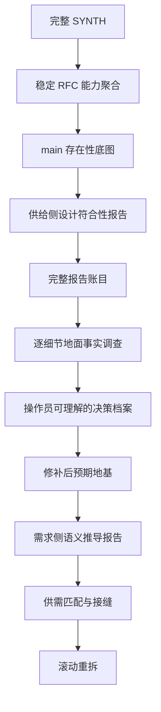

# RFC #547 · 标准调查、决策与滚动重拆 prompt

- **主题：** 类型系统、装载期编译与零原语任务定义
- **唯一 SYNTH 输入：** `v3-issue/synthesized/SYNTH-547-type-system-compile.md`
- **工作目录：** `v3-issue/n/547/`
- **事实源：** 本 RFC 稳定设计 + 操作员裁决 + v3 权威记录 + 真实系统；旧 issue/测试/非 v3 docs 仅作线索。

## 0. 这是执行 prompt，不是原则摘要

本文件从 RFC #546 的完整 session（包括 Read/Bash/Write/Edit、Codex 任务书、任务失败与恢复、报告落盘和后续纠偏）抽取标准流程。后续主 agent 必须按本文件恢复工作，不得只看阶段名自由发挥。

目标不是“把旧 issue 修好”，而是建立这条证据链：

## 1. 主 agent 与 subagent 的硬边界

### 1.1 主 agent 只保留目标层信息

主 agent 必须掌握：

- 本 RFC 的稳定问题清单和设计公理；
- 当前处于哪一阶段，为什么不能跳步；
- 已有哪些正式报告，各自回答什么问题；
- 报告之间的矛盾、未知和依赖；
- 哪个细节需要下一位 subagent 调查；
- 哪些问题已经具备向操作员请求裁决的材料。

主 agent **不应**把下列内容持续装入会话：

- 大量源码调用链、SQL、测试行号和 shell 输出；
- subagent 的工具调用记录和中间推理；
- 每个细节调查的全部取证过程；
- 为了“确认”报告而亲自重跑同一套细节调查。

主 agent 读取正式报告的摘要、结论边界、因果说明、未知和证据索引。报告不够可信时，派复核或 follow-up subagent；不要自己吞入细节。这样 compact 后只需本文件、报告索引和当前问题树即可恢复目标。

### 1.2 subagent 是细节事实的唯一调查者

以下工作默认必须派 subagent：

- 源码、表结构、事务、锁、迁移、runner profile、Git 对账等细节取证；
- 某个不变量在所有写入口是否真被执法；
- 崩溃、并发、历史数据或真实 runner 下的实验；
- 旧测试是否与实现共同偏离；
- 一个观察到的偏离为什么产生、跨了哪些层；
- 事实支持哪些实现形态及其确定后果；
- 从某个未实现设计语义推导原子地基需求。

主 agent 可以设计问题、切片和报告格式，但不把答案写进 prompt。

### 1.3 细节是调查起点，不是根因边界

“调查 D-x”只确定调查种子，不预设根因只在一个函数。一个细节可能由声明、存储、迁移、调度、恢复、权限、历史兼容和下游消费者共同产生。

subagent 必须区分：

1. **观察事实**：具体哪里表现异常或与设计不同；
2. **直接机制**：哪条生产路径生成该事实；
3. **上游来源**：数据/状态/声明来自哪里；
4. **历史原因**：迁移、旧兼容、回退或双事实源如何形成；
5. **放大条件**：并发、崩溃、特定 runner、未来能力出现时才触发什么；
6. **消费者影响**：谁读取它，错误会如何传播；
7. **根因集合**：允许多因一果、一因多果或尚不可判定；
8. **修补边界**：修直接症状是否会保留根因。

调查可以沿因果链扩展，但不能据此新增需求；稳定 RFC 不要求防的风险只登记，不自动实施。

## 2. Codex subagent 的统一任务书

每次派发都必须包含以下段落，不能只写“查一下 X”。

### 2.1 调查问题

写成可证伪问题，说明它为什么阻塞当前阶段。不得预设答案，不得把候选方案说成完备集。

### 2.2 固定基线

- repo、branch、HEAD SHA；
- 允许写入的位置仅限指定报告和明确实验临时目录；
- 禁止修改产品代码、测试、配置和生产数据库；
- 需要运行实验时说明真实环境和副作用边界。

### 2.3 唯一设计锚点

只列与该切片直接相关的 RFC 聚合“语义定义”、操作员裁决和明确的 v3 权威记录。测试、issue、marker、验收脚本只能作线索。

### 2.4 必须建立的事实

逐条列出问题，不列预期结论。每条要求：

- 生产代码或运行证据；
- 事务/并发/迁移/错误恢复语义；
- 所有写入口或消费者，而不是单一命中；
- 静态不可判定时所需的最小实验；
- 现有测试覆盖与同错风险；
- 可保留资产。

### 2.5 防污染纪律

- 符号存在不算符合；
- 测试绿色不算设计证明；
- commit message 不算实现证据；
- 不得自行裁决；
- 不得写“小/中/大 PR”“约几十行”；规模只能列具体函数、表、调用点、测试名；
- 不确定就写不确定以及如何确定；
- 如果事实揭示第四种形态或复杂根因，必须报告，不能服从 prompt 暗示。

### 2.6 报告双层结构

报告写入本 RFC 目录，必须让主 agent 无需读取取证细节也能使用：

**A. 主 agent 摘要（最多一页）**

- 问题；
- 结论与置信边界；
- 复杂因果的简明解释；
- 当前影响、未来影响、纯证明缺口；
- 可保留资产；
- 尚未确定的事实；
- 下一步是否需要裁决或继续调查。

**B. 证据附录（供复核 subagent 使用）**

- 逐条设计对照；
- `path:line`、SQL、命令、运行观察；
- 全部调用方/写入口/消费者；
- 事务、锁、迁移和崩溃窗口；
- 测试同错/盲区；
- 实验脚本和环境限制；
- 证据索引。

## 3. Codex 任务运行与收件流程

#546 的完整 session 证明“Agent 调用返回”不代表调查完成。主 agent 必须：

1. 记录 Codex runtime task id、目标报告路径和预期章节；
2. 轮询**任务终态**，不能只等文件出现；
3. 报告出现后核对行数、章节、尾部和明确结论，防止半写文件；
4. 任务失败时读取失败原因：
   - 容量/流中断且 session 有有效进度：优先 resume；
   - 任务挂死：取消该实例，再 fresh 重发同一问题；
   - 环境不能实验：保留“不可判定”，要求交付可复现实验脚本；
5. 不因某个任务慢而降低问题或改用未经允许的模型；
6. 只在全部切片报告完整后进入汇合；
7. 汇合发现遗漏时派报告核算/复核 subagent，不由主 agent补做代码调查。

## 4. 标准流程：每一步到底解决什么

### R0 · 完整读取 SYNTH，先恢复材料全貌

**要解决的问题：** 当前文件混合了稳定 RFC、旧/新 issue、marker 循环、评论裁决和状态快照；如果没读全就会再次沿坏边界工作。

**实际做法：**

- 大文件分段读取；
- 先扫描后半部分章节标题，识别大段重复供替循环，再逐段读取独特内容；
- 未经操作员授权不写文件、不查代码；
- 对话中固定：只看本 RFC、跨树只记能力、现在只聚合。

**不得前进：** 尚不能说清哪些是稳定设计、哪些是拆分、哪些只是历史证据。

### R1 · 先做 source inventory，再做能力聚合

**要解决的问题：** 旧 issue 边界是错误来源，不能直接“整理 issue”。

**产物顺序：**

1. source inventory：每个行段标“进聚合/捞金/丢弃/仅现状”；
2. 全局公理与完整终态交付标准；
3. 能力块：每块写语义定义、真实交付标准、现状快照；
4. annex：未决项、跨树能力 inbound/outbound、验收 owner、冲突；
5. README/索引。

**关键判断：**

- 重复 marker 中只捞已经稳定且有设计来源的语义；
- issue 编号只留在出处和历史，不进入依赖合同；
- 跨树编号翻译为能力，但不打开其他 RFC；
- 冲突只登记，不裁决；
- 聚合不是重拆，不排未来 issue 顺序。

**校验：** 行数、全交付标准去向、正文编号依赖 grep、源行号回溯。

### R2 · 只做 main 存在性底图

**要解决的问题：** 聚合使用了历史快照，main 可能已经前进；重拆前必须知道哪些东西真实存在。

**必须派 subagent，因为：** 这是大量源码检索和新旧路径成对核对；让主 agent 亲自读会污染目标会话。

**调查方式：** 按全部能力块逐项核对：新机制是否存在、旧机制是否退役、声明/存储/执行/执法/消费分别到哪。默认未实现，只登记生产证据。

**报告只能回答：** “有什么”。不能回答“符合 v3”“测试绿”“可作地基”。

### R3 · 把真实问题改写成“现有实现能否作为地基”

**触发：** R2 出现“已实现/部分实现”。

必须分开两个问题：

1. 它是否符合稳定 v3 语义；
2. 它能否提供未实现能力真正需要的保证。

现有测试不能认证第一个问题，因为代码和测试可能由同一错误 issue 生成。旧 issue 的接口清单也不能直接回答第二个问题，因为依赖边界本来就可能写错。

**切片：**

- 供给侧：按现存实现的语义/事务边界切片；
- 需求侧：按未实现能力的稳定语义切片；
- 先供给，暂不启动需求。

### R4 · 供给侧设计符合性深审

**要解决的问题：** 把“已存在”拆成：符合、偏离、静态不可判定、可保留底座、负资产。

**为什么多个 subagent：** 每片需要深查事务、并发、恢复、迁移和旁路；单 agent 容量不足且容易被代码—测试自洽迷惑。切片之间应能交叉核对同一接缝。

**每片报告必须包含：** 逐条稳定语义三态判断、严重偏离、静态未知、测试同错、可保留资产和能否作下游地基。

### R5 · 先完整核算供给报告，不能立刻跑需求侧

**要解决的问题：** “有偏离”仍不足以定义下游应依赖什么。

必须完整收进账目的内容：

- 每条偏离；
- 每条静态不可判定；
- 每条测试同错/盲区；
- 每项可保留资产；
- 报告互证或冲突；
- 原报告条目到总账的全覆盖映射。

**必须派报告核算 subagent，因为：** 逐条搬运和覆盖检查属于细节劳动；主 agent只读核算报告摘要和覆盖结论。

**禁止：** 只看 findings 就下“零重写”“都是小修”结论。

### R6 · 从总账生成“待调查细节索引”

**要解决的问题：** 哪些偏离只是明确事实，哪些真正形成设计/工程分叉，哪些还缺地面事实。

每个索引项必须写：

- 对应稳定条款；
- 报告观察到的事实；
- 为什么现有证据不足以决定补法；
- 可能涉及哪些层，但不预设根因；
- 需要何种代码、数据或运行实验；
- 为什么要单独派 subagent。

此时不写选项、不估成本、不回写“修补决策”。

### R7 · 一个细节一个 subagent，查清复杂成因和确定后果

**要解决的问题：** 为操作员裁决建立地面事实，而不是让模型编选项。

典型调查包括：

- 多条恢复通道真实行为和已消费资源交互；
- 跨表不变量、trigger 先例、迁移兼容和存量违规数据；
- sandbox 语言能力、真实 runner 读需求和不可测环境；
- delete/consume 两条完整调用链、孤儿资源、对账和运维契约。

**关键纪律：** 一个细节可能有复杂历史根因；报告必须从观察点追到所有必要层。prompt 中的候选不是完备集。没有事实就保留未知。

### R8 · 由报告生成决策档案，再请求操作员裁决

**要解决的问题：** 操作员不能只看一句推荐，也不能基于模型想象裁决。

每个决策档案应由专门 subagent 只读相关报告生成，包含：

- 为什么会出现这个问题；
- 稳定设计要求什么；
- 当前代码/数据/运行事实；
- 复杂因果和影响触发条件；
- 事实支持的所有形态，不把预设候选当完备；
- 每种形态的确定后果、具体触点和仍未知项；
- 哪些是纯口径选择，哪些是工程分叉；
- 不给主观工作量。

主 agent只检查档案是否完整，然后逐项呈现给操作员。操作员未裁决前不得写进规格。

### R9 · 建立“修补后预期地基”

**要解决的问题：** 需求侧不能依赖当前有洞的代码，也不能依赖未经裁决的想象修补。

只有操作员裁决和事实充分的修补方向，才能回锚到聚合原文：稳定条款、实然问题、裁决、预期保证、仍未证明的运行项。由回写 subagent 修改，再由独立复核 subagent检查是否残留旧预裁或互相矛盾的文本。

### R10 · 需求侧从稳定语义推导原子地基需求

**前置条件：** R9 通过。#546 中需求侧被暂停是正确行为。

每个未实现能力一个 subagent。输入只给：该能力稳定语义、相关预期地基摘要、必要的供给报告摘要。禁止抄旧 issue 或让 subagent 自裁。

报告回答：需要哪些原子读写、事务、身份、恢复和授权保证；预期地基已供什么；缺口应由本能力新建还是说明地基未闭合。

### R11 · 供需匹配与接缝识别

主 agent只消费供给/需求汇合报告，不进入代码细节。逐条标：直接复用、修补后复用、过渡兼容、消费能力自建、地基仍缺。把“双方各吞半个”的能力抽成接缝，消灭循环依赖。

### R12 · 滚动重拆

只拆现场足够清楚的下一批。每个新 issue 的验收只能依赖 main 已有/已明确修补的地基和本 issue 自己的 diff。实现推进后重新运行 R2–R11 的必要子集，再拆后续，不一次写完整未来树。

## 5. 明确的失败回退条件

出现以下任一情况，必须退回对应阶段：

- 用现有测试通过证明符合 v3 → 退回 R3/R4；
- subagent 只列 symbol 命中，没有事务/并发/恢复语义 → 退回 R4；
- 供给报告未读完整就启动需求侧 → 退回 R5；
- 总账漏掉静态未知或测试同错 → 退回 R5；
- 主 agent 根据报告措辞编出选项/范围 → 退回 R6/R7；
- 出现“小 PR、约 30 行、中等工程”但没有具体触点计数 → 退回 R7；
- 把尚未实现的机制称为“可复用” → 退回 R7；
- 操作员只收到一句推荐、无法理解问题来源 → 退回 R8；
- 未裁决内容已回写成决定 → 将其标为不可信，退回 R8/R9；
- 需求侧依赖当前缺陷而非修补后预期 → 退回 R9；
- 当前 issue 的验收依赖未来 issue 才能解释 → 退回 R11。

## 6. 进度记法

- `[x]`：该阶段的 gate 已满足；
- `[~]`：进行中；
- `[ ]`：未开始；
- `[!]`：已有产物但被证实不可信或需要返工。

每项必须同时记录：状态、产物、已经证明什么、仍未证明什么、下一批 subagent 及其必要性。

## 7. 当前进度

### [x] R0

- **状态：** 已完整读取 SYNTH 并冻结本 RFC 范围。
- **产物：** SYNTH 源文件
- **已证明：** 材料范围已明确。
- **仍未证明：** 未证明代码符合 v3。
- **下一批 subagent：** 无。

### [x] R1

- **状态：** 已完成 inventory 与全局聚合。
- **产物：** 01-inventory.md；AGGREGATE-547.md
- **已证明：** 设计域和交付标准已聚合。
- **仍未证明：** 未形成地基保证。
- **下一批 subagent：** 无。

### [x] R2

- **状态：** 已通过四组调查和补验完成草稿逐条实现标记。
- **产物：** 02-implementation-facts.md；03-raw-verification-results.md；03-draft-annotation.md
- **已证明：** 草稿主张与 main 的存在性/过时性映射最完整。
- **仍未证明：** 逐行标记仍不等于现存 compile/task-runtime 供给可作为地基。
- **下一批 subagent：** 下一步按 compile artifact、binding/type flow、runtime tree/identity、gate/tool registry、resume pin 等语义边界切供给片。

### [x] R3

- **状态：** 已冻结六个供给侧语义/事务切片；五片候选因遗漏 D7/D9 的通用入口与持久化退原语边界而被否决。
- **产物：** `04-r3-supply-slicing.md`（235 行）；subagent `/root/r3_supply_slicing`。
- **已证明：** 六片覆盖 §2 A–I、D1–D10、§2.5 引擎原生供给与 R2 全部现存/部分现存资产；D11 只作 R4 汇总接缝 owner，不提前作综合验收；供给符合性与 R10 需求推导已经隔离。
- **仍未证明：** 尚未证明任何现存供给符合稳定语义或可作地基；报告列出的 canonical model、runtime identity、definition pin、GateDecisionPoint、repository migration 等事实仍须 R4 源码/运行深审。
- **下一批 subagent：** 按 S1–S6 每片一位 subagent；先并行启动互相独立的 S1、S2、S6，收件后再启动 S3、S4、S5，并核对接缝。

### [x] R4

- **状态：** 六片供给侧设计符合性深审均已完成，并已核验任务终态、行数、章节、摘要与尾部；未设计补齐方案，未启动需求侧或综合验收。
- **产物：** `05-r4-compile-artifact.md`（356 行）、`06-r4-binding-type-flow.md`（332 行）、`07-r4-runtime-tree-identity.md`（410 行）、`08-r4-capability-registry.md`（437 行）、`09-r4-resume-definition-pin.md`（205 行）、`10-r4-engine-primitives.md`（174 行）。
- **已证明：** S1/S2/S6 结论同前；S3 证明运行态树存储/identity 骨架存在但生产调度旁路 tree 且无 transition commit；S4 证明 D4/D5 无生产闭环，hook foundation 不能冒充 gate/tool；S5 证明 ref/hash/FK 只是归因骨架，定义内容未持久化且 resume/restart 隐式重绑当前源。
- **仍未证明：** 六报告的每条偏离、静态未知、测试同错、资产与跨片接缝尚未形成全覆盖总账；不能据摘要判断修补范围或进入需求侧。
- **下一批 subagent：** 独立 R5 核算 subagent 逐条搬运六报告并做原条目→总账覆盖映射、互证/冲突检查。

### [x] R5

- **状态：** 六份供给报告已完成全量核算。
- **产物：** `11-r5-supply-ledger.md`（293 行）。
- **已证明：** 250/250 个原条目映射为 55 个总账 ID，未映射 0；38 个源资产条目完整保留；六报告无真实冲突，cache/restart 与 identity/行为漂移等表面冲突已按边界解释。
- **仍未证明：** 24 个偏离/无供给族中哪些是已明确事实、哪些形成设计/工程分叉、哪些仍缺地面事实尚未索引；外部 schema/bindings/C6/GUI/hook/definition artifact/typed chain boundary仍未知。
- **下一批 subagent：** R6 索引 subagent 仅从总账生成待调查细节，不写选项、不估范围、不裁决。

### [x] R6

- **状态：** 已完成待调查细节索引。
- **产物：** `12-r6-detail-index.md`（388 行）。
- **已证明：** 55/55 总账族按 A27/B22/C5/D1 全覆盖分类，未映射 0；22 个真实分叉与 5 个地面未知收敛为 14 个独立 R7 调查项，分两批事实依赖；每项均具稳定条款、证据不足原因、调查层、实验边界和独立派发理由。
- **仍未证明：** 14 项的复杂成因、全部触点、运行后果与事实支持的形态尚未完成；R6 不含选项或裁决。
- **下一批 subagent：** 按 R7 批次 1 的十项滚动并行调查，完成前置后再派 R7-08/10/11/14。

### [x] R7

- **状态：** 14 项逐细节调查全部收件并通过独立覆盖核算。
- **产物：** `13-r7-01-*.md` 至 `13-r7-14-*.md`；`14-r7-coverage-audit.md`（214 行）。
- **已证明：** 14/14 报告映射 R6 索引，缺项 0；R7-07→08、08→10/11、04+13→14 前置均被事实级消费；无不可解释冲突、提前裁决、实施顺序或规模估算。复杂根因、消费者和事实支持形态已具备 R8 材料。
- **仍未证明：** R7-08 与 R7-11 各保留一条未新跑最强 runtime 路径的证明缺口；外部未 checkout owner及产品语义继续未知。事实材料尚未转成操作员可裁决档案。
- **下一批 subagent：** 按七个共享裁决问题生成 R8 档案，同时保持各细节独立失败判定点。

### [x] R8

- **状态：** 已撤销不可信 ballot，完成责任恢复、七项补查、二十六项自主工程收敛、六项自主裁决、八个跨报告接缝统一及两轮独立审计；剩余用户问题为 0。
- **产物：** 事实档案 `15-r8-g1-*.md` 至 `g7-*.md`；不可信历史产物 `16-r8-decision-audit.md`、`17-r8-decision-ballot.md`；根因 `18-r8-autonomy-root-cause.md`；补查 `19-r8-i*.md`；自主工程合同 `20-r8-e*.md`；自主审计/裁决 `21-r8-*.md`；正式合同 `22-r8-final-decisions.md`；最终审计 `23-r8-final-audit.md`（通过，缺陷 0）。
- **已证明：** TF-01…44 全覆盖且未映射 0；5 项稳定结论恢复、7 项事实闭合、26 项各归唯一工程合同、6 项按自主授权与最小机制形成唯一裁决。双 identity、双 journal、半实例、migration 顺序、outbox、hold/claim、repository/worktree 和 optional gate 接缝已统一；未实现外部能力均保持 typed unsupported/dependency hold。
- **仍未证明：** 正式决策尚未回锚到聚合原文，预期地基仍未形成可供需求侧消费的单一事实源；外部 #597/#712、schema consumer 与 non-degenerate par 仍是明确 dependency/验证缺口，不得称已实现。
- **下一批 subagent：** R9 回写 subagent 依据 `22` 将稳定条款、实然问题、裁决、预期保证与未证明运行项写回聚合并产出预期地基；随后独立复核旧预裁和矛盾残留。

### [x] R9

- **状态：** 已完成正式决策回写与独立复核。
- **产物：** 更新后的 `AGGREGATE-547.md`（199 行）；`24-r9-expected-foundation.md`（57 行）；`25-r9-foundation-audit.md`（通过，缺陷 0）。
- **已证明：** D1–D10、8 Gate、44/44 正式决策已回锚；旧预裁/ballot/相反文字残留为 0；dependency 全部用具名能力而非 issue 编号作合同 identity；D2/D4 跨域与 hook/tool 资产混域已修正。`24` 可作为 R10 唯一预期地基。
- **仍未证明：** 尚未从各未实现能力的稳定语义推导原子读写、事务、身份、恢复和授权需求，也未判断哪些由预期地基供给、哪些应由能力自建。
- **下一批 subagent：** R10 按 D1–D10 每个未实现能力域独立推导需求，输入仅限对应稳定语义、`24` 预期地基和必要供给摘要。

### [x] R10

- **状态：** D1–D10 十域需求侧推导已全部完成并通过接缝审计。
- **产物：** `26-r10-d1-*.md` 至 `26-r10-d10-*.md`；`27-r10-demand-audit.md`（通过，缺陷 0）。
- **已证明：** D1–D10 10/10、191/191 原子需求全覆盖；每项已标地基供给、修补复用、本域自建、具名 dependency 或证明缺口；D1/D10 artifact、D2/D6 renderer、D9/provider/D10 owner与D2/D4 dependency接缝已修正，owner交集 0。
- **仍未证明：** 191 项尚未与 R5 现存供给逐条归类为直接复用、修补后复用、过渡兼容、消费能力自建或地基仍缺；跨域接缝尚未形成 R12 可拆分的能力图。
- **下一批 subagent：** R11 汇合 subagent 逐条匹配 R5/R9/R10，抽取接缝并消灭循环依赖；随后独立审计。

### [x] R11

- **状态：** 供需匹配、接缝抽取与完整 DAG 已完成并通过独立审计。
- **产物：** `28-r11-supply-demand-map.md`（364 行）；`29-r11-map-audit.md`（通过，缺陷 0）。
- **已证明：** 191/191 原子需求主分类与 owner 唯一；36/36 named seams 一一对应且各在 DAG 出现一次；完整 DAG 29 节点/45 边/cycle 0；10 个 capability unit 的 seam 先决、owned product、观察点、dependency/proof 与验收闭包自包含。
- **仍未证明：** 尚未选择现场足够清楚的最小下一批，也未把能力单元翻译成可执行但不依赖未来任务的 issue 草案；未实现 dependency 仍不得进入本批验收。
- **下一批 subagent：** R12 只从 DAG source-ready 能力中选择最小下一批，形成草案而不修改 GitHub issue；独立审计每项验收自包含。

### [x] R12

- **状态：** 滚动重拆已完成当前轮；当前合法批次为 0，不创建或修改 GitHub issue，不实现代码。
- **产物：** `30-r12-rolling-decomposition.md`（157 行）；`31-r12-decomposition-audit.md`（通过，缺陷 0）；`32-workflow-completion-audit.md`（通过，缺陷 0）。
- **已证明：** 10 个 capability unit 中 source-ready 为 0、issue 草案为 0、not-yet 为 10。R11 expected seams 不能冒充 main 现有供给；最接近的 dead-fragment unit 仍缺 S-33 versioned canonical typed fragment graph 与 S-07 D1 typed finding carrier。合法零批次符合“只拆现场足够清楚的下一批”，且无虚构验证命令、未来 issue 暗依赖或范围膨胀。
- **仍未证明：** 十个能力均尚未实现；independent schema consumer、tool outcome/finalize runtime、gate evaluator/journal、typed ChainDefinition provider、scripted join consumer、non-degenerate par 与冻结 SHA 验证仍是具名 dependency/proof gap，未被称为完成。
- **下一批 subagent：** 无。只有 main 变化满足 `30-r12-rolling-decomposition.md` 的 G-01…G-08 事实 gate 后，下一轮才重跑 R2–R11 的必要子集并重新判断 source-ready 批次。

### [x] RFC 实现与理由独立说明文档

- **状态：** 已按操作员追加要求完成独立长篇说明；未改变 R12 的零批次结论，未创建 worktree、issue 或实现代码。
- **产物：** `A.md`；写作过程与审计记录位于 `.writing-rfc-implementation/`。
- **已证明：** 文档以单个 item 的 H1→compile→immutable publish→typed plans→atomic create→attempt/tool/gate→typed transition/outbox→H2 restart 生命周期解释目标实现及每一机制的必要性；事实终审、机制深度审计与原创结构审计均通过，阻断项 0。
- **仍未证明：** 文档解释目标合同，不把十个 not-yet capability unit 写成 main 已实现；真实 runtime、外部 dependency 与冻结 SHA 验证缺口仍保持 R12 原结论。
- **下一批 subagent：** 无；只有 main 事实变化触发下一轮 R2–R11 必要子集。

## 8. compact 后的恢复顺序

下一位主 agent：

1. 先读本文件的“当前进度”；
2. 只读最近一个已完成阶段的主 agent 摘要，以及当前进行中阶段的报告摘要；
3. 不读取历史工具调用记录，不重新展开全部源码细节；
4. 检查当前 gate 缺的是什么；
5. 按“下一批 subagent”派发有限调查；
6. subagent 报告不完整时 follow-up，不由主 agent 接管细节；
7. 未经操作员授权，不实现代码、不创建或修改 GitHub issue/PR。
