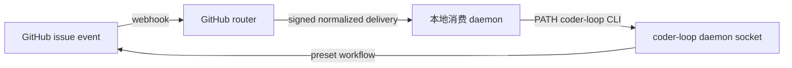

# RFC #548：外部调用与执行终端的能力、现状与设计理由

## 1. 问题不是缺少一个入口，而是缺少一条可信的跨边界链路

coder-loop 的核心职责是调度：读取 preset，把 item 放入 chain，在适当 phase 启动 runner，并根据持久化状态推进、恢复或终结任务。GitHub webhook、HMAC、组织级 App、远端 HAPI session 和网络重试都不属于这个领域。如果为了接收 GitHub 事件而在 coder-loop daemon 内增加 HTTP server、webhook 验签和 label 映射，引擎会同时承担网络入口、第三方身份、业务映射与任务调度。这样做不仅扩大攻击面，也使 GitHub 的失败模型渗入通用 scheduler。

RFC #548 处理的是更严格的问题：外部系统如何在不成为引擎领域对象的情况下，把一个结构化工作可靠地交给 coder-loop；反向地，coder-loop 又如何把一次执行交给可能暂时不存在的外部终端，而不把“终端缺席”误判为普通进程启动失败。

这两个方向看似不同，实际共享同一条原则：边界两侧必须各自保留唯一权威。网络端拥有 delivery、验签和重推；引擎拥有 chain、item、request mutation、closure 与调度资格；外部 runner 拥有远端 session 的真实执行结果。任何一侧都不能用自己的局部记录冒充另一侧的事实。

## 2. 外部事件的三层结构

RFC 采用三层结构，而不是让 GitHub 直接调用 coder-loop：

### 2.1 Router 终结互联网入口

Router 负责 GitHub webhook、GitHub App source、外部鉴权、持久 delivery identity、队列与重推。它不能把一次网络投递的完成等同于 coder-loop 业务任务完成。对 coder-loop target 而言，item 入队即代表投递责任结束；后续 PR、merge 和 issue closure 属于 preset 工作流，而不是 router 的占槽条件。

这一分离的理由是故障域不同。coder-loop daemon 停机时，router 必须保留原 delivery 并稍后重推；工作已经入队但尚未执行时，router 又必须停止重推，避免把业务执行时间误认为投递失败。只有 durable queue、稳定 delivery identity 和 per-target fire-and-forget 同时成立，这个闭环才成立。当前调查尚未取得 router 侧这些契约的运行证据，因此它们仍是外部地基缺口，不是消费 daemon 可以用本地 retry 替代的功能。

### 2.2 消费 daemon 终结 GitHub 业务映射

消费 daemon 负责 HMAC 校验、repository/label 到 preset 的映射、issue 到规范 item identity 的映射、schema 预校验、两步 CLI 编排以及 delivery verdict。GitHub 知识到此为止，不进入 coder-loop 源码。

它只通过 PATH 上的 `coder-loop` CLI 写入引擎，不 import engine 源码、不直写 SQLite，也不直接连接内部 socket。CLI 是这里的稳定公共边界；socket 是 daemon 内部传输边界。把两者分开，允许内部 wire 演进，同时迫使 CLI 为外部调用者提供无损、版本化的公共契约。

### 2.3 Engine 只接受通用结构化请求

引擎只看到 chain 声明、item identity、preset 引用和 preset 声明的字段。它不知道这些值来自 GitHub，也不知道 label、repository URL 或 delivery 的业务含义。

这种纯度不是代码风格偏好，而是防止依赖倒置。若 engine 保存 delivery id、GitHub issue number 或 router retry 状态，通用 request ledger 就会变成 GitHub 专用投递账本；若 consumer 直接解释 SQLite 行，它又会绕过 engine 的事务、授权和迁移边界。RFC 因此同时要求“engine 不吸收 delivery 领域”和“consumer 不绕过 CLI”。

## 3. 两种调用语义与 chain 的真实含义

外部调用只有两种语义：

- `into-chain`：把 item 追加到既有 chain；
- `new-workspace`：创建一条新 chain，再添加第一个 item。

“独立 workspace”没有引入新的引擎实体，因为 chain 已经承担命名、凭据、repository 和隔离边界。新增 workspace 实体只会与 chain 重复，并迫使 scheduler 同时理解两套容器语义。

`new-workspace` 保持两个普通命令，而不是增加组合事务命令。`chain.create` 与 `item.add` 各自 durable，二者之间没有跨命令事务。操作员裁决明确允许第一步成功、第二步未完成后留下空 active chain。空 chain 是长期合法状态，不归属某个 delivery，不触发自动补种或自动删除，也不能证明 `consumed` 或 `not-consumed`。投递状态必须由 router/consumer 自己的 durable 记录给出。

这个选择保留了 chain 的通用语义：chain 可以先创建、稍后再加 item，也可以长期为空。若引擎从空 chain 反推某次 delivery 尚未完成，它就会把调用历史误当成领域状态。

## 4. Schema 不是 compile 输出上的一个版本号

### 4.1 Current main 的实际情况

当前 `preset compile --json` 输出带有 `schemaVersion: 1` 的 projection instance，但它不是 JSON Schema，也不包含完整 item field map、required 集合或 unknown-field policy。当前 daemon 在 `item.add` 时会加载 preset，却没有用 preset field model 校验 `extra`。隔离运行已经证明：缺少声明字段、额外字段和类型错误都可以落库并抵达 scheduler。

因此，现有 compile projection 只能描述编译结果的一部分，不能承担外部请求校验协议。给一个实例对象添加 `schemaVersion` 不会使它变成 schema；没有 consumer、版本失配处理和字段约束时，这个版本号也没有兼容性意义。

### 4.2 RFC 决定交付真正的 CLI JSON Schema

公共 schema 通过 PATH CLI 输出，而不是通过私有 TypeScript package 共享。CLI schema document 与现有 compile projection 保持不同身份。前者是跨仓协议，后者仍是编译结果投影。

Schema 来自同一权威归一模型，并包含：

- preset identity 与 schema identity/version；
- field type；
- required；
- unknown-field policy；
- engine-owned 字段与 preset-owned 字段；
- 每个字段对外是否可写。

`required` 在 field object 内逐字段表达。旧 shorthand 和旧 `{type = ...}` 默认 required；optional 必须显式写 `required = false`。这一默认值避免旧 preset 在升级后把原本参与 prompt binding 的字段静默变成 optional。

### 4.3 为什么 schema 必须同时包含 engine 与 preset 字段

真实 SQLite 数据表明，`extra` 不是纯业务 payload。它同时包含 preset business fields、`dependsOn`、scheduler backoff 等 engine control fields，以及历史迁移残留。如果只拿 preset field map 对整个 `extra` 做 `additionalProperties: false` 校验，合法的 engine 字段会被误判为 unknown。

RFC 因此选择合成完整 schema：engine-control model 与 preset model 各自保持权威，然后合成为整个持久化 `extra` 的公共 schema。外部调用者可以看到 engine 字段，但“可见”不等于“可写”；只供 engine 维护的字段必须在公共 ADT 中标记为 caller 不可写。

这项决定仍有一个外部前置：preset 权威归一模型及稳定 identity 归 RFC-2 所有，目前尚未形成 current supply。正因为该前置未闭合，schema artifact、write gate、startup quarantine 和 repair 没有被提前拆成实现 issue。

## 5. 持久态不变量与历史 item 修复

RFC 不接受“创建时校验一次，随后 update 可以破坏数据”的弱保证。所有可能再次执行的 item 必须持续符合当前合成 schema。`item.add`、batch add 以及所有改变 `extra` 的 update 都消费同一归一模型；任何写入口都不能制造 missing、unknown 或 type mismatch 的新持久态。

历史数据不能通过一次 schema 发布被假定为合法。对真实 loop-data 的只读检查发现，58 个 item 中，54 个引用当前 bundled GitHub preset，但按新 required 和当前 field types 重判均不合格；另外 4 个引用已经不存在的 preset。这个结果说明升级不能用“从现在起只校验新行”回避旧数据。

daemon 启动时会对可能再次执行的历史 item 做 reconciliation。校验失败的 item 获得 durable、可观察的“不可启动”状态与具体原因，不进入 scheduler，也不反复形成 spawn failure。terminal item 和 deleted chain 下的 item 保持历史快照，不强制满足当前 schema；但如果未来存在让它们重新进入可执行状态的入口，该入口必须先经过同一 schema gate。

修复通过专用 operator CLI 完成。该命令在一个原子操作中替换 preset 与完整 `extra`，先按目标 preset 的当前合成 schema 校验，再提交并清除不可启动原因。它不能自动猜测旧字符串应转换成什么数字，也不能为缺失业务字段编造值。原子替换同时解决两个风险：preset 已删除时可以迁移到新 preset；修复过程中不会暴露“新 preset + 旧 extra”或“旧 preset + 新 extra”的中间态。

## 6. Identity、幂等和重放为何必须分层

系统中至少有三种不同 identity：

- delivery identity：router 的一次外部投递；
- request identity：engine 接收的一次可关联请求；
- work identity：`(chain, itemId)` 表示的规范工作。

操作员裁决规定 `(chain, itemId)` 就是规范工作身份。相同 identity 的 item 已存在时，不再比较 payload，也不引入 operation fingerprint；它表示该工作已经被接管。这个规则把 itemId 映射正确性的责任放在调用方，同时让 engine 的唯一约束成为重放收敛地基。

delivery identity 不能取代 request identity。一次 delivery 可能依次调用 `chain.create` 和 `item.add`，也可能因断连重放同一 engine request。反过来，engine request 也不能取代 delivery：engine 不知道 GitHub 映射和 router queue。两者只能通过 request identity 关联，各自保留自己的 durable record。

Current main 已有两项可保留资产：串行和同一 daemon 并发下，同声明 `chain.create` 会复用同一 chain；SQLite 对 `(chain_id, item_id)` 有唯一约束。运行调查还推翻了早期关于“同一 daemon 并发创建 chain 会让败者收到 sqlite_error”的假设：关键区间没有 `await`，隔离并发实验中的所有调用都成功返回同一 chain。

不足之处在 caller-visible contract。item duplicate 当前表现为通用 conflict，不比较既存 payload；PATH CLI 又把 socket 的结构化 details 压成文本。因此 RFC 需要公共 CLI typed result/rejection ADT，使 created、already-existing、rejected、no-op 等结果可以被机器穷尽处理，而不是解析 stderr。

## 7. Durable request record 解决的不是日志格式，而是线性化证据

现有 JSONL observability events 不能证明逐请求结果。`item.created` 可以证明某行曾成功插入，却没有 request/delivery identity；rights admission 发生在实际 insert 之前，duplicate 同样会产生 allow；`chain.layout` 不能区分首次创建与复用。事件写入与 SQLite mutation 不在同一事务，写失败会被吞掉，因此“CLI 成功”不能推出“审计事件存在”。

RFC 决定新增 durable、可关联的 typed request record。它记录稳定 request identity、subject/admission 结果以及 created、already-existing、changed、no-op、rejected 等 verdict，并明确 record 与 mutation/read decision 的线性化关系。

这不是把 consumer delivery log 搬进 engine。Engine record 回答“这个 engine request 在哪个身份下观察或改变了什么”；consumer log 回答“这个 GitHub delivery 被映射成哪些 CLI 请求，最终向 router 返回什么 verdict”。两者通过 request identity 关联，但不能互相替代。

Request record 还必须覆盖失败和不确定窗口：

- identity 尚未成功解析的 malformed input 不产生可关联 record；
- identity 已建立后的 unknown command、invalid args、权限拒绝产生 rejected record；
- mutation 与 created/changed record 共同提交或共同回滚；
- already-existing/no-op/read verdict 在其判定点形成 durable record；
- commit 后 reply 丢失时，重放相同 request identity 能读到相同 durable 结果；
- request identity 碰撞返回 typed rejection，不能覆盖原 record。

Request query 自身也是 engine request，也进入同一 registry 并产生 record；查询不会自动递归查询自身，因此不会形成无限调用。最终草案要求唯一 production registry 穷尽 23 个可关联 request variants，包括 `request.get` 和 `request.list`，并用类型层双向 equality 与 runtime 独立期望集合共同防止新增 variant 漏接审计。

这一能力是本 RFC 当前唯一能够合法滚动拆出的 next-batch child。原因并非它最简单，而是它没有依赖 RFC-2 schema authority、router wire 或 HAPI contract，并且现有真实 socket、隔离 daemon、SQLite、restart、reply-loss、rollback 和 credential admission 路径足以直接验收。

## 8. CLI 公共契约为何不能直接暴露 socket envelope

Daemon socket 已经有结构化 `{ok,result|error}` 形状，但它是内部协议。RFC 选择让 CLI 定义独立、无损的 success/rejection ADT，由 socket response 穷尽转换而来。这样做有三个理由。

第一，内部 wire 字段可以随 daemon 实现演进，公共 CLI variant 保持兼容。第二，CLI 可以把多个内部错误归一成稳定领域 rejection，同时保留调用者做 verdict 所需的 details。第三，新增内部 error code 后，穷尽转换会让编译器或 contract test 暴露未处理项，而不是静默把它变成文本。

CLI ADT 不包含 delivery id、router retry 或 GitHub blocker。这些字段属于 consumer contract。它也不能把 unknown future variant 当作 generic failure 后继续执行；schema version 和 typed result version 不匹配时必须 fail closed。

## 9. External-terminal 不是第四个本地进程 runner

### 9.1 Current closure authority 是唯一资源所有者

Current main 已形成 per-closure authority：closure identity、run、runtime node、worktree path/branch、session、reachability、consumption intent、cleanup 和 startup reconciliation 都绑定到 closure。stop 保留 closure 资源供 resume；consume 删除 session 并清理资源；cleanup 失败保留可重试状态。

历史 HAPI 候选使用 `(chain, repo)` slot 作为 worktree owner，并用 item/phase session 恢复。这会与 current closure 同时拥有 cwd、branch、session 和 cleanup 事实，形成双重权威。因此历史 scheduler/SQLite hunks不能整块恢复；能保留的只有 runner/domain/probe/hold 等隔离概念和 `closure_sessions` 的 runner variant。

### 9.2 历史实现只完成了 probe-only

被回退的历史实现明确把 HAPI 建模为 `probe-only / invocation-pending`。它可以执行 fake probe、把缺席 item hold、在恢复时清除 hold，并测试若干 loss latch 状态；但 invocation builder 不产生真实 spawn plan，验收脚本甚至把 zero HAPI spawn 当作成功条件。

这意味着它没有证明真实远端 session、headless completion、status admission、retry/resume 或 active loss。RFC 明确规定 zero-spawn 和 `invocation_pending` 不能作为 production 交付终点。

### 9.3 真实本地 CLI 与历史假设不一致

调查没有找到历史设计假设的 `hapi-remote-session` binary。实际安装的是 `hapi-open-session` 0.1.0，它没有无副作用 `probe`、没有 headless status file、没有 resume/session-id 输入，也不等待远端 turn 完成。正常路径创建 session、发送 prompt 后即返回；把字面 `probe` 当位置参数还可能进入创建路径。

因此，不能用现有 CLI 的 exit 0 表示 runner 完成，也不能发明 exit 69 表示缺席。Production binary、readiness、invocation、terminal/status、session resume/cleanup 都必须先成为真实外部契约，engine 才能实现对应 adapter。

### 9.4 Availability、hold 与恢复

稳定目标要求：external terminal 缺席是正常运行态，不是普通 spawn failure。Item 已创建后，若其 endpoint 不可用，应进入 durable hold，保持 preset status，不创建 run/worktree，也不进入指数 backoff；status/events 必须能区分长期缺席与瞬时进程错误。Endpoint 恢复后清除 hold，item 重新获得调度资格。

历史机制证明了这种状态机的大致形状，也暴露了事务裂缝：item create、hold、warning、clear 和 restoration 分属不同事务，daemon 在这些边界崩溃可能留下 hold 无 warning或 clear 无 restoration。更重要的是，没有真实无副作用 probe 时，这些路径只能由 fake 验证，不能写成 current guarantee。

Endpoint identity 也不能只用 `kind + binary`。同一 binary 可能因 server URL、credential principal、machine 或 profile 指向不同 endpoint。最终 identity 必须从真实 runner/probe contract 推导，不能从历史 hold key 反推。

### 9.5 Terminal 与 loss 必须有唯一 durable winner

外部执行期间可能同时发生业务 terminal 和 endpoint loss。历史 latch 算法在“重读 non-terminal”与“提交 loss latch”之间存在竞争窗口：terminal 可能先提交，随后 loss latch 又覆盖结果。现有测试分别覆盖窗口两侧，没有证明最窄竞争点。

正确交付必须在同一个真实 invocation 上定义 terminal admission commit 与 loss decision commit 的线性化关系，并证明 terminal-first、loss-first、crash/restart 后只有一个 winner。Events 只能观察结果，不能成为 winner authority。由于真实 invocation 和 status admission 尚不存在，这项语义目前仍是事实阻塞。

## 10. Current main 已经实现的窄地基

RFC 的大部分终态尚未落地，但 current main 并非空白。已经存在并可直接复用的资产包括：

| 能力 | Current main 的真实供给 | 不能据此声称的保证 |
|---|---|---|
| 外部写入传输 | PATH CLI → Unix socket → daemon | 不等于 GitHub consumer 已存在 |
| 调用原语 | `chain.create`、`item.add`、per-item preset | 不等于两分支外部 E2E 已完成 |
| 唯一性 | chain 同声明复用；`(chain,itemId)` 唯一 | 不等于 delivery/request verdict 已可追溯 |
| 输入边界 | 顶层 known-key、JSON 安全/大小、preset 存在检查 | 不等于 preset field schema 校验 |
| 持久化 | SQLite WAL、immediate transaction、foreign key | 不等于跨命令事务或 event 原子性 |
| Engine 纯度 | 没有 GitHub webhook/HMAC 领域代码 | 不等于 router/consumer 链路已交付 |
| Closure lifecycle | per-closure run/worktree/session/cleanup/recovery | 不等于 HAPI 已真实进入该路径 |
| Observability | typed events 与当前态查询 | 不等于 durable request/delivery 审计 |

“可复用”在这里表示已有结构能承担未来保证的一部分，不表示测试绿色或 symbol 存在已经证明 RFC 语义。正式供需匹配把 67 项原子保证分为 9 项直接复用、24 项修补后复用、4 项过渡兼容、11 项 consumer 自建和 19 项地基仍缺。这个分布解释了为什么不能把整个 RFC 称为“基本实现，只差接线”。

## 11. 为什么不能一次拆完整实现树

RFC 的依赖不是文件依赖，而是证据依赖。Schema 链需要 RFC-2 的 preset authority；GitHub 链需要 router 的真实 queue/retry/fire-and-forget contract；external-terminal 需要真实 binary、probe、status/session 和 loss ordering。若在这些事实出现前创建实现 issue，issue 的验收只能依赖未来 issue 才能解释，或者通过 fake、stub 和自写测试制造伪完成。

滚动拆分因此只允许拆现场已经闭合的下一批。R12 最初尝试起草 schema、CLI、write gate、quarantine、repair 和 request record 六个 child，独立复核发现前五个直接或传递依赖 RFC-2 authority，且若干 checkpoint 使用并不存在的内部 hook。草案随后归零，再通过专门 runtime-seam 调查确认 durable request record 是无入边的独立节点。

Request-record child 的验收最终固定为真实隔离路径：独立 Git repository、scheduler-disabled production daemon、真实 CLI/raw socket、SQLite 查询、restart、commit 后 reply loss、外部 abort trigger、并发 duplicate、request identity collision，以及由 production scheduler mint 的真实 agent credential admission。固定 driver 在 current main 上应精确失败于 `request.get` unknown command；实现者不能修改 driver 的预期来让错误实现通过。

这种拆分纪律的目的不是拖延实现，而是保证每个 issue 的通过能够证明它自己的新行为，而不是证明一个 stub、未来依赖或测试里的手工注值。

## 12. 尚未实现的完整业务闭环

下列能力仍没有 current runtime 证据：

1. RFC-2 preset authority 与稳定 model identity；
2. CLI JSON Schema、合成 schema 和 version mismatch fail-closed；
3. 所有可执行 item 的持续 write gate、startup quarantine 与原子 repair；
4. CLI 独立 typed success/rejection ADT；
5. GitHub consumer 的 HMAC ingress、映射、schema cache、delivery ledger 与两步 orchestration；
6. Router 的 normalized envelope、durable retry、per-target fire-and-forget 与 GitHub App source model；
7. External-terminal 的 production binary/probe、真实 invocation、headless terminal/status、session resume/cleanup、endpoint identity和 loss ordering；
8. 真实 GitHub 业务 E2E、真实 HAPI E2E，以及冻结 candidate/live merge-base 双基线 gate。

这些条目不是被取消的需求，也不是“后续优化”。它们是 RFC 完整终态的一部分，只是尚未获得足以进入实现的地基或运行证据。当前能够实施的 request record 也不能替代它们；它只先建立以后所有外部调用都需要的 engine 侧线性化证据。

## 13. 结论

RFC #548 要建立的是一条可证明的外部工作链，而不是两个产品集成点。GitHub 方向通过 router、consumer 和 CLI 分层，使网络 delivery、业务映射与 engine mutation 各自拥有权威；external-terminal 方向要求远端 session 进入 current closure lifecycle，并把缺席、恢复、完成和 loss 建模为 durable 状态，而不是本地 `spawn` 的异常分支。

Current main 已经提供 Unix socket 调用、chain/item 原语、部分唯一性、SQLite transaction、引擎纯度和 per-closure lifecycle。这些资产足以支撑后续工作，却不足以证明 schema、verdict、审计、router retry 或真实 HAPI invocation。RFC 调查最终把这些差距收敛为明确契约，并通过操作员裁决固定了 schema、历史数据、规范 work identity、空 chain 和 request audit 的语义。

当前唯一具备独立实现与直接运行验收条件的能力是 durable request record/query。其余能力继续等待各自真正的权威输入：RFC-2 model、router contract 或 external runner contract。这个边界是 RFC 的核心成果之一，因为它阻止系统用错误层的局部事实拼出一个表面完整、实际不可恢复的集成。

## 证据索引

- `implementation-audit.md`：current main 的存在性底图。
- `supply-main-contract-audit.md`：CLI、schema、校验、幂等与审计供给事实。
- `supply-hapi-reconcile-audit.md`：历史 HAPI 候选与 current closure lifecycle 对照。
- `operator-decisions.md`：D1–D11 的操作员裁决。
- `expected-foundation.md`：修补后预期保证与仍未证明项。
- `supply-demand-match.md`：67 项原子保证、owner、接缝与阻塞。
- `detail-historical-extra-migration.md`：真实历史数据与迁移边界。
- `detail-request-record-runtime-seam.md`、`detail-request-record-scope-fixture.md`、`detail-request-record-variant-admission.md`：request-record 独立性与真实验收路径。
- `rolling-resplit-next-batch.md`：当前唯一 next-batch child 的完整契约。
- `r9-foundation-review.md`、`r12-resplit-review.md`：预期地基与滚动拆分的独立 PASS 复核。
