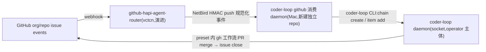
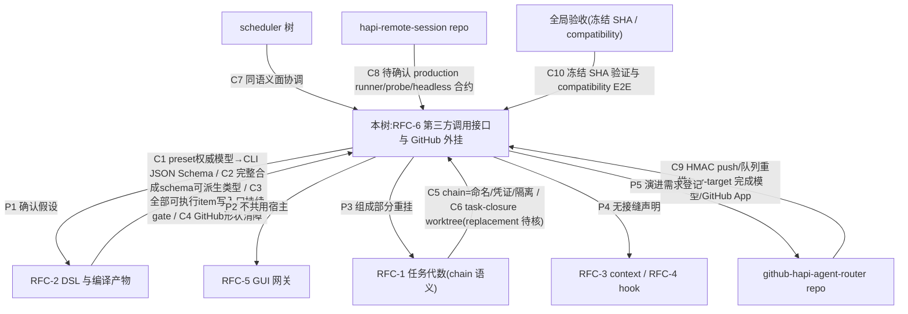

# AGG-548 — RFC #548 全局聚合(草稿)

- **源**:`v3-issue/synthesized/SYNTH-548-external-runner-router.md`(630 行);逐段去向登记见同目录 `extraction-inventory.md`。
- **目的**:剥离已损坏的 issue 边界,把本 RFC 的不变层(操作员输入、裁决、设计规格)与全部真实交付标准聚合成一个全局视图,供后续从零重拆任务。
- **原则**:只聚合、只标记,不裁决冲突、不重新诠释设计、不重拆任务。树外引用一律改写为能力依赖边(§5),issue/PR 编号在全文只作溯源批注,不承担依赖语义。`[L n]` 指源文件行号。

---

## §1 不可动摇输入(操作员 verbatim)

**V1**(2026-07-02,`v3/v3-goals.md` 目标 6)[L24]:

> "v3 我希望加入一种和 GitHub 耦合的可选功能,这个应该是外挂,而不是 coder loop 自己的原生功能。现在的 iac 存在监听 GitHub webhook 自动打开 agent session 去部署,v3 我想要有类似的能力。coder loop 自己预留第三方调用的机会以适应任何形态的外部系统。对于第三方 daemon 来说,传递的值不是某个 prompt,而是选定某个链,或者独立的 workspace,并且选择工作流程并提供元信息。"

**V2**(2026-06-10,#413 comment,v3 组成部分裁决)[L28]:

> "第一,item 可选在 hapi 端执行,第二,可以有一个独立的服务端作为 github app 监听任意的 org 的 webhook,然后本地的 daemon 用于消费,对于这种形态 preset 通常是专用的。"

**V3**(2026-06-11,#413 comment,hapi 通道架构约束)[L32]:

> "对于执行器是 hapi 而不是本地 agent,headless 协议会有较大冲突,需要有合适的抽象,要研究过三者的交互,hapi 走远端 http 交互,对于 github-hapi-agent-router 来说他是包了另一个 hapi open session 程序,把 http 调用包了起来,这个部分不要在 coder loop 自己做,因为 hapi 的交互 cli 可以是通用工具,这个 hapi cli 和 npm install -g hapi 的自带命令无关不要混淆。"

**V4**(2026-07-10,#548 设计修正 comment)[L500]:

> "他的核心目的是实现后是接口的验证,而不会出现抽象做了压根不知道抽象对不对,以及更核心的领域模型边界在哪"

---

## §2 裁决与核心设计(不变层)

### §2.1 裁决 A–I(2026-07-02 RFC-6 设计会话;I 为 2026-07-10 修正)[L43-53]

| # | 决策点 | 裁决 | 理由要点 |
|---|---|---|---|
| A | 调用面形态与信任边界 | 引擎原生面 = daemon socket;不长 HTTP、不长 token、不新增第三方主体类;每类外部系统一个本地消费 daemon 终结网络可达与外部鉴权;「本机 socket = operator」信任模型不变 | 与「GitHub 耦合做外挂不做原生」同构;iac 链路端到端验证过此形态;引擎零新增攻击面;故障隔离——coder-loop daemon 死时消费端回 not-consumed,router 队列自然重推 |
| B | 与 GUI 网关(RFC-5)的关系 | 不共用宿主 | 网关是观测+运维控制面(其 F 裁决明确排除创建类写动作);第三方 ingress 是创建类写入面;共用会把两条生命线耦合成一次故障、把 GitHub 知识带进 GUI 进程。对方「HTTP 面模块化可挂 route」的保证登记但不消费 |
| C | 「独立 workspace」语义 | 不引入新实体:= 新建一条 chain。调用语义两分支 `into-chain \| new-workspace`;不加引擎组合命令,外挂两步调用(chain.create 幂等 + item.add 唯一拒绝使部分失败重放安全) | RFC-1 已裁 chain = 命名/凭证/隔离边界,正是 workspace 要的三样;RFC-2 已清除建 chain 的 GitHub 形状障碍 |
| D | 工作流程选择、元信息与 schema | = per-item preset 引用 + preset field object；`required` 逐字段声明，旧字符串/对象语法默认 required，optional 显式 `required=false`；PATH CLI 输出由同一归一模型派生的真正 JSON Schema | schema document 与 compile projection instance 身份分离；engine-owned control keys 与 preset-owned business fields 各有权威子模型并合成为完整严格 schema |
| E | GitHub 外挂服务端 | 演进 `github-hapi-agent-router`,不新建:完成模型降为 per-target 策略(`detection-zone \| fire-and-forget`),coder-loop target 用 fire-and-forget;「任意 org」经其 README 既有 GitHub App scale path 承载。演进落 router repo,本 RFC 只登记需求 | 其路由策略本就多 target 泛型;detection zone 全局单槽是 iac 端无队列能力下的代偿——coder-loop 自己是队列引擎,排队/并发/完成(PR merge → issue close)是引擎与 preset 既有业务 |
| F | GitHub 消费 daemon | 新建独立 repo(`github-hapi-iac-daemon` 形态:NetBird 监听 + HMAC + delivery 幂等);消费面 = PATH 上的 `coder-loop` CLI,零 import 引擎源码;「label→preset、issue→itemId、chain 命名、repo→本地 checkout」映射配置全归消费端 | GUI 网关拿 monorepo 资格靠 events 直读特许面;消费 daemon 无任何特许需求,CLI 即 CLAUDE.md 钉过的稳定 API;GitHub 知识彻底不进 coder-loop repo |
| G | hapi 执行通道定位 | 留在本 RFC 作组成部分,不另立 RFC；HAPI HTTP/session 协议保持树外，current closure authority 保持唯一 | runner execution domain 可扩展为 external-terminal，但 production binary/probe/headless/session/loss 合约仍是事实阻塞，不能视为机械接入 |
| H | 引擎 origin 审计字段 | 登记为可选演进,不进 v3 验收 | 外挂日志 + delivery id 已构成审计闭环;引擎面能不动就不动 |
| I | hapi 通道实施时点与缺席前提(2026-07-10 修正 G 的 staged 安排) | hapi 实现是外部执行终端接入样板,随 v3 主线立即预建 issue、并行调查和准备;issue 创建不 gated on spike verdict,但实现合并与关闭仍严格依赖已验证的交互契约——实现本身就是 runner 抽象与领域模型边界的验证义务;前提:通道随时可能不存在是正常运行态,daemon 须有显式警告提醒路径(超越可达性检测),缺席 item warn + hold 不 fail-fast | 不实现就无从证伪「抽象对不对、领域边界在哪」;缺席伪装成 spawn 失败盲重试让操作员无从观察通道不在 |

> 批注:裁决 I 原文中预建 issue 的编号叙述(#602 / hrs#2 / #748 各自角色)与后续正文冲突,见洞 H9;编号本身按本文档原则不承担语义。

### §2.2 调用语义 [L59-67]

```
invocation ::= into-chain(chain 选择, item…)      -- 选定既有链,追加工作
             | new-workspace(chain 声明, item…)   -- 建新链(=独立 workspace)+ 播种工作
item       ::= itemId + preset 引用 + 元信息(该 preset 声明的 bindings / [item.fields])
```

- **校验三层** [L65]:外挂侧从 PATH CLI 取得真正的 JSON Schema（preset identity、完整合成 `extra`、字段类型、required、unknown-field policy 与可写性）并派生请求类型 → CLI/socket 精确边界 parse → 引擎对 `add`、`batch-add` 及所有改变 `extra` 的更新执行同一合成 schema gate。所有可执行 item 的新持久态必须合格。
- **幂等三层** [L66]:GitHub delivery id 去重归 router；`(chain,itemId)` 是规范工作身份，相同 identity 一律表示同一工作，already-existing 即工作已被接管；`chain.create` 同字段幂等。new-workspace 两步失败留下的空 active chain 是长期合法状态，不归属 delivery，也不证明 consumed/not-consumed。
- **chain 命名约定归外挂配置** [L67]——「记法便利归调用方工具」原则。

### §2.3 GitHub 外挂链路 [L71-80]



- **consumed 语义** [L79]:`item.add` 成功即 `consumed`(入队 = 接管);coder-loop daemon 不可达/拒绝 → `not-consumed` + blocker,router 保留队列重推。完成语义归引擎与 preset(fire-and-forget target 不占 router 槽)。
- **router 侧演进需求** [L80]:① 完成模型 per-target 化;② GitHub App source model。落 router repo,本 RFC 只登记(→ §5 C9/P5)。

### §2.4 hapi 执行通道 [L84-86]

- **协议边界** [L84]：HAPI 远端 HTTP/session 交互不在 coder-loop 内实现；树外 production runner 的 binary、readiness、headless terminal/status/session 合约仍待事实确认，不能预设退出码或 wire shape。
- **authority 边界** [L84]：external-terminal 必须绑定 current per-closure worktree/session/run authority；同一 closure 的 retry/restart/stop/resume/consume/cleanup 不得引入 slot/item 第二 owner。
- **交付边界** [L86]：终端缺席必须成为可恢复、可观察的 hold 而非盲 spawn backoff；但只有真实 invocation 与缺席/loss 路径共同通过才算闭环，probe-only、zero-spawn 与 `invocation_pending` 均不是完成。

---

## §3 交付标准池

骨架 = 伞的 7 条关闭终态条件 [L109-117]。各处散落的验收行、性质表述、负面清单全部挂载到对应终态;挂不上的入「横切标准」。条目 ID 中的 issue 编号仅作溯源锚点。

### T1 结构化调用两分支可达 [L111]

> 验证:外挂形态调用方对引擎执行 into-chain 与 new-workspace 各一次。Expect:既有链追加 item 成功;新链建立 + item 入队并被调度执行;全程无 prompt 传递。

| ID | 标准 | 溯源 |
|---|---|---|
| STD-746-1 | into-chain 分支:对映射到既有 chain 的 fixture 事件构造带合法 HMAC 的 POST,随后 `coder-loop status <target> --json`。Expect:响应 `consumed`;item 出现在该 chain 队列(`queue.total` 增一且新 itemId 可见);决策日志记录构造的 CLI 调用参数,其中无 prompt 内容字段。(env: local) | [L382] |
| STD-746-2 | new-workspace 分支:对映射到新链声明的 fixture 事件 POST;`coder-loop chain list` + `status --json`。Expect:新 chain 建立、item 入队且 `queue.selected` 可指向它。(env: local) | [L383] |
| P-746-1 | 性质·入队通路唯一性:消费 daemon 对 coder-loop 的一切写入经 PATH 上的 `coder-loop` CLI——零 import 引擎源码、零直连 socket、零直写 SQLite | [L366] |
| P-746-2 | 性质·两分支覆盖、零 prompt:映射配置能表达两分支;任何调用通路上不存在自由 prompt 字段——传递的只有 chain 选择、preset 引用、preset 声明的元信息字段 | [L367] |

### T2 请求校验面与可执行持久态不变量生效 [L112]

> 验证：公共 schema、创建/更新、startup reconciliation 与专用修复入口消费同一权威合成模型。Expect：所有可能再次执行的 item 始终符合当前 preset 的完整合成 schema；不合格历史 item durable 标记为不可启动且零调度/spawn。

| ID | 标准 | 溯源 |
|---|---|---|
| P-747-1 | PATH CLI 输出真正 JSON Schema；schema document 与 compile projection instance 身份分离。schema 表达 preset identity、engine-owned + preset-owned 完整 `extra`、字段类型、required、unknown-field policy 与字段可写性 | [L320-334]；D1/D8 |
| P-747-2 | preset field object 是 required 权威；旧 `field="string"` 与旧 `{type="string"}` 默认 required，optional 仅由 `required=false` 显式表达；loader、artifact 与校验共享归一模型 | D2 |
| P-747-3 | 消费端类型从 CLI schema 派生，不手写平行 shape；schema version 不符显式失败 | [L434-446]；D1 |
| P-747-4 | `item add`、`batch-add` 及所有改变 `extra` 的普通更新使用同一合成 schema；missing、unknown、type mismatch 与不可写 engine-owned 字段不能进入可执行 item 的新持久态 | D3/D8 |
| P-747-5 | CLI 公共错误是独立、无损、穷尽转换的 typed rejection ADT；不得以 socket envelope 或 `code: message` 文本冒充机器契约 | D4 |
| P-747-6 | daemon startup 扫描 active、stopped 与可 resume/retry 的 item；不合格者 durable 标注不可启动及原因，并排除调度/spawn。terminal 与 deleted-chain item 保持历史快照，重入可执行态前必须过同一 gate | D9/D10 |
| P-747-7 | 专用 operator CLI 在单一事务语义中原子替换目标现存 preset 与完整合成 `extra`；提交前全量校验，成功同时清除不可启动原因，失败不产生中间态 | D11 |
| STD-745 | **公共 schema 基础设施**：PATH CLI 输出可版本校验、可派生类型的真正 JSON Schema；projection instance 不得冒充 schema；artifact、loader 与全部写入/修复 gate 源自同一归一模型 | D1-D3/D8 |
| STD-747-A | 漏 required、unknown、类型不符、preset 不存在、不可写 engine 字段分别得到稳定 typed rejection variant 与必要细节；均无非法持久态 | D4/D8 |
| STD-747-B | startup fixture 含合法与非法可执行 item：合法者可调度；非法者 durable 不可启动、重启不丢原因且零 spawn；terminal/deleted 快照不被误标 | D9/D10 |
| STD-747-C | 对不可启动 item 原子替换 preset + 完整 `extra`：合法修复恢复调度资格；任一非法输入整笔拒绝且 preset/extra/标记均不产生半提交 | D11 |

### T3 幂等 [L113]

> 验证:同一 delivery id / 同一规范 `(chain,itemId)` 重放。Expect:already-existing 无损表达为工作已被接管，不产生第二个 item / 第二次执行；不同 delivery 若映射到相同 identity 也按同一工作处理。

| ID | 标准 | 溯源 |
|---|---|---|
| P-746-3 | 性质·规范身份与重放收敛:`(chain,itemId)` 是规范工作身份，不比较 payload、不增加 operation identity；already-existing 表示该工作已被接管。调用方负责稳定无碰撞映射 | [L368]；D5 |
| P-746-3A | new-workspace 的空 active chain 是长期合法状态；engine 不自动补种或删除，空 chain 不承载 delivery verdict，verdict/retry 由 router/消费 daemon 的独立记录给出 | D6 |
| STD-746-3 | 同一事件 POST 两次(模拟 router 重推同 delivery),比较两次响应与 `status --json` 队列。Expect:两次均 `consumed`;队列 item 总数不变(执行恰好一次归 T4 端到端观察) | [L384] |
| — | 设计前提:幂等三层(§2.2) | [L66] |

### T4 GitHub 事件端到端 [L114]

> 验证:labeled issue → router → 消费 daemon → 引擎 → preset 工作流。Expect:issue 最终被 PR close;一次触发恰好一次执行。

| ID | 标准 | 溯源 |
|---|---|---|
| STD-746-5(前半) | 端到端:fixture repo 真实 labeled issue → router → 消费 daemon → 引擎 → preset 工作流。Expect:issue 最终被 PR close;一次触发恰好一次执行。(env: 真实 GitHub + router + 本机引擎)**⚠ 先决「router 完成模型 per-target 化已落地」为树外交付(洞 H5,→ §5 C9)** | [L386] |

### T5 重试闭环 [L115]

> 验证:coder-loop daemon 停机时触发事件,随后恢复。Expect:not-consumed → router 保留重推 → 恢复后消费成功,事件不丢失。

| ID | 标准 | 溯源 |
|---|---|---|
| P-746-4 | 性质·verdict 忠实:`consumed` 当且仅当规范工作已入队/已存在；daemon 不可达或 typed reject → `not-consumed` + 结构化 blocker。空 chain 不参与 verdict 推导 | [L369]；D5/D6 |
| P-746-4A | engine 为每个请求持久化稳定 request identity 与 created / already-existing / rejected / no-op typed verdict，并明确该 record 与对应 mutation 的 durability/transaction 关系；消费端 delivery 日志以 request identity 关联，不以 best-effort event 代替 | D7 |
| STD-746-4 | 引擎停机 verdict:`coder-loop daemon stop` 后 POST,重启引擎后重放同一事件。Expect:停机时响应 `not-consumed` + 结构化 blocker;恢复后重放 `consumed` | [L385] |
| STD-746-5(后半) | 重试闭环:端到端期间制造一次引擎停机再恢复。Expect:停机期事件经 router 队列重推恢复消费,不丢失 | [L386] |

### T6 外挂纯度 [L116]

> 验证:grep coder-loop repo 与消费 daemon repo。Expect:引擎无 GitHub 外挂知识新增;消费 daemon 不 import coder-loop 源码,仅经 CLI。

| ID | 标准 | 溯源 |
|---|---|---|
| P-746-5 | 性质·映射知识独占:label→preset、issue→itemId 约定、chain 命名约定、repo→本地 checkout 路径,全部归消费 daemon 配置;coder-loop repo 零新增 GitHub 外挂知识 | [L370] |
| STD-746-6 | 外挂纯度:消费 daemon repo 依赖清单与 import 面无 coder-loop 源码引用(仅 spawn PATH 上 CLI);该交付的 closing PR 不落在 coder-loop repo;coder-loop repo 无该交付产生的改动 | [L387] |

### T7 hapi 通道能力与边界 [L117]

> **事实边界：** current per-closure authority 是 closure/run/worktree/session/reachability/consumption/cleanup 的唯一事实源；历史 slot/item owner 不得恢复。以下均为待真实 external-terminal 路径证明的目标语义，不是现状保证。production binary/probe/headless status/session/resume/endpoint identity/loss ordering/E2E/candidate gate 尚未具备证据；probe-only、zero-spawn 与 `invocation_pending` 不构成 production 完成。

> 验证目标：真实 item 通过已确认的 production runner 在真实远端 session 完成，并覆盖缺席、恢复与 active loss；所有运行事实绑定 current closure authority，机器 terminal/status/session 只按解锁后的外部合约观察。未取得该合约前，本段不规定子命令、退出码、status producer、session identity 或 resume 语义。

**原子性前提** [L162, L189-192]:缺席语义与真实 invocation 是不可拆分的单一交付。没有真实 hapi invocation 就不存在可验证的 active external-terminal run,运行中 loss/latch/recovery 只是不可达代码;没有 availability/hold/loss 语义,真实 invocation 又不具备「终端随时可能不存在」的正确运行模型。完成单位是从 runner 选择、probe、真实 invocation、远端 session、status 写回,到缺席、恢复与运行中 loss 的一个生产闭环。

#### 稳定目标与事实阻塞 [L194-248]

以下只固定不依赖未知 wire 的领域边界；production binary、probe、headless terminal/status/session、endpoint identity 与 loss ordering 必须由外部合约和真实运行事实解锁，不能由本文反向规定。

**稳定目标**

1. runner execution domain 以穷尽 ADT 区分 `local-process` 与 `external-terminal`；availability/推进不得散落 runner 名字特判。
2. coder-loop 不实现 HAPI HTTP、URL、auth、remote-response 或服务端 session 协议；真实远端交互终止于树外 runner CLI。
3. external-terminal 必须进入 current per-closure authority：`closure_id/run_id/runtime_node_id`、closure worktree/branch、closure session、reachability、consumption intent、cleanup 与 startup reconciliation 是唯一事实源。
4. endpoint 缺席应形成可恢复、可观察的 engine-owned hold/warning，并让同 repo 其他 runnable work 前进；缺席不得伪装成普通业务失败或盲 spawn backoff。
5. 只有真实 invocation、机器可读 terminal admission、retry/resume/cleanup 与真实 loss/race 路径通过后，才能声称 external-terminal 与本地 runner 在统一 attempt/result 边界同构。
6. production 不保留 `probe-only`、zero-spawn 或 `invocation_pending` 作为完成态；fake/test seam 不证明真实远端生命周期。

**尚待外部合约解锁的问题与观察清单**

| ID | 事实阻塞 | 解锁后必须观察；不是当前 wire 规格 |
|---|---|---|
| B-ET-1 | production runner binary/version 与无副作用 readiness 尚未确定 | binary/version/help/schema；readiness argv、cwd/env/config/profile；真实退出/信号/deadline 分类；证明 readiness 不创建 session；invocation argv 与取消边界 |
| B-ET-2 | headless terminal/status/session 合约不存在 | 同一 closure/run/runtime-node/phase 的 prompt、cwd、credential、session；status producer/schema/admission checkpoint；child exit 与业务 terminal 关系；fresh/resume 与 cleanup 结果 |
| B-ET-3 | endpoint identity key 未知 | 至少两个独立 endpoint/profile 的解析 identity；config/argv/env/machine/auth 变化对 hold/warning/restoration/loss 分组与迁移的影响 |
| B-ET-4 | terminal-first/loss-first 的 durable winner 未线性化 | terminal admission 与 loss decision 的 commit 点；两种先后、最窄竞争、crash/restart、并发 run 的唯一 winner且不翻转 |
| B-ET-5 | 真实 HAPI E2E 不可执行 | success、可判定 failure→retry、缺席→hold→restoration→真实执行、active loss、race、restart、并发及最终 closure cleanup 的逐 checkpoint 证据 |
| B-ET-6 | immutable candidate/live merge-base gate 未建立 | frozen candidate、live fetch、merge-base/ancestor、clean detached 双基线、typecheck/tests/integration 与 post-run cleanup |

#### 条件式验收清单

以下项目只有在 B-ET-1～4 的外部合约先成为事实后才可执行；验收观察不得反向定义 binary 子命令、固定退出码、status producer、session identity 或 endpoint key。

| ID | 检查 | 成立证据 |
|---|---|---|
| ET-A1 | 真实正常完成 | 真实 remote session 接收完整 prompt 与 current closure cwd；机器 terminal 经既定 admission 提交；item/phase 正确推进并最终按 current closure authority 清理 |
| ET-A2 | 创建/调度缺席与恢复 | 经真实 readiness 合约识别的缺席形成 durable hold/warning且零真实 invocation；同 repo 其他工作可前进；恢复后自动进入真实 invocation |
| ET-A3 | active loss 与 session 处置 | 已 active 的真实 run 发生 endpoint loss；credential、child、session、run/item 状态按已证线性化契约收敛；恢复后按合约 fresh/resume |
| ET-A4 | terminal/loss 竞争、restart 与并发 | terminal-first、loss-first、最窄竞争、crash/restart 与并发 run 各有唯一 durable 结果；不同 run 不互相覆盖 |
| ET-A5 | operator 读面 | status/log/durable facts 与真实 process/session/checkpoint 一致，且缺席、readiness failure、业务 failure、spawn failure、active loss 可区分 |
| ET-A6 | 协议与 authority 边界 | coder-loop 内无 HAPI wire/session-server 实现；无 slot/item 第二 owner；所有 lifecycle 证据绑定 current closure/run authority |
| ET-A7 | 本地 runner 回归 | local runners 的 invocation、missing-binary、spawn failure、attempt、resume 与 status 行为不变 |
| ET-A8 | frozen candidate gate | B-ET-6 manifest 完整，candidate 与 live merge-base 的验证和卫生审计可复现 |

#### 禁止用作完成证据

- `probe-only`、zero-spawn、`invocation_pending`、固定未证实的子命令/退出码或 endpoint key。
- unit/fake-only integration、内部 state 改写、历史 model override、engine integration 或 GitHub E2E 对真实 HAPI remote lifecycle 的替代。
- current closure authority 本身对 remote invocation、status/session、loss ordering 或 E2E 的替代；它只确定唯一 owner。
- 未冻结 candidate、未 live fetch 或仅凭空 diff 得出的 candidate 回归结论。
- 绕过机器 terminal admission，用 stdout 文本或 HAPI 私有响应推进 item。

#### 验证边界

- 真实业务 E2E 必须使用隔离 daemon/loop-data、已确认的 production runner 与真实 HAPI machine，覆盖 ET-A1～A5，并保存同一 immutable closure/run/session 的 status/log/SQLite/process/session checkpoint。
- 可控故障注入只能使用已由外部合约证明的 readiness/invocation seam，不能绕过 production invocation、scheduler/run ledger 或真实 remote session。
- typecheck、focused tests、完整 `bun test` 与 engine integration 只补充证明类型/本地 runner 回归，不替代真实业务 E2E。
- frozen candidate/live merge-base 综合验收只有在 B-ET-6 解锁后才可解释。

> 综合验收只复核已由真实外部合约解锁且在冻结 candidate 上可执行的条目；任一前置缺失即保持事实阻塞，不把验收表本身当作需求或 wire contract 来源。

#### 实现与证据要求 [L297-301]

- PR evidence 必须包含真实 HAPI E2E 的 setup、readiness、逐 checkpoint 行为、status/log/SQLite/process/session 观察、cleanup 与可复现命令;全部绑定同一 immutable candidate SHA。
- Web/browser 行不适用;此为 CLI/daemon/SQLite/remote-runner 路径。
- 验证结束后停止隔离 daemon/children,清除 socket、worktree、credential 与 recreatable runtime;不得触碰生产 `~/.coder-loop`。

### 横切标准(不挂任一终态行)

| ID | 标准 | 溯源 |
|---|---|---|
| STD-602-9 | 本地 runner 不回归:`bun install --frozen-lockfile && bun run typecheck && bun test && bun scripts/engine-integration.ts`(隔离 loop-data)。Expect:全部 exit 0;claude/codex/opencode 不执行 external-terminal probe,不改变既有 missing-binary/spawn failure 与 attempt/resume 行为;无 orphan runtime | [L292] |
| STD-602-10 | 完整测试与完整性卫生:`git fetch origin main`;在 candidate 与其 live merge-base 分别 `bun install --frozen-lockfile && bun test`,并审计 `$BASE..HEAD` test diff(clean detached worktrees)。Expect:两侧 exit 0;candidate 包含当前 `origin/main`;无删除/重命名/skip/todo/only/弱化既有测试;无 runtime/evidence/credential 文件进入 commit | [L293] |
| STD-746-7 / STD-747-7 | 消费 daemon repo 自身 typecheck + test 全绿 | [L388, L447] |
| LOG-746 | 消费 daemon 记录 deliveryId、repository、issue、映射、CLI 参数、verdict、blocker 与 engine request identity；engine 另有 durable、可关联的逐请求 typed record，并规定与 mutation 的事务/durability 关系。现有 best-effort JSONL events 仅作窄事实互证 | [L399-400]；D7 |
| LOG-747 | 预校验拒绝进入消费端 delivery 决策日志；若请求到达 engine，则 CLI typed rejection 与 engine durable request record 无损保留分类和细节，不用扁平文本或既有 events 替代 | [L458-459]；D4/D7 |
| P-746-6 | 事件→动作映射结果与 verdict 用穷尽 ADT 建模(union 加 variant 时编译器给出 worklist)——§4 红线在消费 daemon 侧的具体化 | [L371] |

> **骨架收敛：** STD-745 已作为 T2 的公共 schema 基础设施标准；D1-D4/D8-D11 共同定义 artifact、持续 gate、startup reconciliation、typed rejection 与原子修复的稳定保证。STD-602-9/10、STD-746-7/747-7 仍是横切验证卫生，不改变业务终态。

---

## §4 约束红线

- **ADT 代码红线**(操作员裁决 2026-06-12,全仓统一)[L102]:必须全链路 ADT,禁止任何类型退化。不引入 `any` / 匿名形状;`unknown` 仅限 catch 与边界 parse 入口;禁止真 `as` 断言(`as const` 除外);外部输入经边界 parse(arktype)为精确类型后流转;不得删除类型依赖、绕过或降级既有类型边界。违反红线 = changes requested,无例外。消费 daemon repo 同样适用。
- **最小且追溯的引擎改动原则**：引擎改动仅服务已裁稳定保证，包括外部终端闭环、公共合成 schema/持续 gate、startup 不可启动与原子修复、durable request record。不得以“低改动”删除 D1-D11 已确定的引擎义务，也不得扩入 GitHub 外挂知识。
- **范围外** [L121-124]:GUI 网关与观测面、任务代数、DSL 与编译产物定义、context CLI、hook 各归其 RFC;router repo 实现细节归其 repo issue,本 RFC 只登记需求;消费 daemon 的部署 IaC 归 IaC repo 惯例路径;#534 audit 树的 v2 缺陷并行不悖,不吸进范围。
- **umbrella 验证程序约束** [L128-131]:伞不直接运行测试,不以任一 implementation PR 的局部测试关闭;关闭需所有直接 children 达到各自声明的验证深度,跨 child 接缝与 bundled preset 兼容性归全局验收(→ §5 C10);不在 RFC 迭代中重复运行 `scripts/real-e2e.ts`,不把 compatibility E2E 绿解释成本 RFC 新语义已成立。

---

## §5 能力依赖边(跨树/跨 repo,单侧声明)

本树视角的单侧登记;对端核实与全局对账在所有 RFC 树各自聚合完成后进行。原文编号仅作溯源批注。

### 消费(本树依赖的树外能力)

| ID | 能力陈述 | 对端 | 原文编号(批注) | 溯源 |
|---|---|---|---|---|
| C1 | preset 权威归一模型提供 field type/required；本 RFC 的 PATH CLI 从该模型输出真正 JSON Schema，作为树外请求预校验面 | RFC-2 树 + 本树 CLI | #547 裁决 D；D1/D2 | [L48, L65, L90] |
| C2 | 可版本校验、可派生消费端类型的 CLI JSON Schema；与 compile projection 分离，覆盖完整合成 `extra` | 本树 CLI + preset 权威模型 | D1/D8 | [L338, L434, L445] |
| C3 | 引擎对所有可执行 item 写入口维持完整合成 schema 持久态不变量，并在 startup/修复/重入可执行态使用同一 gate | 本树 + RFC-2 权威模型 | D3/D8-D11 | [L48, L424] |
| C4 | chain 建立无 GitHub 形状障碍:`REPOSITORY_REF_PATTERN`、`chains.repository NOT NULL`、`DEFAULT_PRESET_NAME`、`normalizeQueueIssueId` 退役,repository 降为 binding 业务字段 | RFC-2 树 | #547 | [L39] |
| C5 | chain = 顶层 task + 命名/凭证/隔离边界(workspace 语义的全部依赖) | RFC-1 树 | #546 | [L39, L47, L92] |
| C6 | task-closure worktree 公理(同 `(item, phase)` attempt 链 retry/resume 复用既有 worktree,闭包 consumed 后回收)及其 replacement 实现 | RFC-1/scheduler 侧;replacement **对端待核**(编号无定义) | #546 公理;#699「replacement」 | [L84, L477, L558] |
| C7 | scheduler/task-tree 同语义面协调:后合者基于 current main reconcile 并重跑完整验收 | scheduler 树 | #559 | [L307] |
| C8 | **待满足的外部合约**：固定 production runner binary/version、无副作用 readiness probe、headless terminal/status/session/resume/cleanup 与 endpoint identity；HAPI HTTP/session 交互封装在 CLI 内。当前未找到满足该合约的 binary | `mouriya-s-lab/hapi-remote-session` / 外部 runner 载体待事实确认 | B-ET-1～3 | decision-external-terminal A2 |
| C9 | router 能力:webhook 验签、规范化事件 NetBird HMAC push、持久化队列保留与重推;演进需求:完成模型 per-target 化(coder-loop target 用 fire-and-forget)、GitHub App source model | `github-hapi-agent-router` repo | router#12 前置(内容待核);演进需求仅登记 | [L38, L49, L80, L386, L404] |
| C10 | 冻结 SHA 跨子系统组合验证、bundled preset / GitHub compatibility real E2E 由全局验收承载,本树不自行运行 | 全局验收(树外) | #684 / #685 | [L129-131, L278, L307] |

### 提供(本树对外的答复与承诺)

| ID | 能力陈述 | 对端 | 原文编号(批注) | 溯源 |
|---|---|---|---|---|
| P1 | 「工作流程选择」= preset 引用；preset 权威归一模型供本树 CLI 派生真正 JSON Schema，compile projection 不承担 schema 身份 | → RFC-2 树 | #547；D1/D2 | [L90] |
| P2 | 裁决 B:第三方 ingress 不与 GUI 网关共用宿主/协议面;对方「HTTP 面模块化可挂 route」保证登记不消费 | → RFC-5 树 | #544 | [L46, L91] |
| P3 | #413 组成部分 1/2(hapi 执行通道 + GitHub 外挂)的重挂由本 RFC 完成 | → RFC-1 树 | #546 | [L92] |
| P4 | 无接缝声明:context 工具与 hook 不进第三方调用面 | → RFC-3 / RFC-4 树 | #545 / #543 | [L93] |
| P5 | 向 router repo 登记演进需求(完成模型 per-target 化、GitHub App source model);本树只留指针不实现 | → router repo | — | [L80, L122] |



---

## §6 既有事实前提(已落地,非依赖)

| ID | 事实 | 溯源 |
|---|---|---|
| F1 | 外部触发入口现状只有 CLI→Unix socket(行 JSON、每请求一连接,`src/daemon.ts:3833-3864`);无 HTTP、无 webhook receiver | [L36] |
| F2 | 信任模型:本机 socket 无凭证调用 = operator 主体;agent 身份靠引擎自铸 env 凭证(#406);不存在第三方主体类 | [L36] |
| F3 | 结构化调用面已在:`chain.create`(name/preset/repository/baseBranch/metadata,`src/daemon.ts:396-403`)+ `item.add`(itemId + per-item preset + preset 声明 fields + dependsOn,`src/daemon.ts:404-429`) | [L37] |
| F4 | `chain.create` 同名同字段幂等返回既有链(`src/daemon.ts:1600-1608`);`(chain_id, item_id)` 唯一约束拒绝重复 add(`src/daemon.ts:2214-2215`)——幂等键天然存在 | [L37] |
| F5 | per-item preset 已落地(#412),是调用语义的基础 | [L37, L48] |
| F6 | 参考架构两端已在产:router(webhook 验签、多 target 路由、持久化队列 + push loop、NetBird HMAC push)+ iac-daemon(HMAC 校验 POST、clean-workspace gate、spawn 本地工具、consumed/not-consumed verdict);router 的 detection zone 是全局单槽(iac 串行部署专用,非通用) | [L38] |
| F7 | runner 现状是三元 ADT:`claude|codex|opencode`,SQLite CHECK + per-phase 声明(#481);均为本地进程 runner | [L84, L178] |
| F8 | current local-process runner 在所属 task closure worktree 执行，并有既有 run/status 完成路径；该事实不定义 external-terminal 的 headless producer、admission、session 或 child-exit 语义 | R7-09；decision-external-terminal B-ET-2 |
| F9 | 现状缺陷:引擎把 runner 不可用视为 spawn failure,进入盲指数 backoff(`src/scheduler.ts:1259`) | [L36 注, L183] |
| F10 | hapi 通道只有 spike/设计材料可作调查输入；未找到满足 production runner/probe/headless terminal/status/session 契约的 binary，不能据此主张通道可运行 | decision-external-terminal A2 |
| F10A | current main 的唯一 lifecycle authority 是 per-closure：closure/run/runtime node、worktree/branch、session、reachability、consumption intent、cleanup 与 startup reconciliation；slot/item owner 会形成第二事实源，不能恢复 | R7-09 |
| F10B | current local-process closure authority 不证明真实 HAPI invocation、active loss 或 terminal/loss ordering；这些仍须真实外部契约与运行证据 | R7-09 |
| F10C | 现有 engine JSONL events 是 best-effort、与 SQLite mutation 不同事务且写失败可被吞；不能证明逐请求 verdict/delivery 历史 | D7 事实输入 |
| F10D | 历史 `extra` 混有 preset business fields、engine control keys 与迁移残留，不能把旧 opaque `extra` 直接按 preset-only schema 判定 | historical-extra migration |
| F11 | `preset compile --json` 现状输出 projection instance(八个数据键),不 emit JSON Schema;live inspection `schema == null`、`jsonSchema == null` | [L327] |
| F12 | 精确 arktype 边界只以导出 TS symbols 形式存在于 `src/loop.ts:539-598`;`package.json:1-18` 标记 private、只暴露 CLI binary——无可供外部 repo 消费的 schema artifact | [L328] |

---

## §7 洞、冲突与未证明项

| ID | 描述 | 溯源 |
|---|---|---|
| H1 | 当前 CLI 尚不输出真正 JSON Schema，现有 projection instance 与私有 TS symbol 均不能满足 STD-745；D1-D4/D8-D11 的 artifact、持续 gate、startup reconciliation、typed rejection 与原子修复仍待运行证明 | F11/F12；D1-D4/D8-D11 |
| H2 | #602 与 #748 正文大面积逐字重复:L479-533 ≈ L158-293(目标/问题/预期结果/十行验收表);HAPI runner 验证义务双归属。另 L580-609 评论摘录与 #746/#747 的架构切片、log 义务章节逐字重复(仅编号替换) | [L479-533, L580-609] |
| H3 | #748 含两张验收表,第一张逐字复制 #602 的表;L542-554 又复制伞终态表且行 7 措辞与 L117 有差异(删去「#418 spike 结论」的落地要求)——同一终态条件出现两个不完全一致的版本 | [L520-533, L542-554] |
| H4 | 悬空/不一致引用:#549(树外无正文)、#699(无定义,仅「replacement」一词)、#737(落地状态未核)、router#12(内容未核);交互 CLI 实现载体两说——#602 依赖 hrs#2(依赖图中 CLOSED),#748 依赖 hrs#3(依赖图中 OPEN) | [L305, L338, L424, L404, L477, L558, L624, L628] |
| H5 | STD-746-5(T4/T5 端到端)带先决「router 完成模型 per-target 化已落地」,该先决是树外交付且本树只登记指针,无承载与状态核实手段 | [L386] |
| H6 | durable request record 的 schema、request identity 与 mutation 的线性化/事务边界尚无运行证据；existing events 不满足该保证 | D7 |
| H7 | 伞的 Closure depends on 列表(L136)与 sub-issue graph(L617-629)集合不一致(如 L136 含 hrs#2 不含 hrs#3,graph 中 hrs#3 OPEN) | [L136, L615-629] |
| H8 | 计数不自洽:L9 称 9 children 且 OPEN 5 / COMPLETED 0 / NOT_PLANNED 3(5+3=8≠9);graph 列 12 节点、其中 OPEN 6;#418/hrs#1/hrs#2 已 CLOSED 但未归类,第三节称「无 COMPLETED child」而 L135 称 #418「已完成」 | [L9, L135, L566-568, L615-629] |
| H9 | 交付单元角色两说:摘要(L18)、裁决 I(L53)、约束(L103)称 #748 =「hapi runner 接入样板」;L86 与 #602/#748 正文称 #602 拥有 hapi runner 接入(与缺席语义原子合并,PR #676 承载)、#748 = 冻结 SHA 综合验收。RFC 本体内新旧两套角色叙述并存 | [L18, L53, L86, L103, L477] |

---

## §8 开放问题(实现期裁,原文明示不臆断)

| ID | 问题 | 已有细化 | 溯源 |
|---|---|---|---|
| Q1 | 消费 daemon repo 命名、router config 中 coder-loop target 的具体形态 | repo owner 创建前按操作员 GitHub 账号路由规则确认(候选 owner 四选一;姊妹 repo 均在 `mouriya-s-lab`) | [L97, L375] |
| Q2 | fire-and-forget 下的 GitHub 侧回执(「已入队」comment 之类)——是否要、归哪端 | 若裁归 router 侧,需求登记到 router repo issue,不在消费 daemon repo 实现 | [L98, L376] |
| Q3 | production external-terminal binary/probe/headless status/session/endpoint identity/loss ordering/E2E/candidate gate | 全部保持事实阻塞；不得以 invocation-pending、zero-spawn、fake 或 current closure authority 冒充完成 | decision-external-terminal A |

---

## §9 覆盖对账

源文件 630 行的逐段类别与去向登记见同目录 `extraction-inventory.md`。汇总:

- **提取并收敛进本文档**：操作员 verbatim ×4（§1）；裁决 A–I 与 D1–D11 的稳定结果（§2/T2/T3/T5/LOG）；T7 current closure authority 与外部合约阻塞；红线、能力边、既有事实、洞及开放问题。
- **登记为洞/未证明项**：H1–H9（§7）；其中 H1/H6 已替换为 D1–D11 后仍需运行证明的真实缺口。
- **显式丢弃**:摘要、各 issue 的「问题/使用场景/架构切片」衍生叙事、#748 内粘贴自 #602 的重复块、L542-554 重复终态表、第五节评论摘录、NOT_PLANNED 历史摘要、树内依赖边与 sub-issue graph——每项的丢弃理由见 extraction-inventory.md 对应行。
