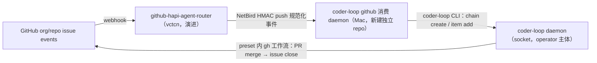

# SYNTH-#548 v3 第三方调用接口、外部 runner 与 GitHub router

> 本文档是**本地合成**，未写回 GitHub。依据 RFC #548 与其全部 sub-issue 合并而成。
> 来源：`v3-issue/issues/<N>/`（issue.json + comments.json + timeline.json + subissues.json）+ `v3-issue/design/`。

## 范围与组成

- **源 RFC**：#548 — RFC: v3 第三方调用接口与 GitHub 外挂——socket 原生契约 + 外挂消费 daemon
- **子 issue 总数**：9（OPEN 5 / CLOSED·COMPLETED 0 / CLOSED·NOT_PLANNED 3）
- **本合成 issue 编号**：`SYNTH-#548`（仅本地标识）

---

## 一、RFC 设计骨架（#548 原文）

## 摘要

v3 第三方调用面定为：**引擎不长网络、不长第三方主体类**——daemon socket 命令面（经 `coder-loop` CLI）就是第三方调用的正式契约。调用语义类型化为「选定既有 chain | 新建 workspace（= 新建 chain，不引入新实体）」×「工作流程选择（= per-item preset 引用）」×「元信息（= preset 声明的 fields/bindings）」，请求校验面对接 #547 编译产物。每类外部系统一个本地消费 daemon 终结网络可达与外部鉴权（`github-hapi-iac-daemon` 已验证形态）。GitHub 外挂 = `github-hapi-agent-router` 演进（完成模型 per-target 化 + GitHub App scale path）+ 新建独立 repo 的 coder-loop 消费 daemon。hapi 执行通道（#413 组成部分「item 可选在 hapi 端执行」）留在本 RFC 范围：#413 三条已裁约束续命，#418 → mouriya-s-lab/hapi-remote-session#1 依赖链重挂为本 RFC children；实现线按裁决 I（2026-07-10）预建——#602（外部终端缺席语义与警告路径）、mouriya-s-lab/hapi-remote-session#2（CLI 实现）、#748（hapi runner 接入样板）。

## 操作员输入（verbatim）

目标源（操作员，2026-07-02，`v3/v3-goals.md` 目标 6）：

> "v3 我希望加入一种和 GitHub 耦合的可选功能，这个应该是外挂，而不是 coder loop 自己的原生功能。现在的 iac 存在监听 GitHub webhook 自动打开 agent session 去部署，v3 我想要有类似的能力。coder loop 自己预留第三方调用的机会以适应任何形态的外部系统。对于第三方 daemon 来说，传递的值不是某个 prompt，而是选定某个链，或者独立的 workspace，并且选择工作流程并提供元信息。"

v3 组成部分裁决（操作员，2026-06-10，#413 comment）：

> "第一，item 可选在 hapi 端执行，第二，可以有一个独立的服务端作为 github app 监听任意的 org 的 webhook，然后本地的 daemon 用于消费，对于这种形态 preset 通常是专用的。"

hapi 通道架构约束（操作员，2026-06-11，#413 comment）：

> "对于执行器是 hapi 而不是本地 agent，headless 协议会有较大冲突，需要有合适的抽象，要研究过三者的交互，hapi 走远端 http 交互，对于 github-hapi-agent-router 来说他是包了另一个 hapi open session 程序，把 http 调用包了起来，这个部分不要在 coder loop 自己做，因为 hapi 的交互 cli 可以是通用工具，这个 hapi cli 和 npm install -g hapi 的自带命令无关不要混淆。"

## 定位事实

- 外部触发入口现状只有 CLI→Unix socket（行 JSON、每请求一连接，`src/daemon.ts:3833-3864`）；无 HTTP、无 webhook receiver（`v3/survey-engine-daemon.md` §8）。信任模型：本机 socket 无凭证调用 = operator 主体，agent 身份靠引擎自铸 env 凭证（#406）——**不存在第三方主体类**。
- 结构化调用面已在：`chain.create`（name/preset/repository/baseBranch/metadata，`src/daemon.ts:396-403`）+ `item.add`（itemId + per-item preset（#412）+ preset 声明 fields + dependsOn，`src/daemon.ts:404-429`）。`chain.create` 同名同字段幂等返回既有链（`src/daemon.ts:1600-1608`）；`(chain_id, item_id)` 唯一约束拒绝重复 add（`src/daemon.ts:2214-2215`）——幂等键天然存在。
- 参考架构两端已在产：`github-hapi-agent-router`（vctcn：webhook 验签、多 target 路由策略、持久化队列 + push loop、NetBird HMAC push）+ `github-hapi-iac-daemon`（Mac：HMAC 校验 POST、clean-workspace gate、spawn 本地工具、consumed/not-consumed verdict）。router 的 detection zone 是**全局单槽**（"The detection zone holds at most one inflight task"，其 `src/detection-zone.ts:5-8`）——iac 串行部署的专用完成策略，非通用。
- 姊妹裁决已清除的障碍：#547 裁 `REPOSITORY_REF_PATTERN` + `chains.repository NOT NULL` 退役（repository 降为 binding 业务字段）、`DEFAULT_PRESET_NAME` 退役、`normalizeQueueIssueId` 退役（「记法便利归调用方工具」）；#546 裁 chain = 顶层 task + 命名/凭证/隔离边界。

## 裁决记录（操作员，2026-07-02，RFC-6 设计会话）

| # | 决策点 | 裁决 | 理由要点 |
|---|---|---|---|
| A | 调用面形态与信任边界 | 引擎原生面 = daemon socket；不长 HTTP、不长 token、不新增第三方主体类；每类外部系统一个本地消费 daemon 终结网络可达与外部鉴权；「本机 socket = operator」信任模型不变 | 与「GitHub 耦合做外挂不做原生」同构；iac 链路端到端验证过此形态；引擎零新增攻击面；故障隔离——coder-loop daemon 死时消费端回 not-consumed，router 队列自然重推 |
| B | 与 #544 网关的关系 | 不共用宿主 | 网关是观测+运维控制面（其 F 裁决明确排除创建类写动作）；第三方 ingress 是创建类写入面；共用会把两条生命线耦合成一次故障、把 GitHub 知识带进 GUI 进程。#544「HTTP 面模块化可挂 route」的保证登记但不消费 |
| C | 「独立 workspace」语义 | 不引入新实体：= 新建一条 chain。调用语义两分支 `into-chain \| new-workspace`；不加引擎组合命令，外挂两步调用（chain.create 幂等 + item.add 唯一拒绝使部分失败重放安全） | #546 已裁 chain = 命名/凭证/隔离边界，正是 workspace 要的三样；#547 已清除建 chain 的 GitHub 形状障碍 |
| D | 工作流程选择与元信息 | = per-item preset 引用（#412）+ preset 声明 fields/required bindings；确认 #547 接口假设：`preset compile --json` 编译产物是外挂侧请求预校验面 | #547 裁决 D 已把 required 校验前移创建期——第三方漏字段在 item add 即拒，不会 spawn 后才炸 |
| E | GitHub 外挂服务端 | 演进 `github-hapi-agent-router`，不新建：完成模型降为 per-target 策略（`detection-zone \| fire-and-forget`），coder-loop target 用 fire-and-forget；「任意 org」经其 README 既有 GitHub App scale path 承载。演进落 router repo，本 RFC 只登记需求 | 其路由策略本就多 target 泛型（其 `src/types.ts:13-31` targets 表）；detection zone 全局单槽是 iac 端无队列能力下的代偿——coder-loop 自己是队列引擎，排队/并发/完成（PR merge → issue close）是引擎与 preset 既有业务 |
| F | GitHub 消费 daemon | 新建独立 repo（`github-hapi-iac-daemon` 形态：NetBird 监听 + HMAC + delivery 幂等）；消费面 = PATH 上的 `coder-loop` CLI，零 import 引擎源码；「label→preset、issue→itemId、chain 命名、repo→本地 checkout」映射配置全归消费端 | #544 网关拿 monorepo 资格靠 events 直读特许面；消费 daemon 无任何特许需求，CLI 即 CLAUDE.md 钉过的稳定 API；GitHub 知识彻底不进 coder-loop repo |
| G | hapi 执行通道定位 | 留在本 RFC 作组成部分，不另立 RFC；#413 三条已裁约束原文续命；#418 → hapi-remote-session#1 依赖链原样续命并重挂为本 RFC children | 骨架已裁定（CLI 边界/独立 repo/runner binary 收敛），剩 spike 验证；#481 后 runner 已是三元 ADT，加第四 kind 是机械扩展 |
| H | 引擎 origin 审计字段 | 登记为可选演进，不进 v3 验收 | 外挂日志 + delivery id 已构成审计闭环；引擎面能不动就不动 |
| I | hapi 通道实施时点与缺席前提（操作员 2026-07-10，修正 G 的 staged 安排） | hapi 实现是外部执行终端接入样板，随 v3 主线立即预建 issue、并行调查和准备；issue 创建不 gated on spike verdict，但实现合并与关闭仍严格依赖 #418 → hapi-remote-session#1 的已验证契约——实现本身就是 runner 抽象与领域模型边界的验证义务；前提：通道随时可能不存在是正常运行态，daemon 须有显式警告提醒路径（超越可达性检测），缺席 item warn + hold 不 fail-fast | 不实现就无从证伪「抽象对不对、领域边界在哪」；缺席伪装成 spawn 失败盲重试让操作员无从观察通道不在（`src/scheduler.ts:1259`） |

## 核心设计

### 调用语义

```
invocation ::= into-chain(chain 选择, item…)      -- 选定既有链，追加工作
             | new-workspace(chain 声明, item…)   -- 建新链（=独立 workspace）+ 播种工作
item       ::= itemId + preset 引用 + 元信息（该 preset 声明的 bindings / [item.fields]）
```

- 校验三层：外挂侧用 `preset compile --json` 产物预校验（字段名/类型/required，错误带 delivery id 在外挂侧可审计地拒绝）→ CLI/socket 边界 parse → 引擎创建期 required 完备性校验（#547 裁决 D）兜底。
- 幂等三层：GitHub delivery id 去重归 router（既有）；itemId 约定（如 `owner/repo#N`）+ `(chain, itemId)` 唯一约束兜底重放；`chain.create` 同字段幂等。
- chain 命名约定归外挂配置——与 #547「记法便利归调用方工具」同一原则。

### GitHub 外挂架构



- 消费 daemon 的 consumed 语义：`item.add` 成功即 `consumed`（入队 = 接管）；coder-loop daemon 不可达/拒绝 → `not-consumed` + blocker，router 保留队列重推。完成语义归引擎与 preset（fire-and-forget target 不占 router 槽）。
- router 侧演进需求（落 router repo 的 issue，本 RFC 只登记）：① 完成模型 per-target 化；② GitHub App source model（其 README 既有 scale path）。

### hapi 执行通道（G 裁决展开）

#413 三条约束续命：HAPI 远端 HTTP 交互不在 coder-loop 内实现；通用交互 CLI 归 `mouriya-s-lab/hapi-remote-session`；coder-loop 对 hapi 通道的全部感知收敛为「又一个 runner binary」（退出码 + `status.json` headless 契约）。#418 spike 新增两条 v3 输入：① #546 独立 worktree 公理——远端 session 必须绑定任务闭包既有 worktree：同一 `(item, phase)` attempt 链的 retry/resume 复用，闭包 consumed 后才回收；② runner 扩展点现状是三元 ADT（`claude/codex/opencode`，#481 SQLite CHECK + per-phase 声明），spike 结论须回答第四 kind 的接入形态。

裁决 I（2026-07-10）落地：实现线预建为三个 children；#418 spike 与 hapi-remote-session#1 设计书不 gate children 创建，但继续 gate 实现合并与关闭。依赖链：#418 → hapi-remote-session#1 → hapi-remote-session#2（CLI 实现）→ #602（真实 hapi 调用 + 外部终端缺席语义，两腿已合并为单一原子交付单元，由 PR #676 承载）；冻结 SHA 综合验收归 #748。缺席语义：外部执行终端 runner 随时可能不存在，缺席 item warn + hold（可恢复，不 fail-fast），不进 spawn 失败盲 backoff，警告在 events/status 显式可观察——设计展开归 #602。

## 接口假设（跨 RFC 接缝）

- **答复 #547（RFC-2）**：确认其待确认假设——「工作流程选择」= preset 引用，`preset compile --json` 编译产物是第三方调用的请求校验面（消费端：外挂预校验）。
- **答复 #544（RFC-5）**：裁决 B——第三方 ingress 不与 GUI 网关共用宿主/协议面；其「HTTP 面模块化可挂 route」保证登记不消费。
- **对 #546（RFC-1）**：无新需求；调用语义直接消费其「chain = 顶层 task/命名/凭证/隔离边界」裁决。#413 组成部分 1/2 的重挂由本 RFC 完成（children 见依赖关系）。
- **对 #545（RFC-3）/ #543（RFC-4）**：无接缝——context 工具与 hook 不进第三方调用面。

## 开放问题（实现期裁，本 RFC 不臆断）

- 消费 daemon repo 命名、router config 中 coder-loop target 的具体形态。
- fire-and-forget 下的 GitHub 侧回执（「已入队」comment 之类）——是否要、归哪端。

## 约束

- **代码红线（操作员裁决 2026-06-12，全仓 issue 统一）**：必须全链路 ADT，禁止任何类型退化。不引入 `any` / 匿名形状；`unknown` 仅限 catch 与边界 parse 入口；禁止真 `as` 断言（`as const` 除外）；外部输入经边界 parse（arktype）为精确类型后流转；不得删除类型依赖、绕过或降级既有类型边界。违反红线 = changes requested，无例外。消费 daemon repo 同样适用。
- 引擎低改动原则：本 RFC 引擎侧必改项收敛为两个（裁决 I）——外部执行终端缺席语义与警告路径（#602）、hapi runner 接入（#748）；除此之外引擎面能不动就不动（repository 泛化等前置归 #547），裁决 H 的 origin 审计字段仍为可选演进不进 v3。

## 关闭验证

RFC 体裁：钉终态条件，具体命令由实现 children 落地时具体化为可逐字重跑的操作步骤。

| # | 终态条件 | 验证 | Expect |
|---|---|---|---|
| 1 | 结构化调用两分支可达 | 外挂形态调用方对引擎执行 into-chain 与 new-workspace 各一次 | 既有链追加 item 成功；新链建立 + item 入队并被调度执行；全程无 prompt 传递 |
| 2 | 请求校验面生效 | 元信息漏 required 字段 / preset 引用不存在的调用 | 外挂预校验或引擎创建期拒绝，错误点名缺失字段；无 spawn 后才失败的通路 |
| 3 | 幂等 | 同一 delivery id / 同一 itemId 重放 | 不产生第二个 item / 第二次执行 |
| 4 | GitHub 事件端到端 | labeled issue → router → 消费 daemon → 引擎 → preset 工作流 | issue 最终被 PR close；一次触发恰好一次执行 |
| 5 | 重试闭环 | coder-loop daemon 停机时触发事件，随后恢复 | not-consumed → router 保留重推 → 恢复后消费成功，事件不丢失 |
| 6 | 外挂纯度 | grep coder-loop repo 与消费 daemon repo | 引擎无 GitHub 外挂知识新增；消费 daemon 不 import coder-loop 源码，仅经 CLI |
| 7 | hapi 通道能力与边界 | 两腿同归 #602 原子交付：① 一个真实 item 以 runner=hapi 在真实 HAPI 远端 session 完成 run；② 通道缺席时 daemon 显式警告 + item hold，恢复后无人工干预执行；冻结 SHA 复核归 #748；#418 spike 结论与 hapi-remote-session#1 设计书落地 | 退出码 / `status.json` / per-task-closure worktree 生命周期与其他 runner 同构；同一闭包的 retry/resume 复用既有 cwd，consumed 后才回收；警告在 events/status 可观察且区分于瞬时故障；coder-loop 内无 HAPI HTTP 客户端 |

## 范围外

- GUI 网关与观测面——#544。任务代数——#546。DSL 与编译产物定义——#547。context CLI——#545。hook——#543。
- router repo 的实现细节——其 repo 自己的 issue 承载，本 RFC 只登记需求。
- 消费 daemon 的部署 IaC——归 IaC repo 惯例路径。
- #534 audit 树的 v2 缺陷——并行不悖，不吸进范围。

## 本 issue 的验证边界

- **验证层级**：本 RFC umbrella 不直接运行测试，也不以任一 implementation PR 的局部测试关闭。
- **关闭所需证明**：所有直接 children 达到各自正文声明的验证深度；跨 child 的 v3 新语义接缝由 #684 在冻结合流 SHA 上证明；现有 bundled preset 兼容性由 #685 在发布候选 SHA 上证明。
- **不在本 issue 内执行**：不在 RFC 迭代中重复运行 `scripts/real-e2e.ts`，不把 compatibility E2E 绿解释成 `RFC: v3 第三方调用接口与 GitHub 外挂——socket 原生契约 + 外挂消费 daemon` 的新语义已经成立。
- **现有 GitHub real E2E**：本 issue 不运行 `bun scripts/real-e2e.ts`；该 compatibility 验证只由 #685 在冻结发布候选 SHA 上执行。
## 依赖关系

- Relates to: #546（#413 替代方；组成部分 1/2 划归本 RFC 的来源）、#547（编译产物 = 请求校验面）、#544（宿主不共用，对接其登记项）、#412（per-item preset 是调用语义基础）。
- Children（sub-issues）: #418（hapi 通道 spike，已完成）、mouriya-s-lab/hapi-remote-session#1（通用 CLI 设计书）、#745（compile schema artifact 分发）、#746（GitHub 事件消费 daemon）、#747（router 请求预校验）、#602（真实 hapi 调用 + 外部终端缺席语义，原子交付）、#748（外部 router 与 HAPI runner 冻结 SHA 综合验收）、mouriya-s-lab/hapi-remote-session#2（CLI 实现）。
- Closure depends on: #745、#746、#747、#418、mouriya-s-lab/hapi-remote-session#1、#602、#748、mouriya-s-lab/hapi-remote-session#2；这些 children/外部实现线完成后，本 umbrella 才执行关闭验证。umbrella 不阻塞 children 开工；router 演进需求登记在 router repo，本 RFC 只留指针。


---

## 二、当前实现 children（OPEN，当前 spec）

### #602 外部执行终端 runner 的缺席语义与 daemon 显式警告路径

- state: **OPEN** | author: `RiriAgent` | created: 2026-07-10
- 关联: referenced `1d09c41d35c5`, referenced `76d2e2f0ab71`, referenced `3f856eda5fd8`, referenced `7b71372230f2`, referenced `21ba3690b5ce`, referenced `b959904e383b`, referenced `1c0d08531296`, referenced `044ed3589700`

## 必须先读的关联 issue

- #548（RFC-6 umbrella，parent）。本 issue 继承以下已经裁定的边界：
  - HAPI 远端 HTTP 交互不进入 coder-loop；通用交互 CLI 归 `mouriya-s-lab/hapi-remote-session`。coder-loop 对 HAPI 通道的感知收敛为 runner binary、probe、退出码、`status.json` 与工作目录契约。
  - hapi 必须作为首个真实「外部执行终端」样板落地，用实现和真实运行验证抽象，不能先做无法被真实执行证伪的抽象。
  - 全链路使用精确 ADT：禁止新增 `any`、匿名形状、非边界 `unknown` 与真 `as` 断言（`as const` 除外）；外部输入在边界解析为精确类型后流转。
- #418 与 `mouriya-s-lab/hapi-remote-session#1`：HAPI 交互调查及 headless CLI 消费契约。
- `mouriya-s-lab/hapi-remote-session#2`：coder-loop 要实际 spawn 的 CLI 实现。

## 目标

把「外部执行终端随时可能不存在」与「真实 hapi runner 执行」作为一个不可拆分的闭环交付：`hapi` 进入 runner 词表；daemon 在创建、调度和运行中检测终端可用性；缺席时显式 warning + hold；恢复后自动执行；执行时通过 `hapi-remote-session` 完成真实远端 session；运行中通道消失时，以独立 loss 语义终止、恢复并重新调度。

本 issue 同时完成原 #602 与 #603 的全部范围。二者不能分阶段完成：没有真实 hapi invocation，就不存在可验证的 active external-terminal run，运行中 loss/latch/recovery 只是不可达代码；没有 availability/hold/loss 语义，真实 hapi invocation 又不具备“终端随时可能不存在”的正确运行模型。

## 使用场景

操作员在 preset phase 或 item 上声明 `runner = "hapi"` 后离开：

1. HAPI 通道当前缺席时，item 的 durable intent 被接受并进入 hold；daemon 不创建 worktree/run/credential，不增加 attempt，也不进入 `spawn_failed` backoff。操作员从 `status --json` 和 `logs --json` 直接看到缺席原因及受影响 item。
2. 通道恢复后，daemon 无需 `queue unblock` 或 item mutation，自动 spawn `hapi-remote-session`，在该任务的既有 worktree 中启动或恢复远端 session，并按退出码与 `status.json` 推进队列。
3. active HAPI run 期间通道消失时，daemon 对该 run 记录 durable loss、撤销 credential、受控终止 runner、恢复 run 前 item 状态与 attempt，并在通道恢复后以 fresh invocation 重新调度。
4. 操作员通过与本地 runner 一致的 `current.runner`、`phaseRunners`、run/status/log 读面观察完整生命周期，同时能明确区分 endpoint 缺席、probe 故障、runner 业务失败和运行中终端丢失。

## 上下文

- **Repo**：`mouriya-s-lab/coder-loop`（path：`/Users/mouriya/Ext/code/coder-loop`）。
- **当前实现 PR**：#676。继续使用其现有 branch/PR；最终可合并 revision 必须覆盖本 issue 的完整原子范围。
- **当前问题来源**：#676 已证明原拆分不可执行。若 `hapi` 被建模为 `probe-only / invocation-pending`，生产 scheduler 会在 worktree/run/attempt/credential 之前永久停止，因此 active-run loss 逻辑没有任何生产入口；用 fake runner、测试注入或直接构造 active state 只能验证内部函数，不能证明真实产品闭环。
- **runner 基线**：`claude | codex | opencode` 是本地进程 runner；`hapi` 是首个外部执行终端 runner。四者共享调度、attempt/result、status 和观察面；external-terminal availability/loss 是执行域差异，不是 hapi 名字特判。
- **headless 完成契约**：runner 在所属任务闭包的 worktree 内执行；完成由进程退出码和 `<logDir>/<runId>/<phase>/status.json` 表达；同一 `(item, phase)` attempt 链的 retry/resume 复用既有闭包，闭包 consumed 后才回收。

## 问题

现有引擎只把 runner 不可用视为 spawn failure，并进入盲指数 backoff。对外部执行终端而言，缺席是正常、可恢复的运行状态，不是瞬时 spawn 故障；该状态必须在调度前被发现并在 operator 读面显式呈现。

同时，外部终端抽象不能脱离真实 hapi invocation 单独完成。probe、hold、loss latch、credential revoke、TERM/KILL、status race、session invalidation 和 recovery 都依赖同一个真实 active run 身份。若 availability/loss 与 invocation/session/status 被拆到两个 issue：

- 前半部分只能制造一个永远停在 `invocation-pending` 的 runner，无法验证运行中消失；
- 后半部分又依赖前半部分定义 active-run gate、loss 和恢复语义；
- 两边互相依赖，任何一边都不能通过端到端 runtime 验收；
- 大量不可达的 speculative machinery 会先进入 main，直到后续 issue 才首次经真实输入运行。

因此完成单位必须是从 runner 选择、probe、真实 invocation、远端 session、status 写回，到缺席、恢复与运行中 loss 的一个生产闭环。

## 已裁定的完整运行语义

### Runner 领域与 HAPI 边界

- runner execution domain 是穷尽 ADT：`local-process` 与 `external-terminal`。
- `claude | codex | opencode` 属于 `local-process`；`hapi` 属于 `external-terminal`，且在本 issue 完成态必须可真实 invocation，不得保留 `probe-only / invocation-pending` 作为最终生产状态。
- scheduler/daemon 的 availability 决策只消费 execution-domain ADT，不出现 `runner.kind === "hapi"` 等名字特判。
- coder-loop 只知道 hapi runner binary、启动参数、probe 子命令、退出码、`status.json`、worktree 与进程生命周期；不得引入 HTTP client、HAPI URL/auth/remote response parsing 或服务端 session 生命周期实现。
- `hapi-remote-session` 负责远端 HTTP/session 交互；coder-loop 通过统一 runner invocation 与 headless 结果契约消费它。

### Probe 契约

- 调用已解析 runner binary 的字面量 `probe` 子命令。
- exit `0`：available。
- exit `69`（`EX_UNAVAILABLE`）：endpoint unavailable。
- binary 无法执行：binary missing。
- 其他非零退出、signal 或 deadline：probe failed，不能伪装成正常 endpoint 缺席。
- probe 不读取 stdout JSON，不创建 worktree/run/credential/artifact，不接触 HAPI HTTP 协议。
- probe 进程服从 daemon 的受控 TERM/grace/KILL 机制和显式 deadline。

### 创建与调度

- 创建期接受 durable item，不因终端缺席回滚 item 创建；创建后立即形成 engine-owned hold 与 warning。
- 每次候选调度在 worktree、run ID、run ledger/current-run、attempt、credential、session、prompt/artifact 和 runner process 之前执行 availability gate。
- unavailable/probe-failed item 释放 repo slot，scheduler 继续选择同 repo 其他 runnable item；不能造成队首饥饿。
- 缺席不改变 preset status，不增加 attempt，不写 scheduler backoff。
- available 后直接进入完整真实 hapi invocation，不经过永久 `invocation-pending` 中间态。
- 恢复后下一次 tick 自动清 hold、发一次 restoration event，并启动真实 runner；不需要人工解卡。

### 真实 HAPI invocation

- daemon 按统一 runner 管线 spawn `hapi-remote-session`，传入本次 phase 的完整 rendered prompt、任务 worktree、run/status 位置、resume decision 与所需授权。
- hapi run 的完成、失败、retry、resume、status admission 与 worktree 回收遵守其他 runner 的统一 attempt/result 边界；不得新增 hapi 专属队列推进路径。
- 同一 `(item, phase)` attempt 链可恢复同一远端 session；运行中终端 loss 后清除该 session identity，恢复时必须 fresh invocation，不能 resume 已失联 session。
- `status --json` 必须准确报告 hapi runner/model、当前 run、availability 和 loss；`status.json` 是业务结果事实源，普通 stdout 文本或 HAPI 私有响应不能旁路推进状态。

### 运行中终端消失

- 仅 active external-terminal run 周期 probe。
- 第一次从 available 进入 unavailable/probe-failed 时，以不可覆盖的 per-run durable latch 决定 loss 归因，并立即撤销该 run credential。
- loss latch 以 immutable `run_id` 为权威，不能使用 chain-singleton 投影承载；同一 chain 不同 repo slot 的并发 run 必须独立。
- latch 后按既有进程组语义 SIGTERM，grace 后仍存活则 SIGKILL。
- latch 前已成功提交的 terminal status 胜出；terminal commit 与 probe/warning 的 await race 不得被后来的 loss 覆盖。
- loss 先胜出时，后续 status write 或普通 child exit 不得把它改写成业务失败/成功。
- close 时清 current-run/slot/credential/session，恢复 run 前 item status、phase、status timestamp 与 attempts；不进入 `spawn_failed` backoff。
- daemon 重启后必须从 durable per-run facts 继续完成 loss recovery，不得丢失归因或留下 stale hold/current run。

### Warning、去重与读面

- availability 状态按解析后的 endpoint identity（runner kind + binary + probe argv）管理，而不是按 tick 或 item 管理。
- `unknown|available -> unavailable|probe-failed` 发一次 typed `daemon.warning`；同状态重复 probe 不刷屏；reason 改变是新跃迁。
- `unavailable|probe-failed -> available` 发一次 typed restoration diagnostic。
- warning payload 至少包含 code、runner、binary、probe argv、typed reason、exit/signal、checkedAt 及受影响 `{chainId,rowId,itemId,phase}`。
- `queue.holds[]` 列出全部当前受影响 item；runner 更新、本地 runner 切换、terminal completion 与恢复都必须清除失效 hold。
- `current.externalTerminal` 对 active external run 暴露当前 availability 与 loss；endpoint 缺席、probe failed、runner business failure、spawn failure 和 external-terminal loss 在 wire 上互不混淆。

## 预期结果

1. `runner=hapi` 从 item 创建到真实远端 session 完成形成一个可运行闭环，队列按 `status.json` 正确推进。
2. 创建期、调度期和运行中三档可用性语义均通过同一个真实 hapi runner 路径验证；不存在只在 fake/test seam 可达的 loss 逻辑。
3. 终端缺席时 item durable hold、无 spawn/attempt/backoff；恢复后自动真实执行。
4. active HAPI run 期间终端消失时，per-run loss、credential revoke、受控终止、状态恢复、session invalidation 与重新调度全部可观察。
5. terminal-first、loss-first、并发 repo-slot run 与 daemon restart 的竞态结果确定且 durable。
6. operator 从 `status --json` / `logs --json` 获取完整 typed availability/hold/restoration/loss 信息，不需要从 spawn-failure 日志推断。
7. coder-loop 不包含 HAPI HTTP/session 协议实现；触碰位置形成可核对的外部执行终端接入边界清单。
8. 本地 runner 的 invocation、missing-binary、spawn failure、attempt、resume 与 status 行为不变。

## 不应残留

- 不得保留 `hapi` 的最终 `probe-only / invocation-pending` 生产状态。
- 不得保留只能由 test fixture、隐藏 override、路径/名字/extraArgs 约定或直接构造内部 state 才能触达的 active-run loss 路径。
- 不得把 endpoint 缺席送入 `spawn_failed` 盲 backoff。
- 不得按 hapi kind 名在 scheduler/daemon 散落 availability 或推进特判。
- 不得在 coder-loop 中实现 HAPI HTTP、URL、auth、remote response 或服务端 session 管理。
- 不得绕过 `status.json` 以 stdout 文本或私有 HAPI 响应推进 item。
- 不得留下 terminal item stale hold、恢复后 stale warning、每 tick warning spam、held item 阻塞同 repo 后续 runnable item。
- 不得以 unit test、fake-only integration、`scripts/engine-integration.ts` 或现有 GitHub real E2E 代替真实 HAPI remote session E2E。
- 不得修改 `hapi-remote-session` CLI 本体；其实现归 `mouriya-s-lab/hapi-remote-session#2`。

## 验证边界

- **必须执行的业务 E2E**：真实 coder-loop daemon + 隔离 loop-data + 真实 `hapi-remote-session` + 真实 HAPI machine，覆盖正常完成、创建/调度缺席恢复、active-run loss、terminal-first、loss-first、restart 与并发 run。
- **可控故障注入**：可以控制 probe 返回 missing/69/nonzero/signal/deadline，也可以控制真实 runner 进程的 terminal/loss 竞态；但不能绕过生产 invocation capability、生产 scheduler/daemon/run ledger 或真实 HAPI session 来制造通过。
- **内部回归 gate**：typecheck、focused tests、完整 `bun test`、`scripts/engine-integration.ts` 只能补充证明 schema/类型/本地 runner 未回归，不替代业务 E2E。
- **不在本 issue 内执行**：`bun scripts/real-e2e.ts` 的 bundled preset / GitHub compatibility 由 #685 在冻结 release-candidate SHA 上执行；#684 负责冻结 SHA 的跨子系统组合验证。

## 验收标准

| # | Dimension | Check | Command | Env | Expect |
|---|---|---|---|---|---|
| 1 | integration | 覆盖预期结果 1、7：真实 hapi 正常完成 | 用 repository-owned HAPI E2E driver 启动隔离 daemon，创建 `runner=hapi` item 并等待真实远端 session 完成 | local + 真实 HAPI machine + 已安装 `hapi-remote-session` | runner 收到完整 prompt/worktree/status 契约；真实 session 完成；`status.json` 被 admission；item/phase 正确推进；领域边界记录只包含 binary/headless 契约触点 |
| 2 | integration | 覆盖预期结果 2、3、6：创建/调度缺席与恢复 | 同一 E2E 生命周期依次使 binary missing、probe exit 69、其他非零、signal、deadline，再恢复 endpoint | 同上 | 每种 typed reason 正确；hold/warning 可见且去重；零 worktree/run/attempt/credential/backoff；恢复只发一次 restoration，并自动进入真实 HAPI invocation |
| 3 | integration | 覆盖预期结果 2、4：active-run loss-first | 真实 HAPI run 已 active 且 credential/status admission 已确认后使 endpoint 消失，再恢复 | 同上 | per-run loss latch、credential revoke、TERM/grace/KILL、session 清理、pre-run tuple/attempt 恢复可见；恢复后 fresh invocation 完成；无普通 spawn backoff |
| 4 | integration | 覆盖预期结果 4、5：terminal-first 与 await race | 在真实 active run 中让 terminal `status.json` admission 与 loss probe/warning 交错执行 | 同上 | 已持久化 terminal status 胜出；无 loss 覆盖、stale hold 或重复 warning；run 正常 close |
| 5 | integration | 覆盖预期结果 4、5：daemon restart recovery | loss latch 持久化后、进程关闭前重启隔离 daemon | 同上 | 新 daemon 从 durable run fact 完成 credential/session/current/slot/item 恢复，loss 归因不丢失，恢复后可重新调度 |
| 6 | integration | 覆盖预期结果 5：并发 repo-slot 隔离 | 同一 chain 在两个 repo slot 启动两个真实 external-terminal run，只使其中一个 endpoint/run 丢失 | 同上 | loss 以各自 `run_id` 独立归因；另一 run 不被覆盖、终止或错误恢复 |
| 7 | function | 覆盖预期结果 6：operator 读面 | 在验收 1–6 每个 checkpoint 保存 `coder-loop status <target> --json` 与 `logs --json` | 同上 | `queue.holds[]`、`current.externalTerminal`、warning/restoration/loss payload 与实际 SQLite/run/process 状态一致 |
| 8 | environment | 覆盖预期结果 7：HAPI 协议边界 | 对最终 diff 与引擎目录执行 HTTP/URL/auth/remote-response/session-server 概念审计，并列出 hapi 触碰位置 | local | coder-loop 内零 HAPI 协议实现；全部触点可归类为词表、execution domain、probe、invocation、worktree/status、observability |
| 9 | function | 覆盖预期结果 8：本地 runner 不回归 | `bun install --frozen-lockfile && bun run typecheck && bun test && bun scripts/engine-integration.ts` | local isolated loop-data | 全部 exit 0；claude/codex/opencode 不执行 external-terminal probe，不改变既有 missing-binary/spawn failure 与 attempt/resume 行为；无 orphan runtime |
| 10 | function | 完整测试与完整性卫生 | `git fetch origin main`; 在 candidate 与其 live merge-base 分别执行 `bun install --frozen-lockfile && bun test`，并审计 `$BASE..HEAD` test diff | clean detached worktrees | 两侧 exit 0；candidate 包含当前 `origin/main`；无删除/重命名/skip/todo/only/弱化既有测试；无 runtime/evidence/credential 文件进入 commit |

## 实现与证据要求

- 继续现有 PR #676；不要用第二个 PR 分别关闭 #602/#603。
- PR body 第一行只关闭 #602；所有实现、验证与 runtime evidence 绑定同一 immutable candidate SHA。
- PR evidence 必须包含真实 HAPI E2E 的 setup、readiness、逐 checkpoint 行为、status/log/SQLite/process/session 观察、cleanup 与可复现命令。
- Web/browser 行不适用；本 issue 是 CLI/daemon/SQLite/remote-runner 路径。
- 验证结束后停止隔离 daemon/children，清除其 socket、worktree、credential 与 recreatable runtime；不得触碰生产 `~/.coder-loop`。

## 依赖关系

- Depends on：`mouriya-s-lab/hapi-remote-session#2`（可执行 CLI）、#418 与 `mouriya-s-lab/hapi-remote-session#1`（交互与 headless 契约）。
- Coordination：#559（scheduler/task-tree 同语义面，后合者基于 current main reconcile 并重跑完整验收）。
- Blocks：#548 关闭验证行 7；#684 冻结 SHA 跨子系统验证；#685 bundled preset / GitHub compatibility。
- #603 的全部需求已并入本 issue，不再是 #602 的 dependency，也不能作为独立半闭环完成。


### #745 feat(engine): preset compile schema artifact 分发

- state: **OPEN** | author: `RiriAgent` | created: 2026-07-17

## 必须先读的关联 issue

继承 [#548](https://github.com/mouriya-s-lab/coder-loop/issues/548) 的共享契约与关闭验证。

## 目标

为外部 consumer 发布可版本化、可派生类型的 schema artifact；projection instance 不得冒充 schema。

## 问题

- [#747](https://github.com/mouriya-s-lab/coder-loop/issues/747) prohibits a hand-written projection shape and requires the new consumer repo's types to be imported/generated from the `preset compile --json` schema.
- [#746](https://github.com/mouriya-s-lab/coder-loop/issues/746) simultaneously requires the external daemon to have zero coder-loop source imports and interact only through the CLI.
- Current `coder-loop preset compile ... --json` outputs a **projection instance** with eight data keys; it does not emit JSON Schema or another schema artifact. Live inspection returned `schema == null` and `jsonSchema == null`.
- The precise arktype boundaries exist only as exported TS symbols inside `src/loop.ts:539-598`. `package.json:1-18` marks coder-loop private and exposes only the CLI binary—there is no package export or published schema artifact for the new repo to consume.

Core defect: #747's only allowed integration channel (CLI JSON) carries values, not the schema required to derive a consumer type. Therefore the issue can pass only by hand-writing/inferencing a parallel shape, importing forbidden coder-loop source, or adding an unowned schema-distribution mechanism. None satisfies its own contract.

## 预期结果

本 issue 交付 #747 所需的真实 schema 分发契约——CLI 输出 JSON Schema，或独立版本化的可消费 package/artifact——而不是把 projection instance 当作可派生 schema。

## 依赖关系

- Depends on: #549。
- Blocks: #747。


### #746 feat(router): GitHub 事件到 coder-loop CLI 的独立消费 daemon

- state: **OPEN** | author: `RiriAgent` | created: 2026-07-17

## 必须先读的关联 issue

继承 [#548](https://github.com/mouriya-s-lab/coder-loop/issues/548) 的共享契约与关闭验证。

## 目标

交付独立 router product 与真实事件 E2E。

新建独立 repo 落地 GitHub 消费 daemon：接收 `github-hapi-agent-router` 的 HMAC push（规范化 issue 事件），按映射配置转译为 coder-loop CLI 的 `into-chain | new-workspace` 结构化调用，返回 `consumed | not-consumed` verdict。

## 问题

> "外部触发入口现状只有 CLI→Unix socket（行 JSON、每请求一连接，`src/daemon.ts:3833-3864`）；无 HTTP、无 webhook receiver" — #548 定位事实

GitHub 事件今天无法自动变成 coder-loop 队列工作；iac 链路（router → `github-hapi-iac-daemon`）已端到端验证消费 daemon 形态，但 coder-loop 侧的对应消费端不存在。裁决 F 已裁定承载体：新建独立 repo，不进 coder-loop、不进 router。

## 预期结果

性质表述：

1. **入队通路唯一性**：本 daemon 对 coder-loop 的一切写入都经 PATH 上的 `coder-loop` CLI——零 import 引擎源码、零直连 socket、零直写 SQLite。CLI 即契约（coder-loop CLAUDE.md 钉定的 stable API）。
2. **两分支覆盖、零 prompt**：映射配置能表达 `into-chain`（既有链追加）与 `new-workspace`（声明新链 + 播种）两分支；任何调用通路上不存在自由 prompt 字段——传递的只有 chain 选择、preset 引用、preset 声明的元信息字段。
3. **重放收敛**：对任意前缀失败的调用序列，同一事件重放收敛到与单次成功相同的终态——`chain.create` 幂等、`item.add` already-exists 按 `consumed` 处置（入队 = 接管的既成事实）、其余失败 → `not-consumed` 交 router 重推。
4. **verdict 忠实**：`consumed` 当且仅当 item 实际入队（或已在队）；coder-loop daemon 不可达 / 拒绝 → `not-consumed` + 结构化 blocker。
5. **映射知识独占**：label→preset、issue→itemId 约定、chain 命名约定、repo→本地 checkout 路径，全部归本 daemon 配置；coder-loop repo 零新增 GitHub 外挂知识。
6. 事件→动作映射结果与 verdict 用穷尽 ADT 建模（union 加 variant 时编译器给出 worklist）。

### 显式决策项（RFC 开放问题分配，落地时裁，裁决留本 thread）

- **repo 命名**：落地时定。repo owner 创建前按操作员 GitHub 账号路由规则确认（候选 owner 四选一；姊妹 repo router / iac-daemon / hapi-remote-session 均在 `mouriya-s-lab`）。
- **fire-and-forget 下的 GitHub 侧回执**（「已入队」comment 之类）：是否要、归哪端。若裁归 router 侧，需求登记到 router repo issue，不在本 repo 实现。

## 验收标准

| # | Dimension | Check | Command | Env | Expect |
|---|---|---|---|---|---|
| 1 | function | into-chain 分支（RFC 行 1 前半） | 对映射到既有 chain 的 fixture 事件构造带合法 HMAC 的 POST；随后 `coder-loop status <target> --json` | local | 响应 `consumed`；item 出现在该 chain 队列（`queue.total` 增一且新 itemId 可见）；决策日志记录构造的 CLI 调用参数，其中无 prompt 内容字段 |
| 2 | function | new-workspace 分支（RFC 行 1 后半） | 对映射到新链声明的 fixture 事件 POST；`coder-loop chain list` + `status --json` | local | 新 chain 建立、item 入队且 `queue.selected` 可指向它 |
| 3 | function | 重放收敛（RFC 行 3） | 同一事件 POST 两次（模拟 router 重推同 delivery）；比较两次响应与 `status --json` 队列 | local | 两次均 `consumed`；队列 item 总数不变（执行恰好一次归行 5 端到端观察） |
| 4 | function | verdict 忠实：引擎停机 | `coder-loop daemon stop` 后 POST；重启引擎后重放同一事件 | local | 停机时响应 `not-consumed` + 结构化 blocker；恢复后重放 `consumed` |
| 5 | integration | 端到端 + 重试闭环（RFC 行 4、5；先决：router 完成模型 per-target 化已落地） | fixture repo 真实 labeled issue → router → 本 daemon → 引擎 → preset 工作流；期间制造一次引擎停机再恢复 | 真实 GitHub + router + 本机引擎 | issue 最终被 PR close；一次触发恰好一次执行；停机期事件经 router 队列重推恢复消费，不丢失 |
| 6 | assumption | 外挂纯度（RFC 行 6） | 本 repo：检查依赖清单与 import 面对 coder-loop 的引用；本 child 的 closing PR 不落在 coder-loop repo | local | 依赖清单与 import 均无 coder-loop 源码引用（仅 spawn PATH 上 CLI）；coder-loop repo 无本 child 产生的改动 |
| 7 | environment | 类型与测试 | 本 repo typecheck + test | local | 全绿 |

## 架构切片

1. **系统定位**：#548 核心设计外挂链路的第三部件（GitHub → router → **消费 daemon** → coder-loop daemon）。协议面词汇：它是两个既有稳定契约面之间的翻译进程——对 router 是 push target（consumed/not-consumed 合同），对 coder-loop 是又一个 CLI 调用方（operator 主体）；不拥有任何一侧的语义，只拥有映射表。
2. **全局坐标**：外网事件域（GitHub webhook，router 已验签）→ mesh HMAC 信任域（router push，本 daemon 验签）→ 本机 operator 信任域（CLI→socket）。parse 点两处：进程入口的 HMAC 验签 + 事件 schema 边界 parse；出口是 CLI 参数构造（引擎侧 socket 边界再 parse 一次）。
3. **类型↔值不漂移**：防类型泄露——GitHub 事件词表（label / issue number / repo fullName）终结在本 daemon 的映射配置，不得泄进 coder-loop 引擎类型；防值漂移——映射配置是唯一翻译表，事件字段不绕过映射直接透传成引擎参数。
4. **消除的错误类别**：「外部系统向引擎注入自由 prompt / 任意指令」不可表达（调用面只有结构化字段）；「GitHub 知识渗入引擎 repo」不可表达（翻译发生在引擎 repo 之外，RFC 行 6 grep 可证）。

## log/观测义务

- 本 daemon 每个决策写一行结构化 JSON 日志（对齐 router / iac-daemon 既有形态）：deliveryId、repository、issue、映射结果（分支 + chain + preset + 构造的 CLI 参数）、verdict、blocker。受众是 agent 与操作员排障，结构化优先。
- coder-loop 引擎侧零新增事件义务：chain.create / item.add 的既有审计事件（每条 mutation 1-3 条）已覆盖入队审计；裁决 H 的 origin 字段是登记在 #548 的可选演进，不进本 child。

## 依赖关系

- Depends on: router 项目的既有 #12 前置。
- Blocks: #747、#748。


### #747 feat(router): 使用 compile schema 预校验请求

- state: **OPEN** | author: `RiriAgent` | created: 2026-07-17

## 必须先读的关联 issue

继承 [#548](https://github.com/mouriya-s-lab/coder-loop/issues/548) 的共享契约与关闭验证。

## 目标

只从公开 schema artifact 派生 consumer 类型；禁止手写平行 shape 或导入 private source。

消费 daemon 在触发任何引擎调用前，用 `preset compile --json` 编译产物对请求做预校验（preset 存在、字段名、类型、required），失败请求带 delivery id 在外挂侧可审计地拒绝。

## 问题

#746 基线下，消费 daemon 只能把畸形请求转给引擎、靠引擎拒绝：错误落在引擎侧审计流，外挂侧（带 delivery id）缺可审计的拒绝环；且 #737 落地前引擎对 preset 声明字段名 / required 不校验（上下文引证），畸形元信息会入队、spawn 后才在渲染期暴露——正是 RFC 行 2 要求封死的通路：

> "元信息漏 required 字段 / preset 引用不存在的调用 → 外挂预校验或引擎创建期拒绝，错误点名缺失字段；无 spawn 后才失败的通路" — #548 关闭验证行 2

## 预期结果

性质表述：

1. **准入前置**：一切引擎调用前的请求先过编译产物校验；未过校验的请求不产生任何 `chain create` / `item add` 调用。
2. **拒绝结构化**：点名缺失字段 / 未声明字段 / 类型不符 / preset 不存在，携带 delivery id，可从 daemon 日志审计。
3. **schema 派生**：消费端类型从产物 schema 派生（#549 性质 2 的消费端义务）——不手写平行 shape；`schemaVersion` 不符 → 显式失败，不静默降级。
4. **加速失败不替代兜底**：预校验通过而引擎仍拒绝时，正确回 `not-consumed`（引擎创建期校验保持兜底地位）。

## 验收标准

| # | Dimension | Check | Command | Env | Expect |
|---|---|---|---|---|---|
| 1 | function | 漏 required 字段拒绝（RFC 行 2） | 构造缺 required 字段的 fixture push——在 coder-loop daemon **停机**状态下执行，证明拒绝不经引擎 | local | 拒绝响应点名缺失字段；daemon 日志行含 deliveryId + 违规明细；引擎停机也照常给出该拒绝（零引擎调用的判别面） |
| 2 | function | preset 不存在拒绝 | 映射到不存在 preset 名的 fixture push | local | 同行 1 形态，点名 preset 引用 |
| 3 | function | 类型不符拒绝 | 字段值类型与产物声明不符的 fixture push | local | 同行 1 形态，点名字段与期望类型 |
| 4 | function | 合法请求无误杀 | 完整合法 fixture push（引擎运行中）；`coder-loop status <target> --json` | local | 过预校验、入队 `consumed`（#746 验收行 1 的通路不回归） |
| 5 | assumption | schema 派生、无平行 shape | 检查消费端类型来源：类型定义 import/生成自产物 schema 的证据（构建脚本或 import 链） | local | 不存在手写重复 shape 文件；类型源头唯一 |
| 6 | assumption | schemaVersion 失配显式失败 | 经测试 seam 喂 `schemaVersion` 提高过的产物 fixture | local | 显式错误终止该请求处理（拒绝或 `not-consumed`），不静默继续 |
| 7 | environment | 类型与测试 | 本 repo typecheck + test | local | 全绿 |

## 架构切片

1. **系统定位**：消费 daemon 入口管线的准入级——#746 的「事件翻译（映射）→ 引擎调用」两级之间新增预校验级，准入词表来自 #549 编译产物（preset 定义态投影）。
2. **全局坐标**：mesh HMAC 域内、引擎调用前的最后一道边界——「翻译后的结构化请求」对照「preset 定义态契约」。校验点在消费 daemon 进程内；语料经 `preset compile --json` 取自引擎 typed 域投影，不逆向 preset 语义。
3. **类型↔值不漂移**：防值漂移——请求字段与 preset 声明脱节（漏 required / 未声明字段 / 类型不符）在入队前暴露；防类型泄露——消费端类型从产物 schema 派生，不手写平行 shape（#549 性质 2 消费端义务）。
4. **消除的错误类别**：「畸形元信息 spawn 后才在渲染期炸」在本通路不可表达；「外挂侧无对应审计的引擎侧拒绝」消失（拒绝带 delivery id 落外挂日志）。

## log/观测义务

- 预校验拒绝写结构化 JSON 日志行：deliveryId + 违规明细（字段 / 类型 / preset），与 #746 决策日志同流同形态。
- 引擎侧零新增事件义务（预校验不触达引擎）。

## 依赖关系

- Depends on: #745、#746。
- Blocks: #748。


### #748 test(v3): 外部 router 与 HAPI runner 冻结 SHA 综合验收

- state: **OPEN** | author: `RiriAgent` | created: 2026-07-17

## 必须先读的关联 issue

继承 [#548](https://github.com/mouriya-s-lab/coder-loop/issues/548) 的共享契约与关闭验证。

## 目标

以 corrected atomic #602/PR #676 为 HAPI runner owner；hapi runner 接入不再单列为独立 issue，与外部终端缺席语义合并交付。task-closure worktree/resume/consume 验收硬依赖 #699 replacement。

把「外部执行终端随时可能不存在」与「真实 hapi runner 执行」作为一个不可拆分的闭环交付：`hapi` 进入 runner 词表；daemon 在创建、调度和运行中检测终端可用性；缺席时显式 warning + hold；恢复后自动执行；执行时通过 `hapi-remote-session` 完成真实远端 session；运行中通道消失时，以独立 loss 语义终止、恢复并重新调度。

本 issue 同时完成外部终端缺席语义与 hapi runner 接入的全部范围。二者不能分阶段完成：没有真实 hapi invocation，就不存在可验证的 active external-terminal run，运行中 loss/latch/recovery 只是不可达代码；没有 availability/hold/loss 语义，真实 hapi invocation 又不具备“终端随时可能不存在”的正确运行模型。

把 hapi 外部执行终端的执行路径接入引擎调度（spawn `hapi-remote-session` CLI 作为 runner binary），并以一次真实远端 session run 验证 runner 抽象与领域模型边界——本 issue 是「外部执行终端」类别的接入样板。

## 问题

现有引擎只把 runner 不可用视为 spawn failure，并进入盲指数 backoff。对外部执行终端而言，缺席是正常、可恢复的运行状态，不是瞬时 spawn 故障；该状态必须在调度前被发现并在 operator 读面显式呈现。

同时，外部终端抽象不能脱离真实 hapi invocation 单独完成。probe、hold、loss latch、credential revoke、TERM/KILL、status race、session invalidation 和 recovery 都依赖同一个真实 active run 身份。若 availability/loss 与 invocation/session/status 被拆到两个 issue：

- 前半部分只能制造一个永远停在 `invocation-pending` 的 runner，无法验证运行中消失；
- 后半部分又依赖前半部分定义 active-run gate、loss 和恢复语义；
- 两边互相依赖，任何一边都不能通过端到端 runtime 验收；
- 大量不可达的 speculative machinery 会先进入 main，直到后续 issue 才首次经真实输入运行。

因此完成单位必须是从 runner 选择、probe、真实 invocation、远端 session、status 写回，到缺席、恢复与运行中 loss 的一个生产闭环。

runner 抽象（退出码 + `status.json` + per-task-closure worktree）迄今只被三个本地进程 runner 检验过，从未承载过远端长驻 session 形态的执行终端。抽象对不对、引擎与外部执行终端的领域边界在哪，没有实现就无法证伪：

> 「他的核心目的是实现后是接口的验证，而不会出现抽象做了压根不知道抽象对不对，以及更核心的领域模型边界在哪」 — 操作员（2026-07-10，#548 设计修正 comment）

## 预期结果

1. `runner=hapi` 从 item 创建到真实远端 session 完成形成一个可运行闭环，队列按 `status.json` 正确推进。
2. 创建期、调度期和运行中三档可用性语义均通过同一个真实 hapi runner 路径验证；不存在只在 fake/test seam 可达的 loss 逻辑。
3. 终端缺席时 item durable hold、无 spawn/attempt/backoff；恢复后自动真实执行。
4. active HAPI run 期间终端消失时，per-run loss、credential revoke、受控终止、状态恢复、session invalidation 与重新调度全部可观察。
5. terminal-first、loss-first、并发 repo-slot run 与 daemon restart 的竞态结果确定且 durable。
6. operator 从 `status --json` / `logs --json` 获取完整 typed availability/hold/restoration/loss 信息，不需要从 spawn-failure 日志推断。
7. coder-loop 不包含 HAPI HTTP/session 协议实现；触碰位置形成可核对的外部执行终端接入边界清单。
8. 本地 runner 的 invocation、missing-binary、spawn failure、attempt、resume 与 status 行为不变。

性质表述：

1. 引擎对 hapi kind 的全部知识 = binary 名 + 启动参数约定 + 退出码 + `status.json` + per-task-closure worktree 注入 + #602 的外部终端声明；grep 引擎源码无 HTTP client、session 生命周期等 HAPI 协议概念。
2. 四个 runner kind 在类型层穷尽（union + 穷尽 switch + SQLite CHECK）；hapi 不引入任何 scheduler 特判分支——差异终止于统一的 attempt/result 边界。
3. 样板义务：实现 PR 触碰的全部位置构成「接入一个外部执行终端引擎需要知道什么」的实证清单，落本 issue comment 作领域边界记录——这是后续任何外部执行终端接入的模板。
4. runner=hapi 的 item 与其他 runner 的 item 在队列推进、resume、终止语义上同构，无 hapi 专属推进路径。

## 验收标准

| # | Dimension | Check | Command | Env | Expect |
|---|---|---|---|---|---|
| 1 | integration | 覆盖预期结果 1、7：真实 hapi 正常完成 | 用 repository-owned HAPI E2E driver 启动隔离 daemon，创建 `runner=hapi` item 并等待真实远端 session 完成 | local + 真实 HAPI machine + 已安装 `hapi-remote-session` | runner 收到完整 prompt/worktree/status 契约；真实 session 完成；`status.json` 被 admission；item/phase 正确推进；领域边界记录只包含 binary/headless 契约触点 |
| 2 | integration | 覆盖预期结果 2、3、6：创建/调度缺席与恢复 | 同一 E2E 生命周期依次使 binary missing、probe exit 69、其他非零、signal、deadline，再恢复 endpoint | 同上 | 每种 typed reason 正确；hold/warning 可见且去重；零 worktree/run/attempt/credential/backoff；恢复只发一次 restoration，并自动进入真实 HAPI invocation |
| 3 | integration | 覆盖预期结果 2、4：active-run loss-first | 真实 HAPI run 已 active 且 credential/status admission 已确认后使 endpoint 消失，再恢复 | 同上 | per-run loss latch、credential revoke、TERM/grace/KILL、session 清理、pre-run tuple/attempt 恢复可见；恢复后 fresh invocation 完成；无普通 spawn backoff |
| 4 | integration | 覆盖预期结果 4、5：terminal-first 与 await race | 在真实 active run 中让 terminal `status.json` admission 与 loss probe/warning 交错执行 | 同上 | 已持久化 terminal status 胜出；无 loss 覆盖、stale hold 或重复 warning；run 正常 close |
| 5 | integration | 覆盖预期结果 4、5：daemon restart recovery | loss latch 持久化后、进程关闭前重启隔离 daemon | 同上 | 新 daemon 从 durable run fact 完成 credential/session/current/slot/item 恢复，loss 归因不丢失，恢复后可重新调度 |
| 6 | integration | 覆盖预期结果 5：并发 repo-slot 隔离 | 同一 chain 在两个 repo slot 启动两个真实 external-terminal run，只使其中一个 endpoint/run 丢失 | 同上 | loss 以各自 `run_id` 独立归因；另一 run 不被覆盖、终止或错误恢复 |
| 7 | function | 覆盖预期结果 6：operator 读面 | 在验收 1–6 每个 checkpoint 保存 `coder-loop status <target> --json` 与 `logs --json` | 同上 | `queue.holds[]`、`current.externalTerminal`、warning/restoration/loss payload 与实际 SQLite/run/process 状态一致 |
| 8 | environment | 覆盖预期结果 7：HAPI 协议边界 | 对最终 diff 与引擎目录执行 HTTP/URL/auth/remote-response/session-server 概念审计，并列出 hapi 触碰位置 | local | coder-loop 内零 HAPI 协议实现；全部触点可归类为词表、execution domain、probe、invocation、worktree/status、observability |
| 9 | function | 覆盖预期结果 8：本地 runner 不回归 | `bun install --frozen-lockfile && bun run typecheck && bun test && bun scripts/engine-integration.ts` | local isolated loop-data | 全部 exit 0；claude/codex/opencode 不执行 external-terminal probe，不改变既有 missing-binary/spawn failure 与 attempt/resume 行为；无 orphan runtime |
| 10 | function | 完整测试与完整性卫生 | `git fetch origin main`; 在 candidate 与其 live merge-base 分别执行 `bun install --frozen-lockfile && bun test`，并审计 `$BASE..HEAD` test diff | clean detached worktrees | 两侧 exit 0；candidate 包含当前 `origin/main`；无删除/重命名/skip/todo/only/弱化既有测试；无 runtime/evidence/credential 文件进入 commit |

| # | Dimension | Check | Command | Env | Expect |
|---|---|---|---|---|---|
| 1 | integration | 真实 item 以 runner=hapi 完成一次 run（#548 关闭验证行 7 腿①） | 隔离 daemon（`--loop-data-root`）建 chain + item 指定 runner=hapi，观察全程 | local + 真实 HAPI machine | run 完成并推进队列；退出码 / `status.json` / per-task-closure worktree 生命周期与其他 runner 同构；同一闭包 retry/resume 复用既有 cwd，consumed 后才回收；`status --json` 读面正确报告 runner/model |
| 2 | integration | 缺席语义在真实 hapi kind 上生效（行 7 腿②联动） | 使 CLI 不可用后触发调度，再恢复 | 同上 | #602 定义的显式警告 + hold 生效；恢复后无人工干预完成执行 |
| 3 | environment | 引擎无 HAPI 协议知识 | grep 引擎源码（HTTP client / session 概念） | local | 零命中；hapi 感知收敛为 binary 契约 |
| 4 | function | 领域边界实证清单落地 | 实现 PR evidence 列出全部触碰位置，归纳落本 issue comment | local | 清单覆盖词表、spawn、配置、读面各触点，可作下一个外部执行终端的接入模板 |

## 伞 #548 的关闭终态条件（本 issue 复核对象）

以下是伞 #548 的关闭终态条件。本 issue 负责在冻结 SHA 上逐条复核并留证据；任一行不成立时回到拥有该契约的实现 issue 修复，不在本 issue 内写产品修复。

| # | 终态条件 | 验证 | Expect |
|---|---|---|---|
| 1 | 结构化调用两分支可达 | 外挂形态调用方对引擎执行 into-chain 与 new-workspace 各一次 | 既有链追加 item 成功；新链建立 + item 入队并被调度执行；全程无 prompt 传递 |
| 2 | 请求校验面生效 | 元信息漏 required 字段 / preset 引用不存在的调用 | 外挂预校验或引擎创建期拒绝，错误点名缺失字段；无 spawn 后才失败的通路 |
| 3 | 幂等 | 同一 delivery id / 同一 itemId 重放 | 不产生第二个 item / 第二次执行 |
| 4 | GitHub 事件端到端 | labeled issue → router → 消费 daemon → 引擎 → preset 工作流 | issue 最终被 PR close；一次触发恰好一次执行 |
| 5 | 重试闭环 | coder-loop daemon 停机时触发事件，随后恢复 | not-consumed → router 保留重推 → 恢复后消费成功，事件不丢失 |
| 6 | 外挂纯度 | grep coder-loop repo 与消费 daemon repo | 引擎无 GitHub 外挂知识新增；消费 daemon 不 import coder-loop 源码，仅经 CLI |
| 7 | hapi 通道能力与边界 | ① 一个真实 item 以 runner=hapi 在真实 HAPI 远端 session 完成 run；② 通道缺席时 daemon 显式警告 + item hold，恢复后无人工干预执行；hapi-remote-session#1 设计书落地 | 退出码 / `status.json` / per-task-closure worktree 生命周期与其他 runner 同构；同一闭包的 retry/resume 复用既有 cwd，consumed 后才回收；警告在 events/status 可观察且区分于瞬时故障；coder-loop 内无 HAPI HTTP 客户端 |

## 依赖关系

- Depends on: #746、#747、hapi-remote-session#3、#602、#699。
- Blocks: #548 closure。


---

## 三、已落地 children（CLOSED·COMPLETED，含关闭证据）

_(无 COMPLETED child)_

---

## 四、已替代草稿（CLOSED·NOT_PLANNED，仅摘要）

- #569 [CLOSED·NOT_PLANNED（已替代草稿）] GitHub 消费 daemon 立项：router 规范化事件到 coder-loop CLI 结构化调用（新建独立 repo） — 新建独立 repo 落地 GitHub 消费 daemon：接收 `github-hapi-agent-router` 的 HMAC push（规范化 issue 事件），按映射配置转译为 coder-loop CLI 的 `into-chain | new-workspace` 结构化调用，返回 `consumed | not-consumed` verdict。
- #570 [CLOSED·NOT_PLANNED（已替代草稿）] GitHub 消费 daemon 请求预校验：消费 preset compile --json 编译产物 — 消费 daemon 在触发任何引擎调用前，用 `preset compile --json` 编译产物对请求做预校验（preset 存在、字段名、类型、required），失败请求带 delivery id 在外挂侧可审计地拒绝。
- #603 [CLOSED·NOT_PLANNED（已替代草稿）] hapi runner 接入：外部执行终端样板与真实远端 session 验收 — 把 hapi 外部执行终端的执行路径接入引擎调度（spawn `hapi-remote-session` CLI 作为 runner binary），并以一次真实远端 session run 验证 runner 抽象与领域模型边界——本 issue 是「外部执行终端」类别的接入样板。

---

## 五、关键评论摘录（≥200 字符的决策性回复）

#### #569 评论 by `RiriAgent` (2026-07-02)

## 架构切片

1. **系统定位**：#548 核心设计外挂链路的第三部件（GitHub → router → **消费 daemon** → coder-loop daemon）。协议面词汇：它是两个既有稳定契约面之间的翻译进程——对 router 是 push target（consumed/not-consumed 合同），对 coder-loop 是又一个 CLI 调用方（operator 主体）；不拥有任何一侧的语义，只拥有映射表。
2. **全局坐标**：外网事件域（GitHub webhook，router 已验签）→ mesh HMAC 信任域（router push，本 daemon 验签）→ 本机 operator 信任域（CLI→socket）。parse 点两处：进程入口的 HMAC 验签 + 事件 schema 边界 parse；出口是 CLI 参数构造（引擎侧 socket 边界再 parse 一次）。
3. **类型↔值不漂移**：防类型泄露——GitHub 事件词表（label / issue number / repo fullName）终结在本 daemon 的映射配置，不得泄进 coder-loop 引擎类型；防值漂移——映射配置是唯一翻译表，事件字段不绕过映射直接透传成引擎参数。
4. **消除的错误类别**：「外部系统向引擎注入自由 prompt / 任意指令」不可表达（调用面只有结构化字段）；「GitHub 知识渗入引擎 repo」不可表达（翻译发生在引擎 repo 之外，RFC 行 6 grep 可证）。

## log/观测义务

- 本 daemon 每个决策写一行结构化 JSON 日志（对齐 router / iac-daemon 既有形态）：deliveryId、repository、issue、映射结果（分支 + chain + preset + 构造的 CLI 参数）、verdict、blocker。受众是 agent 与操作员排障，结构化优先。
- coder-loop 引擎侧零新增事件义务：chain.create / item.add 的既有审计事件（每条 mutation 1-3 条）已覆盖入队审计；裁决 H 的 origin 字段是登记在 #548 的可选演进，不进本 child。


#### #570 评论 by `RiriAgent` (2026-07-02)

## 架构切片

1. **系统定位**：消费 daemon 入口管线的准入级——#569 的「事件翻译（映射）→ 引擎调用」两级之间新增预校验级，准入词表来自 #549 编译产物（preset 定义态投影）。
2. **全局坐标**：mesh HMAC 域内、引擎调用前的最后一道边界——「翻译后的结构化请求」对照「preset 定义态契约」。校验点在消费 daemon 进程内；语料经 `preset compile --json` 取自引擎 typed 域投影，不逆向 preset 语义。
3. **类型↔值不漂移**：防值漂移——请求字段与 preset 声明脱节（漏 required / 未声明字段 / 类型不符）在入队前暴露；防类型泄露——消费端类型从产物 schema 派生，不手写平行 shape（#549 性质 2 消费端义务）。
4. **消除的错误类别**：「畸形元信息 spawn 后才在渲染期炸」在本通路不可表达；「外挂侧无对应审计的引擎侧拒绝」消失（拒绝带 delivery id 落外挂日志）。

## log/观测义务

- 预校验拒绝写结构化 JSON 日志行：deliveryId + 违规明细（字段 / 类型 / preset），与 #569 决策日志同流同形态。
- 引擎侧零新增事件义务（预校验不触达引擎）。


---

## 六、依赖与关联

Sub-issue graph（来自 GraphQL）：
- #418 [CLOSED] Spike: coder-loop headless 调度经通用 hapi 交互 CLI 适配 HAPI 远端 session
- #1 [CLOSED] 设计书：通用 HAPI 远端 session 交互 CLI
- #569 [CLOSED] GitHub 消费 daemon 立项：router 规范化事件到 coder-loop CLI 结构化调用（新建独立 repo）
- #570 [CLOSED] GitHub 消费 daemon 请求预校验：消费 preset compile --json 编译产物
- #602 [OPEN] 外部执行终端 runner 的缺席语义与 daemon 显式警告路径
- #603 [CLOSED] hapi runner 接入：外部执行终端样板与真实远端 session 验收
- #2 [CLOSED] 实现：通用 HAPI 远端 session 交互 CLI
- #745 [OPEN] feat(engine): preset compile schema artifact 分发
- #746 [OPEN] feat(router): GitHub 事件到 coder-loop CLI 的独立消费 daemon
- #747 [OPEN] feat(router): 使用 compile schema 预校验请求
- #3 [OPEN] feat(cli): 通用 HAPI 远端 session 交互 CLI
- #748 [OPEN] test(v3): 外部 router 与 HAPI runner 冻结 SHA 综合验收
