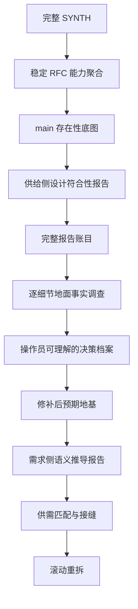

# RFC #548 · 标准调查、决策与滚动重拆 prompt

- **主题：** 外部 runner、router 与第三方调用接口
- **唯一 SYNTH 输入：** `v3-issue/synthesized/SYNTH-548-external-runner-router.md`
- **工作目录：** `v3-issue/n/548/`
- **事实源：** 本 RFC 稳定设计 + 操作员裁决 + v3 权威记录 + 真实系统；旧 issue/测试/非 v3 docs 仅作线索。

## 0. 这是执行 prompt，不是原则摘要

本文件从 RFC #546 的完整 session（包括 Read/Bash/Write/Edit、Codex 任务书、任务失败与恢复、报告落盘和后续纠偏）抽取标准流程。后续主 agent 必须按本文件恢复工作，不得只看阶段名自由发挥。

目标不是“把旧 issue 修好”，而是建立这条证据链：

## 1. 主 agent 与 subagent 的硬边界

### 1.1 主 agent 只保留目标层信息

主 agent 必须掌握：

- 本 RFC 的稳定问题清单和设计公理；
- 当前处于哪一阶段，为什么不能跳步；
- 已有哪些正式报告，各自回答什么问题；
- 报告之间的矛盾、未知和依赖；
- 哪个细节需要下一位 subagent 调查；
- 哪些问题已经具备向操作员请求裁决的材料。

主 agent **不应**把下列内容持续装入会话：

- 大量源码调用链、SQL、测试行号和 shell 输出；
- subagent 的工具调用记录和中间推理；
- 每个细节调查的全部取证过程；
- 为了“确认”报告而亲自重跑同一套细节调查。

主 agent 读取正式报告的摘要、结论边界、因果说明、未知和证据索引。报告不够可信时，派复核或 follow-up subagent；不要自己吞入细节。这样 compact 后只需本文件、报告索引和当前问题树即可恢复目标。

### 1.2 subagent 是细节事实的唯一调查者

以下工作默认必须派 subagent：

- 源码、表结构、事务、锁、迁移、runner profile、Git 对账等细节取证；
- 某个不变量在所有写入口是否真被执法；
- 崩溃、并发、历史数据或真实 runner 下的实验；
- 旧测试是否与实现共同偏离；
- 一个观察到的偏离为什么产生、跨了哪些层；
- 事实支持哪些实现形态及其确定后果；
- 从某个未实现设计语义推导原子地基需求。

主 agent 可以设计问题、切片和报告格式，但不把答案写进 prompt。

### 1.3 细节是调查起点，不是根因边界

“调查 D-x”只确定调查种子，不预设根因只在一个函数。一个细节可能由声明、存储、迁移、调度、恢复、权限、历史兼容和下游消费者共同产生。

subagent 必须区分：

1. **观察事实**：具体哪里表现异常或与设计不同；
2. **直接机制**：哪条生产路径生成该事实；
3. **上游来源**：数据/状态/声明来自哪里；
4. **历史原因**：迁移、旧兼容、回退或双事实源如何形成；
5. **放大条件**：并发、崩溃、特定 runner、未来能力出现时才触发什么；
6. **消费者影响**：谁读取它，错误会如何传播；
7. **根因集合**：允许多因一果、一因多果或尚不可判定；
8. **修补边界**：修直接症状是否会保留根因。

调查可以沿因果链扩展，但不能据此新增需求；稳定 RFC 不要求防的风险只登记，不自动实施。

## 2. Codex subagent 的统一任务书

每次派发都必须包含以下段落，不能只写“查一下 X”。

### 2.1 调查问题

写成可证伪问题，说明它为什么阻塞当前阶段。不得预设答案，不得把候选方案说成完备集。

### 2.2 固定基线

- repo、branch、HEAD SHA；
- 允许写入的位置仅限指定报告和明确实验临时目录；
- 禁止修改产品代码、测试、配置和生产数据库；
- 需要运行实验时说明真实环境和副作用边界。

### 2.3 唯一设计锚点

只列与该切片直接相关的 RFC 聚合“语义定义”、操作员裁决和明确的 v3 权威记录。测试、issue、marker、验收脚本只能作线索。

### 2.4 必须建立的事实

逐条列出问题，不列预期结论。每条要求：

- 生产代码或运行证据；
- 事务/并发/迁移/错误恢复语义；
- 所有写入口或消费者，而不是单一命中；
- 静态不可判定时所需的最小实验；
- 现有测试覆盖与同错风险；
- 可保留资产。

### 2.5 防污染纪律

- 符号存在不算符合；
- 测试绿色不算设计证明；
- commit message 不算实现证据；
- 不得自行裁决；
- 不得写“小/中/大 PR”“约几十行”；规模只能列具体函数、表、调用点、测试名；
- 不确定就写不确定以及如何确定；
- 如果事实揭示第四种形态或复杂根因，必须报告，不能服从 prompt 暗示。

### 2.6 报告双层结构

报告写入本 RFC 目录，必须让主 agent 无需读取取证细节也能使用：

**A. 主 agent 摘要（最多一页）**

- 问题；
- 结论与置信边界；
- 复杂因果的简明解释；
- 当前影响、未来影响、纯证明缺口；
- 可保留资产；
- 尚未确定的事实；
- 下一步是否需要裁决或继续调查。

**B. 证据附录（供复核 subagent 使用）**

- 逐条设计对照；
- `path:line`、SQL、命令、运行观察；
- 全部调用方/写入口/消费者；
- 事务、锁、迁移和崩溃窗口；
- 测试同错/盲区；
- 实验脚本和环境限制；
- 证据索引。

## 3. Codex 任务运行与收件流程

#546 的完整 session 证明“Agent 调用返回”不代表调查完成。主 agent 必须：

1. 记录 Codex runtime task id、目标报告路径和预期章节；
2. 轮询**任务终态**，不能只等文件出现；
3. 报告出现后核对行数、章节、尾部和明确结论，防止半写文件；
4. 任务失败时读取失败原因：
   - 容量/流中断且 session 有有效进度：优先 resume；
   - 任务挂死：取消该实例，再 fresh 重发同一问题；
   - 环境不能实验：保留“不可判定”，要求交付可复现实验脚本；
5. 不因某个任务慢而降低问题或改用未经允许的模型；
6. 只在全部切片报告完整后进入汇合；
7. 汇合发现遗漏时派报告核算/复核 subagent，不由主 agent补做代码调查。

## 4. 标准流程：每一步到底解决什么

### R0 · 完整读取 SYNTH，先恢复材料全貌

**要解决的问题：** 当前文件混合了稳定 RFC、旧/新 issue、marker 循环、评论裁决和状态快照；如果没读全就会再次沿坏边界工作。

**实际做法：**

- 大文件分段读取；
- 先扫描后半部分章节标题，识别大段重复供替循环，再逐段读取独特内容；
- 未经操作员授权不写文件、不查代码；
- 对话中固定：只看本 RFC、跨树只记能力、现在只聚合。

**不得前进：** 尚不能说清哪些是稳定设计、哪些是拆分、哪些只是历史证据。

### R1 · 先做 source inventory，再做能力聚合

**要解决的问题：** 旧 issue 边界是错误来源，不能直接“整理 issue”。

**产物顺序：**

1. source inventory：每个行段标“进聚合/捞金/丢弃/仅现状”；
2. 全局公理与完整终态交付标准；
3. 能力块：每块写语义定义、真实交付标准、现状快照；
4. annex：未决项、跨树能力 inbound/outbound、验收 owner、冲突；
5. README/索引。

**关键判断：**

- 重复 marker 中只捞已经稳定且有设计来源的语义；
- issue 编号只留在出处和历史，不进入依赖合同；
- 跨树编号翻译为能力，但不打开其他 RFC；
- 冲突只登记，不裁决；
- 聚合不是重拆，不排未来 issue 顺序。

**校验：** 行数、全交付标准去向、正文编号依赖 grep、源行号回溯。

### R2 · 只做 main 存在性底图

**要解决的问题：** 聚合使用了历史快照，main 可能已经前进；重拆前必须知道哪些东西真实存在。

**必须派 subagent，因为：** 这是大量源码检索和新旧路径成对核对；让主 agent 亲自读会污染目标会话。

**调查方式：** 按全部能力块逐项核对：新机制是否存在、旧机制是否退役、声明/存储/执行/执法/消费分别到哪。默认未实现，只登记生产证据。

**报告只能回答：** “有什么”。不能回答“符合 v3”“测试绿”“可作地基”。

### R3 · 把真实问题改写成“现有实现能否作为地基”

**触发：** R2 出现“已实现/部分实现”。

必须分开两个问题：

1. 它是否符合稳定 v3 语义；
2. 它能否提供未实现能力真正需要的保证。

现有测试不能认证第一个问题，因为代码和测试可能由同一错误 issue 生成。旧 issue 的接口清单也不能直接回答第二个问题，因为依赖边界本来就可能写错。

**切片：**

- 供给侧：按现存实现的语义/事务边界切片；
- 需求侧：按未实现能力的稳定语义切片；
- 先供给，暂不启动需求。

### R4 · 供给侧设计符合性深审

**要解决的问题：** 把“已存在”拆成：符合、偏离、静态不可判定、可保留底座、负资产。

**为什么多个 subagent：** 每片需要深查事务、并发、恢复、迁移和旁路；单 agent 容量不足且容易被代码—测试自洽迷惑。切片之间应能交叉核对同一接缝。

**每片报告必须包含：** 逐条稳定语义三态判断、严重偏离、静态未知、测试同错、可保留资产和能否作下游地基。

### R5 · 先完整核算供给报告，不能立刻跑需求侧

**要解决的问题：** “有偏离”仍不足以定义下游应依赖什么。

必须完整收进账目的内容：

- 每条偏离；
- 每条静态不可判定；
- 每条测试同错/盲区；
- 每项可保留资产；
- 报告互证或冲突；
- 原报告条目到总账的全覆盖映射。

**必须派报告核算 subagent，因为：** 逐条搬运和覆盖检查属于细节劳动；主 agent只读核算报告摘要和覆盖结论。

**禁止：** 只看 findings 就下“零重写”“都是小修”结论。

### R6 · 从总账生成“待调查细节索引”

**要解决的问题：** 哪些偏离只是明确事实，哪些真正形成设计/工程分叉，哪些还缺地面事实。

每个索引项必须写：

- 对应稳定条款；
- 报告观察到的事实；
- 为什么现有证据不足以决定补法；
- 可能涉及哪些层，但不预设根因；
- 需要何种代码、数据或运行实验；
- 为什么要单独派 subagent。

此时不写选项、不估成本、不回写“修补决策”。

### R7 · 一个细节一个 subagent，查清复杂成因和确定后果

**要解决的问题：** 为操作员裁决建立地面事实，而不是让模型编选项。

典型调查包括：

- 多条恢复通道真实行为和已消费资源交互；
- 跨表不变量、trigger 先例、迁移兼容和存量违规数据；
- sandbox 语言能力、真实 runner 读需求和不可测环境；
- delete/consume 两条完整调用链、孤儿资源、对账和运维契约。

**关键纪律：** 一个细节可能有复杂历史根因；报告必须从观察点追到所有必要层。prompt 中的候选不是完备集。没有事实就保留未知。

### R8 · 由报告生成决策档案，再请求操作员裁决

**要解决的问题：** 操作员不能只看一句推荐，也不能基于模型想象裁决。

每个决策档案应由专门 subagent 只读相关报告生成，包含：

- 为什么会出现这个问题；
- 稳定设计要求什么；
- 当前代码/数据/运行事实；
- 复杂因果和影响触发条件；
- 事实支持的所有形态，不把预设候选当完备；
- 每种形态的确定后果、具体触点和仍未知项；
- 哪些是纯口径选择，哪些是工程分叉；
- 不给主观工作量。

主 agent只检查档案是否完整，然后逐项呈现给操作员。操作员未裁决前不得写进规格。

### R9 · 建立“修补后预期地基”

**要解决的问题：** 需求侧不能依赖当前有洞的代码，也不能依赖未经裁决的想象修补。

只有操作员裁决和事实充分的修补方向，才能回锚到聚合原文：稳定条款、实然问题、裁决、预期保证、仍未证明的运行项。由回写 subagent 修改，再由独立复核 subagent检查是否残留旧预裁或互相矛盾的文本。

### R10 · 需求侧从稳定语义推导原子地基需求

**前置条件：** R9 通过。#546 中需求侧被暂停是正确行为。

每个未实现能力一个 subagent。输入只给：该能力稳定语义、相关预期地基摘要、必要的供给报告摘要。禁止抄旧 issue 或让 subagent 自裁。

报告回答：需要哪些原子读写、事务、身份、恢复和授权保证；预期地基已供什么；缺口应由本能力新建还是说明地基未闭合。

### R11 · 供需匹配与接缝识别

主 agent只消费供给/需求汇合报告，不进入代码细节。逐条标：直接复用、修补后复用、过渡兼容、消费能力自建、地基仍缺。把“双方各吞半个”的能力抽成接缝，消灭循环依赖。

### R12 · 滚动重拆

只拆现场足够清楚的下一批。每个新 issue 的验收只能依赖 main 已有/已明确修补的地基和本 issue 自己的 diff。实现推进后重新运行 R2–R11 的必要子集，再拆后续，不一次写完整未来树。

## 5. 明确的失败回退条件

出现以下任一情况，必须退回对应阶段：

- 用现有测试通过证明符合 v3 → 退回 R3/R4；
- subagent 只列 symbol 命中，没有事务/并发/恢复语义 → 退回 R4；
- 供给报告未读完整就启动需求侧 → 退回 R5；
- 总账漏掉静态未知或测试同错 → 退回 R5；
- 主 agent 根据报告措辞编出选项/范围 → 退回 R6/R7；
- 出现“小 PR、约 30 行、中等工程”但没有具体触点计数 → 退回 R7；
- 把尚未实现的机制称为“可复用” → 退回 R7；
- 操作员只收到一句推荐、无法理解问题来源 → 退回 R8；
- 未裁决内容已回写成决定 → 将其标为不可信，退回 R8/R9；
- 需求侧依赖当前缺陷而非修补后预期 → 退回 R9；
- 当前 issue 的验收依赖未来 issue 才能解释 → 退回 R11。

## 6. 进度记法

- `[x]`：该阶段的 gate 已满足；
- `[~]`：进行中；
- `[ ]`：未开始；
- `[!]`：已有产物但被证实不可信或需要返工。

每项必须同时记录：状态、产物、已经证明什么、仍未证明什么、下一批 subagent 及其必要性。

## 7. 当前进度

### [x] R0

- **状态：** 已完整读取 SYNTH 并冻结本 RFC 范围。
- **产物：** SYNTH 源文件
- **已证明：** 材料范围已明确。
- **仍未证明：** 未证明代码符合 v3。
- **下一批 subagent：** 无。

### [x] R1

- **状态：** 已完成 extraction inventory 与能力聚合。
- **产物：** extraction-inventory.md；AGG-548.md
- **已证明：** T1–T7 与稳定裁决已聚合。
- **仍未证明：** 未形成地基保证。
- **下一批 subagent：** 无。

### [x] R2

- **状态：** 已完成 main 实现审计，并查明 #676 历史实现及干净回退。
- **产物：** implementation-audit.md
- **已证明：** 现状、历史候选资产与回退事实已记录。
- **仍未证明：** 历史实现不能未经 reconcile 当作符合 v3 的地基。
- **下一批 subagent：** 下一步把 main 现存 compile/router 底料和历史 #676 分开切片深审。

### [x] R3

- **状态：** 已在 main `699842eba2eefc242d19f8fa9232bc1d9d5c3bdd` 冻结两类供给切片：S1 = main 现存 compile / CLI / socket / 幂等底料；S2 = 已回退 `8e9642c` 的 hapi runner / 外部终端缺席语义与 current main reconcile 地基。需求侧继续暂停。
- **产物：** 本进度账本中的 S1/S2 切片定义。
- **已证明：** 供给问题已按现存事务边界与历史候选实现分开；“main 存在”与“历史可恢复”均不再直接等同于符合 v3 或可作地基。
- **仍未证明：** 两片是否符合稳定语义、能否提供下游保证、有哪些负资产与静态未知。
- **下一批 subagent：** S1、S2 各由一名 subagent 独立深审并写双层正式报告；必要时交叉复核共同接缝。

### [x] R4

- **状态：** S1/S2 供给深审任务均到达终态；主 agent 已核对报告行数、双层章节与尾部完整性。
- **产物：** `supply-main-contract-audit.md`（232 行）；`supply-hapi-reconcile-audit.md`（267 行）。
- **已证明：** S1 仅直接支持 T1/T6 的调用运输地基与 T3 的部分存储地基；T2、完整 T3、T5 忠实 verdict 与既有入队审计主张存在偏离或证明缺口。S2 证明历史 `8e9642c` 的 HAPI 路径为 probe-only / invocation-pending，不符合稳定 T7；其 probe/domain/hold 资产可隔离保留，但历史 slot/worktree/session 层与 current closure lifecycle 冲突，不能整块恢复。
- **仍未证明：** 两份报告的所有偏离、静态未知、测试同错、资产与互证/冲突是否已无遗漏收进统一账目；真实 HAPI 合约与 E2E 仍未验证。
- **下一批 subagent：** 报告核算 subagent 逐条建立 S1/S2→总账覆盖映射，并标出共同接缝、冲突和漏项。

### [x] R5

- **状态：** 供给报告总账任务已到终态；主 agent 已核对 197 行、摘要/附录/尾部及覆盖结论。
- **产物：** `supply-findings-ledger.md`：81 条原子记录（S1 41 / S2 40），73 条 R6 候选，8 个共同接缝，双向映射闭合。
- **已证明：** S1/S2 的设计三态、偏离、静态未知、测试同错/盲区、可保留/需 reconcile/负资产均已入账；没有无来源条目或未映射附录章节。
- **仍未证明：** 73 条候选中哪些只是明确事实、哪些形成真实分叉、哪些必须先补地面实验；尚未生成可派发的细节问题树。
- **下一批 subagent：** 依据总账生成 R6 待调查细节索引，合并同根因候选但保留覆盖映射，不写选项或补法。

### [x] R6

- **状态：** 问题树整理任务已到终态；主 agent 已核对 213 行、摘要/详细索引/覆盖表与尾部。
- **产物：** `investigation-index.md`：73 条候选唯一闭合为 10 个 R7 索引项；A=16、B=18、C=38、D=1。
- **已证明：** 每个调查项均有稳定条款、观察事实、证据不足点、需建立事实、实验边界和独立派发理由；依赖顺序已明确。
- **仍未证明：** 10 项的地面事实；其中真实 external-terminal 合约、current closure authority 是后续 remote lifecycle/loss 调查前置。
- **下一批 subagent：** 首批并行 R7-01、R7-02、R7-04、R7-09；并发槽位分两波派发，R7-03 可后续同批但不阻塞裁决档案。

### [x] R7

- **状态：** 十个细节调查任务均已到终态；主 agent 已核对全部报告存在、行数、双层摘要/附录和尾部。
- **产物：** `detail-r7-01-schema-validation.md`、`detail-r7-02-replay-verdict.md`、`detail-r7-03-admission-audit.md`、`detail-r7-04-external-cli.md`、`detail-r7-05-availability-hold.md`、`detail-r7-06-remote-lifecycle.md`、`detail-r7-07-loss-ordering.md`、`detail-r7-08-probe-identity.md`、`detail-r7-09-closure-authority.md`、`detail-r7-10-candidate-gate.md`。
- **已证明：** schema/创建期校验、两步 durable 写入与 caller verdict、引擎审计证明力、真实已安装 HAPI CLI 合约、历史 hold/recovery 时序、current closure authority、历史 loss latch 竞争窗、probe identity、冻结候选 gate 的地面事实已建立。R7-02 还以运行实验纠正了先前“单 daemon 并发 chain.create 败者 sqlite_error”的错误假设。
- **仍未证明：** 所需 production external-terminal runner binary、无副作用 probe、headless terminal/status、session resume/cleanup 合约不存在或未定位；因此真实 remote lifecycle 与同一 invocation loss total order仍不可执行，报告只交付明确阻塞和实验协议。最终 candidate gate须冻结 SHA 后执行。
- **下一批 subagent：** 分别生成 schema/validation、replay/verdict、external-terminal/closure 三份 R8 决策档案；只把事实已充分的工程分叉呈现为待裁决，把外部合约和冻结候选留作事实阻塞。

### [x] R8

- **状态：** 当前事实充分的产品/兼容分叉 D1–D11 已全部裁决并记录；external-terminal 六项被正式保留为事实/外部合约阻塞，未伪装成操作员选项。
- **产物：** `decision-schema-validation.md`、`decision-replay-verdict.md`、`decision-external-terminal.md`、`operator-decisions.md`、`detail-historical-extra-migration.md`（105 行）。
- **已证明：** 真实库 58 个 item 中，54 个按当前 gh preset + D2 重判均违规，4 个 preset 已不存在；`extra` 同时承载 business remainder 与 engine-owned control keys，不能把整份 JSON 直接当 preset fields strict 校验。当前没有持久化 schema version/hash。
- **已证明：** D1–D11 已覆盖 schema artifact、required、持久态不变量、CLI error ADT、规范 item identity、空 chain、durable request record、合成 schema、startup quarantine、扫描量词及 preset+extra 原子修复。
- **仍未证明：** production external-terminal binary/probe、headless terminal/status/resume、endpoint identity、loss total order、真实 E2E 与冻结 candidate gate。
- **下一批 subagent：** R9 回写 subagent只把 D1–D11 与已确定的 current closure/zero-spawn 约束写入预期地基；external-terminal 六项保持显式未证明。随后独立复核旧预裁与矛盾。

### [x] R9

- **状态：** 回写与独立复核均到终态；首轮复核发现两项阻断，修复后完整复核 PASS。
- **产物：** `AGG-548.md`（357 行）、`expected-foundation.md`（58 行）、`operator-decisions.md`（136 行）、`r9-foundation-review.md`（103 行，PASS）。
- **已证明：** D1–D11 全覆盖；旧 projection/schema/creation-only/engine-zero-audit 等预裁零残留；current per-closure authority 唯一；zero-spawn 非交付；B-ET-1～6 均保持 blocker、未升格为 wire 或保证；三份规格文档内部一致。
- **仍未证明：** 未实现能力各自需要的原子读写、事务、身份、恢复与授权保证，以及哪些由预期地基提供、哪些仍缺。
- **下一批 subagent：** R10 按未实现能力分别派 schema/invariant+request record、GitHub消费链、external-terminal 三个需求侧推导。

### [x] R10

- **状态：** 三个需求侧任务均到终态；schema 与 external 首次因模型容量失败后按原任务恢复完成。
- **产物：** `demand-schema-audit.md`（130 行）、`demand-github-consumer.md`（202 行）、`demand-external-terminal.md`（197 行）。
- **已证明：** schema producer/write gate/startup repair/request record、GitHub T1–T6 consumer/router 接缝、T7 closure/availability/invocation/loss/E2E 的原子保证、owner 与未闭合项均已推导；未把树外能力或 B-ET blocker称为已有地基。
- **仍未证明：** 供给与三份需求逐条如何匹配、哪些接缝必须独立承载、是否存在双方各吞半个或循环依赖。
- **下一批 subagent：** R11 汇合 subagent只读供给总账、expected foundation与三份需求报告，建立匹配矩阵和接缝。

### [x] R11

- **状态：** 供需汇合任务到终态。
- **产物：** `supply-demand-match.md`（242 行；67 项原子保证、10 个接缝、依赖 DAG 与循环审计）。
- **已证明：** 直接复用9、修补后复用24、过渡兼容4、消费自建11、地基仍缺19；B-ET与router前置未被隐藏；可滚动拆出的下一批仅是不依赖未知wire的engine/CLI/schema/request-record能力。
- **仍未证明：** 下一批如何形成原子 issue 契约、每项是否只依赖 main/明确预期地基与自身diff、验收是否直接观察新行为。
- **下一批 subagent：** R12 起草 subagent只形成下一批草案与依赖图，不创建GitHub issue、不分配编号、不拆未来批次。

### [x] R12

- **状态：** 下一批草案与独立复核均完成。初稿因错误吞入 RFC-2 地基和不可执行 checkpoint 失败；经 R11 回退、两轮精确 runtime-seam 调查及八轮收敛复核，最终 PASS。未创建或修改 GitHub issue。
- **产物：** `rolling-resplit-next-batch.md`（454 行；1 个原子 child、14 条验收命令、固定 admission driver、23 variant registry contract）；`detail-request-record-runtime-seam.md`；`detail-request-record-scope-fixture.md`；`detail-request-record-variant-admission.md`；`r12-resplit-review.md`（93 行，PASS）。
- **已证明：** 当前唯一可合法滚动拆出的 next-batch child 是“线性化 durable request record/query 与 mutation/read verdict”；它不依赖 RFC-2 schema authority、typed CLI 或未来 consumer。真实隔离 daemon/socket/SQLite/restart/reply-loss/rollback/credential admission 路径足以直接验收；23 个可关联 request variants（含 query 自身）由唯一 registry 穷尽。schema 链、consumer/router、external-terminal继续保持阻塞。
- **仍未证明：** 草案尚未发布为 GitHub issue；RFC-2 preset authority、router契约、B-ET-1～6及冻结候选验证仍未闭合，后续只能在这些事实前进后重新运行 R2–R11 必要子集。
- **下一批 subagent：** 无。若操作员授权发布，按 writing-issue 将唯一 child 草案落到 GitHub；未经授权不创建 issue。

## 8. compact 后的恢复顺序

下一位主 agent：

1. 先读本文件的“当前进度”；
2. 只读最近一个已完成阶段的主 agent 摘要，以及当前进行中阶段的报告摘要；
3. 不读取历史工具调用记录，不重新展开全部源码细节；
4. 检查当前 gate 缺的是什么；
5. 按“下一批 subagent”派发有限调查；
6. subagent 报告不完整时 follow-up，不由主 agent 接管细节；
7. 未经操作员授权，不实现代码、不创建或修改 GitHub issue/PR。
