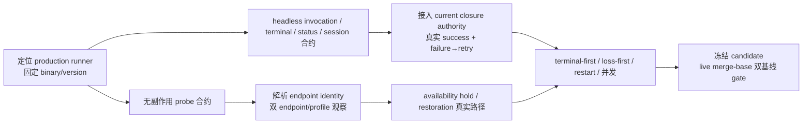

# RFC #548 R8 决策准备档案：external-terminal / closure

> 事实基线：`main@699842eba2eefc242d19f8fa9232bc1d9d5c3bdd`；历史候选 `8e9642c` 仅作资产对照。  
> 本档案不裁决、不推荐、不估规模。production runner / probe / headless terminal / status / resume 合约尚未找到；其缺失是外部合约前置，不是让操作员凭空选择 wire semantics 的“方案分叉”。

## A. 操作员页（≤1页）

### A1. 可立即裁决（事实已经充分）

| ID | 待确认分叉 | 形态 | 已确定后果 |
|---|---|---|---|
| D-ET-1 | external-terminal 是否必须服从 current closure authority | **形态 A：** 唯一 authority 保持 current `(closure_id, run_id, runtime_node_id, worktree_path, closure_sessions)`，external invocation 进入既有 closure lifecycle。 **形态 B：** 恢复历史 `(chain, repo)` slot worktree / item-session owner。 | A 保持 first-open/reopen、retry/restart、stop/resume、consumption intent、session deletion、cleanup/reconciliation 的单一事实源。B 会让 slot/item 与 closure 同时拥有 cwd、branch、session、恢复和清理事实，形成无法对应 consumed/reachability/cleanup 的第二 authority；历史资产不能整块恢复。 |
| D-ET-2 | 历史 probe-only / zero-spawn 终点能否作为 production 交付形态 | **形态 A：** 只保留 execution-domain、probe/invocation 分离、typed hold/loss 词汇和可控 fake 测试思路，production 不保留 `invocation_pending` / zero-spawn。 **形态 B：** 将“probe available 后停止、零真实 spawn”视为完成。 | A 与稳定 T7 的真实 remote completion、status admission、retry/closure 同构要求相容，但仍须等外部合约。B 已被历史脚本明确证明只到 `runner.invocation_pending`，不能证明真实 session、完成、恢复执行或 loss ordering，并违反 AGG “不应残留”。 |

### A2. 当前不可裁决：必须先补事实/外部合约

| ID | 阻塞的裁决 | 缺失前置 | 前置满足后必须观察的 manifest |
|---|---|---|---|
| B-ET-1 | production binary、readiness probe 与 invocation argv/exit 分类 | 定位或交付确切 runner binary 与版本；确认 probe 无副作用。当前 `hapi-remote-session` 不存在；已安装 `hapi-open-session` 0.1.0 会把位置参数当路径，创建 session/发 prompt 后即 exit 0，字面 `probe` 不是 probe。 | binary/version；help/schema；probe argv、cwd/env/config/profile；0/69/other/signal/deadline 的真实含义；证明 probe 不创建 session；invocation argv 与进程树/取消边界。 |
| B-ET-2 | headless terminal、`status.json` admission、session resume/reuse/cleanup | runner 的机器可读 terminal/status/session 合约不存在。current `status.json` 是 scheduler 生成的读面，不是现成的 external CLI admission 输入。 | 同一 `closure_id/run_id/runtime_node_id/phase` 的 prompt、cwd、credential、session id；status producer、schema、原子 admission checkpoint；child exit 与业务 terminal 的关系；retry fresh/resume 判据；session 清理结果。 |
| B-ET-3 | 最终 endpoint identity key | 生产 probe/config/profile/machine/auth 边界未知。历史 `kind+binary(+固定 ["probe"])` 只能描述历史实现，不能区分同 binary 的 server/principal/machine。 | 两个可独立控制的 endpoint/profile；解析后的 identity manifest；哪些 config/argv/env/machine/auth 输入改变可达性；hold/warning/restoration/loss 的分组、迁移和 binary/config 变更行为。 |
| B-ET-4 | terminal-first / loss-first 的唯一 durable winner | B-ET-1/2 后才能在同一真实 invocation 注入竞争。历史 hold/loss/session/run/item 写入跨多个事务，存在“重读 non-terminal 后、loss latch commit 前 terminal 已提交”的窗。 | terminal admission commit 与 loss decision commit 的线性化点；terminal-first、loss-first、最窄竞争、latch 后 crash/restart 的 SQLite/events/process/session 时间线；唯一 winner 与 restart 后不翻转。 |
| B-ET-5 | T7 真实 E2E 是否成立 | B-ET-1～4；真实 HAPI machine；隔离 daemon/loop-data。fake、历史 model override、engine integration、GitHub E2E 都不能替代。 | success 与一次可判定 failure→retry；创建/调度缺席→durable hold→restoration→真实执行；active loss；terminal race；restart；并发 run；每个 checkpoint 的 status/log/SQLite/process/session；最终 closure cleanup。 |
| B-ET-6 | immutable candidate / live merge-base gate 是否通过 | 最终 candidate 冻结；允许 `git fetch origin main`；两份 clean detached checkout。当前 HEAD 与旧 remote-tracking ref 相等、diff 为空，不是验收证据。 | `CANDIDATE`、fetch 后 `ORIGIN_MAIN`、`BASE`、ancestor check；两侧相同 Bun/OS 与命令日志；candidate 的 typecheck、`bun test`、带 `--log-file --foreground` 的 engine integration；base/candidate 双侧 unit 与 diff/卫生审计；post-run orphan/runtime/worktree 清理。 |

**计数：可立即裁决 2 项；因事实/外部合约不足而阻塞 6 项。**

## B. 追溯、触点与实验前置

### B1. 稳定条款与调查结论对照

| 主题 | 稳定要求 / 事实 | 调查结论 |
|---|---|---|
| 外部边界 | AGG §2.4 / T7：引擎只知道 binary、启动/退出、`status.json`、closure worktree 与缺席语义；不得内置 HAPI HTTP/session 协议。 | R7-04：所假定 production CLI 未找到；`hapi-open-session` 是已安装资产，但不提供该 runner 合约。 |
| production 可达性 | T7 预期、STD-602-1～7：真实 session 完成、恢复执行、loss/race/restart/并发与 operator 读面。 | R7-05/06：历史只有 probe-only、restoration 后 invocation-pending、zero-spawn；真实 invocation 与 completion/retry 不可达。 |
| closure authority | STD-748-B1：同一 task closure retry/resume 复用 cwd，consumed 后回收。 | R7-09：current per-closure authority 已完整；历史 slot owner 会制造第二事实源。 |
| availability 事务性 | T7：创建后 durable hold、零 spawn/attempt/backoff、恢复自动执行。 | R7-05：历史 create→event→probe→hold、hold→warning、逐项 clear→restoration→invoke 都非原子；存在无 hold、无 warning、部分 clear、已 restoration 未 invoke 的 crash 窗。 |
| loss total order | STD-602-3/4/5：terminal-first、loss-first、restart 结果确定且 durable。 | R7-07：历史 durable latch 形态可参考，但多事务窗未线性化，且测试通过 fake/内部改写越过真实 invocation。 |
| endpoint identity | AGG T7：按解析后的 endpoint identity 管理 availability。 | R7-08：历史实际按 `kind+binary`（固定 probe argv）归组；真实 CLI 暴露 server/auth/machine/path 等可能区分维度，最终 key 尚无合约。 |
| candidate 证据 | STD-602-9/10 与冻结 SHA 验收。 | R7-10：当前没有 frozen candidate/live fetch/clean 双基线；所有 pass/fail 与回归归因均未成立。 |

### B2. 可复用触点（不是实现拆分）

- current authority：closure identity、`active_runs`、run 的 `closure_id/runtime_node_id`、closure-scoped worktree/branch、`closure_sessions`、reachability、consumption intent、cleanup 与 startup reconciliation。
- current local baseline：完整 prompt/cwd/credential；phase-exit default-deny admission；run completion、retry/backoff、session resume、phase/terminal consumer。
- historical shapes：external-terminal ADT；probe/invocation 分离；typed availability/hold/restoration/loss；pre-side-effect gate；repo 内 held candidate 让位；run-scoped durable loss fact；revoke→terminate；close/startup latch consumer；bounded process-group termination。
- 不可恢复为 production authority/contract：slot worktree owner、item `agentCwd`/item-session owner、`invocation_pending`、zero-spawn PASS、固定 `["probe"]`、exit 69 假设、通过测试 seam 合成 active HAPI run。

### B3. 外部合约解锁顺序

### B4. 实验准入与停止条件

1. 未固定 production binary/version，不执行 remote lifecycle 或 loss 实验。
2. 未证明 probe 无副作用，不用字面 `probe` 或 dry-run 代替 readiness；不得冒险创建真实 session来“探测”。
3. 未定义 status producer/schema/admission 与 session identity/resume，不把 CLI exit 0 当业务 terminal。
4. 每个真实实验必须绑定同一 immutable `closure_id/run_id/runtime_node_id/phase/session_id`，保存 status/log/SQLite/process/session checkpoint。
5. candidate 未冻结且未成功 fetch live `origin/main`，不运行或解释双基线 gate；不得把当前空 diff 当 candidate 证据。
6. 任一前置不满足即记录“外部合约/事实前置未满足”，停止该分支；不生成新的语义选项，不请求操作员猜测。

### B5. 来源

- `detail-r7-04-external-cli.md`：真实 CLI、probe/invocation 合约。
- `detail-r7-05-availability-hold.md`：创建后 hold、恢复时序及事务窗。
- `detail-r7-06-remote-lifecycle.md`：completion/retry、status admission 与真实 E2E 阻塞。
- `detail-r7-07-loss-ordering.md`：loss/terminal total-order 缺口。
- `detail-r7-08-probe-identity.md`：endpoint identity 维度。
- `detail-r7-09-closure-authority.md`：current closure authority 与历史 owner 冲突。
- `detail-r7-10-candidate-gate.md`：immutable candidate/live merge-base gate。
- `AGG-548.md`：§2.4、T7、§4、§5 C8/C10、§6 F7～F10、§7 H2～H4/H9。
