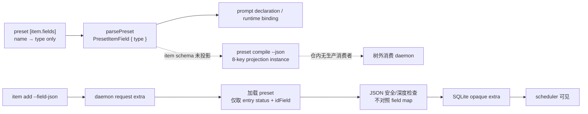

# RFC #548 R8 — schema / validation 决策档案

**事实基线：** `main@699842eba2eefc242d19f8fa9232bc1d9d5c3bdd`  
**允许输入：** `detail-r7-01-schema-validation.md`、`AGG-548.md` 的稳定条款、`investigation-index.md` R7-01。  
**边界：** 本档案只把已经查明的事实转成可裁决口径；不推荐、不估工、不实现，也不把树外未知补写成事实。

# A. 操作员决策页（≤ 1 页）

## A1. 为什么现在必须裁决

当前链路在声明处就丢失了创建契约：

1. `[item.fields]` 只能归一成 `name -> {type}`，type 闭集为
   `string | number | boolean | json`，没有 required；
2. `preset compile --json` 是固定八键的 **projection instance**，完全不含 item schema；
3. `item add --field-json` 把任意安全 JSON 原样送进 `extra`；
4. daemon 虽在写入前加载 preset，却只取 entry status 与 idField，不用 field map 校验；
5. missing、unknown、type mismatch 因而都会入库并抵达 scheduler；只有 preset 不存在会在
   insert 前失败；
6. socket 保有 `{code,message,details}`，但通用 PATH item CLI 把 `details` 压平丢失。

这与 T2 / P-747-1～4 的稳定要求相冲突：树外调用者必须在任何引擎调用前从版本化 schema
派生并预校验；引擎创建期仍须兜底；四类违规须形成可审计 typed verdict；
`schemaVersion` mismatch 必须显式失败。现有 `schemaVersion: 1` 没有生产消费者，不能证明这些要求。

## A2. 可立即裁决的四个问题

### D1. schema artifact 的公共载体是什么？

这是 **产品契约选择**，不是把现有 projection 改名。

| 形态 | 确定后果 | coder-loop 侧具体触点 | 树外触点 |
|---|---|---|---|
| **D1-A：CLI 输出真正的 JSON Schema** | PATH CLI 成为 schema 获取协议；必须区分 schema document 与 compile projection instance，并给 document 独立版本语义 | preset 的权威归一模型；`PresetCompileProjectionBoundary` / `projectCompiledPreset` / `runPresetCommand` 附近的命令与输出边界；独立 consumer fixture/oracle | 消费 daemon 通过 CLI 获取/缓存、校验版本并派生类型 |
| **D1-B：独立版本化 package / artifact** | 发布物、版本与导入/生成链成为公共协议；现有 compile projection 可保持实例投影身份 | preset 的权威归一模型；新增 artifact 生成/发布边界；独立 consumer fixture/oracle | 消费 daemon 的依赖、生成或 import 链、版本锁定与 mismatch 失败 |

两种载体都须覆盖 preset identity、field type、required 与 unknown-field policy，且只能从同一
归一化权威模型派生。JSON Schema 究竟由现有 `preset compile` 的新模式、独立子命令还是构建产物
提供，是 D1-A 之下的工程分叉；package 的格式、registry 与发布节奏是 D1-B 之下的工程分叉。

### D2. required 在权威声明中如何表达？

这是 **preset grammar / 兼容口径选择**。事实允许的不止既有候选：

| 形态族 | 确定后果 | 具体触点 |
|---|---|---|
| **D2-A：field object 内逐字段表达**（例如 required 属性这一类形状） | `{type=...}` 承载必填性；必须裁定 string shorthand 及旧 object declaration 的默认必填性 | TOML boundary、field parser、`PresetItemField`、authoring 文档、artifact projector |
| **D2-B：item/schema 层集中表达 required 集合** | 字段 type map 与 required 集合分离但同属一个权威 item schema；必须校验 required 名称一定已声明 | TOML boundary、item schema parser/model、authoring 文档、artifact projector |
| **D2-C：独立 schema 层完整表达字段约束** | 现有 `[item.fields]` 不能继续作为平行权威；须明确它被替代、被派生还是仅作兼容输入 | preset load 的 normalization 边界、独立 schema 模型、artifact projector、迁移/兼容规则 |

无论选择哪一族，都还必须同轮裁定：旧 string shorthand、旧 `{type=...}` 是默认 required、
默认 optional，还是必须显式迁移。否则同一 preset 在 loader、artifact 与创建校验间仍会出现不同解释。

### D3. 引擎兜底守住“创建正确”还是“持久态持续正确”？

这是 **需求口径选择**。

| 形态 | 确定后果 | 具体触点 |
|---|---|---|
| **D3-A：只守创建边界** | add 与 batchAdd 必须统一拒绝 missing / unknown / mismatch / missing preset；之后 update 仍可能制造不合 schema 的 `extra`，不能声称持久态始终符合 schema | `buildCreateItemInput`（batch 已复用）；daemon typed error；零 insert / 零 scheduler 副作用证明 |
| **D3-B：守持久态不变量** | add、batchAdd 与所有会改变 `extra` 的 update 都须按同一归一 schema 校验；历史行是否只读兼容须另定迁移口径 | 上述创建触点，加 item.update replace/patch；历史 opaque `extra` 读取与迁移边界 |

P-747-4 明确要求创建期兜底，但没有自动回答 update 是否属于同一保证；不能用“创建期”措辞
暗中扩大为历史数据迁移，也不能用 add 校验暗示 update 后仍然正确。

### D4. PATH CLI 的机器可读错误契约是什么？

这是 **公共 CLI 契约选择**，与树外 verdict 集成分开。

| 形态族 | 确定后果 | 具体触点 |
|---|---|---|
| **D4-A：CLI 暴露与 socket 同构的 typed error envelope** | 调用者可直接按 code/details 分类；须规定 JSON 输出通道、exit code 与成功/失败 envelope | daemon 的 `DaemonError` 构造；socket response；`requestDaemonResult`；item add/batch/update CLI |
| **D4-B：CLI 定义独立但无损的 typed rejection ADT** | CLI 可不复制 wire shape，但必须穷尽映射 missing / unknown / mismatch / missing preset，且不能只剩 message | 同上，另加 wire→CLI 的穷尽转换与独立 oracle |

纯文本 `code: message` 不是可选形态，因为它已被事实证明会丢 `details`，不能支持稳定条款要求的
结构化分类。delivery id、`consumed | not-consumed`、消费 daemon 日志格式属于树外集成契约，
不得塞进 coder-loop 的字段校验错误 ADT。

## A3. 不应在本页代替操作员裁决的工程分叉

- validator 使用哪一个库、JSON Schema dialect、生成器和缓存策略；
- schema 子命令名、artifact 文件名、package registry 与发布流水线；
- typed error 的字段命名、数字 exit code 分配及 stderr/stdout 编排；
- 历史非法 `extra` 的扫描/迁移工具；
- 树外消费 daemon 的语言、构建系统、delivery-id ADT 与日志 backend。

这些只能在 D1～D4 确定后按真实目标 repo 与运行环境落定。

# B. 证据追溯、全链触点与未知

## B1. 稳定设计要求

| 要求 | 已固定含义 | 来源 |
|---|---|---|
| T2 | 缺 required 或 preset 不存在须在预校验或引擎创建期拒绝，不能到 spawn 后才失败 | `AGG-548.md:95-99` |
| P-747-1 | 外挂请求在任何 `chain create` / `item add` 前由编译产物预校验 | `AGG-548.md:101` |
| P-747-2 | missing / unknown / mismatch / missing preset 结构化拒绝，携带 delivery id 且可审计 | `AGG-548.md:102` |
| P-747-3 | 消费类型由 artifact 派生；version mismatch 显式失败 | `AGG-548.md:103` |
| P-747-4 | 预校验不能替代引擎创建期兜底；引擎拒绝回 `not-consumed` | `AGG-548.md:104` |
| STD-745 | 载体可为 CLI JSON Schema 或独立版本化 package/artifact；projection instance 不得冒充 schema | `AGG-548.md:111` |

STD-747-1～6 还固定了 daemon 停机时预校验、合法请求不误杀、无平行 shape 和 mismatch seam
等证明义务；它们没有替 D1～D4 选择具体公共形状。

## B2. 当前“声明 → compile → 创建”全链事实

- grammar 只接受四种 type；内存模型没有 required；object form 的其他属性不会进入模型：
  `detail-r7-01-schema-validation.md` B2。
- compile boundary 固定八键，builder 完全不读取 `model.item`；producer 用自己的 boundary
  校验自己的 projection：同报告 B3。
- 仓内没有 compile artifact 的生产消费者、type generation、version mismatch 入口或独立 oracle：
  同报告 B3。
- CLI `fieldJson` 原样成为 daemon `extra`；daemon preset load 与 idField 回填之后仅做 JSON 安全检查：
  同报告 B4。
- batch 复用同一创建 input；SQLite store 只接收 opaque `extra`；update 仍可 replace/patch 任意 extra：
  同报告 B4、B7。

## B3. 当前四类结果与确定影响

| 输入 | 当前结果 | 影响条件 |
|---|---|---|
| missing declared/required | 无 required grammar，创建成功 | item 落库并可能被 scheduler 处理 |
| unknown `extra` field | 无 field-map 对照，创建成功 | 未声明键原样持久化 |
| declared type mismatch | 无 type 对照，创建成功 | 错类型原样持久化 |
| missing preset | daemon load preset 时 `invalid_request` | insert 前失败，无 item |

隔离 runtime 实验已观察前三类 exit 0、四行 DB 且 scheduler 尝试处理；missing preset exit 1
且无新增行。CLI unknown option 在 socket 前失败，它证明的是 request envelope strict，
不是 preset field strict：`detail-r7-01-schema-validation.md` B5～B6。

## B4. 各裁决形态落地后的必然触点

### schema artifact（D1）

共同触点是 preset parser 后的**单一归一 schema 模型**、artifact version、独立 consumer oracle
和 mismatch seam。D1-A 才触碰 CLI schema 输出协议；D1-B 才触碰独立生成/发布边界。
现有 compile projection 可以是输入事实的一个投影，但不能作为 schema document。

### required 与创建期兜底（D2 + D3）

required 的 grammar、normalization 与 artifact 必须来自一个模型。创建兜底的现有收敛点是
`buildCreateItemInput`，因此 single 与 batch 可共享拒绝语义；若 D3-B，update 的 replace/patch
也成为相同 validator 的消费者。拒绝必须发生在 store 写入前，并证明零 DB、零 scheduler 副作用。
历史 nullable preset 与 opaque `extra` 是兼容事实，不能未经裁决自动变成迁移要求。

### CLI error ADT（D4）

daemon socket 已能承载 `{code,message,details}`，但 PATH item CLI 当前只呈现
`code: message`。无论 D4-A 或 D4-B，都必须同时触碰 daemon 的 variant 构造和 CLI 的无损输出；
只丰富 socket details 不能改变外挂唯一允许的 PATH CLI 路径。

### 树外派生与集成

P-747-1/2/3 的最终消费者在本 repo 外：它要获取 artifact、拒绝 mismatch、从 artifact
生成或导入类型、在引擎停机时完成预校验，并把引擎 typed rejection 映射成
`not-consumed` 与带 delivery id 的审计记录。coder-loop 侧只提供 schema 与创建拒绝事实，
不能据此声称 delivery id 或消费 daemon 日志已经存在。

## B5. 仍未知，不能编成设计事实

1. 消费 daemon 的 repo、语言、构建系统、artifact 获取/缓存/更新方式。
2. 它当前是否已有 delivery-id verdict ADT、日志 schema、retention 或独立校验 oracle。
3. CLI JSON Schema 应由现有命令的新模式、独立命令还是构建阶段产生。
4. package/artifact 的格式、registry、发布与 compatibility policy。
5. string shorthand 与旧 object declaration 的 required 默认值。
6. unknown field 是一律拒绝，还是未来存在明确声明的开放对象边界；稳定条款只要求当前四类
   违规可结构化拒绝，没有给开放对象 grammar。
7. D3-A 下 update 产生非法持久态是否可接受；D3-B 下历史行如何兼容或迁移。
8. typed CLI error 的最终字段、输出通道、exit code，以及 consumer 如何映射为外部 verdict。

## B6. 口径选择与工程分叉对照

| 类别 | 项目 |
|---|---|
| 操作员需定的口径 | D1 artifact 公共载体；D2 required 权威表达及旧语法默认值；D3 创建正确或持久态持续正确；D4 PATH CLI typed error 公共契约 |
| 裁决后再定的工程分叉 | schema dialect/validator；子命令或包结构；生成/发布/缓存；error 字段与通道；测试 fixture 与独立 oracle |
| 必须去树外核实 | consumer build/import 链；delivery id 与 verdict ADT；日志与审计；真实 mismatch 和 daemon-down 预校验路径 |
| 不是本档案的决定 | 实现顺序、工作量、issue 拆分、历史数据迁移方案 |

## B7. 证据索引

- R7 调查范围与必须建立的事实：`investigation-index.md:19-29`。
- type-only grammar、权威声明消费者：`detail-r7-01-schema-validation.md` B2。
- compile shape、无生产消费者、oracle 同源：同报告 B3。
- add / batch / update / store 全链：同报告 B4、B7。
- 四类 error shape、CLI details 丢失：同报告 B5。
- runtime 结果与 mismatch 无消费入口：同报告 B6。
- 测试盲区与可容纳形态：同报告 B8～B9。

---

**可立即裁决的问题数量：4。**
