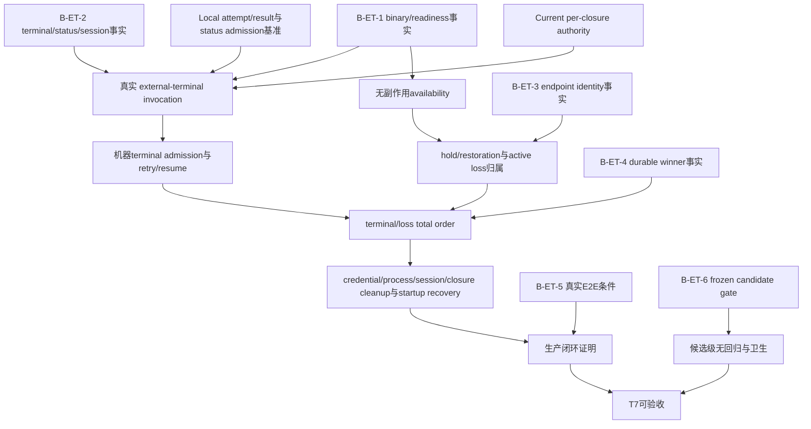

# RFC #548 · R10 需求侧推导：external-terminal / HAPI（T7）

## A. 主 agent 摘要（≤1页）

### 目标与需求结论

T7 的领域目标不是“增加一个名为 hapi 的 runner”，而是让一个真实远端 terminal 在不引入第二生命周期 owner、不把 HAPI wire 放进 coder-loop 的前提下，与本地 runner 共享同一 closure/attempt/result 边界。完成单位不可拆成“先做 probe/hold、以后再接 invocation”：runner 选择、无副作用 availability、hold/restoration、真实 invocation、机器 terminal admission、retry/resume、active loss、清理与 restart recovery 必须组成一个可运行闭环。

预期地基已经提供唯一 owner，而没有提供远端能力：

- current per-closure authority 已拥有 `closure_id/run_id/runtime_node_id`、closure worktree/branch、closure session、reachability、consumption intent、cleanup 与 startup reconciliation；external-terminal 必须进入它，不能恢复历史 slot/item owner。
- current local-process 路径已提供 runner 选择后的 run/cwd/prompt/credential、status admission、retry/resume、terminal 推进与 closure cleanup 参照边界。
- execution domain 的穷尽分类、probe/invocation 分离、typed hold/loss 词汇、pre-side-effect gate 与 repo 内让位是可保留的领域资产。
- 这些地基均不证明 production binary、无副作用 readiness、真实远端 session、headless terminal/status、endpoint identity、loss total order 或真实 E2E。

因此 T7 必须新建的原子保证是：

1. **统一 authority 下的真实执行：** external-terminal 的 runner selection、真实 invocation、cwd、prompt、run、session、retry、stop/resume 与 cleanup 全部引用同一 current closure authority；production 不以 probe-only、zero-spawn 或 `invocation_pending` 结束。
2. **availability 与执行不可拆：** availability 检查无 session 副作用；缺席产生 durable、可观察、可恢复的 engine-owned hold/warning，且不阻塞同 repo 其他 runnable work；restoration 必须继续到真实 invocation，而非只清 hold。
3. **机器终态准入：** 远端 terminal/status 必须绑定当前 closure/run/runtime-node/phase 与有效 credential，经既定 admission 后才可推进业务状态；session created、message sent、stdout 文本或 CLI exit 0 均不能单独代表业务完成。
4. **retry/resume 与 endpoint 归属：** 一次失败后的新 attempt 使用新 run identity、保留同一 closure/cwd，并按真实外部合约 fresh 或 resume；availability、warning、restoration 与 loss 必须归属于已解析且可区分的 endpoint identity。
5. **loss/terminal 唯一结论：** 同一 run 的 terminal admission 与 endpoint loss 必须有唯一 durable winner；terminal-first、loss-first、最窄竞争、crash/restart 与并发 run 均不能翻转或串扰。
6. **回收与恢复闭环：** loss、stop、completion、delete 与 daemon restart 后，credential revoke、process cancellation、remote session 处置、run closure、worktree/session/consumption cleanup 均服从 current authority，且恢复幂等。
7. **真实证明：** 在冻结 candidate 上，以隔离 daemon/loop-data 和真实 production runner/HAPI machine 覆盖 success、failure→retry、hold→restoration→执行、active loss、race、restart、并发与最终 cleanup；同时以 live merge-base 双基线证明本地 runner 不回归与仓库卫生。

### 尚不能落成接口的边界

`B-ET-1`～`B-ET-6` 不是实现 issue 可以吸收的“待定细节”，也不是可以由 coder-loop 反向发明的接口：

- `B-ET-1`～`B-ET-4` 分别阻塞 production binary/readiness、headless terminal/session、endpoint identity、terminal/loss 线性化；在真实外部合约成为事实前，不得规定子命令、binary 名、退出码、status producer/schema、session identity、resume 语义或 endpoint key。
- `B-ET-5` 阻塞完整交付证明；fake、stub、内部状态改写、probe-only 和 current authority 本身均不能替代真实远端 E2E。
- `B-ET-6` 阻塞候选级验收；未冻结 candidate、未 live fetch/merge-base、未在 clean detached 双基线运行，就不能声称无回归或可合并。

这些阻塞必须作为 T7 的外部事实依赖保持显式；任何实现单元只能在相应事实解锁后消费它，不能以“先选一个合理 wire”“先实现 pending seam”或“测试里固定 fake 合约”将未知伪装成需求。

---

## B. 需求矩阵、阻塞依赖与证据

### B1. 需求权威与范围

| 项目 | 权威结论 |
|---|---|
| 业务目标 | 真实 item 经树外 external-terminal runner 在真实远端 session 完成，并正确处理缺席、恢复、失败、active loss、竞争与重启 |
| coder-loop 边界 | 不实现 HAPI HTTP、URL、auth、remote response 或服务端 session 协议；远端交互终止于树外 runner CLI |
| 唯一 owner | current per-closure authority；历史 `(chain,repo)` slot worktree、item phase/session owner 不得恢复 |
| 完成量词 | 从 runner selection/readiness 到 invocation/status/retry/loss/cleanup 的生产闭环；不是类型存在、probe 成功或 session 创建 |
| 禁止替代 | probe-only、zero-spawn、`invocation_pending`、fake/stub、direct store mutation、stdout 文本、engine integration、GitHub E2E |
| 验证终点 | 真实 HAPI E2E + frozen candidate/live merge-base gate；两者各自证明不同层，不能互相替代 |

### B2. 原子保证矩阵

| ID | 原子保证 | 预期地基已提供 | T7 必须新建/证明 | 失败时不可接受的替代 |
|---|---|---|---|---|
| ET-D01 | runner execution domain 穷尽区分 `local-process` 与 `external-terminal` | local runner selection、per-phase/item selection与 current run pipeline | external-terminal 进入同一 selection→attempt/result 边界；availability/推进不散落 runner 名字特判 | 只给 runner enum 加 `hapi` |
| ET-D02 | current closure/run/cwd authority 唯一 | closure、run、runtime node、worktree/branch、active occupancy、reachability与 consumption authority | invocation 全程绑定同一 `closure_id/run_id/runtime_node_id` 与 closure cwd | 恢复 slot worktree、item cwd或第二 session owner |
| ET-D03 | session authority 与 closure 一致 | `(closure_id, runner_kind)` session persistence；stop/resume/consume语义 | 真实 remote session identity按外部合约进入该 authority；fresh/resume/invalid/cleanup结果可观察 | 从任意 stdout 猜 session；每次无条件新建且称为 resume |
| ET-D04 | readiness 无副作用 | probe/invocation 概念分离、pre-side-effect gate形态可保留 | 真实 production readiness 不创建 session/run/worktree/artifact，并能区分缺席与其他失败 | 用创建 session 的命令当 probe；用 dry-run 当 availability |
| ET-D05 | 缺席形成 durable hold | typed hold/warning/status投影、repo内让位的历史机制资产 | item 已创建后缺席可观察、跨重启、零 invocation；同 repo 其他 runnable work前进 | 普通 spawn backoff、业务失败、只写日志 |
| ET-D06 | restoration 继续到真实 execution | hold clear/restoration词汇与重新 probe形态 | endpoint恢复后清理正确 hold并自动进入真实 invocation | 清 hold后停在 pending；zero-spawn PASS |
| ET-D07 | 真实 invocation 完整 | current local prompt/cwd/credential/run基准 | production runner接收完整 prompt、current closure cwd、run身份及必要授权，并产生真实远端 turn | session created/message sent/CLI exit 0即完成 |
| ET-D08 | headless terminal/status admission | current daemon已有caller/phase-exit default-deny admission与审计 | 机器 terminal绑定 active closure/run/runtime-node/phase/credential，malformed/stale/wrong-run/late输入被拒绝 | 匿名 status file、stdout字符串、direct SQLite/store更新 |
| ET-D09 | process terminal与业务 terminal关系明确 | local child exit与业务status是两条输入，scheduler统一收敛 | 外部合约明确远端 terminal、runner同步结束、业务 admission的顺序及失败分类 | 把任一单独 exit code当业务状态 |
| ET-D10 | failure→retry 保持 closure identity | local retry使用新run、同closure/cwd，session可resume | 真实可判定业务 failure 后自动新 attempt；fresh/resume/session-invalid按外部事实执行 | 用missing binary或endpoint缺席冒充业务retry |
| ET-D11 | stop/resume 不消费 closure | stop保留closure/resource/session；resume复用；outer completion/delete才消费 | remote child/session在stop时有界处置，resume仍归同一closure；不得提前cleanup | stop时删除closure或让远端session成为新owner |
| ET-D12 | endpoint identity 足以隔离状态 | runner kind/binary等配置供给面；历史碰撞事实已知 | 从真实runner解析可达性归属；至少两个endpoint/profile能正确隔离hold/warning/restoration/loss | 固定假设`kind+binary`、固定probe argv或按item临时分组 |
| ET-D13 | active loss 可归属单一 run | durable run、active run、closure session与credential authority | loss绑定当前run/endpoint；撤销credential、停止child、处置session并形成可重试或terminal结论 | 跨run批量覆盖、只发warning、不闭合active run |
| ET-D14 | terminal/loss total order | current terminal admission与run ledger可作为坐标 | terminal-first/loss-first只有一个durable winner；commit点明确，restart不翻转 | 依靠事件最终覆盖、内存set或调度时序猜winner |
| ET-D15 | 并发隔离 | run/closure identity、repo Git协调与active occupancy | 同endpoint多run与多endpoint并发时，winner、hold、loss、session互不串扰 | endpoint级结果误清其他profile，或一个run撤销另一个credential |
| ET-D16 | credential/process/session cleanup | credential admission、local process termination、closure consumption saga与startup reconciliation | loss/completion/stop/delete/restart后按winner撤销credential、有界cancel process、处置remote session并幂等清理 | 只杀local process；session或credential在restart后复活 |
| ET-D17 | startup recovery | stale local run、closure资源、consumption intent现有reconciliation | external active/held/lost/terminal中间态在同一loop-data恢复，winner不翻转，cleanup可重试 | 启动时重置状态或遗忘remote session |
| ET-D18 | operator可观察性与事实一致 | status/log/SQLite/run/closure读面 | 缺席、readiness失败、spawn失败、业务失败、active loss、terminal与restoration可区分并关联同一identity | 文本日志作为唯一事实；synthetic current/hold冒充真实process/session |
| ET-D19 | HAPI wire保持树外 | 外挂边界裁决已固定 | coder-loop只消费已确认runner CLI公共合约 | 在引擎内实现HTTP/auth/server session解析 |
| ET-D20 | production完成无假终点 | 稳定目标已禁止pending/zero-spawn | invocation、admission、retry/loss与cleanup均走真实路径 | probe-only、`invocation_pending`或fake seam |
| ET-D21 | 真实E2E覆盖闭环 | current authority提供统一checkpoint坐标 | success、failure→retry、hold→restoration→真实执行、active loss、race、restart、并发、cleanup全覆盖 | focused test、engine integration或GitHub E2E替代 |
| ET-D22 | immutable candidate与本地runner无回归 | typecheck/unit/engine integration入口及local基准存在 | frozen candidate、live origin/main merge-base、clean双基线、完整日志/卫生与post-run cleanup | 在脏checkout或旧remote-tracking ref上单侧跑测 |

### B3. 外部事实阻塞与依赖

| 阻塞 | 它阻塞的需求 | 解锁所需事实 | 为什么不能由实现 issue 吸收或假定 |
|---|---|---|---|
| B-ET-1 production binary/version与无副作用 readiness未知 | ET-D01、D04～D07、D10、D19～D21 | 确切binary/version/help/schema；readiness与invocation边界；真实cwd/env/config/profile；退出/信号/deadline与取消；证明readiness无session副作用 | 当前`hapi-remote-session`不存在；`hapi-open-session`的字面`probe`会进入认证/创建路径，exit 0只到消息发送。随意选binary/argv/exit code会制造错误公共合约 |
| B-ET-2 headless terminal/status/session合约不存在 | ET-D03、D07～D11、D16～D18、D21 | 同一closure/run/node/phase的prompt、cwd、credential、session；terminal producer/schema/admission checkpoint；remote terminal与同步结束关系；fresh/resume/cleanup | current `status.json`是scheduler读面，不是runner写入协议；现有launcher不等待turn terminal、无status/resume输入。实现侧无法从local行为反推外部wire |
| B-ET-3 endpoint identity key未知 | ET-D04～D06、D12、D13、D15、D17、D18、D21 | 至少两个独立endpoint/profile的解析identity；config/argv/env/machine/auth变化如何影响分组、恢复与迁移 | 历史`kind+binary`只在固定fake argv下偶然等价；真实同binary可指向不同server/principal/machine。预选key会导致hold/loss串扰 |
| B-ET-4 terminal/loss durable winner未线性化 | ET-D08、D09、D13～D18、D21 | terminal admission与loss decision的commit点；两种先后、最窄竞争、crash/restart、并发run的唯一winner | 这不是字段或锁的局部细节，而是跨admission、run、credential、process、session、cleanup的领域结论；局部实现不能靠事件顺序宣称成立 |
| B-ET-5 真实HAPI E2E不可执行 | ET-D04～D22的生产证明 | success、可判定failure→retry、hold→restoration→execution、active loss、race、restart、并发、closure cleanup逐checkpoint证据 | fake/stub/direct-store/zero-spawn绕过了所需边界；缺任何前置合约时E2E清单也不能反向定义它 |
| B-ET-6 immutable candidate/live merge-base gate未建立 | ET-D22及T7最终验收 | frozen candidate；live fetch；merge-base与ancestor；candidate/base clean detached双基线；typecheck/tests/integration；diff与残留清理 | candidate未冻结前任何SHA、空diff或单侧测试都不能归因；实现issue不能把自己的中间commit当最终候选 |

### B4. 依赖关系

依赖含义：

1. current authority 与local基准是必要地基，不是remote能力证明。
2. B-ET-1～3 解锁后才能定义可执行的availability、invocation、session/status与endpoint归属观察；不得倒置为“先实现，再把实现当事实”。
3. 只有存在真实active invocation，B-ET-4的loss/terminal竞争才可被运行证明。
4. B-ET-5必须在前述真实合约上覆盖完整闭环；它不能以单个happy path或probe恢复收缩。
5. B-ET-6绑定最终immutable candidate；E2E通过但候选未冻结，或candidate gate通过但真实E2E缺失，均未完成T7。

### B5. 状态与清理需求

| 运行情形 | 必须保持的authority | 必须观察的结果 |
|---|---|---|
| readiness缺席 | item + current closure候选；尚无真实run/session副作用 | durable hold/warning；零invocation；同repo其他工作前进 |
| restoration | 同endpoint identity与原held item | hold按事实清除；restoration可见；继续创建真实run并invoke |
| invocation active | closure/run/runtime-node/cwd/session/credential同一identity | process/session/checkpoint一致；operator读面不使用synthetic替代 |
| 可判定业务失败 | 同closure/cwd，旧run闭合 | 新run retry；fresh/resume结果按真实合约；旧credential不可写 |
| stop→resume | closure/resource/session不被消费 | active process有界停止；resume回到同一closure；不得新建owner |
| terminal-first | terminal admission是durable winner | item/phase推进；run闭合；active清除后按reachability消费/cleanup |
| loss-first | loss decision是durable winner | credential撤销；terminal晚写被拒；process/session处置；非terminal重试/hold，不提前消费可达closure |
| daemon crash/restart | durable winner、closure/run/session/intent | winner不翻转；stale process/active row/session/cleanup幂等reconcile |
| delete | chain-deletion authority | 先停止active；逐closure消费/cleanup；失败保持可重试，不遗留第二owner |

### B6. 验收证据需求

#### B6.1 真实业务 E2E

必须在隔离 daemon、隔离 loop-data、隔离 fixture repo、已确认 production runner 与真实 HAPI machine 上保存：

- immutable candidate SHA、runner绝对身份与版本、外部合约摘要；
- 每个场景的 `closure_id/run_id/runtime_node_id/phase/cwd/session_id`；
- runner invocation边界（仅记录去密后的参数与环境变量名称）、process/signal/结束事实；
- status/log/SQLite中 item、run、active run、closure、session、consumption intent的逐checkpoint事实；
- remote session/turn的创建、active、terminal、resume/fresh与cleanup事实；
- credential admission allow/deny、stale/wrong-run/late写拒绝；
- fixture marker、branch/worktree与最终cleanup；
- success、failure→retry、hold→restoration→真实执行、active loss、terminal-first、loss-first、最窄race、restart、并发与delete/outer-completion终态。

任何场景不得以session创建、消息发送、CLI单独exit、内部DB改写或fake runner判PASS。

#### B6.2 Candidate 与回归 gate

候选冻结后才能收集：

- fetch后的`origin/main` commit、candidate commit、live merge-base与ancestor结果；
- candidate/base两个clean detached checkout的相同环境与完整测试输出；
- candidate上的typecheck、既定unit gate与显式log-file/foreground的engine integration结果；
- local runners未进入external-terminal readiness/invocation，且missing-binary、spawn failure、attempt/resume/status行为未回归；
- candidate差异中的测试删除/重命名/skip/todo/only/断言弱化与runtime/evidence/credential提交审计；
- 测试后process、daemon、socket、worktree、runtime、credential与git status清理证据。

BASE与candidate同错只能说明baseline/environment signal，不能把candidate判为通过；candidate-only失败才是候选回归信号。该gate不替代真实HAPI E2E。

### B7. 预期地基、待建能力与纯证明缺口

| 分类 | 内容 |
|---|---|
| 已有预期地基 | current closure/run/runtime-node/worktree/session/reachability/consumption/cleanup authority；local attempt/result/status admission/retry/resume基准；external execution domain与probe/invocation分离的领域资产 |
| 必须新建的生产能力 | external runner接入统一lifecycle；真实无副作用readiness；durable hold/restoration；真实invocation；机器terminal admission；remote session fresh/resume/cleanup；endpoint归属；active loss与total order；startup recovery与operator读面 |
| 必须由外部事实先解锁 | B-ET-1～4：binary/readiness、headless terminal/session、endpoint identity、loss/terminal commit语义 |
| 必须运行证明 | B-ET-5真实全路径E2E；B-ET-6 frozen candidate/live merge-base双基线 |
| 不产生新机制的证明缺口 | 最终candidate上的完整日志、逐checkpoint快照、test diff、环境一致性与post-run hygiene；这些是验收证据，不应反向扩张产品范围 |

### B8. 证据索引

| 证据 | 支持结论 |
|---|---|
| `AGG-548.md` §2.4、T7、B-ET-1～6、ET-A1～A8、STD-602-9/10 | 稳定领域目标、原子性交付、事实阻塞、条件验收与禁止替代 |
| `expected-foundation.md` ET-1/ET-2、预期不变量与运行清单 | current authority唯一、假终点禁止、仍未证明的远端能力 |
| `operator-decisions.md` D1～D11 | schema/ingress侧裁决；不提供external-terminal wire，避免将其他交付误当T7地基 |
| `detail-r7-04-external-cli.md` A、B3～B8 | 当前真实CLI不匹配、无安全probe/headless/resume、session-created不等于terminal |
| `detail-r7-05-availability-hold.md` A、B2～B8 | 历史hold/restoration机制、crash窗口、公平性及pending/zero-spawn同错 |
| `detail-r7-06-remote-lifecycle.md` A、B2～B8 | local基准、status admission边界、真实invocation/retry/session/E2E阻塞 |
| `detail-r7-07-loss-ordering.md` A、B2～B8 | terminal/loss竞争、durability/crash窗口及真实故障注入要求 |
| `detail-r7-08-probe-identity.md` A、B2～B8 | 历史`kind+binary`碰撞、真实配置维度与endpoint key未知 |
| `detail-r7-09-closure-authority.md` A、B1～B7 | current per-closure唯一authority、stop/resume/consume/delete/restart终态与历史slot冲突 |
| `detail-r7-10-candidate-gate.md` A、B1～B7 | immutable candidate、live merge-base、双基线、归因和卫生要求 |

## 报告核对

- [x] A 摘要不超过一页量级，明确稳定目标、已有地基、必须新建能力与B-ET-1～6阻塞。
- [x] B 附录覆盖current closure/run/cwd/session authority、runner selection、无副作用availability、hold/restoration、真实invocation、headless terminal/status admission、retry/resume、endpoint identity、loss/terminal total order、credential/process/session cleanup、startup recovery、真实E2E与frozen candidate。
- [x] 明确预期地基只提供authority与local基准，不把它冒充remote能力。
- [x] 明确B-ET-1～6不能被实现issue吸收、假定或通过fake/pending seam反向定义。
- [x] 未发明binary、子命令、wire、status schema、session identity、exit code、endpoint key或工作量。
- [x] 未实施代码、未运行产品实验、未创建worktree、未重拆issue。
- [x] 唯一写入为本报告。
