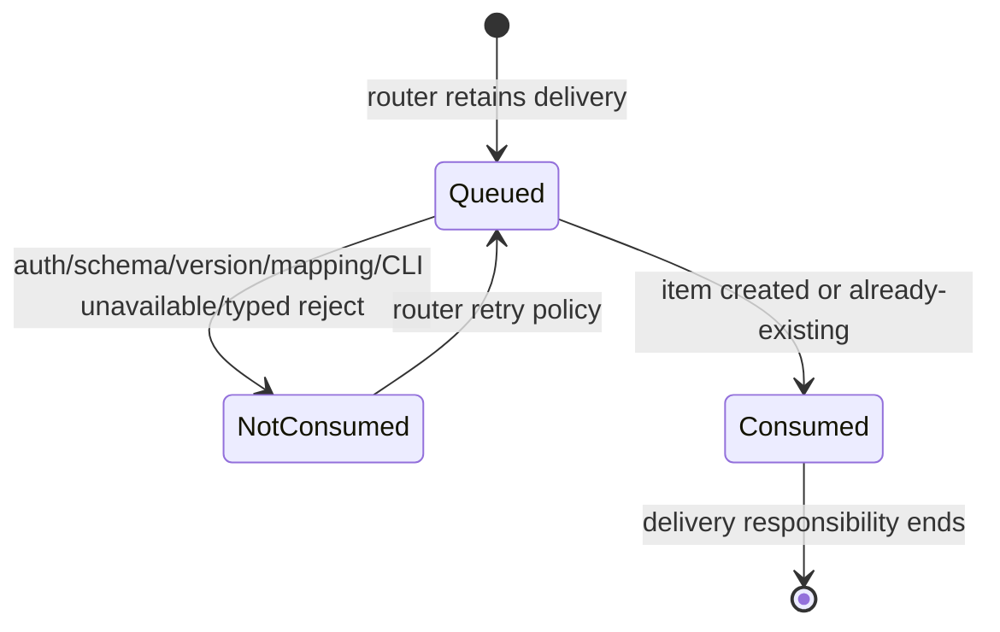

# RFC #548 R10 · GitHub router → 消费 daemon → coder-loop 需求侧推导

**推导范围：** `AGG-548.md` 的 T1–T6、`expected-foundation.md`、`operator-decisions.md` D1–D11，以及 R7-01/02/03/04 中与 schema、重放、请求审计和 PATH CLI 有关的摘要。  
**边界：** 本报告只从稳定语义推导需求归属；不把树外能力写成现状，不调查旧 issue、其他 repo 或实现，不选择 repo 内部结构，不估算规模，不重拆 issue。

# A. 主 agent 摘要

## 需求结论

GitHub 集成保持三段式外挂：router 终结 GitHub webhook/source 侧职责并保留可重推 delivery；本机消费 daemon 终结 NetBird/HMAC ingress、GitHub→coder-loop 映射、预校验、两步调用、delivery verdict 与决策日志；coder-loop 只提供 GitHub 无关的 schema、typed CLI、原子 mutation、规范 item identity 和 durable request record。消费 daemon 只调用 PATH 上的 `coder-loop` CLI，不 import 源码、不直连 socket、不直写 SQLite。

消费端必须能表达两类工作意图：

- `into-chain`：选择既有 chain，提交一个带 preset 与结构化 metadata 的 item；
- `new-workspace`：先幂等声明 chain，再提交 item。两步不组成跨命令事务；第一步成功、第二步未接管工作时留下的空 active chain 长期合法，不能据此推导 delivery verdict。

规范工作身份是 `(chain,itemId)`。`item.add` 的 `created` 或 `already-existing` 都证明该工作已被接管，因而 delivery 可判 `consumed`；daemon 不可达、schema/version/prevalidation 失败、typed reject、chain 第一步未能得到可用 chain，或第二步没有得到上述两种结论，都只能判 `not-consumed` 并给出结构化 blocker。不同 delivery 若稳定映射到相同 identity，仍是同一工作；消费端不得用 payload 对比发明第二套身份。

消费 daemon 在任何写调用前，从 PATH CLI 取得带 preset identity/version 的真正 JSON Schema，由该 artifact 派生请求类型并做预校验；schema version 不支持时 fail closed。该预校验不取代引擎 gate：修补后的地基仍须让所有可执行 item 的新持久态符合 engine-owned + preset-owned 合成 schema，并以独立 typed CLI result 无损返回 created/already-existing/rejected/no-op 等结论。

每个 delivery 的消费端日志必须记录 ingress identity、授权结论、规范映射、schema identity/version、实际 CLI 调用（不得含 prompt）、typed result、最终 `consumed | not-consumed` 与 blocker，并用稳定 engine request identity 关联引擎 durable request record。engine record 是 mutation/verdict 的事实，不替代 consumer delivery 账本；空 chain 也不替代 delivery 账本。

## 归属与未闭合边界

- **修补后预期地基提供：** GitHub 无关的 schema CLI、typed result、chain/item 原子命令、chain 幂等、item uniqueness、持久态 schema gate、durable engine request record。
- **消费 daemon 自建：** HMAC/授权、配置映射、schema 获取/缓存失效与派生类型、预校验、顺序编排、delivery 账本、verdict 转换、结构化 blocker、日志关联和恢复重试。
- **router 树外前置：** GitHub App/source 接入、delivery durable 队列和重推、目标投递 HMAC、per-target completion policy；coder-loop target 必须是 fire-and-forget。树外能力仅是需求，不能称已具备。
- **地基仍未闭合：** D1–D11 全部是“修补后预期保证”，尚缺运行证明；尤其 schema/version、CLI typed ADT、request record 与 mutation 的线性化/查询读面、并发 duplicate/crash、startup reconciliation 均未证明。T4/T5 还受 router 树外前置和真实 GitHub 全链路证明阻塞。

## T1–T6 验收指向

T1 要同时证明两分支且零 prompt；T2 要证明 schema/version/prevalidation 与引擎兜底同源；T3 要证明 delivery 重推和相同规范 identity 收敛；T4 要以真实 labeled issue 最终被 PR close 证明完成链，但 router 对该 target 不等待完成；T5 要证明 coder-loop 停机时 `not-consumed`、router 保留并重推、恢复后 `consumed`；T6 要以依赖面和写入通路证明外挂纯度。任何单段模拟、仅 CLI 成功、仅 engine event、空 chain 或最终 issue 状态都不能单独替代整链证据。

---

# B. 需求矩阵、接缝、未知与证据

## B1. 能力需求矩阵

| ID | 需求与可观察结论 | 修补后预期地基应供 | 消费 daemon 自建 | router 树外前置 | 未闭合 / 禁止误称 |
|---|---|---|---|---|---|
| G-01 | 接收一次规范化 GitHub delivery，并在执行业务映射前验证来源 | 无；engine 不认识 GitHub、HMAC 或网络主体 | NetBird ingress、HMAC 验证、重放所需 delivery identity、授权失败的结构化拒绝与日志 | 以双方约定方式签名并投递稳定 delivery identity；GitHub source 鉴权归 router | 仅有架构裁决，没有本报告范围内的树外运行证据；不得把“router 应做”写成“router 已做” |
| G-02 | 授权后把事件确定映射为 `into-chain` 或 `new-workspace` | 接受 GitHub 无关的 chain、preset、itemId、`extra` | label→preset、issue→itemId、chain 命名/选择、repo→checkout、分支选择；映射必须稳定且无碰撞 | 提供映射所需的规范事件字段 | 映射配置与具体事件 shape 尚未由本报告确认；禁止把 GitHub 字段带入 engine |
| G-03 | 获取目标 preset 的公共契约 | PATH CLI 输出带 preset identity/version、字段类型、required、unknown policy、可写性的真正 JSON Schema；schema document 不等于 compile projection instance | 调 CLI 获取 artifact，校验目标 preset identity，管理使用中的 schema/version | 无 | D1/D2/D8 尚无运行证明；现有 projection 不可冒充 schema |
| G-04 | schema version 不受支持时在任何写调用前显式失败 | 提供稳定且可检查的 artifact version | 支持版本集合与 fail-closed 分支；记录 expected/observed version blocker | 保留 delivery 供策略性重推或人工处置 | 当前没有真实跨仓 consumer/version mismatch 证据；不得降级为忽略未知版本 |
| G-05 | 从 schema 派生请求类型并预校验完整 payload | 合成 engine-owned + preset-owned 完整 schema；标明外部可写性 | 不维护平行手写 shape；在调用 chain/item 写面前检查 required、unknown、type 与 writable | 无 | consumer 的类型生成和真实预校验尚未运行证明；预校验不能替代引擎 gate |
| G-06 | `into-chain` 以一个 item 写请求接管工作 | `item.add` 原子 mutation；按当前 preset 合成 schema 校验；返回 typed result 与 request identity | 解析 typed result并形成 delivery verdict | 对 `not-consumed` 保留并重推 | 真实 CLI ADT、schema gate、request record 均为预期地基而非现状保证 |
| G-07 | `new-workspace` 的第一步幂等声明 chain | `chain.create` 对同声明返回可复用 chain，对冲突给 typed reject/request record | 先调用并核对返回 chain identity；冲突不得继续提交 item | 对失败 delivery 按策略重推 | chain 的具体等价字段不由需求侧另选；不能用“创建命令返回过”推导工作 consumed |
| G-08 | `new-workspace` 第二步独立提交 item | `item.add` 原子 mutation、规范 uniqueness 与 typed verdict | 仅在第一步得到可用 chain 后调用；将第二步结果作为工作是否接管的决定证据 | 同上 | 两步没有跨命令事务；禁止向 engine 添加 GitHub 专用组合命令 |
| G-09 | 第一成功、第二未接管时保持确定语义 | 空 active chain 长期合法；不自动补种/删除；不承载 delivery verdict | delivery 账本保持 `not-consumed`/待处置事实；后续重放重新执行既定两步；不以空 chain 推断成功或失败 | 保留并重推 delivery | crash/restart、重放和显式 operator delete 组合尚未运行证明 |
| G-10 | 同一 delivery 重推不产生第二项工作 | `(chain,itemId)` 唯一；already-existing 无损表达“规范工作已接管” | 稳定复算同一 identity；不比较 payload、不发明 operation identity | 重推必须保持原 delivery 的业务身份 | 并发 duplicate、crash 窗与 exactly-once 执行仍未证明 |
| G-11 | 不同 delivery 映射到同一 identity 时仍收敛为同一工作 | 同 G-10 | 将两者视为同一规范工作；日志分别保留 delivery identity并关联同一 item identity | 允许重投，不要求 engine 理解 delivery | 调用方承担映射无碰撞；若映射错误，engine 不提供 payload 意图裁决 |
| G-12 | CLI 成功/拒绝能被机器穷尽处理 | 独立、无损的 CLI typed result/rejection ADT；socket→CLI 穷尽转换；未知 variant fail closed | 穷尽匹配 variant，保留必要 details 和 request identity；禁止解析 `code: message` 文本 | 接收消费端结构化 verdict/blocker | 当前 PATH item CLI 会压平 details；修补前不能声称可安全机器消费 |
| G-13 | delivery `consumed` 判定忠实 | `created` / `already-existing` typed verdict 与对应 durable request record | 当且仅当目标 `(chain,itemId)` 得到 created 或 already-existing 时输出 consumed | consumed 后移出投递重试；完成不占 router 槽 | chain created、no-op、空 chain、仅 event、仅当前态查询都不是 consumed 证据 |
| G-14 | delivery `not-consumed` 与 blocker 可恢复 | 不可达/拒绝均给稳定机器结果；拒绝不得留下非法 item 新状态 | 将不可达、auth/schema/version/mapping/chain/item typed reject 分类成 blocker；不得把不确定结果升级成 consumed | 保留队列并依据目标策略重推 | 各 blocker 的 retryable/permanent 策略未在稳定语义中裁定，不能擅自固定 |
| G-15 | engine 每个请求 verdict durable 且可关联 | 稳定 request identity；created/already-existing/rejected/no-op record；与 mutation 的 durability/transaction 关系明确；提供查询读面 | delivery 日志保存 request identity，并在需要时与 engine record 互证 | 无 | D7 的 record schema、线性化点、crash 窗和读面均未闭合；best-effort events 不可代替 |
| G-16 | consumer 逐 delivery 决策可重建 | engine 仅提供 request 事实 | durable 记录 ingress/auth、映射、schema identity/version、CLI 参数、每步 request identity/result、最终 verdict/blocker；敏感认证材料不落日志 | durable delivery identity、排队/重推事实 | engine record 不含 router delivery 语义；consumer 不得把它当完整 delivery 账本 |
| G-17 | coder-loop 停机不丢事件 | CLI 不可达有可分类结果且零 mutation | 返回 `not-consumed` + blocker，不把本地调用失败当已接管 | 队列保留；恢复后重推同 delivery | router durable retry 与真实停机恢复是树外/整链待证能力 |
| G-18 | coder-loop 恢复后重推收敛 | chain/item 幂等与 durable typed verdict | 复用相同映射；得到 created/already-existing 后转 consumed | 收到 consumed 后停止该 delivery 的消费重推 | crash 点覆盖、重复日志和最终 exactly-once 执行仍未运行证明 |
| G-19 | fire-and-forget 与业务完成分离 | engine/preset 自己排队、执行并以 PR merge→issue close 完成业务 | consumed 后不轮询工作完成来占 router delivery；可保留关联日志 | coder-loop target 使用 per-target fire-and-forget；不得套用 detection-zone 单槽完成等待 | per-target completion model 是 router 树外交付前置，本文不能声称已落地 |
| G-20 | 真实业务终态仍可追溯 | engine/preset 负责执行与 GitHub 业务闭环，但不认识 ingress delivery | 仅以日志/request identity辅助关联，不成为 completion authority | GitHub issue/PR事件继续由其 source model处理 | T4 必须由真实 labeled issue→PR close 证明；CLI consumed 不能替代业务完成 |
| G-21 | 所有 engine 写入保持外挂纯度 | 只提供通用 PATH CLI/socket，不增加 GitHub HTTP/token/主体/字段 | 所有写入只 spawn PATH CLI；零源码 import、零 socket直连、零 SQLite直写、零自由 prompt | GitHub App与网络投递留树外 | GUI 网关不承载该创建面；任何“为了方便”直连都破坏 T6 |
| G-22 | 历史非法可执行 item 不污染新 ingress | startup reconciliation 标记不可启动并零调度；专用 operator 命令原子替换 preset+完整 `extra` | 普通 delivery 不调用修复面，不绕过不可启动状态；遇相关 reject记录 blocker | 无 | D9–D11 尚未运行证明；修复命令是 operator 面，不是 consumer 自动迁移工具 |

## B2. 关键接缝与顺序

### B2.1 正常 delivery

```mermaid
sequenceDiagram
    participant GH as GitHub
    participant R as Router
    participant C as 消费 daemon
    participant CLI as coder-loop PATH CLI
    participant E as coder-loop daemon

    GH->>R: issue event
    R->>C: signed normalized delivery
    C->>C: verify HMAC / authorize / map identity
    C->>CLI: request preset JSON Schema
    CLI->>E: generic schema read
    E-->>CLI: schema + identity + version
    CLI-->>C: typed schema result
    C->>C: version gate + derived-type prevalidation
    alt into-chain
        C->>CLI: item.add(chain,itemId,preset,extra)
        CLI->>E: generic item request
        E-->>CLI: typed verdict + request identity
    else new-workspace
        C->>CLI: chain.create(declaration)
        CLI->>E: generic chain request
        E-->>CLI: typed verdict + request identity
        C->>CLI: item.add(chain,itemId,preset,extra)
        CLI->>E: generic item request
        E-->>CLI: typed verdict + request identity
    end
    C->>C: durable delivery log links request identity
    C-->>R: consumed only for created/already-existing item
    R->>R: release delivery; no completion slot
    E-->>GH: preset workflow eventually closes issue via PR
```

顺序约束：

1. ingress 认证与授权先于 schema 读取及任何写入；
2. schema identity/version 检查和完整 payload 预校验先于 chain/item 写入；
3. `new-workspace` 中 chain 结论先于 item 请求，但只有 item 结论决定 consumed；
4. consumer 的 durable delivery verdict 必须保存实际 engine request identity；
5. consumed 只结束 router 的投递责任，不代表 GitHub 工作已完成。

### B2.2 停机、拒绝与重推



此状态机只描述 delivery。空 chain、engine best-effort event、schema 读取成功、chain.create 成功、item 当前可能存在但没有 typed/record 证据，均不能自行驱动 `Consumed`。

## B3. Typed result 与 verdict 转换需求

以下是需求侧必须区分的语义类别，不规定字段名或 wire shape：

| engine/CLI 结论类别 | consumer delivery 结论 | 必要处理 |
|---|---|---|
| item `created` | `consumed` | 记录 item identity、request identity、schema identity/version |
| item `already-existing` | `consumed` | 解释为同一规范工作已接管，不比较 payload |
| chain `created` / `already-existing` | 尚无 delivery 终局 | 继续第二步；记录第一步 request identity |
| chain conflict / rejected | `not-consumed` | 结构化 blocker；不得继续 item.add |
| item rejected | `not-consumed` | 保留 typed variant/details；零非法新持久态 |
| schema/version/prevalidation reject | `not-consumed` | 不执行写调用；记录 observed contract 与 blocker |
| daemon/CLI 不可达或结果无法解析 | `not-consumed` | fail closed；由 router 保留/重推 |
| request `no-op` | 不能默认 consumed | 只有其 typed 语义明确证明规范 item 已接管才可转 consumed；否则 not-consumed |
| 未知 CLI variant | `not-consumed` | fail closed并记录 contract mismatch |

这里不把所有 reject 都定义为永久或可重试：稳定语义只要求 verdict 忠实和 blocker 结构化；具体重推/隔离策略仍是 consumer/router 接缝中的开放契约。

## B4. Consumer 决策日志的最小语义

每个 delivery 的 durable 记录至少要能回答：

1. 哪个 router delivery 被哪个认证/授权结论接受或拒绝；
2. 它被映射成哪个分支、chain identity、规范 `(chain,itemId)`、preset identity；
3. 使用了哪个 schema identity/version，version gate 与预校验为何通过或失败；
4. 实际发出了哪些通用 CLI 操作及非敏感结构化参数，且不存在 prompt；
5. 每步得到哪个 typed result、engine request identity 和 blocker；
6. 为什么最终是 `consumed` 或 `not-consumed`；
7. 重推时是否复算出同一规范 identity，以及与先前 engine request record 的关系。

日志不得保存 HMAC secret/credential，不得把自由 prompt、GitHub token 或 engine 内部 socket envelope当公共契约。engine durable record负责请求与 mutation 的事实；consumer记录负责 delivery→请求→verdict 的业务决策，两者通过 request identity连接而不互相替代。

## B5. T1–T6 需求—证据对照

| 终态 | 必须建立的证据 | 不能替代它的窄证据 | 外部前置 / 地基缺口 |
|---|---|---|---|
| T1 两分支可达 | 合法 signed fixture 分别走 into-chain 与 new-workspace；前者既有 chain 增 item，后者新 chain + item；状态读面可见且 CLI 参数无 prompt | 只创建 chain；直接写 DB/socket；单元 mock | schema/CLI/mutation 地基待修补和运行证明 |
| T2 校验与持久态不变量 | 真实 schema CLI→consumer version/type派生→预校验；绕过预校验时 engine仍拒绝 missing/unknown/type/unwritable；零非法可执行持久态 | compile projection；producer 自测；仅 consumer validator | D1–D4/D8–D11 全部待运行证明 |
| T3 幂等 | 同 delivery 重推和不同 delivery映射同一 `(chain,itemId)` 都得到 created/already-existing 收敛；队列无第二 item且执行一次 | DB 唯一行而无 caller-visible verdict；空 chain；payload 相等 | D5–D7 并发/crash/record 待证明 |
| T4 GitHub E2E | 真实 labeled issue→router→consumer→engine→preset→PR merge→issue close；一次触发一次执行 | consumed response；CLI成功；人工关 issue | router GitHub App/source 与 per-target fire-and-forget 是树外前置 |
| T5 重试闭环 | coder-loop停机时 not-consumed+blocker；router保留；恢复重推后 consumed；delivery不丢 | consumer本地 retry但router已丢；仅恢复后手工重发新 delivery | router durable retry树外待证；CLI unavailable typed路径待证 |
| T6 外挂纯度 | consumer依赖/import/写通路仅 PATH CLI；engine无GitHub知识；映射仅在consumer；router网络职责树外 | “当前没看到 GitHub 字符串”的局部 grep | 必须对最终交付的两个代码面及真实调用路径共同核对 |

## B6. 开放问题与事实阻塞

1. **Router 合约未闭合：** 规范事件字段、签名 envelope、delivery queue/retry 细节、per-target completion 配置和 GitHub App source model 均是树外需求；本报告没有其他 repo 事实，不能写成已有。
2. **Consumer 的 retry 分类未裁：** 哪些 blocker 自动重推、延迟、隔离或需 operator 处置尚无稳定裁决；唯一固定的是不确定/未接管不得返回 consumed。
3. **CLI contract 未运行证明：** schema 命令、typed stdout/stderr/exit、未知 variant、request identity传递均是修补后预期能力。
4. **Engine request record 未闭合：** record schema、request identity生成、created/already-existing/rejected/no-op 与 mutation 的线性化点、crash恢复和查询读面尚无证据。
5. **两步 crash矩阵未证明：** chain commit前后、item commit前后、reply丢失、consumer/engine/router分别重启的收敛必须由运行证据确认；空 chain只提供明确非结论。
6. **Exactly-once 的量词：** uniqueness与already-existing能约束一个规范 item，但“一次触发恰好一次执行”仍要观察调度/run/业务终态，不能从一行 DB 推导。
7. **历史不可启动 item：** D9–D11的startup扫描、读面、operator修复和恢复调度是地基责任；consumer不得自动调用修复命令或猜值。
8. **GitHub完成回执：** 是否另发“已入队”回执及归属仍是 `AGG-548.md` Q2；它不改变 consumed/fire-and-forget/issue最终关闭语义。

## B7. 证据索引

| 证据 | 本报告使用方式 |
|---|---|
| `AGG-548.md` §1 V1–V4 | 外挂、结构化调用、HAPI/HTTP不进engine、以实现验证接口边界 |
| `AGG-548.md` §2.1 A–F | socket信任边界、GUI不承载创建面、chain两步、schema、router与consumer职责 |
| `AGG-548.md` §2.2–§2.3 | 两分支、三层校验/幂等、consumed与fire-and-forget |
| `AGG-548.md` T1–T6 | 本报告的验收量词与负面约束 |
| `AGG-548.md` §7 H5/H6、§8 Q1/Q2 | router前置、durable request record缺口、仍开放的repo/回执问题 |
| `expected-foundation.md` D1–D11、预期不变量、运行清单 | “修补后应供”与“仍未证明”的严格区分 |
| `operator-decisions.md` D1–D11 | schema、required、持久态、CLI ADT、规范identity、空chain、request record、合成schema、startup与修复的裁决 |
| `detail-r7-01-schema-validation.md` A | 现有 projection/字段校验/CLI错误不满足T2的事实摘要 |
| `detail-r7-02-replay-verdict.md` A | 两步独立持久、uniqueness与caller-visible verdict缺口 |
| `detail-r7-03-admission-audit.md` A | best-effort events不能承担delivery/request审计 |
| `detail-r7-04-external-cli.md` A | 树外CLI契约必须以真实PATH入口验证，不能从内部shape推断 |

## B8. 完成核对

- [x] 覆盖 T1–T6 及 T1–T5 的 router→consumer→coder-loop 调用、重放、完成与恢复链路。
- [x] 逐项区分“预期地基应供”“consumer自建”“router树外前置”“地基未闭合”，未把树外或预期能力称为已有。
- [x] 明确 delivery identity 与规范 `(chain,itemId)` 的不同职责；未增加 payload/operation identity。
- [x] 明确 schema获取/version mismatch、派生类型预校验、typed CLI result、两步调用、空chain、consumed/not-consumed 与 request record 关联。
- [x] 明确 HMAC/授权、router重推、fire-and-forget 与 GitHub最终完成的边界。
- [x] 保持engine外挂纯度；未选择repo实现细节、未估规模、未实现、未重拆issue。
- [x] 本报告唯一写入 `demand-github-consumer.md`。
