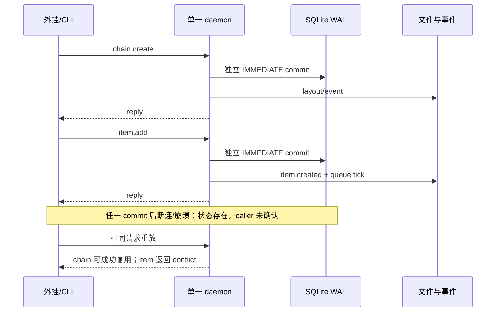

# RFC #548 R7-02 — `new-workspace` 两步写入、重放与 caller-visible verdict

固定基线：`main@699842eba2eefc242d19f8fa9232bc1d9d5c3bdd`。唯一设计锚点为 AGG-548 §2.1 C、§2.2、T1/T3/T5、P-746-3/4。本报告不调查审计写入失败的根因；相关现象只登记给 R7-03。

## A. 主 agent 摘要

### 问题

核实 `new-workspace = chain.create → item.add` 的全部生产路径，在串行重放、同一 daemon 并发、字段冲突、调用方断连和 commit 后崩溃窗口中，durable state、socket/CLI verdict 与恢复/删除消费者实际如何表现；区分 delivery 幂等、engine uniqueness 与消费端 verdict。

### 结论与置信边界

**高置信结论：两步均可达且各自持久，但没有跨步事务；engine 已提供 chain 的“同声明串行/同一 daemon 并发复用”和 item 的 `(chain,itemId)` 至多一行，却没有提供能让 PATH CLI 忠实实现 P-746-3/4 的 caller-visible verdict。R8 已具备材料。**

1. **此前“同一 daemon 的 concurrent chain lookup/insert 会产生败者 sqlite error”不符合实然。** socket 连接可并发，但 `chain.create` 从最终 lookup 到 SQLite insert 没有 `await`；Bun 单线程事件循环不能在这段同步区间切换 handler。隔离 daemon 上 20 个同名同字段 CLI 同时调用，20 个均 exit 0、均返回 chain id 1、DB 仅一行。DB 的 `UNIQUE(name)`仍是跨连接/异常拓扑的最后约束，但多个 daemon 共用 DB 不是本任务的生产形态。
2. chain 的复用等价不是完整对象等价：固定比较 `preset/repository/baseBranch/status`，请求 metadata 只要求其每个键在 existing 中存在且同值；existing 多余 metadata 不冲突。冲突在 socket 是 `conflict + details.conflicts[]`，PATH CLI 只剩 exit 1 和扁平 `code: message`。
3. item uniqueness 是 `(chain_id,item_id)`；首次插入事务提交后，任何 duplicate（即便 repo/preset/extra 与既存行不同）都统一是 socket `conflict`，details 只给 chain/item identity 和 existing row id，不比较 payload。PATH CLI 同样丢 details。故“已经由同一 delivery 接管”与“另一请求占用了同一 itemId”在 CLI verdict 上不可区分。
4. 两个 handler 都在 DB commit 后才做文件/event，再写 socket reply。调用方主动断开后，隔离实验仍观察到 chain/item 已持久；相同 item 重放为 exit 1 conflict。进程在 commit 后、reply 前崩溃具有同一外部不确定性。WAL/IMMEDIATE 保住单次 DB mutation，不会把“是否收到确认”纳入事务。
5. 部分状态是正式可见状态：第一步成功、第二步在校验前/插入前失败时会留下 active 空 chain；没有自动补偿、operation/delivery record 或 startup replay。相同两步重放可补 item；operator 也可 `chain.delete`，删除流程会处理 active run/worktree/runtime layout 并把 chain 标为 deleted。消费者不能从空 chain 单独断言事件已 consumed。
6. item 成功 reply 在 `queueSchedulerTick()`之后立即返回，但 scheduler 是异步消费者；入队成功与执行完成分离。item/list/status/scheduler/startup recovery、chain delete 是 durable row 的消费者，不会恢复一个尚未发生的第二步调用。

**置信边界：** 生产调用链、同步临界段、SQL/事务、CLI投影、部分状态和断连结果为高置信。未用产品插桩制造每一个指令级 kill point；commit→event→reply 的精确次序由源码确定，断连实验验证 caller 不确认而 durable state 可见。审计文件不可写的根因与逐事件证明力留给 R7-03。

### 复杂因果



### 当前 / 未来 / 证明缺口

- **当前影响：** 两步正常路径能建立 chain 并入队；断连后 caller 不能只凭 PATH CLI 区分“已在队”和真实冲突，因而不能忠实产生 `consumed | not-consumed + blocker`。
- **未来影响：** delivery 去重仍属于树外 router/消费 daemon；engine uniqueness 只回答“最多一行”，不回答 duplicate 是否属于本 delivery。任何消费端 verdict 都必须面对 item payload 不比较、CLI details 丢失和空 chain 部分状态。
- **纯证明缺口：** 指令级 SIGKILL 各窗口的重复采样、WAL 文件物理时序及 audit 不可写不改变上述确定性边界；若未来要宣称完整故障矩阵已 runtime 证明，需测试 seam/故障注入。R7-03 单独审计事件。

### 可保留资产与未知

- 可保留：CLI→单行 JSON→Unix socket；socket `DaemonResponse` ADT；chain 字段冲突明细；同步 lookup/insert 临界段；SQLite `UNIQUE`、WAL、busy timeout、IMMEDIATE transaction；item duplicate 的 race 后 re-read；独立 `chain.delete` 清理和 startup durable-state recovery。
- 未知（不自行裁决）：稳定外部 CLI 是否暴露 JSON error ADT；duplicate item 是否需要 payload fingerprint/operation identity；空 chain 是保留待重放还是由消费端清理。三者是事实支持的不同触点，不是本报告新增需求。
- **R8：具备材料。** 需要裁决的是 caller-visible duplicate/verdict 与部分状态归属；不需要再以“同一 daemon chain race”作为裁决前提。

## B. 证据附录

### B1. 设计对照与三层边界

| 稳定条款 | 实然 | 判定 |
|---|---|---|
| §2.1 C：两步调用，不加组合命令 | CLI 分别发 `chain.create`、`item.add`，各自 handler/transaction/reply | 可达；非原子 |
| C：chain.create 同字段幂等 | 串行复用；单 daemon 20 并发也全部复用。等价为固定标量 + 请求 metadata 子集 | 符合该生产拓扑；“同字段”需按实然定义 |
| C：item.add 唯一拒绝使重放安全 | DB 至多一行；duplicate 是失败 conflict，且不比较其余字段 | 存储唯一成立；caller verdict 不足 |
| P-746-3：任意前缀失败重放收敛 | `∅`、仅 chain、chain+item 三种 durable prefix 均可重放到一行 item；但 item replay CLI exit 1 | 状态可收敛，规定的 consumed verdict 不成立 |
| P-746-4：consumed iff 入队或已在队 | socket 可确认 existing identity；CLI丢 details，且同 identity 不证明同 payload/delivery | 当前 PATH CLI 不足 |
| T1 | 正常两步可建立 chain/item，item 被 scheduler读取 | 运输地基成立 |
| T3 | delivery 去重树外；engine 只有 name/itemId uniqueness | 必须分层，不能以 UNIQUE 代替 delivery 幂等 |
| T5 | daemon 不可达为连接失败；commit 后失联也表现为无确认，重放 item 为 conflict | 消费端缺忠实分类材料 |

### B2. 全部生产入口、旁路与消费者

**稳定生产入口**

1. CLI `chain create` 组装 `name/repository/baseBranch/metadata.bindings/preset/force`，调用 socket：`src/loop.ts:2185-2219`。
2. CLI `item add` 组装 chain、itemId、repo、preset及可选字段，调用 socket：`src/loop.ts:2260-2284`。
3. CLI统一 transport解析 socket response，但失败只执行 `fail(code + message)`：`src/loop.ts:2487-2504`。
4. daemon 对每条连接串行读帧，不同连接的 handler promise可交错：`src/daemon.ts:1660-1697`；wire response ADT保留 `error.details`：`:4978-5002`。
5. dispatch 后生产 mutation只有 daemon 调 store。`item.batchAdd`是另一生产写入口，但不把 chain.create 纳入同一事务，不能替代本裁决的两步语义。

**非稳定旁路**

- `sendDaemonRequest` 是 repo内部/测试 socket helper（`src/daemon.ts:4652-4688`）；AGG要求树外消费者只用 PATH CLI。
- integration/scheduler scripts直调 store是 fixture，不是外部生产入口。
- 未发现产品内第三条 new-workspace 写路径、组合命令或自动补偿器。

**durable state 消费者**

- `chain.list/status`、`item.list`读取当前行；scheduler读取 pending item并可能立即创建 run/worktree。
- startup recovery只对已经存在的 chain/item/run恢复或对账，不合成缺失的第二步。
- `chain.delete`是 operator cleanup入口；DB外键对 items/runs等为 cascade（`src/sqlite-state.ts:537-560,608-624`），daemon还负责停止 run、worktree/runtime layout清理。socket重复 delete已有 typed `alreadyDeleted`测试（`tests/integration/daemon/chain-crud.integration.ts:411-428`）。
- 因此空 active chain既可被后续 replay补齐，也可由 operator删除；没有自动 TTL/rollback 消费者。

### B3. chain equality、冲突与并发

`handleChainCreate`先完成输入/preset/baseBranch校验，再同步：

1. `getChainByName(name)`；
2. 不存在则 `store.createChain(input)`；
3. 存在且未 deleted则 `chainCreateConflicts`；
4. 无冲突复用 existing；
5. 随后才首次 `await ensureChainRuntimeLayout`。

证据：`src/daemon.ts:2166-2229`。决定性 lookup→insert/compare 区间没有 `await`，所以单个 Bun daemon 中不同 socket handler不能在其间切换。隔离实验证实 20 并发请求全部成功。

相等规则位于 `src/daemon.ts:5552-5580`：

- 精确比较：`preset`（undefined按 null）、`repository`、`baseBranch`、`status`；
- metadata：只遍历 request keys；existing 多余键允许，request新键或不同值形成冲突；
- JSON对象递归按键/值比较，数组按位置比较（`:5595`起）。

字段冲突的 socket code 是 `conflict`，details 为 `{chainName, conflicts:[{field,existing,requested,...}]}`；CLI仅打印 message。deleted chain另为 `chain_deleted`，`force=true`会 delete旧行再create新行，这不是普通重放。

数据库仍有 `chains.name TEXT NOT NULL UNIQUE`（`src/sqlite-state.ts:608-617`）。store写由 `transaction(...).immediate()`包裹（`:1595-1612`），SQLite设置 `foreign_keys=ON,busy_timeout=5000,journal_mode=WAL`（`:825-850`）。这保护DB，但不把 handler外查询、文件或reply纳入事务。

### B4. item duplicate、字段冲突与并发

`handleItemAdd`在 lookup前有 preset/rights/input构建的 awaits，但最终 `getItemById → createItem`之间无 await（`src/daemon.ts:2887-2918`）。SQLite `UNIQUE(chain_id,item_id)`是最终约束（`src/sqlite-state.ts:537-560`）；insert和position计算在一个 IMMEDIATE事务内（`:2184-2227`）。若异常后发现 identity 已存在，`translateCreateItemFailure`归一为 duplicate conflict（`src/daemon.ts:3089-3097`）。

duplicate error details 只有 `chainId,chainName,itemId,existingItemId`（`:5586-5592`），**不比较** repoCwd、preset/presetPath、title、priority、extra等。因此：

| 重放输入 | DB终态 | socket | PATH CLI |
|---|---|---|---|
| 同 itemId、同 payload | 一行 | `conflict` + identity details | exit 1，扁平 conflict |
| 同 itemId、不同 payload | 仍是原一行 | 与上同形 | 与上同形 |
| 不同 itemId | 新行（若其余校验通过） | success | exit 0 |

这不是要求 engine 比较payload；它是消费端把 duplicate解释为 consumed 时必须知道的确定事实。

### B5. transaction、锁和 crash windows

每个 store write各自是 IMMEDIATE transaction；chain与item之间无共享transaction、operation id或delivery row。

| 窗口 | durable state | caller观察 | 相同两步重放 |
|---|---|---|---|
| chain校验/insert前失败 | 无 | error/断连 | 从头创建 |
| chain commit后、layout/event/reply前 | 仅chain（layout可能部分） | 未确认 | 同声明复用并补layout；冲突声明报 conflict |
| chain reply后、item校验/insert前 | 空active chain | chain成功、item失败/未调用 | chain复用；修正请求后item可创建 |
| item commit后、event/tick/reply前 | chain+一行item | 未确认 | item duplicate conflict |
| item reply后 | chain+item；scheduler可异步消费 | success | duplicate conflict |

`chain.create`的 commit后顺序为 DB→runtime layout→`chain.layout`→reply（`src/daemon.ts:2193-2229`）；`item.add`为 DB→`item.created`→queue tick→reply（`:2912-2937`）；socket实际写 reply在`:1695-1698`。caller断开不取消正在运行的 handler（close只从 sockets set删除，`:1687-1692`）。

进程 SIGKILL 时，SQLite只保证已提交事务由WAL恢复；未提交事务回滚。它不保存“caller是否看见reply”。没有 inbox/outbox，故 commit后未确认是不可消除的外部事实，不应与“DB可能出现半行”混淆。

### B6. 隔离实验

所有实验使用 `/tmp/rfc548-r7-02-*` 独立 loop-data，启动的均是本 checkout `bun src/loop.ts daemon up --loop-data-root ...`，未触碰中央 socket/DB；结束后 daemon停止、目录已清理。

#### 实验 1：正常、duplicate 与 CLI投影

核心命令：

```sh
bun src/loop.ts chain create r702-basic \
  --loop-data-root "$D" --config-json '{"repository":"owner/repo"}' --json
bun src/loop.ts item add r702-basic --issue x1 \
  --repo-cwd "$REPO" --preset single-phase-example \
  --loop-data-root "$D" --json
# 相同 item add 再执行一次
```

观察：首次 chain/item均 exit 0；duplicate exit 1，stdout空，stderr仅
`conflict: item with id x1 already exists in chain r702-basic`。`item list`仅一行。scheduler在 ack后异步开始 run，进一步证明“入队”不等于执行完成。

#### 实验 2：同一 daemon 并发同名 chain

20个独立 CLI进程同时执行同名同配置 `chain create`。观察：

- exit code：20 × `0`；
- stdout：20份均 `id: 1`；
- stderr：全部空；
- `chain list`：该name恰好一行。

该结果与无-await临界段一致，推翻 ledger先前将静态“不同连接可并发”直接外推为lookup/insert TOCTOU的说法。

#### 实验 3：write后立即断连

使用 `node:net`连接隔离 socket，写完整 newline-delimited `chain.create`/`item.add`请求，在write callback立即 `destroy()`，不读取reply；随后通过新CLI连接查询。

观察：断连后chain可见；断连后item可见且仅一行；相同item CLI重放 exit 1 conflict。此实验不声称命中了每个指令级kill point，只证明“caller无reply”不能推出“mutation未提交”。

#### 审计交叉观察（仅登记）

正常首次item有 `item.created`，duplicate只有 rights admission、没有第二个created；chain replay会再次走layout event。事件是否可写、吞错机制与能否证明 consumed 归 R7-03，本报告不作根因结论。

### B7. 现有测试与同错

- chain CRUD覆盖串行同字段复用/字段冲突、输入校验、delete idempotency；未覆盖多CLI并发、断连或kill。
- item CRUD覆盖socket duplicate至多一行、严格top-level字段和“ack不等待scheduler副作用”；测试主要使用socket helper，因而能看到比PATH CLI更丰富的结构。
- 没有测试要求 PATH CLI 对错误输出JSON ADT；`--json`只影响成功输出，错误仍由统一 `fail()`扁平化。
- 既有测试把“socket duplicate conflict正确”当作API正确，但未验证消费端所需的 `consumed`分类；这是测试与实现共同低于P-746-3/4的同错。
- ledger的chain并发 sqlite-error判断是静态推断同错：测试缺并发，审计也未注意决定性区间无await；本次实验证伪。

### B8. 事实支持的形态与确定触点（不推荐、不裁决）

| 事实支持的形态 | 必须触碰的具体边界 | 确定后果 |
|---|---|---|
| 消费端以自身delivery记录先去重，engine仅作identity兜底 | 树外consumer/router persistence与verdict ADT；现有两条CLI | 可绑定delivery；仍需决定commit后CLI conflict如何对账 |
| PATH CLI暴露结构化daemon error/details | `requestDaemonResult`、CLI error serializer/exit contract及CLI integration测试 | consumer可区分code/details；仍不能从现有item details判断payload同一 |
| engine duplicate success/typed already-existing variant | item handler response ADT、CLI formatter、socket/CLI测试 | 重放可exit 0/consumed；若不增加identity证据，碰撞仍与同delivery相同 |
| duplicate带请求/既存payload差异或稳定operation identity | item persistence/lookup、duplicate details、迁移与调用方请求 | 可区分相同意图和identity碰撞；这超出当前engine uniqueness事实，是否需要须裁决 |
| 部分chain由consumer保留重放或显式删除 | consumer recovery policy；若删除则调用现有`chain.delete` | 保留利于补第二步；删除会移除该chain durable资源，且必须避开其他合法消费者 |

### B9. 证据索引与限制

- 稳定锚点：`AGG-548.md:33-57,86-123`。
- CLI：`src/loop.ts:2185-2219,2260-2284,2487-2504`。
- socket/wire：`src/daemon.ts:1660-1697,4652-4688,4978-5018`。
- chain：`src/daemon.ts:2166-2229,5552-5580`；`src/sqlite-state.ts:608-617,1683-1703`。
- item：`src/daemon.ts:2887-2937,3089-3097,5586-5592`；`src/sqlite-state.ts:537-560,2184-2227`。
- DB配置/事务：`src/sqlite-state.ts:825-850,1595-1612`。
- tests：`tests/integration/daemon/chain-crud.integration.ts`、`item-crud.integration.ts`。
- 限制：没有改产品代码插入kill seam；没有启动第二个daemon共享DB（非生产拓扑）；没有调查audit不可写根因；没有测试真实树外consumer（尚不在本repo）。
