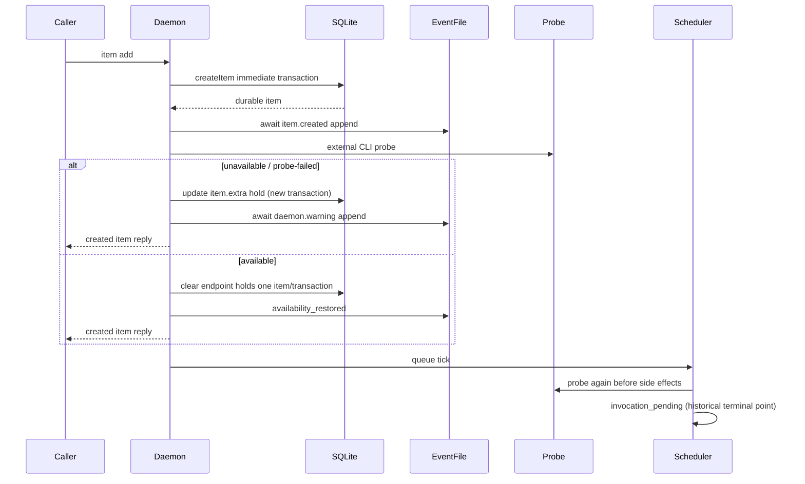

# R7-05 — availability 缺席、创建后 hold 与恢复时序

## A. 主 agent 摘要（≤1页）

### 范围与结论

本调查固定在 `main@699842eba2eefc242d19f8fa9232bc1d9d5c3bdd`，历史候选 `8e9642c` 只读；只回答 §2.1 I / T7 / STD-602-2 的 availability→hold→restoration 时序，不进入真实 completion 或 loss ordering（R7-06/07）。

**高置信结论：当前 main 没有这套 availability/hold 生产机制；能运行验证的只是历史候选配合 fake `probe` 的机制。** 历史正常路径是：

1. item 先在一个 SQLite immediate transaction 内创建；
2. `item.created` 文件事件成功 await 后，才执行真实进程 probe；
3. 缺席时在另一个 item update transaction 写 `item.extra.externalTerminalHold`；
4. 再以异步事件回调写 typed warning；
5. scheduler 返回空 run，继续扫描同 repo 的后续候选；
6. 后续 tick 或 daemon restart 的首个 tick 重新 probe；available 时逐 item、逐 transaction 清同 endpoint hold，再写一次 restoration event；
7. 随后 capability gate 截止在 `runner.invocation_pending`，没有真实 spawn。

因此历史候选确实证明了“item 已创建后 durable hold、preset status 不变、零 worktree/run/attempt/backoff、held candidate 让位、同原因 warning 去重、恢复清 hold”的**合成机制**，但没有证明稳定 T7 的“恢复后真实执行”。R7-04 又证明当前真实 `hapi-open-session` 没有无副作用 probe，故本次不能把 fake probe 结果提升为当前 external CLI 契约，也不能安全运行真实 availability 翻转。

### 时序窗口与后果

- **create→event→probe→hold 非原子。** create commit 后 crash 会留下可调度但无 hold 的 durable item；event append 失败会阻止本次 post-persistence probe；probe 成功返回到 hold update 前 crash 同样留下无 hold item。daemon restart 会启动 scheduler tick并重新 probe，但没有专门的“补 hold intent”记录。
- **hold→warning 非原子。** hold 已 durable 后、warning 写入前 crash，restart 的同原因 scan 会把该 hold视为已警告而抑制 warning；因此可能永久有 hold 而无 warning。并发 scan-then-write也没有 DB uniqueness，理论上可重复 warning。
- **restoration 非原子且顺序偏离稳定目标。** 所有 endpoint hold 先逐条清除，之后才 emit restoration，再进入 invocation capability；任一步 crash都可能形成“部分 hold 已清”“hold 全清但无 restoration”或“restoration 可见但未 invoke”。历史终点固定为 pending。
- **瞬时 spawn failure 不属于 availability。** availability gate 位于 worktree/run/attempt/credential前；只有 gate 判缺席才 hold。gate 通过之后的普通 child spawn/preparation failure走既有 `spawn_failed`/backoff，不会转写 availability hold。
- **公平性是 repo 内候选扫描性质。** held/pending candidate返回 null后被从本 tick候选集移除，后续同 repo runnable item可运行；hold本身不改 status或 dependency语义。

### 可进入后续阶段的事实

可保留为事实输入：typed hold shape、pre-side-effect gate、repo内让位、status `queue.holds[]` 投影、transition-oriented warning/restoration vocabulary和 focused tests。不可保留为真实合约：字面 `probe`、exit 69分类、endpoint identity、真实恢复执行，以及 crash-safe warning/restoration保证。R7-06仍须先取得真实无副作用 probe与可完成 invocation；本报告不选择 hold 存储或恢复策略。

---

## B. 证据附录

### B1. 事实基线与可运行性

| 对象 | 事实 |
|---|---|
| current main | `git grep` 在 `699842e` 的 `src/tests/scripts` 中找不到 `externalTerminalHold`、`runner.availability_restored`、`external_terminal_unavailable`；当前没有生产者 |
| 历史候选 | 下列 `path:line` 均为 `8e9642c` |
| 真实 CLI | R7-04 证明 `hapi-open-session` 0.1.0 无 probe 子命令；字面 `probe` 是 path且可能创建 session（`detail-r7-04-external-cli.md:60-64,68-96`） |
| 本次运行 | 从 `git archive 8e9642c` 解包到 `/tmp/rfc548-r7-05-run-*`，`bun test ./tests/integration/scheduler/external-terminal.integration.ts`：19 pass、0 fail、133 assertions、5.08s |
| 运行边界 | tests使用可控 fake binary；证明历史内部机制，不证明真实 endpoint/CLI。未运行会创建 remote session的调用 |

### B2. 创建、缺席与恢复的实际顺序



依据：

- single add顺序为 `store.createItem` → await `item.created` → await post-persistence refresh → queue tick → reply（`src/daemon.ts:2890-2914`）；batch同样先一次 create transaction，再逐事件、再 refresh（`daemon.ts:2951-2975`）。
- `createItem` / `createItems`各自包在 `db.transaction(...).immediate()`；后续 update不在该 transaction（`src/sqlite-state.ts:1527-1534,1631-1635`）。
- refresh先真实 probe；缺席后单独 update hold，再决定并 await warning；available则先跨全库逐 item clear，再 emit restoration（`src/scheduler.ts:1308-1355,1384-1394`）。
- scheduler gate先于 worktree、run row、current row和attempt update（`scheduler.ts:1088-1098,1109-1174`）。

### B3. 状态机与可见形态

```mermaid
stateDiagram-v2
    [*] --> CreatedNoHold: create transaction commits
    CreatedNoHold --> Held: probe unavailable / failed; hold update commits
    Held --> Held: same kind+reason probe; checkedAt refresh, warning suppressed
    Held --> Held: reason changes; hold epoch changes, warning eligible
    Held --> Cleared: available; endpoint-wide clear
    Cleared --> InvocationPending: restoration emitted; historical capability gate
    CreatedNoHold --> InvocationPending: available on first probe
```

Durable hold是 `item.extra.externalTerminalHold`，包含 runner、phase、binary、固定 `["probe"]`、typed availability、`checkedAt/since`（`src/runtime-data.ts:161-169,550-563,759-814`）。它不改 item status。`status --json` 将所有 item hold投影到 `queue.holds[]`（`src/loop.ts:3448-3458`）；warning/restoration/pending转成 operator event（`src/daemon.ts:827-877`）。

同原因判定只比较 runner/phase/binary、availability kind/reason；相同原因保留 `since`，仍重写 `checkedAt`。endpoint级去重scan比较 runner+binary+kind+reason，不含 phase/argv/endpoint profile（`scheduler.ts:1280-1293,1330-1345`）。恢复清理只按 runner+binary匹配，包含 stopped chain（`scheduler.ts:1384-1394`; test `tests/integration/scheduler/external-terminal.integration.ts:112-140`）。

### B4. queue、公平性与副作用边界

当 spawn函数因 hold或pending返回 null，scheduler删除该 candidate并继续同 repo候选；若既无 hold也无pending则停止该 repo扫描（`src/scheduler.ts:610-633`）。运行测试验证：同 repo held HAPI item attempts保持0，后续 local item产生唯一 run（`tests/integration/scheduler/external-terminal.integration.ts:304-327`）。

缺席 gate前无 worktree/run/current/attempt：代码顺序见 B2；历史脚本还断言无 agent cwd、backoff、run artifact和runner process（`scripts/external-terminal-integration.ts:400-449`）。但 available后普通 spawn仍可能失败；该 failure进入 `containSchedulerPreparationFailure` 的 `spawn_failed`路径，而不是 availability ADT（`scheduler.ts:1275-1276,1397-1409,1503`）。这区分了“probe缺席”与“probe通过后的瞬时spawn failure”，但真实 CLI因R7-04缺口未验证该边界。

### B5. daemon restart、事务、锁与 crash 矩阵

daemon startup在恢复既有 scheduler state后启动周期tick并立即排一个tick（`src/daemon.ts:1250-1269,3644-3675`）。hold已在 item JSON中时会随SQLite重开保留；首个tick会重新probe，没有独立availability intent/recovery log。

| crash点 | durable SQLite | event可见性 | restart首个动作 / 后果 |
|---|---|---|---|
| create commit后、`item.created`前 | item，无hold | created缺失 | scheduler重新probe；此前“立即hold”不成立 |
| created后、probe前 | item，无hold | created存在 | scheduler重新probe |
| probe返回后、hold update前 | item，无hold | 无warning | scheduler重新probe；probe结果不持久化 |
| hold commit后、warning前 | item有hold | warning缺失 | 同原因scan见已有hold，可能永久抑制warning |
| warning后 | item有hold | 一条warning | 同原因重复probe不再发warning |
| 多 item clear中途 | endpoint部分item无hold | 无restoration | 下次available probe清余项，随后可能发restoration |
| 全部clear后、restoration前 | 无hold | 无restoration | 下次available没有hold可清，因而不补发restoration |
| restoration后、capability前 | 无hold | restoration存在 | restart后直接probe available；不会重放旧restoration |
| capability后 | 无hold | pending存在 | 无run；每tick可再次产生pending诊断 |

这些窗口由独立 immediate transactions与await顺序直接推出；本次19-test套件没有kill-point daemon实验，不能把表中后果称为运行验证。SQLite写入自身串行化，但“scan是否已有hold→update→event”不是单一DB transaction，也没有warning uniqueness约束。

### B6. warning/restoration与消费者

| 入口/消费者 | 消费事实 | 局限 |
|---|---|---|
| scheduler candidate gate | probe结果写/清hold并返回boolean | probe和mutation非事务 |
| daemon create/update refresh | item持久化后主动probe | event失败可阻断probe；reply在refresh之后 |
| periodic/startup scheduler | 重probe durable候选 | 无专门crash intent恢复 |
| event adapter / logs | unavailable→`daemon.warning`; available→restoration | event文件与SQLite非原子 |
| status builder | `queue.holds[]`; active run另有current投影 | history不在status，只在logs |
| repo scheduler | hold/pending让位给后续候选 | 只证明repo内扫描，不改变dependency/status |

历史测试证明：重复同状态warning为1、恢复event为1、再缺席成为新warning epoch（`tests/integration/scheduler/external-terminal.integration.ts:67-106,112-140`）；真实daemon脚本证明missing/69/other/signal/deadline的fake分类与零副作用，但以pending为成功终点（`scripts/external-terminal-integration.ts:378-449,503-526`）。19-test运行通过不修正这一共同错误。

### B7. migration与持久化边界

hold没有独立表或migration；它经 typed JSON codec存入通用 `items.extra`（`runtime-data.ts:340-342,482-484,638-661,935-947`）。历史schema只把 `hapi` 加入 item/session runner CHECK与parser（`src/sqlite-state.ts:511,539,688,859-864,2025`）。因此：

- DB transaction能保证一次 item JSON update原子，不能保证create/probe/hold/event整体原子；
- restart可读取已提交hold，但不能知道未提交的probe结果、应发未发的warning或已清未报的restoration；
- current main已无这些producer，历史DB资产不能被描述为当前可运行能力。

### B8. 历史测试的“同错”与事实触点

| 事实形态 | 已证明 | 未证明 / 同错 |
|---|---|---|
| hold durability/status投影 | fake probe下已证明 | 真实CLI无安全probe |
| pre-side-effect gate | 已证明 | probe通过后的真实invocation |
| fairness | 同 repo后续local item可运行 | 跨endpoint全局公平策略 |
| dedup/restoration | 正常顺序下已证明 | crash-safe exactly-once |
| daemon restart | startup会tick；hold可读取 | 各kill point未运行验证 |
| recovery终点 | hold清除 | 测试明确期待`invocation_pending`和zero spawn |

形态触点仅用于后续调查定位，不是推荐：item extra codec、post-persistence refresh、scheduler pre-side-effect gate、endpoint scan/clear、event adapter、status projection、startup tick、SQLite transaction wrapper。任何未来形态仍须以R7-04最终真实CLI契约复核。

### B9. Ledger / 索引回指

| Ledger | 本报告闭合事实 |
|---|---|
| `S2-D05` | item先commit，随后event/probe/hold；确认create→hold窗口 |
| `S2-D08` | 恢复清hold但终点为pending，非真实执行 |
| `S2-R06` | probe、hold、warning、clear、event分属不同事务/IO |
| `S2-R07` | 列出create→hold、hold→warning、clear→restoration/pending窗口 |
| `S2-T02` | unit/integration明确把pending作为expected |
| `S2-T03` | scheduler integration以pending释放slot为PASS |

索引边界见 `investigation-index.md:67-77`；稳定目标见 `AGG-548.md:172-176,194-198,225`；R7-04前置结论见 `detail-r7-04-external-cli.md:7-17,89-117`。
