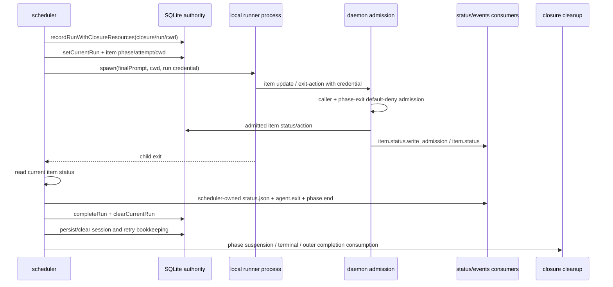

# R7-06 · 同构 completion/retry、status admission 与真实 remote E2E

基线：`main@699842eba2eefc242d19f8fa9232bc1d9d5c3bdd`  
历史只读候选：`8e9642c`  
设计锚点：`AGG-548.md` T7、STD-602-1/7  
Ledger：`S2-D10 S2-D13 S2-D16 S2-T04 S2-T06 S2-U02`

## A. 主 agent 摘要（≤1页）

### 问题与结论

R7-06 要证明的不是“有 HAPI 相关类型或测试”，而是同一个真实 invocation 从 daemon 选择 runner 开始，经完整 prompt、current closure 的 cwd/run/session、真实远端 turn、业务终态准入，到 success/failure/retry/resume、status/events 和 closure terminal/cleanup 的闭环。

**结论（高置信静态事实，真实外部事实仍不可判定）：当前没有可执行的真实 remote E2E，因此 R7-06 不能宣称成立，也不能供 R8 固化 external-terminal 接入形态。**

1. **current main 完全没有 `hapi` runner 可达面。** runner ADT、输入 boundary、`closure_sessions` CHECK 都只有 `claude|codex|opencode`。它有一条已运行的 local-process 通用管线：以 current closure 创建/reopen worktree，记录 run/active-run，传完整 prompt/cwd/credential，接收凭据约束的 status/exit 写入，按 child exit 做 run completion、retry/backoff、session resume、phase/terminal/closure cleanup；但这只能作为 external-terminal 应对接的基准，不能证明 remote 同构。
2. **历史 `8e9642c` 也到不了真实 invocation。** 它把 HAPI 明确建模成 `probe-only / invocation-pending`；probe available 后仍在 worktree/run/attempt/credential/session/artifact/process 之前返回。仓库级脚本把 “restoration → invocation-pending → zero-hapi-spawn” 写成 PASS。历史测试中的 active HAPI run/loss、terminal/retry 场景通过 fake binary 和 `modelControlledExternalTerminalRun` 人工越过不可达 gate，不能证明 daemon→真实 CLI/HAPI→status admission。
3. **R7-04 已证明当前真实 CLI 合约不匹配且所需 binary 缺失。** `hapi-remote-session` 不在 PATH/本机；现有 `hapi-open-session` 只创建 session、发 prompt 后 exit 0，没有无副作用 probe、headless terminal wait/status、resume/session-id 输入。把它代入会把“消息已发送”误当业务完成，并可能让 probe 创建真实 session。因此本调查遵守副作用边界，没有伪造 invocation 实验。
4. **R7-09 已提供正确的观察坐标。** 真实实验必须使用 current `(closure_id, run_id, runtime_node_id, worktree_path, closure_sessions)` authority；历史 `(chain,repo)` slot worktree/item-session owner 不可恢复为第二事实源。

### 复杂因果、影响与 R8 判断

当前 local completion 的业务 status 不是从 runner stdout 或任意 `status.json` 自动解析：agent 在 active credential 下调用 daemon mutation/phase-exit 面，daemon按 phase exits default-deny并写 `item.status.write_admission`；scheduler 随后读取 item status，写自己的 run `status.json`、完成 run/current-run，并推进 retry/phase/terminal。也就是说，**current `status.json` 是 scheduler 生成的运行读面，不是已存在的 external CLI→daemon admission 输入。** 稳定 T7 所说的 headless `status.json` 如何携带 subject/run/phase、何时被原子准入、如何与 child exit 排序，仍缺真实外部合约；不能用 local 管线的存在填空。

- **当前影响：** `S2-D10/D13/D16/U02` 仍是未成立；`S2-T04` 的 zero-spawn 同错已被确认；`S2-T06` 的真实 machine/CLI/status admission/closure/session/retry 盲区仍在。
- **未来影响：** 在 runner binary/headless 合约出现前，无法静态判定 remote success/failure 的机器可读边界、远端 session identity 的产生时点、retry 是 fresh 还是 resume、remote terminal 与 local child exit 的关系，亦无法证明 terminal 后 closure cleanup。
- **可保留资产：** current closure/run/cwd/session/credential/admission/completion/consumption authority；历史 external-terminal ADT 与 probe/invocation 分离、fake process termination测试思路。历史 invocation-pending、zero-spawn验收、slot owner、`parseSessionId(...hapi) => null` 不是可接受合约。
- **R8 可用性：否。** R8 可使用“current authority 与 local基准已确定”“历史候选不可达”“外部合约缺失”这三项事实，但不能据此选定 remote invocation/status/resume 形态。阻塞条件是：定位/交付确切生产 runner binary及版本，并先确认无副作用 probe、headless terminal/status、session identity/resume与清理合约；随后按本报告协议跑成功和一次可判定失败/重试的隔离真实 E2E。
- **无需操作员裁决语义方案；需继续事实调查/外部合约补齐。** 现状不是多个已证实可行语义之间的分叉，而是唯一要求的真实路径尚不可执行。

置信边界：current/historical生产调用链、schema、测试同错为高置信静态事实；真实 HAPI remote turn、status wire、retry/resume、清理结果未执行，明确不可判定。本报告不进入 loss-first/terminal-first ordering（R7-07）。

---

## B. 证据附录

### B1. 设计对照与 Ledger 闭合

| Ledger | 必须证明 | 当前事实 | 判定 |
|---|---|---|---|
| `S2-D10` | HAPI completion/retry 与 local attempt/result 同构 | current仅有local管线；历史HAPI在invocation前返回 | 未成立 |
| `S2-D13` | 同一identity的真实 status/events/holds | current status/admission可观测；历史只造 synthetic hold/current | 对真实HAPI未成立 |
| `S2-D16` | 隔离daemon真实远端完成 | 无匹配binary/headless合约；从未执行 | 缺失 |
| `S2-T04` | 验收不能以zero spawn冒充完成 | 历史脚本逐字以`zero-hapi-spawn`为PASS | 测试同错确认 |
| `S2-T06` | machine/CLI/admission/closure/session/retry覆盖 | fake/stub与人工model run均未跨真实边界 | 盲区确认 |
| `S2-U02` | 真实remote lifecycle | 外部合约缺失，按边界未创建session | 仍不可判定 |

设计要求来自 `AGG-548.md:151-231,252-291`：T7要求真实 item、真实 HAPI session、退出码/业务 status、per-closure cwd/session、completion/retry/resume、operator读面同构；STD-602-1要求 repository-owned driver 在隔离 daemon/loop-data 上走到真实 status admission；STD-602-7要求保存每个 checkpoint 的 status/logs。R7-06只覆盖正常完成和一次可判定失败/重试，不把结果外推为 R7-07 的 loss ordering。

### B2. current main 的真实 local-process 基准调用链



关键事实：

1. **closure/run/cwd 建立。** `src/scheduler.ts:1565-1638` 从 `(item,phase)` 找 current closure，first-open/reopen同一 closure worktree，并以 `recordRunWithClosureResources` 原子记录 run + closure资源；`1640-1656` 写 active current-run与 item attempt/phase/cwd。
2. **prompt/cwd/credential。** `src/scheduler.ts:1658-1706` 渲染完整 prompt + exits epilogue，mint绑定 `{chainId,itemId,runId,phase}` 的 credential，以 closure worktree为`cwd` spawn；`src/scheduler.ts:3128-3200` 把 runId、agentCwd、resume/session等写入 runtime bindings。
3. **status admission。** `src/daemon.ts:3806-3931` 对 caller status执行 preset vocabulary + active phase exits default-deny，并为 allow/deny都写 `item.status.write_admission`；`src/daemon.ts:4027-4095` 用 active run credential约束 caller与item identity。phase chain-action另走 typed exit面（`src/daemon.ts:3326-3385`），不是伪 status 字符串。
4. **child exit与业务 status是两条输入。** `src/scheduler.ts:1992-2034` child close时读取 DB中 current item status；`2035-2088` 先写 scheduler-owned completion artifact，再 complete run/clear current-run，并发 `agent.exit/phase.end`。stdout只用于session id/rate-limit分类，不直接推进业务 status（`1939-1949,2089-2145`）。
5. **retry/failure。** 非零 child exit且 item尚未 terminal时，`src/scheduler.ts:2089-2115,2918-2950` 保留业务 status并设置 scheduler backoff；rate-limit另走 cooldown且回滚 attempt。若 agent成功写 terminal，即使 child非零，terminal status仍不走普通backoff。
6. **resume/session。** spawn前从 closure session查 runner-specific session（`src/scheduler.ts:1588-1590`）；close后 session-invalid则删除，否则解析到ID后持久化（`2130-2145`）。current schema和类型只允许三种local runner（`src/task-runtime.ts:14,72-84,113-124`; `src/sqlite-state.ts:739-744,1830-1846`）。
7. **phase/terminal/cleanup消费者。** `src/scheduler.ts:1777-1795,2146-2164` 以 admitted item status + child exit决定离开phase、suspend closure、发 `queue.terminal`、尝试完成chain；`src/scheduler.ts:2723-2749`（R7-09索引）再按outer-completion authority消费不可达closure。active run与reachable closure阻止提前消费（`src/sqlite-state.ts:2117-2153`）。

这些事实回答“同构应对齐什么”，不回答远端 runner 是否真的能做到。

### B3. current `status.json` 的事实形态

`src/scheduler.ts:3260-3286,3289-3378` 显示 scheduler在 run初始化和 child close时写 `runs/<runId>/status.json`；字段包括 run/chain/row/item/phase/pid/cwd/timestamps/exitCode/当前item status/输出路径与events路径。写入发生在 scheduler一侧：

- active时先写 `status=running`；
- close时把当时 DB item status与 child exit code写回；
- 随后才完成 run record并清 current-run。

因此它当前是**运行投影/读面 artifact**，不是一个被 watcher/parser消费的 agent业务结果文件。真实 external CLI如果要以 headless `status.json` 作为业务结果事实源，至少必须定义：

- 谁写哪个路径、文件ownership与原子提交方式；
- schema如何携带 `runId/phase/closure/session`；
- daemon如何以 active credential等价证据准入，而不是匿名改 DB；
- malformed/partial/stale/wrong-run/late artifact的typed拒绝；
- artifact terminal、CLI同步 exit、远端 turn terminal三者的时间关系。

这些均不能从 current scheduler artifact反推。

### B4. 历史候选的可达性核查

历史 `8e9642c` 的生产事实：

- `src/runner-execution.ts:4-29` 定义 `external-terminal`，但 HAPI capability固定为 `{kind:"probe-only", outcome:"invocation-pending"}`。
- `src/runner-execution.ts:79-128` 仅真实 spawn `<binary> probe`，并解码0/69/other/signal/deadline；它没有真实业务 invocation。
- `src/loop.ts:5354-5358` 默认假定不存在的 `hapi-remote-session`；`6962-7015` 对 HAPI返回 invocation-pending，native argv分支直接throw；`7262-7268` 对HAPI session parser固定返回null。
- `src/scheduler.ts@8e9642c:1091-1108` 先probe再执行 invocation capability gate；gate不通过就不会创建worktree/run/attempt。`1195-1229` 虽保留统一 spawn形状，但HAPI生产路径无法到达。
- `scripts/external-terminal-integration.ts@8e9642c:428-449,526` 恢复后断言 attempts/run/cwd/session/process仍为零，最终打印 `PASS ... invocation-pending zero-hapi-spawn`。

历史测试中看似 active external-terminal lifecycle 的场景不是反证。`tests/integration/scheduler/external-terminal.integration.ts@8e9642c:361-737` 先用 ordinary scheduler fixture/fake binary制造或取得 run，再调用 `modelControlledExternalTerminalRun` 把它人工解释为external run；terminal write也直接通过 fixture store。它能测试内部 latch/cleanup算法形状，但没有执行真实 HAPI CLI、远端 turn、credential admission或 session parser。`330-353` 的“restoration”测试反而明确期待恢复后 `spawnedRuns=[]` 与无spawn文件。

### B5. 外部 CLI 阻塞与不可判定事实

R7-04已在同一基线建立以下真实机器事实：

| 项目 | 已知 | 对R7-06的后果 |
|---|---|---|
| 生产候选binary | `hapi-remote-session` 不存在 | 无法执行稳定T7假定argv |
| 已安装CLI | `hapi-open-session` 0.1.0 | 只能作为待确认资产，不是等价runner |
| probe | 无字面probe；位置参数会变成path并进入认证/创建 | 不可安全拿创建命令做availability probe |
| completion | create + wait active + send prompt后exit 0 | exit 0只证明已发送，不证明remote terminal |
| status | 无headless status-file参数或status更新 | 无法接current admission |
| resume | 无session-id/resume输入 | 无法测试同一closure retry/resume |
| cleanup | 本调查未创建真实session | side-effect清理路径仍未知 |

所以以下事实保持不可判定，而不是“失败”或“已证明不可能”：

1. 远端 session id 的wire形状与产生时点；
2. 完整 prompt与existing closure cwd在服务端是否保持一一对应；
3. remote turn terminal success/failure如何机器可读；
4. failure后同一 closure是resume同一session还是fresh，session invalid如何表达；
5. CLI同步退出与业务 terminal admission是否存在可靠 happens-before；
6. remote terminal后 session/远端资源的清理责任与可观察终态。

### B6. success/failure/retry、exit与terminal的接缝矩阵

| 接缝 | current local静态事实 | historical HAPI | 真实remote结论 |
|---|---|---|---|
| invocation identity | closure + immutable runId + phase + credential | gate前无run；fake test可造run | 未执行 |
| cwd | current per-closure worktree |历史生产使用slot owner；但不可达invocation | 必须以current closure cwd验证 |
| prompt | rendered full prompt + exits epilogue | builder无HAPI argv | 未执行 |
| session | `(closure,runner)`持久化；stdout parser | HAPI parser恒null | 未知 |
| business status | daemon credential + phase-exit admission | synthetic/direct-store测试 | 无remote wire |
| process exit | run ledger的exitCode；非terminal failure触发backoff |真实CLI未spawn | remote exit含义未知 |
| retry | nonterminal item重选；session存在则resume | invocation-pending不增加attempt | 未知 |
| terminal | admitted item terminal驱动phase/queue/chain | direct fixture store | 未执行 |
| cleanup | current reachability/consumption intent/namespace | historical slot cleanup冲突 | 必须观察current authority |
| status/events | admission + item + agent.exit + phase.end + queue.terminal | synthetic hold/warning | 无同identity真实trace |

### B7. 测试覆盖、同错与盲区

**可保留的 current coverage：**

- `tests/integration/daemon/item-crud.integration.ts:1049-1117` 覆盖 phase status admission allow/deny/no-phase审计。
- `tests/integration/daemon/runs-observability.integration.ts:86-108,764+` 覆盖 local agent status/exit事件及无terminal status后的重调度。
- `tests/integration/scheduler/session-resume.integration.ts:100-199,350+` 覆盖local runner session选择、retry/resume和非零exit。
- `scripts/issue-560-integration.ts:471,477,580` 在隔离local流程证明closure cwd/branch/session在retry/restart复用；它不是remote E2E。
- `scripts/engine-integration.ts:354-383` 证明stub runner能经daemon socket产生 admission；项目文档已明确该脚本不是real E2E。

**同错/盲区：**

- 历史 repository driver把 zero HAPI spawn当PASS（`S2-T04`）。
- fake probe/runner能证明child-process机制，不能证明真实binary schema。
- direct `store.updateItem(status)` 绕过 caller/status admission，不能充当remote status proof。
- local runner的stdout session parser、credential env和prompt epilogue不能自动证明外部CLI会透传这些能力。
- stub/zero-spawn、单纯typecheck/unit/integration green均不满足STD-602-1。
- 本报告没有也不应测试 R7-07 的 terminal/loss ordering。

### B8. 可复现真实实验协议（待外部合约存在后执行）

这是一份 driver/证据要求，不是产品实现。实验不得把secret写入日志；凭据从本机既有配置/IaC路径解析。环境固定为 target SHA、确切 CLI binary+version、真实 HAPI machine、隔离 daemon、隔离 loop-data与隔离fixture repo。禁止中央daemon、生产DB和现有session。

#### 前置 contract gate

1. 记录 `git rev-parse HEAD`、CLI绝对路径、包/commit版本、help/schema摘要。
2. 用明确无副作用的真实 `probe` 证明它不创建session/worktree/run/artifact；若没有probe，停止，不拿create代替。
3. 确认 invocation能接收：完整prompt、existing cwd、run/status位置、resume decision/session id、必要授权；确认同步退出语义。
4. 确认 machine-readable terminal artifact/schema及原子写规则；确认如何进入daemon admission并绑定 active run。
5. 确认创建session后的清理命令/API归属，teardown可验证且幂等。

#### 场景 S（真实成功）

1. 初始化fixture repo与最小preset；创建隔离daemon/DB/events根。
2. 创建一个runner=hapi item，保存创建后的item/closure树。
3. 等待真实CLI process spawn与远端session active；记录同一个 `closure_id/run_id/phase/cwd/session_id`。
4. 远端agent在cwd写一个唯一fixture marker，并用声明的headless机制提交允许的terminal status。
5. 等待daemon admission、child exit、run completion、phase/item terminal与closure consumption/cleanup。
6. 核对 marker、Git cwd/branch、SQLite、status.json、events/logs、remote session terminal和cleanup，全部关联同一identity。

#### 场景 F→R（一次可判定失败与重试）

1. 用runner/远端业务可机器识别的非terminal failure触发第一次run；不得用missing binary/probe unavailable代替业务失败。
2. 保存第一次 `run_id`、exit/status、attempt、closure/cwd/session、backoff或明确retry状态。
3. 等待scheduler自动重试，不人工改item；第二次必须是新run但同一closure/cwd。
4. 依外部合约预期核对是resume同一session还是fresh；若resume，证明argv/wire接收第一次session id；若session-invalid，证明typed invalidation后fresh。
5. 第二次真实完成并重复S场景terminal/cleanup核对。

#### 每个checkpoint必须保存

- `coder-loop status <target> --json` 与按run/phase过滤的 `logs --json`；
- SQLite只读快照：items、runs、active_runs、task_closures、closure_sessions、consumption intents；
- runner argv（secret redaction）、cwd、env变量名集合、pid/exit/signal；
- CLI stdout/stderr与headless artifact每次原子版本；
- remote session id、turn id/状态时间线及最终清理证据；
- fixture marker/Git branch/worktree状态；
- admission、agent.exit、phase.end、queue.terminal、closure lifecycle/consumption events。

#### Driver断言

- 不允许以 session created/message sent/CLI exit 0 单独判PASS。
- 不允许以 stub、fake、direct SQLite status或zero-spawn判PASS。
- prompt哈希、cwd realpath、closure/run/session identity必须端到端一致。
- terminal status必须有allow admission事件，wrong-run/stale credential不能写入。
- failure run和retry run必须为不同runId；closure/cwd保持current authority一致。
- consumed后 local worktree/branch/session列与remote资源均达到已声明终态；cleanup失败必须显式FAIL并保留证据。

建议driver输出一个不含secret的JSON evidence manifest，键至少为：

```json
{
  "baseline": {},
  "runnerContract": {},
  "success": {"identity": {}, "checkpoints": [], "terminal": {}, "cleanup": {}},
  "failureRetry": {"firstRun": {}, "retryRun": {}, "terminal": {}, "cleanup": {}},
  "artifacts": []
}
```

该形状仅约束证据完整性，不裁决产品wire schema。

### B9. 事实形态触点（不是实现拆分）

- runner领域/解析：`src/loop.ts:402,885`；历史 `src/runner-execution.ts@8e9642c`
- current closure/session schema：`src/task-runtime.ts:14-84`、`src/sqlite-state.ts:677-760,1830-1846`
- spawn/prompt/cwd/run/credential：`src/scheduler.ts:1565-1739,3128-3200`
- status/exit/attempt/retry/session：`src/scheduler.ts:1920-2180,2918-2950`
- status artifact：`src/scheduler.ts:3260-3378`
- caller/status/exit admission：`src/daemon.ts:3300-3385,3806-3931,4027-4095`
- terminal/closure consumer：`src/scheduler.ts:1777-1795,2146-2164,2683-2749`
- operator读面与events：`src/daemon.ts:738-1111,2440+`
- 外部合约：R7-04所核 `hapi-open-session` CLI；当前无匹配runner binary

### B10. 证据索引与核对

| ID | 证据 | 支持结论 |
|---|---|---|
| E01 | `AGG-548.md:151-291` | T7、R4、STD-602-1/7真实闭环 |
| E02 | `investigation-index.md:79-91,159,176,197` | R7-06范围、依赖、Ledger |
| E03 | `supply-findings-ledger.md:85,88,91,108,110,112` | 六项ledger现状 |
| E04 | `detail-r7-04-external-cli.md` A摘要、B7-B9 | binary/headless/resume契约缺失 |
| E05 | `detail-r7-09-closure-authority.md` A摘要、B8 | current authority与历史owner冲突 |
| E06 | `src/scheduler.ts:1565-2180,2918-2950,3128-3378` | local invocation/completion/retry/status形态 |
| E07 | `src/daemon.ts:3300-3385,3806-3931,4027-4095` | exit/status/caller admission |
| E08 | `src/sqlite-state.ts:677-760,1830-1846,1915-1950,2117-2153` | closure/run/session/consumption authority |
| E09 | `8e9642c:src/runner-execution.ts:4-128`; `src/loop.ts:5354-5358,6962-7015,7262-7268` | 历史HAPI不可invocation/session |
| E10 | `8e9642c:scripts/external-terminal-integration.ts:428-449,526` | zero-spawn PASS同错 |
| E11 | `8e9642c:tests/integration/scheduler/external-terminal.integration.ts:330-353,361-737` | fake/model-controlled测试盲区 |
| E12 | `scripts/issue-560-integration.ts:471,477,580`; `scripts/engine-integration.ts:354-383` | 可保留local authority/admission证据但非remote E2E |

## 报告核对

- [x] A摘要不超过一页量级，明确R8不可用、阻塞条件、置信边界与无需裁决。
- [x] B附录包含调用链/接缝、`path:line`、status/exit/retry/resume/terminal/cleanup消费者。
- [x] 逐项闭合 `S2-D10 D13 D16 T04 T06 U02`。
- [x] 区分静态确定事实与因外部CLI/headless合约缺失不可判定事实。
- [x] 给出成功 + 一次可判定失败/重试的可复现实验协议与证据manifest要求。
- [x] 未把stub、fake、direct-store、zero-spawn当真实验证。
- [x] 未进入loss ordering R7-07，未创建真实remote session。
- [x] 仅写本报告；未修改产品、测试、配置、DB、WORKFLOW，未创建worktree/issue/PR，未实现或重拆。
